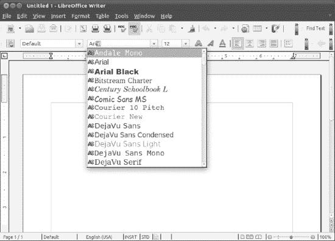
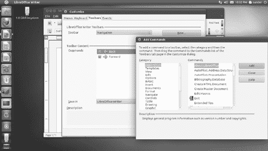
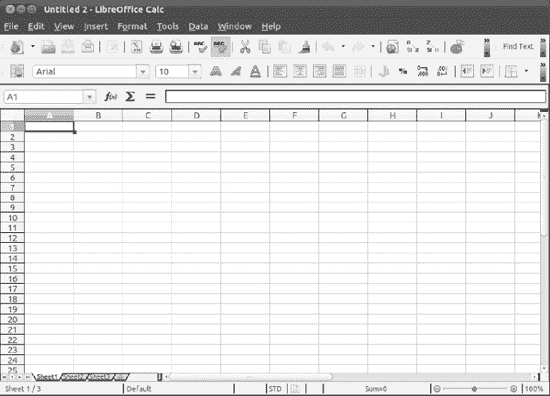

# 十三、向 LibraryOffice 迁移

你可能愿意相信你可以免费得到一个完整的操作系统。你甚至可以接受它提供了 Windows 所做的一切，甚至更多。但许多人的一个绊脚石是，他们认为与微软 Office 兼容的办公套件是零成本套装的一部分。太过分了。办公成本高达数百美元——他们希望我们相信有免费的竞争产品吗？

嗯，有，它叫 LibraryOffice。它是一个套件，这意味着它是许多应用程序的捆绑包，其中大多数预装了 Ubuntu，以及大多数其他 Linux 发行版。这使得它成为 Linux 办公套件的首选。它还与大多数微软 Office 文件兼容，甚至与 Office 以前的“经典”版本(即 Office 2007 之前的版本)看起来相似，工作方式类似，易于学习。你还想要什么？

### 图书馆简介

LibreOffice 是之前与 Ubuntu 捆绑在一起的 OpenOffice.org 生产力套件的一个更名版本。

OpenOffice.org 最初是一个名为 StarOffice 的专有产品，由一家名为 StarDivision 的德国公司开发。Sun Microsystems(现在是 Oracle 的一部分)随后购买了 StarDivision 并发布了 StarOffice 的源代码，以鼓励社区开发。这导致了 OpenOffice.org 项目的产生，这是开源开发者和 Oracle / Sun 之间的合作成果。这个项目已经发布了 OpenOffice.org 的几个新版本。但在 2010 年 9 月 28 日，项目结构的重大变化被宣布:一个新的独立基金会“文档基金会”成立，以赞助开发工作，从一家公司获得独立。甲骨文受邀成为该基金会成员，并捐赠 OpenOffice.org 品牌；与此同时，图书馆这个名字被用来加强自由和开放的理念。

 **注**虽然 Sun 开放了 StarOffice 的源代码，但它继续出售它，以及一些有用的附加功能，如字体、模板和技术支持。甲骨文收购 Sun 后，StarOffice 更名为甲骨文开放办公室(Oracle Open Office)。在天真的旁观者看来，甲骨文似乎在向 OpenOffice.org 收费。但事实并非如此，也不可能如此，因为 OpenOffice.org 是一个开源应用程序，也是一个受 GPL 许可的社区项目。甲骨文可以打包它并对额外的功能收费，但核心软件将保持免费。2011 年 4 月 14 日，甲骨文宣布 Open Office 将成为一个纯粹基于社区的开源项目，并且不再提供 Open Office 的商业版本。

LibreOffice 具有文字处理器、电子表格程序、演示包、绘图工具(矢量图形)、网站创建工具、数据库程序和其他一些功能。因此，在核心功能方面，它几乎完全可以与微软 Office 相媲美。核心包的比较见[表 13-1](#tab_13_1) 。

您应该会发现软件包中的功能也是重复的，尽管 Microsoft Office 的一些非常具体的功能在 LibreOffice 中没有。但是 LibreOffice 也有自己的一系列此类工具，这些工具在微软 Office 中还找不到！

 **提示【LibreOffice 提供的一个非常有用的功能是输出高质量的 PDF 文件。**

LibreOffice 确实有一些明显的遗漏。或许最主要的一点是，它没有提供直接可比的 Outlook 替代品。然而，正如我们在第 14 章中所讨论的，Evolution 应用程序提供了一个功能强大的 Outlook 的复制品，将电子邮件、联系人管理和日历功能都集中在一个位置。 Evolution 并不直接与 LibreOffice 关联(尽管有可能与 LibreOffice 应用程序共享一些 Evolution 联系人数据)，但它保留了 Ubuntu 的整体外观、感觉和操作方式。

### LibraryOffice 的主要功能

LibreOffice 的主要特性包括在整个程序套件中以可移植文档格式(PDF)导出文档的能力。然后可以在任何装有 PDF 显示软件的计算机上阅读 PDF 文件，如 Adobe Acrobat Reader。

此外，LibreOffice 具有强大的辅助功能，例如，可以帮助视力障碍者更有效地使用程序。对于那些有技术头脑的人来说，LibreOffice 可以很容易地用各种插件(见`[http://www.libreoffice.org/features/extensions/](http://www.libreoffice.org/features/extensions/)`)进行扩展，这些插件允许使用许多不同的编程语言轻松创建插件。

虽然 LibreOffice 在很大程度上反映了 2007 版之前的 Microsoft Office 版本的外观和感觉(即 Office 2007 中主要界面革新之前的 Office 版本)，但它在各处添加了自己的特色。例如，这可能意味着一些功能位于不同的菜单上。然而，这些都不会对大多数用户构成挑战，LibreOffice 通常被认为很容易学习。

### 文件兼容性

除了提供核心功能兼容性，LibreOffice 还能够从 Microsoft Office 读取文件。在最近的版本中，已经做出了很大的努力来添加对 Office 2007 和 2010 格式以及密码保护文件(即，`.docx`、`.xlsx`和`.pptx`文件，文档基金会将其称为 Microsoft Open XML 或 MOX)的兼容性。有了 LibreOffice，你甚至可以用 MOX 格式保存你的文件；尽管如此，您应该总是测试您的文件，因为有时结果并不完美。然而，改进一直在进行，这只是你应该经常更新 Ubuntu 以确保你拥有最新版本的 LibreOffice 软件的又一个原因。

虽然对于大多数简单到中等复杂的文档来说，文件兼容性问题很少出现，但是在 LibreOffice 中打开 Microsoft Office 文件时，偶尔会出现两个问题:

> VBA 兼容性 : LibreOffice 部分支持 Microsoft Office Visual Basic for Applications(VBA)宏，尽管还在努力加强这方面的功能。LibreOffice 使用类似但不兼容的内部编程语言。例如，这种宏通常用在用于计算时间表的 Excel 电子表格中。不幸的是，除非您在 LibreOffice 中尝试一下，否则您不会知道您的 VBA 宏是否有效，尽管无论如何这些宏都将保留在文档中(假设您继续以原始的 Microsoft Office 格式保存，而不是例如以 LibreOffice 文件格式保存文档)。

 **注意**如果兼容 VBA 宏对你来说是个障碍，而你还没有安装 Ubuntu，你可以在 OpenOffice.org 的 Windows 版本中尝试包含 VBA 宏的文档。这将使你能够提前看到它们的效果。可以从`[http://www.libreoffice.org/download/](http://www.libreoffice.org/download/)`下载 Windows 版本。

> *文档格式化*:当你创作出精美的文档和漂亮的演示文稿时，你最不希望的事情就是当你把文件从一台电脑转移到另一台电脑时丢失所有的工作成果。可悲的是，当文件在 Microsoft Office 和 LibreOffice 之间共享时，这往往是现实。虽然可以打开文件，但某些格式可能会丢失，从而降低了所需的视觉效果。有时问题是由于缺少字体，我们将在本章的后面讨论这个问题。在其他情况下，当你想发布你自己的作品时，你可以把它导出为 PDF 文件，如下所示。此外，您应该始终测试演示文稿的完全兼容性，而不要假设它们在不同的程序中看起来完全相同。打开文件只是工作的一半！

如果您发现 LibreOffice 无法打开同事保存的 Office 文件，您可以建议他们也切换到 LibreOffice。他们不需要运行 Ubuntu 就能做到。这些版本可以在所有 Windows 平台以及 Mac 上运行，并且从`[http://www.libreoffice.org/download/](http://www.libreoffice.org/download/)`开始提供。

 **注意**OpenOffice.org 还有另一个分支可供 Mac 使用:NeoOffice，已经被适配为在 Mac OS X 内原生运行，详情见`[www.neooffice.org](http://www.neooffice.org)`。

与 Ubuntu 版本一样，适用于其他操作系统的 LibreOffice 版本完全免费。事实上，对于许多运行从“借来的”光盘上安装的 Office 版本的人来说，LibreOffice 提供了一种全盘托出、避免盗版软件的方法。欲了解更多详情并下载 LibreOffice，请访问`[www.libreoffice.org](http://www.libreoffice.org)`。

在您的同事完成切换后，您可以使用 LibreOffice 的原生格式交换文件，或者选择以 Microsoft Office 文件格式(`.doc`、`.xls`、`.ppt`等)保存文件。).[图 13-1](#fig_13_1) 显示了 LibreOffice 的文字处理器组件的另存为对话框中可用的文件类型选项。

 **注** LibreOffice 还支持 RTF 文本文档和 CSV 数据文件，几乎所有的 Office 套件程序都支持这两种格式。

说到共享文件，还有另一个选择:以非办公格式保存文件，如 PDF 或 HTML。LibreOffice 能够导出两种格式的文档，大多数装有 Adobe Acrobat 或简单网络浏览器的现代电脑都能够阅读这些文档。然而，尽管 LibreOffice 可以打开和编辑 HTML 文件，但它只能将文档导出为 PDF 文件，因此这种格式最好保留给不打算进一步编辑的文件。

***图 13-1。**所有的 LibreOffice 组件都兼容微软 Office 文件格式。*

**打开文档格式**

所有开源软件背后的一个原则是开放文件格式的思想。这意味着，如果有人创建了一个新的开源文字处理器，该人也要确保解释文件格式背后的技术，以便其他人可以修改他们的程序，以该文件格式读取或保存。

为了满足开源软件的目标，OASIS OpenDocument 格式(ODF)被创建，并在 LibreOffice 中使用。这是一种完全开放且免费使用的 office 文档文件格式，所有软件套件都可以采用。这个想法是，ODF 将使所有办公套件之间的文件交换变得容易。

虽然早期版本的 OpenOffice.org 依赖于 ODF 1.1，但在 2008 年 10 月，OpenOffice.org 3.0 采用 ODF 1.2 作为其默认文件格式。ODF 1.2 最近已经标准化。

最近微软对 ODF 文件的支持有所改变。传统上，微软在其生产力套件中不支持 ODF 文件格式，所以 Sun Microsystems 开发了一个插件，使你能够用微软 Office 打开 ODF 文件。随着 Microsoft Office 2007 Service Pack 2(SP2)的发布，这种情况发生了变化，1.1 版获得了支持。但是由于 OpenOffice.org 3.2 的默认文件格式是 ODF 1.2，你在微软办公软件中打开 OpenOffice.org 制作的文档可能会有问题。现在 ODF 1.2 已经标准化了，微软也在最新版本的办公套件中增加了对它的支持。

### 合适的字体

与大多数 Microsoft Office 文件兼容的一个关键是确保您有正确的字体。即使使用 Windows，这也是一个问题。打开 Office 文档并发现格式不正确是很常见的，因为您没有构建文档时使用的字体。

虽然大多数 Windows 系统有许多字体，但大多数人倾向于依赖少数几种核心字体，这些字体是大多数 Windows 安装的默认字体:Arial、Tahoma、Verdana、Trebuchet MS 和 Times New Roman。(MS Comic Sans 也可能包括在该列表中，尽管它不经常在商业文档中使用。)

你可以通过几种方式获得这些字体并安装到你的 Ubuntu 系统上。这里我们介绍两种方法:从 Windows 中复制你的字体和安装微软的 TrueType 核心字体。后一种方法是完成这项任务最简单的方法。

 **提示**除了安装微软字体，你还可以安装解放字体。这些是开源字体，设计为与 Arial、Times New Roman 和 Courier 在度量上完全相同。换句话说，至少在理论上，前述微软字体之一中的字母 *A* 应该与匹配的解放字体中的字母 *A* 占据相同的空间(因此在屏幕上和打印时显示相同)。你可以通过安装`ttf-liberation`包来安装解放字体。要了解软件包安装，参见第 20 章[。](20.html#ch20)

#### 复制 Windows 字体

如果你用 Windows 双启动 Ubuntu，你可以深入到你的 Windows 分区的字体文件夹中，复制你在 Windows 下所有可用的字体。如果你想复制你在 Windows 下使用的所有字体，比如那些由第三方应用程序安装的字体，这个方法很有用。如果你只想要 Arial 和 Times New Roman，你可能想跳到下一节。

 **注意**在 Ubuntu 下安装 Windows 字体是法律的灰色地带。从技术上讲，你没有理由不能使用 Ubuntu 下的字体。购买 Windows 以及在其上运行的任何软件也意味着您购买了使用这些字体的许可证，并且对您如何或在哪里使用它们没有任何限制。但是形势还远未明朗。建议您阅读 Windows 最终用户许可协议(EULA)以获得更多指导。这通常可以在您电脑的包装中找到。

要复制 Windows 字体，请按照下列步骤操作:

> 1.  Click the entry on the Places menu of the Windows partition, so that it is mounted and its icon appears on the desktop.
> 2.  Create a folder named `.fonts` in your home folder. It will be used to store fonts of your personal choice.
> 3.  In the Nautilus window showing the Windows directory, navigate to your Windows fonts folder. This location varies depending on the version of Windows you are using. Remember that case sensitivity is very important in Ubuntu!
> 4.  Still in the window showing your Windows font directory, click View  list, and then click the type column heading in the window so that the list can be sorted by file extension. Scroll down to the TrueType font list and select all fonts. This can be done by clicking the first one, holding down Shift, and then clicking the last one.
> 5.  Click and drag all TrueType fonts to the Nautilus window that displays your personal font directory. The fonts will be automatically copied and installed. In some of our tests, this happened immediately, and there was no indication (such as a dialog box) that replication had occurred.
> 6.  Close any open program windows and start the program again. You should find that your Windows fonts are now available.

#### 安装 TrueType 核心字体

如果你不想复制字体，你可以下载并安装微软的 TrueType 核心字体。该软件包包含常见的 Windows 字体，包括 Arial 和 Times New Roman。

 **注意**这些字体是微软在 1996 年合法发布的，可以在任何操作系统下使用——更多详情，请参见`[http://en.wikipedia.org/wiki/Core_fonts_for_the_Web](http://en.wikipedia.org/wiki/Core_fonts_for_the_Web)`。

这是如何做到的(注意，这些说明假设您的计算机是在线的):

> 1.  Click  Ubuntu Software Center. Enter your password to continue.
> 2.  Type **mscorefonts** in the quick search text field at the top of the program window. Select the Microsoft Core font, and then click install.
> 3.  Close all program windows and exit the system. Then log in again. Now you should find that Windows fonts can be used in all applications, including LibreOffice, as shown in figure [and figure 13-2](#fig_13_2) .

***图 13-2。由 Ubuntu 软件中心提供的重要微软字体只需下载即可获得。***

**其他 LINUX 办公软件**

LibreOffice，作为它的前身 OpenOffice.org，被广泛认为是最好的 Linux 办公套件之一，但它不是唯一的。它的主要竞争对手是 KOffice。KOffice 紧密地集成到 KDE 桌面中，并反映了它的大部分外观和感觉。它包括文字处理器、电子表格、演示包、流程图工具、数据库访问工具、图形工具等等。与 LibreOffice 一样，在大多数情况下，您可以加载和保存 Microsoft Office 文件。更多细节请见 KOffice 主页`[www.koffice.org](http://www.koffice.org)`。Ubuntu 上也有。用 Ubuntu 软件中心搜索安装就行了。

此外，有几个开源办公应用程序并不是完整的办公套件。例如，AbiWord 被认为是一款优秀的文字处理器，它包含了许多功能，但保持了用户界面的简单性。它的合作伙伴是 Gnumeric，一个单独开发的电子表格应用程序(尽管两者都旨在集成到 GNOME 桌面环境中)。更多详情，请分别参见`[www.abisource.com](http://www.abisource.com)`和`[www.gnome.org/projects/gnumeric](http://www.gnome.org/projects/gnumeric)`。您也可以在 Ubuntu 软件仓库中找到这两个程序(使用 Ubuntu 软件中心搜索它们)。

### 介绍界面

如果你曾经使用过微软 office 这样的办公套件，你应该不会觉得在 LibreOffice 中使用太难。与 Microsoft Office 一样，LibreOffice 主要依赖于工具栏、主菜单和右键单击时出现的独立上下文相关菜单。此外，LibreOffice 提供了浮动调色板，可以快速访问有用的功能，如 Writer 中的段落样式。

图 13-3 提供了 LibreOffice 界面的快速指南，显示了以下组件:

> *菜单栏*:菜单提供对大多数 LibreOffice 功能的访问。
> 
> *标准工具栏*:该工具栏提供对全局操作的快速访问，例如保存、打开和打印文件，以及正在使用的程序中的关键功能。标准工具栏出现在所有 LibreOffice 程序中，并且还提供了一种激活各种浮动调色板的方法，例如导航器，它使您可以轻松地在文档中的各种元素之间移动。
> 
> *格式工具栏*:顾名思义，这个工具栏提供了对文本格式功能的快速访问，类似于 Microsoft Office 应用程序中使用的工具栏类型。例如，单击粗体图标将粗体显示任何选定的文本。此工具栏出现在 Calc、Writer 和 Impress 中。
> 
> *Ruler*:Ruler 允许你设置制表符，改变边距和缩进(在使用 Ruler 的程序中)。
> 
> *状态栏*:状态栏显示配置的各个方面，如是否使用插入或改写模式。所提供的信息和选项因使用的应用程序而异。例如，在 Writer 中，状态栏右侧的滑块允许快速更改文档的缩放级别。如果使用 Calc，您将看到一个求和区域，显示任何选定单元格的数值总和。
> 
> *文档区*:这是主编辑区。

大多数程序依靠“标准”和“格式”工具栏来提供对其功能的访问，有些程序还有附加工具栏。例如，Impress(演示程序)和 Draw(用于绘制矢量图形)等应用程序有一个绘图工具栏，通过它可以快速访问用于绘制形状、添加线条和创建填充(形状中的颜色块)的工具。

***图 13-3。**libre office 界面有几个组件。*

### 定制界面

您可以选择哪些工具栏在屏幕上可见，也可以自定义已经存在的工具栏。您还可以添加新的工具栏和自定义 LibreOffice 菜单。LibreOffice 的配色方案可以根据您的喜好进行更改，您还可以更改界面的各种琐碎元素，例如图标的大小。

#### 向工具栏添加功能

向任何工具栏添加图标和功能的最快方法是单击工具栏右侧的小箭头，然后在出现的菜单上选择“可见按钮”条目。这将显示当前可见图标和功能的列表，以及那些在工具栏上可能有用但当前隐藏的图标和功能。任何已经可见的选项旁边都会有一个复选标记。

此外，你可以在工具栏中添加任何功能，包括主菜单中的选项，以及更多平常看不到的功能。以下是步骤:

> 1.  Click the small down arrow on the right side of the toolbar, and select custom toolbar options.
> 
> [图 13-4](#fig_13_4) 
> 
> 3.  Select a category from the list on the left to view the available commands in the list on the right. The types of functions are extremely wide. For example, under the Format category, you will find items related to specific functions, such as increasing the font size or setting a shadow effect behind the text. These categories are largely self-evident.
> 4.  Select the function to be added on the right side of the Add Command dialog box, and then click the Add button.
> 5.  After the selection, click the close button. Then, in the icon list of the custom dialog box under the toolbar content heading, you will see your new functions. The new icon you selected last will be automatically selected.

***图 13-4。**在 LibreOffice 中向工具栏添加新功能非常容易*

许多可以添加的功能会自动获得一个相关的工具栏图标，但您可以为功能选择另一个图标，方法是在“自定义”对话框的列表中选择图标，单击“修改”，然后选择“更改图标”。您也可以使用这个方法来变更已经出现在工具列上的图示。

 **注意**要从工具栏中删除图标，点击工具栏右边的两个小箭头，然后选择自定义工具栏选项。选择要删除的图标，单击“修改”按钮，然后选择将其删除。

#### 添加新工具栏

如果您想添加自己的新工具栏来提供特定的功能，您会发现这很容易做到。以下是步骤:

> 1.  Click the small down arrow on the right side of any toolbar and select a custom toolbar from the list of options. Don't worry-you don't actually intend to customize that particular toolbar!
> 2.  In the Customize dialog box, click the New button at the top right.
> 3.  Give the toolbar a name. To make the toolbar permanent, keep the default entry in the Save in field, namely "LibreOffice". To "attach" the toolbar to the currently open document so that it only appears when the document is open, select the name of the document in the Save in field. Please note that this is only valid when the document is saved in the native LibreOffice file format.
> 4.  Fill in the new toolbar as described in the previous section.
> 5.  When finished, click the OK button.

您应该会在主工具栏的下方或右侧看到新工具栏。如果它位于右侧，您可能需要单击并拖动工具栏左侧的移动手柄来重新定位它，以便它的所有功能都可见。要在将来隐藏工具栏，请单击查看工具栏，然后取消工具栏名称旁边的复选标记。

#### 定制菜单

您还可以自定义 LibreOffice 菜单。以下是步骤:

> 从菜单栏选择
> 
> 1.  Tool  customization.
> 2.  In the Customize dialog box, select the menu tab at the top left.
> 3.  Select the menu you want to customize from the menu drop-down list. The submenu is indicated by the pipe symbol (|). For example, File | Send means `Send` submenu located in `File` menu.
> 4.  Select an item in the menu content item list, select the location where you want the new function to appear on the menu, and then click the Add button.
> 5.  Add commands to the menu, as described in the previous section "Adding functions to toolbars".

“自定义”对话框中的上下箭头使您能够改变菜单上条目的位置。例如，你可以把那些你经常使用的项目移到菜单的顶部。

您可以删除现有的菜单项，方法是在自定义对话框中高亮显示该菜单项，单击修改按钮，然后单击删除。

如果出现错误，只需单击自定义对话框右下角的重置按钮，即可将菜单恢复到默认状态。

#### 个性化外观和感觉

您可以更改 LibreOffice 中使用的配色方案，方法是单击工具选项，然后单击出现的对话框左侧 LibreOffice 标题下的外观条目。LibreOffice 套件中的每个程序在自定义颜色列表中都有自己的标题。要更改特定的颜色设置，请单击颜色设置标题下该特定条目旁边的下拉菜单。

若要改变工具栏的显示方式(即图标的大小)，请单击 LibreOffice 标题下的“查看”选项。启动新文档时，此首选项面板还允许您在缩放标题下设置默认缩放级别。您也可以停用字体抗锯齿，这有助于使一些字体看起来比打印输出更真实，尽管此选项是个人偏好之一。

#### 配置 LibreOffice 选项

除了丰富的定制选项之外，LibreOffice 还提供了一系列配置选项，使您能够完全按照自己的意愿来工作(尽管需要指出的是，默认配置对大多数用户来说已经足够了)。在 LibreOffice 程序中，从菜单中选择工具选项，打开选项对话框，如图[图 13-5](#fig_13_5) 所示。

***图 13-5。**通过选择工具选项进入 LibreOffice 的主要配置选项。*

每个程序中提供的大多数配置选项适用于整个套件，但有些设置是特定于每个程序的，在这种情况下，您会发现它们在对话框左侧各自的标题下列出。

### 使用 LibreOffice 核心功能

虽然 LibreOffice 中的各种程序是为非常具体的任务设计的，但它们都有几个核心功能，工作方式大体相似。此外，每个程序都可以从套件中的其他程序借用组件。

#### 使用向导

创建新文档时，您会发现最有用的核心功能之一是向导系统，您可以从“文件”菜单访问它。向导通过回答问题并遵循基于向导的界面来指导您创建新文档。这取代了 Microsoft Office 中基于模板的方法，尽管值得注意的是 LibreOffice 仍然可以使用模板。

向导通常会提供多种文档样式。有些向导甚至会提示您填写重要的细节，然后将这些细节插入到文档的相关区域。

请注意，在 LibreOffice 的某些组件(如 Writer)中，除非安装了 Java Runtime Environment (JRE)软件，否则“文件”菜单上提供的向导将不起作用。这可以通过关闭任何打开的 LibreOffice 应用程序，打开 Ubuntu 软件中心并安装以下程序来快速轻松地完成:

> *   Standard Java or Java-compatible Runtime
> *   办公效率套件(独立于拱门的爪哇支持文件[ `libreoffice-java-common` ])

出现提示时，您需要键入密码。该软件可能在 200MB 范围内，所以下载可能需要一段时间。安装是自动的；完成后，关闭 Ubuntu 软件中心并注销。再次登录时，打开任何 LibreOffice 应用程序，通过启动向导来测试安装。

 **注意**如果你想知道为什么这个有用的软件没有被默认包含，你可以责怪它超过 200MB 的事实。简单地说，它不适合 Ubuntu 安装光盘。

#### 寻求帮助

LibreOffice 采用了一个全面的帮助系统，配有自动上下文敏感帮助，称为帮助代理，如果程序检测到您正在执行特定任务，它就会出现。通常，帮助代理采用灯泡图形的形式，出现在屏幕的右下角。如果忽略帮助代理，它会在几秒钟内消失。单击它会打开一个帮助窗口。或者，您可以通过单击相关菜单项来访问可搜索的主帮助文件。

 **提示**要永久禁用帮助代理，请打开任何 LibreOffice 应用程序并单击工具选项，然后在出现的对话框中选择 LibreOffice 标题下的常规标题。取消选中程序窗口右侧的帮助代理框。

此外，LibreOffice 应用程序有一个有用的“这是什么？”提供点击式帮助的帮助选项。要激活它，请选择帮助菜单上的条目，然后将光标悬停在您想要了解的任何界面选项上。一两秒钟后，会出现一个详细的帮助气泡，提供解释。要取消它，只需点击任何地方。

#### 通过对象链接和嵌入插入对象

所有的 LibreOffice 程序都能够使用对象链接和嵌入(OLE)。这实际上意味着一个 LibreOffice 文档可以插入到另一个文档中。例如，您可以选择将 Calc 电子表格插入 Writer 文档。

与简单地复制和粘贴数据相比，使用 OLE 的主要好处是，每当原始文档被修改时，OLE 项(称为*对象*)都会被更新。通过这种方式，您可以准备一个报告，例如，一个充满数字的电子表格，而不需要担心当数字改变时更新报告。每当您在 OLE 对象内部单击时，用户界面都会发生变化，以便您可以访问特定于该对象的功能。例如，如果您在 Calc 文档中插入了一个 Impress 对象，在该对象中单击会导致 Calc 界面暂时转变为 Impress 界面。在 OLE 对象外单击会将界面恢复到 Calc。

您可以通过选择插入对象 OLE 对象来浏览 OLE 对象。此选项允许您创建和插入新的 OLE 对象，以及基于现有文件添加 OLE 对象。若要确保插入的 OLE 对象在文件更新时得到更新，请选中“插入 OLE 对象”对话框中的“链接到文件”复选框。

#### 创建宏

LibreOffice 采用了一种强大的类似 BASIC 的编程语言，您可以用它来创建自己的函数。虽然这种语言被称为 BASIC，但它比你过去可能使用的 BASIC 还要早几代。LibreOffice 的 BASIC 是一个高级的、面向对象的环境，旨在吸引希望快速将自己的功能添加到套件中的程序员。

然而，任何用户都可以将一系列动作记录为宏，然后自动转换为简单的 BASIC 程序。如果您希望自动执行简单、重复的任务，例如插入一段文本，或者更复杂的任务，例如在文档中搜索和替换文本，这将非常有用。

要录制宏，选择工具宏录制宏。选择此选项后，任何后续操作都将被记录下来。所有键盘敲击和鼠标点击都将被捕获并自动转换成基本命令。要停止录制，只需单击浮动工具栏上的按钮。在这之后，你将被邀请给宏一个名字(看对话框的左上方)。然后单击保存。然后，您可以通过选择工具宏运行宏来运行您的宏。只需展开对话框左上角的“我的宏和标准条目”,单击“模块 1 ”,在右侧列表中选择您的宏，然后单击“运行”。

#### 保存文件

LibreOffice 使用 OpenDocument 范围的文件格式。这些文件分别以`.ods`、`.odt`、`.odp`或`.odb`文件扩展名结尾，这取决于它们是由 Calc、Writer、Impress 还是 Base 保存的。当您保存可能要在 LibreOffice 中进一步编辑的文档时，OpenDocument 格式是最佳选择。然而，如果你希望与没有运行 Ubuntu、另一个 Linux 版本或 Windows 或 Mac OS X 下的 LibreOffice 的同事共享文件，解决方案是将文件保存为 Microsoft Office 文件。要以这种格式保存，只需从“另存为”对话框中的“文件类型”下拉列表中选择该选项。如果你的同事运行的是另一个版本的 LibreOffice、OpenOffice.org 或 StarOffice，你也可以用这些文件格式保存。

或者，您可能希望以文件类型下拉列表中提供的其他文件格式之一保存文件。但是，以其他格式保存文件可能会导致某些文档组件或格式的丢失。例如，将 Writer 文档保存为简单的文本文件(`.txt`)会导致所有格式以及任何原始文件的嵌入对象(如图片)丢失。

为了避免丢失文档组件或格式，您可以选择将 LibreOffice 文件输出为 PDF 文件，以便 Adobe Acrobat viewer 阅读。这种方法的好处是，您的文档将有一个完整的副本，所有必要的字体和屏幕元素都包含在 PDF 文件中。缺点是 PDF 文件不能加载到 OpenOffice.org 进行进一步的编辑，所以你应该总是以 OpenOffice.org 本地格式保存文件的额外副本。要将整个套件中的任何文件保存为 PDF，请选择文件导出为 PDF。然后在文件类型下拉框中选择 PDF，如图[图 13-6](#fig_13_6) 所示。

 **提示**您可以获得一个用于 OpenOffice.org 的插件，该插件允许您打开并随后编辑 PDF 文件。更多详情见`[http://extensions.services.openoffice.org/en/project/pdfimport](http://extensions.services.openoffice.org/en/project/pdfimport)`。

***图 13-6。**套件中的所有程序都可以导出 Adobe PDF 格式的文件。*

### 开始图书馆办公应用

除了刚才解释的通用特性之外，每个 LibreOffice 应用程序都有自己的一组特定功能，允许它更有效地执行任务。虽然这本书并不打算成为他们中每一个人的完整手册(有这样的书；我们推荐 Andy channele[a press，2008]的*入门 OpenOffice 3* ，您将在以下页面中找到一些有用的指导，让您开始使用最流行的应用程序:文字处理程序、电子表格应用程序和演示应用程序。

#### LibreOffice 文字处理器:Writer

文字处理器可以说是任何办公套件中最受欢迎的元素。也就是说，你会很高兴地知道 LibreOffice 的 Writer 组件在功能上并不吝啬。它提供了完整的文本编辑和格式化功能，以及强大的高级功能，如邮件合并。它最基本的功能当然是让你写字。话虽如此，一个强大的文字处理器还必须能够帮助你给你的文件正确的外观和感觉，并检查你的拼写和语法是否正确。幸运的是，Writer 就是这样一个应用程序。

图 13-7 显示了 Writer 界面最显著的特征。

***图 13-7。**使用 Word 2003 或更早版本的人应该对 Writer 界面很熟悉。*

##### 格式化文本

与 Microsoft Word 一样，可以通过应用预定义的样式或更改文本的各个方面(如字体或大小)来设置文本格式。但是 Writer 比 Microsoft Word 更多地是围绕样式构建的——当您使用此功能时，足以使一些任务变得容易得多。

有五个级别的样式和格式:

> *字符*:将格式应用于文本的选定部分。您将主要使用格式工具栏(将在本节后面解释)在这一级应用格式。
> 
> *段落*:这允许你为整个段落应用格式(例如，一个文本块通过换行符与它的邻居分开)。
> 
> *框架*:框架是可以插入文本或图形的浮动框。通过单击“插入”菜单上的条目，可以创建新的框架。您可以将样式和格式应用于框架中的所有内容。
> 
> *Page* :这将对整个页面或其中的元素(如脚注)应用格式。最有用的是，它允许您设置向左或向右的页面，这在创建将变成印刷书籍的文档时非常有用。
> 
> *列表*:这允许您在不同的项目符号和编号样式之间进行选择。

应用格式的最简单直接的方法是使用格式工具栏，它就在标尺和主文档区域的上方。通过使用工具栏按钮，您可以选择想要使用的字体类型、字体大小、字体风格(正常、粗体、斜体等)。)，还有更多。和 Ubuntu 中的其他地方一样，当你将鼠标悬停在图标上时，工具提示会出现在每个图标上。

您可以使用上下文菜单来设置文本格式，而不使用格式工具栏。右键单击要格式化的文本，上下文菜单会显示字体、大小、样式、对齐方式和行距选项。上下文菜单还允许您更改突出显示字符的大小写，从大写转换为小写，反之亦然。您还可以选择字符、段落、页面或编号/项目符号选项，以获得与这些级别相关的一组更完整的格式选项(您需要在框架上单击鼠标右键以显示框架选项)。

您也可以通过按 F11 打开样式和格式选项板。“样式和格式”调板提供了各种预定义的格式样式，您可以在开始添加文本之前将这些样式应用于选定的文本或启用它们。您可以选择要应用样式的级别(段落、字符、框架、页面或列表)，完成后单击关闭按钮。您也可以通过单击“选择新样式”按钮来创建新样式。

##### 检查拼写和语法

Writer 提供了一些功能来帮助澄清您的文档，包括拼写检查和同义词库。虽然默认情况下没有安装语法检查器，但它可以作为扩展添加。

Writer 能够在您键入时自动进行拼写检查。任何它认为拼错的单词都会用红色下划线标出。通过右键单击单词并从上下文菜单中选择，可以从可能的更正列表中进行选择。您也可以将该单词添加到您的个人词典中。

您可以通过选择工具选项，然后选择语言设置来更改拼写检查器的语言。在文档的默认语言中，选择您的本地变体。这将成为所有新文档的默认设置。

检查语法的工作方式类似。任何被 LibreOffice 认为使用不良语法的句子都将被标上绿色下划线。请记住，检查完美的语法需要人类的智慧，LibreOffice 语法检查器所依赖的规则远非完美。

##### 插入图片

插入任何类型的图形(图表、数码相机照片、绘图或任何其他类型的图像)都很容易。只需选择从文件中插入图片。

插入图片后，您可以将它放在页面上的任何位置。当您选择图片时，会出现一个新的工具栏。该工具栏包含各种简单的图像调整工具，例如用于改变图像亮度、对比度和色彩平衡的工具。此外，通过单击并拖动图像周围的绿色手柄，可以调整图像的大小。

导入 Writer 的图形必须以某种方式锚定。换句话说，它们必须链接到页面元素，这样它们才不会意外移动。默认情况下，它们锚定到最近的段落分隔符，这意味着如果该段落移动，图形也会移动。或者，通过右键单击图形，您可以选择将其锚定到它所在的页面、段落或旁边的字符。

上下文菜单还包括一个换行选项，允许您设置要使用的文本换行类型。默认情况下，选择最佳页面换行。这将导致文本仅在图片的一侧换行，即图片离页面边缘最远的一侧。备选方案包括无换行，这意味着图形将占据页面上的整个空间；它的两边都不允许有文字。

##### 使用表格

在文字处理器文档中显示数字或文本列通常很有用。为了便于对齐列，LibreOffice 提供了表格工具。此工具让您可以快速轻松地创建一个网格，在其中输入数字或其他信息。您甚至可以将表格转换成简单的电子表格，并通过简单的公式计算行或列。

要插入表格，请单击并按住标准工具栏上的表格图标(位于屏幕顶部菜单下方)。然后只需在出现的表格图中拖动鼠标，直到获得所需的行数和列数，然后释放鼠标按钮来创建表格。

只要光标在表格内，就会出现一个新的工具栏，提供方便的选项，例如添加行和列、拆分现有单元格、改变单元格的样式以及创建一个 sum 单元格，您可以在其中添加其他单元格的内容。同样，只需将鼠标悬停在每个按钮上，就可以通过工具提示了解它的功能。

##### 添加页眉和页脚

您可能希望在长文档中添加页眉和页脚以帮助导航。它们分别出现在每页的顶部和底部，可以包括文档标题、页码和其他信息。页眉和页脚是独立于主文档创建和编辑的，尽管它们可以使用与主文档相同的段落样式。

正如您所料，插入页眉和页脚只需点击几次。选择插入页眉默认值或插入页脚默认值，这取决于您希望插入哪一个(当然，文档可以两者都有)。然后，Writer 将显示一个编辑区域，您可以在其中键入要在页眉或页脚中显示的文本。如需更多选项，请在该区域中单击鼠标右键，选择“页面”，然后单击“页眉”或“页脚”选项卡。您可以在这里控制页眉或页脚的格式和性质。单击“更多”按钮将允许您应用边框或背景颜色。

您可能希望插入页码，页码会随着文档的进展而自动更新。LibreOffice 引用作为*字段*自动更新的数据。点击插入字段时，您可以从出现的子菜单中选择插入各种字段。

要使用多个页眉和页脚，您需要在页面样式中定义它们。在样式和格式面板(我们已经提到过)中，选择页面元素并编辑左侧页面或右侧页面元素。

##### 协同工作

如果你在办公室工作，你不可能是唯一一个阅读或编辑你创建的文档的人。大多数文档倾向于在个人之间共享，尤其是当你在一个小组中工作或作为一个项目的一部分时。LibreOffice 背后的人意识到了这一点，并且有两个特别的功能可以帮助协同工作:记录更改和笔记。

> *记录修改*:这个功能在大多数 Microsoft Word 产品中被称为跟踪修改，它可以让 Writer 记住任何编辑并在文档中突出显示它们。要记录文档内的更改，单击编辑更改记录。从那时起，对文档的任何添加都将以不同的颜色显示。任何删除都将保持不变，但将被删除(请注意，这将对文档布局产生不利影响，尤其是如果您选择以后拒绝任何删除)。任何没有实际添加或删除文本的格式更改将以粗体突出显示。每个编辑文档的人所做的更改将在文档中以不同的颜色显示。要接受或拒绝更改，点击编辑更改接受或拒绝。
> 
> *插入注释*:要插入注释，首先高亮显示您希望注释附加到的文本或对象(如图片)，或者简单地将光标定位在您希望注释所在的位置，然后点击插入注释。这将使“便笺”出现在页面右侧的空白处，您可以在其中键入评论。注释将用虚线连接到插入点。要删除注释，请右键单击该注释，然后从菜单中选择相关选项。

#### 书店电子表格:计算

图 13-8 所示的 Calc 是 LibreOffice 的电子表格组件。像大多数现代电子表格程序一样，它包含数百个功能，其中许多功能很少有普通用户会使用。然而，它在这个过程中并没有放弃它的用户友好性，对于那些想要进行适度计算的人来说仍然非常简单，例如家庭财务或抵押贷款利息支付。就功能而言，Calc 在许多方面实际上是 Excel 的克隆，任何使用过微软电子表格程序的人都可以立即开始使用 Calc。

***图 13-8。** Calc 拥有大多数电子表格程序通用的外观。*

##### 输入和格式化数据

与所有电子表格一样，将数据输入 Calc 文档只是选择一个单元格并开始键入。尽管默认情况下单元格“期望”包含数字，但它们可以配置为包含各种类型的数据，如日期或货币。这意味着 Calc 将自动尝试为单元格设置正确的格式，如果输入了错误的数据类型(或者以错误的格式输入了数据)，还会显示一个错误。对于可能引用单元格的某些类型的公式，设置正确的单元格类型至关重要。例如，如果单元格未设置为日期格式，则要求输入日期的公式将不起作用。

要更改单元格格式，请确保单元格被选中，然后单击格式单元格。确保在对话框中选择了“数字”选项卡，并从“类别”列表中选择格式类型。

 **注意**你可能会发现 Calc 足够聪明，可以自动检测你输入的数据的性质，并自动设置单元格格式。例如，如果输入日期，Calc 会将单元格的格式设置为日期。

但是，默认的单元格格式类型是数字。正如您所预料的那样，这预示着用户将在单元格中输入数字，尽管值得注意的是，也可以输入文本而不出现错误消息(但是，如果您稍后试图将该单元格包含在公式中，您几乎肯定会看到错误！).同样值得注意的是，输入文本的数字格式的单元格*不会被*自动格式化为文本单元格。

如果您使用数字单元格输入纯文本，则该单元格中不允许有少量符号。例如，您不能输入等号(=)，因为 Calc 将假定这是公式的一部分。

 **提示**要在数字格式的单元格中输入任何字符，包括等号后面跟一个数字，在它前面加一个撇号(')。撇号本身在电子表格中是不可见的，无论你输入什么都不会有任何特殊的解释；它将被视为纯文本。

在一系列单元格中输入一系列数据可以实现自动化。开始键入数字(或单词)序列，突出显示它们，然后单击并拖动小手柄到最后一个单元格的右下角。这将继续该序列。您将看到一个工具提示窗口，指示每个单元格的内容。

单元格可以用多种方式格式化。对于微小的格式更改，如选择不同的字体或更改数字格式，可以使用格式工具栏。例如，要将单元格变为显示货币的单元格，请单击“数字格式:货币”图标(请记住，将鼠标光标悬停在图标上方会显示工具提示)。您也可以通过单击相关的格式工具栏图标来增加或减少可见的小数位数。

有关更多格式选项，请右键单击单个单元格，然后从菜单中选择“格式化单元格”。这将显示“单元格格式”对话框，您可以在其中更改字样的样式、旋转文本、以各种角度放置文本等。“单元格格式”对话框的“边框”选项卡包括不同粗细的单元格网格线选项，这些选项将在最终打印出文档时出现。

##### 删除和插入数据和单元格

删除数据也很容易。只需突出显示包含要删除的数据的单元格，然后按 delete 键。如果您想彻底清除单元格及其内容，右键单击它并选择删除。这将导致单元格两侧的数据向内移动。您可以选择单元格从何处开始移动以填充空间:左、右、上或下。

要插入新单元格，请右键单击希望它出现的位置，然后选择插入。同样，系统会提示您要将周围的单元格移动到什么位置，以便为新单元格腾出空间。

##### 使用函数

Calc 包含大量公式。除了简单和复杂的数学函数，Calc 还提供了一系列逻辑函数，以及统计和数据库工具。某些公式也可用于处理文本字符串，如日期。

您可以通过单击编辑栏上的函数向导按钮来了解可用的函数。(显示为 *f(x)* ，位于格式工具栏的正下方。)这将显示一个公式的分类列表，以及公式执行的功能的简要概述。如果你想要更多的细节，使用帮助系统，它包含了对大多数公式的全面描述，以及正确语法的例子。只需单击帮助按钮，然后在搜索文本字段中键入函数的名称。

您可以通过剪切和粘贴公式来重复使用它们。Calc 足够智能，可以计算出移植的公式应该引用哪些单元格，但是检查以确保引用了正确的单元格总是一个好主意。

##### 分类数据

在电子表格中，您可能希望根据任意数量的标准对数据进行排序。例如，您可能想要显示从最高到最低的数字列表，或者重新排列名称列表，使它们按字母顺序排列。这在 Calc 中很容易做到。

首先突出显示要排序的数据范围。或者，您可以简单地选择其中的一个单元格，因为 Calc 通常能够计算出您想要使用的单元格范围。然后从主菜单中选择数据分类。Calc 将自动选择一个排序关键字，该关键字将出现在排序依据下拉列表中。但是，如果愿意，您也可以从下拉菜单中选择自己的排序关键字，并且可以通过从其他下拉菜单中选择最多两个排序子关键字来进一步细化您的选择。

##### 使用过滤器

Calc 中的过滤功能允许您有选择地隐藏数据行。电子表格用户可以选择用于筛选行的标准，或者选择“自动筛选”从列顶部单元格中显示的下拉列表中进行选择。

当您处理非常大的数据表时，使用筛选器会非常有用。它有助于隔离数字，以便您可以用一种易于理解的格式并排比较它们。例如，您可以按年份筛选销售数字表。

要使用过滤功能，首先突出显示您希望在下拉列表中看到的数据。确保数据的列标题也包括在内。如果您在数据表上使用筛选功能，该选择可以是表中的任何行或列，尽管使用与将要进行的筛选相关的列显然是有意义的。选择要过滤的数据后，选择数据过滤自动过滤。如果询问您是否希望第一行用作列标题，请单击是。您应该会发现，在列或行标题的位置，出现了一个下拉列表。当用户选择列表中的一个条目时，Calc 将只显示下面电子表格的相应行。

要删除过滤器，选择数据过滤器删除过滤器。

##### 创建图表

图表很有用，因为它们提供了数据的快速可视化摘要。Calc 通过一步一步的向导来制作图表，所以它变得非常容易。您需要突出显示想要绘制的数据，并选择插入图表菜单选项。

此时会出现一个向导对话框，后面会出现图表的草图。此时，您可以单击图表并调整其大小，尽管最好是在正确创建图表之后。

只需按照向导创建图表。您可以选择图表类型，定义要使用的单元格区域，并为图表编写标题。创建图表后，您可以通过点按并拖移角和边上的手柄来改变其大小。根据图表的类型，您也可以通过双击来更改各种图形方面。但是，请记住，图表实际上是一张图片，因此您可以编辑的属性是有限的(例如，您只能做一些简单的事情，如更改各种元素的颜色和大小)。

图表链接到您的数据。每当数据发生变化，图表也会随之变化。这是自动完成的，不需要任何用户输入。

#### LibraryOffice 演示:印象深刻

Impress，如图[13-9](#fig_13_9)所示，是 LibreOffice 中的演示包。乍一看，它似乎是最简单的关键 LibreOffice 组件，也是最借用一些 Microsoft Office 版本的外观和感觉的组件。然而，深入研究它的功能集会发现很多惊喜，包括复杂的动画效果和绘图工具。Impress 还可以将演示文稿导出为与 Adobe Flash 兼容的文件，这意味着世界上许多支持互联网的桌面计算机都可以显示这些文件，即使它们没有安装 Impress 或 Microsoft PowerPoint。

##### 创建快速演示

一旦 Impress 启动，它将使用向导指导您创建演示文稿。这使得设计文档只需遵循几个步骤。

最初你会有三个选择:空演示文稿，从模板，打开现有的演示文稿。Impress 中的模板由两部分组成:设计元素(如背景)和幻灯片结构(提供一系列幻灯片样式)。单击向导中的“创建”按钮后，Impress 将会启动，您可以在向导中的任何位置单击该按钮。第一步是为你的初始幻灯片选择一个布局。您可以在程序窗口的右侧预览这些内容。有各种各样的设计概念，从主要包含文本的设计概念到以图片和/或图形为特色的设计概念。

##### 在 Impress 中工作

您会注意到程序窗口中从左到右有三个主要元素。以下列表描述了这些窗格以及如何使用它们:

> *幻灯片窗格*:该窗格按顺序显示演示文稿中的幻灯片，一张在另一张的下面。只需单击选择您想要处理的幻灯片，或者单击并拖动以重新排序幻灯片。要创建新幻灯片，请右键单击幻灯片窗格上的空白区域，然后从出现的小菜单中选择选项。右键单击任何现有幻灯片都会出现一系列选项，包括删除幻灯片的选项。幻灯片窗格可以从主界面上撕下来，放在屏幕上的任何地方。要将其再次停靠，请按住 Ctrl 键并双击“幻灯片”旁边的空间
> 
> *主工作区*:位于程序窗口的中间；它允许您编辑各种幻灯片，以及附加到演示文稿的任何其他元素，如笔记或讲义文档。只需点击工作区顶部的相关选项卡。这些选项卡如下:
> 
> *   *正常*:这是幻灯片的简单全尺寸预览，因为它将出现在演示文稿中，并且是完全可编辑的。项目可以被点击和移动。
> *   *大纲*:在这里你可以粗略的为每张幻灯片草拟标题。这个视图的目的是让你快速地集思广益，或者简单地尽可能快速有效地记下想法。在大纲中的每一行后按 Enter 键会根据您刚才键入的标题创建一个新幻灯片。
> *   *备注*:这可让您准备打印备注，以便在打印的演示文稿中提供。每张幻灯片都可以附加一页注释。选择笔记视图后，将显示一个信纸大小的页面。上半部分将包含幻灯片的预览，而下半部分将包含用于键入注释的文本区域。
> *   *讲义*:这允许您设置讲义的格式(即，设计给观众的演示文稿的打印版本)。根据所选的设计，每张打印纸可以包含一到九张幻灯片。要更改讲义的布局，请在预览中单击并拖动元素，或者在程序窗口右侧的布局预览中选择不同的设计。
> *   *幻灯片浏览*:幻灯片浏览选项卡并排显示幻灯片的缩略图预览，有效地按时间顺序排列。您可以单击并拖动每张幻灯片来重新排序，或者右键单击每张幻灯片来更改其属性(例如更改过渡效果)。
> 
> *任务窗格*:在这里您可以访问组成您的演示文稿的元素，例如幻灯片布局、动画和过渡效果。在“幻灯片”窗格中选择要应用元素的幻灯片，然后在“任务”窗格中单击要应用的效果或模板。对于动画或过渡，您可以更改与所选元素相关的各种详细设置。与幻灯片窗格一样，这可以取消停靠，但它有一个视图菜单，用于将其重新停靠到窗口中(双击时按住 Ctrl 也可以)。

此外，Impress 还有一个绘图工具栏，显示在屏幕底部。这可以让你在屏幕上绘制各种项目，如线条、圆形和矩形，还包含一些特殊效果工具，我们将在本章后面的“应用艺术字”和“使用 3D 效果”部分讨论。

***图 13-9。**Impress 界面的主要部分*

您可以通过单击查看菜单，然后取消旁边的复选标记来隐藏每个屏幕项目。或者，通过单击每个窗格之间的垂直边框，您可以调整窗格的大小，使其在屏幕上更加突出或不那么突出。例如，如果您希望暂时获得更多的工作空间，但又不想看不到幻灯片窗格中的预览，这是很方便的。

##### 动画幻灯片

Impress 中的所有元素都可以用多种方式制作动画。例如，您可以选择在演示过程中让特定文本框的内容从屏幕边缘飞入。这有助于增加你的演示的多样性，甚至可能唤醒你的观众，但是要注意太多的动画会显得不专业。他们永远不应该妨碍你传达信息。

设置动画效果只需在主编辑区域中单击要制作动画的对象的边框以选中它，在任务窗格中选择自定义动画，然后单击添加按钮。在出现的对话框中，选择您希望效果如何工作。

对于每个动画，你可以选择你希望它播放的速度，从很慢到很快。只需在对话框底部进行选择。

定义动画并单击确定后，它将出现在自定义动画窗格底部的列表中。您可以通过再次点按“添加”按钮来选取将多个动画添加到一个对象(确保该对象在主编辑区域中仍处于选定状态)。动画将按照列出的顺序播放。您可以单击“变更顺序”上下箭头来更改顺序。

若要微调您已经创建的效果，请在列表中双击它以打开其“效果选项”对话框(您甚至可以在此添加声音效果)。在“计时”选项卡下，您可以控制效果的提示，如单击鼠标，或者它是否会与列表中的其他效果一起按顺序出现在前面或后面。

##### 应用艺术字

艺术字工具允许您以各种有趣的方式处理文本，例如使文本沿着特定的曲线路径移动。您可以在程序窗口底部的“绘图”工具栏上找到该工具。(它是一个图标，在一个框架中是一个*一个*。)

单击该图标时，将出现“艺术字库”对话框，提供预定义字体效果的选择。如果它们不完全是你想要的，不要担心，因为在你做出选择之后，你会被邀请去微调它。

做出选择后，虚拟文本*艺术字*将出现在屏幕上。编辑文本很简单:只需双击*艺术字*文本并键入您自己的文字(注意，令人困惑的是，文本将出现在艺术字本身的下面，而不是在对话框中)。完成后，在艺术字选区外单击。

##### 使用 3D 效果

除了艺术字效果之外，Impress 还包括一个强大的 3D 工具，它可以为屏幕上的任何元素提供 3D 效果(该工具也可以在其他一些 LibreOffice 应用程序中使用)。要使用它，请使用屏幕底部的绘图工具栏创建一个文本框或形状。然后右键单击文本框或形状，并选择将转换为 3D。

 **注意**3D 选项只是为了给你的物体增加深度。如果要创建可以在三维空间中旋转的真实三维对象，请选择“三维旋转对象”。

右键单击 3D 效果并选择 3D 效果，您可以更好地控制 3D 效果。

##### 将演示文稿导出为 Flash 文件

如果您计划将演示文稿放到网上，或者您想将其发送给没有安装 Impress 或 PowerPoint 的同事，将演示文稿输出为 Flash 动画可能是个好主意。过程很简单。只需选择文件导出，然后在文件类型下拉列表中选择 Macromedia Flash(SWF)(SWF 是 Flash 文件扩展名，代表 Shockwave Flash)。不需要进一步的配置。

为了播放该文件，需要在安装了 Flash Player 的 web 浏览器中打开它。这可以通过在大多数浏览器上选择文件打开来完成，尽管您也可以将 SWF 文件拖放到 Microsoft Windows 下的浏览器窗口中。兼容性应该没有太大问题，因为 Flash Player 现在无处不在。如果网络浏览器还没有安装 Flash，下载并安装它很容易(见`[www.adobe.com/products/flashplayer](http://www.adobe.com/products/flashplayer)`)。

当 Flash 文件在 web 浏览器中打开时，演示开始。你可以通过点击屏幕上的任何地方来浏览它。

### 总结

本章对 LibreOffice 进行了一般性介绍，概述了您可以从该套件的程序中获得的内容。特别是，我们关注了该套件与 Microsoft Office 的相似程度，并讨论了与 Microsoft Office 的文件兼容性问题。我们还研究了如何将 Windows 字体引入 Ubuntu，这有助于成功导入和创建兼容的文档。

我们为您提供了一个速成课程，介绍了可以在全球范围内应用的选项，以及该套件中最重要的应用程序的显著特性:Writer、Calc 和 Impress。