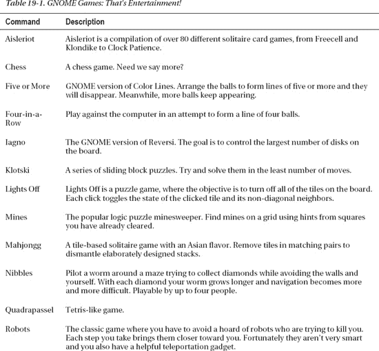
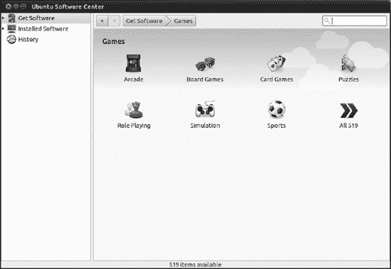
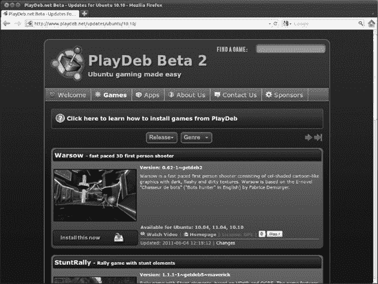
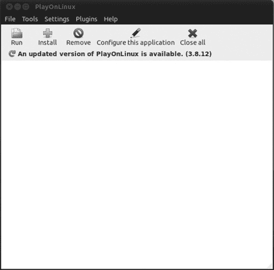
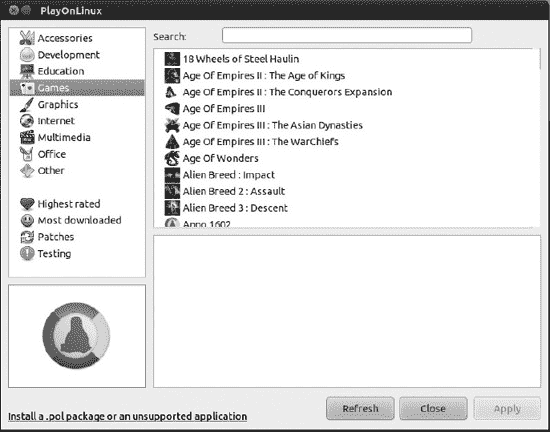

# 十九、玩游戏

在 Ubuntu 中玩游戏可能会被一些人视为一个尴尬的想法，更多的人可能会认为，如果你最多能找到一个类似太空入侵者的游戏，你就已经很幸运了。它没有像 PlayStation、Xbox 或 Wii 那样被广泛认可为主流游戏平台，也没有 Windows 那么受欢迎。但是你可能会说，Ubuntu 确实是承诺不足，交付过多。你会惊讶于休闲游戏玩家手头拥有的大量可能性。

在这一章中，我们首先来看看 Ubuntu 在默认情况下和官方库中提供了哪些游戏。这些游戏是专门为 Linux 开发的，并在某种程度上得到 Ubuntu 背后的 Canonical 公司的认可。Ubuntu 也有其他来源的游戏，没有官方承认，可以提供许多小时的乐趣。

但是游戏世界变化很快，许多人发现他们只需要基于 web 和 Adobe Flash 的游戏。我们将学习如何在 Ubuntu 下实现这些功能。释放基于 Flash 的游戏的力量将为您打开免费娱乐的大门。

不可否认的是，Windows 是一个流行的游戏平台，并且有许多 Windows 游戏可供选择。所以你可能会想换成 Ubuntu，因为你认为它是一个很棒的操作系统，但又害怕失去玩你最喜欢的 Windows 游戏的机会。如果我们告诉你鱼和熊掌可以兼得呢？如果你能同时拥有选择的操作系统(Ubuntu)和你的游戏以及电脑会怎么样？正如你在本章中看到的，这种事情是可能的。

所以开始热身吧，因为在这一章的结尾会有行动！

### Linux 游戏

和任何类型的应用程序一样，Ubuntu 默认安装了一堆游戏，Ubuntu 软件中心也有很多其他现成的游戏。你通常可以通过从 Unity 启动器中选择应用程序图标来找到游戏。接下来，从所有应用程序下拉列表中选择游戏。

#### 官方消息来源

最基础的游戏包是`gnome-games`，在 Ubuntu 软件中心有。它包括 16 种简单的游戏，从国际象棋到麻将，从数独到四人一排。您可以在[表 19-1](#tab_19_1) 中看到完整的列表；这些游戏旨在让你从工作中获得有益的休息。五分钟后，你就可以从压力中解脱出来，恢复精力，继续工作。但是要小心，因为那些游戏因其令人上瘾的力量而闻名！它们一定会帮你度过慵懒的一天。谁没有在办公室花几个小时玩扫雷(Ubuntu 的版本叫 Mines)？

 **提示**如果你在 Ubuntu 软件中心的游戏部找`gnome-games`是找不到的。作为一个元包，你可以在 Get Software 或者 Ubuntu 提供的文件夹中找到它。

默认储存库中有更多的游戏。只要打开 Ubuntu 软件中心，浏览到游戏部，如图[图 19-1](#fig_19_1) 所示。有接近 500 个游戏可供选择！

***图 19-1。**搜索游戏部，你会找到许多珠宝。*

一些最流行的 Linux 游戏也在 Ubuntu 仓库中找到了自己的家。在放弃 Ubuntu 游戏平台之前，先试试这些游戏。你会惊讶的！

> *   *Frozen bubbles:* Frozen bubbles are clones of the popular Bubble Dragon game, in which you try to divide bubbles into groups of the same color and make them burst. This game mainly includes launching randomly selected bubbles. If there are at least three bubbles of the same color at the end of shooting, they will all burst. If some bubbles only stay on the burst lumps, they will fall off. In single-player mode, the goal is to pop up all bubbles on the chessboard as quickly as possible. In the two-person or network mode, you must let your opponent "die" before you.
> *   *pingus:* pingus is a free clone of the popular lemming game. Your goal is to guide a group of penguins to a safe place through a world full of obstacles and penguin traps. Although penguins (unlike lemmings) are quite clever, they sometimes rely on you to save them.
> *   [t0 T0】 Tremulous: Tremulous is a free open source game, which combines the elements of team-based first-person shooter (FPS) and real-time strategy game (RTS). Players can choose two unique races, aliens and humans. Players of both teams can build working structures in the game just like RTS games. These structures provide many functions, most importantly, *generates* . The designated builder must ensure that there is an egg-laying structure, otherwise other players will not be able to rejoin the game after death. Other buildings provide automatic basic defense (to some extent), therapeutic functions, and so on.
> *   *Alien Arena:* Alien Arena is an independent 3D first-person online death contest shooting game, which is made of the original source codes of Raytheon Hammer II and Raytheon Hammer III and released by id Software under the permission of GPL.
> *   *Warzone2100:* Warzone2100 is a 3D real-time strategy set in the future earth.
> *   *Extreme Tux Racer:* Racer is a racing game featuring Linux mascot Tux. The goal of the game is to slide down the snow-covered mountain as fast as possible, avoiding trees and rocks that will slow you down. Collect herring and other delicious things when you slide down the mountain, but don't eat fishbone. Super Tux: Super Tux is a classic 2D jumping and running roll game, similar to the original Super Mario game. Super Tux has 9 enemies, 26 playable levels, software and OpenGL rendering modes, configurable joystick and keyboard input, new music, and completely redone graphics.
> *   *The product on fire:* The product on fire is a game of musical skills and quick fingers. The purpose of the game is to play the guitar with the keyboard as accurately as possible.
> *   *[Freeciv:* Freeciv is a game similar to civilization, in which you are the leader of the whole civilization, seeking progress and ruling the world.
> *   *T0】 【Pysol:* Pysol is a game with more than 1,000 solitaire games, ranging from mahjong to Hanoi jigsaw puzzle.

你的引擎准备好游戏了吗？你会相信只要点击一下鼠标，就有这么多免费的游戏吗？系好安全带，因为旅程才刚刚开始！

#### 附加来源

Ubuntu 是社区的一部分，游戏的官方来源不是唯一的，这是很自然的。正如在第 20 章中所探讨的，你可以在你的列表中添加新的、非官方的软件仓库，并从中下载程序。游戏也不例外。如果你浏览网页和 Ubuntu 论坛，你会发现很多关于安装游戏的额外资源的信息。在这一节中，我们将研究其中的一个来源，以便您熟悉这个概念。

我们将要访问的站点是`[http://www.PlayDeb.net](http://www.PlayDeb.net)`，如图[图 19-2](#fig_19_2) 所示。

***图 19-2。*** `PlayDeb.net` *是众多附加游戏的来源之一。*

您可以点按“游戏”并浏览可用游戏列表。但是当你看到一个你喜欢的，点击“现在安装”并按照屏幕上的指示，你可能很快就会得到一个错误信息。为什么呢？

为了能够安装来自`PlayDeb.net`的游戏，您应该将存储库添加到您的软件源中。储存库，在[第 20 章](20.html#ch20)中有更详细的介绍，是可以下载和安装软件包的存储位置。下面我们按照添加`PlayDeb.net`为源的步骤来。当你添加任何其他 Ubuntu 游戏源时，这个训练将会帮助你。

> 1.  Try to install a game from `PlayDeb.net` and verify if you get an error message.
> 2.  Open Ubuntu Software Center. Select edit-> software source from the menu.
> 3.  Open other software tabs, click Add … and copy the following lines in the text box of `apt` line:
> 4.  `deb http://archive.getdeb.net/ubuntu natty-getdeb games`
> 5.  Click add source. Do not close the software source dialog box.
> 6.  Open a web browser and copy the following line in the address bar: `http://archive.getdeb.net/getdeb-archive.key`
> 7.  You will be prompted to open or save the key file. It will be stored in your download folder.
> 8.  Return to the software source dialog box and click the authentication tab.
> 9.  Click import key file … and browse to your download folder. Double-click the downloaded key.
> 10.  Click close. You will be prompted to update the directory on your computer. Accept.
> 11.  Try to install the game again. You should succeed this time!

虽然`PlayDeb.net`只是 Ubuntu 游戏的众多额外资源之一，但这个演示很有用，因为添加软件资源几乎总是同样的两步过程:在其他软件标签中添加库，在认证标签中导入密钥。

重新加载目录后，下次打开 Ubuntu 软件中心时，您应该会在 Get Software 下看到一个新条目 GetDeb，以及由 Ubuntu 和 Canonical Partners 提供的条目。如果您选择 GetDeb，可用游戏的列表将显示在主窗格中。要安装一个新游戏，只需选择它并点击安装，就像你对任何应用程序一样。

恭喜你！您现在可以访问 200 多个附加游戏！

### Adobe Flash 和基于网络的游戏

关于云和基于云的应用程序，人们已经说了很多，特别是关于如何不再需要在本地硬盘上安装应用程序来使用它，因为它们将永远在线可用。

这种趋势在游戏领域最为明显和主流。当您谈到在线游戏时，您往往会依赖 Adobe Flash。Flash 是 Macromedia 首创的动画文件格式，它的后继公司 Adobe 继续支持它。Flash 已经扩展到包括音频和视频内容，以及用许多脚本语言编写的程序。尽管其他网络游戏技术取得了进步，史蒂夫·乔布斯最近也对 Flash 发起了攻击，但每天都有越来越多的基于这种技术的游戏被创造出来，并在网上完全免费提供。在谷歌或雅虎中搜索**“免费 flash 游戏”**，会显示出一个看似没完没了的网站列表。喜欢玩就很难避开他们。

但是当你在安装 Ubuntu 后试图打开那些游戏时，你发现 Firefox 告诉你“需要额外的插件来显示这个页面上的所有媒体”，而在游戏应该在的地方，你得到的只是一个断开的链接。许多人认为这都是为了 Linux，他们永远无法在 Ubuntu 上玩 Flash 游戏。不是这样的。

作为一个开放的操作系统，有许多方法来扩展 Ubuntu 和 open Flash 应用程序的功能并不奇怪。最常见的列于[表 19-2](#tab_19_2) 中。

T2】

如果您打算玩在线游戏，我们建议您安装 Adobe Flash Player。它可以在 Ubuntu 软件中心的 Canonical Partners 部分获得。按照以下说明安装 Flash Player:

> 1.  From the application panel, select Ubuntu Software Center.
> 2.  Expand the acquisition software in the navigation pane and select the Canonical Partners folder.
> 3.  The application Adobe Flash plug-in 10 should be at the top of the list. Click install. When finished, close Ubuntu Software Center and open Firefox.
> 4.  Go to your favorite Flash game website. You should have no problem now.

提示你可能会在一些网站上找到基于 Java 的游戏。虽然对于这些类型的应用程序，Java 的使用没有 Flash 那么主流，但是 Java 是一种非常流行的技术。要玩在线 Java 游戏，请确保在 Ubuntu 软件中心安装了应用程序 sun-java6-plugin。

### 安装 Windows 游戏

你可能不愿意转换到 Ubuntu 的原因之一是，你已经在 Windows 游戏上投入了大量资金，不想把这些钱都扔掉，即使你发现 Ubuntu 是更好的操作系统。

这是一个非常可以理解的问题，但是有一个解决方法。跟着我们。

欢迎来到 PlayOnLinux。在第 20 章中，我们讨论了 Wine，一个允许你在 Linux 下运行 Windows 应用程序的工具。我们还在那一章中指出，有时这些应用程序并不容易安装和配置。许多问题需要专家知识和数小时的调查。它们最终可能会奏效，但过程可能会漫长而乏味。当你只想玩一个游戏时，这不是很令人鼓舞。

PlayOnLinux 是 Wine 的前端，专门让游戏开箱即用。它免除了用户为某一应用准备系统的任务。这是一个基于社区的解决方案，不同的用户将游戏的配置脚本上传到存储库。当你需要安装一个别人之前已经安装过的游戏时，脚本执行，游戏无缝安装。

值得注意的是，要安装 Windows 游戏，您可能需要原始 CD 或 DVD 以及许可证密钥。有时候很无聊，但这就是 Windows 游戏的工作方式。拥有一个安装游戏的社区工具并不能让游戏本身变得可共享。原始许可限制仍然适用。

你可以从官方仓库安装 PlayOnLinux。只要在 Ubuntu 软件中心找到它，然后点击安装。一旦安装完毕，你可以从 Unity 启动器启动它。

第一次启动 PlayOnLinux 时，它会尝试从互联网下载游戏目录，这可能需要几分钟时间。如果你要安装的游戏不在目录中，你可以点击文件刷新存储库来更新它。

在你安装任何应用程序之前，PlayOnLinux 的主窗口会相当空，正如你在[图 19-3](#fig_19_3) 中看到的。安装游戏后，会在这里列出已安装的游戏。

***图 19-3。** PlayOnLinux 主窗口是空的，直到你安装一个游戏。*

要安装游戏，请单击安装并选择游戏类别。你会看到兼容游戏列表，如图[图 19-4](#fig_19_4) 所示。

***图 19-4。**playon Linux 兼容游戏列表*

选择要安装的游戏，然后单击“应用”。该游戏的脚本将开始运行，要求您提供安装介质和密钥(如果适用)。在某个时候，应用程序的安装向导启动，您可以在 Windows 中看到相同的向导。当它完成时，游戏被安装。

你会在 PlayOnLinux 主窗口看到比赛。只需点击运行和享受！

 **提示**在安装对话框中可以看到，除了游戏，PlayOnLinux 还可以安装其他类型的应用。PlayOnLinux 所做的是在安装应用程序时运行一个脚本。不过游戏才是 PlayOnLinux 的主要特色。

### 总结

在这一章中，我们为你打开了游戏和娱乐世界的大门。尽管许多人认为 Linux 是一个使用命令行的平台，但本章已经表明这不是真的。你可以在官方资料库中找到很多免费游戏，在社区页面中还有更多。

你也可以在线玩主流的基于 Flash 和 Java 的游戏。

如果这还不够，并且你想念你的 Windows 游戏，PlayOnLinux 可以很容易地将它们安装到你的 Ubuntu 盒子中，这样你就可以选择操作系统，而不会损失你在游戏上的投资。

如果所有这些方法都无法满足你对游戏的渴望，也许是时候考虑购买一台主机了！