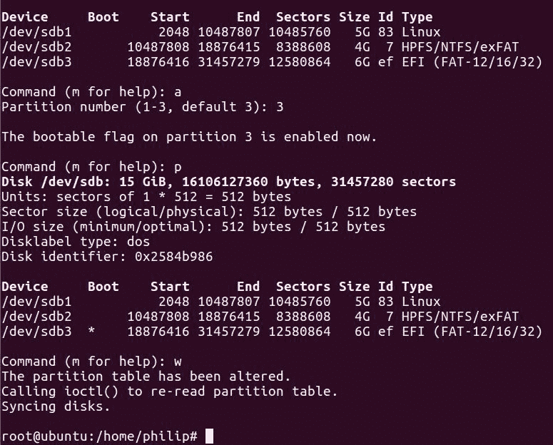
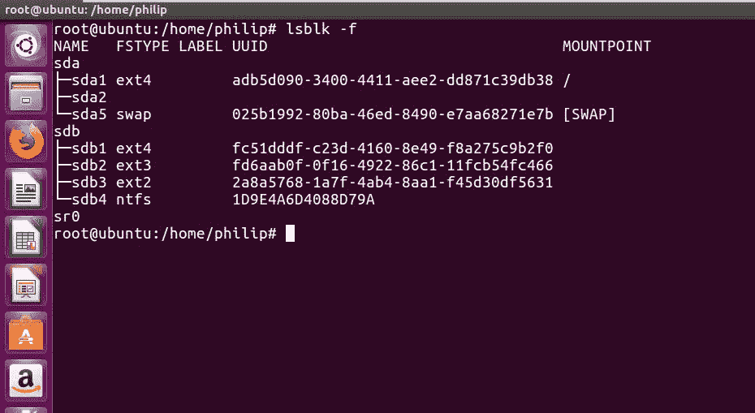

# 四、设计硬盘布局

在前一章中，我们重点讨论了运行级别和引导目标。我们与运行`init`和`systemd`的 Linux 系统进行了交互。我们看到了如何打开服务，以及如何在运行级别和引导目标之间切换。我们查看了各种开始和停止脚本，还查看了脚本的结构。

本章重点介绍如何在命令行界面创建分区和分割物理硬盘。我们将特别关注`fdisk`实用程序和`parted`实用程序的使用。然后我们将通过各种`mkfs`命令来创建、删除、定义分区类型和格式化硬盘。最后，我们将了解装载和卸载分区的方法。

因此，我们将在本章中讨论以下主题:

*   使用`fdisk`实用程序
*   使用`parted`实用程序
*   格式化硬盘的步骤
*   安装和卸载分区

# 使用 fdisk 实用程序

在 Linux 中，无论何时我们使用硬盘，都有可能在某个时间点不得不**对硬盘**进行分区。*分区*简单来说就是分离硬盘。这使我们能够拥有不同大小的分区，并使我们能够满足各种软件安装要求。此外，当我们对硬盘进行分区时，操作系统会将每个分区视为一个完全独立的硬盘。`fdisk`(固定磁盘或格式化磁盘)是一个基于命令行的实用程序，可用于操作硬盘。借助`fdisk`，您可以查看、创建、删除和更改等。

首先，让我们展示一下 Ubuntu 发行版中的硬盘:

```sh
philip@ubuntu:~$ ls /dev/ | grep sd
sda
sda1
sda2
sda5
philip@ubuntu:~$
```

从前面的输出来看，系统中的硬盘用`/dev/sda`表示。第一个分区是`/dev/sda1`，第二个分区是`/dev/sda2`，以此类推。为了查看分区信息，我们将运行以下命令:

```sh
philip@ubuntu:~$ fdisk -l /dev/sda
fdisk: cannot open /dev/sda: Permission denied
philip@ubuntu:~$
```

从前面的输出中，我们得到`Permission denied`。这是因为我们需要一个 root 权限来查看和更改硬盘的分区。让我们以 root 用户身份重试:

```sh
philip@ubuntu:~$ sudo su
[sudo] password for philip:
root@ubuntu:/home/philip#
root@ubuntu:/home/philip# fdisk -l /dev/sda
Disk /dev/sda: 20 GiB, 21474836480 bytes, 41943040 sectors
Units: sectors of 1 * 512 = 512 bytes
Sector size (logical/physical): 512 bytes / 512 bytes
I/O size (minimum/optimal): 512 bytes / 512 bytes
Disklabel type: dos
Disk identifier: 0xf54f42a0

Device   Boot Start     End       Sectors  Size Id  Type
/dev/sda1  *   2048     39845887  39843840 19G 83   Linux
/dev/sda2      39847934 41940991  2093058  1022M  5 Extended
/dev/sda5      39847936 41940991  2093056 1022M 82 Linux swap / Solaris
root@ubuntu:/home/philip#
```

从前面的输出中，读取该内容的方式如下:

磁盘`/dev/sda` : 20 GiB，21，474，836，480 字节，41，943，040 扇区:这是实际物理硬盘:

| **装置** | **开机** | **开始** | **结束** | **扇区** | **尺寸** | **Id** | **类型** | comment |
| `/dev/sda1` | * | Two thousand and forty-eight | Thirty-nine million eight hundred and forty-five thousand eight hundred and eighty-seven | Thirty-nine million eight hundred and forty-three thousand eight hundred and forty | 19 克 | Eighty-three | Linux 操作系统 | 第一个分区是 19 GB |
| `/dev/sda2` |  | Thirty-nine million eight hundred and forty-seven thousand nine hundred and thirty-four | Forty-one million nine hundred and forty thousand nine hundred and ninety-one | Two million ninety-three thousand and fifty-eight | 10.22 亿 | five | 延长 | 第二个分区是 1，022 兆字节 |
| `/dev/sda5` |  | Thirty-nine million eight hundred and forty-seven thousand nine hundred and thirty-six | Forty-one million nine hundred and forty thousand nine hundred and ninety-one | Two million ninety-three thousand and fifty-six | 10.22 亿 | Eighty-two | Linux 交换/ Solaris | 第五个分区是 1，022 兆字节 |

现在，为了能够进行任何更改，我们将再次使用`fdisk`命令。这次我们将省略`-l`选项:

```sh
root@ubuntu:/home/philip# fdisk /dev/sda

Welcome to fdisk (util-linux 2.27.1).
Changes will remain in memory only, until you decide to write them.
Be careful before using the write command.

Command (m for help):
```

从前面的代码中，我们现在进入了`fdisk`实用程序，并且我们看到了一条很好的小消息。

Do not commit any changes before first making sure you understand the dangers surrounding removing partition; the system could become unstable if you remove a partition that stores system files such as `/boot/` and `/`, to name a few.

要查看可用选项，我们可以按`m`键:

```sh
Command (m for help): m
Help:
 DOS (MBR)
 a   toggle a bootable flag
 b   edit nested BSD disklabel
 c   toggle the dos compatibility flag
Generic
 d   delete a partition
 F   list free unpartitioned space
 l   list known partition types
 n   add a new partition
 p   print the partition table
 t   change a partition type
 v   verify the partition table
 i   print information about a partition

Misc
 m   print this menu
 u   change display/entry units
 x   extra functionality (experts only)
Script
 I   load disk layout from sfdisk script file
 O   dump disk layout to sfdisk script file

Save & Exit
 w   write table to disk and exit
 q   quit without saving changes
Create a new label
 g   create a new empty GPT partition table
 G   create a new empty SGI (IRIX) partition table
 o   create a new empty DOS partition table
 s   create a new empty Sun partition table

Command (m for help):
```

从前面的输出中，我们可以看到各种选项可供选择。我们甚至可以使用`l`来查看已知的分区类型:


从前面的截图中，我们可以看到一系列不同的分区类型可供使用。常见的类型有`5 Extended`、`7 NTFS NTSF`、`82 Linux swap`、83 (Linux)、`a5 FreeBSD`、`ee GPT`、`ef EFI`等等。

现在，要查看创建的分区，我们可以使用`p`:


我已经为这个系统添加了第二个硬盘，让我们验证一下:

```sh
root@ubuntu:/home/philip# ls /dev/ | grep sd
sda
sda1
sda2
sda5
sdb
root@ubuntu:/home/philip#
```

太棒了。我们现在可以看到`/dev/sdb`。我们将在这款新硬盘上使用`fdisk`:

```sh
root@ubuntu:/home/philip# fdisk /dev/sdb

Welcome to fdisk (util-linux 2.27.1).
Changes will remain in memory only, until you decide to write them.
Be careful before using the write command.

Device does not contain a recognized partition table.
Created a new DOS disklabel with disk identifier 0x0079e169.
Command (m for help):
```

现在，让我们按下`p`，它将在`/dev/sdb`上打印当前分区:

```sh
Command (m for help): p
Disk /dev/sdb: 15 GiB, 16106127360 bytes, 31457280 sectors
Units: sectors of 1 * 512 = 512 bytes
Sector size (logical/physical): 512 bytes / 512 bytes
I/O size (minimum/optimal): 512 bytes / 512 bytes
Disklabel type: dos
Disk identifier: 0x0079e169

Command (m for help):
```

可以看到`/dev/sdb`上没有分区。对于我们创建分区，我们将使用`n`键:

```sh
Command (m for help): n
Partition type
 p   primary (0 primary, 0 extended, 4 free)
 e   extended (container for logical partitions)
Select (default p):
```

这将要求我们声明分区的类型。`fdisk`实用程序提供了主分区和扩展分区类型。还有一种逻辑分区类型。我们安装操作系统，会选择`p`，代表*主分区类型*。

You would not install an operating system on a logical partition type.

如您所见，我们使用`n`来创建新的分区。需要注意的一点是，我们到目前为止创建的分区都是 Linux 类型的分区。如果因为某种原因我们想改变分区类型，可以用`t`来改变。让我们把`/dev/sdb2`换成`HPFS/NTFS/exFAT`分区。我们将在`fdisk`实用程序中使用`type 7`:

```sh
Command (m for help): t
Partition number (1-3, default 3): 2
Partition type (type L to list all types): l
0  Empty  24  NEC DOS 81  Minix / old Lin bf  Solaris 
1  FAT12  27  Hidden NTFS Win 82  Linux swap / So c1  DRDOS/sec (FAT-
2  XENIX root  39  Plan 9  83  Linux  c4  DRDOS/sec (FAT-
3  XENIX usr   3c  PartitionMagic 84 OS/2 hidden or c6 DRDOS/sec (FAT-
4  FAT16 <32M  40  Venix 80286     85  Linux extended  c7  Syrinx 
5  Extended   41  PPC PReP Boot   86  NTFS volume set da  Non-FS data 
6  FAT16    42  SFS  87  NTFS volume set db  CP/M / CTOS / .
7  HPFS/NTFS/exFAT
```

太棒了。现在我们可以看到分区类型为`type 7`:

```sh
Partition type (type L to list all types): 7
Changed type of partition 'Empty' to 'HPFS/NTFS/exFAT'.
Command (m for help): p
Disk /dev/sdb: 15 GiB, 16106127360 bytes, 31457280 sectors
Units: sectors of 1 * 512 = 512 bytes
Sector size (logical/physical): 512 bytes / 512 bytes
I/O size (minimum/optimal): 512 bytes / 512 bytes
Disklabel type: dos
Disk identifier: 0x2584b986
Device       Boot     Start    End      Sectors Size  Id   Type
/dev/sdb1    2048     10487807  10485760  5G      83        Linux
/dev/sdb2    10487808 18876415  8388608   4G      7     HPFS/NTFS/exFAT
/dev/sdb3    18876416 31457279  12580864  6G      0           Empty
```

另外，我们将把`/dev/sdb3`分区改为类型`ef`:


现在当我们重新运行`p`命令时，我们可以看到我们新创建的分区类型设置为`ef`:

```sh
Device     Boot      Start     End     Sectors Size Id Type
/dev/sdb1   2048     10487807  10485760  5G    83 Linux
/dev/sdb2   10487808 18876415  8388608   4G    7 HPFS/NTFS/exFAT
/dev/sdb3   18876416 31457279  12580864  6G    ef EFI (FAT-12/16/32)
```

现在，如果我们决定安装一个操作系统，那么我们将不得不使这些分区之一可引导。我们将使第三个分区`/dev/sdb3`可引导:

```sh
Command (m for help): a 
Partition number (1-3, default 3): 3
The bootable flag on partition 3 is enabled now.
Command (m for help): p
Disk /dev/sdb: 15 GiB, 16106127360 bytes, 31457280 sectors
Units: sectors of 1 * 512 = 512 bytes
Sector size (logical/physical): 512 bytes / 512 bytes
I/O size (minimum/optimal): 512 bytes / 512 bytes
Disklabel type: dos
Disk identifier: 0x2584b986
Device     Boot    Start      End  Sectors Size Id Type
/dev/sdb1           2048 10487807 10485760   5G 83 Linux
/dev/sdb2       10487808 18876415  8388608   4G  7 HPFS/NTFS/exFAT
/dev/sdb3  *    18876416 31457279 12580864   6G ef EFI (FAT-12/16/32)
```

从之前的输出来看，`/dev/sdb3`现在被标记为可引导。

最后，要更改或写入我们的更改，我们将按`w`，保存并退出:

```sh
Command (m for help): w
The partition table has been altered.
Calling ioctl() to re-read partition table.
Syncing disks.
```



# 使用分离的实用程序

`parted`实用程序适用于硬盘或大于 2 TB 的硬盘。此外，我们可以调整分区的大小；`fdisk`实用程序无法调整分区大小。几乎所有较新的 Linux 发行版都支持`parted`实用程序。`parted`来源于 GNU 这是一个基于文本的分区实用程序，适用于各种磁盘类型，如 MBR、GPT 和 BSD，仅举几例。

Always backup your data before doing any partitioning.

首先，我们将使用`/dev/sdb`上的`parted`命令:

```sh
root@ubuntu:/home/philip# parted /dev/sdb
GNU Parted 3.2
Using /dev/sdb
Welcome to GNU Parted! Type 'help' to view a list of commands.
(parted)                                                                 
```

从这里，我们进入`parted`实用程序。类似于`fdisk`实用程序，`parted`实用程序是交互式的。现在，假设我们想要查看`help`菜单，我们可以在命令行界面登记`help`:

```sh
(parted) help 
 align-check TYPE N check partition N for TYPE(min|opt) alignment
 help [COMMAND] print general help, or help on COMMAND
 mklabel,mktable LABEL-TYPE create a new disklabel (partition table)
 mkpart PART-TYPE [FS-TYPE] START END make a partition
 name NUMBER NAME name partition NUMBER as NAME
 print [devices|free|list,all|NUMBER] display the partition table, available devices, free space, all found partitions, or a particular partition
 quit exit program 
 rescue START END rescue a lost partition near START and END
 resizepart NUMBER END resize partition NUMBER
 rm NUMBER delete partition NUMBER
 select DEVICE choose the device to edit
 disk_set FLAG STATE change the FLAG on selected device
 disk_toggle [FLAG] toggle the state of FLAG on selected device
 set NUMBER FLAG STATE change the FLAG on partition NUMBER
 toggle [NUMBER [FLAG]] toggle the state of FLAG on partition NUMBER
```

```sh
 unit UNIT set the default unit to UNIT
 version display the version number and copyright information of GNU Parted
(parted)
```

从前面的输出中，我们有一长串的命令可以使用。

Remember to do a backup before making any change(s) to your partition.

现在，要查看`/dev/sdb`的当前分区表，我们可以键入`print`:

```sh
(parted) print
Model: VMware, VMware Virtual S (scsi)
Disk /dev/sdb: 16.1GB
Sector size (logical/physical): 512B/512B
Partition Table: msdos
Disk Flags:
Number  Start   End     Size    Type  File system  Flags
 1     1049kB  5370MB 5369MB  primary
 2     5370MB  9665MB 4295MB  primary
 3     9665MB  16.1GB 6441MB  primary boot, esp
(parted) 
```

这将打印出`/dev/sdb`的分区表。但是，我们可以使用带有`list`选项的`print`命令来查看该系统中所有可用的硬盘。让我们试一试:

```sh
(parted) print list
Model: VMware, VMware Virtual S (scsi)
Disk /dev/sdb: 16.1GB
Sector size (logical/physical): 512B/512B
Partition Table: msdos
Disk Flags:
Number  Start   End     Size    Type    File system  Flags
 1      1049kB  5370MB  5369MB  primary
 2      5370MB  9665MB  4295MB  primary
 3      9665MB  16.1GB  6441MB  primary            boot, esp
 Model: VMware, VMware Virtual S (scsi)
Disk /dev/sda: 21.5GB
Sector size (logical/physical): 512B/512B
Partition Table: msdos
Disk Flags:
Number  Start   End     Size    Type      File system     Flags
 1      1049kB  20.4GB  20.4GB  primary   ext4            boot
 2      20.4GB  21.5GB  1072MB  extended
 5      20.4GB  21.5GB  1072MB  logical   linux-swap(v1)
(parted)
```

太好了。可以看到，`/dev/sda`现在也列出来了。接下来，让我们看看如何调整分区大小。为了实现这一点，我们将利用另一个强大的命令，也就是`resizepart`命令，它本身的名称是恰当的。

我们将为本练习选择第二个分区；我们会说`resizepart 2`，我们会将其减少到 2 GB:

```sh
 (parted) resizepart
 Partition number? 2
 End? [5370MB]? 7518
 (parted) print
 Disk /dev/sdb: 16.1GB
Sector size (logical/physical): 512B/512B
Partition Table: msdos
Disk Flags:
Number Start End Size Type File system Flags
 1 1049kB 5370MB 5369MB primary
 2 5370MB 7518MB 2148MB primary
 3 9665MB 16.1GB 6441MB primary boot, esp
(parted)            
```

从前面的输出可以看出`parted`效用非常强大。我们已经有效地从第二个分区中移除了 2 GB(大致)。现在，如果您考虑一下，我们有 2 GB 的可用空间可供使用。

Hard disk space is critical in a large data center, so bear that in mind when provisioning your servers.

现在，为了演示如何使用 2 GB 的可用空间，让我们创建另一个分区。`parted`实用程序非常强大，因为它可以识别从另一个磁盘实用程序(如`fdisk`)创建的分区。在`parted`中，我们将使用`mkpart`命令创建一个分区:

```sh
(parted)
(parted) mkpart 
Partition type?  primary/extended? 
```

现在可以看到，`fdisk`和`parted`有相似之处，都问分区是主分区还是扩展分区。这在我们处理操作系统安装时至关重要。出于我们的目的，我们将创建另一个主分区:

```sh
Partition type?  primary/extended? primary
File system type?  [ext2]?
Start?
```

现在，此时，我们必须指定将要创建的分区的起始大小。我们将使用第二个分区结束的大小:

```sh
File system type? [ext2]? 
Start? 7518 
End? 9665 
(parted) 
```

太棒了。现在让我们重新运行`print`命令:

```sh
(parted) print 
Model: VMware, VMware Virtual S (scsi)
Disk /dev/sdb: 16.1GB
Sector size (logical/physical): 512B/512B
Partition Table: msdos
Disk Flags:
Number Start   End     Size    Type     File system  Flags
 1      1049kB  5370MB  5369MB  primary
 2      5370MB  7518MB  2148MB  primary
 4      7518MB  9665MB  2146MB  primary  ext2         lba
 3      9665MB  16.1GB  6441MB  primary               boot, esp
(parted)
```

从前面的输出中，我们现在可以看到新创建的分区为 2 GB(大概)。

现在我们可以将`boot`标志从现在的分区 3 `/dev/sdb3`更改为部分分区 4 `/dev/sdb4`。我们将使用`set`命令:

```sh
(parted) set 
Partition number? 4 
Flag to Invert?
```

从这里，我们必须告诉`parted`实用程序我们想要移动`boot`标志:

```sh
Flag to Invert? boot 
New state?  [on]/off?
```

现在，我们需要确认我们的更改，`on`是默认值，所以我们按*进入*:

```sh
New state?  [on]/off? 
(parted) print 
Model: VMware, VMware Virtual S (scsi)
Disk /dev/sdb: 16.1GB
Sector size (logical/physical): 512B/512B
Partition Table: msdos
Disk Flags:
Number  Start   End     Size    Type     File system  Flags
 1      1049kB  5370MB  5369MB  primary
 2      5370MB  7518MB  2148MB  primary
 4      7518MB  9665MB  2146MB  primary  ext2         boot, lba
 3      9665MB  16.1GB  6441MB  primary               esp
(parted)                                             
```

太好了。现在我们可以看到引导标志已经转移到第四分区`/dev/sdb4`。

最后，为了保存我们的更改，我们可以简单地键入`quit`:

```sh
(parted) quit 
Information: You may need to update /etc/fstab.
root@ubuntu:/home/philip#     
```

You would add entries as needed in the `/etc/fstab` to automount your partitions to their respective mount points.

# 格式化硬盘的步骤

创建分区后，下一步是通过文件系统访问分区。在 Linux 中，当我们格式化一个分区时，系统会清除该分区，这使得系统能够在该分区上存储数据。

我们在 Linux 系统中有许多可用的文件系统类型。我们结合所需的文件系统类型使用`mkfs`命令。要查看可用的文件系统，我们可以这样做:


从前面的截图来看，在这个 Ubuntu 发行版中，主要是`ext4`类型是发行版当前使用的。我们也可以使用带有`-f`选项的`lsblk`命令来验证:

```sh
root@ubuntu:/home/philip# lsblk -f
```



从前面的截图中，我们可以看到两个硬盘，`/dev/sda`和`/dev/sdb`。另外，我们看到一个专栏`FSTYPE`。这标识了当前正在使用的文件系统。我们可以看到整个`/dev/sdb(1-4)`的`FSTYPE`是空白的。

我们也可以使用`blkid`命令来查看系统正在使用的文件系统:


从给出的输出中，显示`TYPE=`的部分显示了正在使用的文件系统。请注意`/dev/sdb(1-4)`缺少`TYPE=`。这仅仅意味着我们没有格式化任何驻留在`/dev/sdb`上的分区。

现在让我们开始格式化我们的分区。我们将使用`/dev/sdb1`上的`ext4`文件系统:

```sh
root@ubuntu:/home/philip# mkfs.ext4 /dev/sdb1
mke2fs 1.42.13 (17-May-2015)
Creating filesystem with 1310720 4k blocks and 327680 inodes
Filesystem UUID: fc51dddf-c23d-4160-8e49-f8a275c9b2f0
Superblock backups stored on blocks:
 32768, 98304, 163840, 229376, 294912, 819200, 884736
Allocating group tables: done 
Writing inode tables: done 
Creating journal (32768 blocks): done
Writing superblocks and filesystem accounting information: done
root@ubuntu:/home/philip#
```

根据前面的输出，`mkfs`实用程序，特别是`mkfs.ext4`，在原始分区上创建文件系统；然后，它分配一个 UUID 来唯一标识`/dev/sdb1`分区。

You need to have a root privilege before you can format a partition(s).

接下来，让我们使用`/dev/sdb2`的`ext3`文件系统:

```sh
root@ubuntu:/home/philip# mkfs.ext3 /dev/sdb2
mke2fs 1.42.13 (17-May-2015)
Creating filesystem with 524288 4k blocks and 131328 inodes
Filesystem UUID: fd6aab0f-0f16-4922-86c1-11fcb54fc466
Superblock backups stored on blocks:
 32768, 98304, 163840, 229376, 294912
Allocating group tables: done 
Writing inode tables: done 
Creating journal (16384 blocks): done
Writing superblocks and filesystem accounting information: done
root@ubuntu:/home/philip#
```

现在我们将使用`/dev/sdb3`的`ext2`和`/dev/sdb4`的`ntfs`:

```sh
root@ubuntu:/home/philip# mkfs.ext2 /dev/sdb3
mke2fs 1.42.13 (17-May-2015)
Creating filesystem with 1572608 4k blocks and 393216 inodes
Filesystem UUID: b7e075df-541d-468d-ab16-e3ec2e5fb5f8
Superblock backups stored on blocks:
 32768, 98304, 163840, 229376, 294912, 819200, 884736
Allocating group tables: done 
Writing inode tables: done 
Writing superblocks and filesystem accounting information: done
root@ubuntu:/home/philip# mkfs.ntfs /dev/sdb4
Cluster size has been automatically set to 4096 bytes.
Initializing device with zeroes: 100% - Done.
Creating NTFS volume structures.
mkntfs completed successfully. Have a nice day.
root@ubuntu:/home/philip#
```

You can also use the `mk2fs` to create an `ext2` filesystem.

太好了。现在我们刚刚格式化了`/dev/sdb1`、`/dev/sdb2`、`dev/sdb3`和`/dev/sdb4`。如果我们现在使用`-f`选项重新运行`lsblk`命令，我们现在将看到为两个分区填充的文件系统类型(`FSTYPE`):

```sh
root@ubuntu:/home/philip# lsblk -f
NAME   FSTYPE LABEL UUID                                 MOUNTPOINT
sda 
├─sda1 ext4         adb5d090-3400-4411-aee2-dd871c39db38 /
├─sda2 
└─sda5 swap         025b1992-80ba-46ed-8490-e7aa68271e7b [SWAP]
sdb 
├─sdb1 ext4         fc51dddf-c23d-4160-8e49-f8a275c9b2f0
├─sdb2 ext3         fd6aab0f-0f16-4922-86c1-11fcb54fc466
├─sdb3 ext2         b7e075df-541d-468d-ab16-e3ec2e5fb5f8
└─sdb4 ntfs         1D9E4A6D4088D79A 
sr0 
root@ubuntu:/home/philip#
```

从前面的输出中，我们可以看到`FSTYPE`反映了我们所做的改变。

我们也可以重新运行`blkid`命令来查看为`/dev/sdb1`和`/dev/sdb2`创建的 UUIDs:

```sh
root@ubuntu:/home/philip# blkid
/dev/sda1: UUID="adb5d090-3400-4411-aee2-dd871c39db38" TYPE="ext4" PARTUUID="f54f42a0-01"
/dev/sda5: UUID="025b1992-80ba-46ed-8490-e7aa68271e7b" TYPE="swap" PARTUUID="f54f42a0-05"
/dev/sdb1: UUID="fc51dddf-c23d-4160-8e49-f8a275c9b2f0" TYPE="ext4" PARTUUID="7e707ac0-01"
/dev/sdb2: UUID="fd6aab0f-0f16-4922-86c1-11fcb54fc466" SEC_TYPE="ext2" TYPE="ext3" PARTUUID="7e707ac0-02"
/dev/sdb3: UUID="2a8a5768-1a7f-4ab4-8aa1-f45d30df5631" TYPE="ext2" PARTUUID="7e707ac0-03"
/dev/sdb4: UUID="1D9E4A6D4088D79A" TYPE="ntfs" PARTUUID="7e707ac0-04"
root@ubuntu:/home/philip#
```

如您所见，系统现在可以在各个分区上存储信息。

# 安装和卸载分区

格式化分区后的最后一步是挂载分区。我们使用`mount`命令挂载分区，使用`unmount`命令卸载分区。mount 命令也用于查看我们系统中的当前挂载点。但是，在重新启动后，所有分区都将被卸载，除非我们在`/etc/fstab`目录中创建了条目。

您需要超级用户权限来保存`/etc/fstab`中的任何更改。此外，在进行任何更改之前，请备份所有配置文件。

# 挂载命令

我们可以在没有任何参数的情况下发出`mount`命令来查看当前挂载点:

```sh
root@ubuntu:/home/philip# mount
sysfs on /sys type sysfs (rw,nosuid,nodev,noexec,relatime)
proc on /proc type proc (rw,nosuid,nodev,noexec,relatime)
udev on /dev type devtmpfs (rw,nosuid,relatime,size=478356k,nr_inodes=119589,mode=755)
devpts on /dev/pts type devpts (rw,nosuid,noexec,relatime,gid=5,mode=620,ptmxmode=000)
tmpfs on /run type tmpfs (rw,nosuid,noexec,relatime,size=99764k,mode=755)
/dev/sda1 on / type ext4 (rw,relatime,errors=remount-ro,data=ordered)
securityfs on /sys/kernel/security type securityfs (rw,nosuid,nodev,noexec,relatime)
tmpfs on /dev/shm type tmpfs (rw,nosuid,nodev)
tmpfs on /run/lock type tmpfs (rw,nosuid,nodev,noexec,relatime,size=5120k)
tmpfs on /sys/fs/cgroup type tmpfs (ro,nosuid,nodev,noexec,mode=755)
cgroup on /sys/fs/cgroup/systemd type cgroup (rw,nosuid,nodev,noexec,relatime,xattr,release_agent=/lib/systemd/systemd-cgroups-agent,name=systemd)
pstore on /sys/fs/pstore type pstore (rw,nosuid,nodev,noexec,relatime)
cgroup on /sys/fs/cgroup/cpuset type cgroup (rw,nosuid,nodev,noexec,relatime,cpuset)
cgroup on /sys/fs/cgroup/cpu,cpuacct type cgroup (rw,nosuid,nodev,noexec,relatime,cpu,cpuacct)
cgroup on /sys/fs/cgroup/net_cls,net_prio type cgroup(rw,relatime,user_id=0,group_id=0,default_permissions,allow_other)
tmpfs on /run/user/1000 type tmpfs (rw,nosuid,nodev,relatime,size=99764k,mode=700,uid=1000,gid=1000)
gvfsd-fuse on /run/user/1000/gvfs type fuse.gvfsd-fuse (rw,nosuid,nodev,relatime,user_id=1000,group_id=1000)
root@ubuntu:/home/philip#
```

为了简洁起见，省略了一些输出。

从前面的输出中，我们可以看到许多装载点(装载点只是将分区/驱动器与文件夹/目录相关联)。我们可以过滤`mount`命令，只显示`/dev/`:

```sh
root@ubuntu:/home/philip# mount | grep /dev
udev on /dev type devtmpfs (rw,nosuid,relatime,size=478356k,nr_inodes=119589,mode=755)
devpts on /dev/pts type devpts (rw,nosuid,noexec,relatime,gid=5,mode=620,ptmxmode=000)
/dev/sda1 on / type ext4 (rw,relatime,errors=remount-ro,data=ordered)
tmpfs on /dev/shm type tmpfs (rw,nosuid,nodev)
cgroup on /sys/fs/cgroup/devices type cgroup (rw,nosuid,nodev,noexec,relatime,devices)
mqueue on /dev/mqueue type mqueue (rw,relatime)
hugetlbfs on /dev/hugepages type hugetlbfs (rw,relatime)
root@ubuntu:/home/philip#
```

基于过滤器，我们可以看到`/dev/sda1`当前挂载在`/`目录下。如你所知，`/`目录是根目录。所有其他目录都属于`/`目录。

我们还可以将`df`命令与`-h`选项结合使用，以查看更简洁的输出:

```sh
root@ubuntu:/home/philip# df -h
Filesystem      Size  Used Avail Use% Mounted on
udev            468M     0  468M   0% /dev
tmpfs            98M  6.2M   92M   7% /run
/dev/sda1        19G  5.1G   13G  29% /
tmpfs           488M  212K  487M   1% /dev/shm
tmpfs           5.0M  4.0K  5.0M   1% /run/lock
tmpfs           488M     0  488M   0% /sys/fs/cgroup
tmpfs            98M   44K   98M   1% /run/user/1000
root@ubuntu:/home/philip#
```

太好了。现在这是以结构化格式呈现的，更容易阅读。根据输出，当前只安装了`/dev/sda1`分区。

我们现在可以继续将`/dev/sdb1`安装在`/mnt`上。`/mnt`是一个空目录，每当我们想挂载一个分区时都会用到它。

Only one partition can be mounted at any given time.

我们将如下运行`mount`命令:

```sh
root@ubuntu:/# mount /dev/sdb1 /mnt
root@ubuntu:/#
```

注意，在没有任何选项的情况下，`mount`命令可以正常工作。现在让我们重新运行`mount`命令，只过滤`/dev`:

```sh
root@ubuntu:/# mount | grep /dev
udev on /dev type devtmpfs (rw,nosuid,relatime,size=478356k,nr_inodes=119589,mode=755)
devpts on /dev/pts type devpts (rw,nosuid,noexec,relatime,gid=5,mode=620,ptmxmode=000)
/dev/sda1 on / type ext4 (rw,relatime,errors=remount-ro,data=ordered)
tmpfs on /dev/shm type tmpfs (rw,nosuid,nodev)
cgroup on /sys/fs/cgroup/devices type cgroup (rw,nosuid,nodev,noexec,relatime,devices)
mqueue on /dev/mqueue type mqueue (rw,relatime)
hugetlbfs on /dev/hugepages type hugetlbfs (rw,relatime)
/dev/sdb1 on /mnt type ext4 (rw,relatime,data=ordered)
root@ubuntu:/#
```

基于前面的输出，我们可以看到`/dev/sdb1`当前安装在`/mnt`上。

我们还可以利用`h`选项的`df`命令来查看类似的结果:

```sh
root@ubuntu:/# df -h
Filesystem      Size  Used Avail Use% Mounted on
udev            468M     0  468M   0% /dev
tmpfs            98M  6.2M   92M   7% /run
/dev/sda1        19G  5.1G   13G  29% /
tmpfs           488M  212K  487M   1% /dev/shm
tmpfs           5.0M  4.0K  5.0M   1% /run/lock
tmpfs           488M     0  488M   0% /sys/fs/cgroup
tmpfs            98M   44K   98M   1% /run/user/1000
/dev/sdb1       4.8G   10M  4.6G   1% /mnt
root@ubuntu:/#
```

从前面的输出中，我们可以看到分区的大小以及与该分区相关联的装载点。

现在让我们创建两个目录用于`/dev/sdb2`和`/dev/sdb4`分区:

```sh
root@ubuntu:/# mkdir /folder1
root@ubuntu:/# mkdir /folder2
root@ubuntu:/# ls
bin  dev   folder2  initrd.img.old  lost+found  opt run srv usr      vmlinuz.old
boot etc  home lib   media    proc  sbin  sys  var
cdrom  folder1  initrd.img  lib64     mnt         root  snap  tmp  vmlinuz
root@ubuntu:/#
```

现在我们将分别在`/folder1`和`/folder2`目录中安装`/dev/sdb2`和`/dev/sdb4`:

```sh
root@ubuntu:/# mount /dev/sdb2 /folder1
root@ubuntu:/# mount /dev/sdb4 /folder2
root@ubuntu:/#
root@ubuntu:/# mount | grep /dev
/dev/sda1 on / type ext4 (rw,relatime,errors=remount-ro,data=ordered)
/dev/sdb1 on /mnt type ext4 (rw,relatime,data=ordered)
/dev/sdb2 on /folder1 type ext3 (rw,relatime,data=ordered)
/dev/sdb4 on /folder2 type fuseblk (rw,relatime,user_id=0,group_id=0,allow_other,blksize=4096)
root@ubuntu:/#
```

太好了。现在我们可以看到我们的挂载点用`mount`命令显示。同样，我们可以将`df`命令与`-h`选项一起用于可读格式:

```sh
root@ubuntu:/# df -h
Filesystem      Size  Used Avail Use% Mounted on
udev            468M     0  468M   0% /dev
tmpfs            98M  6.2M   92M   7% /run
/dev/sda1        19G  5.1G   13G  29% /
tmpfs           488M  212K  487M   1% /dev/shm
tmpfs           5.0M  4.0K  5.0M   1% /run/lock
tmpfs           488M     0  488M   0% /sys/fs/cgroup
tmpfs            98M   44K   98M   1% /run/user/1000
/dev/sdb1       4.8G   10M  4.6G   1% /mnt
/dev/sdb2       2.0G  3.1M  1.9G   1% /folder1
/dev/sdb4       2.0G   11M  2.0G   1% /folder2
root@ubuntu:/#
```

如您所见，安装分区的步骤相当简单。但是，在某些发行版上，您必须指定文件系统类型。在网络中，安装共享是一件很常见的事情。安装共享的示例如下:

```sh
root@ubuntu:/#mount //172.16.175.144/share /netshare -t cifs  -o user=philip,password=pass123,uid=1000,gid=1000,rw
```

# 卸载命令

在我们挂载分区并进行更改之后，清理和卸载分区总是一个好主意。我们使用`unmount`命令卸载一个分区。

Always change/move out of a directory before running the `unmount` command.

让我们卸载`/dev/sdb1`。格式如下:

```sh
root@ubuntu:/# umount /dev/sdb1
root@ubuntu:/#
root@ubuntu:/# mount | grep /dev
udev on /dev type devtmpfs (rw,nosuid,relatime,size=478356k,nr_inodes=119589,mode=755)
devpts on /dev/pts type devpts (rw,nosuid,noexec,relatime,gid=5,mode=620,ptmxmode=000)
/dev/sda1 on / type ext4 (rw,relatime,errors=remount-ro,data=ordered)
tmpfs on /dev/shm type tmpfs (rw,nosuid,nodev)
cgroup on /sys/fs/cgroup/devices type cgroup (rw,nosuid,nodev,noexec,relatime,devices)
mqueue on /dev/mqueue type mqueue (rw,relatime)
hugetlbfs on /dev/hugepages type hugetlbfs (rw,relatime)
/dev/sdb2 on /folder1 type ext3 (rw,relatime,data=ordered)
/dev/sdb4 on /folder2 type fuseblk (rw,relatime,user_id=0,group_id=0,allow_other,blksize=4096)
root@ubuntu:/#
```

现在我们可以看到`/dev/sdb1`不再挂载；我们也可以通过使用`df`命令来确认这一点:

```sh
root@ubuntu:/# df -h
Filesystem Size Used Avail Use% Mounted on
udev 468M 0 468M 0% /dev
tmpfs 98M 7.5M 91M 8% /run
/dev/sda1 19G 5.2G 13G 30% /
tmpfs 488M 212K 487M 1% /dev/shm
tmpfs 5.0M 4.0K 5.0M 1% /run/lock
tmpfs 488M 0 488M 0% /sys/fs/cgroup
tmpfs 98M 48K 98M 1% /run/user/1000
/dev/sdb2 2.0G 3.1M 1.9G 1% /folder1
/dev/sdb4 2.0G 11M 2.0G 1% /folder2
root@ubuntu:/#
```

我们也可以使用`lsblk`命令来确认:

```sh
root@ubuntu:/# lsblk -f
NAME   FSTYPE LABEL UUID       MOUNTPOINT
sda 
├─sda1 ext4         adb5d090-3400-4411-aee2-dd871c39db38 /
├─sda2 
└─sda5 swap         025b1992-80ba-46ed-8490-e7aa68271e7b [SWAP]
sdb 
├─sdb1 ext4         fc51dddf-c23d-4160-8e49-f8a275c9b2f0
├─sdb2 ext3         fd6aab0f-0f16-4922-86c1-11fcb54fc466 /folder1
├─sdb3 ext2         2a8a5768-1a7f-4ab4-8aa1-f45d30df5631
└─sdb4 ntfs         1D9E4A6D4088D79A                     /folder2
sr0 
root@ubuntu:/#
```

现在让我们也卸载`/dev/sdb2`:

```sh
root@ubuntu:/# umount /folder1
```


从前面的截图中，你会注意到我用的不是分区`/dev/sdb2`，而是目录`/folder1`；这完全取决于你；他们都被接受了。另外，我们可以从`lsblk`命令中看到`/dev/sdb2`没有列出挂载点。

现在，假设您希望您的装载点在系统重新启动期间保持不变。好吧，放心，我们可以通过在`/etc/fstab`中创建条目来实现这一点。

首先，让我们为`/etc/fstab`内部的`/dev/sdb4`创建一个条目。我们将使用 UUID 作为`/dev/sdb4`来帮助我们。让我们跑`blkid`把 UUID 留给`/dev/sdb4`:

```sh
root@ubuntu:/# blkid
/dev/sdb4: UUID="1D9E4A6D4088D79A" TYPE="ntfs" PARTUUID="7e707ac0-04"
root@ubuntu:/#
```

现在我们来编辑`/etc/fstab`文件:

```sh
# /etc/fstab: static file system information. #
# Use 'blkid' to print the universally unique identifier for a
# device; this may be used with UUID= as a more robust way to name devices
# that works even if disks are added and removed. See fstab(5).
#
# <file system> <mount point>   <type>  <options>       <dump>  <pass>
# / was on /dev/sda1 during installation
UUID=adb5d090-3400-4411-aee2-dd871c39db38 / ext4 errors=remount-ro 0       1
# swap was on /dev/sda5 during installation
UUID=025b1992-80ba-46ed-8490-e7aa68271e7b none swap sw 0   0
/dev/fd0  /media/floppy0  auto   rw,user,noauto,exec,utf8 0  0
UUID=1D9E4A6D4088D79A   /folder2   ntfs    0       0
```

现在最后一个条目引用了`/dev/sdb4`。格式从分区开始，用`UUID`表示，然后是`mount point`、`file system`、`dump`和`pass`。

当系统重新启动时，`/dev/sdb4`将被安装到`/folder2`上。这样我们就不用重复打字了。

# 摘要

在本章中，我们了解了如何格式化硬盘以及各种可用的分区工具。我们使用`fdisk`工具来创建分区，并且我们打开了`boot`标志。然后我们看了一下`parted`实用程序，我们看到了如何创建分区；此外，我们还看到了如何调整分区的大小。这在数据中心环境中非常有用。然后，我们格式化分区，这使我们能够开始存储数据。我们看了使用各种`mkfs`命令。然后，我们专注于如何安装分区。在装载点上保存数据后，我们卸载了分区/装载点。最后，我们看到了如何通过在`/etc/fstab`文件中创建条目来避免重复输入；这在启动时为我们安装了分区。

接下来，在下一章中，我们将介绍各种 Linux 发行版的安装。我们将特别关注红帽发行版，即 CentOS。另一方面，我们将介绍 Debian 发行版，特别是 Ubuntu 和用于安装 Linux 发行版的最佳技术，这些技术在不同的发行版之间略有不同。此外，我们将涵盖双引导环境，让我们面对它，迟早，你一定会在你的 Linux 生涯中接触到一个视窗操作系统。不过，您不需要担心，因为我们会慢慢地详细介绍安装过程的每一步。完成下一章后，您在所有平台上安装 Linux 发行版的方法肯定会更加完善。作为一名 Linux 工程师，从安装 Linux 发行版中获得的技能将对您有很大帮助。

# 问题

1.  哪个字母用于列出硬盘的分区而不进入`fdisk`实用程序？

A.`fdisk –a /dev/sda`T4【b .】`fdisk –c /dev/sda`T5【c .】`fdisk –l /dev/sda`T6【d .`fdisk –r /dev/sda`

2.  哪个字母用于在`fdisk`实用程序中创建分区？

A.*b*T2 b*c*T5 c*r*T8 d*n*

3.  哪个字母用于在`fdisk`实用程序中切换启动标志？

A.*b*T2*b*a
c*d*T8*c*

4.  哪个字母用于打印`fdisk`实用程序中已知的分区类型？

A.*l*T2*b*r
c*n*T8*b*

5.  哪个字母用于在`fdisk`实用程序中创建分区？

A.*p*T2*b*n
c*c*T8*d*

6.  在`fdisk`实用程序中用哪个字母写变化？

A.*q*T2 b*c*T5 c*d*T8 d*w*

7.  哪个命令用于启动`parted`实用程序？

A.`part -ad`T4【b .】`parted`T5【c .】`part -ed`T6【d .`part`

8.  哪个选项用于在`parted`实用程序中显示分区表？

A.`display`T4【b .】`parted`T5【c .】`print`T6【d .`console`

9.  哪个选项用于从 CLI 装载分区？

A.`mount /dev/sdb1`T4【b .】`mnt /dev/sdb1`T5【c .】`mt /dev/sdb1`T6【d .`mont /dev/sdb1`

10.  哪个命令在 CLI 上显示已知分区的 UUID？

A.`blkid`T4【b .】`df -h`T5【c .】`du -h`T6【d .`mount`

# 进一步阅读

*   通过查看以下内容，您可以获得关于 CentOS 发行版的更多信息，如安装、配置最佳实践等:[https://www.centos.org](https://www.centos.org)。
*   以下网站为您提供了许多来自 Linux 社区用户的有用提示和最佳实践，特别是针对像 Ubuntu 这样的 Debian 发行版:[https://askubuntu.com](https://askubuntu.com)。
*   最后，最后一个链接为您提供了与在 CentOS 和 Ubuntu 上工作的各种命令相关的一般信息。你可以在那里发布你的问题，其他社区成员会回复:[https://www.linuxquestions.org](https://www.linuxquestions.org)。