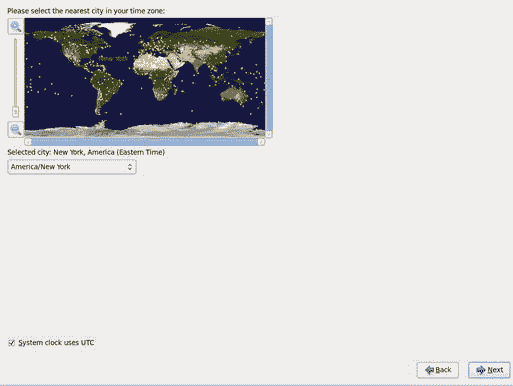
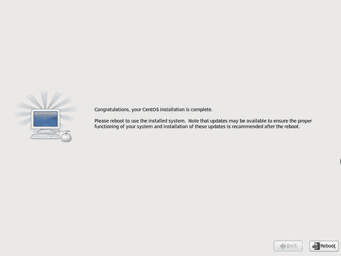
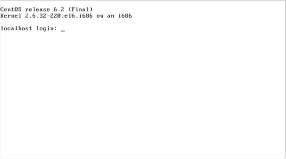
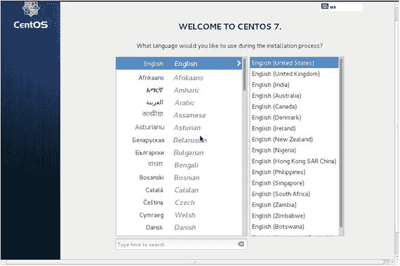
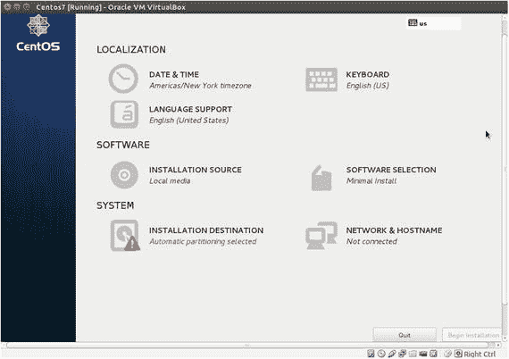
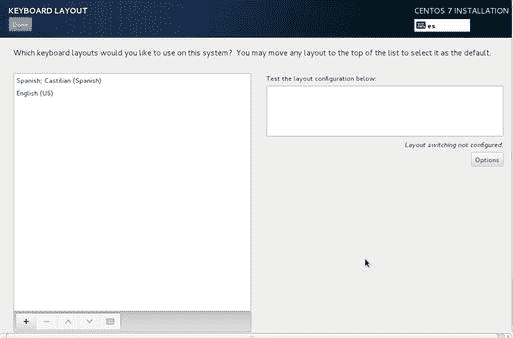
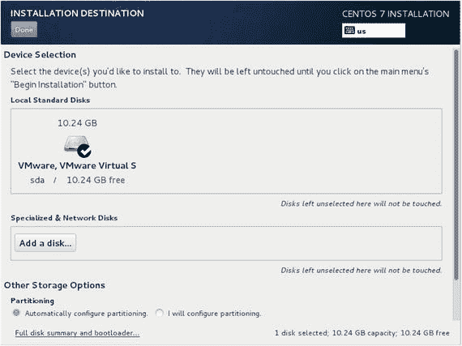
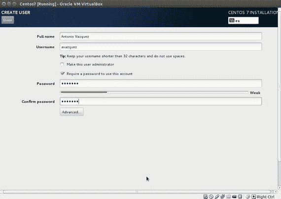

# 一、安装

## 1.1 厘 6

通常情况下，在电脑上安装 CentOS 的方法不止一种。因此，根据我们最初启动服务器的方式和安装包的来源，我们有许多选择。

*   我们可以从 DVD 启动和安装系统。这可能是最直接的选择，如果您只需要安装几台服务器，这也是正确的选择。我们从 DVD 启动服务器，也从 DVD 安装所有软件。
*   我们还可以使用 CentOS Network netinstall DVD 来引导服务器，然后从本地网络或互联网中的服务器安装软件包。如果我们必须安装大量服务器，这是一个不错的选择。
*   我们也可以使用 USB 设备来启动服务器。在这种情况下，我们首先使用 [UNetbootin](https://sourceforge.net/projects/unetbootin/) 、[、T3】 1 、T5 等软件包准备 USB 设备，我们还需要下载 CentOS 安装文件。一旦 USB 设备准备就绪，我们就可以用它来引导服务器，然后选择是从本地还是从网络存储库进行安装。](#Fn1)

此外，不管我们选择的安装类型是什么，我们也可以通过使用 kickstart 来自动化安装。kickstart 的使用超出了本书的范围，但它基本上包括向安装程序传递一个特殊的参数，该参数带有包含安装说明的脚本文件的位置。

然而，为了保持简单，在本书中，我们将只利用典型的 DVD 安装。第一件事必须做的是获得安装 DVD。这些可以从 [CentOS 官方网站](http://centos.org/)下载。 [2](#Fn2) 在写这本书的时候，ISO 文件可以从 [`http://wiki.centos.org/Download`](http://wiki.centos.org/Download) 的链接下载。 [3](#Fn3) 我们可以选择想要安装的确切版本、架构(32 位或 64 位)和安装类型(最小、网络等)。).我们将下载并刻录 ISO 文件`CentOS-6.2-i386-bin-DVD1.iso`和`CentOS-6.2-i386-bin-DVD2.iso`。一旦我们有了 DVD，安装就相当简单了。我们确保计算机被配置为从 DVD 启动，并使用里面的第一张安装 DVD 重新启动它。几秒钟后，我们将看到如图 [1-1](#Fig1) 所示的屏幕。

图 1-1。

Booting from the installation DVD

我们将选择第一个选项，“安装或升级现有系统”这将启动实际的安装程序。现在，我们可以检查安装介质(图 [1-2](#Fig2) )。一旦我们确定 DVD 没有问题，我们就单击“跳过”。

图 1-2。

Checking the installation media

现在系统将初始化图形安装程序(图 [1-3](#Fig3) )。

图 1-3。

The graphical installer

在接下来的屏幕中，我们必须选择语言和键盘布局(图 [1-4](#Fig4) 和 [1-5](#Fig5) )。

图 1-5。

Keyboard

图 1-4。

Language

现在，我们必须选择是将 CentOS 安装在标准磁盘中，还是安装在特殊设备中，如 SAN、LUN、iSCSI 驱动器等。由于大部分时间我们将安装标准磁盘，我们将选择第一个选项(图 [1-6](#Fig6) )。

图 1-6。

Choosing where to install the OS

点击下一步按钮后，出现警告(图 [1-7](#Fig7) ，告诉我们磁盘中的所有数据都将丢失。由于这是一个空白磁盘或不再需要其数据的磁盘，我们单击“Yes”。

图 1-7。

Storage device warning

程序现在要求我们输入将要安装的计算机的名称和域名(图 [1-8](#Fig8) )。我们可以现在就写这些信息，也可以在安装完成后再写。我们点击下一步。

图 1-8。

Computer name and domain

在接下来的屏幕中，我们必须选择时区和 root 密码(图 [1-9](#Fig9) 和 [1-10](#Fig10) )。

图 1-10。

Root password

图 1-9。

Time zone

现在，在开始实际安装之前，我们有几种选择(图 [1-11](#Fig11) )。我们可以选择使用整个磁盘，不管磁盘上可能存在什么 Linux 或非 Linux 分区，只使用空闲磁盘空间，自定义磁盘分区，等等。因为默认的分区方案是可以接受的，所以我们选择第一个选项。虽然，如果我们已经清楚地记住了服务器在网络中扮演的角色，我们可能必须定制分区布局，为不同的目录创建单独的分区或卷:`/home`、`/var`等。

图 1-11。

Partitioning layout

我们收到另一个警告(图 [1-12](#Fig12) ，提醒我们更改将被写入磁盘，并要求我们指定要安装的软件包。有几套预定义的软件、数据库服务器、web 服务器等。我们将选择最小化选项(图 [1-13](#Fig13) )并在需要时安装不同的软件包。

图 1-13。

Software selection

图 1-12。

Writing to disk

最后，实际安装过程开始(图 [1-14](#Fig14) )。

图 1-14。

Installing the software packages

几分钟后，安装将结束(图 [1-15](#Fig15) )，我们必须重启系统。

图 1-15。

Congratulations!

一旦引导过程完成，我们就有了一个正常工作的 CentOS 服务器(图 [1-16](#Fig16) )。

图 1-16。

Our brand new server

## 1.2 厘 7

正如您在“CentOS 6”一节中看到的，有许多类型的安装可供选择。正如我们之前在安装 CentOS 6 时所做的那样，我们也将从安装 DVD 中安装 CentOS 7。在写这本书的时候，这可以从官方网站下载。 [4](#Fn4) 下载完 ISO 文件后，我们可以将其刻录到 DVD 上。之后，只要计算机配置为从 DVD 启动，我们就可以用插入的安装 DVD 启动服务器了。几秒钟后，我们将看到如图 [1-17](#Fig17) 所示的屏幕。

图 1-17。

Booting from the CentOS 7 DVD

我们选择第一个选项:安装 CentOS 7。计算机现在将启动图形安装程序，我们将被询问在安装过程中想要使用的语言(图 [1-18](#Fig18) )。

图 1-18。

Installing CentOS 7

单击继续按钮后，我们可以看到安装的简要总结(图 [1-19](#Fig19) )。

图 1-19。

Installing CentOS 7

在该屏幕上，我们可以设置时区(图 [1-20](#Fig20) )或更改键盘布局(图 [1-21](#Fig21) )。

图 1-21。

Selecting the keyboard layout

图 1-20。

Choosing the time zone

我们也可以选择想要安装的软件包(图 [1-22](#Fig22) )。默认情况下，选择最小安装，但也有许多其他可用的软件包集合，如基本 Web 服务器或虚拟化主机。我们将保留默认选择:最小安装。

图 1-22。

Software selection

在开始实际安装之前，我们必须选择安装目的地(图 [1-23](#Fig23) )。

图 1-23。

Installation destination

在大多数情况下，我们选择本地硬盘，但我们也可以选择其他设备，如 SAN 磁盘。

在这一点上，我们也可以设置网络，但是，因为我们更喜欢在安装后进行，我们可以省略这一步，并单击开始安装按钮。

在系统复制文件时(图 [1-24](#Fig24) ，我们可以设置 root 密码并创建额外的用户(图 [1-25](#Fig25) 和 [1-26](#Fig26) )。

图 1-26。

Creating an additional user

图 1-25。

Setting the root password

图 1-24。

Installing the system

当安装完成时(图 [1-27](#Fig27) ，我们可以重启计算机并开始使用 CentOS 7。

图 1-27。

Installation complete! Footnotes [1](#Fn1_source)

SourceForge，《UNetbootin:适用于 Ubuntu、Fedora 和 Linux 发行版的可启动 live USB creator》， [`https://sourceforge.net/projects/unetbootin/`](https://sourceforge.net/projects/unetbootin/) ，2016 年。

  [2](#Fn2_source)

CentOS，《CentOS 计划》， [`http://centos.org/`](http://centos.org/) ，2016 年。

  [3](#Fn3_source)

CentOS， [`http://wiki.centos.org/Download`](http://wiki.centos.org/Download) ，2016。

  [4](#Fn4_source)

CentOs， [`http://www.centos.org/download` /](http://www.centos.org/download) ，2016。