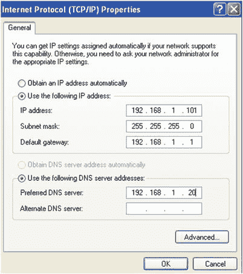
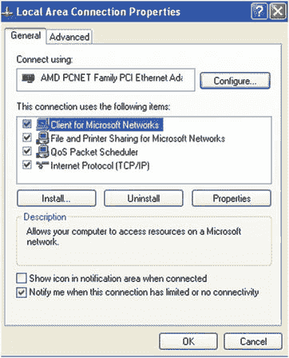

# 四、DNS

互联计算机的数量与日俱增。可以设计一个分层的网络编址方案，根据计算机的物理位置分配网络地址，但即使在这种情况下，使用名称而不是 IP 地址来指代计算机也总是更容易。本地 DNS(域名系统)服务器将允许我们在计算机名和 ip 地址之间建立直接关系，这反过来将使识别本地机器变得容易得多。

如今，DNS 服务是 IT 基础设施的重要组成部分，因为许多其他服务都依赖它才能正常工作。不幸的是，这一特性也让它成为黑客们感兴趣的目标。为了最小化攻击的风险，在配置服务时必须非常注意。

## 4.1 DNS 服务

为了相互通信，网络中的每台计算机都必须分配一个唯一的 IP 地址。可以说，这与电话网络有一定的相似性，在电话网络中，电话号码标识单个设备，并使其能够与其他电话通信。

使用 IP 地址对计算机来说没问题，但对人来说很麻烦。有必要记住用户想要连接的每台设备的 IP 地址。使用像 [`www.google.es`](http://www.google.es) 或 [`www.apress.com`](http://www.apress.com) 这样更容易记住的名字肯定要方便得多。

在内部，计算机通过使用它们的 IP 地址而不是它们相关的域名相互通信。因此，有必要拥有一个能够确定与域名相关联的 IP 地址的系统。

例如，当我们在我们最喜欢的网络浏览器中键入“ [`www.google.es`](http://www.google.es) ”时，我们的 PC 必须能够知道与名称 [`www.google.es`](http://www.google.es) 相关联的实际 IP 地址。一旦它发现 IP 地址是 173.194.41.215，它就建立连接并向用户显示网页。

如果我们在地址栏写了“ [`http://173.194.41.215`](http://173.194.41.215) ”，那就没必要问 [`www.google.es`](http://www.google.es) 的 IP 地址了。

DNS 服务器是一台保存相关名称(IP 地址)列表的机器。在互联网的早期，这是通过所有计算机为了相互通信而必须知道的单个文本文件来实现的。这个文件是`/etc/hosts`，现在还存在于每一台电脑中。它可以用来提供某种基本的名称解析。例如，我们可以打开文件`/etc/hosts`并添加下面一行:

```sh
1   192.168.10.19          www.dummy-domain.com

```

从现在开始，每次我们的计算机需要知道 [`www.dummy-domain.com`](http://www.dummy-domain.com) 的地址时，它会假定这个 IP 地址是 192.168.10.19。

```sh
 1   [root@delphos ∼]# cat /etc/hosts
 2   127.0.0.1  localhost localhost.localdomain localhost4 localhost4.localdomain4
 3   ::1        localhost localhost.localdomain localhost6 localhost6.localdomain6
 4   192.168.10.19      dummy-server.example.com
 5   192.168.10.19      www.dummy-domain.com
 6   [root@localhost ∼]# ping www.dummy-domain.com
 7   PING www.dummy-domain.com (192.168.10.19) 56(84) bytes of data.
 8   64 bytes from dummy-server.example.com (192.168.10.19): icmp_seq=1 ttl=64 time=0\
 9   056 ms
10   64 bytes from dummy-server.example.com (192.168.10.19): icmp_seq=2 ttl=64 time=0\
11   .058 ms
12   64 bytes from dummy-server.example.com (192.168.10.19): icmp_seq=3 ttl=64 time=0\
13   .052 ms
14   ^C
15   --- www.dummy-domain.com ping statistics ---
16   3 packets transmitted, 3 received, 0% packet loss, time 2459ms
17   rtt min/avg/max/mdev = 0.052/0.055/0.058/0.006 ms

```

使用主机文件进行域名解析仍然适用于小型网络，但随着互联网的发展，很明显需要一种新的域名解析系统，因此，DNS 服务应运而生。

DNS 服务器维护一个包含其域中所有 IP 地址和名称的数据库。当然，单个 DNS 服务器无法存储世界上存在的所有 IP 地址。相反，他们通常只持有关于他们领域的信息。

DNS 服务器以分层的方式组织，如图 [4-1](#Fig1) 所示。因此，当分配的 DNS 无法解析名称时，它会将请求从上层传递到另一个 DNS 服务器。举个例子就很好理解了。


图 4-1。

DNS hierarchy

假设我们正坐在`acme.net`域中的一台计算机前，我们想要访问 web `es.wikipedia.org`。电脑会向其本地 DNS 服务器查询 es.wikipedia.org 这个名字，但这个服务器只知道[`www.acme.net`](http://www.acme.net)`mail.acme.net`等。，所以它决定查询。net 服务器。那个。net 服务器不知道`es.wikipedia.org`，所以必须查询 root(。)服务器。根服务器不知道`es.wikipedia.org`的确切地址，但它知道。org 服务器，所以它将查询传递给这个服务器。那个。然后，org 服务器将查询 wikipedia.org 服务器，该服务器将最终联系与名称`es.wikipedia.org`相关联的 IP 地址。答案将被传回 acme.net 的 DNS 服务器，反过来，DNS 服务器将把该信息提供给请求它的计算机。

## 4.2 安装 DNS 服务器

为了说明上述内容，我们将安装一个正常工作的 DNS 服务器。我们将要安装的包是`bind`。如果我们已经有了互联网连接，我们可以使用没有`–disablerepo`和`–enablerepo`选项的`yum`，因为它将从预先配置的互联网存储库中下载软件。我们还可以传递`-y`参数来自动回复`yes`任何确认消息。否则，如果我们仍然没有互联网连接，我们将不得不使用我们之前看到的选项，并确保安装了 DVD。

```sh
1   [root@delphos ∼]# yum -y install bind

```

### 4.2.1 在 CentOS 6 中启动服务

一旦安装完毕，我们应该在`/etc/init.d`目录中有一个新的脚本。这个脚本将被称为`named`。

```sh
1   [root@delphos ∼]# ls /etc/init.d/named
2   /etc/init.d/named

```

我们可以通过调用带有`status`参数的脚本来检查这个新安装的服务的状态。

```sh
1   [root@delphos ∼]# /etc/init.d/named status
2   rndc: neither /etc/rndc.conf nor /etc/rndc.key was found
3   named is stopped

```

或者我们可以使用`service`命令。

```sh
1   [root@localhost ∼]# service named status
2   rndc: neither /etc/rndc.conf nor /etc/rndc.key was found
3   named is stopped

```

在这两种情况下，我们都被告知`named`被停止。一些文件似乎也不见了。稍后我会提供更多细节。无论如何，我们可以用下面的命令启动服务:

```sh
1   [root@delphos ∼]# service named start
2   Starting named:                                          [ OK ]
3   [root@delphos ∼]# service named status
4   rndc: neither /etc/rndc.conf nor /etc/rndc.key was found
5   named (pid  1570) is running...

```

现在，我们应该确保每次系统启动时都启动该服务。这个我们可以用`chkconfig`来核对。

```sh
1   [root@delphos ∼]# chkconfig --list named
2   named           0:off   1:off   2:off   3:off   4:off   5:off   6:off

```

我们可以看到，现在，`named`在六个运行级别中都没有被配置为活动的。我们会改变这一切。

```sh
1   [root@delphos ∼]# chkconfig named on
2   [root@delphos ∼]# chkconfig --list named
3   named           0:off   1:off   2:on    3:on   4:on   5:on   6:off

```

现在，`named`将在除 0(关闭)、1(单用户)或 6(重新启动)之外的每个运行级别中启动。到目前为止，我们还没有讨论过运行级别，但我可以说，运行级别是操作系统用来识别机器是否关闭(运行级别 0)、是否处于单用户模式(运行级别 1)、是否处于多用户文本模式(有限联网)、是否处于多用户文本模式(完全联网)(运行级别 3)、是否处于图形多用户模式(运行级别 5)或是否重新启动(运行级别 6)的手段。

使用`ps`命令，我们可以检查用户服务是否正在运行。

```sh
1   [root@delphos ∼]# ps -ef | grep named
2   named     1848     1  0 20:44 ?        00:00:00 /usr/sbin/named -u named

```

在这种情况下，命名服务作为命名用户运行。过去，有些人用根用户来执行这个操作，如果服务受到威胁，这是非常危险的。但是，在软件的最新版本中，默认配置使用指定用户启动服务。我们可以通过检查相关的脚本文件`(/etc/init.d/named`来了解这一点。这个文件很长，但是在`start()`部分，我们将看到实际启动服务的那一行。

```sh
1   daemon --pidfile "$ROOTDIR$PIDFILE" /usr/sbin/"$named" -u named ${OPTIONS};

```

通过传递`-u named`参数，服务将以指定用户的有效权限执行。因此，如果服务遭到破坏，后果将远不如以根用户身份执行服务严重。

如果我们愿意，我们甚至可以进一步定制这个脚本。我们可以创建一个新用户，授予它适当的权限，然后通过使用`-u`标志来使用它执行指定的服务。

### 4.2.2 在 CentOS 7 中启动服务

有了 CentOS 7，服务管理发生了很多变化，系统不再使用`/etc/init.d`中的脚本，除了少数服务。所有其他服务由`systemd`管理。

要检查服务的状态，我们必须使用`systemctl`命令。

```sh
1   [root@Centos7 ∼]# systemctl status named

2   named.service - Berkeley Internet Name Domain (DNS)

3       Loaded: loaded (/usr/lib/systemd/system/named.service; disabled)

4      Active: inactive (dead)

```

我们可以看到服务已经停止，所以我们启动它。

```sh
 1   [root@Centos7 ∼]# systemctl start named
 2   [root@Centos7 ∼]# systemctl status named
 3   named.service - Berkeley Internet Name Domain (DNS)
 4      Loaded: loaded (/usr/lib/systemd/system/named.service; disabled)
 5      Active: active (running) since dom 2014-11-23 01:05:36 CET; 4s ago
 6     Process: 2855 ExecStart=/usr/sbin/named -u named $OPTIONS (code=exited, status\
 7   =0/SUCCESS)
 8   Process: 2853 ExecStartPre=/usr/sbin/named-checkconf -z /etc/named.conf (code=\
 9   exited, status=0/SUCCESS)
10   Main PID: 2857 (named)
11   CGroup: /system.slice/named.service
12                  └─2857 /usr/sbin/named -u named
13   
14   nov 23 01:05:37 Centos7 named[2857]: validating @0x7fa9c062ff10: . NS: veri...un
15   nov 23 01:05:37 Centos7 named[2857]: validating @0x7fa9c062ff10: . NS: no v...nd
16   nov 23 01:05:37 Centos7 named[2857]: error (no valid RRSIG) resolving './NS...53
17   nov 23 01:05:37 Centos7 named[2857]: error (network unreachable) resolving ...53
18   nov 23 01:05:37 Centos7 named[2857]: validating @0x7fa9c062ff10: . NS: veri...un
19   nov 23 01:05:37 Centos7 named[2857]: validating @0x7fa9c062ff10: . NS: no v...nd
20   nov 23 01:05:37 Centos7 named[2857]: error (no valid RRSIG) resolving './NS...53
21   nov 23 01:05:37 Centos7 named[2857]: validating @0x7fa9c062ff10: . NS: veri...un
22   nov 23 01:05:37 Centos7 named[2857]: validating @0x7fa9c062ff10: . NS: no v...nd
23   nov 23 01:05:37 Centos7 named[2857]: error (no valid RRSIG) resolving './NS...53
24   Hint: Some lines were ellipsized, use -l to show in full.

```

该服务现在正在运行，但我们必须确保它在每次系统启动时都启动。

```sh
1   [root@Centos7 ∼]# systemctl enable named
2   ln -s '/usr/lib/systemd/system/named.service' '/etc/systemd/system/multi-user.ta\
3   rget.wants/named.service'

```

我们可以使用以下命令检查服务是否真正启用:

```sh
1   [root@Centos7 ∼]# systemctl list-unit-files --type=service

```

它将列出计算机中安装的所有服务。

```sh
1   UNIT FILE                                         STATE
2   auditd.service                                    enabled
3   .       
4   .       
5   .       
6   named.service                                     enabled
7   .        
8   .        
9   .        

```

正如我在谈论 CentOS 6 时提到的，使用`ps`命令，我们可以检查名为的有效用户是否正在运行。

```sh
1   [root@Centos7 ∼]# ps -ef | grep named
2   named    17881     1  0 17:35 ?        00:00:00 /usr/sbin/named -u named

```

我们看到服务正在以指定用户的身份运行。这是正确的，因为它限制了攻击者在服务受损时可能造成的损害。过去的一个不好的实践是作为根用户执行服务。如果我们看一下相关的单元文件(`lib/systemd/system/named.service`)，我们会看到下面一行:

```sh
1   ExecStart=/usr/sbin/named -u named $OPTIONS

```

其中我们告诉命名服务使用与命名用户相关联的权限来执行。

正如我在上一节中所说的，我们可以对此进行进一步的定制，并与另一个用户一起执行命名服务。我们只需用`-u new_user`选项启动指定的服务。

## 4.3 安装主服务器

在我们进入下一步之前，我将更多地谈谈 DNS 服务器的类型。

众所周知，DNS 服务器将域名转换成 IP 地址。但是它可以通过不同的方法做到这一点。

*   仅缓存服务器。在这种情况下，服务器不保存任何关于相关名称(IP 地址)的信息，所以它必须查询另一台服务器。但是一旦它得到一个答案，它就把它保存在缓存中，这样当另一个客户机执行同样的查询时，它可以快速响应，而不需要把请求转发给另一个服务器。
*   主服务器。这是一台服务器，它保存着属于所谓区域中的域的计算机的名称和 IP 地址的副本。主服务器有权改变与某个名称相关联的 IP，以及添加或删除新的注册。
*   从属服务器。这种类型的服务器也保存区域的副本，但它是只读的。从属服务器拥有回答有关域的查询所需的所有信息，但它不能更改、添加或删除任何注册。

如何组合这些类型的名称服务器取决于网络的规模。显然，我们总是需要一个主服务器来添加、删除或修改 DNS 条目，但是我们也至少需要一个从服务器，以便可以分配工作负载。此外，如果主服务器崩溃或遭到黑客攻击，人们可以用从服务器来代替它。

到目前为止，我们已经安装了必要的软件，但是，显然，我们还没有配置它。假设我们管理一个名为 olimpus.local 的域和一些名为 prometheus、zeus、aphrodite 等的机器。，我们希望确保当客户端计算机搜索计算机 aphrodite.olimpus.com 时，它会获得其关联的 IP 地址。为了实现这一点，我们必须创建区域。让我们一步一步来。

DNS 服务器的主配置文件是`/etc/named.conf`。在全新安装之后，它看起来会像这样:

```sh
 1   //
 2   // named.conf
 3   //
 4   // Provided by Red Hat bind package to configure the ISC BIND named(8) DNS
 5   // server as a caching only nameserver (as a localhost DNS resolver only).
 6   //
 7   // See /usr/share/doc/bind*/sample/ for example named configuration files.
 8   //
 9   
10   options {
11           listen-on port 53 { 127.0.0.1; };
12           listen-on-v6 port 53 { ::1; };
13           directory       "/var/named";
14           dump-file       "/var/named/data/cache_dump.db";
15           statistics-file "/var/named/data/named_stats.txt";
16           memstatistics-file "/var/named/data/named_mem_stats.txt";
17           allow-query     { localhost; };
18           recursion yes;
19
20           dnssec-enable yes;
21           dnssec-validation yes;
22           dnssec-lookaside auto;
23
24           /* Path to ISC DLV key */
25           bindkeys-file "/etc/named.iscdlv.key";
26   };
27
28   logging {
29           channel default_debug {
30                   file "data/named.run";
31                   severity dynamic;
32           };
33   };
34
35   zone "." IN {
36           type hint;
37           file "named.ca";
38   };
39
40   include "/etc/named.rfc1912.zones";

```

这是 CentOS 6 服务器的配置文件。在 CentOS 7 服务器中，该文件略有不同，但在这两种情况下，其配置方式完全相同。

以下是一些最重要的选项:

```sh
1   listen-on port 53 { 127.0.0.1; };
2   listen-on-v6 port 53 { ::1; };

```

服务器将只监听本地主机地址，也就是说，网络上的其他电脑将无法访问它。由于我们希望能够从其他计算机查询 DNS 服务器，我们将更改这两行。

```sh
1   listen-on port 53 { 192.168.1.21; };
2   listen-on-v6 port 53 { fe80::a00:27ff:feac:da50; };

```

这样，我们告诉服务器侦听 IPv4 地址为 192.168.1.21(以及 IPv6 地址 fe80::a00:27ff:feac:da50)的接口，即连接到与 DNS 客户端相同的局域网(LAN)的 IP。我们可以使用关键字 any，名称服务器将监听它的所有接口，但是只监听客户端将连接的接口更安全。

```sh
1   directory           "/var/named";

```

这仅仅意味着区域文件的默认目录将在`/var/named`中。我们不需要改变这一点。

```sh
1   allow-query          { localhost; };

```

我们希望服务器能够回答网络中任何计算机的查询，因此我们相应地更改了这个值。

```sh
1   allow-query        { 192.168.1.0/24; fe80::/64; };

```

我们可以使用单词 any 来允许来自任何设备的查询，而不管它的 IP 地址，但是这种方法有几个缺点。首先，我们的服务器可能会因网络外部设备的请求而过载。其次，我们可能允许恶意用户从 DNS 获取信息。

```sh
1   zone "." IN {
2           type hint;
3           file "named.ca";
4   };

```

这是到目前为止在配置文件中定义的唯一区域——层次结构中最顶层的区域。如果我们打开`/var/named/named.ca`文件，我们会看到它包含了互联网上根服务器的地址。这里，我们必须告诉服务器我们的域`olimpus.local`。在`.`区域定义下面，我们将键入以下内容:

```sh
1   zone "olimpus.local" IN {
2       type master;
3       file "olimpus.local.zone";
4   };

```

我们现在可以保存更改。为了确保文件`named.conf`的语法是正确的，我们可以使用`named-checkconf`。

```sh
1   [root@delphos ∼]# named-checkconf
2   [root@delphos ∼]#

```

正如我们所看到的，程序没有显示任何输出，所以我们可以假设语法是正确的。如果有语法错误，程序会告诉我们。例如，如果我们忘记了一个花括号，我们可能会收到如下消息:

```sh
1   [root@delphos ∼]# named-checkconf

2   /etc/named.conf:26: '}' expected near  ';'

```

但是现在我们必须创建`/var/named/olimpus.local.zone`文件。正如所料，该文件必须有正确的语法。如果我们正在从头开始创建一个区域文件，并且我们不记得关于语法的所有细节，我们可以看看`/usr/share/doc/bind-9.7.3/sample`目录中的一些示例文件。事实上，当我们试图配置或调整服务时，`/usr/share/doc`文件夹总是非常有用，因为我们可以找到大量的样本配置文件，几乎所有安装在服务器上的软件都有。

区域文件应该是这样的:

```sh
1   ;
2   ;Data file for olimpus.local
3   ;
4   $TTL 2D
5   olimpus.local.   IN SOA olimpus.local. root.olimpus.local. (
6                    2014082701;       Serial
7                    1D;             Refresh
8                    2H;             Retry
9                    1W;             Expire
10                   2D);            Default TTL
11   
12           IN NS delphos.olimpus.local.
13           IN MX 10 prometheus.olimpus.local.
14
15   delphos         IN A    192.168.1.20
16   prometheus      IN A    192.168.1.21
17   aphrodite       IN A    192.168.1.22
18   delphos         IN AAAA fe80::20c:29ff:fe78:4cb1
19   dns             IN CNAME        delphos
20   mail            IN CNAME        prometheus

```

以`;`开头的行是用于阐明文件内容的注释。之后，我们定义与区域文件相关的参数，比如刷新率和重试率、到期时间和默认 TTL。每个区域文件都必须有一个相关的序列号。当在 DNS 服务器之间复制信息时，将使用这个号码来确定是否有区域文件的新版本。

```sh
1   IN NS delphos.olimpus.local.

```

这是一个 NS 寄存器。它标识了`olimpus.local`的名称服务器是什么。这是一个强制注册。在这种情况下，唯一的名称服务器是`delphos.olimpus.local`，但是我们可以有很多。

```sh
1   IN MX 10 prometheus.olimpus.local.

```

类似地，我们在这里定义了`olimpus.local`域的邮件服务器和相关的优先级(10)。在这种情况下，我们只有一个邮件服务器，但我们可以有两个，甚至更多，并根据它们的处理能力为每个服务器分配不同的优先级。当我讨论邮件服务时，我们将再次看到这一点。

```sh
1   delphos         IN A      192.168.1.20
2   prometheus      IN A      192.168.1.21
3   aphrodite       IN A      192.168.1.22

```

现在，我们有了一个包含该区域中所有计算机及其关联 IP 地址的列表。这些被称为 A 型寄存器。

```sh
1   delphos                 IN AAAA fe80::20c:29ff:fe78:4cb1

```

此外，我们可以将名称和 IPv6 地址相关联；这就是 AAAA 注册的目的。

```sh
1   dns      IN CNAME     delphos
2   mail     IN CNAME     prometheus

```

最后，我们有几个 CNAME 寄存器，作为别名。也就是说，客户端将能够模糊地 ping 到`delphos.olimpus.local`或`dns.olimpus.local`。

一旦完成，我们可以用`named-checkzone`命令检查语法。

```sh
1   [root@delphos named]# named-checkzone olimpus.local olimpus.local.zone
2   zone olimpus.local/IN: loaded serial 20140827
3   OK

```

我们现在重启`named`服务。

在 centos 6 上:

```sh
1   [root@delphos named]# service named restart
2   Stopping named:                                 [ OK ]
3   Starting named:                                 [ OK ]

```

在 centos 7 上:

```sh
1   [root@Centos7 ∼]# systemctl restart named

```

显然，一切都很好，但是为了确保这一点，我们将向 DNS 服务器查询`delphos.olimpus.local`机器的地址。稍后您将更详细地看到我们可以用来检查 DNS 服务的一些工具，但是为了确保我们的名称服务器正在工作，我将在这里介绍`dig`命令。

`dig`允许我们查询我们选择的 DNS 服务器。要检查我们的新名称服务器，我们可以键入以下内容:

```sh
1   [root@delphos named]# dig @192.168.1.20 delphos.olimpus.local
2   -bash: dig: command not found

```

正如我以前几次提到的，如果这个工具没有默认安装，你必须找到它所属的包并安装它。从现在起我不再提这件事。

```sh
 1   [root@delphos named]# yum provides dig
 2   Loaded plugins: fastestmirror
 3   Loading mirror speeds from cached hostfile
 4   * c6-media:
 5   Warning: 3.0.x versions of yum would erroneously match against filenames.
 6   You can use "*/dig" and/or "*bin/dig" to get that behaviour
 7   No Matches found
 8   [root@delphos named]# yum provides */dig
 9   Loaded plugins: fastestmirror
10   Loading mirror speeds from cached hostfile
11   * c6-media:
12   32:bind-utils-9.7.3-8.P3.el6.i686 : Utilities for querying DNS name servers
13   Repo         : c6-media
14   Matched from:
15   Filename     : /usr/bin/dig
16
17   [root@delphos named]# yum install bind-utils
18   Loaded plugins: fastestmirror
19   Loading mirror speeds from cached hostfile
20   * c6-media:
21   Setting up Install Process
22   Resolving Dependencies
23   --> Running transaction check
24   ---> Package bind-utils.i686 32:9.7.3-8.P3.el6 will be installed
25   --> Finished Dependency Resolution
26
27   Dependencies Resolved
28
29   ===================================================================
30   Package       Arch       Version              Repository      Size
31   ========================================================================
32   Installing:
33    bind-utils   i686       32:9.7.3-8.P3.el6    c6-media       177 k
34
35   Transaction Summary
36   ===================================================================
37   Install       1 Package(s)
38
39   Total download size: 177 k
40   Installed size: 423 k
41   Is this ok [y/N]: y
42   Downloading Packages:
43   Running rpm_check_debug
44   Running Transaction Test
45   Transaction Test Succeeded
46   Running Transaction
47     Installing : 32:bind-utils-9.7.3-8.P3.el6.i686        1/1
48
49   Installed:
50     bind-utils.i686 32:9.7.3-8.P3.el6
51
52   Complete!
53   [root@delphos named]#

```

现在我们可以实际执行查询了。

```sh
 1   [root@delphos named]# dig @192.168.1.20 delphos.olimpus.local
 2   ; <<>> DiG 9.7.3-P3-RedHat-9.7.3-8.P3.el6 <<>> @192.168.1.20 delphos.olimpus.loc\
 3   al
 4   ; (1 server found)
 5   ;; global options: +cmd
 6   ;; Got answer:
 7   ;; ->>HEADER<<- opcode: QUERY, status: NOERROR, id: 27770
 8   ;; flags: qr aa rd ra; QUERY: 1, ANSWER: 1, AUTHORITY: 1, ADDITIONAL: 1
 9   
10   ;; QUESTION SECTION:
11   ;delphos.olimpus.local.          IN    A
12
13   ;; ANSWER SECTION:
14   delphos.olimpus.local.  172800   IN    A   192.168.1.20
15
16   ;; AUTHORITY SECTION:
17   olimpus.local.          172800   IN   NS   delphos.olimpus.local.
18
19   ;; ADDITIONAL SECTION:
20   delphos.olimpus.local.  172800   IN   AAAA    fe80::20c:29ff:fe78:4cb1
21
22   ;; Query time: 7 msec
23   ;; SERVER: 192.168.1.20#53(192.168.1.20)
24   ;; WHEN: Sat Aug      2 10:42:07 2014
25   ;; MSG SIZE  rcvd: 97
26
27   [root@delphos named]#

```

我们要查询 192.168.1.20 服务器，所以把它作为参数(`@192.168.1.20`)传递。我们可以看到查询正确执行了(`status: NOERROR`)。另外，服务器报告`delphos.olimpus.local`的 IPv4 地址为 192.168.1.20，IPv6 地址为 fe80::20c:29ff:fe78:4cb1，这是正确的。

看起来我们有一个正常工作的 DNS 服务器，但是，不幸的是，这并不完全正确。到目前为止，我们有一种方法可以将名称转换成 IP 地址。这就是所谓的直接查找，但我们也应该有一种方法将 IP 地址转换成机器名称(反向查找)。为了实现这一点，程序与我们以前看到的非常相似。

在`/etc/named.conf`文件中，我们将定义提供反向查找的新区域。我们将在`olimpus.local`区域下方输入它。

```sh
1   zone "1.168.192.in-addr.arpa" IN {
2           type master;
3           file "192.168.1.zone";
4   };

```

x.x.x.in-addr.arpa 格式是命名反向区域的标准方式，其中 x.x.x 是反向顺序的网络地址。

现在我们创建`/var/named/192.168.1.zone`文件。该语法非常类似于在`olimpus.local.zone`文件中使用的语法。

```sh
 1   $TTL 2D;
 2   1.168.192.in-addr.arpa. IN SOA delphos.olimpus.local. root.olimpus.local. (
 3                           2014082701      ;serial
 4                           259200          ;refresh(3 days)
 5                           14400           ;retry(4 hours)
 6                           18140           ;expire(3 weeks)
 7                           604800          ;minimum(1 week)
 8                           )
 9                   NS delphos.olimpus.local.
10
11   20              PTR delphos.olimpus.local.

```

我们检查了一下。

```sh
1   [root@delphos named]# named-checkzone 1.168.192.in-addr.arpa 192.168.1.zone
2   zone 1.168.192.in-addr.arpa/IN: loaded serial 2014082701
3   OK

```

我们重启服务。

在 centos 6 上:

```sh
1   [root@delphos named]# service named restart
2   Stopping named:                                [   OK   ]
3   Starting named:                                [   OK   ]

```

在 centos 7 上:

```sh
1   [root@Centos7 ∼]# systemctl restart named

```

并且我们用`dig`查询服务器。

```sh
 1   [root@delphos named]# dig @192.168.1.20 -x 192.168.1.20
 2   
 3   ; <<>> DiG 9.7.3-P3-RedHat-9.7.3-8.P3.el6 <<>> @192.168.1.20 -x 192.168.1.20
 4   ; (1 server found)
 5   ;; global options: +cmd
 6   ;; Got answer:
 7   ;; ->>HEADER<<- opcode: QUERY, status: NOERROR, id: 62275
 8   ;; flags: qr aa rd ra; QUERY: 1, ANSWER: 1, AUTHORITY: 1, ADDITIONAL: 2
 9   
10   ;; QUESTION SECTION:
11   ;20.1.168.192.in-addr.arpa.    IN     PTR
12   
13   ;; ANSWER SECTION:
14   20.1.168.192.in-addr.arpa. 172800 IN  PTR  delphos.olimpus.local.
15   
16   ;; AUTHORITY SECTION:
17   1.168.192.in-addr.arpa. 172800  IN    NS   delphos.olimpus.local.
18   
19   ;; ADDITIONAL SECTION:
20   delphos.olimpus.local.  172800  IN    A    192.168.1.20
21   delphos.olimpus.local.  172800  IN    AAAA fe80::20c:29ff:fe78:4cb1
22   
23   ;; Query time: 2 msec
24   ;; SERVER: 192.168.1.20#53(192.168.1.20)
25   ;; WHEN: Sat Aug 2 11:28:31 2014
26   ;; MSG SIZE rcvd: 136

```

如前所述，我们看到查询已经执行，没有错误(`status: NOERROR`)，并且服务器已经回答 IPv4 地址 192.168.1.20 被分配给服务器`delphos.olimpus.local`。

最后，我们将为 IPv6 创建反向区域。我们再次打开`/etc/named.conf`文件，添加以下几行:

```sh
1   zone "0.0.0.0.0.0.0.0.0.0.0.0.0.8.e.f.ip6.arpa" IN {
2           type master;
3           file "fe80.0.0.0.zone";
4   };

```

如我们所见，标准名称类似于 IPv4 区域使用的名称。也是由网络地址逆序组成，不过现在后缀是`ip6.arpa`。

至于`/var/named/fe80.0.0.0.zone`，下面是我们将要输入的内容:

```sh
 1   $TTL 172800 ; 2 days
 2   0.0.0.0.0.0.0.0.0.0.0.0.0.8.e.f.ip6.arpa. IN SOA delphos.olimpus.local. root.oli\
 3   mpus.local. (
 4                          2014082701         ;serial
 5                          259200             ;refresh(3 days)
 6                          14400              ;retry(4 hours)
 7                          18140              ;expire(3 weeks)
 8                          604800             ;minimum(1 week)
 9                          )
10    
11                                   NS delphos.olimpus.local.
12   1.b.c.4.8.7.e.f.f.f.9.2.c.0.2.0 IN PTR delphos

```

我们检查结果。

```sh
1   [root@delphos named]# named-checkzone 0.0.0.0.0.0.0.0.0.0.0.0.0.8.e.f.ip6.arpa f\
2   e80.0.0.0.zone
3   zone 0.0.0.0.0.0.0.0.0.0.0.0.0.8.e.f.ip6.arpa/IN: loaded serial 2014082701
4   OK

```

我们重启`named`服务并再次查询服务器。

```sh
 1   [root@delphos named]# dig @192.168.1.20 -x fe80::20c:29ff:fe78:4cb1
 2   
 3   ; <<>> DiG 9.7.3-P3-RedHat-9.7.3-8.P3.el6 <<>> @192.168.1.20 -x fe80::20c:29ff:f\
 4   e78:4cb1
 5   ; (1 server found)
 6   ;; global options: +cmd
 7   ;; Got answer:
 8   ;; ->>HEADER<<- opcode: QUERY, status: NOERROR, id: 29346
 9   ;; flags: qr aa rd ra; QUERY: 1, ANSWER: 1, AUTHORITY: 1, ADDITIONAL: 2
10   
11   ;; QUESTION SECTION:
12   ;1.b.c.4.8.7.e.f.f.f.9.2.c.0.2.0.0.0.0.0.0.0.0.0.0.0.0.0.0.8.e.f.ip6.arpa. IN PT\
13   R
14   
15   ;; ANSWER SECTION:
16   1.b.c.4.8.7.e.f.f.f.9.2.c.0.2.0.0.0.0.0.0.0.0.0.0.0.0.0.0.8.e.f.ip6.arpa. 172800\
17   IN PTR delphos.0.0.0.0.0.0.0.0.0.0.0.0.0.8.e.f.ip6.arpa.
18   
19   ;; AUTHORITY SECTION:
20   0.0.0.0.0.0.0.0.0.0.0.0.0.8.e.f.ip6.arpa. 172800 IN NS delphos.olimpus.local.
21   
22   ;; ADDITIONAL SECTION:
23   delphos.olimpus.local.    172800        IN        A       192.168.1.20
24   delphos.olimpus.local.    172800        IN        AAAA        fe80::20c:29ff:fe78:4cb1
25   
26   ;; Query time: 1 msec
27   ;; SERVER: 192.168.1.20#53(192.168.1.20)
28   ;; WHEN: Sat Aug      2 11:58:03 2014
29   ;; MSG SIZE  rcvd: 191

```

现在一切正常，所以我们将配置它在重启后自动启动。做这件事有不同的方法。比如在 CentOS 6 中，我们可以用`chkconfig`。

```sh
1   [root@delphos ∼]# chkconfig named on
2   [root@delphos ∼]# chkconfig --list named
3   named           0:off   1:off   2:on   3:on   4:on   5:on   6:off

```

在 CentOS 7 中，我们应该使用`systemctl`命令。

```sh
1   [root@Centos7 ∼]# systemctl enable named

```

从现在开始，每次我们重新启动服务器，命名的服务将被激活。

现在，我们将能够解析我们在区域中定义的域名，但如果我们希望我们的服务器解析互联网域名，如 [`www.google.com`](http://www.google.com) ，我们必须将这些请求转发到外部 DNS 服务器。如果外部 DNS 服务器 IP 地址是 192.168.1.1，我们必须在`/etc/named.conf`文件中包含以下行:

```sh
1   forwarders {
2                192.168.1.1;
3           };

```

这些前面的行应该包含在 general options 部分中，以便配置文件保持如下形式:

```sh
 1   options {
 2           listen-on port 53 { any; };
 3           listen-on-v6 port 53 { any; };
 4   .
 5   .
 6   .
 7   forwarders {
 8                   192.168.1.1;
 9           };
10   .
11   .
12   .
13   };

```

此外，为了正确解析外部域名，我们需要激活递归，方法是在`/etc/named.conf`文件中添加选项`recursion yes`(如果还没有包含的话):

```sh
1   options {
2   .
3   .
4   .
5   recursion yes
6   .
7   .
8   .
9   };

```

## 4.4 客户端配置

在 Linux 中，我们可以在`/etc/resolv.conf`文件中看到当前的 DNS 客户端配置。

```sh
1   [root@delphos ∼]# cat /etc/resolv.conf
2   nameserver 192.168.1.20
3   search olimpus.local

```

在本例中，客户端将向地址为 192.168.1.20 的服务器发送 DNS 请求。如果没有提供 DNS 后缀，会自动添加`olimpus.local`。

我们可以手动编辑这个文件，但是使用每个 Linux 发行版都有的管理工具通常更方便。比如在 CentOS 6 中，我们可以使用`system-config-network`程序。在 CentOS 7 中，没有一个`system-config-network`程序，但是有一个类似的程序叫做`nmtui`。在苏塞，我们可以对亚斯特做同样的事情。在 Ubuntu 中，我们可以打开系统设置，然后进入网络。

另一方面，在 Windows 中，我们必须编辑局域网连接，然后编辑 TCP/IP 的属性(图 [4-2](#Fig2) 和 [4-3](#Fig3) )。



图 4-3。

IP configuration



图 4-2。

LAN connection properties

当然，为了让客户端能够访问 DNS 服务器，我们必须允许流量通过防火墙的端口 53 UDP。

在 centos 6 上:

```sh
1   [root@delphos ∼]# iptables -I INPUT 2 -m state --state new -p udp --dport 53 -j \
2   ACCEPT

```

在 centos 7 上:

```sh
1   [root@CentOS7 ∼]# firewall-cmd --add-service=dns
2   success

```

在 CentOS 7 中，使用前面的命令，我们允许 UDP 和 TCP 协议的流量到达端口 53。你可以在这本书的第 [10](10.html) 章看到更多关于 CentOS 7 中包含的防火墙的细节。

## 4.5 从属服务器和区域传输

此时，我们有了一个名称服务器，它保存了与`olimpus.local.zone`相关的所有信息。正如我们将在本书中看到的，DNS 是最重要的，因为它影响到许多其他服务。不用说，服务的关闭对我们的网络来说可能是一场彻底的灾难。为了尽量减少这种风险，我们可以安装另一台服务器来提供名称服务。这个新服务器将是一个从属服务器，即一个具有区域文件只读副本的服务器。它可以回答查询，但不能更新信息。因此，我们有两台服务器来分担负载。此外，如果主服务器变得完全不可用，我们可以很容易地将从服务器转换为主服务器。

因此，为了尝试平衡网络中不同域名服务器之间的负载，我们必须相应地配置客户端。例如，如果我们有一个主服务器(192.168.1.20)和一个从服务器(192.168.1.40)，我们应该配置一半的客户端，将主服务器作为“首选服务器”，将从服务器作为“备用服务器”。在另一半中，我们应该反其道而行之，将从服务器配置为“首选服务器”，将主服务器配置为“备用服务器”。这样，我们不仅可以在两台服务器上分配工作负载，还可以保护自己免受其中一台名称服务器故障的影响，因为如果客户端无法联系其主服务器，它会连接到辅助服务器。

您已经在前一章中看到了如何安装 CentOS，所以我假设您有一个正常工作的 CentOS 服务器。我们将像之前看到的那样安装`bind`包。必须修改`named.conf`文件以添加以下几行:

```sh
 1   zone "olimpus.local" IN {
 2   type slave;
 3   file "slaves/olimpus.local.zone";
 4   masters {
 5                   192.168.1.20;
 6           };
 7   };
 8   
 9   zone "1.168.192.in-addr.arpa" IN {
10           type slave;
11           file "slaves/192.168.1.zone";
12           masters {
13                   192.168.1.20;
14           };
15   
16   };
17   
18   zone "0.0.0.0.0.0.0.0.0.0.0.0.0.8.e.f.ip6.arpa" IN {
19           type slave;
20           file "slaves/fe80.0.0.0.zone";
21           masters {
22                   192.168.1.20;
23           };
24   
25   };

```

基本上，我们命名我们的区域，声明它们是从区域，并告诉服务器关于主服务器的信息，在本例中是 192.168.1.20。

当然，我们必须对主服务器进行同样的修改，以确保服务器监听所有网络地址，并且可以被任何人查询。

```sh
1   listen-on port 53 { any; };
2   listen-on-v6 port 53 { any; };
3   allow-query     { any; };

```

我们还必须在主服务器的区域文件中做一些小的修改。我们将为从属服务器创建另一个 NS 寄存器。如果新服务器是 prometheus，新行如下所示:

```sh
1   .
2   .
3   .
4   IN NS delphos.olimpus.local.
5   IN NS prometheus.olimpus.local.
6   .
7   .
8   .

```

这应该在`olimpus.local.zone`、`192.168.1.zone`和`fe80.0.0.0.zone`文件中完成。此外，我们还应该在区域文件更新时通知从属服务器。为此，我们在`named.conf`文件的区域定义中使用了`notify yes`指令:

```sh
 1   zone "olimpus.local" IN {
 2           type master;
 3           file "olimpus.local.zone";
 4           notify yes;
 5   };
 6   
 7   zone "1.168.192.in-addr.arpa" IN {
 8         type master;
 9         file "192.168.1.zone";
10         notify yes;
11   };
12   
13   zone "0.0.0.0.0.0.0.0.0.0.0.0.0.8.e.f.ip6.arpa" IN {
14           type master;
15           file "fe80.0.0.0.zone";
16           notify yes;
17   };

```

在从属服务器中，`named`服务应该能够在`/var/named/slaves`文件夹中创建区域文件，因此我们将确保指定的用户有权写入该目录。

```sh
1   [root@delphos named]# ls -ld slaves/
2   drwxrwx---. 2 named named 4096 Dec   8   2011 slaves/

```

我已经简单回顾了 SELinux。它可以被描述为一种安全机制，创建了另一层防止未授权访问的保护，并限制了黑客可能对系统造成的损害。SELinux 限制了一个进程可以做什么，这当然包括命名服务。我们将看看如何让`named`与它一起工作。

首先，我们检查 SELinux 是否处于活动状态:

```sh
1   [root@delphos named]# sestatus
2   SELinux status:                   enabled
3   SELinuxfs mount:                  /selinux
4   Current mode:                     enforcing
5   Mode from config file:            enforcing
6   Policy version:                   24
7   Policy from config file:          targeted

```

我们还必须检查与 DNS 服务相关的 SELinux 布尔值。

```sh
1   [root@delphos named]# getsebool -a | grep named
2   named_write_master_zones --> off

```

该参数意味着`named`将不被允许写入区域文件。显然，这将导致区域传输失败，因此我们必须将值更改为`on`。

```sh
1   [root@delphos named]# setsebool named_write_master_zones on
2   [root@delphos named]# getsebool -a | grep named
3   named_write_master_zones --> on

```

我们将通过`-P`使更改永久化。

```sh
1   [root@delphos ∼]# setsebool -P named_write_master_zones 1

```

传输区域时，从属服务器必须连接到主服务器上的端口 53。显然，这个端口必须可以从从属服务器访问。为了检查这一点，我们可以从从属服务器执行`nmap`程序。

```sh
1   [root@delphos named]# nmap -p 53 192.168.1.20
2   Starting Nmap 5.21 ( http://nmap.org ) at 2013-11-12 01:12 CET
3   mass_dns: warning: Unable to determine any DNS servers. Reverse DNS is disabled.\
4   Try using --system-dns or specify valid servers with --dns-servers
5   Nmap scan report for 192.168.1.20
6   Host is up (0.00026s latency).
 7   PORT    STATE      SERVICE
 8   53/tcp filtered domain
 9   MAC Address: 00:0C:29:78:4C:B1 (VMware)
10   
11   Nmap done: 1 IP address (1 host up) scanned in 0.06 seconds

```

正如我们看到的，端口正在被过滤。我们必须打开主服务器防火墙的端口。在本书的后面，您还将看到防火墙的更详细的用法。现在，我将只解释如何打开端口。根据我们使用的是 CentOS 6 还是 CentOS 7，实现方式会有所不同。

在 CentOS 6 中，我们可以通过在主服务器中键入`iptables -L`来列出防火墙配置。

```sh
 1   [root@delphos named]# iptables -L
 2   Chain INPUT (policy ACCEPT)
 3   target       prot opt source        destination
 4   ACCEPT       all  --  anywhere      anywhere       state RELATED,ESTAB\
 5   LISHED
 6   ACCEPT       icmp --  anywhere      anywhere
 7   ACCEPT       all  --  anywhere      anywhere
 8   ACCEPT       tcp  --  anywhere      anywhere       state NEW tcp dpt:s\
 9   sh
10   REJECT       all  --  anywhere      anywhere       reject-with icmp-ho\
11   st-prohibited
12   
13   Chain FORWARD (policy ACCEPT)
14   target      prot opt source        destination
15   REJECT        all --  anywhere     anywhere        reject-with icmp-ho\
16   st-prohibited
17   
18   Chain OUTPUT (policy ACCEPT)
19   target        prot opt source       destination

```

默认情况下，只允许连接到`ssh`端口。我们必须添加下面一行来允许访问端口 53。

```sh
1   [root@delphos named]# iptables -I INPUT 5 -m state --state NEW -m tcp -p tcp --d\
2   port 53 -j ACCEPT

```

我们在第五个位置插入一个新的输入规则。我们指定应该允许到端口 53 的新连接。一旦建立了新的连接，也将允许进一步的流量，如下行所示:

```sh
1   ACCEPT all -- anywhere       anywhere           state RELATED,ESTAB\
2   LISHED

```

完整的防火墙规则集可能与此类似:

```sh
 1   [root@delphos named]# iptables -L
 2   Chain INPUT (policy ACCEPT)
 3   target     prot opt source       destination
 4   ACCEPT     all  --  anywhere     anywhere     state RELATED,ESTAB\
 5   LISHED
 6   ACCEPT     icmp --  anywhere     anywhere
 7   ACCEPT     all  --  anywhere     anywhere
 8   ACCEPT     tcp  --  anywhere     anywhere     state NEW tcp dpt:s\
 9   sh
10   ACCEPT     tcp  --  anywhere     anywhere     state NEW tcp dpt:d\
11   omain
12   REJECT     all  --  anywhere     anywhere     reject-with icmp-ho\
13   st-prohibited
14   
15   Chain FORWARD (policy ACCEPT)
16   target     prot opt source       destination
17   REJECT     all -- anywhere       anywhere     reject-with icmp-ho\
18   st-prohibited
19   
20   Chain OUTPUT (policy ACCEPT)
21   target     prot opt source       destination

```

在 CentOS 7 中，也可以使用`iptables`，但建议使用`firewall-cmd`命令。首先，我们要找出默认区域。

```sh
1   [root@delphos ∼]# firewall-cmd --get-default-zone
2   public

```

然后，我们列出允许的服务。

```sh
1   [root@delphos ∼]# firewall-cmd --zone=internal --list-services
2   ssh

```

在这种情况下，只允许使用`ssh`服务，所以我们必须添加`dns`服务。

```sh
1   [root@delphos ∼]# firewall-cmd --zone=internal --add-service=dns
2   success

```

如果现在我们从从属服务器用`nmap`重复测试，我们将看到端口是打开的。

```sh
 1   [root@delphos named]# nmap -p 53 192.168.1.20
 2   
 3   Starting Nmap 5.21 ( http://nmap.org ) at 2013-11-12 01:31 CET
 4   mass_dns: warning: Unable to determine any DNS servers. Reverse DNS is disabled.\
 5    Try using --system-dns or specify valid servers with --dns-servers
 6   Nmap scan report for 192.168.1.20
 7   Host is up (0.0020s latency).
 8   PORT     STATE  SERVICE
 9   53/tcp open         domain
10   MAC Address: 00:0C:29:78:4C:B1 (VMware)
11   
12   Nmap done: 1 IP address (1 host up) scanned in 0.07 seconds

```

我们将在从属服务器中做同样的事情，这样区域传输可以双向进行。

现在我们可以通过重启从服务器上的`named`服务来检查传输区是否真的工作。

在 centos 6 上:

```sh
1   [root@delphos named]# service named restart
2   Stopping named:                               [ OK ]
3   Starting named:                               [ OK ]
4   [root@delphos named]#

```

在 centos 7 上:

```sh
1   [root@Centos7 ∼]# systemctl restart named

```

如果一切正常，我们现在应该在`/var/named/slaves`文件夹中有三个文件。

```sh
1   [root@delphos named]# ls /var/named/slaves/
2   192.168.1.zone  fe80.0.0.0.zone  olimpus.local.zone

```

现在，每当我们在主服务器中修改一个区域时，我们都会更新序列号，因此这一更改应该会被复制到从服务器。例如，假设我们添加一个新的服务器 vulcan，其 IPv4 为 192.168.1.23，IPv6 为 fe80::20c:29ff:fedf:d786/64。

我们在区域文件中添加新的 A 和 AAAA 寄存器。

```sh
 1   .
 2   .
 3   .
 4   delphos       IN A     192.168.1.20
 5   prometheus    IN A     192.168.1.21
 6   aphrodite     IN A     192.168.1.22
 7   vulcan        IN A     192.168.1.23
 8   
 9   delphos       IN AAAA  fe80::20c:29ff:fe78:4cb1
10   prometheus    IN AAAA  fe80::20c:29ff:feeb:4443
11   vulcan        IN AAAA  fe80::20c:29ff:fedf:d786
12   .
13   .
14   .

```

然后，我们在反向区域文件中添加 PTR 寄存器。

```sh
 1   .
 2   .
 3   .
 4   22              PTR vulcan.olimpus.local.
 5   .
 6   .
 7   .
 8   6.8.7.d.f.d.e.f.f.f.9.2.c.0.2.0 IN PTR vulcan

```

最后，我们更新所有三个文件中的序列号。

```sh
 1   2014090102;           Serial

```

根据区域本身中定义的参数，区域文件的更新应该随时进行。但是，在任何情况下，我们都可以用`rndc`命令强制进行分区转移。(参见下一节“DNSSEC 和 TSIG”，了解如何安装它。)我们从从属服务器执行它。

```sh
1   rndc retransfer olimpus.local

```

几秒钟后，主设备和从设备将获得相同的信息。我们可以通过用`dig`命令查询两个服务器来检查这一点。从从属服务器，我们可以查询两个服务器。首先，我们查询从属服务器本身。

```sh
 1   [root@delphos ∼]# dig @192.168.1.21 prometheus.olimpus.local
 2   
 3   ; <<>> DiG 9.7.3-P3-RedHat-9.7.3-8.P3.el6 <<>> @192.168.1.21 prometheus.olimpus.\
 4   local
 5   ; (1 server found)
 6   ;; global options: +cmd
 7   ;; Got answer:
 8   ;; ->>HEADER<<- opcode: QUERY, status: NOERROR, id: 18441
 9   ;; flags: qr aa rd ra; QUERY: 1, ANSWER: 1, AUTHORITY: 2, ADDITIONAL: 3
10   
11   ;; QUESTION SECTION:
12   ;prometheus.olimpus.local.           IN      A
13   
14   ;; ANSWER SECTION:
15   prometheus.olimpus.local. 172800     IN      A       192.168.1.21
16   
17   ;; AUTHORITY SECTION:
18   olimpus.local.           172800       IN     NS      prometheus.olimpus.local.
19   olimpus.local.           172800       IN     NS      delphos.olimpus.local.
20   
21   ;; ADDITIONAL SECTION:
22   delphos.olimpus.local.   172800       IN     A       192.168.1.20
23   delphos.olimpus.local.   172800       IN     AAAA    fe80::20c:29ff:fe78:4cb1
24   prometheus.olimpus.local 172800       IN     AAAA     fe80::20c:29ff:feeb:4443
25   
26   ;; Query time: 1 msec
27   ;; SERVER: 192.168.1.21#53(192.168.1.21)
28   ;; WHEN: Sun Aug      3 04:40:00 2014
29   ;; MSG SIZE  rcvd: 166

```

然后我们查询主服务器，看两个答案是否相同。我们必须考虑到防火墙可能会阻止查询。为了允许区域传输，我们在防火墙之前打开了 TCP 端口 53 的连接。然而，DNS 查询不使用 TCP 端口 53，而是使用 UDP 端口 53。如果是这种情况，我们必须在防火墙中打开 UDP 端口 53。

在 centos 6 上:

```sh
1   [root@delphos ∼]# iptables -I INPUT 4 -p udp --dport 53 -j ACCEPT

```

在 centos 7 上:

我们用于允许区域传输的同一命令将允许传输和查询。

```sh
1   [root@Centos7 ∼]# firewall-cmd --zone=internal --add-service=dns
2   success

```

现在我们可以执行查询了。

```sh
 1   [root@delphos ∼]# dig @192.168.1.20 prometheus.olimpus.local
 2   
 3   ; <<>> DiG 9.7.3-P3-RedHat-9.7.3-8.P3.el6 <<>> @192.168.1.20 prometheus.olimpus.\
 4   local
 5   ; (1 server found)
 6   ;; global options: +cmd
 7   ;; Got answer:
 8   ;; ->>HEADER<<- opcode: QUERY, status: NOERROR, id: 57417
 9   ;; flags: qr aa rd ra; QUERY: 1, ANSWER: 1, AUTHORITY: 2, ADDITIONAL: 3
10   
11   ;; QUESTION SECTION:
12   ;prometheus.olimpus.local.       IN        A
13   
14   ;; ANSWER SECTION:
15   prometheus.olimpus.local. 172800 IN        A          192.168.1.21
16   
17   ;; AUTHORITY SECTION:
18   olimpus.local.            172800 IN        NS         prometheus.olimpus.local.
19   olimpus.local.            172800 IN        NS         delphos.olimpus.local.
20   
21   ;; ADDITIONAL SECTION:
22   delphos.olimpus.local.    172800 IN        A         192.168.1.20
23   delphos.olimpus.local.    172800 IN        AAAA      fe80::20c:29ff:fe78:4cb1
24   prometheus.olimpus.local. 172800 IN        AAAA      fe80::20c:29ff:feeb:4443
25   
26   ;; Query time: 2 msec
27   ;; SERVER: 192.168.1.20#53(192.168.1.20)
28   ;; WHEN: Sun Aug   3 05:42:05 2014
29   ;; MSG SIZE  rcvd: 166

```

正如我们所看到的，两种情况下的结果是一样的。

现在我们有了一个正常工作的 DNS 基础设施，我们必须注意一些安全问题。为了让从服务器拥有与主服务器相同的信息，区域必须从主服务器传输到从服务器。默认情况下，`bind`允许区域传送到任何电脑。这可能有风险，因为恶意用户可能会获取网络中的计算机列表，甚至识别出其中的一些计算机，如邮件服务器。有了这些信息，攻击就容易多了。因此，建议区域传输仅限于某些 IP 地址。事实上，通过使用密钥来限制区域的转移会更好，但是我们将在下一节(“DNSSEC 和 TSIG”)中看到这一点。

因此，如果从服务器的 IP 地址是 192.168.1.21，那么在主服务器中，我们应该更改`/etc/named.conf`文件中的区域定义。

```sh
 1   .
 2   .
 3   .
 4   zone "olimpus.local" IN {
 5           type master;
 6           file "olimpus.local.zone.signed";
 7           notify yes;
 8           allow-transfer {
 9                   192.168.1.21;
10           };
11   };
12   .
13   .
14   .

```

如果我们现在尝试从另一台计算机执行区域转移，将会出现以下错误:

```sh
1   antonio@antonio-i7:∼$ dig axfr @192.168.1.20 olimpus.local
2   
3   ; <<>> DiG 9.9.5-3ubuntu0.8-Ubuntu <<>> axfr @192.168.1.218 olimpus.local
4   ; (1 server found)
5   ;; global options: +cmd
6   ; Transfer failed.

```

当然，如果我们从一个从属服务器启动这个相同的命令，那么区域转移将毫无问题地执行。

我们应该在所有名称服务器和区域中重复此操作，只允许向某些 IP 地址传输。

## 4.6 DNSSEC 和 TSIG

域名服务在任何网络基础设施中都至关重要，但不幸的是，它很容易受到攻击。如果恶意黑客设法在网络中注入错误的 DNS 答案，他或她就能够控制流量。例如，假设一个用户想要查看她的邮件，因此试图访问 [`http://gmail.com`](http://gmail.com) 。如果攻击者能够发送域名`gmail.com`的 DNS 回复，用户的计算机将试图访问错误的`gmail.com`。

为了最小化这种风险，有两种互补的方法:TSIG(交易签名)和 DNSSEC(域名系统安全扩展)。

TSIG 是一种网络协议，其目的是提供一种对 DNS 数据库更新进行身份验证的方法。它通过使用钥匙来工作。首先，我们用`dnssec`命令生成一个密钥，然后我们用这个密钥配置从属服务器(或 DHCP 服务器)。这主要用于动态 DNS 和从属服务器。在第 5 章标题为“DHCP 和 DNS 动态更新”的部分，你会看到一个使用 TSIG 的完整例子。

保护我们的 DNS 基础设施免受区域篡改的第二种方法是 DNSSEC。DNSSEC 实际上并没有避免这些攻击，但它使得检测这些攻击成为可能。它通过对区域文件进行签名来工作，因此我们知道是否发生了未经授权的更改。要使用 DNSSEC，我们必须首先为我们的区域生成两个密钥。

所有这些步骤都将在主服务器上进行。

我们必须生成两组密钥:区域签名密钥(ZSK)和密钥签名密钥(KSK)。首先，我们创建 ZSK。

```sh
1   [root@delphos named]# dnssec-keygen -a RSASHA1 -b 512 -n ZONE olimpus.local
2   Generating key pair.....++++++++++++ ....++++++++++++
3   Kolimpus.local.+005+08586

```

生成密钥的过程可能非常非常长，长达几个小时。如果我们想加快这个过程，我们可以安装`haveged`，它充当一个随机数生成器。目前，`haveged`不包含在 CentOS 6 软件包中，但可以从[互联网](http://www.issihosts.com/haveged)安装。 [<sup>1</sup>](#Fn1) 另一方面，如果我们正在使用 CentOS 7，我们可以从 EPEL 仓库下载。该存储库不是 CentOS 7 的默认存储库的一部分，但是可以通过执行以下命令非常容易地对其进行配置:

```sh
1   [root@CentOS7 ∼]# yum install epel-release

```

接下来，我们生成 KSK。正如我之前说过的，这可能需要相当长的时间，但是如果我们之前执行了`haveged`服务，执行速度会快很多。

```sh
1   [root@delphos named]# dnssec-keygen -f KSK -a RSASHA1 -b 4096 -n ZONE olimpus.lo\
2   cal
3   Generating key pair.............++..............................................\
4   ..........................................++
5   Kolimpus.local.+005+35116

```

现在，我们必须将之前创建的密钥文件添加到区域文件中。

```sh
1   [root@delphos named]# cat Kolimpus.local.*.key >> olimpus.local.zone

```

并签署区域文件，如下所示:

```sh
1   [root@delphos named]# dnssec-signzone -N increment -o olimpus.local olimpus.loca\
2   l.zone
3   Verifying the zone using the following algorithms: RSASHA1.
4   Zone signing complete:
5   Algorithm: RSASHA1: KSKs: 1 active, 0 stand-by, 0 revoked
6                       ZSKs: 1 active, 0 stand-by, 0 revoked
7   olimpus.local.zone.signed

```

现在我们有了一个新的`olimpus.local.zone.signed`文件。我们必须改变`/etc/named.conf`中的`olimpus.local`区域的定义，以指向这个新文件。

```sh
1   .
2   .
3   .
4   zone "olimpus.local" IN {
5           type master;
 6           file "olimpus.local.zone.signed";
 7           notify yes;
 8   };
 9   .
10   .
11   .

```

我们重启`named`服务。在 6 分钟内:

```sh
 1   [root@delphos named]# service named restart
 2   Stopping named:                                 [ OK ]
 3   Starting named:                                 [ OK ]

```

在 centos 7 上:

```sh
 1   [root@CentOS7 named]# systemctl restart named

```

为了确保 DNSSEC 确实在工作，我们可以查询该域的 DNSKEY 记录，如下所示:

```sh
 1   [root@delphos ∼]# dig @192.168.1.20 DNSKEY olimpus.local. +multiline
 2   ;; Truncated, retrying in TCP mode.
 3   
 4   ; <<>> DiG 9.7.3-P3-RedHat-9.7.3-8.P3.el6 <<>> @192.168.1.20 DNSKEY olimpus.loca\
 5   l. +multiline
 6   ; (1 server found)
 7   ;; global options: +cmd
 8   ;; Got answer:
 9   ;; ->>HEADER<<- opcode: QUERY, status: NOERROR, id: 48176
10   ;; flags: qr aa rd ra; QUERY: 1, ANSWER: 2, AUTHORITY: 0, ADDITIONAL: 0
11   
12   ;; QUESTION SECTION:
13   ;olimpus.local.         IN DNSKEY
14   
15   ;; ANSWER SECTION:
16   olimpus.local.          172800  IN DNSKEY 257 3 5 (
17   AwEAAeGilVrj9hxnmjRY9Yd9SqrBMwtiqKwfSda3wXhn
18   d3koFZQzVI129xRVxEhaXpQvcH4tZG724hE/NF/zq6jI
19   H2q6OtU0poslWLnRTE4Cte0EMP/Q4dSpSzLqjT4+cPrw
20   Fyfgvv7q+dHBHJ0TiWJjeSffFDFcACPfqY3KIFHNxgD3
21   bBwdO/GXgLDACBVoH7qVCNRBosuji24lmxwYu9qO0qX5
22   sTF1mhmKpOm4u02CEVhSnTeXlER4XermehqLhOLlodWl
23   R75EmAYc13SvMS9CoFc66eXEOpSLOl7F9eZQ/RHh/Wob
24   x74moN1uSwP32fTYhJZr3GXOTey+kfnpvhBIxXRa6nbB
25   2jfLsN0PMb4ZEYTAXOICtevRDYptuM3ytakPd3elNfrm
26   px9vxkFMye1/18diS/VWXD7RBc8wpbK0aQBMYV94dKhB
27   a3F6SV9tbXF7nTadG7k0I+US0kUSfppCjWr+TTwdfvGR
28   e/M7XPM1riBv/zUgSp7XzOKWdYT2mQjPR4xl21FcsSwy
29   tehCWoS+xGEd3y9AaW7RHAwPjeexMR30458/h1cqQcEs
30   QCQltl3uboqjFon3s4iHcHIqtpnBUC/TaonMA39pBTXt
31   VFPO+EV3YJBKFgGf1qZRW9aFAU+BHAnaRt2svPmBId7n
32   4O778a14Jgaco4b64Y6Ij3Mx8as5
33   ) ; key id = 9187
34   olimpus.local.            172800 IN DNSKEY 256 3 5 (
35   AwEAAb386KgB7QrWAWBZ9+uSaHjHmpW+3TpcGkCfh9T4
36   Znl6BJVb/kPp6DmfeTRzjFUQSbAGRiI3yvzJ9+iEUhra
37          dME=
38       ) ; key id = 28332
39   
40   ;; Query time: 2 msec
41   ;; SERVER: 192.168.1.20#53(192.168.1.20)
42   ;; WHEN: Sun Aug   3 20:11:10 2014
43   ;; MSG SIZE   rcvd: 647

```

如您所见，该查询回答正确。

现在，为了执行一个非常简单的测试，我们应该将这个密钥保存在`/etc/trusted-key.key`文件中。

```sh
1   [root@centos7 ∼]# dig +noall +answer -t dnskey @192.168.1.20 olimpus.local > /et\
2   c/trusted-key.key

```

我们激活了对`dnssec`的使用，并在`/etc/named.conf`文件中添加了`trusted-keys`条目。我们包括之前获得的键值。

```sh
 1   options{
 2   .
 3   .
 4   .
 5   dnssec-enable yes
 6   dnssec-validation yes
 7   .
 8   .
 9   .
10   };
11   .
12   .
13   .
14   trusted-keys {
15   olimpus.local.         256 3 5 "AwEAAatIDOYQB6awuS3A8SDMaPdVuVHkNjzvwyRePG+gD/zyerAmpO9\
16   w X7o8yqXotVbsS6OCU5q3gBHqMwgAMjzzJxk=";
17   olimpus.local.     257 3 5 "AwEAAcdLMSqlh3e/m3vYm38+I0HJ45S7cC8o8Ie9s6eN+6XPVpM0/vM\
18   j N7azRBsoutLvOIrOHd556KYjiH5MzDTdcgQx4RD/hHI6HLshtmaW//HK 3MTDfPp1wLX2KEHS/v0HI\
19   7jZuatmpNViAoDRso16GlRk3kQJGmpdHZ8g AwoPns3zep5JB3CJLAipKbSh4kPJ0mPuR9n3jLfs4H+H\
20   148rhfEOao8+ f64Ut1viACzr03b1sWHs5YWlBu2C1ZYG8fF6sI5NLLedfCDLYiyzbD6D 94dnv4Wgjj\
21   AfJBiuFEPkXvZrD6vF/KxHqSTyV8lVuTOXdIi7oyXQCYv4 2MMj//nZSTm0wLgXiREEzQ02VbuL+OHLl\
22   9Oe66BXqmEH+F4HVADGAo68 4UXuSvZyJXnW7TPZ6pjyGHZLJ+eXfMuJgrN7OOkFYhX93Qgh9Dw9e9yt\
23   TnIuHoyCSTeXMY0rCmarjUJVgD0Mihl6dklcwx/NZrj/VPE9cizasxsx IZiavb5xhcfbXXOXqjQC94\
24   Bzt6526UE1w+qGkfBUze+NWpixz8WgLkua MXaJNAY7NxDvGpz1ridarJwe3zHnGT4RvaySZhTJKNUAe\
25   HDUnxitF6wR QpzXK9ZbGRnRMaFDII87c5WEIqSJXOkto8FKRxEuQDJTwTdyVlqPXBfH KJLMYExg2XV\
26   mVtXN";
27   };
28   .
29   .
30   .

```

重启`named`服务后，我们检查是否可以成功解析`olimpus.local zone`中的名称。

```sh
 1   [root@Centos7 ∼]# dig +noall +answer @192.168.1.20 delphos.olimpus.local
 2   delphos.olimpus.local.         172800        IN         A        192.168.1.218

```

如果我们试图解析其他域中的名称，我们会得到一个错误。

```sh
 1   [root@Centos7 ∼]# dig +noall +answer @192.168.1.20 www.linuxaholics.com
 2   [root@Centos7 ∼]# dig @192.168.1.218 www.linuxaholics.com
 3   
 4   ; <<>> DiG 9.9.4-RedHat-9.9.4-29.el7_2.3 <<>> @192.168.1.20 www.linuxaholics.com
 5   ; (1 server found)
 6   ;; global options: +cmd
 7   ;; Got answer:
 8   ;; ->>HEADER<<- opcode: QUERY, status: SERVFAIL, id: 8646
 9   ;; flags: qr rd ra; QUERY: 1, ANSWER: 0, AUTHORITY: 0, ADDITIONAL: 1
10   
11   ;; OPT PSEUDOSECTION:
12   ; EDNS: version: 0, flags:; udp: 4096
13   ;; QUESTION SECTION:
14   ;www.apress.com.                      IN       A
15   
16   ;; Query time: 4 msec
17   ;; SERVER: 192.168.1.218#53(192.168.1.20)
18   ;; WHEN: dom sep 25 16:21:06 CEST 2016
19   ;; MSG SIZE   rcvd: 43

```

在我们刚刚进行的测试中，这是完全正常的。我们为我们的区域创建了一个密钥`olimpus.local`，并将该密钥保存在`/etc/trusted-key.key`文件中。所以，从现在开始，我们的服务器信任自己，但是由于它没有`.com`区域的密钥，它可以检查接收到的信息是否正确并失败。

我们还可以使用带有`dig`命令的`+sigchase`标志来测试`dnssec`配置。

```sh
 1   [root@centos7 named]# dig +sigchase @192.168.1.20 olimpus.local
 2   .
 3   .
 4   .
 5   Launch a query to find a RRset of type DNSKEY for  zone: olimpus.local.
 6   
 7   ;; DNSKEYset that signs the RRset to chase:
 8   olimpus.local.        172800           IN         DNSKEY                257 3 5 AwEAAcdLMSqlh3e/m3vYm38+I
 9   .
10   .
11   .
12   ;; WE HAVE MATERIAL, WE NOW DO VALIDATION
13   ;; VERIFYING NSEC RRset for olimpus.local. with DNSKEY:4578: success
14   ;; OK We found DNSKEY (or more) to validate the RRset
15   ;; Ok, find a Trusted Key in the DNSKEY RRset: 10921
16   ;; VERIFYING DNSKEY RRset for olimpus.local. with DNSKEY:10921: success
17   
18   ;; Ok this DNSKEY is a Trusted Key, DNSSEC validation is ok: SUCCESS

```

在现实生活中，DNSSEC 是基于键、签名和层次结构的概念。当某个 DNS 域的管理员想要使用 DNSSEC 时，他创建密钥(如我们所做的那样)，签署区域(如我们所做的那样)，并发布域的公钥，这样每个人都可以检查区域的签名。显然，由于我们是在本地域上工作，我们还没有公布密钥。

DNSSEC 是对 DNS 协议安全性的一大改进，它应该在互联网上的每一个域名服务器中实现。尽管如此，在我们的例子中，我们可以禁用它，以便在本书的其余练习中更容易操作它。

## 4.7 Chroot

保护我们的名称服务器的另一个步骤是在 chroot 环境中工作。为了更好地理解这一点，让我们简单地看一下什么是 chroot 环境。

chroot 是一个改变当前进程的根目录的操作，这样这个程序就不能访问位于其工作目录下的文件。让我们看一个例子。

我们登录到我们的服务器并创建一个新文件夹。稍后，该文件夹将成为明显的根目录。

```sh
1   [root@delphos ∼]# mkdir -p /new/root

```

我们可以尝试使用`chroot`命令来更改用户会话。

```sh
1   [root@delphos ∼]# chroot /new/root/
2   chroot: failed to run command /bin/bash: No such file or directory

```

正如我们看到的，我们必须访问`/bin/bash`来更改用户会话。所以我们创建了一个`bin`子文件夹，并将`bash`文件复制到其中。

```sh
1   [root@delphos ∼]# mkdir /new/root/bin
2   [root@delphos ∼]# cp /bin/bash /new/root/bin/

```

然而，我们还没有完成。如果我们再次尝试运行`chroot`，我们会得到同样的错误。

```sh
1   [root@delphos ∼]# chroot /new/root/
2   chroot: failed to run command /bin/bash: No such file or directory

```

这是因为`bash`可执行文件是动态链接的，必须访问一系列库。我们可以通过使用`ldd`命令找出它需要什么库。注:库会有所不同，具体取决于操作系统的确切版本。

```sh
1   [root@delphos ∼]# ldd /bin/bash
2           linux-vdso.so.1 =>         (0x00007fffc57fe000)
3           libtinfo.so.5 => /lib64/libtinfo.so.5 (0x00007f76faeb3000)
4           libdl.so.2 => /lib64/libdl.so.2 (0x00007f76facaf000)
5           libc.so.6 => /lib64/libc.so.6 (0x00007f76fa8ed000)
6           /lib64/ld-linux-x86-64.so.2 (0x00007f76fb0f1000)

```

因此，我们创建一个新的子文件夹，并复制所需的文件。

```sh
1   [root@delphos ∼]# mkdir /new/root/lib64
2   [root@delphos ∼]# cp /lib64/libtinfo.so.5 /new/root/lib64/
3   [root@delphos ∼]# cp /lib64/libdl.so.2 /new/root/lib64/
4   [root@delphos ∼]# cp /lib64/libc.so.6 /new/root/lib64/
5   [root@delphos ∼]# cp /lib64/ld-linux-x86-64.so.2 /new/root/lib64/

```

现在我们可以执行`chroot`。

```sh
1   [root@delphos ∼]# chroot /new/root/
2   bash-4.2#

```

如果我们输入“pwd”，系统会告诉我们已经在根目录下了，我们将无法访问 chroot 环境之外的其他文件夹。

```sh
1   bash-4.2# pwd
2   /
3   bash-4.2# cd ..
4   bash-4.2# pwd
5   /

```

这是一个极其简单的 chroot 环境，仅用于概念验证。例如，如果我们尝试用`ls`命令列出目录内容，我们会得到一个错误，因为我们没有复制`ls`文件和它运行所依赖的库。除此之外，我们还应该创建一些其他文件夹，如`dev`子文件夹等。

一旦我们完成了这个小实验，我们就离开 chroot 环境并删除我们创建的文件夹。

```sh
1   bash-4.2# exit
2   exit
3   [root@delphos ∼]# rm -rf /new/root/

```

由于 chrooted 服务不能访问其主目录之外的文件夹或文件，所以这被认为是一个好的做法。因此，如果`named`服务受到威胁，它将只能访问其主目录的内容。

如果我们希望命名服务在 chroot 环境中执行，我们可以手动执行，就像我们之前在“概念验证”中所做的那样但是，幸运的是，有一个更简单的方法。我们只需要安装`bind-root`包。

```sh
1   [root@delphos ∼]# yum install bind-chroot

```

在安装包之后，我们看到在`/var/named`下面创建了一个新的子文件夹。该子文件夹包含`named`正常工作所需的所有文件和文件夹。

```sh
1   [root@delphos ∼]# ls -l /var/named/chroot/
2   total 0
3   drwxr-x---. 2 root  named 41 Sep 26 12:02 dev
4   drwxr-x---. 4 root  named 44 Sep 26 12:02 etc
5   drwxr-x---. 3 root  named 18 Sep 26 12:02 run
6   drwxrwx---. 3 named named 18 Sep 26 12:02 usr
7   drwxr-x---. 5 root  named 48 Sep 26 12:02 var

```

在安装完`bind-root`之后，`named`服务将已经在 CentOS 6 中的 chroot 环境中运行。

但是，在 CentOS 7 中，我们仍然需要启动这项服务。

```sh
1   [root@delphos ∼]# systemctl start named-chroot

```

我们必须确保该服务在每次系统启动时自动启动。

```sh
 1   [root@delphos ∼]# systemctl enable named-chroot
 2   ln -s '/usr/lib/systemd/system/named-chroot.service' '/etc/systemd/system/multi-\
 3   user.target.wants/named-chroot.service'

```

## 4.8 诊断工具

### 4.8.1 直流电源

`rndc`是管理域名服务器的绝佳工具。记住:当我们检查`named`服务的状态时，我们看到一条消息说“rndc:既没有找到/etc/rndc.conf，也没有找到/etc/rndc.key。”为了让`rndc`命令工作，这两个文件是必需的。`rndc`是控制 DNS 服务器的前端，所以我们必须修改`/etc/named.conf`来允许`rndc`管理服务器。我们可以用手来做，但通过键入`rndc-confgen`来做要容易得多。该命令将显示我们可以使用的样本`rndc.key`和`rndc.conf`文件。

`rndc-confgen`必须生成密钥，因此可能需要几分钟才能完成。需要一点耐心。

```sh
 1   [root@delphos ∼]# rndc-confgen
 2   # Start of rndc.conf
 3   key "rndc-key" {
 4          algorithm hmac-md5;
 5          secret "Yg1R5vvMWBu/+P9RxCKm8g==";
 6   };
 7   
 8   options {
 9           default-key "rndc-key";
10           default-server 127.0.0.1;
11           default-port 953;
12   };
13   # End of rndc.conf
14   
15   # Use with the following in named.conf, adjusting the allow list as needed:
16   # key "rndc-key" {
17   #        algorithm hmac-md5;
18   #        secret "Yg1R5vvMWBu/+P9RxCKm8g==";
19   # };
20   #
21   # controls {
22   #       inet 127.0.0.1 port 953
23   #       allow { 127.0.0.1; } keys { "rndc-key"; };
24   # };
25   # End of named.conf

```

因此，我们创建一个名为`/etc/rnc.conf`的文件，如下所示:

```sh
 1   # Start of rndc.conf
 2   key "rndc-key" {
 3           algorithm hmac-md5;
 4           secret "Yg1R5vvMWBu/+P9RxCKm8g==";
 5   };
 6   
 7   options {
 8           default-key "rndc-key";
 9           default-server 127.0.0.1;
10           default-port 953;
11   };
12   # End of rndc.conf

```

然后我们按照指示修改`/etc/named.conf`文件。添加由`rndc-confgen`生成的行，我们重启服务并尝试执行`rndc`。

```sh
 1   [root@delphos named]# rndc status
 2   version: 9.7.3-P3-RedHat-9.7.3-8.P3.el6
 3   CPUs found: 1
 4   worker threads: 1
 5   number of zones: 22
 6   debug level: 0
 7   xfers running: 0
 8   xfers deferred: 0
 9   soa queries in progress: 0
10   query logging is OFF
11   recursive clients: 0/0/1000
12   tcp clients: 0/100
13   server is up and running

```

要查看可用选项，我们可以使用`-h`选项。

```sh
 1   [root@delphos named]# rndc -h
 2   Usage: rndc [-b address] [-c config] [-s server] [-p port]
 3           [-k key-file ] [-y key] [-V] command
 4   
 5   command is one of the following:
 6   
 7   reload          Reload configuration file and zones.
 8   reload zone [class [view]]
 9                  Reload a single zone.
10   refresh zone [class [view]]
11                  Schedule immediate maintenance for a zone.
12   retransfer zone [class [view]]
13                 Retransfer a single zone without checking serial number.
14   freeze        Suspend updates to all dynamic zones.
15   freeze zone [class [view]]
16                  Suspend updates to a dynamic zone.
17   thaw           Enable updates to all dynamic zones and reload them.
18   thaw zone [class [view]]
19                  Enable updates to a frozen dynamic zone and reload it.
20   notify zone [class [view]]
21                  Resend NOTIFY messages for the zone.
22   reconfig       Reload configuration file and new zones only.
23   sign zone [class [view]]
24                  Update zone keys, and sign as needed.
25   loadkeys zone [class [view]]
26                 Update keys without signing immediately.
27   stats         Write server statistics to the statistics file.
28   querylog      Toggle query logging.
29   dumpdb [-all|-cache|-zones] [view ...]
30                 Dump cache(s) to the dump file (named_dump.db).
31   secroots [view ...]
32                 Write security roots to the secroots file.
33   stop          Save pending updates to master files and stop the server.
34   stop -p       Save pending updates to master files and stop the server
35                 reporting process id.
36   halt          Stop the server without saving pending updates.
37   halt -p       Stop the server without saving pending updates reporting
38                 process id.
39   trace         Increment debugging level by one.
40   trace level   Change the debugging level.
41   notrace       Set debugging level to 0.
42   flush         Flushes all of the server's caches.
43   flush [view]  Flushes the server's cache for a view.
44   flushname name [view]
45                 Flush the given name from the server's cache(s)
46   status        Display status of the server.
47   recursing     Dump the queries that are currently recursing (named.recursing)
48   validation newstate [view]
49                 Enable / disable DNSSEC validation.
50   *restart      Restart the server.
51   addzone ["file"] zone [class [view]] { zone-options }
52                        Add zone to given view. Requires new-zone-file option.
53   delzone ["file"] zone [class [view]]
54                 Removes zone from given view. Requires new-zone-file option.
55   
56   * == not yet implemented
57   Version: 9.7.3-P3-RedHat-9.7.3-8.P3.el6

```

### 挖掘

我们已经看到了这个工具，我们可以用它来查询一个 DNS 服务器，并指定我们想要了解的注册类型。例如，要知道域`olimpus.local`的邮件服务器，我们可以键入以下内容:

```sh
 1   [root@delphos ∼]# dig mx @192.168.1.21 olimpus.local
 2   
 3   ; <<>> DiG 9.7.3-P3-RedHat-9.7.3-8.P3.el6 <<>> mx @192.168.1.21 olimpus.local
 4   ; (1 server found)
 5   ;; global options: +cmd
 6   ;; Got answer:
 7   ;; ->>HEADER<<- opcode: QUERY, status: NOERROR, id: 3247
 8   ;; flags: qr aa rd ra; QUERY: 1, ANSWER: 1, AUTHORITY: 2, ADDITIONAL: 4
 9   
10   ;; QUESTION SECTION:
11   ;olimpus.local.                   IN      MX
12   
13   ;; ANSWER SECTION:
14   olimpus.local.           172800    IN     MX            10 prometheus.olimpus.local.
15   
16   ;; AUTHORITY SECTION:
17   olimpus.local.           172800    IN     NS            prometheus.olimpus.local.
18   olimpus.local.           172800    IN     NS            delphos.olimpus.local.
19   
20   ;; ADDITIONAL SECTION:
21   prometheus.olimpus.local. 172800   IN     A           192.168.1.21
22   prometheus.olimpus.local. 172800   IN     AAAA        fe80::20c:29ff:feeb:4443
23   delphos.olimpus.local.    172800   IN     A            192.168.1.20
24   delphos.olimpus.local.    172800   IN     AAAA         fe80::20c:29ff:fe78:4cb1
25   
26   ;; Query time: 12 msec
27   ;; SERVER: 192.168.1.21#53(192.168.1.21)
28   ;; WHEN: Sun Aug   3 04:37:03 2014
29   ;; MSG SIZE  rcvd: 182

```

如果我们不想被这么多信息淹没，我们可以告诉`dig`不要显示查询的所有细节(`+noall`)，只包括答案本身(`+answer`)。

```sh
1   [root@delphos ∼]# dig +noall +answer mx @192.168.1.21 olimpus.local
2   olimpus.local.           172800  IN     MX        10 prometheus.olimpus.local.

```

我们也可以要求完全区域转移。

```sh
 1   [root@delphos ∼]# dig axfr @192.168.1.20 olimpus.local
 2   
 3   ; <<>> DiG 9.7.3-P3-RedHat-9.7.3-8.P3.el6 <<>> axfr @192.168.1.20    olimpus.local
 4   ; (1 server found)
 5   ;; global options: +cmd
 6   olimpus.local.           172800   IN     SOA        olimpus.local. root.olimpus.loca\
 7   l. 2014090103 60 7200 604800 172800
 8   olimpus.local.           172800   IN     NS         delphos.olimpus. local.
 9   olimpus.local.           172800   IN     NS         prometheus.olimpus.local.
10   olimpus.local.           172800   IN     MX         10 prometheus.olimpus.local.
11   aphrodite.olimpus.local. 172800   IN     A          192.168.1.22
12   delphos.olimpus.local.   172800   IN     AAAA       fe80::20c:29ff:fe78:4cb1
13   delphos.olimpus.local.   172800   IN     A          192.168.1.20
14   dns.olimpus.local.       172800   IN     CNAME      delphos.olimpus.local.
15   mail.olimpus.local.      172800   IN     CNAME      prometheus.olimpus.local.
16   prometheus.olimpus.local.  172800  IN    AAAA     fe80::20c:29ff:feeb:4443
17   prometheus.olimpus.local.  172800  IN    A          192.168.1.21
18   vulcan.olimpus.local.    172800   IN     AAAA       fe80::20c:29ff:fedf:d786
19   vulcan.olimpus.local.    172800   IN     A          192.168.1.23
20   olimpus.local.           172800   IN     SOA        olimpus.local. root.olimpus.loca\
21   l. 2014090103 60 7200 604800 172800
22   ;; Query time: 6 msec
23   ;; SERVER: 192.168.1.20#53(192.168.1.20)
24   ;; WHEN: Sun Aug 3 05:46:46 2014
25   ;; XFR size: 14 records (messages 1, bytes 373)

```

### 4.8.3 主机

`host`是一个和`dig`很像的工具。然而，语法略有不同。

```sh
1   [root@delphos ∼]# host prometheus.olimpus.local 192.168.1.20
2   Using domain server:
3   Name: 192.168.1.20
4   Address: 192.168.1.20#53
5   Aliases:
6   
7   prometheus.olimpus.local has address 192.168.1.21
8   prometheus.olimpus.local has IPv6 address fe80::20c:29ff:feeb:4443

```

## 4.9 故障排除

正如每个系统管理员都知道的那样，不幸的是，意外时有发生，有时事情不像预期的那样工作，或者根本不工作。在下面的小节中，我们将看看一些我们可能遇到的最常见的场景。但是在继续之前，我将快速回顾一下名称解析过程。

我已经简要地讨论了`/etc/hosts`以及如何用它来解析名字。当然，我们也回顾了`named`服务的许多细节。但是，在解决名称解析问题时，还有一个文件起着重要的作用。这是`/etc/nsswitch.conf`的文件。

该文件由系统用来识别它可以从中获得与名称服务相关的信息的来源，例如主机名、用户名等。如果我们用文本编辑器打开这个文件，我们会看到以“hosts:”开头的一行。

```sh
 1   #
 2   # /etc/nsswitch.conf
 3   #
 4   # An example Name Service Switch config file. This file should be
 5   # sorted with the most-used services at the beginning.
 6   #
 7   .
 8   .
 9   .
10   hosts:         files dns

```

这意味着服务器将尝试基于`/etc/hosts`文件的内容解析名称，如果名称不能以这种方式解析，它将查询 DNS 服务器。这是全新安装后的默认行为，但是如果出现问题，您应该检查这个文件，以确保与`hosts`选项相关的值是正确的。安装一些附加软件可能会改变该文件的内容。

### 4.9.1 计算机不能解析名称

如果只有一小部分电脑无法解析名称，这可能是客户端电脑本身的问题。你必须检查计算机是否正确设置了网络中 DNS 服务器的地址。在 Linux 的情况下，这是在`/etc/resolv.conf`文件中配置的。例如，如果 DNS 服务器是 192.168.1.20，那么`/etc/resolv.conf`文件应该是这样的:

```sh
1   [root@delphos ∼]# cat /etc/resolv.conf
2   nameserver 192.168.1.20

```

如果文件是正确的，我们还必须检查网络配置和到网络的物理连接。

### 4.9.2 许多计算机不能解析名称

如果有许多计算机无法解析名称，可能是 DNS 服务器本身有问题。首先，您必须检查服务是否正在运行。

```sh
 1   [root@delphos ∼]# service named status
 2   version: 9.7.3-P3-RedHat-9.7.3-8.P3.el6
 3   CPUs found: 1
 4   worker threads: 1
 5   number of zones: 22
 6   debug level: 0
 7   xfers running: 0
 8   xfers deferred: 0
 9   soa queries in progress: 0
10   query logging is OFF
11   recursive clients: 0/0/1000
12   tcp clients: 0/100
13   server is up and running
14   named (pid     8616) is running...

```

如果服务已经启动并运行，下一步就是确保可以从网络访问该服务。正如我之前所说的，DNS 查询被寻址到服务器中的 UDP 端口 53，因此我们可以从客户端计算机使用`nmap`来检查该端口是否打开。

```sh
1   [root@delphos ∼]# nmap -sU -p 53 192.168.1.20
2   
3   Starting Nmap 5.21 ( http://nmap.org ) at 2014-08-03 05:40 CEST
4   Nmap scan report for delphos.olimpus.local (192.168.1.20)
5   Host is up (0.00085s latency).
6   PORT     STATE     SERVICE
7   53/udp filtered domain
8   MAC Address: 00:0C:29:78:4C:B1 (VMware)

```

在这种情况下，端口被过滤。这就是客户端无法解析名称的原因。他们无法联系域名服务器。

```sh
 1   [root@delphos ∼]# nmap -sU -p 53 192.168.1.20
 2   
 3   Starting Nmap 5.21 ( http://nmap.org ) at 2014-08-03 06:23 CEST
 4   Nmap scan report for delphos.olimpus.local (192.168.1.20)
 5   Host is up (0.00033s latency).
 6   PORT    STATE  SERVICE
 7   53/udp open       domain
 8   MAC Address: 00:0C:29:78:4C:B1 (VMware)
 9   
10   Nmap done: 1 IP address (1 host up) scanned in 0.07 seconds

```

既然端口已经打开，我们应该使用`dig`或`host`从客户端计算机执行查询。

```sh
 1   [root@delphos ∼]# dig @192.168.1.20 delphos.olimpus.local
 2   
 3   ; <<>> DiG 9.7.3-P3-RedHat-9.7.3-8.P3.el6 <<>> @192.168.1.20 delphos.olimpus.loc\
 4   al
 5   ; (1 server found)
 6   ;; global options: +cmd
 7   ;; Got answer:
 8   ;; ->>HEADER<<- opcode: QUERY, status: NOERROR, id: 51991
 9   ;; flags: qr aa rd ra; QUERY: 1, ANSWER: 1, AUTHORITY: 2, ADDITIONAL: 3
10   
11   ;; QUESTION SECTION:
12   ;delphos.olimpus.local.          IN     A
13   
14   ;; ANSWER SECTION:
15   delphos.olimpus.local.   172800  IN     A        192.168.1.20
16   
17   ;; AUTHORITY SECTION:
18   olimpus.local.           172800  IN     NS       delphos.olimpus.local.
19   olimpus.local.           172800  IN     NS       prometheus.olimpus.local.
20   
21   ;; ADDITIONAL SECTION:
22   delphos.olimpus.local.    172800 IN     AAAA     fe80::20c:29ff:fe78:4cb1
23   prometheus.olimpus.local. 172800 IN     A        192.168.1.21
24   prometheus.olimpus.local. 172800 IN     AAAA     fe80::20c:29ff:feeb:4443
25   
26   ;; Query time: 2 msec
27   ;; SERVER: 192.168.1.20#53(192.168.1.20)
28   ;; WHEN: Sun Aug 3 06:26:04 2014
29   ;; MSG SIZE rcvd: 166

```

在这种情况下，DNS 服务器似乎工作正常。客户进行了查询，得到了答案。

```sh
 1   [root@delphos ∼]# dig @192.168.1.20 neptune.olimpus.local
 2   
 3   ; <<>> DiG 9.7.3-P3-RedHat-9.7.3-8.P3.el6 <<>> @192.168.1.20 neptune.olimpus.loc\
 4   al
 5   ; (1 server found)
 6   ;; global options: +cmd
 7   ;; Got answer:
 8   ;; ->>HEADER<<- opcode: QUERY, status: NXDOMAIN, id: 60601
 9   ;; flags: qr aa rd ra; QUERY: 1, ANSWER: 0, AUTHORITY: 1, ADDITIONAL: 0
10   
11   ;; QUESTION SECTION:
12   ;neptune.olimpus.local.            IN    A
13   
14   ;; AUTHORITY SECTION:
15   olimpus.local.         172800      IN    SOA      olimpus.local. root.olimpus.loca\
16   l. 2014090103 60 7200 604800 172800
17   
18   ;; Query time: 2 msec
19   ;; SERVER: 192.168.1.20#53(192.168.1.20)
20   ;; WHEN: Sun Aug   3 06:26:21 2014
21   ;; MSG SIZE  rcvd: 80

```

另一方面，同样在这种情况下，服务器回答了查询，但是它找不到任何`neptune.olimpus.local`注册。它可能不在该区域中，或者服务器有一个过期的区域文件。

### 4.9.3 主服务器和从服务器没有相同的信息

如果从服务器有过时的信息，我们必须知道区域传输是否有问题。正如我们已经看到的，我们可以在从属服务器上使用`dig`来请求区域转移。

```sh
1   [root@delphos ∼]# dig axfr @192.168.1.20 olimpus.local
2   ;; Connection to 192.168.1.20#53(192.168.1.20) for olimpus.local failed: host un\
3   reachable.

```

在这种情况下，我们无法执行区域转移。主服务器上的 TCP 端口 53 可能已关闭或被过滤。

```sh
 1   [root@delphos ∼]# dig axfr @192.168.1.20 olimpus.local
 2   
 3   ; <<>> DiG 9.7.3-P3-RedHat-9.7.3-8.P3.el6 <<>> axfr @192.168.1.20 olimpus.local
 4   ; (1 server found)
 5   ;; global options: +cmd
 6   olimpus.local.           172800    IN     SOA       olimpus.local. root.olimpus.loca\
 7   l. 2014090103 60 7200 604800 172800
 8   olimpus.local.           172800    IN     NS        delphos.olimpus.local.
 9   olimpus.local.           172800    IN     NS        prometheus.olimpus.local.
10   olimpus.local.           172800    IN     MX        10 prometheus.olimpus.local.
11   aphrodite.olimpus.local. 172800    IN     A         192.168.1.22
12   delphos.olimpus.local.   172800    IN     AAAA      fe80::20c:29ff:fe78:4cb1
13   delphos.olimpus.local.   172800    IN     A         192.168.1.20
14   dns.olimpus.local.       172800    IN     CNAME     delphos.olimpus.local.
15   mail.olimpus.local.      172800    IN     CNAME     prometheus.olimpus.local.
16   prometheus.olimpus.local.  172800  IN     AAAA      fe80::20c:29ff:feeb:4443
17   prometheus.olimpus.local.  172800  IN     A         192.168.1.21
18   vulcan.olimpus.local.    172800    IN     AAAA      fe80::20c:29ff:fedf:d786
19   vulcan.olimpus.local.    172800    IN     A         192.168.1.23
20   olimpus.local.           172800    IN     SOA       olimpus.local. root.olimpus.loca\
21   l. 2014090103 60 7200 604800 172800
22   ;; Query time: 6 msec
23   ;; SERVER: 192.168.1.20#53(192.168.1.20)
24   ;; WHEN: Sun Aug   3 05:46:46 2014
25   ;; XFR size: 14 records (messages 1, bytes 373)

```

现在传输区是正确的。我们可以使用`rndc`来请求从服务器上的区域转移。

```sh
1   [root@delphos ∼]# rndc retransfer olimpus.local
2   [root@delphos ∼]#

```

## 4.10 日志文件

日志文件可能是故障排除时最重要的工具。在默认安装的`bind`中，日志文件将是`/var/named/data/named.run`。这是在`/etc/named.conf`文件的以下几行中定义的。

```sh
1   logging {
2           channel default_debug {
3                   file "data/named.run";
4                   severity dynamic;
5           };
6   };

```

通过观察这个文件，我们可以监视服务器的状态。例如，这可能是日志文件的一部分。

```sh
 1   .
 2   .
 3   .
 4   received control channel command 'stop'
 5   shutting down: flushing changes
 6   stopping command channel on 127.0.0.1#953
 7   no longer listening on ::#53
 8   no longer listening on 127.0.0.1#53
 9   no longer listening on 192.168.1.20#53
10   exiting
11   zone 0.in-addr.arpa/IN: loaded serial 0
12   zone 1.0.0.127.in-addr.arpa/IN: loaded serial 0
13   zone 1.168.192.in-addr.arpa/IN: loaded serial 2014090102
14   zone 1.0.0.0.0.0.0.0.0.0.0.0.0.0.0.0.0.0.0.0.0.0.0.0.0.0.0.0.0.0.0.0.ip6.arpa/IN\
15   : loaded serial 0
16   zone 0.0.0.0.0.0.0.0.0.0.0.0.0.8.e.f.ip6.arpa/IN: loaded serial 2014090102
17   zone olimpus.local/IN: loaded serial 2014090103
18   zone localhost.localdomain/IN: loaded serial 0
19   zone localhost/IN: loaded serial 0
20   .
21   .
22   .

```

在前面的内容中，我们可以看到名称服务器停止并再次开始加载区域文件。

### 4.10.1 日志(仅在 CentOS 7 中)

除了登录到通常的`syslog`文件(`/var/log/messages/`等)。)，CentOS 7 还会将重要信息记录到`systemd`日志中。该日志的内容可以通过`journalctl`命令查看。

```sh
1   -- Logs begin at Thu 2016-06-02 12:48:52 CEST, end at Sat 2016-09-03 06:11:04 CE
2   Jun 02 12:48:52 localhost.localdomain systemd-journal[335]: Runtime journal is u
3   Jun 02 12:48:52 localhost.localdomain systemd-journal[335]: Runtime journal is u
4   Jun 02 12:48:52 localhost.localdomain kernel: Initializing cgroup subsys cpuset
5   Jun 02 12:48:52 localhost.localdomain kernel: Initializing cgroup subsys cpu
6   .
7   .
8   .

```

信息量可能很大，但是为了优化搜索，我们可以将一些参数传递给`journalctl`命令。例如，我们可以传递`_COMM=named`参数来只查看关于`named`服务的信息。

```sh
 1   [root@Centos7 ∼]# journalctl _COMM=named
 2   
 3   -- Logs begin at Tue 2016-09-20 13:40:32 CEST, end at Mon 2016-09-26 14:20:01 CE\
 4   ST. --
 5   Sep 26 09:59:55 delphos.olimpus.local named[18896]: starting BIND 9.9.4-RedHat-9\
 6   .9.4-14.el7 -u named
 7   Sep 26 09:59:55 delphos.olimpus.local named[18896]: built with '--build=x86_64-r\
 8   edhat-linux-gnu' '--host=x86_64-redhat-linux-gnu' '--program-prefix=' '--disa
 9   Sep 26 09:59:55 delphos.olimpus.local named[18896]: ----------------------------\
10   ------------------------
11   Sep 26 09:59:55 delphos.olimpus.local named[18896]: BIND 9 is maintained by Inte\
12   rnet Systems Consortium,
13   .
14   .
15   .

```

我们还可以使用`–since`和`–until`选项将搜索限制在某个时间段。

```sh
1   [root@Centos7 ∼]# journalctl _COMM=named --since="2016-09-26 10:00:00" --until="\
2   2016-09-26 11:00:00"
3   
4   Sep 26 10:12:53 delphos.olimpus.local named[19185]: starting BIND 9.9.4-RedHat-9\
5   .9.4-14.el7 -u named
6   Sep 26 10:12:53 delphos.olimpus.local named[19185]: built with '--build=x86_64-r\
7   edhat-linux-gnu' '--host=x86_64-redhat-linux-gnu' '--program-prefix=' '--disa
8   Sep 26 10:12:53 delphos.olimpus.local named[19185]: ----------------------------\
 9   ------------------------
10   Sep 26 10:12:53 delphos.olimpus.local named[19185]: BIND 9 is maintained by Inte\
11   rnet Systems Consortium,
12   Sep 26 10:12:53 delphos.olimpus.local named[19185]: Inc. (ISC), a non-profit 501\
13   (c)(3) public-benefit
14   .
15   .
16   .

```

我们必须考虑到的一点是，`systemd`日志的内容在默认情况下是易失的，所以每次系统重启时，它包含的信息都会丢失。如果我们想永久保存这些内容，我们需要创建以下文件夹:

```sh
1   [root@Centos7 ∼]# mkdir /var/log/journal

```

我们还必须让`systemd-journal`组成为文件夹的所有者。

```sh
1   [root@Centos7 ∼]# chown .systemd-journal /var/log/journal/

```

最后，我们重启 s `ystemd`服务，日志的内容将是永久的。

Footnotes [1](#Fn1_source)

《haveged——一个简单的熵守护进程》， [`http://www.issihosts.com/haveged`](http://www.issihosts.com/haveged) ，2014。