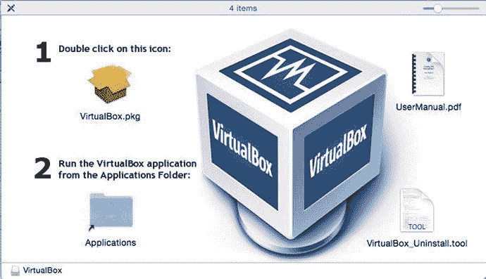
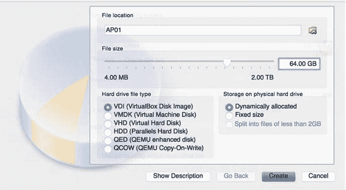
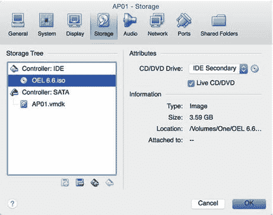
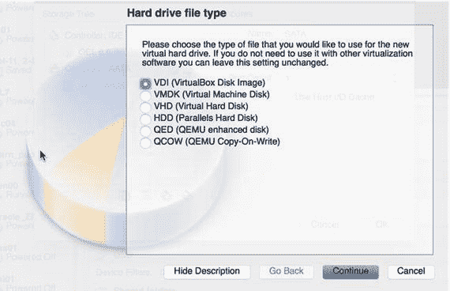
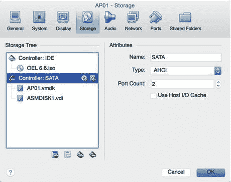
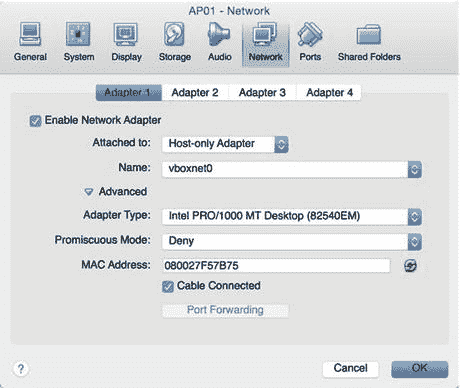
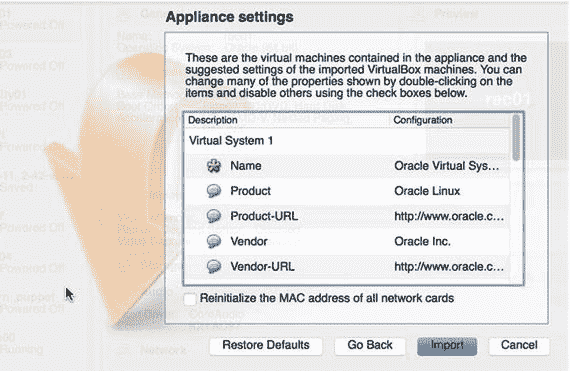
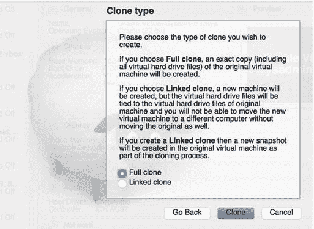
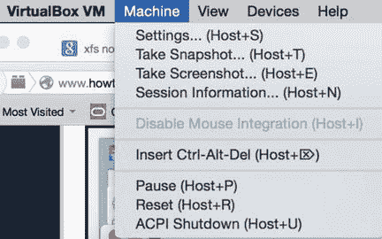

# 十二、Oracle VirtualBox

Oracle VM VirtualBox 以前称为 Sun VirtualBox 或 Sun xVM VirtualBox，是 Oracle Corporation 为 x86 计算机开发的管理程序。Oracle VM VirtualBox 是一款跨平台虚拟化软件，允许您在 Windows、Mac OS X、Linux 和 Oracle Solaris 操作系统上同时运行多个操作系统。许多 IT 专业人员大量利用 VirtualBox 来学习新的和新兴的技术。VirtualBox 允许 IT 专业人员在本地台式机或笔记本电脑上的虚拟机(VM)上测试、开发、演示和部署他们的应用程序和数据库。

有两种类型的虚拟机管理程序:类型 1(本机或裸机)和类型 2(托管)。第 1 类虚拟机管理程序直接在物理服务器上运行，虚拟机管理程序和物理硬件之间没有软件层，这就是为什么它通常被称为裸机虚拟机管理程序。这种虚拟机管理程序设计用于企业环境，速度极快。VMware ESXi、Oracle VM、Linux KVM、Hyper-V 和 Citrix XenServer 都是第 1 类虚拟机管理程序的示例。虚拟机管理程序在功能和特性上有很大不同。虚拟机管理程序 VMware、Hyper-V、OVM 和 KVM 有许多相似之处，但它们也有很大不同。正如 Oracle、SQL Server 和 MySQL 是关系数据库一样，它们的工作方式以及运行的环境和生态系统也有很大的不同。

第 2 类虚拟机管理程序运行在 Windows (VMWare Workstation)或 Mac (VMware Fusion)以及 VirtualBox(运行在以下平台上:Linux、Solaris、Windows 和 Mac)等操作系统之上。对于第 2 类虚拟机管理程序，虚拟机必须通过虚拟机管理程序软件和操作系统，从而导致额外的开销。第 2 类虚拟机管理程序非常适合在笔记本电脑和个人电脑上运行多个虚拟机。VMware Workstation、Parallels 和 VirtualBox 是第二类虚拟机管理程序的其他示例。

本章重点介绍如何安装和配置 Oracle VM VirtualBox，以设置 VM 来托管 Oracle 数据库。您将继续为 Oracle ASM 虚拟磁盘创建额外的虚拟磁盘，并将虚拟磁盘作为共享存储呈现给其他虚拟机。本章还简要提到了 VirtualBox 可用的网络基础设施。

您将深入了解创建和维护 Linux 模板、克隆新的 Linux 虚拟机以便从黄金映像模板进行即时部署以及管理快照的细节。

## 12-1.安装 Oracle VM VirtualBox

### 问题

您希望安装 Oracle VM VirtualBox 来开始虚拟化之旅。

### 解决办法

您可以从 [`http://www.oracle.com/technetwork/server-storage/virtualbox/downloads/index.html#vbox`](http://www.oracle.com/technetwork/server-storage/virtualbox/downloads/index.html%23vbox) 下载安装 Oracle VM VirtualBox。Oracle VM VirtualBox 软件可用于 Windows、Mac OS X、Solaris 10+和 Linux 平台。安装 VirtualBox 简单明了，几分钟就能完成。

此示例显示了 Mac OS 上的安装情况。如果你下载了 Mac 版的 VirtualBox，你会有一个类似于`VirtualBox-4.3.26-98988-OSX.dmg`的文件名。双击`.dmg`文件，可以看到如图 [12-1](#Fig1) 所示的安装程序。

图 12-1。

VirtualBox installer software

双击`Virtualbox.pkg`图标开始安装。在 Mac 上，会出现一个窗口，指定软件包需要运行一个程序来确定软件是否可以安装。单击继续按钮进入欢迎屏幕，确认您同意。在欢迎屏幕上，您可以单击继续按钮继续安装。

在标准安装屏幕上，您可以更改二进制文件的默认安装位置。点按“安装”按钮，系统会提示您输入有权在机器上安装软件的管理帐户的用户名和密码，以继续操作。安装完成后，您将看到一个成功窗口，指示软件已顺利安装。

从安装过程中可以看出，VirtualBox 的安装和使用非常简单。

### 它是如何工作的

通过学习实现 VirtualBox，您开始了在 Windows、Mac 或 Linux 机器上创建虚拟基础设施的步骤。VirtualBox 是 DBA 和开发人员学习虚拟化、Linux 和各种 Oracle 技术的完美工具。许多专业人士通过在他们的笔记本电脑上安装 VirtualBox 来学习新技术，以创建各种操作系统的虚拟机。VirtualBox 是完美的虚拟化技术，因为它易于访问并且完全免费部署。VirtualBox 是在 OL 上运行 Oracle 数据库的 Oracle 专业人员首选的第 2 类管理程序。

Oracle 宣布最近增加了客户平台，包括:

*   OL 6
*   Ubuntu Linux 和 Fedora 发行版
*   麦克 OS X 10.9“小牛”
*   Windows 8.1 和 Windows Server 2012 R2 版

Note

Oracle 为 VirtualBox 提供可下载的 Oracle 虚拟设备(打包的虚拟机),以便您可以立即开始使用特定的 Oracle 技术。不需要在安装过程中花费多个周期，在一个新的软件堆栈中导航就已经足够具有挑战性了。相反，您可以从 Oracle 网站下载预构建的 Oracle VM VirtualBox 设备。打包的虚拟设备的部署就像 1-2-3 一样简单:下载、汇编文件并导入到 VirtualBox 中。有关虚拟设备的更多信息，请参见配方 12-7。

## 12-2.设置 VirtualBox 虚拟机(VM)

### 问题

您希望创建第一个虚拟机来实例化 Linux 服务器并安装 Oracle Database 12c。

### 解决办法

您将着重于配置 VirtualBox 来为 OL 6/7 创建一个新的 VM，并从 ISO 映像中安装 OL 6/7 作为一个来宾操作系统。OL 6/7 ISO 映像可以从`edelivery.oracle.com` —Oracle 软件交付云下载。您必须拥有一个(免费的)有效 Oracle 帐户才能下载 Linux ISO。

要创建虚拟机，请单击 Oracle VM VirtualBox 管理器左上角的“新建”按钮，并提供虚拟机的描述性名称、虚拟机的位置和操作系统类型。指定的名称将用于标识虚拟机配置。指定描述性名称，并选择来宾操作系统类型和版本。在本例中，您希望选择 Linux 作为类型，Oracle (64 位)作为版本。如果您的基础架构仍在运行 Red Hat，您可以选择 Red Hat (64 位)。

以下是 VirtualBox 支持的 Linux 版本列表:

*   Linux 2.2
*   Linux 2.4 (32 位/64 位)
*   Linux 2.6 (32 位/64 位)
*   Arch Linux (32 位/64 位)
*   Debian Linux (32 位/64 位)
*   openSUSE (32 位/64 位)
*   Fedora (32 位/64 位)
*   Gentoo (32 位/64 位)
*   Mandriva (32 位/64 位)
*   Red Hat (32 位/64 位)
*   TurboLinux (32 位/64 位)
*   Ubuntu (32 位/64 位)
*   xadros(32 位元/64 位元)
*   OL (32 位/64 位)
*   其他 Linux (32 位/64 位)

在同一屏幕中，您必须配置为此虚拟机分配的内存量(参见图 [12-2](#Fig2) )。请注意，当来宾虚拟机正在运行时，您在内存大小屏幕中分配的内存将不可用。如果您将计算机用于其他应用程序，如 Microsoft Word、Microsoft Excel 或 Microsoft PowerPoint，请不要过度分配内存。众所周知，微软产品在使用时会耗尽机器内存。为了有效地运行任何 Oracle Database 12c，您应该分配至少 4GB 的内存和两个虚拟 CPU(vcpu)。为该虚拟机分配 4GB，使用默认选项立即创建一个虚拟硬盘，然后单击 Create 按钮。

图 12-2。

Creating a new VM

在下一个屏幕中，提供一些关于您为虚拟机创建的虚拟硬盘的基本信息。这个虚拟硬盘将是你放置 Linux 操作系统的地方。除非您计划让此虚拟磁盘与 VMware 或其他虚拟化技术兼容，否则请选择默认的 VDI (VirtualBox 磁盘映像)。对于与 VMware 兼容的磁盘，请选择 VMDK(虚拟机磁盘)。图 [12-3](#Fig3) 显示了虚拟磁盘的位置和大小选项。

图 12-3。

File location and size for virtual disk for new VM

选择动态分配选项以选择精简配置的虚拟磁盘。如果您想要更好的性能，可以选择固定大小选项。对于固定大小的磁盘，VirtualBox 预先分配所有空间；动态分配的磁盘仅在使用量增加时分配磁盘空间。

对于 VMDK 虚拟磁盘，您还可以选择将文件拆分为 2GB 文件。此示例创建一个 64GB 的磁盘；如果您选择拆分小于 2GB 的文件，您将有大约 32 个文件。对于这个 VM 实例，您将为`root`和`/u01`文件系统分配 64GB。您可以选择创建多个虚拟磁盘:一个用于`root`文件系统，另一个用于`/u01`文件系统。单击“创建”按钮创建虚拟机。

Note

如果您选择了固定大小虚拟磁盘，当您点按“创建”按钮时，将会等待一段时间。固定大小的磁盘将占用整个磁盘大小，即使只占用一小部分磁盘空间。固定大小的磁盘将占用更多的磁盘空间，但它会产生较少的开销。

创建具有指定大小的 VDI 磁盘后(精简表示动态分配，密集表示固定大小调配)，您将返回 Oracle VM VirtualBox 管理器屏幕。您还应该注意到屏幕左侧新创建的虚拟机。

### 它是如何工作的

您刚刚创建了一个具有一个 vCPU、4GB 内存和 64GB 虚拟磁盘的虚拟机。您应该为任何运行 Oracle 数据库的虚拟机分配至少两个 vCPUs。您可以通过单击虚拟机的设置按钮，然后单击屏幕中间的处理器按钮来更改 vCPUs 的数量。您可以将 vCPUs 的数量从一个增加到两个，甚至更多。

您可以在企业级服务器上创建强大的虚拟机。VirtualBox 支持多达 32 个虚拟 CPU 的虚拟机配置和多达 1TB 的来宾虚拟机内存。

与物理磁盘一样，创建映像文件时，会创建一个具有指定容量(MB/GB/TB)的虚拟磁盘。与物理磁盘不同，虚拟磁盘可以在创建后进行扩展，即使数据已经存在于虚拟磁盘上。

VirtualBox 支持四种类型的虚拟磁盘:虚拟磁盘映像(VDI)文件，这是 VirtualBox 的虚拟磁盘原生容器；VMDK 磁盘，由 VMware 等其他虚拟化技术利用；VHD 格式，微软用的；和 HDD 格式，旧版本的 Parallels 使用这种格式。如果您想要将虚拟磁盘扩展到更大的大小，或者拥有 VirtualBox 提供的所有特性功能，您应该选择 VDI 作为您的磁盘选择。

您可以创建 Linux 客户虚拟机:特别是 Red Hat (5/6/7)和 OL (5/6/7)。VirtualBox 对 2.4 内核的支持有限；完全支持 2.6 和 3.x Linux 内核。VirtualBox 也支持 32/64 位 Solaris 客户机操作系统。支持的版本有 Solaris 11、Solaris 11 Express 和 Solaris 10 U6 及更高版本。

## 12-3.首次启动虚拟机

### 问题

现在，您已经创建了第一个虚拟机，您希望开始安装 OL OS。

### 解决办法

您可以配置虚拟机(尤其是 CD/DVD 驱动器)，以便可以从可引导的 ISO 映像启动虚拟机。单击左上角“新建”按钮旁边的“设置”按钮，查看虚拟机的常规设置。

显示一个类似图 [12-4](#Fig4) 的窗口。点按该行顶部中间的“存储”按钮。

图 12-4。

Storage settings for the VM

在屏幕左侧，选择 ide 控制器并单击空 CD 图标。在屏幕右侧，单击“属性”部分(ide 辅助下拉列表旁边)中 CD/DVD 驱动器的 CD 映像图标，然后单击“选择虚拟 CD/DVD 磁盘文件”选项。从浏览器中找到 OL 6 的 ISO 映像，然后选择 OL 6.6 ISO。最后一步，确保单击 Live CD/DVD 复选框选项。

在“存储”屏幕中，您可以单击“确定”按钮返回 Oracle VM VirtualBox Manager 主屏幕。在 Oracle VM VirtualBox Manager 屏幕中，选择您刚刚创建的虚拟机，然后单击屏幕顶部的绿色启动图标。因为您将 OL 6.6 ISO 映像指定为虚拟 CD/DVD 磁盘文件，所以虚拟机将启动 OL 6.6 ISO 映像并在虚拟机上启动 Linux 安装。有关 OL 6.6 的完整分步安装步骤，请访问`DBAExpert.com/blog`网站并搜索 Oracle Linux 安装。

### 它是如何工作的

您将关注于配置 VirtualBox 为 OL 6 创建一个新的 VM，并从 ISO 映像安装 OL 6 作为来宾操作系统。在撰写本书时，Oracle 6.7 是 OL 的最新和最伟大的版本。OL 6 Update 7 ISO 镜像可以从甲骨文的软件交付云`edelivery.oracle.com`下载。您必须拥有一个有效(免费)的 Oracle 帐户才能下载 Linux ISO。

使用虚拟 CD/DVD 播放器设置 Oracle 6 ISO 映像后，单击 Oracle VM VirtualBox 管理器顶部的开始按钮()或右键单击 VM 并选择开始选项。如果您选择了 Live CD/DVD 选项，安装过程会立即开始。

## 12-4.创建额外的虚拟磁盘

### 问题

您希望为 ASM 创建额外的虚拟磁盘。您希望为数据和 FRA 磁盘组创建额外的磁盘。

### 解决办法

要为来宾虚拟机创建另一个虚拟磁盘，您可以从 Oracle VM VirtualBox Manager 中选择两个选项。您可以单击虚拟机的“存储”部分，或者单击左上角“新建”按钮旁边的“设置”按钮，然后单击“常规”屏幕中上部的“存储”按钮。从存储屏幕中，找到串行 ATA (SATA)控制器，然后单击控制器:SATA 行。将出现一个 CDROM 图标和一个带加号的磁盘图标。单击带有加号的磁盘图标，您将看到选择现有磁盘和创建新磁盘按钮(参见图 [12-5](#Fig5) )。

图 12-5。

Adding a virtual hard disk

由于这是一个新的虚拟硬盘，请单击“创建新磁盘”按钮。现在，您将看到与图 [12-6](#Fig6) 中显示的硬盘文件类型屏幕相同的屏幕。

图 12-6。

Hard drive file type screen for the VM

选择 VDI (VirtualBox 磁盘映像)选项，然后单击继续。在继续创建磁盘的过程中，您将被引导至物理硬盘上的存储屏幕，在该屏幕中，您必须在创建动态分配的磁盘或固定大小的磁盘之间进行选择。选择动态分配选项，点击继续按钮，进入文件位置和大小屏幕，如图 [12-7](#Fig7) 所示。

图 12-7。

File location and size screen for the VM

最后，您必须指定虚拟磁盘的名称和大小。对于本例，您将创建一个名为`ASMDISK1`的 64GB 磁盘。VirtualBox 会创建一个名为`ASMDISK1.vdi`的文件。点击创建按钮后，你会在存储屏幕的存储树上(左侧)看到你的虚拟磁盘，如图 [12-8](#Fig8) 所示。

图 12-8。

Storage tree

您必须为 ASM 磁盘组的每个虚拟磁盘重复这些步骤。

Note

或者，您会在屏幕的存储树部分看到一个带有加号的磁盘图标。单击磁盘图标可以创建 CD/DVD 设备或硬盘。

到目前为止，您已经完成了从 Oracle VM VirtualBox Manager 创建虚拟磁盘的过程。现在，让我们看看如何使用命令行界面(CLI)创建虚拟磁盘。以下是创建 VMDK 以配置磁盘来在 Linux 虚拟机上运行 Oracle ASM 的命令:

`$ VBoxManage createhd --filename asm1.vmdk --size 4096 --format VMDK --variant Fixed`

`0%...10%...20%...30%...40%...50%...60%...70%...80%...90%...100%`

`Disk image created. UUID: 1e2ab785-7687-42a5-bfd9-28962820f0eb`

在此示例中，您创建了 VMDK 格式的磁盘，以便以后可以将它们移植到 VMware。要创建 VDI 磁盘，只需将- format 选项替换为 VDI 即可。如果您不打算迁移到另一个虚拟化平台，应该始终创建一个 VDI 磁盘。

### 它是如何工作的

您希望为每个数据和 FRA 磁盘组调配四个磁盘。简要介绍了 VMDK、VDI、VHD 和 HDD 磁盘之间的区别。VirtualBox 模拟四种最常见的硬盘控制器:IDE、SATA (AHCI)、小型计算机系统接口(SCSI)和 SAS。IDE (ATA)控制器是向后兼容的控制器，由 IBM PC/AT 于 1984 年推出，仅用于硬盘驱动器。后来，支持扩展到包括 CD-ROM 驱动程序和其他可移动媒体。在物理世界中，IDE 标准使用 40 或 80 线的扁平带状并行电缆，可以连接 2 个设备。一个虚拟机可以启用一个 IDE 控制器，一个 IDE 控制器最多可以连接四个存储设备。默认情况下，四个设备中的一个预配置到 CD/DVD 驱动器，但是可以更改。默认情况下，一个新的虚拟机有一个 IDE 控制器，一个 CD/DVD 虚拟驱动器作为四个端口之一连接到该控制器。

SATA 是 2003 年推出的较新标准。在现实世界中，连接到 SATA 控制器的设备可以在操作系统运行时添加/移除。与 IDE 控制器相比，SATA 控制器运行速度更快，占用的 CPU 资源更少。借助 SATA 控制器，虚拟机还可以处理多达 30 个虚拟磁盘。VirtualBox 利用 SATA 控制器作为虚拟磁盘的默认控制器，并将第一个虚拟磁盘连接到 SATA 控制器。

SCSI，另一个可追溯到 1986 年的标准，是一个用于各种设备之间数据传输的通用接口。SCSI 控制器在今天的高性能服务器中仍然很常见，用于连接硬盘和磁带设备。每个 SCSI 控制器可以处理多达 15 个虚拟硬盘。VirtualBox 支持 LSI 和 BugLogic SCSI 控制器。

串行连接 SCSI (SAS)是另一种总线标准，其中使用串行电缆代替并行电缆。串行电缆简化了设备连接，提供了比 SATA 更可靠、更快速的连接。你可以认为 SAS 之于 SCSI 就像 SCSI 之于 IDE 一样。VirtualBox 模拟 LSI Logic SAS 控制器，最多支持八个设备。

无论你在 VirtualBox 中选择 SATA，SCSI，还是 SAS，在你的个人桌面上都不会有太大的性能差异。VirtualBox 提供的所有控制器支持都是为了与传统硬件和虚拟机管理程序兼容。

## 12-5.与另一个虚拟机调配/共享磁盘

### 问题

您希望虚拟磁盘成为共享磁盘。为 RAC 创建的磁盘必须创建为共享磁盘。

### 解决办法

关于可共享磁盘的一个警告是，虚拟磁盘必须创建为固定大小的磁盘，其中磁盘文件在创建时会完全消耗分配的空间。为 ASM 磁盘组创建虚拟磁盘后，可以通过以下两个选项之一将它们指定为可共享的:使用 VBoxManage (Oracle VM VirtualBox 命令行管理界面版本)可执行文件或利用虚拟媒体管理器。

使用`VBoxManage modifyhd`，您可以更改虚拟磁盘的特性并使其可共享，如下所示:

`$ VBoxManage modifyhd asm1.vmdk --type shareable`

对于带有`modifyhd`参数的其他选项，发出以下命令:

`$ VBoxManage --help modifyhd`

要利用虚拟媒体管理器，请单击屏幕左上角的文件菜单，并选择虚拟媒体管理器的菜单选项。在虚拟媒体管理器中，找到您的磁盘，右键单击该磁盘，选择可共享单选按钮选项，然后单击确定按钮。

使虚拟磁盘可共享后，您必须将它们分配给第二个、第三个或第四个 RAC 虚拟机。您必须添加虚拟磁盘(参考配方 12-4)，但选择选择现有磁盘的选项(如图 [12-5](#Fig5) 所示)并从文件浏览器中选择共享磁盘，以完成每个磁盘的过程。

### 它是如何工作的

Oracle RAC 需要共享磁盘。使虚拟磁盘可共享可以通过命令行的`VBoxManage`命令或 VirtualBox 媒体管理器来完成。对于共享磁盘，您应该将共享磁盘放在与虚拟机不同的文件夹中。我们还建议 RAC 配置采用以下文件夹拓扑和虚拟磁盘布局:

`dallasrac01`

`dallasrac02`

`dallasrac_shared_disk`

`ov01_disk.vdi`

`ov02_disk.vdi`

`ov03_disk.vdi`

`data01_disk.vdi`

`data02_disk.vdi`

`data03_disk.vdi`

`data04_disk.vdi`

`fra01_disk.vdi`

`fra02_disk.vdi`

`fra03_disk.vdi`

`fra04_disk.vdi`

您应该为每个节点创建单独的文件夹，并为共享磁盘创建专用文件夹。Oracle 集群注册表(OCR)和投票文件的磁盘大小至少为 8GB，我们还建议 OCR 和投票(OV)磁盘组使用 3 个具有正常冗余的磁盘。在 Oracle Database 12c 中，每个 OCR 文件的大小为 400MB，每个投票文件的大小为 300MB。网格基础设施管理存储库(GIMR)的大小大约为 3.3GB，默认情况下与 OV 文件位于同一位置。从 Oracle 12.1.0.2 版开始，可以选择将 GIMR 移动到另一个磁盘组。

在本例中，所有共享磁盘都特意创建在一个单独的文件夹中。您可以从`dallasrac01`虚拟机文件夹的副本创建一个`dallasrac03`虚拟机文件夹。作为一项单独的任务，您可以添加共享磁盘，并轻松地将另一个 RAC 节点配置到配置中。

## 12-6.配置虚拟网络

### 问题

您希望为私有和公共网络访问配置虚拟网络。

### 解决办法

要在 VirtualBox 中创建虚拟网络，请导航到 Oracle VM VirtualBox 管理器，单击要为其创建虚拟网络的 VM，然后单击左上角“新建”按钮旁边的设置按钮()。您将看到一个标题为-[虚拟机名称] -常规的窗口。该屏幕有八个按钮:常规、系统、显示、存储、音频、网络、端口和共享文件夹。将鼠标导航到屏幕顶部，然后单击屏幕顶部的网络按钮。图 [12-9](#Fig9) 显示了网络屏幕中的四个适配器。

图 12-9。

Oracle VM VirtualBox Manager Network screen

您将利用适配器 1 作为专用网络，适配器 2 作为公共网络。适配器 1 的默认设置是启用和 NAT。

单击“附加到:字段”下拉列表；您将看到 Oracle 虚拟机 VirtualBox Manager 提供了七种不同的网络产品:未连接、NAT、NAT 网络、桥接适配器、内部网络、仅主机适配器和通用驱动程序。图 [12-10](#Fig10) 显示了 Oracle 虚拟机 VirtualBox Manager 提供的所有网络产品。

图 12-10。

Oracle VM VirtualBox Manager network adapter options

为专用网络选择仅主机适配器(适配器 1 ),并选择`vboxnet0`作为名称。接下来，为公共网络接口配置第二个适配器。单击 Adapter 2 文件夹，并(为简单起见)为“连接到:”下拉列表选择“内部网络”。单击启用网络适配器复选框。您将看到显示的内部网络名称(`intnet`)。

### 它是如何工作的

VirtualBox 的网络部分对许多数据库管理员来说是个问题。但是稍加解释，理解网络组件就可以简化了。本节集中讨论四种常见的网络选项:网络地址转换(NAT)、仅主机适配器、内部网络和桥接适配器。还有“未连接”选项，但这种类型通常用于故障排除。未连接模式意味着有网卡但没有网络连接。你可以把它想象成一根没有插入网卡的以太网电缆。

NAT 是 VirtualBox 的默认网络模式，它提供了访问外部网络的最简单方式。NAT 很受欢迎，因为它通常不需要对主机或客户操作系统进行任何更改。通过 NAT，您可以在来宾虚拟机上冲浪、查看电子邮件和下载文件，但外界无法与来宾虚拟机通信。NAT 使来宾虚拟机能够通过私有 IP 地址访问互联网，主机或网络的其他部分无法看到该地址。当来宾虚拟机向远程服务器发送 IP 数据包时，NAT 服务会执行以下操作:

*   拦截数据包
*   提取 TCP/IP 段
*   将 IP 地址转换为主机的 IP 地址
*   将数据包发送到远程服务器

对外只透露主机的 IP 地址。主机会收到回复数据包，并将其发送给来宾虚拟机。

使用主机专用适配器，您可以在主机和一组虚拟机之间创建虚拟网络。与环回接口类似，您可以在虚拟机和主机之间建立连接。

通过桥接适配器，VirtualBox 直接连接到网络接口，并直接交换数据包，绕过主机操作系统的网络层。您可以连接到与主机操作系统连接的同一交换机/路由器，并获得与主机位于同一子网的 IP 地址。来宾虚拟机可以像主机一样扮演平等公民的角色，并像网络上的任何其他服务器一样呈现。

内部网络(或隔离网络)类似于桥接网络，因为虚拟机可以与外界通信。借助内部网络，外部世界只能看到主机上连接到同一内部网络的其他虚拟机，因此被认为更加安全。内部网络是自动创建的，并通过名称来识别。

## 12-7.利用/创建 Oracle VM VirtualBox 预构建模板

### 问题

您希望利用 Oracle 创建的预构建 Oracle VM VirtualBox 模板，并减少建立环境所需的时间。您希望创建一个 Oracle VM VirtualBox 模板，以便与另一个 DBA 或另一个组织共享。您还希望与 VMware 人员共享 Oracle VM VirtualBox 模板。

### 解决方案 1:利用 Oracle 的预建模板

该解决方案着眼于为 OL 6 管理员利用 Oracle 模板。首先从 Oracle 网站下载 OL 6 Admin VM ( `OracleLinux65.ova`)文件: [`http://www.oracle.com/technetwork/community/developer-vm/index.html`](http://www.oracle.com/technetwork/community/developer-vm/index.html) 。

Note

您可以从 Oracle 下载大量预构建的模板。注意:有些模板只适用于 Oracle VM，不适用于 VirtualBox。

完成下载`.ova`文件后，导航至文件菜单并选择导入设备选项。您将看到一个“装置设置”窗口，您可以在其中指定要导入的内容。单击文件浏览器，找到您下载的`.ova`文件，然后单击继续按钮。

从设备设置屏幕(见图 [12-11](#Fig11) )中，您可以查看虚拟机的规格并修改组件，如虚拟机的名称或您是否要启用 CD/DVD 播放器或声卡。您还可以选择重新初始化所有网卡的 MAC 地址。

图 12-11。

Import Appliance: Appliance Settings screen

单击导入按钮开始导入过程。您将立即转到条款和条件以及软件许可协议屏幕。在此过程开始之前，您必须同意条款和许可协议。单击 Import 按钮后，不到几分钟就可以完成 OL 6 Admin VM 的导入。导入完成后，您将看到 Oracle 虚拟系统管理员天数(关闭)。

### 解决方案 2:创建自己的 OVA 模板

您可以以`.ova`文件的形式创建自己的模板。选择要为其创建开放式虚拟化归档或应用程序(OVA)模板的虚拟机，转到“文件”菜单，然后选择“导出设备”选项。选择要创建的开放虚拟化格式(OVF)文件的位置和版本，然后单击继续按钮。默认情况下，VirtualBox 默认为 OVF 1.0 格式。您可以选择“写入清单文件”复选框。

在“Appliance Settings”屏幕中，查看您要导出的虚拟机。完成所需的更改并查看配置规范后，单击 Export 按钮开始 OVA 创建过程。所需的时间取决于您有多少个虚拟磁盘、虚拟磁盘的大小以及虚拟磁盘中有多少数据。

### 它是如何工作的

Oracle 为各种 Oracle 产品提供了大量预构建的模板，包括 OL 和 Oracle Solaris 10/11。通过利用预先构建的模板进行即时虚拟机调配，您可以节省大量时间和精力。Oracle 建议将其预构建的模板用于开发和教育目的，但绝不能用于生产环境。对于 OL 6 Admin VM，至少需要 2GB 的 RAM 和 10GB 的空闲磁盘空间。您还必须知道 root 和 oracle 帐户的密码:“oracle”(不带单引号)。

OVF 是一种打包标准，旨在解决虚拟机或设备的可移植性和部署问题，以便可以导入并与其他虚拟化技术结合使用。使用 OVF 标准，您可以创建一个可以在 VMware Player 和 VirtualBox 之间部署的虚拟机包。OVF 包可以存储在 OVA 中，这是一个使用 TAR 格式的文件分发包。您可以将 OVA 视为 VM 的一个压缩的“可安装”版本。

您可以获取一个 OVA 文件，将其重命名为一个.`tar`文件，并使用`–tvf`选项执行一个`tar`命令(`t`=列出标准输出的内容；`v`=啰嗦；`f`=从指定文件中读取存档文件)列出原始`.ova`文件的内容:

`$ mv OracleLinux65.ova OracleLinux65.tar`

`$ tar -tvf OracleLinux65.tar`

`-rw------- 0 someone 46184 Dec 6 2013 OracleLinux65.ovf`

`-rw------- 0 someone someone 2189755904 Dec 6 2013 OracleLinux65-disk1.vmdk`

`-rw------- 0 someone someone   68096 Dec 6 2013 OracleLinux65-disk2.vmdk`

`-rw------- 0 someone someone   68096 Dec 6 2013 OracleLinux65-disk3.vmdk`

OVF 格式有两个你必须关心的标准。OVF 1.0 标准提供了标准化的虚拟化格式，解决了软件供应商和云提供商的关键业务需求。OVF 1.0 被广泛采用，并于 2011 年成为 ISO/IEC 采用的国际标准。

OVF 2.0 标准在 1.0 格式的基础上提供了更多功能，包括改进的网络配置、共享磁盘、更灵活的扩展/部署选项，以及相似性规则和加密功能等基本放置策略。

## 12-8.克隆虚拟机

### 问题

您想要克隆一个虚拟机来创建另一个虚拟机。

### 解决办法

要从 Oracle VM VirtualBox Manager 克隆现有的虚拟机，请右键单击虚拟机并选择克隆选项，如图 [12-12](#Fig12) 所示。

图 12-12。

Cloning a VM

只有在虚拟机关闭时，您才会看到克隆虚拟机的选项。在克隆过程的第一个屏幕中，您必须为将要通过克隆创建的新虚拟机提供一个名称。在克隆过程中，您还可以选择重新初始化所有网卡的 MAC 地址。提供克隆虚拟机的名称后，单击 Continue 继续。您将被引导至克隆类型屏幕，如图 [12-13](#Fig13) 所示。

图 12-13。

Clone Type screen

克隆类型屏幕显示两个选项:完整克隆和链接克隆。在此示例中，选择完整克隆选项，然后单击克隆按钮。根据虚拟磁盘的大小，您会看到一个状态窗口，指示虚拟磁盘复制的进度等。克隆过程完成后，您将返回 Oracle VM VirtualBox 管理器屏幕。

对于链接克隆选项，您会在屏幕左侧的虚拟机库上看到虚拟机的名称(AP02 的链接库)。

### 它是如何工作的

正如您在本解决方案中看到的，克隆关闭的虚拟机极其简单。完整克隆代表源虚拟机的精确拷贝，包括所有虚拟磁盘。或者，您可以创建一个链接克隆，其中的虚拟磁盘将绑定到原始虚拟机的虚拟硬盘文件。对于链接克隆，在克隆过程中会为原始虚拟机创建新的快照。只有对克隆虚拟机的更改才会写入磁盘。

在此示例中，选择完全克隆源虚拟机的选项。对于完整克隆类型，创建克隆虚拟机所需的时间与源虚拟机的虚拟磁盘大小直接相关。对于较大的文件，执行完整克隆需要更长时间。对于链接克隆，克隆过程几乎是瞬间完成的。您可以在几分钟内从源虚拟机创建链接克隆。对于链接克隆类型，它以写入时复制技术运行。

## 12-9.使用快照

### 问题

您希望创建虚拟机的快照，以便在发生灾难性情况(如操作系统升级失败或数据库升级失败)时恢复到该快照。

### 解决办法

要创建虚拟机快照，您必须处于 Oracle VM VirtualBox 管理器中。在那里，您可以单击屏幕右上角的快照按钮。“快照”按钮在按钮标签的左侧有一个小相机，括号中还有拍摄的快照数量。

图 [12-14](#Fig14) 显示名为`den00`的当前虚拟机已经存在三个快照。如果您查看 Oracle VM VirtualBox 管理器的左侧，您会看到 VM `den00`旁边是最近拍摄的快照的名称:(My Snapshot)。

图 12-14。

Snapshot inventory

您可以从当前状态执行快照。您也可以从当前状态或以前拍摄的任何快照启动克隆过程。如果导航到以前的快照并右键单击快照名称，您还可以从该特定快照恢复虚拟机，甚至删除该快照来清理空间。

图 [12-15](#Fig15) 显示了快照可用的选项。您还可以通过选择“显示详细信息”选项来查看快照的详细信息。

图 12-15。

Snapshot options

您可以通过选择恢复快照选项将虚拟机恢复到以前的快照。您将看到一个警告窗口，询问您是否确定要恢复快照。如果您单击“恢复”按钮，您的虚拟机将恢复到拍摄的时间点快照。

### 它是如何工作的

虚拟机可以在线或关闭以拍摄时间点快照。对于 Oracle 数据库，您应该始终从关闭状态创建虚拟机的快照。这样，所有的 Oracle 头文件都是一致的，因为数据库也应该是离线的，并且您拥有数据库的冷备份。如果您在应用服务器或 web 服务器上工作，您可以选择在虚拟机在线时拍摄快照。

要执行实时快照，导航至屏幕顶部的机器菜单选项，并选择拍摄快照选项，如图 [12-16](#Fig16) 所示。

图 12-16。

Taking an online snapshot

图 [12-14](#Fig14) 显示了右窗格窗口上的五个按钮。第一个相机按钮创建快照。第二个按钮带有相机上的半圆箭头，用于恢复快照。第三个按钮，相机上有一个 X，删除快照。第四个按钮在相机的右下角有一个小圆圈。您可以查看快照的详细信息，例如拍摄快照的时间以及快照的其他文档。第五个按钮看起来像粘贴图标，是克隆按钮。使用此按钮，您可以克隆任何快照来创建新的虚拟机。

此示例演示了如何利用 CLI 来执行快照。您可以使用`snapshot`选项执行快照，并传递附加参数以创建快照(CLI 的`take`选项)，并为快照提供名称和描述:

`$ vboxmanage snapshot den00 take "CLI Snapshot" --description "Snapshot was taken via CLI"`

`0%...10%...20%...30%...40%...50%...60%...70%...80%...90%...100%`

您可以列出使用`snapshot [VM Name] list`参数拍摄的所有快照:

`$ vboxmanage snapshot den00 list`

`Name: Den01_b4_upgrade (UUID: fa8c8efc-6c29-49cd-81a0-7339da706bc0)`

`Description:`

`Before our 12.1.0.2.2 upgrade`

`Name: Before_VB_Guest_Additions (UUID: f0d88500-e06c-460e-93df-9fb31608fe30)`

`Name: My Snapshot (UUID: e18a1bb0-a31d-4301-9184-a3f35fb3d53a)`

`Name: CLI Snapshot (UUID: a692d5bd-b0bc-43de-91f6-582045ddf8ab) *`

`Description:`

`Snapshot was taken via CLI`

如果您想查看使用`vboxmanage` CLI 管理快照的所有选项，请提供`–help`选项，后跟关键字`snapshot`，如下所示:

`$ vboxmanage --help snapshot`

`Oracle VM VirtualBox Command Line Management Interface Version 4.3.26`

`(C) 2005-2015 Oracle Corporation`

`All rights reserved.`

`Usage:`

`VBoxManage snapshot     <uuid|vmname>`

`take <name> [--description <desc>] [--live] |`

`delete <uuid|snapname> |`

`restore <uuid|snapname> |`

`restorecurrent |`

`edit <uuid|snapname>|--current`

`[--name <name>]`

`[--description <desc>] |`

`list [--details|--machinereadable]`

`showvminfo <uuid|snapname>`

如您所见，您有其他选项来删除快照、恢复快照、编辑快照、显示快照的详细信息，甚至可以使用`--live`选项拍摄实时快照。