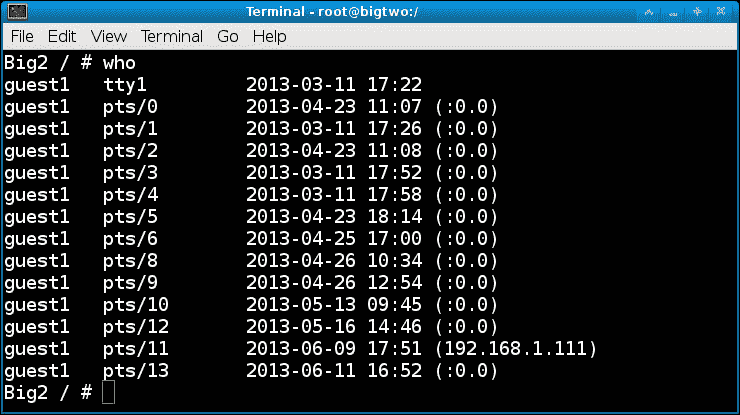

# 十一、附录 A：Linux 最佳实践

在本附录中，我们将涵盖以下主题:

*   超级用户与普通用户
*   运行图形用户界面
*   创建、验证和存储备份
*   权限和你是谁
*   实时备份
*   环境变量和 Shell
*   最好的环境
*   使用和监控不间断电源
*   复制文件时要小心
*   验证归档文件并使用校验和
*   防火墙、路由器设置和安全性
*   如果发现有人闯入，该怎么办
*   文件名中的空格
*   使用脚本和别名来节省时间和精力
*   使用带有自动身份验证的 scp 和 ssh
*   保存历史并截图
*   驱动器空间
*   对新思想持开放态度

# 简介

你可以做很多事情来充分利用你的 Linux 系统。传统观点认为，在计算机上执行特定任务有许多方法。这是真的，然而，在现实中通常只有一种好的方法来完成某事。诀窍是要思想开放，看到好的一面。

# 超级用户对普通用户

作为根用户运行与作为普通用户运行主要取决于您所处的环境。如果每个人都有自己的工作站，并负责工作站的设置，那么以 root 身份运行对你来说可能是非常自然的(尤其是如果你不出错的话)。然而，如果你在一家银行或其他情况下工作，输入错误可能会毁掉一个百万美元的账户，以 root 用户身份运行肯定是不明智的。在这些情况下，假设您有权限，您将只在必要时切换到 root，并且只执行所需的任务。如果配置正确，使用 sudo 也是一种选择。有关 sudo 的更多信息，请参见[第 5 章](05.html "Chapter 5. Permissions, Access, and Security")、*权限、访问和安全*。

另一件要记住的事情是你作为根跑步有多舒服。如果您容易出错或紧张，和/或在过去以 root 身份运行时造成了严重的损害，那么在这样做时显然需要非常小心。另一方面，如果你坚持以 root 用户身份运行，并且从不出错，那就太好了。这当然更有效率。

给系统管理员的特别提示:我不止一次看到过这种情况，所以在这里会提到它。这适用于新手和经验丰富的系统管理员。习惯上，您(可能还有您的经理)是系统上唯一拥有根权限的人。这听起来是个好主意，对吗？它可以避免有人犯一个可能毁掉整个项目的错误。而且，作为负责人感觉很好。当人们需要改变什么的时候，他们就会来找你，你会很高兴地去做。然后他们又来了，一次又一次。在某个时候，你意识到你不能完成你的任何工作，因为所有的请求，如果你不在身边，他们就不能完成他们的工作。所以你试着设置 sudo。现在更糟了；每次你认为你已经设置好处理任何事情，如果它再次失败，可能会有人来找你。那你是做什么的？

您可以授予选定用户超级用户访问权限。利用你的直觉。例如，观察单个用户如何键入。他们在使用命令行时感到舒服吗？他们打字权威，还是看起来害怕机器？如果一个特定的用户始终使用图形用户界面来执行在命令行上更有效地完成的任务，那么我会认为这是一个强烈的警告信号。

随着时间的推移，你会感觉到谁可以被信任根访问，并能够授予他们。当然，如果有人犯了错误，那就不应该是世界末日。它们不会真正影响整个项目，因为您一直在创建和验证每日备份，对吗？你可以恢复伤害并从伤害中重新扎根。注意，一个错误就是一切。我不会再信任那个有 root 权限的用户。

# 运行图形用户界面

虽然我有点快相信我的用户有 root 访问权限，并且大部分时间都是自己使用，但我绝对不建议这样运行 GUI。有些发行版甚至不允许。通过以根用户身份运行图形用户界面，您实际上是在以根用户身份运行许多其他东西，比如您的浏览器和邮件程序。完全不是个好主意。

这是我在 Linux 或 UNIX 系统上的首选环境。我使用 Fedora，但这些想法应该适用于大多数其他发行版。安装系统后，我做的第一件事就是改变它，让机器以命令行模式运行，而不是以图形用户界面模式运行。这样，如果出现了图形问题，就更容易诊断和纠正。我还可以选择通过运行适当的`startx`类型命令来调出哪个图形用户界面。在命令提示符下，我以普通用户或来宾用户身份登录。在我的 Fedora 14 系统上，我运行了`startx`，这将调出 Gnome 2。

图形用户界面一路向上后，我打开一个终端会话，运行`su`进行根操作。我会检查以确保机器能够 ping 通，并且通常会再做一些健全性检查。如果一切顺利，我将运行我的`jset`脚本。它执行一些桌面定制，例如将终端窗口打开到它们适当的目录中，并提醒我要运行什么命令(我已经编写了很多程序，因此确实需要这样做)。它还可以安装我的 USB 设备，或者在出现问题时警告我。然后，我将终端会话放在我想要的位置。我现在准备完成一些工作。

以下是一个类似于我在启动后用来设置桌面的脚本:

```sh
#!/bin/sh
# last update 6/9/2013 (rebooted)

echo percentused - run go
cd /lewis/java/percentused
xterm +sb -title Xterm    -geom 80x20 &

echo apcupsd - run go
cd /lewis/java/apc
xterm +sb -title Xterm    -geom 80x20 &

echo jtail - run jtail
cd /lewis/jtail-f/jtail
xterm +sb -title jtail -geom 137x30   &

echo jsecure - run jsecure
cd /lewis/jtail-f/jsecure
xterm +sb -title jtail -geom 125x33   &

echo ping - run loop1
cd /lewis/ping
xterm +sb -title ping  -geom 86x8 &

echo runbackup1 - run runbackup1
cd /lewis/backup
xterm +sb -title runbackup1 -geom 65x21 &

echo jwho - run jwho
cd /lewis/jwho
xterm +sb -title jwho  -geom 65x8  &

# mount usb stick
mount /dev/sdg1 /usb
# mount Iomega external drive
mount /dev/sdf1 /megadrive 

```

# 创建、验证和存储备份

我不能强调为你的系统创建备份有多重要。至少，将您的个人和业务数据以及配置文件复制到安全的地方。有些人备份一切，甚至操作系统本身。无论你决定做什么，制定一个计划并坚持下去。正如[第八章](08.html "Chapter 8. Working with Scripts")、*使用脚本*中提到的，这是设计和使用脚本的好时机。如果需要，使用`crontab` 自动执行定期备份。

`tar`命令非常适合备份整个目录。请注意，它也会获得任何隐藏文件。如果需要，可以排除特定的目录，用`tar`做很多其他的事情。以下是类似于我用来备份我的`/home/guest1`目录的命令。

### 类型

`tsback1`是一个文本文件，包含要开始的数字。

```sh
cat tsback1
0

```

以下是脚本的开始:

```sh
 cd /home
 NUM=`cat tsback1`        # get the next number to use
 tar -cvzf /megadrive/backups/backup$NUM.gz --exclude=Cache  --exclude=.cache --exclude=.thumbnails  guest1

```

记得把要备份的目录作为最后一件事放在里。这首先会改变到`/home`的目录，因为对于`tar`来说，你希望在要备份的子目录的父目录中。下一行将`NUM`变量设置为下一个要使用的变量。最后一行在适当的目录下直接创建`tar`文件到我的 u 盘上。

我试图在创建备份时非常小心。我用来备份东西的脚本做了很多其他的事情。例如，它检查以确保我的 USB 外部驱动器确实在那里，并且可以写入(它还应该检查驱动器上是否有足够的可用空间，这是我的一个待办事项)。如果代码确定驱动器不在那里或者发生了其他错误，一个非常响亮和令人讨厌的警报就会响起。而且，如果我在 5 分钟内没有响应这个警报，我的手机就会收到一封电子邮件。对偏执狂来说怎么样？

制作备份非常棒。但是，如果备份不可用，对您没有多大好处。因此，不时验证您的备份是明智的。多久做一次取决于你和你的舒适度。我的脚本会定期将备份文件复制到另一台机器上，然后提取它们并运行一些测试。如果有什么不太对劲，另一个警报就会响起。这些都是在脚本中自动完成的。

好的，我们现在正在制作备份并验证它们。储存起来怎么样？假设你的一切都刚刚好，你所有的文件都被复制和验证，它们都位于同一个地方，比如你的家或办公室。现在发生了一些不可描述的事情，比如火灾或盗窃。我同意，这种情况发生的可能性很低，但仍然有可能。就我个人而言，我不想尝试复制我自 1982 年以来编写的数百万行代码，因此备份遍布各地，包括异地。在我工作过的一些公司，文件被复制到磁带、光盘和/或硬盘上，并存储在一个步入式防火保险箱中。不错的主意。

# 权限和你是谁

这主要与系统管理员有关。作为系统管理员，您可能会作为根用户完成大部分工作。您可以设置来宾帐户和配额，甚至可以创建脚本，等等。有时很容易忘记你的用户没有根权限。

记住这一点，一定要从用户的角度来检查您的添加和更改。用`su`成为那个用户，确保可以正常访问所有内容。如果你比你的用户先发现一个问题，这将节省你很多时间，甚至可能是尴尬。

# 实时备份

编辑脚本和其他文件时，最好进行编号备份。没有什么比让一些东西工作，然后在一些变化后休息，然后不能很快让它再次工作更令人沮丧的了。有了编号的备份，您总是可以回到以前有效的版本，然后使用`diff`找到错误。我真的很难学会这个。

以下是我为这本书的用户编写的备份脚本(我通常使用的是用 C 语言编写的)。命名为`mkbak`:

```sh
#!/bin/sh
# mkbak script to create backup files
if [ "$1" = "" ] ; then
 echo "Usage: mkbak filename(s)"
 echo "Creates numbered backup file(s) in the current directory."
 exit
fi
for i in $* ; do
 if [ ! -f $i ] ; then
 echo File $i not found.
 continue
 fi

 num=1
 while [ 1 ]
 do
 ibak=bak-$num.$i
 if [ -f $ibak ] ; then
 num=`expr $num + 1`
 else
 break
 fi
 done
 cp $i $ibak
 rc=$?
 if [ $rc -eq 0 ] ; then
 echo File $i copied to $ibak
 else
 echo "An error has occurred in the cp command, rc: $rc"
 fi
done

```

这个剧本是免费的，但是有一些的限制。它不会处理带有空格的文件名，只处理当前目录中的文件。注意，你可以先`cd`到你想要的目录，然后运行它。

以下是我用来备份当前正在处理的图书文件的脚本:

```sh
#!/bin/sh
# b1 script to copy book file
# Date 1/22/2013
FN=startA1.txt                    # name of file to back up
STARTDIR=`pwd`                    # remember the starting directory
cp $FN /usb/book                  # copy to USB stick
cd /usb/book                      # cd to it
mkbak $FN                         # make the numbered backup

cd $STARTDIR                      # go back to the starting directory
cp $FN /megadrive/book            # copy to USB external drive
cd /megadrive/book                # cd to it
mkbak $FN                         # make the numbered backup

cd $STARTDIR                      # go back to the starting directory
sum $FN /usb/book/$FN /megadrive/book/$FN     # use sum to check
scp $FN $B2:/temp                 # copy to my other machine
ssh $B2 /usr/bin/sum /temp/$FN       # check the copy

```

在编辑文件(变量`FN`时，我会不时手动运行这个，通常是在做了很多更改之后，而且肯定是在我起床休息之前。

# 环境变量和 Shell

在系统管理期间经常提到的一件事是对几台机器的监控。一次打开 5 或 6 个`ssh`会话并不少见，如果您有多个显示器，则更多。知道哪个会话在哪个机器上运行是至关重要的，因为在错误的机器上键入正确的命令可能是一场灾难。出于这个原因和其他原因，我建议在登录远程机器时使用自定义的`PS1`变量。

这在[第 1 章](01.html "Chapter 1. Using the Terminal / Command Line")、*使用终端/命令行*讨论环境变量时提到过。以下是我的`PS1`变量在运行 Fedora 17 的机器上的样子:

```sh
Big2 /temp/linuxbook/chapA # echo $PS1
Big2 \w #
Big2 /temp/linuxbook/chapA #

```

简单，又不太杂乱。以下是我登录另一台机器时`PS1`的样子:

```sh
BIG4 BIG4 BIG4 BIG4 BIG4 BIG4 BIG4 BIG4 /temp # echo $PS1
BIG4 BIG4 BIG4 BIG4 BIG4 BIG4 BIG4 BIG4 \w #
BIG4 BIG4 BIG4 BIG4 BIG4 BIG4 BIG4 BIG4 /temp #

```

把这些混在一起应该很难。

当我们在环境变量这个话题上的时候，还有一些事情要记住。当您对您的`.bashrc`文件进行更改并将其作为源文件时，更改仅在该会话(以及任何新打开的会话)中可见。为了查看其他现有会话中的更改，您还必须将其来源于这些会话。如果有一种方法可以用一个命令在每个会话中显示更改，那就太棒了，但是，我不认为这是可能的。当然，有人可能会说`shutdown -r`现在就可以了。

# 最佳环境

对一个人来说最有效的，对另一个人来说未必最有效。然而，我知道，当使用具有大量内存和存储空间以及两个大显示器的快速桌面系统时，我的工作效率最高。以下是我的典型设置:

在我的左侧显示屏上，我放入了脚本，以及以下我用来监控系统的程序:

*   用 Java 和 C 语言编写的磁盘空间监控程序
*   一个监控我的**不间断电源**(**UPS**)的程序也是用 Java 和 C 写的
*   一种每分钟 pings 网络一次并记录任何故障的脚本
*   使用`tail -f /var/log/messages`监控内核消息的程序
*   我每天凌晨 3 点运行的备份脚本
*   一个“穷人的”入侵检测脚本(稍后将详细介绍)
*   每天两次通过电子邮件将系统状态发送到我手机的脚本
*   我可以看到`Computer`和`Guest`文件夹图标，并且很容易访问
*   远程机器的任何`ssh`会话
*   以及其他一些无聊到无法提及的事情

所有这些都设置为，在所有工作区中保持可见。说到工作空间，我通常有四个。我总是将相同的程序和终端会话放在同一个工作区，并且在屏幕上大约相同的位置。这样，我可以很快到达我想去的地方。你有没有遇到过这样的情况:你的团队即将错过一个重要的截止日期，而你却被迫观望和等待，因为其他人浪费了很多时间试图在他们的系统上找到或做一些事情？你永远都不想成为那样的人。

在右边的显示屏上，我做了大部分实际工作。以下是我的工作区的布局方式:

*   在工作区 1 中有几个终端。那些已经准备好了，以防我需要马上做些什么
*   工作区 2 通常用于程序开发。我在这里做 C、Java 和脚本开发
*   工作区 3 是我目前在自定义文字编辑器(最终将导入`LibreOffice`)中输入这本书的地方
*   工作区 4 是我拥有网络邮件客户端的地方

说到浏览，我倾向于在左侧的显示屏上打开它们，并在与我当前工作相匹配的任何工作空间中打开。这是非常快速和高效的，并且在需要时也更容易剪切和粘贴。

并不是所有人都有快速机器或双显示器的奢侈，尤其是在我们的工作中，有时省钱对管理层来说似乎更重要，而不是给员工他们需要的东西来提高工作效率。对此，我只能说，尽最大努力获得尽可能高效地完成工作所需的东西。

# 使用和监控不间断电源

在我看来，不间断电源必须至少在你的主工作站上使用。如果突然断电(或者更糟，断电)，硬件可能会发生各种各样的坏事，更不用说您的数据可能会发生什么了。对于现代日志文件系统，我意识到数据丢失有些罕见，但为什么要冒险呢？还有，我真的只是不喜欢重启。永远不会。

根据你的情况，尽量买你能买得起的最好的 UPS。您需要一个可以长时间运行您的系统，并为您的显示器、调制解调器、路由器和外部驱动器(如果有)供电的设备。这样，如果停电时间很短，你就不会失去任何东西，也不必等待一切恢复。

如今有许多不同的 UPS 品牌可供选择。我有点偏爱**美国电力转换** ( **APC** ) 设备。我有几个，它们在 Linux 上运行良好。一定要有一个连接到通用串行总线端口的电话连接器，因为老式的串行端口设备不能正常工作。

`apcupsd`守护程序可用于监控不间断电源。如果您的发行版还没有该软件包，则可以安装该软件包。

*   如果使用 Fedora，运行`yum -y install apcupsd`(根据需要替换您的软件包安装程序)
*   注释掉`/etc/apcupsd/apccontrol`文件中的`WALL`语句，以防止恼人的消息被广播到每个终端
*   运行`apcaccess status`查询不间断电源

你可以用`apcupsd`做更多的事情，更多信息请登陆[http://www.apcupsd.com](http://www.apcupsd.com)网站。这也列出了一些 UPS 单元，它们可能不像我有的那样与 Linux 兼容。

还有一点，你可能想使用不间断电源的自动关机功能。它可以设置为在断电时间过长时自动关闭机器。大多数设备都允许您设置关机前保持运行的时间。请记住，不间断电源使用电池的时间越长，其寿命就越短。

# 复制文件时要小心

将文件复制到目录时，确保它确实是一个目录。这种情况发生得足够让我提起它，我不得不承认我仍然时不时地几乎这样做。将大量文件复制到您认为是目录的位置非常容易，但事实并非如此。结果是，只有最后一个复制的文件会在那里，如果您仍然没有源文件，它们现在可能会丢失。在复制文件之前，使用`file`命令验证目标是否真的是目录。

# 验证归档文件并使用校验和

一件经常出现的事情是在创建`tar`或`zip`档案时没有被注意到的错误，这些档案是要发送给另一个人或地点的。

以下是应该遵循的步骤:

1.  将文件复制到适当的目录中(首先确保它确实是一个目录)。
2.  使用`zip`或`tar`压缩并创建档案。
3.  使用`tell`或`list`选项确保它看起来正确。对 TAR 来说是`tar -tvzf filename.gz`，对 ZIP 来说是`unzip -l filename.zip`。
4.  对您的文件运行`sum`命令，然后将文件发送到它需要去的地方。
5.  如果使用`scp`，使用`ssh`对远程系统上的文件运行`sum`命令，如下所示:

    ```sh
    ssh <user@remote-host> /usr/bin/sum filename.gz

    ```

6.  两个`sum`值应该匹配。
7.  如果使用电子邮件，请在终端运行`sum`，并将结果与电子邮件一起发送。

给开发者的一条建议；假设您正在创建一个编程项目的档案。为了绝对确保您已经复制了它需要的每个文件，请创建归档文件，然后将其复制到另一台机器上。像平常一样解压缩并构建它。如果缺少所需的文件，将会出现错误。

# 防火墙、路由器设置和安全性

防火墙在[第 5 章](05.html "Chapter 5. Permissions, Access, and Security")*权限、访问和安全*中有所涉及，因此这里将简单回顾一下。如果你运行的是家庭系统，使用的是好的路由器，`iptables`的默认设置可能就是你所需要的。例如，使用扫描仪可能需要一些调整，但在大多数情况下，您可能不会受到黑客的攻击。另一方面，如果你是大公司的系统管理员，`iptables`大概是不够的。我会使用硬件入侵设备或其他方法进行调查，以确保数据和系统安全。

强烈建议始终使用内置防火墙的路由器。我决不会把一个系统直接连接到互联网上。虽然一个典型的 Linux 系统可能会幸存下来，但我见过 Windows 盒子在不到 30 分钟的时间里就被病毒感染了。

默认的路由器设置可能已经足够强大，可以阻挡典型的黑客。可以肯定的是，为了了解路由器内部的情况，不时登录并检查所有内容是个好主意。在大多数路由器上，将浏览器指向`192.168.1.1`会弹出登录屏幕。在大多数情况下，需要身份证和密码。

在 Linux 中可以使用`who`命令显示系统上每个用户的用户名、tty、日期、时间和 IP 地址，如下图截图所示:



这里有另一件你可以做的事情来帮助防止入侵。通过`ssh` / `scp`拒绝 root 访问是个好主意，因为黑客通常会试图以 root 身份入侵。这可以通过编辑`/etc/ssh/sshd_config`文件来完成。找到显示`#PermitRootLogin yes`的线路，并将其更改为`PermitRootLogin no`。别忘了取下`#`(磅标志)。您还需要重新启动`sshd`。现在，任何以 root 用户身份登录的尝试都将失败。作为额外的预防措施，我把所有的机器都这样安装了。

最后一点，每当有人登录(或试图登录)您的系统时，都会记录下来。在软呢帽上，这被放入`/var/log/secure`文件。您可以随时检查该文件，或者使用`tail -f /var/log/secure`命令进行监控。

现在是奖金。下面是一个简单的脚本，我用它来监视对我的机器的未授权访问:

```sh
#!/bin/sh
tput clear
echo "jwho by Lewis 10/23/2011"
numusers=`who | wc -l`
while [ 1 ]
do
 rc=`who | wc -l`       # get number of users
 if [ $rc -gt $numusers ] ; then
 echo "Someone new has logged on!!!!!!!!!!!"
 date
 who
 jalert5 &            # see below
 numusers=$rc
 elif [ $rc -lt $numusers ] ; then
 echo "Someone logged off."
 date
 numusers=$rc
 fi
 sleep 5
done

```

基本上，这是每 5 秒钟检查一次，看看用户数量是否发生了变化。如果增加了，`jalert5`脚本在后台运行。它每 5 秒播放一个非常讨厌的 WAV 文件，直到我把它关掉。每次您打开新会话时，它也会触发，因此您可能希望在启动后最后运行它。

# 如果发现有人闯入，该怎么办

假设你发现入侵已经发生。你该怎么办？

### 类型

这些说明适用于您的机器或您完全负责的机器。如果这发生在您工作的机器上，请立即遵循贵公司针对安全事件制定的任何程序。

如果你怀疑有人闯入，需要迅速采取行动。运行`who`命令或`cat /var/log/secure`并检查输出。如果您看到可疑的 IP 地址，请执行以下操作:

*   如果这是一台非常重要的机器，上面有关键数据，我会拔掉以太网线，现在就关闭它。然后，我会从救援媒体启动，并试图确定是否发生了任何不好的事情。检查他们进入的日期和时间(从`who`命令)可以让你知道他们可能造成了多大的损失。
*   如果这是我的家庭系统，我会先拉以太网线。然后，我将运行`ps auxw`到一个文件，以捕获系统中正在发生的事情。我会把这个文件复制到其他机器或设备上，然后关闭系统。

通过检查`ps`输出并查看`tty`值，我可能可以确定他们正在运行什么程序，如果有的话。这可能表明他们试图通过进入系统来完成什么。

显然，如果有人进入了你的系统，他们很可能是通过猜测或某种方式确定了密码。我可能会将所有密码重置为更难破解的密码，然后通知我的用户选择更好的密码。或者我自己分配。

好吧，那么至少有一个人在看这个的时候在想为什么要拔掉以太网的电线？为什么不干脆把界面拆了？嗯，因为精明的攻击者会想到这一点，一旦他有了访问权限，他就会在系统上编写代码，以便在接口关闭时自动恢复。他甚至可能在上面放一个计时器，或者用其他方式隐藏它。

攻击者有可能有时间做各种事情。他甚至可以修改`who`、`ps`和其他命令，使得几乎不可能从运行的系统中跟踪他做了什么(或仍在做什么)。考虑到这一点，您仍然需要尽快关机，然后用救援盘或等效设备启动。要看的一些东西是命令，如`ps`和`who`。运行`file`命令，它应该显示它们是二进制可执行文件，而不是 Shell 脚本。如果它们是 shell 脚本，您可能会发现攻击者已经用`.`将可执行文件重命名以隐藏它们，然后用脚本包装它们以帮助掩盖他的存在。还有很多其他的隐藏方式。

# 文件名中的空格

为自己或他人生成文件时，文件名中不要包含空格。这可能会在 Linux 和 UNIX 机器上造成很多问题。如有必要，使用大写字母和/或下划线。也不要使用括号或其他特殊字符。当我第一次使用火狐下载一个文件时，我真的很惊讶，因为它插入了括号来区分它和另一个同名的文件。我很欣赏这一事实，它不只是重写了原始文件，但使用括号是并且是一个非常糟糕的想法。

# 使用脚本和别名来节省时间和精力

有一件事我在场上看到很多，就是人们浪费时间和精力一遍又一遍的打同样的东西。别这样。使用别名和脚本。不要想你可能会花多少时间写剧本，想想你能一直使用它会节省多少时间。您也可以稍后将它合并到另一个脚本中(尤其是如果它写得很好的话)。此外，有这些可用的应该有助于满足最后期限。

# 使用带自动认证的 scp 和 ssh

按照以下步骤允许使用`ssh`/`scp`而无需输入密码。你需要成为根。

1.  首先，确保客户至少使用过`ssh`一次。这将创建所需的正确目录。
2.  在主机上运行`ssh-keygen -t rsa`命令。这将创建一些必要的文件。
3.  如果客户端上还没有`/root/.ssh/authorized_keys`文件，可以运行`scp /root/.ssh/id_rsa.pub <hostname>:/root/.ssh/authorized_keys`。
4.  否则，将`id_rsa.pub`文件复制到客户端，然后添加到`authorized_keys`文件中(我一般放在最下面)。
5.  您现在应该能够在不输入密码的情况下将`scp`和`ssh`发送到客户端。这真的很方便，尤其是在脚本中。

您也可以将此条目添加到另一个用户帐户。例如，我将其添加到我的`/home/guest1/.ssh/authorized_keys`文件中。这样我就可以从一台机器上以 root 用户身份复制文件，并且它仍然会被另一台机器接受。

# 保存历史并截图

我们在和电脑打交道的时候都要学习新的东西。有时所涉及的步骤相当复杂，我发现实际上在任何情况下，无论我使用什么文档或网站来执行这些步骤，都会有错误。它不完整，作者跳过了一个重要的步骤，等等。由于这些和其他原因，在我(最终)得到一些工作后，我在该会话中运行`history`命令，并将其输出到一个文件中。然后我把这个保存在一个合适的名字下，这样我以后就可以再次找到它。

根据需要付出的努力，如果合适的话，我也可以对每一步进行截图。这在以后作为参考会很有价值，如果你不得不帮助别人完成同样的任务。或者，如果有人劝你某天写一本关于它的书。

# 驱动器上的空间

在过去，从来没有足够的硬盘空间。我们总是电量不足或耗尽，并试图找到增加存储的方法。现在，在现代，这可能不是什么大问题。但是，始终监控您的可用空间仍然是一个好主意。

有很多方法可以做到这一点。在我的系统上，我使用用 C 和 Java 编写的程序。叫`Percent Space Used`，只是在掩护下使用`df -h`。你可以把`df`放在一个脚本中，或者只是不时手动检查一下空间。别跑出去！填满一个分区是一个很好的方法，尤其是如果它是一个系统分区。

# 对新思想持开放态度

这是我给想更好地了解 Linux 的人的最后一点建议。我一直看到人们在现场做他们的日常工作，并且以同样的方式做。始终关注如何改进你执行日常任务的方式。如果你看到一个同事做了一些你觉得奇怪的事情，不要以为他的方法是错的，而你的方法是对的。他的过程可能比你的好得多。从中学习。另一方面，他可能*没有*有更好的办法，你的可能更好。此时，由你来决定是否尝试分享你的想法。我发现大多数人对此非常抵触。

不要让自己陷入“你的方式不比我的好，只是不同”的争论中。正如我之前提到的，通常只有一种正确的方法来执行任务，但大多数人就是看不到这一点。当你可以的时候，试着找到它，只有当你试图帮助的人愿意接受的时候，才分享你的想法。