# 十、安全监控和日志记录

在本章中，我们将讨论以下食谱:

*   使用日志检查查看和管理日志文件
*   使用 Nmap 监控网络
*   使用扫视进行系统监控
*   使用 MultiTail 监控日志
*   使用系统工具–whoiwatch
*   使用系统工具–`stat`
*   使用系统工具–`lsof`
*   使用系统工具–`Strace`
*   利用 IPTraf 实时监控 IP 局域网
*   使用 Suricata 进行网络安全监控
*   使用 OpenNMS 进行网络监控

# 使用日志检查查看和管理日志文件

作为管理员，在检查系统上的恶意活动或任何软件问题时，日志文件起着非常重要的作用。但是，随着软件数量的增加，创建的日志文件数量也在增加。这使得管理员很难正确分析日志文件。

在这种情况下，日志检查是一个非常好的工具，可以帮助管理员分析和扫描日志文件。Logcheck 根据其文档扫描日志中有趣的行。

这些有趣的行”主要是指工具检测到的安全问题。

# 准备好

在 Linux 系统上使用日志检查不需要特定的要求。

# 怎么做...

在本节中，我们将看到如何安装和配置日志检查，以便我们可以按照自己的要求使用它:

1.  第一步是使用以下命令安装软件包:


2.  安装期间，将打开一个窗口，显示有关选择邮件服务器配置类型的信息，如下图所示:


按“确定”继续。

3.  在下一个窗口中，选择互联网站点，然后选择确定继续:

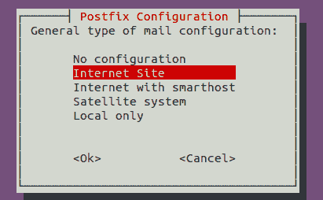

4.  安装完成后，我们需要在配置文件`/etc/logcheck/logcheck.conf`中进行更改。
5.  我们可以在配置文件中编辑的第一件事是日志检查发送的邮件主题中使用的日期/时间戳的格式:


6.  接下来，我们可以根据我们的要求，更改 REPORTLEVEL 变量的值来控制日志的过滤级别。我们有三个可用选项，默认情况下，该值设置为 server:


工作站值过滤大多数消息，并且不太冗长。偏执值对于安全性高、运行的服务尽可能少且更冗长的系统很有用。

1.  之后，我们将更改变量`SENDMAILTO`的值，并提供我们的电子邮件地址，这样我们就可以在我们的电子邮件 ID 上接收日志:

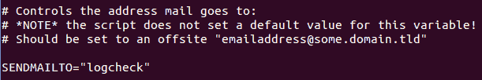

8.  日志检查生成的邮件对不同的事件使用不同的主题行。如果我们希望修改这些主题行，我们可以编辑变量的值，如下所示:


9.  默认情况下，日志检查使用`/etc/logcheck/logcheck.logfiles`文件来维护要监控的日志文件列表。如果我们希望使用任何其他文件来定义列表，并且如果它在另一个位置，我们可以编辑`RULEDIR`变量来定义新路径:


10.  如果我们想让日志检查监控除了已经在`/etc/logcheck/logcheck.logfiles`文件中定义的以外的任何特定文件，我们可以在其中添加以下条目:


在前面的文件中，我们添加了以下一行:`/var/log/boot.log`。

# 它是如何工作的...

我们首先安装日志检查包，安装后，我们编辑它的配置文件`/etc/logcheck/logcheck.conf`。

在配置文件中，我们更改了日志的日期/时间戳的格式，并通过修改`REPORTLEVEL`变量来编辑日志检查的过滤级别。

接下来，我们编辑`SENDMAILTO`变量并输入我们的电子邮件 ID 来接收我们电子邮件上的日志。

使用`etc/logcheck/logcheck.logfiles`文件，我们定义了日志检查要监控的日志。

# 使用 Nmap 监控网络

对于任何网络，无论大小，网络监控和安全都是一项非常重要的任务。对网络的定期监控对于保护系统免受攻击以及防止病毒和恶意软件进入网络非常重要。

**Nmap** ，简称**网络映射器**，是一款免费的开源网络监控工具，是系统/网络管理员最通用的工具。Nmap 可用于执行安全扫描、探索网络、查找远程系统上的开放端口以及执行网络审计。

# 准备好

为了向您展示`nmap`的工作原理，我们至少需要两个系统组成一个小网络。在一个系统上，我们将安装`nmap`包，而另一个系统将作为主机进行扫描。

1.  要安装`nmap`，如果还没有安装，运行以下命令:


2.  如果我们想检查 Nmap 的版本，我们可以使用以下命令:

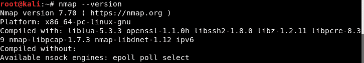

# 怎么做...

在本节中，我们将了解如何使用 Nmap 通过以下步骤执行不同类型的扫描:

1.  安装`nmap`后，只需输入`nmap`并按*进入*，我们就可以获得更多关于`nmap`可用选项的信息。这将显示以下输出，显示`nmap`支持的所有选项:


2.  让我们从使用 Nmap 扫描网络中的活动主机开始。为此，请运行以下命令:

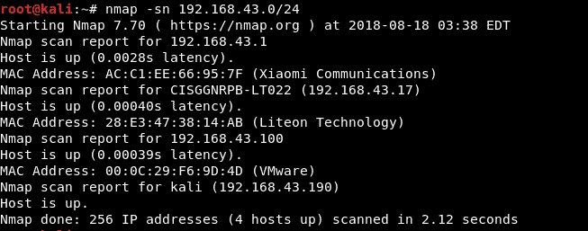

在前面的输出中，我们可以看到正在运行的主机。

3.  现在，让我们使用要扫描的系统的 IP 地址执行简单的扫描。执行简单扫描的命令如下:


在前面的例子中，我们正在扫描的系统的 IP 地址是`192.168.43.100`。在扫描结果中，我们可以看到目标系统正在运行各种服务。

4.  Nmap 也可以用来扫描我们自己的系统。为此，我们可以运行以下命令:

```sh
      nmap localhost
```

5.  如果我们想在同一命令中扫描多个系统，可以使用以下命令:

```sh
      nmap 192.168.43.100 192.168.43.102

```

6.  如果我们想将我们的扫描限制在一个特定的端口，我们可以告诉`nmap`只通过使用`-p`选项来扫描该端口，如下所示:


在前面的例子中，我们正在扫描端口`22`和`80`，这是 SSH 服务和 HTTP(网络服务器)服务的默认端口。正如我们在前面的结果中所看到的，远程系统运行 SSH 和 web 服务器。

7.  在对目标系统执行扫描时，确定该系统上的操作系统非常重要，因为许多漏洞可用于特定的操作系统平台。要知道目标系统的操作系统，我们可以使用`-O`选项，如下所示:

```sh
    nmap -O 192.168.43.100
```


前面截图中显示的结果告诉我们，目标系统运行的是基于 Linux 的操作系统，内核版本为 2.6。

8.  我们已经看到，通过使用`-p`选项，我们可以检查哪个特定端口是打开的。现在，让我们假设目标系统打开了端口 22，这意味着 SSH 正在该系统上运行。如果我们想检查远程系统上 SSH 服务的版本，我们可以使用`-sV`选项，如下所示:


9.  我们可以保存 nmap 扫描的输出，以便将来以 Nmap 支持的各种格式进行分析。让我们使用`-oN`选项以正常格式保存输出:

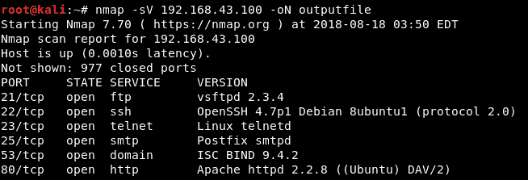

10.  我们可以看到输出文件已经在我们当前的目录中创建:


如果我们检查文件的内容，我们将看到运行以下命令时 nmap 在屏幕上显示的相同输出:


# 它是如何工作的...

当 Nmap 只是在一个 IP 地址上运行时，它会进行基本扫描，并告诉我们目标系统上打开的端口。通过了解开放端口，我们可以识别系统上运行的服务。同样，nmap 通过提供本地系统的 IP 地址来扫描本地系统。

Nmap 也可以用来同时扫描多个 IP 地址，只需在同一个命令中一个接一个地提到 IP 地址。此外，Nmap 用于检查网络中哪些系统已启动并正在运行。

它还用于使用`-p`选项扫描特定端口，如果使用`-O`选项，它会对目标系统进行指纹识别，以显示哪个操作系统正在其上运行。

Nmap 还用于执行其他任务，例如识别目标系统上运行的服务的软件版本。

# 使用扫视进行系统监控

对于管理员来说，系统监控就是通过检查系统上运行的进程和服务来监控系统的性能。但是由于屏幕空间有限，有时很难获得所有信息。在这种情况下，我们希望有一个工具可以在有限的屏幕空间内向我们显示系统的最大信息，如中央处理器、磁盘输入/输出、内存、网络等。

即使我们有单独的工具来监控所有的信息，管理员也可以在最小的空间内看到最大数量的信息。它可以根据终端窗口的大小动态调整信息。扫视可以突出显示正在使用最大数量系统资源的程序。

# 准备好

如果你正在 Ubuntu 上安装 sketch，那么建议使用 Ubuntu 13.04 或更高版本。对于 Linux 的其他版本，您应该使用最新版本。举个例子，我们使用的是 Kali Linux 2.0。

# 怎么做...

为了理解 steps 的工作原理，我们将遵循以下步骤:

1.  第一步显然是使用以下命令安装软件包:

```sh
    apt-get install glances
```

2.  安装完成后，我们要编辑`/etc/default/glances`文件，将`RUN`的值改为`true`，如下图截图所示:

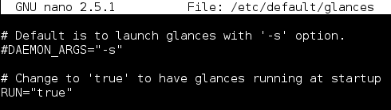

这样做将在系统启动期间自动运行 sketch。

3.  要手动启动工具，只需运行`glances`命令。您将获得以下输出窗口:


在前面的窗口中，我们可以看到显示的文本有不同的颜色。这些颜色代码在“扫视”中的含义定义如下:

*   **绿色**:这意味着一切都是`OK`
*   **蓝色**:这个颜色表示`CAREFUL`，需要注意
*   **紫色**:这个颜色表示`WARNING`
*   **红色**:这表示有东西是`CRITICAL`

Refer to the graphics bundle for the color image codes.

4.  颜色代码基于扫视配置文件中定义的默认阈值工作。我们可以通过编辑`/etc/glances/glances.conf`文件来更改这些阈值:

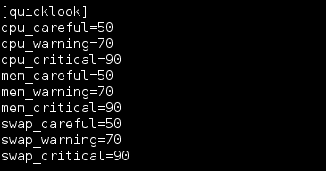

5.  默认情况下，“扫视”会以 1 秒的时间间隔刷新该值。我们可以通过使用`-t`选项，然后是以秒为单位的时间来改变这个值，如下所示:

```sh
    glances -t 5
```

6.  有时，我们可能无法实际访问我们的系统，但我们仍然希望监控系统的性能。眼神可以帮助我们远程完成这项工作。为此，我们首先需要使用`-s`选项在我们的系统上启用 sketch 的客户端/服务器模式，并使用`-B`选项将其绑定到系统的 IP 地址，如下所示:


现在，sketch 服务器运行在 IP 地址为`192.168.1.102`的系统上，默认情况下，它运行在端口`61209`上。如果在启用客户端/服务器模式时提示输入密码，请定义您选择的任何密码。

在要访问扫视的远程系统上，运行以下命令:

```sh
    glances -c -P 192.168.1.102
```

一旦我们运行了这个命令，我们将会得到如下窗口，它在左上角显示`Connected to Kali - IP 192.168.1.102/24`，告诉我们我们现在正在远程访问 sketch:

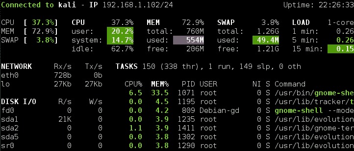

要使该命令在远程系统上工作，还需要在该远程系统上安装 sketch。

# 它是如何工作的...

安装完 skows 后，我们在系统启动时启用它的自动运行。

我们使用`glances`命令运行它，并通过编辑`/etc/glances/glances.conf`文件来修改颜色代码的阈值。

通过使用`-t`选项，我们修改了刷新时间间隔，通过使用`-s`选项，我们启用了 sketch 的客户端/服务器模式，然后通过使用`-c`选项和 sketch 运行的系统的 IP 地址在另一个系统上远程访问该模式。

# 使用 MultiTail 监控日志

对于任何系统管理员来说，监控日志文件都是一项非常繁琐的任务，如果我们必须同时引用多个日志文件来解决任何问题，那么在日志之间不断切换就变得更加困难。

对于这种情况，我们可以使用 MultiTail 工具，我们可以使用该工具在单个窗口或 Shell 中显示多个日志文件，它将实时向我们显示日志文件的最后几行。

# 准备好了

要使用 MultiTail，我们不需要在我们的 Linux 系统上设置任何特别的东西。只需要安装 MultiTail 软件包。这可以使用以下命令来完成:

```sh
    apt-get install multitail
```


# 怎么做...

一旦安装了 MultiTail 工具，我们就可以按照我们的要求开始使用它，方法是使用下面的命令:

1.  如果我们想使用`multitail`查看两个日志文件，我们将运行以下命令:

```sh
    multitail /var/log/syslog /var/log/boot.log
```


我们可以看到屏幕被分成了两部分，每个部分都显示了各个日志文件的内容。

2.  如果我们想滚动打开的两个文件，只需按下 *B* ，就会弹出一个菜单，如下图。从该列表中，我们可以选择要详细监控的文件:


在打开的新窗口中，按`gg/G`移动到滚动窗口的顶部或底部。要退出滚动窗口，按下 *Q* 。

3.  如果我们想查看两列中的三个日志文件，我们可以使用以下命令:

```sh
    multitail -s 2 /var/log/boot.log /var/log/syslog /var/log/auth.log
```

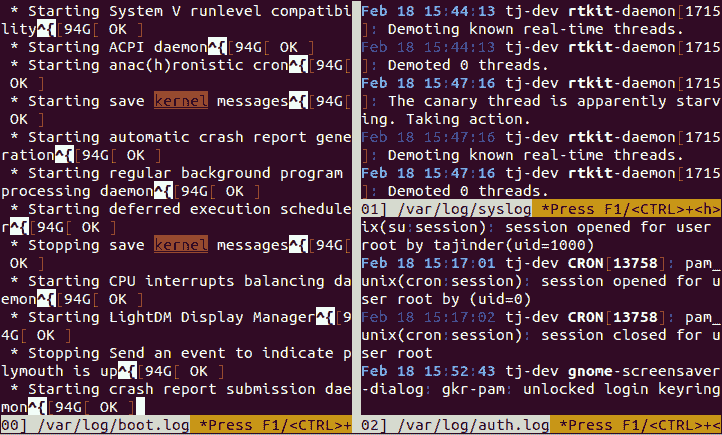

前面的截图显示了两列中的三个日志文件。

4.  MultiTail 允许我们在同一个窗口中合并单个日志文件的同时，在打开它们时自定义它们的颜色。这可以通过使用以下命令来完成:

```sh
    multitail -ci yellow /var/log/auth.log -ci blue -I /var/log/boot.log 
```


# 它是如何工作的...

当我们在命令行上向 MultiTail 提供两个日志文件的名称时，它会将这两个文件分成两部分，在同一个屏幕上打开。

对于使用 MultiTail 查看两个以上的日志文件，我们通过使用列号后面的`-s`选项来指定屏幕应该分割的列数。

MultiTail 还允许我们在同一个屏幕上查看多个日志文件，而无需通过根据颜色区分文件来分割屏幕。可以使用`-ci`选项自定义颜色。

# 使用系统工具–whoiwatch

在监视网络的同时，管理员还希望监视当前登录到系统的用户，以及每个用户在机器上做什么。

Whowatch 是完成这些任务的完美工具。它使用简单的基于文本的界面，易于使用，可以显示关于用户用户名、进程等信息，以及连接类型，如 SSH 和 telnet。

# 准备好

由于 Whowatch 在 Linux 中不是作为预装包来的，所以我们必须安装它才能使用它。安装 whowatch 的命令如下:

```sh
    apt-get install whowatch
```


# 怎么做...

为了最大限度地利用 Whowatch 工具，我们必须正确理解该工具的细节:

1.  要开始使用该工具，只需输入`whowatch`命令，就会出现如下画面:


前面的屏幕列出了所有登录的用户帐户。

2.  从这个列表中，我们可以选择任何一个用户账号，当我们按下*进入*时，我们可以查看用户正在运行的所有程序的信息:


在同一个屏幕上，我们在底部有更多的选项，使用这些选项，我们可以获得关于用户以及用户已经运行的程序的更多信息:


3.  在 Whowatch 的主屏幕上，我们可以在底部看到一个菜单，如下所示:


在前面的截图中，我们可以看到我们必须使用 *F9* 键来访问菜单选项。

4.  一旦我们按下 *F9* ，我们将在屏幕顶部看到一个菜单。使用键盘上的箭头键浏览菜单。当我们选择“进程”选项卡时，我们会得到一个子菜单，它为我们提供了向正在运行的进程发出 KILL 信号的选项。同样，我们可以在同一子菜单中看到更多选项:

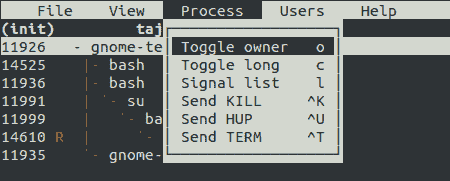

5.  当我们移至“视图”选项卡时，我们会看到以下选项:


6.  最后一个选项卡是“帮助”，在该选项卡下有“键”选项:


7.  当我们按下按键时，它将打开一个新窗口，并显示用于不同任务的按键的详细信息，如下图所示:


8.  按 *s* 获取系统的更多信息:

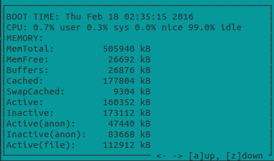

9.  如果我们按下 *t* ，我们会得到一个树形结构的系统上所有进程的列表，我们可以在下面的截图中看到:

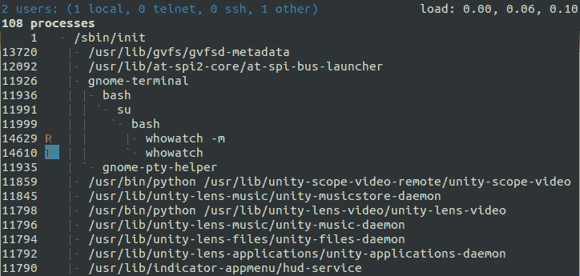

# 它是如何工作的

只需在命令行上键入`whowatch`即可启动 Whowatch。当它启动时，它会显示已登录的用户列表。只需按下任意用户名上的*输入*，即可获得该用户下运行的所有程序的信息。

要访问 Whowatch 中的更多选项，我们可以按下 *F9* 键进入主菜单。然后，我们会获得各种选项卡，如进程、视图、用户、帮助等。

“流程”选项卡为我们提供了管理流程的选项，而“视图”选项卡为我们提供了搜索和查看流程的选项。“帮助”选项卡上有一些选项，可以查看可以在 Whowatch 中用作快捷方式的按键。

我们使用不同的键来访问系统信息，并获得所有进程的列表。

# 使用系统工具–stat

在 Linux 上工作时，最常用的命令是`ls`，它给出了指定目录中文件的列表。但是，它只显示了关于文件的一点信息。

相反，如果我们使用`stat`命令，与使用`ls`相比，我们可以获得更多关于文件/目录的信息。因为`stat`能够从文件的索引节点获得关于文件的信息，所以它能够给出关于文件的更多信息。

# 准备好

由于`stat`是 Linux 的内置命令，所以不需要安装其他任何东西，我们就可以使用它。

# 怎么做...

本节将解释`stat`命令的选项和用法。通过使用`stat`，我们可以获得特定文件或文件系统的详细状态。

1.  假设我们有一个名为`example.txt`的文件。当我们使用`ls -l`命令对该文件进行长列表时，我们会获得关于该文件的信息，其中包括关于该文件上次修改时间的信息。

但是，当我们使用`stat`命令检查同一个文件的详细信息时，它会显示该文件的额外信息和差异，如下图所示:

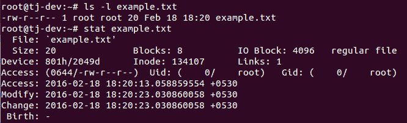

在前面的输出中，我们可以看到`Modify`和`Change`的时间是相同的，但是访问时间发生了变化。它还显示了八进制和 rwx 格式的权限。还显示了许多其他细节。

2.  现在，让我们将文件重命名为`sample.txt`。在此之后，如果我们使用`stat`查看`sample.txt`文件的详细信息，我们可以看到`Change`时间已经更新:

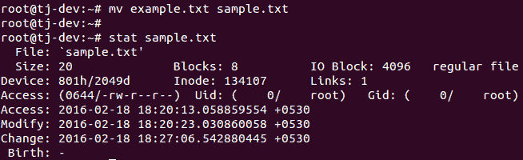

3.  现在，假设我们有三个名为`sample.txt`、`sample1.txt`和`sample2.txt`的文件。如果我们想检查这三个文件的详细信息，我们可以对每个文件单独使用 stat，也可以对`stat`使用通配符来显示一组中所有三个文件的详细信息，如下所示:

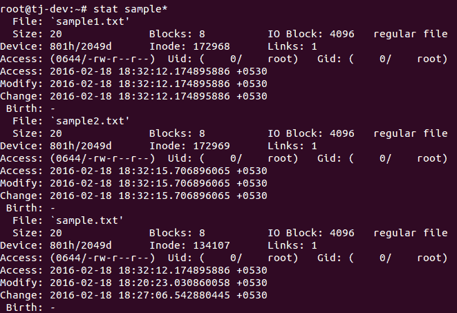

4.  我们也可以使用`stat`命令来检查目录的详细信息，如下所示:


在目录的情况下，我们可以看到关于链接数量的额外细节。

5.  如果我们对 Linux 的任何目录使用`stat`命令，比如`/etc/`，我们可以看到我们得到了一个很大的链接数量值，如下所示:


6.  如果我们想查看文件系统的详细信息，我们不能为此使用`ls`。然而，`stat`也适用于文件系统。对于文件系统，我们获得的详细信息与文件相同:

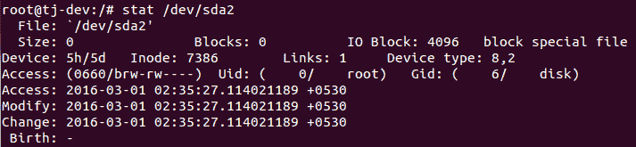

7.  如果我们在检查文件系统的详细信息时将`-f`选项与`stat`命令一起使用，它将显示文件系统的状态:

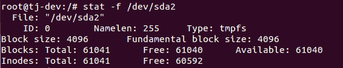

# 它是如何工作的...

我们可以使用 stat 命令获取文件的详细信息。当一个文件被重命名时，stat 会告诉我们更改的时间。它还在命令中使用通配符同时给出了多个文件的信息。

Stat 也适用于目录和文件系统。对于文件系统，stat 可以使用`-f`选项显示其状态。

# 使用系统工具–lsof

有时，我们会遇到无法卸载磁盘的情况，因为它说文件正在被使用，但我们无法理解它指的是哪个文件。在这种情况下，我们可以检查系统上运行的进程打开了哪些文件。

这可以使用`lsof`命令来完成，这意味着列出打开的文件。由于 Linux 将包括目录、设备、套接字等在内的一切都视为文件，因此我们可以使用`lsof`轻松识别所有打开的文件。

# 准备好了

要使用`lsof`命令，建议从根帐户登录，或者从非根帐户使用`sudo`，以便不限制`lsof`命令的输出。

# 怎么做...

在本节中，我们将探讨可与`lsof`命令一起使用的不同选项，以了解其工作原理:

1.  如果我们只运行 lsof，它将列出属于系统上任何活动进程的所有打开的文件。如果输出很长，我们可以使用`less`命令滚动输出:

```sh
    lsof | less
```

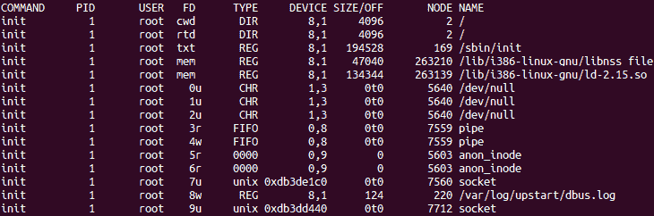

前面截图中显示的输出显示在命令、PID、用户、FD、类型、设备等列中，以便更好地理解文件。

FD 栏有关于文件描述的信息，如**当前工作目录**(**CWD**)**根目录**(**RTD**)**程序文本** ( **TXT** )等。如果 FD 列包含`0u`、`1u`等信息，数字表示实际的文件描述符，字母表示不同的模式(读访问、写访问和读/写访问)。

1.  要检查特定用户的所有打开文件列表，我们可以使用`-u`选项，后跟用户名，如下所示:

```sh
    lsof -u tajinder
```


2.  使用 lsof，我们可以检查特定端口上是否有任何进程在运行。为此，我们必须使用`-i`选项并运行以下命令:

```sh
    lsof -i TCP:22
```

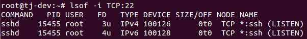

在前面的例子中，我们已经检查了端口`22`上正在运行的进程列表，可以看到 SSH 进程正在运行。

1.  如果我们想检查系统上打开文件的确切数量，我们可以运行以下命令:


在前面的例子中，我们可以看到我们有很多打开的文件——具体来说就是`5,220`。

1.  要检查哪个用户正在查看哪些文件以及用户正在运行哪些命令，我们可以使用以下命令:

```sh
    lsof -i -u tajinder
```

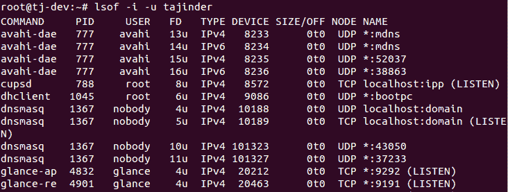

我们在使用`lsof`的时候有更多的选择，可以参考`lsof`命令的主页面进行探索。

# 它是如何工作的...

只需运行`lsof`命令，我们就可以得到系统上所有打开文件的列表。通过使用`-u`选项并指定用户名，我们获得了特定用户的打开文件列表。

当我们使用`-i`选项并指定一个端口号时，我们会获得在该端口上运行的任何进程的信息。

当我们使用带有特定用户名的`-i`和`-u`选项时，我们会得到该用户正在访问的文件和命令的信息。

# 使用系统工具-策略

当在我们的 Linux 机器上运行任何命令或程序时，我们可能会想知道它的后台工作是什么。为此，我们在 Linux 中有一个非常有用的工具叫做`strace`。

这是一个命令行工具，也可以用作诊断或调试工具。Strace 监控进程和 Linux 内核之间的交互，当我们想要调试任何程序的执行时，它很有帮助。

# 准备好

默认情况下，该工具适用于所有基于 Linux 的系统。因此，开始使用`strace`不需要配置其他任何东西。

# 怎么做...

让我们看看如何以各种方式使用 strace 来跟踪任何程序的执行，从头到尾:

1.  要跟踪 Linux 中任何可执行命令的执行，只需运行`strace`命令，然后运行可执行命令。如果我们将`strace`用于`ls`命令，我们会得到以下输出:

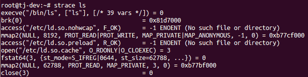

2.  在前面的截图中，显示的输出被截断。如果我们检查输出的最后几行，我们可以看到 write 系统调用显示当前目录列表的地方:

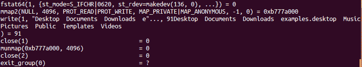

3.  为了检查清单，我们可以在同一个目录中单独运行`ls`，我们将看到与上一个截图中看到的清单相同的清单:


4.  如果我们想让 strace 命令的统计摘要以简洁的方式显示，我们可以使用`-c`选项，如下所示:

```sh
    strace -c ls
```

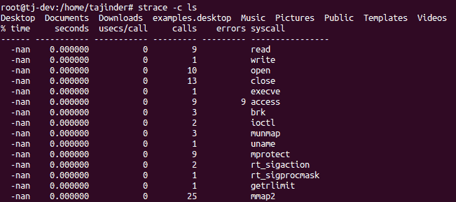

5.  我们也可以使用`-t`选项在每一个输出行的开始显示时间戳，如下所示:


6.  默认的 strace 命令显示可执行程序进行的所有系统调用。如果我们希望只显示特定的呼叫，我们可以使用`-e`选项。因此，如果我们想看到`ls`命令的开放系统调用，我们必须运行以下命令:

```sh
    strace -e open ls
```


7.  如果我们希望将 strace 命令的输出保存在一个文件中，以便以后查看，我们可以使用`-o`选项来实现，如下所示:

```sh
    strace -o output.txt ls
```

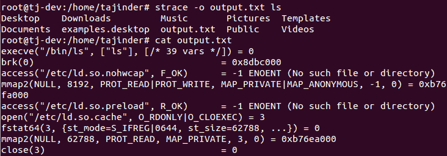

这里，`output.txt`是将被创建以保存`strace`命令输出的文件的名称。

8.  如果我们想在当前正在运行的任何进程上使用`strace`，我们可以通过使用该进程的进程标识来实现。在我们的例子中，我们使用的是火狐进程的进程，其 ID 为`16301`。

我们可以运行以下命令，也可以使用`-o`选项将命令的输出保存在`firefox_output.txt`文件中:

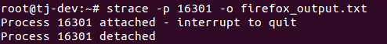

9.  然后，我们可以使用`tail`命令或我们选择的任何文本编辑器来检查输出文件的内容。

# 它是如何工作的

当`strace`命令在任何其他 Linux 命令或程序上使用时，它会跟踪它与 Linux 内核的交互。

当`-c`选项与`strace`一起使用时，我们得到一个统计摘要，如果使用`-t`选项，我们得到每个输出行前面的一个时间戳。

使用`-e`选项，我们可以看到程序执行的特定调用，就像开放系统调用一样。通过使用`-o`选项，我们将 strace 命令的输出写入一个文件。

# 利用 IPTraf 实时监控 IP 局域网

IPTraf 是一种用于网络监控的工具。它允许我们分析我们的 Linux 服务器的传入和传出网络流量。IPTraf 还可以用来分析局域网上的流量，或者找到带宽的利用率。

# 准备好了

IPTraf 是 Linux 发行版的一部分，可以使用 Linux 的默认存储库进行安装。如果我们使用的是 Ubuntu 系统，可以使用`apt-get`安装 IPTraf 包，如下所示:

```sh
 apt-get install iptraf
```

****

# 怎么做...

使用`Iptraf`非常简单。安装后，只需运行一个简单的命令，就可以从终端启动它。让我们探索一下该工具是如何工作的:

1.  要启动`Iptraf`，只需在终端中键入以下命令:

```sh
Iptraf    
```

2.  这将启动一个基于 ASCII 的菜单界面。按任意键继续。

3.  在下一个屏幕中，我们将获得一个菜单系统，其中有不同的选项可供选择，如下所示:


4.  我们会选择第一个选项，IP 流量监控，按*进入*。这将要求我们选择要监听流量的接口:


我们将在前面的列表中选择`eth0`并按*进入*。

5.  IPTraf 现在将向我们展示在`eth0`界面上发生的所有 TCP 和 UDP 连接。窗口的上半部分显示了 TCP 连接，下半部分显示了 UDP 数据包:


6.  按下 *X* 回到上一个菜单。让我们从菜单中选择统计细分选项，然后按*进入*:

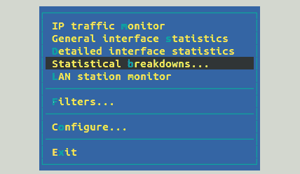

7.  这个功能允许我们按照 TCP/UDP 端口对数据包进行排序。我们还可以按大小对数据包进行排序:

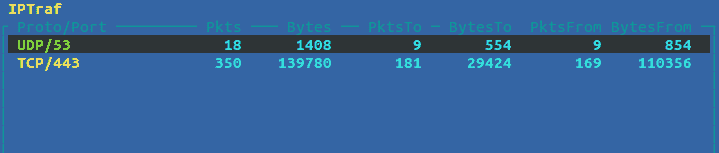

8.  退出主菜单，选择配置选项，按*进入*。在这里，我们配置我们的工具应该如何工作。我们可以启用或禁用反向域名系统查找、服务名称、混杂模式等设置:

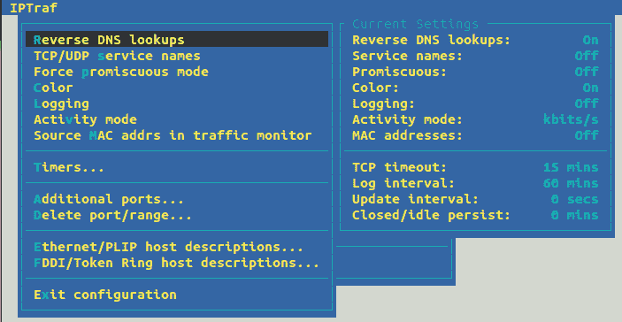

在前面的截图中，我们已经启用了反向域名系统查找。

9.  在监控流量时启用反向域名系统查找后，我们可以看到输出包含域名系统名称，而不仅仅是 IP 地址:


10.  如果我们想保存网络监控的历史记录，我们可以在“配置”菜单中启用日志记录:


11.  启用日志记录后，该工具将要求我们指定要写入日志的文件的路径。我们可以指定路径或使用默认路径:

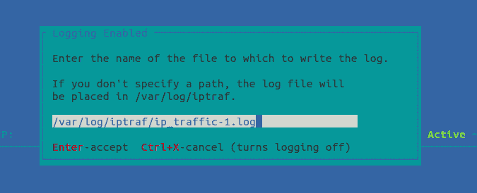

12.  在主菜单中，我们可以选择查看详细的界面统计信息。选择此选项并开始监控:


13.  我们现在可以看到所选接口 eth0 上流量的完整详细信息，如下所示:


# 它是如何工作的...

IPTraf 是一个易于使用的工具，用于监控接口上的网络流量。我们可以根据自己的需求配置工具，甚至可以将流量日志保存在文件中以供进一步分析。

# 使用 Suricata 进行网络安全监控

如果我们想在 Linux 上使用网络入侵检测系统，我们可以使用 Suricata，这是一个免费的开源工具。它可以使用其规则和签名语言来检查网络流量。Suricata 可以处理数千兆位的流量，并在屏幕上显示。它还可以通过电子邮件发送警报。

# 准备好

在开始安装和配置 Suricata 之前，我们需要安装一些它的依赖包。我们可以使用以下命令安装所有必需的依赖项:

```sh
apt-get install libpcre3-dbg libpcre3-dev autoconf automake libtool libpcap-dev libnet1-dev libyaml-dev libjansson4 libcap-ng-dev libmagic-dev libjansson-dev zlib1g-dev 
```

Suricata 的默认工作方式是作为入侵检测系统。如果我们希望将其用作入侵防御系统，我们将需要一些额外的软件包，可以使用以下命令进行安装:

```sh
apt-get install libnetfilter-queue-dev libnetfilter-queue1 libnfnetlink-dev 
```

一旦我们完成了软件包的安装，我们就可以从 Suricata 的官方网站下载最新的稳定版本。我们可以使用浏览器访问网站并下载文件，或者使用以下命令直接从终端下载文件:


# 怎么做...

一旦我们完成了依赖包的安装并下载了 Suricate 的源文件，我们就可以开始安装和配置部分了。现在让我们探索这些步骤:

1.  下载源文件后，打开保存下载文件的目录，然后使用以下命令提取下载文件:


2.  提取完成后，将目录更改为`suricata-4.0.5`，如下所示:


3.  现在，我们将使用以下命令构建具有 IPS 功能的 Suricata:

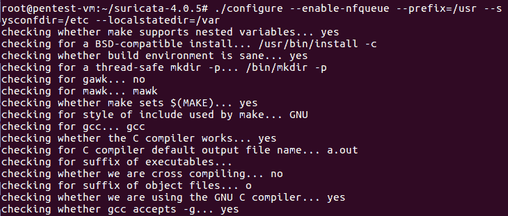

4.  构建完成后，我们将开始安装过程。首先我们运行`make`命令:


5.  一旦前面的命令完成，我们就可以运行下一个命令，即`make install`:

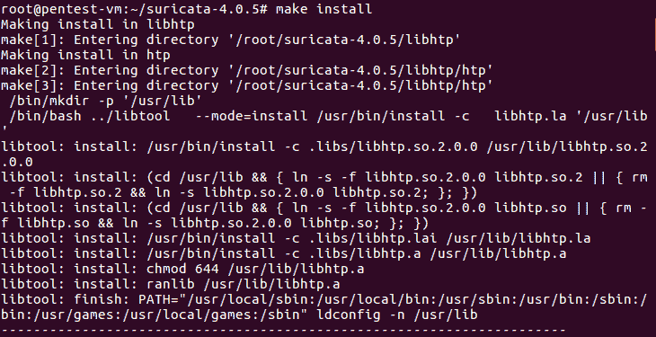

6.  我们的下一步是使用以下命令安装 Suricata 的默认配置文件:


7.  到目前为止，Suricata 的默认安装已经完成。但是，没有规则，工具就没有用。因此，我们将通过在其源目录中运行以下命令来安装 Suricata 的 IDS 规则集，我们之前已经提取了该命令:

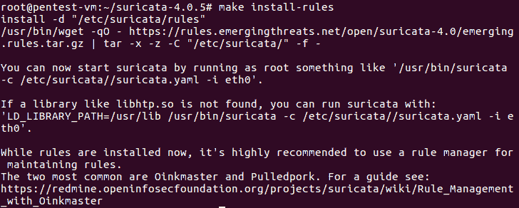

8.  我们可以通过列出`/etc/suricata/rules`目录中的文件来检查所有已安装的规则集:


9.  现在，让我们通过编辑`/etc/suricata/suricata.yaml`配置文件来配置我们使用的工具。编辑`HOME_NET`变量，并根据我们的基础设施要求添加详细信息。我已经添加了安装我们工具的 Ubuntu 服务器的 IP 地址。通过这样的改变，苏瑞卡塔将提醒我们任何对`HOME_NET`的攻击，它指的是我们的 Ubuntu 服务器:


10.  现在，我们将为测试 Suricata 创建一个测试规则集。为此，我们将在`/etc/suricata/rules`目录中创建一个名为`for_test.rules`的文件，并在其中添加以下行:


11.  下一步是在`suricata.yaml`配置文件中定义上一步创建的规则文件的路径:


我们在`rule-files`部分增加了`for_test.rules`。

12.  设置好一切后，建议关闭网卡上的数据包卸载功能，Suricata 正在监听该功能。为此，我们可以运行以下命令:

```sh
ethtool -K ens33 gro off
```

13.  最后，我们将使用以下命令在实时模式下启动 Suricata:


我们的入侵检测系统现在已经启动，正在监听`ens33`界面，

14.  现在，让我们测试一下是否一切正常。我们将尝试 ping 我们运行 Suricata 的 Ubuntu 服务器。
15.  现在，让我们使用以下命令检查 Suricata 服务器上的日志:


如果 Suricata 工作正常，我们将得到一个类似于前面截图所示的输出。

# 使用 OpenNMS 进行网络监控

当我们希望在单个实例上监控网络中的无限设备时，我们可以使用 OpenNMS。这是一个开源和免费的网络监控网络应用系统，有助于自动检测和监控网络中的服务或节点。更多的设备或节点也可以轻松添加到 OpenNMS 中。

# 准备好

为了配置 OpenNMS，我们将使用 Ubuntu 服务器，该服务器已更新到最新的稳定版本。更新完服务器后，我们需要进行一些配置，为安装和配置 OpenNMS 做好系统准备:

1.  首先，我们将编辑`/etc/hosts`文件，为我们的服务器设置一个正确且完全合格的域名:

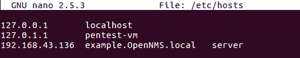

在这里，我们添加了`example.OpenNMS.local`作为我们服务器的域名。

2.  接下来，我们编辑`/etc/hostname`并更新同一个域名:


3.  OpenNMS 将 PostgreSQL 用于其数据库目的。因此，我们将使用以下命令安装 PostgreSQL:

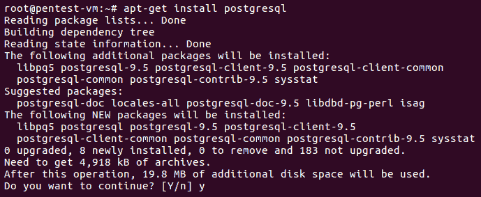

4.  一旦安装完成，我们将允许用户通过编辑`/etc/postgresql/9.5/main/pg_hba.conf`文件来访问我们根帐户的数据库:


完成这些更改后，保存并关闭文件。

5.  现在，重新启动 PostgreSQL 并启用它，以便它可以在启动时启动。使用以下命令来完成此操作:


6.  我们的下一步是安装 Java。为此，我们首先将 PPA 添加到`apt`源列表中，如下所示:


7.  然后，我们将通过运行`apt-get update`命令来更新存储库。完成后，我们将使用以下命令开始安装 Java:

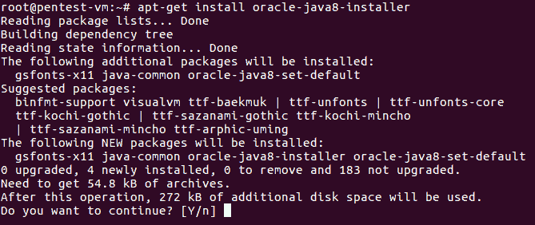

8.  安装完成后，我们可以使用以下命令检查 Java 版本:


现在，我们已经准备好系统，开始安装和配置 OpenNMS。

# 怎么做...

完成前面*准备*部分提到的先决条件后，我们现在可以开始安装和配置 OpenNMS 了:

1.  OpenNMS 在 Ubuntu 的默认存储库中不可用。因此，我们必须在`/etc/apt/sources.list.d`目录中添加 OpenNMS 的存储库。为此，我们可以运行以下命令:

```sh
nano /etc/apt/sources.list.d/opennms.list
```

2.  在`/etc/apt/sources.list.d/opennms.list`目录中增加以下几行:

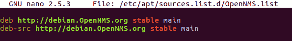

一旦完成，我们将保存并关闭文件。

3.  现在，我们将通过运行以下命令来添加 OpenNMS 密钥:

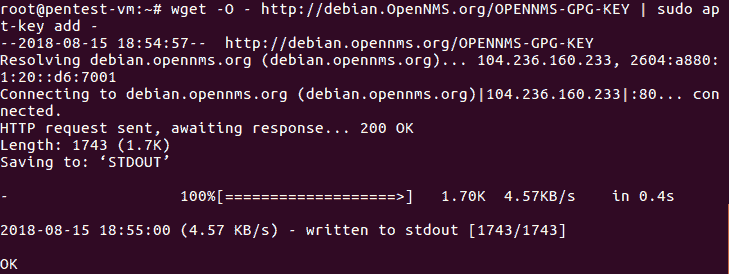

4.  接下来，使用`apt-get update`命令更新存储库:

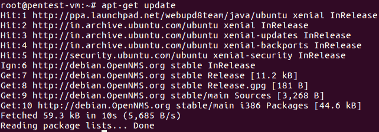

5.  我们现在可以使用以下命令安装 OpenNMS:


6.  安装完成后，我们将看到以下屏幕:


7.  如前所述，我们现在将运行命令为 OpenNMS 创建一个数据库，如下所示:


以下是被截断的输出:


8.  让我们现在重新启动 OpenNMS:

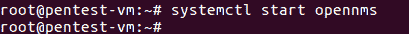

9.  让我们启用 UFW 防火墙，如果它还没有启用的话，以允许 OpenNMS 的端口:

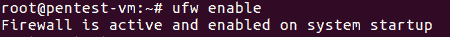

我们的 UFW 防火墙现已在我们的服务器上启用。

10.  由于 OpenNMS 在端口`8980`上运行，因此我们不会通过使用以下命令来允许该端口通过 UFW 防火墙:


11.  当我们查看 UFW 的状态时，可以看到港口`8980`增加了规则:

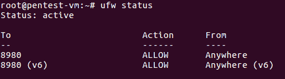

12.  现在，打开浏览器，通过输入网址`http://<IP Address>:8980`进入 OpenNMS。我们应该会看到以下屏幕:


使用默认用户名`admin`和默认密码`admin`登录，开始使用 OpenNMS。

13.  登录后，我们将看到以下屏幕:


14.  我们可以在 OpenNMS 中添加一个新的服务器节点进行监控，方法是单击右上角的 Admin，然后从下拉菜单中选择快速添加注释。

15.  我们将获得以下屏幕，以便添加新的服务器节点。输入完成该过程所需的详细信息:

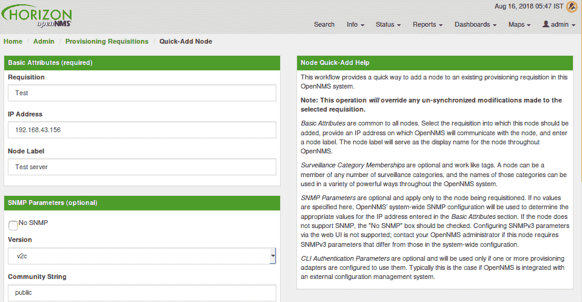

16.  添加完节点后，我们可以点击信息，然后点击节点。您可以通过参考标签找到新添加的节点。在这里，我们可以看到节点的状态、通知和事件信息。

# 它是如何工作的

OpenNMS 用于监控网络中的多个服务器和节点。

要安装和配置 OpenNMS，我们需要先安装 PostgreSQL 和 Java。我们还必须在`/etc/hosts`和`/etc/hostname`文件中进行更改，以设置一个完全合格的域名，这样我们就可以在网络中正确使用 OpenNMS。

一旦完成这些更改，我们将安装和配置 OpenNMS 以供使用。