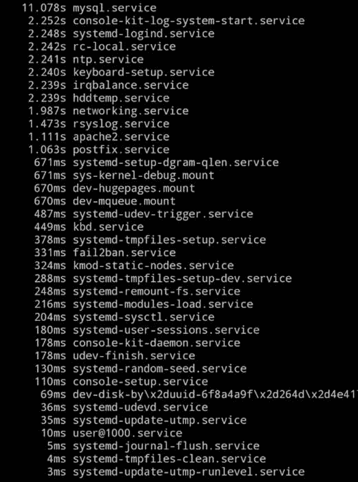
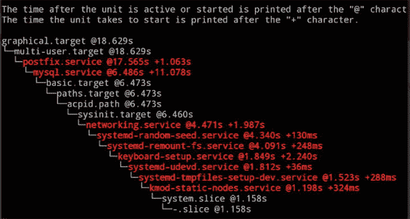

# 三、`systemd`超级动力

很长一段时间以来，名为`init`的服务处理程序负责重启后的服务初始化。然而，随着 Linux 每个新版本的发布，`init`开始看起来越来越像一个古董。`init`的一个基本问题是它以线性方式运行，当并行化成为可能时，这种方式几乎没有效率。经过一番争论后，选定的替代者是`systemd`。在这一章中，我将介绍如何与您的`systemd`服务交互，并探索您在使用`systemd`的新版 Linux 中可能遇到的任何陷阱。

## 掌握基础知识

你会看到新旧版本的一些对比。好消息是，如果需要的话，您仍然可以使用诸如`/etc/init.d/SERVICENAME start`这样的命令来启动服务。

但是，你需要习惯的系统控制二进制被称为`systemctl`。接下来，请记住以下内容—您现在需要使用的首选启动/停止“服务”命令格式如下所示:

`# systemctl start SERVICENAME.service`

请注意该命令开头的新名称`systemctl`和可选附加的`.service`添加。还要注意，正如您所料，您可以将单词`start`换成`restart`、`stop`、`reload`和`status`。另一个选项是`condrestart`(也适用于`init`)；`condrestart`将允许您有条件地重启已经运行的服务。或者，在`systemd`命令中增加一些字符，如下所示:

`# systemctl try-restart SERVICENAME.service`

此外，您可以尝试这个方便的老式`service`命令:

`# service --status-all`

该命令运行位于`/etc/init.d`目录中的所有“init 脚本”,并报告它们是启动还是停止，或者在非常基本的层面上，可能有问题。这种情况下的`systemd`选项是:

`# systemctl list-units --type service --all`

如何设置服务在重启后启动和停止？在 Red Hat 衍生产品上，您可能会使用`chkconfig`命令。然而，让我们先看看 Debian 衍生工具。

在 Debian 6.0 之前，您可能会使用类似下面的命令在引导时启动您的服务/守护进程:

`# update-rc.d SERVICENAME defaults`

在较新的 Debian 版本中，我们鼓励您使用这个命令:

`# insserv SERVICENAME`

如果您仍在使用`update-rc.d`，那么您可以使用以下命令对您的`/etc/init.d`目录中的服务运行`no-op`或`dry-run`检查(无需实际启用它们):

`# insserv n`

并且，为了避免服务在引导时启动，这个简单的命令就足够了:

`# insserv r SERVICENAME`

在`systemd`之前，为了让您的脚本在不同的运行级别上运行，编写包含 LSB (Linux 标准库)头的脚本是很重要的。这些脚本可能看起来有点像清单 [3-1](#FPar1) 中的例子，它在一个`init`脚本( [`https://wiki.debian.org/LSBInitScripts`](https://wiki.debian.org/LSBInitScripts#_blank) ，由 Debian Wiki 团队创建)的顶部显示了一个 LSB 头。

Listing 3-1\. An LSB Header

`### BEGIN INIT INFO`

`# Provides: scriptname`

`# Required-Start: $remote_fs $syslog`

`# Required-Stop: $remote_fs $syslog`

`# Default-Start: 2 3 4 5`

`# Default-Stop: 0 1 6`

`# Short-Description: Start daemon at boot time`

`# Description: Enable service provided by daemon.`

`### END INIT INFO`

Note

为了提醒人们事情过去是如何运作的，参考 [`https://wiki.debian.org/LSBInitScripts/DependencyBasedBoot`](https://wiki.debian.org/LSBInitScripts/DependencyBasedBoot) 。

要在重启后使用`systemd`启动特定服务，请使用以下命令:

`# systemctl enable SERVICENAME.service`

要关闭它，请使用以下命令:

`# systemctl disable SERVICENAME.service`

### 启动时开始

对于使用`chkconfig`命令的 Red Hat、Fedora 和 CentOS 发行版，您可以使用的新的`systemd`等价物如下。这个命令`chkconfig SERVICENAME on`简单地变成了:

`# systemctl enable SERVICENAME.service`

为了禁用一个服务，你当然要用`disable`和`off`替换`on`和`enable`。

检查服务在哪个运行级别启动的常见命令(`chkconfig list SERVICENAME`)可以替换为以下命令:

`# systemctl status SERVICENAME.service`

顺便提一下，这些命令中有一些是可替换的，如果您愿意，您可以安全地将单词`status`替换为`is-enabled`。此外，要检查服务是否正在运行，您可以使用选项`is-active`来代替。您可能很熟悉这个命令，它将显示哪些服务被设置为在何时做什么:

`# chkconfig --list`

现在查看所有服务及其启动设置的首选命令是:

`# systemctl list-unit-files --type service`

## 了解单位和目标

接下来，当谈到`systemd`时，我们将考虑“单位”的含义。单元实际上只是不同类型的配置文件，包含您想要操作的流程的属性。

类似地，“目标”指的是您希望同时启动的一组流程。它们取代了老式的运行级别，只是一堆指向你的单元文件的符号链接。不过，不要担心目标——它们很快就会变得更有意义——现在让我们回到单位。

### 单位

你已经在上面看到了一个单位的例子:`SERVICENAME.service`。在`systemd`中，单位可以包括:`automount`、`device`、`mount`、`path`、`service`、`socket`、`swap`、`snapshot`、`slice`、`scope`、`target`、`timer`。

您可以使用下面的命令浏览当前加载的单元(顺便说一下，您可以选择在`--type=`后使用等号):

`# systemctl list-units --type service`

图 [3-1](#Fig1) 显示了该命令的结果；如你所见，每个单元都有有用的细节。你也可以用这个请求查看“所有”服务(见图 [3-1](#Fig1) ):

图 3-1。

The output displayed when requesting a list of the currently-loaded service “units”

`# systemctl list-units --all`

您可以试验这些命令而相对不受惩罚，但是在您确定它们的作用之前，不要拿生产系统冒险。

如果您想查看所有已加载的服务和单元，而不仅仅是正在运行的服务和单元，请运行以下命令:

`# systemctl list-units --all`

### 目标

不再有任何关于`systemd`的运行级别的概念。取而代之的是使用“目标”，简单地指向许多单位，这样你就可以一起发射它们。要查看系统上的所有目标，可以使用以下命令:

`# systemctl list-unit-files --type=target`

如果您遇到了新命令，请记住像`/etc/init.d/SERVICENAME star` t 和`service SERVICENAME start` do(可能依赖于发行版)这样的命令仍然有一些效果，所以如果您很着急，不要太担心。

为了帮助我学习，我选择创建几个不同的 Bash 别名来保持正确。如果您愿意，还可以在 Bash 别名旁边添加关于`∼/.bashrc`文件中命令的注释。然后，无论何时需要运行命令，您都可以查看您的用户和“根”用户的 Bash 历史，最终将它们提交到内存中。

如果您想要查看触发其依赖关系树下所有单元文件的默认目标，那么您可以使用以下命令:

`# systemctl get-default`

表 [3-1](#Tab1) 显示了标准目标如何与老派运行水平相关联，其中一些包括图形用户界面(GUI)。

表 3-1。

Old-School Run Levels Versus New systemd Targets

<colgroup><col> <col> <col></colgroup> 
| 运行级别 | 系统目标 | 功能 |
| --- | --- | --- |
| Zero | `runlevel0.target, poweroff.target` | 关机和断电 |
| one | `runlevel1.target, rescue.target` | 发射救援炮弹 |
| Two | `runlevel2.target, multi-` `user.target` | 启动一个非 GUI 的多用户系统 |
| three | `runlevel3.target, multi-` `user.target` | 启动一个非 GUI 的多用户系统 |
| four | `runlevel4.target, multi-` `user.target` | 启动一个非 GUI 的多用户系统 |
| five | `runlevel5.target, graphical.target` | 启动一个 GUI，多用户系统 |
| six | `runlevel6.target, reboot.target` | 关机并重启 |

如前所述，拥有这些目标单元的原因是将`systemd`单元和它们相关的依赖项集合在一起。例如，GNOME 窗口管理器(`gdm.service`)会触发`multi-user.target`目标。作为回报，`multi-user.target`目标启动任何必需的或基本的服务。此外，一个名为`basic.target`的目标被解雇。

与`init`类似，`systemd`也使用符号链接。例如，如果您想要更改系统的运行级别，您可以删除现有的运行级别，如下所示:

`# rm /etc/systemd/system/default.target`

要启动 GUI 运行级别，您需要创建一个新的符号链接，如下所示:

`# ln -sf /lib/systemd/system/graphical.target /etc/systemd/system/default.target`

例如，多用户(运行级别 5)符号链接也可以在这里`/lib/systemd/system/multi-user.target`找到。无需重新启动，您可以在当前会话中立即更改目标，如下所示:

`# systemctl isolate TARGETNAME.target`

换句话说，如果您想关闭 GUI 并立即切换到多用户模式，那么这个命令将允许您这样做:

`# systemctl isolate multiuser.target`

如果您想改变过去的运行级别，那么您实际上应该启动所有与特定目标相关联的“单元”,然后忠实地停止任何不再需要的单元。

`systemd`包含的救援模式类似于 Windows 安全模式:

`# systemctl rescue`

救援模式将尝试安装所有列出的驱动器，但让您的机器脱离网络(从而避免其他用户登录)。您将需要超级用户密码来执行这个命令，并且您可能会认为这个模式相当于单用户模式。您还将向登录到系统的所有其他用户发出关于系统状态变化的警告，并有可能减少您的机器的流量。小心使用这个短命令。

还有紧急模式，这意味着您将“根”文件系统挂载为只读，并且不挂载其他驱动器。对于一个活动的生产系统来说，这种行为可能会对您的用户造成严重的破坏，因为他们会丢失数据和访问权限。像这样进入模式(小心):

`# systemctl emergency`

`emergency`目标只使用这些依赖关系:

`emergency.service`

`●``.mount`

`● └─system.slice`

要比较多用户目标处理的许多依赖项，请尝试运行:

`# systemctl list-dependencies multi-user.target`

## 探索分析工具

对`systemd`的一个很好的补充是一个分析工具。使用它，您可以体会到相对于`init`的性能改进。您可以像这样运行它:

`# systemd-analyze`

`Startup finished in 1258ms (kernel) + 1132ms (initramfs) + 111111ms (userspace) = 113501ms`

正如您所看到的，这个聪明的小工具忠实地报告了您的 systemd 机器启动的速度。

您还可以添加一些选项来进一步分析您的引导性能。这里有一个有趣的选项:

`# systemd-analyze blame`

如图 [3-2](#Fig2) 所示，`blame`选项会生成一个列表，列出那些会降低你开机时间的服务。我只有一台位于同一地点的服务器，在启动我的数据库服务时，比如说“mysql”，它看起来很吃力。甚至 Apache 也快如闪电，只需一秒多一点，我的邮件服务器`postfix.service`也是如此。

图 3-2。

Who is to blame for a slow boot time? Use the “blame” option

我简单提到了与`init`相关的依赖问题。如果您正在检查您的启动时间，则尝试以下选项，以显示启动过程中`systemd`单元发生的情况:

`# systemd-analyze critical-chain`

图 3-3。

There’s lots of useful output from the “critical-chain” option

您甚至可以创建 SVG 文件(基于 XML 的“可缩放矢量图形”文件)，这是一种图形文件，对于可视化信息非常有用。

`# systemd-analyze plot > steffi_graf.svg`

这个命令将创建一个有用的水平条形图，熟练地说明您的引导过程的完整时间线，包括启动的时间和并行运行的时间。如果您正在努力解决启动时间的问题，并且希望提高机器的启动性能，那么可以尝试绘制这些图表。

Linux 发行版中有一个名为“OpenMadriva Lx”的综合网页，其中有一个 SVG 图作为例子。可在 [`https://doc.openmandriva.org/OpenMandriva-Lx-2014`](https://doc.openmandriva.org/OpenMandriva-Lx-2014) 的“7 . 26 . 3—分析引导系统 d—分析”一节中找到。

### 电源选项

让我们看一些简单的任务。例如，您可以使用以下命令代替`shutdown -h now`:

`# systemctl poweroff`

重启很容易启动:

`# systemctl reboot`

类似地，旧式的`pm-suspend`可以像这样使用电源管理来暂停系统:

`# systemctl suspend`

要使机器休眠，请尝试以下命令:

`# systemctl hibernate`

要同时休眠和挂起您的系统，请使用以下命令:

`# systemctl hybrid-sleep`

### 检查日志

当您需要检查`systemd`日志时，您依赖于`journald`。强大的`systemd`引进了自己的新记录系统。从最早的条目开始，您可以很容易地检查所有日志条目。我对这个函数的 Bash 别名很简单:

`alias jj='journalctl'`

我的别名中显示的有问题的命令是:

`# journalctl`

您也可以保存以前重新启动时的数据。显然，一些 Linux 发行版支持这一标准，但有些似乎不支持。查看配置文件`/etc/systemd/journald.conf`来改变这种行为。您可能需要更改当前行，使数据存储在`[Journal]`部分下“持久化”,以启用它:

`Storage=persistent`

对于来自`systemd`(类似于`dmesg`)的所有内核消息，您只需运行以下命令:

`# journalctl -k -b`

`-b`开关表示只需注意最后一次启动；根据需要拆下`-k`。

一个简单的 Unix 类型命令是:

`# who -b`

此命令输出上次重新启动的日期和时间。另一种获取信息的方法是:

`# last | less`

`systemd`也有自己的命令:

`# journalctl --list-boots`

输出给出了过去重新启动的简单列表，在左侧列中有参考数字，您可以从中选择特定的实例。看这里，其中`-1`是引导号参考:

`# journalctl -b -1`

另一个日志功能是您可以查询的时间段。例如，这个命令不需要太多解释:

`# journalctl --since yesterday`

您可能想尝试查询一个特定的服务，比如使用这个强大的命令:

`# systemctl status -l dbus.service`

它将为您提供日志和服务状态。

有更多的选择。这个强有力的例子很有希望说明问题:

`# journalctl --since="2011-11-11 11:11:11" --until "1 hour ago"`

如何缩减该命令以反映过去 15 分钟的情况？您也可以使用这种格式:

`# journalctl --since "15 min ago"`

您还可以像使用`tail -f`命令一样使用`-f`来“跟踪”日志，并使用以下命令查看最后 500 行:

`# journalctl -fan500`

这些都是对您的`systemd`工具包的强大补充，有助于诊断问题。如果你再次查看配置文件`/etc/systemd/journald.conf`，你会发现你也可以相对容易地调整一些记录器的设置。你会看到一个简单的例子，但还有很多:`SystemMaxUse=`。

此选项反映了可用于永久存储的最大磁盘空间。

## 注意语法

接下来，让我们探索到目前为止您所学内容的扩展。确保你的日志是你想要的样子是很重要的。如果您需要检查您的`systemd`记录器的时间配置，那么您可以使用以下命令:

`# timedatectl status`

然后，您应该会被告知一些有用的信息，例如 NTP(网络时间协议)时间同步是否启用，以及`systemd` config 期望使用此命令获得准确的时区:

`# timedatectl list-timezones`

然后，您可以选择一个区域，并使用您的偏好设置它，而不是像这样使用`ZONENAME`:

`# timedatectl set-timezone ZONENAME`

### 初始化脚本

创建定制的`init`脚本经常是必要的。并不是所有的应用程序，即使是那些出售给企业的 UNIX 类型的系统，都有自己的`init`脚本。因此，如果有必要的话，能够自己写是很重要的。举个例子，你可能需要忽略一个遗留安装，使用一个`init`脚本来动态地决定启动哪个应用程序。这项任务需要在数百台服务器上完成。简单地将替换的`init`脚本放到适当的位置可能比删除生产应用程序增加不必要的风险更容易。

这里有几个简单的例子来说明如何编写定制的`systemd`启动脚本。清单 [3-2](#FPar3) 展示了一个名为`chrisbinnie-cleanup`的示例服务。

Listing 3-2\. A Very Simple systemd Startup Script

`[Unit]`

`Description=Clear out an old disk cache somewhere`

`[Service]`

`Type=oneshot`

`ExecStart=/usr/sbin/chrisbinnie-cleanup`

`[Install]`

`WantedBy=multi-user.target`

正如您所看到的，这个例子声明了一个服务。显示`Type=oneshot`的那一行之所以出现，是因为您只是希望这个单元执行一个动作，而不是继续运行之后的进程(记住`init`中的“后台化”术语)。您可以考虑使用此示例来清除磁盘缓存；脚本的任务一旦运行就结束了，并且只适用于一次性操作。

要使其在引导时启动，请运行以下命令:

`# systemctl enable chrisbinnie`

考虑这样一个场景，您可能只想启动一次守护进程。即使它将被许多不同的服务作为依赖项请求，也是如此。“一次性”选项在这里适用，但是您可以通过使用`RemainAfterExit=yes`选项来实现该功能，如清单 [3-3](#FPar4) 所示。

Listing 3-3\. A Oneshot and Remain Example

`[Unit]`

`Description=Simple Oneshot And Remain Scenario`

`[Service]`

`Type=oneshot`

`RemainAfterExit=yes`

`ExecStart=/usr/local/bin/save-oldest-config`

`ExecStop=/usr/local/bin/save-ferris`

`[Install]`

`WantedBy=multi-user.target`

在清单 [3-3](#FPar4) 中，`systemd`知道脚本已经成功启动，因此会将其视为保持“活动”状态。因此，再次运行脚本不会触发任何操作。

另一个简单的例子是一个与`systemd`集成的脚本，它发送一个关于它的发布有多成功的通知，如清单 [3-4](#FPar5) 所示。

Listing 3-4\. This Useful “notify” Option as Shown Inside a Service File

`[Unit]`

`Description=Notify next of kin`

`[Service]`

`Type=notify`

`ExecStart=/usr/sbin/notifying-next-of-kin-service`

`[Install]`

`WantedBy=multiuser.target`

您应该知道服务必须能够通知`systemd`它成功启动了。否则，它会将其视为失败，并在超时后将其终止。手册中有更多关于这个主题的内容(可能依赖于发行版):

`# man sd_notify`

正如你所想象的，这里有许多其他的选择可以考虑，但是希望你现在已经理解了基本的东西。表 [3-2](#Tab2) 列出了一些需要深思的其他选项(手册包括几个其他选项)。

表 3-2。

Other Useful Commands to Start and Stop Services

<colgroup><col> <col></colgroup> 
| 命令 | 行动 |
| --- | --- |
| `ExecStartPre` | 在`ExecStart`之前跑我 |
| `ExecStopPost` | 跟着我跑`ExecStop` |
| `ExecStartPost` | 在我的`ExecStart`命令完成后运行我 |
| `ExecStopPost` | 跟着我跑`ExecStop` |
| `RestartSec` | 重启服务前的睡眠时间 |
| `ExecReload` | 请求重新加载时运行我 |
| `ExecStart` | 要运行的核心命令 |
| `ExecStop` | 如果装置出现故障或被手动停止 |

### 迁移到系统

关于如何将冗长、繁琐的`init`文字从旧文字转换成新文字，可以参考 [`http://serverfault.com/questions/690155/whats-the-easiest-way-to-make-my-old-init-script-work-in-systemd`](http://serverfault.com/questions/690155/whats-the-easiest-way-to-make-my-old-init-script-work-in-systemd#_blank) 。请特别注意，以`ExecStart`开头的行包含您的标准启动参数。

该页面上显示的对话可能是您在未来几年内将与其他系统管理员进行的对话。

## 摘要

`systemd`引入了 Linux 的主要架构变化。随着它的日常使用，我可以看到未来的好处和挫折。无论您的偏好是什么，您都需要学习它的基本概念和简单的命令行功能，即使它将来会停止使用。