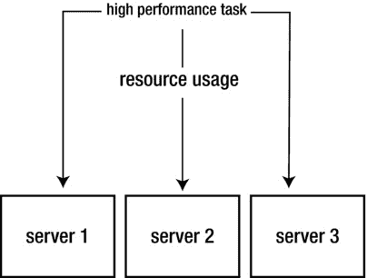
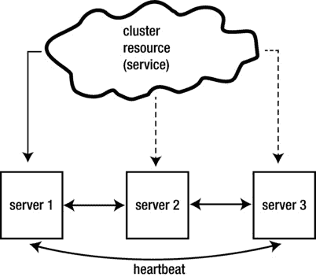

# 一、高可用性集群及其架构

在本章中，您将了解高可用性(HA)集群与其他类型集群的关系。您还将了解 HA 集群的一些典型用例。在讨论了 HA 集群的一般概念之后，您将了解它在 Linux 上的不同组件和实现。

## 不同种类的聚类

粗略地说，可以区分三种不同类型的集群，这三种类型都可以安装在 Linux 服务器上。

*   高性能:不同的计算机协同工作来托管一个或多个需要大量计算资源的任务。
*   负载平衡:负载平衡器充当前端，接收来自最终用户的请求。负载平衡器将请求分发到不同的服务器。
*   高可用性:不同的服务器协同工作，以确保关键资源的停机时间减少到最低限度。

### 高性能集群

高性能集群用于具有大量计算需求的环境中。想想大型渲染作业或复杂的科学计算，它们太大而无法由一台服务器处理。在这种情况下，工作可以由多台服务器处理，以确保顺利及时地完成。

实现高性能集群的一种方法是使用单一系统映像(SSI)。使用这种方法，多台机器被集群视为一台机器，集群只在它们可用的地方分配和要求资源(图 [1-1](#Fig1) )。高性能集群在特定环境中使用，它不像高可用性集群那样广泛。

图 1-1。

Overview of high performance clustering

### 负载平衡集群

负载平衡集群通常用在高需求环境中，例如非常受欢迎的网站。负载平衡集群的目的是将任务重新分配给拥有处理该任务的资源的服务器。这看起来有点像高性能集群，但不同之处在于，在高性能集群中，通常所有服务器都在处理相同的任务，负载平衡集群负责负载分配，以获得最佳的任务处理效率。

负载平衡集群由两个实体组成:负载平衡器及其背后的服务器场。负载平衡器接收来自最终用户的请求，并将它们重新分配给服务器群中可用的服务器之一(图 [1-2](#Fig2) )。在 Linux 上，Linux 虚拟服务器(LVS)项目实现了负载平衡集群。HAProxy 是另一个基于 Linux 的负载均衡器。负载平衡器还监视服务器群中服务器的可用性，以决定将资源放置在何处。使用硬件来实现集群负载平衡也很常见。像思科这样的供应商制造的硬件设备经过优化，可以尽可能快速有效地处理负载。

图 1-2。

Overview of load balancing clusters

### 高可用性集群

高可用性集群的目标是确保关键资源达到最大可能的可用性。这个目标是通过在多台服务器上安装集群软件来实现的(图 [1-3](#Fig3) )。该软件监控集群节点的可用性，并监控由集群管理的服务的可用性(在本书中，这些服务被称为资源)。如果服务器停机，或者资源停止，HA 集群将会注意到并确保资源在集群中的其他地方重新启动，以便在最小的中断后可以再次使用。这本书专门介绍高可用性集群。

图 1-3。

Overview of high availability clusters

## 对高可用性集群有什么期望

在开始您自己的高可用性集群项目之前，最好有适当的预期。最重要的是要认识到 HA 集群可以最大限度地提高资源的可用性。它不能确保资源不间断地可用。高可用性集群将在检测到资源或当前托管资源的节点出现故障时采取行动。可以将集群配置为尽快使资源可用，但是总会有一些服务中断。

本书的主题是 HA 集群，因为它可以在不同的 Linux 发行版上使用。该功能经常与高可用性功能混淆，因为它是由 VMware vSphere 等虚拟化解决方案提供的。了解这两者之间的区别和相似之处是有益的。

在 VMware vSphere HA 中，目标是确保虚拟机免受硬件故障的影响。vSphere 会监控主机或在主机上运行的虚拟机是否仍然可用，如果出现问题，它会确保虚拟机在其他地方重新启动。这看起来很像 Linux HA 集群。事实上，在第 11 章中，您将学习如何使用 Linux HA 集群为 KVM 虚拟机创建这样的解决方案。

尽管如此，还是有一个基本的区别。您的虚拟化平台提供的高可用性解决方案与虚拟机中发生的事情无关。这意味着，如果虚拟机挂起，它将对虚拟化层可用，而虚拟化层的 HA 解决方案将什么也不做。它也无法监控这些虚拟机上运行的关键资源的状态。

如果您希望确保公司的重要资源得到最大程度的保护，并在出现问题时立即重启，您将需要虚拟机中的高可用性。如果虚拟机运行 Windows 操作系统，您将需要 Windows HA。在本书中，您将学习如何为 Linux 操作系统设置这样的环境。

## Linux 中高可用性集群的历史

Linux 中的高可用性由来已久。它始于 20 世纪 90 年代，是一个非常简单的解决方案，名为 Heartbeat。心跳集群基本上可以做两件事:它监控两个节点(不超过两个)，并且它被配置为在这两个节点上启动一个或多个服务。如果当前托管资源的节点出现故障，它会在剩余的节点上重新启动集群资源

### Heartbeat 2.0 和 Red Hat 集群套件

在 Heartbeat 的早期版本中，没有对资源本身的监控，也不可能向集群添加两个以上的节点。随着 21 世纪初 Heartbeat 2.0 的发布，这种情况发生了变化。Linux HA 集群的当前状态在很大程度上基于 Heartbeat 2.0。

除了 Heartbeat 之外，还有另一个集群解决方案:Red Hat Cluster Suite(现在作为 Red Hat High Availability Add On 出售)。这个解决方案的功能看起来很像 Heartbeat 的功能，但是它更复杂，尤其是在 Linux HA 集群的早期。回到当年，这是一个完全不同的解决方案，但后来，红帽集群组件越来越多地与心跳组件合并，在目前的状态下，差异并不那么明显。

### 集群成员和资源管理

集群历史上的重要一步是 Heartbeat 2.0 被分成两个不同的项目。集群已经变得太复杂，因此，一个项目被建立来处理集群成员，另一个项目处理资源管理。这种差异存在至今。

集群成员层的主要功能是监控节点的可用性。这个功能最初是由 OpenAIS 项目执行的，后来合并到了 Corosync 项目中。在当前的 Linux 集群中，Corosync 仍然是管理和监控节点成员的主要解决方案。在 Red Hat 集群中，cman 一直被用作集群成员层的实现。Cman 在没有 Red Hat 的环境中不常使用，但是在 Red Hat 环境中，它仍然扮演着重要的角色，您将在[第 3 章](03.html)中了解到。

对于资源管理来说，Heartbeat 演变成了 Pacemaker，顾名思义，它是为了修复 Heartbeat 无法修复的一切而开发的。Pacemaker 的核心组件是 CRM，即集群资源管理器。这部分集群监视资源的可用性，如果必须对资源执行操作，它会指示在每个集群节点上运行的本地资源管理器(LRM)执行本地操作。

在 Red Hat 中，直到 Red Hat 6，资源组管理器(rgmanager)用于管理和放置资源。然而，在 Red Hat 6 中，Pacemaker 已经作为替代资源管理器提供，在 Red Hat 7 中，Pacemaker 也已经成为 Red Hat 中管理资源的标准。

## 构建高可用性集群的组件

要构建一个高可用性集群，您需要的不仅仅是几台捆绑在一起的服务器。在这一节中，您将对在设置集群时通常起作用的不同组件进行概述。在后面的章节中，您将详细了解如何管理这些不同的组件。通常，大多数集群中使用以下组件:

*   共用存储器
*   不同的网络
*   绑定网络设备
*   多路径
*   围栏/STONITH 装置

重要的是要考虑如何设计集群，并找出构建所需解决方案所需的特定组件。

### 共用存储器

在集群中，是集群决定共享资源将被托管在哪个服务器上。在该服务器上，数据和配置文件必须可用。这就是大多数集群需要共享存储的原因。不过，也有例外。

有些服务实际上并没有很多需要共享的文件，或者在内部负责数据同步。如果您的服务只处理静态文件，那么您也可以手动复制这些文件，或者设置一个文件同步作业来自动同步这些文件。但是大多数集群都有共享存储。

粗略地说，有两种方法来处理共享存储。您可以使用网络文件系统(NFS)或存储区域网络(SAN)。在 NFS 中，一个或多个目录通过网络共享。这是一种设置共享存储的简单方法，但它并没有给你最好的灵活性。这就是为什么许多集群都是用 SAN 建立的。

SAN 就像连接到服务器的外部磁盘的集合。要访问 SAN，您需要特定的基础架构。该基础架构可以是光纤通道或 iSCSI。

光纤通道 San 通常是为实现最佳性能而构建的。他们使用专用的 SAN 基础架构，这通常相当昂贵。通常，光纤通道 San 的价格为数万美元，但您会得到您所支付的:具有最佳性能和最佳可靠性的高质量。

开发 SCSI 是为了通过 IP 网络发送 SCSI 命令。这意味着对于 iSCSI SAN，可以使用普通的以太网。这使得 iSCSI 更容易访问，因为任何人都可以基于标准网络硬件构建 iSCSI SAN。这种便利性让 iSCSI 桑斯获得了廉价和不太可靠的名声。然而事实恰恰相反。市场上有一些开发高级 iSCSI SAN 解决方案的供应商，这些解决方案中的一切都经过了优化，以实现最佳性能。所以，最后，这并不重要，iSCSI 和光纤通道 San 都可以用来提供企业级的性能。

### 不同的网络

您可以创建一个集群，让所有流量都通过同一个网络。然而，这并不是真正有效的，因为饱和网络带宽的用户将能够关闭集群，因为饱和的网络集群数据包不会通过。因此，一个典型的集群有多个网络连接(图 [1-4](#Fig4) )。

图 1-4。

Typical cluster network layout

首先是用户网络，外部用户通过它访问集群资源。接下来，您通常会有一个用于集群协议数据包的专用网络。该网络将提供尽可能好的冗余，并确保集群流量可以随时通过。

第三，通常还会有一个存储网络。此存储网络的配置方式取决于您使用的存储类型。在光纤通道 SAN 中，集群中的节点将有主机总线适配器(HBA)连接到光纤通道 SAN。在 iSCSI 网络中，SAN 流量通过以太网传输，除了专用的存储网络基础架构之外，存储网络不需要任何特定的东西。

### 绑定网络设备

当然，要将集群节点连接到不同的网络，您可以只使用一个网络接口。如果该接口关闭，该节点将失去与该网络的连接，集群将做出反应。由于集群的核心是高可用性，所以这不是您通常希望通过集群实现的目标。

解决方案是使用网络绑定。网络绑定是多个网络接口的集合。在大多数配置中，一个绑定中有两个接口。网络绑定的目的是冗余:绑定确保如果一个接口关闭，另一个接口将接管。在第 3 章中，您将学习如何设置绑定网络接口。

### 多路径

当集群节点连接到 SAN 时，该节点通常可以通过多条路径来查看 SAN 上的 LUN(逻辑单元号)。这导致节点看到多个设备，而不是一个。因此，对于节点到 LUN 的每条路径，它都会接收一个设备。

在一个节点连接到两个不同的 SAN 交换机，而这两个交换机又连接到两个不同的 SAN 控制器的配置中，将有四条不同的路径。结果将是您的节点不会只看到一个 iSCSI 磁盘，而是四个。由于这些磁盘中的每一个都连接到一个特定的路径，因此使用其中的任何一个都不是一个好主意。这就是为什么多路径很重要。

多路径驱动程序将检测到四个不同的磁盘实际上都是同一个磁盘。它提供了一个特定的设备，在四个不同的磁盘之上，将被替代使用。通常，该设备会有一个名称，如 mpatha。结果是，管理员可以连接到 mpatha，而不是所有底层设备，如果配置中的一条路径出现故障，也没关系，因为多路径层会负责将流量路由到仍然可用的接口。在第 2 章中，您将了解如何设置多路径。

### 围栏/STONITH 设备和法定人数

在集群中，需要避免一种叫做裂脑的情况。裂脑是指集群分裂成两个(或更多)部分，但两个部分都认为自己是集群仅存的部分。当集群的两个部分都试图托管集群提供的资源时，这可能会导致非常糟糕的情况。如果资源是文件系统，并且多个节点试图同时且不协调地写入文件系统，则可能导致文件系统损坏和数据丢失。因为高可用性集群的目的是避免数据丢失的情况，所以无论如何都必须防止这种情况。

为了解决大脑分裂的情况，有两种重要的方法。首先，有法定人数。Quorum 的意思是“多数”，quorum 背后的思想很容易理解:如果集群没有 quorum，集群中就不会采取任何行动。这本身将提供一个很好的解决方案来避免前面描述的问题，但是为了确保不会发生多个节点激活集群中的相同资源的情况，还使用了另一种机制。这种机制被称为 STONITH(代表“击中对方头部”)，或击剑。术语 STONITH 和击剑指的是同一个解决方案。

在 STONITH 中，特定硬件用于终止不再响应集群的节点。STONITH 背后的思想是，在将资源迁移到集群中的另一个节点之前，集群必须确认有问题的节点确实关闭了。为此，集群将向 STONITH 设备发送关闭操作，这将依次终止无响应的节点。这听起来像是一种极端的方法，但是因为它保证永远不会发生数据损坏，并且可以清除某些瞬时错误(比如内核崩溃)，所以它并没有那么糟糕。

设置集群时，您必须决定要使用哪种类型的 STONITH 设备。这是一个强制性的决定，因为 STONITH 在 Linux HA 集群中是强制性的，而不是可选的。以下是可用的不同类型的 STONITH 设备:

*   集成管理委员会，如惠普 ILO、戴尔 DRAC 和 IBM RSA
*   可以管理的电源开关，例如 APC 主设备
*   基于磁盘的 STONITH，它使用共享磁盘设备来实现 STONITH 操作
*   基于虚拟机管理程序的 STONITH，它在虚拟化环境中与虚拟机管理程序对话
*   软件和演示 STONITH 解决方案(事实上，任何时候都应该避免)

在第 5 章中，你将学习如何配置不同的 STONITH 和防护解决方案。

## 摘要

本章概述了 Linux HA 集群。您已经了解了高可用性集群与其他类型的集群的关系，并且了解了典型高可用性环境中使用的不同软件组件。您还了解了高可用性集群中使用的不同部分，这有助于您正确准备高可用性环境。在下一章中，您将学习如何在高可用性环境中配置和连接存储。