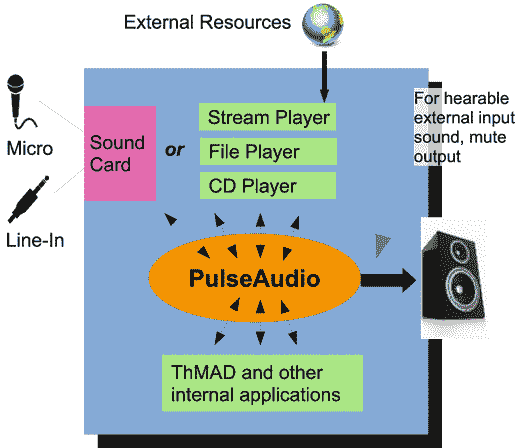
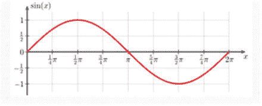

# 1.声音输入

在这一章中，我们将深入了解计算机如何准备捕捉传入的声音或产生的声音，声音如何在内部表示，以及数据如何到达 ThMAD。我们区分明显的气压伸长对时间的表示，和功率对频率的表示，或频谱。

## 准备声音输入

在你购买了装有 Ubuntu Linux 的电脑或笔记本电脑之后，或者在你的电脑上安装了 Ubuntu Linux 之后，你基本上有两种选择——你可以使用外部音频源，或者你可以让声音从电脑上播放。至于后者，你可以使用个人电脑的 CD 播放器，你可以播放 u 盘或硬盘上的一些文件，或者你可以通过互联网或其他方式播放音频文件。

请注意，其他 Linux 发行版也可以工作。试一试——你很有可能找到类似的程序、工具和设置来完成同样的事情。

如果您想要使用外部音频源，您需要一个麦克风或一个带有线路输入的声卡来连接。特别是对于笔记本电脑，内置麦克风不是最高质量的，但它们可能足以满足您的需求。你实际上并不想精确地再现声音，而是对它做出反应，对于这个目标，拥有完美的线性输入曲线并不太重要。另一方面，如果你不想丢失低音的重要脉冲，这种情况在便宜的麦克风上可能会发生，给自己买一个像样的麦克风可能会帮助你避免惊喜。此外，请记住，在某些情况下，音频可视化对于传入声音的结构可能很脆弱。

通常你想避免这种情况，并且总体结果应该对任何类型的音乐输入都是有趣的。这很容易用不同的录音进行检查。但是，例如，如果低音从未通过音频硬件达到合适的程度，因为您的麦克风错过了低音，您的渲染管道可能对传入声音的重要部分缺乏反应。如果您只是将一些音频源连接到计算机的线路输入插孔，而不是外部声音输入，您会自动处于安全状态。

如果您想使用计算机的 CD 播放器播放 CD，或者播放音频文件或流式音频内容，例如使用浏览器，很有可能您不必做任何事情，只需启动合适的程序或让操作系统自动为您完成。对于较大的声音文件集合，管理它们的程序可能会很方便。预装在 Ubuntu 上的 RhythmBox 是个不错的选择。

ThMAD 目前的 1.0.0 版本主要依赖于 PulseAudio，这是一个音频路由服务器，可以处理计算机内部的所有声音流。它知道采集或录制的所有内容，以及播放的所有内容。Ubuntu Linux 自带 PulseAudio 预装，自动启动；对于其他 Linux 发行版，您可能需要先安装它。

ThMAD 还可以连接到 ALSA，这是一种与声音硬件对话的低级技术，它可以连接到杰克，这是音乐专业人士通常更喜欢的声音服务器。然而，与 PulseAudio 相比，使用这些选项要困难得多，因此我们将在文本中作为一种标准情况使用 PulseAudio。

有关标准 PulseAudio 声音链的图形描述，请参见图 [1-1](#Fig1) 。

图 1-1。

The PulseAudio sound server inside Ubuntu

## 理解声音结构

声音是关于你的耳朵接收到的气压波动。从数学或物理的角度来看，声音有不同的表示法——时间延长(或时间压力)表示法和频率功率表示法。这两者都将在下面的章节中讨论。

### 时间延长表示法

在 x 轴表示时间，y 轴表示压力的图表上，对于正弦波，时间延长的表示可能如图 [1-2](#Fig2) 所示。

图 1-2。

A sine wave

在计算机系统中，我们需要这个正弦波的数字表示。想法如下:我们将时间分成小的时间步长，比如每秒 44，100 步，对于每个时间步长，我们记下当前的气压，或 y 值，并将其保存在一个数组中。这有时被称为模数转换(ADC)。请注意，44，100 是广泛采用的行业标准，例如，它用于音乐 CD。因为我们有两只耳朵，并且喜欢立体声，所以我们对左耳和右耳进行两次转换。通过这种方式，我们最终得到 88，200 个数字，这些数字代表一秒钟的立体声。对于压力或 y 值表示，我们使用整数值(-32，768 到 32，767)，较低值表示负压力偏移，因此可能是 0.997 巴，较高值表示正压力偏移，比如 1.003 巴。

根据我们可以自由定义的比例，这些可以映射到 0.997 巴→ y=-1000 和 1.003 巴→ y=+1000。所有其他数字是这些值之间的平均压力。当然，我们可以使用-32，768 … 32，767 之外的数字范围，但是我们在这里选择的范围是由正好两个字节的数据在内部表示的，计算机非常喜欢这样。这也是一种权衡:更少的不同值意味着更低的分辨率和更差的质量，更多的不同值意味着更高的存储需求。

当然，在现实中，音乐以许多不同的格式存储，包括 MP3、Ogg Vorbis 和其他格式，主要是为了节省空间。每秒 88，200 个数字加起来相当快。但是如果让 ThMAD 这样的应用程序访问 PulseAudio 数据，它将接收未压缩和未转换的原始格式的数据。这很好，因为 ThMAD 不需要额外的逻辑来处理不同的声音格式。

### 频率-功率表示

一种实际上不太明显的声音表示法是记下每一瞬间的频率分布。

考虑时间范围【10s10.1s]听一些音乐的时候。我们报告在某个时间范围[10s；10s]内到达我们耳朵的音调的混合频率，而不是报告每个瞬间的气压幅度，例如 10.000s、10.001s、10.002s10.1s】。a 100Hz+b 200Hz+c 300Hz+…，其中 x Hz 表示每秒 x 的正弦振荡频率，a、b、c，…为权重或功率系数。数字越低，贡献越小，数字越高，贡献越大。

用一种数学上简洁的方式来做这件事叫做傅立叶变换，事实证明这是一种完全等价的描述声音的方式。事实上，如果我们用压力与时间的关系表示声音，我们可以应用傅立叶变换将其转换为功率与频率的关系，而不会丢失任何信息。这意味着这个过程是可逆的，我们有类似傅立叶逆变换的东西，可以反向返回。这里我们不展示数学细节；你可以在其他书和互联网上找到很多关于这方面的内容。

为什么我们在这里提到傅立叶变换是因为它对我们的音频可视化目标非常重要。因为不要让我们的视觉对伸长作出反应，我们可以这样做，但由于变化发生得如此之快，这有失去东西的危险，我们也可以对频率的力量作出反应。想象一下用一种方式对低音节拍做出反应，用完全不同的方式对高音旋律做出反应。因为节拍发生的频率要低得多，可能是每秒两次或类似的频率，所以与快速声压振荡相比，声音对可视化的影响要明显得多。

为了在 ThMAD 中使用这种表示，来自 PulseAudio 的输入经过傅立叶变换，我们从中获得的与频率相关的功率可以作为可视化设置的输入。稍后我们将向您展示相关的细节。

### 从声卡获取的输入数据

在任何情况下，应用程序将首先从声卡的软件对应物——声音驱动程序接收的是一个长度为 N 的数据数组。例如，如果在 t0 时刻，我们以 44，100 Hz 的频率向声音驱动器请求 512x2 个样本，乘数为“2 ”,因为我们想要采集双声道立体声数据，这意味着从 t0 -0.0116 到 t0，我们有 512/44，100 = 0.0116 秒的数据。这意味着，如果我们不想丢失任何数据，我们至少需要 0.0116 秒才能从声音驱动程序请求下一个数据块，依此类推。

对于第一种声音表示(压力对时间),我们只需将从声音驱动器获取的输入数组提供给可视化管道，对于功率对频率表示，我们通过傅立叶变换传递该数组。我们得到一个频率为 1 f0，2 f0，3 f0，…的功率阵列，其中对于 44，100 Hz 采样频率和 512 2 个采集样本的情况，f0 计算为 f0 = 44，100 / 512 = 86.13 Hz。对于某些傅里叶变换算法内部函数，最高频率的功率不是 44，100 Hz，而是一半，即 22，100 Hz。因此，对于大小为 512 的输入，傅立叶变换将产生 256 个幂值。

## 摘要

您学习了声音数据如何到达您的系统，以及声音如何在内部呈现。你了解到 ThMAD 主要依赖于 Ubuntu 内部运行的标准声音服务器，称为 PulseAudio。

在下一章中，您将研究构建音频可视化所必需的工具链。您还将学习如何在您的系统上安装 ThMAD，以及需要进行哪些配置才能让一切顺利运行。本章从 ThMAD 内部运行的两个基本示例开始。