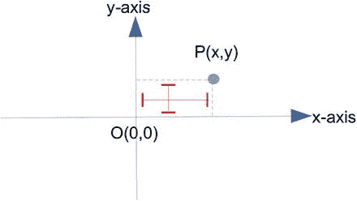
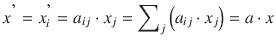
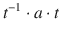
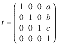
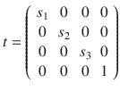
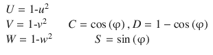
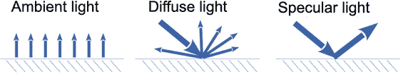
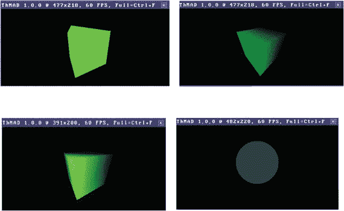
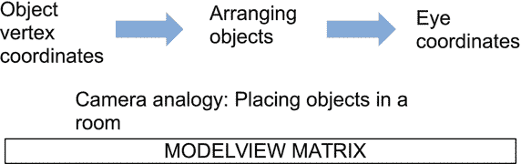
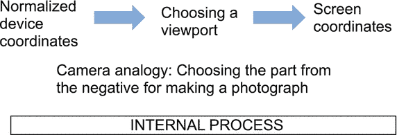

# 4.3D 概念

如果你想要一个 3D 计算机图形概念的详尽参考，在互联网和书店有很多材料。ThMAD 背后的技术 OpenGL 是一个巨大的概念，对其所有主题的完整覆盖超出了本书的范围。尽管如此，介绍一下我们对音频可视化的特殊看法还是值得的。此外，关于 ThMAD 如何处理一些图形子管道和它自己在 OpenGL 上的图形概念的一些特性将在本章后面描述。

## 坐标系

三维空间中的变换是关于空间操作的，比如移动、缩放和旋转。但在我们开始讨论空间操作之前，我们需要知道 3D 对象是如何以计算机程序可以理解的方式表示的，这立即导致了对坐标系的思考。

为了简单起见，我们从两个维度开始。如果你看着你的计算机屏幕，我们将你看到的平面定义为 x-y 平面，该平面上一点的 x 坐标表示到左边界一条垂直线的水平距离，y 坐标表示到底边一条水平线的垂直距离。见图 [4-1](#Fig1) 。

图 4-1。

X-Y coordinate system

作为 x 距离参考的垂直线也称为 y 轴，作为 y 距离参考的水平线称为 x 轴。我们说我们使用屏幕的边框作为坐标轴，但实际上这是一个任意的决定；我们可以使用任何与它们平行的线。ThMAD 中经常使用的另一个常见选择是使用屏幕中心的轴，如图 [4-3](#Fig3) 所示。轴的交叉点称为原点 O，它的坐标为 O(0.0，0.0)，因为两个坐标的距离都是零。

在图 [4-3](#Fig3) 中，点 P 的坐标将被指定为什么数字？在中心是容易的；x=0，y=0。对于远离 O 的点，我们需要另一个定义，我们可以选择 x 在右边为 1.0，y 在上边为 1.0。将 O 放在屏幕中间的结果是，x=-1.0 在左边界，y=-1.0 在下边界。见图 [4-2](#Fig2) 。

图 4-3。

X-Y coordinate system, centered at the middle of the screen

图 4-2。

X-Y coordinate system, scaled to -1 to +1 for both dimensions P(x,y) lies at approximately x = 0.4 and y = 0.3, hence we can now write P(0.4, 0.3).

我们现在已经具备了在二维空间讨论点的所有条件。但是第三维和 z 轴呢？它必须垂直于 x 轴和 y 轴，所以它要么从正面指向屏幕，要么从背面指向屏幕。

OpenGL 是一个所谓的右手系统，意思是如果你让右手食指按照 x 轴到 y 轴的顺序，那么你的拇指就会指向正的 z 方向。坐在屏幕前，从正 z 位置看 x-y 平面。参见图 [4-4](#Fig4) 。

图 4-4。

X-Y-Z coordinate system

z 轴的缩放不是那么明显——二维屏幕上没有 z 边框。为了把事情做好，OpenGL 是这样做的:

1.  固定 x-y 纵横比。这会缩放 x 轴，使得作为输入的正方形:(-a，-a) → (a，-a) → (a，a) → (-a，a)仍会在屏幕上显示为真正的正方形，所有边的长度都相同。这显然改变了边界坐标值。在底部和顶部边界仍然分别为-1 和+1 的情况下，比方说对于 5/4 屏幕，左侧和右侧边界现在为-1.25 和+1.25。
2.  缩放 z 轴，使立方体在空间中进行任何类型的旋转后仍显示为立方体，所有边在屏幕上的长度都相同。

话虽如此，放置对象的一个明显选择是正面的立方体

(-1，-1，1) → (1，-1，1) → (1，1，1)→(1，1，1)→(1，1，1)

这是背面的

(-1、-1、-1) → (1、-1、-1) → (1、1、-1) → (1、1)→(1、1、-1)

当然，你可以随心所欲地放置物体，并使用任何你喜欢的坐标，但不知何故，记住“双单位立方体”有助于避免意外，比如物体无意中奇迹般地从视线中消失。如果您的 3D 场景有其他边界框，即具有最小可能尺寸但仍包含所有相关对象的框，您可以使用平移和缩放将所有内容移动和挤压到单位空间中，在那里做您喜欢的任何事情，然后缩放并将其移回。请参见本章中标题为“空间映射”和“空间操作:平移、旋转和缩放”的部分。

## 空间映射

任何种类的坐标空间，无论它们是二维还是三维的，都可以映射到另一个同类空间中，使得组成它们的点的内部和内部关系保持不变。

这类变换中最重要的一种叫做线性变换，用这个计算规则来表示:

由此任何点 P (x，y，z)被映射到点 P(x，y，z)上。用所谓的齐次坐标，数学家和我们，如果要简洁的话，把这个概念延伸一个平移部分。我们最终使用下面的矩阵符号:

其中我们用 t1、t2 和 t3 替换了 a14、a24 和 a34，以表达它们恒定的翻译性质。中间的图形，为简便起见我们称之为(aij，ti)，称为转换矩阵；其他的叫做坐标向量。点代表矩阵乘法。乘法的形式如下:

其中 x 1 = x，x 2 = y，x 3 = z .符号σj遵循通常的数学规则“对所有 j 求和”。用矩阵表示变换的好处是组合变换——例如，首先缩放，然后旋转，然后移位——可以用相乘的矩阵来表示:

OpenGL(在 Ubuntu 编写本书时使用的 3.x 版本中)内部使用了几个不同的矩阵栈。最新版本的 OpenGL 在某种程度上降低了它们的重要性，甚至为了支持着色器语言结构而删除了它们，这在 ThMAD 中也是可用的。在本书中，我们不介绍着色器语言；然而，你可以在第五章[和第六章](5.html)[的故事中找到一些使用着色器的例子。](6.html)

在 ThMAD 中，你通常不会直接接触矩阵。对于所有典型的矩阵运算，ThMAD 都有模块——平移、缩放和旋转。你可以通过连接任意多的它们来图形化地堆叠它们。当然，ThMAD 内部以上述矩阵乘法的方式组合了所有这些运算。了解转换组合操作或堆叠转换的概念很重要，因为许多状态都使用这种组合转换。

从 ThMAD 的角度来看，在某些用例中不仅实用而且必要的是以下形式的转换组合:

这表示:(1)首先根据矩阵 t 进行变换，(2)然后根据 a 进行变换，(3)然后根据 t 的逆变换，如 t-1 所示。看起来像理论数学，不是吗？这实际上很重要。考虑一个例子。

考虑一个大小为 0.1×0.1×0.1 的盒子，以(0.5；0.5;0.5).你想让它绕中心旋转一点。

转换 a .这听起来很奇怪，但是 ThMAD 没有模块能够做到这一点！但是有一个绕(0；0;0).在这种情况下，我们不能使用旋转，因为最后，盒子的中心被移走了，我们希望它保持在(0.5；0.5;0.5).我们现在可以做的是执行操作:

1.  首先将盒子移动一个平移向量(-0.5；-0.5;-0.5)，使其中心在(0；0;0).
2.  现在执行围绕(0；0;0).
3.  然后通过平移向量(0.5；0.5;0.5).

这正是 t -1 ∙a∙t 所表达的。除了数学符号或实际手动计算坐标之外，您应该习惯图形意义上的包含变换的思想；见图 [4-5](#Fig5) 。

图 4-5。

Embracing transformations The top sub-pipeline produces a box away from the origin and paints it. The bottom sub-pipeline just removes hidden surfaces, places a light and a camera, and sends it to the screen. The interesting part is the middle sub-pipeline; it shifts the box back to the origin, then rotates it around the origin, and shifts it back where it was before. The “translation” anchor of the left module reads (-0.5; -0.5; -0.5) and the same anchor for the right module is (0.5; 0.5; 0.5). The “angle” anchor, opened here, can now be used to rotate the box around its center. Note

该示例可以在`TheArtOfAudioVisualization`文件夹中的`A-4.2_Embracing_Transformation`下找到。

对于那些想知道 t 在下面的例子中是什么样子的人(参见如何构造转换矩阵一节):

对了，t -1 被称为 t 的逆是因为乘积给出了单位矩阵:

后者称为单位矩阵，因为对于任何矩阵或向量 a，a ∙ I = I ∙ a = a。

## 空间操作:平移、旋转和缩放

现在您已经掌握了上一节的符号，可以轻松地表达平移和缩放。

使用我们介绍的矩阵表示，对于沿着向量(a，b，c)的平移，我们得到如下:

对于带有缩放因子的缩放(s 1 ，s 2 ，s 3 ):

其中对于具有单个缩放因子 s 的均匀缩放，分量 s 1 、s 2 和 s 3 都是相同的:s1= s2= s3= s

旋转稍微复杂一点，我们必须定义如何旋转。例如，我们可以从原点绕轴(u，v，w)旋转，角度为φ。这种情况下的公式如下:

另一种可能性是首先围绕 x 轴旋转某个角度，然后围绕 y 轴旋转某个角度，然后围绕 z 轴旋转某个角度。通过分别设置(u，v，w) = (1，0，0) / (0，1，0) / (0，0，1)，可以很容易地从该公式推导出相应的变换矩阵。ThMAD 主要利用组合公式使事情简洁。

描述旋转的第三种可能性是使用四元数。虽然四元数背后的理论不是那么容易理解，但对于这里的目的来说，说四元数是由四部分组成的数就足够了:

q = (q 1 ，q 2 ，q 3 ，w)

只要给出一堆特殊的四元数计算规则，就足以描述空间中的一个旋转。这只是另一种说法，对于四元数，我们不需要矩阵运算，而是可以使用新的计算规则集，这是专门为他们介绍的。

为了学习如何在 ThMAD 中执行这样的转换，请看第 [5](5.html) 章。

## 暴露在光线下

在现实世界中，你能看到东西，因为它们反射照射在上面的光。所以我们需要光源来让物体出现。在 OpenGL 和 ThMAD 中，是一样的，有两个例外。第一个是一些简单的状态不需要光。然而，在许多情况下，增加一个没有坏处，有一个灯是一个好习惯。第二个例外是，在 OpenGL 和 ThMAD 中，你实际上永远不会直接看到光，你只会看到它的反射。

严格来说，这与现实世界没有太大的不同——如果你看一盏灯，你会看到光从那里发出，主要是因为它是从灯的部件反射回来的。只有当你有一个类似点光源的东西时，你才能看到没有反射物体的光。这种情况并不尴尬，正因为如此，为了简单起见，ThMAD 或 OpenGL 中没有直接可见的光源。请注意，仍然存在表面材质自身发光的概念，但这在概念上与材质属性有关，而不是与光源有关。详情如下。

在 OpenGL 和 ThMAD 中，我们有两种类型的对象涉及到照明:灯光或光源和材质。

从光源角度来看，灯光有四种风格，以实现逼真的场景:

*   环境光。把这个想象成无方向性的光，无处不在。如果你在一个昏暗的房间里，只有一点光线从窗帘的缝隙中偷偷穿过，你仍然会看到某种昏暗的光线，它似乎均匀地照亮了房间里的一切，似乎来自任何地方，也似乎来自任何地方。只有经验告诉我们，光来自被照亮的缝隙。这就是环境光，ThMAD 和 OpenGL 处理它的方式是给所有表面添加一些恒定的颜色值。然而，事实要稍微复杂一点，因为材质属性涉及到来自表面的环境颜色的计算
*   漫射光。考虑某一点的光源。如果来自那里的光照射到材料表面，并从那里均匀地散射到所有可能的方向，这就是漫射光。这种漫反射通常与表面的材料性质有关。除非你需要一个能完美地反射 100%光线的表面，否则你的场景中会有一个漫射光组件。因此，在几乎所有的 3D 场景中都可以找到它。
*   镜面光。如果一束光射到一个材料表面，并以相同的角度反射离开该表面，我们称之为镜面光。你想有一个镜面光组件，使你的场景更闪亮，更有趣。
*   The screen’s clear color . This will be applied to the whole scene each frame before anything else is rendered. It will thus show up as a background color and may shimmer through objects only if they are fully or in part transparent.For the different light modes, see Figure [4-6](#Fig6).

    

    图 4-6。

    Light reflection modes The material parameters used for the reflected light calculation are:
*   由光源定义的环境光在环境反射颜色中有其对应物。最终像素颜色的整体环境部分将是来自光的环境颜色和定义为材料参数的环境颜色的每个 RGB 分量的乘积。
*   对于漫射光，某个材质点的像素颜色结果是通过将入射漫射光的每个颜色分量乘以匹配材质参数的漫反射颜色分量来计算的。而对于环境照明，灯光和表面在空间中的位置不起作用，对于漫射光，对象的 3D 性质显露出来。
*   当漫反射光到达表面点时会向各个方向反射，而镜面反射光会像镜子一样，在法线的另一侧以完全相同的角度反射；参见图 [4-6](#Fig6) 。计算过程与环境光或漫射光相同:每个材质参数的 RGB 分量乘以光模块的相应 RGB 分量。
*   特别是对于镜面反射，我们另外有光泽的概念，它描述了关于观察者的位置和反射光束的模糊量。
*   发射光。材料可以在没有打开专用灯的情况下发光。发射光类似于环境光贡献，但是不与相应的光源参数组合；它代表自己，并添加到所有其他由材料和光源产生的光。它也不会在其他物体上产生任何反射。

样品可以在图 [4-7](#Fig7) 中看到。当然，光从表面部分发出的方式不仅取决于光和表面属性，还取决于我们观察它的角度。这是由投影转换在内部处理的，这将在下一节中介绍。

图 4-7。

Objects with different light reflection modes In Figure [4-7](#Fig7), the top left is ambient light, the top right is diffuse light, the bottom left is diffuse and specular light, and the bottom right is emissive light showing a 3D sphere.

## 眼睛和照相机

当我们在场景中放置了一些物体，并添加了光线和材质属性后，我们需要一些东西或者一些人真正的看着这个场景。由于我们有一个平面屏幕作为这个过程的一部分，显然计算机程序的最新部分有影响，这相当于将 3D 场景投影到平面二维矩形屏幕上的规则。

描述这一过程的常用 OpenGL 3.x 方法包括将其与摄影或相机设置进行比较。我们从在 3D 空间中排列物体开始，并将其与在房间中放置物体进行比较。参见图 [4-8](#Fig8) 。

图 4-8。

Modelview transformation

这部分过程以眼睛坐标结束，并由模型视图矩阵堆栈控制。如果你在不使用 ThMAD 的情况下进行 OpenGL 编程，你明确的告诉 OpenGL 使用 modelview 矩阵栈。有了 ThMAD，程序在模块内部透明地为你做这件事。

接下来，摄像机被定位并指向场景；参见图 [4-9](#Fig9) 。

图 4-9。

Projection transformation

OpenGL 中的这种投影变换还允许指定远近裁剪平面，这在现实世界的摄影过程中是不存在的。使用它们使我们能够移除比近剪裁平面更近或比远剪裁平面更远的对象或对象部分。它们是投影矩阵子过程的一部分，因为在这个阶段对于硬件来说很容易做到。

在这之后，OpenGL 系统应用所谓的 w 坐标。这些是内部数字，是矩阵和向量运算的一部分。细节在范围之外——当我们说这里使用的齐次坐标允许使用矩阵进行平移时，这对于我们的目的来说就足够了，这是 3D 对象的 3×3 矩阵所不能的。结果是二维屏幕世界的一部分，它被称为标准化设备坐标。参见图 [4-10](#Fig10) 。

图 4-10。

Device-normalization

这是一个没有参数的内部子流程，因此没有关联的基准表步骤。

最后一步，选择并应用一个视窗，这意味着我们定义了我们想要看到的实际区域。见图 [4-11](#Fig11) 。同样在这一步，没有与对象相关的参数，因此没有与之相关的矩阵堆栈。

图 4-11。

Screen coordinates

注意，直到剪辑坐标和归一化设备坐标，每个顶点的 z 坐标对系统都是可用的，并且需要它来确定什么需要从进一步的渲染中剔除，因为它被其他对象隐藏了。通过相机的类比，物理学为我们做到了这一点，但在 OpenGL 中，这些 z 坐标，在这个阶段称为深度，用于确定哪些顶点可以从其余的渲染过程中排除。

无论如何，隐藏对象的方式是一个有趣的话题。图形硬件的设计已经投入了大量的精力，它有效地计算出渲染过程中要去除的内容，因为观众或摄像机无法看到这些内容。准确地说，实际上有两个属性定义了它:

*   前面提到的深度缓冲器。这是一个在渲染步骤中跟踪像素坐标的 z 坐标的缓冲区，实际上是在屏幕上渲染像素。也就是说，最后的渲染步骤。它的工作方式如下:在深度缓冲区被清除后，这通常与颜色缓冲区清除一起发生，任何新绘制的像素都将其 z 坐标告知深度缓冲区，这导致了以下情况之一:因为我们知道更大的 z 坐标意味着更靠近查看者，这有效地排除了要隐藏的点。
    *   如果此时深度缓冲区未初始化，它会将像素的 z 坐标保存在深度缓冲区中，并呈现该像素。
    *   如果定义了该点的深度缓冲区，并且新点的 z 坐标大于或等于深度缓冲区中的值，则它会将像素的 z 坐标保存在深度缓冲区中，并渲染该像素。
    *   如果定义了该点的深度缓冲区，并且新点的 z 坐标小于深度缓冲区中的值，则丢弃新像素。Since we know that greater z-coordinates means being closer to the viewer, this effectively rules out points to be hidden.
*   背面剔除。这是另一种排除像素的方法，因为像素在物体的背面。例如，考虑一个立方体:六个边中的每一个都由两个三角形组成(这是内部处理四边形的方式)。每个三角形有三个顶点。现在，如果我们仔细定义它们——如果从一个角度来看，这三个顶点描述的是顺时针旋转，那么它们被定义为位于后侧，否则位于前侧。因为这只是每个表面部分的是/否决定，图形硬件可以非常有效地处理这一点。

需要考虑几件事情来启用所有隐藏魔法，但是 ThMAD 和 OpenGL 一起提供了两个为此定制的模块:背面剔除模块和深度缓冲模块。

## ThMAD 网格

ThMAD 中的网格是描述 3D 对象的点坐标集的抽象。

要定义网格，需要定义某些类别的对象。相关的概念是:

*   顶点。这是构建网格的点的三维位置向量的数组。
*   顶点法线。描述表面元素在空间中的方向。需要正确照亮物体。
*   顶点颜色。顶点通常有指定的颜色。
*   顶点纹理坐标。它们描述了顶点到纹理坐标的映射。
*   面孔。预先计算的定义网格的原子曲面。
*   面法线。这些与前面描述的顶点法线有相同的含义，但是与面相关联。这项功能不常使用。
*   顶点切线。由一些需要平行于表面元素的向量的模块使用。

## ThMAD 粒子系统

粒子系统是关于数百、数千或者更多的小型 3D 物体进入一个场景，遵守一些生成、移动、交互和最终衰减的规则。你想用它们来模拟雾、瀑布、蜡烛、爆炸、有趣的人工效果等等。

它们的出现是因为在过去几十年中图形硬件能力的极大提高。随着现代技术的发展(或者仅仅是中等级别的图形和计算硬件)，有几十万个粒子在工作是可能的。OpenGL 中没有真正的粒子系统概念，但是当然有如此多的 3D 对象要处理，OpenGL 概念的使用方式对于可接受的性能是至关重要的。

幸运的是，OpenGL 提供了一些处理粒子系统的模块，并在内部调整 OpenGL 的使用方式。这些模块是关于:

*   产生粒子。给定一个点或一组点
*   修改粒子及其轨迹。一些粒子大小的随机化，精确控制所有粒子大小，施加风，让它们像流体粒子一样，让它们跟随重力，让它们反弹，让它们旋转。
*   控制粒子的寿命。
*   控制粒子渲染的方式。

尽管用粒子系统做实验很有趣，也很有乐趣，但是没有专门的一章是关于粒子系统的。但是在第 [6](6.html) 章中有一节提供了更多的见解和一些例子。

## 摘要

在本章中，您学习了 3D 坐标系、变换操作(如平移、缩放和旋转)以及灯光和摄像机。此外，您还了解了 ThMAD 中用于 3D 草图的网格和粒子系统。

下一章包含一系列教程或故事，涵盖了 ThMAD 可以做的很多事情。