# 5.故事:基础水平

在这一章中，我们将通过查看涵盖各个方面的详细演练，更深入地探讨音频可视化的艺术。我们不可能描述所有可能的草图，但是这一章为你提供了可以帮助你实现自己想法的技巧。这些部分没有特定的顺序，所以你可以按顺序阅读它们，或者根据你的兴趣阅读它们——只要最适合你。

## 更多 3D 渲染管道

ThMAD 建立在 OpenGL 之上，OpenGL 是 3D 图形渲染的行业标准。OpenGL 是满足你图形编程需求的一项基础技术，你可以用它实现很多。然而，与 OpenGL 相反，ThMAD 在实例化、配置和连接模块的更抽象的概念上操作。这种方法有优点也有缺点——一个优点是，使用 ThMAD 时，您不必成为编程专家。一个缺点是你不能做所有你能用 OpenGL 做的事情。

本章包含更多深入解释的示例。这一章还有一个额外的好处，那就是最终你会理解 OpenGL 的一些部分，因为对象和参数使用了相同或至少相似的概念和名称。

### 转换

这里的变换包括平移、旋转和缩放。

Note

本小节中的样本可在`TheArtOfAudioVisualization`文件夹中的`A-5.1.1_*`下找到。

表 [5-1](#Tab1) 中列出了可以进行顶点坐标转换的模块。

表 5-1。

Transformation Modules

<colgroup><col> <col></colgroup> 
| 组件 | 存取点 |
| --- | --- |
| 翻译 | 渲染器→ opengl_modifiers → gl_translate |
| 辐状的 | 渲染器→OpenGL _ 修改器→ gl_rotate |
| 辐状的 | 渲染器→OpenGL _ modifiers→GL _ rotate _ quat |
| 规模 | 渲染器→OpenGL _ 修改器→ gl_scale |
| 缩放(一致) | 渲染器→ opengl_modifiers → gl_scale_one |

我们从基本的 3D 设置开始。使用左侧的菜单，将以下模块放置在画布上:

*   渲染器→OpenGL _ 修改器→摄影机→动态观察 _ 摄影机
*   渲染器→OpenGL _ 修改器→灯光 _ 方向
*   渲染器→OpenGL _ 修改器→ auto_normalize
*   渲染器→OpenGL _ 修改器→材质 _ 参数
*   渲染器→OpenGL _ 修改器→背面 _ 剔除
*   渲染器→OpenGL _ 修改器→深度 _ 缓冲区
*   渲染器→网格→网格 _ 基本 _ 渲染
*   网格→实体→网格 _ 长方体

设置以下锚值，未提及的值保留默认值。见表 [5-2](#Tab2) 至 [5-8](#Tab8) 。

Table 5-8.

<colgroup><col> <col></colgroup> 
| 网格→实体→网格 _ 长方体 |
| --- |
| 要绘制的对象:一个立方体。 |
|   | 保留所有值的默认值。 |

Table 5-7.

<colgroup><col> <col></colgroup> 
| 渲染器→网格→网格 _ 基本 _ 渲染 |
| --- |
|   | 保留所有值的默认值。 |

Table 5-6.

<colgroup><col> <col> <col></colgroup> 
| 渲染器→OpenGL _ 修改器→深度 _ 缓冲区 |
| --- |
| 确保不渲染隐藏的曲面。 |
|   | 深度测试 | 使能够 |
|   | 深度 _ 遮罩 | 使能够 |

Table 5-5.

<colgroup><col> <col> <col> <col></colgroup> 
| 渲染器→OpenGL _ 修改器→背面 _ 剔除 |
| --- |
| 确保背面不被渲染。有关说明，请参见 4.5。 |
|   | 状态 | 使能够 | 打开背面剔除。 |

Table 5-4.

<colgroup><col> <col> <col> <col></colgroup> 
| 渲染器→OpenGL _ 修改器→材质 _ 参数 |
| --- |
|   | 镜面反射 | 任何颜色 | 闪亮的颜色；你通常使用白色或暗淡的白色，或者至少是明亮的颜色。 |
|   | 漫反射率 | 任何颜色 | 通常是物体的基本颜色。 |
|   | 镜面指数 | Thirty | 最小 0，最大 128。指定镜面反射效果的亮度、斑点或反模糊度。 |

Table 5-3.

<colgroup><col> <col> <col> <col></colgroup> 
| 渲染器→OpenGL _ 修改器→灯光 _ 方向 |
| --- |
|   | 使能够 | 是 | 打开灯。 |

Table 5-2.

<colgroup><col> <col> <col> <col></colgroup> 
| 渲染器→OpenGL _ 修改器→摄影机→动态观察 _ 摄影机 |
| --- |
|   | 视角 _ 正确 | 是 | 确保计算机屏幕的长宽比得到照顾，立方体看起来像一个立方体，所有边在屏幕上的大小相同。 |

关于设置锚点值的一些注意事项:


图 5-1。

The color cube for entering color values

*   一些锚，例如`light_directional`的`enabled`锚，默认情况下在模块中看不到。相反，它们是所谓的复合锚的一部分。复杂的锚点可以通过点击打开，以揭开其子女。
*   对于枚举类型值，只需点击它们并选择适当的值。`light_directional`的锚`enabled`是枚举值的一个例子。
*   对于颜色值，双击它们并选择颜色。单击并拖动颜色立方体的第一行，如图 [5-1](#Fig1) 所示，选择一个色调值，然后单击左下角较大的正方形内的一个点，选择饱和度和值。

这是整个 ThMAD 使用的 HSV 颜色空间。在内部，它被转换成红绿蓝值，这是 OpenGL 需要的。双击右上角的小方块将其关闭。

如图 [5-2](#Fig2) 所示连接模块。

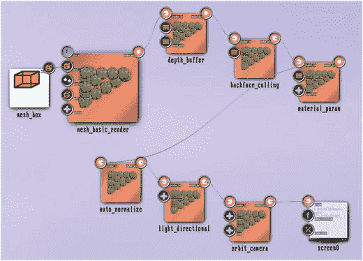

图 5-2。

Basic transformation setup Click and drag on an output anchor and release over the input anchor you want to connect to.

这里有一个关于顺序的说明:ThMAD 下的 OpenGL 是一个状态机，顺序在任何时候都无关紧要。然而，它通常是很重要的，尤其是在矩阵运算的时候。在刚刚描述的状态中，`orbit_camera`和`light_directional`模块具有由矩阵描述的空间取向。顺序在这里是至关重要的:如果我们在相机后面有灯光，灯光的位置会随着相机旋转，就好像灯光和相机是绑在一起的。但是在这里，如果相机旋转，我们希望灯光是固定的，因此灯光需要放置在相机之前。

这个不起眼的模块叫做`auto_normalize`是这里新出的。它在变换之后和应用光照之前固定法向量。在某些情况下，尤其是任何缩放变换，忘记它可能会给你带来奇怪的照明问题和不眠之夜。

Caution

在任何 3D 状态下，只要有一点点缩放发生的机会，就在照明之前添加模块渲染器→OpenGL _ modifiers→auto _ normalize。

结果将是一个立方体的正面视图，如图 [5-3](#Fig3) 所示。

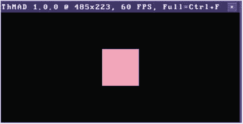

图 5-3。

Basic state outcome

我们现在要做的是添加一个摇摆旋转，由传入的声音低音调制伸长，并添加一个大小缩放，由传入的声音三倍调制。我们从旋转开始。要继续，添加渲染器→ opengl_modifiers → gl_rotate 模块两次，并在`mesh_basic_render`和`depth_buffer`之间插入。为此，右击它们之间的连线，选择断开，然后绘制如图 [5-4](#Fig4) 所示的新连接。


图 5-4。

Adding rotation modules

当添加几个同类型的模块时，ThMAD 会自动对它们进行编号。例如，对于我们刚刚添加了两次的`gl_rotate`，第一个的名称是`gl_rotate`，第二个是`gl_rotate_1`。下一个将被称为`gl_rotate_2`，以此类推。这是在模块下的画布上看到的外部名称，也是内部 ID，在模块被删除之前不会改变。

旋转模块默认具有旋转轴(0；0;1)，这意味着平行于 z 轴，旋转角度为 0.0。锚因此被称为轴和角。我们现在将第一个旋转模块的轴更改为(1；0;1):双击`axis`锚点并移动 x 滑块。这是第一个，一直到 1.0。见图 [5-5](#Fig5) 。

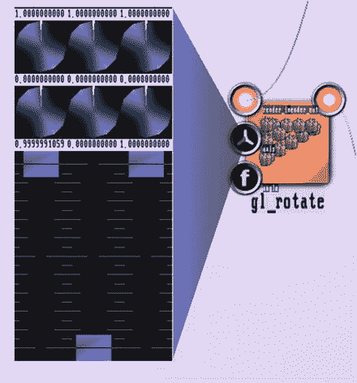

图 5-5。

Rotation axis slider

双击三重滑块上的任意位置，将其关闭。让另一个旋转模块的轴保持不变，这样一个将绕其默认值 z 轴旋转。对于稳定旋转效果，我们添加两个数学→振荡器→振荡器模块，并设置它们的锚，如表 [5-9](#Tab9) 和 [5-10](#Tab10) 所示。

Table 5-10.

<colgroup><col> <col> <col> <col></colgroup> 
| 数学→振荡器→振荡器 |
| --- |
| 第二个“转子发动机” |
|   | osc _ 类型 | 看见 | 有关解释，请参见下文。 |
|   | 频率 | Zero point two five | 您也可以选择其他值。 |

Table 5-9.

<colgroup><col> <col> <col> <col></colgroup> 
| 数学→振荡器→振荡器 |
| --- |
| 第一台“转子发动机” |
|   | osc _ 类型 | 看见 | 解释如下。 |
|   | 频率 | Zero point five five | 也可以选择其他值。 |

现在将它们的输出连接到`gl_rotate`模块的`angle`输入锚。见图 [5-6](#Fig6) 。

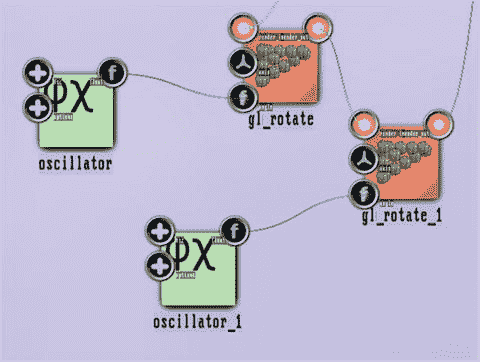

图 5-6。

Steady rotation

设置浮动类型锚值的方法是双击，然后单击并拖动旋钮。点击旋钮后，上下拖动鼠标粗调数值，左右拖动微调数值。或者单击数字，使用键盘更改一个值，然后按 Enter 键(使用 Ctrl+Del 随时清除字符串)。

我们使用 saw 振荡器的原因是其从 0.0 到 1.0 的线性转换，然后突然回到 0.0。另一方面，角度输入的模数为 1.0，这意味着 1.0 的角度表示完整的旋转。这样，saw 振荡器提供了稳定一致的旋转。现在为了翻译，我们添加了这些模块:

*   渲染器→ opengl_modifiers → gl_translate
*   数学→转换器→3 浮点到浮点 3

将`gl_translate`模块放在`gl_rotate_1`和`depth_buffer`模块之间，将`3float_to_float3`模块连接到`gl_translate`模块的`translation`锚上，如图 [5-7](#Fig7) 所示。


图 5-7。

Translation added

`3float_to_float3`允许复用平移向量——平移的 x、y 和 z 分量中的每一个都可以通过这种方式独立寻址。对于运动电机，我们增加了另一个振荡器:

数学→振荡器→振荡器

我们将其连接到`3float_to_float3`的第一个输入锚，并如表 [5-11](#Tab11) 所示设置其锚。

Table 5-11.

<colgroup><col> <col> <col> <col></colgroup> 
| 数学→振荡器→振荡器 |
| --- |
| 第二振荡器，振荡器 _2 |
|   | osc _ 类型 | 犯罪 |   |
|   | one-function sketch 单功能草图 | Zero | 让它在 0.0 左右震荡。 |

作为最后一个变换模块，我们添加了一个放大或缩小盒子的模块，名字中的`_one`意味着在所有三个维度上的统一缩放:

渲染器→ opengl_modifiers → gl_scale_one

放在`gl_translate`和`depth_buffer`之间。见图 [5-8](#Fig8) 。


图 5-8。

Scaling added

最后一步，我们增加声音的灵敏度。为此，将声音→ input_visualization_listener 模块放在画布上，并执行两次数学→算术→三元→浮点→乘法 _ 加法。将`visualization listener`模块的`octaves_l_0`输出锚连接到第一个`mult_add`模块的`float_in`锚上，将`octaves_l_4`锚连接到第二个`mult_add`模块上。参见图 [5-9](#Fig9) 。`octaves_l_0`用于低音,`octaves_l_4`用于高音。其他输入锚点值用于音量缩放和设置基本值。更准确地说，参见表 [5-12](#Tab12) 和 [5-13](#Tab13) 。

Table 5-13.

<colgroup><col> <col> <col> <col></colgroup> 
| 数学→算术→三进制→浮点数→乘法 _ 加法 |
| --- |
| 连接到高音音调和缩放模块的那个 |
|   | first_mult | Ten | 音量缩放 |
|   | 然后 _ 添加 | Zero point five | 有些尺寸甚至没有 |
|   |   |   | 声音 |

Table 5-12.

<colgroup><col> <col> <col> <col></colgroup> 
| 数学→算术→三进制→浮点数→乘法 _ 加法 |
| --- |
| 连接到低音和翻译模块的那个 |
|   | first_mult | Three | 音量缩放 |
|   | 然后 _ 添加 | Zero point one | 一些运动甚至没有声音 |

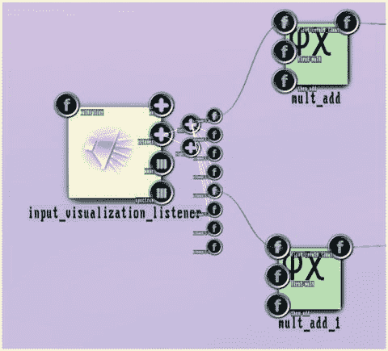

图 5-9。

Sound input added

最后，将`bass mult_add's`输出连接到`oscillator_2`的`amp`锚，将`treble mult_add`输出连接到`gl_scale_one`模块的`scale`锚。

播放一些音乐，可以看到盒子随着传入的声音移动充气，如图 [5-10](#Fig10) 所示。

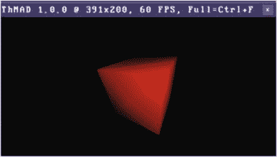

图 5-10。

Outcome of the sound input added

如果效果显示得太勉强，改变可视化监听器的放大输入锚`multiplier`。

盒子的运动和膨胀有点尖锐，因为传入的声音反应非常快。如果在`mult_add`模块后插入数学→插值→ float_smoother 模块，就可以使其平滑。这是留给你的练习。

### 线框

线框模型通过简单地不绘制任何区域而是仅绘制对象的边缘来降低渲染 3D 对象的复杂性。它是为了调试的目的而引入的，因为不在区域内绘制点可以显著提高速度。但是线框模型也可以展示他们自己的美学。

Note

本小节中的样本可在`TheArtOfAudioVisualization`文件夹中的`A-5.1.2_*`下找到。

首先，我们画三种类型的球体，并比较它们的线框。为此，让我们首先构建基本的 3D 设置。

在`mesh_basic_render`和`depth_buffer`之间插入模块渲染器→ opengl_modifiers → blend_mode。这个模块很好的表达了你想要合并几个子渲染管道。您还可以指定当几个对象重叠时，像素颜色会发生什么变化。我们希望并排呈现对象，所以不要期望这里有重叠，但是使用`blend_mode`作为组合器是一个构建状态的好方法。请记住，您可以通过先删除现有连接来将模块插入到该连接中。为此，右键单击连接并选择断开，然后根据需要重新连接。

在`mesh_basic_render`和`blend_`T2 之间插入这些模块:

*   渲染器→ opengl_modifiers → gl_scale_one
*   渲染器→ opengl_modifiers → gl_translate

见图 [5-11](#Fig11)


图 5-11。

Preparing the wireframed views

将`gl_scale_one`的`scale`锚改为 0.75，如表 [5-14](#Tab14) 所示。

Table 5-14.

<colgroup><col> <col> <col></colgroup> 
| 渲染器→ opengl_modifiers → gl_scale_one |
| --- |
|   | 规模 | Zero point seven five |

将模块`gl_translate`的`translation`锚的 x 坐标改为-1.8，如表 [5-15](#Tab15) 所示。

Table 5-15.

<colgroup><col> <col> <col></colgroup> 
| 渲染器→ opengl_modifiers → gl_translate |
| --- |
|   | 翻译 | (-1.8; 0; 0) |

为此，双击`translation`锚并使用左旋钮和左滑块调整 x 值，如图 [5-12](#Fig12) 所示。

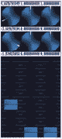

图 5-12。

Triple value slider

上部旋钮指定滑块可用的范围，下部旋钮指定偏移量。要更改旋钮的值，请点按并拖移它。垂直鼠标移动用于粗略改变，水平鼠标移动用于精细改变。因此，如果您将较低的旋钮更改为-2.0，而将较高的旋钮保留为默认值 1.0，您可以使用滑块来获得所需的-1.8。要移动滑块，也单击并拖动它。双击三重控制器上的任意位置，将其关闭。

删除之前没有遵循说明的盒子模块。点击它，然后按键盘上的 Del 键。或者使用右键单击后获得的上下文菜单来删除它。现在将模块网格→实体→网格 _ 球体放在`mesh_basic_render`旁边，并将球体连接到`mesh_basic_render`模块的`mesh_in`锚。如表 [5-16](#Tab16) 所示更换球体的锚。

Table 5-16.

<colgroup><col> <col> <col></colgroup> 
| 网格→实体→网格 _ 球体 |
| --- |
|   | 数量 _ 扇区 | Thirty |
|   | 数量 _ 堆栈 | Ten |

在稍微改变相机的设置后，我使用 2.8 作为距离，65.0 作为 fov 来稍微减弱透视效果。你可以在图 [5-13](#Fig13) 中看到这一点。


图 5-13。

A basic sphere

对于另外两种球体类型，我们克隆了`mesh_basic_render`、`gl_scale_one,`和`gl_translate`模块。克隆是所有实际值的副本，它通常有助于简化状态生成。要执行克隆，请按住 Ctrl 和 Alt，然后单击并拖动有问题的模块。

对于克隆的模块，和原来一样连接，连接到 blend_mode，这一次，添加网格→实体→网格 _ 球体 _ 二十面体模块作为输入。将克隆的`gl_translate`的 x 平移改为 0.0。以完全相同的方式制作另一个克隆，但这次使用+1.8 的 x 平移值，并添加网格→实体→网格 _ 球体 _ 八面体。

关于球体的参数，设置如表 [5-17](#Tab17) 和 [5-18](#Tab18) 所示的值。

Table 5-18.

<colgroup><col> <col> <col></colgroup> 
| 网格→实体→网格 _ 球体 _ 八面体 |
| --- |
|   | 细分 _ 级别 | Four |
|   | max_normalization_level | Ten |

Table 5-17.

<colgroup><col> <col> <col></colgroup> 
| 网格→实体→网格 _ 球体 _ 二十面体 |
| --- |
|   | 细分 _ 级别 | Four |
|   | max_normalization_level | Ten |

该状态的发电机部分将如图 [5-14](#Fig14) 所示，输出如图 [5-15](#Fig15) 所示。现在实际上切换到线框模式视图是很容易的。在相机模块和屏幕模块之间，插入一个模块 Renderers→OpenGL _ modifiers→rendering _ mode。

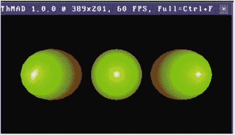

图 5-15。

Three spheres of different kinds


图 5-14。

Three spheres: state (part)

如表 [5-19](#Tab19) 所示更换其锚。

Table 5-19.

<colgroup><col> <col> <col></colgroup> 
| 渲染器→ opengl_modifiers →渲染模式 |
| --- |
|   | 背面 | 线 |
|   | 面向前方 | 线 |

最终输出如图 [5-16](#Fig16) 所示。您可以按 Ctrl+F 切换到全窗口模式并研究详细信息。


图 5-16。

Three spheres of different kinds, in wireframe mode

如果你想以此为基础做一些更有活力、更丰富的东西，这可以通过如下方式实现。移除层代的八面体和二十面体部分，然后将剩余球体移回(0；0;0)通过相应地改变`gl_translate`的`translation`锚的 x 坐标。

然后添加模块 particle systems→generators→basic _ spray _ emitter，并如表 [5-20](#Tab20) 所示设置其锚点。

Table 5-20.

<colgroup><col> <col> <col> <col></colgroup> 
| 粒子系统→发生器→基本 _ 喷射 _ 发射器 |
| --- |
|   | 粒子数 | One hundred |   |
|   | 每秒粒子数 | -1 | 因为-1，“粒子数”规则 |
|   | 空间/大小/速度/速度 _x | Nine |   |
|   | 空间/大小/粒子大小基础 | One |   |
|   | 空间/大小/粒子大小随机权重 | Three point two |   |
|   | 外观/时间/粒子 _ 寿命 _ 基础 | Four |   |
|   | 外观/时间/粒子 _ 寿命 _ 随机 _ 重量 | One |   |

这个 particlesystem 喷雾发射器所做的是稳定地产生、移动并在一段时间后杀死线框立方体。将`basic_spray_emitter`连接到`mesh_basic_render`的`particles`输入锚上，开始动力。输出将如图 [5-17](#Fig17) 所示。

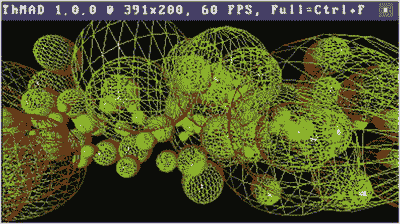

图 5-17。

Massive and dynamic wireframes

关于粒子系统还有很多要说的，我们会在整篇文章的不同地方再次遇到它们。

如本章前面所述，可以添加对声音的响应。你只需将声音连接到任何输入锚点。速度、数量、基本大小和/或大小随机化都是合适的候选。

### 海洋模块

ThMAD 有一个相当吸引人的海洋模块，在本节中解释。

从本章前面描述的基本设置开始，直到`mesh_box`。这里不需要那个。相反，添加网格→生成器→海洋模块，并将其连接到`mesh_basic_render`。至于锚值，首先在屏幕模块中设置天空颜色，如表 [5-21](#Tab21) 所示。

Table 5-21.

<colgroup><col> <col> <col> <col></colgroup> 
| 屏幕 |
| --- |
|   | 透明 _ 颜色 | 0.19; 0.40; 1.0; One | 天空 |

请注意，双击锚点会选择其默认的输入法。对于颜色，这通常是您已经知道的颜色控制器，但不是用于屏幕模块。这个决定由每个模块分别做出。在这种情况下，四重滑块组合出现，如图 [5-18](#Fig18) 所示。

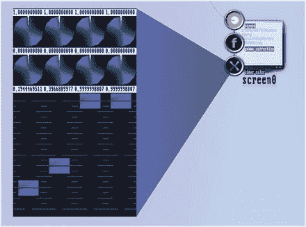

图 5-18。

The quadruple slider combo

在这里，您可以使用滑块设置每个颜色通道值，每个滑块的范围由第一行中的旋钮给出，最小值或偏移量由它下面的旋钮给出。这些限制有默认值，对于自然范围从 0.0 到 1.0 的颜色值，范围= 1.0 和偏移= 0.0 在这里完全有意义。你不必改变这里的限制旋钮。或者，您可以单击滑块正上方的文本滑块值，使用键盘输入一个值(首先使用 Ctrl+Del 清除该字段)。

或者，您可以通过右键单击锚点并选择颜色来强制显示颜色选择器，如图 [5-19](#Fig19) 所示。

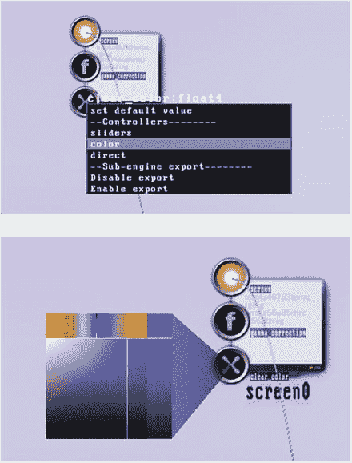

图 5-19。

Accessing the graphical color chooser

或者，您可以使用相同的上下文弹出菜单选择直接输入模式，如图 [5-20](#Fig20) 所示。

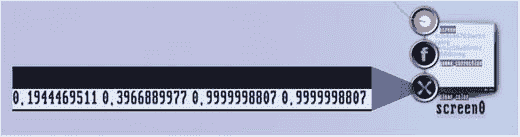

图 5-20。

Direct color entry process

然后，您可以单击每个值，然后使用键盘并按 Enter 键来更改它。同样在这里，您使用 Ctrl+Del 来清除一个值。前三个值代表 RGB，每个分量位于[0.0；1.0]，最后一个为 ALPHA 值。像往常一样，通过双击关闭任何控制器。海洋的其他模块锚值如表 [5-22](#Tab22) 至 [5-28](#Tab28) 所示。

Table 5-28.

<colgroup><col> <col> <col> <col></colgroup> 
| 网格→生成器海洋 |
| --- |
|   | 时间 _ 速度 | Three point two | 波浪运动的时间乘数 |
|   | 风速 x | 5-0 |   |
|   | 风速 y | Twelve |   |
|   | 希腊字母的第 11 个 | One point one two | 波速 |
|   | 仅法线 | 不 |   |

Table 5-27.

<colgroup><col> <col> <col> <col></colgroup> 
| 渲染器→网格→网格 _ 基本 _ 渲染 |
| --- |
|   | 顶点颜色 | 不 | 让 material_param 模块定义颜色 |
|   | 使用 _ 显示 _ 列表 | 不 |   |
|   | 使用顶点颜色 | 不 |   |
|   | 粒子 _ 大小 _ 中心 | 不 |   |
|   | 粒子 _ 大小 _ 颜色 | 不 |   |
|   | ignore _ uvs _ in _ vbo _ updates | 不 |   |

Table 5-26.

<colgroup><col> <col> <col></colgroup> 
| 渲染器→OpenGL _ 修改器→深度 _ 缓冲区 |
| --- |
|   | 深度测试 | 使能够 |
|   | 深度 _ 遮罩 | 使能够 |

Table 5-25.

<colgroup><col> <col> <col> <col></colgroup> 
| 渲染器→OpenGL _ 修改器→背面 _ 剔除 |
| --- |
|   | 状态 | 有缺陷的 | 由于内部错误，需要禁用 |

Table 5-24.

<colgroup><col> <col> <col> <col></colgroup> 
| 渲染器→OpenGL _ 修改器→材质 _ 参数 |
| --- |
|   | 环境 _ | 0.21; 0.19; 0.06; | 暗黄色环境 |
| 反射比 | Zero point nine eight | 反射比 |
|   | 扩散 _ | 0.03; 0.13; 0.83; | 蓝色漫反射率 |
| 反射比 | One |
|   | 镜面 _ | 0.92; 0.91; 0.68; | 浅黄色镜面 |
| 反射比 | One | 反射比 |
|   | 镜面指数 | Twenty |   |

Table 5-23.

<colgroup><col> <col> <col> <col></colgroup> 
| 渲染器→OpenGL _ 修改器→灯光 _ 方向 |
| --- |
|   | 位置 | -0.19; 0.71; One |   |
|   | 环境颜色 | 0.16; 0.22; 0.23; Zero point four two | 青绿色环境色 |
|   | 漫射 _ 颜色 | 0.94; 0.92; 1.0; One | 海蓝色漫射色 |
|   | 镜面反射颜色 | 0.95; 0.94; 0.81; One | 有点微黄的明亮镜面 |

Table 5-22.

<colgroup><col> <col> <col> <col></colgroup> 
| 渲染器→OpenGL _ 修改器→摄影机→动态观察 _ 摄影机 |
| --- |
|   | 循环 | 0.0; -0.82; Zero point one two | 我们需要一个合适的相机视角，因为 ThMAD 的海洋板块是有限的，但我们想要一个无边无际的地平线的印象。 |
|   | 距离 | Twenty |
|   | 视野 | Sixty-six |

Note

源代码可以在`TheArtOfAudioVisualization`文件夹中的`A-5.1.3_Ocean`下找到。

结果如图 [5-21](#Fig21) 所示。

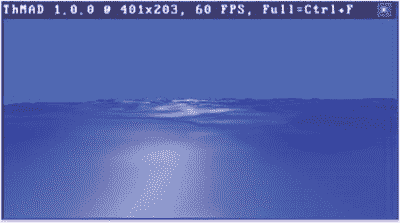

图 5-21。

Ocean output

## 纹理映射

纹理，更准确地说是纹理图，是一种使用预加载在图形硬件上的 2D 图像来有效描述 3D 对象的每个部分的表面特征的方法。

这样做是有技术原因的。考虑一个真实世界移动的 3D 物体。为了真实地表现它，我们必须通过观察数以百万计的微观彩色点来描述它。这些点中的每一个都在移动，每秒钟需要计算几十次。如果所有这些都发生在计算机的 CPU 中，那么每秒钟将会有太多的数据被转移到图形硬件中。相反，作为摆脱这一困境的一个非常聪明的方法，我们通过更少数量的点或顶点来描述每个 3D 对象，在表面上构建网格，并将 2D 预加载图像的适当部分映射到网格的每个面上。这有效地减少了每秒传输到图形硬件的数据量。

这种纹理映射的主要数学描述包括为构建形状的每个顶点分配两个坐标集。例如，如果你画一个由这些坐标组成的四边形面

(x1，y1，z1) → (x2，y2，z2) → (x3，y3，z3) → (x4，y4，z4) → (x1，y1，z1)

你想在它上面映射一个 2D 纹理的一部分，更准确的说是一个四边形:

(u1，v1) → (u2，v2) → (u3，v3) → (u4，v4) → (u1，v1)

那么这两组坐标就是你必须在程序中提供的描述纹理贴图的坐标:

(x1，y1，z1，u1，v1) → (x2，y2，z2，u2，v2) →。

(x3、y3、z3、u3、v3) → (x4、y4、z4、u4、v4) →

(x1，y1，z1，u1，v1)

这在图 [5-22](#Fig22) 中进行了图示。注意，关于纹理还有很多要说的。纹理也有 1D、3D 甚至 4D 风格，不同分辨率的堆叠存储类型等等。在本书中，我们只描述了所有这些特征的一部分，但是你可以在互联网或其他书籍上阅读的材料可能是压倒性的，所以如果你喜欢，请随意使用其他来源来扩展你的研究。


图 5-22。

Basic texture mapping

首先，在 ThMAD 中，没有一种通用的方法来描述这样的点状纹理映射，无论它是以哪种方式被纹理化的物体的结构和纹理所要求的。这是因为你通常不输入点的坐标，而是一种或另一种形式的形状，没有可靠的方法来猜测每个纹理点需要映射到哪里。但是也有一些变通办法，包括一些有趣的情况，使用自动纹理坐标生成，以及 OpenGL 中的一个称为着色器的功能。两者都给人有趣的效果，并且对你的视觉化想法很重要。

### 自动纹理坐标

OpenGL 有一个函数叫`glTexGen()`。它描述了一种旧的遗留技术，让渲染引擎自动生成纹理映射。它现在被阴影所取代，这不在本书讨论范围之内。在表现力上有一些不足。

Note

该源代码可以在`TheArtOfAudioVisualization`文件夹中的`A-5.2.1_Automatic_texture_coordinates`下找到。

不过，你可以用它来画草图，因为 ThMAD 里有一个模块可以覆盖它。这个模块的名字是 Texture→OpenGL→Texture _ coord _ gen，为了使用它，你还需要一个基本的 3D 管道，一个网格，一个纹理。作为演练示例，以下部分描述了将纹理映射到球体上和立方体的一侧。从这些模块开始:

*   `orbit_camera`
*   `light_directional`
*   `material_param`
*   `backface_culling`

将摄像机连接到屏幕模块`screen0`。这是管道的后端。从另一边，如果你喜欢，选择画布的左边。我们从链条开始，将它们连接起来:

*   纹理→加载器→ png_tex_load
*   纹理→修改器→缩放
*   纹理→修改器→纹理参数
*   纹理→修改器→平移
*   渲染器→网格→网格 _ 基本 _ 渲染
*   纹理→ opengl →纹理 _ 坐标 _ 生成

同时将`texture_coord_gen`模块的`render_out`锚连接到`material_param`模块的`render_in`锚。作为最后一个模块，我们添加网格→实体→网格 _ 球体 _ 八面体，并将其输出连接到`mesh_- basic_render`模块的`mesh_in`锚。见图 [5-23](#Fig23) 。

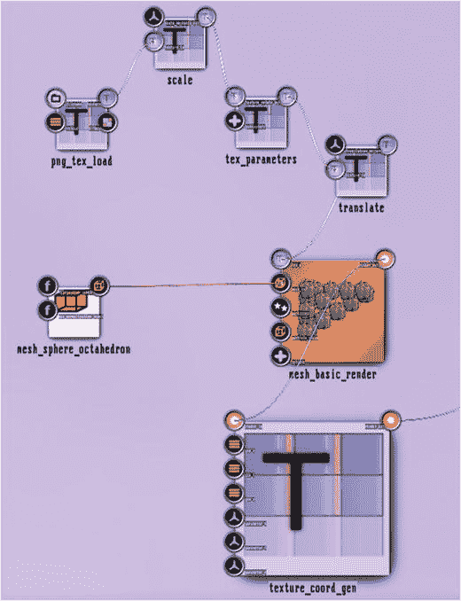

图 5-23。

Automatic texture coordinates

要准备这些锚点参数，请在此文件夹中放置一个 PNG 图像:

```sh
[HOME]/thmad/[VERSION]/data/resources

```

确保它的大小为 128x128 或 256x256，并让其背景透明。让纹理的大小在两个维度上相同，并且 2 的幂通常是个好主意。我要用的小青蛙已经在`TheArtOfAudioVisualization`文件夹里了；叫做`frosch2.png`。锚固参数见表 [5-29](#Tab29) 至 [5-34](#Tab34) 。

Table 5-34.

<colgroup><col> <col> <col> <col></colgroup> 
| 纹理→ opengl →纹理 _ 坐标 _ 生成 |
| --- |
|   | gen_s | 对象 _ 线性 | 请注意，OpenGL 中的纹理坐标通常用 S、T 和 r 来表示。这并不是打印错误，奇怪的顺序是由于历史原因。 |
|   | gen_t | 对象 _ 线性 |
|   | gen_r |  | 忽略，因为我们有 2D 纹理。 |

Table 5-33.

<colgroup><col> <col> <col> <col></colgroup> 
| 网格→实体→网格 _ 球体 _ 八面体 |
| --- |
|   | max_normalization_level | Ten | 平滑度；在细分级别之前更改此级别！ |
|   | 细分 _ 级别 | Six | 平滑 |

Table 5-32.

<colgroup><col> <col> <col> <col></colgroup> 
| 纹理→修改器→纹理参数 |
| --- |
|   | 参数/包装 _s | 重复 | 您可以稍后更改重复模式，以仅显示一个贴图纹理，或者一行或一列重复纹理。 |
|   | 参数/ wrap_t | 重复 |   |

Table 5-31.

<colgroup><col> <col> <col> <col></colgroup> 
| 纹理→修改器→平移 |
| --- |
|   | 翻译 _ 向量 | 0; 0; Zero | 纹理的映射位置–您可以稍后使用这些值。 |

Table 5-30.

<colgroup><col> <col> <col> <col></colgroup> 
| 纹理→修改器→缩放 |
| --- |
|   | 比例 _ 矢量 | 1; 1; one | 纹理的映射大小；您可以稍后使用这些值。 |

Table 5-29.

<colgroup><col> <col> <col> <col></colgroup> 
| 纹理→加载器→ png_tex_load |
| --- |
|   | 文件名 | 参考资料中的 PNG 图像 | 通过资源浏览器进行选择；双击您的选择。 |

在你的后端，确保`backface_culling`的锚`status`被切换到`ENABLED`，灯在`properties/enabled`被打开，并且透视校正在`camera`模块中被打开。此外，您可以将相机旋转参数设置为(0.0；0.0;1.0).结果将类似于图 [5-24](#Fig24) 和 [5-25](#Fig25) 。


图 5-25。

Automatic texture coordinates, take 2


图 5-24。

Automatic texture coordinates , take 1

乍一看，这似乎是图片到球体的正确映射。但实际上，所用的公式并不现实。由于模块的`OBJECT LINEAR`模式，每个(u，v)坐标被映射到(x，y，z)空间的线性组合:u = a ∙ x + b ∙ y + c ∙ z 和 v = d ∙ x + e ∙ y + f ∙ z。这仅在球体表面的中心附近是真实的，并且仅当在 x，y 平面上直视时。摆弄缩放、移动和相机位置，图片可能看起来像图 [5-25](#Fig25) ，揭示了这种自动纹理映射的缺陷。

模块`texture_coord_gen`的其他模式的作用不同。使用`EYE_LINEAR`模式时，可在模块的`parameter_s`和`parameter_t`锚点中更改的 a、b、c、d、e、f 值根据摄像机或眼睛位置进行投影。即使这样，球体边缘的投影也不正确，如图 [5-26](#Fig26) 所示。


图 5-26。

Automatic texture coordinates, take 3

第一眼看去，`NORMAL MAP`模式似乎做了正确的事情，如图 [5-27](#Fig27) 所示。它使用每个网格片段的法向量来跨越纹理的相应部分。不过，贴图会粘在相机位置上，也就是说，它不会固定在对象上。事实上，你会看到灯光看起来是旋转的，这来自于旋转不变的球体。

`SPHERE_MAP`和`REFLECTION_MAP`模式是极限情况，我们不在这里讨论。当然，你仍然可以和他们一起玩。如果你想了解更多，看看 OpenGL 规范，它详细描述了`glTexGen`功能。


图 5-27。

Automatic texture coordinates, take 4

也可以将纹理投影到立方体的表面。只需将同一模块文件夹中的`mesh_sphere_octahedron`模块替换为`mesh_box`模块即可。你可能会猜测，对于`OBJECT_LINEAR`模式，我们在边缘有不自然扭曲的球体的情况下所面临的缺陷可能会消失，这是真的。但前提是我们只看六个面中的一个，并且不允许贴图到达边缘。为什么会这样？嗯，在边缘处，贴图公式停止前进，相邻的面将被边缘的像素填充，如图 [5-28](#Fig28) 所示。


图 5-28。

Automatic texture coordinates on a cube

但是如果你将`tex_- parameters`中的重复模式改为两个坐标的“钳制”，然后适当缩放和移动纹理，你可能会在立方体的一个面上得到一个逼真的纹理贴图，如图 [5-29](#Fig29) 所示。


图 5-29。

Automatic texture coordinates on a cube, take 2 For illustration purposes, a wireframe has been added to show the cube’s orientation.

话虽如此，`texture_coord_gen`模块可能在平面上工作得很好，但它显示出在弯曲表面上缺乏物理正确性。在任何情况下，它仍然可以帮助你达到你想要的效果。

### 浮动纹理 I

另一种技术，我称之为浮动纹理，使用平面网格生成器。有两个:

*   网格→实体→网格 _ 平面
*   网格→实体→网格 _ 栅格

第一个用于生成任意数量的填充了纹理的堆叠幻灯片。这可能会产生令人印象深刻的效果，但您也可以将数量设置为一个，这样就可以让一张幻灯片在 3D 空间中悬停。这种在 3D 空间中的盘旋或漂浮就是“漂浮纹理”这个名字的由来。第二台发电机`mesh_grid`没有堆叠能力，所以永远是单台。然而，与`mesh_planes`相反，它由均匀映射到纹理坐标的顶点网格组成。

Note

源代码可以在`TheArtOfAudioVisualization`文件夹中的`A-5.2.2_Floating_texture`下找到。

我们首先描述一下`mesh_planes`组件。要使用它，请在画布上放置常用的 3D 链— `orbit_camera`、`light_directional`、`material_param`、`backface_culling`—并将相机连接到屏幕模块。添加这些模块:

*   纹理→加载器→ png_tex_load
*   纹理→修改器→缩放
*   纹理→修改器→纹理参数
*   纹理→修改器→平移
*   渲染器→网格→网格 _ 基本 _ 渲染
*   网格→实体→网格 _ 平面

将它们全部连接起来，如图 [5-30](#Fig30) 所示。为了准备锚点参数，在`[HOME]/thmad/[VERSION]/data/resources`文件夹中放置一个 PNG 图像。


图 5-30。

Floating textures modules connected Note that `backface_culling` is connected to the `render_out` anchor of `mesh_basic_render`.

确保它的大小为 128x128 或 256x256，并让其背景透明。让纹理大小在两个维度上相同并且是 2 的幂通常是个好主意。我要用的小青蛙已经在`TheArtOfAudioVisualization`文件夹里了；叫做`frosch2.png`。

锚固参数如表 [5-35](#Tab35) 至 [5-39](#Tab39) 所示。

Table 5-36.

<colgroup><col> <col> <col> <col></colgroup> 
| 纹理→修改器→缩放 |
| --- |
|   | 比例 _ 矢量 | 1; 1; one | 纹理的映射大小——您可以稍后使用这些值。 |

Table 5-35.

<colgroup><col> <col> <col> <col></colgroup> 
| 纹理→加载器→ png_tex_load |
| --- |
|   | 文件名 | 参考资料中的 PNG 图像 | 通过资源浏览器进行选择；双击您的选择。 |

Table 5-37.

<colgroup><col> <col> <col> <col></colgroup> 
| 纹理→修改器→平移 |
| --- |
|   | 翻译 _ 向量 | 0; 0; Zero | 纹理的映射位置—您可以稍后使用这些值。 |

Table 5-38.

<colgroup><col> <col> <col> <col></colgroup> 
| 纹理→修改器→纹理参数 |
| --- |
|   | 参数/包装 _s | 夹子 | 贴图时不要重复纹理。 |
|   | 参数/ wrap_t | 夹子 |

Table 5-39.

<colgroup><col> <col> <col> <col></colgroup> 
| 网格→实体→网格 _ 平面 |
| --- |
|   | 飞机数量 | One | 平滑度，在细分级别之前更改这个！ |
|   | 标准 | 0; 0; One | 不影响幻灯片的位置或旋转，但有助于正确渲染幻灯片，这取决于上下文，如照明或与其他对象的对应关系。 |
|   | 直径 | One | 尺寸。你可以以后再玩它。 |

在你的后端，确保`backface_culling`的锚`status`被切换到`ENABLED`，灯在`properties / enabled`被打开，并且透视校正在`camera`模块中被打开。此外，您可以将相机旋转参数设置为(0.0；0.0;1.0).到目前为止的结果将如图 [5-31](#Fig31) 所示。


图 5-31。

Floating texture output

我们现在有一个尺寸为 2x2 的幻灯片，在 x-y 平面上通过 z=0。如果你想有不同的尺寸，你可以改变`mesh_plane`里面的`diameter`锚点。为了将幻灯片移动到另一个位置或旋转它，您可以通过两个附加的修改器轻松实现:

*   渲染器→ opengl_modifiers → gl_translate
*   渲染器→OpenGL _ 修改器→ gl_rotate

在`mesh_basic_render`和`backface_culling`之间。

如果您查看到目前为止的渲染管道，您可能会注意到有一个可识别的子管道，它可以重复用于不同的纹理文件和不同的大小、位置和方向。见图 [5-32](#Fig32) 。

对于可重用的子管道，ThMAD 内部有一种技术，称为宏。要创建宏，请在画布的空白处单击鼠标右键，然后从弹出菜单中选择“创建宏”。然后打开宏。右键单击它并从弹出菜单中选择打开。现在从图 [5-32](#Fig32) 所示的子管道中选择所有模块。


图 5-32。

Floating texture sub-pipeline

在按住 Ctrl 键的同时单击所有这些模块。或者确保所有其他模块离它们更远，然后用鼠标在它们上面画一个选择矩形，再次按住 Ctrl 键。 [<sup>1</sup>](#Fn1)

现在按下 Shift 和 Ctrl 键，单击任何选定的模块，保持鼠标单击并拖动到宏中。结果将如图 [5-33](#Fig33) 所示。

给新宏一个合适的名称。点击它，在 ThMAD 窗口右上角出现的弹出菜单中，输入一个新名称，比如`FloatingTexture`。见图 [5-34](#Fig34) 。


图 5-34。

Naming the macro


图 5-33。

Moving modules to a macro

点击重命名按钮后，新名称将立即出现在宏模块下。

因为存在来自或连接到外部模块的连接，所以宏自动分配了一个传入锚和一个传出锚。然而，如果我们不能建立更多的锚点，更精确地确定大小、位置和旋转，宏的作用将会有限。为此，从`mesh_planes`开始，将`diameter`锚拖到宏的空白处。单击定位点，按住鼠标键，将其移动到宏的空白处。宏左侧会出现一个新锚点，它连接到`mesh_planes`的`diameter`锚点。对`gl_rotate`的`axis`和`angle`锚以及`gl_translate`的`translation`锚重复同样的过程。最终你会得到一个有五个输入锚点的宏，如图 [5-35](#Fig35) 所示。

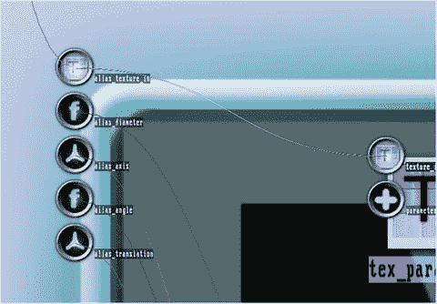

图 5-35。

Macro with all input anchors You can rename the new anchors, if you like. Click on any of them and use the pop-up to rename it.

右键单击宏，使用空白点，并从弹出菜单中选择“关闭”,不会删除宏，但会将其最小化。你可以把它当作一个黑盒。见图 [5-36](#Fig36)

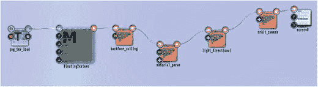

图 5-36。

New state with a minimized macro

宏可以独立于状态保存。右键单击宏，然后选择保存宏。输入合适的名称，如`FloatingTexture`。宏现在已保存，可在其他状态下使用，或在任何状态下多次使用，包括当前状态。要在当前状态下立即再次使用它，请在将鼠标移动到画布的空白处后通过 Ctrl+S 保存它，然后重新启动 ThMAD。从模块菜单中打开宏部分。重启是必要的，因为模块列表浏览器的当前实现不能对结构变化做出动态反应。

### 浮动纹理 II

对于另一个支持浮动纹理的模块，网格→实体→网格 _ 网格，使用中适合你的任何方法，并用`mesh_grid`替换`mesh_planes`模块。

Note

本小节中的样品可在`TheArtOfAudioVisualization`文件夹中的 A- `5.2.3_Floating_texture*`下获得。

使用表 [5-40](#Tab40) 中显示的值作为参数。

Table 5-40.

<colgroup><col> <col> <col> <col></colgroup> 
| 网格→实体→网格 _ 栅格 |
| --- |
|   | 二的幂大小 | Five | 将网格坐标空间(0，0)–(1，1)细分成 25 ∙ 25 = 32x32 = 1024 块。 |
|   | 飞机 | 正常男性染色体组型 | 否则，观察 x-y 平面的摄像机将无法工作。z 将自动为 0.0 |

其他所有早期有效的方法也将随着这一改变而发挥作用。不过，有一个重要的区别:`mesh_grid`模块使用四边形(-0.5，-0.5，0)–(0.5，0.5，0)内 n 个顶点的单一平面网格，并将给定纹理线性映射到所有顶点。到目前为止，这并没有什么不同，因为所有的网格都被正确地映射到了纹理的相应部分。但是我们可以通过改变纹理坐标来获得扭曲效果。要查看示例，删除`mesh_grid`和`mesh_basic_render`模块之间的连接器，在它们之间放置一个网格→纹理→网格 _ 纹理 _ 序列 _ 扭曲，并连接所有三个，如图 [5-37](#Fig37) 所示。


图 5-37。

Mesh texture distortion

`mesh_tex_sequ_distort`有一个`spatial`复合锚，带有`scale_u`、`scale_v`、`translate_u`和`translate_v`子锚。设置要读取的值，如表 [5-41](#Tab41) 所示。

Table 5-41.

<colgroup><col> <col> <col> <col></colgroup> 
| 网格→纹理→网格 _ 纹理 _ 序列 _ 扭曲 |
| --- |
|   | 空间/比例 _u | One point three | 应用于纹理坐标的缩放比例。 |
|   | 空间/比例 _v | One point five |
|   | spatial / translate_u | Zero | 应用于纹理坐标的平移。 |
|   | 空间/平移 _v | Zero |
|   | 扭曲/ u 形 | 见下文 | 塑造扭曲曲线，详情见本章后面。 |
|   | 扭曲/ v 形 | 见下文 |

您可以稍后使用所有这些值来微调纹理贴图。请注意，在失真模块中，平移发生在缩放之后。

另一个复合锚点`distortion`，包含沿 x 轴和 y 轴的两个变形序列。默认情况下，这些序列将范围 0→1 线性映射到 0→1，这意味着除了缩放和平移之外没有失真。为了改变这种情况，请参见第 [6 章](6.html)中的详细说明。在你做出类似图 [5-38](#Fig38) 的东西后，输出可能看起来像图 [5-39](#Fig39) 。

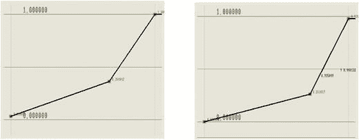

图 5-38。

Distortion sequences Left for the u-axis, and right for the v-axis.

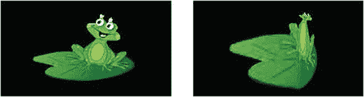

图 5-39。

Floating texture with distortion On the left of the undistorted image.

图 [5-38](#Fig38) 所示的失真在任何地方都有一个正斜率；你也可以有负斜率的部分，就像渲染时回到纹理中，你也可以这样模拟一面镜子，如图 [5-40](#Fig40) 和 [5-41](#Fig41) 所示。

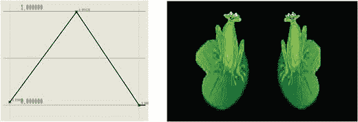

图 5-41。

Texture distortion (u-axis) simulating a mirror

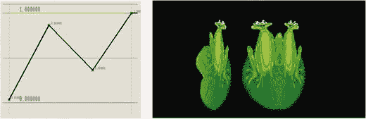

图 5-40。

Texture distortion (u-axis) with negative slope

## 斑点，斑点，斑点

Blobs 是 ThMAD 的主力——你可以在任何需要画简单东西的地方使用它们。不要被“简单”这个词误导——有了 ThMAD 提供的所有这些功能，你只需使用 blobs 就可以完成非常有趣的草图。

水滴可以是圆形、星形或树叶形，具体取决于参数。技术细节可以在位图→生成器→ blob 中找到，用于生成 Blob 位图，以及在纹理→粒子→ Blob 中找到，用于生成直接进入图形硬件进行更快处理的 Blob 纹理。

在本节中，我们将描述不同的使用场景。可能性是无穷无尽的，所以继续尝试你自己的想法吧。

### 基本斑点

基本斑点是发送到位图或纹理的单个图形。这一小节是关于位图的。

Note

该部分的示例可在`TheArtOfAudioVisualization`文件夹中的`A-5.3.1_*`下获得。

从空白画布开始。右键单击任意空白点，然后选择“新建”→“清空项目”。将这些模块放在画布上，并将它们和`textured_-`矩形连接到屏幕模块:

*   位图→生成器→斑点
*   纹理→加载器→位图 2 纹理
*   渲染器→基本→纹理矩形

如表 [5-42](#Tab42) 所示设置参数。

Table 5-42.

<colgroup><col> <col> <col> <col></colgroup> 
| 位图→生成器→斑点 |
| --- |
|   | 颜色 | 1.0; 1.0; 1.0; One | 白色的 |
|   | 希腊字母的第一个字母 | 是 | 如果设置为“是”，斑点的形状由每个像素的适当 ALPHA 值定义。否则，ALPHA 设置为 1.0，形状由基于每像素计算的颜色值定义。 |
|   | 大小 | 512x512 |   |

我们也可以使用另一个 blob 模块纹理→粒子→ blob，但是首先将它作为位图允许位图修改模块有更多的变化。稍后会详细介绍。

现在，玩`arms`、`attenuation`和`star_flower`锚给你不同的斑点形状，如图 [5-42](#Fig42) 所示。相应的状态如图 [5-43](#Fig43) 所示。


图 5-43。

Blobs in different variations state

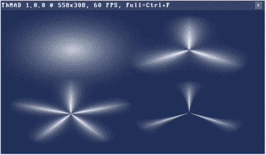

图 5-42。

Blobs in different variations

该状态下各子管道的不同参数如表 [5-43](#Tab43) 至 [5-46](#Tab46) 所示。

Table 5-46.

<colgroup><col> <col> <col> <col></colgroup> 
| 位图→生成器→斑点 | 


 |
| --- | --- |
|   | 颜色、alpha、大小 | 见前 |   |
|   | 手臂，胳膊（arm 的复数） | Three |   |
|   | 衰减 | Two |   |
|   | 星形花 | Three point nine |   |

Table 5-45.

<colgroup><col> <col> <col> <col></colgroup> 
| 位图→生成器→斑点 | 


 |
| --- | --- |
|   | 颜色、alpha、大小 | 见前 |   |
|   | 手臂，胳膊（arm 的复数） | Five |   |
|   | 衰减 | Two point one four |   |
|   | 星形花 | Zero point five |   |

Table 5-44.

<colgroup><col> <col> <col> <col></colgroup> 
| 位图→生成器→斑点 | 


 |
| --- | --- |
|   | 颜色、alpha、大小 | 见前 |   |
|   | 手臂，胳膊（arm 的复数） | Three |   |
|   | 衰减 | Two point one four |   |
|   | 星形花 | Zero point five |   |

Table 5-43.

<colgroup><col> <col> <col> <col></colgroup> 
| 位图→生成器→斑点 | 


 |
| --- | --- |
|   | 颜色、alpha、大小 | 见前 |   |
|   | 手臂，胳膊（arm 的复数） | Zero |   |
|   | 衰减 | One point nine |   |
|   | 星形花 | Zero point one two |   |

因为水滴在性能上得到优化，所以它们是粒子系统的良好候选对象，在粒子系统中需要许多小对象。粒子系统包含在第 [6](6.html) 章中。

高性能 blobs 的基本构造块包括在图形硬件中存储和处理它们。这就是为什么没有像直接斑点渲染器一样的东西，而是被称为斑点纹理生成器。出于同样的原因，您通常不会将声音响应直接添加到斑点中。相反，您所做的是在您处理纹理的状态中添加声音响应，例如纹理转换、纹理映射，或者稍后涉及到合成纹理时。

尽管如此，记住这一点，并不禁止您向 blob 参数添加声音输入。请记住，您的里程数可能会因系统的功率而异。

尝试以下方法。使用之前的系统，移除除第一个 blob 分支之外的所有分支，然后添加这些模块并连接它们，如图 [5-44](#Fig44) 所示:

*   数学→算术→三进制→浮点数→乘法 _ 加法，两次
*   声音→输入 _ 可视化 _ 听众

这些参数使用表 [5-47](#Tab47) 和 [5-48](#Tab48) 中显示的值。


图 5-44。

Blobs with sound awareness, state The upper `mult_add` is connected to the `spatial / size` anchor of `textured_-` rectangle, and to the `vu / vu_l` anchor of `input_visualization_listener`. The lower `mult_add` is connected to the `arms` anchor of module blob, and to the `octaves / left /octaves_left_0` anchor of the `input_visualization_listener`. Table 5-48.

<colgroup><col> <col> <col></colgroup> 
| 数学→算术→三进制→浮点数→乘法 _ 加法 |
| --- |
| 连接到模块 blob 的那个 |
|   | first_mult | Twenty |
|   | 然后 _ 添加 | Zero |

Table 5-47.

<colgroup><col> <col> <col></colgroup> 
| 数学→算术→三进制→浮点数→乘法 _ 加法 |
| --- |
| 连接到模块 textured_rectangle 的那个 |
|   | first_mult | One |
|   | 然后 _ 添加 | Five |

开始声音输入，你会看到斑点改变其大小和形状。

### 柏林噪声斑点

柏林噪波是一种算法，可以极大地改善 2D 或具有起伏部分的 3D 场景的自然外观，如表面结构、水波、雾或火。除了在场景中使用它，ThMAD 还能让你给斑点添加柏林噪声。您将在这里看到这是如何实现的。

Note

该部分的示例可在`TheArtOfAudioVisualization`文件夹中的`A-5.3.2_*`下获得。

通过右键单击空白点创建一个空状态，然后选择“新建”→“清空项目”。

然后将以下模块放在画布上:


图 5-45。

Perlin noise blobs state The oscillator is connected to `blob_settings/angle`.

*   渲染器→基本→纹理矩形
*   纹理→加载器→位图 2 纹理
*   位图→生成器→柏林噪声
*   数学→振荡器→振荡器

将它们全部连接起来，如图 [5-45](#Fig45) 所示。设置表 [5-49](#Tab49) 至 [5-51](#Tab51) 中的参数。

Table 5-51.

<colgroup><col> <col> <col></colgroup> 
| 数学→振荡器→振荡器 |
| --- |
|   | osc / osc_type | 看见 |
|   | osc / freq | One |
|   | osc / amp | 3.1415 |

Table 5-50.

<colgroup><col> <col> <col> <col></colgroup> 
| 位图→生成器→柏林噪声 |
| --- |
|   | 柏林选项/兰德种子 | Four | 更改以改变噪波的形状。 |
|   | 柏林选项/柏林强度 | One | 噪波数量–0 表示没有噪波(=普通斑点) |
|   | perlin_options / octave | seven | 噪声粒度级别，1 =非常粗略，16 =非常详细的计算 |
|   | 柏林选项/频率 | four | 噪音等级 |
|   | blob_settings / enable_blob | 是 |   |
|   | blob _ 设置/ arms | Three |   |
|   | blob _ 设置/衰减 | One |   |
|   | 斑点 _ 设置/星星 _ 花朵 | Zero |   |
|   | blob _ 设置/角度 | - | 连接到振荡器 |

Table 5-49.

<colgroup><col> <col> <col></colgroup> 
| 屏幕 |
| --- |
|   | 透明 _ 颜色 | 0.08; 0.15; 0.31; One |

Caution

通常，出于性能原因，你不会给位图添加动态效果，因为它将作为纹理传输到图形硬件。为了说明的目的，你当然可以这样做，或者如果你知道你在做什么。

输出如图 [5-46](#Fig46) 所示。

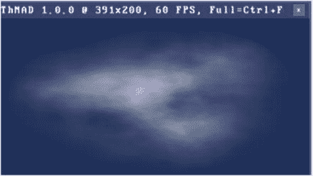

图 5-46。

Perlin noise blobs

## 摘要

本章包含了一系列教程(或故事),涵盖了 ThMAD 的许多方面并展示了它的功能。您学习了几种 3D 技术，包括变换、特殊的图形渲染模式和一个非常特殊的模块`ocean`。本章还介绍了纹理和斑点。

虽然这一章或多或少地集中在基本概念和技术上，但第 6 章是更高级的故事的集合。

Footnotes [1](#Fn1_source)

按住 Ctrl 键。单击包含子管道模块的矩形的左上角，按住鼠标键，并将光标移动到合适的右下角。然后释放鼠标和 Ctrl 键。