# 6.故事:高级水平

在这一章中，我们将通过涵盖各个方面的更详细的演练来深入音频可视化的艺术。我们不可能描述所有可能的草图，但本章的目的是为你提供技巧，这些技巧最终会使你意识到自己的想法。这些部分没有特定的顺序，所以你可以按顺序阅读它们或者交叉阅读它们——只要最适合你。

## 反馈纹理

纹理可以被描述为存储在图形硬件上的 2D 有序颜色集。它们可以被自由地剪切、拉伸、旋转、平移或以其他方式变换，并在最终步骤中呈现为输出屏幕的自由形状多边形的集合。

你甚至可以更进一步，把纹理颜色误用到你能想到的任何东西上，因为在图形硬件本身上运行的着色器程序中，我们可以在每个纹理坐标上用这些四色值做很多事情。考虑到这一点，聪明的人很容易意识到纹理的使用场景不仅仅涵盖了图片在 3D 对象上的跨越。

ThMAD 提供了非常强大和通用的能力，将渲染数据反馈到渲染管道的早期阶段。这是可能的，因为图像数据可以被复制到纹理中，并且该纹理可以用于需要纹理作为输入的模块。允许这种反馈的模块称为纹理→缓冲区→渲染 _ 表面 _ 单一。有关该模块的技术说明，请参见第 [8](8.html) 章。

### 二维模糊

模糊使可视化看起来更花哨，更有趣。这里的目的不是让物体变得不清晰，而是给它们带来一些光亮，或者创造一些特殊的效果。

Note

此处显示的各种状态是在`TheArtOfAudioVisualization`文件夹中的`A-6.1.1_Blurring_*`下可用的资源。

现在，我们坚持将纹理颜色值视为颜色，并希望使用这种反馈技术来实现模糊效果。

注意:反馈以帧速率发生，这意味着每秒 60 次。这使得使用反馈的状态对参数极其敏感。其中一些微小的变化可能会显示出巨大的效果，或者它可能会导致无聊或黑色或白色的屏幕，而你是一个失望的用户，需要几个小时的重新调整才能让任何有意义的东西再次出现。出于这个原因，我尽量小心地解释所有需要的东西，以帮助你获得一个令人满意的，如果不是一个好的或非常好的体验。当然，试验参数的变化最终会让您感受到这种脆弱性，但根据经验，您可以使这种变化发生的规模至少比您以前在 ThMAD 中看到的规模小十分之一。

我们首先在屏幕上呈现一个旋转的矩形。为此，请打开一块干净的画布。如果还没有空的话，右击一个空的点，然后选择 New → Empty Project。然后选择另存为....后者是为了确保您不会无意中覆盖以前的工作。然后在屏幕上选择渲染器→基本→彩色 _ 矩形。参数见表 [6-1](#Tab1) 。

Table 6-1.

<colgroup><col> <col> <col> <col></colgroup> 
| 渲染器→基本→彩色 _ 矩形 |
| --- |
|   | 空间/大小 | 0.77, 0.11, 0.0 |   |
|   | 颜色 | 0.2, 0.4, 0.9, 1 | 第四个值是`ALPHA`值，或不透明度。这里，是 1.0。当`ALPHA`小于 1.0 时，其他一些值需要调整以获得明显的模糊效果。除了随意选择。 |

通过选择渲染器→ opengl_modifiers → gl_rotate 将模块放置在其旁边。将其连接到`colored_rectangle`模块。

通过选择数学→振荡器→振荡器将模块放在它旁边。将振荡器的`float`锚与`gl_rotate`的`angle`锚连接。正确的参数见表 [6-2](#Tab2) 。

Table 6-2.

<colgroup><col> <col> <col></colgroup> 
| 数学→振荡器→振荡器 |
| --- |
|   | osc/ freq | Zero point one |

在它旁边放置一个模块渲染器→ opengl_modifiers → blend_mode。连接`blend_mode`模块和`gl_rotate`模块。参数见表 [6-3](#Tab3) 。

Table 6-3.

<colgroup><col> <col> <col></colgroup> 
| 渲染器→OpenGL _ 修改器→混合模式 |
| --- |
|   | 来源 _ 混合 | S7-1200 可编程控制器 |
|   | 目标 _ 混合 | 一个 |

振荡器和混合模式模块是这本书的新内容。虽然你可以在第 8 章[中找到技术细节，但这里还是有必要提几件事。振荡器花费一个振荡浮点值，我们在这里使用它来改变所画矩形的角度。这一点很重要，因为这样才能真正看到模糊效果在起作用。虽然模糊也适用于静态对象，但对于移动对象，效果会明显得多。然而，更重要的是混合模式模块。我们需要它来混合或混合来自矩形模块的原始像素数据，以及来自模糊子管道的反馈，我们很快会描述和添加。如果你选择了错误的混合模式，你会看到错误的东西，或者可能什么都没有。我们刚才说的为什么选择`SRC_ALPHA`和`ONE`，稍后会解释。现在，我们继续状态描述。](8.html)

将 blend_mode 模块与屏幕模块连接。现在你应该看到旋转的矩形，如图 [6-1](#Fig1) 所示。

图 6-1。

Blurring rectangle part I

接下来，我们从反馈渲染器开始。为此，将模块网格→实体→网格 _ 网格放置在画布上。这将允许您稍后将反馈纹理投影到一个平面矩形网格上。为什么我们在这里使用网格而不是简单的矩形，是因为网格会提供更有趣的失真效果。稍后会详细介绍。参数见表 [6-4](#Tab4) 。

1.  在它旁边放置模块 Mesh→texture→Mesh _ tex _ sequ _ distort，将它们连接起来。这将允许我们稍后添加失真。现在，让参数保持原样。
2.  在其旁边，放置模块渲染器→网格→网格 _ 基本 _ 渲染，并将输出锚点从`mesh_tex_sequ_- distort`连接到其输入锚点`mesh_in`。这个模块负责渲染`mesh_grid`网格。将其所有参数保留为默认值。
3.  在它旁边，放置模块渲染器→ opengl_modifiers → gl_scale_one，并将其连接到`mesh_basic_render`的输出。这引入了缩放，这实际上是非常重要的。对于模糊，有必要使渲染图形的尺寸和反馈图形的尺寸紧密匹配。这里我们需要缩放比例为 2.0，设置在`scale`锚点。见表 [6-5](#Tab5) 。因子 2 来自于`colored_- rectangle`模块和纹理坐标空间范围之间的差异，前者绘制成 2 x 2 大小的矩形，后者读取 1 x 1。表 6-5。

    <colgroup><col><col><col></colgroup>
    | 渲染器→OpenGL _ 修改器→GL _ scale _ one |
    | --- |
    |  | 规模 | 两个 |

4.  Connect the output anchor of `gl_scale_one` to the input anchor `render_in` of the `blend_mode` module . See Figure [6-2](#Fig2).

    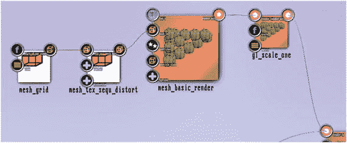

    图 6-2。

    Blurring rectangle part II  
5.  这就是我们引入反馈模块的地方。它被称为纹理→缓冲区→渲染 _ 表面 _ 单一，并允许将图形数据发送到纹理，而不是屏幕输出。在内部，两个纹理被用来复制 OpenGL 的双缓冲行为。后者意味着 OpenGL 渲染发生在一个隐藏的像素数据缓冲区中，只有在所有内容都被渲染后，才会快速复制到物理屏幕上。这是为了避免闪烁。将模块放在靠近`blend_mode`的地方，从`blend_mode`模块的输出到`render_- surface_single`模块的`render_in`输入锚点画第二个连接。
6.  相当多的模块允许它们的输出被多路复用——在这种情况下，我们将来自`blend_mode`的输出渲染到屏幕和纹理缓冲区。确保`options`复合锚的`support_feedback`子锚设置为“是”。见表 [6-6](#Tab6) 。表 6-6。T24】是T56】如果不是全零,背景将不会保持黑色 T58T60】

    <colgroup><col><col><col><col></colgroup>
    | 纹理→缓冲区→渲染 _ 表面 _ 单一 |
    | --- |
    |  | 选项/支持 _ 反馈 |  |
    | T32】选项/纹理 _ 大小 | 视口 _ 尺寸 |  |
    | T42】选项/支持 _ 反馈 T44】是 T46】这对反馈工作很重要 |
    |  | 选项/清除 _ 颜色 | 0，0，0，0 |

7.  在 render_surface_single 之后，放置纹理→效果→高光模糊模块，将两者连接起来。设置`highblur`的锚，如表 [6-7](#Tab7) 所示。表 6-7。00.5，

    <colgroup><col><col><col><col></colgroup>
    | 纹理→效果→高模糊【T13 |
    | --- |
    |  | 翻译 | 0.43，-0.65， | 引入了平移模糊,像风一样 |
    | T30】放大 _ 中心 | 0.5， | 从哪里开始爆炸 |
    |  | 膨胀率 | 八十 | 吹离率 |
    |  | 衰减 | 两百 | 讲述了模糊衰减的速率 |
    |  | 纹理 _ 大小 | 视口 _ 尺寸 |  |

    关于这个模块的更多细节可以在第 [8](8.html) 章中找到。

Table 6-4.

<colgroup><col> <col> <col></colgroup> 
| 网格→实体→网格 _ 栅格 |
| --- |
|   | 飞机 | 正常男性染色体组型 |

画一条从`highblur`的`texture_out`锚到`mesh_basic_- render`的`tex_a`输入锚的连线。反馈在这个阶段实际上已经完成，但是有一件重要的事情值得一提:那就是数据进入模块`blend_mode`的顺序。渲染矩形的数据首先到达混合模式模块，然后是反馈数据，这是绝对必要的。否则，不会产生模糊效果。为确保顺序正确，双击`blend_` `mode`的输入锚点，如果顺序错误，则通过点击并拖动其中一个锚点来更改顺序。见图 [6-3](#Fig3) 。

图 6-3。

Blurring rectangle part III Checking and fixing the blend order. The `gl_rotate` comes from the rectangle’s renderer, the `gl_scale_one` from the backfeed renderer. The input anchor of `blend_mode` has been opened via double-click and the order of the connections can be changed via clicking and dragging on one of the anchors. Caution

当存在到图形(呈现器)的几个传入连接时，输入顺序可能是关键的，因为顺序只有在双击锚之后才可见。因此，当您的管道没有按预期工作时，请记住这一点。

图 6-4。

Blurring rectangle part IV. Final output

如果一切设置正确，旋转矩形将被模糊，如图 [6-4](#Fig4) 所示。完整状态如图 [6-5](#Fig5) 所示。

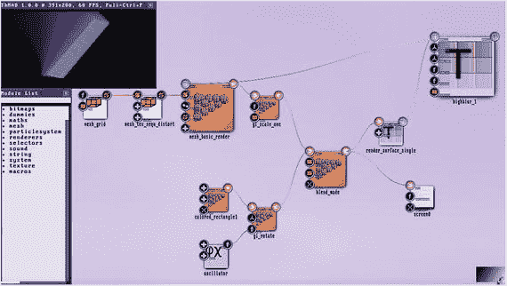

图 6-5。

Blurring rectangle complete state

我告诉过你模块`blend_mode`中设置的混合模式很重要。在第 [8](8.html) 章的参考资料中给出了包括所有锚点在内的该模块的简明描述，但这里已经给出了解释。`dest_blend`锚告诉我们当前在像素缓冲区中看到了什么，由于矩形的主要渲染器是输入顺序中的第一个，`dest_blend`描述了输入的实心和未模糊的矩形。这里设置的值`ONE`仅仅意味着它不变地进入混合。第二个，`source_blend`，连接到已经存在的东西上绘制的东西，我们在这里将其设置为`ONE`，这意味着我们只是覆盖它们。由于该定义的源来自模糊子管道，我们将首先绘制未模糊的数据，并在其上覆盖模糊的数据。请注意，在某些情况下，所涉及的颜色值和混合模式(包括排序)都会根据您的实际草图而发生变化。

为了显示与矩形相比更有趣的东西的模糊效果，也为了查看如何通过纹理扭曲来调整它，进行如下操作:

1.  从`colored_rectangle`切断连接:右键点击连接线，选择断开。或者删除`colored_rectangle`，右键选中，然后按键盘上的 DEL 键。
2.  添加纹理→粒子→斑点模块，并设置其参数，如表 [6-8](#Tab8) 所示。表 6-8。T11】纹理→粒子→斑点

    <colgroup><col><col><col><col></colgroup>
    | T19】设置/武器 | 五 |  |
    |  | 设置/ | 七 |  |
    |  | 衰减 |  |  |
    |  | 设置/星星 _ 花 |  |  |
    |  | 零点四设置/颜色 | 0.4，0.7，0.1，1.0 | 任何你喜欢的颜色,但不要太亮,以免过度饱和 |
    |  | 大小 | VIEWPORT _ SIZE |  |

3.  Add the module Renderers → basic → textured_rectangle and connect it to the blob. For its parameters, see Table [6-9](#Tab9).

    表 6-9。

    Table 6-9.

    <colgroup><col> <col> <col></colgroup> 
    | 渲染器→基本→纹理矩形 |
    | --- |
    |   | 空间/大小 | Zero point six |
    |   | 颜色/全局 _alpha | Zero point nine five |

4.  Connect the `textured_`rectangle to the input of blend_mode. Again make sure the gl_rotate module’s connection to it is above the gl_scale_one module’s connection; see Figure [6-3](#Fig3). The output will now look like Figure [6-6](#Fig6). Let’s make that even more interesting via some dynamics to the blurring direction. To accomplish that, follow these steps:

    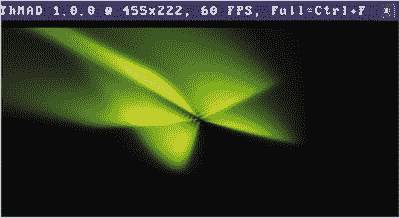

    图 6-6。

    Blurring star part I  
5.  将模块 Maths→converters→3 float _ to _ float 3 靠近`highblur`。将其输出连接到锚点`translation`。
6.  Place another Maths → oscillators → oscillator next to it. Remember, we already have one for the rotation module. Inside the second oscillator, set the parameters as shown in Table [6-10](#Tab10). Table 6-10.

    <colgroup><col> <col> <col></colgroup> 
    | 数学→振荡器→振荡器 |
    | --- |
    |   | osc / freq | One |
    |   | osc / amp | Zero point two five |

    Connect it to both the `floata` and `floatb` input anchors of `3float_to_float3`. You should now have the blurring periodically changing its direction, as shown in Figure [6-7](#Fig7). As a last step, we add a distortion to the blurring:

    

    图 6-7。

    Blurring star part II  
7.  将`gl_rotate`附近的振荡器的`osc_type`副锚改为“SAW”。由于振荡器内部时间值从 0.0 变为 1.0，而`gl_rotate`的“角度”输入锚点被解释为将 1.0 映射到一个完整的旋转，所以锯的形状实际上似乎创建了一个永无止境的旋转。见表 [6-11](#Tab11) 。表 6-11。T15T17T19】靠近 GL _ rotateT37T39】

    <colgroup><col><col><col></colgroup>
    | 数学→振荡器→振荡器 |
    | --- |
    | T25】OSC/freq | 零点一 |
    |  | OSC/类型 | 看见 |

8.  将 blob 的`arms`输入锚点更改为 6.0，以改善对称化。见表 [6-12](#Tab12) 。表 6-12。

    <colgroup><col><col><col><col></colgroup>
    | 纹理→粒子→斑点【T13 |
    | --- |
    |  | 设置/武器 | 六 |  |
    |  | 设置/ | 七 |  |
    |  | 衰减 |  |  |
    |  | 设置/星星 _ 花 |  |  |
    |  | 零点四设置/颜色 | 0.4，0.7，0.1，1.0 | 任何你喜欢的颜色,但不要太亮,以免过度饱和 |
    |  | 大小 | 视口 _ 尺寸 |  |

9.  Open the “distortion” complex anchor of module `mesh_sequ_` `distort` . Open both sub-anchors `u_shape` and `v_shape` via double-click and add some value anchors inside the sequence editors: Shift-click on the line and afterward click and drag the value anchors, such as shown in Figure [6-8](#Fig8). See also Chapter [7](7.html).

    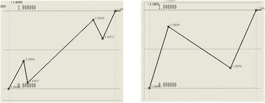

    图 6-8。

    Blurring star part III. Blurring distortion  

所有这些的结果可能看起来如图 6-9 所示。改变模块的锚值可能会产生许多其他有趣的效果。可能性本质上是无穷无尽的，所以继续下去，随心所欲地发挥价值。当然，您也可以轻松地添加声音输入。只需实例化`input_visualization_listener`并使用它的输出锚点来控制你可能想到的任何东西。

图 6-9。

Blurring star part IV. Blurred distortion output

刚刚显示的变形的一个很好的变体包括用网格→纹理→网格 _ 纹理 _ 位图 _ 变形替换`mesh_tex_sequ_distort`模块，用额外的模块位图→加载器→ png_bitm_load 从`[HOME]/thmad/[VERSION]/data/resources`文件夹加载任何 png 文件。见图 [6-10](#Fig10) 和 [6-11](#Fig11) 。您也可以让声音输入控制失真率。

图 6-11。

Blurring distortion by bitmap, output

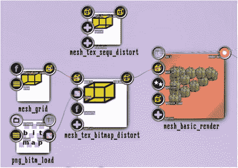

图 6-10。

Blurring distortion by bitmap, state changes Note

`A-6.1.1_Blurring_Star_E`在`TheArtOfAudioVisualization`文件夹里面。

### 自相似性

自相似性在自然和艺术中都是极其重要的特征。至于自然，化学和生物过程受其影响，在艺术中你会发现它无处不在——在绘画、建筑、音乐、诗歌、摄影和设计中。

自相似到底是什么意思？它是在不同层次的分析中出现的相同或相似种类和形状的结构的出现。例如，看一棵树。从远处看，可以看到躯干和一个不确定的头部。走近一点，或者看得更深一点，我们可以看到主干的主要分支。更近一点，更深一层，我们可以看到从主要分支分出的较小分支。继续这个过程，我们最终可以看到叶子从最小的分支中分出来。所以一棵树天生表现出自相似性；另见图 [6-12](#Fig12) 。或者看一片雪花，有不同层次的分支。

图 6-12。

Self-similarity in trees

两者都有人工对应物。树木有着悠久的历史，毕达哥拉斯通过简单的构造规则构建了一棵分形树，只需将两个较小的四边形以固定的角度添加到给定的四边形中，并重复这一过程；见图 [6-13](#Fig13)

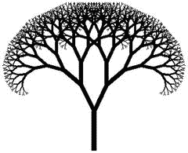

图 6-13。

A Pythagoras tree Each segment spreads into two segments of 75% the size of the basis segment, each at 50 degrees.

科赫曲线给出了一个人造雪花，它只是简单地将一条线切割成三个相等的部分，并用三角形的两条边代替中间的部分。对于结果行，这是永久重复的。见图 [6-14](#Fig14)

至于 ThMAD，我们有两个应用自相似概念的选择。首先，我们可以获取帧缓冲区的内容，即屏幕上显示的内容，并将其反馈到渲染管道的某个早期阶段。其次，我们可以让一些渲染器使用分形算法来完成它的工作。作为一个正确的后续，在我们反馈以实现模糊效果的地方，我们现在将集中于产生自相似性的反馈。另一个，算法自相似，本书不会涉及。

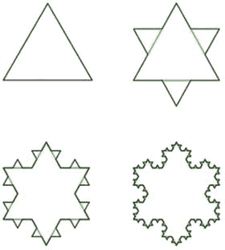

图 6-14。

The KOCH curve , an artificial snowflake

我们从一个基本的自相似管道开始，然后继续把它变得更好。保存任何以前的工作后，通过右键单击并选择 New → Empty Project 来清理画布。然后立即用一个新名字保存它，以确保它不会弄乱你保存的文件。现在将以下模块放在画布上:

*   位图→生成器→斑点
*   纹理→加载器→位图 2 纹理
*   渲染器→基本→纹理矩形
*   渲染器→OpenGL _ 修改器→混合模式

将它们和`blend_mode`连接到屏幕。见图 [6-15](#Fig15) 。在模块内部，按照表 [6-13](#Tab13) 至 [6-16](#Tab16) 中所述设置参数。

Table 6-16.

<colgroup><col> <col> <col> <col></colgroup> 
| 输出→屏幕→屏幕 0 |
| --- |
|   | 透明 _ 颜色 | 0, 0, 0, 0 | 避免任何清理 |

表 6-15。

Table 6-15.

<colgroup><col> <col> <col> <col></colgroup> 
| 渲染器→OpenGL _ 修改器→混合模式 |
| --- |
|   | 来源 _ 混合 | S7-1200 可编程控制器 | 传入像素根据其 ALPHA 值显示 |
|   | 目标 _ 混合 | 一减一增 | 现有像素被引入像素的(1-ALPHA)减少 |

Table 6-14.

<colgroup><col> <col> <col> <col></colgroup> 
| 渲染器→基本→纹理矩形 |
| --- |
|   | 空间/位置 | -0.4; 0.27; Zero | 如果你还不习惯滚动条控制器，设置负数似乎是棘手的。解决方案是降低 |
|   |   |   | 第二行旋钮中的旋钮值，然后更改滑块。第一个旋钮是范围，第二个旋钮是偏移量。 |
|   | 空间/大小 | Zero point six |   |

表 6-13。

Table 6-13.

<colgroup><col> <col> <col></colgroup> 
| 位图→生成器→斑点 |
| --- |
|   | 设置/武器 | five |
|   | 设置/衰减 | Two |
|   | 设置/ alpha | 是 |
|   | 大小 | 512x512 |

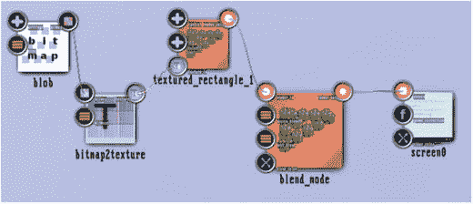

图 6-15。

Self-similarity main generator pipeline , blender and output

现在，您应该会在输出屏幕的左上角看到一颗星星；见图 [6-16](#Fig16) 现在对于反哺子管道，把模块放在画布上，画出它们之间的连接；见图 [6-17](#Fig17) 。

图 6-17。

Self-Similarity backfeeding pipeline

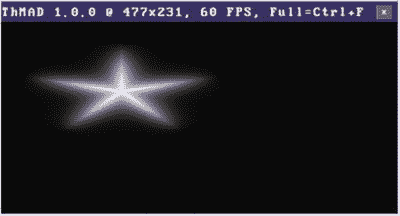

图 6-16。

Self-Similarity main generator pipeline, output

*   网格→实体→网格 _ 栅格
*   渲染器→网格→网格 _ 基本 _ 渲染
*   纹理→缓冲区→渲染 _ 表面 _ 单一

如表 [6-17](#Tab17) 和 [6-18](#Tab18) 所示设置参数。

Table 6-18.

<colgroup><col> <col> <col> <col></colgroup> 
| 纹理→缓冲区→渲染 _ 表面 _ 单一 |
| --- |
|   | 选项/纹理 _ 大小 | 512x512 |   |
|   | 选项/支持 _ 反馈 | 是 | 没有“是”，反馈就不会起作用。 |
|   | 选项/ alpha_channel | 是 |   |
|   | 选项/清除 _ 颜色 | 0, 0, 0, 1 | 胖黑。为了清晰起见，使反馈纹理可见。稍后，我们可以将 ALPHA 更改为 0 来迷惑输出，如下所示。 |

Table 6-17.

<colgroup><col> <col> <col> <col></colgroup> 
| 网格→实体→网格 _ 栅格 |
| --- |
|   | 飞机 | 正常男性染色体组型 | 我们需要“xy”代表 2D 国家。 |

为了合并两个子管道，从`blend_mode`的输出到`render_surface_single`的`render_in`锚绘制一个连接，并且从`mesh_basic_render`的输出到`blend_mode`的`render_in`锚绘制另一个连接。双击后一个锚点，并确保发生器管道位于反馈管道的顶部。如果不是这样，请将它们中的任何一个垂直拖到正确的位置。见图 [6-18](#Fig18) 。

图 6-18。

Combining main rendering and backfeeding pipeline

您现在应该会看到如图 [6-19](#Fig19) 所示的输出。这个结果明显表现出自相似性:用一个因子、∙、∙等放大图片，再现原图。我来给你详细解释一下发生了什么。主渲染管道构建一个星形，并将其放在屏幕的左上角。其位置和大小由`textured_rectangle`模块的设置决定。`blend_mode`模块将其与反馈子管道的结果混合在一起，反馈子管道还为空，并将整体输出发送到屏幕和`render_- surface_single`模块。后者将屏幕存储在图形硬件的纹理存储器中。在下一帧中，`mesh_basic_render`模块将这个存储的纹理投射到由`mesh_grid module`定义的平面网格上，这次它向`blend_mode`提供第二个输入。因为`mesh_grid`模块在坐标范围(-0.5；-0.5)到(+0.5；+0.5)，而屏幕输出的范围从(-1；-1)到(+1；+1)反馈图像的大小是输入图像的一半。`blend_mode`现在有两个非零输入，并输出被反馈图像覆盖的原始图像。该过程的下一帧将产生另一个尺寸为 1/4 th 的克隆帧，以及在该帧之后尺寸为 1/16 th 的克隆帧，以此类推。

图 6-19。

Self-Similarity basic state output

如果你想消除星星周围的黑色矩形，我们把它留在这里是为了让事情更清楚；将`render_surface_single`模块的`clear_color`锚的`ALPHA`值设置为 0.0 即可；参见表 [6-19](#Tab19) 。

Table 6-19.

<colgroup><col> <col> <col></colgroup> 
| 纹理→缓冲区→渲染 _ 表面 _ 单一 |
| --- |
|   | 选项/清除 _ 颜色 | 0, 0, 0, 0 |

记住，在 ThMAD 中，`ALPHA`值总是第四个颜色值。将它清零将有效地防止模块每次在绘制内部纹理缓冲区的内容之前清除它的区域。

为了改变这个比例因子，同时也考虑到反馈图像的转换，我们在`mesh_grid`和`mesh_basic_render`模块之间增加了两个模块网格→修改器→变形器→网格缩放网格→修改器→变形器→网格转换。我们可以在以后使用它们来改变自相似阶段的整体特征。

我们目前的状态如图 [6-20](#Fig20) 所示。将它保存为您自己的状态，因为您可以使用它作为许多不同实验的基础。

图 6-20。

Self-similarity basic state Note

在`TheArtOfAudioVisualization`文件夹内的`A-6.1.2_Backfeeding_Basic`下也有反馈基本状态。

现在为了让事情变得更有趣一点，我们将使用类似于科赫曲线的算法来构建一个状态；见图 [6-14](#Fig14) 它使用与刚才介绍的反馈相同的原理，但有一些不同，如果我们从头开始，会更加清晰。最终我们将有三个子管道，我们从第一个开始。

Note

在`TheArtOfAudioVisualization`文件夹内的`A-6.1.2_Backfeeding`下也有以下状态。

对于第一个子管道，将以下模块放在空白画布上:

*   网格→生成器→功能区
*   渲染器→网格→网格 _ 基本 _ 渲染
*   渲染器→OpenGL _ 修改器→ gl_color
*   渲染器→OpenGL _ 修改器→混合模式
*   渲染器→ opengl_modifiers → gl_translate

按顺序将它们连接起来，并将`gl_translate`连接到屏幕上；见图 [6-21](#Fig21) 。注意`mesh_basic_render`有两个网格输入锚点——使用名为`mesh_in`的那个。

图 6-21。

Fancy Koch curve , pipeline I

我们使用`ribbon`模块作为绘图的基础，因为它引入了一些形状糖，并且随着时间移动。参数如表 [6-20](#Tab20) 至 [6-24](#Tab24) 所示。

Table 6-24.

<colgroup><col> <col> <col> <col></colgroup> 
| 渲染器→ opengl_modifiers → gl_translate |
| --- |
|   | 翻译 | 0, 0.3, 0.0 | 只需将混合输出移动到屏幕中央。 |

Table 6-23.

<colgroup><col> <col> <col></colgroup> 
| 渲染器→OpenGL _ 修改器→混合模式 |
| --- |
|   | 来源 _ 混合 | S7-1200 可编程控制器 |
|   | 目标 _ 混合 | 一个 |

表 6-22。

Table 6-22.

<colgroup><col> <col> <col> <col></colgroup> 
| 渲染器→OpenGL _ 修改器→ gl_color |
| --- |
|   | 颜色 | 任何的 | 任何你喜欢的颜色。 |

Table 6-21.

<colgroup><col> <col> <col> <col></colgroup> 
| 渲染器→网格→网格 _ 基本 _ 渲染 |
| --- |
|   | 选项/顶点颜色 | 不 | 我们提供自己的颜色，所以这里设置为“否” |
|   | 选项/使用显示列表 | 不 |   |
|   | 选项/使用顶点颜色 | 不 | 我们提供自己的颜色，所以这里设置为“否” |
|   | 选项/粒子 _ 大小 _ 中心 | 不 |   |
|   | 选项/粒子大小颜色 | 不 |   |
|   | 选项/ ignore_uvs_in_vbo_updates | 不 |   |

Table 6-20.

<colgroup><col> <col> <col></colgroup> 
| 网格→生成器→功能区 |
| --- |
|   | 空间/起点 | -0.7, -0.5, 0 |
|   | 空间/终点 | 0.7, -0.5, 0 |
|   | 空间/上方向矢量 | 0.8, 0.8, 0.9 |
|   | 形状/宽度 | Zero point one |
|   | 形状/倾斜 _amp | Four |
|   | 形状/时间 _ 安培 | One point five |
|   | 形状/分段计数 | Sixty |

这应该产生基本的飘动带；见图 [6-22](#Fig22)

图 6-22。

Fancy Koch curve , pipeline I output

`gl_color`模块定义色带的颜色。无论如何,`ribbon`模块不会这样做，我们告诉`mesh_basic_render`也不要这样做。

二号子管道由模块组成:

*   纹理→缓冲区→渲染 _ 表面 _ 单一
*   纹理→修改器→ scale_one
*   纹理→修改器→旋转
*   渲染器→基本→纹理矩形

`render_surface_single`为反馈基准前的状态。连接见图 [6-23](#Fig23) 。

图 6-23。

Fancy Koch curve , pipeline II

这些模块的参数如表 [6-25](#Tab25) 至 [6-28](#Tab28) 所示。

Table 6-28.

<colgroup><col> <col></colgroup> 
| 渲染器→基本→纹理矩形 |
| --- |
|   | 保持所有锚点的默认值 |

Table 6-27.

<colgroup><col> <col> <col> <col></colgroup> 
| 纹理→修改器→旋转 |
| --- |
|   | 旋转角度 | Zero point one five | 环形交叉路口 1/6 第个整圈，因此为 60° |
|   | 旋转 _ 轴 | 0, 0, 1 | 在 x-y 平面上旋转 |
|   | 中心/使用 _ 旋转 _ 中心 | 是 | 使用下面的中心 |
|   | 居中/旋转 _ 居中 | 0.66, 0.25, 0 | Makes for the figure |

表 6-26。

Table 6-26.

<colgroup><col> <col> <col> <col></colgroup> 
| 纹理→修改器→ scale_one |
| --- |
|   | 规模 | Three | 对于原始科赫曲线，按比例缩小 1/3 rd 。 |
|   | 中心/使用比例中心 | 是 | 使用下面的中心 |
|   | 居中/缩放 _ 居中 | 0.5, 0.25, 0 | 在功能区中心缩放 |

Table 6-25.

<colgroup><col> <col> <col> <col></colgroup> 
| 纹理→缓冲区→渲染 _ 表面 _ 单一 |
| --- |
|   | 选项/纹理 _ 大小 | 1024x1024 |   |
|   | 选项/支持 _ 反馈 | 是 | 强制反馈到工作中 |
|   | 选项/ alpha_channel | 是 |   |
|   | 选项/清除 _ 颜色 | 0, 0, 0, 0 |   |

对于第三个子管道，克隆第二个管道中的所有模块——对于每个模块，在按住 Ctrl+Alt 的同时单击并拖动。以与子管道 II 相同的方式连接子管道 III 的模块。见图 [6-24](#Fig24)

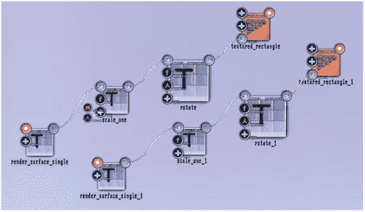

图 6-24。

Fancy Koch curve , pipeline II + III

只改变三号管线的旋转模块为读数，如表 [6-29](#Tab29) 所示。

Table 6-29.

<colgroup><col> <col> <col> <col></colgroup> 
| 纹理→修改器→旋转 |
| --- |
|   | 旋转角度 | Zero point one five | 环形交叉路口 1/6 第个完整的旋转，因此为 60。请注意该标志与管道 II 的不同之处 |
|   | 旋转 _ 轴 | 0, 0, 1 | 在 x-y 平面上旋转 |
|   | 中心/使用 _ 旋转 _ 中心 | 是 | 使用下面的中心 |
|   | 居中/旋转 _ 居中 | 0.33, 0.25, 0 | Makes for the figure |

将`blend_mode`的输出连接到管线 II 和 III 的`render_- surface_single`模块。连接模块`textured_- rectangle`的二号和三号管线输出锚。将输入连接的顺序更改为`blend_mode`,使管线 I 优先；见图 [6-25](#Fig25) 。

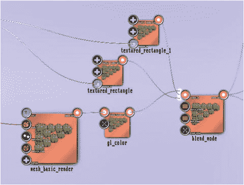

图 6-25。

Fancy Koch curve, blend_mode input order

输出现在应该如图 [6-26](#Fig26) 所示。这是一个正确的科赫曲线与原来的映射算法，只是为丝带，而不是线。这看起来还不是非常有趣，但是我们可以很容易地让它看起来更有吸引力。只需将表 [6-30](#Tab30) 中显示的锚值更改为 [6-33](#Tab33) 。

Table 6-32.

<colgroup><col> <col> <col> <col></colgroup> 
| 纹理→修改器→ scale_one |
| --- |
| 管道三 |
|   | 规模 | One point two | 把它变大。 |

Table 6-31.

<colgroup><col> <col></colgroup> 
| 纹理→修改器→旋转 |
| --- |
| 管道二 |
|   | 不用换，但是可以玩玩。 |

Table 6-30.

<colgroup><col> <col> <col> <col></colgroup> 
| 纹理→修改器→ scale_one |
| --- |
| 管道二 |
|   | 规模 | Two point two | 让它变大 |

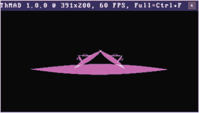

图 6-26。

Fancy Koch curve , output The `skew_amp` of module ribbon is temporarily reduced to 0.0 to make things clearer. Table 6-33.

<colgroup><col> <col> <col> <col></colgroup> 
| 纹理→修改器→旋转 |
| --- |
| 管道三 |
|   | 旋转角度 | -0.12 | 稍微改变一下角度 |
|   | 居中/旋转 _ 居中 | 0.37, 0.25, 0 | 有点改变 |

改变后的状态的输出现在看起来更加奇特；见图 [6-27](#Fig27) 图 [6-28](#Fig28) 描绘了鸟瞰图的完整状态。

图 6-28。

Fancy Koch curve , complete state

图 6-27。

Altered fancy Koch curve , output Just a snapshot; all the ribbons are fluttering.

您可以随意使用锚点值，并通过声音输入来连接它们。

Caution

由于反馈，很容易发生输出屏幕完全填满白色的情况。当反馈的图像数据缩小时，这种情况通常不会发生，但是如果您在处理这些值时发生了这种情况，则可能需要恢复更改、保存状态并重新启动 ThMAD 以再次获得一些有意义的输出。或者在`blend_mode`模块内临时将混合模式更改为零/零，然后恢复。

## 粒子系统

粒子系统有两件事:

*   物体的多样性
*   物理运动定律和碰撞规则

由于 ThMAD 不允许类似循环结构的东西，粒子系统的多重性是多次生成对象的唯一方式。此外，粒子系统可能遵守物理规则，如重力、风或刚性墙的反弹。ThMAD 通过图 [6-29](#Fig29) 所示的方法允许粒子系统具有这些特性。

发射器持续创建粒子，我们有以下发射器类型:

图 6-29。

Particle system methodology

*   喷雾发射器。不断地在空间的某一点产生粒子。
*   位图发射器。将位图的每个像素(无论是定义的前景还是背景)转化为与位图像素具有相同颜色的单个粒子。
*   网状发射器。类似于喷雾发射器，但使用网格的每个顶点作为可能的源点。

修改器将规则应用于现有粒子。这包括以下操作:

*   施加重力。
*   施加风。
*   放置一面墙，让粒子停止运动或反弹回来。
*   在粒子之间应用类似流体的相互作用。
*   应用粒子大小调整。

渲染器将粒子系统转化为可渲染对象。只有在渲染器之后，粒子才是图形对象——在此之前，它们只是数字的集合。ThMAD 以下列方式之一进行渲染:

*   简单渲染。使用纹理将粒子转化为图形对象。通过定义:尺寸在每个粒子的生命周期中如何演变，颜色在每个粒子的生命周期中如何演变，增加了我们在修改步骤中的可能性。尽管它的名字很简单，但它实际上非常强大，你可以使用着色器程序来控制渲染操作。
*   中央渲染。这是一种特殊的效果变体，其中斑点的一侧被夹在中心点。
*   带状渲染。另一个特效变体，粒子被转换成三维移动的丝带。
*   扩展渲染器。使用纹理的渲染器，大小和颜色寿命定义，如果您想要自定义着色器语言控制。
*   火花渲染器。允许相互接近的粒子相互作用，产生火花。

在本节的其余部分，我们将创建几个粒子系统示例。

### 瀑布

瀑布是粒子系统的一个很好的候选。很多物体落下来，遵循重力和风的物理规律，最终落在瀑布的地面上。

Note

本小节中的示例是在`TheArtOfAudioVisualization`文件夹中的`A-6.2.1_Particlesystems_Waterfall*`下提供的源。

为了模拟瀑布，我们将以下模块放在一块空白画布上。要创建一个项目，请右键单击，然后选择“新建”→“清空项目”:

*   渲染器→OpenGL _ 修改器→摄影机→动态观察 _ 摄影机
*   渲染器→OpenGL _ 修改器→灯光 _ 方向
*   渲染器→OpenGL _ 修改器→材质 _ 参数
*   渲染器→OpenGL _ 修改器→深度 _ 缓冲区
*   渲染器→OpenGL _ 修改器→背面 _ 剔除
*   渲染器→OpenGL _ 修改器→混合模式

将它们全部连接起来，并将摄像机连接到屏幕模块；见图 [6-30](#Fig30) 为这些模块调整以下参数。见表 [6-34](#Tab34) 至 [6-37](#Tab37) 。

Table 6-37.

<colgroup><col> <col> <col></colgroup> 
| 渲染器→OpenGL _ 修改器→背面 _ 剔除 |
| --- |
|   | 状态 | 使能够 |

Table 6-36.

<colgroup><col> <col> <col></colgroup> 
| 渲染器→OpenGL _ 修改器→深度 _ 缓冲区 |
| --- |
|   | 深度测试 | 使能够 |
|   | 深度 _ 遮罩 | 使能够 |

Table 6-35.

<colgroup><col> <col> <col></colgroup> 
| 渲染器→OpenGL _ 修改器→材质 _ 参数 |
| --- |
|   | 环境反射率 | 0.2; 0.2; 0.2; One |
|   | 漫反射率 | 0; 0; 1; one |
|   | 镜面反射 | 0.96; 0.82; 0.82; One |
|   | 发射强度 | 0; 0; 0; one |
|   | 镜面指数 | Five |

Table 6-34.

<colgroup><col> <col> <col></colgroup> 
| 渲染器→OpenGL _ 修改器→灯光 _ 方向 |
| --- |
|   | 使能够 | 是 |
|   | 位置 | 0.29; 0.29; Zero point one two |
|   | 环境颜色 | 0; 0; 0; one |
|   | 漫射 _ 颜色 | 0.67; 0.69; 0.95; One |
|   | 镜面反射颜色 | 0.16; 0.79; 0.92; One |

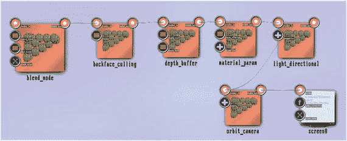

图 6-30。

Waterfall, basic 3D setup

两个模块`depth_test`和`backface_culling`在这里并不太重要，因为我们只处理小粒子。为了特效或者以后玩玩，我们还是加了。

现在，为粒子系统子管道添加以下模块:

*   纹理→粒子→斑点
*   渲染器→粒子系统→简单
*   粒子系统→修改器→地板
*   粒子系统→修改器→基本风变形器
*   粒子系统→修改器→尺寸倍增
*   粒子系统→修改器→基本重力
*   粒子系统→发生器→基本 _ 喷射 _ 发射器

如图 [6-31](#Fig31) 所示连接。

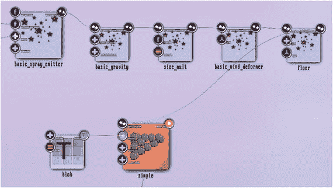

图 6-31。

Waterfall, particle system sub-pipeline

对于这些参数，如表 [6-38](#Tab38) 至 [6-42](#Tab42) 所示进行调整。

Table 6-42.

<colgroup><col> <col> <col> <col></colgroup> 
| 粒子系统→发生器→基本 _ 喷射 _ 发射器 |
| --- |
|   | 粒子数 | ten thousand | 要使用的粒子数。保持不变，即使修改器或渲染器说粒子必须死亡。在这种情况下，它只是重新初始化。 |
|   | 每秒粒子数 | Two thousand | 后来被声音控制。限制每秒初始化或重新初始化的粒子数。如果足够小，一些死粒子将在一段时间内保持不被重新初始化。设置为-1 将禁用该限制。 |
|   | 空间/发射器位置 | 0; 1; Zero | 粒子诞生或重新初始化的地方。 |
|   | 空间/速度/速度 x | One | 后来由声音输入控制。出生或重新初始化时粒子速度的 x 向扩散。 |
|   | 空间/速度/ | Zero point four five |   |
|   | 速度 _y |   |   |
|   | 空间/速度/速度 z | Zero point zero seven |   |
|   | 空间/速度类型 | 随机平衡 | 如何分配速度？此处的值从`[-speed_x;` `+speed_x]`中选择一个随机数作为 x 值。其他轴也类似。 |
|   | 空间/大小/粒子大小基础 | Zero point zero three | 粒子的基本尺寸 |
|   | 空间/大小/粒子大小随机权重 | Zero point zero one | 尺寸随机化的数量 |
|   | 外观/颜色 | 1; 1; 1; one | 不用的 |
|   | 外观/时间/粒子 _ 寿命 _ 基础 | Three point four eight | 粒子的基本寿命(秒)。如果超过，粒子将保持未定义状态，直到重新初始化。 |
|   | 外观/时间/粒子 _ 寿命 _ 随机 _ 重量 | One | 终生随机化的数量 |

Table 6-41.

<colgroup><col> <col> <col> <col></colgroup> 
| 粒子系统→修改器→基本重力 |
| --- |
|   | 基本参数/中心 | 0; -1.5; Zero | 重心 |
|   | 基本参数/金额 | 0; 0.079; Zero | 仅沿 y 轴的重力 |
|   | 基本参数/摩擦 | 0.6; 0.6; One point eight | 如果这个不为零，粒子将不会无休止地加速，而是被怀疑有摩擦。 |

Table 6-40.

<colgroup><col> <col> <col> <col></colgroup> 
| 粒子系统→修改器→尺寸倍增 |
| --- |
|   | 力量 | Zero point seven one | 让粒子变小一点 |

Table 6-39.

<colgroup><col> <col> <col> <col></colgroup> 
| 粒子系统→修改器→基本风变形器 |
| --- |
|   | 风 | 0.22; 0.0; Zero | 有些风吹向+x |

Table 6-38.

<colgroup><col> <col> <col> <col></colgroup> 
| 粒子系统→修改器→地板 |
| --- |
|   | 轴/y/y _ 楼层 | 是 | 启用 x-z 平面地板 |
|   | 轴/ y / y_bounce | 是 | 让粒子在地板上反弹 |
|   | 轴/ y / y_loss | Eighty-five | 反弹前粒子损失的百分比。如果我们把这个数字设得太小，粒子的行为更像橡皮球，而不是水。 |
|   | 轴/折射 | 是 | 水的行为不像刚性的球，而是在碰到地板时向四面八方扩散 |
|   | 轴/折射 _ 数量 | 100; 10; Zero | 折射量-水主要平行于地板传播 |
|   | 地面 | 0; -0.97; Zero | 地板的位置 |

将这个子管道连接到基本的 3D 渲染管道:使用来自`simple`模块的锚`render_out`和来自`blend_mode`模块的`render_in`。这将产生一个瀑布；见图 [6-32](#Fig32) 。

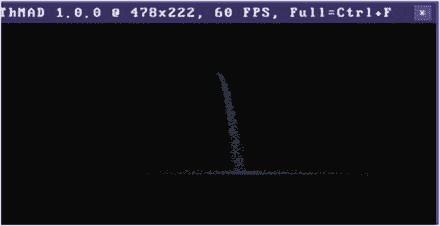

图 6-32。

Waterfall, no sound control

我们想增加一些声音控制。为此，添加以下模块:

*   数学→限制器→浮动 _ 箝位
*   数学→算术→三进制→浮点数→乘法 _ 加法，两次
*   声音→输入 _ 可视化 _ 听众

如图 [6-33](#Fig33) 所示连接。应用表 [6-43](#Tab43) 至 [6-45](#Tab45) 中所示的参数。

Table 6-44.

<colgroup><col> <col> <col> <col> <col> <col> <col> <col></colgroup> 
| 数学乘法 _ 加法 | →中 | 算术 | →中 | 第三的 | →中 | 漂浮物 | →中 |
| --- | --- | --- | --- | --- | --- | --- | --- |
| 连接到 float_clamp 的那个。 |   |   |   |   |   |   |   |
|   | first_mult | One thousand |
|   | 然后 _ 添加 | One thousand |

Table 6-43.

<colgroup><col> <col> <col></colgroup> 
| 数学→限制器→浮动 _ 箝位 |
| --- |
| 确保我们每秒生成/重新初始化 1000 到 5000 个粒子 |
|   | 低的 | One thousand |
|   | 高的 | Five thousand |

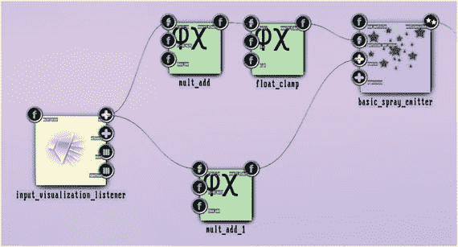

图 6-33。

Waterfall, sound control The lower `mult_add` is connected to the `speed_x` anchor of the `basic_spray_emitter`. Both `mult_add` modules are connected to any of the `vu` sub-anchors of `sound_visualization_listener`. Table 6-45.

<colgroup><col> <col> <col></colgroup> 
| 数学→算术→三进制→浮点数→乘法 _ 加法 |
| --- |
| 另一个，连接到 basic_spray_emitter 的锚“x_speed”。 |
|   | first_mult | Zero point four |
|   | 然后 _ 添加 | Zero point one three |

添加声音输入，结果将是一个瀑布，根据音量的大小，它的质量更大，宽度更宽。见图 [6-34](#Fig34) 。

图 6-34。

Waterfall, sound controlled, output

到目前为止，瀑布看起来可能是由谷物而不是水组成的。为了提高与自然水的相似性，作为我们刚刚生成的一个变体，我们添加了一个模糊效果。

模糊是指混合渲染图片的新旧实例。在本章前面，我们已经学习了如何在二维空间中做到这一点。与我们在那里使用的方法相比，这里选择了一个更简单的方法，纹理→效果→模糊模块。我们只在相机完成工作后使用模糊，这感觉像 3D 中的模糊。这是因为 3D 中的真实模糊不是一个选项，因为我们的纹理只能处理二维。但在相机之后，我们内部有一个二维投影，所以我们可以利用二维模糊。我们需要三个模糊模块:

*   渲染器→基本→纹理矩形
*   纹理→效果→模糊
*   纹理→缓冲区→渲染 _ 表面 _ 单一

插入相机和屏幕之间，如图 [6-35](#Fig35) 所示。应用表 [6-46](#Tab46) 至 [6-48](#Tab48) 中所示的参数。

Table 6-48.

<colgroup><col> <col> <col> <col></colgroup> 
| 纹理→缓冲区→渲染 _ 表面 _ 单一 |
| --- |
|   | 纹理 _ 大小 | 1024x1024 | 您可以使用较小的尺寸来增强模糊效果 |

Table 6-47.

<colgroup><col> <col> <col> <col></colgroup> 
| 纹理→效果→模糊 |
| --- |
|   | 开始值 | Two point two | 混合原始图片和旧图片时应用于纹理坐标的偏移 |
|   | 衰减 | One point two two | 混合效率 |
|   | 纹理 _ 大小 | 1024x1024 | 您可以使用较小的尺寸来增强模糊效果 |
|   | 经过 | 二 | 与“一”相比，增强模糊效果 |

Table 6-46.

<colgroup><col> <col></colgroup> 
| 渲染器→基本→纹理矩形 |
| --- |
|   | 保留所有参数的默认值 |

图 6-35。

Waterfall, blurred

模糊的瀑布看起来会像图 [6-36](#Fig36) 。

图 6-36。

Waterfall, blurred, output

作为一个副作用，这个模糊的瀑布看起来更加巨大，而没有增加使用的粒子数量。

### 图像比特粒子

ThMAD 包含一个模块 particle system→generators→bitmap 2 particle system，您可以使用它让一个粒子系统由位图的颜色像素生成。我们将在这里提供一个样本。

Note

本小节中的示例是在`TheArtOfAudioVisualization`文件夹中的`A-6.2.2_*`下提供的源。

从一个空状态开始，像往常一样，你可以通过右键点击新建→空项目来创建一个。首先放置与本章开头所述相同的基本 3D 模块，如图 [6-30](#Fig30) 所示，但使用表 [6-49](#Tab49) 至 [6-54](#Tab54) 所示的参数。

Table 6-54.

<colgroup><col> <col> <col></colgroup> 
| 渲染器→ opengl_modifiers →混合 _ 模式 |
| --- |
|   | 来源 _ 混合 | 一个 |
|   | 目标 _ 混合 | 一减一增 |

Table 6-53.

<colgroup><col> <col> <col></colgroup> 
| 渲染器→OpenGL _ 修改器→背面 _ 剔除 |
| --- |
|   | 状态 | 使能够 |

Table 6-52.

<colgroup><col> <col> <col></colgroup> 
| 渲染器→OpenGL _ 修改器→深度 _ 缓冲区 |
| --- |
|   | 深度测试 | 使能够 |
|   | 深度 _ 遮罩 | 使能够 |

Table 6-51.

<colgroup><col> <col></colgroup> 
| 渲染器→OpenGL _ 修改器→材质 _ 参数 |
| --- |
|   | 值在这里并不重要，着色是由着色器代码完成的，见下文 |

Table 6-50.

<colgroup><col> <col></colgroup> 
| 渲染器→OpenGL _ 修改器→灯光 _ 方向 |
| --- |
|   | 值在这里并不重要，着色是由着色器代码完成的，见下文 |

Table 6-49.

<colgroup><col> <col> <col></colgroup> 
| 渲染器→OpenGL _ 修改器→摄影机→动态观察 _ 摄影机 |
| --- |
|   | 循环 | -0.03; 0.99; -0.11 |
|   | 距离 | Zero point seven two |
|   | 视角 _ 正确 | 是 |

现在为粒子系统子管道添加以下模块:

*   渲染器→粒子系统→渲染粒子着色器
*   纹理→粒子→斑点
*   粒子系统→修改器→基本风变形器
*   粒子系统→生成器→位图到粒子系统
*   位图→加载器→ png_bitm_load

如图 [6-37](#Fig37) 所示连接。这将从位图像素创建粒子，然后应用风。从表 [6-55](#Tab55) 到表 [6-59](#Tab59) 中设置参数值。

Table 6-59.

<colgroup><col> <col> <col> <col></colgroup> 
| 位图→加载器→ → png_bitm_load |
| --- |
|   | 文件名 | 任何的 | 选择尺寸不大于 256x256 的 PNG 文件，以免硬件负担过重。 |

Table 6-58.

<colgroup><col> <col> <col> <col></colgroup> 
| 粒子系统→生成器→位图到粒子系统 |
| --- |
|   | 每秒粒子数 | ten thousand | 每秒可能从位图中产生的粒子数 |
|   | 空间/位图 _ 大小 | One |   |
|   | 空间/位图 _ 法线 | 0; 1; Zero | 定义空间方向。这里我们将位图定义为存在于 x-z 平面中。 |
|   | 空间/位图 _ 上矢量 | 1; 0; Zero | 以法向量为轴定义角度。 |
|   | 空间/位图 _ 位置 | 0; 0; -0.25 | 位图在空间中的位置。 |
|   | 空间/速度/速度 x | Zero | 我们让粒子在创造后立即休息。因此，只有风力模块会移动它们。 |
|   | 空间/速度/速度 _y | Zero |   |
|   | 空间/速度/速度 z | Zero |   |
|   | 空间/尺寸/ | Zero point one | 粒子的大小。 |
|   | 颗粒尺寸基础 |   |   |
|   | 空间/大小/粒子大小随机权重 | Zero point zero one | 对粒子大小的随机贡献。 |
|   | 外观/时间/粒子 _ 寿命 _ 基础 | One point one six | 粒子在死亡和/或需要重新初始化之前存在的秒数。 |
|   | 外观/时间/粒子 _ 寿命 _ 随机 _ 重量 | One | 对粒子寿命的随机贡献。 |

Table 6-57.

<colgroup><col> <col> <col> <col></colgroup> 
| 粒子系统→修改器→基本风变形器 |
| --- |
|   | 风 | 0; 0; Zero | 我们稍后将连接到声音输入，见下文 |

Table 6-56.

<colgroup><col> <col> <col> <col></colgroup> 
| 纹理→粒子→ |
| --- |
| 一滴 |
|   | 设置/ alpha | 是 |   |
|   | 大小 | 8x8 | 由于粒子很小，我们可以使用小纹理 |

Table 6-55.

<colgroup><col> <col> <col> <col></colgroup> 
| 渲染器→粒子系统→渲染粒子着色器 |
| --- |
| 你可以通过编写自定义的着色器程序来制作非常有趣的东西。对于我们目前的目的，我们只是使用默认提供的纹理程序。 |
|   | 着色器参数/顶点程序 | 保留默认值 | 着色器管线的顶点着色器部分。默认程序将负责空间定位和获取粒子颜色。 |
|   | 着色器 _ 参数/片段 _ 程序 | 保留默认值 | 着色器管线的片段着色器部分。默认程序将使用与纹理`ALPHA`混合的粒子颜色，并丢弃纹理颜色。 |

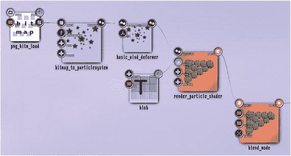

图 6-37。

Bitmap particle system

PNG 文件必须位于`/home/[USER]/thmad/ [VERSION]/data/resources`中。

你现在已经可以看到粒子系统了——因为粒子还没有移动，你的图像看起来模糊地飘来飘去。这来自于创造和死亡机制，以及在这两者之间的自动尺寸变化。见图 [6-39](#Fig39)

要引入声音控制，请在画布上放置以下附加模块:

*   数学→转换器→3 浮点到浮点 3
*   数学→插值→浮点 _ 平滑
*   音频→输入 _ 可视化 _ 监听器

如图 [6-38](#Fig38) 所示连接它们。应用以下参数，如表 [6-60](#Tab60) 至 [6-62](#Tab62) 所示。

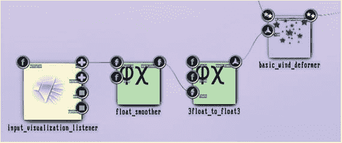

图 6-38。

Bitmap particle system, sound control The float_smoother is connected to the `vu / vu_l` anchor of the listener. Table 6-60.

<colgroup><col> <col> <col> <col></colgroup> 
| 数学→转换器→3 浮点到浮点 3 |
| --- |
|   | 漂浮物 | Zero | 风的 x 值 |
|   | 漂浮物 | Zero | 风的 y 值 |
|   | 漂浮物 | - | 连接到声音监听器 |

Table 6-61.

<colgroup><col> <col> <col> <col></colgroup> 
| 数学→插值→浮点 _ 平滑 |
| --- |
|   | 评价 | - | 连接到声音监听器 |
|   | 速度 | Five | 较低的值意味着更加平滑 |

Table 6-62.

<colgroup><col> <col> <col> <col></colgroup> 
| 声音→输入 _ 可视化 _ 听众 |
| --- |
|   | 乘数 | Zero point three eight | 音量倍增器，根据你的需要改变。 |
|   | 视图/视图 _l | - | 作为输出连接到上面的平滑器 |

播放一些音乐，你会看到位图粒子被吹走，如图 [6-39](#Fig39) 所示。

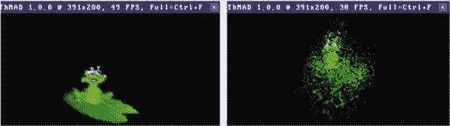

图 6-39。

Bitmap particle system , output without sound input

### 中心箝位粒子系统

一个有点不现实但令人印象深刻的结果，提供了一个粒子系统的变体，让我们使用模块渲染器→粒子系统→渲染 _ 粒子 _ 中心。

它的基本作用是将纹理中的两个点夹在一个中心点上。我们将在这里提供一个例子，但是与一步一步地解释相反，我要求您参考随安装提供的源代码。本节只是从一个鸟瞰的角度来解释它，并指出重要的设置。

Note

本小节中的示例是在`TheArtOfAudioVisualization`文件夹中的`A-6.2.3_Particlesystems_Center*`下提供的源。

将`A-5.5.3_Particlesystems_Center_Blur`状态加载到 Artiste 中，你会看到如图 [6-40](#Fig40) 所示。

图 6-40。

Centered particle system, full state

标有(1)的部分是通常的 3D 渲染管道。但是`backface_culling`和`depth_buffer`都是禁用的；否则，纹理背景会与我们不想要的其他纹理重叠。灯光打开，全白，素材参数也全白，加上`ALPHA`通道连接到声音输入，所以音量增大，画面会更强烈。

部分(2)指明了我们将看到的一组物体。声源是同心圆，在这种情况下，我们添加一个由声音输入控制的绕 y 轴的旋转。

部分(3)是另一组不同颜色的同心夹紧圆，这次我们使用声音输入来控制它们的速度。

第(4)部分处理模糊效果。如果我们不使用模糊，粒子被固定在原点并且寿命有限的事实会引入一些不必要的紧张。这个效果是由`highblur`模块实现的，它使用了反馈，在本章的另一个故事中也会介绍。你可以使用这个子管道的参数，一个非常重要的参数是选择的混合模式。这里设置的选择值是`ONE` / `ONE`，这意味着图像、原始图像和反馈图像被绘制在另一个之上。为了产生预期的结果，锚`color/global_alpha`，这里是 0.89，是至关重要的，这个值的微小变化会产生结果的巨大变化。

结果如图 [6-41](#Fig41) 所示，紫色光线组根据声音低音旋转，黄色光线组随着音量增大而改变其作用。

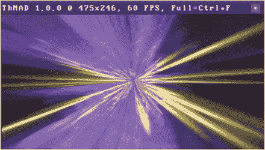

图 6-41。

Centered particle system, output

### 带状粒子

模块渲染器→particle systems→render _ particle _ ribbon 沿着在空间中移动的丝带发送粒子，并由类似于重力的运动法则驱动。

它可以用于有趣的视觉效果，我们想在这里提供一个例子。我们将着眼于安装 ThMAD 后的最终状态，并解释重要的构建模块，而不是介绍一步一步的指导手册。

Note

该子部分的状态是在`TheArtOfAudioVisualization`文件夹中的`A-6.2.4_Particlesystems_Ribbon`下可用的源。

状态如图 [6-42](#Fig42) 所示，主要零件高亮显示。

*   部分(1)是典型的 3D 子管道；然而，当`depth_buffer`模块被禁用时。你也可以试试`backface_culling`被禁用时会发生什么。灯光和材质都有三种灯光成分:环境光、漫射光和镜面光。光将通过部分(4)围绕场景旋转，至于它的环境光强度将由声音输入控制。
*   第 2 部分定义了粒子系统及其渲染器。渲染器本身没有能力将纹理分配给渲染过程，但是通过添加模块 Texture → opengl → texture_bind，我们仍然可以实现这一点。这里我们分配了一个`blob`模块，这将产生一个类似管子的带子。一些声音输入已经连接到这里的色带宽度。
*   部分(3)定义了一个恒定的主旋转，这将赋予场景深度。振荡器被设置为“saw”模式，当我们希望以恒定的角速度旋转时，我们经常使用这种模式。
*   Part (4) controls the rotation of the light source. It does so by combining two rotation quaternions using the `quat_mul` module. A quaternion internally consists of four numbers completely defining a rotation axis and a rotation angle, and by quaternion multiplication we have the exact counterpart of two subsequent rotations around two different axes with two different angles. The light position needs a vector (x, y, z) and if we use the module `float3_rotate_by_quat`, starting from any position like (0,0,1) and using the aforementioned combined quaternion, the outcome will be a rotated variant of (0,0,1). Using the two oscillators in “saw” and “sine” mode, but with some sound input added to the angle of one of them, we will have a steady rotation plus some modulation with a small reactiveness to sound input. The latter is done by additively accumulating sound volume and the result to the `phase` anchor of one of the quaternion rotation oscillators.

    

    图 6-42。

    Particle system rendered along a ribbon

输出将是一个旋转的飞溅管世界，如图 [6-43](#Fig43) 所示。

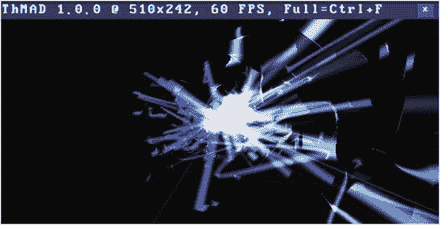

图 6-43。

Particle system rendered along a ribbon, output

## 发光的物体

通过在原始对象上叠加模糊版本，对象可以获得闪亮的光晕。作为示例，将以下模块放置在画布上，并如图 [6-44](#Fig44) 所示连接它们。

*   渲染器→OpenGL _ 修改器→混合模式
*   渲染器→OpenGL _ 修改器→摄影机→动态观察 _ 摄影机
*   渲染器→OpenGL _ 修改器→灯光 _ 方向
*   渲染器→OpenGL _ 修改器→深度 _ 缓冲区
*   渲染器→OpenGL _ 修改器→背面 _ 剔除
*   渲染器→OpenGL _ 修改器→材质 _ 参数
*   渲染器→网格→网格 _ 基本 _ 渲染
*   网格→实体→网格 _ 长方体

Note

该子部分的状态是在`TheArtOfAudioVisualization`文件夹中的`A-6.3_Glowing_Objects*`下可用的资源。

图 6-44。

Objects with glow, basic state

设置表 [6-63](#Tab63) 至 [6-68](#Tab68) 中的参数。

Table 6-68.

<colgroup><col> <col></colgroup> 
| 渲染器→网格→网格 _ 基本 _ 渲染 |
| --- |
|   | 保留所有值的默认值 |

Table 6-67.

<colgroup><col> <col> <col></colgroup> 
| 渲染器→OpenGL _ 修改器→材质 _ 参数 |
| --- |
|   | 环境反射率 | 0.2; 0.2; 0.2; One |
|   | 漫反射率 | 0.95; 0.76; 0.35; One |
|   | 镜面反射 | 0.95; 0.87; 0.87; One |
|   | 发射强度 | 0; 0; 0; one |
|   | 镜面指数 | Thirteen |

Table 6-66.

<colgroup><col> <col> <col></colgroup> 
| 渲染器→OpenGL _ 修改器→背面 _ 剔除 |
| --- |
|   | 状态 | 使能够 |

Table 6-65.

<colgroup><col> <col> <col></colgroup> 
| 渲染器→OpenGL _ 修改器→深度 _ 缓冲区 |
| --- |
|   | 深度测试 | 使能够 |
|   | 深度 _ 遮罩 | 使能够 |

Table 6-64.

<colgroup><col> <col> <col></colgroup> 
| 渲染器→OpenGL _ 修改器→灯光 _ 方向 |
| --- |
| 白光 |
|   | 使能够 | 是 |
|   | 位置 | 0.57; 0.25; Zero point seven eight |
|   | 环境颜色 | 0; 0; 0; one |
|   | 漫射 _ 颜色 | 1; 1; 1; one |
|   | 镜面反射颜色 | 1; 1; 1; one |

Table 6-63.

<colgroup><col> <col> <col></colgroup> 
| 渲染器→OpenGL _ 修改器→摄影机→动态观察 _ 摄影机 |
| --- |
|   | 循环 | 0.52; 0.05; Zero point eight five |
|   | 距离 | Three point five |
|   | 视野 | Thirty |
|   | 视角 _ 正确 | 是 |

输出将是如图 [6-45](#Fig45) 所示的盒子。现在将以下模块添加到场景中:

*   渲染器→基本→纹理矩形
*   纹理→效果→模糊
*   纹理→缓冲区→渲染 _ 表面 _ 单一

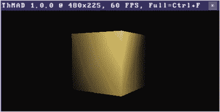

图 6-45。

Objects with glow, basic state, output

如图 [6-46](#Fig46) 所示连接并插入。注意`blend_mode`的输入锚点的顺序很重要。您通常看不到它，但要检查和修复它，双击锚并将其放在小的子锚上以改变顺序；见图 [6-47](#Fig47) 。

图 6-47。

Objects with glow , blend input order

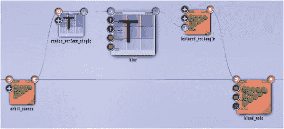

图 6-46。

Objects with glow, glowing addition

设置添加的模块参数，见表 [6-69](#Tab69) 至 [6-71](#Tab71) 。

Table 6-71.

<colgroup><col> <col> <col> <col></colgroup> 
| 纹理→缓冲区→渲染 _ 表面 _ 单一 |
| --- |
|   | `texture_size` | `VIEWPORT_SIZE` | 这很重要，因为原始对象和模糊对象的位置和大小必须匹配。 |

Table 6-70.

<colgroup><col> <col> <col> <col></colgroup> 
| 纹理→效果→模糊 |
| --- |
|   | 开始值 | Twelve | 控制发光的大小。玩玩它，把它改成 |
|   |   |   | 20 或 30 年，看看会发生什么。 |
|   | 衰减 | One point one five | 控制光晕的衰减速率。玩玩它，把`start_value`改成 30，把这个值改成 2.0，看看会发生什么。使用高值会产生类似漫画的效果。 |
|   | 纹理 _ 大小 | 视口 _ sizes 和 | 这很重要，因为原始对象和模糊对象的位置和大小必须匹配。 |
|   | 经过 | 二 | 用两个代替一个会增加光晕效果。 |

Table 6-69.

<colgroup><col> <col> <col> <col></colgroup> 
| 渲染器→基本→纹理矩形 |
| --- |
|   | 大小 | One point zero zero seven | 1.0 也行，加少量会增加光晕效果 |

光晕效果的输出可以在图 [6-48](#Fig48) 中看到。按照参数表中的解释，放大发光参数后，输出将如图 [6-49](#Fig49) 所示。

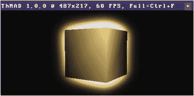

图 6-49。

Objects with glow , output for a different set of parameters The parameter `start_value` of glow is set to 20.0 and the anchor `attenuation` is set to 1.6.

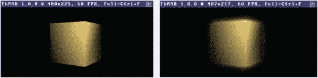

图 6-48。

Objects with glow, output The left image shows the original output without the glow.

## 摘要

这一章包含了一系列的高级教程，或者故事，涵盖了 ThMAD 的更多方面并展示了它的能力。第 [7](7.html) 和 [8](8.html) 章包含了 ThMAD 艺人和 ThMAD 玩家的 GUI 参考。