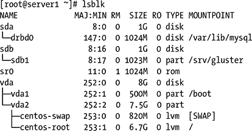

第五章


管理分区和逻辑卷

要使用文件，您需要存储它们。在大多数情况下，您需要在这样做之前创建一个逻辑存储单元。创建这样的存储单元可以更容易地灵活配置您的硬盘。在 Linux 中，您可以在这些逻辑存储单元中选择两个:分区和逻辑卷。如果您想轻松地工作，并且对如何使用硬盘没有特别的需求，请选择分区。但是，如果您需要最大的灵活性和容易的大小调整，使用逻辑卷是一个更好的解决方案。在本章中，您将了解如何创建分区和逻辑卷，如何在分区上创建文件系统，以及如何管理该文件系统。

寻址存储设备

到目前为止，您已经了解了如何根据设备名称寻址设备，例如`/dev/sda`和`/dev/vda` 。但是这些设备名有一个问题:它们不能保证是唯一的。这是因为通常设备名是在内核发现一个新设备已经连接到系统时确定的。下面的例子解释了这个问题。

假设您的计算机当前有一个本地硬盘作为唯一的存储设备。这个硬盘的名字很可能是`/dev/sda`。假设你有两个 u 盘，一个 1GB 的 u 盘和一个 80GB 的 USB 硬盘。假设您首先将 1GB 的 USB 密钥连接到您的计算机。计算机会给它一个设备名`/dev/sdb`，因为设备是按顺序命名的。如果之后你连接 80GB 的 USB 硬盘，它就变成了`/dev/sdc`。现在想象你做相反的事情，首先连接 80GB 的硬盘。你大概能猜到发生了什么——它变成了`/dev/sdb`,而不是之前的`/dev/sdc`。因此，您不能确保这些设备名称总是唯一的。

为了保证设备名称的唯一性，有两种解决方案。用`mkfs`创建文件系统时，可以在文件系统中放一个标签。您还可以使用在`/dev/disk`目录中自动创建的唯一设备名称。接下来的两个部分给出了更多的细节。

文件系统标签

总是以相同方式引用设备的最古老方法是添加一个*文件系统标签*。该标签存储在文件系统中，而不是元数据中。使用文件系统标签对挂载设备很有用，因为`mount`命令会检查标签。但是，在需要处理设备本身而不是其中的文件系统的情况下，您不能依赖它。

通常，您会在格式化文件系统时向其添加标签。例如，要向 Ext4 文件系统添加标签，可以使用以下命令:

```sh
mkfs.ext4 -L mylabel /dev/sda2
```

在大多数文件系统中，您还可以为现有的文件系统设置标签。在 Ext 文件系统上，您可以使用`tune2fs`实用程序来完成这项工作:

```sh
tune2fs -L mylabel /dev/sda2
```

本章后面将详细介绍这些命令的用法。

一旦设置了文件系统标签，您就可以在装载设备时使用它。只需将设备名称替换为`LABEL=` *标签名称*即可。例如，以下命令将挂载标签为`mylabel`的文件系统:

```sh
mount LABEL=mylabel /mnt
```

`udev`设备名称

文件系统标签很有用，但仅在需要对设备上的文件系统进行寻址的情况下有用。如果你需要解决设备本身，他们不会这样做。现代 Linux 发行版有一个替代方案。这种替代方案是由`udev`进程创建的，它在所有现代 Linux 发行版上都是自动启动的。`udev`是检测硬件总线上设备变化的进程，负责创建设备名称。它不仅创建设备名`/dev/sdb`等，而且还为每个存储设备在目录中创建一个唯一的设备名`/dev/disk`。在[清单 5-1](#FPar1) 中，你可以看到这些设备名称的例子。

[***清单 5-1***](#_FPar1) 。`udev`为所有存储设备创建唯一的设备名称

```sh
xen:~ # ls -Rl /dev/disk
/dev/disk:
total 0
drwxr-xr-x 2 root root 280 Jan 13 10:36 by-id
drwxr-xr-x 2 root root 140 Jan 13 10:36 by-path
drwxr-xr-x 2 root root 80 Jan 13 12:16 by-uuid

/dev/disk/by-id:
total 0
lrwxrwxrwx 1 root root 10 Jan 13 10:36 ata--part1 -> ../../sda1
lrwxrwxrwx 1 root root 10 Jan 13 10:36 ata--part2 -> ../../sda2
lrwxrwxrwx 1 root root 10 Jan 13 10:36 ata--part3 -> ../../sda3
lrwxrwxrwx 1 root root 9 Jan 13 10:36 ata-WDC_WD5002ABYS-18B1B0_WD-WMASY5022406
-> ../../sda
lrwxrwxrwx 1 root root 9 Jan 13 10:36 edd-int13_dev80 -> ../../sda
lrwxrwxrwx 1 root root 10 Jan 13 10:36 edd-int13_dev80-part1 -> ../../sda1
lrwxrwxrwx 1 root root 10 Jan 13 10:36 edd-int13_dev80-part2 -> ../../sda2
lrwxrwxrwx 1 root root 10 Jan 13 10:36 edd-int13_dev80-part3 -> ../../sda3
lrwxrwxrwx 1 root root 9 Jan 13 10:36 scsi-SATA_WDC_WD5002ABYS-_WD-WMASY5022406
-> ../../sda
lrwxrwxrwx 1 root root 10 Jan 13 10:36 scsi-SATA_WDC_WD5002ABYS-_WD-WMASY5022406
-part1 -> ../../sda1
lrwxrwxrwx 1 root root 10 Jan 13 10:36 scsi-SATA_WDC_WD5002ABYS-_WD-WMASY5022406
-part2 -> ../../sda2
lrwxrwxrwx 1 root root 10 Jan 13 10:36 scsi-SATA_WDC_WD5002ABYS-_WD-WMASY5022406
-part3 -> ../../sda3

/dev/disk/by-path:
total 0
lrwxrwxrwx 1 root root 9 Jan 13 10:36 pci-0000:00:1f.2-scsi-0:0:0:0 -> ../../sda
lrwxrwxrwx 1 root root 10 Jan 13 10:36 pci-0000:00:1f.2-scsi-0:0:0:0-part1
-> ../../sda1
lrwxrwxrwx 1 root root 10 Jan 13 10:36 pci-0000:00:1f.2-scsi-0:0:0:0-part2
-> ../../sda2
lrwxrwxrwx 1 root root 10 Jan 13 10:36 pci-0000:00:1f.2-scsi-0:0:0:0-part3
-> ../../sda3
lrwxrwxrwx 1 root root 9 Jan 13 10:36 pci-0000:00:1f.2-scsi-0:0:1:0 -> ../../sr0

/dev/disk/by-uuid:
total 0
lrwxrwxrwx 1 root root 10 Jan 13 10:36 4e77311a-ce39-473c-80c4-caf6e53ef0c5
-> ../../dm-0
lrwxrwxrwx 1 root root 10 Jan 13 10:36 cd200dac-4466-4a1f-a713-64e6208b5d6d
-> ../../sda2
```

在[清单 5-1](#FPar1) 中可以看到，`/dev/disk`下面是三个子目录；可能会有更多，这取决于您使用的硬件，以及您到目前为止对磁盘做了什么。这些子目录分别是`by-path, by-id`和`by-uuid`，每个子目录都提供了一种独特的设备寻址方式。`by-path`设备是指设备正在使用的硬件路径。子目录`by-id`中的设备使用设备的唯一硬件 ID，而`by-uuid`中的设备使用分配给设备的通用唯一 ID。如果你想使用一种独立于文件系统的方式来引用一个设备，一种永远不会改变的方式，选择这些设备名中的一个。如有疑问，要找出哪个设备是哪个，可以使用`ls -l`；`udev`设备名称都是符号链接，而`ls -l`向您显示这些链接所指的是什么设备，如您在[清单 5-1](#FPar1) 中所见。

与 UUID 合作

在磁盘设备上创建文件系统时，还会分配一个通用唯一 ID (UUID) 。这种 UUID 提供了另一种方法，允许您引用磁盘设备，并且在存储拓扑结构发生变化时不会受到影响。UUID 是独一无二的，但它有一个缺点，就是很难读懂。要获得当前分配的 UUIDs 的概述，可以使用 **blkid** 命令。[清单 5-2](#FPar2) 显示了这个命令的输出。

[***清单 5-2***](#_FPar2) 。用 blkid 显示 UUIDs

```sh
[root@server1 ~]# blkid
/dev/block/252:2: UUID="SZ4HOM-LSMe-li0R-Nq2d-fgtS-n7rn-zq3trw" TYPE="LVM2_member"
/dev/block/253:1: UUID="55031bda-353a-4151-9851-4bf34d00ce7c" TYPE="xfs"
/dev/block/252:1: UUID="d806f86e-8475-498c-abb8-b5140a5424ee" TYPE="xfs"
/dev/block/253:0: UUID="ff356bed-7a9a-4cae-b5fa-08d0b9e09cbe" TYPE="swap"
/dev/sda: UUID="c4abbe88289c3531" TYPE="drbd"
/dev/sdb1: UUID="7ac0d799-5cca-47c2-ab99-fed34787eaf2" TYPE="xfs"
/dev/drbd0: UUID="1be88a0a-6177-438f-b2bc-4bd2eefce41f" TYPE="xfs"
```

要使用 UUID 装载文件系统，您可以在使用 mount 命令时使用 UUID =“nnnn-nnnn”而不是设备名称。例如，[清单 5-2](#FPar2) 中显示的/dev/sdb1 设备可以使用**mount UUID =**" 7ac0d 799-5cca-47 C2-ab99-fed 34787 EAF 2 "/mnt**挂载。**

即使 UUID 不容易阅读和复制，您也会将它们视为在大多数当前 Linux 发行版上安装设备的默认解决方案。

创建分区

分区是计算机硬盘上的基本构件。作为使用分区的替代方法，您也可以使用逻辑卷来创建计算机的文件系统。但是，即使使用逻辑卷，也应该首先在磁盘设备上创建分区。在这一节中，您将了解关于分区的所有知识。首先，您将看到如何在电脑硬盘上使用分区。接下来，您将学习如何使用最重要的分区管理工具`fdisk`来创建它们。作为本节的最后一部分，您将学习如何恢复丢失的分区。

了解分区

把你电脑中的硬盘比作一个比萨饼。要用它做些什么，你需要在硬盘上有一个文件系统。你可以把文件系统直接放在硬盘上，这就像做意大利香肠披萨一样:所有的成分都是一样的。在 Linux 上，不同的文件系统必须在同一个硬盘上使用，这基本上就像烹饪一个*比萨 quattro stagioni* ，四种不同的比萨合二为一——你不希望所有的东西都混在一起。为了更容易制作这样的比萨饼，你可以考虑把比萨饼切成片。这同样适用于计算机硬盘，但是你将一个驱动器分成*个分区，而不是片。*在这一部分，你将了解到你的电脑从启动的那一刻起是如何使用分区的。

如果你只在你的计算机硬盘上放一个文件系统，就没有必要创建分区。例如，您可以使用 USB 闪存盘来完成这项工作。但是，如果您的计算机中只有一个硬盘，您通常需要在其上创建不同的文件系统。您至少需要一个交换文件系统和一个“普通”文件系统。因此，您需要在硬盘上创建分区。

注意:从技术角度来看，可以直接在磁盘设备上创建文件系统，而无需先创建分区。这是一个非常坏的习惯。其他操作系统——如 Windows——如果没有在分区上创建文件系统，就看不到文件系统被使用。他们只会报告一个没有初始化的磁盘设备，并告诉你它需要初始化——之后你会丢失它上面的所有数据。

了解 MBR 和 GPT 磁盘

长期以来，硬盘一直使用主引导记录(MBR) 来初始化引导程序。在 MBR 中，64 字节的磁盘空间被保留来存储分区。这允许在最大大小为 2tb 的磁盘上创建总共 4 个分区。

几年来，大小超过 2TB 的磁盘变得很常见。这些磁盘不能再用 MBR 寻址。因此，引入了一种新的分区表类型:GUID 分区表(GPT) 。使用 GTP，创建分区的地址空间增加了，最多可以创建 256 个分区。此外，还取消了 2 TB 磁盘大小的限制。在本章的后面你会读到如何使用 GPT 分区。

创建 MBR 分区

当计算机启动时，它会从 BIOS 中标记为主硬盘的硬盘中读取主启动记录(MBR) 。从 MBR 中，它启动引导加载程序，通常是 GRUB2。接下来，它检查分区表(也在 MBR 中),找出它可以使用的文件系统。在 MBR 中，64 字节是为分区保留的。这是每个分区 16 个字节，刚好够存储开始和结束柱面、分区类型和指示分区是否活动的信息。您也可以通过在硬盘上发出命令`fdisk -l`来显示这些信息；例如，`fdisk -l /dev/sda`显示了在硬盘`/dev/sda`上创建的所有分区的列表。[清单 5-3](#FPar3) 显示了这个命令的结果。

[***清单 5-3***](#_FPar3) 。使用`fdisk -l`，您可以显示分区的基本属性

```sh
[root@localhost ~]# fdisk -l /dev/sda

Disk /dev/sda: 8589 MB, 8589934592 bytes, 16777216 sectors
Units = sectors of 1 * 512 = 512 bytes
Sector size (logical/physical): 512 bytes / 512 bytes
I/O size (minimum/optimal): 512 bytes / 512 bytes
Disk label type: dos
Disk identifier: 0x000a9dbd

Device Boot         Start         End      Blocks   Id  System
/dev/sda1   *        2048     1026047      512000   83  Linux
/dev/sda2         1026048    10283007     4628480   8e  Linux LVM
```

活动分区扮演着特殊的角色。引导加载程序将检查它在该分区开始处找到的 512 字节引导扇区，以查明其中是否存储了引导加载程序。对于其他部分，访问一个分区只需要开始和结束柱面。这告诉操作系统的内核它必须在哪里寻找分区中的文件系统。

在 MBR 中分配用于创建分区的 64 个字节中，您只能创建四个分区。这可能还不够，您可以创建这些分区中的一个作为扩展分区。在扩展分区中，您可以创建逻辑分区。这些分区与普通分区的作用相同，只有一个例外:它们不存储在 MBR 中，而是存储在四个主分区的引导扇区中。您最多可以创建 56 个逻辑分区。

每个分区都有特定的分区类型。这种分区类型用于指示在其中找到了什么类型的数据。作为管理员，您应该确保分区类型是正确的，因为一些实用程序依赖于设置的正确分区类型，如果不是这样，它们将拒绝服务。在 Linux 环境中有四种分区类型特别令人感兴趣:

*   *83 (Linux)* :这是原生的 Linux 分区类型。您可以将它用于任何 Linux 文件系统。
*   *82 (Linux 交换)*:对 Linux 交换分区使用这种分区类型。
*   *8e (Linux LVM)* :使用此分区类型来处理 LVM 逻辑卷(请参阅本章后面的“创建逻辑卷”一节)。
*   *5(扩展)*:用于扩展分区。

用`fdisk` 管理分区

在 Linux 上创建分区最常用的工具是`fdisk`，尽管它很古老。`fdisk`提供了一个命令行界面，允许你执行所有你能想到的分区操作。在以下程序描述中，您将了解如何使用`fdisk`。

使用 fdisk 时，您将创建主分区和扩展分区。这是因为主引导记录只有 64 个字节来存储分区，这足以创建 4 个分区。如果您需要超过总共 4 个分区，其中一个分区将被创建为扩展分区。在扩展分区中，您将创建逻辑分区。

创建分区

在这个过程中，您将看到如何用`fdisk`创建分区。此过程假设您正在一个完全可用且不包含任何重要数据的硬盘上工作。如果您想测试这个过程中描述的步骤，我建议使用一个空的 USB 密钥。将它连接到您的计算机后，它在大多数情况下会显示为`/dev/sdb`。

由于弄错创建分区的硬盘驱动器是致命的，所以让我们先来看看如何识别计算机上的哪个驱动器是哪个。如果您刚刚将一个外部介质(如 USB 驱动器)连接到您的计算机上，并且想要找出该介质的设备名称，请使用`dmesg`实用程序 。在[清单 5-4](#FPar4) 中，你可以看到它输出的最后一部分，就在我把一个 u 盘连接到我的电脑上之后。可以看到，内核识别了 USB key，并将其初始化为`/dev/sdc`。

[***清单 5-4***](#_FPar4) 。使用 dmesg，很容易发现内核如何识别您的 USB Key

```sh
usb 1-1: new device found, idVendor=0951, idProduct=1603
usb 1-1: new device strings: Mfr=1, Product=2, SerialNumber=3 usb 1-1: Product: DataTraveler 2.0
usb 1-1: Manufacturer: Kingston
usb 1-1: SerialNumber: 899000000000000000000049
usb 1-1: configuration #1 chosen from 1 choice
scsi2 : SCSI emulation for USB Mass Storage devices
usb-storage: device found at 3
usb-storage: waiting for device to settle before scanning
  Vendor: Kingston Model: DataTraveler 2.0 Rev: 1.00
  Type:   Direct-Access                    ANSI SCSI revision: 02
SCSI device sdc: 15769600 512-byte hdwr sectors (8074 MB)
sdc: Write Protect is off sdc: Mode Sense: 23 00 00 00
sdc: assuming drive cache: write through
SCSI device sdc: 15769600 512-byte hdwr sectors (8074 MB)
sdc: Write Protect is off
sdc: Mode Sense: 23 00 00 00
sdc: assuming drive cache: write through
  sdc: sdc1
sd 2:0:0:0: Attached scsi removable disk sdc
sd 2:0:0:0: Attached scsi generic sg2 type 0
usb-storage: device scan complete
```

将 USB 闪存盘连接到您的系统后，它将连接多个驱动器。有多种方法可以对它们进行概述。如果您使用的是只有`sd`设备而没有`hd`设备(指的是旧的并行 ATA IDE 驱动器)的现代系统，您可以使用`lsscsi`。此命令列出所有正在使用 SCSI 驱动程序的驱动器。这不仅包括 SCSI 驱动器(在最终用户计算机中非常少见)，还包括 SATA 驱动器和 USB 驱动器。[清单 5-5](#FPar5) 给出了该命令结果的概述。

[***清单 5-5***](#_FPar5) 。使用`lsscsi`获得计算机上所有 SCSI、SATA 和 USB 磁盘的概述

```sh
nuuk:~ # lsscsi
[0:0:0:0]   disk    VMware,  VMware Virtual S 1.0     /dev/sda
[0:0:1:0]   disk    VMware,  VMware Virtual S 1.0     /dev/sdb
[2:0:0:0]   disk    Kingston DataTraveler 2.0 1.00    /dev/sdc
```

另一种在你的计算机上显示块设备的方法是使用 **lsblk** 命令T3。此命令提供了计算机上所有可用存储设备的方便概述。[清单 5-6](#FPar6) 给出了该命令输出的概述。

[***清单 5-6***](#_FPar6) 。使用 lsblk 了解可用块设备的概况



此时，您应该能够找出哪个是您计算机硬盘上的哪个。开始配置分区的时间。下一个程序描述了如何使用`fdisk`来完成这项工作。在这个过程中，我将假设您正在一个连接为`/dev/sdb`的 USB 盘上工作。如果需要，用您正在处理的磁盘的实际名称替换/ `dev/sdb`。

1.  Before you start creating partitions, check whether your disk already contains some partitions. To do this, open `fdisk` on the disk by using the `fdisk /dev/sdb` command. Next, type `p` to print the current partition table. This gives you a result such as the one in [Listing 5-7](#FPar7). The error messages are returned because this is a completely empty disk device, on which not even a partition table exists.

    [***清单 5-7***](#_FPar7) 。用 fdisk 显示分区信息

    ```sh
    [root@localhost ~]# fdisk /dev/sdb
    Welcome to fdisk (util-linux 2.23.2).

    Changes will remain in memory only, until you decide to write them.
    Be careful before using the write command.

    Device does not contain a recognized partition table
    Building a new DOS disklabel with disk identifier 0x68b876f1.

    Command (m for help): p

    Disk /dev/sdb: 1073 MB, 1073741824 bytes, 2097152 sectors
    Units = sectors of 1 * 512 = 512 bytes
    Sector size (logical/physical): 512 bytes / 512 bytes
    I/O size (minimum/optimal): 512 bytes / 512 bytes
    Disk label type: dos
    Disk identifier: 0x68b876f1

       Device Boot      Start         End      Blocks   Id  System
    ```

2.  As you can see in [Listing 5-7](#FPar7), no partitions exist yet. To create a new partition, press `n` now. `fdisk` will first ask you what type of partition you want to create. As no partitions exist yet, you can type p to create a primary partition. Next, provide the partition number that you want to create. Since nothing exists yet, type `1` to create the first partition. Now `fdisk` asks for the start sector. By default, the first partition on a new device starts at sector 2048, this leaves place for the first MB on the device to be used for metadata Next, it asks what you want to use as the last sector. You can enter a sector number here, but it is more convenient to enter the size of the partition that you want to create. Start this size with a `+` sign, next specify the amount, and following that use `M` or `G` for megabytes or gigabytes; for instance, entering `+1G` would create a 1GB partition. In [Listing 5-8](#FPar8), you can see the code for this procedure.

    [***清单 5-8***](#_FPar8) 。在 fdisk 中创建新分区

    ```sh
    Command (m for help): n
    Partition type:
       p   primary (0 primary, 0 extended, 4 free)
       e   extended
    Select (default p): p
    Partition number (1-4, default 1): 1
    First sector (2048-2097151, default 2048):
    Using default value 2048
    Last sector, +sectors or +size{K,M,G} (2048-2097151, default 2097151): +500M
    Partition 1 of type Linux and of size 500 MiB is set:
    ```

3.  由于`fdisk`没有显示结果，现在使用`p`命令是个好主意；这将为您提供当前已有分区的概述。
4.  创建完分区后，通常会将分区写入分区表。在此之前，我将首先向您展示如何创建一个内部包含逻辑分区的扩展分区，以及如何更改分区类型。所以在`fdisk`接口仍然打开的情况下，现在键入`n`创建另一个新分区。接下来，键入 e 创建一个扩展分区。您通常会使用扩展分区来用逻辑分区填充剩余的可用磁盘空间；因此，现在可以按两次 Enter 键，将所有剩余的磁盘空间用于扩展分区。
5.  创建扩展分区后，现在可以在其中创建逻辑分区。为此，再次键入`n`开始创建一个新的分区。`fdisk`现在询问您是要创建逻辑分区还是主分区。现在输入`l`作为逻辑分区。接下来，与创建普通分区一样，您需要指定分区的起始扇区和大小。完成后，再次键入`p`查看分区概况。现在您会看到第一个逻辑分区被创建为`/dev/sdb5`，它具有 Linux 分区类型。
6.  In some cases, you have to change the default partition type. Every partition that you create is automatically defined as type 83 (Linux). For instance, if you need to create a swap partition, you have to change this partition type. In most cases, however, the default Linux partition type works well, as you can format any Linux file system on it.

    现在让我们看看如何更改默认的分区类型。为此，在 fdisk 中输入`l`命令来显示所有支持的分区类型的列表。这表明对于 Linux 交换，您必须使用分区类型 82。要应用这种分区类型，现在使用`t`命令。接下来，输入分区号和要在该分区上更改的分区类型。`fdisk`现在会告诉你它已经成功地改变了分区类型(见[清单 5-9](#FPar9) )。

    [***清单 5-9***](#_FPar9) 。在某些情况下，您需要更改分区类型

    ```sh
    Command (m for help): t
    Partition number (1-5): 5
    Hex code (type L to list codes): 82
    Changed system type of partition 5 to 82 (Linux swap / Solaris)

    Command (m for help):
    ```

7.  Once you have made all changes that you want to apply to your partitions, it’s time to write the changes if you are happy with them, or just quit if you are not sure about the parameters you have changed. Before doing anything, use the `p` command again.

    这将向您显示分区表中的当前更改。它们是你想要的吗？

    使用`w`将更改写入磁盘。如果你犯了一个错误，并且不想弄乱你硬盘上的当前分区，使用`q`安全退出。使用`q`时，什么都不会改变，驱动器保持在您开始使用`fdisk`之前的状态。

告诉内核关于新分区的信息

现在，您已经将新的分区表写入 MBR。如果在更改分区参数时更改了正在使用的设备上的分区，您将会看到一条错误消息，指出该设备正忙，您必须重新启动才能应用对分区表所做的更改。这是因为`fdisk`已经更新了分区表，但是默认情况下它不会告诉内核更新后的分区表。您可以在文件`/proc/` `partitions` 中检查这一点，该文件包含内核知道的所有分区的列表(参见[清单 5-10](#FPar10) )。

[***清单 5-10***](#_FPar10) 。文件/proc/partitions 包含内核知道的所有分区的列表

```sh
nuuk:~ # cat /proc/partitions
major minor #blocks name
     8     0     8388608     sda
     8     1      104391     sda1
     8     2     7534485     sda2
     8     3      747022     sda3
     8    16     8388608     sdb
     8    17      987966     sdb1
     8    18           1     sdb2
     8    21     1959898     sdb5
     253   0     4194304     dm-0
     253   1      131072     dm-1
```

如果您更改了分区的设备上安装了分区，`/proc/partitions`文件不会自动更新。幸运的是，有一个命令可以用来强制更新:`partprobe`。发出这个命令告诉内核关于更新的分区，甚至是在您操作分区表时正在使用的设备。

 **注意**`partprobe`实用程序非常适合添加新分区。如果你也删除了分区，效果就不太好了。为了确保您的计算机知道一些分区已经消失，您最好在删除分区后重新启动计算机。

删除分区

如果你知道如何创建一个分区，删除分区并不难。您使用相同的`fdisk`界面，只是命令不同。您应该知道的只有一件事:当删除一个逻辑分区时，您可能会改变其余逻辑分区的顺序。假设删除`/dev/sdb5`后有了分区`/dev/sdb5`和`/dev/sdb6.`，分区`/dev/sdb6`将重新编号为`/dev/sdb5`，所有`/dev/sdb6`之后的分区也将重新编号。这将导致访问剩余分区的问题，所以在删除逻辑分区时要非常小心！幸运的是，这个问题只存在于逻辑分区；分配给主分区或扩展分区的编号永远不会改变。

下一个过程向您展示了如何删除分区。

1.  在想要删除分区的设备上打开`fdisk`；例如，如果您想从`sdb`设备中删除一个分区，可以使用`/dev/sdb`。接下来，使用`p`显示设备上存在的所有分区的列表。
2.  确定要删除的分区的编号，并输入该编号以将其从硬盘中删除。
3.  再次使用`p`命令来验证您已经删除了正确的分区。如果是，使用`w`将更改写入磁盘。如果没有，使用`q`退出而不保存更改。

 **提示**如果你删除了错误的分区，并不一定意味着你的数据全部丢失。只要您没有在这个分区上创建另一个文件系统，就用相同的参数重新创建它—这允许您再次访问那个分区中的数据，而不会有任何问题。

修复分区顺序

在某些情况下，您需要使用一些高级分区选项来更改分区参数。例如，您可能需要更改分区的顺序。通过删除和重新创建逻辑分区，您可能会意外地改变分区顺序。在清单 5-11 中，你可以看到一个发生这种情况的例子。

[***清单 5-11***](#_FPar13) 。偶尔，您会看到像错误的分区顺序这样的问题

```sh
Command (m for help): p

Disk /dev/sdb: 1073 MB, 1073741824 bytes, 2097152 sectors
Units = sectors of 1 * 512 = 512 bytes
Sector size (logical/physical): 512 bytes / 512 bytes
I/O size (minimum/optimal): 512 bytes / 512 bytes
Disk label type: dos
Disk identifier: 0x68b876f1

Device Boot         Start         End      Blocks   Id  System
/dev/sdb1            2048     1026047      512000   83  Linux
/dev/sdb2         1026048     2097151      535552    5  Extended
/dev/sdb5         1234944     1439743      102400   83  Linux
/dev/sdb6         1028096     1234943      103424   83  Linux

Partition table entries are not in disk order
```

分区混乱的事实会严重干扰一些实用程序。因此，这是一个您应该修复的问题。通过它的一些高级选项使这成为可能。以下过程描述了如何解决此问题:

1.  在你要修改分区表的硬盘上启动`fdisk`。
2.  Type **x** to enter `fdisk` expert mode. In this mode, you’ll have access to some advanced options. [Listing 5-12](#FPar14) gives an overview of the options in expert mode.

    [***清单 5-12***](#_FPar14) 。在 fdisk 专家模式下，您可以访问高级选项

    ```sh
    v    verify the partition table
    w    write table to disk and exit
    x    extra functionality (experts only)

    Command (m for help): x

    Expert command (m for help): m
    Command action

       b    move beginning of data in a partition
       c    change number of cylinders
       d    print the raw data in the partition table
       e    list extended partitions
       f    fix partition order
       g    create an IRIX (SGI) partition table
       h    change number of heads
       m    print this menu
       p    print the partition table
       q    quit without saving changes
       r    return to main menu
       s    change number of sectors/track
       v    verify the partition table
       w    write table to disk and exit

    Expert command (m for help):
    ```

3.  在专家界面中，使用`f`来确定分区顺序。`fdisk`回复一个简单的“done”告诉你它已经完成了。您现在可以使用`r`返回到主菜单，从那里，使用`p`打印当前分区布局。如果你对更改满意，使用`w`将它们写入磁盘并退出`fdisk`。

用 gdisk 创建 GPT 分区

在现代硬盘上，你需要使用 GPT 分区而不是 MBR 分区。使用 GPT 分区有助于克服 MBR 环境中存在的一些限制。

*   在 GPT，总共可以创建 128 个分区
*   在 GTP，备份分区表也存储在磁盘上
*   所有分区都可以创建为主分区
*   GTP 允许您使用大小超过 2TB 的磁盘

要创建 GPT 分区，您将需要 **gdisk** 实用程序。如果您知道如何使用 fdisk，那么使用 gdisk 是很容易的，因为它提供的接口与 fdisk 接口非常相似，并且使用了相似的命令。 **gdisk** 实用程序提供了一个重要的东西:它允许你将 MBR 分区表转换成 GPT 分区表。永远不要使用这个选项，因为它可能会使存储在 MBR 分区上的所有数据不可访问。[清单 5-13](#FPar15) 显示了 gdisk 在当前包含 MBR 分区表的磁盘上使用时显示的消息。

[***清单 5-13***](#_FPar15) 。在 MBR 磁盘上使用 gdisk 是一个非常糟糕的主意

```sh
[root@localhost ~]# gdisk /dev/sda
GPT fdisk (gdisk) version 0.8.6

Partition table scan:
  MBR: MBR only
  BSD: not present
  APM: not present
  GPT: not present

***************************************************************
Found invalid GPT and valid MBR; converting MBR to GPT format.
THIS OPERATION IS POTENTIALLY DESTRUCTIVE! Exit by typing 'q' if
you don’t want to convert your MBR partitions to GPT format!
***************************************************************

Command (? for help):
```

与`cfdisk` 一起工作

如果您不喜欢`fdisk`界面，也可以尝试另一个分区工具:`cfdisk`。这个工具不像`fdisk`那么高级，并且缺少几个选项，但是如果你只是想执行基本的分区操作，你可能会喜欢它，特别是它使用了一个菜单驱动的界面，使得创建分区更加容易。[清单 5-14](#FPar16) 显示了`cfdisk`界面。

[***清单 5-14***](#_FPar16) 。cfdisk 提供了一个更简单的界面来执行基本的分区操作

```sh
                           cfdisk (util-linux 2.23.2)

                              Disk Drive: /dev/sda
                        Size: 8589934592 bytes, 8589 MB
              Heads: 255   Sectors per Track: 63   Cylinders: 1044

    Name        Flags       Part Type  FS Type          [Label]        Size (MB)
 ------------------------------------------------------------------------------
                            Pri/Log   Free Space                           1.05*
    sda1        Boot        Primary   xfs                                524.29*
    sda2                    Primary   LVM2_member                       4739.57*
                            Pri/Log   Free Space                        3325.04*

     [   Help   ]  [   New    ]  [  Print   ]  [   Quit   ]  [  Units   ]
     [  Write   ]

                      Create new partition from free space
```

`cfdisk`提供菜单界面，为您提供不同的上下文相关选项。也就是说，基于您通过操作箭头键选择的当前分区类型，您将看到不同的选项。要在不同选项之间导航，请使用 Tab 键。以下是这些选项的简短描述:

*   `Bootable`:使用此选项将分区标记为可引导。这相当于用`fdisk`选项来标记活动分区。
*   `New`:使用此选项在未分配的磁盘空间中创建一个新分区。
*   `Delete`:使用此选项删除一个分区。
*   `Help`:该选项显示`cfdisk`的使用信息。
*   `Maximize`:使用该选项，您可以在未分配的柱面仍然可用的磁盘上增加分区的大小。请注意，使用此选项后，您还应该增加该分区中的文件系统。
*   `Print`:该选项为打印分区信息提供了三种不同的选择；您可以打印原始分区信息、分区扇区信息以及分区表的内容。
*   `Quit`:使用该选项关闭`cfdisk`界面。
*   `Type`:通过此选项，您可以更改分区类型。
*   `Units`:该选项改变显示分区大小的单位。
*   `Write`:使用此选项将分区表的更改写入磁盘并退出。

用`gpart` 恢复丢失的分区

有时，可能会出现严重的错误，您可能会丢失硬盘上的所有分区。好消息是，分区只是存在于分区中的文件系统的开始和结束的标记。如果您丢失了分区表中的信息，并不一定意味着您也丢失了存在于其中的文件系统。因此，在许多情况下，如果您使用相同的分区边界重新创建丢失的分区，您将能够访问该分区中存在的文件系统。因此，如果您有关于分区表曾经是如何构造的良好文档，您可以相应地重新创建它。

另一方面，如果您没有文档向您展示硬盘上的分区曾经是怎样的，您可以使用`gpart`实用程序。该实用程序分析整个硬盘，看它是否能识别文件系统的开始。通过找到文件系统的开头，它还会自动找到创建文件系统的分区。然而，`gpart`并不总是成功，尤其是在扩展分区上，它可能无法检测到原始分区。让我们根据[清单 5-15](#FPar17) 中的分区表来看看它是如何工作的。

[***清单 5-15***](#_FPar17) 。本例中的原始分区表

```sh
nuuk:~ # fdisk -l /dev/sdb

Disk /dev/sdb: 8589 MB, 8589934592 bytes
255 heads, 63 sectors/track, 1044 cylinders
Units = cylinders of 16065 * 512 = 8225280 bytes

Device Boot         Start          End     Blocks       Id         System
/dev/sdb1               1          123     987966       83         Linux
/dev/sdb2             124          367    1959930       83         Linux
/dev/sdb3             368         1044   5438002+        5         Extended
/dev/sdb5             368          490     987966       83         Linux
/dev/sdb6             491          856   2939863+       83         Linux
```

的确有一些选项，但是你可能会发现这些选项并没有真正增加它的功能。它只是试图读取它在你的硬盘上找到的东西，仅此而已。在[清单 5-16](#FPar18) 中，你可以看到它在试图从[清单 5-15](#FPar17) 中找到分区表时做得有多好。

[***清单 5-16***](#_FPar18) 。`gpart`结果

```sh
nuuk:~ # gpart /dev/sdb

Begin scan...
Possible partition(Linux ext2), size(964mb), offset(0mb)
Possible partition(Linux ext2), size(1913mb), offset(964mb)
Possible extended partition at offset(2878mb)
   Possible partition(Linux ext2), size(964mb), offset(2878mb)
   Possible partition(Linux ext2), size(2870mb), offset(3843mb)
End scan.

Checking partitions...
Partition(Linux ext2 filesystem): primary
Partition(Linux ext2 filesystem): primary
   Partition(Linux ext2 filesystem): logical
   Partition(Linux ext2 filesystem): logical
Ok.

Guessed primary partition table:
Primary partition(1)
   type: 131(0x83)(Linux ext2 filesystem)
   size: 964mb #s(1975928) s(63-1975990)
   chs: (0/1/1)-(122/254/59)d (0/1/1)-(122/254/59)r

Primary partition(2)
   type: 131(0x83)(Linux ext2 filesystem)
   size: 1913mb #s(3919856) s(1975995-5895850)
   chs: (123/0/1)-(366/254/59)d (123/0/1)-(366/254/59)r

Primary partition(3)
   type: 015(0x0F)(Extended DOS, LBA)
   size: 3835mb #s(7855785) s(5895855-13751639)
   chs: (367/0/1)-(855/254/63)d (367/0/1)-(855/254/63)r

Primary partition(4)
   type: 000(0x00)(unused)
   size: 0mb #s(0) s(0-0)
   chs: (0/0/0)-(0/0/0)d (0/0/0)-(0/0/0)r
```

如您所见，`gpart`在这种情况下做得相当好，但是在重新创建分区时，您不能照原样使用信息。当使用`gpart`时，你应该从分析`gpart`输出的第一部分开始。这一部分给出了它找到的所有分区的列表，包括它们的大小。由于`fdisk`主要在圆柱体上工作，你可能会发现`gpart`输出的结尾更有用。四个`Primary partition`指示器指的是通常存储在 MBR 中的主分区或扩展分区。也非常有用:它给你`chs`(柱面/磁头/扇区)信息，告诉你分区使用的第一个柱面和最后一个柱面。通过使用`chs`信息，`gpart`告诉您分区是从哪个柱面、磁头和扇区开始的，这有助于您重新创建分区。但是，请注意，`fdisk`调用磁盘上的第一个柱面 1，而`gpart`调用它的柱面 0。因此，当重新创建分区时，在`gpart`显示的柱面列表中加 1，以重新创建正确的分区大小。

练习 5-1:使用 FDISK 创建分区

要应用本练习中的步骤，您需要一个专用的磁盘设备。不要在现有的磁盘设备上执行这些步骤！如果你在一台物理计算机上工作，你可以使用一个 USB 拇指驱动器作为外部磁盘设备-确保它不包含任何重要的数据。如果您使用的是虚拟机，可以通过虚拟化软件添加额外的磁盘设备。在整个练习中，我将使用/dev/sdb 作为这个新的附加磁盘设备的名称，确保用适用于您的环境的磁盘设备的名称替换/dev/sdb。

1.  键入 **cat /proc/partitions** 来获取内核当前知道的设备和分区的列表。
2.  如果您尚未连接附加磁盘设备，现在可以这样做。将其连接到您的计算机后，键入 **dmesg** 以显示内核消息，该消息表明设备已被检测到并添加。同样，再次键入 **cat /proc/partitions** ，并将结果与步骤 1 的结果进行比较。使用刚刚在本练习剩余部分中添加的磁盘设备名称。我使用/dev/sdb 作为这个设备的名称，您的设备名称可能不同！如果是这种情况，请确保使用您的设备名称，而不是/dev/sdb。
3.  类型 **fdisk /dev/sdb** 。接下来，键入 **p** 来显示设备上当前的分区。它很可能会显示一些分区。
4.  键入 **d** 删除设备上当前存在的所有分区。输入分区号，继续操作，直到删除所有分区。
5.  如果你确定可以移除所有分区，键入 **w** 将更改写入磁盘并关闭 **fdisk** 。如果你不确定你真的想销毁所有分区，键入 **q** 退出，不写任何东西到磁盘。
6.  再次键入 **fdisk /dev/sdb** 。现在，键入 **n** 来创建一个新的分区。
7.  当询问您是要创建主分区还是扩展分区时，键入 **p** 创建主分区。
8.  当 fdisk 询问新分区的起始扇区时，按 Enter 键。键入+200M 使其成为 200MB 的分区。
9.  键入 **w** 将更改写入磁盘并退出 **fdisk** 。
10.  键入 **proc /cat/partitions** 来查看内核分区表的内容。如果没有看到新创建的分区，键入 **partprobe** 让内核探测新的分区并更新内核分区表。

创建逻辑卷

在本章的第一部分，你已经了解了使用分区来分配磁盘空间。如果您有一个简单的设置，没有任何特殊要求，那么使用分区是很好的。但是，如果您需要更多的灵活性，您可能需要另一种解决方案。这种解决方案由逻辑卷管理器(LVM)系统提供。一些发行版，如 Red Hat 和衍生发行版，甚至使用 LVM 作为它们的默认硬盘布局。与 LVM 合作有一些好处，其中最重要的列举如下:

*   您可以轻松地调整逻辑卷的大小。
*   使用逻辑卷允许多个物理磁盘设备合并成一个逻辑实体。
*   通过使用快照功能，很容易冻结逻辑卷的状态，这使得对通用文件系统进行稳定备份成为可能。
*   逻辑卷支持在集群环境中使用，在集群环境中，多个节点可以访问相同的卷。
*   您可以创建的逻辑卷的数量远远高于传统分区的数量。

在下一节中，您将了解逻辑卷的组织方式和逻辑卷的管理。

了解逻辑卷

Linux LVM 使用三层架构。底层是存储设备。在 LVM 术语中，这些被称为*物理卷* 。这些可以是硬盘、RAID 阵列和分区，您甚至可以使用稀疏文件(这些文件完全用零填充以占据磁盘空间)作为存储后端。为了在 LVM 设置中使用存储后端，您需要运行`pvcreate`命令，它告诉 LVM 子系统它可以使用这个设备来创建逻辑卷。如果您想将一个分区放入 LVM 安装中，您也需要创建类型为 8e 的分区。本章前面的“理解分区”一节描述了如何使用`fdisk`实现这一点。

基于物理卷，您可以创建第二个级别，它由*卷组* 组成。这些只是存储设备的集合。您可以使用一对一的解决方案，其中一个物理卷代表一个卷组。您还可以使用多对一解决方案，这意味着您可以将多个存储设备放在一个卷组中，并在一个存储设备上创建多个卷组。然而，前一种解决方案并不是一个好主意。如果一个卷组中有多个存储设备，当其中一个设备出现故障时，卷组将会中断。所以最好不要这样做，并确保在这个层次上有一些冗余。

第三级由*逻辑卷* 组成。这些是您将创建的灵活存储单元，您将在其上放置文件系统。逻辑卷总是创建在卷组之上，您可以从一个卷组创建多个逻辑卷，也可以在每个卷组上只创建一个逻辑卷，这取决于您的喜好。在下一节中，您将学习如何设置 LVM 环境。

使用逻辑卷管理器设置磁盘

设置使用逻辑卷的环境是一个分三步的过程。首先，您需要设置物理卷。接下来，您必须创建卷组。最后，您需要创建逻辑卷本身。

创建物理卷

创建物理卷并不太难——您只需要在想要使用的存储设备上运行`pvcreate`命令。如果这个存储设备是一个分区，不要忘记在开始之前将其分区类型更改为 8e。接下来，使用`pvcreate`命令，后跟存储设备的名称。下面的代码行为分区`/dev/sdb2`创建了一个物理卷:

```sh
pvcreate /dev/sdb2
```

创建之后，您可以使用`pvdisplay /dev/sdb2`来显示您刚刚创建的物理卷的属性。清单 5-17 显示了两个命令的结果。

[***清单 5-17***](#_FPar20) 。创建物理卷并显示其属性

```sh
nuuk:~ # pvcreate /dev/sdb2
   Physical volume "/dev/sdb2" successfully created
nuuk:~ # pvdisplay /dev/sdb2
   --- NEW Physical volume ---
   PV Name               /dev/sdb2
   VG Name
   PV Size               7.06 GB
   Allocatable           NO
   PE Size (KByte)       0
   Total PE              0
   Free PE               0
   Allocated PE          0
   PV UUID               MH3Nlh-TR27-tPmk-5lWi-jZrH-NKwb-rBN3WY
```

`pvdisplay`命令显示关于物理卷不同属性的信息:

*   `PV Name`:物理卷的名称。
*   `VG Name`:已经在使用该物理卷的卷组(如果有)的名称。
*   `PV Size`:物理卷的大小。
*   `Allocatable`:该物理卷是否可用的指示器。
*   `PE Size`:物理盘区的大小。*物理范围*是物理卷的构造块，因为块是计算机硬盘上的构造块。
*   `Total PE`:可用的物理盘区总数。
*   `Free PE`:仍未使用的物理盘区的数量。
*   `Allocated PE`:已经在使用的物理盘区的数量。
*   `PV UUID`:随机生成的物理卷的唯一 ID。

除了使用 **pvdisplay** ，你还可以使用 **pvs** 命令。这个命令只是给出了计算机上存在的物理卷的简要概述，没有太多的细节。

创建卷组

现在您已经创建了物理卷，您可以在卷组中使用它。为此，您需要`vgcreate`命令。此命令确实有一些您通常不会使用的选项；要创建卷组，通常只需指定卷组的名称和要用于它们的物理卷的名称。如果您使用 **vgcreate** 来处理一个还没有被标记为逻辑卷的分区，那么 **vgcreat** 命令会自动为您处理这个问题。

此外，您可以指定用于构建卷的物理盘区的大小。物理盘区是逻辑卷的构造块，您可以在创建卷组时设置这些构造块的大小。物理盘区的默认大小是 4MB，这允许您创建最大大小为 256GB 的 LVM 卷。如果您需要更大的卷，就需要更大的物理范围。例如，要创建 1TB 大小的 LVM 卷，您需要 16MB 的物理盘区大小。在以下示例中，您可以看到如何创建一个使用 16MB 物理范围大小的卷组:

```sh
vgcreate -s 16M volgroup /dev/sdb2
```

创建卷组后，您可能需要验证其属性。你可以通过使用`vgdisplay`命令 来完成。[清单 5-18](#FPar21) 显示了该命令的结果。或者，您可以使用 **vgs** 命令来显示系统中当前存在的卷组的简要摘要。

[***清单 5-18***](#_FPar21) 。使用 vgdisplay 显示卷组的属性

```sh
nuuk:~ # vgdisplay /dev/volgroup
  --- Volume group ---
  VG Name                 volgroup
  System ID
  Format                  lvm2
  Metadata Areas          2
  Metadata Sequence No    1

VG Access                 read/write
VG Status                 resizable
MAX LV                    0
Cur LV                    0
Open LV                   0
Max PV                    0
Cur PV                    2
Act PV                    2
VG Size                   7.05 GB
PE Size                   4.00 MB
Total PE                  1805
Alloc PE / Size           0 / 0
Free PE / Size            1805 / 7.05 GB
VG UUID                   O11soU-FK0u-oafC-3KxU-HuLH-cBpf-VoK9eO
```

如您所见，`vgdisplay`命令显示了当前分配给卷组的大小。由于这是一个新的卷组，因此该大小被设置为`0 (Alloc PE / Size)`。它还显示了分配给这个卷组`(Cur PV)`的物理卷的数量。要获得关于这些物理卷的更多细节，再次使用不带参数的`pvdisplay`命令。这将显示所有可用的物理卷，以及它们当前被分配到哪个卷组。

创建逻辑卷

既然您已经创建了物理卷和卷组，那么是时候创建逻辑卷了。发出`lvcreate --help`时如图所示(见[清单 5-19](#FPar22) )，有很多选项可以和`lvcreate` 一起使用。

[***清单 5-19***](#_FPar22) 。创建逻辑卷时，有许多选项可供使用

```sh
nuuk:~ # lvcreate --help
  lvcreate: Create a logical volume

lvcreate
        [-A|--autobackup {y|n}]
        [--addtag Tag]
        [--alloc AllocationPolicy]
        [-C|--contiguous {y|n}]
        [-d|--debug]
        [-h|-?|--help]
        [-i|--stripes Stripes
        [-I|--stripesize StripeSize]]
        {-l|--extents LogicalExtentsNumber |
         -L|--size LogicalVolumeSize[kKmMgGtTpPeE]}
        [-M|--persistent {y|n}] [--major major] [--minor minor]
        [-m|--mirrors Mirrors [--nosync] [--corelog]]
        [-n|--name LogicalVolumeName]
        [-p|--permission {r|rw}]
        [-r|--readahead ReadAheadSectors]
        [-R|--regionsize MirrorLogRegionSize]
        [-t|--test]
        [--type VolumeType]
        [-v|--verbose]
        [-Z|--zero {y|n}]
        [--version]
        VolumeGroupName [PhysicalVolumePath...]
```

例如，您可以使用`--` `readahead`参数来配置预读，该选项将增强逻辑卷上文件读取的性能。然而，只有几个选项是真正有用的:

*   `-L`:使用该选项指定要分配给逻辑卷的大小。您可以用千字节、兆字节、千兆字节、兆兆字节、千兆字节或千兆字节以及比特来实现这一点。或者，您可以使用`-l`来指定盘区中的卷大小，盘区是逻辑卷的构建块。通常，这些扩展区的大小为 4MB，这是在创建卷组时设置的。必须使用`-L`或`-l`。
*   `-n`:可选选项`-n`允许您为逻辑卷指定一个名称。如果不指定名称，卷将自动获得其名称，通常，您创建的第一个卷的名称是 lv1，第二个卷的名称是 lv2，依此类推。要使用一个更有意义的名字，使用`-n` *名字*。
*   `VolumeGroupName`:这是一个强制参数，用于指定要在哪个卷组中创建逻辑卷。
*   `PhysicalVolumePath`:这个可选参数允许您准确指定想要在哪个物理卷上创建逻辑卷。如果您的卷组有多个物理卷，此选项很有用。通过使用此选项，您可以确保在不包含逻辑卷的物理卷关闭时，逻辑卷仍然可以工作。

基于这些信息，您可以创建一个逻辑卷。例如，如果您想要创建一个名为`data`的逻辑卷，使用物理卷`/dev/sdb2`，并在卷组 volgroup 中创建，大小为 500MB，您可以使用以下命令:

```sh
lvcreate -n data -L 500M volgroup /dev/sdb2
```

创建逻辑卷后，您可以使用`lvdisplay`显示其属性。或者 **lvs** 如果你只是想看一个简短的总结。为此，您需要使用逻辑卷的完整设备名。在这个设备名称中，您将首先使用设备目录的名称`/dev`，后面是卷组的名称，再后面是逻辑卷的名称。例如，卷组 volgroup 中的逻辑卷`data`将使用设备名`/dev/volgroup/data` 。在清单 5-20 中，你可以看到这个命令输出的例子。

[***清单 5-20***](#_FPar23) 。使用 lvdisplay 显示逻辑卷的属性

```sh
nuuk:~ # lvcreate -n data -L 500M volgroup /dev/sdb2 Logical volume "data" created
  nuuk:~ # lvdisplay /dev/volgroup/data
  --- Logical volume ---
  LV Name                    /dev/volgroup/data
  VG Name                    volgroup
  LV UUID                    PvZLFz-W6fX-Vrma-BLYM-rCN1-YnTn-ZUTpTf
  LV Write Access            read/write
  LV Status                  available
  # open                     0
  LV Size                    500.00 MB
  Current LE                 125
  Segments                   1
  Allocation                 inherit
  Read ahead sectors         0
  Block device               253:2
```

在[列表 5-20](#FPar23) 中，提供了以下信息:

*   `LV Name`:逻辑卷的名称。
*   `VG Name`:卷组的名称。
*   `LV UUID`:赋予卷的唯一 ID。
*   `LV Write Access`:卷的读/写状态。如您所见，拥有足够文件系统权限的用户可以写入该卷。
*   `LV Status`:卷的当前状态。这应该是`available`；否则，该卷无法使用。
*   `open`:卷上打开的文件数。
*   `LV Size`:体积的大小。
*   `Current LE`:逻辑盘区的数量。*逻辑盘区*是卷中物理盘区的逻辑表示。
*   `Segments`:包含该卷的物理设备的数量。
*   `Allocation`:当前分配状态。该参数应设置为`inherit`。
*   `Read Ahead Sectors`:操作系统在一个卷上应该预读的扇区数。为了优化性能，您可以设置这个数字。也就是说，如果操作系统请求第 13 部分中的信息，并且`Read Ahead Sectors`参数被设置为`4`，它将读取扇区 13 到 17。虽然这听起来像是您想要做的事情，但在现代硬件上，存储设备的控制器会处理这一点，因此没有必要设置此参数。
*   `Block Device`:内核用来查找这个卷的地址。

此时，您拥有了逻辑卷。下一步，您需要在它们上面创建文件系统。有关如何操作的信息，请阅读本章后面的“使用文件系统”一节。

使用快照

在您可以对逻辑卷做的许多事情中，有一个选项是使用快照。例如，当创建具有许多打开文件的卷的备份时，快照会很有用。通常，备份软件无法备份打开的文件。使用快照允许备份软件备份快照而不是实际文件，这样，它就永远不会在打开文件时失败。

快照冻结卷的当前状态。它首先将卷的元数据复制到快照卷中。这些元数据告诉文件系统驱动程序在哪里可以找到存储文件的块。最初创建快照时，元数据会将文件系统重定向到文件系统使用的原始数据块。这意味着，通过读取快照，您可以跟踪指向原始卷的指针来读取该卷的数据块。只有当文件发生更改时，原始数据块才会拷贝到快照卷，此时快照卷会增长。这也意味着快照卷存在的时间越长，它就会变得越大。因此，您应该确保仅将快照用作临时措施；否则他们也可能会毁掉你的原始卷。

 **警告**快照是一种临时的解决方案，而不是永久的解决方案。请确保在一段时间后将其移除，否则它可能会损坏相关联的卷。

在创建快照之前，您必须确定它的大致大小。最终，这取决于您认为快照将存在的时间，以及您预计在该时间段内会发生变化的数据量。一个好的起点是创建一个比原始卷大 10%的卷。但是，如果您认为它将存在更长时间，请确保它更大，以便它可以保留从您创建快照开始在原始卷上更改的所有数据。

创建快照卷的工作原理与创建普通卷基本相同。但是有两个不同之处:您需要使用选项`-s`来指示它是一个快照卷，并且您需要指示您想要为其创建快照的原始卷。

下一行显示了如何为卷创建名为`data_snap`的快照

```sh
/dev/volgroup/data:

lvcreate -s -L 50M -n data_snap /dev/volgroup/data
```

创建快照后，您可以像访问任何其他卷设备一样访问它。这意味着您可以装载它或让您的备份软件复制它。不要忘记，当你用完它，不再需要它的时候，你必须把它拿掉。要对名为`data_snap`的快照执行此操作，请使用以下命令:

```sh
lvremove /dev/volgroup/data_snap
```

 **警告**未能删除快照卷可能会导致原始卷不可访问。所以不要忘记在使用后删除您的快照！

练习 5-2:创建 LVM 逻辑卷

本练习假设你已经完成了练习 5-2。它继续您在练习 5-2 中在/dev/sdb 设备上创建的分区布局。

1.  在根 shell 中，键入 **fdisk /dev/sdb** 。
2.  键入 **n** 创建一个新分区。键入 **p** 使其成为主分区。
3.  当询问起始扇区时，按 Enter 键接受默认建议。接下来，键入 **+200M** 使其成为 200MB 的分区。
4.  键入 **t** 以更改分区类型。接下来，键入 **8e** 将其设置为 LVM 分区类型。
5.  按下 **w** 将更改写入磁盘，并键入 **partprobe** 更新内核分区表。
6.  键入 **cat /proc/partitions** 以验证新的/dev/sdb2 分区已经添加。
7.  现在使用 **pvcreate /dev/sdb2** 将新创建的分区标记为 LVM 物理卷。
8.  使用 **vgcreate vgdata /dev/sdb2** 创建一个名为 vgdata 的卷组，该卷组使用/dev/sdb2 分区。
9.  键入**LV create-n LV data-l 100%空闲 vgdata** 。该命令创建一个名为 lvdata 的逻辑卷，该卷使用 vgdata 卷组中的所有可用磁盘空间。
10.  键入 **lvs** 以验证逻辑卷的成功创建。

基本 LVM 故障排除

偶尔，当你和 LVM 一起工作时，你可能会遇到麻烦。第一个问题出现在计算机启动时无法初始化逻辑卷。当扫描逻辑卷的服务在设备尚未全部连接的情况下启动时，可能会出现这种情况。如果发生这种情况，您需要手动初始化逻辑卷。在下面的过程中，为了向您展示如何解决这个问题，我在启动计算机后附加了一个包含逻辑卷的设备。首先，我将向您展示该设备不是作为物理卷自动激活的，接下来，您将了解如何手动激活它。

1.  If you have just attached the device that contains logical volumes, use the `dmesg` command. This command shows you kernel messages and will display which device was connected last. [Listing 5-21](#FPar27) shows you the last part of its output.

    [***清单 5-21***](#_FPar27) 。使用`dmesg`显示您刚刚连接的设备的名称

    ```sh
    usb 2-1: Manufacturer: Kingston
    usb 2-1: SerialNumber: 5B7A12860AFC
    usb 2-1: configuration #1 chosen from 1 choice
    Initializing USB Mass Storage driver...
    scsi1 : SCSI emulation for USB Mass Storage devices
    usb-storage: device found at 2
    usb-storage: waiting for device to settle before scanning
    usbcore: registered new driver usb-storage
    USB Mass Storage support registered.
      Vendor: Kingston Model: DataTraveler 2.0 Rev: PMAP
      Type:   Direct-Access                    ANSI SCSI revision: 00
    SCSI device sdc: 8060928 512-byte hdwr sectors (4127 MB)
    sdc: Write Protect is off
    sdc: Mode Sense: 23 00 00 00
    sdc: assuming drive cache: write through
    SCSI device sdc: 8060928 512-byte hdwr sectors (4127 MB)
    sdc: Write Protect is off
    sdc: Mode Sense: 23 00 00 00
    sdc: assuming drive cache: write through
     sdc: sdc1 < sdc5 sdc6 > sdc2
    sd 1:0:0:0: Attached scsi removable disk sdc
    sd 1:0:0:0: Attached scsi generic sg2 type 0
    susb-storage: device scan complete
    ```

    正如您从`dmesg`输出中看到的，我已经将一个 4GB 的 USB key 连接到已经获得设备名称`/dev/sdc`的系统。

2.  Use the pvs command to show a list of all physical volumes that the system knows about at the moment. This gives a result like the one in [Listing 5-22](#FPar28).

    [***清单 5-22***](#_FPar28) 。使用`pvs`显示所有已知物理卷的列表

    ```sh
    nuuk:~ # pvs
      PV          VG        Fmt Attr      PSize        PFree
      /dev/sda2  system    lvm2 a-       7.18G       3.06G
      /dev/sda3  vm1       lvm2 a-     728.00M     728.00M
      /dev/sdb2  volgroup  lvm2 a-       2.77G       2.28G
      /dev/sdb3  volgroup  lvm2 a-       4.28G       4.28G
    ```

    如您所见，系统知道一些物理卷，但是`/dev/sdc`不在其中。

3.  At this point, you should tell the LVM subsystem to scan for physical volumes. To do this, use the `pvscan` command. This command will check all currently connected storage devices and show you all physical volumes that it has found on them. As a result, it will now also see the `/dev/sdc` device. [Listing 5-23](#FPar29) shows you what the result looks like.

    [***清单 5-23***](#_FPar29) 。使用`pvscan`,您可以扫描所有存储设备以查找物理卷的出现

    ```sh
    nuuk:~ # pvscan
      PV /dev/sdc2       VG group       lvm2 [956.00 MB / 156.00 MB free]
      PV /dev/sdb2       VG volgroup    lvm2 [2.77 GB / 2.28 GB free]
      PV /dev/sdb3       VG volgroup    lvm2 [4.28 GB / 4.28 GB free]
      PV /dev/sda3       VG vm1         lvm2 [728.00 MB / 728.00 MB free]
      PV /dev/sda2       VG system      lvm2 [7.18 GB / 3.06 GB free]
      Total: 5 [15.88 GB] / in use: 5 [15.88 GB] / in no VG: 0 [0   ]
    ```

4.  Now that the physical volumes have been initialized, it’s time to go up in the stack and see what volume groups your computer knows about. For this purpose, use the `vgs` command (see [Listing 5-24](#FPar30)).

    [***清单 5-24***](#_FPar30) 。`vgs`命令给出了所有可用卷组的列表

    ```sh
    nuuk:~ # vgs
      VG          #PV #LV #SN Attr          VSize          VFree
      group           1     2    1 wz--n- 956.00M       156.00M
      system          1     2    0 wz--n-   7.18G         3.06G
      vm1             1     0    0 wz--n- 728.00M       728.00M
    ```

5.  At this point, if you don’t see all the volume groups that you’ve expected, use the `vgscan` command to tell your computer to scan all physical volumes for volume groups. [Listing 5-24](#FPar30) shows you what the result of this command looks like. For instance, the volume volgroup is not listed. Running `vgscan` will fix this problem, as you can see in [Listing 5-25](#FPar31).

    [***清单 5-25***](#_FPar31) 。`vgscan`命令扫描卷组的所有物理设备

    ```sh
    nuuk:~ # vgscan
      Reading all physical volumes. This may take a while...
      Found volume group "group" using metadata type lvm2
      Found volume group "volgroup" using metadata type lvm2
      Found volume group "vm1" using metadata type lvm2
      Found volume group "system" using metadata type lvm2
    ```

6.  Now that all volume groups are available, it’s time for the last task: to see whether you can access the logical volumes that exist in them. To do this, first use the `lvs` command (see [Listing 5-26](#FPar32)).

    [***清单 5-26***](#_FPar32) 。使用 lvs 命令获取所有逻辑卷的列表

    ```sh
    nuuk:~ # lvs
      LV            VG        Attr        LSize  Origin Snap% Move Log Copy%
      one        group        owi---    300.00M
      one_snap   group        swi---    100.00M    one
      two        group        -wi---    400.00M
      root       system       -wi-ao      4.00G
      swap       system       -wi-ao    128.00M
      data     volgroup       -wi-a-    500.00M
    ```

7.  如果缺少逻辑卷，使用`lvscan`扫描所有设备中的逻辑卷。这应该会激活所有的卷。
8.  At this point, all logical volumes are available, but they probably are not activated yet. To confirm if this is the case, use the `lvdisplay` command on the volume group that you’ve just activated. For instance, if the name of the volume group is group, `lvdisplay group` shows you the current status of the volumes in it. As you can see in [Listing 5-27](#FPar33), all logical volumes have the status inactive.

    [***清单 5-27***](#_FPar33) 。手动扫描卷后，它们仍处于非活动状态

    ```sh
    nuuk:~ # lvdisplay group
      --- Logical volume ---
      LV Name                       /dev/group/one
      VG Name                       group
      LV UUID                       bYvwJU-8e3O-lUmW-xWCK-v8nE-pIqT-CUYkO9
      LV Write Access               read/write
      LV snapshot status            source of
                                    /dev/group/one_snap [INACTIVE]
      LV Status                     NOT available
      LV Size                       300.00 MB
      Current LE                    75
      Segments                       1
      Allocation                     inherit
      Read ahead sectors             0

      --- Logical volume ---
      LV Name                        /dev/group/two
      VG Name                        group
      LV UUID                        yBxTuU-mHvh-3HCb-MIoU-D2ic-6257-hVH9xI
      LV Write Access                read/write
      LV Status                      NOT available
      LV Size                        400.00 MB
      Current LE                     100
      Segments                       2
      Allocation                     inherit
      Read ahead sectors             0

      --- Logical volume ---
      LV Name                        /dev/group/one_snap
      VG Name                        group
      LV UUID                        DCBU5O-w4SD-HPEu-J32S-pnVH-inen-Y0Mc0U
      LV Write Access                read/write
      LV snapshot status             INACTIVE destination for /dev/group/one
      LV Status                      NOT available
      LV Size                        300.00 MB
      Current LE                     75
      COW-table size                 100.00 MB
      COW-table LE                   25
      Snapshot chunk size            8.00 KB
      Segments                       1
      Allocation                     inherit
      Read ahead sectors             0
    ```

9.  At this point, you need to activate the logical volumes. You can do that by using the `vgchange` command to change the status of the volume group the volumes are in. So if the name of the volume group is group, use `vgchange` `-a y` group to change the group status to active (see [Listing 5-28](#FPar34)).

    [***清单 5-28***](#_FPar34) 。使用`vgchange`将组状态更改为活动

    ```sh
    nuuk:~ # vgchange -a y group
      2 logical volume(s) in volume group "group" now active
    ```

10.  使用`vgchange`已激活所有逻辑卷。此时，您可以挂载它们并使用它们上面的文件系统。

使用文件系统

对于 Linux 管理员来说，使用文件系统是一项非常重要的任务。不同的文件系统是可用的；您必须为您想要执行的任务选择最佳的文件系统，并确保它可用并且运行良好。在这一节中，您将了解不同的文件系统以及如何格式化它们。接下来，您将找到关于维护、调整和调整它们大小的信息。在本节的最后，您还将找到有关如何使用 Windows 文件系统的信息。

了解文件系统

文件系统是用于访问存储设备上的逻辑块的结构。对于 Linux，有不同的文件系统可用，其中 Ext4、XFS 和相对较新的 Btrfs 是最重要的。它们的共同点是都以某种方式组织存储设备上的逻辑块。所有这些都有一个共同点，即索引节点和目录在文件分配中起着关键作用。其他显著特征也起了作用。在接下来的几节中，您将了解文件系统正在使用的公共元素和显著特性。

关于索引节点和目录

文件系统的基本构造块是块。这是您的文件系统正在使用的磁盘上的存储分配单元。通常，它存在于逻辑卷或传统分区上。为了访问这些数据块，文件系统收集关于任何给定文件的数据块存储位置的信息。该信息被写入 inode。Linux 文件系统上的每个文件都有一个 inode，这个 inode 几乎包含了文件的完整管理。为了给你一个印象，在[清单 5-29](#FPar35) 中，你可以看到一个 inode 的内容，因为它存在于一个 Ext4 文件系统中，如`debugfs`实用程序所示。使用以下程序显示该信息:

1.  在您的机器上找到一个 Ext4 文件系统。确保在`debugfs`中工作时不能访问文件系统上的文件。您应该考虑使用`mount -o``remount``/`*yourfilesystem*重新挂载文件系统。
2.  在您想要监控的设备上打开一个目录,并使用`ls -i`命令显示所有文件名及其 inode 编号的列表。每个文件都有一个包含其完整管理的 inode。请确保您稍后会记住 inode 编号，因为您将在本过程的第 4 步中用到它。
3.  使用`debugfs`命令 在调试模式下访问设备上的文件系统。例如，如果你的文件系统是`/dev/sda1`，你可以使用`debugfs /dev/sda1`。
4.  使用文件系统调试器中可用的`stat`命令来显示 inode 的内容。完成后，使用`exit`关闭`debugfs`环境。

[***清单 5-29***](#_FPar35) 。`Ext debugfs`工具允许您显示一个 Inode 的内容

```sh
root@mel:/boot# debugfs /dev/sda1
debugfs 1.40.8 (13-Mar-2015)
debugfs: stat <19>
Inode: 19  Type: regular    Mode: 0644  Flags: 0x0   Generation: 2632480000
User:  0  Group:  0  Size: 8211957
File ACL: 0  Directory ACL: 0
Links: 1  Blockcount: 16106
Fragment: Address: 0  Number: 0 Size: 0
ctime: 0x48176267 -- Tue Apr 29 14:01:11 2008
atime: 0x485ea3e9 -- Sun Jun 22 15:11:37 2008
mtime: 0x48176267 -- Tue Apr 29 14:01:11 2008
BLOCKS:
(0-11):22749-22760, (IND):22761, (12-267):22762-23017, (DIND):23018, (IND):23019,
 (268-523):23020-23275, (IND):23276, (524-779):23277-23532, (IND):23533, (780-1035
):23534-23789, (IND):23790, (1036-1291):23791-24046, (IND):24047, (1292-1547):
24048-24303,(IND):24304, (1548-1803):24305-24560, (IND):24561, (1804-1818):24562
-24576, (1819-2059):25097-25337, (IND):25338, (2060-2315):25339-25594, (IND):
25595, (2316-2571):25596-25851, (IND):25852, (2572-2827):25853-26108, (IND):
26109, (2828-3083):26110-26365,(IND):26366, (3084-3339):26367-26622, (IND):26623,
(3340-3595):26624-26879, (IND):26880,(3596-3851):26881-27136, (IND):27137, (3852
-4107):27138-27393, (IND):27394, (4108-4363):27395-27650, (IND):27651, (4364-4619)
:27652-27907, (IND):27908, (4620-4875):27909-28164, (IND):28165, (4876-5131):28166
-28421, (IND):28422, (5132-5387):28423-28678,(IND):28679, (5388-5643):28680-28935,
(IND):28936, (5644-5899):28937-29192, (IND):29193,(5900-6155):29194-29449, (IND)
:29450, (6156-6411):29451-29706, (IND):29707, (6412-6667):29708-29963, (IND):
29964, (6668-6923):29965-30220, (IND):30221, (6924-7179):30222-30477, (IND):
```

如果你仔细观察在`debugfs`中使用`stat`命令 显示的信息，你会发现在给定文件上使用`ls -l`时显示的一些信息。例如，`mode`参数告诉您设置了什么权限，`user`和`group`参数给出了文件所有者用户和组的信息。`debugfs`实用程序为其添加了一些信息。例如，在其输出中，您还可以看到文件正在使用的块，这在恢复意外删除的文件时会很方便。

关于 inode 有趣的是，在 inode 中，没有关于文件名的信息。这是因为从操作系统的角度来看，名称并不重要。名称是为通常不能很好地处理 inodes 的用户准备的。为了存储名称，Linux 使用目录树。

目录是一种特殊的文件，包含目录中的文件列表，以及访问这些文件所需的 inode。目录本身也有一个索引节点号；唯一有固定位置的目录是`/`。这保证了您的文件系统总是可以开始定位文件。

例如，如果用户想要读取文件`/etc/hosts` ，操作系统将首先在根目录(总是在同一位置找到)中寻找目录`/etc`的 inode。一旦它有了`/etc`的索引节点，它就可以检查这个索引节点使用了哪些块。一旦找到目录中的数据块，文件系统就可以知道目录中有哪些文件。接下来，它检查打开`/etc/hosts`文件所需的 inode，并将数据呈现给用户。对于可以使用的每个文件系统，此过程都是一样的。

在 Ext2 这样一个非常基本的文件系统中，它完全按照刚才描述的方式工作。高级文件系统可能会提供一些选项，使分配文件的过程变得更加容易。例如，文件系统可以使用 extents ，这是 Ext4 文件系统的默认部分。扩展区是由文件系统作为一个单元分配的大量连续块。这使得处理大文件容易得多。使用扩展区使文件系统管理更加高效。[清单 5-30](#FPar36) 显示了在基于扩展的文件系统中块分配是如何组织的。

[***清单 5-30***](#_FPar36) 。支持扩展区的文件系统需要管理的单个数据块更少，因此速度更快

```sh
root@mel:/# debugfs /dev/system/root
debugfs 1.40.8 (13-Mar-2008)
debugfs: stat <24580>

Inode: 24580    Type: regular    Mode: 0644    Flags: 0x0   Generation: 2026345315
User:     0    Group:     0    Size: 8211957
File ACL: 0     Directory ACL: 0
Links: 1   Blockcount: 16064
Fragment: Address: 0    Number: 0    Size: 0
ctime: 0x487238ee -- Mon Jul 7 11:40:30 2008
atime: 0x487238ee -- Mon Jul 7 11:40:30 2008
mtime: 0x487238ee -- Mon Jul 7 11:40:30 2008 BLOCKS:
(0-11):106496-106507, (IND):106508, (12-1035):106509-107532, (DIND):107533,
(IND):107534, (1036-2004):107535-108503
TOTAL: 2008 (END)
```

文件系统也可以使用其他技术来加快工作速度，比如分配组。通过使用分配组，文件系统将可用空间划分为块，并单独管理每个磁盘空间块。通过这样做，文件系统可以获得更高的 I/O 性能。所有的 Linux 文件系统都使用这种技术；有些甚至使用分配组来存储重要文件系统管理数据的备份。

关于超级块，Inode 位图 ，块位图

要挂载文件系统，需要一个文件系统超级块。通常，这是文件系统上的第一个块，它包含有关文件系统的一般信息。您可以在`debugfs`环境中使用`stats`命令使其可见。在[清单 5-31](#FPar37) 中，首先用`debugfs` 打开逻辑卷 `/dev/system/root`，然后用`stats`实用程序显示来自文件系统超级块的信息。

[***清单 5-31***](#_FPar37) 。Ext3 超级块的示例

```sh
root@mel:~# debugfs /dev/system/root
debugfs 1.40.8 (13-Mar-2008)
debugfs: stats
Filesystem volume name:  <none>
Last mounted on:         <not available>
Filesystem UUID:         d40645e2-412e-485e-9225-8e7f87b9f568
Filesystem magic number: 0xEF53
Filesystem revision #:   1 (dynamic)
Filesystem features:     has_journal ext_attr resize_inode dir_index filetype needs
_recovery sparse_super large_file
Filesystem flags:        signed_directory_hash
Default mount options:  (none)
Filesystem state:       clean
Errors behavior:        Continue
Filesystem OS type:     Linux
Inode count:            6553600
Block count:            26214400
Reserved block count:   1310720
Free blocks:            23856347
Free inodes:            6478467
First block:            0
Block size:             4096
Fragment size:          4096
Reserved GDT blocks:    1017
Blocks per group:       32768
Fragments per group:    32768
```

没有超级块，就不能挂载文件系统，因此大多数文件系统都在文件系统的不同位置保存备份超级块。如果实际的文件系统损坏了，您可以使用备份超级块进行挂载，并且仍然可以访问文件系统。

除了超级块之外，文件系统还包含一个索引节点位图和一个块位图。

通过使用这些位图，文件系统驱动程序可以很容易地确定给定的块或索引节点是否可用。创建文件时，文件使用的 inode 和 blocks 被标记为使用中；删除文件时，它们将被标记为可用，并且可以被新文件覆盖。

在索引节点和块位图之后，存储索引节点表。这包含对文件系统中所有文件的管理。因为它通常很大(一个 inode 至少有 128 个字节)，所以没有 inode 表的备份。

日志记录

对于现代计算机来说，*日志记录*是一个重要的功能。除了 Ext2，目前所有的 Linux 文件系统都支持日志。日志用于跟踪变化。这涉及到对文件和元数据的更改。使用日记账的目的是确保交易得到正确处理。对于停电的情况尤其如此。在这些情况下，文件系统将在日志再次恢复时检查日志，并根据所配置的日志样式，回滚原始数据或检查计算机崩溃时打开的数据。在需要写入大量文件的大型文件系统中，使用日志非常重要。只有当文件系统非常小或者文件系统上几乎不发生写入时，才可以在没有日志的情况下配置文件系统。

使用日志记录时，可以为文件系统指定三种不同的日志记录模式。在挂载文件系统时，所有这些都被指定为选项，这允许您在不同的文件系统上使用不同的日志记录模式。

首先，有一个`data=ordered`选项，您可以通过将`-o`选项添加到`mount`来使用它。要激活它，请使用如下命令:

```sh
mount -o data=ordered /dev/sda3 /data
```

使用此选项时，仅记录元数据，默认情况下屏障处于启用状态。通过这种方式，数据被迫尽快写入硬盘，从而降低出错的几率。这种日志记录模式在性能和数据安全性之间实现了最佳平衡。

如果您想要最佳性能，请使用`data=writeback`选项。此选项仅记录元数据，但不保证数据完整性。这意味着，根据日志中的信息，当您的计算机崩溃时，文件系统可以尝试修复数据，但可能会失败，在这种情况下，您将在系统崩溃后使用旧数据。至少它保证了系统崩溃后的快速恢复，对于许多环境来说，这已经足够好了。

如果您想为您的数据提供最好的保证，请使用`data=journal`选项。使用此选项时，数据和元数据将被记入日志。这确保了最佳的数据完整性，但性能较差，因为所有数据都必须写入两次—第一次写入日志，然后在提交到磁盘时写入磁盘。如果您需要此日志选项，您应该始终确保将日志写入专用磁盘。每个文件系统都有实现这一目标的选项。

索引

当文件系统还很小的时候，没有使用索引。从几百个文件的列表中获取一个文件不需要索引。如今，目录可以包含成千上万，有时甚至数百万个文件，要管理这些数量的文件，没有索引是不行的。

基本上，有两种索引方法。Ext3 文件系统使用最简单的方法，*目录索引*；它为所有目录添加了一个索引，因此当一个目录中存在许多文件时，文件系统会变得更快。然而，这不是执行索引的最佳方式，因为如果您的文件系统使用许多目录和子目录，它不会提供任何显著的性能提升。

为了获得最佳性能，最好使用一个*平衡树* (也称为 *b 树* )，它集成在文件系统本身的核心。在这样的平衡树中，每个文件都是树中的一个节点，每个节点都可以有子节点。由于这种方法，每个文件都在索引树中表示，文件系统能够以非常快的方式找到文件，而不管目录中有多少文件。使用 b 树进行索引也会使文件系统变得更加复杂。如果出现问题，就有可能需要重新构建整个文件系统，这可能会花费很多时间。在此过程中，您甚至有丢失文件系统中所有数据的风险。因此，当选择构建在 b 树索引之上的文件系统时，确保它是一个稳定的文件系统。现代 Linux 文件系统使用 b 树索引来提高文件系统的速度。只有 Ext 家族的所有文件系统都是基于旧的 h 树索引，这就是为什么在现代 Linux 系统上 Ext4 不再被用作默认文件系统的原因。

btrfs

自 2008 年以来，开发人员 Chris Mason 一直致力于下一代 Linux 文件系统:Btrfs 。这个文件系统是作为一个写时拷贝(CoW)文件系统开发的，这意味着旧版本的文件可以在处理它们的同时得到维护。写入数据块时，旧的数据块被复制到新的位置，因此存在两个不同版本的数据块，这有助于防止文件系统出现问题。2009 年，Btrfs 在 Linux 内核中被接受，从那以后，它在几个 Linux 发行版中都可用。

除了作为一个 CoW 文件系统，Btrfs 还有许多其他有用的特性。这些特征中包括子体积。子卷可以看作是位于卷或逻辑分区和目录之间的东西。它不是一个不同的设备，但是子卷可以使用它们自己特定的挂载选项进行挂载。这使得使用文件系统变得完全不同:在旧的 Linux 文件系统上，如果您需要使用特定的选项来挂载文件系统，您需要一个专用的设备，而在 Btrfs 中，您只需要将它们保存在同一个子卷上。

Btrfs 的另一个重要特性是快照。快照冻结了文件系统在特定时刻的状态，如果您需要能够恢复到文件系统的旧状态，或者如果您需要备份文件系统，快照会非常有用。

因为 Btrfs 是一个 CoW 文件系统，所以快照非常容易创建。修改文件时，会对旧文件进行复制。这意味着旧文件的状态仍然可用，只需向其中添加新的数据块。从元数据的角度来看，处理这两个问题非常容易，这就是为什么创建快照和将文件恢复到早期版本很容易。

如果您想将文件恢复到以前的版本，快照会很有用，但在制作备份时也很方便。快照中的文件永远不会处于打开状态。这意味着快照中的文件始终处于稳定状态，可用于创建备份。

Btrfs 工具和特性

如前所述，Btrfs 文件系统引入了许多新特性。Btrfs 的一些特性使得使用 LVM 变得不必要，并且还引入了一些新特性。Btrfs 的关键新特性是它是一个写时拷贝文件系统。因此，它本身支持快照，允许用户和管理员轻松回滚到以前的情况。

此外，Btrfs 支持多个卷。这意味着当某个 Btrfs 卷上的磁盘空间用完时，可以添加另一个卷。此外，在 Btrfs 文件系统中添加或删除卷后，支持文件系统的在线收缩和增长。Btrfs 文件系统也支持元数据平衡。这意味着，根据使用的卷数量，文件系统元数据可以以最有效的方式分布。除此之外，还有 Btrfs 子卷。

了解子体积

Btrfs 子卷是一个命名空间，可以使用特定的挂载选项独立挂载。多个子卷可以驻留在同一个文件系统上，并允许管理员根据特定需要创建不同的挂载点。默认情况下，所有文件系统都至少有一个子卷，即文件系统设备根目录，但是也可以创建其他子卷。除了支持每个子卷的装载选项之外，快照是在子卷上创建的。卸载子卷后，可以回滚快照。

[***清单 5-32***](#_FPar36a) 。Btrfs 子卷

```sh
UUID=c7997ed8-2568-49c3-bb84-3d231978707c / btrfs defaults 0 0
UUID=c7997ed8-2568-49c3-bb84-3d231978707c /boot/grub2/i386-pc btrfs subvol=@/boot/grub2/i386-pc 0 0
UUID=c7997ed8-2568-49c3-bb84-3d231978707c /boot/grub2/x86_64-efi btrfs subvol=@/boot/grub2/x86_64-efi 0 0
UUID=c7997ed8-2568-49c3-bb84-3d231978707c /home btrfs subvol=@/home 0 0
UUID=c7997ed8-2568-49c3-bb84-3d231978707c /opt btrfs subvol=@/opt 0 0
UUID=c7997ed8-2568-49c3-bb84-3d231978707c /srv btrfs subvol=@/srv 0 0
UUID=c7997ed8-2568-49c3-bb84-3d231978707c /tmp btrfs subvol=@/tmp 0 0
UUID=c7997ed8-2568-49c3-bb84-3d231978707c /usr/local btrfs subvol=@/usr/local 0 0
UUID=c7997ed8-2568-49c3-bb84-3d231978707c /var/crash btrfs subvol=@/var/crash 0 0
UUID=c7997ed8-2568-49c3-bb84-3d231978707c /var/lib/mailman btrfs subvol=@/var/lib/mailman 0 0
UUID=c7997ed8-2568-49c3-bb84-3d231978707c /var/lib/named btrfs subvol=@/var/lib/named 0 0
UUID=c7997ed8-2568-49c3-bb84-3d231978707c /var/lib/pgsql btrfs subvol=@/var/lib/pgsql 0 0
UUID=c7997ed8-2568-49c3-bb84-3d231978707c /var/log btrfs subvol=@/var/log 0 0
UUID=c7997ed8-2568-49c3-bb84-3d231978707c /var/opt btrfs subvol=@/var/opt 0 0
UUID=c7997ed8-2568-49c3-bb84-3d231978707c /var/spool btrfs subvol=@/var/spool 0 0
UUID=c7997ed8-2568-49c3-bb84-3d231978707c /var/tmp btrfs subvol=@/var/tmp 0 0
UUID=c7997ed8-2568-49c3-bb84-3d231978707c /.snapshots btrfs subvol=@/.snapshots
```

通过使用子卷，管理员可以处理用自己的装载选项创建的最常见的目录，并在需要时为它们创建快照。通过包含 btrfs 特定的 subvol=@/some/name 选项，在挂载时创建子卷。只有先装入父卷，才能创建子卷。您可以在清单 5-32 的第一个输出列表中看到这一点，其中/dev/sda2 设备被安装为 Btrfs 设备。对于创建后的每个子卷，可以将特定的挂载选项添加到/etc/fstab 中的挂载选项列。

在 shell 提示符下，您可以请求当前正在使用的子卷列表。使用命令 **btrfs subvolume list /** 这样做，这将给出类似于[清单 5-33](#FPar36b) 中的结果。

[清单 5-33](#_FPar36b) 。请求当前子卷的列表

```sh
linux-ia9r:~ # btrfs subvolume list /
ID 257 gen 48 top level 5 path @
ID 258 gen 39 top level 257 path boot/grub2/i386-pc
ID 259 gen 39 top level 257 path boot/grub2/x86_64-efi
ID 260 gen 42 top level 257 path home
ID 261 gen 28 top level 257 path opt
ID 262 gen 39 top level 257 path srv
ID 263 gen 45 top level 257 path tmp
ID 264 gen 39 top level 257 path usr/local
ID 265 gen 39 top level 257 path var/crash
ID 266 gen 39 top level 257 path var/lib/mailman
ID 267 gen 39 top level 257 path var/lib/named
ID 268 gen 39 top level 257 path var/lib/pgsql
ID 269 gen 48 top level 257 path var/log
ID 270 gen 39 top level 257 path var/opt
ID 271 gen 48 top level 257 path var/spool
ID 272 gen 41 top level 257 path var/tmp
ID 276 gen 39 top level 257 path .snapshots
```

除了默认创建的子卷之外，管理员还可以手动添加新的子卷。为此，使用命令 **btrfs 子卷创建**，后跟所需子卷的路径。例如，使用命令 **btrfs 子卷创建/根T4】为用户根的主目录创建一个子卷。**

创建子卷后，可以创建快照。为此，使用命令 **btrfs 子卷快照**，后跟子卷名称和快照名称。请注意，在与子卷相同的名称空间内创建快照是一种好的做法，但不是强制性的。在练习 3-2 中，您将自己应用这些命令来处理快照。

练习 5-3:使用 BTRFS 子体积

在本练习中，您将创建一个子体积。接下来，您将在子卷中放置一些文件，并在其中创建一个快照。之后，您将学习如何使用刚刚创建的快照回滚到原始状态。

1.  在现有的 Btrfs 文件系统上，键入 **btrfs 子卷 create /test** 。
2.  键入 **btrfs subvolume list /** ，这将显示所有当前存在的快照，包括您刚刚创建的快照。
3.  使用命令**CP/etc/【ABC】*/test**将一些文件复制到/test。
4.  此时，可以使用 **btrfs 子卷 snapshot /test /test/snap** 创建快照了。
5.  从/test 中删除所有文件。
6.  要回到/test 子卷的原始状态，使用 **mv /test/snap/* /test** 。

在 Btrfs 中使用多个设备

Btrfs 文件系统的另一个好处是它允许您使用多个设备。通过这样做，Btrfs 提供了一种创建 RAID 卷的新方法。要创建包含多个设备的 Btrfs 卷，请键入类似于**mkfs . Bt rfs/dev/sda 1/dev/sda 2/dev/sda 3**的命令。要通过/etc/fstab 挂载一个组合设备，您需要采用一种特殊的方法。您必须引用组合设备中的第一个设备，并将其他设备的名称指定为 btrfs 挂载选项，如以下示例行所示:

```sh
/dev/sda1     /somewhere     btrfs    device=/dev/sda1,device=/dev/sda2,device=/dev/sda3 0 0
```

Btrfs 还允许您向已经创建的文件系统添加设备。使用 **btrfs 设备 add/dev/sda 4/something**来完成此操作。请注意，device add 命令作用于挂载点的名称，而不是卷的名称。将设备添加到 Btrfs 文件系统后，您应该使用 **btrfs 文件系统平衡/某处**重新平衡设备元数据。您可以使用 **btrfs 设备统计/某处**命令请求多设备 Btrfs 卷的当前状态。

刚刚描述的多卷设备就是由多个卷组成的设备。如果卷中的某个设备损坏，没有简单的修复方法。如果您确实想要一个简单的修复选项，您应该创建一个 Btrfs RAID 卷。命令**mkfs . Bt rfs-m raid 1/dev/sdb/dev/SDC/dev/SDD/dev/SDE**将为您完成这项工作。如果 RAID 设置中的一个设备丢失，您首先需要在降级状态下挂载它。这是为了元数据的一致性，它允许您删除故障设备。例如，如果/dev/sdb 显示错误，您可以使用命令 mount -o degraded /dev/sdb /mnt 。请注意，它必须装载在临时装载上，而不是 Btrfs RAID 设备的装载点上。挂载后，可以使用**Bt rfs device delete missing/mnt**将其移除。

格式化文件系统

现在，您对不同的文件系统及其属性有了更多的了解，您可以选择最能满足您需求的文件系统。做出选择后，您可以格式化文件系统。在接下来的章节中，您将会看到如何在不同的文件系统中做到这一点。

创建文件系统的基本工具是`mkfs`。该实用程序使用模块来处理不同的文件系统。您可以使用`-t`选项选择您想要使用的模块，然后选择您想要创建的文件系统类型。或者，您可以使用`mkfs`，后跟一个点和您想要创建的文件系统的名称。这样，您可以创建每个受支持的文件系统；例如，`mkfs.ext4`用于创建 Ext4 文件系统，`mkfs.xfs`用于创建 XFS 文件系统。

维护文件系统

通常，您的文件系统会工作得很好。有时，您可能会遇到问题，而不是正确地挂载文件系统，您会得到一条消息，指出有一个您必须解决的问题。如果发生这种情况，根据您使用的文件系统，您可以使用不同的工具。Ext 提供了最广泛的工具，但是也有针对 XFS 和 Btrfs 的选项。

分析并修复 Ext

在某些情况下，您的 Ext2/Ext3 文件系统会出现问题。如果发生这种情况，文件系统会提供一些命令来帮助您分析和修复文件系统。第一个命令是`e2fsck`，这个文件系统检查实用程序可以在所有 Ext4 文件系统上工作。

如果您认为您的文件系统可能有问题，运行`e2fsck`。但是，您应该确保运行它的文件系统当前没有挂载。因为如果您想在根文件系统上运行它，这是很难实现的，所以在挂载 Ext 文件系统时使用自动检查不失为一个好主意。这个检查默认是打开的，所以不要关闭它！

当在 Ext3 或 Ext4 文件系统上运行`e2fsck`时，实用程序将检查日志并修复任何不一致的地方。只有当超级块表明文件系统有问题时，实用程序才会检查数据。在 Ext2 上，它总是检查数据，因为这是唯一的选择。通常，它会自动修复它发现的所有错误，除非某个错误需要人工干预。在这种情况下，`e2fsck`会通知您，您可以使用其中一个高级选项。[表 5-1](#Tab1) 给出了`e2fsck`提供的最有用选项的概述。

[表 5-1](#_Tab1) 。最有用的 e2fsck 选项

| 

[计]选项

 | 

描述

 |
| --- | --- |
| `-b` *【超级锁】* | 使用该选项读取其中一个备份超级块。与`mount`命令相反，可以参考文件系统可以找到备份超级块的正常块位置，大多数情况下会是块 32768。 |
| `-c` | 该选项让`e2fsck`检查坏块。如果找到它们，它会将它们写入为此目的保留的特定 inode。将来，文件系统将避免使用这些块。请注意，坏块通常表明您的硬盘存在真正的问题。在更换硬盘之前，使用带有`e2fsck`的`-c`选项作为临时解决方案。 |
| `-f` | 此选项强制检查，即使文件系统看起来没有问题。 |
| `-j` *外部 _ 期刊* | 使用此选项指定可以找到外部日记帐的位置。如果您的文件系统使用外部日志，您将需要此选项。 |
| `-p` | 此选项会自动修复一切无需人工干预即可修复的东西。 |
| `-y` | 用这个让`e2fsck`假设所有问题的答案都是肯定的。这比默认的`-p`行为更进一步，还会在通常需要人工干预的问题上自动输入 yes。 |

在某些情况下，`e2fsck`可能无法正常工作。如果是这样的话，有两个有用的工具可以进一步分析正在发生的事情。第一个是`dumpe2fs`。该实用程序转储超级块的内容以及关于所有块组描述符的信息。后者是你几乎不会发现有用的信息；因此，我建议您将`dumpe2fs` 与`-h`选项一起使用，这样可读性更好。在清单 5-34 中，你可以看到这个命令的输出是什么样子。

[***清单 5-34***](#_FPar39) 。`dumpe2fs`实用程序显示超级块和所有组描述符的内容

```sh
Filesystem volume name:    <none>
Last mounted on:           <not available>
Filesystem UUID:           3babfd35-de36-4c81-9fb9-1a988d548927
Filesystem magic number:   0xEF53
Filesystem revision #:     1 (dynamic)
Filesystem features:       filetype sparse_super
Default mount options:     (none)
Filesystem state:          not clean
Errors behavior:           Continue
Filesystem OS type:        Linux
Inode count:               490560
Block count:               979933
Reserved block count:      48996
Free blocks:               898773
Free inodes:               490529
First block:               1
Block size:                1024
Fragment size:             1024
Blocks per group:          8192
Fragments per group:       8192
Inodes per group:          4088
Inode blocks per group:    511
Last mount time:          Tue Jul 8 02:58:33 2008
Last write time:          Tue Jul 8 02:58:33 2008
Mount count:              1
Maximum mount count:      30
Last checked:             Tue Jul 8 02:58:16 2008
Check interval:           0 (<none>)
Reserved blocks uid:      0 (user root)
Reserved blocks gid:      0 (group root)
First inode:              11
Inode size:               128

Group 0: (Blocks 1-8192)
  Primary superblock at 1, Group descriptors at 2-5
  Block bitmap at 6 (+5), Inode bitmap at 7 (+6)
  Inode table at 8-518 (+7)
  2029 free blocks, 4070 free inodes, 2 directories
  Free blocks: 532-2560
  Free inodes: 17, 20-4088
Group 1: (Blocks 8193-16384)
  Backup superblock at 8193, Group descriptors at 8194-8197
  Block bitmap at 8198 (+5), Inode bitmap at 8199 (+6)
  Inode table at 8200-8710 (+7)
  2095 free blocks, 4088 free inodes, 0 directories
  Free blocks: 14290-16384
  Free inodes: 4089-8176
Group 2: (Blocks 16385-24576)
  Block bitmap at 16385 (+0), Inode bitmap at 16386 (+1)
  Inode table at 16392-16902 (+7)
  5749 free blocks, 4088 free inodes, 0 directories
  Free blocks: 16387-16391, 16903-22646
  Free inodes: 8177-12264
```

如果在使用`dumpe2fs`时看到不喜欢的参数，可以使用`tune2fs`进行更改。基本上，`tune2fs`的工作原理和`mkfs.ext3`一样，所以你不会很难理解它的选项。例如，在前面的清单中，最大装载计数被设置为`30`。这意味着在装载 30 次之后，在下一次装载时，将自动检查文件系统，这可能需要很长时间。要改变这一点，使用带`tune2fs`的`-C`选项。例如，以下命令会将最大装载计数设置为`/dev/sda1`上的`60`:

```sh
tune2fs -C 60 /dev/sda1
```

如果您真的准备好深入研究您的文件系统，`debugfs`就是您需要的实用程序。

在开始使用它之前，请确保在一个卸载的文件系统上使用它。`debugfs`工具工作在一个非常深的层次，可能会严重干扰其他试图在你调试时访问文件的进程。因此，如果必要的话，带上你的 live CD，从那里使用`debugfs`。

启动`debugfs`后，你会发现自己在`debugfs`界面 。在这种环境下，您可以使用一些特定的命令。您还将认识到一些您在 Bash 环境中知道的通用 Linux 命令，但是您将会发现，它们在`debugfs`环境中的工作方式有所不同。例如，`debugfs`中的`ls`命令不仅会显示文件名，还会显示该项使用的块数和该项的 inode，如果您确实需要开始故障排除，这是非常有用的信息。在清单 5-35 中，您可以看到从`debugfs`界面使用`ls`命令时会发生什么。

[***清单 5-35***](#_FPar40) 。debugfs 中的`ls`命令给出的信息不同于您习惯使用的信息

```sh
root@mel:/# debugfs /dev/system/root
debugfs 1.40.8 (13-Mar-2008)
debugfs: ls

2 (12) . 2 (12) ..     11 (20) lost+found     6135809 (12) var
4202497 (12) boot 5095425 (12) srv             335873 (12) etc
2924545 (16) media  24577 (16) cdrom            24578 (20) initrd.img
5808129 (12) lib  1073153 (12) usr            1417217 (12) bin
5865473 (12) dev  1966081 (12) home           1572865 (12) mnt
6168577 (12) proc 6086657 (12) root           2277377 (12) sbin
4947969 (12) tmp   360449 (12) sys            5586945 (12) opt
1302529 (16) initrd 24579 (16) vmlinuz        4808705 (16) tftpboot
2949121 (20) clonezilla  1785857 (12) isos
24580 (36) initrd.img-2.6.24-16-server  24581 (3692) 335873
(END)
```

如果您想知道这些信息对您有什么用处，想象一下这样一种情况，您再也不能访问根文件系统中的某个目录了。这些信息为您提供了包含项目管理的 inode。接下来，您可以将 inode 从`debugfs`接口转储到一个普通文件中。例如，命令`dump <24580> /24580`将在文件系统的根目录下创建一个名为`24580`的文件，并用 inode 24580 的内容填充它。这允许您再次访问该文件占用的数据，并可能有助于故障排除。

此信息也有助于恢复已删除的文件。假设一个用户来找你，告诉你他或她创建了几个文件，其中一个丢失了。比如说这些文件的名字分别是`/home/user/file1, /home/user/file2`，和`/home/user/file3`。

想象一下`file2`被不小心删除了，无论如何，用户都需要找回它。你可以做的第一件事是从`debugfs`界面使用`lsdel`命令 。有可能它会给出一个被删除的索引节点的列表，包括它们的原始大小和删除时间；参见[清单 5-36](#FPar41) 中的示例。

[***清单 5-36***](#_FPar41) 。`debugfs' lsdel`可以给你一个已删除文件的概述

```sh
root@mel:/# debugfs /dev/sda1
debugfs 1.40.8 (13-Mar-2015)
debugfs: lsdel

   Inode    Owner Mode     Size    Blocks    Time deleted
  233029        0 100644  16384    17/    17 Sun Jul 6 11:27:49 2008
  233030        0 100644  16384    17/    17 Sun Jul 6 15:41:01 2008
      17        0 100644    814     1/     1 Tue Jul 8 06:33:45 2008
3 deleted inodes found.
(END)
```

如您所见，`lsdel`提供的信息包括索引节点号、原始所有者、块大小以及最重要的文件删除时间。基于此，很容易恢复原始文件。如果它是 inode 233030 中的文件，从`debugfs`接口，使用`dump <233030> /originalfile`来恢复它。不幸的是，由于 Ext2 和 Ext3/4 之间的一些差异，`lsdel`在 Ext2 上运行良好，而在 Ext3/4 上很少运行。

假设我们示例中的用户已经创建了一些文件，那么查看使用了哪些 inodes 可能会很有趣。假设`file1`仍然使用 inode 123，`file2`使用 127，`file3`被移除，那么你再也找不到那个信息了。然而，有可能`file3`使用的索引节点离索引节点 127 并不太远，所以您可以尝试转储索引节点 128 和 140 之间的所有索引节点。多亏了`dumpe2fs`，这可能让你恢复原始文件。

从`debugfs`也可以使用许多其他命令。我建议您至少看一下这些命令。在`debugfs`界面中的`help`命令会给你一个完整的列表。看看这些命令，试着了解它们提供的可能性——也许有一天你会用到它们。

分析和修复 XFS 文件系统

由于是完全不同的文件系统，XFS 文件系统提供了与 Ext 选项完全不同的选项。当遇到 XFS 的麻烦时，有四个有用的命令。第一个也是最重要的命令是`xfs_check.`,顾名思义，这个命令将检查您的 XFS 文件系统并报告是否发现任何错误。在运行`xfs_check`之前，您必须卸载想要运行它的文件系统。

接下来，只需运行命令，不需要额外的参数；它会告诉你是否发现了一些严重的错误。例如，以下命令将检查已经在`/dev/sdb1`中创建的 XFS 文件系统:

```sh
xfs_check /dev/sdb1
```

如果没有发现问题，`xfs_check`将不会报告任何内容。如果发现了问题，它会指出这些是什么问题，并尝试给出一个你能做些什么的指示。下一步是运行`xfs_repair`实用程序。同样，您只能在卸载的文件系统上运行该实用程序。该实用程序有一些高级选项，仅在特定情况下使用。通常情况下，只要在你想检查的设备上运行`xfs_repair`，你就能解决大多数问题。例如，下面的示例命令将尝试修复`/dev/sdb1`中 XFS 文件系统上的所有问题:

```sh
xfs_repair /dev/sdb1
```

基本上，如果使用这些命令不能解决问题，您就失败了。但是 XFS 还有一个高级选项，可以将文件系统元数据转储到一个文件中，您可以发送该文件以寻求支持。但是，您不太可能使用这个选项，因为它需要广泛的文件系统知识，而这些知识通常只有一个文件系统开发人员才具备。

调整文件系统的大小

当调整文件系统大小时，你应该知道这个过程总是包括两个步骤。您必须调整在其上创建了文件系统的存储设备以及文件系统本身的大小。可以调整逻辑卷的大小。如果你想调整一个分区的大小，你必须使用一个名为 GParted 的特殊工具。我将首先解释如何调整逻辑卷中文件系统的大小。所有文件系统都可以毫无问题地调整大小。

调整逻辑卷中文件系统的大小

以下过程详细介绍了如何首先使卷脱机，然后调整卷上的文件系统的大小。假设你要收缩的卷叫做`data`，它使用的是 Ext4 文件系统。它安装在目录`/data`中。

 **警告**在某些情况下，可以在线调整文件系统的大小。例如，命令`ext2online`可以调整动态文件系统的大小。然而，因为调整文件系统的大小是非常耗费人力的，所以我不推荐这样做。总有一种风险，那就是仅仅因为要做的工作太多而无法实现。所以，为了安全起见，在调整大小之前先调整音量。

有几个实用程序可以调整文件系统的大小。您可以考虑分别调整文件系统和底层逻辑卷的大小。这不是一个非常聪明的程序。如果你想有效地调整文件系统的大小，你最好使用带有 **-r** 选项的 **lvresize** 工具。该选项调整逻辑卷的大小，同时调整驻留在逻辑卷上的文件系统的大小。例如，使用**LV resize-L+1G-r/dev/vgdata/lvdata**向/dev/VG data/LV data 文件系统添加 1GB 的磁盘空间。如果您要添加的磁盘空间在 LVM 卷组中可用，这将有效。

用 GParted 调整分区大小

这本书是关于命令行管理的。GParted 不是命令行管理工具，因此我不会一步一步地介绍它。尽管它确实需要被提及，因为它提供了一个易于使用的界面来帮助你调整分区的大小。你可以在你的 Linux 计算机上本地安装它，但是为了释放它的全部能量，最好在`http://gparted.sourceforge.net`下载 GParted live CD。从这张 live CD 重新启动您的计算机，并启动 GParted 来调整您的计算机上的任何分区，Windows 以及 Linux 分区。正如你在图 5-1 中看到的，GParted 显示了你电脑上所有分区的图形表示。要调整分区大小，请单击分区边框，并将其拖动到新的预期大小。


[图 5-1](#_Fig1) 。GParted 帮助您从一个易于使用的图形界面调整分区大小

使用 Windows 文件系统

在 Linux 上，您也可以使用 Windows 文件系统 。对于所有基于 FAT 的需求，vfat 文件系统是最好的选择。几乎所有的 Linux 发行版都支持这个默认内置的文件系统。这意味着，例如，如果您将一个格式化为 FAT32 的 USB 闪存盘连接到您的系统，它会自动安装，您可以在上面读写文件。

对 NTFS 的支持是另一回事。直到最近，大多数 Linux 发行版都只包含只读的 ntfs 驱动程序，因为对 NTFS 的稳定写支持是最近才发展起来的。因此，如果您无法写入 NTFS 设备，请确保升级到可用的最新驱动程序。此外，随着 NTFS 新版本的推出，一些很酷的实用程序也变得可用了。以下是这些实用程序中最重要的一个简短列表:

*   `mkntfs`:这是你需要创建一个 NTFS 文件系统的工具。
*   `ntfsresize`:使用此实用程序调整 NTFS 文件系统的大小。使用它，您也可以在 Windows 上调整 NTFS 分区的大小。
*   `ntfsclone`:用这个来克隆一个 NTFS 分区。该实用程序确保克隆的分区具有唯一的 ID，这是所有 NTFS 文件系统所必需的。
*   `ntfsfix`:使用此工具修复 NTFS 文件系统上的问题。这也可以修复有错误的 Windows 文件系统。
*   `ntfsundelete`:使用它来恢复您从 NTFS 文件系统中意外删除的文件。
*   `ntfswipe`:该实用程序清除 NTFS 文件系统中的所有数据。如果您想确保您的 NTFS 数据永远无法恢复，请使用它。

克隆设备

如果需要克隆设备，可以使用`dd`。例如，您可以使用它将光盘驱动器的内容写入 ISO 文件，或者将一个磁盘精确复制到另一个磁盘。`dd`命令有两个强制选项。使用`if=`指定输入设备。接下来，通过使用`of=`，您可以指定使用什么输出设备。为了获得最佳效率，添加参数`bs=4096.`是一个好主意。大多数文件系统都使用 4K 块，这个选项确保拷贝是逐块进行的，而不是逐字节进行的。它将为您提供比不使用`bs=`选项时好四倍的性能。

要使用`dd`克隆整个硬盘，请使用以下命令:

```sh
dd if=/dev/sda of=/dev/sdb bs=4096
```

该命令假设您的计算机中有第二个可用的硬盘，名为`/dev/sdb`。它将用来自`/dev/sda`的数据完全覆盖此`/dev/sdb`上的所有数据。因为该命令将制作`/dev/sda`的精确副本，所以您必须确保您正在写入的驱动器至少与原始驱动器一样大。如果目标驱动器更大，您以后必须调整该驱动器上的文件系统的大小。

使用`dd`，你也可以将光盘的内容写入一个 ISO 文件(或者在过去制作引导软盘)。下面的命令显示了如何做到这一点，假设您的光盘可以通过`/dev/cdrom`设备使用:

```sh
dd if=/dev/cdrom of=/mycd.iso bs=4096
```

摘要

在本章中，您已经阅读了所有关于管理硬盘上信息的内容。您已经了解了如何管理分区、卷和文件系统。根据这些信息，您将能够在磁盘上使用最佳配置。以下命令已被涵盖:

*   `fdisk`:创建分区。
*   `cfdisk`:创建分区。这个没有`fdisk`好用，但是确实有一个界面比较好用。
*   `pvcreate`:创建 LVM 物理卷。
*   `pvdisplay`:显示 LVM 物理卷的属性。
*   `vgcreate`:创建 LVM 卷组。
*   `vgdisplay`:显示 LVM 卷组的属性。
*   `lvcreate`:创建 LVM 逻辑卷。
*   `lvdisplay`:显示 LVM 逻辑卷的属性。
*   `pvs`:显示所有当前 LVM 物理卷的简短列表。
*   `pvscan`:扫描存储设备是否存在 LVM 物理卷。
*   `vgscan`:扫描存储设备是否存在 LVM 卷组。
*   `vgs`:显示 LVM 卷组列表。
*   `lvscan`:扫描存储设备是否存在 LVM 逻辑卷。
*   `lvs`:显示 LVM 逻辑卷列表。
*   `vgchange`:将 LVM 卷组及其卷的状态从活动更改为非活动，反之亦然。
*   `debugfs`:作为 Ext2/Ext3 文件系统的高级调试器。
*   `e2fsck`:检查 Ext2/Ext3 文件系统的完整性。
*   `tune2fs`:改变 Ext2/Ext3 文件系统的属性。
*   `dumpe2fs`:显示 Ext2/Ext3 文件系统的属性。
*   `reiserfsck`:检查 ReiserFS 文件系统的完整性。
*   `reiserfstune`:更改 ReiserFS 文件系统的属性。
*   `resize_reiserfs`:调整 ReiserFS 文件系统的大小。
*   `debugreiserfs`:显示 ReiserFS 文件系统的属性。
*   `mkfs`:创建文件系统。
*   `xfs_check`:检查 XFS 文件系统的完整性。
*   `xfs_repair:`修复有错误的 XFS 文件系统。
*   `ext2online`:在不离线的情况下调整 Ext2/Ext3 文件系统的大小。
*   `resize2fs`:用作离线 Ext2/Ext3 调整大小实用程序。
*   `lvextend`:扩展 LVM 逻辑卷的大小。
*   `mkntfs`:创建 NTFS 文件系统。
*   `ntfsresize`:调整 NTFS 文件系统的大小。
*   `ntfsclone`:克隆一个 NTFS 文件系统。
*   `ntfsfix`:修复损坏的 NTFS 文件系统的完整性。
*   `ntfsundelete`:恢复 NTFS 文件系统中的文件。
*   `ntfswipe`:清除 NTFS 文件系统中的所有数据，无法恢复删除的数据。

在下一章，你将学习如何管理用户和组。