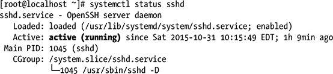

第十章


系统日志记录

大多数时候，你的 Linux 电脑会工作得很好。然而，有时你的程序不会启动，或者系统组件会损坏。在这种情况下，你需要所有你能得到的帮助。假设您已经使用了计算机上可用的命令文档，比如`man`和`--help`，那么现在您需要找出当您试图完成任务时到底发生了什么。这就把我们带到了系统日志。

了解日志记录

一旦你理解了它是如何工作的，你会喜欢 Linux 的一个方面是 Linux 处理系统日志的方式。Linux 上的日志功能非常广泛，您可以告诉它将日志消息发送到您想要的任何地方。结果不仅仅是在`/var/log` 中创建了一堆文件，而且在许多情况下，还会将更重要的消息写入您计算机上的虚拟控制台，以及通过 systemctl 命令提供的日志信息。想想 Linux 使用的虚拟控制台；例如，在安装时，有几个控制台可用，通过它们您可以监视不同命令的输出。

 **注意**在[第二章](02.html)中，你读到了如何激活一个虚拟控制台，使用 Ctrl+Alt+F1 直到 Ctrl+Alt+F6。在大多数发行版中，即使是图形控制台也是一个虚拟控制台，可以使用 Ctrl+Alt+F7 键。

所有这些消息的背后往往是一个名为`syslog` 的进程。此进程被配置为监视您的计算机上发生的事情。它通过观察您使用的命令生成的消息来做到这一点。`syslog`捕获这些消息并将其发送到目的地，目的地通常是一个文件，但如上所述，也可以是您计算机上的虚拟控制台。

Syslog 有不同的实现。syslog 的早期版本只是叫做“syslog”。这个日志记录过程得到了增强，并被更灵活的 rsyslog 服务所取代。有时，您还会发现 syslog-ng 负责日志记录。在当前的 Linux 发行版上，rsyslog 是事实上的标准。它完全向后兼容旧的 syslog 服务，但也提供了许多新功能，这将在本章后面讨论。因为 rsyslog 是记录系统信息的当前标准，所以在这一章中，我将重点介绍它的工作原理。

除了 r `syslog`进程 捕获消息并将它们发送到某个地方，还有生成消息的命令或进程。并非所有这些都由 r `syslog`处理，例如 Apache web 服务负责自己的日志记录。许多服务负责自己的日志记录的原因是，即使是较新的 rsyslog 也总是受到向后兼容性的限制，结果是特定服务的过滤信息相当有限。

随着作为缺省服务管理器的 systemd 的发布，还引入了一个新的日志系统。它的名称是 systemd-journald，通常简称为 journald。该服务获取通过 systemd 启动的所有项目生成的日志信息，并提供一个通用接口来访问这些信息。在任何服务上键入 **systemctl status** 时，您将默认看到该服务记录的最新信息。[清单 10-1](#FPar2) 显示了一个例子，其中显示了 sshd 进程的日志信息。Journald 也有自己的接口来访问信息，这是通过 journalctl 命令提供的。

[***清单 10-1***](#_FPar2) 。使用 systemctl 状态显示日志信息



除了如上所述为服务进行的日志记录之外，有时您可能还希望常规命令更加详细。为此，许多命令都支持-v 选项，以使它们更加详细。

一个随机的例子是`cp`命令，默认情况下它不会显示它在做什么。但是，如果您给它添加了`-v`选项，它会准确地显示它正在做什么，即使它只是成功地复制了文件。清单 10-2 给出了一个这样的例子。

[***清单 10-2***](#_FPar3) 。许多命令可以与`-v`一起工作，以准确显示它们正在做什么

```sh
nuuk:~ # cp -v /etc/[qx]* /tmp
`/etc/xattr.conf' -> `/tmp/xattr.conf'
cp: omitting directory `/etc/xdg'
`/etc/xinetd.conf' -> `/tmp/xinetd.conf'
cp: omitting directory `/etc/xinetd.d'
cp: omitting directory `/etc/xml'
cp: omitting directory `/etc/xscreensaver'
```

还有一些从图形界面运行的命令。通常情况下，他们不会显示他们正在试图做什么。但是，如果您找到了该命令的名称和确切位置，并尝试从命令行运行该命令，而不仅仅是单击其图标，您会对该命令的输出感到惊讶。在清单 10-3 中，您可以看到从命令行运行 Gnome 文件浏览器 Nautilus 的样子。请注意，这样做还会显示任何有关网络的错误消息，这些消息在以正常方式启动该命令时是永远看不到的。

[***清单 10-3***](#_FPar4) 。从命令行启动图形命令通常会产生大量的启动信息

```sh
login as: root
Using keyboard-interactive authentication.
Password:
Last login: Sat Dec 20 03:50:05 2008 from 192.168.26.1
nuuk:~ # /opt/gnome/bin/nautilus
Initializing nautilus-open-terminal extension
Initializing nautilus-share extension

** (nautilus:10427): WARNING **: Cannot calculate _NET_NUMBER_OF_DESKTOPS

** (nautilus:10427): WARNING **: Cannot calculate _NET_NUMBER_OF_DESKTOPS

** (nautilus:10427): WARNING **: Cannot get _NET_WORKAREA

** (nautilus:10427): WARNING **: Cannot determine workarea, guessing at layout
Nautilus-Share-Message: REFRESHING SHARES
Nautilus-Share-Message: ------------------------------------------
Nautilus-Share-Message: spawn arg "net"
Nautilus-Share-Message: spawn arg "usershare"
Nautilus-Share-Message: spawn arg "info"
Nautilus-Share-Message: end of spawn args; SPAWNING
Nautilus-Share-Message: returned from spawn: SUCCESS:
Nautilus-Share-Message: exit code 255
Nautilus-Share-Message: ------------------------------------------
Nautilus-Share-Message: Called "net usershare info" but it failed: 'net
  usershare' returned error
 255: net usershare: usershares are currently disabled
```

然而，大多数命令都会写入系统日志，以表明出现了问题。在讨论这个系统日志的工作方式之前，下一节将详细解释它所写的日志文件以及如何监控它们。在此之前，[表 10-1](#Tab1) 概述了从命令和服务中获取日志信息的不同方法。

[表 10-1](#_Tab1) 。显示日志信息的方法

| 命令详细度 | 在许多命令中使用-v |
| rsyslog(rsyslog) | 将信息写入/var/log 和其他目标中的文件的通用解决方案 |
| 直接记录 | 有些服务不使用 rsyslog，而是直接将信息写入/var/log 中的日志文件 |
| -报纸 | 将信息写入日志的 systemd 的集成组件。通过 systemctl status 和 journalctl 命令可以访问这些信息。 |

/var/log 中的监控文件

关于信息应该记录到哪里，不同的 Linux 发行版之间没有标准化。可以肯定的是，您将会找到所有写在/var/log 目录中的日志文件。在许多发行版中,/var/log/messages 是日志文件最重要的目的地，但是您也可以找到其他日志目的地，比如/var/log/system。日志文件只是文本文件，所以您可以像阅读任何其他文本文件一样阅读它们——例如，用`less`打开它，或者用`tail`命令查看最后几行。然而，监视这些文件内容的一个特别有用的方法是通过`tail -f`，其中`-f`代表跟随。当以这种方式调用时，`tail`打开日志文件的最后十行，并在它们被创建时自动显示新行。当试图理解一个命令或服务到底在做什么时，这种技术特别有用。由于它向您显示实时信息，您将立即看到是否有什么事情没有解决，这也允许您立即采取行动。

在看日志文件的时候，很多人往往会忘记不止有`/var/log/messages`。看看你电脑上的日志文件，试着理解它们的用途。例如，您是否知道大多数计算机不仅为它们收到的每一封邮件，而且为每一次发送电子邮件的失败尝试都写一个日志条目？这些信息在试图理解为什么发送电子邮件不起作用时很有用，但没有写到`/var/log/messages`。因此，看看`/var/log`的内容，看看你还需要知道哪些文件来找到你计算机上的命令正在生成的所有日志信息。在本章的后面，您将了解如何配置 rsyslog 来指定应该写入哪个目标日志信息。[清单 10-4](#FPar5) 展示了`/var/log`的内容在我的电脑上的样子。

[***清单 10-4***](#_FPar5) 。消息文件不是/var/log 中的唯一文件

```sh
[root@localhost log]# ls -l
total 1388
drwxr-xr-x. 2 root root   4096 Oct 24 07:46 anaconda
drwxr-x---. 2 root root     22 Mar  5  2015 audit
-rw-r--r--. 1 root root   6998 Oct 31 10:15 boot.log
-rw-------. 1 root utmp      0 Oct 24 09:50 btmp
-rw-r--r--. 1 root root  14066 Oct 31 11:14 cron
-rw-r--r--. 1 root root  10625 Oct 25 03:41 cron-20151025
-rw-r--r--. 1 root root 112899 Oct 31 10:15 dmesg
-rw-r--r--. 1 root root 112825 Oct 24 13:52 dmesg.old
-rw-------. 1 root root   1370 Oct 24 09:50 grubby
-rw-r--r--. 1 root root 292000 Oct 31 10:17 lastlog
-rw-------. 1 root root    198 Oct 31 10:15 maillog
-rw-------. 1 root root    594 Oct 24 13:52 maillog-20151025
-rw-------. 1 root root 378914 Oct 31 11:24 messages
-rw-------. 1 root root 698853 Oct 25 03:30 messages-20151025
drwx------. 2 root root      6 Jun 10  2014 ppp
-rw-------. 1 root root   1043 Oct 31 10:17 secure
-rw-------. 1 root root   3333 Oct 24 13:52 secure-20151025
-rw-------. 1 root root      0 Oct 25 03:41 spooler
-rw-------. 1 root root      0 Oct 24 07:45 spooler-20151025
-rw-------. 1 root root      0 Oct 24 07:45 tallylog
drwxr-xr-x. 2 root root     22 Mar  6  2015 tuned
-rw-rw-r--. 1 root utmp  12672 Oct 31 10:17 wtmp
-rw-------. 1 root root  11128 Oct 31 10:18 yum.log
```

配置`syslog`服务

如前所述，rsyslog 是大多数当前 Linux 发行版上的默认日志服务。它允许管理员指定哪些服务应该将哪种类型的信息记录到哪个目的地。这三个项目被称为设施(哪个服务)、优先级(应该记录的严重性级别)和目的地(应该记录信息的位置)。除此之外，rsyslogd 还可以配置模块来进一步优化日志服务的工作。模块用于高级配置，因此不在本章讨论。

主 rsyslog 配置文件是/etc/rsyslog.cond。除了这个文件，您还可以找到/etc/rsyslog.d 目录。这个目录的内容被添加到/etc/rsyslog.conf 中指定的配置中，这允许 RPM 或 Debian 包扩展配置，而无需修改/etc/rsyslog.conf 文件的内容。清单 10-5 显示了 rsyslog.conf 的内容。

[***清单 10-5***](#_FPar6) 。/etc/rsyslog.conf 文件的内容

```sh
[root@localhost log]# cat /etc/rsyslog.conf
# rsyslog configuration file

# For more information see /usr/share/doc/rsyslog-*/rsyslog_conf.html
# If you experience problems, see http://www.rsyslog.com/doc/troubleshoot.html

#### MODULES ####

# The imjournal module bellow is now used as a message source instead of imuxsock.
$ModLoad imuxsock # provides support for local system logging (e.g. via logger command)
$ModLoad imjournal # provides access to the systemd journal
#$ModLoad imklog # reads kernel messages (the same are read from journald)
#$ModLoad immark  # provides -MARK- message capability

# Provides UDP syslog reception
#$ModLoad imudp
#$UDPServerRun 514

# Provides TCP syslog reception
#$ModLoad imtcp
#$InputTCPServerRun 514

#### GLOBAL DIRECTIVES ####

# Where to place auxiliary files
$WorkDirectory /var/lib/rsyslog

# Use default timestamp format
$ActionFileDefaultTemplate RSYSLOG_TraditionalFileFormat

# File syncing capability is disabled by default. This feature is usually not required,
# not useful and an extreme performance hit
#$ActionFileEnableSync on

# Include all config files in /etc/rsyslog.d/
$IncludeConfig /etc/rsyslog.d/*.conf

# Turn off message reception via local log socket;
# local messages are retrieved through imjournal now.
$OmitLocalLogging on

# File to store the position in the journal
$IMJournalStateFile imjournal.state

#### RULES ####

# Log all kernel messages to the console.
# Logging much else clutters up the screen.
#kern.*                                                 /dev/console

# Log anything (except mail) of level info or higher.
# Don’t log private authentication messages!
*.info;mail.none;authpriv.none;cron.none                /var/log/messages

# The authpriv file has restricted access.
authpriv.*                                              /var/log/secure

# Log all the mail messages in one place.
mail.*                                                  -/var/log/maillog

# Log cron stuff
cron.*                                                  /var/log/cron

# Everybody gets emergency messages
*.emerg                                                 :omusrmsg:*

# Save news errors of level crit and higher in a special file.
uucp,news.crit                                          /var/log/spooler

# Save boot messages also to boot.log
local7.*                                                /var/log/boot.log

# ### begin forwarding rule ###
# The statement between the begin ... end define a SINGLE forwarding
# rule. They belong together, do NOT split them. If you create multiple
# forwarding rules, duplicate the whole block!
# Remote Logging (we use TCP for reliable delivery)
#
# An on-disk queue is created for this action. If the remote host is
# down, messages are spooled to disk and sent when it is up again.
#$ActionQueueFileName fwdRule1 # unique name prefix for spool files
#$ActionQueueMaxDiskSpace 1g   # 1gb space limit (use as much as possible)
#$ActionQueueSaveOnShutdown on # save messages to disk on shutdown
#$ActionQueueType LinkedList   # run asynchronously
#$ActionResumeRetryCount -1    # infinite retries if host is down
# remote host is: name/ip:port, e.g. 192.168.0.1:514, port optional
#*.* @@remote-host:514
# ### end of the forwarding rule ###
[root@localhost log]#
```

rsyslog.conf 配置文件 最重要的部分在 RULES 部分。在这里，设备、优先级和目的地这三个元素被用来指定信息应该被发送到哪里

设施是 rsyslog 的一个固定部分，您不能轻易添加到其中。以下设施在`syslog`中可用:

*   `auth`:处理认证相关事件的设施。
*   `authpriv`:与`auth`一样，处理与认证相关的事件的设施。`auth`和`authpriv`没有区别。
*   `cron`:处理由`cron`子系统产生的消息的设施(参见[第 9 章](09.html)了解更多关于`cron`的信息)。
*   `daemon`:由守护进程生成的日志消息。系统进程不能再细分，除了守护进程有自己的功能，比如`ftp`和`mail`。
*   `kern`:内核相关消息。这个工具还定义了 iptables 内核防火墙生成的消息。
*   `lpr`:与遗留 lpr 打印系统相关的消息。
*   `mail`:与处理邮件消息相关的消息。
*   `mark`:仅供内部使用。`syslog`进程可以定期在`syslog`中放置一个标记。如果您的电脑不经常记录日志，这可以帮助您确定日志记录仍处于启用状态。
*   `news`:与网络新闻传输协议(NNTP)相关的消息——相关服务。
*   `security`:通用安全相关消息。
*   `syslog`:与`syslog`流程本身相关的消息。
*   `user`:用户相关消息。
*   `uucp`:由遗留的 Unix 到 Unix 复制协议(UUCP)生成的消息。
*   可用于所有其他服务的设施。要使用这些工具，您需要在其配置文件中配置服务，以登录到本地工具。有关如何做到这一点的更多信息，请参考该服务的文档。

在编写日志消息时，这些工具生成具有给定优先级的消息。当引用优先级时，具有该优先级和所有更高优先级的消息被写入指定的目标。以下优先级在`syslog`中定义，按升序排列:

*   `debug`:与调试信息相关。这为您提供了该设施正在进行的所有工作的详细信息。一般来说，这种级别的信息对程序员来说是有用的，因为它确切地告诉你这个工具执行什么系统和库调用。
*   `info`:给出关于进程正在做什么的所有“正常”信息。例如，这提供了关于打开的文件的信息，但是没有提供关于系统和库调用的详细信息。
*   `notice`:给出关于非关键错误的信息。例如，这可以引用一个应该存在的文件，但是因为它不存在，所以它是自动创建的。
*   `warn` / `warning`:给出执行流程时出现的警告信息。`warn`和`warning`的意思相同，但是警告是不赞成使用的。这意味着你仍然可以使用它，因为 Linux 会理解它，但因为它是“老学校”，所以你不应该再使用它。警告是指正常功能被中断，但设施仍在运行的情况。
*   `err` / `error`:给出错误信息。通常，`err`级消息是关于中断设施正常运行的情况。不推荐使用`error`。用`err`代替。
*   `crit`:给出危及电脑正常运行的紧急情况的信息。
*   `alert`:给出导致电脑停止运行的情况的信息。
*   `emerg` / `panic`:表示您的电脑已经停止正常运行。不推荐使用`panic`。用`emerg`代替。

为了定义日志事件，在 r `syslog.conf`中，您将引用一个结合了优先级的工具。如果没有定义其他异常，您提到的优先级也包括所有更高的优先级。例如，下面将提到由内核生成的信息性消息以及具有更高优先级的消息:

```sh
kern.info
```

您也可以在一行中引用多个工具，方法是在逗号分隔的列表中指定它们。例如，下面既指与内核相关的信息性消息，也指与`cron`进程相关的信息性消息:

```sh
kern,cron.info
```

或者，您可以使用星号来指代所有设施，如以下示例行所示:

```sh
*.crit
```

当提到优先级时，通常只要提到优先级，你就包括了所有更高的优先级。如果要定义在发生指定优先级的情况下应该发生什么，请使用等号，如下面的示例行所示，它处理与邮件相关的消息，而不是与优先级更高的消息相关的消息:

```sh
mail.=info
```

您还可以通过在优先级名称前加上感叹号来包含一条语句，以排除某个优先级及其之后的所有优先级:

```sh
mail.!info
```

当日志事件发生时，会对其执行一个操作。这个动作通常意味着消息被发送到某个地方。在`syslog`中，可用的动作也被很好地定义。可以在一行中指定多个工具和优先级，以登录到同一个目的地。清单 10-5 包括了几个这样的例子。您可以向以下人员发送日志消息:

*   *常规文件* :当提到一个文件名时，日志消息被写入该文件。您必须将该文件名指定为绝对路径名。为了防止`syslog`立即将每一条消息写入配置文件，您可以在文件名前面加上一个`-`符号。这意味着在将更改写入实际的配置文件之前，会先对其进行缓冲。在[清单 10-5](#FPar6) 中，这用于处理具有调试状态的消息记录。清单中的`;`符号用作分隔符，`\`符号确保下一部分被解释为属于同一行:

    ```sh
    *.=debug;\
            auth,authpriv.none;\
            news.none;mail.none     -/var/log/debug
    ```

*   *命名管道*:通过登录到命名管道，可以将日志消息通过管道发送到设备。要使用命名管道，您应该在设备名称前面放一个管道符号。以下来自`/etc/syslog.conf`的示例展示了如何使用命名管道

    ```sh
    daemon.*;mail.*;\
            news.err;\
            *.=debug;*.=info;\
            *.=notice;*.=warn      |/dev/xconsole
    ```

    登录到`xconsole`设备
*   *终端或* *控制台* :如果您指定为实际日志目的地的文件是一个 tty，`syslog`会将其作为一个 tty 处理，并实时记录消息到其中。一个非常常用的 tty 就是`/dev/console`。
*   *远程机器* :您可以使用`syslog`的一个非常有用的特性是将一台计算机配置为网络中所有计算机的日志主机。在这台计算机上，您将在日志文件中看到消息来自的计算机的名称。要将日志消息发送到远程计算机，必须满足两个条件:
    *   启动`syslog`，启用远程记录功能。默认情况下，`syslog`进程不接受来自其他主机的消息。您可以通过使用`-r`选项启动`syslog`进程来启用远程日志记录。这告诉您当前的机器应该接受来自其他机器的日志消息。
    *   在`syslog.conf`中，通过在机器名称前放置一个`@`符号，指定您想要登录的机器名称作为日志目的地。例如，你可以使用`@RNA`将信息记录到一台名为 RNA 的机器上。如果您希望这样做，该计算机名必须是可解析的。
*   *用户*:你可以直接发送消息给一个用户，如果他或她登录了，他或她会实时收到这条消息。为此，只需使用用户名或多个用户的逗号分隔列表。例如，下面的代码将确保由内核生成的、状态为 critical 或更高级别的所有消息都被直接发送给 root 用户:

    ```sh
    kern.crit                root
    ```

*   *每个登录的人*:如果日志消息很关键(例如，因为它破坏了系统的所有功能)，那么向当前登录的所有用户发送一条消息是有意义的。为此，请指定一个星号作为日志目标。

练习 10-1:配置 RSYSLOG

在本练习中，您将学习如何配置 rsyslog，以便将生成的所有消息发送到文件/var/log/all。

1.  用编辑器打开/etc/rsyslog.conf 文件。
2.  找到 RULES 部分，并添加下面一行:

    ```sh
    *.* /var/log/all
    ```

3.  键入 **systemctl restart rsyslog** 。要使更改生效，必须重新启动服务。
4.  键入 **logger HELLO**
5.  键入 **tail -f /var/log/all** 。您应该会看到添加了一行，在/var/log/all 文件的末尾显示文本 HELLO。

配置`syslog-ng`

几年前，syslog-ng 作为传统 syslog 系统的继承者被引入。即使大多数发行版已经将 rsyslog 作为新的下一代系统日志程序，您也可能会遇到 syslog-ng。下一节描述了它是如何工作和配置的。

在`syslog-ng`中，还使用了设施、优先级和日志目的地；如果你需要了解更多，请阅读上一节。然而，它们的使用方式与标准`syslog`有很大不同。在[清单 10-6](#FPar8) 中，你可以看到一个`syslog-ng.conf`的例子，它定义了日志应该如何被处理。

[***清单 10-6***](#_FPar8) 。用`syslog-ng`处理记录

```sh
nuuk:/etc/syslog-ng # cat syslog-ng.conf
#
# /etc/syslog-ng/syslog-ng.conf
#

#
# Global options.
#
options { long_hostnames(off); sync(0); perm(0640); stats(3600); };
#
# 'src' is our main source definition. you can add
# more sources driver definitions to it, or define
# your own sources, i.e.:
#
#source my_src { .... };
#
source src {
        #
        # include internal syslog-ng messages
        # note: the internal() source is required!
        #
        internal();

        #
        # the following line will be replaced by the
        # socket list generated by SuSEconfig using
        # variables from /etc/sysconfig/syslog:
        #
        unix-dgram("/dev/log");

        #
        # uncomment to process log messages from network:
        #
        #udp(ip("0.0.0.0") port(514));
};

#
# Filter definitions
#
filter f_iptables   { facility(kern) and match("IN=") and match("OUT="); };

filter f_console    { level(warn) and facility(kern) and not filter(f_iptables)
                      or level(err) and not facility(authpriv); };

filter f_newsnotice { level(notice) and facility(news); };
filter f_newscrit   { level(crit)   and facility(news); };
filter f_newserr    { level(err)    and facility(news); };
filter f_news       { facility(news); };

filter f_mailinfo   { level(info)      and facility(mail); };
filter f_mailwarn   { level(warn)      and facility(mail); };
filter f_mailerr    { level(err, crit) and facility(mail); };
filter f_mail       { facility(mail); };
filter f_cron       { facility(cron); };

filter f_local      { facility(local0, local1, local2, local3,
                               local4, local5, local6, local7); };

filter f_acpid      { match('^\[acpid\]:'); };
filter f_netmgm     { match('^NetworkManager:'); };

filter f_messages   { not facility(news, mail) and not filter(f_iptables); };
filter f_warn       { level(warn, err, crit) and not filter(f_iptables); };
filter f_alert      { level(alert); };

#
# Most warning and errors on tty10 and on the xconsole pipe:
#
destination console  { pipe("/dev/tty10"    group(tty) perm(0620)); };
log { source(src); filter(f_console); destination(console); };

destination xconsole { pipe("/dev/xconsole" group(tty) perm(0400)); };
log { source(src); filter(f_console); destination(xconsole

#
# News-messages in separate files:
#
destination newscrit   { file("/var/log/news/news.crit"
                              owner(news) group(news)); };
log { source(src); filter(f_newscrit); destination(newscrit); };

destination newserr    { file("/var/log/news/news.err"
                              owner(news) group(news)); };
log { source(src); filter(f_newserr); destination(newserr); };

destination newsnotice { file("/var/log/news/news.notice"
                              owner(news) group(news)); };
log { source(src); filter(f_newsnotice); destination(newsnotice); };

#
# Mail-messages in separate files:
#
destination mailinfo { file("/var/log/mail.info"); };
log { source(src); filter(f_mailinfo); destination(mailinfo); };

destination mailwarn { file("/var/log/mail.warn"); };
log { source(src); filter(f_mailwarn); destination(mailwarn); };

destination mailerr { file("/var/log/mail.err" fsync(yes)); };
log { source(src); filter(f_mailerr); destination(mailerr); };

#
# and also all in one file:
#
destination mail { file("/var/log/mail"); };
log { source(src); filter(f_mail); destination(mail); };

#
# acpid messages in one file:
#
destination acpid { file("/var/log/acpid"); };
log { source(src); filter(f_acpid); destination(acpid); flags(final); };

#
# NetworkManager messages in one file:
#
destination netmgm { file("/var/log/NetworkManager"); };
log { source(src); filter(f_netmgm); destination(netmgm); flags(final); };

#
# Some boot scripts use/require local[1-7]:
#
destination localmessages { file("/var/log/localmessages"); };
log { source(src); filter(f_local); destination(localmessages); };

#
# All messages except iptables and the facilities news and mail:
#
destination messages { file("/var/log/messages"); };
log { source(src); filter(f_messages); destination(messages); };

#
# Firewall (iptables) messages in one file:
#
destination firewall { file("/var/log/firewall"); };
log { source(src); filter(f_iptables); destination(firewall); };

#
# Warnings (except iptables) in one file:
#
destination warn { file("/var/log/warn" fsync(yes)); };
log { source(src); filter(f_warn); destination(warn); };
```

 **注意**在 SUSE Linux 上，你会找到文件`/etc/syslog-ng/syslog-ng.conf`和`/etc/syslog-ng/syslog-ng.conf.in`。你应该对`/etc/syslog-ng/syslog-ng. conf.in`文件进行所有的修改，在修改之后，运行`SuSEconfig`命令将它们写到`/etc/ syslog-ng/syslog-ng.conf`。使用此过程是因为 SUSE 的更新过程可能会改变`syslog-ng.conf`文件，这可能会导致您丢失对其所做的所有更改。

在`syslog-ng`配置中，三个元素组合在`log`语句中，以定义消息记录的位置:

*   `source`:定义从哪里接受消息
*   `filter`:指定日志消息应该匹配的确切内容
*   `destination`:表示消息必须写入的位置

为了理解在您的`syslog-ng`配置上发生了什么，自下而上地阅读配置文件是有意义的:在文件的底部，您将找到定义日志记录应该如何处理的`log`语句，在配置文件的上部，您可以找到组成这个定义的不同元素。下面是这种`log`说法的一个例子:

```sh
log { source(src); filter(f_warn); destination(warn); };
```

在这个例子中，您看到的第一部分是源代码规范，它被定义为`(src)`。这指的是同一文件中先前的定义，您可以在这里看到:

```sh
source src {
        #
        # include internal syslog-ng messages
        # note: the internal() source is required!
        #
        internal();

        #
        # the following line will be replaced by the
        # socket list generated by SuSEconfig using
        # variables from /etc/sysconfig/syslog:
        #
        unix-dgram("/dev/log");
        #
        # uncomment to process log messages from network:
        #
        #udp(ip("0.0.0.0") port(514));
};
```

如您所见，`src`定义默认接受两个来源:内部生成的消息和操作系统使用`/dev/log`设备处理的消息。此定义处理由您的计算机生成的所有消息，但不接受来自其他计算机的任何消息。然而，你也可以很容易地包括这些。要接受来自所有计算机的消息，请确保启用了以下行:

```sh
udp(ip("0.0.0.0") port(514));
```

或者，您可以通过提及主机的 IP 地址或您希望该机器接受消息的范围来引用来自一台主机或一系列主机的消息。例如，您可以使用以下命令来启用来自网络 192.168.1.0 中所有 IP 地址的消息:

```sh
udp(ip("192.168.1.0") port(514));
```

回头看这个例子，日志定义的第二部分定义了过滤器，在这个例子中是`f_warn`，如下所示:

```sh
filter f_warn      { level(warn, err, crit) and not filter(f_iptables); };
```

在过滤器定义中，您可以指示消息应该来自哪个级别，以及应该由哪个工具生成消息。正如您在前面的示例中看到的，您还可以告诉过滤器不要处理来自另一个特定过滤器的消息。`syslog-ng`中的滤镜非常灵活。这是因为您也可以使用一个`match`语句，它使用一个正则表达式来告诉`syslog-ng`查找特定的文本。以下是这方面的一个例子:

```sh
filter f_acpid     { match('^\[acpid\]:'); };
```

在这个过滤器中，匹配用于查找正则表达式。正则表达式定义`syslog-ng`应该处理所有以文本`[acpid]`开头的行，这使得您能够在这种情况下为`acpid`服务指定一个特定的日志目标。在构建`syslog-ng`配置时，您会特别喜欢这个匹配功能。

作为您的`syslog-ng`配置的最后一部分，您必须指定将消息发送到哪里。您可以通过定义日志目标来实现这一点。以下是目的地的示例:

```sh
destination newscrit   { file("/var/log/news/news.crit"
                              owner(news) group(news)); };
```

在`syslog-ng`目的地中，您可以使用在`syslog`中看到的所有日志目的地。但在这里，也有可能非常具体。例如，您可以看到示例代码不仅定义了`syslog-ng`必须编写的文件名，还定义了该文件的用户所有者和组分配。

 **提示** `Syslog-ng`当你第一次开始使用它时，可能看起来令人生畏。如果你更了解它，你会发现它并没有那么难。我建议您彻底研究一下示例`syslog-ng.conf`文件，因为它包含了您构建自己的配置所需的所有示例。

用`logger`自己发送日志

处理日志时非常有用的还有`logger`命令 。默认情况下，这个命令向`syslog`发送消息，这使得它成为一个有用的命令，可以包含在没有默认日志记录的脚本中。您可以告诉 logger 使用某个优先级，但通常您不会这样做；如果在`syslog-ng`环境中使用，您只需使用一个匹配过滤器来处理由`logger`命令生成的消息。使用这个命令非常简单。例如，下面将写一条消息给你的`syslog`:

```sh
logger hi
```

当使用`logger`时，您可能喜欢用特定的标记来标记您写入日志文件的每一行。这使你以后更容易识别这样的线条。为此，使用选项`-t tag`。例如，命令`logger -t blah hi`会在日志文件中用`blah`标记消息`hi`，这使得你更容易用`logger`写消息`grep`。

旋转旧日志文件

日志记录是好的，但是如果您的系统写了太多的日志文件，它会变得很成问题。

作为解决方案，您可以配置`logrotate`服务 。`logrotate`服务作为每日`cron`任务运行，并检查其配置文件，以查看是否有任何轮换发生。在这些配置文件中，您可以配置何时应该打开一个新的日志文件，如果发生这种情况，应该对旧的日志文件进行什么处理:例如，应该压缩还是删除它，如果压缩，应该保留旧文件的多少个版本。

`logrotate`使用两种不同的配置文件。主配置文件是`/etc/logrotate.conf`。在这个文件中，定义了通用设置来调整`logrotate`应该如何工作。你可以在清单 10-7 中看到这个文件的内容。

[***清单 10-7***](#_FPar11) 。`logrotate.conf`配置文件的内容

```sh
# see "man logrotate" for details
# rotate log files weekly
weekly

# keep 4 weeks worth of backlogs
rotate 4

# create new (empty) log files after rotating old ones
create

# uncomment this if you want your log files compressed
#compress

# uncomment these to switch compression to bzip2
compresscmd /usr/bin/bzip2
uncompresscmd /usr/bin/bunzip2

# former versions had to have the compresscommand set accordingly
#compressext .bz2

# RPM packages drop log rotation information into this directory
include /etc/logrotate.d

# no packages own wtmp - we’ll rotate them here
#/var/log/wtmp {
#      monthly
#      create 0664 root utmp
#      rotate 1
#}

# system-specific logs may be also be configured here.
```

清单 10-7 中的代码包含了一些重要的关键字。[表 10-2](#Tab2) 描述了这些关键词。

[表 10-2](#_Tab2) 。`logrotate`选项

| 

[计]选项

 | 

描述

 |
| --- | --- |
| `weekly` | 该选项指定应每周创建日志文件。 |
| `rotate 4` | 该选项确保保存文件的四个旧版本。如果不使用`rotate`选项，旧文件将被删除。 |
| `create` | 旧文件以新名称保存，并创建一个新文件。使用该选项确保旧的日志文件被压缩。`compresscmd`该选项指定用于创建压缩日志文件的命令。 |
| `uncompresscmd` | 使用此命令指定用于解压缩压缩日志文件的命令。 |
| `include` | 这个重要的选项确保包含目录`/etc/logrotate.d`的内容。在这个目录中，存在指定如何处理一些单独日志文件的文件。 |

正如您所看到的，`logrotate.conf`配置文件包含一些通用代码，用于指定应该如何处理日志文件。除此之外，大多数日志文件在`/etc/logrotate.d/`中都有一个特定的`logrotate`配置文件。

`/etc/logrotate.d`中特定于服务的配置文件的内容通常比通用`logrotate.conf`中的内容更具体。在[清单 10-8](#FPar12) 中，您可以看到为`/var/log/ntp`处理日志文件的配置脚本是什么样子的。

[***清单 10-8***](#_FPar12) 。ntp 的 logrotate 配置示例

```sh
/var/log/ntp {
     compress
     dateext
     maxage 365
     rotate 99
     size=+2048k
     notifempty
     missingok
     copytruncate
     postrotate
           chmod 644 /var/log/ntp
     endscript
}
```

清单 10-8 展示了一些额外的选项。[表 10-3](#Tab3) 概述了这些选项及其含义。

[表 10-3](#_Tab3) 。特定服务`logrotate`文件中的选项

| 

[计]选项

 | 

描述

 |
| --- | --- |
| `dateext` | 使用日期作为旧版本日志文件的扩展名。 |
| `maxage` | 指定旧日志文件应在多少天后被删除。 |
| `rotate` | 指定日志文件在被删除或邮寄到 mail 指令中指定的地址之前应循环的次数。 |
| `size` | 记录超过此处指定大小的文件。 |
| `notifempty` | 当日志文件为空时，不旋转日志文件。 |
| `missingok` | 如果日志文件不存在，会继续处理下一个文件，而不会发出错误消息。 |
| `copytruncate` | 创建副本后就地截断旧日志文件，而不是移动旧文件并创建新文件。这对于不能被告知关闭日志文件的服务很有用。 |
| `postrotate` | 指定在对文件执行`logrotate`后应该执行的一些命令。 |
| `endscript` | 降级配置文件的结尾。 |

与前面的`ntp`日志文件示例一样，所有其他日志文件都可以有自己的`logrotate`文件。您甚至可以为根本不是日志文件的文件创建`logrotate`文件！创建这样一个`logrotate`文件时，有更多的选项可用；要获得完整的概述，请查看`man`页面。

练习 10-2:配置日志轮换

在[练习 10-1](#box1) 中，您已经将 rsyslog 配置为将记录的所有消息写入文件/var/log/all。在本练习中，您将学习如何根据特定标准轮换文件。

1.  打开一个根 shell，使用 **cd /etc/logrotate.d** 转到包含特定服务的日志旋转文件的目录。
2.  键入 **cp syslog all** 将默认 syslog 文件复制到名为 all 的新文件中。如果没有名为 syslog 的文件，可以在方便的时候选择另一个文件。
3.  用编辑器打开文件，并确保它包含以下内容:

    ```sh
    /var/log/all {
            daily
            missingok
            rotate 1
            compress
            delaycompress
            copytruncate
            minsize 100k
    }
    ```

4.  请注意，您不会看到立即生效的更改。Logrotate 是通过 cron 服务自动安排的，默认情况下每天运行一次。
5.  使用 **ls -l /var/log/all** 查看文件的当前日期和时间戳。
6.  要手动触发旋转，请键入**log rotate/etc/log rotate . conf**。请注意，它仍然不太可能看到任何效果，因为文件还不符合旋转的标准。

了解日记账

随着 systemd 的发布，还引入了一个新的日志服务。这是日志服务。Journald 并不是要取代 rsyslog，而是对 rsyslog 的补充。rsyslog 的主要用途是记录由特定事件和服务生成的信息，并将这些信息写入/var/log 中的文件。此外，rsyslog 允许您在网络中设置一个中央日志服务。

Journald 用于提供有关服务工作的更多信息。它为您提供实时信息，默认情况下，当您的计算机重新启动时，这些信息会被清除。使用 journald 允许您查询有关服务及其当前操作状态的特定信息。

对 journald 记录的信息最简单的接口是通过 **systemctl status** 命令，您以前已经见过了。该命令自动显示为特定 systemd 单元文件记录的最后五行。Journald 还有 **journalctl** 命令，它可以打开一个分页器，您可以在其中阅读最近的日志消息。该分页器基于 less 命令，因此要查看添加到日志中的最新行，请使用 **G** 转到命令输出的底部。

journalctl 还有许多选项可以从日志中过滤出特定的项目。如果已经安装了 bash 完成包，您可以很容易地使用 tab 键命令完成这些选项。清单 10-9 显示了默认选项，如 bash 命令行补全所示。

[***清单 10-9***](#_FPar14) 。使用制表符结束来显示日记选项

```sh
[root@workstation ~]# journalctl
_AUDIT_LOGINUID=             __MONOTONIC_TIMESTAMP=
_AUDIT_SESSION=              _PID=
_BOOT_ID=                    PRIORITY=
_CMDLINE=                    __REALTIME_TIMESTAMP=
CODE_FILE=                   _SELINUX_CONTEXT=
CODE_FUNC=                   _SOURCE_REALTIME_TIMESTAMP=
CODE_LINE=                   SYSLOG_FACILITY=
_COMM=                       SYSLOG_IDENTIFIER=
COREDUMP_EXE=                SYSLOG_PID=
__CURSOR=                    _SYSTEMD_CGROUP=
ERRNO=                       _SYSTEMD_OWNER_UID=
_EXE=                        _SYSTEMD_SESSION=
_GID=                        _SYSTEMD_UNIT=
_HOSTNAME=                   _TRANSPORT=
_KERNEL_DEVICE=              _UDEV_DEVLINK=
_KERNEL_SUBSYSTEM=           _UDEV_DEVNODE=
_MACHINE_ID=                 _UDEV_SYSNAME=
MESSAGE=                     _UID=
MESSAGE_ID=
```

在上面列出的选项中，_SYSTEMD_UNIT 选项特别有用。使用此选项，您可以获得所需的关于特定 systemd 单元的信息。使用例如**journal CTL _ SYSTEMD _ UNIT = sshd . service**来查看 SSH 服务最近记录的所有内容。

练习 10-3:在日记帐中发现选项

在本练习中，您将学习如何使用不同的 journalctl 选项。

1.  类型**日志**。您将看到自服务器上次启动以来日志的内容，从日志的开头开始。内容显示在**的**中，所以你可以使用常用的 less 命令遍历文件。
2.  类型 **journalctl -f** 。这将打开 journalctl 的实时视图模式，允许您实时查看滚动的新邮件。使用 **Ctrl-C** 中断。
3.  类型**轴颈 20** 。n 20 选项显示日志的最后 20 行(就像 **tail -n 20** )。
4.  现在输入 **journalctl -p err** 。该命令仅显示错误。
5.  如果要查看在特定时间段内写入的日记消息，可以使用- since 和- until 命令。这两个选项都采用 YYYY-MM-DD hh:mm:ss 格式的时间参数。此外，您可以使用昨天、今天和明天作为参数。因此，键入**journal CTL-since yesterday**来显示从昨天开始写的所有消息。
6.  **journalctl** 也允许你组合不同的选项，所以如果你想显示从昨天开始写的优先级为 err 的所有消息，使用**journal CTL-since yesterday-p err**。
7.  如果你需要尽可能多的细节，使用 **journalctl -o verbose** 。这显示了写入日志时使用的不同选项(见[清单 13-3](13.html#FPar4) )。所有这些选项都可以用来告诉 journalctl 命令您正在查找哪些特定信息。键入例如**journal CTL _ SYSTEMD _ UNIT = sshd . service**来显示关于 sshd systemd 单元的更多信息。

摘要

在这一章中，你已经学会了如何处理日志。首先，您已经了解了在系统上哪里可以找到默认的日志文件，以及如何查看它们。接下来，您学习了如何创建自己的 r `syslog`或`syslog-ng`配置。您还了解了如何配置日志轮换，以确保计算机的文件系统不会意外地被日志文件填满。在本章的末尾，你已经了解了 journald 和 journalctl 是如何添加另一个接口来从系统日志文件中获取相关信息的。本章介绍了以下命令:

*   `rsyslog`:用于记录文件的遗留进程
*   提供更智能日志服务的更新进程
*   `tail -f /var/log/messages`:*查看电脑上最重要的日志文件`/var/log/messages`中发生了什么*
**   `logger`:让你给`syslog`写消息的有用工具*   `logrotate`:帮助您防止日志文件变得太大并在一定时间后或达到给定大小后旋转它们的命令*   **journalctl:** 帮助您从 systemd 相关的 journald 服务中获取信息的多功能命令。*

 *在下一章，你将学习如何在你的电脑上配置网络。*