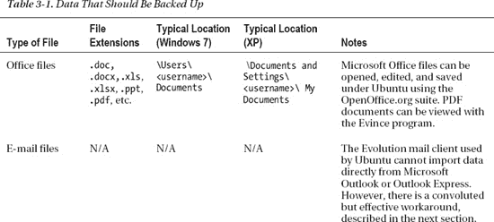
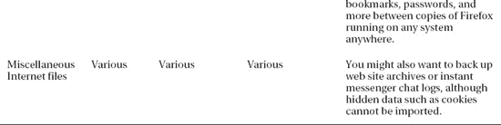

# 三、安装前步骤

现在你已经知道了 Ubuntu Linux 的由来，它的不同之处，以及你为什么想要使用它，是时候让 Ubuntu 在你自己的台式机或笔记本电脑上运行了，使用本书附带的 DVD。世界上大多数电脑都运行 Windows，但很少有人自己安装 Windows。他们不需要，因为你能买到的几乎每台电脑都预装了 Windows。相比之下，很少有公司销售装有 Ubuntu 或其他 Linux 操作系统的新电脑。也有例外——例如，一家名为 System 76 的公司向美国和加拿大的客户提供预装 Ubuntu 的优秀硬件。众所周知，就连戴尔也在其有限的几款电脑上提供 Ubuntu，尤其是价格低廉的 Inspiron Mini 10 上网本。

但是对于我们大多数人来说，拿到 Ubuntu 就意味着给自己安装了。如果你以前没有做过，这看起来是一个令人生畏的前景。然而，Ubuntu 让这项工作变得尽可能简单。与以前的 Linux 版本相比，甚至与当前的其他发行版相比，它的安装程序都非常先进。

说你要安装 Ubuntu 实际上是什么意思？它涉及三件事:

> 不知何故，运行 Ubuntu 所需的所有文件都将被放到你的硬盘上。*   The computer will be configured to know where to find these files when it is first started.*   Ubuntu operating system will be set up so that you can use it.

然而，为了做到这一切并把 Ubuntu 安装到你的电脑上，你必须做一些准备工作，这是本章的重点。

提示确保 Ubuntu 能在你选择的硬件上运行并不容易。如果你想避免不愉快的惊喜，去参观 www.ubuntu.com/certification/是个好主意。在这个网页上，你会找到所有 Ubuntu 认证硬件的列表。在这里提到的电脑中选择一台确保 Ubuntu 可以在上面工作！

### 了解分区

很可能你的电脑已经安装了 Windows。这不会成为问题。在大多数情况下，Ubuntu 可以在所谓的*双引导设置*中与 Windows 愉快地共存，这使你能够选择在电脑启动时运行哪个操作系统。但是，安装 Ubuntu 意味着 Windows 必须做出一定的妥协。Windows 被迫与另一个操作系统在你的硬盘上共存——这不是它的设计初衷。

 **注意**你可以在一台电脑上安装 Ubuntu 和 Windows。如果你真的想获得使用 Ubuntu 的经验，这不是一个推荐的解决方案。如果你能负担得起，最好在一台电脑上安装 Ubuntu，在那里它将是唯一的操作系统。过于频繁地将它安装在 Windows 旁边意味着你将默认启动 Windows，而且关闭 Windows 以便启动 Ubuntu 的工作量太大。所以如果你选择这种方法，你可能会安装 Ubuntu，然后再卸载它。如果你负担不起把它单独放在电脑上，你可以使用虚拟化解决方案，比如 VirtualBox。这允许你在不关闭 Windows 的情况下，将 Ubuntu 作为虚拟机运行。使用这种方法开始探索 Ubuntu 所需的工作要少得多。有关 VirtualBox 的更多信息，请参见[www.virtualbox.org](http://www.virtualbox.org)。您也可以从该网站下载免费的 VirtualBox。在本章的后面，你会找到更多关于如何使用虚拟环境的信息。即使你打算在一个完全空白的硬盘上安装 Ubuntu，理解分区仍然很重要。

这种情况的主要问题是 Windows 需要收缩，为 Ubuntu 腾出一些空间(除非你安装第二块硬盘，这将在本章后面讨论)。通过这样做，你将给予 Ubuntu 它自己单独定义的磁盘部分，这被称为一个*分区*。所有这些都可以由 Ubuntu 安装程序自动处理，但重要的是你要知道发生了什么，这样你就知道万一出了什么问题该怎么办。

 **注意**也可以在 Windows 文件系统中安装 Ubuntu，作为双引导的替代方法。这在第 4 章中有解释。

所有硬盘都被分割成分区，这些分区是为保存操作系统和数据而创建的大块磁盘(就像一个大型场被分割成单独的区域一样)。一个分区的大小通常是几千兆字节，尽管它可以更小。

 **注意**如果你用的是麦金塔，不要觉得被冷落了！下一章包括一个侧边栏，解释在 Mac 上安装 Ubuntu 的选项。

您可以使用 Windows XP、2000、Vista 和 7 中的磁盘管理工具查看您的磁盘分区，如[图 3-1](#fig_3_1) 所示。您可以通过在 Windows 开始菜单中右键单击计算机并选择管理来访问该工具。这将打开“计算机管理”窗口，在该窗口中，您可以在“存储”下找到“磁盘管理”。

大多数台式 PC 系统只有一个分区，除非用户专门创建了额外的分区。如前所述，Ubuntu 需要一个自己的分区。在安装过程中，Ubuntu 需要收缩主 Windows 分区并创建两个新分区:一个用于操作系统本身，另一个用于保存交换文件。

此外，Ubuntu 安装例程会写入一个新的引导扇区(也称为*引导加载程序*)。*引导扇区*位于磁盘的最开始，包含一个小程序，然后运行另一个程序，让你在第一次启动时选择操作系统(因此分区)。

***图 3-1。**你可以使用 Windows 的磁盘管理工具查看你的磁盘分区。*

 **注意**对计算机进行分区以进行双引导可能会带来一些棘手的决定。制造商经常创建包括恢复分区的多分区设置，以便非常容易地将 Windows 重置为出厂默认设置。删除这个恢复分区并把空间留给 Linux 是很诱人的。如果您决定这样做，请在开始之前确保您有一整套 Windows 恢复磁盘！为了避免问题，最好将 Ubuntu 安装在专用计算机上或虚拟环境中。

当然，Ubuntu 不能压缩一个装满数据的 Windows 分区，因为没有空间可供它回收。因此，首先要做的准备工作之一是确保有足够的空闲空间。

### 释放空间

在 Windows 旁边安装 Ubuntu 的第一步是检查你的 Windows 分区中有多少空闲空间。要查看 Windows Vista 或 7 下的可用空间，请单击开始按钮，单击计算机，然后查看硬盘旁边的条形图，如图[图 3-2](#fig_3_2) 所示。对于旧版本的 Windows，您应该双击我的电脑，右键单击您的启动驱动器，然后选择属性。在饼图上，可用空间通常用紫色表示。

在这两种情况下，看看你有多少空闲空间。在 Windows Vista 和 7 中，这是条形图下方的第一个数字。

你需要在你的 Windows 分区中有至少 3GB 的可用空间来使用 Ubuntu，但是 3GB 是一个最低限度，只有在你没有其他选择的情况下才应该考虑(也就是说，你的计算机缺少可用的磁盘空间)。如果你想安装很多程序，你需要比这大得多的空间。如果你真的想用你的 Ubuntu 电脑做些什么，注意你至少要有 20GB 的可用磁盘空间。毕竟，你想在上面安装软件，并把其他文件放到你的 Ubuntu 环境中，不是吗？如果您没有足够的可用空间，您有几个选择:回收空间，删除窗口，或使用第二个硬盘。

***图 3-2。** Ubuntu 需要空闲的磁盘空间来安装，所以你可能需要清理你的 Windows 分区。*

#### 回收空间

在 Windows 7、Vista 和 XP 中，您可以运行磁盘清理工具来释放一些硬盘空间。在 Windows 7 和 Vista 下，点击开始电脑，右键点击代表硬盘的图标。从出现的菜单中选择属性，然后单击磁盘清理按钮。在 Windows XP 上，单击显示可用磁盘空间的饼图下方的“磁盘清理”按钮。Windows 中的磁盘清理也可以通过点击开始所有程序附件系统工具磁盘清理来实现。

您也可以考虑关闭系统还原。这会消耗大量磁盘空间，您可以回收这些空间。但是，停用“系统还原”意味着如果出现任何问题，您将失去将系统恢复到先前状态的可能性(当然，尽管您总是可以手动备份您的数据)。要在 Windows 7 和 Vista 下访问系统还原，请单击开始按钮，然后右键单击菜单中的计算机。选择属性，然后单击出现的窗口左侧的系统保护链接。在 Windows 7 中，选择要停用系统还原的驱动器(通常为 C:)，然后单击配置。在出现的窗口中选择关闭系统保护，并通过单击此处和底层系统保护窗口中的确定来确认您的更改。在 Windows Vista 中，取消可用磁盘列表下驱动器旁边的复选标记，确认您要关闭系统还原，然后单击系统属性对话框中的确定按钮。在 Windows XP 下，右键单击我的电脑，单击属性，然后单击系统还原选项卡。接下来，选中“关闭所有驱动器上的系统还原”,然后单击“确定”。

如果您仍然无法释放足够的磁盘空间，请考虑通过控制面板中的“添加/删除程序”小程序卸载未使用的软件。如果您安装了任何大型游戏，请考虑先删除它们，因为它们通常会占用大量硬盘空间。你也可以考虑删除电影和 MP3 音乐文件，它们以占用硬盘空间而闻名。例如，普通 MP3 大约为 4MB，一分钟的视频通常至少要占用 10MB 的磁盘空间！考虑将这些大的媒体文件放在 USB 盘上，因为现在这些外部媒体非常便宜，使用它们可以很容易地释放磁盘空间。

#### 拆除窗户

一些用户可能更喜欢第二个更激进的选择:完全摆脱 Windows，让 Ubuntu 接管整个硬盘。如果你有信心 Ubuntu 会满足你的需求，这无疑是最直接的解决方案。您可以在安装过程中这样做。但是，这也意味着您的任何个人数据都将丢失，因此您应该首先备份您的数据(如下所述)。

 **警告**你应该知道把 Windows 重新安装到装有 Ubuntu 的硬盘上是很麻烦的。Windows 有一种达尔文式的消灭竞争对手的愿望，这意味着通过在已经安装了 Ubuntu 的电脑上安装 Windows 来设置双引导环境是很困难的。如果你试图在 Ubuntu 硬盘上安装 Windows，它将覆盖 Linux。

#### 使用另一个硬盘

为 Ubuntu 腾出空间的第三个选择很有吸引力，而且在避免潜在的数据丢失方面更安全:给你的电脑安装第二块硬盘。然后你可以在另一个硬盘上安装 Ubuntu，让它占据整个硬盘。与某些版本的 Windows 不同，Ubuntu 不需要安装在主硬盘上，在辅助驱动器上也很好。

如果您的磁盘空间不足，并且希望在系统上保留 Windows，第二块硬盘可能是最佳解决方案。然而，你需要知道如何安装新的驱动器，或者找人帮你安装(尽管在网上可以找到分步指南——只需使用谷歌或其他搜索引擎进行搜索)。此外，你可以通过打开你的电脑使你的保修失效。

如果你有一台旧电脑，你也可以考虑在上面安装 Ubuntu，至少在你确定你想在你的主电脑上运行它之前。

虚拟化

如果你不想对你的磁盘进行重新分区或添加另一个磁盘驱动器，还有一种方法可以在 Windows 下运行 Ubuntu:使用虚拟化软件。

简而言之，*虚拟化*软件让你运行一台“计算机中的计算机”(或者，事实上，一台计算机中的几台计算机！).它通过在真实的计算机和在软件中虚拟化的计算机之间巧妙地共享系统资源来做到这一点。

当虚拟化软件运行时，虚拟计算机出现在程序窗口中。出现一个类似 BIOS 的启动屏幕，就像在真实的计算机上一样，然后启动虚拟硬盘(通常是主硬盘上的一个文件)。然后，可以将操作系统安装到虚拟硬盘上，或者，也可以从各种网站下载整个虚拟机，安装操作系统的艰苦工作已经为您完成了！

虚拟化软件包种类繁多，既有专有的，也有免费的开源软件。毫无疑问，最好的开源版本是由数据库巨头 Oracle 赞助的 VirtualBox ( `[www.virtualbox.org](http://www.virtualbox.org)`)。也许最好的专有软件包是由 VMware 提供的，包括 VMware Server 和 VMware Player。这两款产品都是完全免费的，可以从`[www.vmware.com](http://www.vmware.com)`下载。VMware 的另一个版本叫做 Workstation，它是收费的，也受到许多人的高度赞扬。

QEMU ( `[www.nongnu.org/qemu/](http://www.nongnu.org/qemu/)`)也很受欢迎，尽管它不能提供已经提到的软件的性能。然而，如果您决定尝试一下，QEMU Manager 也值得下载，它为 QEMU 提供了一个基于 GUI 的配置前端:参见`[www.davereyn.co.uk/download.htm](http://www.davereyn.co.uk/download.htm)`。

如果你有一台苹果电脑，你也可以虚拟运行 Ubuntu，使用 VirtualBox 和 QEMU 的开源选项，或者 VMware Fusion 和 Parallels Desktop 的付费专有选项。需要在所有三种主要操作系统上测试其工作的软件开发人员通常在 OS X 上运行虚拟化的 Linux 和 Windows，部分原因是苹果硬件非常强大，因此能够轻松运行虚拟机，部分原因是苹果使得在非苹果硬件上虚拟化 Mac OS X 在技术上和法律上都很困难。

使用虚拟化计算机是在你投入任何更激烈的事情之前尝试 Ubuntu 的一个很好的方式，但是你也必须意识到它的缺点。与在计算机上运行相比，在虚拟计算机中运行的操作系统往往运行得更慢，并且虚拟化的硬件通常非常简单(例如，虚拟机最近才获得访问您的计算机的 3D 图形硬件的能力)。对于新手来说，设置虚拟计算机可能很困难，您需要一台功能强大的 PC，内存至少为 2GB(最好是 3-4GB，以获得最佳效果)。

最后一点:虚拟化软件也适用于 Ubuntu，这意味着你可以在 Ubuntu 上运行的虚拟机中安装和运行 Windows。如果您仍然需要访问一些传统的 Windows 程序，这是一个很好的方法。前面提到的 QEMU 运行在 Ubuntu 上，VirtualBox 和各种 VMware 产品也是如此。

### 备份您的数据

无论你决定采用哪种方式安装 Ubuntu，你都应该事先备份你电脑上的数据。最简单的方法可能是将一个外部 USB 硬盘连接到您的计算机上，并将您想要保存的数据复制到这个硬盘上。或者，您可以选择使用 Nero 或 Infrarecorder 等程序以及 CD-R/RW、DVD-R/RW 或蓝光驱动器将数据刻录到可刻录光盘，如 CD、DVD 或蓝光光盘。但是，根据您想要备份的数据量，您可能需要大量的光盘。

如果你选择共存的方式，在安装 Windows 的同时安装 Ubuntu，为了保险起见，你应该备份你的数据。尽管 Ubuntu 背后的人彻底测试了他们所有的软件，并依赖于社区的错误报告，但总有可能出现一些超出你控制的错误。对硬盘进行重新分区是一项很大的操作，可能会导致数据丢失。

如果您打算在安装 Ubuntu 时擦除硬盘(从而删除 Windows)，您可以备份您的数据，然后将其导入 Ubuntu。

[表 3-1](#tab_3_1) 列出了常见的个人数据文件类型、它们的文件扩展名、它们在 Windows 系统中的典型位置，以及将数据导入 Ubuntu 的注意事项。请注意，早期版本的 Windows (95、98 和 Me)在数据存储位置方面可能会有所不同。

#### 备份电子邮件文件

微软电子邮件无法轻松导入 Ubuntu。大多数电子邮件程序使用 MBOX 格式，Ubuntu 和 Mozilla 基金会(Firefox web 浏览器背后的组织)创建的程序也是如此。但是，Microsoft 对 Outlook Express 使用自己的 DBX 文件格式，对 Outlook 使用 PST 格式。在 Evolution 中无法读取 DBX 文件，但现在 Evolution 支持 PST 格式。

作为一种将不受支持的 Windows 文件格式转换为可以从 Ubuntu 读取的格式的变通方法，您可以下载并在您的 Windows 系统上安装免费的 Mozilla Thunderbird 电子邮件客户端(从`[www.getthunderbird.com](http://www.getthunderbird.com)`开始提供)。在 Thunderbird 中，选择工具导入，从 Outlook、Outlook Express 甚至流行的 Eudora 邮件客户端导入您的邮件和联系人。然后你就可以备份雷鸟的邮件文件，并将它们导入 Ubuntu 下的 Evolution，如[第 14 章](14.html#ch14)所述。

要查找邮件文件存储在哪里，在雷鸟选择工具账户设置，然后在本地目录框中查找。备份与邮件程序中的文件夹相对应的每个文件(例如，收件箱、已发送邮件等)。请注意，您只需要备份没有文件扩展名的文件。您可以忽略`.sdb`文件夹以及`.msf`文件。

 **提示**在 Windows 下快速转到雷鸟电子邮件文件的位置，将地址复制到本地目录文本框中。然后在 Windows XP 下，点击开始运行，将地址直接粘贴到打开框中，点击确定。在 Windows Vista 或 7 下，将地址粘贴到开始搜索文本框中，然后按 Enter 键。请记住，有些文件夹被归类为系统文件夹，因此是隐藏的。您需要激活“我的电脑”中的“查看隐藏文件”选项。

#### 做笔记

当你备份数据时，铅笔和纸也会派上用场。你应该记下任何重要的用户名和密码，比如你的电子邮件账户和其他在线服务的用户名和密码。

此外，不要忘记记下必要的技术细节，比如你的 IP 地址，如果你是使用静态地址的计算机网络的一部分(这通常只有在办公环境下才相关)。

 **提示**如果你忘记了任何密码，几个免费软件/共享软件应用程序能够“解码”隐藏在 Windows 密码下的星号，并显示密码下的内容。一个很好的例子是 Asterisk Password Reveal，您可以从`[www.nirsoft.net/utils/astlog.html](http://www.nirsoft.net/utils/astlog.html)`下载。像`[www.download.com](http://www.download.com)`这样的共享软件网站也提供类似的应用。

请注意，您不需要写下硬件中断(IRQ)或内存地址等信息，因为硬件是由 Ubuntu 自动配置的。但是，记下某些内部硬件的品牌和型号可能是有价值的，例如您的显卡和声卡。如果 Ubuntu 不能自动检测你的硬件，这将会有所帮助，尽管这种情况不太可能发生。在 Windows Vista 和 7 下，您可以通过单击开始按钮并右键单击计算机来找到此信息。在出现的菜单中单击属性，然后单击出现的窗口左侧的设备管理器链接。在 Windows XP 下，右键单击桌面上的“我的电脑”(或“开始”菜单)，选择“属性”，然后单击“硬件”选项卡。然后单击设备管理器按钮。

 **提示**你也可以在 Ubuntu 环境中使用命令 lspci 来访问这些信息。该命令显示连接到 PCI 总线的所有硬件的具体设备类型。

您可以考虑通过按下 Print Screen 键并使用您最喜欢的图像编辑器来打印硬件选项卡，而不是将所有内容都写下来。

 **提示** Ubuntu 可以和各种各样的硬件一起工作，在大多数情况下，它会自动检测你的系统组件。如果您有任何疑问，可以咨询位于`[http://ubuntuforums.org](http://ubuntuforums.org)`的论坛，特别是主要支持类别标题下的硬件帮助论坛。你也可以考虑在`[https://lists.ubuntu.com](https://lists.ubuntu.com)`订阅一个或多个 Ubuntu 邮件列表。记住，Ubuntu 的一个重要元素是它的用户社区，他们中的许多人会非常愿意回答你可能有的任何问题！另一个很好的信息来源是 Ubuntu 认证硬件网页，你可以在 www.ubuntu.com/certification[找到。](http://www.ubuntu.com/certification)

当您确定所有数据都已备份后，您可以继续下一章，该章提供了安装操作系统的分步指南。

### 总结

本章的目的是让你和你的电脑为安装 Ubuntu 做好准备。您已经了解了如何在安装前对硬盘进行分区，以及应该做哪些准备工作来确保硬盘有足够的可用空间。您还了解了您可能选择备份的文件类型，以及您应该记录的重要细节，如您的在线帐户的用户名和密码。

在下一章，我们将继续讨论 Ubuntu 安装程序的完整描述。本章将指导你如何将 Ubuntu 安装到电脑上。