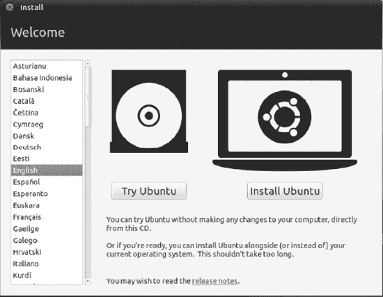
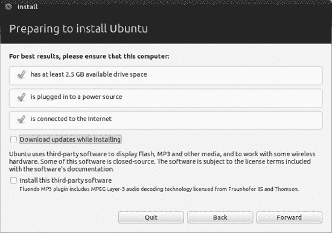
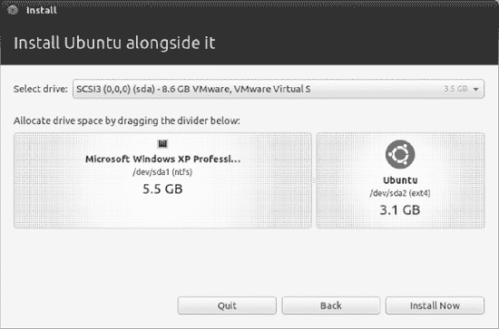
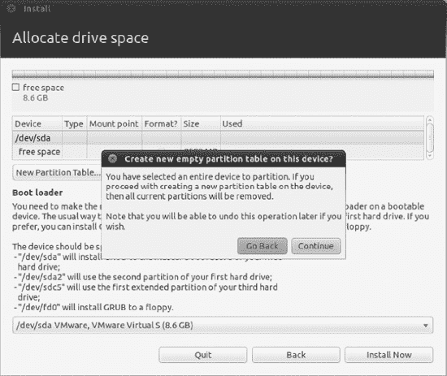
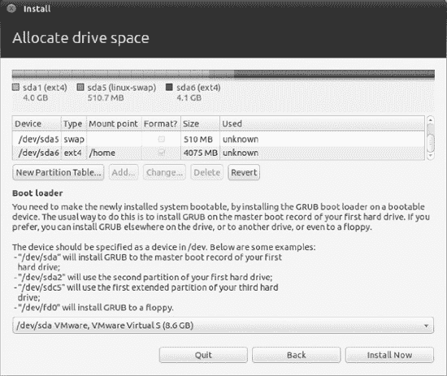
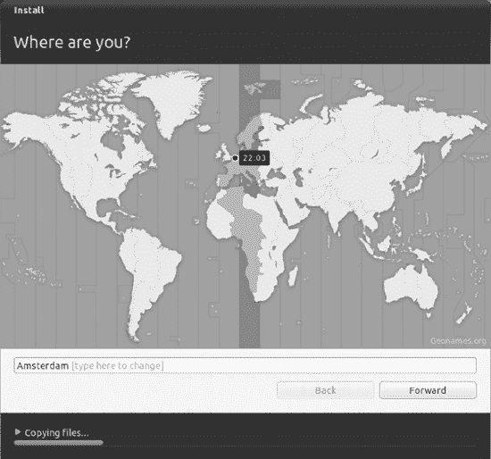
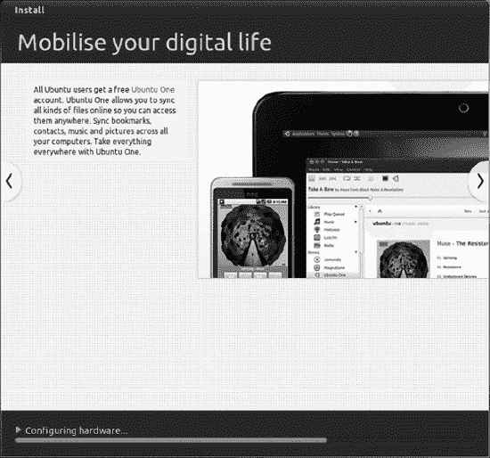
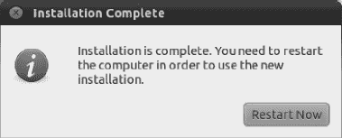
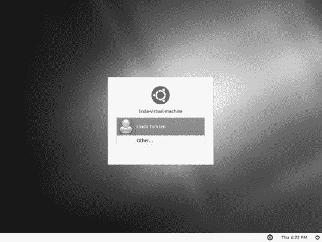

## T1】C H A P T E R 4

## 安装 Ubuntu

现在是时候安装 Ubuntu 了。在遥远的过去，安装有时很困难，但是开发者现在已经把它变成了一门艺术，所以在一台现代电脑上只需要 30 分钟左右。它也相对简单，自始至终只需要做很少的决定，并且需要大量的手把手。

然而，你应该检查所有提供给你的选项，以确保它们是正确的。安装操作系统涉及到几个严重的过程，这些过程有可能导致数据丢失。阅读并考虑你看到的每一条警告信息，并确保保持警惕。最重要的是，如前一章所述，事先备份你的数据。

### 安装过程概述

本书附带的 DVD-ROM 光盘是双面的。这意味着它就像一张黑胶唱片。要播放 A 面，只需将光盘 A 面标签放在最上面。要播放 B 面，插入光盘，B 面标签放在最上面。

A 面包含了本书所基于的 Ubuntu 的发布版本，11.04，代号为 Natty Narwhal。这是我写作时 Ubuntu 的最新版本。B 面包含以下内容:

 **注**如果你愿意，你也可以免费复制本书附带的 DVD，并把拷贝送给朋友。事实上，这是受到鼓励的。

> *   The 32-bit "standby installation" version of Ubuntu 11.04 can be used to set up automatic deployment, upgrade from old installations without network access, LVM and/or RAID partition, and install on systems with less than 256MB of memory.
> *   The 11.04 (Natty Narwhal) version of Kubuntu and Xubuntu, if the default desktop environment GNOME of ubuntu doesn't suit your taste, provide an alternative desktop environment, and Edubuntu, which provides a layer of educational content based on the standard ubuntu installation. For more details about these versions of Ubuntu, please see Appendix D. 。
> *   Ubuntu version of the picture, it provides a simplified interface, developers think it is more suitable for smaller screens on netbooks.

如果您想尝试 DVD B 面上的某个安装程序，首先需要将其刻录到 CD(或 DVD，如果是 Edubuntu 映像)。该程序在附录 d 中讨论。

然而，大多数读者会希望安装 Ubuntu 的默认版本。因此，要开始工作，将 A 面插入 DVD-ROM 驱动器并启动计算机。您可能需要将 BIOS 设置为从 DVD 启动，如本章安装指南的第 2 阶段所述。

如果您曾经在计算机上从头安装过 Windows，您可能会习惯使用 Windows 安装程序。当您从 Windows CD 或 DVD 启动或从您想要升级的 Windows 版本的桌面运行`setup.exe`程序时，它会自动出现，并引导您将 Windows 安装到硬盘上。

Ubuntu 有点不一样。从 DVD-ROM 启动后，会出现一个菜单。您可以选择安装 Ubuntu 选项，DVD 将继续引导至图形安装程序。或者，你可以选择尝试 Ubuntu 选项。这允许你从 DVD-ROM 上运行 Ubuntu，有效地试用它而不需要对你的电脑做任何改变。

在没有安装到硬盘上的情况下使用 Ubuntu 被称为在 *live 发行模式*下运行。虽然这是一个偷窥 Ubuntu 提供的东西的好方法，但是有一些事情需要注意，正如在标题为“在 Live 发行版模式下运行”的边栏中所讨论的。

要在你的电脑上安装 Ubuntu，只需从欢迎窗口中选择安装 Ubuntu 选项。这将运行专用的安装程序，它将通过几个阶段把 Ubuntu 安装到你的电脑硬盘上。在安装阶段，您会被问及一些基本问题，并被引导完成在电脑上为新操作系统创建空间的过程。之后，Ubuntu 就被安装到你的硬盘上了。

在这个过程的最后，你的电脑会直接启动进入 Ubuntu 登录界面，你就可以开始了。没有必要去配置硬件，因为几乎所有的事情都是自动完成的。很整洁，是吧？

在大多数情况下，安装过程会顺利进行。但是如果你真的遇到了问题，去看看第 5 章吧，它解决了许多最常见的问题并提供了解决方案。

以实时发行模式运行

如果你还不想安装 Ubuntu，你可以直接从本书附带的 DVD 启动操作系统来试试。例如，您可能希望这样做，以突出任何潜在的硬件问题，或者如果您正在拜访朋友并希望在他们的 PC 上启动到熟悉的桌面。为此，只需插入 DVD-ROM，然后重新启动计算机。确保电脑设置为从 DVD 启动(请参阅本章安装指南的第 2 阶段以了解如何启动)，并选择“试用 Ubuntu 11.04”选项。过一会儿，Ubuntu 桌面就会出现。根据计算机的速度和内存容量，此过程可能需要一些时间，请耐心等待。在 live 发行版模式下运行时，您可以阅读本书的大部分章节，甚至可以将数据(文档、下载等)保存到 USB 驱动器中。但是，您应该注意以下问题:

> *   *Settings:* Any changes you make to the system will be forgotten after you turn off or restart the computer. In other words, every time you run in live distribution mode, it is as if Ubuntu is newly installed. For example, if you configure the network card or rearrange the desktop, these changes will be lost. There are many ways to avoid losing settings every time you restart, but they need to partition your hard disk. Frankly speaking, it is as laborious as installing Ubuntu from scratch. So it's not good to do so.
> *   *Performance:* Because data must be read from DVD-ROM, running Ubuntu in live distribution mode is a slow and frustrating experience. If your DVD-ROM is a model that makes a whirring sound when rotating, it will also be very noisy.
> *   *System:* It sounds strange. Ubuntu basically doesn't know when it runs in live distribution mode. For example, if you follow the instructions in Chapter 8, which discusses how to update your system, Ubuntu will try to update it, even if it runs in live distribution mode! Of course, it can't do this, because as far as it is concerned, DVD-ROM is a hard disk, so it is impossible to write data into it. This may result in confusing error messages.
> *   *Data risk:* When running in real-time release mode, you actually have unlimited control over the system. This means that you can repartition the hard disk, or even completely erase the hard disk without any password prompt or warning. This is useful in some cases-you can try to use the real-time distribution mode of Ubuntu CD to "save" the problematic hard disk. However, it is a huge risk to use it for daily tasks, and the possibility of accidental damage is very high.

简而言之，我们建议你谨慎使用 live 发行版模式，仅仅是为了体验一下 Ubuntu 是什么样子的。如果你打算长时间使用 Ubuntu，那就冒险把它安装到你的硬盘上。有些情况下，你可能需要借或租一台电脑来进行网上交易。在这种情况下，使用 Live CD 是一个很好的解决方案，可以确保系统不会感染蠕虫、病毒等。

### 逐步安装指南

正如第 3 章所述，在你确定硬盘上有足够的空间安装 Ubuntu 并且你已经备份了所有数据之前，你不应该开始安装过程。这些准备工作完成后，你就可以安装 Ubuntu 了。本章的其余部分将指导您完成这一过程。

#### 第一阶段:准备调整 Windows 分区的大小

我们建议你在专用电脑上运行 Ubuntu。这为您带来了许多好处，例如，您不必为当前的安装冒任何风险。(毕竟，如果您试图将您的计算机配置为 Windows 和 Linux 双引导，事情可能会出错)。如果你确实想在已经安装了 Windows 的电脑上安装 Ubuntu，那么在真正安装 Ubuntu 之前执行另外三个步骤是个好主意。这些步骤将确保 Ubuntu 能够成功地调整 Windows 分区的大小。

如果你的电脑没有安装 Windows，或者你正在第二块硬盘上安装 Ubuntu，你可以直接跳到第二步。

以下是准备调整 Windows 分区大小的步骤。您需要在 Windows 环境中执行以下步骤:

> 1.  Scan disk error.
> 2.  Defragment the hard disk.
> 3.  Make sure Windows shuts down correctly.

要扫描磁盘，请打开我的电脑(如果运行的是 Windows Vista 或 7，则打开我的电脑)，右键单击 Windows 驱动器(通常是`C:\`)并选择属性。在出现的窗口中，单击工具选项卡，然后单击错误检查标题下的立即检查按钮。确保“自动修复文件系统错误”旁边有一个复选标记，然后单击“开始”按钮。下次计算机重新启动时，系统会提示您安排磁盘检查。选择这样做并重新启动计算机，这样磁盘检查就可以进行了。

电脑重启后，就该整理磁盘碎片了。Windows 在磁盘上存储数据的方式可能不整洁。随着时间的推移，文件会被分割成碎片，分散在整个 Windows 分区中。对分区进行碎片整理不仅会使 Windows 运行得更快，还会在分区的开头合并文件，使您能够进一步缩小分区，并在释放的空间中为 Ubuntu 创建更大的分区。重复上述步骤，查看驱动器属性对话框的工具标识栏，然后单击立即整理按钮。然后通过碎片整理程序的选项对 Windows 磁盘进行碎片整理(如图[图 4-1](#fig_4_1) 所示)；通常这包括简单地点击碎片整理按钮(在 Windows Vista 下标记为“立即碎片整理”,在 Windows 7 下标记为“磁盘碎片整理”)。

安装完成后(如果您的计算机之前没有进行碎片整理，可能需要几个小时)，照常关闭计算机并继续安装过程的第 2 阶段。

计算机正确地自动关机是至关重要的。如果电脑没有完全关机，Ubuntu 的安装程序可能会停止，并显示一条错误信息，提示无法调整分区大小。

***图 4-1。在安装 Ubuntu 之前，有必要对 Windows 分区进行错误扫描和碎片整理。***

在 WINDOWS 内部安装 UBUNTU

Ubuntu 包括一个叫做吴彼的聪明软件，可以让你在 Windows 文件系统中安装 Ubuntu。除此之外，吴彼提供了一种更安全的双重启动 Windows 和 Ubuntu 的方法，因为你根本不需要创建分区。从用户的角度来看，分区安装和吴彼安装没有太大区别。但是有一个重要的区别。因为吴彼安装在 Windows 文件系统之上，你的 Ubuntu 安装会比安装在真实硬件上的系统慢很多。因此，你可以在吴彼环境中随意探索不同的 Ubuntu 选项，但是如果你真的想认真使用 Ubuntu，直接把它安装在你的电脑硬盘上。

吴彼通过创建回送文件系统来工作，也就是说，它在 Windows 文件系统中创建一个大文件，然后该文件被用作 Ubuntu 文件系统。

吴彼是一个比使用 live 发行版模式更长久地试用 Ubuntu 的好方法。吴彼至少需要 256MB 内存和 5GB 硬盘空间，但这对大多数现代计算机来说应该不成问题。然而，用户报告称，与安装在自己分区中的专用 Ubuntu 相比,的性能有所下降，而且你还会发现 Ubuntu 有用的休眠节能模式(Windows 称之为挂起到磁盘)不受支持。

不幸的是，由于技术原因，吴彼没有包含在 Ubuntu 的 DVD 发行版中，这本书附带的 DVD-ROM 光盘的 A 面提供了这个版本。要使用它，你需要从光盘 B 面提供的 Ubuntu 安装 ISO 镜像中刻录你自己的 CD-R/RW 光盘。要了解如何做到这一点，请遵循附录 d 中的说明。

要使用吴彼，请在 Windows 启动并运行时插入光盘。在出现的对话框中，单击“在 Windows 中安装”按钮。如果对话框没有出现，导航到 CD 的内容并双击`wubi.exe`。在下一个对话框中，您将看到一系列下拉列表。使用这些选项，您可以选择在哪个驱动器上创建 Ubuntu 文件系统(如果您有多个硬盘或分区),并且您可以选择想要创建的环回文件系统的大小。在大多数情况下，默认选项就可以了。您需要在提供的框中输入用户名和密码。这些将构成你的 Ubuntu 登录细节。完成后，单击“下一步”按钮。

然后，吴彼将创建环回文件系统。完成后，会邀请您重新启动计算机。电脑重新启动并运行后，你会看到一个引导菜单，你可以从中选择 Windows 或 Ubuntu。选择 Ubuntu 将启动安装程序，它将自动完成。接下来，系统会提示您重新启动。从那时起，从引导菜单中选择 Ubuntu 选项将启动 Ubuntu。要启动 Windows，只需从菜单中选择 Windows 选项。

要从 Windows 硬盘中删除 Ubuntu 文件系统，请在 Windows 中导航至`C:\ubuntu`，然后双击`Uninstall-Ubuntu.exe`。不要试图删除 Ubuntu 文件夹，因为这样做不会删除引导菜单组件。

#### 第二阶段:从 DVD-ROM 启动

启动电脑，将 Ubuntu 光盘插入 DVD-ROM 驱动器，A 面朝上。关闭托盘并重新启动计算机。光盘可能会在 Windows 下自动运行，打开一个菜单，你可以点击它找到更多关于 Ubuntu 的信息，但是你可以忽略它。

因为你需要从 DVD-ROM 光盘启动来运行 Ubuntu 安装程序，所以第一步是确保你的计算机的 BIOS 设置正确。最好的方法是确保启动 DVD 在计算机的光驱中，然后重新启动计算机。如果你看到了 Ubuntu 的安装程序，你就好了。如果没有，您需要下面描述的过程。

许多现代计算机让您在计算机的初始引导阶段，在内存测试和驱动器识别期间按下特定的键，以使引导菜单出现。通常这是 F8、删除或 Esc，但是您应该留意引导消息以识别正确的键。在启动菜单上，您可以从列表中选择从 CD 或 DVD 驱动器启动。

如果您没有从 CD/DVD 驱动器引导的选项，您需要进入 BIOS 设置程序并更改计算机的引导优先级。为此，请在计算机首次激活后立即按 Delete 键。同样，有些计算机使用另一个键或组合键，你的启动屏幕应该指出按哪个键。

当 BIOS 菜单出现时，寻找一个菜单选项，如 Boot，并选择它(您通常可以使用光标键浏览 BIOS 菜单屏幕，并通过按 Enter 键选择选项)。在新菜单上，查找单独的条目，如引导设备优先级或引导顺序。确保 CD/DVD-ROM 的条目位于列表的顶部。整理列表，使 CD/ DVD-ROM 之后是软盘驱动器，然后是主硬盘。您通常可以按 F1 键来获得菜单选择系统如何工作的帮助。

完成更改后，一定要选择保存并退出选项。然后你的电脑会重启并从 Ubuntu DVD-ROM 启动，你会看到 Ubuntu DVD 启动菜单。

 **注意**在你的电脑上安装了 Ubuntu 之后，你可以选择重复这一步，再次重新安排启动顺序，让硬盘出现在列表的最上面。这样，您的电脑就不会浪费时间在每次启动时检查 DVD-ROM 驱动器中的启动光盘。

#### 第三阶段:试用或安装

当 DVD-ROM 启动时，在几秒钟内，您会看到屏幕底部有一个带有两个小图标(一个键盘和一个辅助功能符号)的紫色背景，这表明按下键盘上的任何键都可以使用辅助功能，如屏幕阅读器。大多数人可以离开引导序列继续。

然后，根据您的机器速度，您会看到一个进度指示器，大约一分钟左右，之后会出现安装程序窗口([图 4-2](#fig_4_2) )。

***图 4-2。**安装程序的欢迎屏幕:选择测试系统，或者安装它。*

英语是安装程序的默认语言，但窗口左侧的选择列表提供了超过 60 种其他语言的选择，提醒我们 Ubuntu 是一个多么令人惊讶的国际项目。

欢迎窗口提供的两个主要选项如下:

> *   *Try Ubuntu:* This option allows you to run Ubuntu "in real time" from the DVD-ROM disc, so you can try its features, although in a slightly limited state (see the sidebar "Run in real-time distribution mode"). If you have never seen Ubuntu start and run before, choose this option and give it a try. When you are ready to try, you can click the installation icon on the desktop.
> *   *Install Ubuntu:* This will start the Ubuntu installation routine. Select this option if you want to install Ubuntu directly on your computer.

此窗口上的文本链接也为您提供了阅读 Ubuntu 11.04 发行说明的机会。发行说明通常包含软件发布时已知问题的列表。简单地看一下它们可能是个好主意，但是这两者都不是必须的。

 **注意**当紫色背景第一次出现在启动 DVD-ROM 时，按一个键会调出另一个启动菜单。如果标准图形安装程序在您的硬件上显示有问题，这允许您激活辅助功能、测试计算机内存或启动文本模式安装程序。很可能你不需要这些选项。

#### 第四阶段:准备安装 Ubuntu

你现在看到的第一个窗口叫做准备安装 Ubuntu。它会要求您确保至少有 2，5 GB 的可用磁盘空间，已接通电源，并且当前已连接到互联网。它还会询问您是否想在安装时下载更新。为了确保您使用的是所有软件的最新最好版本，这样做是个好主意。此外，它还显示了安装特定第三方软件的选项。这是一个尚未作为开源软件发布的软件，但无论如何，它在你的电脑上总的来说是有用的。在单击“前进”继续之前，最好选择这两个选项。

***图 4-3。**准备安装 Ubuntu:确保满足最低要求！*

#### 第五阶段:对你的硬盘进行重新分区

磁盘分区是安装过程中最重要的步骤之一，但不幸的是，这是一个很难理解的术语。分区是将硬盘划分为多个部分的过程，以便不同的操作系统或一个操作系统和一些数据可以存在于同一台计算机上，并使计算机相信存在多个磁盘。尽管这是一个复杂的主题，但 Ubuntu 尽力使分区变得简单。

Ubuntu 安装程序提供了几个磁盘分区选项。您不会同时看到所有这些选项，您看到的内容取决于安装程序在您的计算机上找到的内容:

> 与 Ubuntu 一起安装:如果安装程序在你的电脑上检测到当前的 Windows 安装，你会看到这个选项。通过选择这个选项，你将缩小 Windows 文件系统来为 Ubuntu 腾出空间。你还可以选择默认启动哪个操作系统。*   Replace Windows *yourversion* with Ubuntu: This option only shows whether Windows installation is detected on your computer. By selecting this option, you will delete Windows and all files in it. Please make sure that you have backed up all data before selecting this option!*   Erase the disk and install Ubuntu: This option is displayed on the computer with the operating system but no Windows. By selecting this option, you will use the entire disk, whether it already has some contents (that is, if the computer or hard disk is new, or if you want to overwrite the current operating system installation).*   Manual configuration: This option can be used regardless of what is currently on your computer. It allows you to resize the existing partition on the hard disk and install Ubuntu in the newly created free space. (If the disk does not have an existing partition, this option is not available. )

大多数在已经安装了 Windows 的电脑上安装 Ubuntu 的人会想要调整主分区的大小，如下所述。

如果你在一台没有安装操作系统的电脑上安装 Ubuntu，或者你想从电脑上完全擦除 Ubuntu，请按照下一节“擦除磁盘并安装 Ubuntu”中的说明进行操作。但是，请注意，这将完全擦除磁盘上的所有数据。

##### 在 Windows 旁边安装 Ubuntu

如果您的计算机已经安装了 Windows，这是默认的分区选项。Ubuntu 将检测主 Windows 分区，并建议调整大小的数量。

 **警告**如果 Windows 分区内没有足够的可用空间，你将无法调整其大小来为 Ubuntu 腾出空间。如果是这种情况，Ubuntu 安装程序会告诉你。关于释放空间的建议，请参见第 3 章。

默认情况下，Ubuntu 试图为自己获取尽可能多的空间，而不会过多地缩小现有分区。在我们重新制作的图 4-4 的例子中，安装程序决定将磁盘分成大约 50/50，给两个操作系统足够的空间。这显示在条形显示中:条形的右边部分代表 Windows，左边部分代表新的 Ubuntu 分区。

Ubuntu 的默认选择通常是好的，但是您也可以单击并拖动分区显示栏中间的抓取栏来增加或减少 Windows 和 Ubuntu 分区的大小。如果你打算在 Windows 和 Ubuntu 之间分配时间，你可能想给 Windows 多一点空间。请记住，虽然 Ubuntu 可以读取 Windows 分区上的文件，但 Windows 拒绝在不安装任何额外软件的情况下读取文件。如果你需要这样做，你可以使用 ext2fsd Windows 工具，它可以帮助你从 Windows 打开 Ubuntu 文件系统。如果你想要一个简单的方法从 Ubuntu 和 Windows 中访问你的文件，这些文件应该存储在 Windows (NTFS 或 FAT)分区中。

Ubuntu 安装程序足够智能，不会让你为缩小现有分区设置一个不可能的值。Ubuntu 安装程序也足够聪明，它知道 Windows 需要在它的分区中有一些空闲空间来有效地运行——比如写临时文件、系统文件和用户创建的文件，比如 Word 文档。所以你不应该做出太极端的改变。在测试系统上，我们不能将现有分区的大小设置为低于整个磁盘的 10 %,因为分区上的现有数据占用了大约 10%的空间。您可以通过手动分区来覆盖这种保护，如本章的“手动编辑分区表”一节所述。类似地，安装程序不应该让你在向右拖动滑块时为 Ubuntu 创建不足的空闲空间。

下一次你启动 Windows 时，已经调整了你的 Windows 分区，很可能微软的磁盘检查程序会运行。这很正常。通常，它会在没有发现任何错误的情况下完成。此外，您可能需要重新注册 Windows，因为您已经对计算机硬件进行了重大更改。

***图 4-4。**安装程序将占用 Ubuntu 所需的空间，而不会过多缩小现有分区。*

做出选择后，单击前进按钮。在一条警告消息询问您是否真的要采取这个不可逆的步骤后，安装程序将调整分区的大小。这可能需要很长时间。

 **警告**如果你要调整笔记本电脑的分区大小，确保你已经接通了主电源。如果在调整大小的过程中因为电池故障而断电，那么你的 Windows 分区很有可能会被破坏。这当然也适用于台式电脑。如果你不想冒任何风险，请将其插入不间断电源以确保安全。

##### 使用整个磁盘

如果硬盘是空的，或者你已经决定在你的电脑上根除 Windows 而只使用 Ubuntu，你可以选择“用 Ubuntu 替换 Microsoft Windows”选项，如图[图 4-5](#fig_4_5) 所示。

如果磁盘确实有内容，这个选项将删除它们，然后使用整个磁盘来安装 Ubuntu。如第 3 章的[所述，在进行迁移之前，您应该从 Windows 分区(或硬盘上的任何其他分区)备份重要数据。没有简单的方法来撤销分区擦除，所以您应该小心行事。](03.html#ch3)

做出选择后，点按“前进”按钮。删除应该会很快发生，之后您可以直接进入本指南的下一个阶段。

***图 4-5。**如果你有一个未使用的磁盘，或者你正打算完全放弃当前的操作系统，选择“用 Ubuntu 替换微软视窗”选项。*

##### 使用最大的连续可用空间

如果您已经使用第三方实用程序对硬盘进行了重新分区，或者您有意创建了一个较小的 Windows 分区，以便为另一个操作系统留出可用空间，您可以选择“使用最大的连续可用空间”选项(请注意，除非硬盘上有可用空间，否则此选项不会出现)。然后 Ubuntu 安装程序将使用*最大的空闲空间*给 Ubuntu 分区。这是很重要的一点:如果你有一个以上的自由空间，最大的将被使用。

如果你有超过一个数量的空闲空间，Ubuntu 安装程序不能自动使用任何更少的空闲空间。如果您希望如此，唯一的选择是手动分区，如“手动编辑分区表”一节所述但是，只有高级用户需要这样做。

做出选择后，单击前进按钮，进入本指南的下一阶段。

##### 使用第二块硬盘

如果你的电脑有不止一个硬盘——一个你为 Ubuntu 添加的新硬盘，如[第 3 章](03.html#ch3)所述，或者第二个硬盘已经安装在你的电脑中——你应该在使用整个磁盘选项下选择它。Ubuntu 识别硬盘的方式起初看起来有点复杂，但实际上很简单。

大多数计算机通常有一个基于 SATA 的硬盘。如果是，第一个硬盘将被标识为`sda`，第二个被标识为`sdb`，第三个被标识为`sdc`。在每种情况下，所有的变化都是最后一个字母:`a`、`b`、`c`等等。

如果你的电脑使用的是旧的 IDE 硬盘，系统中的第一主驱动器被标识为`hda`，第一从驱动器被标识为`hdb`，第二主驱动器被标识为`hdc`，依此类推。驱动器还可以通过品牌和型号来识别，这可能有助于您识别它。你可能偶尔也会在新的驱动上看到 hda 设备。

假设第二个 IDE 硬盘作为从硬盘安装在主通道上，这是额外硬盘的标准配置，它将被标识为`hdb`，因此进行选择。如果磁盘作为从设备安装在辅助通道(即与 DVD-ROM 驱动器相同的通道)上，它将被标识为`hdd`。如果你使用的是 SATA 硬盘，第二块硬盘通常被标识为`sdb`。

选择磁盘后，点按“前进”按钮。

##### 手动编辑分区表

如果出于某种原因，您发现 Ubuntu 的默认分区选项不适合您，您可以选择手动编辑分区表。如果你想设计一个新的硬盘布局，你可以完全控制你的硬盘上发生的事情，这是非常有用的。其中一个好处是，如果使用这个选项，您可以创建不同的文件系统。如果你能有效地做到这一点，你就能减少硬盘被意外填满的机会。例如，您可能希望将操作系统安装从您的`/home`文件夹中分离出来。这种分离使得全新安装 Ubuntu 或另一个 Linux 变得容易，因为数据不会被改动。如果选择此选项，基本上需要经历两个阶段:

> *   You have the opportunity to repartition the disk manually. You can adjust or delete any existing partitions and create the partitions needed by Ubuntu.
> *   When creating/editing a partition, you will be asked to assign a *mount point.* You will be prompted to tell which partition on Ubuntu disk should be used for *root file system* (that is, the main partition used by Ubuntu) and which partition should be used for *swap partition* .

手动分区提供了极大的灵活性，但需要对 Ubuntu 的工作原理有较高的了解。因此，我们建议只有专家才能完成这一步，除非你别无选择，因为默认的 Ubuntu 分区选项不能提供你所需要的，或者不适合你。

在接下来的步骤中，我们将解释如何创建 Ubuntu 需要的新分区，并分配挂载点以便 Ubuntu 能够使用它们。在这个例子中，我们将从一个完全空闲的硬盘开始。如果你想安装一个 Ubuntu 和 Windows 共存的双引导系统，你应该遵循上面描述的步骤。或者，你可以使用一个外部实用程序来调整现有分区的大小，比如 GParted(见下面的提示)，来缩小现有分区并腾出空间来安装 Ubuntu。如果你已经这样做了，你可以应用下面的程序，在可用的空间里安装 Ubuntu。

 **提示** GParted 是一个图形化的分区工具，你可以使用它轻松地添加、编辑和删除分区。GParted 看起来类似于你可能已经用过的第三方商业分区工具。你可以通过在实时发行模式下启动 Ubuntu 并从 Ubuntu 菜单中选择 GParted 分区编辑器来运行这个工具。在你用这个分区编辑器做了想要的修改后，你可以重启并再次启动 Ubuntu 安装程序。然后，当您在安装程序中手动编辑分区时，您只需要在您在 GParted 中创建的分区上设置挂载点。

###### 准备分区

当磁盘分区选项出现时，点按“手动指定分区(高级)”单选按钮，然后点按“前进”。将出现准备分区窗口，如图[图 4-7](#fig_4_7) 所示。此窗口列出了 Ubuntu 检测到的硬盘及其对应的分区。每个项目都有以下属性:

> *   *Device:* This is the logical representation of hardware devices in Ubuntu. See the explanation of drive identification in the previous section, but please note that the drive reference here is preceded by `/dev`. This can be ignored. The number at the end refers to the order of partition. For example, `sda1` refers to the first partition of the first hard disk, and `sda2` refers to the second partition of the first hard disk.
> *   *Type:* Specify the file system type of the partition. For example, NTFS and VFAT are Windows file systems, ext4 represents Ubuntu partition, and swap represents swap file partition.
> *   *Mount point:* Mount point is a location (folder) in Ubuntu's file system, where Ubuntu will "see" a partition. At least one partition needs to be mounted as root, which is represented by a `/`. Installation will be further discussed in Chapter 10.
> *   *Format? :* This indicates whether to format the partition during installation. Formatting will destroy all data on the partition, so please make sure that you have a backup of important data and you really want to format it.
> *   *Size:* This determines the disk space of the partition, in megabytes.
> *   *Used:* This determines how much disk space has been consumed, in megabytes.

在窗口的底部是按钮来操作硬盘作为一个整体或每个单独的分区。对于硬盘，您可以选择创建一个新的分区表。这有效地将磁盘返回到新状态，没有分区信息。如果您想要重新分配电脑上的所有可用磁盘空间，最好使用此选项，因为它会将所有硬盘空间留作可用空间。

 **提示**知道这一点很好，只要你在分配驱动器空间菜单中，你总是可以使用恢复按钮恢复到原来的情况。所以，如果你不确定你在做什么，就回到起点重新开始。

一旦你有未分配的空闲空间，你可以添加一个新的分区。对于现有的分区，您可以选择更改其属性(此选项允许您调整磁盘大小并分配一个挂载点)或删除分区以积累可用磁盘空间。您还有一个恢复选项来撤消所有硬盘更改，这适用于除调整分区大小之外的所有所需更改，因为调整大小会在您选择这样做时立即执行，这与其他更改不同，其他更改会在完成所有安装阶段后执行。

***图 4-6。**创建一个新的分区表与完全擦除磁盘内容具有相同的效果。请小心使用。*

主分区(通常是您将要创建的第一个分区)将包含 Ubuntu 操作系统本身。这个分区应该至少有 3GB 的磁盘空间(2GB 用于基本安装，其余用于新应用程序、软件升级和您的数据)。

除了主分区，你还需要一个交换分区。交换分区类似于 Windows 下的交换文件(有时称为*虚拟内存*或*分页文件*，除了它驻留在自己的分区上。交换分区的传统目的是在主内存变满时充当附加内存，但是考虑到现代计算机中安装的大量 RAM，交换分区很少再用于此目的。Linux 还使用交换文件来存储“匿名页面”，即只存在于内存中而不存在于磁盘上的数据。如果没有 swap，当 Linux 想使用匿名页面占用的内存空间时，匿名页面将无处可去。此外，当计算机进入休眠(挂起到磁盘)节能模式时，交换文件用于存储物理内存的内容。这可能是您通常会在计算机上分配合理数量的交换空间的最重要原因。

交换分区的理想大小是一个争论不休的话题。建议通常取决于物理 RAM 的大小。如果您想在您的计算机上使用休眠功能，您的交换分区大小必须至少等于物理 RAM 的大小，否则休眠将失败。一些建议见[表 4-1](#tab_4_1) 。

除了主分区和交换分区之外，为/home 目录创建一个单独的分区也是一个好主意。这样做有几个好处:

> 它使你的电脑升级变得更容易(因为你可以告诉升级过程不要接触主分区，从而保证你的个人文件的安全。*   It ensures that your personal files will not fill the operating system environment and vice versa.*   It provides advanced options, such as the option to save your personal environment on an encrypted partition.

确定所有分区的大小后，计算它们的总大小。这是你需要为 Ubuntu 分配的空闲空间。

##### 编辑分区属性

###### 创建主分区和交换分区

下一步是用空闲空间创建分区。选择您创建的可用空间，然后单击“添加”...按钮。将出现创建分区对话框，如图[图 4-7](#fig_4_7) 所示。该对话框有五个选项:

> *   *is the new partition type:* This option allows you to set the partition as the main partition or logical partition. Unless multiple operating systems are installed on the hard disk, you should select the primary option. With the main partition, you can divide the hard disk into up to four partitions. If more than four partitions are required, or there are already three partitions on the disk, select the logical option. In this case, all other partitions you will create must also be logical partitions.
> *   *Size of new partition in megabytes:* This option sets the number of megabytes to be allocated to the new partition. The default value takes up all available space, but since you want to create several partitions, you should resize them accordingly. If your hard disk is large enough, 20 GB is a good minimum for the main partition, and you can allocate the remaining available disk space to the main partition to be created.
> *   *Location of new partition:* This option specifies whether the new partition is created in the start area or the end area of free space. You suggest using the beginning. In this way, you can easily see the free space, because it always appears directly under all partitions.
> *   *Usage:* This option specifies the file system of the new partition. The default option of Ext4 log file system is good for both the main partition and the partition where the home directory is placed.
> *   *Mount point:* Mount point is a directory, which will be used as a location where the disk can be accessed. The main partition you created for Ubuntu must be mounted as root. This is always represented by a forward slash (`/`). The main partition you will create later must be mounted as /home.

***图 4-7。**只要有可用/未分配的空间，您就可以创建新的分区。*

总而言之，您应该对主分区使用以下选项:

> *   New partition type: primary
> *   New partition size: megabytes: 20000
> *   New partition location: start
> *   Used as: Ext4 log file system
> *   Mount point:/

接下来，我们将创建交换分区。如果您不确定应该使用多大的空间，就让交换分区与计算机中的 RAM 大小一样大。将“用作”选项更改为“交换区域”。保持其余选项不变(注意交换分区不需要挂载点)。例如，如果物理 RAM 的大小是 2GB，那么交换分区的分区大小应该设置为 2，048MB。单击“确定”继续。

现在，您仍然需要为主目录添加分区。为此，从“分配驱动器空间”窗口中，再次选择可用空间(参见图？？？？？)并点击添加。因为您可以将所有剩余的磁盘空间分配给主分区，所以只需更改挂载点。确保将其设置为/home，然后单击“确定”继续。

现在你应该已经准备好分区了，如图 4-8 所示。此时，您可以单击“立即安装”继续。

***图 4-8。**配置好分区后，您就可以继续前进了。*

#### 第 6 阶段:配置您的区域设置

此时，您的电脑开始安装和复制文件。当它这样做的时候，你可以提供一些额外的信息，比如你的时区(见[图 4-9](#fig_4_9) )。很容易选择您的时区，只需点击显示的地图，指出您在地球的哪个部分，然后点击前进继续。接下来，您需要选择要在电脑上使用的键盘。完成后，单击前进继续。

***图 4-9。**当您的电脑开始复制文件时，您可以配置时区和键盘等区域设置*

#### 第 7 阶段:设置用户

接下来会提示你说出你是谁，并选择你想用来登录的名字。你的名字是什么？您可以输入一个名称，任何使用该名称的人都可以在系统上正式识别您。标准做法是使用您的名和姓，用空格隔开。

根据您在此输入的名称，会提供一个计算机名称。默认名称基于您的名字和计算机类型，但是您可以将其更改为您喜欢的任何名称，只要该名称在网络上是唯一的。

接下来，您可以指定想要使用的用户名。该用户名必须是唯一的；同一台计算机上的两个用户不能使用相同的用户名。此外，它必须遵循以下规则:

> *   The user name should be a word without spaces.
> *   You can choose any user name consisting of uppercase and lowercase letters and numbers, but you can't choose symbols or punctuation marks.
> *   The user name cannot start with a capital letter, although you can use capital letters in the rest of the name.

选择用户名最简单的方法是使用您自己的名字，全部用小写字母输入。例如，在[图 4-10](#fig_4_10) 中，我们将全名设置为 Linda Tomsen，登录名设置为 Linda。有益的是，Ubuntu 会自动将全名的第一部分添加到用户名空间。

***图 4-10。**您应该输入一个普通名称、一个登录名、一个密码，如果您愿意，还可以为您的电脑指定一个名称。*

在用户名之后，输入密码。这里的规则与你的用户名相反。一个好的密码包含数字，大写和小写字母，标点符号，以及任何你能在里面得到的东西！这有助于使您的密码几乎不可能被其他人猜到，从而使您的系统更加安全。(如果你想真正安全，创建一个十个或更多字符长的密码。)您需要输入两次密码；第二次确认你第一次没有打错字。

最后,“你是谁?”中还有两个更重要的选项。窗户。首先，您可以在自动登录和需要我的密码登录之间进行选择。只有在设置任何人都可以登录的 kiosk 电脑时，才选择自动登录，在所有其他情况下，您应该保留默认设置“需要我的密码才能登录”。最后，您可以选择“加密我的个人文件夹”选项。这确实是一个非常有用的选择。如果你的笔记本电脑被偷了，你很容易就能访问到你个人文件夹中的文件。如果您使用该选项来加密您的个人文件夹，如果没有您的密码，任何人都无法访问您的文件。因此，打开这个选项是个好主意。

完成后，点按“前进”按钮。

#### 阶段 8:导入文档和设置

下一步是通过将现有用户帐户的文档和设置从 Windows 分区导入到 Ubuntu 来迁移帐户。(如果你正在一个新的硬盘上安装 Ubuntu 或者已经选择覆盖你的 Windows 分区，你不会被提示这样做。)只需选择您想要导入到您帐户的项目。然后单击前进按钮继续。

这当然是安装程序提供的一个方便的特性，但是要不要使用它要三思。如果你有大量的数据，比如音乐和视频，存储在你的 Windows 分区上，使用迁移工具把它们复制到你的新 Ubuntu 分区上是没有意义的。你只是在同一个磁盘上复制了大量的数据，考虑到你的 Windows 分区在任何情况下都可以从你的新 Ubuntu 系统上访问，这是没有意义的。

#### 第 9 阶段:完成安装

此时，软件包被下载并安装。一旦完成，你就拥有了一个正常工作的 Ubuntu 系统，你会看到一个登录界面，在这里你可以选择你的用户名并输入你的密码。

#### 第九阶段:进行安装

现在你要做的就是等待！Ubuntu 安装例程会复制必要的文件并安装 Ubuntu，如图[图 4-11](#fig_4_11) 所示。它不需要你做任何进一步的输入，除非出错。例如，如果您在上一节中创建了太小的分区，这时您会被告知。如果遇到错误，安装程序将退出，您需要单击桌面上的图标重新启动，这一次相应地更改您的选择。

安装时间不会超过 30 分钟。在我们的大多数测试系统上，它只用了一半的时间就完成了。

***图 4-11。当 Ubuntu 文件被复制的时候，你可以读到它漂亮的特性和应用。***

#### 第十阶段:重启并享受 Ubuntu！

安装完成后，会出现一个对话框，告诉您重新启动计算机(参见[图 4-12](#fig_4_12) )。单击“立即重新启动”按钮后，DVD 将自动弹出。重要的是你要删除它，这样你就不会在机器重启时意外地再次启动 Ubuntu 的安装程序。事实上，Ubuntu 会提示您移除磁盘，并按 Enter 键确认移除。

随后，系统将重新启动。如果你在装有 Windows 的电脑上安装了 Ubuntu，你会首先看到 Grub 启动菜单。这提供了许多选择，包括引导 Ubuntu 进入恢复模式的机会，这可以帮助修复你的计算机(在第五章中讨论)。您也可以选择引导至 Windows。您可以使用箭头键在菜单选项之间切换；按 Enter 键进行选择。

***图 4-12。**你已经准备好开始使用 Ubuntu 了。*

你也可以运行 Memtest86 来测试你系统的内存。然而，当菜单出现时，大多数用户可以简单地按 Enter 键，这将选择最上面的条目，从而以正常模式启动 Ubuntu。或者，10 秒钟后，将自动选择默认选项。

如果你把 Ubuntu 安装在没有任何其他操作系统的电脑或硬盘上，系统将直接启动，不显示引导菜单(尽管如果需要，可以在启动时按住 Shift 键)。

Ubuntu 加载几秒钟后，你会看到 Ubuntu 登录屏幕，如图[图 4-13](#fig_4_13) 所示(除非你设置 Ubuntu 自动登录)。从这里开始，你可以进入[第 6 章](06.html#ch6)学习如何开始。或者，如果你遇到任何问题，参见[第 5 章](05.html#ch5)。

***图 4-13。**当电脑安装后重启，标准的 Ubuntu 登录界面就会出现。*

在苹果电脑上安装 UBUNTU

Ubuntu 也可以在苹果麦金塔电脑上运行，也可以在个人电脑上运行。但是，根据 Macintosh 中安装的处理器，说明会有所不同。若要了解您的 Mac 使用哪种类型的处理器，请点按苹果菜单并选择“关于本机”。在摘要对话框中，查找处理器标题。如果你的电脑已经用了五年以上，那一行可能会显示“PowerPC”，你应该参考那个标题下的说明。如果您的是较新的 Mac，并且该行包含“Intel”和任何其他单词的组合，如“Intel Core i5”，请继续以下说明。

**<ins>【英特尔】</ins>**

如果你的 Mac 包含 Intel 处理器，你也许可以从本书附带的 DVD-ROM 启动，并用它来安装 Ubuntu。然而，一些额外的步骤是必要的。如果您使用的是 Mac OS X 10.5“Leopard”或 10.6“Snow Leopard”，您可以使用 Apple 的 Boot Camp 实用程序(位于“应用程序”实用程序中)来调整现有 Mac OS X 分区的大小。Boot Camp 还用来提供一个启动菜单，让你在 Mac OS X 和 Ubuntu 之间切换。然而，Boot Camp 被设计成允许 Windows 与 Mac OS X 一起安装，所以需要一些额外的步骤才能使它与 Ubuntu 一起工作。官方 Ubuntu wiki: `[https://help.ubuntu.com/community/MacBook](https://help.ubuntu.com/community/MacBook)`提供了完整的指南。

如果你运行的是 Mac OS X Tiger (10.4)，你可能要考虑使用名为 rEFlt ( `[http://refit.sourceforge.net](http://refit.sourceforge.net)`)的第三方引导菜单软件。这个工具也可以用在豹和雪豹代替新兵训练营。

按照指南正确配置电脑后，您可以从 DVD-ROM 启动，并按照本章其余部分的说明进行操作。在从 DVD-ROM 光盘启动的过程中，当 Apple 符号出现时，按住 C 键(或者在旧系统中，按住 Cmd+Shift+Option+Delete)。

**<ins>PowerPC</ins>**

Ubuntu 也可以在基于 PowerPC 处理器的 Mac 上运行，尽管必须使用特殊版本。请注意，赞助 Ubuntu 的 Canonical 公司不再在这种架构上提供 Ubuntu 的官方版本。当前版本仅由社区支持。Ubuntu 10.04 的 PowerPC 版本可以从`[http://cdimage.ubuntu.com/ports/releases/natty/release/](http://cdimage.ubuntu.com/ports/releases/natty/release/)`下载。选择标题为`Mac (PowerPC)`和`IBM-PPC (POWER5) desktop CD`的链接。一旦你把这个 ISO 镜像保存到磁盘上，你需要手动把它刻录到一个空白的 CD-R 或 CD-RW 上，然后从那里启动来安装 Ubuntu。然而，首先你必须在硬盘上创建一些空闲空间，这样你就可以在你现有的操作系统旁边安装 Ubuntu(假设你想双启动 Mac OS X 和 Ubuntu；如果你想让 Ubuntu 使用整个硬盘，Ubuntu 安装程序将能够擦除现有的分区，不需要进一步的操作)。从 Mac OS X 安装 DVD-ROM 启动并退出安装程序。然后使用菜单中的“磁盘工具”来调整硬盘大小，以便腾出空间。

要在 Mac OS X 中创建 Ubuntu 安装光盘，请插入空白 CD-R 或 CD-RW，然后启动“磁盘工具”。选择图像刻录，导航到您下载的`ubuntu-10.04-desktop-powerpc.iso`文件，然后单击刻录按钮。刻录完成后，按照本章提供的说明使用光盘启动并安装 Ubuntu，。在从光盘启动的过程中，当 Apple 符号出现时，按住 C 键(或在旧系统上按住 Cmd+Shift+Option+Delete)。

**<ins>虚拟选项</ins>**

许多苹果电脑用户选择在 OS X 的虚拟机上运行 Ubuntu，而不是在本地安装和运行。正如在第 3 章[的“虚拟化”边栏中所讨论的(这里我们列出了 Mac OS X 的主要虚拟化软件选项)，这可能是一个方便且无风险的选择，无论你是一个想要尝试 Ubuntu 的普通用户，还是一个想要在一台机器上访问 OS X、Linux 和 Windows 的软件开发人员。然而，虚拟化是一种妥协，无论是在性能上——因为 Ubuntu 必须与主机操作系统竞争硬件资源——还是在对专有软件的严重依赖上。选择权完全在你！](03.html#ch3)

### 总结

按照本章概述的步骤，你现在应该已经在你的电脑上安装了 Ubuntu。我们试图为您提供足够的信息来解决某些问题，并解释安装的每个步骤。

唉，你仍然有可能遇到这里没有提到的障碍。在下一章，你将会找到与 Ubuntu 安装相关的常见问题的解决方案。