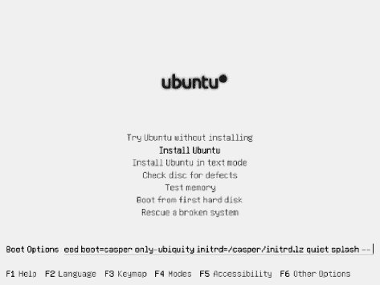

## T1】C H A P T E R 5

## 解决安装问题

很有可能你的 Ubuntu 安装会很顺利，你会发现自己在几分钟内就拥有了一流的操作系统。然而，问题有时确实会出现，所以我们列出了一些常见问题及其解决方案，这应该能让你摆脱困境。这些问题是按发生的时间来组织的:(A)在你启动 Ubuntu 的 live 发行版模式之前；(B)在运行安装程序时；以及(C)安装完成后，第一次启动时。本章的最后一节描述了如何使用 X.org 配置实用程序配置图形子系统，如果出现图形故障，该实用程序会很有用。最新版本的 Ubuntu 有一个包罗万象的恢复模式，应该可以协助解决很多问题。

### A .预安装问题

在你启动 Ubuntu 的 live 发行版模式来运行安装程序之前，可能会出现一些问题。本节讨论这些问题。

#### 光盘无法启动

当我从 Ubuntu DVD-ROM 启动时，驱动器旋转起来，好像发生了什么事情，但我在屏幕上看不到任何东西或奇怪的图形。

##### 解决办法

DVD-ROM 光盘可能不干净或有故障。检查其表面是否有划痕，或者尝试用柔软的无绒布清除灰尘。脏的或损坏的光盘的一个典型标志是驱动器向上旋转，然后连续几次立即向下旋转，请听驱动器电机的嗡嗡声来判断是否是这种情况。

如果光盘看起来正常，可能是您的电脑没有设置为从 DVD 启动，或者无法显示 Ubuntu 启动菜单。在前一种情况下，你需要在计算机的 BIOS 中重新定义引导顺序，如第 4 章中所述。要解决后一个问题，当您看到空白屏幕或图形损坏时，请按两次 Escape 键。然后按回车。你会在屏幕的左上角看到单词`boot:`，以及一个可以输入命令的提示。键入 **live** 并按回车键。

#### 电脑出现内核死机

DVD 开始启动，但随后电脑死机，并最终显示一条类似“内核崩溃”的信息

##### 解决办法

当 Ubuntu 由于各种原因无法继续加载时，会出现内核崩溃错误。在这种情况下，很可能是 DVD 有故障(或脏)或 PC 有硬件问题。

首先，检查以确保 DVD 是干净的，没有划痕。如果可能，请在不同的计算机上尝试。如果它能工作，那么它显然没有问题，您的计算机很可能有硬件问题。特别是，糟糕的记忆会导致问题。计算机是否已经安装了操作系统？它运行起来没有问题吗？如果没有，请考虑更换内存模块。

要彻底测试计算机的内存，请从 Ubuntu DVD 启动，在第一次看到 Ubuntu 徽标时按任意键，然后选择菜单上的测试内存选项(使用箭头键在列表中上下移动，并按 Enter 键进行选择)。这将运行 Memtest86 程序，任何内存问题都将在程序屏幕右侧的错误栏中报告。有关如何使用 Memtest86 的更多详细信息，请参见`[www.memtest86.com](http://www.memtest86.com)`。

#### DVD 开始启动，但屏幕空白或损坏

在 DVD 开始启动后不久，电脑看起来就像死机了一样——屏幕变得一片空白，或者显示器看起来乱糟糟的！

##### 解决办法

您的图形卡可能与 Ubuntu 引导程序使用的 framebuffer 图形模式不兼容，或者与新的内核模式设置技术不兼容，该技术现在默认情况下在大多数常见的视频芯片组上启用。您可以通过以下步骤来解决这些问题:

> 1.  Restart the computer and make sure to boot from Ubuntu DVD. As soon as you see the startup menu. Select your language and press F6\. This will display a list of kernel boot options. Press Escape to exit the menu.
> 2.  Then you will see a cursor at the end of a line beginning with `Boot Options`. Use the backspace key to delete `quiet splash` at the end of the line, as shown in figure [and figure 5-1](#fig_5_1) . Then press enter.

如果问题仍然存在，重新启动，按键进入启动菜单，选择您的语言，并再次按 F6 调出启动选项。这次使用箭头和空格键/回车键从列表中选择`nomodeset`。按下 Escape，然后输入。

您可以尝试手动添加的其他引导选项包括:

> *   `i915.modeset=0` (for older Intel graphics cards)
> *   `xforcevesa`
> *   `fb=false`

***图 5-1。**在启动菜单中按下 F6，您可以从内核选项菜单中选择或手动编辑选项。*

#### 安装过程中电脑死机

在我选择了菜单上的安装 Ubuntu 选项后，状态栏出现了，但是电脑却死机了。

##### 解决办法

可能是电脑中的节能功能或高级可编程中断控制器(APIC)导致了问题。再次启动 DVD，当您看到屏幕底部有两个小图标(一个键盘和一个辅助功能符号)的紫色背景时，请按任意键。选择您的语言，然后按下 F6 键，调出内核启动选项列表。使用箭头键导航，使用空格键/Enter 选择或取消选择选项，确保选择了以下三个选项:

> *   `acpi=off`
> *   `noapic`
> *   `nolapic`

然后按 Escape 退出引导选项菜单，回车引导 Ubuntu。

#### 安装程序“不可恢复的错误”消息

*启动 DVD 失败，并显示消息“安装程序遇到不可恢复的错误。现在将运行桌面会话，以便您可以调查问题或尝试重新安装。*

##### 解决方案

可以解决这个问题的两个解决方案是:

> *   Ubuntu's release notes suggest that you restart the DVD, press any key on the splash screen (when you see two small icons at the bottom of the screen) to enter the startup menu, select "Try Ubuntu without installation", and then use the "Install Ubuntu 11.04" icon when live Desktop appears.
> *   Enter the BIOS settings of the computer and disable the floppy disk. Or, if your computer has a floppy disk controller, but there is no floppy disk drive connected, and you may want to use this ancient technology occasionally, please install a floppy disk drive and restart.

#### 在安装过程中，我的笔记本电脑显示屏看起来损坏了

我正试图在一台笔记本电脑上安装 Ubuntu。在我选择安装 Ubuntu 选项并按下回车键后，屏幕上充满了图形损坏，看起来好像 Ubuntu 已经崩溃了。(或者，屏幕看起来被压扁了，或者某些元素偏离了屏幕的中心或边缘。)

##### 解决办法

当 Ubuntu 启动菜单出现时，按两次 Escape 键，然后按 Enter。在`boot:`提示符下，键入 **live vga=771** 。然后按回车。这将在安全的 VGA 分辨率下启动实时模式。系统加载后，您应该能够更改分辨率。如果这没有提供想要的解决方案，再次启动你的计算机，这一次，在`boot:`提示符下，键入`live vga=normal`。您还可以添加 vga=ask 来选择分辨率和类型(VGA/VESA)

#### 我正在使用 KVM，但屏幕看起来不正常

得益于键盘、视频和鼠标(KVM)开关，我在几台电脑上使用相同的键盘、鼠标和显示器。Ubuntu 启动时分辨率不对，图形损坏。(另外，我的键盘或鼠标不能正常工作。)

##### 解决办法

KVM 切换器可能不允许 Ubuntu 正确探测连接的硬件。考虑在安装期间将键盘、显示器和鼠标直接连接到计算机上。安装完成后，您可以重新引入 KVM，一切都会好的。

这些解决方案都不起作用！

如果您遇到安装问题，但在这里找不到解决方案，您可以尝试使用替代安装程序。这将需要作为映像刻录到 CD 上，并像以前一样启动。

我们提供了一个使用替代安装程序的 Ubuntu 版本的 ISO 镜像。这可以在 DVD-ROM 的 B 面找到。你可以在附录 d 中了解更多。

不幸的是，这里没有空间提供完整的安装指南，尽管大多数安装选项应该大致对应于第 4 章中讨论的选项。

### B .安装问题

在 DVD-ROM 以实时发行版模式启动，并且运行了安装程序后，您可能会收到错误信息或遇到其他困难。本节提供了一些常见安装问题的解决方案。

#### 我只能通过短信登录

我对我的磁盘进行了分区，然后点击开始安装，之后出现了安装系统进度条。但是，它会在某个百分比停止，并显示一条错误消息。如果我单击“继续”按钮，一切都会继续，最后我会有机会重新启动到新的安装中。然而，当我重启时，Ubuntu 桌面没有出现。相反，我看到的是一个带有文本模式登录提示的黑屏。

##### 解决办法

出于某种原因，重要的 Ubuntu 软件没有被正确地复制到机器上。确保 DVD 在您计算机的驱动器中，在前面提到的文本模式登录提示符下，键入您的用户名并按 Enter 键。要求时键入您的密码，然后按 Enter 键。请注意，在您键入密码时，您将看不到任何字符，无论是屏蔽字符还是其他字符。然后，在命令提示符下，键入以下内容，并在每行后按 Enter 或 Return 键:

`sudo apt-get update
    [At this point you'll need to type your password; do so]
sudo apt-get −f install
sudo apt-get install ubuntu-desktop`

如果这不起作用，请按照“这些解决方案都不起作用！”侧边栏，并使用备用安装程序安装 Ubuntu。

#### 电脑找不到我的硬盘

当 Ubuntu 安装程序进入分配磁盘空间阶段时，它报告说在我的电脑中找不到任何硬盘。

##### 解决方案

这有许多可能的原因，但这里有三个潜在的解决方案，您可以依次尝试:

> 1.  Select "Manual Configuration (Advanced)" and click the forward button. You should see a list of hard disks showing each partition, and then you should be able to follow the instructions under the heading "Manually edit partition table" in chapter 4 of [.](04.html#ch4)
> 2.  Make sure the jumper settings on the hard disk are correct (consult the hard disk documentation if necessary). This is especially worth checking if you have more than one hard disk installed in your computer. If this doesn't solve the problem, and your second hard disk is not bootable (that is, it is only used for data storage), try to temporarily remove it and then install Ubuntu. Reconnect after installation.
> 3.  See "None of these schemes work!" Learn how to use the alternate installer. This contains an old installer, which many people think is more reliable on some problematic computers.

#### 我在分区器里看到很多硬盘

*当我试图安装 Ubuntu 时，准备分区屏幕显示一个(或几个)额外的小硬盘，通常标识为* `/dev/sda` *或类似的，后跟一个数字。*

##### 解决办法

如果你插入了一个 USB 记忆棒，或者一个有卡的读卡器，Ubuntu 安装程序会以这种方式识别它。您可以忽略这一点，或者，如果您想避免混淆，退出安装程序，删除记忆棒或读卡器，并重新启动安装程序。请注意，许多装有 Windows Vista 或 Windows 7 的电脑可能在主硬盘上有一个系统还原分区，它也会显示在此处。

#### 我有太多的分区

手动分区时，我看到一条错误消息，大意是我不能拥有超过四个主分区。

##### 解决办法

这是硬盘工作方式的限制，不是 Ubuntu 的问题。一个硬盘只能包含四个主分区，但这可以通过将这些分区进一步细分为逻辑分区来扩展，如第 4 章中所述。要解决此问题，在创建新分区时，选择逻辑作为分区类型。

有关主硬盘分区和扩展硬盘分区的更多详细信息，请参见`[http://en.wikipedia.org/wiki/Disk_partitioning](http://en.wikipedia.org/wiki/Disk_partitioning)`。

### C .安装后的问题

安装 Ubuntu 后也可能出现问题。本节解决了几个可能的安装后问题。本节只讨论安装后立即出现的问题——那些阻止 Ubuntu 在第一次启动后立即正常工作的问题。围绕硬件或软件配置的问题在第 7 章中讨论。

#### 我的显示器分辨率无法识别

我使用宽屏显示器(或宽屏笔记本电脑)。当我启动到桌面时，分辨率设置得太低。当我尝试切换分辨率(通过使用监视器应用程序)时，我的监视器通常运行的分辨率在列表中不可用。

##### 解决办法

在少数情况下，ATI 和 Nvidia 卡的开源驱动程序不支持特定显示器上的特定分辨率，尤其是宽屏显示器。一个解决方案是安装专有的图形驱动程序，如第 7 章第 1 节所讨论的，尽管你也应该尽快在线更新你的系统(见第 8 章第 3 节 T2 ),看看开源图形驱动程序是否得到了更新和改进。在这两种情况下，你都需要配置你的电脑上网，这在[第 7 章](07.html#ch7)中也有解释。

#### 我的键盘或鼠标坏了

*启动后，我的 USB 鼠标和/或 USB 键盘无法识别。*

##### 解决办法

尝试拔下键盘和/或鼠标，然后重新连接。你也可以试着用干布或压缩空气清洁连接处。如果你发现它们现在可以工作了，登录 Ubuntu 并进行在线系统升级。有关该任务的更多信息，请参见第 8 章。

如果这不能解决问题，您可以配置 BIOS，将鼠标和键盘视为传统的 PS/2 类型设备，如下所示:

> 1.  At the initial stage of the computer startup program (memory test and drive identification are still in progress), press the Delete key to enter the BIOS setup program. Some computers may use different key combinations to enter BIOS settings, such as Ctrl+Insert, but this information will be displayed on your screen.
> 2.  Use the arrow keys to navigate to the integrated peripherals section, and then find the entry along the USB traditional support route. Set it to enable.
> 3.  Press Escape to return to the main menu and opt to save the changes.
> 4.  Restart the computer.

#### 电脑不再启动

第一次启动时，我看到一条错误信息，大意是“硬盘上找不到操作系统”

##### 解决办法

似乎，不管什么原因，Grub 引导加载程序没有正确安装。从 DVD-ROM 启动，并在出现提示时选择不安装尝试 Ubuntu。当 Ubuntu 桌面出现时，从应用程序中选择终端。这将打开一个命令提示符窗口。键入以下命令:

`sudo grub-install /dev/sda`

如果提示您输入密码。键入并按回车键。您几乎会立即返回到命令提示符。然后你可以关闭终端窗口，重启 Ubuntu(点击屏幕右上角的电源按钮图标，选择关机)。出现提示时，请确保取出 DVD-ROM。你应该会发现 Ubuntu 启动菜单现在会在你启动的时候出现。

#### Ubuntu 可以工作，但 Windows 无法启动

在我安装了 Ubuntu 之后，Windows 将不再启动，尽管 Ubuntu 运行良好。在我从启动菜单中选择 Windows 后，Windows 启动过程要么在“启动 Windows”时冻结。。."出现或显示启动状态栏，但桌面永远不会出现。

##### 解决办法

尝试使用 Windows 命令行工具`chkdsk`修复您的 Windows 磁盘。这可以从 Windows 安装 CD/DVD 的恢复模式中完成，但具体操作说明会根据您运行的是 Windows Vista 还是 XP 而有所不同。

###### Windows Vista 和 Windows 7

如果您运行的是 Windows Vista 或 7，请按照以下步骤运行`chkdsk`:

> 1.  Insert the Windows Vista or 7 installation DVD and choose to boot from it. For details about how to configure your computer to boot from DVD, please refer to the second stage of Ubuntu installation guide in chapter 4 of [. You will see the message "Windows is loading files" and a progress bar. After this option is cleared, select your language/regional settings from the Install Windows dialog box, and then click Next.](04.html#ch4)
> 2.  On the next screen, don't click the Install Now button. Instead, click the "Repair Your Computer" link in the lower left corner of the window.
> 3.  In the System Recovery Options dialog box, select your Windows Vista or Windows 7 partition, and then click Next.
> 4.  On the next screen, select Command Prompt.
> 5.  In the command prompt window that appears, type the following (assuming Vista or 7 is installed in drive `C:`): `chkdsk c: /R`
> 6.  Wait for the check to complete, and then type **exit** at the prompt.
> 7.  Return to the System Recovery Options dialog box and click Restart. This will restart your computer. Make sure that the Windows Vista DVD pops up before performing this operation.

###### Windows XP

如果您运行的是 Windows XP，请按照以下步骤运行`chkdsk`:

> 1.  Insert the Windows XP installation CD and choose to boot from it. For details about how to configure your computer to boot from CD-ROM, please refer to the 2nd stage of [T0】 Ubuntu installation guide in Chapter 4\.
> 2.  You will see a status message that Windows is loading driver files. Eventually, the Windows installation menu will appear. Press r to start the recovery console. You will be asked to confirm which Windows installation you want to boot to; Do this. Then, you will be prompted for the administrator password. If not, just press Enter.
> 3.  At the command prompt, type the following: `chkdsk c: /R`
> 4.  Wait for the check to complete, and then type **exit** at the prompt. This will restart your computer. Make sure to eject the Windows XP CD before restarting.

您也可以使用超级 Grub 磁盘(`[www.supergrubdisk.org](http://www.supergrubdisk.org)`)来引导计算机，并检查引导过程以找到并修复问题。

#### 我只能看到文本登录提示

当我第一次启动时，我只看到一个黑屏，上面写着“Ubuntu 11.04[主机名] tty1”，下面写着“[主机名]登录:。”

##### 解决办法

由于某种原因，安装过程中图形卡的自动配置失败。有关手动配置 GUI 的说明，请参见下一节。

### 图形问题

虽然 Ubuntu 非常擅长自动检测和配置你的电脑的图形硬件，但它有时也会出错。这些问题具有以下特征之一:

> 桌面通常会出现的时候 Ubuntu 会死机。*   You see that the text or graphics on the screen are damaged.*   The resolution is set too low or too high, and you cannot change it to the correct resolution because the correct resolution is not provided.*   You see a black screen with only a text login prompt.T9】

 **提示**如果桌面偏离中心，并且不能访问菜单来改变分辨率，右击面板上的某个地方，临时添加一个新的主菜单小程序。然后，您将能够从这里访问首选项部分。

在 Ubuntu 的最新版本中，解决图形问题从未像现在这样简单。Ubuntu 增加了一个系统组件，确保 X.org(Ubuntu 的图形子系统，通常简称为 X)将在低图形模式下运行，如果 X.org 无法以当前的显示设置启动。换句话说，这很像你可能已经习惯了的微软 Windows 的安全模式。

低图形模式使用 640×480 或 800×600 分辨率、16 或 256 色以及 VESA 驱动程序来操作显卡。显然，这些不是使用桌面的最佳设置，但选择它们是因为它们与大多数图形硬件具有广泛的兼容性。

Ubuntu 还具有一个恢复模式，该模式将尝试修复常见问题，如图形性能差和软件包损坏。通常，当 Ubuntu 在只安装了一个操作系统的电脑上启动时，Grub 引导加载程序菜单是隐藏的。要使用恢复模式，您必须访问启动菜单，只要计算机的 BIOS 屏幕显示完毕，您就可以按住 Shift 键。从启动菜单中，使用箭头键选择第二个 Ubuntu 选项，标记为恢复模式，然后按 Enter 键。Linux 内核将以文本模式启动，之后会出现一个蓝色背景的恢复菜单。对于图形问题，选择列表中的第四个选项`failsafeX`。这将为您提供暂时在低图形模式下运行 Ubuntu 的选项，重新配置您的图形设置，排除错误，退出控制台登录或重新启动 x。在这些选项中，您可能希望首先尝试重新配置图形，这允许您为您的图形环境重新创建配置。

 **注**在技术层面上，纳蒂使用的是 X.org 的最新版本。这个版本的 long 能够自动检测和自动配置显示器、显卡和鼠标，这意味着很少需要手动定制显示设置——这一直是全世界 Linux 用户的心病。

此外，如果您的电脑使用最新的 Nvidia 或 ATI 3D 显卡，您可以尝试安装专有驱动程序。这最好在系统启动并运行时完成，因此请按照此处的说明获得一个可用的图形系统，然后按照第 7 章的[部分的“安装 3D 驱动程序并激活桌面视觉效果”中的说明进行操作。安装专有驱动程序可能是让视觉桌面效果正常工作并利用宽屏显示器全部分辨率的唯一方法。](07.html#ch7)

在 Ubuntu 的显示器设置中(系统首选项显示器)，你可以为你的显示器尝试不同的分辨率，如图[图 5-2](#fig_5_2) 所示。[表 5-1](#tab_5_1) 显示了最常见的显示器分辨率。请注意，与支持多种分辨率的老式 CRT 显示器相比，平板(LCD)屏幕通常只有一种“原生”分辨率，显示清晰。

***图 5-2。**您可以在显示器首选项部分尝试不同的分辨率。*

T2】

请注意，如果您安装了 Nvidia 或 ATI 显卡的专有驱动程序，您将看到不同的显示配置屏幕。这是因为有了这些图形卡的驱动程序，你还要为它安装一个专有的管理程序。Nvidia 管理程序如图[图 5-3](#fig_5_3) 所示。

***图 5-3。** Nvidia 用户看到了一组不同的显示器配置选项。*

### 总结

本章的目标是解决安装 Ubuntu 过程中可能出现的问题。它讨论了预安装、安装和安装后问题。它还涵盖了您可能会遇到的一些图形问题。

你现在应该已经安装了 Ubuntu。本书的下一部分着重于帮助您启动和运行一切。您将学习基本技能，并成为一名自信的 Linux 用户。