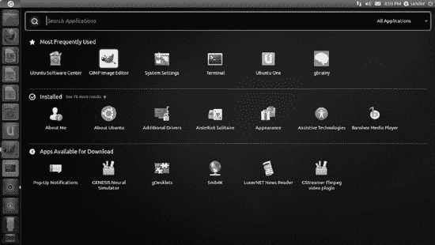
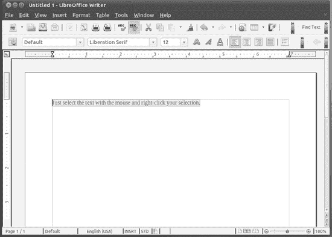

## C H A P T E R 6

## 首次启动 Ubuntu

现在 Ubuntu 已经安装好了，毫无疑问你会想要立即开始，这也是本书第 3 部分的内容。在后面的章节中，我们将介绍使用 Ubuntu 以及安装和运行基本硬件的具体细节。我们还将向您展示如何个性化桌面，使其在日常工作中以最适合您的方式工作。但是现在，本章的目标是让你尽可能快地做你在 Windows 下做过的事情。

本章解释了如何第一次启动 Ubuntu 并使用桌面。它还展示了你的电脑的一些熟悉的方面，比如使用鼠标，是如何在 Ubuntu 下得到略微增强的。

### 启动

如果你选择了 Windows 双启动，你看到的第一个 Ubuntu 屏幕是启动加载菜单，它会在你打开电脑后很快出现。如果 Ubuntu 是您硬盘上唯一的操作系统，您需要在系统启动期间按住 Shift 键来访问此引导菜单，但您不需要这样做，除非您想要访问恢复模式引导设置。事实上，如果 Ubuntu 是你电脑上唯一的操作系统，你可以跳到本章的下一节。

 **注意**boot loader 其实是一个名为 Grub 的独立程序，从 Ubuntu 9.10 开始已经更新到版本 2。这个程序启动了一切并启动了 Ubuntu。

当你的电脑设置为双引导时，你看到的引导加载程序菜单有三个或四个选项，如图[图 6-1](#fig_6_1) 所示。最上面的是你启动 Ubuntu 需要的。Ubuntu 选项会在 10 秒内自动选中，但你可以按 Enter 键立即开始。

***图 6-1。**启动菜单上默认选择就可以了，所以按回车启动 Ubuntu。*

您应该会发现 Windows 也有一个条目，位于列表的底部，并标有您安装的操作系统的版本。要引导进入 Windows，只需使用光标键将选项移动到适当的选项，然后按 Enter 键。

 **注意**从 GRUB 菜单中，您也可以选择运行内存测试。如果您的计算机经常在没有特定原因的情况下崩溃，坏内存可能是原因。如果发生这种情况，运行内存检查，看看是否是时候更换一些有问题的内存芯片。

您还应该看到一个以“(恢复模式)”结尾的条目这有点像 Windows 中的安全模式。如果你选择恢复模式，Ubuntu 将启动到一个文本模式菜单，有六个选项:

> ***Resume—恢复正常启动:*** 这个选项可以让你正常启动，就好像根本不需要修复任何东西一样。然而，与图形引导相比，这个选项的最大区别是 Ubuntu 以文本模式引导，在这种模式下，当 Ubuntu 启动时，系统消息滚动过去。如果您在引导 Ubuntu 时遇到问题，您可以在恢复模式下运行，并选择此选项来查找引导过程中的错误消息。
> 
> ***清除—尝试释放空间:*** 该选项强制引导加载程序尝试在磁盘上释放空间。
> 
> ***dpkg—修复残破的软件包:*** 此选项尝试修复您电脑上安装的软件。
> 
> ***fail safex-在故障保护图形模式下运行—*** 此选项允许您以低分辨率和有限数量的颜色登录，因此您可以运行显示配置实用程序来测试各种显示设置，选择适合您的硬件的配置，并对您的显示问题进行故障排除。
> 
> ***fsck-重新启动进入文件系统检查—*** 使您能够检查并有选择地修复 Linux 文件系统。此操作最好在卸载文件系统的情况下完成，因此当您选择此选项时，系统将重新启动并在默认分区上运行文件系统检查。
> 
> ***Grub—更新 Grub 加载程序:*** 强制 Grub(显示此引导菜单的程序)查询硬盘中安装的操作系统，并重新创建它在启动时显示的列表。
> 
> ***netroot—带联网的拖放到 shell 提示符:*** 与选项“root”相似，但联网功能完全可用。
> 
> ***root-Drop to root shell prompt:***该选项以保守的系统设置启动，然后在管理员模式下向您显示命令行提示符(您作为 *root 用户—* 一个对整个系统拥有绝对权限的特殊用户帐户运行，因此如果可以的话，请尽量避免启动到该选项，当您没有任何其他选项而只能使用 root shell 提示符时，请非常小心)。此提示的典型用法是在用户忘记密码时更改他们的密码，释放磁盘空间以正常运行，以及卸载有问题的软件以恢复系统稳定性。可用于恢复的系统命令有`passwd`(更改密码)`mv`(移动文件和文件夹)`rm`(删除文件和文件夹)`cp`(复制文件和文件夹)`mkdir`(创建新文件夹)`dpkg`(安装或删除软件)。这些和其他命令将在[附录 A](27.html#appa) 中进一步讨论。

当您更新系统软件时，您可能会发现新条目被添加到引导菜单列表中。这是因为内核已经更新了。内核是 Ubuntu 所依赖的中央系统文件，本质上，引导菜单的存在是为了让你在不同的内核之间进行选择。几乎毫无例外，第一个(最上面的)条目是你每次引导 Ubuntu 时想要的，因为它总是使用最新版本的内核，以及其他系统软件的最新版本。其他条目将使用旧版本的内核启动系统，并在最新内核导致问题的情况下提供。

 **注意**所有的操作系统都需要一个引导加载程序，即使是 Windows。但是，Windows 引导加载程序是隐藏的，它只是启动操作系统。在 Ubuntu 下，引导加载程序通常有一个菜单，这样你可以选择 Linux 或者一个选项，让你访问你的 PC 来解决问题。当你获得了一些使用 Ubuntu 的经验后，你可以选择在同一个硬盘上安装两个或更多版本的 Linux，并且你可以通过启动菜单在它们之间进行选择。

### 登录

Ubuntu 启动后，应该不会花很长时间，你会看到登录界面，如图[图 6-2](#fig_6_2) 所示。在这里输入您在安装过程中创建的用户名和密码。如果在安装过程中，您选择了在启动时自动登录，那么您将不会看到此屏幕，并会立即显示在桌面上。

单击屏幕右下角的关机选项按钮会弹出一个菜单，您可以从中选择重新启动系统或关机。此按钮旁边是时钟和“万能辅助”偏好设置按钮，可让您启用辅助功能，如屏幕键盘和放大镜。

您在安装过程中创建的用户帐户类似于 Windows 所称的*管理员*帐户。这意味着在您日常使用的帐户中，您还可以更改重要的系统设置和重新配置系统。然而，Ubuntu 和 Windows 之间的主要区别是，你需要输入密码才能进行任何重要的更改，而不是像 Windows Vista 或 Windows 7 那样在确认对话框中单击(当然，Windows XP 根本没有任何类型的确认要求！).

不用担心不小心损坏什么东西；尝试重新配置系统或访问重要的系统设置时，总是会出现密码提示。如果不想继续，只需点击取消按钮。

 **注意**与某些版本的 Linux 不同，Ubuntu 不鼓励用户使用真正的 root(管理员)帐户。这甚至在默认情况下是禁用的。相反，它的工作原理是某些普通用户采用超级用户权限，允许他们在需要时管理系统。那些被称为 *sudoers。*在 UNIX 术语中， *sudo* 是*超级用户 do* 的简称，意为以超级用户身份执行任务。sudoer 是一个用户帐户，可以为某些任务执行 sudo，如 sudoers 文件中所定义的。您在安装过程中创建的用户帐户拥有这些权限。

***图 6-2。**选择或输入您的用户名，输入您的密码，然后按 enter 键登录。*

### 探索桌面

登录后，你会看到新 Unity 界面的欢迎主题，如图[图 6-3](#fig_6_3) 所示。如果你使用过 Ubuntu 之前的任何版本，如果你有合适的硬件， [1](#CHP-6-FN-1) 你会注意到大量的变化。

请随意点击，看看你能发现什么。您造成严重损害的可能性很小，所以让您自己尽情地玩您的新操作系统吧！但是，如果有任何对话框要求您键入密码，请小心—这表明您单击了一个可能会从根本上改变系统的操作。

__________________

1Unity 接口有以下链接列出的硬件要求:【https://wiki.ubuntu.com】T2/desktop experience team/unityhardware requirements。如果你的电脑不能满足这些要求，你将会看到传统的基于 Gnome 面板的界面。您仍然可以安装一个对硬件要求较低的 Unity 接口版本(也称为 Unity 2D)；你将在第 9 章的[中学习如何安装它。](09.html#ch9)

***图 6-3。**整洁的 Ubuntu 桌面——这是你对新操作系统的第一印象。*

#### 第一印象

你会注意到的第一件事是，与 Windows 相比，桌面是干净的。你不会有太多的图标散落在屏幕上。

当然，你可以用所有你想要的图标填满桌面。与 Windows 一样，您可以将文件保存到桌面以便于访问。此外，您可以从任何菜单中单击图标并将其拖动到桌面上，以创建快捷方式。

统一:UBUNTU 的新面貌

Ubuntu 有一个新的桌面界面，在 Natty Narwhal 中首次亮相，老 Ubuntu 网络混音用户可能很熟悉:Unity。

Unity 并没有取代整个 GNOME 桌面环境，而只是取代了 Gnome Shell，它的用户界面。这意味着 Ubuntu 将暂时继续发布 GNOME 应用程序。如果你的硬件，尤其是你的视频驱动，不能满足 Unity 的最低要求，Natty 将退回到 GNOME Shell。

GNOME 背后的基础软件由自由软件桌面项目维护。这是目前为 Linux 以及其他版本的 UNIX 开发桌面界面的最成熟的组织之一。它的主页是 http://www.gnome.org。

开源软件的本质——任何人都可以获取源代码并创建程序的新版本——使得 Ubuntu 重塑 GNOME 桌面成为可能。与 Windows 软件不同，一个特定的程序或软件套件可以有多个当前版本，每个版本通常都是根据不同 Linux 发行版的特定需求定制的。

围绕两个相似的桌面环境，KDE([http://www.kde.org](http://www.kde.org))和 Xfce([http://www.xfce.org](http://www.xfce.org))也有 Ubuntu 的版本。他们分别被称为 Kubuntu 和 Xubuntu，他们# 39；这本书附带的 DVD-ROM 中有提供。有关更多详细信息，包括安装说明，请参见附录 d。

 **注意**如果你用 Windows 双启动，你可能会在 Ubuntu 桌面的左上角看到一个图标，可以让你访问你的 Windows 文件。在一个系统上，它被标识为 sda1。双击图标查看 Windows 文件系统。同样，如果您的电脑上插有存储卡读卡器或数码相机，您也可能会看到它们的桌面图标，并且任何插入的 CD/DVD 光盘也将由桌面图标表示。

默认情况下，Ubuntu 桌面界面干净整洁，只有几个元素争夺注意力。现在让我们快速描述一下它们；你可以在本章后面找到更详细的描述。

> ***顶部面板*** —Natty 包括桌面顶部的传统横条。和以前版本的 Ubuntu 一样，它在右边显示应用状态指示器、时钟、Me 菜单和会话菜单。但是在左边，你会注意到传统的三个菜单(应用程序、位置和系统)不见了，或者被一个 Ubuntu 标志取代，这个标志被称为 Home 按钮(或者更形象地说，是“大按钮”)。点按主页按钮将打开 Unity dash，带有搜索对话框和最流行应用程序的快捷方式。
> 
> ***Unity launcher***—也许 Unity 用户界面的中心部分是 Unity launcher，默认显示在屏幕的左侧部分。当你当前的应用侵占了 Unity 启动器所在的区域，它会自动隐藏。当您的应用程序工作区离开 Unity 启动器所在的区域时，Unity 启动器会重新出现。Unity launcher 是一个垂直条，当它可见时，位于 Home 按钮下方，包含代表各种应用程序或系统组件的图标。这些图标被称为*启动器*，当被选中时，它们会打开指定的应用程序或让您访问特定系统组件的更多选项。这些启动器使您能够访问计算机上的文件和文件夹(主文件夹、文件&文件夹)、浏览网页(Firefox web 浏览器)、处理文档(LibreOffice Writer、Calc 和 Impress)、安装新软件(Ubuntu 软件中心)、访问在线服务(Ubuntu One)、在工作区之间切换(工作区切换器)、打开应用程序(应用程序)以及查看回收站的内容。你可以添加你自己的启动器，你将在第 9 章看到。打开的应用程序会自动在 Unity 启动器中添加一个图标，您可以使用它来访问当前未激活的应用程序。

鼠标的工作方式基本上和 Windows 一样，你可以四处移动鼠标，点击东西。在大多数情况下，单击和双击的工作方式与它们在 Windows 中的工作方式完全一样。你也可以右击几乎所有的东西和任何地方来打开上下文菜单，这通常让你改变设置。你会发现鼠标按钮之间的滚轮可以让你滚动窗口。

当你第一次在 Lucid Lynx 中打开一个窗口时，你可能会注意到熟悉的最大化、最小化和关闭按钮的位置。它们被放在顶栏的左边，而不是像 Windows 和 OS X 中习惯的那样放在右边。像在 Windows 中一样，点按关闭按钮会结束每个程序。为 Natty Narwhal 开发的一项新改进是，任何应用程序窗口的顶栏在最大化时都会与顶面板合并，使用通常为空的顶面板的大部分。

每当 Ubuntu 忙碌时，就会出现一个动画的圆形图标，原理上类似于 Windows 中使用的沙漏图标。它也会在程序启动时出现。

 **警告**记住，Ubuntu 不是 Windows 的克隆版，也不想成为 Windows 的克隆版。虽然它以类似的方式工作——通过提供菜单和图标，并在窗口中包含程序——但有一些差异和改进可能会让您在探索时出错。

#### 探索顶部面板和 Unity 启动器

Ubuntu 桌面的两个核心部分是顶部面板和 Unity 启动器。正如我们前面提到的，顶部面板是屏幕顶部的水平条。Unity 启动器是屏幕左侧的垂直条，其中包含系统最常用组件的启动器。

它们非常有用并且高度可定制。你需要在 Ubuntu 上访问的大多数操作都可以通过这两个来实现，所以尽早掌握它们会有很大的帮助(要了解更多关于个性化顶部面板和 Unity 启动器的信息，请参考[第 9 章](09.html#ch9))。确切的视图由您在计算机上安装的内容决定。以下是你的图形桌面的一些最重要的部分的列表。

> ***Home 键:***Home 键是顶部面板最左侧的 Ubuntu 图标。点击后，您可以访问 Unity dash，在这里您可以搜索并打开一些最常用的应用程序。
> 
> ***应用启动器:*** 在 Unity 启动器中，你会发现代表应用的图标。默认情况下，Firefox 网络浏览器和 LibreOffice 的 Writer、Calc 和 Impress 都在这里安家。你可以为现有的应用程序创建你自己的启动器，但是如果你过多的使用 Unity 启动器，找到你的应用程序会更加困难。当你点击其中一个图标时，相应的应用程序就会启动。
> 
> ***主文件夹和文件&文件夹启动器:*** 这两个启动器，是第一个和最后一个启动器(不算垃圾桶，在 Unity 启动器的底部)可以让你打开 Nautilus，文件浏览器。鹦鹉螺号在[第 10 章](10.html#ch10)中有进一步的解释。
> 
> ***Ubuntu 软件中心:*** 这个启动器，Unity 启动器中的第六个，会打开 Ubuntu 软件中心，让你安装新的应用。在[第 20 章](20.html#ch20)中有更详细的探讨。
> 
> ***Ubuntu One:*** 这个启动器让你访问[第 15 章](15.html#ch15)中描述的云服务的配置。使用 Ubuntu One，您可以将文件和其他数据(如音乐收藏、您的联系信息或您的 Firefox 书签和假小子笔记)备份到网络上，并在许多电脑上同步它们，
> 
> ***工作区切换器:*** 工作区切换器用于在虚拟桌面之间移动，将在本章稍后介绍。
> 
> ***应用:*** 这个启动器是灰色的，中间有一个加号，是你想打开一个应用的地方。它取代了之前 Ubuntu 版本的应用程序和系统菜单。选中后，它将打开应用程序仪表板，该仪表板顶部包含一个搜索对话框，您可以使用该对话框缩小显示的应用程序列表。您也可以使用位于搜索对话框右侧的下拉列表选择应用程序的类别。dash 中的应用程序有三个部分:最常用的应用程序、已安装的应用程序(这是最重要的部分)和可供下载的应用程序，这些应用程序没有安装，只需点击几下鼠标。快速提示:您可以通过将应用程序的图标拖到 Unity 启动器来创建应用程序启动器。
> 
> ***关机按钮:*** 顶部面板中最右边的项目是关机按钮，本章后面会给出更多细节。您会注意到，有时“关闭”按钮会变成红色。这表明对系统进行了更改，需要您重新启动计算机。例如，当您安装 Ubuntu 的最新更新时，就会发生这种情况。
> 
> ***“我”菜单:*** “我”菜单，由面板上的用户名指示，位于“关闭”按钮的左侧，允许您轻松设置各种即时消息客户端的状态，并在无需登录的情况下发布到脸书或推特等社交网站。其功能在[第 15 章](15.html#ch15)中有详细解释。
> 
> ***时钟:*** 时钟位于屏幕右上方。点击它会弹出一个方便的月历。再次点按它以隐藏此显示。点击添加事件，在此处向进化日历添加一个条目(该日历在[第 14 章](14.html#ch14)中有解释)。点击时间&日期设置，配置时区以及时间和日期信息的显示方式。
> 
> ***指示器小程序:*** 指示器小程序，由时钟旁边的信封图标表示，允许您配置即时消息(IM)、邮件和广播帐户，并由这些相同的帐户在发生变化时通知您，如收到新邮件或来自联系人的 IM。Ubuntu One 还有一个快捷方式。
> 
> ***通知区:*** 这类似于 Windows 的系统托盘。喜欢呆在内存中的程序，如 Banshee the media player 或 Skype，会在右上角添加图标，以便快速访问它们的功能。软件更新通知出现在此区域，让您知道有可用的软件更新(类似于 Windows Update)。当您连接到网络时，网络管理器会在此显示一个图标。音量控制小程序也在这里。通常，您只需点击(或右键点击)它们的图标即可访问程序功能。
> 
> ***通知:*** 除了通知区，Ubuntu 还有一个弹出的短期通知系统，用来让你随时了解系统音量、屏幕亮度、网络可用性、IM 好友状态以及其他有用的东西的变化。如果某些通知开始让你烦恼，你可能会想要禁用它们。
> 
> ***垃圾桶:*** 在 Unity 面板的底部是垃圾桶图标。将文件或文件夹拖到此图标会导致它们被移到废纸篓。在这里，您还可以清空废纸篓或查看其内容。

 **注意**Windows 的回收站和 Ubuntu 的回收站有一个重要的区别。默认情况下，回收站仅使用硬盘剩余空间的 10%。此后，最旧的项目将被自动删除。对于 Ubuntu 的版本，对内容的唯一限制是磁盘上剩余的可用空间。除非您明确选择删除，否则不会从废纸篓中删除任何内容。

#### 关闭或重启 Ubuntu

您可以通过单击屏幕右上角的关闭按钮来关闭或重新启动电脑。在许多笔记本电脑和台式机上，您也可以短按电脑上的开/关按钮。前一种方法在一个下拉列表中为您提供一个选项选择，而后一种方法启动一个对话框，显示各种选项的图标，如图[图 6-4 所示。](#fig_6_4)

***图 6-4。**有多种关闭操作可供选择，有些允许稍后快速恢复。*

请注意，如果使用硬件方法关闭，并非所有选项都会出现。下拉列表中的选项如下:

> ***锁屏:*** 启用屏幕保护和密码保护系统。离开锁屏模式的唯一方法是在移动鼠标或按键时出现的对话框中输入用户密码。
> 
> ***访客会话:*** 这将启动桌面的新访客会话。例如，它非常适合临时使用公司电脑的员工，或者来访的朋友，他们希望查看电子邮件或脸书，而不在您的电脑上留下任何痕迹。当用户注销时，在来宾帐户上下载的任何文件都会被删除。
> 
> ***从<用户名切换… > :*** 如果系统上定义了多个用户([第二十一章](21.html#ch21)讨论如何添加用户账号)，该选项允许其他人登录，而无需关闭原用户的账号。要切换回原始用户，请再次选择“切换用户”或注销第二个用户。原始用户需要输入密码才能重新访问。
> 
> ***注销:*** 该选项让你注销当前用户账户，返回 Ubuntu 登录界面。任何打开的程序都将自动关闭。

 **注意**在关机或注销操作期间，Ubuntu 有时会自动关闭包含未保存数据的应用程序，而不会提示您，因此您应该始终在选择此处的任何选项之前保存文件。

> ***挂起:*** 这使用你的电脑的挂起模式，在这种模式下，除了电脑的内存，PC 的大部分系统都是断电的。挂起模式旨在省电并允许电脑快速重新激活。然而，并不是所有的计算机都支持挂起模式，所以您应该试验一下您的计算机是否工作正常。在这样做之前，请确保保存了所有打开的文件。如果您的电脑进入挂起模式，但当您摇动鼠标或按键时无法唤醒，您可能需要重新启动。这通常可以通过按住电源按钮大约五秒钟来完成。
> 
> ***休眠:*** 这是将电脑内存的内容保存到硬盘上，然后完全关闭电脑。电脑重新激活后，用户选择正常启动 Ubuntu，内存内容从磁盘读入。这允许更快的启动，并允许用户从他们最后工作的地方恢复。为了让休眠特性工作，交换文件需要和主内存一样大或者比主内存更大。Ubuntu 的安装程序应该已经自动完成了，但是如果你在重新分区的时候没有给 Ubuntu 分配足够的磁盘空间，它可能就不能这么做了。找出答案的唯一方法是尝试让你的系统休眠，看看它是否能工作。

 **警告**一些用户报告称，他们的电脑有时无法从休眠状态中“醒来”，因此你应该在休眠前保存所有打开的文件，以防万一发生这种情况。这种情况我们已经见过几次了，尽管在其他几百次的情况下都很好。

> ***重启:*** 此选项关闭 Ubuntu，然后重启电脑。
> 
> ***关机:*** 这将关闭 Ubuntu，然后关闭您的计算机，前提是其 BIOS 与标准关机命令兼容。(近五年左右买的电脑都是兼容的；如果你发现电脑在 Ubuntu 关机程序结束时挂起，只需通过电源开关手动关机。)

通过硬件关机按钮或按 Ctrl+Alt+Del 组合键打开的“关闭计算机”对话框中只有最后四个选项可用。如果按下此按钮后离开电脑，电脑将暂停 60 秒，然后关机。

#### 快速桌面指南

参见[图 6-5](#fig_6_5) 获取 Ubuntu 桌面的概述。在此图中，您可以看到一个打开的浏览器窗口、一个程序窗口和默认的桌面组件，例如屏幕左侧的 Unity 窗格。Ubuntu 桌面已经被完全重新设计了，所以你最好不要试图把它和你可能从 Windows 环境中了解到的东西进行比较！

***图 6-5。为了这次发布的 Ubuntu，Ubuntu 桌面进行了大规模的重新设计。***

### 运行程序

启动一个新程序很容易。只需点击 Unity 面板中的应用程序启动器，然后从列表中选择一个程序。应用程序界面，如图 6-6 所示，分为三个部分，您可以在其中找到您最常用的应用程序、已安装的应用程序以及一些可供下载的流行应用程序。此外，您还可以单击屏幕右上方的“所有应用程序”链接来访问安装在您计算机上的所有软件。

如果你想启动网络浏览器或 LibreOffice 应用程序(可以说是 Ubuntu 提供的一些最流行的程序)，你可以在 Unity 面板上点击它们的图标。

***图 6-6。**应用程序启动器上的程序分为不同的类别，您可以对其进行过滤。*

### 使用虚拟桌面

Windows 工作的前提是所有的事情都发生在一个桌面上。当你启动一个新程序时，它在桌面上运行，有效地覆盖了桌面。事实上，所有的程序都是在这个桌面上运行的，所以当你同时运行多个程序的时候会有点混乱。哪个 Microsoft Word 窗口包含您正在处理的文档，而不是您已打开用来做笔记的文档？你用来复制文件的我的电脑窗口在哪里？

Ubuntu 通过拥有多个桌面区域克服了这个问题。通过使用位于 Unity launcher 上的 Workspace Switcher 工具，您可以在两个或多个虚拟桌面之间进行切换，如[图 6-7](#fig_6_7) 所示。这可以通过一个演示得到最好的解释:

1.  确保您当前在第一个虚拟桌面上(打开工作区切换器并选择左上面板)，并从 Unity 启动器启动 web 浏览器。
2.  单击工作区切换器上的第二个方块。这将把你切换到一个干净的桌面，在那里看不到任何程序，这是第二个桌面。
3.  通过点击 Unity 启动器上部的按钮——一个看起来像文件夹图标的按钮，启动文件浏览器。将出现文件浏览器窗口。
4.  再次单击工作区切换器中的第一个方块。您应该切换回运行 web 浏览器的桌面。
5.  点击第二个方块，你切换回另一个运行文件浏览器的桌面。

 **提示**你可以按住 Ctrl+Alt，按上下左右光标键在虚拟桌面之间切换。

您可以在切换器本身中单击应用程序窗口的小表示，并将其从一个工作区拖到另一个工作区。工作区切换器提供了一种组织程序和减少混乱的方法。您可以尝试虚拟桌面，看看您是否希望以这种方式组织您的工作。有些人相信它们。

### 使用鼠标

如前所述，鼠标在 Ubuntu 下的工作方式和在 Windows 下基本相同:左键点击选择东西，右键点击通常会弹出一个上下文菜单。尝试右击各种项目，比如桌面上的图标，甚至桌面本身。

 **提示**右击桌面上的空白处，选择创建启动器，你就可以创建应用程序的快捷方式。单击创建文件夹可以创建新的空文件夹。如果出于某种原因您想要创建一个空文件，您也可以使用 Create Document  Empty File。

您可以使用鼠标将图标拖到其他图标上。例如，您可以将文件拖到程序图标上来运行它。你也可以点击并拖动某些区域来创建一个“弹性带”，就像在 Windows 中一样，这可以让你一次选择多个图标。

您可以使用鼠标来调整窗口大小，方法与在 windows 中差不多。只需点击并拖动窗口的边缘和角落。此外，您可以双击标题栏来最大化并随后恢复窗口。

Ubuntu 也使用鼠标中键的第三个按钮。你可能不认为你的鼠标有这些，但实际上，如果它是相对现代的，它可能有。这种鼠标在按钮之间有一个滚轮，当按下时，它可以作为第三个按钮。

在 Ubuntu 中，鼠标中键的主要用途是复制和粘贴，如下一节所述。点击鼠标中键还有其他一些功能；例如，用鼠标中键点击任何打开窗口的标题栏将切换到下面的窗口。

提示如果你的鼠标没有滚轮，或者有一个不能点击的滚轮，你仍然可以点击鼠标中键。只需同时按下鼠标左键和右键。这模拟了中击，虽然需要一点技巧才能正确。一般来说，你需要先按一个按钮几分之一秒，然后再按另一个按钮。

### 剪切和粘贴文本

Ubuntu 提供了两种不同的剪切和粘贴文本的方法。第一个与 Windows 相同。在文字处理器或其他处理文本的应用程序中，您可以单击并拖动(或双击)鼠标来突出显示文本，右键单击文本上的任意位置，然后选择复制或剪切文本。在很多程序中，还可以使用 Ctrl+X 的键盘快捷键进行剪切，Ctrl+C 进行复制，Ctrl+V 进行粘贴。

然而，有一种更快的复制和粘贴方法。只需点击并拖动突出显示一些文本，然后立即点击鼠标中键，您希望文本出现。这将自动复制并粘贴高亮显示的文本，如[图 6-7](#fig_6_7) 所示。

这种特殊的剪切和粘贴方法绕过了通常的剪贴板，因此您应该会发现您之前复制或剪切的任何文本应该仍然存在。缺点是它不能在 Ubuntu 中的所有应用程序上运行，尽管它可以在大多数应用程序上运行。

***图 6-7。**高亮显示文本，然后点击鼠标中键立即粘贴。*

### 总结

本章讲述了第一次启动 Ubuntu 和发现桌面。我们研究了启动程序、使用虚拟桌面、在 Ubuntu 桌面上使用鼠标等等。你应该对一些基本的 Ubuntu 技能有信心，并准备学习更多！

在下一章中，您将着眼于让您的系统启动并运行，重点是您在日常使用中可能会遇到的硬件项目。