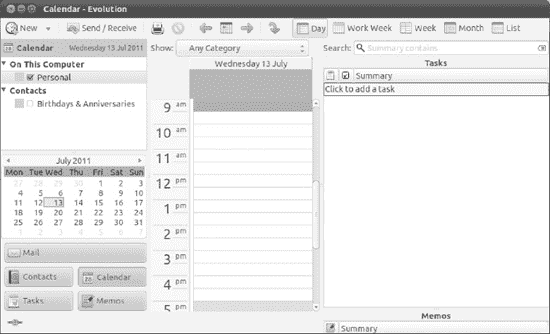
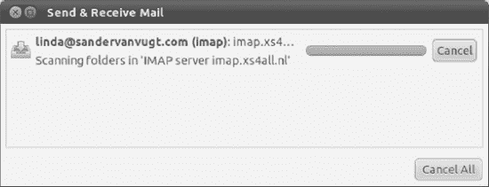
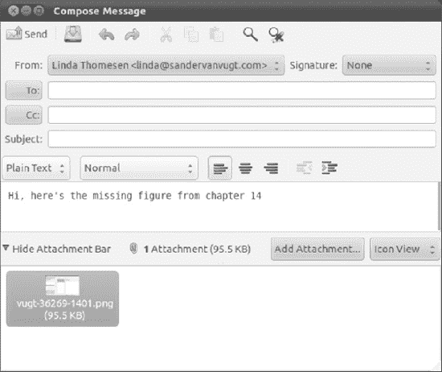
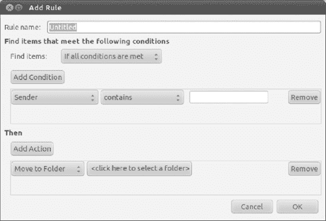
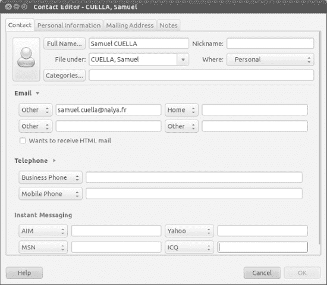
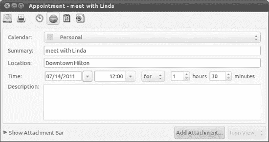
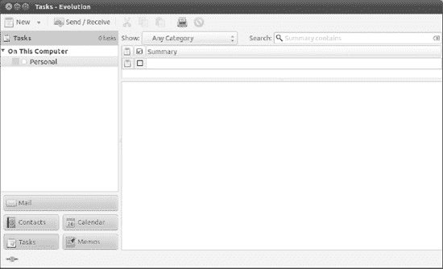
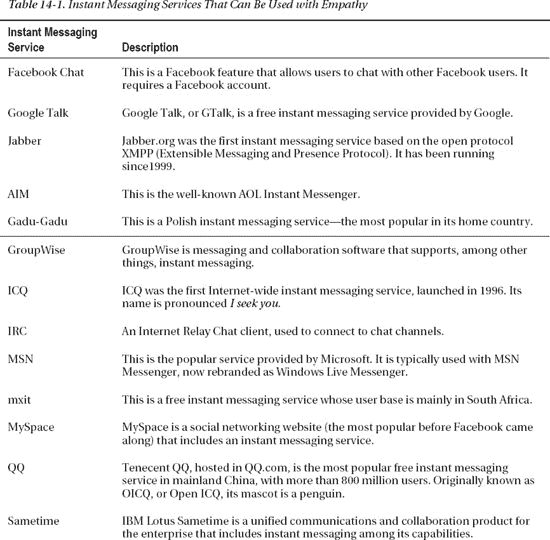
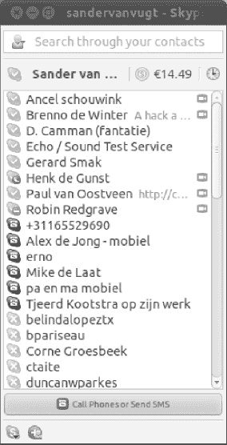
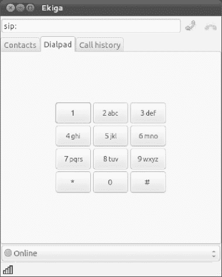

## 第十四章

## 与他人交流

上网就是要保持联系，Ubuntu 在这方面毫不逊色。Ubuntu 提供了广泛的应用程序，包括一个名为 Evolution 的全功能电子邮件程序，以及一个名为 Empathy 的即时消息客户端，可以让你连接到最受欢迎的即时消息网站，如 GTalk 和 MSN。

您可以安装一个 Skype 客户端，让您能够连接到常用服务，与其他 Skype 用户或电话进行语音和视频通话；你也可以安装一个开源的 Skype 替代品 Ekiga。

### 进化简介

Evolution 被认为是“官方的”GNOME 桌面电子邮件程序，Evolution 界面保留了 Ubuntu 桌面的许多元素的外观和感觉。

Evolution 类似于 Microsoft Outlook:除了作为一个强大的电子邮件客户端，它还集成了联系人管理、日历、待办事项列表和备忘录功能。它是一流的商业工具。Evolution 甚至能够连接到 Microsoft Exchange (2000 和更高版本)群件服务器，并与联系人和日历数据同步，此外还可以获取电子邮件。当然，它也可以连接到标准的 POP3/SMTP 电子邮件服务器，以及 IMAP、Novell GroupMail 和其他一些邮件服务器技术。这意味着它几乎与当今普遍使用的所有电子邮件系统都兼容。

Evolution 由五个组件组成:邮件、联系人、日历、备忘录和任务。这些是相互联系的，但在程序中作为独立的模式运行。每种模式都可以使用位于程序窗口左下方的切换器进行选择。只需点击您希望使用的模式按钮。无论选择哪种模式，程序窗口、工具栏和菜单系统都会发生变化。[图 14-1](#fig_14_1) 显示了默认邮件模式下的程序。

 **提示**你可以通过选择查看切换器外观子菜单上的选项，将切换器组件缩小为小图标，甚至只是文本按钮。

***图 14-1。**您可以通过点击程序窗口左下角的按钮在 Evolution 的模式之间切换。*

五种进化模式的工作方式如下:

> 1.  *E-mail* : E-mail component is the core of evolution, and all the functions you may be used to are here. After selecting the mail mode, you will find the mail folder in the upper left of the program window. These folders include the Inbox and Sent Items folder, as well as any other mail folders that you have created. On the right is the email list, and below is the email preview pane, which will display the body of any email you choose. At the top of the mailing list is the search box, which works like most e-mail search programs: type the related words, and then press Enter. The icons at the top of the window include "New" button, which allows you to compose an e-mail message, and "Send/Receive" button, which can download new messages and send any messages in the Outbox folder. By default, Evolution will check for new mail when the application starts, and then every 10 minutes, but this behavior can be configured for each account under the "Edit  Preferences" menu.
> 2.  *Contact* : It is tied to the mail function, but as an independent and powerful entity, the contact mode allows you to store all relevant details of colleagues, friends and others. After selecting the mode, you will see various contact folders on the left side of the program window. For most users, there is only one server named Personal, but if you specify a groupware server during installation, you can also connect to it by clicking its entry. You can also create a new address book (for example, if you have a set of work addresses and a set of personal information). Just right-click under the existing address book, select the new address box, and fill out the form. The words on this computer will create a new book on your computer. In the upper right corner is the contact list. Clicking any contact will display the contact information in the contact information area at the bottom of the window. The search bar at the top of the lower toolbar window allows you to quickly search for contacts by name. The New button on the toolbar allows you to create a new contact, where you can enter a lot of data. To edit an existing entry, double-click its entry and fill in other details. This kind of information is useful for various tasks, so the contact mode of Evolution can be used as the data source of OpenOffice.org, which is especially useful.
> 3.  *Calendar* : Calendar mode can be said to be the second most useful function of evolution (second only to email). You can add events in half-hour increments, and view your plan in the day, week, work week and month views by clicking the related buttons on the toolbar (the work week view only shows five days in the view). After selecting the mode, you will find various calendars that you can access in the upper left corner of the program window. For most users, personal calendar will be the main one, but you can also access shared calendars, including Google Calendar. Assuming that the default day view is running, below it you will see the monthly calendar, and in the middle of the program window is the appointment list, which contains half-hour entries of working days. By default, the current date is displayed. To select a different date, just double-click the date in the month view, or click the Go button on the toolbar, and then use the widget to find the date. You can switch between day, week and month appointment views by clicking the labeled button on the toolbar. On the right side of the window, all created tasks or memos will be displayed as follows.
> 4.  *Memorandum* : It is best to think of memento pattern of Evolution as a personal notebook. After selecting memento pattern, the memo list will appear on the right side of the screen, and the memo content will appear at the bottom. Memos can contain almost any number of texts and attachments. For example, they are very suitable for taking notes on the phone. Similarly, you can use the list on the left pane of the application to create categories of memos (for example, you can sort by customers, jobs or interests).
> 5.  *Task* : Actually, this is a simple task list. After selecting the mode, your tasks will be listed on the right side of the program window. This will be the details of any selected task below. If you like the completion method of task management, the task list in the left pane is an ideal companion, because you can create many lists and then fill the main window with tasks to be completed.

### 基本电子邮件任务

Evolution 的电子邮件功能可以说是该程序的核心。虽然它提供了许多功能，但使用起来非常简单。如果你曾经使用过任何其他主流的电子邮件客户端，比如微软的 Outlook，你已经有了一个好的开始。

本节介绍如何在 Evolution 的电子邮件组件中完成几项日常任务。当您启动 Evolution 时，会自动选择电子邮件模式。但是，如果不是，或者如果您已经切换到程序中的不同模式，只需单击程序窗口左下角的邮件按钮。

#### 配置电子邮件访问

在开始之前，您需要找出您打算使用的邮件服务器的地址。对于 POP3 和 IMAP 邮件帐户，您需要知道接收和发送的服务器地址(发送可能被称为 *SMTP* )。对于 Microsoft Exchange，您需要知道 Outlook Web Access (OWA) URL，并且可以选择知道 Active Directory/全局地址列表服务器。有了 Novell 群件，你只需要知道服务器名。您还需要知道接收邮件服务器和可能的发送邮件服务器的用户名和密码细节。

在收集了必要的信息之后，按照以下步骤来配置 Evolution:

> 1.点击日期和时间旁边的小信封，选择设置邮件选项，启动 Evolution 电子邮件客户端。或者，您可以选择应用程序 Office  Evolution 邮件和日历。
> 
> 6.当 Evolution 第一次启动时，您将被邀请通过向导输入您的配置细节。单击前进按钮。
> 
> 7.下一个屏幕提供了从备份中恢复 Evolution 设置的选项。这是将帐户从一个 Evolution 客户端迁移到另一个客户端的便捷选项。因为这是你第一次使用 Evolution，你可以通过点击 Forward 按钮忽略这个选项。
> 
> 系统会询问您的姓名以及您希望在 Evolution 中使用的电子邮件地址。这些是将出现在传出消息中的内容。下面是一个复选框，如果您希望您要创建的帐户成为默认帐户，您应该保持选中状态。几乎在所有情况下，这都是正确的选择。如果愿意，您还可以填写回复信息和组织信息，但这些字段可以留空。大多数电子邮件客户端通常不会显示它们。单击前进按钮继续。
> 
> 8.下一个屏幕询问您想要使用的接收邮件服务器的详细信息，如图[图 14-2](#fig_14_2) 所示。首先，从下拉列表中选择服务器类型。如果您不知道该选择哪个选项，请选择 POP。这是目前最常用的邮件接收服务器。:
> 
> 当您选择服务器类型时，会出现额外的配置字段。在相关字段中输入服务器地址和用户名。点按“检查支持的类型”以了解您的邮件服务器使用哪种鉴定安全性(如果有)。接下来，您应该会发现详细信息是自动填充的。单击“前进”继续。
> 
> 
> 
> ***图 14-2。** Evolution 可以与多种邮件服务器兼容，包括 POP3、Microsoft Exchange 和 IMAP。:*
> 
> 9.您可能需要输入您的邮件密码，这取决于您选取的服务器类型。在某些情况下，您需要在以后第一次下载邮件时键入此内容。单击“前进”继续。
> 
> 10.您有机会在各种附加选项中进行选择，例如您希望 Evolution 检查新邮件的频率，或者您是否希望在邮件下载后将其从服务器中删除。除非您被告知其他情况或有特殊要求，否则保留默认设置是可以的。如果您使用 Microsoft Exchange 服务器，您可能需要在此输入 Active Directory/全局地址列表服务器的详细信息。单击“前进”继续。
> 
> 11.根据您选择的服务器类型，您现在可能需要填写发送(SMTP)服务器地址。在服务器字段中键入此内容。如果您的 SMTP 服务器需要认证，请在相关的框中打勾，然后输入您的用户名。同样，您可以单击 Check for Supported Types 按钮来自动填写认证细节。单击“前进”继续。
> 
> 12.邀请您输入帐户的名称。这是您使用 Evolution 时将看到的帐户名称。默认是您的电子邮件地址，但是如果您愿意，您可以键入更容易记住的内容。单击“前进”继续。
> 
> 13.最后，选择您的位置，这将具有自动定义您的时区的效果。这将确保电子邮件的时间戳是正确的。您可以从选择下拉列表中选择您的位置(选择您所在时区最近的大城市)，或在地图上单击您的位置。在 Ubuntu 的初始安装过程中，当你点击大洲时，地图会放大，让你更精确地点击你居住的地方。单击“前进”继续，然后单击“应用”按钮完成向导。

#### 发送和接收电子邮件

正确设置 Evolution 与您的电子邮件服务器配合使用后，您只需点击工具栏上的“发送/接收”按钮即可连接到服务器，发送和接收电子邮件。

如果在安装过程中没有输入密码，您可能需要输入密码。您可以在“帐户”偏好设置(编辑偏好设置)中选择“记住密码”复选框，以避免再次键入您的密码，但该密码将存储在您的硬盘上，如果其他人可以访问您的电脑，则会带来安全风险。

 **注**虽然电子邮件通常在撰写后一点击发送按钮就发送出去，但如果由于某种原因(如当时不在线)发送被延迟了，那么只要你一点击发送/接收按钮就会发送出去。在此之前，它将保存在程序窗口左侧的发件箱文件夹中。如果您一直在脱机模式下撰写电子邮件，您可能需要选择文件联机工作。

任何未完成的邮件首先被发送，然后开始接收过程。如[图 14-3](#fig_14_3) 所示，一个状态对话框会告诉你有多少条消息以及下载的进度。单击“取消”按钮将停止该过程(尽管有些邮件可能已经下载)。当您收到新的电子邮件时，桌面右上角的通知区域会闪烁一个信封图标，并且会出现一个小窗口告诉您有邮件。

***图 14-3。**无论何时点击发送/接收按钮，您都会看到一个进度条。*

**电子邮件签名和加密**

在第 8 章中，您学习了如何使用 Seahorse 应用程序来建立一个公钥对。这允许您对发送给其他人的电子邮件进行加密，这样只有他们才能阅读这些邮件(前提是您有他们的公钥)。该应用程序还能让你对自己的电子邮件进行数字签名，这样收件人就能确定邮件来自你(前提是他们有*你的*公钥)。如果您已经按照说明建立了密钥对，并将其上传到了密钥服务器，现在您需要配置 Evolution 来使用它。完成此操作后，当您发送新的电子邮件时，您可以选择是否要对电子邮件进行加密和/或数字签名。

请记住，设置加密是*而不是*必须的，在更广阔的世界里，相对来说很少有人使用电子邮件加密或签名。

假设您已经在 Evolution 中设置了一个帐户，下面是为加密和数字签名配置 Evolution 的步骤:

> 1.  Click  preferences to ensure that the mail account icon on the left side of the window is selected, and select your mail account from the list on the right side of the window. Then click the edit button. In the dialog box that appears, click the Security tab.
> 2.  Now you need to use hippocampus to find your PGP key ID. Click  Attachment  Password and encryption key. Find your key in the list under the "My Personal Key" tab, and look for it under the heading "Key ID". You should see an eight-character hexadecimal number, such as F0C1B52A. Write this down. Remember that any zero you see is zero, not the letter *O* .
> 3.  Switch back to the evolution dialog box and enter the PGP key ID you found in the PGP/GPG key ID box. If you want every e-mail you send to be digitally signed automatically, this is a good idea (the e-mail itself *will not be encrypted, so even if the recipients do not use encryption, they can still read it), please make sure that there is a check mark in the box "Always sign outgoing e-mail when using this account". Then click OK and close the Parent Preferences dialog box.*

加密发送的信息，或者如果你没有选择自动签名，那么就签名，这很简单。撰写新邮件时，单击“安全”菜单项，并选择“PGP 签名”或“PGP 加密”(或两者都选)。请记住，如果您想加密发送给收件人的消息，您需要通过 Seahorse 导入收件人的公钥，否则会看到一个错误。如果您签署了一条消息，在发送它时，系统会提示您输入您在第 8 章中创建密钥对时输入的 PGP 密码。

如果在发送电子邮件时，您看到错误消息“未能执行 GPG:管道破裂”，很可能是您在配置 Evolution 时键入了错误的密钥 ID。再试一次。

如果您收到用您的公钥加密的信息，Evolution 会自动提示您输入您的 PGP 密码进行解密。这是您在第 8 章中创建密钥对时输入的密码。

当您收到来自使用数字签名的人的消息，并且您有此人的公钥时，消息底部应该包含一个绿色条，其中包含单词 *Valid signature* 。如果您看到大意为签名无效的文字，或者如果签名丢失，您应该持怀疑态度，并独立验证电子邮件的真实性。

#### 阅读邮件

只需单击电子邮件即可在屏幕底部的预览窗格中查看它。或者，您可以双击一个消息，在它自己的程序窗口中打开它(选择一个消息并按 Enter 键将具有相同的效果)。

与大多数电子邮件客户端一样，列表中未读的邮件以粗体显示，已读的邮件以普通字体显示。默认情况下，每封邮件在 1.5 秒后被标记为已读，但您可以更改该值。要更改它，请单击编辑首选项，单击首选项对话框中的邮件首选项图标，单击常规选项卡，然后更改邮件显示标题下的值。值为 0 将使邮件在被点按后立即切换到“已读”状态，如果您想要快速清除大量邮件，这将非常有用。

您也可以将许多邮件标记为已读，方法是突出显示所有邮件，右键单击单个邮件，然后从出现的菜单中选择“标记为已读”。您可以按常规方式选择多封邮件:按住 Shift 键并单击以选择连续的列表，或者按住 Ctrl 键并单击以选择不连续的列表。电子邮件列表上方的“显示”下拉菜单可用于仅显示未读邮件，如果您有大量不打算阅读的邮件，并希望将它们标记为已读或删除它们，这将非常有用。

#### 删除消息

您可以通过高亮显示邮件并按下 delete 键来删除邮件。或者，右键单击任意邮件(或其中的一部分)并选择删除。该邮件将被移至回收站文件夹。要清空回收站文件夹，右击文件夹，选择清空回收站，如图[图 14-4](#fig_14_4) 所示。

***图 14-4。**要永久删除邮件，右键单击回收站文件夹并选择清空回收站。*

如果您将任何邮件从一个文件夹移动到另一个文件夹，如后面的“排序和过滤邮件”一节所述，邮件的副本将出现在“废纸篓”文件夹中。这是因为进化不会真的移动信息。相反，它会将它们从旧位置复制到新位置，并删除原始位置。一开始这可能会有点令人不安，但没什么好担心的。邮件将保留在您移动它的地方，不会消失。

#### 标记邮件

您可以用各种方式标记邮件，以帮助提醒您邮件的状态或目的。最简单的标记形式是将邮件标记为重要:右键单击邮件并选择“标记为重要”，或者单击“重要”列(位于“发件人”列的左侧)下的空白区域。这将在消息旁边添加一个感叹号符号。

或者，您可以通过右键单击邮件并选择“标记为后续”来添加几个不同的标志。选项可以从出现的对话框中的“标志”下拉列表中选择，范围从“不转发”到“不需要响应”和“审阅”。每当选择邮件时，该标题将出现在窗口底部的邮件预览中。

如果您喜欢简单的颜色编码方案，您可以通过右键单击邮件并选择“标签”来标记邮件。然后指定一种颜色。正如您将看到的，每种颜色都与一个关键词或短语相关。您可以通过单击编辑首选项，单击对话框左侧的邮件首选项，然后单击标签选项卡来编辑颜色和关键短语。

**通过雷鸟**导入 OUTLOOK 电子邮件

在本书的前面，我们讨论了一种从各种微软电子邮件程序中导出电子邮件的方法，这些程序使用专有格式，因此可以在 Ubuntu 下导入。概括地说，你可以在 Windows 下安装 Mozilla Thunderbird 电子邮件客户端，从 Outlook 或 Outlook Express 将你的电子邮件导入其中，然后导出 Thunderbird 的邮箱(`.mbox`)文件，以便*在 Evolution 中导入*。

如果您遵循了这些说明，并且现在已经准备好了用于 Evolution 的`.mbox`文件，那么导入它们就很容易了。点击文件导入。在“导入”对话框中，单击“前进”按钮，然后选择“导入单个文件”。再次单击转发，然后单击文件名下拉列表。这将打开一个文件浏览对话框，您可以在其中找到`.mbox`文件并点击打开。如果您有多个`.mbox`文件，您需要手动导入每个文件。对话框中的自动条目指的是文件类型，并将通过文件扩展名选择正确的文件类型。

#### 编写信息

创建一个新的电子邮件就像点击 Evolution 程序窗口左上角的 new 按钮一样简单。照常填写“收件人”和“主题”详细信息，然后键入邮件的正文。

要添加抄送或密件抄送，请单击“收件人”按钮，并在出现的对话框中从您的联系人列表中选择地址(根据需要选择“抄送”或“密件抄送”按钮)。或者，如果您希望“抄送”和“密件抄送”字段始终可见和可用，请在“撰写邮件”窗口的“查看”菜单下单击它们的条目。

与大多数微软邮件程序一样，新邮件可以以纯文本或 HTML 格式发送。默认为纯文本模式。要切换到 HTML，请单击“格式”菜单上的条目。HTML 邮件的优点是你可以改变文本的样式、大小和颜色，因此你可以强调不同的单词或段落，如图 14-5 所示。另外，如果你点击插入图片，你可以从硬盘中插入图片。“插入”菜单上的其他选项允许您插入表格、分隔线(单击“规则”菜单项)和 web 链接。

***图 14-5。**新信息可以格式化为 HTML 格式，允许您格式化文本，甚至在信息中添加图像。*

HTML 电子邮件的缺点是接收消息的人需要一个 HTML 兼容的电子邮件程序才能阅读它(尽管大多数普通的电子邮件程序可以很好地处理 HTML 电子邮件)。您的邮件也更有可能被收件人的服务器标记为垃圾邮件，因为垃圾邮件发送者在邮件中广泛滥用 HTML 和图像。

提示 Linux 社区的许多人不喜欢 HTML 格式的电子邮件，而更喜欢纯文本消息。

新邮件中的单词会自动进行拼写检查，如果拼写检查器认为它们不正确，就会用红色下划线标出。要更正该单词，请右键单击它，然后从提供的列表中选择正确的拼写。

默认情况下，如果您在安装 Ubuntu 时选择了英语，Evolution 拼写检查器将只提供英语(美式)词典。您可以切换到其他英语方言(如英国英语、加拿大英语或澳大利亚英语)，方法是在 Evolution 主窗口中选择编辑首选项，单击 Composer 首选项图标，然后单击拼写检查选项卡。通过选中词典名称左侧的复选框，选择一个或多个替代词典。

撰写电子邮件时，您可以在撰写邮件窗口的菜单中选择编辑当前语言来切换语言。如果您需要的语言没有列出，这意味着您需要在 Ubuntu 软件中心安装一个额外的 Aspell 字典包。这些字典包通常有一个两个字母的后缀，表示它们支持的语言；比如`aspell-fr`就是法语词典包。您需要退出并重新启动 Evolution 才能看到新语言。

 **注**`aspell-fr`包中还包含了语言的瑞士法语变体。

#### 创建电子邮件签名

电子邮件签名是自动出现在您撰写的新电子邮件末尾的文本块。他们省去了你每次输入名字和联系方式的麻烦。要创建电子邮件签名，请按照下列步骤操作:

> 1.  Click  to edit the preferences. Select Writer Preferences from the left side of the dialog box, and then click the Signature tab.
> 2.  Click the Add button in the upper right corner of the dialog box.
> 3.  In the Edit Signature dialog box, enter the signature you want to display. The signature can be plain text or HTML (click the format  HTML to select the latter). Don't forget, in HTML mode, you can insert a line (insert  rule), which can be used as a natural separator at the top of your signature to separate it from the email body, as shown in Figure [and Figure 14-6](#fig_14_6) .  T12 * T14 】 Figure 14-6\. Create an email signature so that you don't have to enter your contact information every time. Click * at the top left
> 4.  Save and close the icon.
> 5.  Click email account in the preferences dialog box, and double-click your email account in the list on the right.
> 6.  In the dialog box that appears, make sure that the Identity tab is selected and click the signature drop-down list. Click the signature you just created.
> 7.  Click OK in the Preferences dialog box, and then close. Your new signature will automatically appear in the new message. You can create multiple signatures, for example, one for work and one for personal mail, and then choose the appropriate signature when writing the mail.

### 高级电子邮件任务

Evolution 提供了多种功能来帮助您组织电子邮件。您可以创建新文件夹，也可以对邮件进行过滤、排序和搜索。

#### 创建新文件夹

如果您想更好地组织您的电子邮件，您可以创建自己的文件夹，这些文件夹将出现在程序窗口左侧的列表中。

创建一个新的顶层文件夹，它将出现在标准文件夹(收件箱、垃圾邮件、发件箱等)旁边的列表中。)，右键点击本电脑，选择新建文件夹。然后确保在出现的对话框的文件夹视图中选择了“在这台计算机上”。键入名称，然后单击创建。

您还可以创建二级文件夹，这些文件夹实际上位于其他文件夹的“内部”,并且在列表中缩进显示在它们的父文件夹之下。例如，您可能希望在主收件箱文件夹中创建一系列文件夹，以便对来自不同个人或组织的邮件进行排序。为此，右键单击收件箱，选择新建文件夹，并在出现的对话框中为文件夹命名，如图[图 14-7](#fig_14_7) 所示。创建新文件夹后，单击收件箱旁边的 v 形图标展开显示，以显示新的子文件夹。

***图 14-7。**你可以创建自己的文件夹来更好地整理你的邮件。*

然后，您可以将邮件拖放到新的文件夹中，或者您只需右键单击它们，选择移动到文件夹，然后从出现的对话框中选择文件夹。如果您希望通过按住 Ctrl 键来选择几封邮件，这将非常有用。所有你需要做的就是右键单击其中一个并选择移动到文件夹。

您还可以将邮件从一个位置复制到另一个位置，从而产生同一邮件的两个副本。只需右键单击邮件，选择复制到文件夹，然后从列表中选择文件夹。或者，您可以按住 Ctrl 键，同时将邮件拖动到新位置。

#### 处理垃圾邮件

进化包括智能垃圾邮件过滤。任何被 Evolution 认为是垃圾邮件的邮件，最终都会被放入垃圾文件夹。当您第一次开始使用 Evolution 时，您应该定期检查文件夹，因为 Evolution 可能会出错。不过，这是一件好事，因为通过右键单击邮件并选择“标记为非垃圾邮件”, Evolution 垃圾邮件过滤器将能够更好地了解特定收件箱中的垃圾邮件。

同样，如果您发现 Evolution 错过了垃圾邮件，并且它最终出现在您的收件箱中，您可以右键单击它并选择标记为垃圾邮件。或者，选择它并单击主工具栏上的垃圾图标。

要清空垃圾文件夹，请选择所有邮件(Ctrl+A)，右键单击，然后选择删除。请记住，与任何文件夹一样，邮件被删除后，它们将出现在废纸篓中，如果需要，您可以从那里恢复它们。

 **注意**Evolution 中使用的垃圾邮件过滤器是一个名为 Bogofilter ( `[http://bogofilter.sourceforge.net](http://bogofilter.sourceforge.net)`)的第三方程序。你可以将 Evolution 切换到另一个垃圾邮件过滤器，有些人认为它更强大，叫做 SpamAssassin ( `[http://spamassassin.apache.org](http://spamassassin.apache.org)`)。为此，安装`spamassassin`包。重启 Evolution，点击编辑首选项，在出现的对话框中点击邮件首选项图标，点击垃圾标签。然后从默认垃圾插件下拉列表中选择 SpamAssassin。在“首选项”页面上，选择“如果发件人在我的通讯簿中，不要将邮件标记为垃圾邮件”复选框也是一个好主意。完成后，单击“确定”,然后单击“关闭”返回 Evolution 程序主窗口。

#### 整理和过滤信息

您可以根据几乎任何标准过滤收到的邮件，包括发件人、主题、邮件正文中的单词、大小以及是否有附件。再加上创建文件夹的能力，这使得你可以在收到邮件后立即自动分类。

要设置过滤器，单击编辑消息过滤器。单击 Add 按钮，在 Rule Name 框中，首先给新规则起一个描述性的名称，这样您就可以在将来识别它。您可能认为这并不重要，但是您可能会创建数十个(如果不是数百个)过滤器，因此能够识别过滤器将非常有帮助。

如图[图 14-8](#fig_14_8) 所示，添加规则对话框分成两半:找到满足以下条件的项目，然后。如标签所暗示的，如果所选的条件得到满足，那么所选的动作将会发生。

“查找项目”部分用于识别邮件。您可以选择基于几乎任何标准进行过滤，例如谁出现在邮件的发件人字段中、主题行中出现的单词、发送日期等等。只需从“添加条件”按钮正下方的下拉列表中选择您需要的内容。在大多数情况下，您需要指定过滤器的细节。例如，如果您选择按发送电子邮件的个人的地址进行筛选，您将需要提供该电子邮件地址。

 **提示**可以创建几个 If 规则。例如，您可以创建一个按发件人地址过滤的规则，然后单击“添加条件”按钮创建另一个按主题行中的文本过滤的规则。如果在“查找项目”下拉列表中单击“如果满足所有条件”,则只有两个条件都满足时，才会过滤邮件。如果您从下拉列表中单击“如果满足任何条件”,则在满足任一条件时将过滤邮件。

***图 14-8。**创建邮件过滤器可以让你在收到邮件后立即自动整理。*

设置查找条件后，需要从对话框的 Then 部分进行选择。这告诉 Evolution 如何处理被过滤的邮件。显而易见的做法是将电子邮件移动到特定的文件夹，这是默认的选择，但是您也可以删除电子邮件、设置特定的标志、发出蜂鸣声，甚至运行特定的程序！与查找项目的规则一样，您可以在这里设置多个条件，例如，您可以让 Evolution 发出蜂鸣声，然后删除消息。在设计过滤器时，最好使用停止处理的 Then 选项，因为一封邮件可能会被过滤到一个文件夹中，然后对其执行其他操作。

#### 创建搜索文件夹

Evolution 的搜索文件夹功能是邮件过滤器更强大的替代功能。使用搜索文件夹，您可以根据一组相似的标准过滤邮件，但是您可以选择在结果中包含可能与被过滤邮件的相关联的*邮件。例如，如果您选择按特定个人的电子邮件地址进行筛选，您可以选择将您发送给该人的任何回复包括在结果中，而不仅仅是从她那里收到的邮件。此外，您可以持续将搜索文件夹应用于特定的电子邮件文件夹，而不是所有传入的电子邮件。*

但是，需要注意的是，搜索文件夹不是过滤器。邮件不会移动到新文件夹中。它们会保留在收件箱中的位置(或可能包含它们的任何其他文件夹中)。尽管名字如此，搜索文件夹实际上只不过是保存的搜索。它们就像过滤器一样工作。但是，搜索文件夹是动态更新的，例如，如果从收件箱文件夹中删除了一封邮件，它也将不再出现在任何相关的搜索文件夹中。

您可以点击编辑搜索文件夹，然后点击添加按钮，创建一个新的搜索文件夹。与创建邮件过滤器一样，单击“添加”按钮下的下拉框将允许您选择过滤标准。这些选项与邮件过滤器的选项大致相似，因为您可以按电子邮件地址、电子邮件大小、邮件正文等进行过滤。在对话框的底部，您可以选择搜索特定的文件夹(默认)、所有本地文件夹或所有活动的远程文件夹(包括存储在其他服务器上的任何邮件)。

在“包括线索”下拉框中，您可以选择希望搜索返回哪种结果:

> *   None only returns eligible e-mails.
> *   All Related returns every message associated with this condition.
> *   Return results, including replies to messages returned through filters.
> *   Replies and Parents return the results containing the replies, and any initial messages that you or others may send that inspire the messages contained in the filtered results.
> *   No reply or the result returned by the parent only includes the initial message sent to you.

搜索文件夹结果列在邮件模式窗口左侧的搜索文件夹下。

搜索文件夹功能非常强大，值得花时间研究。

**使用 EVOLUTION 电子邮件的提示**

在许多方面，Evolution 类似于你过去可能用过的电子邮件程序，但是它也有一些自己的怪癖和独特的工作方式。这里有一些您可能想要设置的首选项，以便让 Evolution 以更熟悉的方式运行:

> *   *Inline forwarding email* : If you try to forward a message, Evolution will attach it as a file to the new message. Then, the recipient of the e-mail needs to double-click the file to view the forwarded e-mail, which may be confusing. The solution is to embed in the Evolution forwarding message *, which means that Evolution will refer to it under the new email message, just like Microsoft's email program. To do this, click Edit  Preferences, click Writer Preferences on the left side of the dialog box, click the forward style drop-down list, and then select Embedded.*
> *   *Change the plain text font* : Any mail sent to you in plain text format instead of HTML format will appear in the mail preview pane with a Courier-style font. To display the message in a more attractive and readable font, click Edit  Preferences, select mail preferences on the left side of the dialog box, and then uncheck Use the same font as other applications. In the Fixed Width Font drop-down list, select an alternative font. The standard Ubuntu font called Sans is a good choice.
> *   *Always create an email in HTML format* : Evolution defaults to any new email you create as a plain text email. If you want to always create HTML messages, click Edit  Preferences, click Composer Preferences on the left side of the dialog box, and then check the check box next to HTML messages.
> *   *Empty Recycle Bin when exiting* : To automatically clear deleted mail every time you exit Evolution, click Edit  preferences, click mail preferences on the left side of the dialog box, and check the box next to the empty recycle bin folder when exiting. Then, from the drop-down list, select how often you want this to happen: once a day, once a week, or once a month when you quit Evolution.
> *   *Vertical mail window* : As an alternative to placing the mail preview window under the mail, Outlook allows you to place the mail on the right side of the mail list, thus forming three vertical columns (folder, mail and preview). To switch to this view under Evolution, click View  Preview  Vertical View.

### 联系人

Evolution 包括一个强大的联系人管理器组件，可以对个人信息进行分类。在最基本的情况下，联系人管理器存储电子邮件地址，供 Evolution 的电子邮件组件使用，但您可以输入每个人的重要附加数据，包括地址、电话号码、传真号码，甚至是便于识别的照片。这应该允许 Evolution 成为你唯一的个人信息管理器。

要切换到联系人模式，请单击程序窗口左下角的按钮。一旦进入联系人模式，您可以通过多种方式查看信息。点击视图当前视图，从以下视图中选择:

> *地址卡*:这是默认视图，将联系人显示为虚拟索引卡，并排排列在程序窗口的顶部。单击卡片下方的滚动条在卡片间移动。
> 
> *列表视图*:这将联系人信息显示为一个简单的列表，垂直排列，旁边列出联系人个人信息的各种元素，如电话号码和电子邮件地址。
> 
> *按公司*:这以类似于列表视图的方式组织数据，但按联系人工作的公司排序(如果这些数据已经输入到联系人条目中)。

#### 添加或编辑联系人信息

到目前为止，最初建立联系人列表的最佳方法是右键单击收件箱邮件标题中的电子邮件地址，然后选择“添加到通讯簿”。如果你想把你的联系信息同步到你在互联网上的个人空间，确保选择的通讯录是 Ubuntu One 阅读下一章，了解更多关于这项服务。这将添加一个由个人姓名和电子邮件地址组成的简单联系人记录。

使用 Microsoft mail 应用程序时，只需回复某个人的电子邮件，就足以将该联系人添加到您的地址簿中。Evolution 也支持这种行为，但默认情况下该功能不会被激活。要进行设置，请单击编辑首选项，单击对话框左侧的邮件首选项，然后单击自动联系人选项卡。接下来，勾选“回复邮件时自动在通讯录中创建条目”复选框。从选择自动联系人的通讯簿下拉列表中，选择个人。在同一个对话框中，您可以从洋泾浜即时消息客户端同步联系人，以便 Evolution 与您的洋泾浜联系人保持同步，反之亦然。然后，您可以通过在联系人模式下双击条目来编辑联系人详细信息。这将让你输入各种信息，如图[图 14-9](#fig_14_9) 所示。若要导入此联系人的照片，请单击左上角的图标。这里可以使用任何图片，也不需要担心它的大小，因为它会被 Evolution 自动调整大小(虽然它的长宽比会被保留)。当您点按联系人的姓名时，导入的照片将出现在“通讯录”窗口的下部区域。

如果您添加了一个新的联系人，并且其详细信息与系统中已有的另一个联系人的详细信息基本相似，该软件将让您有机会将这两个联系人合并成一个个人资料。

***图 14-9。**可以为每个联系人输入大量信息，点击左上角的按钮，还可以添加照片。*

#### 创建联系人列表

联系人列表只是电子邮件地址的列表。创建列表后，您可以右键单击联系人列表中的条目，然后选择向列表发送邮件或将其作为电子名片转发给其他人。联系人列表的明显用途是向特定人群发送电子邮件。

 **注**vCard 是一种虚拟名片。实际上，它是一个包含个人信息的小文件。vCards 也可以包含图片和音频剪辑。几乎所有商业级别的电子邮件程序都能理解它们，包括微软的 Outlook 和苹果 OS X 的邮件程序。

要创建联系人列表，请在“联系人”模式下单击“新建”按钮旁边的小向下箭头，然后从列表中选择选项。在相关的框中给列表起一个名字，然后简单地从主程序窗格中点击并拖动联系人到联系人列表编辑器窗格的底部。这将自动添加他们的姓名和电子邮件地址。或者，您可以在“成员”标题下的字段中手动键入他们的电子邮件地址，然后单击“添加”按钮，如果此人不在您的联系人列表中，这将非常有用。

通过选中“向此列表发送邮件时隐藏地址”复选框，可以确保电子邮件地址被添加到新邮件的“密件抄送”字段中，这样列表中的人就看不到列表中的其他人。

### 日历

日历进化模式允许你写约会日记。条目可以以半小时为增量添加到工作日，您可以轻松地提前几周、几个月甚至几年添加事件。查看一天的约会非常简单，只需在程序窗口右上角的月视图中单击其条目即可。

#### 指定约会类型

您可以创建以下三种类型的日记条目:

> 约会:这些是你日记中只适用于你的事件。例如，你可能要和一个同事开会，或者你可能只是想在你的日记中添加一个注释来提醒你某个特定的事实。
> 
> *全天预约*:可以输入培训日或节假日作为全天预约。然而，全天事件并不会阻挡你的日记，你仍然可以添加单独的约会(毕竟，仅仅因为你的一天被事件占用并不意味着你不需要在事件期间进行单独的约会)。全天事件在您的日记中以浅蓝色条显示在一天条目的顶部。
> 
> *会议*:会议就像约会，但是你也可以选择邀请其他人参加。邀请是作为电子邮件的 iCal 附件发送的，因此 Microsoft Outlook 的用户应该能够回复邀请(前提是 Outlook 配置正确；有关详细信息，请参阅程序文档，并注意 iCal 有时被称为规范编号 RFC 2446/2447)。收到会议邀请后，个人可以单击接受或拒绝。当 Evolution 收到这个响应时，个人的接受或拒绝将自动添加到日记条目中。

#### 添加或编辑日记条目

这些说明假设日历模式设置为日视图，即在月历旁边显示完整的工作日日记。要确保选择日视图，请单击屏幕顶部主工具栏上的日图标。日视图是 Evolution 下的默认日历视图。其他选项包括周、月和工作周(在每日栏中显示一周内的约会)。如果你切换到另一个视图，进化将一直在那个视图中工作，直到你再次变回。

要添加新的日记条目，只需在左侧的月历中选择日期，然后在日期查看器中选择约会开始的时间。然后右键单击并选择约会、全天事件(在工具栏的“新建”按钮上称为全天约会)或会议。要编辑现有的日记条目，请双击列表中的条目。

 **注意**当您在日历模式下右击时，您还会看到一个添加任务的选项。在日历模式下添加任务会自动将其链接到选定的日期和时间。当天到期的任务项目用深蓝色标记。

在最基本的情况下，将一个约会记录到你的日记中所需要的只是摘要字段中的一些文本，如图[图 14-10](#fig_14_10) 所示。默认情况下，约会和会议持续半小时，但是您可以使用“小时”和“分钟”部分中的箭头进行调整。对于较长的约会，如可能持续数天或数周的假期或会议，请使用标记为的下拉列表，选择“直到”，然后定义结束日期或时间。

***图 14-10。**当创建一个新的约会时，你可以添加你需要的所有细节，但是不要忘记设置它持续多长时间！*

通过单击工具栏上的“重复”按钮(注意，在默认的程序宽度中，并非所有按钮都可见)，您可以按照一定的时间间隔设置要在日记中预订的约会。首先在“此约会重复”框中打勾，然后选择一个时间间隔。例如，选择“1 周”将意味着约会每周自动记入您的日记中。之后，为定期约会选择一周中的某一天。接下来，您必须指定重复的次数。您可以指定约会的结束日期，也可以选择永远。在对话框底部的日历视图中，您将能够看到它的外观。粗体表示有约会的日子。

也可以设置例外，比如会议可能会推迟一周。例如，这对于在节假日工作可能很有用。只需单击添加按钮，然后键入日期或单击向下箭头从日历中选择日期。最后，您还可以通过单击 Attach 按钮并找到适当的文件，为约会添加附件，如会议议程、会议纪要等。

完成后，点按“关闭”按钮，将定期事件的详细信息添加到约会中。

对于会议约会，您可以点按“添加”按钮，通过 iCal 邀请邀请他人参加会议，一旦您完成创建约会，iCal 邀请将通过电子邮件发送出去。只需点击添加按钮，并在出现的空白字段中，开始键入您想要邀请的个人的联系人姓名。如果此人已经在您的联系人列表中，姓名将自动填写，但您也可以键入个人的电子邮件地址。通过单击角色标题下的条目，您可以更改个人的角色。选项包括主席、必需的参与者、可选的参与者、非参与者(即，您想通知但不需要参加会议的人)和未知(对于所有其他情况)。

单击忙/闲按钮将打开一个新的对话框，根据对发出的邀请的回复显示谁能参加和谁不能参加(显然，这是您在最初创建约会后将使用的功能)。在对话框的左侧，您将看到与会者列表以及他们的状态:他们是否已接受、拒绝或发送了忙/暂定答复(在这种情况下，您可以选择重新安排会议)。

### 附加日历

对于那些生活复杂的人，Evolution 可以管理多个日历，这些日历可以来自你的本地机器，也可以来自在线服务，比如 Google Calendar。此外，每一个都可以分配不同的颜色，这样你就可以一眼看出事件是如何冲突的。要创建新的本地日历，请右键单击日历窗格(在左侧)并选择新建。从下拉列表中选择“在这台计算机上”，为新日历提供一个名称，并选择一种颜色。创建新事件时，指定适当的日历，事件将以其颜色突出显示。

您也可以按照前面的说明添加 Google 日历，但从下拉列表中选择 Google。提供您的 Google 凭据，然后从可用的日历中选择一个日历。同样，你可以定义一种颜色应用于这个日历，如图 14-11 中的[所示。Google 选项仅限于查看添加到 web 服务中的信息，因此您不能通过使用 Evolution 添加事件，但这是访问互联网上许多公共日历(如国家假日和足球比赛赛程)的一种很好的方式。](#fig_14_11)

***图 14-11。** Evolution 可以通过互联网管理本地日历和远程日历，非常适合创建和共享群组日历。*

### 备忘录和任务

备忘录和任务模式是 Evolution 中最简单的组件。备忘录模式允许你记下简单的笔记，任务模式允许你创建一个待办事项列表。

在这两种模式下，都可以通过单击屏幕左下方的按钮来选择，程序窗口仅由一个区域、一个列表区域和一个预览区域组成，在该区域中，您可以单击以添加新的备忘录/任务，预览区域将显示当前所选任务的任何详细信息。

 **笔记**在 Evolution 中创建的备忘录也可以在默认的 GNOME 桌面笔记应用 Tomboy 中打开。

在任务模式下，当你输入一个条目后，点击它旁边的复选框会将它标记为已完成。完成的项目带有删除线。

若要添加新的备忘录或任务，请单击“单击以添加备忘录(或任务)”栏，键入说明，然后按 Enter。您将能够在同一个字段中输入更多的任务或备忘录。

双击一个任务或备忘录可以让你微调它的细节。例如，您可以为任务添加截止日期，这样您就知道任务必须在何时完成。您还可以通过单击工具栏上的相关按钮来添加描述以供将来参考，并附加文件。通过点击任务详细信息对话框中的状态详细信息按钮，您还可以设置任务完成的百分比及其优先级，范围从低到高。通过添加这些细节，快速浏览你的任务会让你很好地了解哪些工作是过期的，哪些需要注意，哪些会有点拖延。

添加完这些详细信息后，右键单击摘要栏(在主窗口的顶部)并选择添加列。现在你可以将元素拖放到主窗口上，以便更好地查看你的任务，如图 14-12 所示。

***图 14-12。**任务模式可以让你将白天想做的杂务分类。*

### 配置即时消息

即时消息是一种与其他人实时聊天的方式。这就好像你在打电话，但是你在打字而不是说话。你可以和一个人或一群人聊天，有时还可以和他们共享文件。

Ubuntu 下的即时通讯程序 Empathy 提供了与你在 Windows 下使用的程序相同的功能和工作方式。它支持几乎所有流行的聊天标准，如 ICQ/AOL、Google Talk、Yahoo 和 MSN (Hotmail/Passport)。它假设您已经拥有每项服务的帐户，如果您在 Windows 下使用过即时消息程序，情况可能就是这样。您可以拥有任意多个帐户，并同时登录所有帐户。您可以在同一列表中查看所有即时消息帐户的联系人，并可以同时与他们聊天。使用“我”菜单，您可以同时设置所有帐户的状态。这很有用，因为它提供了一个单一的即时消息应用程序，允许您与来自不同网络的用户聊天。

要配置您的帐户(在 Lucid 术语中称为*聊天帐户)*，单击顶部面板中日期和时间旁边的小信封，然后选择设置聊天。欢迎来到移情向导将会出现。如果您选择“是，我现在就输入我的帐户详细信息”选项并单击“前进”，系统将提示您输入您的帐户详细信息。

您可以连接许多即时消息服务，如[表 14-1](#tab_14_1) 所列。

如果您在一个没有互联网连接的小办公室工作，但您想给同事发送即时消息，您可以使用“附近的人”功能，方法是从“欢迎使用同理心向导”中选择“不，我只是想现在在线上看到附近的人”选项。您需要提供全名和别名，并指示您的同事也这样做。这样你就可以和他们聊天，而不用安装服务器。

一旦您配置了您的帐户，您将在 Empathy 的主窗口联系人列表中看到您的所有联系人。您可以使用菜单下方的下拉列表或使用我的菜单在线状态列表同时更改所有帐户的状态。

### 安装 Skype

图 14-13 所示的 Skype 被全球数百万人用来通过 IP 语音(VoIP)拨打网络电话。这是语音通话通过互联网传输的一种复杂说法。使用 Skype，您可以免费与其他 Skype 用户通话，或者拨打世界各地的各种电话号码，通常只收取少量费用。

安装 Skype 很简单，您可以使用 Ubuntu 软件中心来安装 Skype。只需搜索 Skype，当应用程序出现在列表中时，点击安装。

***图 14-13** 在 Ubuntu 下安装 Skype 很容易，在 Windows 或 Macintosh 下几乎完全一样。*

软件安装完毕后，点击应用互联网 Skype 即可启动。在 Linux 下使用 Skype 与在 Windows 或 Macintosh 下使用非常相似。您将在`[www.skype.com](http://www.skype.com)`找到优秀的文档。

 **提示**要配置您的音频输入设备(如麦克风)，右键单击桌面右上角的扬声器图标，然后选择打开音量控制。然后根据需要单击并拖动麦克风滑块。您可能需要取消输入静音，方法是移除麦克风滑块下方扬声器图标旁边的红叉。

### 真的

Ekiga 是 Skype 的开源替代品，提供了类似的功能集。它可以通过 Ubuntu 软件中心安装，也可以从 ApplicationsInterneteki ga soft phone 下载。当该软件首次启动时，系统会提示你创建一个 Ekiga.net 账户，这个账户会给一个 SIP 地址(相当于电子邮件地址的 VoIP)和一个购买呼出信用点数的选项。在你登录这项服务后，它的工作方式与 Skype 类似，有一个好友列表，如图[图 14-14](#fig_14_14) 所示，还有一个标准的数字拨号键盘，用于拨打座机或手机号码。Ekiga 与 Ubuntu 桌面的集成非常好——例如，如果你的一个联系人给你打电话，你可以在通知区收到提醒。

***图 14-14。** Ekiga 是 Skype 的开源替代产品。*

### 总结

这一章对进化的主要特征进行了短暂的游览。您已经了解了电子邮件的创建和组织、联系人管理、使用约会日历以及编辑任务列表和备忘录。进化是一个强大的程序。请务必查看它的帮助文档(Help 目录)以了解更多信息。

本章还讨论了即时消息客户端以及它如何与 Me 菜单集成。下一章将更详细地介绍这个新特性，以及你能用它做什么。