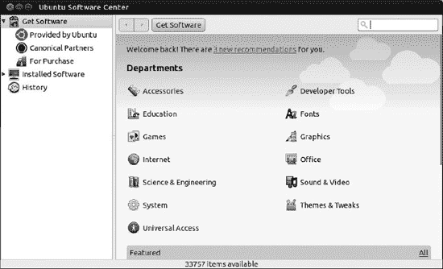
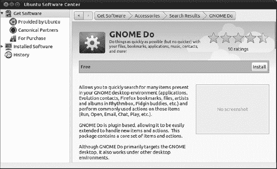
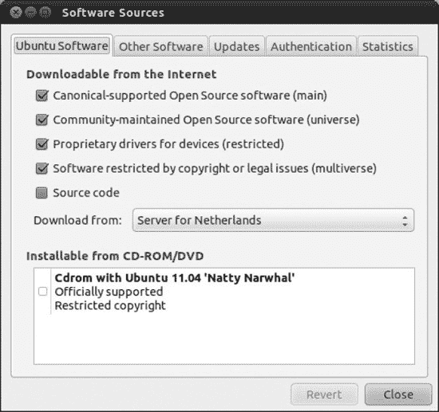
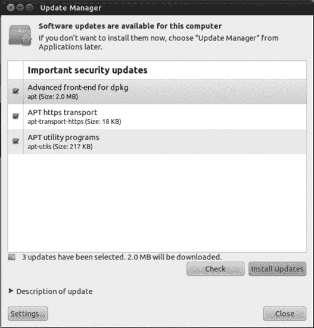
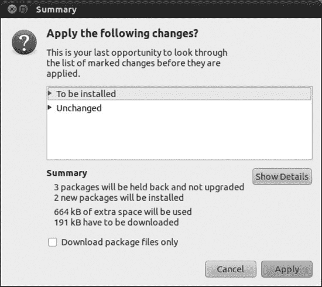

# 二十、安装和删除软件

运行任何操作系统的一个有趣的事情是扩展它的能力——随着时间的推移添加新的软件来改善您的工作流程或只是增强娱乐价值。

在这方面，Linux 是幸运的，因为有成千上万的软件可以满足几乎所有的需求。

但多年来，普遍接受的观点是，Linux 是一个伟大的操作系统，在许多方面优于微软 Windows，但它太难使用。这个论点继续说，软件安装是这种困难的主要例子之一:许多人仍然认为在 Linux 中安装软件必须知道如何编译源代码！与看似简单的获得 Windows 软件的方法相比，无论是在网上还是在零售店，然后运行安装向导，Linux 被视为普通用户的非选项。

并不是说 Windows 应用很容易获得。首先，你必须为它们付费，有时要花几百美元甚至更多。然后你对如何使用它们有限制，通常很难遵循你能做什么或不能做什么的规则。你可能侵犯了你的软件的许可条款，即使你并不知道。公司和个人用户更难确定和证明他们使用的软件是合法的；一些供应商要求您保存许可证密钥或证书，而其他供应商则要求您提供发票作为购买凭证。这取决于供应商。

另一个问题是找到合适的软件。没有一个中心位置可以让你找到所有适用于 Windows 的软件。虽然有免费软件应用程序，但通常你需要从不太可信的网站下载，这些网站容易将恶意软件捆绑到它们的下载包中。

这种应用程序安装方法实际上已经被苹果的 iPhone 和 iPod Touch 应用程序商店淘汰了。这是一个安全、集中且可搜索的应用程序目录，只需单击鼠标即可获得。如果应用程序存在，您只需浏览或搜索商店，应用程序就会出现。

但这种模式也有其局限性，最重要的是苹果在这个商店实施的严格控制，这使得开发人员发布应用程序的工作成为一场噩梦。

当 Canonical 公司的人想为人类开发一个操作系统时，他们很快意识到，基于 Linux 的基础，尤其是 Debian 的基础，竞争模型的所有缺点都可以被克服。这一努力的结果是 Ubuntu 软件中心，最初是为 Karmic Koala 推出的(Ubuntu 9.10)，从那以后一直在不断发展。它是所有 Ubuntu 应用程序的集中且可扩展的目录，也是本章第一节的主题。如果你只是想用简单的方法安装应用程序，这就是你需要阅读的全部内容。接下来，有几页理论可供参考，这让你对该中心如何工作有了更清晰的认识，并为本章的第三节打下了基础，在第三节中，你将学习更多安装和使用 Ubuntu…和 Windows 的方法！...应用程序。

当然，还有如何编译源代码！

### 使用 Ubuntu 软件中心

Ubuntu 传统上有许多不同的应用程序安装和管理工具:突触包管理器、添加/删除程序、更新管理器、软件源……更不用说命令行工具`dpkg`和`apt`。这些都是围绕软件管理完成类似任务的相关工具。在执行任何安装任务之前，您首先需要知道使用哪个工具。

许多开发人员甚至没有协调到让他们的应用程序从单一来源可用的程度。因此，需要在两个方向做出努力:制作一个单一的、无所不包的工具，并在该工具中发布所有可用的软件。于是 Ubuntu 软件中心诞生了。

#### 浏览 Ubuntu 软件中心

Ubuntu 软件中心可以在 Unity Launcher 上找到。打开后显示默认起始页，如图[图 20-1](#fig_20_1) 所示。它是获取软件项目的根。

***图 20-1。**Ubuntu 软件中心的结构*

菜单栏是在中心执行操作的一种非常简单的方式，但是它的选项通常是禁用的。它们只在特定时间可用，这取决于你所在的中心区域。

> *File:* 在这里，您可以找到安装和删除命令，这些命令仅在您选择列表中的特定应用程序或打开应用程序页面时才可用。根据应用程序的当前状态，在给定时间内只有一个选项可用。两个新的选择是重新安装以前购买的产品和取消计算机授权。这些选项与购买商业软件的新选项相关联。我们将用几个段落来讨论这个问题。关闭选项始终可用，并指示 Ubuntu 软件中心退出(注意，如果有未完成的操作正在进行，该中心将等待这些操作完成后关闭)。
> 
> *编辑:*该菜单中的许多选项，如剪切、复制、粘贴和删除，仅当您在搜索对话框中输入文本时才可用。当您从列表中选择一个应用程序时，或者当您打开该应用程序的详细信息页面并将该应用程序的 URL 复制到剪贴板时，复制 Web 链接选项处于启用状态，因此您可以将其粘贴到浏览器中并直接访问它。如果您在浏览器中粘贴复制 Web 链接选项并运行它，系统会提示您启动 Ubuntu 软件中心来安装该应用程序。只要搜索对话框出现，搜索选项就可用，并且基本上以它为焦点。最后，软件来源选项允许您修改或添加下载应用程序的位置。本章后面会有更多的介绍。
> 
> *查看:*在这里您可以选择您想查看列表的应用范围。所有软件显示所有来源的软件。Canonical 维护的软件只显示 Ubuntu 背后的公司维护的软件。
> 
> *帮助:*在这里你可以获得关于 Ubuntu 软件中心的有用帮助信息。

导航窗格用于浏览 Ubuntu 软件中心的不同部分。它有三个主要元素，其中一个通常是隐藏的。主页根据在导航窗格中选择的元素而变化。

> *获取软件:*主要用于在目录中定位并安装软件。这个目录是通过使用软件来源构建的，您可以看到默认的四种来源:由 Ubuntu、Canonical Partners、For Purchase 和 Independent 提供。当您开始添加替代软件源时，在“获取软件”下会出现更多的项目，这将在本章的后面解释。前两个默认来源是迄今为止在 Ubuntu 中安装应用程序最安全的方式——比从未知网站下载要安全得多。但是有一天你可能想安装未经 Canonical 官方认可的软件，因此知道如何添加软件源是很重要的。
> 
> *已安装的软件:*在这里您可以看到您的电脑中已经存在的软件列表，并且可以删除它。已安装的软件可通过列表中其图标旁边的勾号来识别。如果不想安装其他软件，请浏览此部分；例如，您可以只查看您已经安装了什么，或者删除不再需要的应用程序(例如，为了释放磁盘空间)。
> 
> *历史:*Ubuntu 软件中心的一个新的部分，在这里你可以看到以前在你的电脑上执行的安装、更新和卸载操作，按时间顺序排列。
> 
> *进行中:*在执行安装或删除应用程序或更新软件目录等操作时，您会在通知窗格中注意到第三个名为“进行中”的元素。当您选择此项时，您可以在主窗格中看到每个操作的状态，以及指示任务完成程度的进度条。例如，如果您正在安装一个应用程序，在下载应用程序时，进度条旁边会显示一个取消按钮。安装一旦开始(下载后)，就不能取消。当所有操作完成后,“进行中”元素返回到其隐藏状态。

状态栏通常会显示每个部分中有关申请数量的有用信息。例如，当第一次选择 Get Software 时，它显示目录中应用程序的总数(在编写本文时为 33，788！).如果您选择一个特定的部门，它会显示该部门中应用程序的数量(例如，Office 部门显示 132 个应用程序)。使用搜索对话框时，它会显示符合搜索条件的应用程序数量。

#### 浏览和搜索软件

要安装一个应用程序，首先你需要找到它。该中心的浏览和搜索机制，以及 Ubuntu 在一个目录中维护所有应用程序的事实，使得这一点变得很容易，该目录包含所有已配置软件源中可用应用程序的信息。

该目录是一个分层结构，分为多个部门，有时还包括部门下的子级别，当您在导航窗格中选择“获取软件”时，该目录将在主窗格中可用。每个部门都用一个共同的目标对应用程序进行分组，其名称不言自明；例如，游戏部门有像 Mines 这样的游戏，办公部门有主要在办公室使用的应用程序，如 LibreOffice 文字处理器(通常称为 Writer)。所以，只要选择你觉得最有可能有你正在寻找的应用程序的部门。如果你只是在探索，你可以选择特色应用链接，它会带你到一个由 Ubuntu 团队选择的特殊应用列表。

主窗格中“获取软件”部分的顶部是地址栏，由三项组成:后退和前进按钮、路径栏和搜索对话框。

后退和前进按钮允许您浏览已访问页面的历史。

路径栏显示您当前所处的层次部分，并允许您通过单击该栏的相应部分导航到父级别。例如，单击“获取软件”会将您带到起始页。

通过选择特色应用程序、新增功能窗格或单击某个部门，您可以访问所谓的软件列表视图。有些部门(比如游戏)有子层级，所以你必须更深入一点才能找到软件列表视图。在该视图中，所有相关的应用程序都显示在一系列连续的行中，如图[图 20-2](#fig_20_2) 所示。您可以在这里看到应用程序的图标、名称和简短描述。

虽然图中没有显示，但绿色圆圈中的白色复选标记表示应用程序已经安装，在右边，您将看到由其他用户设置的应用程序评级(因为您是社区的一员，所以您也有机会进行评级)。

 **注意**考虑到软件安装介质实际上驻留在由 Ubuntu 在网上维护的存储库中，并且当你点击安装时 Ubuntu 软件中心要做的第一件事是下载软件包。如果您没有互联网连接，您将无法从这些存储库中安装软件。您可以使用 CD 或 DVD，或者将应用程序包下载到另一台电脑上，然后在本地安装到您的电脑上。这些选项将在本章后面解释。

当您找到想要安装的应用程序时，只需从列表中选择它，然后按下出现在应用程序行右端的安装按钮。系统将提示您输入密码，应用程序将开始安装。安装按钮上方将出现一个进度条，导航窗格中将出现一个标记为“正在进行”的新元素。安装完成后，进度条会消失，Install 按钮会被一个更合适的 Remove 按钮取代，而 In Progress 元素也会消失。你能猜出如何卸载你的应用程序吗？是的，按下移除按钮。

***图 20-2。**配件部可用软件列表*

如果您想了解某个特定应用程序的更多信息，只需从列表中选择它，然后单击“更多信息”按钮。这将带您进入软件项目屏幕，您可以在[图 20-3](#fig_20_3) 中看到。

***图 20-3。【GNOME Do 的软件项目屏幕***

软件项目屏幕中的元素有:

> *   Apply icon.
> *   The name of the application.
> *   The rating of the application is defined by the number of stars, with one star as bad and five stars as excellent.
> *   A brief description of.
> *   An action/status bar section, in which you can check whether the application has been installed, choose to install or delete it, and follow the progress bar while performing these two tasks.
> *   A complete description of the application function.
> *   Links to application websites.
> *   Screenshot of the application.
> *   The size of the application on disk (as you can see, most Ubuntu applications are quite small).
> *   A description of the availability of application updates-whether they are provided by Canonical or the community, or by anyone.
> *   License information. Most applications are open source, but you will find some proprietary drivers.
> *   Package name and version.

单击“后退”按钮或地址栏中的部门名称，返回到应用程序列表。

查找应用程序的另一种方法是使用地址栏中的“搜索”对话框。您需要知道搜索是针对路径栏指定的范围。也就是说，如果你正在浏览 Get 软件 Education department 并搜索一个应用程序，只会显示该部门的应用程序。部门软件列表经过过滤，仅显示与搜索条件匹配的应用程序，状态栏中显示匹配项目的数量。

文本框中可用的所有操作，如粘贴和删除，都可以在搜索对话框中使用。键入文本时会执行搜索；没有必要按回车键或单击放大镜来执行查询。如果你想删除应用程序的过滤器，只需点击右边搜索对话框中的小清除器。

#### 评估和审查软件

一旦你安装了一个应用程序，你可以花一些时间，通过评级和审查来帮助社区将小麦从谷壳中分离出来。

对一个应用程序进行评级是一个非常简单的操作，但是你首先需要一个 Ubuntu One 账户。创建此帐户在第 15 章中有所介绍，因此如果您还没有创建帐户，请参考该章。

您只能查看已经安装在您系统上的应用程序(为了帮助社区，您应该只查看您实际使用过的应用程序！).从已安装软件列表中选择您想要查看的应用程序，然后点按“更多信息”按钮。如果你是第一个审阅申请的人，你会看到选项“成为第一个审阅它的人；否则，它会说“写你自己的评论。”点击任何一个选项，你都会得到一个 Ubuntu One 账户的提示；然后就可以写评论，投票了。

这一切是不是看起来太容易了，不像是真的？嗯，它*是*真的，这是你在 Ubuntu 中安装你需要的大多数软件所要做的一切(正如我们之前提到的，在撰写本文时，该中心有超过 33，000 个可用的应用程序！).但是 Ubuntu 也是一个多功能和灵活的操作系统，给你选择。它允许您通过其他来源安装附加软件，保持您的应用程序最新，甚至使用 Windows 应用程序。这将在本章后面解释，但首先我们需要更深入地研究 Ubuntu 软件管理背后的理论，以便更好地理解这些过程。

### 软件安装基础知识

如果说 Ubuntu 软件中心因其美观和简单而令人惊叹，那么整个 Ubuntu 软件管理系统在它所能实现的方面也有不小的价值。该中心利用了年复一年的发展成果，例如 Debian 软件包的引入、`apt`工具和软件仓库。让我们更详细地看看这些元素。

#### Linux 安装文件的格式

如果您访问某个特定 Linux 应用程序的网站，您可能会发现它可以以多种不同的格式下载。几乎可以肯定的是，这个程序将会以*源代码*的形式出现——开发者创造的原始的人类可读文本。但是它也可以作为二进制文件或包文件提供。

 **提示** Linux 并不是唯一一个创建和使用开源程序的操作系统。Windows 和 Apple Macintosh 都有开源项目，其中许多都托管在`[http://sourceforge.net](http://sourceforge.net)`网站上。许多其他不太广泛使用的操作系统也或多或少地依赖开源软件。Ubuntu 软件托管在 Launchpad ( `[https://launchpad.net](https://launchpad.net)`)中，这是一个由 Canonical 维护的网络应用程序，也用于软件开发和错误跟踪。

以下是 Linux 软件通常分发的格式:

> *源代码:*程序员用 C、C++等各种编程语言编写自己的软件，产生的代码被称为*源代码*。为了使源代码可用，它必须被*编译*成*二进制*。因为 Linux 哲学的基石是共享源代码，所以你几乎总能在开发者的网站上找到程序的源代码。然后，您可以下载并在自己的系统上编译它(或者，如果您愿意，可以研究源代码以加深理解)。尽管编译源代码并不难，但下载程序的二进制版本或软件包更方便。
> 
> *二进制文件:*你可能会发现在开发者的网站上可以找到现成的二进制文件。换句话说，程序员(或第三方)已经获得了他或她自己的源代码，作为对程序用户的一种服务，对它进行了编译，以便它一下载就可以使用。例如，如果你直接从`[www.mozilla.com](http://www.mozilla.com)`下载 Mozilla Foundation 软件的 Linux 版本，如 Thunderbird 和 Firefox，这就是它们目前的分发方式。有时二进制文件会附带脚本来帮助您安装它们。然而，在大多数情况下，您只需将文件放在硬盘上一个方便的位置，然后从那里运行它们。

 **注意**在源代码和二进制文件的情况下，文件通常出现在一个 *tarball* 中，它是包含其他文件的单个归档文件。根据定义，tarball 不是压缩的，但通常使用`bzip2`或`gzip`工具来压缩文件，以方便在互联网上传输。

> *自安装二进制文件:*一些较大的程序可以作为自安装二进制文件使用。这与 Windows 的工作方式非常接近，因为当文件被执行时，一个基于 GUI 的安装向导会带您完成安装。例如，如果您从官方网站(`[www.LibreOffice.org](http://www.LibreOffice.org)`)下载 LibreOffice 的标准版本(也就是说，不是为特定系统打包的版本)，您将得到一个 160MB 以上的文件，然后您只需从命令行执行它。
> 
> *包文件:*在很多情况下，你会发现程序的一个包文件是可用的。在这种情况下，有人编译了软件文件，并把它们放在一个单一的、易于传输的文件中。Ubuntu 包文件以`.deb`文件扩展名结尾，但其他 Linux 发行版使用其他包格式，如`.rpm` (Fedora/Red Hat、SUSE Linux 和 Mandriva 等)。

 **注意**作为一个总括规则，为一个发行版创建的安装包与另一个不兼容。可以在 Ubuntu 下使用一个名为`alien`的程序，该程序旨在在发行版和不同的包格式之间转换包，但这应该被视为最后的手段，因为结果可能并不总是令人满意。简单地获得一个专门为您的 Linux 发行版设计的包会更好。

#### 包装管理

在所有前面的格式中，包是 Linux 世界中最常见和最流行的。Ubuntu 使用软件包，几乎所有其他发行版都是如此。事实上，Ubuntu 安装 DVD-ROM 包含数百个软件包，它的各种软件仓库包含数千个软件包。

一个实现良好的软件包管理系统能够安装程序、升级程序和卸载程序，所有这些都只需要几次击键或点击鼠标。它极大地减少了在您的系统上安装新软件所需的工作量，并使升级软件等维护任务变得简单。

理解 Ubuntu 包文件实际上是什么以及它包含什么是很重要的。在 Windows 中，`installation .exe`文件实际上是一个软件和一个档案库的结合。当您运行可执行文件时，它会触发包含在其中的一个小程序，然后该程序将文件的内容解压缩并安装到硬盘上。

相比之下，Ubuntu 使用的包文件仅仅包含程序文件和一些配置脚本，以确保软件设置正确。如果系统上没有已经安装的各种软件，软件包文件是没有用的，这些软件用于操作它们，并完成安装、删除和查询它们的艰苦工作。这个软件被称为*包管理系统*。在 Ubuntu 的例子中，包管理系统有两个组件:`dpkg`和`apt`，我们将在本章后面介绍。Ubuntu 软件中心本身总是在处理软件包，尽管你从来没有见过它们。

使用包管理系统有许多好处。软件包管理系统建立自己的数据库，所以它确切地知道在任何时候安装了什么程序。因此，您可以简单地查询数据库，而不是搜索应用程序菜单或硬盘。软件包系统还跟踪版本号。这让用户对系统上的软件有了更多的控制，并且使更新变得容易。

使用包管理系统也意味着如果一个程序开始行为异常，它的配置文件可以简单地通过使用包管理器来刷新。不需要像 Windows 程序那样卸载并重新安装软件。软件包管理器卸载软件的干净方式使得测试和删除许多不同的软件变得非常容易，而不用担心你的计算机的稳定性。

#### 依赖关系管理

任何包管理系统提供的关键特性之一是*依赖性管理*。简而言之，软件包管理器确保如果您安装了一个软件，它正常工作所依赖的任何附加软件已经存在于系统中。如果软件不存在，包管理器必须自动解决这种情况，或者问你做什么。

有时，您要安装的软件可能依赖于系统上的其他程序，例如简单地向 shell 应用程序添加图形前端的应用程序，但更多情况下，依赖关系采用系统库的形式。如果你意识到并不是所有的包都包含你作为一个用户会直接使用的软件，这将会有所帮助。有些包除了库文件之外什么都不包含——共享代码片段，相当于 Windows 下的`.dll`文件。Ubuntu 系统上的关键库是 GNU C 库，没有它 Linux 内核就无法运行，这个库是由`libc6`包提供的。但是实际上每个程序对于库文件都有自己的需求，这些需求必须由包管理器来处理。

 **注意【Windows 安装文件通常如此之大的一个原因是，它们通常会附带所有需要的系统文件，以防它们不在系统中。然而，这并没有使依赖性问题消失。第三方应用程序安装程序有时会用与系统其余部分不兼容的版本覆盖现有的库。**

依赖管理不仅仅意味着添加一个软件需要的包。这也可能意味着*移除已经存在于你系统中的*包。如果它们与你想要安装的新软件不兼容，这可能需要发生，这被称为*包冲突*。此外，有时你可能想要删除一个其他包依赖的包，这种情况被称为*反向依赖*。在这种情况下，软件包管理器必须阻止您删除该软件，以避免破坏依赖它的软件，或者也删除反向依赖软件包。大多数情况下，包管理器会问你怎么做。

**依赖地狱**

如果您尝试安装某些软件包，您很可能会发现它们依赖于其他软件包，如软件库。这些软件必须已经安装在系统中，或者同时安装，软件才能正常工作。在大多数情况下，Synaptic 包管理器会处理所有这些。

依赖地狱(Dependency hell)远不如以前常见，它发生在依赖链出现的时候，也就是说，当你安装或删除一个程序涉及到安装或删除几个其他的、明显不相关的软件时。例如，假设您决定手动安装一个名为`Oscar`的程序。你下载它并输入命令来安装它，但是你被告知这依赖于另一个名为`BigBird`的程序，而这个程序并没有安装。好吧，你想，我就下载并添加`BigBird`到同一个安装命令中。但是后来发现`BigBird`有它自己的依赖`Snuffleupagus`。你也可以下载并添加。唉！`Snuffleupagus`有自己的依赖`MrHooper`。

这可能会持续一段时间，这就是为什么你应该使用 Ubuntu 软件中心来安装和删除软件，并尽量保持在标准的 Ubuntu 库内(见下一节)。在前面的例子中，Ubuntu 软件中心会自动添加所有的依赖项，并同时下载和安装它们。像这样的依赖链是任何包管理系统的副产品。解决方案通常很简单——不要删除软件包。毕竟，现在的硬盘非常大，空间很少成为问题，所以没有理由不放一些你不再需要的软件包。

#### 软件仓库

如前所述，`dpkg`和`apt`负责 Ubuntu 中的包管理。这些工具来自 Linux 的 Debian 发行版，Ubuntu 是基于它的。

Debian 包，或`dpkg`，是系统最基础的部分。它用于安装和卸载软件，也可以用于查询任何单独的软件包。这就像仓库的经理，他的任务是准确地知道哪些箱子被存放在哪里。经理不知道箱子从哪里来，也不知道自己仓库外的包裹。他只是管理交付给他并存放在仓库中的箱子。

意识到依赖问题，如果它需要的其他软件包还没有安装或没有同时提供，它将拒绝完全安装该软件包。但它没有自动修复这种情况的手段。这类似于仓库经理在需要时无法订购更多的箱子。那不是他的工作。他会告诉你送到他那里的箱子是否缺少了某些部件。

正因为如此，在`dpkg`之上还有一个额外的软件层，叫做高级打包工具，或`apt`。`apt`非常老练。它的工作是处理依赖性管理。尝试用`apt`安装一些软件，任何依赖问题都会为你解决。

`apt`可以做到这一点，因为它被设计成与*软件库*一起工作。用户可以从这些软件集合中搜索并安装软件包。通常情况下，这些软件仓库是在线的，但并不总是这样。例如，本书附带的 DVD 包含基本安装软件存储库。

 **注意**正如你可能已经猜到的，Ubuntu 软件中心只是`apt`系统的一个 GUI 前端。

需要注意的是，`apt`依赖于`dpkg`系统来处理实际的安装。实际上，`dpkg`和`apt`是一枚硬币的两面。

正如你可能已经意识到的，软件包管理系统意味着 Linux 软件的安装/删除与在 Windows 或 Mac OS X 下处理软件是完全不同的，如果你想安装新软件，首先要看的是 Ubuntu 软件库。在线存储库包含了目前大多数流行的适用于 Linux 的软件，都打包在 Ubuntu 下安装。

相对来说，Ubuntu 用户很少访问一个网站并下载一个安装包文件，而 Windows 用户却经常这样。这种情况通常只发生在你无法在官方资料库中找到你想要的东西的时候。留在标准存储库中会减少出现问题的可能性。

 **提示**要在 Ubuntu 下使用，软件库不必是“官方的”，也不必得到 Ubuntu 的批准。有时您可能会选择添加包含特定软件的存储库，例如多媒体存储库。这可能是必要的，因为多媒体格式通常是在 Ubuntu 不同意的条款下授权的，所以 Ubuntu 拒绝从其官方仓库提供这种软件。请记住，非官方的存储库不一定安全。

开箱即用，Ubuntu 附带了一些已经配置好的软件库。这些可以让你下载新软件，也可以在线更新系统。Ubuntu 软件库被细分为不同的类别和组件。

**软件版本**

因为大多数 Linux 软件都是开源的，所以当涉及到软件版本时，会发生一件奇怪的事情。一个程序不只有一个“官方”版本，如大多数 Windows 软件(你必须下载文件的官方版本)，许多个人和组织获取源代码，编译它，并使他们自己的包文件可供他人使用。

例如，几乎所有随 Ubuntu 安装的软件都是由 Ubuntu 开发者编译的。这意味着它可能与程序员网站上“官方”提供的完全不同。在某些情况下，源代码被调整以修复众所周知的错误，或者对软件应用不同的外观和感觉，因此它与发行版集成在一起。通常配置文件会被更改，以便软件在 Ubuntu 下正常工作，例如与其他软件包集成。

软件背后的程序员并不介意这样的事情发生，因为这种工作方式是开源软件的一部分。事实上，程序员很可能会鼓励这样的调整。

因此，如果你想要额外的软件，第一个地方不是开发者的网站，而是 Ubuntu 软件库。如果这个包在 Ubuntu 主发行版中可用，你将得到一个官方认可的 Ubuntu 发行版，它将与你的系统的其余部分相适应，并且不需要太多的额外工作就可以启动和运行。

##### 存储库的类别

不管它们是在网上还是在 CD/DVD 上，Ubuntu 软件仓库都是根据它们包含的软件类型严格分类的:

> *主发行版:*这个库包含了安装 Ubuntu 所需的软件包。这个存储库的名字通常来自于发布的代码名，默认情况下是激活的。对于 Ubuntu 11.04，主要的发布库被称为`natty`，以 11.04 版本的代码名称命名(Natty Narwhal)。在之前的版本中，主发行库被称为 `maverick`，下一个版本(Oneiric Ocelot)将拥有`oneiric`库。(关于 Ubuntu 代码名称的更多细节，见`[https://wiki.ubuntu.com/DevelopmentCodeNames](https://wiki.ubuntu.com/DevelopmentCodeNames)`。)
> 
> *安全更新:*有时安全漏洞非常严重，需要在被发现后的 24 小时内立即修复。如果是这样，相关的包将被放在这个服务器上。安全更新服务器与新版本或新功能无关。而是快速修复安全漏洞。该存储库也是默认激活的，并以主发布标题命名。在 11.04 中，这意味着安全更新库被称为`natty-security`。
> 
> *推荐的更新:*这个库包含了主发行库中较新版本的包。像安全更新一样，这一类别也提供错误修复，但这些修复并不紧急，通常比修复关键错误的快速补丁更重要。它是以主发布标题命名的。在 11.04 的情况下称为`natty-updates`。
> 
> *提议的更新:*这是一个特殊的类别，通过它可以发布更新的测试版本。没有理由使用这个类别，除非你想测试包并帮助修复错误(更多信息，见`[https://wiki.ubuntu.com/HelpingWithBugs](https://wiki.ubuntu.com/HelpingWithBugs)`)。默认情况下，不会激活此类别。它是以主发布标题命名的，所以在 11.04 的情况下被命名为`natty-proposed`。
> 
> *不支持的(反向端口)更新:*反向端口服务器允许访问旨在进入下一版本 Ubuntu 但已为当前版本打包的软件。这个软件可能还没有经过彻底的测试，所以只适合于新的爱好者或那些绝对需要最新版本的人(也许是因为它提供了一个重要的新功能)。默认情况下，不会激活此类别。和以前一样，它的名字来源于主版本，所以在 11.04 的情况下叫做`natty-backports`。

##### 存储库组件

除了上一节列出的类别之外，Ubuntu 库还根据软件对基本 Ubuntu 安装或软件使用的许可证的重要程度进一步分为*组件*(实际上是子部分)。以下是软件通常在存储库中归档的组件(尽管您应该注意，第三方存储库可能有自己的存储库组件名称，并且它们可能与此列表不同):

> 这个部分包含了基本 Ubuntu 安装中几乎所有的软件。因此，它都是自由软件，每个软件包都由监管 Ubuntu 项目的 Canonical 公司提供支持。这意味着经常会提供更新来修复安全漏洞，或者只是为了跟上最新版本。

 **注** *自由软件*是指通过使用自由软件基金会认可的一种免费方案而获得许可的软件。最常见的例子是 GNU 公共许可证(GPL)。这并不一定意味着软件是免费的，尽管事实几乎总是如此。

> 宇宙:这个部分可能被称为“其余部分”，因为它包含了目前可用的大多数自由软件。其中大部分是从庞大的 Debian 软件仓库借来的，尽管在发布之前，这些软件包有时会被调整以在 Ubuntu 下正确工作(一些创建 Debian 软件包的人也会创建 Ubuntu 的等价物)。与 Main 和 Restricted 不同，Universe 部分没有得到 Ubuntu 项目的官方支持，这意味着不能保证安全缺陷会得到修复。也没有任何更新的保证，虽然大多数软件包通常会定期更新。
> 
> *受限:*虽然 Ubuntu 大部分是自由软件，但它必须包含一些仅以二进制形式发布的驱动程序(即专有的)，因此，这些驱动程序的许可协议与自由软件的目标不一致。这就是你将在本部分中找到的内容。如果没有受限区域的软件，一些硬件根本无法完全工作。
> 
> 与受限部分一样，在这里你会发现在软件许可下发布的软件与自由软件的文字和精神都不相容。然而，与受限部分的软件不同，Multiverse 中没有一个软件被认为是默认安装 Ubuntu 所必需的。
> 
> *源代码:*这个部分包含源代码包。除非你是一名软件开发人员或者正在考虑成为一名软件开发人员，否则这一部分不会有太大的吸引力。
> 
> 这个库包含了与赞助 Ubuntu 开发的 Canonical 公司合作的供应商提供的软件。这种软件通常是商业的和专有的(即，不是开源的)。提供的软件包的精确列表因版本而异，但过去的例子包括病毒扫描程序、媒体播放器和商业服务器软件。

既然我们已经介绍了 Linux 软件安装的基础知识，现在是时候讨论用于管理软件的其他工具了，这些工具将使您能够执行高级任务。

**解码包文件名**

尽管包的文件名看起来像是神秘的胡言乱语，但是它们实际上告诉了你关于文件的很多信息。让我们看一下 GNOME 图像查看器之眼的包文件来解释这一点:

`eog_2.21.92-0ubuntu1_i386.deb`

文件名的第一个元素是程序的名称。在这种情况下，GNOME 之眼被缩写为`eog`。像这样的缩写很常见，因为它们减少了文件名的长度。但是需要注意的是，它们是一致的。只要 GNOME 之眼作为 Ubuntu 下的一个包被支持，它的包文件名将总是以`eog`开头。

包名后面是程序的版本号:`2.21.92-0`。这几乎总是版本号，如果你点击 Help 了解程序何时运行，这个版本号是由软件开发者决定的。

版本号后面是单词`ubuntu`，表示这是专门为 Linux 的 Ubuntu 发行版创建的包。然后你看到包的 build 版本号:`1`。这是 Ubuntu 自己的版本号，表示这个包被 Ubuntu 团队构建(创建)了多少次。有时，为了纠正先前版本中意外引入的错误，有必要发布同一程序版本的更新版本。有时候程序会被 Ubuntu 团队打补丁来支持一个新的功能。

Ubuntu 的 build 版本号之后是包运行的平台。在这种情况下，`i386`表示该软件包将在所有基于 x86 的处理器上运行，从 80386 开始(486、奔腾、奔腾 II、AMD 处理器等等)。有时你可能会看到`i686`，这意味着该封装已经针对奔腾 Pro 芯片及以上(奔腾 II、III、IV 以及 AMD 的 Athlon 系列芯片)进行了优化。如果软件包是为 64 位桌面处理器创建的，`amd64`将出现在那里。有些包适用于所有架构。

针对特定处理器的优化版本的软件包仅在可能带来性能提升时使用。例如，有 Linux 内核的`i686`版本和`libc6`库。即使是普通的程序，比如 LibreOffice，也可以针对它们的架构进行优化，但是大多数在 Ubuntu 下使用的软件包都有`i386`的名称。

### 高级应用管理

有时，您可能需要执行比安装或删除软件更高级的任务。您可能希望对安装的内容有更多的控制，或者启用默认情况下不包括的其他软件存储库。您可以更新已安装的软件，以始终使用最新版本。或者你可能需要从 Debian 软件包中手动安装软件。在本节中，我们将深入探讨这些任务以及其他任务。

### 管理 Ubuntu 软件选项

您可以使用软件源工具来管理官方库的哪些组件可以下载到您的目录中，您可以从 Ubuntu 软件中心的编辑菜单中选择该工具。

Ubuntu 软件选项卡如[图 20-4](#fig_20_4) 所示。在这里，您可以:

> *   Select the repository components that can be downloaded from the Internet. You can choose to provide the main repository, universal repository, restricted repository and multi-universal repository components, as well as the source code of the application (which you rarely use). We have already discussed these components.
> *   Select the server where you want to download the application. If you choose Other … from the drop-down list, you will see a series of servers from all over the world. If you are not sure which server is best for your needs, please click the "Select the Best Server" button, and the system will start to check the time required for each listed server to respond to its request to determine which server is the best choice.
> *   If you want to install the software directly on Ubuntu CD or DVD without connecting to the Internet, please select the option to install it from CD-ROM/DVD. This source code will be listed under the Get Software element in Ubuntu Software Center.

完成后单击关闭。

***图 20-4。**软件来源工具的 Ubuntu 软件标签*

### 添加软件源

你可能需要或者喜欢安装 Ubuntu 的其他软件资源。您可以使用软件源工具中的其他软件选项卡来访问它们，如图[图 20-5](#fig_20_5) 所示。

***图 20-5。**软件源工具的其他软件选项卡*

默认情况下，您将看到规范的合作伙伴存储库，其中的主要组件被选中，而源代码组件没有被选中。这是在 Ubuntu 软件中心的 Canonical Partners 下面列出的软件资源。您也可以添加 PPAs 和其他软件来源。

PPAs 或个人包档案是由 Canonical 在其 Launchpad 服务中托管的存储库，代表第三方开发人员。开发人员可以激活一个 PPA，Launchpad 将生成一个惟一的密钥来对该 PPA 中包含的任何包进行签名。然后，开发人员可以提交其应用程序的源代码，Canonical 的人员构建安装应用程序所需的二进制文件和包。Ubuntu 用户从这种合作中受益，因为他们可以将这些 PPAs 添加到他们的软件源中，并使用 Ubuntu 软件中心安装应用程序。请注意，Canonical 认为 PPA 中包含的软件不可信，因此需要格外小心。

按照以下步骤将 PPA 添加到您的软件源:

> 首先你需要找到合适的 PPA。你可以在 PPAs 主页`[https://launchpad.net/ubuntu/+ppas](https://launchpad.net/ubuntu/+ppas)`搜索 PPAs，或者直接浏览到一个 PPA，如果你知道它的网址(它会一直包含在同一个网站里)。例如， Chromium 网络浏览器的日常构建托管在`[https://launchpad.net/~chromium-daily/+archive/ppa](https://launchpad.net/~chromium-daily/+archive/ppa)`中。*   Find this PPA and add it to your system. You will see that the address format of PPA is `ppa:<software_name>/ppa`. For example, for Chromium daily build, it is `ppa:chromium-daily/ppa`. Copy the text to the clipboard.*   Open the software source tool and access other software tabs. Press the Add button to paste the PPA's address into the APT line text box. Press add source. You will see the URL of the PPA added.*   The key generated by Launchpad for this PPA will also be imported, which you can see in the authentication tab of the software source (you will see an entry named `Launchpad PPA for <software_name>`)*   Click close. The directory in your hard disk will be updated to take into account the new software source.

既然目录已经更新了，那么可以通过使用 Ubuntu 软件中心来安装 PPA 上可用的软件。您将在“获取软件”下看到一个 PPA 条目。

您还可以添加托管在其他服务上的软件源。您需要知道服务器名和组件名。转到“其他软件”选项卡，单击“添加...”按钮，并使用以下格式在“APT 行”字段中填入存储库的信息:

`deb http://<server>/<repository> natty <component>`

单击添加源，然后单击关闭，将源添加到目录中。

### 管理软件更新

与安装软件同样重要的是保持软件最新，以避免安全漏洞，并充分利用添加的新功能。Ubuntu 可以自动注意到它所知道的软件库或软件源中已经更新的软件，并让你选择你的行动方案。这可通过使用软件源工具的更新选项卡进行配置，如图[图 20-6](#fig_20_6) 所示。

***图 20-6。**软件来源工具的更新选项卡*

在这里，您可以:

> *   The allowed Ubuntu update types: important security update (`natty-security`), recommended update (`natty-updates`), pre-release update (`natty-proposed`) and unsupported update (`natty-backports`). We discussed them earlier in this chapter.
> *   Check the frequency of configuration updates (once a day, once every two days, once a week or once every two weeks) and the measures to be taken when new versions are found: install security updates without confirmation, download all updates in the background, or notify only when new versions are available. Ubuntu will let you know when a new version of the operating system is released (this is once every six months! ). You can choose to warn only in LTS version (every two years), all normal versions, or never warn at all.

一旦您配置了软件更新通知，将会有一段时间提示您安装它们。你可以打开更新管理器，这是一个位于应用菜单系统部分的工具，如图[图 20-7](#fig_20_7) 所示。

***图 20-7。** Ubuntu 更新管理器*

这是可用更新的列表，每个更新旁边都有一个复选框，表明您是否要安装该更新。始终建议您保持软件最新，或者至少尽快安装重要的安全更新，以避免将来出现问题。

单击“检查”按钮会强制重新同步软件目录，以验证没有要安装的新更新。查看完所有更新后，您可以单击“安装更新”按钮并继续执行任务。

### 深度突触包管理器

新立得软件包管理器实际上是`apt`系统的图形前端，在 Ubuntu 软件中心之前是首选的 GUI 应用程序。尽管 Synaptic 已经被取代为软件安装的主要来源，但如果您需要对安装到系统中的特定软件包进行更多控制，它仍然很有用。虽然 Ubutu 软件中心是安装应用程序的一个很好的工具，但是你可能会觉得用 Synaptic 安装系统库或其他文件更舒服。你可以用它来搜索和安装软件。要启动这个程序，打开应用程序菜单，按系统类别过滤，并选择新立得软件包管理器。

#### 搜索软件

在搜索软件之前，刷新软件包数据库总是一个好主意。该数据库描述了存储库中包含的软件，它保存在您的硬盘上。只需点击新立得软件包管理器工具栏上的 Reload 按钮，就可以从您订阅的各种库(在您的`Software Sources`中)中获取最新的软件包列表。在慢速连接的情况下，重新加载可能需要几分钟的时间，但是它可以确保您能够访问存储库中的最新软件。

您可以通过三种方式搜索软件:

> *超快:*要轻松进行即时搜索，只需点击包裹列表中的任意条目，然后开始输入。这将使您键入的内容与软件包名称相匹配，并在您键入时对列表进行动态排序。但是，这不允许您在描述中搜索关键字。
> 
> *Quick:* 通过在主工具栏的快速搜索字段中键入您的搜索词，您可以搜索软件包名称和描述。
> 
> *深入:*要进行深入搜索，您可以搜索包中包含的所有信息，请单击工具栏上的搜索按钮。默认情况下，它会搜索软件包名称和描述，但是通过单击“查找范围”下拉列表，您可以选择按其他信息进行搜索，例如版本号。您可以键入特定的程序名或描述中的关键字。例如，如果您正在为您的 Nvidia 卡寻找图形驱动程序，但您不知道包含它们的软件包的名称，您可以键入 **nvidia** 。

 **提示**你不需要在搜索栏中键入整个单词。您可以键入单词的一部分，或者更常见的是，以缩短或替换的形式键入单词。例如，如果你正在寻找一个电子邮件客户端，简单地输入*邮件客户端*或者甚至只是*邮件*可能会更有成效。这将返回包含*电子邮件*、*邮件*、*邮件*等的结果。

通过点击 Settings  Filters 按钮，您可以创建一个过滤器，将不符合您要求的包从结果中删除，从而增强您的搜索结果。您可以根据标准进行筛选，例如软件是否已经安装，它是否是存储库中的新软件，等等。建议在开始之前点击新建按钮创建你自己的过滤器，如图 20-8 所示，而不是编辑一个已经存在的过滤器。创建过滤器后，您可以通过单击主程序窗口左下角的自定义过滤器按钮，然后单击列表中的过滤器名称，将过滤器应用于搜索结果。

***图 20-8。**过滤器可用于根据特定标准整理搜索结果列表。*

过滤的一个用途是删除 Installed 旁边的复选标记，这样您就可以从搜索列表中删除任何可能已经在您的系统上的软件包。

 **注意**过滤可以帮助减少搜索结果的数量，如果你使用一个通用的搜索词，但不要忘记当你完成时关闭过滤。为此，请单击过滤器列表顶部的全部。

在搜索结果中，任何旁边带有 Ubuntu 符号的包都是受*支持的*包，也就是说，它们来自主要或受限软件库，而不是 Universe、Multiverse 或第三方库。因此，将来可能会提供更新。

如果复选框是绿色的，这意味着软件包已经安装。复选框旁边的星号表示该包是新的。你可以通过点击帮助图标图例来查看突触图标的完整范围。

通过单击描述面板顶部的 Get Screenshot 按钮，您可以查看应用程序的缩略图截图(如果有的话)。这有助于确定软件是否能满足您的需求。当缩略图出现时，单击它可以下载全分辨率的屏幕截图。

请注意，目前并不是所有的应用程序都有截图。有些——比如缺乏用户界面的系统软件或命令行程序——永远不会有屏幕截图，因为很简单，没有什么可看的。

#### 安装软件

当您单击搜索结果中某个软件旁边的复选框并选择“标记为安装”时，该程序将排队等待安装，只要您单击工具栏上的“应用”按钮，安装就会开始。如果该程序有任何未安装的依赖项，您还会看到一个对话框，要求您确认安装这些依赖项。如果您同意，这些将自动添加到要安装的软件包列表中。

此外，如果右键单击该文件并选择“标记为建议安装”或“标记为建议安装”,您将看到一个程序列表，尽管这些程序对于正在运行的程序来说不是必需的，但会在某种程度上增强其功能。比如你选择安装 VLC 媒体播放器程序，也建议你安装`mozilla-plugin-vlc`，这样 VLC 就可以作为 Firefox 中播放媒体文件的插件。你不必安装这些推荐的程序；没有它们，软件也能运行良好。但如果你这样做，往往会有所收获。

 **注意**如果推荐和建议列表中的软件是灰色的，这意味着它已经安装。也有可能这个包没有任何推荐/建议的包。

做出选择后，点击工具栏上的应用按钮(记住你可以一次安装多个软件)，你会看到摘要对话框，如图[图 20-9](#fig_20_9) 所示。这里再次要求您确认需要安装什么。如果为了处理依赖性问题需要删除任何软件，您也会被告知这一点。此外，在摘要标题下，您将看到将要下载的文件的总大小，以及硬盘上所需的空间。

***图 20-9。在新立得软件包管理器安装任何软件之前，你会被告知这是什么，并被要求确认选择。***

在“摘要”对话框的最底部，您会看到一个标记为“仅下载包文件”的复选框。正如它所建议的，这将下载但不安装软件包。如果您以后再次选择该软件包进行安装，您不需要下载它，安装将几乎是即时的(除非已经发布了该软件包的较新版本，在这种情况下，将会下载并安装该较新版本)。

如果您在“摘要”对话框中看到一个未更改的标题，这意味着您还没有选择安装几个可用的系统更新。要安装系统更新，请单击取消，然后单击工具栏上的标记所有升级按钮。然后再次单击应用。然后，您将在摘要对话框中看到两个单独的标题:一个列出了升级，另一个列出了您选择安装的新软件包。

 **注意**当然，您可以选择忽略更新可用的事实，直接继续安装。建议尽快安装更新，但不强制执行。

元包

像 GNOME 桌面这样的软件实际上是由许多程序和系统库组成的，而不是一个单独的软件。因此，举例来说，你可能想知道如何在 Ubuntu 11.04 下安装 KDE 桌面。有必要手动安装每个组件的包吗？

理论上，依赖管理应该能够有所帮助，你应该能够选择 KDE 桌面系统的一个关键部分，比如 Konqueror 文件浏览器，并让 Synaptic 包管理器处理其余的部分。毕竟，Konqueror 将依赖于其他 KDE 软件包。

唉，这在现实中很少行得通。以这种方式安装 Konqueror 确实会安装 KDE 桌面套件的大部分，但不是全部。例如，Konqueror 并不依赖于 KDE 的默认文本编辑器 Kate。尽管这些包将被安装，但不能保证它们将被配置为在桌面环境下正常工作。

*元包*提供了解决方案。这些软件包包含配置文件，以确保正确安装和配置所有软件，并且它们还具有广泛的依赖关系列表，其中包括相关软件的完整软件包集。(KDE 的元包是`kdebase`，但是如果你想要完整的 Kubuntu 体验，你应该安装`kubuntu-desktop`元包。)

除了桌面套件，Ubuntu 元软件包的其他例子包括 LibreOffice 办公套件，其中元软件包确保套件的所有组件都可以轻松安装，以及 X.org 图形子系统。要查看可用的元包，只需使用新立得包管理器或 Ubuntu 软件中心搜索*元包*。

#### 删除软件

要删除某个软件，请按名称搜索它，单击它旁边的复选框，然后选择标记为删除。这将删除软件，但留下它创建的任何配置文件。这意味着您可以在将来再次安装它，它将像删除前一样工作。但是，您也可以选择标记为完全删除，这将删除配置文件。

与安装软件一样，当您删除软件时，新立得软件包管理器试图管理依赖关系，但在这种情况下，它会强制删除任何明确依赖该软件的软件。

通常，解决方案就是不要删除软件包。毕竟，现代硬盘容量很大，包装不太可能占据太多空间。

### 使用 Ubuntu 软件中心手动安装

在以前的 Ubuntu 版本中，你必须使用不同的工具来安装你自己或者从互联网上其他地方以`deb`文件形式获得的单个软件包。

现在，推荐和默认的方法是使用您用来安装支持的应用程序的相同的 Ubuntu 软件中心。

例如，您可以安装 Oracle 的虚拟化软件 VirtualBox。转到`[http://www.virtualbox.org/wiki/Linux_Downloads](http://www.virtualbox.org/wiki/Linux_Downloads)`并选择适合您的 Ubuntu 版本的下载。选择将文件保存到本地目录，默认为`Downloads`文件夹。

当你右击一个`deb`文件时，默认选项是用 Ubuntu 软件中心打开。选择此选项，您将被带到应用程序的详细信息，在那里会有一条消息警告您仅在信任其来源的情况下安装此软件包。在这种情况下你可以，所以点击安装。

如果依赖项包在存储库中不可用，则 Install 按钮处于非活动状态，并列出缺少的依赖项。从理论上讲，你现在必须手动寻找缺失的依赖项，但是很有可能的是，如果这些依赖项在存储库中不可用，那么这个有问题的包就不是为你正在使用的 Ubuntu 版本设计的，或者甚至不是为 Ubuntu 本身设计的(例如，它可能是为 Debian 的不同衍生版本设计的包，或者甚至是 Debian 本身)。

另一方面，如果软件包存在于标准存储库中，Ubuntu 软件中心会建议您从那里安装，而不是从不可信的软件源安装。如果是这样的话，听从它的建议是明智的。

### 用 Wine 安装 Windows 应用程序

成千上万的免费应用。易于安装。如果这还不够呢？如果您只是需要 Windows 应用程序来执行一些特殊的任务，该怎么办？和 Ubuntu 中的所有东西一样，它有一个解决方案。

解决方法是葡萄酒。 *Wine* (递归首字母缩略词，意思是“Wine 不是仿真器”)是一个能够在 Linux 上运行 Windows 应用程序的软件层。该项目早在 1993 年就开始了(在 Linux 生命周期中),作为在 Linux 上支持 Windows 3.1 应用程序的一种方式。今天对这种支持的需求比以往任何时候都更加明显，所以 Wine 应该是你迁移到 Ubuntu 的最大盟友之一。

为什么这么重要？鉴于 Windows 是最流行的桌面操作系统这一事实，事实上有许多应用程序是专为该平台开发的。这很可悲，但也是事实。如此多的用户觉得被困在昂贵的操作系统中，他们不想要它，只是因为他们需要运行应用程序。不应该那样。这是一个经典的先有鸡还是先有蛋的难题:由于缺乏应用程序，很少有人使用 Linux 开发者不把他们的应用移植到 Linux，因为没有足够的用户。酒是打破这种恶性循环的工具。

安装 Wine 相当容易。另一方面，安装 Windows 应用程序并在其上运行可能会非常具有挑战性。并不是所有东西都像你希望的那样开箱即用。Wine 只是一个不断发展的工具，需要用户的大量输入。葡萄酒社区在评估和审查申请方面值得称赞。

全球有很多用户通过使用 Wine 尝试在 Linux 上安装 Windows 应用，并在`[http://appdb.winehq.org](http://appdb.winehq.org)`分享他们的经验。不出意外，测试最多的应用其实是游戏！

我们现在将研究如何安装 Wine，如何进行初始配置，以及如何安装一个示例应用程序。如果你有一个程序想在你的新 Ubuntu 桌面电脑上运行，我们建议你浏览应用程序数据库以获得如何运行它的建议。数据库中有超过 10，000 个应用程序，因此很可能您会找到您的应用程序。

#### 安装和配置 Wine

Wine 可以使用 Ubuntu 软件中心轻松安装。只需搜索应用程序 Wine Microsoft Compatibility Layer(如果您搜索 Wine，它将是列表中的第一项),然后单击 Install。和往常一样，系统会提示您输入密码以开始安装。

在安装过程中，如果您的系统中没有 Microsoft Core 字体，它将安装这些字体。这些字体是微软项目的一部分，旨在为互联网创建标准的排版。

一旦安装完成，一些新的选项将可用；您可以通过在应用程序启动器中键入名称的一部分来找到它们:

> *浏览 C: Drive:* 我们在[第 10 章](10.html#ch10)中提到 Ubuntu 文件系统与 Windows 不同，它不使用字母来标识驱动器。那么这个`C:`驱动是什么呢？它是 Wine 创建的一个虚拟文件夹，让 Windows 应用程序感觉更自在。葡萄酒创造了一个隐藏的。你家的`wine`文件夹，还有一个`.wine`里面的`drive_c`文件夹。Windows 应用程序认为该文件夹是`C:`驱动器的根目录。
> 
> *配置葡萄酒:*此工具允许您配置葡萄酒。您将能够选择最能支持应用程序的操作系统，并执行添加系统库、选择图形设置、添加驱动器或配置音频等高级任务。这是一个工具，它将帮助你调整你的应用程序，使它们正常工作。
> 
> *卸载 Wine 软件:*这是 Wine 版本的添加/删除程序。从这里你可以安装或删除 Ubuntu 的 Windows 软件。

#### 安装 Windows 应用程序

现在 Wine 已经启动并运行，您可以安装您的 Windows 应用程序了。

学习如何做的最好方法是给你一个例子。这真的很容易做到，有时它开箱即用。如果没有，你应该咨询 AppDB 或其他论坛，因为其他人很可能有同样的问题。

在这个例子中，我们安装了应用程序 Notepad++，这是许多开发人员用来编写源代码的记事本的替代品。这是一个易于安装的应用程序，将很好地服务于我们的目的。这些是基本的指令，适用于大多数简单的软件。您将能够使它们适应您想要安装的软件。所以我们开始吧:

> 1.  Open Firefox browser and enter the website `[http://notepad-plus-plus.org/download/v5.9.2.html](http://notepad-plus-plus.org/download/v5.9.2.html)`. Click Notepad ++ v5.79.2 to install the program. Save the file to disk.
> 2.  Go to your download folder (this is where Firefox stores files obtained from the Internet), and right-click the installer you just downloaded. Open the Properties dialog box, and check the Allow files to be executed as programs box in the Permissions tab. Click close.
> 3.  Right-click the file and select the option to open it with Wine Windows program loader. A common installation wizard familiar to all Windows users will appear. Follow it until the application is installed.
> 4.  Look! The application is now installed. It will open automatically. From now on, you can find it in the application launcher of the Unity panel.

当您确信不再需要该应用程序时，您可以使用卸载 Wine 软件工具将其从系统中删除。从列表中选择应用程序，然后按卸载按钮。按照向导卸载应用程序。

这样，安装 Windows 应用程序似乎非常简单。然而，在某些情况下，这并不容易。幸运的是，总有 Ubuntu 社区可以提供帮助！

### 从源安装

几年前，在 UNIX 系统中安装许多软件包的唯一方法是从源代码开始，这个过程被称为*编译*。这是因为大多数人自己编辑源代码，或者至少喜欢这样做。如今，像 Debian 软件包管理系统这样的创新使得编译对于普通用户来说几乎是多余的。但是知道如何从源代码编译程序仍然是一个很好的 Linux 技能。在某些情况下，这是您安装某些程序的唯一选择，因为您可能找不到打包的二进制文件，或者因为打包程序尚未创建他们最新发布的二进制版本。

程序编译通常是在命令提示符下进行的，所以在继续之前，请务必阅读附录 A。这不是你可以通过 GUI 程序做的事情。

#### 安装编译器工具

在你从源代码编译之前，你需要安装几个软件:一个是`make`程序，它监督创建一个新程序的过程，另一个是 GNU 编译器集合(GCC ),它负责将源代码转换成二进制代码。此外，如果软件依赖于某些库文件，您将需要安装它们的开发(`dev`)版本，以及库本身(如果它们还没有安装的话)。例如，如果你正在编译一个在 GNOME 桌面下运行的程序，你将需要 GTK2+库的开发版本。

在 Ubuntu 下，可以通过安装`build-essential`元包来安装所有你需要的程序编译工具。你可以使用新立得软件包管理器或者 Ubuntu 软件中心。

在本章的剩余几页，我们将讨论源代码编译和安装的一般过程。它没有特别提到任何软件，但它确实适用于大多数应用程序。

#### 解包源文件并解决依赖关系

让我们看一下从源代码安装程序。您通常从开发人员的网站上下载应用程序的源代码包。包的名称将引用应用程序名称和版本号，例如:`applicationx-2.0.4.tar.gz`。`.tar.gz`扩展名(在某些情况下称为`.tgz`)是因为源代码文件是打包和压缩的文件。

你要做的第一件事是打开它。从命令行进入保存您的`.tar.gz`文件的目录(如果您使用 Firefox 下载它，它可能在您的下载文件夹中)，并运行下面的命令(当然使用适当的文件名):

`tar xzvf applicationx-2.0.4.tar.gz`

这将创建一个名为`application-2.0.4`的子目录。使用以下命令移动到它:

`cd applicationx-2.0.4`

在这个文件夹中，您应该会找到一个名为`README`或`INSTALL`的文件。请仔细阅读，以检查依赖性或其他有用信息。

`less README`

如果您发现该软件有任何依赖项，您可以使用新立得软件包管理器或 Ubuntu 软件中心来安装所需的软件包。

 **注意**与二进制包不同，源代码很少考虑一个特定的 Linux 发行版——或者甚至考虑 Linux！只要做一点工作，甚至有可能在 Windows 下编译它！

#### 编译

现在是编译程序的激动人心的过程！这是一个包含三个步骤的过程，您必须依次执行三个命令:

`./configure`

第一个命令启动由应用程序的程序员创建的`configure`脚本，它检查您的系统以确保它满足需求。换句话说，它检查以确保`dependencies`存在。它还检查以确保你有正确的软件来实际编译一个程序，比如 GCC 和`make`。

当`configure`脚本运行时，最有可能出错。在这种情况下，错误消息通常会告诉您缺少一个依赖项，您必须解决这个问题。

 **注意**有些`configure`脚本非常彻底，会检查你试图安装的程序可能根本不需要的组件，因为，例如，它们可能只是做同样工作的替代包。因此，当文本滚动过去时，如果您看到各种组件丢失了，您不必担心。除非`configure`做完了还抱怨它，否则不是问题。

`make`

下一个命令`make`，负责实际的程序编译。当您运行这个程序时，屏幕上会出现看起来像是胡言乱语的东西，但这仅仅是 GNU 编译器的输出。它为了解这类事情的人提供了许多有价值的信息，但你可以在很大程度上忽略它。但是，您应该密切注意任何错误消息。有可能`configure`脚本没有彻底检查你的系统，你可能会错过一个重要的系统组件——在这种情况下，`make`将暂停。

 **注意**有可能`make`和`make install`命令都报告了错误信息，但是应用程序在安装后仍然工作。这个故事的寓意是，软件编译是一种黑色艺术，错误信息是为程序员设计的，并不是所有的错误信息都是致命的。

或者，如果不对`Makefile`(`make`使用的文件)做一些调整，程序可能无法在您的系统上编译。如果出现这种情况，最好的办法是访问软件开发商的网站，看看是否有你可以发帖的论坛。或者，检查开发人员是否有您可以联系以寻求帮助的电子邮件地址。

`sudo make install`

最终，编译将停止，并显示一些退出消息。然后必须运行最后一个命令:`make install`。这需要以超级用户权限运行，因为它的工作是将您刚刚创建的二进制文件复制到相关的系统目录中。此外，该程序附带的任何文档也会被复制到系统上的相关位置。

这三个命令完成后，您应该能够通过在命令提示符下键入程序名称来运行该程序。

 **注意**你可能需要将你自己的应用图标添加到桌面或应用菜单上(关于这个过程的更多细节，参见[第 9 章](09.html#ch9))。源包通常被设计为安装在运行各种桌面管理器的任何版本的 UNIX 上。过去，开发者很难知道在哪里创建桌面快捷方式，但是现在像 freedesktop.org(`[http://freedesktop.org](http://freedesktop.org)`)这样的组织正在标准化这个过程。

### 总结

本章描述了如何在 Ubuntu 下安装软件。我们看了这与 Windows 软件安装有什么不同，以及 Debian 软件包管理系统是如何被设计来使生活变得更容易的。

您了解了如何使用 Ubuntu 软件中心和 Synaptic 软件包管理器来安装来自官方软件仓库的软件，以及如何在更复杂的场景中使用不同的工具。最后，您了解了如何从源代码编译程序。