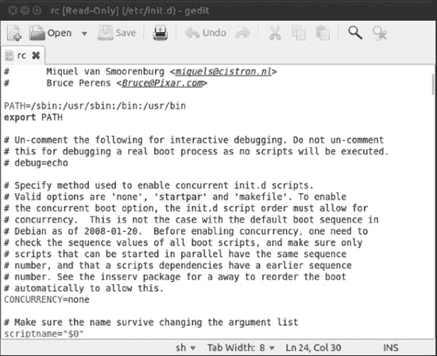

## C H A P T E R  22

## Optimizing Your System

You’ll soon find out that Ubuntu offers great performance and relatively few stability problems, especially as compared to some other operating systems. (For instance, Linux file systems generally don’t need to be defragmented, unless you have NTFS or FAT32 partitions to take care of). But you can always make it even better. If you still run into any performance issues, or if you simply want to get the most out of your system, this chapter is for you. You don’t *have* to apply the topics it discusses; by default Ubuntu already works great on most hardware without applying any optimizations to it, so you can skip it if you’re satisfied with how your system runs. More often than not, the chapter discusses hacks—clever methods of making things work in a nonstandard fashion. But as your experience of Ubuntu might have already taught you, such hacks are the lifeblood of Linux. One of the strengths of Linux is the ability to delve under the hood and change absolutely any aspect of the way it works. So even if the topics in this chapter are not essential, we recommend that you read the chapter carefully and consider applying its tips; at least it will help you deepen your understanding of Ubuntu.

### Speeding Up Booting

Since Ubuntu 6.10 (Edgy Eft), Ubuntu has been using a boot routine called Upstart that effectively optimizes itself. Upstart is responsible for starting services and has been greatly enhanced in the recent Ubuntu releases. You can learn more about Upstart at `[http://upstart.ubuntu.com](http://upstart.ubuntu.com)`. However, you can still tweak performance by enabling startup scripts to run in parallel instead of one after the other. This works well for multithreaded, multicore processors like Intel’s Core 2 Duo and AMD’s Athlon 64 X2\. It won’t make the computer start instantly, but it will save a few seconds each time you boot.

To configure running startup scripts in parallel, you need to edit the `/etc/init.d/rc` file. You can load this file into the Gedit text editor by typing the following in a terminal window:

`gksu gedit /etc/init.d/rc`

Look for the line that begins with `CONCURRENCY` near the top of the file, as shown in [Figure 22-1](#fig_22_1), and change the value from `none` to `startpar`. Save the file and reboot the computer. If you see no improvement in boot speed, you can change this value back to `CONCURRENCY=none` if you want.

***Figure 22-1.** Parallel execution of scripts in the boot process can be enabled by editing the* `/etc/init.d/rc` file.

#### Reducing the Boot Menu Delay

Getting rid of the Grub boot menu delay can save some waiting around in the early stages of the boot process. The delay can be reduced to 1 second or even eradicated completely. Of course, if you do that you won’t be able to choose which kernel you want to load—or which operating system if you’re dual-booting with Windows (but why would you want to?). Even if Ubuntu is the only OS on your computer, without the boot menu delay, you won’t have the chance to boot into recovery mode or a previously installed Linux kernel from the Grub menu. So you need to consider whether this is a worthwhile time-saving measure.

The boot menu delay is stated in the `/etc/default/grub` file. You can load this into the Gedit text editor by typing the following in a terminal window:

`gksu gedit /etc/default/grub`

Look for the line that begins with `GRUB_TIMEOUT` and change the value to whatever you want. The units are counted in seconds, so a value of `3` equates to 3 seconds. A value of `0` (zero) will mean the boot menu won’t appear at all, which is not recommended, for the reasons just mentioned. Generally speaking, a delay of 1 second (`1`) gives you just enough time to press a key at the appropriate time. This will cancel the countdown, meaning the boot menu will stay on your screen until you select an option.

 **Note** When you’ve finished, save the file and quit Gedit.

#### Managing GNOME Sessions

Under Windows, you might be used to controlling which programs start up at the same time as the Desktop, by adding or deleting entries in the Start menu’s Startup program group. When running Ubuntu, you can control which system applets are started automatically, as well as your personal choice of Desktop applications.

To control which programs start up with the GNOME Desktop, use the Startup Applications Preferences dialog box (`gnome-session-properties`). To run the program, use Alt-F2 to open the Run application interface and type `gnome-session-properties`. This shows the programs that start when GNOME does. You can disable a startup program in the list by unchecking the check box beside it. You definitely should have a thorough look at the applications that are started by default, as it is quite likely that you’ll find some that are of no use to you at all.

You should see most or all of the following entries, though our test system had some additional elements added by other applications and services. Note that the available settings depend on what you’ ve got installed. There may be differences.

> *   *Bluetooth Manager:* This program is responsible for the Bluetooth applet that can be used to send and receive files, browse other Bluetooth devices, set up Bluetooth services, and manage Bluetooth service settings. You can disable this applet if your system is not Bluetooth-enabled or if you just don’t want to use Bluetooth at all.
> *   *Certificate and Key Storage:* When using secured tools on a local network or the Internet, you’ll often receive a certificate that is used to prove the identity of the remote host. You’ll receive encryption keys as well. This applet allows you to store all those items in a secure place. So you had better leave it on.
> *   *Check for New Hardware Drivers:* This tool scans your hardware devices and checks whether new third-party proprietary drivers can be used with them. If a new driver is compatible, this tool provides a facility to download, install, and configure the driver in your computer. If your hardware devices are working perfectly without third-party drivers, or you’re uncomfortable using proprietary software, it is safe to disable this program. Otherwise, keep the tool enabled so you can receive driver bug fixes and updates.
> *   *Disk Notifications:* Your hard disk by default is monitored by the SMART utility. If the current disk state is degrading, SMART will tell you about it. So it makes sense to leave the Disk Notifications option on to make sure that you are updated as soon as something goes wrong on your hard drive. If you want to switch this option off, use the Disk Utility application on a regular basis to monitor the current state of your hard disks.
> *   *Evolution Alarm Notifier:* As its name suggests, this utility ties into Evolution’s calendar function in order to notify you of events, such as an appointment that you don’t want to forget. If you don’t use Evolution or don’t use its calendar function, this applet can be disabled.
> *   *GNOME Login Sound:* As you might have guessed, this plays the Ubuntu welcome music that you hear whenever the GNOME Desktop appears. It can be disabled without causing any problems.
> *   *GSettings Data Conversion:* This is an important application that makes sure that other programs can read and write data in the format they need to. Don’t switch it off!
> *   *Network Manager:* This applet manages your wi-fi, Ethernet, and VPN connections. This is useful for laptop users who connect to several wi-fi networks on the go, as discussed in [Chapter 8](08.html#ch8). You should not disable this program.
> *   *NVidia X Server Setting:* This program helps you to configure settings for an Nvidia graphics card that uses the proprietary NVidia driver. As you would have guessed, this program can only be used for Nvidia graphics cards. If you leave it on, you can use this program to change graphics display settings in a convenient way. This is in particular useful if you have to change graphics display settings often—for example, if you regularly use your computer with an external projector.
> *   *Personal File Sharing:* This application allows users to enable file sharing with other users. This is a convenient program that makes it easy to work together with other users, but at the same time it’s also a potential security risk. For that reason, you might want to switch this program off unless you really need it. Note that
> *   *Power Manager:* This program controls all aspects of GNOME’s power management, including the useful hibernate feature that can save the contents of the system’s RAM to provide quicker startup. If your computer is a notebook, this tool should be considered essential. If you have a desktop PC and are looking to save power by using hibernate, suspend, or screen blanking after a period of inactivity, you won’t want to disable Power Manager. *Print Queue Applet:* This applet provides an interface for you to cancel or repeat printer jobs. It is also responsible for automatically setting up a printer for use when you plug in a printer. You can disable this applet if you will never print from your computer.
> *   *Remote Desktop:* This background service allows other computers to connect to your computer, after an invitation has been issued (see Chapter 33). If you have no intention of remotely accessing your computer, this service can be disabled.
> *   *Secret Storage Service:* This is a background component necessary for the application that generates and stores encryption keys. If you do not encrypt files and/or e-mails, this service can be disabled.
> *   *SSH Key Agent:* This is a service that allows caching of passwords for SSH keys. If you don’t know what it is, you can safely ignore it.
> *   *Ubuntu One:* This item gives access to Ubuntu One, the Ubuntu cloud solution offered by Canonical. Switch it on if you intend to use this service. In many cases, this is a service that you can safely consider to switching off.
> *   *Update Notifier:* This is the Update Manager tool. You shouldn’t disable this applet, because it performs the essential task of checking whether any system updates are available. It runs in the background after it is started and hardly impacts startup time at all. However, if you absolutely must prune valuable milliseconds from startup, you can disable it. You can then check for updates manually, whenever you desire, by starting the Update Manager utility manually.
> *   *User Folders Update:* This tool pops up during the start of your session if you have recently changed the default language using the Language Support application) of your computer. The tool gives you an option to translate the folder names Desktop, Templates, Public, Documents, Music, Pictures, and Videos in your `/home` directory to the new default language. You can disable this tool if you don’t change your language settings.
> *   *Visual Assistance:* This utility runs assistive technologies such as the Orca screen reader, magnifier, and Braille application if these tools were enabled in the Assistive Technologies Preferences window (using the Assistive Technologies application). If you are not using assistive technologies, you can disable this applet.

 **Tip** In the Startup Applications Preferences window, you’ll find an Add button, which lets you add any program you like to the GNOME startup. You could add Evolution, for example, so that it starts automatically whenever you log in.

**STOP WAITING FOR AN ADDRESS**

If you use an Ethernet or wi-fi connection to access your network, you might find that Ubuntu spends a few seconds during each boot acquiring an Internet address. This is characterized by a long pause while nothing seems to be happening. Therefore, one way to provide an instant speed boost is to give your computer a static IP address. [Chapter 8](08.html#ch8) explains how to configure your network interface.

However, to assign a static address, you’ll need to find out what IP address range your router (or other DHCP server) uses. You can discover this by looking at the router’s configuration software. Sometimes this is accessed via a web browser. Look for the section of the web interface called DHCP Configuration or something similar.

 **Note** Before you start assigning a static IP address, bear in mind that static IP addresses are cool if you don’t connect to other networks frequently. If you do want to switch easily between networks, don’t apply this tip.

Frequently, IPv4 local area network addresses are in the 192.168.*x*.*x* range, where *x*.*x* can be any series of numbers from 0.1 to 255.254, where the last number used may never be a 0 or 255 (3.255, for instance, is not allowed). For instance, you may find that your router uses the 192.168.1.2-254 range. In this case, assigning a static IP address that will work with the router is simply a matter of choosing an IP address in this range. However, this router may hand out addresses sequentially from 2 upward, so it’s best to choose an address it’s unlikely to reach, even if you happen to have many computers connected to the network. Starting at 50 is a good idea, so you could assign the address 192.168.1.50.

Don’t forget that when defining static IP addresses, you need to manually supply the gateway, subnet, and DNS addresses. In the example, the gateway would be 192.168.1.1 (the address of the LAN interface on the router), and the subnet would be 255.255.255.0\. The DNS address on a small home network will probably be the same as the gateway address, because the router will usually be set to forward DNS requests by default. Be aware that completely different configurations can be used, so only apply this tip if you’re absolutely sure about the network configuration you need!

**BUILD YOUR OWN READAHEAD PROFILE**

Ubuntu includes a feature called *readahead*, which is able to order the list of files to be loaded during bootup by their locations on the hard disk. A default readahead list is installed on a standard Ubuntu installation. This is created on a generic PC, but you can build your own version of the list, customized for your own computer.

Here are the steps to create your own readahead list:

> 1.  Reboot Ubuntu, and at the boot menu, highlight the Ubuntu entry and press E. If Ubuntu is the only operating system on your computer (that is, your computer doesn’t dual-boot with Windows), you might need to press Shift to see the boot menu when prompted.
> 2.  Highlight the line, beginning with the word `linux` and press E again.
> 3.  Using the right-arrow key, move the cursor to the end of the line. Insert a space and type **profile**. The following is how the entire line read on our test PC; yours may be slightly different (note that the beginning of the line was cropped off because of the resolution of the screen). Just add the word **profile** to the line if you want to use the list of readahead files: `< quiet splash profile`
> 4.  Press Control-X to boot the computer. This boot will take longer than usual, because the boot profile is being rebuilt. When the computer has booted up, and all disk activity has stopped (which might take a minute or two after the Desktop has appeared), reboot your computer. You should find that bootup is faster.

### Prelinking

A lot of Ubuntu software relies on other pieces of code to work. These are sometimes referred to as *libraries*, which is a good indicator of their purpose: to provide functions that programs can check in and out whenever they need them, as if they were borrowing books from a library.

Whenever a program starts, it must look for these other libraries and load them into memory so they’re ready for use. This can take some time, particularly with larger and more-complicated programs. Because of this, the concept of *prelinking* was invented. By a series of complicated tricks, the `prelink` program makes each bit of software you might run aware of the libraries it needs, so that memory can be better allocated.

Prelinking claims to boost program startup times by up to 50 percent or more, but the problem is that it’s a *hack*—a programming trick designed to make your system work in a nonstandard way. Because of this, some programs are incompatible with prelinking. In fact, some might simply refuse to work unless prelinking is deactivated. At the time of this writing, such programs are in the minority. However, keep in mind that prelinking can be easily reversed if necessary. Alternatively, you might want to weigh whether it’s worth setting up prelinking in the first place.

#### Configuring Prelinking

If you decide to go ahead with prelinking, you’ll need to download the relevant software from the Ubuntu software repositories. Open the Ubuntu Software Center and type **`prelink`** into the search box. Click Install.

Before you can run a prelinking sweep of your system, you need to enable it in one of its configuration files. To do this, type the following in a terminal window:

`gksu gedit /etc/default/prelink`

Change the line that reads `PRELINKING=unknown` to `PRELINKING=yes`. Then save the file and quit Gedit. If the file currently does not exist, the prelink package is not installed. Use `sudo apt-get install prelink` to install the software, and then edit the configuration file as indicated here.

To run a prelinking scan of your system, simply issue this command:

`sudo prelink -a`

This will prelink practically all the binary files on your system and may take some time to complete. You may also see some error output, but you don’t need to pay attention to it.

Prelinking was automatically added as a daily `cron` job when you installed it, so any new programs you add will be automatically prelinked.

#### Deactivating Prelinking

If you find that prelinking makes a particular application malfunction or simply stop working, you can try undoing prelinking for individual binaries. To do this, use `whereis` to find out where the main binary for the program resides and issue the `prelink` command with the `--undo` command option. For example, to remove prelinking from the Gedit text editor program, you could type the following:

`whereis gedit`

This command will show that the `gedit` binary is found at the location `/usr/bin/gedit` in the file system. Next, attempt to undo prelinking on the binary:

`sudo prelink --undo /usr/bin/gedit`

However, this may not work, because some programs might rely on additional binaries on the system. Therefore, the solution might be to undo prelinking for the entire system, which you can do by typing the following:

`sudo prelink -ua`

After this, you should remove the `prelink` package, via the Ubuntu Software Center, to stop it from running again in the future (or manually remove its `cron` entry).

 **Caution** Prelinking is dangerous, as services and programs may stop working if you use it. If it works, your computer will be faster. But be prepared to do some additional manual work to undo prelinking for some of the programs on your computer.

**OPTIMIZING THE KERNEL**

You can download the Linux kernel source code and compile your own version of it. This gives you total control over the kernel configuration, so you can leave out parts you don’t want in order to free memory. On current kernels however, you won’t often need to compile your own kernel. The Linux kernel is modular; so it just won’t load components that are not going to be needed. But still, you can compile your kernel to leave out certain components completely.

By recompiling, you can also set certain optimization settings, such as creating a version of the kernel specifically built for your model of CPU. On the other hand, the mere fact of recompiling your kernel allows you to learn a lot about the way it works. So even if it’s not really useful for better performance, it may give you a better understanding of the way Linux works.

Although compiling a kernel is a simple procedure, you’ll need to answer many complex questions and have an in-depth knowledge of the way Linux works. You could also have a model of a working kernel to crib from, which is a great way to avoid some growing pains while teasing out optimal kernel compilation settings.

In addition, compiling your own kernel brings with it several issues. The first is that it may not work with any binary modules that you have installed, such as graphics cards or wireless drivers. You can opt to update these yourself, but this adds to the complexity.

The second problem is that Ubuntu is built around precompiled kernels. Several software packages expect to work with the precompiled kernel, and in addition, Ubuntu may occasionally download an updated prepackaged kernel automatically as part of the system update feature and override the one you’ve created. If there are any security problems with the kernel version you compiled, you’ll need to recompile a new kernel from scratch (or patch the one you have). This means you’ll have to keep an eye on the security news sites and take action when necessary.

Your customized kernel may also fail to automatically detect newly supported hardware, meaning you’ll have to acquire and load the drivers manually.

That said, compiling a kernel is an excellent way of learning how Linux works, and if it all goes well, the sense of achievement is enormous. But there are numerous disadvantages, which is why you should avoid recompiling your kernel.

Some people choose to download the kernel source code from the official Linux kernel site, `[www.kernel.org](http://www.kernel.org)`. However, it makes more sense to download the official Ubuntu release, because this will be tailored for the way your system works. Using the Synaptic Package Manager, simply search for `linux-source`.

You can find several guides to compiling your own kernel online, but we recommend the following posting on the Ubuntu forums web site, which looks at compiling a kernel under Ubuntu:
`[https://help.ubuntu.com/community/Kernel/Compile](https://help.ubuntu.com/community/Kernel/Compile)`.

### Optimizing the Kernel

Whereas precompiling the kernel is not really the way to make your system faster, optimization of the kernel does help. In the file system of your computer, you’ll find lots of files in the `/proc/sys` and the `/sys` directories. The `/proc/sys` directory relates to kernel settings, while the /sys directory is more to do with the devices you are using. Optimizing an Ubuntu system by tuning these files is specialist work, but let’s just give you one example, which is about the scheduler.

The scheduler is the kernel component that handles I/O requests. Basically, the scheduler can do only one thing at a time: it can read data blocks, or it can write them. As an administrator, you can specify what it should do. The scheduler setting is applied to each device that is installed in your computer. For your hard disk, which in most cases uses the name `/dev/sda`, you can find the setting in the file `/sys/block/sda/queue/scheduler`. To display the current contents of this file, use the command `cat /sys/block/sda/queue/scheduler`:

`root@natty:/sys/block/sda/queue# cat scheduler

noop deadline [cfq]`

As you can see, in the file you can use three different values:

> *   `noop`: The scheduler doesn’t do anything with I/O but gives it directly to the I/O controller. This is a useful setting if your computer uses a fast RAID controller.
> *   `deadline`: The scheduler will wait as long as it can to write data to disk. By doing this, it can write the data as efficient as possible, which will make writes on your computer faster.
> *   `cfq` (complete fair queueing) This value does nothing to optimize I/O on the scheduler, which gives an equal share to read and write requests.

By default, the scheduler is set to `cfq`, which makes sense for most desktop systems and also for systems that do more reading of data than writing. On the other hand, a computer that writes more than that it reads (which is typically not the case for a desktop computer) will benefit from setting the deadline option.

To change the setting from the command line you need to echo the new value into the configuration file. To do this, using root permissions, use for example `echo deadline > /sys/block/sda/queue/scheduler`. This immediately applies the new value:

`root@natty:/sys/block/sda/queue# echo deadline > scheduler`

After doing this, start some intensive write activity on your computer (copying a few gigabytes of data from an external drive to your hard disk). You might see some improvement.

### Freeing Up Disk Space

After using Ubuntu for some time, you might find that the disk begins to fill up. You can keep an eye on disk usage by using the System Monitor application and looking under the File Systems tab or using the following command in a terminal window:

`df -h`

Either method will show the free space in terms of megabytes or gigabytes for each partition, also expressed as a percentage figure. If the disk does start to get full, you can take steps to make more space available.

 **Note** You can also find information about any connected disk by right-clicking it in Nautilus and selecting Properties.

#### Emptying the /tmp Folder

An easy way to regain disk space is to empty the `/tmp` folder. Like its counterpart in the Windows operating system, this is the folder in which temporary data is stored. Most applications clean up after themselves, but some don’t, leaving behind many megabytes of detritus. To check if this is the case on your computer, you can use the `du -hs` command from a terminal, which gives a summary of used disk space in this folder. If the folder contains many megabytes of data, you can apply this tip. If it’s just a few megabytes, it’s better to leave the folder alone and move on to the next tip.

Because the `/tmp` folder is accessed practically every second the system is up and running, to empty it safely, it’s necessary to switch to run level 1, the Ubuntu alternative to Windows safe mode. This ensures that few other programs are running and avoids the risk of deleting data that is in use. Before doing this, make sure you’ve closed all programs that you are working in, because switching the run level will close all active programs! First, switch to the text console by pressing Ctrl+Alt+F1\. Then enter these commands to switch to run level 1:

`sudo killall gdm-binary
sudo telinit 1`

A recovery menu will appear. Select the Drop to Root Shell Prompt option. Then enter the following to empty the `/tmp` folder and reboot:

 **Caution!** Using the `rm –rf` command as described below is potentially dangerous. Make absolutely sure that there is no space behind the /, as in `rm –rf / tmp`, because in that case the command would erase everything that is on your hard disk!

`rm -rf /tmp/*
reboot`

 **Tip** On a similar theme, don’t forget to empty the Trash on your graphical desktop. This can hold many megabytes of old data. If you see an error message about permissions when emptying the Trash, you can do so manually from a terminal window. Simply type **sudo rm -rf ~/.local/share/Trash/{files,info}/** to get the job done.

#### Emptying the Cache of Package Files

You might also choose to clear out the Advanced Packaging Tool (APT) cache of old `.deb` package files. On a system that has been very frequently updated, this can free many megabytes (possibly gigabytes) of space.

You can empty the cache by typing the following command in a terminal window:

`sudo apt-get clean`

 **Note** The files concerned are held in the following directory: `/var/cache/apt/archives/`. Alternatively, you can use the `apt-get autoclean` command; this simply removes any package files that are no longer available on the main repository server (that is, those that are out-of-date) but leaves any that you might need in the future. Using this command is considered a much safer way to remove unwanted package files.

If you want to restore any packages later, simply locate them in the Synaptic Package Manager list, click the check box, and click Mark for Reinstallation. This will cause the package to be downloaded, installed, and configured.

#### Removing Unused Software

If you still need disk space, consider uninstalling unused programs. As you’ve learned, you can manage software through the Ubuntu Software Center.

To remove a package, search for it in the Installed Software section and click the Remove button. However, it’s not a good idea to simply scroll down the list and remove anything that seems dispensable.

As always, removing software can create dependency problems, so you might find yourself limited in what software you can actually remove.

It’s also worth periodically issuing the `sudo apt-get autoremove` command, which will remove any unused dependency packages on the system. Theoretically, these will always be removed provided `apt-get autoremove` is used when specifying packages to uninstall, but the way Ubuntu is updated might mean that a handful of unused dependencies hang around after they’re no longer needed.

If you find you’re adding and removing lots of software, you might find an application such as BleachBit (`[http://bleachbit.sourceforge.net/](http://bleachbit.sourceforge.net/)`) quite useful. This can remove clutter that takes up space and could contain private information that would be best cleared away. You can download BleachBit through the Ubuntu Software Manager. You can run the software either as a normal user (which makes it harder to mess things up), or as root. To use it, simply scroll down the list and select the parts you’d like to remove (for instance, the cookies from Firefox), and then click the Delete button. Clicking the Preview button will give you a good idea of what is going to be removed and the amount of space it’s likely to save.

### Summary

In this chapter, you looked at streamlining your installation of Ubuntu. This involves speeding up the boot procedure by running boot scripts in parallel, and decreasing the boot menu delay, along with a handful of other tricks. You also looked at optimizing your hard disk settings to allow for greater speed when loading and saving files.

Additionally, we discussed prelinking programs so that they load faster, recompiling the kernel so that it’s optimized for your system, and freeing disk space by various means.

In the next chapter, you learn how to perform backups to safeguard your data.