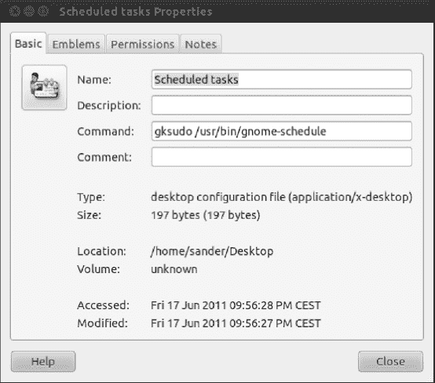
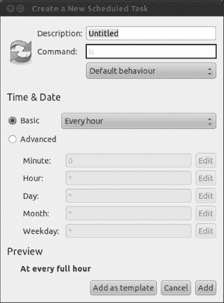
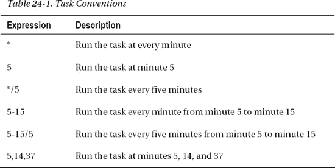

## C H A P T E R  24

## Scheduling Tasks

In this book, you've learned about various tasks you can perform to keep Ubuntu running smoothly. Although some of these tasks require human intervention, many—such as backing up your important files or clearing the clutter from the `tmp` folder to ensure that you always have enough free disk space—can be automated relatively easily by using the methods in this chapter. This will give you more time to do other stuff and will also ensure that those vital tasks are carried out regularly and without fail. They can be run either periodically or as one-time tasks.

### Scheduling with GNOME Scheduler

Under Linux, the traditional way of scheduling tasks, such as creating an archived file of a particular folder, is via the `cron` daemon. This works on behalf of the user to automate individual jobs and is also used by the system to run its own maintenance tasks. The `cron` command is useful for scheduling heavy loads at a time when you know the system will be underused.

For `cron` to run system tasks, it reads a file called `/etc/crontab`. Traditionally, `cron` starts soon after bootup and sits in the background while you work, checking every minute to see whether a task is due. As soon as one comes up, `cron` commences the task and then returns to a waiting status.

Users have their own `crontab` file, which is stored by username in the `/var/spool/cron/crontabs/` directory. This directory is owned by root, and normal users can't view each other's `crontab`. The user's `crontab` file is updated in a text editor, but you need either a special command or a program to help you do it. This is when GNOME Scheduler comes to help.

GNOME Scheduler is a graphical interface that allows you to edit the crontab file, either for the root user (if you have enough privileges) or for yourself.

It is not installed by default, so you'll have to use the knowledge acquired in [Chapter 20](20.html#ch20) about installing software and grab the program named Scheduled Tasks. You can search for that name in Ubuntu Software Center and click install when the program is listed.

Once installed, you'll find it at Applications  System Tools  Scheduled tasks. By default, it will run under your user account and allow you to schedule your own personal tasks. If you want to schedule tasks for the root user, you should run it with elevated privileges. Okay, it's not obvious how to do that. An easy way is by following these instructions:

1.  Go to Applications  System Tools and right-click “Scheduled tasks.”
2.  Select the option “Add this launcher to desktop.”
3.  Go to your Desktop and right-click on the new Scheduled tasks icon.
4.  Select Properties.
5.  The “Scheduled tasks Properties” dialog box will open. Edit the Command box, adding `gksudo` at the beginning of the command. It should end up like this, as shown in [Figure 24-1](#fig_24_1): `gksudo /usr/bin/gnome-schedule`
6.  Click Close. When you double-click the Scheduled tasks icon on your Desktop, you should be prompted with your password because you're trying to elevate your privileges and act as root.

     **Tip!** You can apply this procedure to all programs that you want to run as root. In step 1, make sure to select the program you want to run with elevated privileges and apply the rest of this procedure.

7.  Congratulations! You can now edit the root user's own `crontab`. With the root user you can actually edit the `crontab` of any user. Take into account that this will only work if you are a `sudoer`, as described in [Chapter 21.](21.html#ch21) 

    ***Figure 24-1.** Adding* `gksudo` *to an application launcher enables you to run it with elevated privileges, if you have the rights to do so.*

#### Creating a Recurrent Task

Creating a new scheduled task is easy with GNOME Scheduler.

One of the most common types of scheduled tasks is the *recurring* task. This is a command or program that you want to run on a periodic basis—for example, the cleaning of certain folders or your system's backup. You don't want to run those tasks just once, but to configure them and be at ease because you know they're running without your intervention.

To create a recurrent task, open GNOME Scheduler and click New. The Add a Scheduled Task dialog box will open. Select the option A task that launches recurrently.

You will see the Create a New Scheduled Task dialog box, shown in [Figure 24-2](#fig_24_2).

***Figure 24-2.** Creating a new scheduled task.*

You can give your task a description that will allow you to remember what that task was created for. You can use spaces or special characters in your description.

As the name implies, there are two critical components to create a scheduled task: the task and the schedule. The task tells your system what to do; the schedule, when to do it.

In Linux the task is defined by a command or a script. You cannot configure multiple lines of commands inside the scheduled task; if what you want to do is too complex for a single line, you should create a script.

GNOME Scheduler is very versatile regarding how you define the time at which the task will run and its periodicity. You can play around in the section Time & Date of the Create a New Scheduled Task dialog box until you find the perfect schedule for your task. In the Preview section, a human-readable translation of the schedule is displayed so you can be sure that your inputs produce the desired results.

The Basic option allows you to select from six simple schedules: every minute, every hour (at every full hour), every day (at 00:00), every week (on every Monday at 00:00), every month (at 00:00 on day 1), or at reboot. The minute is the minimum schedule time frame, so you cannot schedule a task to run every 15 seconds.

The Advanced option lets you to be a little more imaginative. As every UNIX and Linux administrator can tell you, the `crontab` has five time fields that you can configure: Minute, Hour, Day, Month, and Weekday (0 being Sunday, 1 Monday, and so on). You can fill every one of them or just one. All the fields are combined by the system by using the AND operator. That means that all conditions must be met for the command to run. For example, in the following configuration:

*   Minute: 0
*   Hour: 15
*   Day: *
*   Month: *
*   Weekday: *

The task will run every day at 15:00 (3 p.m.). Again, remember to check the Preview section to verify that the schedule you are creating matches your intentions.

You can press the Edit button beside each field to get some more options; for example, if you want a task to run only on working days, you can edit the Weekday field and specify the range from 1 (Monday) to 5 (Friday).

What you do with the Edit button can also be done by manually editing each field with the convention shown in [Table 24-1](#tab_24_1). The examples are given for the Minute field.

When done, click the Apply button, and the task will be scheduled to run at the specified times. In order for it to happen, it's not necessary that the Scheduled Tasks program to be open, because it is the `cron` daemon which handles the execution of the task itself, and it starts automatically with the system.

But what happens if the PC is turned off when the task was meant to run? Well, it's embarrassing to say, but what happens is that it just won't run. That's why you have other options to schedule a task, for example, `anacron`, which we talk about later in this chapter. Let's cover first the option to create a one-time task.

#### Scheduling One-Off Tasks

What if you want to schedule a one-time-only task quickly? For this, you can also use the GNOME Scheduler.

For this type of scheduled task, the GNOME Scheduler doesn't rely on the `cron` daemon, but on the `at` command. The `at` command is useful when you have to schedule a task to occur in a specific moment in time only once.

To do so, go to Applications  System Tools  Scheduled tasks, click the New button, and select the option “A task that launches one time.” The Create a New Scheduled Task dialog box, shown in [Figure 24-3](#fig_24_3), will appear.

***Figure 24-3.** Creating a one-time task.*

As you can see, adding a job is as easy as selecting a date in a calendar. Give the task a description, select a date and time, and type in the command. Then click Add to make it real.

You might have noticed when creating either a recurring or a one-time task a button with the legend “Add as template” in the Create a New Scheduled Task window. This button lets you to store the configuration for a task without actually scheduling it. It comes in handy when you have several tasks with similar configurations: you can create a template and then base on it to create the tasks.

 **Note** To use a template, in the GNOME Scheduler main window click the Manage Templates button. Select the template and click the Use template button. Make the necessary changes and click Apply to create the task.

### Scheduling with anacron

If `cron` (and the GNOME Scheduler for that matter) has an Achilles heel, it is that it expects your computer to be up and running all the time. If you schedule a task for around midnight and your computer isn't switched on at that time, the task simply won't run.

`anacron` was created to fix this problem (see [Figure 24-4](#fig_24_4)). It also can run scheduled tasks, but unlike `cron`, it doesn't rely on exact times or dates. Instead, it works on the principle of time periods. For example, tasks can be set to run every day. In fact, tasks can be set to run every *x* number of days, regardless of whether that's every two days or every hundred thousand. It also doesn't matter if the computer is shut down and rebooted during that time; the task will be run only once in the specified time period. In addition, tasks can be specifically set to run at the beginning of each month, regardless of the length in days of each month.

***Figure 24-4.*** `anacron` *is used to run tasks periodically, such as every couple of days.*

`anacron` is primarily designed to be used for system maintenance, and the `/etc/anacrontab` file holds the details of the tasks. Unlike with `crontab`, each user doesn't have his own `anacrontab` file. However, there's no reason why you can't add your own commands to the main `anacrontab` file. This file can be modified in any text editor, and you don't need to use a special command or program (as with `crontab`), although you'll need to adopt superuser (root) powers.

 **Note** The `/etc/anacrontab` file runs scripts contained in the directories `/etc/cron.daily`, `/etc/` `cron.weekly`, and so on, depending on when the tasks are meant to run (every day, week, or month). The average user never needs to bother with systemwide `anacron` jobs. Programs create their own entries as and when necessary.

Each line in `anacrontab` takes the following form:

`days     delay     name of task     command`

The `days` field holds the number of days in between the running of the task. To set the task to run every day, you would enter **`1`**. To make the task run every nine days, you would add **`9`**. To set it to run monthly, you would type **@monthly**.

The `delay` field tells `anacron` how long to wait before running the task, specified in minutes. This is necessary because `anacron` is run at boot time by default. If it were to run all the scheduled tasks simultaneously, the machine could grind to a halt under the load. A delay of 5 minutes is usually adequate, although if some tasks are already scheduled to run on the same day before that task, you should allow enough time for them to finish.

The `name of task` field is for your personal reference and shouldn't contain either slashes or spaces. (Hint: Separate words with underscores or periods.)

The `command` field is, as with `crontab`, the shell command that should be run.

The fields can be separated by blank spaces or by tabs.

 **Note** `anacron` is run as the root user, so if you do add your own entry to `anacrontab`, any files it creates will be owned by root too. If you use `anacron` to create a backup of your `/home` directory, for example, the resultant backup file will be owned by root. You will have to take back the ownership of your files later, as seen in [Chapter 21.](21.html#ch21)

Let's look at an example of an anacrontab entry:

`1     15     backup_job     tar -cjf /home/ubuntu/mybackup.tar.bz2 /home/ubuntu`

This will run the specified `tar` command every day (because `1` is in the days field), and with a delay of 15 minutes after `anacron` is first run.

`anacron` is run automatically every time you boot, but you can also run it manually by simply typing it at the command prompt (with superuser powers):

`sudo anacron`

### Summary

In this brief chapter, you looked at how you can schedule tasks under Ubuntu, which essentially means making programs run at certain times. You've learned to schedule recurring tasks, one-time tasks, and tasks that run on specific time periods.