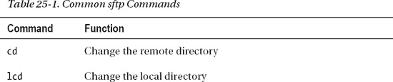
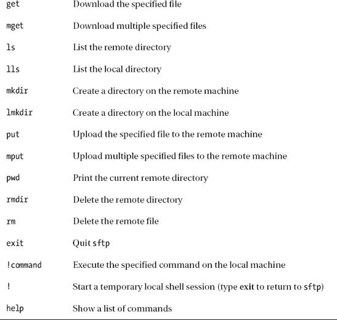
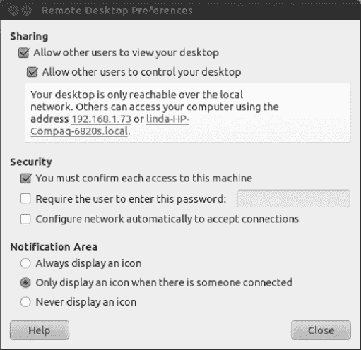

## C H A P T E R  25

## Accessing Computers Remotely

One area where Linux particularly excels is in its support for networking, including across the Internet. If you want to learn about how networks operate on a fundamental level, Linux is an ideal choice, because it puts you in direct contact with the technology.

The widespread integration and support for networking extends to several useful system tools, which let you access Linux across any kind of network, including the Internet. In fact, it's even possible to access a Linux machine running on a different continent, just as if you were sitting in front of it!

This chapter presents the many ways you can access an Ubuntu computer remotely. You might need to do so, for example, if you want to administer your computer from another PC or to help another person who is using Ubuntu in his own computer. In addition, we look at ways that you can use Ubuntu to access almost any other computer, including Windows PCs.

### Using Secure Shell

The history of UNIX has always featured computers connecting to other computers in some fashion, whether they were dumb terminals connecting to a mainframe computer or UNIX machines acting as nodes on the fledgling Internet. Because of this, a wide variety of techniques and protocols were invented to allow computers to communicate and log in to each other across networks. However, although these still work fine over the modern Internet, we're now faced with threats to the privacy of data. In theory, any data transmitted across the Internet can be picked up by individuals at certain key stages along the route. If the data isn't protected in any way, it can be easily intercepted and read.

To counter such an occurrence, the `ssh` suite of programs was created. Although these programs started as open source, they gradually became proprietary. Therefore, several newer open source versions were created, including the one used on the majority of Linux distributions (including Ubuntu): OpenSSH.

The goal of `ssh` is to create a secure connection between two computers. You can then do just about any task, including initiating a shell session so you can use the remote computer as if you were sitting in front of it, or copying files to and from the remote machine. `ssh` uses various techniques at both ends of the connection to encrypt not only the data passing between the two machines, but also the username and password.

 **Note** This chapter refers to remote and local machines. The *remote* machine is the computer you're connecting to across the network or Internet. The *local* machine is the one you're sitting in front of. These two terms are widely used in networking documentation.

#### Logging In to a Remote Computer

The most basic type of `ssh` connection is a remote login. This gives you a command prompt on the remote computer, as if you had just sat down in front of it and logged in to a text console.

But before you can log in to any machine via `ssh`, you need to be sure the remote computer is able to accept `ssh` connections. This means that it needs to be running the `ssh` server program (called a *service* or *daemon*), and also that its firewall has an open port for incoming connections.

The two major components of OpenSSH are the *client* and the *server.* Some distributions install both packages and run the server component all the time. However, only the client component of OpenSSH is installed under Ubuntu by default. To install the server component, and therefore access your Ubuntu system remotely, you need to open the Ubuntu Software Center and search for `openssh-server`. An application named secure shell (SSH) server, for secure access from remote machines, will be at the top of the list. Click to install it. Configuration is automatic, although if you're using the Ubuntu firewall (see [Chapter 8](08.html#ch8)), you will need to configure an incoming rule to open port 22, the standard port for `ssh` connections. Take into account that for security reasons the SSH port is often changed from this default value to some other, less obvious to an attacker.

 **Tip** If you use Firestarter, as described in [Chapter 8](08.html#ch8), you can simply select the default incoming `ssh` rule. There's no need to manually specify a port number.

Initiating an `ssh` session with a remote machine is usually achieved by typing something similar to the following at a command prompt on the local machine:

`ssh <username>@<IP address>`

In other words, you specify the username you want to log in as, as well as the IP address of the remote machine. If there's a fully qualified domain name (FQDN) for the system you want to access, you could specify that instead of the IP address. If you don't specify a username, your computer will attempt to connect with the username with which you are currently logged in.

 **Note** An FQDN is the hostname of a system plus its Internet address, such as `mycomputer.example.com`. Unless you have had this function specifically set up for you by a system administrator, you'll probably have to connect via its IP address. However, if you rent a web server, you might be able to `ssh` into it by using the domain name of the server.

You'll be prompted for your password, which, obviously, is the password for the account you're trying to log in to on the remote computer.

When you log in for the first time, you'll see the following message:

The authenticity of the host `<host IP address> can't be established`

[Figure 25-1](#fig_25_1) shows an example. This means that the remote computer's encryption key hasn't yet been added to your PC's store file. However, after you agree to the initial login, the encryption key will be added, and it will be used in the future to confirm that the remote computer you're connecting to is authentic.

***Figure 25-1.** When logging in via `ssh` for the first time, you need to confirm acceptance of the encryption key.*

 **Note** There's a fine line between security concern and paranoia. Connecting to a remote machine for the first time and accepting its `ssh` key is considered insecure by some people, because you cannot be 100 percent sure that the remote machine is the one you want to connect to. It might have been swapped for a different machine by crackers. In addition, the key might be intercepted on its journey to you. Because of this, those who are highly security conscious can use the `ssh-keygen` program or Seahorse (see [Chapter 8](08.html#ch8)) to create a key on the remote machine first, and then import it to the local machine before logging in. See the `ssh-keygen` man page or `[www.openssh.com](http://www.openssh.com)` for more details.

After confirming that you want to make the connection, you're invited to enter the password for the user account under which you initiated the `ssh` connection. After this is done, you should find yourself with a shell login on the remote computer. You can run the same commands as usual and perform identical tasks. If you have started the SSH session by adding a `–X` to the `ssh` command (as in `ssh –X linda@192.168.1.52`), you can even start graphical programs from the remote machine.

The machine you're logged in to will show no symptoms of being used remotely. It isn't like the movies, where what you type on your local machine is somehow mirrored on the remote machine for all to see. However, obviously, if a user of the remote machine were to view her network connections using something similar to the `netstat` command, then she would see another computer attached via `ssh`.

To end an `ssh` session, simply type **exit** to return to the command prompt on your own machine. You can also press Ctrl+D to log out.

 **Tip** There's a version of the `ssh` client that runs on a variety of non-Linux operating systems, making it possible to log in to your Ubuntu machine from a Windows computer. The program is called PuTTY and can be downloaded from `[www.chiark.greenend.org.uk/~sgtatham/putty/](http://www.chiark.greenend.org.uk/~sgtatham/putty/)` and many mirrors of this site around the world. PuTTY is also available for Linux, and you can install it using Ubuntu Software Center. It is useful to access another Linux machines without having to open a terminal window each time. Another graphical front-end for `ssh` and `scp` is SecPanel, also available in Ubuntu Software Center.

**MANAGING REMOTE SESSIONS**

Whenever you open any kind of shell to enter commands and run programs, you might have noticed that any commands you start running last only as long as the shell window is open. When the shell window is closed, any task running within it ends too. This is because the shell is seen as the “owner” of the process, and when the owner dies, any processes it started also die.

When using `ssh` to start a remote shell session, this also applies. Whenever you log out, any tasks you were running are ended. This can be annoying if, for example, you've started a lengthy download on the remote machine. Effectively, you must remain logged in via `ssh` until the download has finished.

To get around this, you can use the handy `screen` program. This isn't specifically designed to be an aid to remote logins, but there's no reason why it cannot be used in such a situation.

The `screen` program effectively starts shell sessions that stick around, even if the shell window is closed or the `ssh` connection is ended or lost. After logging in to the remote computer via `ssh`, you can start a `screen` session by simply typing the program name at the prompt: `screen`. After choosing a color scheme when prompted, which can help remind you that you're running a screen session, there won't be any indication that you're running a `screen` session. There's no taskbar at the bottom of the terminal window, for example. `screen` works completely in the background.

Let's consider what happens when you detach and then reattach to a `screen` session. To detach from the `screen` session, press Ctrl+A and then Ctrl+D. You'll then be returned to the standard shell and, in fact, you could now disconnect from your `ssh` session as usual. However, the `screen` session will still be running in the background on the remote computer. To prove this, you could log back in and then type this: `screen -r`. This will resume your `screen` session, and you should be able to pick up quite literally where you left off; any output from previous commands will be displayed.

To quit a `screen` session, you can either type `exit` from within it or press Ctrl+A and then \ (backslash key).

The `screen` program is very powerful. To learn more about it, read its man page. To see a list of its keyboard commands, press Ctrl+A, and then type a question mark (`?`) while `screen` is running.

#### Transferring Files Between Remote Computers

The `ssh` utility brings with it two basic ways of transferring files between machines: `scp` and `sftp`. `scp` is fine for smaller file transfers, but if you want to copy a lot of files, `sftp` is probably a better choice. Or you can use `scp` with the `–r` option for a recursive copy. Whatever you prefer!

##### Using scp

Strictly speaking, `scp` is merely a program that copies files from one computer to another in a secure fashion by using the underlying `ssh` protocol. You don't have to be logged in to another computer via `ssh` to use it (but you do need to use credentials with `scp` to tell the other computer who you are). For example, if you were merely browsing your own computer and wanted to transfer a file to a remote computer, you could type the `scp` command in the following form:

`scp *myfile* <username>@<IP address>:/home/*username*/`

The `IP address` is the IP address of the computer to which you want to send the file. In other words, you must first specify the local file you want to copy across, and then provide the login details for the remote computer in the same format as with an `ssh` login. Then, after a colon, you specify the path on the *remote* computer where you would like the file to be copied.

 **Note** If it helps, consider the latter part of the `scp` command after the filename as one large address: first you provide your username, then the computer address, and then the path.

Using the command when you *are* logged in to another computer via `ssh` works in exactly the same way. Frankly, `scp` doesn't really care from where you are using it. Let's consider an example: Assume there are two computers: A and B. You have a user account on each one. So sitting at the keyboard of A, you establish an `ssh` connection with B by typing the following:

`ssh <username>@computer_B`

This lets you log in to B as if you were sitting in front of it. You spot a file called `spreadsheet.xls` that you want to copy to your local machine (A). You therefore issue the following command:

`scp spreadsheet.xls <username>@computer_A:/home/*username*/`

This will copy the file from computer B to computer A and place it in the `/home/*username*/` directory.

 **Tip** With `scp`, you can copy entire directories too. Simply add the `-r` command option, like so: `scp -r mydirectory <username>@<IP address>:/path/`.

##### Using sftp

To copy a lot of files to or from a remote computer, the `sftp` program is the best solution, because it uses the same secure connection already described. If you've ever used a shell-based FTP program, you'll feel right at home, because `sftp` isn't very different.

You can initiate an `sftp` session by using this command format:

`sftp <username>@<IP address>`

The same rules as when you're logging in with `ssh` apply, both in terms of formatting the login command and also confirming the encryption key if this is the first time you've logged in.

The `sftp` commands are fairly basic. For example, to copy a file from the remote machine, simply type this:

`get <filename>`

This will copy the file into the directory you were in on the local machine before you started the `sftp` session.

By specifying a path after the filename, the file will be copied to the specified local directory, as in this example:

`get spreadsheet.xls /home/keir/downloaded_files/`

Sending files from the local machine to the remote machine is just as easy:

`put <filename>`

By specifying a path after the filename, you can ensure that the file is saved to a particular remote path.

One useful thing to remember is that any command preceded by an exclamation point (`!`, called a *bang* in Linux-speak) is executed on the local machine as a shell command. So, if you wanted to remove a file on the local machine, you could type this:

`!rm -rf <filename>`

Simply typing a bang symbol (the familiar exclamation mark) on its own starts a shell session on the local machine, so you can perform even more tasks. When you're finished, type **exit** to return to the `sftp` program.

For a list of popular `sftp` commands, see [Table 25-1](#tab_25_1).

### Accessing GUI Applications Remotely

So far, we've looked at connecting to a remote machine by using command-line tools. But Ubuntu is based around the graphical desktop, so is there any way of running, say, a Nautilus file browser window so you can manipulate files on the remote machine? Yes!

The graphical subsystem of Linux, X, is designed to work across a network. In fact, if you run Linux on your desktop PC, X *still* works via a loopback network within your machine (meaning that network commands are sent out but addressed to the very same machine on which they originated). Because of this, it's possible to make programs on a remote machine run on a local machine's X server. The actual work of running the application is handled by the *remote* machine, but the work of displaying the graphics is handled by the *local* machine. This technique is referred to as *X-forwarding*.

 **Note** Apart from the remote access solutions mentioned here, you can also consider using TeamViewer. This is a commercial application that is free for personal use. It consists of an agent that you need to install on the computer that you want to access, and a remote control interface that needs to be installed on the computer of the person that wants to give assistance. One of the most important benefits of using TeamViewer is that it goes straight through firewalls. You can download the TeamViewer agent and remote support program `fromteamviewer.com.`

#### Running X Applications on a Remote Computer

By default, X server communications aren't typically encrypted, so if one machine were to simply connect to an X server over a network (or even the Internet), the data transfer would be unencrypted and open to eavesdroppers.

But `ssh` once again comes to the rescue. You can configure `ssh` so that X applications on the remote computer can be run on the local machine, with the data sent through the `ssh` connection. Log in to the remote machine by using `ssh`, but also specify the `-X` flag, which tells SSH to forward graphical screens to your computer:

`ssh –X <username>@<IP address>`

When you're logged in, you can simply start any application by typing its name as usual. The only difference is that the program will appear on the screen of the local machine, rather than on the remote machine, as shown in [Figure 25-2](#fig_25_2).

Using X across the Internet or even a local network isn't very fast, and you can expect delays when you open menus or if the screen must frequently redraw. However, it can prove very useful, if you need for example to install a program by using a Wizard, or if you need to run a graphical application such as `Gedit`. System administrators normally do like this approach a lot.

***Figure 25-2.** Using X-forwarding, you can run graphical applications from other Linux boxes on your computer.*

#### Accessing Ubuntu via Remote Desktop

A less secure but more convenient way to access your Ubuntu PC's desktop applications across a network is to use Ubuntu's Remote Desktop feature. The advantage of this method is that the entire Desktop of the remote computer appears in a window on the local computer's Desktop.

Remote Desktop uses the Virtual Network Computing (VNC) software to share the Desktop. *Sharing* is the key word because, effectively, anyone who connects will take control of the main Desktop. They will control the mouse and keyboard input. This is a great way of helping a friend in need!

However, there are a couple of important differences compared to accessing X across an `ssh` connection:

*   Although the password is sent encrypted, the rest of the VNC data transfers aren't. Complete encryption is possible by using special versions of VNC, or via an OpenSSH tunnel, but this can be difficult to set up.
*   The remote Desktop isn't blanked, so anyone standing in front of the computer will be able to see what you're doing. This could present a security/privacy risk.

If you're prepared to put up with these caveats, then allowing Remote Desktop access on a computer is easy. Here's the procedure:

1.  Open Applications and typeRemote Desktop. Then click the Remote Desktop application (not Remote Desktop viewer!) to start Remote Desktop. In the Sharing section of the dialog box, put a check alongside Allow Other Users to View Your Desktop and ensure that there's a check in the box alongside Allow Other Users to Control Your Desktop, as shown in [Figure 25-3](#fig_25_3). In the Security section, you can choose whether the user can confirm each connection and whether you want to set a password. Both options add to the security of your system, although the confirmation option will mean that someone will have to be at the computer to authorize an incoming connection. 

    ***Figure 25-3.** Ubuntu's Remote Desktop feature lets you share your Desktop, but isn't as secure as making an X server connection across `ssh`*.

     **Note** Ignore the information in the dialog box about how users can view your desktop. Instead, you should find out your computer's IP address and use that.

2.  On the computer from which you want to connect to the remote Desktop, from the Applications menu, type Remote Desktop Viewer and click it to start it.

     **Note** Remote Desktop Viewer also includes the option to connect to computers with `ssh`, not only VNC.

3.  With any luck, you'll see the remote computer listed in the panel on the left of the program window. Just select it and double-click. If it isn't listed, click the Connect button. Select VNC as the Protocol. In the Host field, enter the IP address of the computer you want to connect to. Under the Connection Options heading within the dialog box, you can select to run the session full-screen (which is to say, let the remote Desktop entirely take over the local computer's screen); opt to create a connection whereby you only view the remote Desktop, rather than control it; and opt to scale the remote Desktop, so it shrinks to fit within the program window. After you've made your choices, click Connect.
4.  You'll be prompted to enter the password, if one is applicable, and you should then see the remote computer's Desktop in a window.

After you've finished with the Remote Desktop session, press Ctrl+Alt to release the cursor and simply close the window's tab, or click the Close button to terminate the connection.

### Connecting to Remote Windows Computers

The Terminal Server Client program (Terminal Server Client) allows you to connect to a variety of remote Desktop server programs and, in particular, Windows 7, Vista, XP, or 2000 computers via the Remote Desktop Protocol (RDP). Unfortunately, Windows XP Home and earlier versions of Windows don't support RDP connections, which means that they aren't able to run an RDP server and allow other computers to access their Desktops. Windows Vista Basic and Vista Premium also suffer from this limitation. However, there is a way to access the Desktop of these computers remotely by using some add-in software.

#### Connecting to Windows 7 and Vista

Before initiating the connection, you should ensure that the Windows 7 or Vista computer is set for incoming remote connections, if you haven't already. First, make sure that your Windows account has a password—Terminal Server Client won't be able to connect otherwise. Next, ensure that Windows Remote Desktop feature is activated. Click the Start button, right-click Computer, and click Properties. In the window that appears, click the Remote Settings link on the left side. In the dialog box that appears, click Allow Connections from Computers Running Any Version of Remote Desktop (Less Secure), and then click Apply.

 **Note** These instructions assume that you intend to connect using a Windows administrator username and password. If not, you'll need to click the Select Users button and add the user accounts you wish to use.

Back on the Ubuntu computer, from Applications, start Terminal Server Client. When the program is running, in the Computer field, type either the IP address of the machine or its FQDN. You don't need to type the username, password, or any other details. Click Connect, and a new window should appear, in which you should see a login prompt. You should then log in to Windows, using your username and password.

#### Connecting to Windows XP Professional, 2000, and NT

Here we use an XP Professional machine as an example, but the instructions are also valid for Windows 2000 and NT.

First, make sure the Windows XP computer is configured to allow incoming RDP connections. To configure it, right-click My Computer and select Properties. In the System Properties dialog box, click the Remote tab, and make sure “Allow users to connect remotely to this computer” is selected, as shown in [Figure 25-4.](#fig_25_4) The Windows computer to which you want to connect may also need to be updated with the latest service packs, particularly in the case of a Windows 2000 computer.

To connect, use the Terminal Server Client program. When it's running, in the Computer field type either the IP address of the machine or its FQDN (if applicable). You don't need to type the username, password, or any other details. Click Connect, and a new window should appear, in which you should see an XP login prompt. You should then log in to Windows, using your username and password.

***Figure 25-4.** You need to enable the option under Remote Desktop to access Windows XP Professional machines using RDP and the Terminal Server Client program.*

 **Caution** If you haven't set a password for your user account on the Windows machine, you won't be able to log in. This is a quirk of the Windows XP RDP system. The solution is simple: use the User Accounts applet within the Windows Control Panel to assign yourself a password.

#### Connecting to Other Computers

You can download a VNC server for just about any OS. Windows and Linux are supported, as is Mac OS X. In fact, a VNC server will run on any Windows computer, from 95 upward. After it's installed, you can then use the Terminal Server Client program within Ubuntu to connect to that computer's remote desktop.

 **Note** Any computer that's running the VNC Viewer program can access a computer running a VNC server (including the one set up by Ubuntu's Remote Desktop feature). Various VNC Viewer programs are available for Linux, Windows, Mac OS X, and other operating systems, including the likes of Android and iPhone. Just search the Web or your mobile device's AppStore by using **VNC Viewer** as a search string to find viewer programs.

Of course, you'll have the same insecurities and lack of Desktop blanking that plague VNC connections to an Ubuntu Desktop, as described previously. But if you're prepared to accept this, you'll be pleased to hear that setting up the VNC server on the Windows machine is easy. TightVNC, available from `[www.tightvnc.com](http://www.tightvnc.com)`, is one of the best variations of VNC around. You should download the self-installing package for Windows. During installation, you'll be asked whether you want to register TightVNC as a system service. Click the check box alongside this option. This will activate the VNC server every time the computer starts.

After the program is installed, the server configuration program will appear. You should change the password by overtyping the default in the Password field.

Connecting to the remote Windows machine is also a piece of cake. On the Ubuntu system, open Remote Desktop Viewer and click the Connect button. Type the remote computer's IP address into the Host field and then click Connect. There's no need to fill in any of the other details. You'll be prompted for the remote computer's VNC server password and, after you enter this, the remote Desktop will appear in a window.

### Summary

In this chapter, you looked at how you can access your Ubuntu computer remotely across the Internet. You examined how you can access the computer as if you were sitting in front of it, using the `ssh` program. This allows you to start a command-line prompt and even run GUI programs from the remote computer.

In addition, we discussed how the `screen` program can be used to keep sessions alive across various logins, and how you can transfer files by using the `sftp` and `scp` programs. Then you looked at how to use the Remote Desktop Viewer and Terminal Server Client tools to access the Desktop of remote Windows computers.