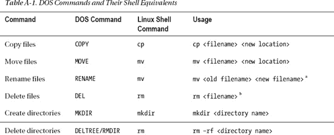
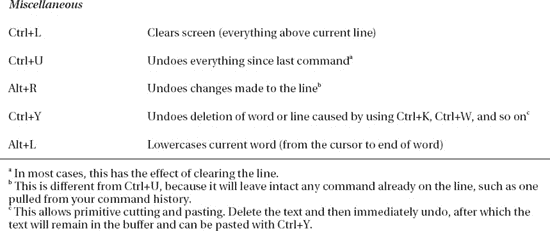
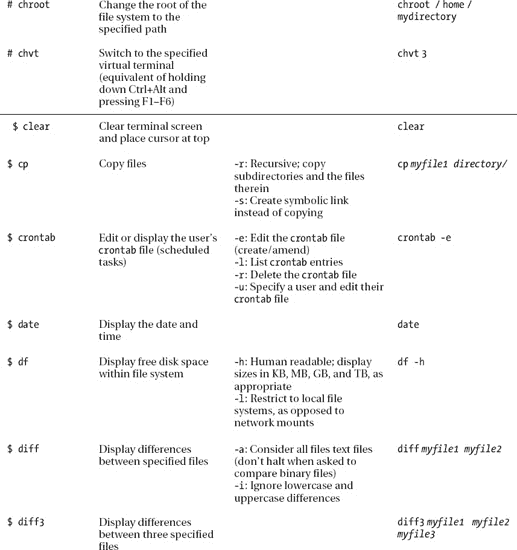
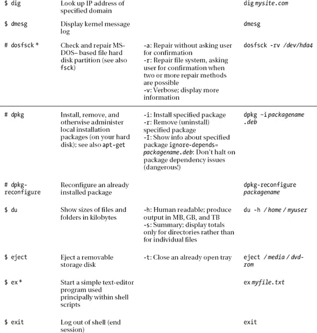
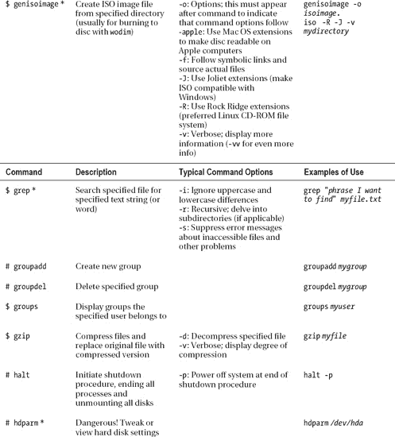
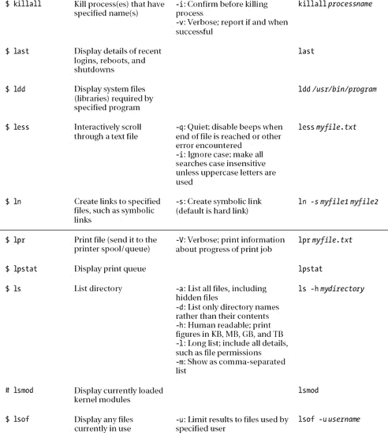
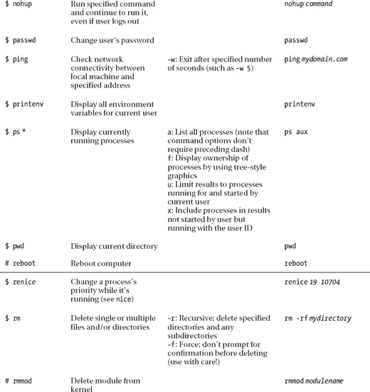
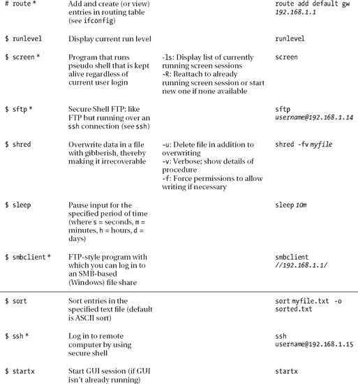
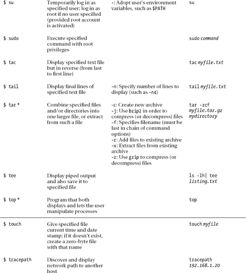
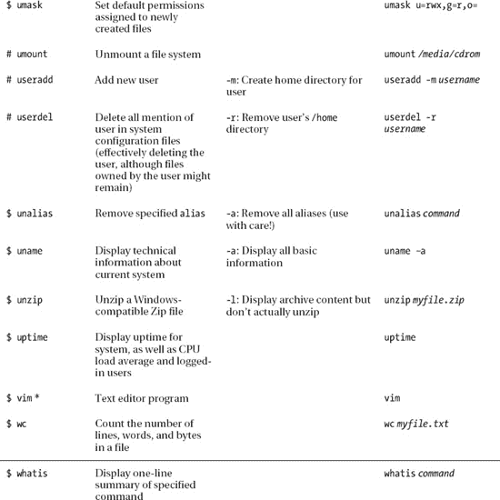

## A P P E N D I X  A

## Introducing the BASH Shell

As you learn in [Chapter 1](01.html#ch1), strictly speaking, the word *Linux* refers to just the kernel, which is the fundamental, invisible program that runs your PC and lets everything happen. However, on its own, the kernel is completely useless. It needs programs to let users interact with the PC and do cool stuff, and it needs a lot of system files (also referred to as *libraries*) to provide vital functions.

The GNU Project provides many of these low-level pieces of code and programs. This is why many people refer to the Linux OS as GNU/Linux, acknowledging that without the GNU components Linux wouldn’t have gotten off the starting blocks.

The GNU Project provides various shell programs too. A *shell* is what the user interacts with on a day-to-day basis, whether by mouse or keyboard. The word originates from the fact that the shell is the outer layer of the OS, which encapsulates the kernel (and in some instances protects it by filtering out bad user commands). Some shells offer graphical functionality but, in general, the word *shell* is understood to mean text-only interfaces. These text shell programs are also known as *terminal programs*, and they’re often colloquially referred to as *command-line prompts*, in reference to the most important component they provide. This kind of shell lets you take control of your system in a quick and efficient way.

Although using the shell is not strictly necessary nowadays, because almost everything can be done in Ubuntu using the graphical interface, it remains true that by using the shell you become the true master of your own system. This appendix introduces the BASH shell, which is the default shell on Ubuntu systems.

### What Is the BASH Shell?

The best way of explaining the BASH shell to a Windows user is to compare it to the DOS command prompt. It lets you issue commands directly to the OS via the keyboard without needing to mess around with the mouse and windows (although it is sometimes possible to use the mouse within a BASH shell to copy and paste text, and sometimes to control simple text-based menus). The big difference is that the BASH shell has commands for just about everything you might do on your system, whereas the DOS command prompt is mostly limited to tools capable of manipulating and viewing files and directories.

In the old days, the DOS command prompt was also the visible layer of an entire operating system in which DOS programs were designed to be run. However, the shell is merely one of the many ways of accessing the Linux kernel and subsystems. It’s true that many programs are designed to run via the BASH shell, but technically speaking, most actually run on the Linux OS, and simply take input and show their output via the BASH shell.

The instinctive response of a longtime Windows user is to be wary of the BASH shell, because it presents an entirely new way of working and a new set of concepts to learn. There’s no denying that the shell provides plenty of challenges for the newbie user, but the rewards it brings—both in terms of sense of achievement, as well as making users more effective at controlling their computers—more than outweigh the initial difficulties.

Linux finds itself with the BASH shell largely because Linux is a clone of UNIX. In the early days of UNIX, the text-based shell was the *only* way for users to control the computer. Typing in commands directly is one of the most fundamental ways of controlling any type of computer and, in the evolutionary scale, comes straight after needing to set switches and watch blinking lights in order to run programs.

That the BASH shell can trace its history back to the early days of UNIX might sound like a tacit indication that the BASH is somehow primitive—far from it. It’s one of the most efficient and immediate ways of working with your computer. Many people consider the command-line shell to be a fast, efficient way of using a computer that has yet to be superseded by a better method.

 **Note** When you run a shell on a Linux system, the system refers to it as a `tty` device. This stands for *teletypewriter*, a direct reference to the old system of inputting data on what were effectively electronic typewriters connected to mainframe computers. These, in turn, took their names from the devices used to automate the sending and receiving of telegrams in the early part of the 20th century.

Most Linux distributions come with a choice of different shell programs. However, the default shell for most Linux systems is BASH, as is the case with Ubuntu. *BASH* stands for *Bourne Again SHell*. The name is a pun and alludes to the origins of Bash as a rewrite of the Bourne shell, a tried-and-tested program from the heyday of UNIX in the late 1970s.

The other shells available include PDKSH (Public Domain Korn SHell, based on Korn Shell, another early UNIX shell) and ZSH (Z SHell), a more recent addition. These are usually used by people who want to program Linux in various ways or by those who simply aren’t happy with BASH.

 **Note** Discussing the technical differentiators between shells is beyond the scope of this book, but you’ll find an excellent comparison at Wikipedia: `[http://en.wikipedia.org/wiki/Comparison_of_computer_shells](http://en.wikipedia.org/wiki/Comparison_of_computer_shells)`.

The BASH shell is considered by many to be the best of all worlds in that it’s easy enough for beginners to learn, yet is able to grow with them and offer additional capabilities as necessary. BASH is capable of scripting, for example, which means you can even create your own simple programs.

### Why Bother with the Shell?

You might have followed the instructions in this book and consider yourself an expert in Linux. But the real measure of a Linux user comes from your abilities at the shell.

Most modern Linux distributions prefer you to use the GUI to do nearly everything. To this end, they provide GUI tools for just about every task you might want to undertake. Ubuntu is strong in this regard, and you can configure a lot of things from the Desktop (as this book helps to prove).

However, it’s well worth developing at least some command-line shell skills, for a number of reasons:

> *It’s simple and fast:* The shell is the simplest and fastest way of working with Ubuntu. As just one example, consider the task of changing the IP address of your network card. You could right-click the NetworkManager icon, select the relevant menu option, and then work your way through the Network Connection dialog box options. That will take at least a minute or two if you know what you’re doing, and perhaps longer if it’s new to you. Alternatively, you could simply open a shell and type this:
> 
> `ifconfig eth0 192.168.0.15 up`
> 
> *It’s versatile:* Everything can be done via the shell—from deleting files, to configuring hardware, to creating MP3s. A lot of GUI applications actually make use of programs you can access via the shell, although it isn’t always the case that you’ll find a GUI program that does the job of a well-crafted shell command. Sometimes you simply have to use the shell for a particular task.
> 
> *It’s consistent among distributions:* All Linux systems have shells and understand the same commands (broadly speaking). However, not all Linux systems have Ubuntu’s graphical configuration programs. SUSE Linux uses its own GUI configuration tool, as does Mandriva Linux. Therefore, if you ever need to use another system or decide to switch distributions, a reliance on GUI tools means learning everything from scratch. Knowing a few shell commands can get you started instantly.
> 
> *It’s crucial for troubleshooting:* The shell offers a vital way of fixing your system should it go wrong. Your Linux installation might be damaged to the extent that it cannot boot to the GUI, but you’ll almost certainly be able to boot into a shell. A shell doesn’t require much of the system other than the ability to display characters on the screen and take input from the keyboard, which most PCs can do even when they’re in a sorry state. This is why most rescue floppy disks or CDs offer shells to let you fix your system.
> 
> *It’s useful for remote access:* One handy thing about the shell is that you don’t need to be in front of your PC to use it. Programs such as `ssh` let you log in to your PC across the Internet and use the shell to control it (as described in [Chapter 25](25.html#ch25)). For example, you can access data on a remote machine, or even fix it when you’re unable to be at the machine’s location. This is why Linux is preferred on many server systems when the system administrator isn’t always present on the site.
> 
> *It’s respected in the community:* Using a shell earns you enormous brownie points when speaking to other Linux users. It is what professionals use, because it gives you greater power and control.

Seen in this light, learning at least a handful of shell commands is vital to truly mastering your PC.

The drawback when using a command-line shell is that it’s not entirely intuitive. Take for instance the command discussed earlier that changes the network card’s IP address:

`ifconfig eth0 192.168.0.15 up`

If you’ve never used the shell before, it might as well be Sanskrit written on the side of an ancient tomb. What on Earth does `ifconfig` mean? And why is the word `up` at the end?

 **Note** If you’re curious, the command tells the network card, called by Linux `eth0`, to adopt the specified IP address. The word `up` at the end merely tells it to activate—to start working now. If the word `down` were there instead, it would deactivate! Don’t worry about understanding all this right now; later in this appendix, we explain how you can learn about every Linux command.

Learning to use the shell requires learning terms like these. Hundreds of commands are available, but you really need to learn only about 10 or 20 for everyday use. The comparison with a new language is apt because, although you might think it daunting to learn new terminology, with a bit of practice it will all become second nature. After you’ve used a command a few times, you’ll know how to use it in the future. And as we discuss later, lots of built-in help is available. The main thing to realize is that the shell is your friend. It’s there to help you get stuff done as quickly as possible. When you become familiar with it, you’ll see that it is a beautiful concept. The shell is simple, elegant, and powerful.

### When Should You Use the Shell?

The amount of use the Linux shell sees is highly dependent on the user. Some Linux buffs couldn’t manage without it. They use it to read and compose e-mail, and even to browse the Web (usually using mutt and the elinks program, respectively).

However, most people simply use it to manage files, view text files (such as program documentation), run programs, and administer the system. All kinds of programs—including GUI and command-line—can be started from the shell. As you learn in [Chapter 20](20.html#ch20), unlike with Windows, installing a program on Ubuntu doesn’t necessarily mean the program automatically appears on the Applications menu. In fact, unless the installation routine is specifically made for the version of Linux you’re running, this is unlikely.

 **Note** Unlike with DOS programs, Ubuntu programs that describe themselves as *command-line* are rarely designed to run solely via the command-line shell. All programs are like machines that take input at one end and output objects at the other. Where the input comes from and where the output goes to is by no means limited to the command line. Usually, with a command-line program, the input and output are provided via the shell, and the programmer makes special dispensation for this, but this way of working is why GUI programs often use what might be considered shell programs. You’ll often find that a GUI program designed to, for example, burn CDs, will also require the installation of a command-line program that actually does the hard work for it.

There’s another reason why the shell is used to run programs: you can specify how a particular program runs before starting it. For example, to launch the Totem movie player in full-screen mode playing the `myvideofile.mpg` file, you could type this:

`totem --fullscreen myvideofile.mpg`

This saves the bother of starting the program, loading a clip, and then selecting the full- screen option. After you’ve typed the command once or twice, you’ll be able to remember it for the next time. No matter how much you love the mouse, you’ll have to admit that this method of running programs is very efficient.

When you get used to using the shell, it’s likely you’ll have it open most of the time behind your other program windows.

### Getting Started with the Shell

You can start the shell in a number of ways. The most common is to use a terminal emulator program. As its name suggests, this runs a shell inside a program window on your Desktop.

You can start GNOME Terminal, by entering **terminal** in the Application Launcher interface that you find in the Unity Panel (or by just opening an application launcher using the Alt+F2 key sequence or the Ctrl+Alt+T key sequence).

You’ll see the terminal window—a blank, violet window that’s similar to a simple text editor window. When you run the terminal for the first time, at the top of it will be a handful of lines telling you about the `sudo` command. We explain the importance of this in [Chapter 21](21.html#ch21), but right now there’s no need to worry about it.

Below this is the most important component of the terminal window: the *command prompt*—a few words followed by the dollar symbol (`$`). On our test system, this is what we see:

`ubuntu@ubuntu-desktop:~$`

 **Note** The first part is the username—the user account we created during installation and use to log in to the PC. After the `@` sign is the hostname of the PC, which we also chose when installing Ubuntu. The hostname of the PC isn’t important on most home systems, but assumes relevance if the PC is part of a network. The @ sign tells us that we are running user `ubuntu` on the computer with the hostname `ubuntu-desktop`.

After the colon is the current directory you’re browsing. In this example, the tilde symbol (`~`) appears instead of an actual path or directory name. This is merely Linux shorthand for the user’s `/home` directory. In other words, wherever we see a `~` on our test PC, we read it as `/home/ubuntu/ - where ubuntu is the name of the current user and also the name of the home directory of this user`. After this is the dollar symbol (`$`), which indicates being currently logged in as an ordinary user, as opposed to the root user. However, unlike most other Linux distributions, Ubuntu doesn’t use the root account during day-to-day operations, so this is a moot point. Finally, there is a cursor, and this is where you can start typing commands!

 **Note** If you were to log in as root, a hash (`#`) would appear instead of the `$` prompt. This is important to remember, because often in magazines and some computer manuals, the use of the hash symbol before a command indicates that it should be run as root. In addition, if you select the recovery option of the installation CD, you’ll be running as root, and a hash will appear at the prompt. See [Chapter 21](21.html#ch21) for more information about the root user.

#### Running Programs

When we refer to *commands* at the shell, we’re actually talking about small programs. When you type a command to list a directory, for example, you’re starting a small program that will do that job. Seen in this light, the shell’s main function is to simply let you run programs—either those that are built into the shell, such as ones that let you manipulate files, or other, more-complicated programs (including those that you’ve installed yourself).

The shell is clever enough to know where your programs are likely to be stored. This information was given to it when you first installed Ubuntu and is stored in a system variable.

 **Note** A *variable* is the method Linux uses to remember things such as names, directory paths, or other data. Many system variables are vital for the running of Ubuntu. These variables can be seen by typing **set** at the command prompt.

The information about where your programs are stored and therefore where Ubuntu should look for commands you type in, as well as any programs you might want to run, is stored in the `PATH` variable. You can take a look at what’s currently stored there by typing the following:

`echo $PATH`

Don’t forget that the difference between uppercase and lowercase letters matters to Ubuntu, unlike with Windows and DOS.

The `echo` command merely tells the shell to print something onscreen. In this case, you’re telling it to “echo” the `PATH` variable onto your screen. On our test PC, this returned the following information:

`/usr/local/sbin:/usr/local/bin:/usr/sbin:/usr/bin:/sbin:/bin`

Several directories are in this list, each separated by a colon.

Don’t worry too much about the details right now. The important thing to know is that whenever you type a program name, the shell looks in each of the listed directories in sequence. In other words, when you type **ls**, the shell will look in each of the directories stored in the `PATH` variable, starting with the first in the list, to see whether the `ls` program can be found. The first instance it finds is the one it will run. (The `ls` command gives you a directory listing, as described in the “Listing Files” section later in this chapter.)

But what if you want to run a program that is not contained in a directory listed in your `PATH`? In this case, you must tell the shell exactly where the program is. Here’s an example:

`/home/ubuntu/myprogram`

This will run a program called `myprogram` in the `/home/ubuntu` directory. It will do this regardless of the directory you’re currently browsing, and regardless of whether there is anything else on your system called `myprogram`.

If you’re already in the directory where the program in question is located, you can type the following:

`./myprogram`

So, just enter a dot and a forward slash, followed by the program name. The dot tells BASH that what you’re referring to is “right here.” Like the tilde symbol (`~`) mentioned earlier, this dot is BASH shorthand.

 **Note** Some of the most basic commands are built into the BASH program and aren’t stand-alone programs. Examples include the command to change directory (`cd`) and the aforementioned `echo` command. Logically enough, these commands are known as BASH *built-ins*. Should you type such a command, BASH will not search the `PATH` directories to find the command because there is no need. You can find out whether a command is a built-in by preceding it with `type`—for example, `type cd`.

#### Getting Help

Each command usually has help built in, which you can query (a little like typing **/?** after a command when using DOS). This will explain what the command does and how it should be used. In most cases, you’ll see a hypothetical example of the command in use, along with the range of command options that can be used with it. For example, you can get some instant help on the `ifconfig` command by typing this:

`ifconfig --help`

The `--help` option is fairly universal, and most programs will respond to it, although sometimes you might need to use a single dash. Just type the command along with **--help** to see what happens. You’ll be told if you’re doing anything wrong.

In addition, most commands have technical manuals that you can read to gain a fairly complete understanding of how they work. Virtually every Ubuntu setup has a set of these `man` pages, which can be accessed by typing this:

`man <command>`

However, `man` pages are often designed for experienced Ubuntu users who understand the terminology.

Some commands also have info pages, which offer slightly more down-to-earth guides. You can read these by typing this:

`info <command>`

If a command isn’t covered by the `info` system, you’ll be shown the default screen explaining basic facts about how the `info` command works.

Note that both `man` and `info` have their own `man` and `info` pages, explaining how they work. Just type `man man` or `info info`. We explain how to read `man` and `info` pages in [Appendix C](29.html#appc).

#### Running the Shell via a Virtual Console

As noted earlier, you can start the shell in a number of ways. The most common way among Linux diehards is via a virtual console. To access a virtual console, press Ctrl+Alt and then press one of the function keys from F1 through F6 (the keys at the top of your keyboard).

Using a virtual console is a little like switching desks to a completely different PC. Pressing Ctrl+Alt+F1 will cause your GUI to disappear and the screen to be taken over by a command-line prompt (don’t worry—your GUI is still there and running in the background). You’ll be asked to enter your username and your password to log in.

Any programs you run in a virtual console won’t affect the rest of the system, unless they’re system commands specifically designed to affect other programs. (This can be very useful—as discussed in [Chapter 26](26.html#ch26), one way to rescue a crashed GUI program is to switch to a virtual console and attempt to terminate the program from there.)

You can switch back to the GUI by pressing Ctrl+Alt+F7\. Don’t forget to quit your virtual console when you’re finished with it, by typing **exit**.

**BOOTING INTO THE SHELL**

If you’re really in love with the shell, you can choose to boot into it, avoiding the GUI completely.

Stopping Ubuntu from running a GUI upon booting is simply a matter of stopping the program that appears when Ubuntu boots—GDM. This provides the login window that appears and starts the whole graphical subsystem. An easy way to do this is by renaming the configuration file: `gdm.conf`.

`sudo mv /etc/init/gdm.conf /etc/init/gdm.disabled`

This prevents GDM from ever starting. Next time you boot your computer you will be taken to the command-line shell. To enable GDM again just rename the file back to its original name.

`sudo mv /etc/init/gdm.disabled /etc/init/gdm.conf`

### Working with Files

So let’s start actually using the shell. If you’ve ever used DOS, you have a head start over most shell beginners, although you’ll still need to learn some new commands and forget some entrenched ones! [Table A-1](#tab_A_1) shows various DOS commands alongside their Ubuntu equivalents. This table also serves as a handy guide to some BASH commands, even if you’ve never used DOS. At the end of this appendix, you’ll find a comprehensive list of useful shell commands, together with explanations of what they do and examples of typical usage. Perhaps it’s obvious, but most commands are abbreviations of the words that describe their function. The `cp` command copies files, for example, and the `rm` file removes files. This can often help identify commands when you first encounter them, and also aid in memorizing.

**CREATING ALIASES**

If you’ve ever used DOS, you might find yourself inadvertently typing DOS commands at the shell prompt. Some of these will actually work, because most distribution companies create command aliases to ease the transition of newcomers to Linux.

Using aliases means that whenever you type certain words, they will be interpreted as meaning something else. However, an alias won’t work with any of the command-line switches used in DOS. In the long run, you should try to learn the BASH equivalents. You can create your own command aliases quickly and simply. Just start a BASH shell and type the following:

`alias <DOS command>='<Linux shell command>'`

For example, to create an alias that lets you type `cls` instead of `clear`, type this:

`alias cls='clear'`

Note that the Ubuntu command must appear in single quotation marks. Also note that the `dir` command is already implemented under Ubuntu as a separate command that functions almost identically to the Linux `ls` command, although it’s intended for only brief file listings. In most cases, it’s far better just to use the `ls` command.

To make aliases permanent, you need to add them to your `.bashrc` file.

Open the file in the Gedit text editor by typing the following:

`gedit .bashrc`

At the bottom of the file, add new lines for all the aliases you want to make permanent. Simply type the command shown previously. Save the file when you’ve finished.

Note that the aliases won’t go into effect until you open a new terminal window or reboot the computer.

#### Listing Files

Possibly the most fundamentally useful BASH command is `ls`. This lists the files in the current directory. If you have a lot of files, they might scroll off the screen. If you’re running GNOME Terminal, you can use the scrollbar on the right side of the window to view the list.

Having the files scroll off the screen can be annoying, so you can cram as many as possible onto each line by typing the following:

`ls -m`

The dash after the command indicates that you’re using a command option. These are also called command-line *flags* or *switches*, and they modify how a command works. Nearly all shell commands have options. In fact, some commands won’t do anything unless you specify various options. In the case of the `ls` command, only one dash is necessary, but some commands need two dashes to indicate an option.

 **Note** Technically speaking, using two dashes before a command option is a relatively modern convention introduced by the GNU Project in the 1980s. Prior to this, UNIX used a single dash for command options. Thus, two dashes usually indicate GNU-specific command options. However, this is a moot point nowadays because even versions of UNIX, such as Mac OS X, tend to use the GNU BASH shell.

You can see a list of all the command options for `ls` by typing the following (ironically, itself a command option):

`ls --help`

Once again, the output will scroll off the screen, and you can use the window’s scrollbars to examine it.

With most commands, you can use many command options at once, as long as they don’t contradict each other. For example, you could type the following:

`ls -lh`

This tells the `ls` command to produce “long” output and also to produce “human-readable” output. The long option (`-l`) lists file sizes and ownership permissions, among other details (permissions are covered in the next chapter). The human-readable option (`-h`) means that rather than listing files in terms of bytes (such as 1,029,725 bytes), it will list them in kilobytes, megabytes, gigabytes, and so on. Notice that you can simply list the options after the dash; you don’t need to give each option its own dash.

 **Caution** Don’t forget that case-sensitivity is vitally important in Ubuntu! Typing **ls -L** is not the same as typing **ls -l**. Each will produce different results.

#### Copying Files and Directories

Another useful command for dealing with files is `cp`, which copies files. You can use the `cp` command in the following way:

`cp myfile /home/ubuntu/`

This will copy the file to the location specified. In this example, the filename and location are technically known as *arguments*. Anything that you specify a command should work with is referred to as an argument, and this can often be important when you try to figure out what the `man` pages are saying about how a command works.

One important command-line option for `cp` is `-r`. This stands for *recursive* and tells BASH that you want to copy a directory and its contents (as well as any directories within this directory). Most commands that deal with files have a recursive option.

 **Note** Only a handful of BASH commands default to recursive copying. Even though it’s extremely common to copy folders, you still need to specify the `-r` command option most of the time.

One curious trick is that you can copy a file from one place to another but, by specifying a filename in the destination part of the command, change its name. Here’s an example:

`cp myfile /home/ubuntu/myfile2`

This will copy `myfile` to `/home/ubuntu`, but rename it as `myfile2`. Be careful not to add a final slash to the command when you do this. In the example here, doing so would cause BASH to think that `myfile2` is a directory.

This way of copying files is a handy way of duplicating files. By not specifying a new location in the destination part of the command, but still specifying a different filename, you effectively duplicate the file within the same directory:

`cp myfile myfile2`

This will result in two identical files: one called `myfile` and one called `myfile2`.

#### Moving Files and Directories

The `mv` command is similar to `cp`, except that rather than copying the file, the old one is effectively removed. You can move files from one directory to another, for example, like this:

`mv myfile /home/ubuntu/`

You can also use the `mv` command to quickly rename files:

`mv myfile myfile2`

The `mv` command can be used to move a directory in the same way as with files. However, there’s no need to use a command option to specify recursivity, as with other commands.

For instance, to move the directory `/daffodil` into the directory `/flowers`, you could type the following (assuming both directories are in the one you’re currently browsing):

`mv daffodil/ flowers/`

Note the use of the slash after each directory.

To rename directories, simply leave off the slashes. To rename the directory `/daffodil` to `/hyacinth`, for example, you could type the following:

`mv daffodil hyacinth`

 **Note** Getting technical for a moment, moving a file in Linux isn’t the same as in Windows, where a file is copied and then the original deleted. Under Ubuntu, the file’s absolute path is rewritten, causing it to simply appear in a different place in the file structure. However, the end result is the same.

#### Deleting Files and Directories

But how do you get rid of files? Again, this is relatively easy, but first a word of caution: the shell doesn’t operate any kind of Recycle Bin. After a file is deleted, it’s gone forever. (There are utilities you can use to recover files, but these are specialized tools and aren’t to be relied on for everyday use.)

Removing a file is achieved by typing something like this:

`rm myfile`

It’s as simple as that.

In some instances, you’ll be asked to confirm the deletion after you issue the command. If you want to delete a file without being asked to confirm it, type the following:

`rm -f myfile`

The `f` command option stands for *force* (that is, force the deletion).

If you try to use the `rm` command to remove a directory, you’ll see an error message. This is because the command needs an additional option:

`rm -rf mydirectory`

As noted earlier, the `r` stands for *recursive* and indicates that any folder specified afterward should be deleted, in addition to any files it contains.

 **Tip** You might have used wildcards within Windows and DOS. They can be used within Ubuntu, too. For example, the asterisk (`*`) can be used to mean any file. So, you can type `rm -f *` to delete all files within a directory, or type `rm -f myfile*` to delete all files that start with the word `myfile`. But remember to be careful with the `rm` command. Keep in mind that you cannot salvage files easily if you accidentally delete them!

**WORKING WITH FILENAMES THAT HAVE SPACES**

If, at the command prompt, you try to copy, move, or otherwise manipulate files that have spaces in their names, you’ll run into problems. For example, suppose you want to move the file `picture from germany.jpg` to the directory `/mydirectory`. In theory, the following command should do the trick:

`mv picture from germany.jpg mydirectory/`

But when we tried it on our test Ubuntu setup, we got the following errors:

`mv: cannot stat 'picture': No such file or directory
mv: cannot stat 'from': No such file or directory
mv: cannot stat 'germany.jpg': No such file or directory`

In other words, BASH had interpreted each word as a separate file and tried to move each of them! The error messages tell us that BASH cannot find the file `picture`, `from`, or `germany.jpg`.

There are two solutions. The easiest is to enclose the filename in quotation marks (either double or single), so the previous command would read as follows:

`mv "picture from germany.jpg" mydirectory/`

The other solution is to precede each space with a backslash. Known as *escaping the character*, this tells BASH you’re including a *literal character* in the filename. In other words, you’re telling BASH not to interpret the space in the way it usually does, which is as a separator between filenames or commands. Here’s how the command looks if you use backslashes:

`mv picture\ from\ germany.jpg mydirectory/`

The backslash can also be used to stop BASH from interpreting other symbols in the way it usually does. For example, the less-than and greater-than symbols (`<>`) have a specific meaning in BASH, but they’re allowed in filenames. So to copy the file `<bach>.mp3` to the directory `/mydirectory`, you could type the following:

`cp /<bach/>.mp3 mydirectory/`

Generally speaking, however, simply enclosing filenames in quotation marks is the easiest approach. Often you might find that filenames under Linux avoid using spaces completely by using hyphens or underscore characters instead, or by simply not including the space characters and running the words into each other (for example, `thirdquarterreport.doc`).

#### Changing and Creating Directories

Another handy command is `cd`, for *change directory*. This lets you move around the file system from directory to directory. Say you’re in a directory that has another directory in it, named `mydirectory2`. Switching to it is easy:

`cd mydirectory2`

But how do you get out of this directory after you’re in it? Try the following command:

`cd ..`

The `..` refers to the *parent* directory, which is the one containing the directory you’re currently browsing. Using two dots to indicate this may seem odd, but it’s just the way that Ubuntu (and UNIX before it) does things. It’s one of the many conventions that UNIX relies on and that you’ll pick up as you go along.

To switch to the root of the file system, you would type the following:

`cd /`

 **Tip** BASH always remembers the last directory you were in, and you can switch to it instantly by typing `cd -`.

You can create directories with the `mkdir` command:

`mkdir mydirectory`

What if you want to create a new directory and, at the same time, create a new directory to contain it? Simply use the `-p` command option. The following command will create a new folder called `flowers` and, at the same time, create a directory within `/flowers` called `/daffodil`:

`mkdir -p flowers/daffodil`

**RELATIVE AND ABSOLUTE PATHS**

A *path* is simply the description of where in the file system a particular file or folder lives—for example, `/home/ubuntu/Music/britneyspears.mp3`. Paths come in two forms: absolute and relative. The differences are simple.

An *absolute path* shows the location of the file from the ground up—from the root of the file system, specifying each individual folder along the way. The preceding example (`/home/ubuntu/Music/britneyspears.mp3`) is an absolute path. There’s an elementary way of identifying them: absolute paths always begin with a forward slash, which indicates the root of the file system.

A *relative path* is one that’s expressed relative to the currently browsed directory. That might be a little difficult to understand, so here’s an example. We already know that, when used with the `cd` command, two dots (`..`) refer to the parent directory of the one currently being browsed. With this in mind, what if the user Frank was browsing `/home/Frank/Music` and wanted to switch to the `/etc` directory, which contains configuration files? He could simply type `cd /etc`, thereby specifying the absolute path. That’s certainly the simplest method. But he also could specify a relative path as follows:

`cd ../../../etc`

In other words, he’s specified the parent of the current directory, then the parent of that directory, and finally the parent of *that* directory! That takes him all the way back to the root of the file system, so finally he specifies the `/etc` directory, which is where he wants to be.

You can move from any position in the file system to anywhere else by specifying a relative path, and the same technique works when you're manipulating files by copying, moving, and so on. To be honest, specifying an absolute path is usually the simplest option, but relative paths can prove surprisingly useful in some situations.

### Using Autocompletion

The Tab key is your best friend when using the shell, because it will cause BASH to automatically complete whatever you type. For example, if you want to run Ubuntu’s web browser, you can enter **firefox** at the command line. However, to save yourself some time, you can type **fir** and then press Tab. You’ll then find that BASH fills in the rest for you. It does this by caching the names of the programs you might run according to the directories listed in your `$PATH` variable.

Of course, autocompletion has some limitations. On our Ubuntu test system, typing **loc** didn’t autocomplete the useful `locate` command. Instead, it caused BASH to beep. This is because on a default Ubuntu installation, there is more than one possible match. Pressing Tab again immediately shows those matches. Depending on how much you type (how much of an initial clue you give BASH), you might find there are many possible matches.

In this case, the experienced BASH user simply types another letter, which will be enough to distinguish the almost-typed word from the rest, and presses Tab again. With any luck, this should be enough for BASH to fill in the rest.

#### Autocompletion with Files and Paths

Tab autocompletion also works with files and paths. If you type the first few letters of a folder name, BASH will try to fill in the rest. This also obviously has limitations. There’s no point in typing **cd myfol** and pressing Tab if there’s nothing in the current directory that starts with the letters `myfol`. This particular autocomplete function works by looking at your current directory and seeing what’s available.

Alternatively, you can specify an initial path for BASH to use in order to autocomplete. Typing **cd/ho** and pressing Tab will cause BASH to autocomplete the path by looking in the root directory (`/`). In other words, it will autocomplete the command with the directory `/home`. In a similar way, typing **cd myfolder/myfo** will cause BASH to attempt to autocomplete by looking for a match in `myfolder`.

If you want to run a program that resides in the current directory, such as one you’ve just downloaded, for example, typing **./**, followed by the first part of the program name, and then pressing Tab should be enough to have BASH autocomplete the rest. In this case, the dot and slash tell BASH to look in the current directory for any executable programs or scripts (programs with `x` as part of their permissions) and use them as possible autocomplete options.

BASH is clever enough to spot whether the command you’re using is likely to require a file, directory, or executable, and it will autocomplete with only relevant file or directory names.

#### Viewing Available Options

The autocomplete function has a neat side effect. As we mentioned earlier, if BASH cannot find a match, pressing Tab again causes BASH to show all the available options. For example, typing **ba** at the shell and then pressing Tab twice causes BASH to show all the possible commands starting with the letters *ba*. On our test PC, this produces the following list of commands:

* * *

`badblocks  baobab  basename  bashbug

banner  base64  bash  batch`

* * *

This can be a nice way of exploring what commands are available on your system. You can then use each command with the `--help` command option to find out what it does, or browse the command’s `man` page.

When you apply this trick to directory and filename autocompletion, it’s even more useful. For example, typing **cd** in a directory and then pressing the Tab key twice will cause BASH to show the available directories, providing a handy way of retrieving a brief directory listing. Alternatively, if you’ve forgotten how a directory name is spelled, you can use this technique to find out prior to switching into it.

#### Other Autocompletion Examples

Under Ubuntu, but not under most Linux distros, you can also use Tab autocomplete with other commands. In fact, anywhere you might think autocomplete will prove useful, you’ll probably find it works. For example, when installing software by using the `apt-get` command you can type a little of the package name you’d like to install, and then hit Tab to have it autocompleted. As when exploring commands by using the Tab key (as explained earlier), this is a neat way of exploring what packages are available.

You will also find that Tab autocomplete works with the `man` command, used to view technical documentation. Just type **man** and then a little of the command you’re interested in, before hitting Tab to autocomplete.

### Using Keyboard Shortcuts

Your other good friends when using BASH are the Ctrl and Alt keys. These keys provide shortcuts to vital command-line shell functions. They also let you work more efficiently when typing by providing what most programs call keyboard shortcuts.

#### Shortcuts for Working in BASH

[Table A-2](#tab_A_2) lists the most common keyboard shortcuts in BASH (there are many more; see BASH’s `man` page for details). If you’ve explored the Emacs text editor, you might find these shortcuts familiar. Such keyboard shortcuts are largely the same across many of the software packages that originate from the GNU Project. Often, you’ll find an option within many Ubuntu software packages that lets you use Emacs-style navigation, in which case, these keyboard shortcuts will most likely work equally well.

#### Shortcuts for System Control

In terms of the control over your system offered by keyboard commands, pressing Ctrl+Z has the effect of stopping the current program. It suspends the program until you switch back into it or tell it to resume in another way, or manually kill it.

In the same style, pressing Ctrl+C while a program is running will quit it. This sends the program’s process a termination signal, a little like killing it by using the `top` program. Ctrl+C can prove handy if you start a program running by accident and quickly want to end it, or if a command takes longer than you expected to work and you cannot wait for it to complete. It’s also a handy way of attempting to end crashed programs. Some complicated programs don’t take too kindly to being quit in this way, particularly those that need to save data before they terminate. However, most should be okay.

Ctrl+D is another handy keyboard shortcut. This sends the program an end-of-file (EOF) message. In effect, this tells the program that you’ve finished your input. This can have a variety of effects, depending on the program you’re running. For example, pressing Ctrl+D on its own at the shell prompt when no program is running will cause you to log out (if you’re using a GUI terminal emulator like GNOME Terminal, the program will quit). This happens because pressing Ctrl+D informs the BASH shell program that you’ve finished your input. BASH then interprets this as the cue that it should log you out. After all, what else can it do if told there will be no more input?

Although it might not seem very useful for day-to-day work, Ctrl+D is vital for programs that expect you to enter data at the command line. You might run into these as you explore BASH. If you ever read in a `man` page that a program requires an EOF message during input, you’ll know what to press.

### Using the Command History

The original hackers who invented the tools used under UNIX hated waiting around for things to happen. After all, being a hacker is all about finding the most efficient way of doing any particular task.

Because of this, the BASH shell includes many features designed to optimize the user experience. The most important of these is the *command history*. BASH remembers every command you enter (even the ones that didn’t work!) and stores them as a list on your hard disk.

During any BASH session, you can cycle through this history by using the up and down arrow keys. Pressing the up arrow key takes you back into the command history, and pressing the down arrow key takes you forward.

The potential of the command history is enormous. For example, rather than retype that long command that runs a program with command options, you can simply use the cursor keys to locate it in the history and press Enter.

 **Tip** Typing `!-3` will cause BASH to move three paces back in the history file and run that command. In other words, it will run what you entered three commands ago.

On our Ubuntu test system, BASH remembers 1,000 commands. You can view all of the remembered commands by typing **history** at the command prompt. The history list will scroll off the screen because it’s so large, but you can use the scrollbars of the GNOME Terminal window to read it. To view the last 20 commands, type **history 20**. You can specify any number here, in fact. Each command in the history list is assigned a number. You can run any of the history commands by preceding their number with an exclamation mark (`!`), referred to as a *bang*, or sometimes a *shriek*. For example, you might type **!923**. On our test system, command number `923` in the BASH history is `cd ..`, so this has the effect of switching us into the parent directory.

Command numbering remains in place until you log out (close the GNOME Terminal window or end a virtual console session). After this, the numbering is reordered. There will still be 1,000 commands, but the last command you entered before logging out will be at the end of the list, and the numbering will work back 1,000 places until the first command in the history list.

 **Tip** One neat trick is to type two bangs: `!!`. This tells BASH to repeat the last command you entered.

Rather than specifying a command number, you can type something like **!cd**. This will cause BASH to look in the history file, find the last instance of a command line that started with `cd`, and then run it.

Pressing Ctrl+R lets you search the command history from the command prompt. This particular tool can be tricky to get used to, however. As soon as you start typing, BASH will autocomplete the command based on matches found in the history file, starting with the last command in the history. What you type appears before the colon, while the autocompletion appears afterward.

Because BASH autocompletes as you type, things can get a little confusing when you’re working with the command history, particularly if it initially gets the match wrong. For example, typing **cd** will show the last instance of the use of `cd`. This might not be what you’re looking for, so you must keep typing the command you do want until it autocompletes correctly. Alternatively, you can hit Ctrl+R to cycle through older examples of the particular command that you’ve started typing.

### Piping and Directing Output

It’s not uncommon for a directory listing or output from another command to scroll off the screen. When using a GUI program such as GNOME Terminal, you can use the scrollbars to view the output, but what if you are working at the bare command-line prompt?

By pressing Shift+Page Up and Shift+Page Down, you can “scroll” the window up to take a look at some of the old output, but very little is cached in this way, and you won’t see more than a few screens. A far better solution is to pipe the output of the directory listing into a text viewer. Another useful technique is to redirect output to a file.

#### Piping the Output of Commands

*Piping* was one of the original innovations provided by UNIX. It simply means that you can pass the output of one command to another, which is to say the output of one command can be used as input for another.

This is possible because shell commands work like machines. They usually take input from the keyboard (referred to technically as *standard input*) and, when they’ve done their job, usually show their output on the screen (known as *standard output*).

The commands don’t need to take input from the keyboard, and they don’t need to output to the screen. Piping is the process of diverting the output before it reaches the screen and passing it to another command for further processing.

Let’s assume that you have a directory that is packed full of files. You want to do a long directory listing (`ls -l`) to see what permissions various files have. But doing this produces reams of output that fly off the screen. Typing something like the following provides a solution:

`ls -l | less`

The `|` symbol between the two commands is the *pipe*. It can be found on most US keyboards next to the square bracket keys (near the Enter key—you’ll need to hold down the Shift key to get it).

What happens in the example is that `ls -l` is run by the shell, but rather than sending the output to the screen, the pipe symbol (`|`) tells BASH to send it to the command that follows—to `less`. In other words, the listing is displayed within `less`, where you can read it at your leisure. You can use Page Up and Page Down or the arrow keys to scroll through it. After you quit `less`, the listing evaporates into thin air; the piped output is never stored as a file.

In the previous section, you saw how you can use the `history` command to view the command history. At around 500 entries, its output scrolls off the screen in seconds. However, you can pipe it to `less`, like so:

`history | less`

You can pipe the output of any command. One of the most common uses is when searching for a particular string in the output of a command. For example, let’s say you know that, within a crowded directory, there’s a file with a picture of some flowers. You know that the word *flower* is in the filename, but you can’t recall any other details. One solution is to perform a directory listing and then pipe the results to `grep`, which is able to search through text for a user-defined string (see [Chapter 12](12.html#ch12)):

`ls -l | grep -i 'flower'`

In this example, the shell runs the `ls -l` command and then passes the output to `grep`. The `grep` command then searches the output for the word *flower* (the `-i` option tells it to ignore uppercase and lowercase). If `grep` finds any results, it will show them on your screen.

The key point to remember is that `grep` is used here as it normally is at the command prompt. The only difference is that it’s being passed input from a previous command, rather than being used on its own.

You can pipe more than once on a command line. Suppose you know that the filename of the picture you want includes the words *flower* and *daffodil*, yet you’re unsure of where they might fall in the filename. In this case, you could type the following:

`ls -l | grep -i flower | grep -i daffodil`

This will pass the result of the directory listing to the first `grep`, which will search the output for the word *flower*. The second pipe causes the output from `grep` to be passed to the second `grep` command, where it’s then searched for the word *daffodil*. Any results are then displayed on your screen.

#### Redirecting Output

*Redirecting* is like piping, except that the output is passed to a file rather than to another command. Redirecting can also work the other way: the contents of a file can be passed to a command.

If you wanted to create a file that contained a directory listing, you could type this:

`ls -l > directorylisting.txt`

The angle bracket (`>`) between the commands tells BASH to direct the output of the `ls -l` command into a file called `directorylisting.txt`. If a file with this name exists, it’s overwritten with new data. If it doesn’t exist, it’s created from scratch.

You can add data to an already existing file by using two angle brackets:

`ls -l >> directorylisting.txt`

This will append the result of the directory listing to the end of the file called `directorylisting.txt`, although, once again, if the file doesn’t exist, it will be created from scratch.

Redirecting output can get very sophisticated and useful. Take a look at the following:

`cat myfile1.txt myfile2.txt > myfile3.txt`

As you learned in [Chapter 12](12.html#ch12), the `cat` command joins two or more files together. If the command were used on its own without the redirection, it would cause BASH to print `myfile1.txt` on the screen, immediately followed by `myfile2.txt`. As far as BASH is concerned, it has joined `myfile1.txt` to `myfile2.txt` and then sent them to standard output (the screen). By specifying a redirection, you have BASH send the output to a third file. Using `cat` with redirection is a handy way of combining two files.

It’s also possible to direct the contents of a file back into a command. Take a look at the following:

`sort < textfile.txt > sortedtext.txt`

The `sort` command simply sorts words into alphanumeric order (it actually sorts them according to the ASCII table of characters, which places symbols and numbers before alphabetic characters). Directly after the `sort` command is a left angle bracket, which directs the contents of the file specified immediately after the bracket into the `sort` command. This is followed by a right angle bracket, which directs the output of the command into another file.

 **Tip** To see a table of the ASCII characters, type **man ascii** at the command-line prompt.

There aren’t many instances in day-to-day usage where you’ll want to use the left angle bracket. It’s mostly used with the text-based `mail` program (which lets you send e-mail from the shell), and in shell scripting, in which a lot of commands are combined together to form a simple program.

**REDIRECTING STANDARD ERROR OUTPUT**

Standard input and standard output are what BASH calls your keyboard and screen. These are the default input and output methods that programs use unless you specify something else, such as redirecting or piping output and input.

When a program goes wrong, its error message doesn’t usually form part of standard output. Instead, it is output via *standard error*. Like standard output, this usually appears on the screen.

Sometimes it’s beneficial to capture an error message in a text file. This can be done by redirecting the standard error output. The technique is similar to redirecting standard output:

`wodim --scanbus 2> errormessage.txt`

The `wodim` command is used to burn CDs, and with the `--scanbus` command option, you tell it to search for CD-R/RW drives on the system, something that frequently results in an error message if your system is not properly configured.

After the initial command, you see the redirection. To redirect standard error, all you need to do is type **2>**, rather than simply **>**. This effectively tells BASH to use the second type of output: standard error.

You can direct both standard output and standard error to the same file. This is done in the following way:

`cdrecord --scanbus > error.txt 2>&1`

This is a little more complicated. The standard output from `wodim --scanbus` is sent to the file `error.txt`. The second redirect tells BASH to include standard error in the standard output. In other words, it’s not a case of standard output being written to a file, and then standard error being added to it. Instead, standard error is added to standard output by BASH, and then this is written to a file.

### Using Brace Expansion

The ultimate labor-saving trick at the command-line is brace expansion.

Put simply, anything within braces (`{}`) is substituted within the specified filename. The following will create new directories called `PhotosGermany`, `PhotosEngland`, and `PhotosSpain`:

`mkdir Photos{Germany,England,Spain}`

In other words, the `mkdir` command takes the word `Photos` and combines it with `Germany`, `England`, and `Spain`, creating three new directories.

If you also wanted to create a directory called `Photos`, with no country after it, you could do so via brace expansion by specifying a comma with nothing before it. Here’s a repeat of the same command with this in place, followed by a file listing showing the results:

`mkdir Photos{,Germany,England,Spain}`

* * *

`$ ls

Photos  PhotosEngland  PhotosGermany  PhotosSpain`

* * *

A numeric or alphabetic range of expansions can be specified by using two dots (`..`). You will have observed that this is different from wildcards, where the dash is used to indicate a range. The following will create directories called `PhotosA`, `PhotosB`, `PhotosC`, and so on, all the way to `Z`:

`mkdir Photos{A..Z}`

### BASH Command Index

This appendix provides a whistle-stop tour of commands that can be used at the BASH shell. This is a highly selective listing, intended to provide a guide to commands that see day-to-day use on average desktop systems. In a similar fashion, although some command options are listed, they’re strictly limited to those that receive regular deployment.

The description of each command is deliberately simple. Note that the quantity of space given to a command is not an indication of its importance or usefulness. To this end, each command listed with an asterisk after its name offers far more than its brief description indicates. In such cases, we strongly advise that you refer to the command’s `man` page for more information.

Various conventions are used in the list:

> *   You should substitute your own details wherever italicized words appear.
> *   Commands that can and might be run by ordinary users are preceded with a dollar sign (`$`).
> *   Commands that require root privileges (the use of `sudo`) are preceded with a hash symbol (`#`).

Commands that present dangers to the system through misuse are clearly marked. Such commands should not be used without research into the command’s usage and function.

