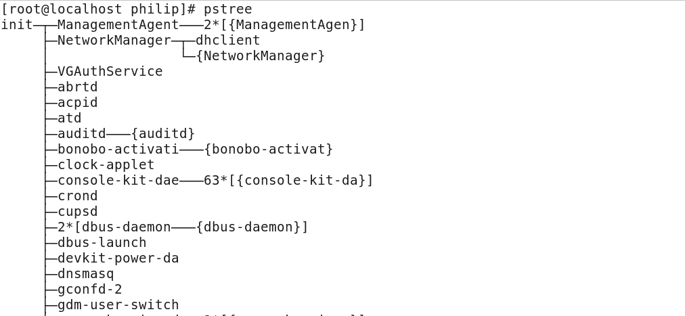
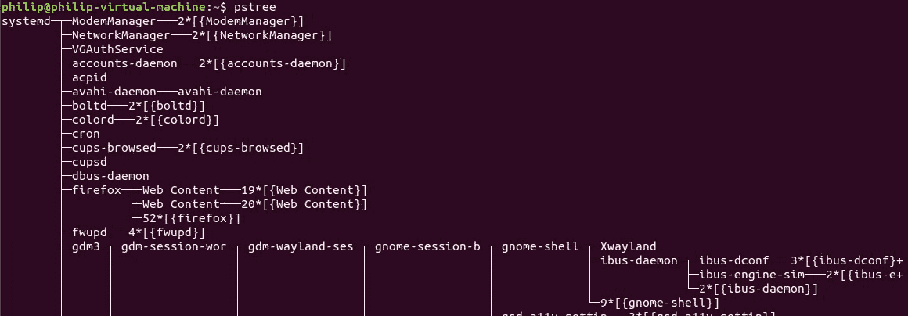
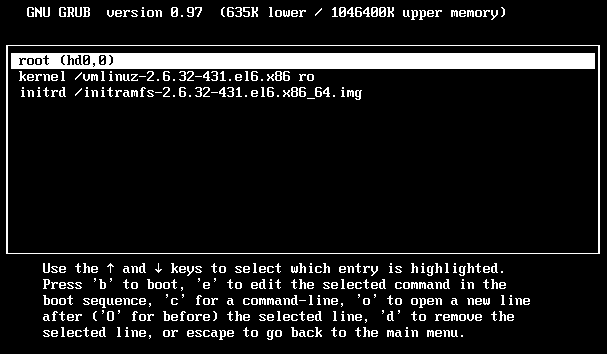
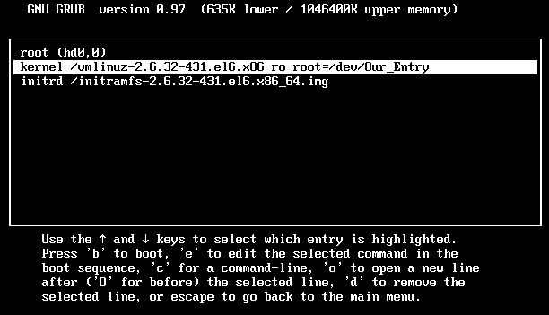
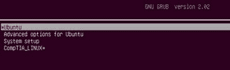

# 二、启动系统

在前一章中，我们介绍了日常管理的常见硬件设置。我们谈到了一些可以用来识别 Linux 系统中硬件的命令。本章从那里继续，并采取了进一步的步骤，这一次侧重于引导系统的过程。它查看 GRUB 和 GRUB2 配置文件，重点关注定时器、默认引导条目，并将参数传递给 GRUB/GRUB2 引导菜单。它还涵盖了`chkconfig`、`pstree`、`ps`、`systemctl`、`dmeg`命令以及各种启动/停止脚本。

我们将在本章中讨论以下主题:

*   引导过程解释了
*   了解 GRUB 和 GRUB2
*   使用 GRUB
*   与 GRUB2 合作

# 引导过程解释了

在 Linux 中，在启动过程中，会在硬盘上查找启动扇区。一旦找到引导扇区，它就搜索引导加载程序。引导加载程序反过来加载引导管理器。在 Linux 中，这通常是 GRUB 或 GRUB2。在这个阶段之后，向用户呈现引导菜单。最后，用户有机会选择要加载的操作系统或编辑现有条目。可用的选项通常是不同版本的 Linux 内核。有时，它可能是一个完全不同的 Linux 发行版。但是，在混合环境中，您可能会接触到另一个操作系统，如微软视窗。

用户选择一个 Linux 内核后，根据 Linux 发行版，启动一个进程，称为`init`，代表*初始化*。`init`常被称为 *System V init* 或 SysV，因为 System V 是第一个商用的 Unix 操作系统。大多数早期的 Linux 发行版都与系统五操作系统相同。另一个用来管理 Linux 发行版的守护进程叫做`systemd`，代表系统管理守护进程。以下是我们刚刚讨论的进程的简单进程:

*引导扇区>引导加载程序>引导菜单= >操作系统加载*

In Linux, you may come across the term **daemon**. Rest assured, that's simply referring to a process.

在深入讨论之前，让我们记住`init`和`systemd`之间最大的区别之一:`init`一次启动一个脚本，而`systemd`启动多个彼此并行的脚本。也就是说，这是使用`init`的 CentOS 5 系统上的`pstree`命令的输出:



从前面的输出中，我们可以看到所有源于`init`的过程；因此，它们被认为是子进程。

Note: Some output omitted for brevity has been removed throughout the chapters.

我们可以用来查看`init`正在使用的实际进程号的另一个命令是 CentOS 5 系统中的`ps`命令:

```sh
[philip@localhost Desktop]$ ps -aux
 Warning: bad syntax, perhaps a bogus '-'? See /usr/share/doc/procps-3.2.8/FAQ
 USER PID %CPU  %MEM  VSZ RSS TTY STAT START TIME COMMAND
 root  1   0.3  0.1  19364 1524 ? Ss 05:48   0:01 /sbin/init
 root  2   0.0  0.0   0    0    ? S  05:48   0:00 [kthreadd]
 root  3   0.0  0.0   0    0    ? S  05:48   0:00 [migration/0]
 root  4   0.0  0.0   0    0    ? S  05:48   0:00 [ksoftirqd/0]
 root  5   0.0  0.0   0    0    ? S  05:48   0:00 [migration/0]
 root  6   0.0  0.0   0    0    ? S  05:48   0:00 [watchdog/0]
 root  7   0.2  0.0   0    0    ? S  05:48   0:00 [events/0]
 root  8   0.0  0.0   0    0    ? S  05:48   0:00 [cgroup]
 root  9   0.0  0.0   0    0    ? S  05:48   0:00 [khelper]
 root  10  0.0  0.0   0    0    ? S  05:48   0:00 [netns]
 root  11  0.0  0.0   0    0    ? S  05:48   0:00 [async/mgr]
 root  12  0.0  0.0   0    0    ? S  05:48   0:00 [pm]
 root  13  0.0  0.0   0    0    ? S  05:48   0:00 [sync_supers]
 root  14  0.0  0.0   0    0    ? S  05:48   0:00 [bdi-default]
 root  15  0.0  0.0   0    0    ? S  05:48   0:00 [kintegrityd/]
 root  16  0.5  0.0   0    0    ? S  05:48   0:01 [kblockd/0]
```

从前面的输出可以看出，开始的第一个进程是`PID 1`，确实是`init`进程。

以下是我们可以使用`ps`命令的一些选项:

```sh
[philip@localhost Desktop]$ ps --help
 ********* simple selection ********* ********* selection by list *********
 -A all processes -C by command name
 -N negate selection -G by real group ID (supports names)
 -a all w/ tty except session leaders -U by real user ID (supports names)
 -d all except session leaders -g by session OR by effective group name
 -e all processes -p by process ID
 T all processes on this terminal -s processes in the sessions given
 a all w/ tty, including other users -t by tty
 g OBSOLETE -- DO NOT USE -u by effective user ID (supports names)
 r only running processes U processes for specified users
 x processes w/o controlling ttys t by tty
 *********** output format ********** *********** long options ***********
 -o,o user-defined -f full --Group --User --pid --cols --ppid
 -j,j job control s signal --group --user --sid --rows --info
 -O,O preloaded -o v virtual memory --cumulative --format --deselect
 -l,l long u user-oriented --sort --tty --forest --version
 -F extra full X registers --heading --no-heading --context
 ********* misc options *********
 -V,V show version L list format codes f ASCII art forest
 -m,m,-L,-T,H threads S children in sum -y change -l format
 -M,Z security data c true command name -c scheduling class
 -w,w wide output n numeric WCHAN,UID -H process hierarchy
 [philip@localhost Desktop]$ 
```

现在，让我们把注意力转向`systemd`。我们将在我们的 Linux 系统上运行`pstree`命令:



从前面的输出中，我们可以看到系统产生的所有其他进程。这些被称为子进程。

我们也可以在 CentOS 7 发行版上运行`pstree`命令，看到类似的结果:

```sh
[philip@localhost ~]$ pstree
 systemd─┬─ModemManager───2*[{ModemManager}]
 ├─NetworkManager─┬─dhclient
 │ └─3*[{NetworkManager}]
 ├─VGAuthService
 ├─abrt-watch-log
 ├─abrtd
 ├─accounts-daemon───2*[{accounts-daemon}]
 ├─alsactl
 ├─anacron
 ├─at-spi-bus-laun─┬─dbus-daemon───{dbus-daemon}
 │ └─3*[{at-spi-bus-laun}]
 ├─at-spi2-registr───2*[{at-spi2-registr}]
 ├─atd
 ├─auditd─┬─audispd─┬─sedispatch
 │ │ └─{audispd}
 │ └─{auditd}
 ├─avahi-daemon───avahi-daemon
 ├─chronyd
 ├─colord───2*[{colord}]
 ├─crond
 ├─cupsd
 ├─2*[dbus-daemon───{dbus-daemon}]
 ├─dbus-launch
 ├─dconf-service───2*[{dconf-service}]
 ├─dnsmasq───dnsmasq
```

On almost all newer Linux distributions, `systemd` has replaced `init.`

现在，让我们通过使用`ps`命令来检查 Linux 系统上正在使用哪个进程号`systemd`:

```sh
root@ubuntu:/home/philip# ps -aux
 USER PID %CPU %MEM VSZ RSS TTY STAT START TIME COMMAND
 root 1 0.0 0.5 185620 4996 ? Ss Jun19 0:05 /lib/systemd/systemd --system --d
 root 2 0.0 0.0 0 0 ? S Jun19 0:00 [kthreadd]
 root 3 0.0 0.0 0 0 ? S Jun19 0:06 [ksoftirqd/0]
 root 5 0.0 0.0 0 0 ? S< Jun19 0:00 [kworker/0:0H]
 root 7 0.0 0.0 0 0 ? S Jun19 0:06 [rcu_sched]
 root 8 0.0 0.0 0 0 ? S Jun19 0:00 [rcu_bh]
 root 9 0.0 0.0 0 0 ? S Jun19 0:00 [migration/0]
 root 10 0.0 0.0 0 0 ? S Jun19 0:00 [watchdog/0]
 root 11 0.0 0.0 0 0 ? S Jun19 0:00 [kdevtmpfs]
 root 12 0.0 0.0 0 0 ? S< Jun19 0:00 [netns]
 root 13 0.0 0.0 0 0 ? S< Jun19 0:00 [perf]
 root 14 0.0 0.0 0 0 ? S Jun19 0:00 [khungtaskd]
 root 15 0.0 0.0 0 0 ? S< Jun19 0:00 [writeback]
 root 16 0.0 0.0 0 0 ? SN Jun19 0:00 [ksmd]
 root 17 0.0 0.0 0 0 ? SN Jun19 0:01 [khugepaged]
 root 18 0.0 0.0 0 0 ? S< Jun19 0:00 [crypto]
 root 19 0.0 0.0 0 0 ? S< Jun19 0:00 [kintegrityd]
 root 20 0.0 0.0 0 0 ? S< Jun19 0:00 [bioset]
 root 21 0.0 0.0 0 0 ? S< Jun19 0:00 [kblockd]
 root 22 0.0 0.0 0 0 ? S< Jun19 0:00 [ata_sff]
 root 23 0.0 0.0 0 0 ? S< Jun19 0:00 [md]
 root 24 0.0 0.0 0 0 ? S< Jun19 0:00 [devfreq_wq]

Some output is omitted for the sake of brevity.
```

从前面的输出中，我们可以清楚地看到，系统确实被列为第一个启动的进程。

`systemd` emulates `init`. For example, we can start/stop daemon(s) with the `service` command.

现在，为了让我们看到已经在 Linux 发行版上启动的进程，我们可以在 CentOS 7 发行版上运行`chkconfig`命令:

```sh
[philip@localhost Desktop]$ chkconfig
 NetworkManager 0:off 1:off 2:on 3:on 4:on 5:on 6:off
 abrt-ccpp 0:off 1:off 2:off 3:on 4:off 5:on 6:off
 abrtd 0:off 1:off 2:off 3:on 4:off 5:on 6:off
 acpid 0:off 1:off 2:on 3:on 4:on 5:on 6:off
 atd 0:off 1:off 2:off 3:on 4:on 5:on 6:off
 auditd 0:off 1:off 2:on 3:on 4:on 5:on 6:off
 blk-availability 0:off 1:on 2:on 3:on 4:on 5:on 6:off
 bluetooth 0:off 1:off 2:off 3:on 4:on 5:on 6:off
 cpuspeed 0:off 1:on 2:on 3:on 4:on 5:on 6:off
 crond 0:off 1:off 2:on 3:on 4:on 5:on 6:off
 cups 0:off 1:off 2:on 3:on 4:on 5:on 6:off
 dnsmasq 0:off 1:off 2:off 3:off 4:off 5:off 6:off
 firstboot 0:off 1:off 2:off 3:on 4:off 5:on 6:off
 haldaemon 0:off 1:off 2:off 3:on 4:on 5:on 6:off
 htcacheclean 0:off 1:off 2:off 3:off 4:off 5:off 6:off
 httpd 0:off 1:off 2:off 3:off 4:off 5:off 6:off
 ip6tables 0:off 1:off 2:on 3:on 4:on 5:on 6:off
 iptables 0:off 1:off 2:on 3:on 4:on 5:on 6:off
 irqbalance 0:off 1:off 2:off 3:on 4:on 5:on 6:off
 kdump 0:off 1:off 2:off 3:on 4:on 5:on 6:off
 lvm2-monitor 0:off 1:on 2:on 3:on 4:on 5:on 6:off
 mdmonitor 0:off 1:off 2:on 3:on 4:on 5:on 6:off
 messagebus 0:off 1:off 2:on 3:on 4:on 5:on 6:off
 netconsole 0:off 1:off 2:off 3:off 4:off 5:off 6:off
 netfs 0:off 1:off 2:off 3:on 4:on 5:on 6:off
 network 0:off 1:off 2:on 3:on 4:on 5:on 6:off
```

在前面的输出中，我们只显示了使用`init`的守护进程。这在运行原生`init`的系统上很有用，比如早期的 Linux 发行版。

对于使用`init`的旧版本 Linux 发行版，以下是可以通过`chkconfig`命令传递的最常用选项:

| `--level levels` | 指定操作应该属于的运行级别。它是一串从 0 到 6 的数字。例如，`--level 35`指定运行级别 3 和 5。 |
| `--add name` | 该选项通过`chkconfig`添加新的管理服务。添加新服务时，`chkconfig`。确保服务在每个运行级别都有一个启动或终止条目。如果任何运行级别缺少这样的条目，`chkconfig`将根据`init`脚本中的默认值创建适当的条目。请注意，以 LSB 分隔的`INIT INFO`部分中的默认条目优先于`initscript`中的默认运行级别；如果存在任何`required-start`或`required-stop`条目，脚本的开始和停止优先级将被调整以考虑这些依赖关系。 |
| `--del name` | 该服务从`chkconfig`管理中移除，并且`/etc/rc[0-6].d`中与该服务相关的任何符号链接都被移除。请注意，该服务的未来软件包安装可能会运行`chkconfig --add`，这将重新添加此类链接。
要禁用服务，请运行`chkconfig name off`。 |
| `--override name` | 如果服务名称的配置与在`/etc/chkconfig.d/name`中没有覆盖文件的情况下指定`--add`选项的配置完全相同，并且如果`/etc/chkconfig.d/name`现在存在并且与基础`initscript`的指定不同，这将更改服务名称的配置以遵循覆盖而不是基础配置。 |
| `--list name` | 该选项列出了`chkconfig`知道的所有服务，以及它们在每个运行级别是停止还是启动。如果指定了名称，则仅显示有关服务名称的信息。 |

要查看在较新的 Linux 发行版中启动的守护程序，我们将使用`systemctl`命令:

```sh
[philip@localhost ~]$ systemctl
 add-requires hybrid-sleep reload-or-restart
 add-wants is-active reload-or-try-restart
 cancel is-enabled rescue
 cat is-failed reset-failed
 condreload isolate restart
 condrestart is-system-running set-default
 condstop kexec set-environment
 daemon-reexec kill set-property
 daemon-reload link show
 default list-dependencies show-environment
 delete list-jobs snapshot
 disable list-sockets start
 edit list-timers status
 emergency list-unit-files stop
 enable list-units suspend
 exit mask switch-root
 force-reload poweroff try-restart
 get-default preset unmask
 halt reboot unset-environment
 help reenable
 hibernate reload
 [philip@localhost ~]$ 
```

从前面的输出中，我们可以看到可以通过`systemctl`命令传递的各种选项；我们将使用`systemctl`的`list-unit-files`选项:

```sh
[philip@localhost ~]$ systemctl list-unit-files
 UNIT FILE                           STATE
 proc-sys-fs-binfmt_misc.automount   static
 dev-hugepages.mount                 static
 dev-mqueue.mount                    static
 proc-fs-nfsd.mount                  static
 proc-sys-fs-binfmt_misc.mount       static
 sys-fs-fuse-connections.mount       static
 sys-kernel-config.mount             static
 sys-kernel-debug.mount              static
 tmp.mount                           disabled
 var-lib-nfs-rpc_pipefs.mount        static
 brandbot.path                       disabled
 cups.path                           enabled
 systemd-ask-password-console.path   static
 systemd-ask-password-plymouth.path  static
 systemd-ask-password-wall.path      static
```

为了简洁起见，省略了一些输出:

```sh
 umount.target                    static
 virt-guest-shutdown.target       static
 chrony-dnssrv@.timer             disabled
 fstrim.timer                     disabled
 mdadm-last-resort@.timer         static
 systemd-readahead-done.timer     indirect
 systemd-tmpfiles-clean.timer     static
392 unit files listed.
```

从前面的输出中，我们可以看到列出了 392 台。我们可以更加具体，只寻找已启用/正在运行的服务:

```sh
[philip@localhost ~]$ systemctl list-unit-files | grep enabled
 cups.path                                   enabled
 abrt-ccpp.service                           enabled
 abrt-oops.service                           enabled
 abrt-vmcore.service                         enabled
 abrt-xorg.service                           enabled
 abrtd.service                               enabled
 accounts-daemon.service                     enabled
 atd.service                                 enabled
 auditd.service                              enabled
 autovt@.service                             enabled
 avahi-daemon.service                        enabled
 bluetooth.service                           enabled
 chronyd.service                             enabled
 crond.service                               enabled
 cups.service                                enabled
 dbus-org.bluez.service                      enabled
 dbus-org.fedoraproject.FirewallD1.service   enabled
 dbus-org.freedesktop.Avahi.service          enabled
 dbus-org.freedesktop.ModemManager1.service  enabled
 dbus-org.freedesktop.NetworkManager.service enabled
 dbus-org.freedesktop.nm-dispatcher.service  enabled
 display-manager.service                     enabled
 dmraid-activation.service                   enabled
 firewalld.service                           enabled
```

我们还可以看到状态，守护程序执行的目录，以及带有`systemctl`命令的守护程序的**进程标识** ( **进程标识**)。我们将使用`status`选项:

```sh
[philip@localhost ~]$ systemctl status sshd.service
 ● sshd.service - OpenSSH server daemon
 Loaded: loaded (/usr/lib/systemd/system/sshd.service; enabled; vendor preset: enabled)
 Active: active (running) since Wed 2018-06-20 09:35:31 PDT; 1h 43min ago
 Docs: man:sshd(8)
 man:sshd_config(5)
 Main PID: 1072 (sshd)
 CGroup: /system.slice/sshd.service
 └─1072 /usr/sbin/sshd -D
 [philip@localhost ~]$ 
```

我们还可以使用`systemctl`命令停止、启动、重启、启用和禁用守护程序。假设我们想使用`systemctl`命令停止`ssd`服务。我们只需这样做:

```sh
[philip@localhost ~]$ systemctl stop sshd
```

现在，只要我们在 CentOS 7 系统上按下*进入*，我们就会得到一个认证提示，因为我们正试图以标准用户的身份停止`sshd`服务:


`sshd` is considered to be a system service. Also, a unit in the context of `systemd` is a service and vice versa.

现在我们将输入根密码:


现在`sshd`服务已经停止:

```sh
[philip@localhost ~]$ systemctl stop sshd
 [philip@localhost ~]$
```

现在让我们使用`systemctl`命令重新检查`sshd`服务的状态，以确认它确实已经停止:

```sh
[philip@localhost ~]$ systemctl status sshd.service
 ● sshd.service - OpenSSH server daemon
 Loaded: loaded (/usr/lib/systemd/system/sshd.service; enabled; vendor preset: enabled)
 Active: inactive (dead) since Wed 2018-06-20 11:20:16 PDT; 21min ago
 Docs: man:sshd(8)
 man:sshd_config(5)
 Main PID: 1072 (code=exited, status=0/SUCCESS)
 [philip@localhost ~]$ 
```

从前面的代码中，我们可以得出`sshd`服务已经停止的结论。

# dmesg-一般信息

现在，当系统启动时，有许多与我们系统的各个方面相关的消息，从硬件到服务，在屏幕上快速传播。能够在故障排除时查看这些消息将非常有用。收集尽可能多的信息来帮助故障排除总是有用的。

我们可以利用另一个强大的命令，即`dmesg`命令:

```sh
philip@ubuntu:~$ dmesg
 [ 0.000000] Initializing cgroup subsys cpuset
 [ 0.000000] Initializing cgroup subsys cpu
 [ 0.000000] Initializing cgroup subsys cpuacct
 [ 0.000000] Linux version 4.4.0-128-generic (buildd@lcy01-amd64-019) (gcc version 5.4.0 20160609 (Ubuntu 5.4.0-6ubuntu1~16.04.9) ) #154-Ubuntu SMP Fri May 25 14:15:18 UTC 2018 (Ubuntu 4.4.0-128.154-generic 4.4.131)
 [ 0.000000] Command line: BOOT_IMAGE=/boot/vmlinuz-4.4.0-128-generic root=UUID=adb5d090-3400-4411-aee2-dd871c39db38 ro find_preseed=/preseed.cfg auto noprompt priority=critical locale=en_US quiet
```

为了简洁起见，省略了以下一些输出:

```sh
[ 13.001702] audit: type=1400 audit(1529517046.911:8): apparmor="STATUS" operation="profile_load" profile="unconfined" name="/usr/bin/evince" pid=645 comm="apparmor_parser"
 [ 19.155619] e1000: ens33 NIC Link is Up 1000 Mbps Full Duplex, Flow Control: None
 [ 19.156584] IPv6: ADDRCONF(NETDEV_CHANGE): ens33: link becomes ready
 [ 105.095992] do_trap: 33 callbacks suppressed
 [ 105.095996] traps: pool[2056] trap int3 ip:7f778e83c9eb sp:7f776b1eb6f0 error:0
 philip@ubuntu:~$
```

从前面的输出中，我们可以看到各种信息，包括中央处理器检测、PCI 驱动程序和以太网等。

# GRUB 和 GRUB2

现在，我们将切换话题并讨论引导管理器，其工作是呈现引导菜单，用户可以从中选择加载或编辑哪个操作系统/Linux 内核。首先，我们将专注于 GRUB，然后转向 GRUB2。

# 食物

GRUB 代表**大统一引导加载程序**。GRUB 主要用于引导 Linux 发行版。但是，GRUB 可以与其他引导加载程序一起工作。一个常见的用例场景是使用微软操作系统进行双引导，它通过切换到微软操作系统的 Windows 引导加载程序来实现这一点。

GRUB 使用`/boot/grub/grub.conf`文件。有时候你会看到`/boot/grub/menu.lst`，但是这个文件，只是`/boot/grub/grub.conf`的一个符号链接。使用 CentOS 6.5 发行版，运行以下命令:

```sh
[root@localhost ~]# ls -l /boot/grub
 total 274
 -rw-r--r--. 1 root root 63 Jun 20 01:47    device.map
 -rw-r--r--. 1 root root 13380 Jun 20 01:47 e2fs_stage1_5
 -rw-r--r--. 1 root root 12620 Jun 20 01:47 fat_stage1_5
 -rw-r--r--. 1 root root 11748 Jun 20 01:47 ffs_stage1_5
 -rw-------. 1 root root 769 Jun 20 01:48   grub.conf
 -rw-r--r--. 1 root root 11756 Jun 20 01:47 iso9660_stage1_5
 -rw-r--r--. 1 root root 13268 Jun 20 01:47 jfs_stage1_5
 lrwxrwxrwx. 1 root root 11 Jun 20 01:47    menu.lst -> ./grub.conf
 -rw-r--r--. 1 root root 11956 Jun 20 01:47 minix_stage1_5
 -rw-r--r--. 1 root root 14412 Jun 20 01:47 reiserfs_stage1_5
 -rw-r--r--. 1 root root 1341 Nov 14 2010   splash.xpm.gz
 -rw-r--r--. 1 root root 512 Jun 20 01:47    stage1
 -rw-r--r--. 1 root root 126100 Jun 20 01:47 stage2
 -rw-r--r--. 1 root root 12024 Jun 20 01:47  ufs2_stage1_5
 -rw-r--r--. 1 root root 11364 Jun 20 01:47  vstafs_stage1_5
 -rw-r--r--. 1 root root 13964 Jun 20 01:47  xfs_stage1_5
 [root@localhost ~]#
```

从前面的输出中，我们可以看到`/boot/grub/grub.conf`和符号链接`/boot/grub/menu.lst`。

我们可以查看实际的`/boot/grub/grub.conf`文件:

```sh
[root@localhost ~]# cat /boot/grub/grub.conf
 # grub.conf generated by anaconda
 #
 # Note that you do not have to rerun grub after making changes to this file
 # NOTICE: You have a /boot partition. This means that
 # all kernel and initrd paths are relative to /boot/, eg.
 # root (hd0,0)
 # kernel /vmlinuz-version ro root=/dev/sda2
 # initrd /initrd-[generic-]version.img
 #boot=/dev/sda
 default=0
 timeout=5
 splashimage=(hd0,0)/grub/splash.xpm.gz
 hiddenmenu
 title CentOS (2.6.32-431.el6.x86_64)
 root (hd0,0)
 kernel /vmlinuz-2.6.32-431.el6.x86_64 ro root=UUID=05527d71-25b6-4931-a3bb-8fe505f3fa64 rd_NO_LUKS rd_NO_LVM LANG=en_US.UTF-8 rd_NO_MD SYSFONT=latarcyrheb-sun16 crashkernel=auto KEYBOARDTYPE=pc KEYTABLE=us rd_NO_DM rhgb quiet
 initrd /initramfs-2.6.32-431.el6.x86_64.img
 [root@localhost ~]#
```

根据前面的输出，常见的选项如下。`default=0`表示它是从菜单中启动的第一个条目。`timeout=5`给出了在引导 Linux 内核或 Windows 引导加载程序从 GRUB 获得切换之前，菜单将显示的秒数(在这种情况下为 5 秒)。`splashimage=(hd0,0)/grub/splash.xpm.gz`是开机菜单的背景图。`root (hd0,0)`指第一个硬盘和第一个硬盘上的第一个分区。

# GRUB2

GRUB2 在菜单的呈现方式上采用了更程序化的方法。乍一看，GRUB2 可能看起来令人生畏，但请放心，它并不像看起来那么复杂。语法类似于编程语言，有很多 *if...然后*陈述。以下是 CentOS 7 系统上的`/boot/grub/grub.cfg`外观:

```sh
[root@localhost ~]# cat /boot/grub2/grub.cfg
 #
 # DO NOT EDIT THIS FILE
 #
 # It is automatically generated by grub2-mkconfig using templates
 # from /etc/grub.d and settings from /etc/default/grub
 #
### BEGIN /etc/grub.d/00_header ###
 set pager=1
if [ -s $prefix/grubenv ]; then
 load_env
 fi
 if [ "${next_entry}" ] ; then
 set default="${next_entry}"
 set next_entry=
```

```sh
 save_env next_entry
 set boot_once=true
 else
 set default="${saved_entry}"
 fi
```

为了简洁起见，省略了下面的一些输出。下面显示了`/boot/grub/grub.cfg`的最后一部分:

```sh
### BEGIN /etc/grub.d/10_linux ###
 menuentry 'CentOS Linux (3.10.0-693.el7.x86_64) 7 (Core)' --class centos --class gnu-linux --class gnu --class os --unrestricted $menuentry_id_option 'gnulinux-3.10.0-693.el7.x86_64-advanced-16e2de7b-b679-4a12-888e-55081af4dad8' {
 load_video
 set gfxpayload=keep
 insmod gzio
 insmod part_msdos
 insmod xfs
 set root='hd0,msdos1'
 if [ x$feature_platform_search_hint = xy ]; then
 search --no-floppy --fs-uuid --set=root --hint-bios=hd0,msdos1 --hint-efi=hd0,msdos1 --hint-baremetal=ahci0,msdos1 --hint='hd0,msdos1' 40c7c63f-1c93-438a-971a-5331e265419b
 else
 search --no-floppy --fs-uuid --set=root 40c7c63f-1c93-438a-971a-5331e265419b
 fi
 linux16 /vmlinuz-3.10.0-693.el7.x86_64 root=UUID=16e2de7b-b679-4a12-888e-55081af4dad8 ro crashkernel=auto rhgb quiet LANG=en_US.UTF-8
 initrd16 /initramfs-3.10.0-693.el7.x86_64.img
 }
 ### END /etc/grub.d/10_linux ###
```

因此，为了解释`/boot/grub/grub.cfg`文件，我们寻找以`menuentry`开头的行。这些行是操作系统的实际菜单项的开始，如 Linux 发行版或 Windows 操作系统。

Entries are enclosed within curly braces {}.

# 使用 GRUB

现在我们将与 GRUB 进行交互。我们将添加一个自定义引导条目。这将在重新启动时显示。我们将使用`vi`命令，该命令将在可视化编辑器中打开`/boot/grub/grub.conf`:

Before you work with GRUB, always make a backup copy of your `/boot/grub/grub.conf`.

```sh
[root@localhost ~]# cat /boot/grub/grub.conf
 # grub.conf generated by anaconda
 #
 # Note that you do not have to rerun grub after making changes to this file
 # NOTICE: You have a /boot partition. This means that
 # all kernel and initrd paths are relative to /boot/, eg.
 # root (hd0,0)
 # kernel /vmlinuz-version ro root=/dev/sda2
 # initrd /initrd-[generic-]version.img
 #boot=/dev/sda
 default=0
 timeout=5
 splashimage=(hd0,0)/grub/splash.xpm.gz
 hiddenmenu
 title CentOS (2.6.32-431.el6.x86_64)
 root (hd0,0)
 kernel /vmlinuz-2.6.32-431.el6.x86_64 ro root=UUID=05527d71-25b6-4931-a3bb-8fe505f3fa64 rd_NO_LUKS rd_NO_LVM LANG=en_US.UTF-8 rd_NO_MD SYSFONT=latarcyrheb-sun16 crashkernel=auto KEYBOARDTYPE=pc KEYTABLE=us rd_NO_DM rhgb quiet
 initrd /initramfs-2.6.32-431.el6.x86_64.img
 [root@localhost ~]# vi /boot/grub/grub.conf
```

现在我们在里面。我们将按键盘上的 *I* 进入插入模式，使用向下箭头键向下滚动，直到到达最后一行，然后按*进入*进入新的一行:

```sh
# grub.conf generated by anaconda
 #
 # Note that you do not have to rerun grub after making changes to this file
 # NOTICE: You have a /boot partition. This means that
 # all kernel and initrd paths are relative to /boot/, eg.
 # root (hd0,0)
 # kernel /vmlinuz-version ro root=/dev/sda2
 # initrd /initrd-[generic-]version.img
 #boot=/dev/sda
 default=0
 timeout=5
 splashimage=(hd0,0)/grub/splash.xpm.gz
 hiddenmenu
 title CentOS (2.6.32-431.el6.x86_64)
 root (hd0,0)
 kernel /vmlinuz-2.6.32-431.el6.x86_64 ro root=UUID=05527d71-25b6-4931-a3bb-8fe505f3fa64 rd_NO_LUKS rd_NO_LVM LANG=en_US.UTF-8 rd_NO_MD SYSFONT=latarcyrheb-sun16 crashkernel=auto KEYBOARDTYPE=pc KEYTABLE=us rd_NO_DM rhgb quiet
 initrd /initramfs-2.6.32-431.el6.x86_64.img
~
 ~
 ~
 -- INSERT --
```

接下来，我们将使用以下关键词开始我们的条目:`title`、`root`、`kernel`和`initrd`。我们将插入我们自己的自定义值，如下所示:

```sh
# grub.conf generated by anaconda
 #
 # Note that you do not have to rerun grub after making changes to this file
 # NOTICE: You have a /boot partition. This means that
 # all kernel and initrd paths are relative to /boot/, eg.
 # root (hd0,0)
 # kernel /vmlinuz-version ro root=/dev/sda2
 # initrd /initrd-[generic-]version.img
 #boot=/dev/sda
 default=0
 timeout=5
 splashimage=(hd0,0)/grub/splash.xpm.gz
 hiddenmenu
 title CentOS (2.6.32-431.el6.x86_64)
 root (hd0,0)
 kernel /vmlinuz-2.6.32-431.el6.x86_64 ro root=UUID=05527d71-25b6-4931-a3bb-8fe505f3fa64 rd_NO_LUKS rd_NO_LVM LANG=en_US.UTF-8 rd_NO_MD SYSFONT=latarcyrheb-sun16 crashkernel=auto KEYBOARDTYPE=pc KEYTABLE=us rd_NO_DM rhgb quiet
 initrd /initramfs-2.6.32-431.el6.x86_64.img
 title CompTIA Linux+ (Our.Custom.Entry)
 root (hd0,0)
 kernel /vmlinuz-2.6.32-431.el6.x86 ro
 initrd /initramfs-2.6.32-431.el6.x86_64.img
 -- INSERT --
```

现在我们将保存并退出`vi`。我们使用`:wq`保存我们的更改并退出`vi`:

```sh
title CompTIA Linux+ (Our.Custom.Entry)
 root (hd0,0)
 kernel /vmlinuz-2.6.32-431.el6.x86 ro
 initrd /initramfs-2.6.32-431.el6.x86_64.img
 :wq
```

根据前面的输出，下面是我们的自定义条目的明细:

*   `title`定义了我们的客户引导条目。
*   `root (hd0,0)`告诉它搜索第一个硬盘和第一个硬盘上的第一个分区。
*   `kernel /vmlinuz-2.6.32-431.el6.x86 ro`告诉 GRUB 寻找 Linux 内核的位置。在这种情况下，它是`vmlinuz-2.6.32-431.el6.x86 ro` ( `ro`表示它以只读方式加载内核)。
*   `inidrd /initramfs-2.6.32-431.el6.x86_64.img`指定要使用的初始内存磁盘文件(这有助于系统启动)。

最后一步是重启我们的 CentOS 系统，并显示 GRUB 引导菜单:


从前面的输出中，我们可以看到我们新的自定义引导条目显示在 GRUB 中，这太棒了。我们可以在 GRUB 菜单上实时互动。假设我们想在这些条目中添加或删除一个选项。我们只需按下 *E* 键，如下图所示:



现在我们可以再次按下 *E* 键来编辑条目。假设我们想要指定根文件系统驻留在`/dev/`中；我们会这样做，如下图所示:


现在，我们可以按*进入*键，保存我们的更改，按 *Esc* 键返回上一屏；我们将看到添加了新选项:



从前面的输出中，我们可以看到在 GRUB 引导菜单中实时工作是多么容易，以及如何在 GRUB 中添加自定义引导条目。

In GRUB, the first hard disk and the first partition are identified as `(hd0, 0)`, whereas in the Linux shell, the first hard disk and first partition are identified as `(sda1)`.

# 与 GRUB2 合作

我们以与 GRUB 略有不同的方式在 GRUB2 中添加了一个自定义引导条目。在 GRUB2 中，我们不编辑实际的`/boot/grub/grub.cfg`，而是使用`/etc/default/grub`和`/etc/grub.d`。让我们列出`/etc/grub.d`来查看所有可用的文件:

```sh
philip@ubuntu:~$ ls -l /etc/grub.d/
 total 76
 -rwxr-xr-x 1 root root 9791 Apr 15 2016 00_header
 -rwxr-xr-x 1 root root 6258 Mar 15 2016 05_debian_theme
 -rwxr-xr-x 1 root root 12261 Apr 15 2016 10_linux
 -rwxr-xr-x 1 root root 11082 Apr 15 2016 20_linux_xen
 -rwxr-xr-x 1 root root 1992 Jan 28 2016 20_memtest86+
 -rwxr-xr-x 1 root root 11692 Apr 15 2016 30_os-prober
 -rwxr-xr-x 1 root root 1418 Apr 15 2016 30_uefi-firmware
 -rwxr-xr-x 1 root root 214 Apr 15 2016 40_custom
 -rwxr-xr-x 1 root root 216 Apr 15 2016 41_custom
 -rw-r--r-- 1 root root 483 Apr 15 2016 README
 philip@ubuntu:~$
```

Before you work with GRUB2, always make a backup copy of your `/boot/grub/grub.cfg`.

从前面的输出中，我们可以看到许多文件。他们的名字以数字开头，数字是按顺序读出的。假设我们想在 GRUB2 中添加一个自定义引导条目。我们将创建一个自定义条目并命名为`/etc/grub/40_custom`。我们将在`vi`中看到以下代码:

```sh
#!/bin/sh
 exec tail -n +3 $0
 # This file provides an easy way to add custom menu entries. Simply type the
 # menu entries you want to add after this comment. Be careful not to change
 # the 'exec tail' line above.
 echo "Test Entry"
 cat << EOF
 menuentry "CompTIA_LINUX+" {
 set root ='hd0,0'
}
 EOF
```

从前面的输出中，我们可以看到语法有点类似于编程。在 GRUB2 中，它是一种完整的编程语言。下一步是保存我们的更改，然后运行`grub-mkconfig`(顾名思义，我们说的是遗留 GRUB，但实际上指的是 GRUB2)。这取决于 Linux 发行版。在 CentOS 7 中，您会看到以`grub2`开头的命令:

```sh
root@ubuntu:/home/philip# grub-mkconfig
 Generating grub configuration file ...
 #
 # DO NOT EDIT THIS FILE
 #
 # It is automatically generated by grub-mkconfig using templates
 # from /etc/grub.d and settings from /etc/default/grub
 #
### BEGIN /etc/grub.d/00_header ###
 if [ -s $prefix/grubenv ]; then
 set have_grubenv=true
 load_env
 fi
```

为了简洁起见，省略了以下一些输出:

```sh
### BEGIN /etc/grub.d/40_custom ###
 # This file provides an easy way to add custom menu entries. Simply type the
 # menu entries you want to add after this comment. Be careful not to change
 # the 'exec tail' line above.
 echo "Test Entry"
 cat << EOF
 menuentry "CompTIA_LINUX+" {
 set root ='hd0,0'
}
 EOF
```

当我们运行该命令时，`grub-mkconfig`命令找到自定义条目。这将生成一个新的引导菜单。下次重新启动系统时，我们将看到新的启动菜单。我们还可以在`/etc/default/grub`中更改选项，包括默认操作系统、定时器等选项。`/etc/default/grub`的内容如下:

```sh
root@ubuntu:/home/philip# cat /etc/default/grub
 # If you change this file, run 'update-grub' afterwards to update
 # /boot/grub/grub.cfg.
 # For full documentation of the options in this file, see:
 # info -f grub -n 'Simple configuration'
GRUB_DEFAULT=0
 GRUB_HIDDEN_TIMEOUT=0
 GRUB_HIDDEN_TIMEOUT_QUIET=true
 GRUB_TIMEOUT=10
 GRUB_DISTRIBUTOR=`lsb_release -i -s 2> /dev/null || echo Debian`
 GRUB_CMDLINE_LINUX_DEFAULT="quiet"
 GRUB_CMDLINE_LINUX="find_preseed=/preseed.cfg auto noprompt priority=critical locale=en_US"
```

基于前面的输出，定时器值被设置为`10`。另外，注意有一个默认值`0`。继续查看配置文件，我们会看到以下代码:

```sh
# Uncomment to enable BadRAM filtering, modify to suit your needs
# This works with Linux (no patch required) and with any kernel that obtains
# the memory map information from GRUB (GNU Mach, kernel of FreeBSD ...)
#GRUB_BADRAM="0x01234567,0xfefefefe,0x89abcdef,0xefefefef"
# Uncomment to disable graphical terminal (grub-pc only)
#GRUB_TERMINAL=console
# The resolution used on graphical terminal
# note that you can use only modes which your graphic card supports via VBE
# you can see them in real GRUB with the command `vbeinfo'
#GRUB_GFXMODE=640x480
# Uncomment if you don't want GRUB to pass "root=UUID=xxx" parameter to Linux
#GRUB_DISABLE_LINUX_UUID=true
# Uncomment to disable generation of recovery mode menu entries
#GRUB_DISABLE_RECOVERY="true"
# Uncomment to get a beep at grub start
#GRUB_INIT_TUNE="480 440 1"
```

现在，让我们重新启动我们的 Ubuntu 系统，查看 GRUB2 启动菜单:



从前面的截图中，我们现在可以在 GRUB2 中看到我们的自定义菜单选项。我们甚至可以滚动条目并通过按 E 键来编辑它们。

In GRUB2, the first hard disk starts with `0` and the first partition starts with `1`, unlike in legacy GRUB.

# 摘要

在本章中，我们看了引导过程。然后我们讨论了`init`和`systemd.`我们使用了`pstree`命令，看到了加载的第一个过程。另外，我们使用`ps`命令来识别进程号。然后，我们查看通常使用`dmesg`命令在屏幕上滚动的引导信息。显示的消息为我们提供了启动时加载了什么的提示。此外，我们可以使用显示的信息来帮助我们进行故障排除。接下来，我们介绍了 GRUB 和 GRUB2，看看 GRUB 的结构，特别是`/boot/grub/grub/conf`。我们考虑在 GRUB 中添加一个自定义菜单项。我们在引导菜单中查看了与 GRUB 的实时交互。之后我们看了 GRUB2，重点是`/boot/grub/grub.cfg`的结构。此外，我们还查看了在 GRUB2 配置中起作用的其他位置:`/etc/default/grub/`和`/etc/grub.d/`目录。然后，我们使用`/etc/grub.d/40_custom`文件在`/etc/grub.d/`中添加了一个自定义菜单项。之后，我们用`grub-mkconfig` (Ubuntu 发行版)更新了 GRUB2。最后，我们与 GRUB2 引导菜单进行了实时交互。

在下一章中，我们将关注运行级别和引导目标。这些都是我们作为 Linux 工程师需要充分理解的关键话题。我们将在命令行使用各种方法来管理系统。例如`runlevel`、`init`和`systemctl`等命令将被覆盖。下一章将会有很多有用的信息。理解 runlevels 是如何工作的非常重要。除此之外，还有引导目标的概念。在大多数较新的发行版上，您将会接触到引导目标。这将有助于您从命令行环境中管理您的 Linux 系统。在下一章的工作中，你的技能将继续增长。这将使您在寻求认证的过程中更加接近成功。

# 问题

1.  硬盘上的引导加载程序在哪里？

A.引导扇区
B .辅助分区
C .逻辑分区
D .以上都不是

2.  第一个商用 Unix 操作系统是哪一个？

A.系统二
B .新贵
C .系统十
D .系统五

3.  哪个命令显示从父进程开始，然后是子进程的进程？

A.`dnf`T4【b .】`systemctl`T5【c .】 `pstree`T6【d .`ps`

4.  在 CentOS 5 系统上启动的第一个过程是什么？

A.`systemd`T4【b .】`init`T5【c .】`kickstart`T6【d .`upstart`

5.  在较新版本的 Linux 内核中，是什么取代了`init`？

A.`telinit`T4【b .】`systemctl`T5【c .】`systemb`T6【d .`systemd`

6.  哪个命令列出了运行在 CentOS 7 发行版上的进程？

A.`systemd list-unit-files`T4【b .】`systemX list-unit-files`T5【c .】`systemctl list-unit-files`T6【d .`service status unit-files`

7.  哪个命令列出了系统引导期间加载的硬件驱动程序？

A.`cat /var/log/messages`T4【b .】`tail –f /var/log/startup`T5【c .】`head /var/messages`T6【d .`dmesg`

8.  在 CentOS 5 发行版中，GRUB 配置文件位于哪个目录？

A.`/boot/`T4【b .】`/grub/boot/`T5【c .】`/boot/grub/`T6【d .`/grub/grub-config/`

9.  在 GRUB 中添加条目时，什么会启动自定义菜单项？

A.`title`T4【b .】`menu entry`T5【c .】`Operating System`T6【d .`default =0`

10.  在 GRUB2 中添加条目时，什么会启动自定义菜单项？

A.`title`T4【b .】`root = /vmlinuz/`T5【c .】`menuentry`T6【d .`menu entry`

11.  哪个字母键用于在 GRUB 引导菜单上实时编辑条目？

A.*C*T2 B*E*T5 C*B*T8 d*A*

# 进一步阅读

*   您可以在[https://www.centos.org 获得更多关于 CentOS 发行版的信息，如安装、配置最佳实践等。](https://www.centos.org)
*   以下网站为您提供了许多来自 Linux 社区用户的有用提示和最佳实践，特别是针对 Debian 发行版，如 Ubuntu:[https://askubuntu.com。](https://askubuntu.com)
*   以下链接为您提供了与在 CentOS 和 Ubuntu 上工作的各种命令相关的一般信息。你可以在那里发表你的问题，其他社区成员会回答:[https://www.linuxquestions.org。](https://www.linuxquestions.org)