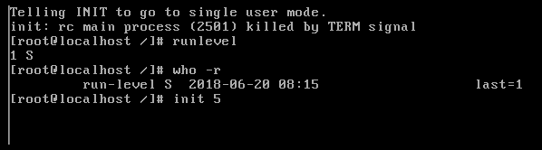
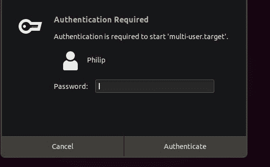
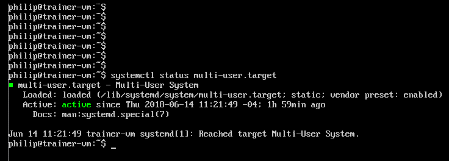

# 更改运行级别和引导目标

在前一章中，我们重点介绍了引导过程。之后，焦点被转移到 Linux 发行版中可用的各种引导管理器上。特别是，我们使用了 GRUB 和 GRUB2，它们是目前最流行的引导管理器。我们查看了它们各自的配置文件，重点是定时器、默认引导条目，以及在 GRUB/GRUB2 引导菜单中传递参数。最后，为了在 GRUB 和 GRUB2 的引导菜单中添加一个客户引导条目，创建了单独的插图。本章重点介绍运行级别和引导目标，Linux 发行版中可用的运行级别和引导目标的类型，以及运行级别和引导目标之间的区别。我们还将研究如何在命令行界面使用运行级别和引导目标。

在本章中，我们将涵盖以下主题:

*   runlevels 简介
*   引导目标介绍
*   使用运行级别
*   使用引导目标

# runlevels 简介

runlevels 的概念可以追溯到 SysV 时代，runlevel 是有目的的。不同的任务需要在系统启动时运行不同的守护程序。这在服务器环境中特别有用，在这种环境中，我们尽量减少服务器的开销。我们通常会为服务器指定一个角色。通过这样做，我们减少了给定服务器上需要安装的应用程序数量。例如，网络服务器通常会有一个向用户提供内容的应用程序和一个用于查找的数据库。

另一个典型的用例是打印服务器。这通常仅用于管理打印作业。也就是说，从运行级别的角度来看，我们通常会缩减给定服务器中运行的服务数量。对于那些来自视窗背景的人，想想安全模式。通常，我们会启动到安全模式，以尽量减少加载的程序和驱动程序。Runlevels 更进一步，我们可以告诉 Linux 发行版我们希望在给定的 runlevel 中启动/停止什么。最酷的部分是我们有许多运行级别可以在 Linux 发行版中使用。您将在使用 SysV init 的 Linux 发行版中找到运行级别。

请看下表:

| 运行级别 | **0** | **1** | **2** | **3** | **4** | **5** | **6** |
| **守护程式** | **关闭** | 上的 | 上的 | 上的 | 上的 | 上的 | **关闭** |

根据上表，每当守护程序**关闭**时，这意味着守护程序不会在该运行级别运行。类似地，只要守护程序在上是**，它就被配置为在特定的运行级别上运行。**

A daemon and a service are typically used interchangeably.

运行级别通常有各种启动/停止脚本，只要在支持`init`的 Linux 发行版中选择了运行级别，这些脚本就会运行。我们可以看看 CentOS 6.5 系统，看看哪个运行级别在使用。我们将查看`/etc/inittab`配置文件:

```sh
[philip@localhost Desktop]$ cat /etc/inittab
 # inittab is only used by upstart for the default runlevel.
 #
 # ADDING OTHER CONFIGURATION HERE WILL HAVE NO EFFECT ON YOUR SYSTEM.
 #
 # System initialization is started by /etc/init/rcS.conf
 #
 # Individual runlevels are started by /etc/init/rc.conf
 #
```

```sh
 # Ctrl-Alt-Delete is handled by /etc/init/control-alt-delete.conf
 #
 # Terminal gettys are handled by /etc/init/tty.conf and /etc/init/serial.conf,
 # with configuration in /etc/sysconfig/init.
 #
 # For information on how to write upstart event handlers, or how
 # upstart works, see init(5), init(8), and initctl(8).
 #
 # Default runlevel. The runlevels used are:
 # 0 - halt (Do NOT set initdefault to this)
 # 1 - Single user mode
 # 2 - Multiuser, without NFS (The same as 3, if you do not have networking)
 # 3 - Full multiuser mode
 # 4 - unused
 # 5 - X11
 # 6 - reboot (Do NOT set initdefault to this)
 #
 id:5:initdefault:
 [philip@localhost Desktop]$
```

根据前面的输出，CentOS 发行版支持七个运行级别。特别地，运行级别 5 是向用户呈现图形用户界面的运行级别。

其他流行的运行级别是`0`用于停止或关闭系统，`1`用于单用户模式(通常用于恢复)和`6`用于重新启动系统。说`id:5:initdefault:`的那一行是告诉 CentOS 在系统启动时使用哪个运行级别的那一行。

现在让我们看看支持`init`的 Ubuntu 6.06 发行版上的`/etc/inittab`:


从前面的输出中，我们可以将重点放在表示`id:2:initdefault:`的行上。`2`告诉 Linux 内核在系统启动时使用 runlevel 2。默认情况下，Ubuntu 6.06 使用 runlevel 2。事实上，在 Ubuntu 中，run level 2-5 被认为是多用户的；运行级别 2-5 之间没有区别。

在 CentOS 6.5 中，我们可以通过使用`chkconfig`命令来检查哪些守护进程在各个运行级别上运行；这将很好地总结各种服务:

```sh
[philip@localhost Desktop]$ chkconfig
 NetworkManager 0:off 1:off 2:on 3:on 4:on 5:on 6:off
 abrt-ccpp 0:off 1:off 2:off 3:on 4:off 5:on 6:off
 abrtd 0:off 1:off 2:off 3:on 4:off 5:on 6:off
 acpid 0:off 1:off 2:on 3:on 4:on 5:on 6:off
 atd 0:off 1:off 2:off 3:on 4:on 5:on 6:off
 auditd 0:off 1:off 2:on 3:on 4:on 5:on 6:off
 blk-availability 0:off 1:on 2:on 3:on 4:on 5:on 6:off
 bluetooth 0:off 1:off 2:off 3:on 4:on 5:on 6:off
 cpuspeed 0:off 1:on 2:on 3:on 4:on 5:on 6:off
 crond 0:off 1:off 2:on 3:on 4:on 5:on 6:off
 cups 0:off 1:off 2:on 3:on 4:on 5:on 6:off
 dnsmasq 0:off 1:off 2:off 3:off 4:off 5:off 6:off
 firstboot 0:off 1:off 2:off 3:on 4:off 5:on 6:off
 haldaemon 0:off 1:off 2:off 3:on 4:on 5:on 6:off
 htcacheclean 0:off 1:off 2:off 3:off 4:off 5:off 6:off
 httpd 0:off 1:off 2:off 3:off 4:off 5:off 6:off
 ip6tables 0:off 1:off 2:on 3:on 4:on 5:on 6:off
 iptables 0:off 1:off 2:on 3:on 4:on 5:on 6:off
 irqbalance 0:off 1:off 2:off 3:on 4:on 5:on 6:off
 kdump 0:off 1:off 2:off 3:on 4:on 5:on 6:off
 lvm2-monitor 0:off 1:on 2:on 3:on 4:on 5:on 6:off
 mdmonitor 0:off 1:off 2:on 3:on 4:on 5:on 6:off
 messagebus 0:off 1:off 2:on 3:on 4:on 5:on 6:off
 netconsole 0:off 1:off 2:off 3:off 4:off 5:off 6:off
 netfs 0:off 1:off 2:off 3:on 4:on 5:on 6:off
 network 0:off 1:off 2:on 3:on 4:on 5:on 6:off
 ntpd 0:off 1:off 2:off 3:off 4:off 5:off 6:off
 ntpdate 0:off 1:off 2:off 3:off 4:off 5:off 6:off
 portreserve 0:off 1:off 2:on 3:on 4:on 5:on 6:off
 postfix 0:off 1:off 2:on 3:on 4:on 5:on 6:off
 psacct 0:off 1:off 2:off 3:off 4:off 5:off 6:off
 quota_nld 0:off 1:off 2:off 3:off 4:off 5:off 6:off
 rdisc 0:off 1:off 2:off 3:off 4:off 5:off 6:off
 restorecond 0:off 1:off 2:off 3:off 4:off 5:off 6:off
 rngd 0:off 1:off 2:off 3:off 4:off 5:off 6:off
 rsyslog 0:off 1:off 2:on 3:on 4:on 5:on 6:off
 saslauthd 0:off 1:off 2:off 3:off 4:off 5:off 6:off
 smartd 0:off 1:off 2:off 3:off 4:off 5:off 6:off
 snmpd 0:off 1:off 2:off 3:off 4:off 5:off 6:off
 snmptrapd 0:off 1:off 2:off 3:off 4:off 5:off 6:off
 spice-vdagentd 0:off 1:off 2:off 3:off 4:off 5:on 6:off
 sshd 0:off 1:off 2:on 3:on 4:on 5:on 6:off
 sysstat 0:off 1:on 2:on 3:on 4:on 5:on 6:off
 udev-post 0:off 1:on 2:on 3:on 4:on 5:on 6:off
 vmware-tools 0:off 1:off 2:on 3:on 4:on 5:on 6:off
 vmware-tools-thinprint 0:off 1:off 2:on 3:on 4:on 5:on 6:off
 wdaemon 0:off 1:off 2:off 3:off 4:off 5:off 6:off
 winbind 0:off 1:off 2:off 3:off 4:off 5:off 6:off
 wpa_supplicant 0:off 1:off 2:off 3:off 4:off 5:off 6:off
 [philip@localhost Desktop]$
```

从前面的输出中，我们可以看到各种各样的服务。有些运行在多个运行级别，而有些则完全关闭。以网络服务为例；设置为`0:off 1:off 2:on 3:on 4:on 5:on 6:off`。这告诉系统在运行级别 2-5 启动网络服务，在运行级别 0-1 和 6 关闭网络服务。大多数服务被设置为仅在运行级别 2-5 中运行。

我们可以在`/etc/rc.d/`中查看设置为启动/停止的各种脚本:

```sh
[philip@localhost Desktop]$ ls -l /etc/rc.d
 total 60
 drwxr-xr-x. 2 root root 4096 Jun 20 01:49 init.d
 -rwxr-xr-x. 1 root root 2617 Nov 22 2013 rc
 drwxr-xr-x. 2 root root 4096 Jun 20 01:49 rc0.d
 drwxr-xr-x. 2 root root 4096 Jun 20 01:49 rc1.d
 drwxr-xr-x. 2 root root 4096 Jun 20 01:49 rc2.d
 drwxr-xr-x. 2 root root 4096 Jun 20 01:49 rc3.d
 drwxr-xr-x. 2 root root 4096 Jun 20 01:49 rc4.d
 drwxr-xr-x. 2 root root 4096 Jun 20 01:49 rc5.d
 drwxr-xr-x. 2 root root 4096 Jun 20 01:49 rc6.d
 -rwxr-xr-x. 1 root root 220 Jun 20 01:48 rc.local
 -rwxr-xr-x. 1 root root 19688 Nov 22 2013 rc.sysinit
 [philip@localhost Desktop]$ 
```

基于前面的输出，每个运行级别(0-6)都有不同的目录。此外，我们可以进一步深入文件系统层次结构并公开子目录。让我们选择`/etc/rc.d/rc5.d`并揭示其内容:

```sh
[philip@localhost Desktop]$ ls -l /etc/rc.d/rc5.d/
 total 0
 lrwxrwxrwx. 1 root root 16 Jun 20 01:44 K01smartd -> ../init.d/smartd
 lrwxrwxrwx. 1 root root 17 Jun 20 01:44 K05wdaemon -> ../init.d/wdaemon
 lrwxrwxrwx. 1 root root 16 Jun 20 01:44 K10psacct -> ../init.d/psacct
 lrwxrwxrwx. 1 root root 19 Jun 20 01:41 K10saslauthd -> ../init.d/saslauthd
 lrwxrwxrwx. 1 root root 22 Jun 20 01:41 K15htcacheclean -> ../init.d/htcacheclean
 lrwxrwxrwx. 1 root root 15 Jun 20 01:41 K15httpd -> ../init.d/httpd
 lrwxrwxrwx. 1 root root 17 Jun 20 01:41 K50dnsmasq -> ../init.d/dnsmasq
 lrwxrwxrwx. 1 root root 20 Jun 20 01:40 K50netconsole -> ../init.d/netconsole
 lrwxrwxrwx. 1 root root 15 Jun 20 01:41 K50snmpd -> ../init.d/snmpd
 lrwxrwxrwx. 1 root root 19 Jun 20 01:41 K50snmptrapd -> ../init.d/snmptrapd
 lrwxrwxrwx. 1 root root 17 Jun 20 01:47 K73winbind -> ../init.d/winbind
 lrwxrwxrwx. 1 root root 14 Jun 20 01:41 K74ntpd -> ../init.d/ntpd
 lrwxrwxrwx. 1 root root 17 Jun 20 01:41 K75ntpdate -> ../init.d/ntpdate
 lrwxrwxrwx. 1 root root 19 Jun 20 01:44 K75quota_nld -> ../init.d/quota_nld
 lrwxrwxrwx. 1 root root 24 Jun 20 01:44 K84wpa_supplicant -> ../init.d/wpa_supplicant
 lrwxrwxrwx. 1 root root 21 Jun 20 01:40 K87restorecond -> ../init.d/restorecond
 lrwxrwxrwx. 1 root root 15 Jun 20 01:40 K89rdisc -> ../init.d/rdisc
 lrwxrwxrwx. 1 root root 14 Jun 20 01:44 K99rngd -> ../init.d/rngd
 lrwxrwxrwx. 1 root root 17 Jun 20 01:43 S01sysstat -> ../init.d/sysstat
 lrwxrwxrwx. 1 root root 22 Jun 20 01:43 S02lvm2-monitor -> ../init.d/lvm2-monitor
 lrwxrwxrwx. 1 root root 22 Jun 20 01:49 S03vmware-tools -> ../init.d/vmware-tools
 lrwxrwxrwx. 1 root root 19 Jun 20 01:41 S08ip6tables -> ../init.d/ip6tables
 lrwxrwxrwx. 1 root root 18 Jun 20 01:40 S08iptables -> ../init.d/iptables
 lrwxrwxrwx. 1 root root 17 Jun 20 01:40 S10network -> ../init.d/network
 lrwxrwxrwx. 1 root root 16 Jun 20 01:44 S11auditd -> ../init.d/auditd
 lrwxrwxrwx. 1 root root 21 Jun 20 01:38 S11portreserve -> ../init.d/portreserve
 lrwxrwxrwx. 1 root root 17 Jun 20 01:41 S12rsyslog -> ../init.d/rsyslog
 lrwxrwxrwx. 1 root root 18 Jun 20 01:44 S13cpuspeed -> ../init.d/cpuspeed
```

Throughout the chapter, some output is omitted for the sake of brevity.

从前面的输出中，运行级别 5 有许多守护程序。我们识别守护进程的方式是使用命名约定。以`K`开头的文件用于终止/停止进程，以`S`开头的文件用于启动进程。此外，大多数脚本都是指向`/etc/rc.d/init.d/`目录的符号链接。

同样，我们可以在稍后的 CentOS 发行版中公开各种启动/停止脚本。例如，让我们选择 CentOS 6.5 并剖析它的一个目录。在 CentOS 6.5 系统上，这里显示了一个停止脚本:

```sh
[philip@localhost Desktop]$ cat /etc/rc.d/rc5.d/S13irqbalance
 #! /bin/sh
 ### BEGIN INIT INFO
 # Provides: irqbalance
 # Default-Start: 3 4 5
 # Default-Stop: 0 1 6
 # Short-Description: start and stop irqbalance daemon
 # Description: The irqbalance daemon will distribute interrupts across
 # the cpus on a multiprocessor system with the purpose of
 # spreading the load
 ### END INIT INFO
 # chkconfig: 2345 13 87 # This is an interactive program, we need the current locale # Source function library.
 . /etc/init.d/functions
```

正如我们所看到的，脚本要复杂得多。向下移动，我们可以看到以下代码:

```sh
# Check that we're a priviledged user
 [ `id -u` = 0 ] || exit 0
prog="irqbalance"
[ -f /usr/sbin/irqbalance ] || exit 0
# fetch configuration if it exists
 # ONESHOT=yes says to wait for a minute, then look at the interrupt
 # load and balance it once; after balancing exit and do not change
 # it again.
 # The default is to keep rebalancing once every 10 seconds.
 ONESHOT=
 [ -f /etc/sysconfig/irqbalance ] && . /etc/sysconfig/irqbalance
 case "$IRQBALANCE_ONESHOT" in
 y*|Y*|on) ONESHOT=--oneshot ;;
 *) ONESHOT= ;;
 esac
RETVAL=0
start() {
 if [ -n "$ONESHOT" -a -f /var/run/irqbalance.pid ]; then
 exit 0
 fi
 echo -n $"Starting $prog: "
 if [ -n "$IRQBALANCE_BANNED_CPUS" ];
 then
 export IRQBALANCE_BANNED_CPUS=$IRQBALANCE_BANNED_CPUS
 fi
 daemon irqbalance --pid=/var/run/irqbalance.pid $IRQBALANCE_ARGS $ONESHOT
 RETVAL=$?
 echo
 return $RETVAL
 }
stop() {
 echo -n $"Stopping $prog: "
 killproc irqbalance
 RETVAL=$?
 echo
 [ $RETVAL -eq 0 ] && rm -f /var/lock/subsys/irqbalance
 return $RETVAL
 }
restart() {
 stop
 start
 }
# See how we were called.
 case "$1" in
 start)
 start
 ;;
 stop)
 stop
 ;;
 status)
 status irqbalance
 ;;
 restart|reload|force-reload)
 restart
 ;;
 condrestart)
 [ -f /var/lock/subsys/irqbalance ] && restart || :
 ;;
 *)
 echo $"Usage: $0 {start|stop|status|restart|reload|condrestart|force-reload}"
 exit 1
 ;;
 esac
exit $?
 [philip@localhost Desktop]$
```

最后，从前面的输出中，我们可以清楚地看到脚本本质上是编程性的。

# 引导目标介绍

靴子目标的概念是一个全新的球赛。使用`systemd`时使用引导目标。我们可以看到性能的提高，因为只根据需要启动对特定套接字的请求。此外，`systemd`为了兼容性模仿`init`，而在后台`systemd`正在工作。当我们使用引导目标时，我们使用单元。对于给定的引导目标，存在许多守护程序。让我们看看 Ubuntu 发行版中可用的引导目标:

```sh
root@ubuntu:/home/philip# systemctl list-units --type target
 UNIT           LOAD    ACTIVE   SUB  DESCRIPTION
 basic.target      loaded active active Basic System
 cryptsetup.target loaded active active Encrypted Volumes
 getty.target      loaded active active Login Prompts
 graphical.target  loaded active active Graphical Interface
 local-fs-pre.target loaded active active Local File Systems (Pre)
 local-fs.target   loaded active active Local File Systems
 multi-user.target loaded active active Multi-User System
 network.target    loaded active active Network
 nss-user-lookup.target loaded active active User and Group Name Lookups
 paths.target     loaded active active Paths
 remote-fs-pre.target loaded active active Remote File Systems (Pre)
 remote-fs.target loaded active active Remote File Systems
 slices.target   loaded active active Slices
 sockets.target  loaded active active Sockets
 sound.target    loaded active active Sound Card
 swap.target     loaded active active Swap
 sysinit.target  loaded active active System Initialization
 time-sync.target loaded active active System Time Synchronized
 timers.target   loaded active active Timers
LOAD = Reflects whether the unit definition was properly loaded.
 ACTIVE = The high-level unit activation state, i.e. generalization of SUB.
 SUB = The low-level unit activation state, values depend on unit type.
19 loaded units listed. Pass --all to see loaded but inactive units, too.
 To show all installed unit files use 'systemctl list-unit-files'.
 root@ubuntu:/home/philip#
```

从前面的输出中，将只显示当前加载的目标。`graphical.target`类似于`init`中的 5 级运行。要查看所有启动目标，我们将执行以下操作:

```sh
root@ubuntu:/home/philip# systemctl list-units --type target --all
 UNIT             LOAD ACTIVE SUB DESCRIPTION
 basic.target       loaded active active Basic System
 cryptsetup.target  loaded active active Encrypted Volumes
 emergency.target   loaded inactive dead Emergency Mode
 failsafe-graphical.target loaded inactive dead Graphical failsafe fallback
 final.target       loaded inactive dead Final Step
 getty.target       loaded active active Login Prompts
 graphical.target   loaded active active Graphical Interface
 halt.target        loaded inactive dead Halt
 local-fs-pre.target loaded active active Local File Systems (Pre)
 local-fs.target    loaded active active Local File Systems
 multi-user.target    loaded active active Multi-User System
 network-online.target loaded inactive dead Network is Online
 network-pre.target    loaded inactive dead Network (Pre)
 network.target            loaded active active Network
 nss-user-lookup.target    loaded active active User and Group Name Lookups
 paths.target                loaded active active Paths
 reboot.target               loaded inactive dead Reboot
 remote-fs-pre.target        loaded active active
```

从前面的输出中，我们可以看到活动的和非活动的引导目标。

现在，假设我们希望看到与给定目标相关联的实际守护程序。我们将运行以下命令:

```sh
root@ubuntu:/home/philip# systemctl list-dependencies graphical.target
```


从前面的输出中，我们可以看到`graphical.target`中有许多守护进程。一个这样的守护进程是`NetworkManager.service`，它用于我们系统内的网络。阅读的方法是:

*   **绿圈**:表示服务当前正在运行
*   **红圈**:表示服务目前没有运行

# 使用运行级别

我们可以为不同的任务使用不同的运行级别，正如我们在本章前面看到的。让我们使用 CentOS 6.5 发行版。为了实时查看 shell 中的运行级别，我们可以使用`runlevel`命令:

```sh
[philip@localhost Desktop]$ runlevel
N 5
[philip@localhost Desktop]$
```

从前面的输出来看，`N`表示前面的运行级别。在我们的例子中，我们没有改变运行级别。`5`表示我们目前处于 5 级运行状态。我们还可以运行另一个命令来显示运行级别。我们可以使用带有`-r`选项的`who`命令，如下所示:

```sh
[philip@localhost Desktop]$ who -r
 run-level 5 2018-06-20 08:09
 [philip@localhost Desktop]$
```

从前面的输出中，我们可以看到进一步的描述，即使用`who –r`命令的`run-level 5`。

现在，我们可以通过利用`init`或`telinit`命令来更改 CentOS 6.5 发行版中的运行级别。让我们看看如何从运行级别 5 更改为运行级别 1:

```sh
[philip@localhost Desktop]$ who -r
 run-level 5 2018-06-20 08:09
 [philip@localhost Desktop]$ init 1
```

按*进入*会出现错误；原因是，在 CentOS 6.5 发行版中，我们需要 root 权限才能将运行级别 5 更改为运行级别 1:

```sh
[philip@localhost Desktop]$ init 1
 init: Need to be root
 [philip@localhost Desktop]$
```

现在，让我们作为根用户进行身份验证，然后重试`init 1`命令:

```sh
[philip@localhost Desktop]$ su -
 Password:
 [root@localhost ~]# init 1
```

现在，我们将被放入 runlevel 1，它移除了 GUI，并将我们直接带入 shell。这个运行级别 1 通常被称为**单用户**，我们将使用它进行恢复:


从前面的输出中，我们已经运行了`runlevel`和`who -r`命令，并验证了我们确实处于运行级别 1。

现在，让我们将系统恢复到 GUI 状态，即运行级别 5:



现在，当我们在图形用户界面中运行`runlevel`命令时，我们将看到先前的运行级别 1 在`runlevel`命令中用`S`替换了`N`:

```sh
[philip@localhost Desktop]$ runlevel
 S 5
 [philip@localhost Desktop]$
```

同样，我们可以使用`-r`选项运行`who`命令来查看更多信息:

```sh
[philip@localhost Desktop]$ who -r
run-level 5 2018-06-20 08:20 last=S
[philip@localhost Desktop]$ 
```

现在，假设我们想在某个运行级别打开一个守护进程。我们将使用`dnsmasq`进行演示。首先，让我们验证一下`dnsmasq`服务目前是否关闭:

```sh
[philip@localhost Desktop]$ chkconfig | grep dnsmasq
dnsmasq 0:off 1:off 2:off 3:off 4:off 5:off 6:off
[philip@localhost Desktop]$ 
```

太好了。现在让我们只为运行级别 3-5 打开`dnsmasq`守护程序:

```sh
[philip@localhost Desktop]$ chkconfig --levels 345 dnsmasq on
You do not have enough privileges to perform this operation.
[philip@localhost Desktop]$ 
```

从前面的输出中，我们得到了一个错误，因为我们需要 root 权限来打开/关闭相应运行级别的守护程序。让我们以 root 用户身份重试:

```sh
[philip@localhost Desktop]$ su -
Password:
[root@localhost ~]# chkconfig --levels 345 dnsmasq on
[root@localhost ~]#
```

太好了。现在让我们重新运行`chkconfig`命令，只寻找`dnsmasq`守护程序:

```sh
[root@localhost ~]# chkconfig | grep dnsmasq
dnsmasq 0:off 1:off 2:off 3:on 4:on 5:on 6:off
[root@localhost ~]# 
```

从前面的输出中，我们可以看到`dnsmasq`守护进程现在在运行级别 3-5 中被设置为`on`。

# 使用引导目标

我们可以使用`systemctl`命令来处理引导目标。本章前面我们谈到了`systemctl`。让我们使用 Ubuntu 发行版。通过执行以下操作，我们可以实时检查哪个`target`当前是默认的并在 shell 中运行:

```sh
philip@ubuntu:~$ systemctl get-default
graphical.target
philip@ubuntu:~$
```

从前面的输出可以看出`graphical.target`是默认的运行目标。现在，如果我们想在目标之间改变，我们可以使用`systemctl`命令。我们换成`multi-user.target`:

```sh
philip@ubuntu:~$ systemctl isolate multi-user.target
```

我们一按*进入*键，系统就会要求我们认证:



我们也可以运行`systemctl`来验证`multi-user.target`的状态:



我们可以使用`systemctl`命令将系统返回到图形用户界面环境:


此外，我们可以使用`systemctl`命令查看其中一个目标的结构:

```sh
philip@ubuntu:~$ systemctl show network.target
 Id=network.target
 Names=network.target
 WantedBy=networking.service systemd-networkd.service NetworkManager.service
 Conflicts=shutdown.target
 Before=network-online.target rc-local.service
 After=NetworkManager.service network-pre.target systemd-networkd.service network
 Documentation=man:systemd.special(7) http://www.freedesktop.org/wiki/Software/sy
 Description=Network
```

```sh
 LoadState=loaded
 ActiveState=active
 SubState=active
 FragmentPath=/lib/systemd/system/network.target
 UnitFileState=static
 UnitFilePreset=enabled
 StateChangeTimestamp=Wed 2018-06-20 10:50:52 PDT
 StateChangeTimestampMonotonic=18205063
 InactiveExitTimestamp=Wed 2018-06-20 10:50:52 PDT
 InactiveExitTimestampMonotonic=18205063
 ActiveEnterTimestamp=Wed 2018-06-20 10:50:52 PDT
 ActiveEnterTimestampMonotonic=18205063
 ActiveExitTimestampMonotonic=0
 InactiveEnterTimestampMonotonic=0
 CanStart=no
```

从前面的输出来看，其中一个关键值是`WantedBy`。这告诉我们谁依赖`network.target`。我们可以看到`NetworkManager.service`依靠`network.target`。还有关于`StateChangeTimestamp`、`Documentation`、`LoadState`和`Description`的细节。

# 摘要

在本章中，我们与 runlevels 进行了交互。我们看到了各种可用的运行级别，并在运行级别之间切换。我们看到了默认的运行级别(运行级别 5)，我们使用了`runlevel`、`who`和`init`命令进行交互。然后，我们关注引导目标。我们查看了默认的引导目标，并看到了每个引导目标下的不同单元。然后，我们在引导目标之间进行了更改，发现需要进行身份验证。我们使用了带有各种选项的`systemctl`命令以及`runlevel`和`who`命令。我们验证了我们确实在另一个引导目标中。我们推导出`graphical.target`类似于运行等级 5，`mutli-user.target`类似于运行等级 3。最后，我们简单看了一下引导目标的结构。

在下一章中，我们将重点介绍硬盘布局的设计。在进行任何部署之前，硬盘布局至关重要。因此，下一章很有分量，因为我们需要对如何管理硬盘进行大量思考。这里提到的`fdisk`和`parted`很少被提及，它们将被涵盖。作为一名 Linux 工程师，您将从下一章中掌握的技术将有助于您未来的部署。从下一章中获得的这种授权是在认证方面为您未来的成功建立信心的关键因素。

# 问题

1.  CentOS 发行版中的图形用户界面是哪个运行级别？
    1.  one
    2.  five
    3.  Two
    4.  three

2.  在 Ubuntu 发行版中打印当前运行级别的命令是什么？
    1.  `run-level`
    2.  `systemdctl`
    3.  `runlevel`
    4.  `who –b`

3.  哪个备用命令显示运行级别信息？
    1.  `who -v`
    2.  `who -l`
    3.  `who -b`
    4.  `who –r`

4.  读取运行级输出时 *N* 指的是什么？
    1.  当前运行级别
    2.  在更改为当前运行级别之前的上一个运行级别
    3.  在更改为前一个运行级别之前的前一个当前运行级别
    4.  当前正在使用的运行级别

5.  读取运行级输出时 *S* 指的是什么？
    1.  单一登录用户
    2.  超级用户
    3.  单入口超级用户
    4.  单一用户

6.  哪个命令用于更改运行级别？
    1.  `int`
    2.  `init`
    3.  `runlevel`
    4.  `change-run-level`

7.  哪一个命令可以用来改变运行级别？
    1.  `runlevel`
    2.  `shutdown`
    3.  `telinit`
    4.  `telnit`

8.  哪个命令用于查看默认引导目标？
    1.  `systemctl get-default`
    2.  `systemctl set-default`
    3.  `systemctl-default`
    4.  `systemctl-get-default`

9.  哪个命令可用于列出给定目标的守护程序？
    1.  `systemctl list-dependencies`
    2.  `systemctl list-dependencies –type list`
    3.  `systemctl list-dependencies –type target`
    4.  `systemctl list-dependencies target`

10.  哪个命令在目标之间切换？
    1.  `systemctl isolate target`
    2.  `systemctl isolate multi-user.target`
    3.  `systemctl isolate-target-multi-user`
    4.  `systemctl isolate-multiuser.target`

11.  哪个命令显示目标的状态？
    1.  `systemctl status multi-user.target`
    2.  `systemctl status-multi-user.target`
    3.  `systemctl-status multi-user.target`
    4.  `systemctl-status-multiuser.target`

# 进一步阅读

*   您可以在[https://www.centos.org 获得更多关于 CentOS 发行版的信息，如安装、配置最佳实践等。](https://www.centos.org)
*   以下网站为您提供了许多来自 Linux 社区用户的有用提示和最佳实践，特别是针对 Debian 发行版，如 Ubuntu:[https://askubuntu.com。](https://askubuntu.com)
*   以下链接为您提供了与在 CentOS 和 Ubuntu 上工作的各种命令相关的一般信息。您可以在以下链接发布您的问题，其他社区成员将会回复:[https://www.linuxquestions.org](https://www.linuxquestions.org)。