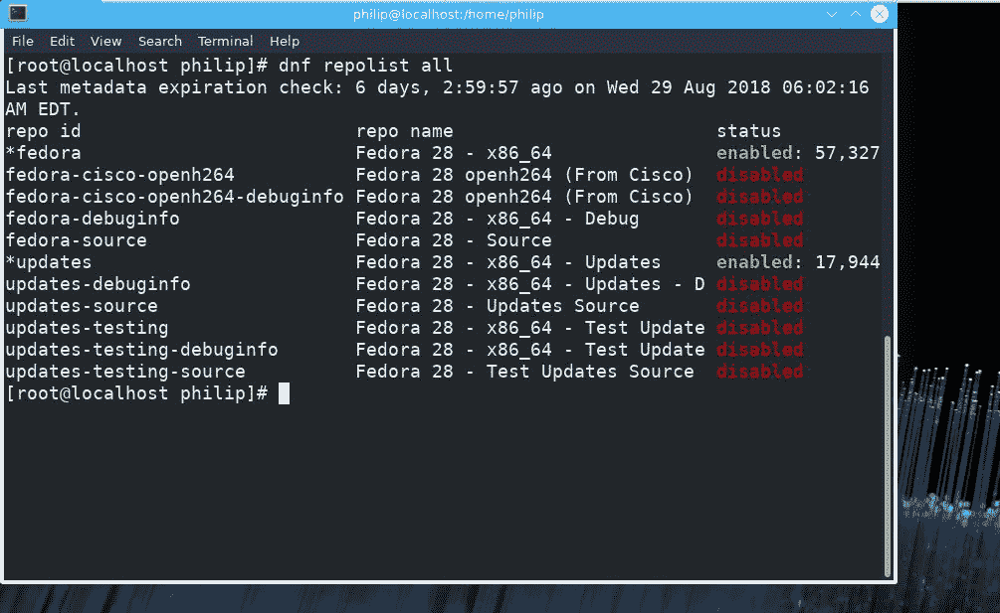
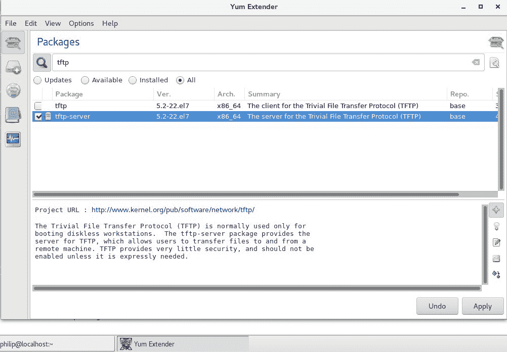

# 使用 YUM 包管理

在前一章中，包管理是我们的重点。我们了解了 Debian 包管理器。在 Debian 环境中安装软件包有多种方法。我们的注意力集中在 Debian 环境中管理包的常见方法上。

在这一章，我们继续我们的旅程。这一次，我们将重点放在红帽包管理方法上。我们从非常受欢迎的**黄狗更新程序开始，修改后的**，也被称为 **YUM** 。接下来，我们将注意力转向`dnf`效用。`dnf`实用程序的行为类似于 YUM。接下来是用于管理包的`rpm`实用程序。最后，将介绍`yumex`实用程序。

我们将在本章中讨论以下主题:

*   `yum`
*   `dnf`
*   `rpm`
*   `yumex`

# 妙的

**黄狗更新器，修改后的**，俗称 **YUM** 。YUM 是一种开源命令行方法，用于使用红帽分发的系统的包管理。YUM 使我们作为 Linux 管理员能够对基于 RPM 的发行版执行自动更新、打包和依赖管理。百胜在本质上类似于它的 Debian 对应物 APT。YUM 实用程序利用了各种软件仓库。

通常所说的软件回购存储各种包。使用 YUM 的一个主要原因是它检测特定包是否需要任何依赖文件。然后，它会提示用户所需的文件，并提供作为软件包安装的一部分来安装这些文件，用户应该从一开始就开始安装。

An interesting point to note is the fact that YUM works with RPM packages.

首先，我们可以使用`list`选项查看 YUM 数据库中的可用包:

```sh
[philip@localhost ~]$ yum list | less
Repodata is over 2 weeks old. Install yum-cron? Or run: yum makecache fast
Loading mirror speeds from cached hostfile
 * base: centos.mirror.iweb.ca
 * extras: centos.mirror.iweb.ca
 * updates: centos.mirror.iweb.ca
Installed Packages
GConf2.x86_64                    3.2.6-8.el7                @anaconda
GeoIP.x86_64                     1.5.0-11.el7               @anaconda
ModemManager.x86_64              1.6.0-2.el7                @anaconda
ModemManager-glib.x86_64         1.6.0-2.el7                @anaconda
NetworkManager.x86_64            1:1.8.0-9.el7              @anaconda
NetworkManager-adsl.x86_64       1:1.8.0-9.el7              @anaconda
NetworkManager-glib.x86_64       1:1.8.0-9.el7              @anaconda
NetworkManager-libnm.x86_64      1:1.8.0-9.el7              @anaconda
NetworkManager-libreswan.x86_64  1.2.4-2.el7                @anaconda
NetworkManager-libreswan-gnome.x86_64 1.2.4-2.el7               @anaconda
NetworkManager-ppp.x86_64        1:1.8.0-9.el7              @anaconda
NetworkManager-team.x86_64       1:1.8.0-9.el7              @anaconda
NetworkManager-tui.x86_64        1:1.8.0-9.el7              @anaconda
NetworkManager-wifi.x86_64       1:1.8.0-9.el7              @anaconda
PackageKit.x86_64                1.1.5-1.el7.centos         @anaconda
```

从前面的输出来看，回购数据是旧的，确切地说是两周前的数据。这可以通过用 YUM 运行`makecache fast`来解决:

```sh
[philip@localhost ~]$ yum makecache fast
Loaded plugins: fastestmirror, langpacks
Existing lock /var/tmp/yum-philip-FdEYSO/x86_64/7/yum.pid: another copy is running as pid 2322.
Another app is currently holding the yum lock; waiting for it to exit...
 The other application is: yum
 Memory :  24 M RSS (415 MB VSZ)
 Started: Tue Jul 31 05:49:03 2018 - 00:11 ago
 State  : Traced/Stopped, pid: 2322
Another app is currently holding the yum lock; waiting for it to exit...
 The other application is: yum
 Memory :  24 M RSS (415 MB VSZ)
 Started: Tue Jul 31 05:49:03 2018 - 00:13 ago
 State  : Traced/Stopped, pid: 2322
Another app is currently holding the yum lock; waiting for it to exit...
 The other application is: yum
 Memory :  24 M RSS (415 MB VSZ)
 Started: Tue Jul 31 05:49:03 2018 - 00:15 ago
 State  : Traced/Stopped, pid: 2322
^C
Exiting on user cancel.
[philip@localhost ~]$
```

如果您在尝试更新缓存时遇到此消息，我们可以删除锁定文件，这将解决此问题:

```sh
[philip@localhost ~]$ rm /var/tmp/yum-philip-FdEYSO/x86_64/7/yum.pid [philip@localhost ~]$ yum makecache fast
Loaded plugins: fastestmirror, langpacks
http://ftp.jaist.ac.jp/pub/Linux/CentOS/7/os/x86_64/repodata/repomd.xml: [Errno 14] curl#6 - "Could not resolve host: ftp.jaist.ac.jp; Name or service not known"
Trying other mirror.
base                                                                             | 3.6 kB  00:00:00 
extras                                                                                                                         | 3.4 kB  00:00:00 
http://centos.mirror.iweb.ca/7/updates/x86_64/repodata/repomd.xml: [Errno 14] curl#6 - "Could not resolve host: centos.mirror.iweb.ca; Name or service not known"
Trying other mirror.
updates                                                                                                                       | 3.4 kB  00:00:00 
(1/2): extras/7/x86_64/primary_db                                                                                              | 172 kB  00:00:10 
(2/2): updates/7/x86_64/primary_db                                                                                             | 4.3 MB  00:00:13 
Loading mirror speeds from cached hostfile
 * base: centos.mirror.iweb.ca
 * extras: centos.mirror.iweb.ca
 * updates: centos.mirror.iweb.ca
Metadata Cache Created
[philip@localhost ~]$
```

干得好！我们可以看到缓存已经更新。我们可以进一步缩小百胜正在展示的套餐范围；为此，我们使用`installed`选项:

```sh
[philip@localhost ~]$ yum list installed | less
Loaded plugins: fastestmirror, langpacks
Installed Packages
GConf2.x86_64                3.2.6-8.el7                     @anaconda
GeoIP.x86_64                 1.5.0-11.el7                    @anaconda
ModemManager.x86_64          1.6.0-2.el7                     @anaconda
ModemManager-glib.x86_64     1.6.0-2.el7                     @anaconda
NetworkManager.x86_64        1:1.8.0-9.el7                   @anaconda
NetworkManager-adsl.x86_64   1:1.8.0-9.el7                   @anaconda
NetworkManager-glib.x86_64    1:1.8.0-9.el7                  @anaconda
NetworkManager-libnm.x86_64   1:1.8.0-9.el7                  @anaconda
NetworkManager-libreswan.x86_64 1.2.4-2.el7                  @anaconda
NetworkManager-libreswan-gnome.x86_64 1.2.4-2.el7            @anaconda
NetworkManager-ppp.x86_64       1:1.8.0-9.el7                @anaconda
NetworkManager-team.x86_64      1:1.8.0-9.el7                @anaconda
NetworkManager-tui.x86_64       1:1.8.0-9.el7                @anaconda
NetworkManager-wifi.x86_64      1:1.8.0-9.el7                @anaconda
PackageKit.x86_64               1.1.5-1.el7.centos           @anaconda
PackageKit-command-not-found.x86_64 1.1.5-1.el7.centos       @anaconda
PackageKit-glib.x86_64           1.1.5-1.el7.centos          @anaconda
PackageKit-gstreamer-plugin.x86_64  1.1.5-1.el7.centos       @anaconda
```

从输出中，包按包名称、包版本和安装程序显示。我们也可以查看分组格式的包。我们使用`grouplist`选项:

```sh
[philip@localhost ~]$ yum grouplist
Loaded plugins: fastestmirror, langpacks
There is no installed groups file.
Maybe run: yum groups mark convert (see man yum)
Loading mirror speeds from cached hostfile
 * base: centos.mirror.iweb.ca
 * extras: centos.mirror.iweb.ca
 * updates: centos.mirror.iweb.ca
Available Environment Groups:
 Minimal Install
 Compute Node
 Infrastructure Server
 File and Print Server
 Basic Web Server
 Virtualization Host
 Server with GUI
 GNOME Desktop
 KDE Plasma Workspaces
 Development and Creative Workstation
Available Groups:
 Compatibility Libraries
 Console Internet Tools
 Development Tools
 Graphical Administration Tools
 Legacy UNIX Compatibility
 Scientific Support
 Security Tools
 Smart Card Support
 System Administration Tools
 System Management
Done
[philip@localhost ~]$
```

太好了。要查看特定包裹的信息，我们可以使用`info`选项:

```sh
[philip@localhost ~]$ yum info firefox
Installed Packages
Name        : firefox
Arch        : x86_64
Version     : 52.2.0
Release     : 2.el7.centos
Size        : 149 M
Repo        : installed
From repo   : anaconda
Summary     : Mozilla Firefox Web browser
URL         : http://www.mozilla.org/projects/firefox/
License     : MPLv1.1 or GPLv2+ or LGPLv2+
Description : Mozilla Firefox is an open-source web browser, designed for standards
 : compliance, performance and portability.
Available Packages
Name        : firefox
Arch        : i686
Version     : 60.1.0
Name        : firefox
Arch        : x86_64
Version     : 60.1.0
Description : Mozilla Firefox is an open-source web browser, designed for standards
 : compliance, performance and portability.
[philip@localhost ~]$
```

从前面的输出中，有很多关于包的有用信息。

我们可以通过使用`provides`选项来识别文件的包:

```sh
[philip@localhost ~]$ yum provides /etc/my.cnf
Loaded plugins: fastestmirror, langpacks
1:mariadb-libs-5.5.56-2.el7.i686 : The shared libraries required for MariaDB/MySQL clients
Repo        : base
Matched from:
Filename    : /etc/my.cnf
1:mariadb-libs-5.5.56-2.el7.x86_64 : The shared libraries required for MariaDB/MySQL clients
Repo        : base
Matched from:
Filename    : /etc/my.cnf
1:mariadb-libs-5.5.56-2.el7.x86_64 : The shared libraries required for MariaDB/MySQL clients
Repo        : @anaconda
Matched from:
Filename    : /etc/my.cnf
[philip@localhost ~]$
```

从输出来看，很明显`/etc/my.cnf`属于`mariadb-libs-5.5.56-2.el7.x86_64`。我们也可以使用`search`选项搜索包裹:

```sh
[philip@localhost ~]$ yum search gedit
Loaded plugins: fastestmirror, langpacks
* updates: centos.mirror.iweb.ca
================================================================= N/S matched: gedit =================================================================
gedit-devel.i686 : Support for developing plugins for the gedit text editor
gedit-devel.x86_64 : Support for developing plugins for the gedit text editor
gedit-plugins-data.x86_64 : Common data required by plugins
Name and summary matches only, use "search all" for everything.
[philip@localhost ~]$
```

现在要更新我们的系统，我们首先使用`clean all`选项:

You need root privilege before doing package maintenance.

```sh
[root@localhost philip]# yum clean all
Loaded plugins: fastestmirror, langpacks
Repodata is over 2 weeks old. Install yum-cron? Or run: yum makecache fast
Cleaning repos: base extras updates
Cleaning up everything
Cleaning up list of fastest mirrors
[root@localhost philip]#
```

接下来，我们使用`check-update`选项:

```sh
[root@localhost philip]# yum check-update
Loaded plugins: fastestmirror, langpacks
http://ftp.hosteurope.de/mirror/centos.org/7/os/x86_64/repodata/repomd.xml: [Errno 14] curl#6 - "Could not resolve host: ftp.hosteurope.de; Name or service not known"
Trying other mirror.
base                                                                                                                           | 3.6 kB  00:00:00 
extras                                                                                                                         | 3.4 kB  00:00:00 
updates                                                                                                                        | 3.4 kB  00:00:00 
(1/4): base/7/x86_64/group_gz                                                                                                  | 166 kB  00:00:09 
(2/4): extras/7/x86_64/primary_db                                                                                              | 172 kB  00:00:08 
(3/4): updates/7/x86_64/primary_db                                                                                             | 4.3 MB  00:00:14 
(4/4): base/7/x86_64/primary_db                                                                                                | 5.9 MB  00:00:16 
Determining fastest mirrors
* base: mirror.us.leaseweb.net
* extras: mirror.us.leaseweb.net
* updates: mirror.us.leaseweb.net
ModemManager.x86_64                                                          1.6.10-1.el7              base    accountsservice.x86_64                                                         0.6.45-7.el7              base    accountsservice-libs.x86_64                                                    0.6.45-7.el7              base    acl.x86_64                                                                     2.2.51-14.el7             base    attr.x86_64                                                                    2.4.46-13.el7             base    avahi-gobject.x86_64                                                           0.6.31-19.el7             base    avahi-libs.x86_64                                                              0.6.31-19.el7             base    yum.noarch                                                                     3.4.3-158.el7.centos      base    yum-plugin-fastestmirror.noarch                                                1.1.31-45.el7             base    yum-utils.noarch                                                               1.1.31-45.el7             base    Obsoleting Packages grub2.x86_64                                                                   1:2.02-0.65.el7.centos.2  base    grub2-tools.x86_64                                                         1:2.02-0.64.el7.centos    @anaconda grub2-tools-minimal.x86_64                                                     1:2.02-0.65.el7.centos.2  base 
[root@localhost philip]#
```

为了简洁起见，省略了一些输出。我们也可以使用`install`选项安装软件包:

```sh
[root@localhost philip]# yum install talk.x86_64
Loaded plugins: fastestmirror, langpacks
* updates: mirror.us.leaseweb.net
Resolving Dependencies
--> Running transaction check
Dependencies Resolved
=====================================================================
Package      Arch     Version      Repository   Size
=====================================================================
Installing:
talk         x86_64   0.17-46.el7     base     24 k
Transaction Summary
=====================================================================
Install  1 Package
Total download size: 24 k
Installed size: 31 k
Is this ok [y/d/N]: y
Downloading packages:
talk-0.17-46.el7.x86_64.rpm                                                                                                    |  24 kB  00:00:04 
Running transaction check
Running transaction test
Transaction test succeeded
Running transaction
Installing : talk-0.17-46.el7.x86_64                                                                                                            1/1
Verifying  : talk-0.17-46.el7.x86_64                                                                                                            1/1
Installed:
 talk.x86_64 0:0.17-46.el7 
Complete!
[root@localhost philip]# 
```

太棒了。我们也可以按相反的顺序取出包裹。为此，我们使用`remove`选项:

```sh
[root@localhost philip]# yum remove talk.x86_64
Loaded plugins: fastestmirror, langpacks
Resolving Dependencies
--> Running transaction check
---> Package talk.x86_64 0:0.17-46.el7 will be erased
--> Finished Dependency Resolution
Dependencies Resolved
=====================================================================
Package        Arch    Version   Repository    Size
=====================================================================
Removing:
talk         x86_64  0.17-46.el7    @base      31 k
Transaction Summary
=====================================================================
Remove  1 Package
Installed size: 31 k
Is this ok [y/N]: y
Downloading packages:
Transaction test succeeded
Running transaction
Erasing    : talk-0.17-46.el7.x86_64                                                                                                            1/1
Verifying  : talk-0.17-46.el7.x86_64                                                                                                            1/1
Removed:
talk.x86_64 0:0.17-46.el7 
Complete!
[root@localhost philip]#
```

如果出于某种原因，我们想更新系统上的所有软件包，我们使用`update`选项:

```sh
[root@localhost philip]# yum update
Loaded plugins: fastestmirror, langpacks
Loading mirror speeds from cached hostfile
 * base: mirror.us.leaseweb.net
 * extras: mirror.us.leaseweb.net
 * updates: mirror.us.leaseweb.net
Resolving Dependencies
---> Package python-gobject.x86_64 0:3.22.0-1.el7_4.1 will be an update
---> Package python-gobject-base.x86_64 0:3.22.0-1.el7 will be updated
---> Package python-libs.x86_64 0:2.7.5-58.el7 will be updated
---> Package python-libs.x86_64 0:2.7.5-69.el7_5 will be an update
---> Package python-netaddr.noarch 0:0.7.5-7.el7 will be updated
libwayland-server x86_64 1.14.0-2.el7 base 38 k
unbound-libs x86_64 1.6.6-1.el7 base 405 k
volume_key-libs x86_64 0.3.9-8.el7 base 140 k
Transaction Summary
======================================================================================================================================================
Install 6 Packages (+20 Dependent packages)
Upgrade 586 Packages
Total download size: 691 M
Is this ok [y/d/N]: y
```

最后，我们可以通过传递`repolist`选项来查看 YUM 回购:

```sh
[root@localhost philip]# yum repolist
Loaded plugins: fastestmirror, langpacks
Loading mirror speeds from cached hostfile
 * base: mirror.us.leaseweb.net
repo id           repo name            status
base/7/x86_64     CentOS-7 - Base      9,911
extras/7/x86_64   CentOS-7 - Extras    363
updates/7/x86_64  CentOS-7 - Updates   1,004
repolist: 11,278
[root@localhost philip]#
```

# 地下城与勇士

**花花公子百胜**或 DNF 是包管理实用程序的名称。DNF 是百胜的下一代。它用于基于转速的发行版。DNF 是在 Fedora 18 中引入的，自版本 22 以来一直是 Fedora 的默认包管理器。事实上，当我们在 Fedora 的后续版本中运行 YUM 命令时，我们实际上是在后台运行`dnf`。`dnf`实用程序提供了性能、内存使用和依赖性解析等功能。

首先，我们可以查看 Fedora 28 系统上的`dnf`版本，我们使用`--version`选项:

```sh
[root@localhost philip]# dnf --version
2.7.5
Installed: dnf-0:2.7.5-12.fc28.noarch at Wed 25 Apr 2018 06:35:34 AM GMT
Built    : Fedora Project at Wed 18 Apr 2018 02:29:51 PM GMT
Installed: rpm-0:4.14.1-7.fc28.x86_64 at Wed 25 Apr 2018 06:34:14 AM GMT
Built    : Fedora Project at Mon 19 Feb 2018 09:29:01 AM GMT
[root@localhost philip]# 
```

基于前面的输出，我们安装了 2.7.5 版本的`dnf`实用程序。我们甚至可以通过传递`repolist`选项来查看我们系统上的存储库:

```sh
[root@localhost philip]# dnf repolist
Last metadata expiration check: 0:01:09 ago on Tue 31 Jul 2018 03:10:57 PM EDT.
repo id     repo name                      status
*fedora     Fedora 28 - x86_64             57,327
*updates    Fedora 28 - x86_64 - Updates   16,337
[root@localhost philip]#
```

除此之外，我们甚至可以在 Fedora 28 中公开 YUM 命令，以证明它是`dnf`实用程序的别名。我们可以列出`/usr/bin`并搜索 YUM:

```sh
[root@localhost philip]# ll /usr/bin | grep yum
lrwxrwxrwx. 1 root root           5 Apr 18 10:29 yum -> dnf-3
[root@localhost philip]#
```

基于前面的输出，YUM 是 Fedora 28 系统内部的别名。我们还可以检查存储库是否启用。为此，我们使用`repolist all`选项:

```sh
[root@localhost philip]# dnf repolist all
```



现在，要查看我们系统上所有可用的软件包，我们使用`list`选项:

```sh
[root@localhost philip]# dnf list
Last metadata expiration check: 0:06:37 ago on Tue 31 Jul 2018 03:10:57 PM EDT.
Installed Packages
GConf2.x86_64             3.2.6-20.fc28                 @anaconda
GeoIP.x86_64              1.6.12-3.fc28                 @anaconda
GeoIP-GeoLite-data.noarch 2018.04-1.fc28                @anaconda
ImageMagick.x86_64        1:6.9.9.38-1.fc28             @anaconda
ImageMagick-libs.x86_64   1:6.9.9.38-1.fc28             @anaconda
LibRaw.x86_64             0.18.8-1.fc28                 @anaconda
ModemManager.x86_64       1.6.12-3.fc28                 @anaconda
ModemManager-glib.x86_64  1.6.12-3.fc28                 @anaconda
NetworkManager.x86_64      1:1.10.6-1.fc28               @anaconda
NetworkManager-adsl.x86_64 1:1.10.6-1.fc28               @anaconda
NetworkManager-bluetooth.x86_64 1:1.10.6-1.fc28               @anaconda
NetworkManager-config-connectivity-fedora.noarch  1:1.10.6-1.fc28               @anaconda
NetworkManager-libnm.x86_64 1:1.10.6-1.fc28 @anaconda
NetworkManager-openconnect.x86_64 1.2.4-9.fc28                  @anaconda
NetworkManager-openconnect-gnome.x86_64  1.2.4-9.fc28                  @anaconda
zziplib-utils.x86_64                                              0.13.68-1.fc28 fedora 
zzuf.x86_64 0.15-5.fc28  fedora 
[root@localhost philip]#
```

我们可以执行类似 YUM 的搜索；为此，我们使用`search`选项:

```sh
[root@localhost philip]# dnf search firefox
Last metadata expiration check: 0:11:22 ago on Tue 31 Jul 2018 03:10:57 PM EDT.
============================================ Summary & Name Matched: firefox =============================================
firefox.x86_64 : Mozilla Firefox Web browser
================================================ Summary Matched: firefox ================================================
icecat.x86_64 : GNU version of Firefox browser
mozilla-ublock-origin.noarch : An efficient blocker for Firefox
mozilla-https-everywhere.noarch : HTTPS enforcement extension for Mozilla Firefox
mozilla-requestpolicy.noarch : Firefox and Seamonkey extension that gives you control over cross-site requests
python-mozrunner.noarch : Reliable start/stop/configuration of Mozilla Applications (Firefox, Thunderbird)
[root@localhost philip]#
```

太棒了。此外，要查看哪个包提供了特定的实用程序，我们使用`provides`选项:

```sh
[root@localhost philip]# dnf provides /bin/ksh
Last metadata expiration check: 0:14:22 ago on Tue 31 Jul 2018 03:10:57 PM EDT.
ksh-20120801-247.fc28.x86_64 : The Original ATT Korn Shell
Repo        : updates
Matched from:
Provide    : /bin/ksh
ksh-20120801-245.fc28.x86_64 : The Original ATT Korn Shell
Repo        : fedora
Matched from:
Provide    : /bin/ksh
[root@localhost philip]#
```

除此之外，我们还可以使用`info`选项查看特定包裹的信息:

```sh
root@localhost philip]# dnf info libreoffice
Available Packages
Name         : libreoffice
Epoch        : 1
Version      : 6.0.6.1
Summary      : Free Software Productivity Suite
URL          : http://www.libreoffice.org/
License      : (MPLv1.1 or LGPLv3+) and LGPLv3 and LGPLv2+ and BSD and (MPLv1.1 or GPLv2 or LGPLv2 or Netscape) and Public
 : Domain and ASL 2.0 and MPLv2.0 and CC0
Description  : LibreOffice is an Open Source, community-developed, office productivity suite.
 : It includes the key desktop applications, such as a word processor,
 : spreadsheet, presentation manager, formula editor and drawing program, with a
 : user interface and feature set similar to other office suites.  Sophisticated
 : and flexible, LibreOffice also works transparently with a variety of file
 : formats, including Microsoft Office File Formats.
[root@localhost philip]#
```

基于前面的截图，我们可以看到给定包的许多有用信息。我们也可以使用`check-update`选项检查系统更新:

```sh
[root@localhost philip]# dnf check-update
Last metadata expiration check: 0:18:17 ago on Tue 31 Jul 2018 03:10:57 PM EDT.
GeoIP-GeoLite-data.noarch                                        2018.06-1.fc28                      updates 
LibRaw.x86_64                                                    0.18.13-1.fc28                      updates 
rkManager-openvpn.x86_64            1:1.8.4-1.fc28                                  updates 
NetworkManager-openvpn-gnome.x86_64                              1:1.8.4-1.fc28                      updates 
grub2-tools-extra.x86_64                                         1:2.02-38.fc28                      updates 
grub2-tools.x86_64                  1:2.02-34.fc28                                  @anaconda
grub2-tools-minimal.x86_64                                       1:2.02-38.fc28                      updates 
grub2-tools.x86_64                  1:2.02-34.fc28                                  @anaconda
kernel-headers.x86_64                                            4.17.9-200.fc28                     updates 
kernel-headers.x86_64               4.16.3-301.fc28                                 @anaconda
[root@localhost philip]#
```

要安装软件包，我们使用`install`选项:

```sh
[root@localhost philip]# dnf install BitchX.x86_64
Last metadata expiration check: 0:20:30 ago on Tue 31 Jul 2018 03:10:57 PM EDT.
Dependencies resolved.
==========================================================================================================================
Package                    Arch                       Version                           Repository                  Size
==========================================================================================================================
Installing:
BitchX                     x86_64                     1.2.1-15.fc28                     fedora                     1.6 M
Transaction Summary
==========================================================================================================================
Install  1 Package
Total download size: 1.6 M
Installed size: 3.3 M
Is this ok [y/N]: y
Installed:
 BitchX.x86_64 1.2.1-15.fc28 
Complete!
[root@localhost philip]#
```

干得好！正如您现在所看到的，这些选项与较老的 YUM 相似。同样，要删除一个包，我们使用`remove`选项:

```sh
[root@localhost philip]# dnf remove BitchX.x86_64
Dependencies resolved.
==========================================================================================================================
Package Arch Version Repository Size
==========================================================================================================================
Removing:
BitchX x86_64 1.2.1-15.fc28 @fedora 3.3 M
Transaction Summary
==========================================================================================================================
Remove 1 Package
Freed space: 3.3 M
Is this ok [y/N]: y
Running transaction check
Preparing : 1/1
Erasing : BitchX-1.2.1-15.fc28.x86_64 1/1
Verifying : BitchX-1.2.1-15.fc28.x86_64 1/1
Removed:
BitchX.x8
6_64 1.2.1-15.fc28
Complete!
[root@localhost philip]#
```

我们还可以删除只需要满足依赖关系的包。为此，我们使用`autoremove`选项:

```sh
[root@localhost philip]# dnf autoremove
Last metadata expiration check: 0:25:12 ago on Tue 31 Jul 2018 03:10:57 PM EDT.
Dependencies resolved.
Nothing to do.
Complete!
[root@localhost philip]#  
```

如果我们想看到执行的各种`dnf`命令，我们可以使用`history`选项:

```sh
[root@localhost philip]# dnf history
ID     | Command line             | Date and time    | Action(s)      | Altered
-------------------------------------------------------------------------------
```

```sh
3 | remove BitchX.x86_64     | 2018-07-31 15:33 | Erase          |    1 
2 | install BitchX.x86_64    | 2018-07-31 15:31 | Install        |    1 
1 |                          | 2018-04-25 02:33 | Install        | 1596 EE
[root@localhost philip]#
```

当我们试图跟踪系统中的变化时，这非常有用。在我们对系统进行任何更新之前，做一些内务处理总是一个好主意。我们可以使用`clean all`选项:

```sh
[root@localhost philip]# dnf clean all
18 files removed
[root@localhost philip]#
```

最后，要更新系统上的所有软件包，我们使用`update`选项:

```sh
[root@localhost philip]# dnf update
Last metadata expiration check: 0:11:49 ago on Tue 31 Jul 2018 03:48:23 PM EDT.
Dependencies resolved.
==========================================================================================================================
Package                                         Arch         Version                                 Repository     Size
==========================================================================================================================
Upgrading:
GeoIP-GeoLite-data   noarch 2018.06-1.fc28                        updates         551 k
LibRaw         x86_64       0.18.13-1.fc28                          updates
libkcapi        x86_64       1.1.1-6.fc28                            updates        44 k
libkcapi-hmaccalc         x86_64       1.1.1-6.fc28                            updates        26 k
libnice         x86_64       0.1.14-7.20180504git34d6044.fc28        updates       173 k
libvirt-daemon-config-network    x86_64       4.1.0-3.fc28                            updates        10 k
rpm-sign-libs  x86_64       4.14.1-9.fc28                           updates        73 k
xmlsec1-nss    x86_64       1.2.25-4.fc28                           updates        79 k
Transaction Summary
==========================================================================================================================
Install   11 Packages
Upgrade  736 Packages
Total download size: 1.0 G
Is this ok [y/N]: y
```

我们也可以通过更新的`upgrade`选项:

```sh
[root@localhost philip]# dnf upgrade
Last metadata expiration check: 0:11:49 ago on Tue 31 Jul 2018 03:48:23 PM EDT.
Dependencies resolved.
==========================================================================================================================
Package                                         Arch         Version                                 Repository     Size
==========================================================================================================================
Upgrading:
GeoIP-GeoLite-data                              noarch       2018.06-1.fc28                          updates       551 k
LibRaw                                          x86_64       0.18.13-1.fc28                          updates
libkcapi                                        x86_64       1.1.1-6.fc28                            updates        44 k
libkcapi-hmaccalc                               x86_64       1.1.1-6.fc28                            updates        26 k
libnice                                         x86_64       0.1.14-7.20180504git34d6044.fc28        updates       173 k
libvirt-daemon-config-network                   x86_64       4.1.0-3.fc28                            updates        10 k
rpm-sign-libs                                   x86_64       4.14.1-9.fc28                           updates        73 k
xmlsec1-nss                                     x86_64       1.2.25-4.fc28                           updates        79 k
Transaction Summary
==========================================================================================================================
Install   11 Packages
Upgrade  736 Packages
Total download size: 1.0 G
Is this ok [y/N]: y
```

如我们所见，过程是相同的。

# 每分钟转数

**红帽包管理器**，也称为 **RPM** ，是一个用于在基于 RPM 的 Linux 发行版中安装、卸载和管理软件包的程序。后端有各种利用`rpm`实用程序的实用程序，比如`yum`和`dnf`，仅举两个例子。它在本质上类似于它的对应物`dpkg`效用。每当有依赖需求的时候，通常都要出去手动查找必要的文件并安装。`rpm`管理的包都以一个`rpm`扩展结束。

首先，我们可以针对一个包检查`rpm`签名，我们使用`--check-sig`选项:

```sh
[root@localhost Downloads]# rpm --checksig gnome-calculator-3.22.3-1.el7.x86_64.rpm
gnome-calculator-3.22.3-1.el7.x86_64.rpm: rsa sha1 (md5) pgp md5 OK
[root@localhost Downloads]#
```

基于前面的输出，签名已经通过了使用`rpm`实用程序的检查。我们还可以检查特定包的依赖关系。我们使用`qpR`选项:

```sh
[root@localhost Downloads]# rpm -qpR gnome-calculator-3.22.3-1.el7.x86_64.rpm
/bin/sh
/bin/sh
libatk-1.0.so.0()(64bit)
libc.so.6()(64bit)
libc.so.6(GLIBC_2.14)(64bit)
libc.so.6(GLIBC_2.2.5)(64bit)
libc.so.6(GLIBC_2.3.4)(64bit)
libgmp.so.10()(64bit)
rtld(GNU_HASH)
rpmlib(PayloadIsXz) <= 5.2-1
[root@localhost Downloads]#
```

注意`q`表示查询，`p`表示列出包提供的功能，`R`表示列出包依赖的功能。

为了查看最近安装的所有软件包，我们可以结合`--last`使用`qa`:

```sh
[root@localhost Downloads]# rpm -qa --last
gpg-pubkey-f4a80eb5-53a7ff4b                  Tue 31 Jul 2018 08:30:07 AM PDT
words-3.0-22.el7.noarch                       Wed 20 Jun 2018 09:29:01 AM PDT
iwl6000-firmware-9.221.4.1-56.el7.noarch      Wed 20 Jun 2018 09:29:01 AM PDT
iwl6050-firmware-41.28.5.1-56.el7.noarch      Wed 20 Jun 2018 09:29:00 AM PDT
iwl6000g2b-firmware-17.168.5.2-56.el7.noarch  Wed 20 Jun 2018 09:29:00 AM PDT
iwl4965-firmware-228.61.2.24-56.el7.noarch    Wed 20 Jun 2018 09:29:00 AM PDT
iwl3945-firmware-15.32.2.9-56.el7.noarch      Wed 20 Jun 2018 09:29:00 AM PDT
iwl100-firmware-39.31.5.1-56.el7.noarch       Wed 20 Jun 2018 09:29:00 AM PDT
iwl7265-firmware-22.0.7.0-56.el7.noarch       Wed 20 Jun 2018 09:28:59 AM PDT
fontpackages-filesystem-1.44-8.el7.noarch     Wed 20 Jun 2018 09:15:44 AM PDT
centos-release-7-4.1708.el7.centos.x86_64     Wed 20 Jun 2018 09:15:44 AM PDT
[root@localhost Downloads]#
```

我们还可以通过传递包名来搜索特定的包:

```sh
[root@localhost Downloads]# rpm -qa ntp
ntp-4.2.6p5-25.el7.centos.2.x86_64
[root@localhost Downloads]#
```

在这种情况下，我们搜索`ntp`包。我们可以获得关于某个特定包的更多信息。我们可以通过`qi`选项:

```sh
[root@localhost Downloads]# rpm -qi ntp
Name : ntp
Version : 4.2.6p5
Vendor : CentOS
URL : http://www.ntp.org
Summary : The NTP daemon and utilities
Description :
The Network Time Protocol (NTP) is used to synchronize a computer's
time with another reference time source. This package includes ntpd
(a daemon which continuously adjusts system time) and utilities used
to query and configure the ntpd daemon.
 [root@localhost Downloads]#
```

有趣的是，在我们安装软件包之前，我们实际上可以获得关于所述软件包的信息，然后决定是中止还是继续安装:

```sh
[root@localhost Downloads]# rpm -qa gnome-calculator
gnome-calculator-3.22.3-1.el7.x86_64
[root@localhost Downloads]# rpm -e gnome-calculator
[root@localhost Downloads]# rpm -qa gnome-calculator
[root@localhost Downloads]#
```

我们查询了 GNOME 计算器，因为它预装在这个 CentOS 7 系统中。然后我们取出包裹，再次询问。现在我们将通过`rpm`包传递`qip`，我们下载了该包:

```sh
[root@localhost Downloads]# rpm -qip gnome-calculator-3.22.3-1.el7.x86_64.rpm
Name        : gnome-calculator
Version     : 3.22.3
Release     : 1.el7
Architecture: x86_64
Install Date: (not installed)
Group       : Unspecified
Size        : 5053847
Summary     : A desktop calculator
Description :
gnome-calculator is a powerful graphical calculator with financial,
logical and scientific modes. It uses a multiple precision package
to do its arithmetic to give a high degree of accuracy.
[root@localhost Downloads]#
```

还有维奥拉。我们可以看到，`rpm`效用非常强大。要安装软件包，我们使用`-i`或`--install`选项:

```sh
[root@localhost Downloads]# rpm --install gnome-calculator-3.22.3-1.el7.x86_64.rpm
 [root@localhost Downloads]# rpm -qa  gnome-calculator
gnome-calculator-3.22.3-1.el7.x86_64
[root@localhost Downloads]#
```

从前面的输出中，我们可以看到我们的包是使用`rpm`实用程序成功安装的。

我们可以查看特定包的所有文件:

```sh
[root@localhost Downloads]# rpm -ql gnome-calculator
/usr/bin/gcalccmd
/usr/bin/gnome-calculator
/usr/lib64/gnome-calculator
/usr/share/applications/gnome-calculator.desktop
/usr/share/man/man1/gnome-calculator.1.gz
[root@localhost Downloads]#
```

同样，我们可以通过传递`-e`选项来移除包。我们还可以通过添加`-v`选项来查看移除包装的过程:

```sh
[root@localhost Downloads]# rpm -ev gnome-calculator
Preparing packages...
gnome-calculator-3.22.3-1.el7.x86_64
[root@localhost Downloads]#
```

太棒了。最后，我们可以使用`-qf`选项来确定特定配置文件属于哪个包:

```sh
[root@localhost Downloads]#  rpm -qf /etc/rsyslog.conf
rsyslog-8.24.0-12.el7.x86_64
[root@localhost Downloads]#
```

# yumex

**YUM 扩展器**，简称 **yumex** ，是`yum`和`dnf`实用程序的前端。默认情况下，`yumex`没有预装 Fedora 28。这可以通过在外壳上安装`yumex`实用程序来轻松解决:

```sh
[root@localhost philip]# dnf install yumex-dnf
Last metadata expiration check: 0:01:38 ago on Thu 02 Aug 2018 10:30:42 AM EDT.
Dependencies resolved.
==========================================================================================================================
Package                              Arch           Version                                        Repository       Size
==========================================================================================================================
Installing:
dnfdragora                           noarch         1.0.1-10.git20180108.b0e8a66.fc28         fedora          364 k
Installing dependencies:
checkpolicy                          x86_64         2.8-1.fc28                                     updates         336 k
dnfdaemon                            noarch         0.3.18-6.fc28                                  fedora           64 k
python3-dnfdaemon                    noarch         0.3.18-6.fc28                                  fedora           23 k
python3-libsemanage                  x86_64         2.7-12.fc28                                    fedora          125 k
Transaction Summary
==========================================================================================================================
Install  23 Packages
Total download size: 5.6 M
Installed size: 17 M
Is this ok [y/N]: y
```

如您所见，在 Fedora 28 上安装`yumex`相当简单。对于 CentOS 7，我们首先安装**企业 Linux 额外软件包** ( **EPEL** ):

```sh
[root@localhost philip]# yum install epel-release
Loaded plugins: fastestmirror, langpacks
Loading mirror speeds from cached hostfile
 * base: mirror.as24220.net
 * extras: mirror.as24220.net
 * updates: mirror.as24220.net
Resolving Dependencies
--> Running transaction check
---> Package epel-release.noarch 0:7-11 will be installed
--> Finished Dependency Resolution
Dependencies Resolved
================================================================================
Package                Arch             Version         Repository        Size
================================================================================
Installing:
epel-release           noarch           7-11            extras            15 k
Transaction Summary
================================================================================
Install  1 Package
Total download size: 15 k
Installed size: 24 k
Is this ok [y/d/N]: y
Downloading packages:
epel-release-7-11.noarch.rpm                               |  15 kB   00:03 
Installing : epel-release-7-11.noarch                                     1/1
Verifying  : epel-release-7-11.noarch                                     1/1
Installed:
epel-release.noarch 0:7-11 
Complete!
[root@localhost philip]#
```

接下来，我们安装实际的`yumex`实用程序:

```sh
[root@localhost philip]# yum install yumex
Loaded plugins: fastestmirror, langpacks
epel/x86_64/metalink | 4.0 kB 00:00 
epel | 3.2 kB 00:00 
(1/3): epel/x86_64/group_gz | 88 kB 00:01 
(2/3): epel/x86_64/updateinfo | 927 kB 00:02 
(3/3): epel/x86_64/primary | 3.6 MB 00:00:16 
Loading mirror speeds from cached hostfile
 * base: mirror.as24220.net
.net
epel 12639/12639
Resolving Dependencies
--> Running transaction check
---> Package yumex.noarch 0:3.0.17-1.el7 will be installed
--> Processing Dependency: pexpect for package: yumex-3.0.17-1.el7.noarch
---> Package python2-pyxdg.noarch 0:0.25-6.el7 will be installed
--> Finished Dependency Resolution
Dependencies Resolved
============
Package Arch Version Repository Size
===========
Installing:
yumex noarch 3.0.17-1.el7 epel 444 k
Installing for dependencies:
pexpect noarch 2.3-11.el7 base 142 k
python2-pyxdg noarch 0.25-6.el7 epel 89 k
Transaction Summary
======================================================================================================================================================
Install 1 Package (+2 Dependent packages)
Total download size: 675 k
Installed size: 2.7 M
Is this ok [y/d/N]: y
Downloading packages:
warning: /var/cache/yum/x86_64/7/epel/packages/python2-pyxdg-0.25-6.el7.noarch.rpm: Header V3 RSA/SHA256 Signature, key ID 352c64e5: NOKEY-:--:-- ETA
------------------------------------------------------------------------------------------------------------------------------------------------------
Total 167 kB/s | 675 kB 00:00:04 
Retrieving key from file:///etc/pki/rpm-gpg/RPM-GPG-KEY-EPEL-7
Importing GPG key 0x352C64E5:
Userid : "Fedora EPEL (7) <epel@fedoraproject.org>"
Fingerprint: 91e9 7d7c 4a5e 96f1 7f3e 888f 6a2f aea2 352c 64e5
 Package : epel-release-7-11.noarch (@extras)
 From : /etc/pki/rpm-gpg/RPM-GPG-KEY-EPEL-7
Is this ok [y/N]: y
Transaction test succeeded
Running transaction
 Installing : yumex-3.0.17-1.el7.noarch 3/3
warning: /etc/yumex.conf created as /etc/yumex.conf.rpmnew
 Verifying : yumex-3.0.17-1.el7.noarch 1/3
 Verifying : pexpect-2.3-11.el7.noarch 3/3
Installed:
 yumex.noarch 0:3.0.17-1.el7 
Dependency Installed:
pexpect.noarch 0:2.3-11.el7 python2-pyxdg.noarch 0:0.25-6.el7 
Complete!
[root@localhost philip]#
```

在 CentOS 7 上安装`yumex`的步骤与 Fedora 28 非常相似。最后，我们可以在外壳或通过图形用户界面启动`yumex`实用程序。我们将演示 shell 方法:

```sh
[root@localhost philip]# yumex &
[1] 2884
[root@localhost philip]# Don't run yumex as root it is unsafe (Use --root to force)
```

从前面的输出中，有一个明显的迹象表明我们不应该以根用户的身份运行`yumex`实用程序。相反，我们将作为非根用户运行`yumex`实用程序:

```sh
root@localhost philip]# exit
exit
[philip@localhost ~]$ yumex &
[1] 2937
[philip@localhost ~]$ 07:48:33 : INFO - Using config file : /home/philip/.config/yumex/yumex.conf
07:48:33 : INFO - Using config file : /home/philip/.config/yumex/yumex.conf
(<class 'dbus.exceptions.DBusException'>, DBusException('Rejected send message, 2 matched rules; type="method_call", sender=":1.115" (uid=1000 pid=2937 comm="/usr/bin/python -tt /usr/bin/yumex ") interface="(unset)" member="GetDevices" error name="(unset)" requested_reply="0" destination=":1.8" (uid=0 pid=633 comm="/usr/sbin/NetworkManager --no-daemon ")',), <traceback object at 0x2ac5ef0>)
(<class 'dbus.exceptions.DBusException'>, DBusException('Rejected send message, 2 matched rules; type="method_call", sender=":1.115" (uid=1000 pid=2937 comm="/usr/bin/python -tt /usr/bin/yumex ") interface="(unset)" member="GetDevices" error name="(unset)" requested_reply="0" destination=":1.8" (uid=0 pid=633 comm="/usr/sbin/NetworkManager --no-daemon ")',), <traceback object at 0x2ac6ef0>)
```


具有讽刺意味的是，我们被提示输入根密码——是的，对某些人来说，这似乎令人困惑，但对我们来说却不是。这是因为我们以非根用户的身份启动了`yumex`实用程序。为了运行`yemex`实用程序，我们需要 root 权限。原因是，它管理包。默认情况下，非根用户无法管理包。因此，我们将进行身份验证，然后我们将迎来`nifty yumex`实用程序:


我们马上注意到，我们有一个很好的用户友好的图形用户界面，我们可以使用它。顶部有一个菜单栏和一个用于查找特定包的搜索栏。我们只需键入包的名称，例如:



太棒了。对于给定的包，我们得到了一个很好的描述，我们可以选中复选框，然后单击应用**、**，包将被安装。

# 摘要

在这一章中，我们真正深入到了红帽世界中的包管理；特别是`yum`、`dnf`、`rpm`和`yumex`公用设施。我们首先介绍了`yum`并查看了可用的包装；接下来`yum`缓存需要更新，所以我们更新了。之后，我们格式化了要以分组格式显示的包。

接下来，我们公开了给定包的信息。然后我们做了一些逆向工程，选择一个文件，发现它来自哪个包。随后演示了搜索包的步骤。在此之后，我们在对系统执行更新之前删除了不需要的文件。

此外，我们还做了一个关于安装软件包的演示，然后从反面演示了删除软件包的步骤。最后，我们使用 YUM 进行了系统更新。然后我们介绍了`dnf`实用程序，并看到了`dnf`和`yum`之间的相似之处。软呢帽 28 演示显示`yum`只是`dnf`的别名。

接下来，我们看看使用`dnf`查看`repo`列表的方法，以及搜索给定包的方法。类似于`yum`，使用配置文件，我们为配置文件找到了相应的包。最终演示了如何使用`yum`添加包。还演示了取出包装的反面。

使用`rpm`，我们看到了如何检查包裹的签名。此外，我们公开了给定包的信息，并有一个使用`rpm`实用程序安装和移除包的示例。最后，重点是`yumex`。`yumex`实用程序是`yum`和`dnf`的前端。默认情况下，它不是预安装的。有一个在 Fedora 28 环境中安装`yumex`的演示；同样，我们看到了在 CentOS 7 中安装`yumex`实用程序所需的必要步骤。最后，我们浏览了`yumex`实用程序，搜索了一个给定的包并看到了该包的描述。

在下一章中，我们将使用 shell 中的各种实用程序。您将更好地准备导航文件系统、创建文件、目录等。我们将查看文件权限，查看隐藏的文件和目录，并在 shell 中执行搜索。下一章中介绍的技能对于任何 Linux 工程师在命令行环境中高效工作都是必不可少的。完成下一章后，您将对文件管理更有信心。这将使您能够攻克认证申请中的另一个里程碑。

# 问题

1.  使用`yum`命令的哪个选项在系统上显示包装？

A.`yum --display`T4【b .】`yum --list`T5【c .】`yum list`T6【d .`yum --verbose`

2.  哪个命令用于更新`cache`？

A.`yum makecache fast`T4【b .】`yum cache --update`T5【c .】`yum –update --cache`T6【d .`yum –make --list`

3.  可以传递哪个命令来从配置文件中识别包？

A.`yum --get-information`T4【b .】`yum --display-information`T5【c .】`yum --provides`T6【d .`yum provides`

4.  哪个选项用于显示用`dpkg`命令安装的包？

A.`dpkg --get-selections`T4【b .】`dpkg –set-selections`T5【c .】`dpkg –get-selection`T6【d .`dpkg-query –get-selection`

5.  哪个命令用于删除不再需要的任何`temp`文件？

A.`yum remove cache`T4【b .】`yum clean all`T5【c .】`yum clean temp`T6【d .`yum remove temp`

6.  哪个命令用于更新系统？

A.`yum update`T4【b .】`yum auto-update`T5【c .】`yum clean update`T6【d .`yum purge update`

7.  哪个命令用于显示启用和禁用的存储库？

A.`dnf --repo-list`T4【b .】`dnf repolist all`T5【c .】`dnf list repo`T6【d .`dnf --repo-list --all`

8.  哪个命令用于检查更新？

A.`dnf check-update`T4【b .】`dnf --update-check`T5【c .】`dnf --list-update`T6【d .`dnf --get-list -updates`

9.  哪个命令用于在安装软件包之前公开软件包的信息？

A.`rpm -qa`T4【b .】`rpm -qic`T5【c .】`rpm -qip`T6【d .`rpm -qe`

10.  哪个命令用于删除包？

A.`rpm --remove`T4【b .】`rpm --erase`T5【c .】`rpm --delete`T6【d .`aptitude --purge`

# 进一步阅读

*   您可以在 [https://centos 上获得关于 CentOS 发行版的更多信息，如安装、配置最佳实践等。](https://centos.org)
*   有关 Fedora 的更多信息，以及下载一份并获得一些实践经验，请参见:[https://getfedora.org](https://getfedora.org)。