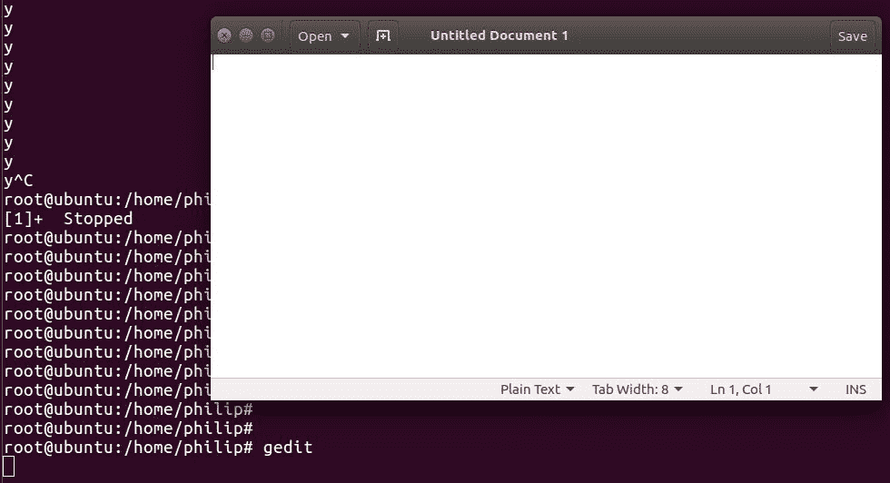
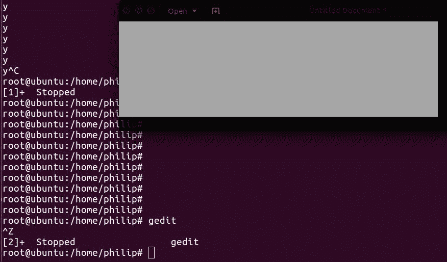
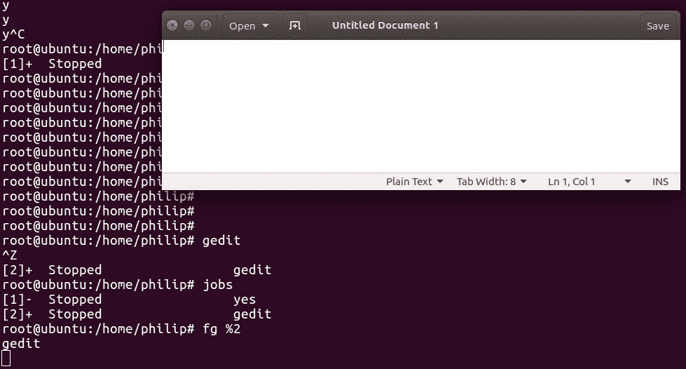
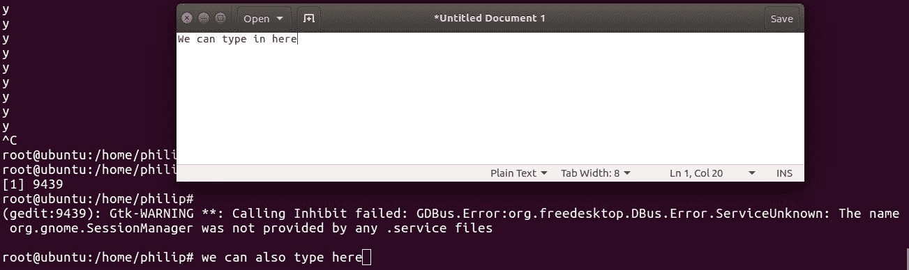
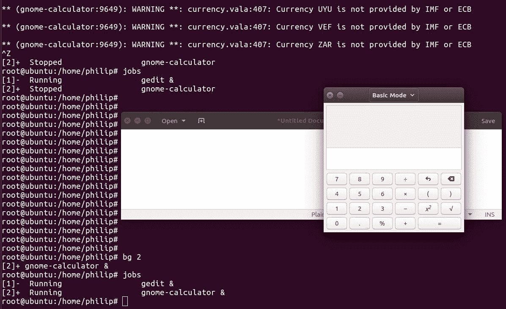

# 修改流程执行

在前一章中，公开了当前在 shell 中运行的进程的各种方法。此外，我们还看到了如何提取内存和中央处理器信息，以及如何结合使用`ps`命令和`kill`命令来终止进程。接下来，我们触及到了`pstree`的命令。随后，我们触及了`pgrep`命令；也称为过程 Grep。随后，我们触及了`pkill`的命令；顾名思义，它用于终止进程。在此之后，我们使用`top`命令。接下来，我们使用`service`命令。最后，我们使用`systemctl`命令。

与前几章相比，这一章很小，但它的内容对于管理我们的资源非常重要。首先，进一步讨论了管理进程，这次重点讨论了进程调度器上下文中进程的重要性(有时您可能会听到内核调度器这个术语；他们的意思是一样的)。我们经常面临资源限制方面的挑战。这将通过多种方式解决。考虑到这一点，我们将探索在 Linux 发行版的范围内尝试更改进程优先级时应该遵循的各种准则。第一节重点介绍`nice`命令。接下来是`renice`命令。最后，重点将放在前台进程和后台进程上。

我们将在本章中讨论以下主题:

*   `nice`命令
*   `renice`命令
*   前台进程与后台进程

# 好命令

用最简单的话来说，`nice`命令用于处理与中央处理器资源可用性相关的进程精确性。当我们说*精确*时，这是指对特定进程的 CPU 资源的关注或优先级。我们可以增加或减少给定流程的优先级。每当中央处理器被许多进程所拖累时，这就变得很重要，每个进程都在争夺自己的注意力。通过改变特定过程的精确性，我们正在影响过程调度。

我们可以使用`ps`命令查看进程的当前`nice`值；我们将通过`al`选项:

```sh
root@ubuntu:/home/philip# ps -al
F S UID PID  PPID C PRI  NI ADDR SZ WCHAN TTY  TIME CMD
4 S  0  2423 2271 0 80   0 - 13698 poll_s pts/17   00:00:00 sudo
4 S  0   2437 2423 0 80  0 - 13594 wait   pts/17   00:00:00 su
4 S  0   2438 2437 0 80  0 - 5304 wait   pts/17   00:00:00 bash
0 R  0   3063 2438 0 80  0 - 7229 -      pts/17   00:00:00 ps
root@ubuntu:/home/philip#
```

为了简洁起见，省略了一些输出。基于前面的输出，`NI`列表示当前流程的精确程度。您会注意到大多数流程的精确值被设置为`0`。我们还可以过滤`ps`命令的输出；我们可以使用`grep`命令:

```sh
root@ubuntu:/home/philip# ps -eo pid,ppid,ni,comm | grep update
 2402   1841   0 update-notifier
 2421   1611  10 update-manager
root@ubuntu:/home/philip#
```

干得好！基于此，我们可以看到有些流程的精确值默认不是`0`。有趣的是，我们还可以利用另一个命令来查看当前流程的细节；我们可以使用`top`命令:

```sh
root@ubuntu:/home/philip# top
PID USER   PR  NI    VIRT   RES  SHR S %CPU %MEM   TIME+   COMMAND                                           3020 root  20   0   41800  3880  3176 R  6.7  0.4   0:00.01 top 
1 root     20   0  185164  4532  3100 S  0.0  0.5   0:01.92 systemd 
2 root     20   0     0   0     0 S  0.0  0.0   0:00.00   kthreadd                                         3 root    20    0     0   0     0 S  0.0  0.0   0:00.16  ksoftirqd/0 
9 root    rt   0     0    0     0 S  0.0  0.0   0:00.00  migration/0 
10 root   rt   0     0    0     0 S  0.0  0.0   0:00.00  watchdog/0 
15 root   0   -20    0    0     0 S  0.0  0.0   0:00.00  writeback 
16 root   25   5     0    0     0 S  0.0  0.0   0:00.00  ksmd 
17 root   39  19     0    0     0 S  0.0  0.0   0:00.00  khugepaged 
```

第四列`NI`，代表每个流程的精细度。另一个关键列是第三列，`PR`；这代表了 Linux 内核看到的实际优先级。用户不能配置`PRI`栏。此外，`PRI`栏下的`rt`表示这些流程的优先级在实时调度中处理。

We cannot change values under the `PRI` column.

我们可以通过传递`--help`选项来查看`nice`命令的语法:

```sh
root@ubuntu:/home/philip# nice --help
Usage: nice [OPTION] [COMMAND [ARG]...]
Run COMMAND with an adjusted niceness, which affects process scheduling.
With no COMMAND, print the current niceness.  Niceness values range from
-20 (most favorable to the process) to 19 (least favorable to the process).
Mandatory arguments to long options are mandatory for short options too.
 -n, --adjustment=N   add integer N to the niceness (default 10)
 --help     display this help and exit
 --version  output version information and exit
```

Your shell may have its own version of `nice`, which usually supersedes the version described here. Please refer to your shell's documentation for details about the options it supports.
GNU coreutils online help can be found at: [http://www.gnu.org/software/coreutils](http://www.gnu.org/software/coreutils)
Full documentation can be found at: [http://www.gnu.org/software/coreutils/nice](http://www.gnu.org/software/coreutils/nice)
or available locally via: info '(coreutils) nice invocation'
`root@ubuntu:/home/philip#`

根据前面的语法，我们可以设置的范围在`-19(most priority) to 20(least priority)`之间。让我们在没有任何选项的情况下运行`nice`命令:

```sh
root@ubuntu:/home/philip# nice
0
root@ubuntu:/home/philip#
```

太好了。值`0`代表启动外壳的优先级。请记住，一个普通用户不能改变另一个用户流程的精细度；只有根用户可以为任何用户更改细节。默认情况下，如果我们运行`nice`命令而没有指定精确值，那么精确将被设置为`10`。让我们验证一下:

```sh
root@ubuntu:/home/philip# ps -alx | grep cron
1  0  3419  1611  30 10  29008  2540 hrtime SNs  ?   0:00 cron
0  0  3435 2438 20 0 14224 952 pipe_w S+ pts/17 0:00 grep --color=auto cron
root@ubuntu:/home/philip# nice cron
cron: can't lock /var/run/crond.pid, otherpid may be 3419: Resource temporarily unavailable
root@ubuntu:/home/philip#
```

基于前面的输出，`NI`值没有改变。这是因为这一进程已经开始。`nice`命令不能改变当前正在运行的进程的精确性。我们可以通过停止这个过程来解决这个问题:

```sh
root@ubuntu:/home/philip# systemctl stop cron
root@ubuntu:/home/philip#
```

现在，让我们尝试使用`nice`命令开始`cron`过程:

```sh
root@ubuntu:/home/philip# ps -alx | grep cron
0     0   3463   2438  20   0  14224   900 pipe_w S+   pts/17     0:00 grep --color=auto cron
root@ubuntu:/home/philip# nice cron
root@ubuntu:/home/philip# ps -alx | grep cron
1 0 3467 1611 30 10 29008  2732 hrtime SNs  ? 0:00 cron
0 0 3469 2438 20 0 14224 940 pipe_w S+ pts/17 0:00 grep --color=auto cron
root@ubuntu:/home/philip#
```

干得好！我们可以清楚地看到`NI`值已经更改为`10`，尽管我们没有指定精确值。如果我们想要指定一个值，那么我们通过在数字前面放置一个`-`来传递它。让我们再次使用`cron`流程:

```sh
root@ubuntu:/home/philip# systemctl stop cron
root@ubuntu:/home/philip# systemctl status cron
cron.service - Regular background program processing daemon
 Loaded: loaded (/lib/systemd/system/cron.service; enabled; vendor preset: enabled)
 Active: failed (Result: exit-code) since Thu 2018-08-16 11:30:00 PDT; 8min ago
 Docs: man:cron(8)
 Process: 3430 ExecStart=/usr/sbin/cron -f $EXTRA_OPTS (code=exited, status=1/FAILURE)
 Main PID: 3430 (code=exited, status=1/FAILURE)
root@ubuntu:/home/philip# pgrep cron
3467
root@ubuntu:/home/philip#
```

有时，您可能会在停止进程时遇到类似的错误。您可以使用`systemctl`命令或`service`命令，但进程仍将运行。我们可以利用上一章学到的知识轻松解决这个问题；我们可以称之为`kill`命令:

```sh
root@ubuntu:/home/philip# kill -9 3467
root@ubuntu:/home/philip# pgrep cron
root@ubuntu:/home/philip#
```

干得好！现在，让我们尝试用一个精确值启动`cron`过程:

```sh
root@ubuntu:/home/philip# nice -15 cron
root@ubuntu:/home/philip# pgrep cron
3636
root@ubuntu:/home/philip# ps -alx | grep cron
1 0 3636 1611  35 15 29008 2616 hrtime SNs  ?  0:00 cron
0 0 3658 2438  20 0 14224 920 pipe_w S+ pts/17 0:00 grep --color=auto cron
root@ubuntu:/home/philip#
```

但是有一个问题。如果我们运行`system1`命令来检查状态，我们将看到以下内容:

```sh
root@ubuntu:/home/philip# systemctl status cron
cron.service - Regular background program processing daemon
 Loaded: loaded (/lib/systemd/system/cron.service; enabled; vendor preset: enabled)
 Active: failed (Result: exit-code) since Thu 2018-08-16 11:30:00 PDT; 21min ago
 Docs: man:cron(8)
 Process: 3430 ExecStart=/usr/sbin/cron -f $EXTRA_OPTS (code=exited, status=1/FAILURE)
 Main PID: 3430 (code=exited, status=1/FAILURE)
Aug 16 11:30:00 ubuntu systemd[1]: cron.service: Unit entered failed state.
Aug 16 11:30:00 ubuntu systemd[1]: cron.service: Failed with result 'exit-code'.
root@ubuntu:/home/philip#
```

之所以会出现这个错误，是因为当我们使用使用`systemd`的 Linux 发行版时，需要在`/lib/systemd/system/`中编辑服务文件。在我们的情况下，它将是`/lib/systemd/system/cron.service`。这是`/lib/systemd/system/cron.service`配置文件:

```sh
root@ubuntu:/home/philip# cat /lib/systemd/system/cron.service
[Unit]
Description=Regular background program processing daemon
Documentation=man:cron(8)
[Service]
EnvironmentFile=-/etc/default/cron
ExecStart=/usr/sbin/cron -f $EXTRA_OPTS
IgnoreSIGPIPE=false
KillMode=process
[Install]
WantedBy=multi-user.target
root@ubuntu:/home/philip#
```

`[Service]`部分是我们放置`Nice=value`的地方。以下是我们如何存储`cron`流程的细节并消除`systemctl`产生的痛苦错误:

```sh
root@ubuntu:/home/philip# cat /lib/systemd/system/cron.service
[Unit]
Description=Regular background program processing daemon
Documentation=man:cron(8)
[Service]
Nice=15
EnvironmentFile=-/etc/default/cron
ExecStart=/usr/sbin/cron -f $EXTRA_OPTS
IgnoreSIGPIPE=false
KillMode=process
[Install]
WantedBy=multi-user.target
root@ubuntu:/home/philip#
```

现在，一旦我们对`systemd`服务进行了任何更改，我们将需要运行以下内容:

```sh
root@ubuntu:/home/philip# systemctl daemon-reload
root@ubuntu:/home/philip#
```

干得好！还有，你要把`Nice=`放在`ExecStart`之前，因为，如果你把它放在之后，那么对过程就没有影响了。我们现在将停止现有的`cron`流程，使用`systemctl`启动`cron`；错误将会消失，`systemctl`将会高兴:

```sh
root@ubuntu:/home/philip# systemctl stop cron
root@ubuntu:/home/philip# ps -alx | grep cro
0   0 3904  2438 20  0  14224  1016 pipe_w S+ pts/17  0:00 grep --color=auto cro
root@ubuntu:/home/philip# systemctl start cron
root@ubuntu:/home/philip# ps -alx | grep cro
4  0 3907  1  35  15  29008  2988 hrtime SNs  ?  0:00 /usr/sbin/cron -f
0  0 3911  2438  20  0 14224  1024 pipe_w S+   pts/17     0:00 grep --color=auto cro
root@ubuntu:/home/philip#
```

干得好！我们现在可以看到`cron`流程`NI`设置为`15`。这仅适用于`cron`等系统服务。另一种方法是通过`--adjustment=`选项；我们将在等号(`=`)后面指定一个精确值:

```sh
root@ubuntu:/home/philip# systemctl stop cron
root@ubuntu:/home/philip# nice --adjustment=13 cron
root@ubuntu:/home/philip# ps -alx | grep cro
1  0 3941   1611  33  13  29008  2576 hrtime SNs  ?   0:00 cron
0  0 3943   2438  20   0  14224  1008 pipe_w S+  pts/17 0:00 grep --color=auto cro
root@ubuntu:/home/philip#
```

当然，`systemctl`会抱怨:

```sh
root@ubuntu:/home/philip# systemctl status cron
cron.service - Regular background program processing daemon
 Loaded: loaded (/lib/systemd/system/cron.service; enabled; vendor preset: enabled)
 Active: inactive (dead) since Thu 2018-08-16 12:13:32 PDT; 1min 3s ago
 Docs: man:cron(8)
 Process: 3907 ExecStart=/usr/sbin/cron -f $EXTRA_OPTS (code=killed, signal=TERM)
 Main PID: 3907 (code=killed, signal=TERM)
root@ubuntu:/home/philip#
```

但是我们可以很容易地用我们刚刚学到的技术来弥补这一点；通过在`/lib/systemd/system/cron.service`中指定声明:

```sh
root@ubuntu:/home/philip# cat /lib/systemd/system/cron.service
[Unit]
Description=Regular background program processing daemon
Documentation=man:cron(8)
[Service]
Nice=13
EnvironmentFile=-/etc/default/cron
ExecStart=/usr/sbin/cron -f $EXTRA_OPTS
IgnoreSIGPIPE=false
KillMode=process
[Install]
WantedBy=multi-user.target
root@ubuntu:/home/philip#
root@ubuntu:/home/philip# systemctl daemon-reload
root@ubuntu:/home/philip# systemctl start cron
root@ubuntu:/home/philip# ps -alx | grep cro
4  0  4084   1  33  13  29008  2956 hrtime SNs ? 0:00 /usr/sbin/cron -f
0  0  4088   2438  20   0  14224  1076 pipe_w S+   pts/17  0:00 grep --color=auto cro
root@ubuntu:/home/philip#
```

干得好！

Be very cautious when modifying system processes as seen in these demos.

# renice 命令

当我们使用`nice`命令时，很明显它不能改变正在运行的进程的调度优先级；正如我们刚刚看到的，我们需要停下来，然后开始这个过程。这就是`renice`命令发光的地方。我们可以利用`renice`命令来改变运行过程中的细节。为了查看语法，我们将传递`--help`选项:

```sh
root@ubuntu:/home/philip# renice --help
Usage:
 renice [-n] <priority> [-p|--pid] <pid>...
renice [-n] <priority>  -g|--pgrp <pgid>...
 renice [-n] <priority>  -u|--user <user>...
Alter the priority of running processes.
Options:
 -n, --priority <num>   specify the nice increment value
 -p, --pid <id>         interpret argument as process ID (default)
 -g, --pgrp <id>        interpret argument as process group ID
 -u, --user <name>|<id> interpret argument as username or user ID
 -h, --help     display this help and exit
 -V, --version  output version information and exit
For more details see renice(1).
root@ubuntu:/home/philip#
```

首先，让我们使用`ps`命令来查看流程的细节，然后更改其细节:

```sh
root@ubuntu:/home/philip# ps -alx | grep ssh
4     0   3375      1  20   0   9996  4900 poll_s Ss   ?          0:00 /usr/sbin/sshd -D
0    0   4196   2438  20   0  14224   936 pipe_w S+   pts/17     0:00 grep --color=auto ssh
root@ubuntu:/home/philip#
root@ubuntu:/home/philip# renice -2 3375
3375 (process ID) old priority 0, new priority -2
```

```sh
root@ubuntu:/home/philip# ps -alx | grep ssh
4  0  3375  1  18  -2   9996  4900 poll_s S<s  ? 0:00 /usr/sbin/sshd -D
0  0   4209   2438  20  0  14224  1080 pipe_w S+ pts/17 0:00 grep --color=auto ssh
root@ubuntu:/home/philip#
```

根据前面的输出，`renice`命令需要一个过程的 PID。除此之外，当我们指定一个后面跟一个数字的`-`时，它会将其解释为负的`-`符号，并指定一个负值。此外，`systemctl`命令不会抱怨，因为在使用`renice`命令时，不需要停止和启动应用更改的过程:

```sh
root@ubuntu:/home/philip# systemctl status sshd
ssh.service - OpenBSD Secure Shell server
Loaded: loaded (/lib/systemd/system/ssh.service; enabled; vendor preset: enabled)
Active: active (running) since Thu 2018-08-16 11:25:39 PDT; 1h 20min ago
 Main PID: 3375 (sshd)
CGroup: /system.slice/ssh.service
└─3375 /usr/sbin/sshd -D
root@ubuntu:/home/philip#
```

干得好！我们还可以为特定用户改变细节；我们会通过`-u`选项。让我们改变用户拥有的所有进程的细节:

```sh
root@ubuntu:/home/philip# ps -alu philip
F S UID  PID PPID C  PRI  NI ADDR SZ WCHAN  TTY  TIME CMD
4 S  1000 1507 1  0  80  0 - 11319 ep_pol   ?  00:00:00 systemd
5 S  1000  1508 1507 0 80 0 - 36293 sigtim  ?   00:00:00 (sd-pam)
1 S  1000  1599  1  0  80  0 - 51303 poll_s ? 00:00:00 gnome-keyring-d
4 S  1000  1611 1349  0  80 0 - 11621 poll_s ?  00:00:00 upstart
1 S  1000  1696 1611  0  80  0 - 10932 ep_pol ? 00:00:00 dbus-daemon
0 S  1000   1708  1611 0 80 0 - 21586 poll_s ? 00:00:00 window-stack-br
1 S  1000   1721 1611  0  80 0 - 8215 poll_s ? 00:00:00 upstart-udev-br
1 S  1000   1735   1611 0 80 0 - 8198 poll_s ? 00:00:00 upstart-dbus-br
1 S  1000 1737 1611  0 80  0 -  8198 poll_s ? 00:00:00 upstart-dbus-br
1 S  1000 1743 1611  0 80 0 - 10321 poll_s ? 00:00:00 upstart-file-br
root@ubuntu:/home/philip# renice 3 -u philip
root@ubuntu:/home/philip # ps -alu philip
F S UID PID   PPID  C PRI  NI ADDR SZ WCHAN TTY TIME CMD
4 S  1000 1507  1   0  83 3 - 11319 ep_pol ? 00:00:00 systemd
5 S  1000 1508  1507 0 83  3 - 36293 sigtim ? 00:00:00 (sd-pam)
1 S  1000 1599  1   0  83  3 - 51303 poll_s ? 00:00:00 gnome-keyring-d
4 S  1000 1611  1349 0  83 3 - 11621 poll_s ? 00:00:00 upstart
1 S  1000 1696  1611 0  83 3 - 10932 ep_pol ? 00:00:00 dbus-daemon
0 S  1000 1708  1611 0 83  3 - 21586 poll_s ? 00:00:00 window-stack-br
1 S  1000 1721  1611 0 83  3 - 8215 poll_s ? 00:00:00 upstart-udev-br
1 S  1000 1735  1611 0 83  3 - 8198 poll_s ? 00:00:00 upstart-dbus-br
1 S  1000 1737  1611 0 83  3 - 8198 poll_s ? 00:00:00 upstart-dbus-br
1 S  1000 1743  1611 0  83 3 - 10321 poll_s ? 00:00:00 upstart-file-br
```

干得好！我们指定的用户所拥有的每个流程的细节都已经改变了。

# 前台进程与后台进程

在 shell 中工作时，我们实际上是在所谓的前台工作；除非我们停止当前的进程，否则我们无法执行任何其他任务。有时候你会想把一些进程发送到后台进行处理；这将允许您继续在 shell 中工作，同时后台的进程也在运行。要验证后台是否有进程在运行，我们可以使用`jobs`命令。让我们试试这个:

```sh
root@ubuntu:/home/philip# jobs
root@ubuntu:/home/philip#
```

从前面的输出中，我们可以看到当前没有作业在后台运行。要了解一个过程如何影响你在 shell 中工作，让我们看看`yes`实用程序；这可以在大多数 Linux 发行版中找到。`yes`实用程序将一直运行，直到我们暂停或停止它；当我们执行`yes`实用程序时，它会阻止我们执行任何命令:

```sh
root@ubuntu:/home/philip# yes
y
y
y
```

为了停止这个实用程序，我们将使用 *Ctrl* + *C* 的组合:

```sh
y
^C
root@ubuntu:/home/philip#
```

这将无意中停止`yes`实用程序。`yes`实用程序的语法如下:

*   `yes <STRING>`:如果我们离开字符串，它会吐出一个`y`，如前面的代码所示
*   `yes <OPTIONS>`:可用选项有版本和帮助

如果我们重新运行`yes`实用程序，并且我们决定暂停它而不是停止它，我们将使用 *Ctrl* + *Z.* 的组合。这实际上将把`yes`实用程序放在后台:

```sh
root@ubuntu:/home/philip# yes
y
y
y
^Z
[1]+  Stopped                 yes
root@ubuntu:/home/philip#
```

这一次，当我们运行`jobs`命令时，我们会看到有一个作业被列出:

```sh
root@ubuntu:/home/philip# jobs
[1]+  Stopped                 yes
root@ubuntu:/home/philip#
```

这已经暂停了`yes`实用程序，并将其放在后台，允许我们继续在命令提示符下工作。另一个例子说明前台进程停止外壳的概念，从而阻止我们执行任何其他命令，这将是我们开始一个实用程序的地方，如`vim`或任何图形用户界面程序。

让我们选择一个图形用户界面来演示；这将说明问题。我们将从外壳启动`gedit`实用程序:



根据前面的输出，外壳阻止我们键入任何其他命令，直到我们暂停或关闭`gedit`实用程序。让我们暂停`gedit`实用程序:



从前面的输出中，您会注意到`gedit`实用程序被冻结了，这意味着我们无法从`gedit`实用程序中执行任何操作。现在让我们再次运行`jobs`命令:

```sh
root@ubuntu:/home/philip# jobs
[1]-  Stopped                 yes
[2]+  Stopped                 gedit
root@ubuntu:/home/philip#
```

干得好！现在列出了两个工作。如果我们决定恢复其中一项工作，我们可以使用另一个强大的命令:`fg`命令。`fg`命令的语法如下:

```sh
fg %<job id>
```

为了看到这一点，让我们从停止状态恢复`gedit`实用程序:



干得好！现在我们可以在从命令提示符启动的`gedit`实用程序中工作了。但是，有一个问题。当我们做 *Ctrl* + *Z* 时，程序停止。在真实环境中，我们希望发送到后台的进程继续运行。这将加快我们的生产力，使我们能够同时完成工作。请放心，这实际上是通过另一种技术实现的，无论何时在 shell 中执行命令，我们都可以使用这种技术。`&`用于启动一个进程并将其发送到后台。让我们关闭`gedit`和`yes`实用程序:

```sh
root@ubuntu:/home/philip# fg
y
y
^C
root@ubuntu:/home/philip# jobs
root@ubuntu:/home/philip#
```

现在，我们将使用`&`启动`gedit`实用程序，并将其直接发送到后台:



干得好！现在我们可以在`gedit`实用程序中工作，也可以在命令提示符下继续工作。此外，当我们运行`jobs`命令时，我们将看到`gedit`实用程序的状态为`running`:

```sh
root@ubuntu:/home/philip# jobs
[1]+  Running                 gedit &
root@ubuntu:/home/philip#
```

太棒了。还有另一种方法可以恢复在后台停止的作业，并指示它们在后台运行。这是通过利用另一个强大的命令`bg`命令来实现的。如果我们停止`gedit`程序，我们将如何恢复它，并指示它恢复，但在后台运行:


干得好！`bg`命令做了两件事。首先，它恢复了`gedit`效用。然后它将`&`放在命令的末尾。正如我们前面看到的，`&`指示进程在后台运行。如果有多个作业，我们将指定作业标识或作业名称:

```sh
root@ubuntu:/home/philip# gnome-calculator
** (gnome-calculator:9649): WARNING **: currency.vala:407: Currency ZAR is not provided by IMF or ECB
^Z
[2]+  Stopped                 gnome-calculator
root@ubuntu:/home/philip# jobs
[1]-  Running                 gedit &
[2]+  Stopped                 gnome-calculator
root@ubuntu:/home/philip#
root@ubuntu:/home/philip# bg 2
[2]+ gnome-calculator &
root@ubuntu:/home/philip# jobs
[1]-  Running                 gedit &
[2]+  Running                 gnome-calculator &
root@ubuntu:/home/philip#
```



太棒了。我们可以看到这两个实用程序都是打开的，可以与命令提示符同时使用。

# 摘要

在本章中，我们已经介绍了处理流程的各种方法。首先，我们重点关注使用`nice`命令调度流程。每当 CPU 上的工作负载上升时，各种进程就会争夺 CPU 的资源。每个过程的细节都通过各种命令展现出来，例如:`ps`和`top`。接下来，我们做了一些演示，说明如何为流程设置细节。这将我们带到运行`systemd`的系统；我们看到了在一个`systemd`系统上改变过程的细节的问题。这导致我们修改了一个过程的配置文件，以便`systemd`能够在我们开始该过程时识别出细节。在这之后，我们进入`renice`命令，特别是处理当前正在运行的进程和改变运行进程的精确性的方法。这是通过改变细节来说明的，不仅对于给定的过程，而且我们能够改变用户拥有的所有过程的细节。`systemd`识别运行过程的变化，而无需我们修改任何特定的配置。但是，如果进程停止、启动或重新启动，那么我们设置的细节将被删除。要解决这个问题并保持良好状态，就意味着要编辑给定进程的配置文件。最后，我们在前景和背景的背景下处理流程。前台进程的概念影响我们在命令提示符下工作，直到前台进程被挂起或关闭。这大大降低了我们执行大量操作时的生产率。修复方法是让进程在后台运行，从而允许您在命令提示符下有效地执行功能。

在下一章中，我们将把注意力转向展示经理的世界。通常，大多数用户对在图形用户界面环境中工作感到舒适。因此，重点将涵盖当今 Linux 发行版中流行的常见显示管理器，以及当前 Linux+考试目标中的显示管理器。首先，我们将触摸 **X 显示管理器** ( **XDM** )。接下来，将讨论 KDE 显示管理器。接下来是**侏儒显示管理器** ( **GDM** )。最后，本章将介绍**灯光显示管理器** ( **LDM** )。下一章对你的考试准备至关重要，前几章也是如此。这将使您能够使用当今 Linux 环境中常见的各种显示管理器。

# 问题

1.  使用`ps`命令的哪个选项打印每个过程的细节？

A.*n*T2*b*l
c*a*T8*x*

2.  哪一列表示使用`ps`命令的每个过程的精确程度？

A.`NI`T4【b .】`ni`T5【c .】`N1`T6【d .`nice`

3.  哪一列表示使用`top`命令的每个过程的精确程度？

A.`ni`T4【b .】`PNI`T5【c .】`pnic`T6【d .`NI`

4.  使用`nice`命令时，哪个值不是要设置的有效值？

A.`-20`T4【b .】`-19`T5【c .】`20`T6【d .`19`

5.  哪个美好值优先级最高？

A.`-21`T4【b .】`-32`T5【c .】`-19`T6【d .`-20`

6.  使用`systemd`的进程的配置文件存储在哪个目录？

A.`/usr/lib/systemd/system`T4【b .】`/lib/systemd/system`T5【c .】`/lib/systemd/system/service`T6【d .`/lib/systemd/service`

7.  使用`systemd`编辑服务文件后需要运行哪个命令？

A.`systemctl daemon-reload`T4【b .】`systemctl --daemon-reload`T5【c .】`systemctl daemon --reload`T6【d .`systemctl daemonreload`

8.  使用`renice`命令时，指定精确值后会出现什么情况？

A.`Process name`
b .`PID`
c .`Process name + PID`T5】d .以上都不是

9.  哪个命令从后台恢复进程，并阻止您执行任何其他命令，直到当前进程结束？

A.联邦政府工作
地方政府工作

10.  哪个命令从后台恢复进程，但将其置于后台，允许您在命令提示符下执行其他命令？

A.`fg`T4【b .】`jobs`T5【c .】`bg`T6【d .`CTRL+C`

# 进一步阅读

*   您可以通过查看[https://www.tecmint.com](https://www.tecmint.com)获得关于管理流程的更多信息。
*   下一个网站为您提供了许多处理流程的有用提示和最佳实践:[https://www.digitalocean.com](https://www.digitalocean.com)。
*   最后一个链接为您提供了与在 CentOS 和 Ubuntu 上工作的各种命令相关的一般信息。您可以在那里发布您的问题，其他社区成员将能够回答:[https://www.linuxquestions.org](https://www.linuxquestions.org)。