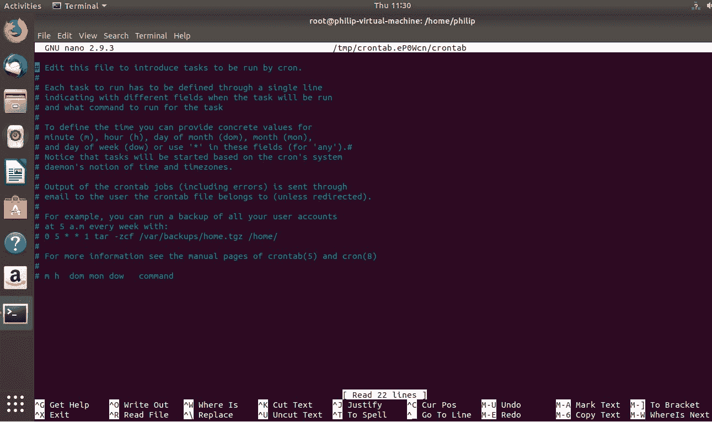
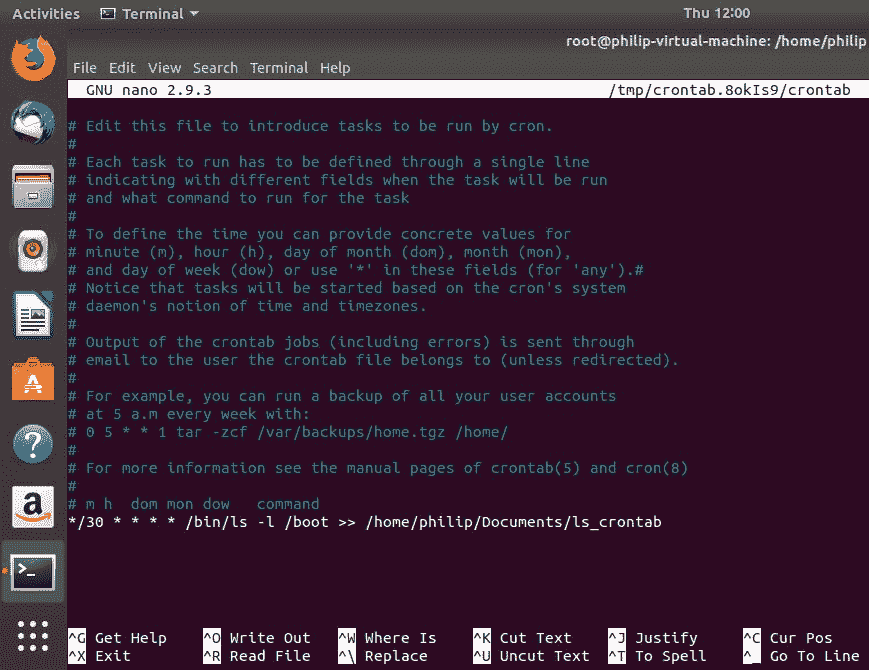
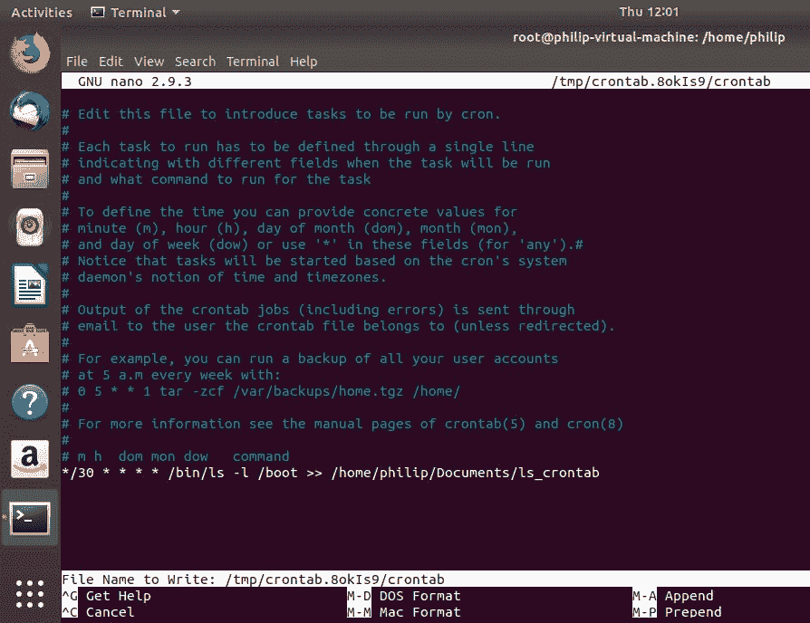

# 自动化任务

在前一章中，我们介绍了多种管理用户和组帐户的技术。首先，我们调查了填充新用户主目录的各种目录。接下来，我们处理用户帐户创建。此外，我们还查看了保存用户密码的各种配置文件。最后，我们的重点是群体。我们介绍了创建组以及添加、删除和分配组密码的步骤。

在本章中，我们的重点转向自动化，尤其是自动化任务。我们将介绍使用各种方法安排任务。我们经常每天处理各种任务，而不是必须在一段时间内手动重复运行任务；实现某种类型的额外自动化是一个很好的实践，我们将研究关于任务执行的权限。

在本章中，我们将涵盖以下主题:

*   `at`、`atq`和`arm`命令
*   `crontab`文件和`anacron`命令
*   使用配置文件执行任务的权限

# 使用 at、atq 和 atrm 命令管理自动化

在本节中，我们将介绍一些在 Linux 系统中自动化各种类型任务的常见方法。首先，我们将覆盖`at`命令。接下来，我们将使用`atq`命令处理队列。最后，我们将使用`atrm`命令，使用用于移除作业的技术来结束本节。

# at 命令

`at`命令安排任务在固定时间运行；它运行一次。您可以安排一个简单的任务，例如将一些输出附加到文件，或者像备份数据库一样复杂。启动`at`实用程序的基本语法如下:

```sh
at <time>
```

我们可以使用我们的 Fedora 28 系统看到`at`命令在运行；我们只需键入`at`而不指定任何选项:

```sh
[root@localhost philip]# at
Garbled time
[root@localhost philip]#
```

基于前面的命令，在不指定时间的情况下，`at`实用程序将返回`Garbled time`。下面是我们如何指定时间:

```sh
[root@localhost philip]# at 18:10
warning: commands will be executed using /bin/sh
at>
```

基于前面的输出，只要我们输入一个日期(在本例中，我们以 HH:MM 的格式输入一个时间)，它就会启动`at`实用程序，我们会看到一个`warning: commands will be executed using /bin/sh`警告；这告诉我们`at`实用程序在执行时将使用哪个外壳。在这里，我们可以键入任何希望在指定时间运行的命令。例如:

```sh
[root@localhost philip]# at 18:10
warning: commands will be executed using /bin/sh
at> ls -l > /home/philip/Documents/schedule
at>
```

似乎什么都没变；为了保存更改，我们必须告诉`at`实用程序我们已经完成了命令的输入。这是使用 *Ctrl* + *D* 组合完成的:

```sh
[root@localhost philip]# at 18:10
warning: commands will be executed using /bin/sh
at> ls -l > /home/philip/Documents/schedule
at> <EOT>
job 1 at Tue Sep  4 18:10:00 2018
[root@localhost philip]#
```

根据前面的输出，`at`实用程序已经安排了一个任务从现在开始在`18:10`运行。使用`at`实用程序安排任务的另一种方法是以 12 小时的格式指定时间。以下是我们实现这一目标的方法:

```sh
[root@localhost philip]# at 9:00 PM
warning: commands will be executed using /bin/sh
at> date > /home/philip/Documents/date_schedule
at> <EOT>
job 2 at Tue Sep  4 21:00:00 2018
[root@localhost philip]#
```

太棒了。基于前面的输出，我们使用 12 小时的格式，通过标记`PM`来指定时间。这告诉`at`实用程序从当前时间开始在`9:00 PM`执行作业。此外，我们可以使用关键字指定时间。比如说`tomorrow`、 `noon tomorrow`、`next week`、 `next Monday`、`fri`等等。以下是它的外观:

```sh
[root@localhost philip]# at next monday
warning: commands will be executed using /bin/sh
at> ls -l /etc > /home/philip/Documents/ls_schedule
at> <EOT>
job 4 at Mon Sep 10 09:11:00 2018
[root@localhost philip]#
```

太好了。基于前面的输出，`at`实用程序已经使用当前日期来计算它将被执行的时间。还有，`<EOT>`是按 *Ctrl* + *D* 的结果。另一种指定何时运行`at`实用程序的方法是使用关键字组合。例如，我们可以指定`now + 4 weeks`、`now + 6 years`、`now + 25 minutes`等等。以下是它的外观:

```sh
[root@localhost philip]# at now + 15 minutes
warning: commands will be executed using /bin/sh
at> ls -a /var/log > /home/philip/Documents/lsa_schedule
at> <EOT>
job 5 at Thu Sep  6 09:32:00 2018
[root@localhost philip]# date
Thu Sep  6 09:19:25 EDT 2018
[root@localhost philip]#
```

太棒了！基于前面的输出，我们可以看到`at`实用程序使用当前日期和时间作为其计算的基础。此外，我们还可以指定年份来查看其计算结果:

```sh
[root@localhost philip]# at now + 25 years
warning: commands will be executed using /bin/sh
at> systemctl status sshd.service > /home/philip/Documents/ssh_25yrs_schedule
at> <EOT>
job 7 at Sun Sep  6 09:25:00 2043
[root@localhost philip]#
```

干得好！根据前面的输出，`at`实用程序将在 25 年后运行该任务。我们可以看到一些可以通过`at`实用程序传递的常见选项列表，我们传递`-help`选项:

```sh
[root@localhost philip]# at -help
Usage: at [-V] [-q x] [-f file] [-mMlbv] timespec ...
 at [-V] [-q x] [-f file] [-mMlbv] -t time
 at -c job ...
 atq [-V] [-q x]
 at [ -rd ] job ...
 atrm [-V] job ...
 batch
[root@localhost philip]#
Awesome job!
```

# atq 命令

到目前为止，我们已经使用`at`实用程序创建了许多要执行的任务。最好使用`at`命令跟踪计划运行的内容；`atq`司令部就是这么做的。要了解这是如何工作的，我们可以运行`atq`命令:

```sh
[root@localhost philip]# atq
4              Mon Sep 10 09:11:00 2018 a root
7              Sun Sep  6 09:25:00 2043 a root
[root@localhost philip]#
```

基于前面的输出，我们列出了两个由`at`实用程序运行的作业。当我们作为根用户运行`atq`命令时，所有作业都被列为由`at`命令运行；当我们作为标准用户运行`at`命令时，情况就不同了。只会列出用户作业。以下是它的外观:

```sh
[root@localhost philip]# exit
exit
[philip@localhost ~]$ atq
[philip@localhost ~]$
```

根据前面的输出，用户不知道根用户使用`at`命令安排的作业。另外，我们可以使用`at`命令查看队列；我们通过`-l`选项:

```sh
[root@localhost philip]# at -l
4              Mon Sep 10 09:11:00 2018 a root
7              Sun Sep  6 09:25:00 2043 a root
[root@localhost philip]#
```

太棒了。基于前面的命令，我们可以看到输出与`atq`命令相同。这是因为与`at`命令一起使用的`-l`选项只是`atq`命令的别名。

# atrm 命令

能够使用`at`实用程序调度要运行的作业是一件好事。但是，我们需要对计划的作业进行某种形式的控制。如果我们决定取消工作，我们可以使用`atrm`命令。`atrm`命令用于在由`at`实用程序执行之前取消作业。例如，我们使用`at`实用程序安排重启:

```sh
[root@localhost philip]# at now + 5 minutes
warning: commands will be executed using /bin/sh
at> reboot
at> <EOT>
job 8 at Thu Sep  6 10:06:00 2018
[root@localhost philip]# date
Thu Sep  6 10:01:21 EDT 2018
[root@localhost philip]#
```

基于前面的命令，我们已经指定使用`at`命令在五分钟内重新启动系统。现在如果出于某种原因我们想取消这个作业，我们可以使用`atrm`命令。我们会这样做:

```sh
 [root@localhost philip]# atq
4              Mon Sep 10 09:11:00 2018 a root
8              Thu Sep  6 10:06:00 2018 a root
7              Sun Sep  6 09:25:00 2043 a root
[root@localhost philip]# atrm 8
[root@localhost philip]# atq
4              Mon Sep 10 09:11:00 2018 a root
7              Sun Sep  6 09:25:00 2043 a root
[root@localhost philip]#
```

太好了。基于前面的命令，我们使用`atq`命令列出计划的作业；然后我们使用`atrm`命令并指定作业 ID 将其删除。此外，我们可以使用`at`实用程序删除作业；为此，我们通过了`-r`或`-d`选项:

```sh
[root@localhost philip]# atq
4              Mon Sep 10 09:11:00 2018 a root
7              Sun Sep  6 09:25:00 2043 a root
[root@localhost philip]# at -r 4
[root@localhost philip]# atq
7              Sun Sep  6 09:25:00 2043 a root
[root@localhost philip]#
```

太好了。基于前面的输出，我们可以看到使用`at`命令的`-r`选项删除了 ID 为`4`的作业。`at`命令的`-d`选项的工作方式相同:

```sh
[root@localhost philip]# atq
7              Sun Sep  6 09:25:00 2043 a root
[root@localhost philip]#
[root@localhost philip]# at -d 7
[root@localhost philip]# atq
[root@localhost philip]#
Excellent!
```

# 使用 cron、crontab 和 anacron 管理自动化

在本节中，我们将介绍一些管理通常需要运行多次的任务的技术。首先，我们将从各种`cron`目录开始。接下来，我们将与`crontab`合作。最后，我们将讨论`anacron`。最突出的事实是，它们不是彼此的替代品，而是在管理 Linux 系统中的任务方面发挥着关键作用。

# 时间单位

正如我们之前看到的，`at`实用程序只运行一次任务。有时候我们需要多次运行一个任务。每次我们想要执行一个给定的任务时，都必须使用`at`实用程序输入一个任务，这是很麻烦的。例如，备份，这是大多数 Linux 管理员负责执行的最常见任务之一。

鉴于这些情况，我们可以使用`cron`实用程序，更具体地说是`/etc/cron.*`目录；我们放置我们的任务，我们希望它被运行。作业可以每小时、每天或每月运行一次。克朗使用`crond`守护程序。在 Ubuntu 中，`cron`守护进程被称为`cron`或`cron.service`，而在 Fedora 28 中，`cron`守护进程被称为`crond`或`crond.service`。我们可以在 Ubuntu 上检查`cron`守护进程的状态，如下所示:

```sh
root@philip-virtual-machine:/home/philip# systemctl status crond
Unit crond.service could not be found.
root@philip-virtual-machine:/home/philip# systemctl status cron
cron.service - Regular background program processing daemon
 Loaded: loaded (/lib/systemd/system/cron.service; enabled; vendor preset: enabled)
 Active: active (running) since Thu 2018-09-06 10:58:35 EDT; 10min ago
 Docs: man:cron(8)
 Main PID: 608 (cron)
 Tasks: 1 (limit: 4636)
 CGroup: /system.slice/cron.service
 └─608 /usr/sbin/cron -f
root@philip-virtual-machine:/home/philip#
```

基于前面的输出，`cron`守护进程被称为`cron.service`。让我们在 Fedora 28 中查看`cron`守护程序:

```sh
[root@localhost philip]# systemctl status cron
Unit cron.service could not be found.
[root@localhost philip]# systemctl status crond
crond.service - Command Scheduler
 Loaded: loaded (/usr/lib/systemd/system/crond.service; enabled; vendor preset: enabled)
 Active: active (running) since Tue 2018-09-04 08:56:09 EDT; 2 days ago
 Main PID: 867 (crond)
 Tasks: 1 (limit: 2331)
 Memory: 3.3M
 CGroup: /system.slice/crond.service
 └─867 /usr/sbin/crond -n
 [root@localhost philip]#
```

太好了。在 Fedora 28 中可以看到，cron 服务被称为`crond.service`。接下来，我们来看看`cron`目录:

```sh
root@philip-virtual-machine:/home/philip# ls -l /etc/cron.hourly/
total 0
root@philip-virtual-machine:/home/philip#
```

根据前面的输出，没有计划每小时运行的任务。但是，我们将在`/etc/cron.daily`目录中放置一些任务:

```sh
root@philip-virtual-machine:/home/philip# ls -l /etc/cron.daily/
total 52
-rwxr-xr-x 1 root root  311 May 29  2017 0anacron
-rwxr-xr-x 1 root root  376 Nov 20  2017 apport
-rwxr-xr-x 1 root root 1478 Apr 20 06:08 apt-compat
-rwxr-xr-x 1 root root  355 Dec 29  2017 bsdmainutils
-rwxr-xr-x 1 root root  384 Dec 12  2012 cracklib-runtime
-rwxr-xr-x 1 root root 1176 Nov  2  2017 dpkg
-rwxr-xr-x 1 root root  372 Aug 21  2017 logrotate
-rwxr-xr-x 1 root root 1065 Apr  7 06:39 man-db
-rwxr-xr-x 1 root root  538 Mar  1  2018 mlocate
-rwxr-xr-x 1 root root  249 Jan 25  2018 passwd
-rwxr-xr-x 1 root root 3477 Feb 20  2018 popularity-contest
-rwxr-xr-x 1 root root  246 Mar 21 13:20 ubuntu-advantage-tools
-rwxr-xr-x 1 root root  214 Jul 12  2013 update-notifier-common
root@philip-virtual-machine:/home/philip#
```

基于前面的输出，有许多任务，例如`passwd`、`dpkg`、`mlocate`，仅举几个例子，它们被安排为每天运行。同样，我们可以看看`/etc/cron.monthly`内部:

```sh
root@philip-virtual-machine:/home/philip# ls -al /etc/cron.monthly/
total 24
drwxr-xr-x   2 root root  4096 Apr 26 14:23 .
drwxr-xr-x 124 root root 12288 Sep  6 10:58 ..
-rwxr-xr-x   1 root root   313 May 29  2017 0anacron
-rw-r--r--   1 root root   102 Nov 16  2017 .placeholder
root@philip-virtual-machine:/home/philip#
```

太棒了。我们可以更深入地了解其中一项计划任务。我们来看看`/etc/cron.daily/passwd`任务:

```sh
root@philip-virtual-machine:/home/philip# cat /etc/cron.daily/passwd
#!/bin/sh
cd /var/backups || exit 0
for FILE in passwd group shadow gshadow; do
 test -f /etc/$FILE              || continue
 cmp -s $FILE.bak /etc/$FILE     && continue
 cp -p /etc/$FILE $FILE.bak && chmod 600 $FILE.bak
done
root@philip-virtual-machine:/home/philip#
```

基于前面的输出，我们可以看到任务是作为脚本编写的。

# Crontab

正如我们刚刚看到的，我们可以将我们的任务放在它们各自的`/etc/cron.*`目录中。然后每小时、每天或每月执行一次。然而，我们可以获得更大的灵活性；我们可以将脚本放在`crontab`本身中，而不是将脚本放在`/etc/cron.*`目录中。我们可以浏览`/etc/crontab`文件:

```sh
root@philip-virtual-machine:/home/philip# cat /etc/crontab
# /etc/crontab: system-wide crontab
# Unlike any other crontab you don't have to run the `crontab'
# command to install the new version when you edit this file
# and files in /etc/cron.d. These files also have username fields,
# that none of the other crontabs do.
SHELL=/bin/sh
PATH=/usr/local/sbin:/usr/local/bin:/sbin:/bin:/usr/sbin:/usr/bin
# m h dom mon dow user            command
17 *        * * *      root    cd / && run-parts --report /etc/cron.hourly
25 6        * * *      root       test -x /usr/sbin/anacron || ( cd / && run-parts --report /etc/cron.daily )
47 6        * * 7      root       test -x /usr/sbin/anacron || ( cd / && run-parts --report /etc/cron.weekly )
52 6        1 * *      root       test -x /usr/sbin/anacron || ( cd / && run-parts --report /etc/cron.monthly )
root@philip-virtual-machine:/home/philip#
```

太棒了！我们可以在前面的输出中看到，我们已经介绍过的脚本在最后一部分；他们被`crontab`处死。我们可以在`crontab`里面添加自己的条目。我们通过了`crontab`的`-e`选项；这意味着进入编辑模式:

```sh
root@philip-virtual-machine:/home/philip# crontab -e
Select an editor.  To change later, run 'select-editor'.
/bin/nano    <---- easiest
/usr/bin/vim.tiny
/bin/ed
Choose 1-3 [1]:
```

现在，我们必须指定使用哪个编辑器；我们将接受默认值:



太棒了。基于前面的截图，我们有一些关于如何定义条目的指南。让我们定义自己的条目:



基于前面的截图，我们已经将我们的条目定义为每半分钟运行一次，每天运行一次；`ls`命令将在`/boot`目录下运行，然后将其输出附加并保存到`/home/philip/Documents/ls_crontab`中。定义时间的语法如下:

```sh
0/30         minute
*             hour
*             day of month
*             month
*             hour
```

一旦我们完成了条目的创建，我们需要编写我们的更改；我们正在使用纳米编辑器，所以我们按下 *Ctrl* + *O* 来编写更改:



现在，将为用户生成`crontab`文件，如下所示:

```sh
crontab: installing new crontab
root@philip-virtual-machine:/home/philip#
Awesome! Now, we can pass the “-l” option with the crontab command :
root@philip-virtual-machine:/home/philip# crontab -l
# Output of the crontab jobs (including errors) is sent through
# email to the user the crontab file belongs to (unless redirected).
# For example, you can run a backup of all your user accounts
# at 5 a.m every week with:
# 0 5 * * 1 tar -zcf /var/backups/home.tgz /home/
# For more information see the manual pages of crontab(5) and cron(8)
# m h  dom mon dow   command
*/30 * * * * ls -l /boot >> /home/philip/Documents/ls_crontab
root@philip-virtual-machine:/home/philip#
```

基于前面的输出，我们可以在底部看到我们的条目。30 分钟后，将生成我们的文件，我们可以看到输出:

```sh
root@philip-virtual-machine:/home/philip# cat Documents/ls_crontab
total 66752
-rw-r--r-- 1 root root  1536934 Apr 24 00:56 abi-4.15.0-20-generic
-rw-r--r-- 1 root root   216807 Apr 24 00:56 config-4.15.0-20-generic
drwxr-xr-x 5 root root     4096 Sep  6 10:30 grub
-rw-r--r-- 1 root root 53739884 Sep  6 10:45 initrd.img-4.15.0-20-generic
-rw-r--r-- 1 root root   182704 Jan 28  2016 memtest86+.bin
-rw-r--r-- 1 root root   184380 Jan 28  2016 memtest86+.elf
-rw-r--r-- 1 root root   184840 Jan 28  2016 memtest86+_multiboot.bin
-rw-r--r-- 1 root root        0 Apr 24 00:56 retpoline-4.15.0-20-generic
-rw------- 1 root root  4038188 Apr 24 00:56 System.map-4.15.0-20-generic
-rw-r--r-- 1 root root  8249080 Apr 26 14:40 vmlinuz-4.15.0-20-generic
root@philip-virtual-machine:/home/philip#
root@philip-virtual-machine:/home/philip# date
Thu Sep  6 12:00:05 EDT 2018
root@philip-virtual-machine:/home/philip#
```

太棒了，我们将再等 30 分钟，我们将看到附加的输出:

```sh
root@philip-virtual-machine:/home/philip# date
Thu Sep  6 12:30:18 EDT 2018
root@philip-virtual-machine:/home/philip# cat Documents/ls_crontab
total 66752
-rw-r--r-- 1 root root  1536934 Apr 24 00:56 abi-4.15.0-20-generic
-rw-r--r-- 1 root root   216807 Apr 24 00:56 config-4.15.0-20-generic
drwxr-xr-x 5 root root     4096 Sep  6 10:30 grub
-rw-r--r-- 1 root root 53739884 Sep  6 10:45 initrd.img-4.15.0-20-generic
-rw-r--r-- 1 root root   182704 Jan 28  2016 memtest86+.bin
-rw-r--r-- 1 root root   184380 Jan 28  2016 memtest86+.elf
-rw-r--r-- 1 root root   184840 Jan 28  2016 memtest86+_multiboot.bin
-rw-r--r-- 1 root root        0 Apr 24 00:56 retpoline-4.15.0-20-generic
-rw------- 1 root root  4038188 Apr 24 00:56 System.map-4.15.0-20-generic
-rw-r--r-- 1 root root  8249080 Apr 26 14:40 vmlinuz-4.15.0-20-generic
total 66752
-rw-r--r-- 1 root root  1536934 Apr 24 00:56 abi-4.15.0-20-generic
-rw-r--r-- 1 root root   216807 Apr 24 00:56 config-4.15.0-20-generic
drwxr-xr-x 5 root root     4096 Sep  6 10:30 grub
-rw-r--r-- 1 root root 53739884 Sep  6 10:45 initrd.img-4.15.0-20-generic
-rw-r--r-- 1 root root   182704 Jan 28  2016 memtest86+.bin
-rw-r--r-- 1 root root   184380 Jan 28  2016 memtest86+.elf
-rw-r--r-- 1 root root   184840 Jan 28  2016 memtest86+_multiboot.bin
-rw-r--r-- 1 root root        0 Apr 24 00:56 retpoline-4.15.0-20-generic
-rw------- 1 root root  4038188 Apr 24 00:56 System.map-4.15.0-20-generic
-rw-r--r-- 1 root root  8249080 Apr 26 14:40 vmlinuz-4.15.0-20-generic
root@philip-virtual-machine:/home/philip#
```

太棒了！请注意，标准用户看不到根用户的`crontab`作业:

```sh
philip@philip-virtual-machine:~$ crontab -l
no crontab for philip
philip@philip-virtual-machine:~$
```

但是，根用户可以通过传递`-u`选项来查看任何用户的条目:

```sh
root@philip-virtual-machine:/home/philip# crontab -u philip -l
no crontab for philip
root@philip-virtual-machine:/home/philip#
```

太棒了。

# Anacron

有趣的是，Anacron 并不意味着是`cron`的替代品，相反，它意味着在环境涉及系统有时关闭的情况下使用。此外，Anacron 并不期望系统总是开着的。例如，笔记本电脑会不时关机。Anacron 的另一个显著特征是持续时间是以天或月定义的，而不是小时或分钟。如果您有一个作业要在某个时间执行，并且系统关闭，请放心，当系统通电时，Anacron 将执行该作业。我们可以看一下`anacrontab`文件:

```sh
root@philip-virtual-machine:/home/philip# cat /etc/anacrontab
# /etc/anacrontab: configuration file for anacron
# See anacron(8) and anacrontab(5) for details.
SHELL=/bin/sh
PATH=/usr/local/sbin:/usr/local/bin:/sbin:/bin:/usr/sbin:/usr/bin
HOME=/root
LOGNAME=root
# These replace cron's entries
1              5              cron.daily            run-parts --report /etc/cron.daily
7              10           cron.weekly       run-parts --report /etc/cron.weekly
@monthly           15           cron.monthly     run-parts --report /etc/cron.monthly
root@philip-virtual-machine:/home/philip# 
```

基于前面的输出，我们可以在`anacrontab`文件中看到一些`cron`条目。我们可以看到`anacron`称赞`cron`，并没有取代`cron`。我们读取`anacrontab`文件中条目的方式如下:

```sh
1                                                                            =Daily, other                                                                                      possible values are                                                                              7 = weekly,
                                                                             @daily, @monthly
5         
=Delay in minutes
cron.daily                                                                   = Job ID
run-parts --report /etc/cron.daily                                           = Command
```

我们可以在`/var/spool/anacron`目录中获得工作信息:

```sh
root@philip-virtual-machine:/home/philip# ls -l /var/spool/anacron/
total 12
-rw------- 1 root root 9 Sep  6 10:44 cron.daily
-rw------- 1 root root 9 Sep  6 10:53 cron.monthly
-rw------- 1 root root 9 Sep  6 10:48 cron.weekly
root@philip-virtual-machine:/home/philip#
```

太棒了。我们可以查看其中一个文件，并查看作业上次运行的时间:

```sh
root@philip-virtual-machine:/home/philip# cat /var/spool/anacron/cron.daily
20180906
root@philip-virtual-machine:/home/philip#
```

太好了。基于前面的输出，我们可以看到作业执行时的时间戳。要在前台查看`anacron`正在处理的作业，我们可以使用`anacron`的`-d`选项:

```sh
root@philip-virtual-machine:/home/philip# anacron -d
Anacron 2.3 started on 2018-09-06
Normal exit (0 jobs run)
root@philip-virtual-machine:/home/philip#
```

根据前面的输出，当前没有正在执行的作业。我们可以通过编辑`/etc/anacrontab`文件来创建一个条目:

```sh
root@philip-virtual-machine:/home/philip# cat /etc/anacrontab
# /etc/anacrontab: configuration file for anacron
# See anacron(8) and anacrontab(5) for details.
SHELL=/bin/sh
PATH=/usr/local/sbin:/usr/local/bin:/sbin:/bin:/usr/sbin:/usr/bin
HOME=/root
LOGNAME=root
# These replace cron's entries
1              5              cron.daily            run-parts --report /etc/cron.daily
7              10           cron.weekly       run-parts --report /etc/cron.weekly
@monthly           15           cron.monthly     run-parts --report /etc/cron.monthly
1              10           test                        /bin/ls -l /boot > /home/philip/Documents/ls_anacron
root@philip-virtual-machine:/home/philip#
Excellent! Now, can check the /var/spool/anacrontab:
root@philip-virtual-machine:/home/philip# ls -l /var/spool/anacron/
total 12
-rw------- 1 root root 9 Sep  6 10:44 cron.daily
-rw------- 1 root root 9 Sep  6 10:53 cron.monthly
-rw------- 1 root root 9 Sep  6 10:48 cron.weekly
-rw------- 1 root root 0 Sep  6 13:47 test
root@philip-virtual-machine:/home/philip#
```

基于前面的输出，我们现在看到了自定义条目的新条目。我们可以查看文件内部:

```sh
root@philip-virtual-machine:/home/philip# cat /var/spool/anacron/test
root@philip-virtual-machine:/home/philip#
```

根据前面的输出，文件为空，因为作业尚未运行。我们可以通过将`-T`选项与`anacron`一起传递来查找`anacrontab`文件中的语法错误:

```sh
root@philip-virtual-machine:/home/philip# anacron -T
root@philip-virtual-machine:/home/philip#
```

根据前面的输出，没有发现语法错误。通过使用`-u`选项，我们可以在不运行作业的情况下更新作业的时间戳:

```sh
root@philip-virtual-machine:/home/philip# anacron -u
root@philip-virtual-machine:/home/philip#
```

我们没有看到任何输出，因为时间戳是在后台更新的。我们可以添加`-d`选项，我们会看到前台发生了什么:

```sh
root@philip-virtual-machine:/home/philip# anacron -d -u
Updated timestamp for job `cron.daily' to 2018-09-06
Updated timestamp for job `cron.weekly' to 2018-09-06
Updated timestamp for job `test' to 2018-09-06
Updated timestamp for job `cron.monthly' to 2018-09-06
root@philip-virtual-machine:/home/philip#
```

太棒了。我们可以通过用`anacron`传递`-f`选项来立即执行作业:

```sh
root@philip-virtual-machine:/home/philip# anacron -d -f
Anacron 2.3 started on 2018-09-06
Will run job `cron.daily' in 5 min.
Will run job `cron.weekly' in 10 min.
Will run job `test' in 10 min.
Will run job `cron.monthly' in 15 min.
^C
root@philip-virtual-machine:/home/philip#
```

根据前面的输出，anacron 正在尝试执行作业；但是，它必须等到每个作业的延迟时间过去。这里是`-n`的力量闪耀的地方；它将忽略延迟设置:

```sh
root@philip-virtual-machine:/home/philip# anacron -d -f -n
Anacron 2.3 started on 2018-09-06
Will run job `cron.daily'
Will run job `cron.weekly'
Will run job `test'
Will run job `cron.monthly'
Jobs will be executed sequentially
Job `cron.daily' started
Job `cron.daily' terminated
Job `cron.weekly' started
Job `cron.weekly' terminated (mailing output)
anacron: Can't find sendmail at /usr/sbin/sendmail, not mailing output
Job `test' started
Job `test' terminated (exit status: 1) (mailing output)
anacron: Can't find sendmail at /usr/sbin/sendmail, not mailing output
Job `cron.monthly' started
Job `cron.monthly' terminated
Normal exit (4 jobs run)
root@philip-virtual-machine:/home/philip#
```

太棒了！现在，我们可以查看`ls_anacron`文件的`/home/philip/Documents`:

```sh
root@philip-virtual-machine:/home/philip# ls -l /home/philip/Documents/
total 4
-rw-r--r-- 1 root root    0 Sep  6 14:11 ls_anacron
-rw-r--r-- 1 root root 3405 Sep  6 14:00 ls_crontab
root@philip-virtual-machine:/home/philip#
```

太好了。我们可以查看`ls_anacron`文件内部:

```sh
root@philip-virtual-machine:/home/philip# cat /home/philip/Documents/ls_anacron
abi-4.15.0-20-generic
config-4.15.0-20-generic
grub
initrd.img-4.15.0-20-generic
memtest86+.bin
memtest86+.elf
memtest86+_multiboot.bin
retpoline-4.15.0-20-generic
System.map-4.15.0-20-generic
vmlinuz-4.15.0-20-generic
root@philip-virtual-machine:/home/philip#
```

完美！

# 使用配置文件执行任务的权限

我们可以使用`/etc/at.allow`、`/etc/at.deny`、`/etc/cron.allow`和`/etc/cron.deny`限制对`at`和`cron`公用设施的访问。如果文件不存在，那么我们可以创建它们；`/etc/at.allow`和`/etc/cron.allow`文件足够了。对于`/etc/at.allow`文件，我们执行以下操作:

```sh
root@philip-virtual-machine:/home/philip# cat /etc/at.allow
cat: /etc/at.alow: No such file or directory
root@philip-virtual-machine:/home/philip# cat /etc/cron.allow
cat: /etc/cron.allow: No such file or directory
We can use an editor and create the file and store the usernames, one username per line:
root@philip-virtual-machine:/home/philip# cat /etc/at.allow
philip
harry
teddy
root@philip-virtual-machine:/home/philip#
root@philip-virtual-machine:/home/philip# cat /etc/cron.allow
philip
harry
teddy
root@philip-virtual-machine:/home/philip#
```

太棒了。现在，只允许这些用户使用`at`或`cron`执行作业。

# 摘要

在本章中，我们讨论了命令行自动化。我们触及了`at`实用程序，专注于创建一个运行一次的作业。接下来，我们的重点是`atq`实用程序的使用，以及它如何显示`at`实用程序将运行的所有计划作业。此外，我们还看到了如何利用`at`实用程序来查看作业队列。接下来，我们看一下`atrm`实用程序，主要关注的是删除预定作业的能力。除此之外，我们还看到了通过使用`at`命令并传递选项来停止作业的可能性。然后我们介绍了`cron`，重点是各种`cron`目录；在自动化任务方面，每一个都扮演着至关重要的角色。接下来，我们与`crontab`合作；我们看到了语法的分解，然后我们在`crontab`中创建了一个自定义条目。接下来，我们与`anacron`合作。我们看到了`anacron`的用例，以及它如何补充`cron`。然后，我们创建了自己的自定义条目并执行作业，以便更好地理解`anacron`。最后，我们看了自动化方面的限制；首先，我们研究了限制对`at`和`cron`实用程序的访问。

在下一章中，我们将重点关注时间管理，特别是维护系统时间和执行本地和远程日志记录。下一章对任何在网络环境中工作的日常监控人员来说都是至关重要的。我邀请你来和我一起谱写另一个激动人心的篇章。

# 问题

1.  如果`at`命令没有传递选项，输出会是什么？

A.无效语法
B .乱码时间
C .无输出
D .以上均无

2.  哪个是有效的`at`命令？

A.下周一上午 9:00
b .今晚 9:00
c .下周一上午 9:00
d .以上都不是

3.  `<EOT>`在`at`实用程序中是什么意思？

A.时间结束
B. *CTRL* + *D* 被按下
C. *CTRL* + *X* 被按下
D .以上都没有

4.  哪个选项使用`at`命令打印队列？

A.`-a`T4【b .】`-c`T5【c .】`-d`T6【d .`-l`

5.  哪个选项使用`at`命令删除作业？

A.`-a`T4【b .】`-c`T5【c .】`-a`T6【d .`-r`

6.  还有哪个命令可以用来打印用`at`命令创建的作业队列？

A.`atrm`T4【b .】`atc`T5【c .】`atq`T6【d .`atr`

7.  哪个选项使用`crontab`每分钟运行一个作业？

A.`1/30 * * * *`T4【b .】`*/20 * * * *`T5【c .】`*****`T6【d .`****1`

8.  哪个选项用于打开`crontab`并开始进行更改？

A.`-a`T4【b .】`-e`T5【c .】`-b`T6【d .`-c`

9.  哪个单词可以代表 anacron 中的 7？

A.`@daily`T4【b .】`@monthly`T5【c .】`@weekly`T6【d .`@sunday`

10.  哪个选项会强制`anacron`在作业计划之前运行作业？

A.`-f`T4【b .】`-e`T5【c .】`-c`T6【d .`-a`

# 进一步阅读

*   该网站提供了关于`at`实用程序的有用信息:[https://linuxconfig.org](https://linuxconfig.org)
*   本网站提供了关于`cron`:[https://code.tutsplus.com](https://code.tutsplus.com)的有用信息
*   本网站提供了关于`anacron`:[https://linux.101hacks.com](https://linux.101hacks.com)的有用信息