# 一、英特尔Galileo和英特尔Galileo第二代

英特尔致力于为其社区提供顶级的处理器、主板和工具。英特尔的第一项举措是推出英特尔 Galileo 和英特尔 Galileo Gen 2 主板，它们与 Arduino 接口和参考 API 兼容。他们还开设了英特尔创客论坛，并创建了英特尔 Arduino IDE。

英特尔 Galileo 主板是开源和开放硬件；换句话说，所有的源代码和硬件原理图都可以在线获得，您可以下载、使用和修改。

本章介绍了英特尔对 Galileo 主板的关注。有了这些你的工具箱，你唯一需要的就是激情和创造力。

开始

有人认为人类的社会行为与技术进步直接相关。

1923 年，华特·迪士尼在他的车库里创作了他的第一部电影，史蒂夫·乔布斯和史蒂夫·沃兹尼亚克在位于加利福尼亚州洛斯阿尔托斯克里斯特大道 2066 号的车库里开发了第一台苹果电脑，比尔·休利特和戴夫·帕卡德在车库里用 500 美元创立了惠普，第一辆哈雷·戴维森于 1903 年在一个 10×15 英尺的木制车库里制造。也许下一个最伟大的发明将会在某人的车库里被创造出来。

所有这些发明都有一个共同的因素，那就是不同领域的融合，比如艺术、机械、电子和计算机科学。它们包含了创造力和激情。

发明家是创造者，从我们的祖先开始创造工具来捕鱼、打猎、生火和在洞穴墙壁上画画时，他们就已经存在了。他们发明了轮子和机器人，连接到你的无线网络，用吸尘器清扫地毯。

我们所有人都是创造者，因为我们都创造或开发了一些东西，让我们的生活更轻松、更快捷。创造力是人类的天性。

如今，制造商制造机器人和无人机，实现房屋自动化，制造相互通信的设备，创造与技术相结合的艺术，设计和 3D 打印他们自己的物品，包括乐器，等等。 [图 1-1](#Fig1) 展示了一把由奇吉他(`http://www.oddguitars.com/`*)3D 打印开发的吉他。*


[图 1-1](#_Fig1) 。一个真正的 3D 打印吉他模型由奇数吉他原子

英特尔提供了新的小而强大的处理器、低功耗主板和使用顶级技术的工具。

英特尔还为制造商提供了一个公共互联网论坛，不仅支持和回答问题，还帮助个人项目和听取社区意见。他们收到有价值的反馈，使他们能够创造新一代的产品和工具。

英特尔 Galileo 和英特尔 Galileo Gen 2 采用 400MHz 的英特尔 Quark 片上系统(SoC) x1000，内置 512MB SRAM。它运行在嵌入式 Linux 内核 v3.8 上，支持 Arduino 参考 API 及其硬件头文件。

第一款主板英特尔 Galileo 在 2013 年 10 月的罗马创客博览会上推出。

在收到来自创客博览会和其他人的反馈后，英特尔创建了英特尔 Galileo Gen 2。它运行在 Quark SoC x1000 上，与第一版相比有许多改进和特性，其中大部分将在本章中讨论。

关于这本书

本书涵盖了英特尔 Galileo 和英特尔 Galileo Gen 2 主板中的硬件和软件，提供了有关如何在 Arduino 环境中开发、如何使用常规 Linux 库和各自的交叉编译器进行本机开发，以及如何将 Linux 库和 Arduino 代码结合起来的信息。

这本书还解释了 Yocto 构建系统，包括如何更新电路板固件或生成您自己的映像，以及如何准备电缆进行调试。

如果你对 Linux 原生开发的细节不感兴趣，可以直接跳到[第三章](03.html)。

这本书里的所有项目都是用可负担得起的零件和材料设计的。在每个项目的结尾，都有一个名为“改进项目的想法”的部分，讨论其他想法，并涵盖如何集成其他部分和扩展项目的功能。

这些项目通常非常强大，包括网络服务器、机器人手臂、湿度传感器、LTE 调制解调器以及与不同传感器的接口。它们都以循序渐进的方式描述了一切是如何工作的，以及如何调试和运行项目。

每个项目还包括源代码和原理图，可以从`apress.com`下载。

原理图是用一个叫 DipTrace 的工具创建的，可以从`http://www.diptrace.com/`下载。该工具是免费软件，限制在 300 个引脚和两层；这个限制足以支持书中项目的原理图。

在 DipTrace 中创建的原理图文件的扩展名为`.dch`。然而，当你在 DipTrace 工具中打开原理图时，你会发现有一些公母跳线连接器是你在本书的图中看不到的。使用这些连接器的原因是，如果您决定使用 DipTrace 工具来生成 PCB，而不是使用试验板或通用板，您将无需自己添加连接器，因为它们已经存在。因此，您可以清晰、轻松地查看原理图，如果需要，还可以获得完整的原理图来生成 PCB。

有些项目，如“Node.js 家庭自动化”，不是用一个代码和原理图组成一个项目，而是由几个微型项目组成，如集成键盘、PIR(被动红外)传感器、温度传感器、开关继电器和一个可以单独使用的 web 服务器。这些项目包括每个部分单独的源代码和原理图。

这本书里的一些图片是用一个叫做 Fritizing 的开源工具创建的。可以在`http://fritzing.org/home/` `.`下载

为什么使用英特尔 Galileo 主板？

根据您项目的性质，如果您使用仅基于微控制器的常规 Arduino 板，您可以获得强大的处理能力并节省大量资金。

为了清楚地了解为什么您应该使用英特尔 Galileo 主板，假设您需要开发一个满足以下要求的项目:

*   将信息保存到 SD 卡，以便记录。
*   使用互联网连接和传输收集的数据。
*   用户必须能够按需传输日志文件和监控日志文件。因此，必须开发一个 web 服务器。
*   将使用特定的 USB 外围设备，如网络摄像头，您的 Arduino 板将成为主机。这个网络摄像头捕捉的图像将是要传输的数据的一部分。
*   必须使用以太网或 WiFi 连接来设置互联网接入。您必须有正确的时间和日期来记录 SD 卡中的数据，即使您的主板重启且系统恢复，因此需要一个实时时钟(RTC)。

如果您认为这些需求很复杂，请记住，例如，当您想要创建家庭自动化、构建允许您远程控制的机器人、构建监控系统或监控您的花园土壤时，它们是常见的需求。考虑到这些要求，让我们比较一下使用英特尔 Galileo 主板和普通 Arduino Uno 的成本。

软件优势

英特尔 Galileo Flash 的默认映像来自 Linux 3.8 和用户空间中用于集成 Arduino 布线平台的库。

英特尔 Galileo 系列中的 Arduino 运行于 Linux 内核用户空间，并与 IDE 集成，后者运行于装有 Windows、Linux 或 Mac OSX 的个人电脑中。

使用 Linux，开发人员可以构建本机应用程序、安装设备驱动程序、创建自己的驱动程序、更改 Linux 内核配置以适应新特性、构建自己的内核、使用 POSIX 库，甚至更改和安装像 Debian 这样的新 Linux 发行版。

关于 Linux 嵌入式映像、内核定制和工具链的细节将在第 2 章中讨论。关于 Arduino 布线平台的细节在[第 3 章](03.html)中有所介绍。

您可能想知道为什么购买英特尔 Galileo 而不是其他 Arduino 主板。支持 Arduino 系统的 Linux 板带有一个微控制器，该微控制器执行 AVR 代码并运行名为 sketches 的 Arduino 代码。这些板上的微控制器负责处理 Arduino 头，并且只使用网桥与 Linux 操作系统通信。这意味着开发者和学生必须使用特定的类。换句话说，在这样的板中，微控制器负责运行草图，而不是 Linux OS。微控制器和 Linux 之间的通信依赖于特殊的机制。

借助英特尔 Galileo 主板，Linux 操作系统负责处理所有数字和模拟 Arduino 头，从而避免特殊的类和桥。所以 Arduino 代码(名为`sketches`)可以毫无问题的将 Arduino APIs 与 Linux APIs 集成在一起。

另一个要点是，使用英特尔 Galileo 可以同时运行多个草图。带有微控制器的电路板一次只能运行一个草图。

回到这个虚构项目的想法，您可以使用 web 服务器的 SD 卡中的 Linux 发行版。它有 WiFi 驱动程序；如果您决定在软件中创建脚本，您可以依靠 Python 和 bash 支持，您可以使用 SD 卡存储数据直到 32GB，并且您可以轻松地将 Linux 调用和库 API 与常规 Arduino 连接平台结合起来。关于网络摄像头，你只需要确保你已经安装了适当的驱动程序。

硬件优势

考虑在本章中描述的虚拟项目中使用的两块电路板上的通用内置元件:

*   以太网端口
*   USB 主机连接器
*   支持 32GB 以下的微型 SD 卡
*   迷你 PCIe 连接器
*   由线圈电池维持的 RTC

英特尔 Galileo 主板满足了这个假想项目的所有要求。如果您想连接到互联网，您可以使用简单的以太网电缆。如果您需要 WiFi，您可以购买迷你 PCIe 英特尔迅驰 N135 WiFi 卡、mPCIe 卡支架和天线。 [表 1-1](#Tab1) 显示了这些项目的平均成本。

[表 1-1](#_Tab1) 。迷你 PCIe WiFi 卡和配件

| 

描述

 | 

美元成本( [<sup>*</sup>](#ch1fn1) )

 |
| --- | --- |
| 英特尔迅驰 WiFi N135 | $8.00 |
| mPCIe 卡支架 | $5.00 |
| 带连接器的天线 | $7.00 |
| 英特尔Galileo | $55.70 |

*[<sup>*</sup>](#ch1fn_1) 费用基于 2014 年 3 月 18 日美国多个网站的平均价格。*

如果您决定使用以太网连接，唯一的成本就是英特尔 Galileo 主板。否则，如果您决定需要 WiFi 连接，您需要向英特尔 Galileo 主板支付 20 美元的额外费用，总计 75.70 美元。

现在，假设您想要比较您的项目的总成本，如果您有一个 Arduino Uno，并决定购买一些盾牌来满足项目的要求。

为了达到类似英特尔 Galileo 系列的功能，表 1-2 中列出的屏蔽是必要的。

[表 1-2](#_Tab2) 。Arduino 护盾的平均成本

| 

描述

 | 

美元成本( [<sup>*</sup>](#ch1fn2) )

 |
| --- | --- |
| 以太网 | $25.00 |
| SD 卡/数据记录器 | 32GB 60.00 美元 |
| 雷达跟踪中心（Radar Tracking Centre 的缩写） | $5.00 |
| USB 主机无线局域网（wireless fidelity 的缩写）Arduino 一号 R3 | $26.00$89.95$27.00 |

[<sup>*</sup>](#ch1fn_2) *成本基于 2014 年 3 月 18 日美国多个网站的平均价格。*

仅通过以太网使用 Arduino Uno 的总成本为 143.95 美元，如果你决定通过 WiFi shield 使用 Arduino，则为 270.95 美元。

正如您所评估的，英特尔 Galileo 的相同项目在 WiFi 支持下的成本为 75.70 美元，而 Arduino Uno R3 的成本为 270.95 美元。Arduino Uno R3 和所有必要的 shields 的相同项目的成本是 3.58 倍以上，此外，您将无法访问强大的 Linux 嵌入式操作系统，该操作系统提供了许多软件资源。

当然，如果你的项目只需要闪烁的 led，读取按钮状态，和非常简单的事情，Arduino R3 更实惠。

硬件概述

英特尔 Galileo Gen 2 旨在改善英特尔 Galileo 的一些局限性。这些细节将在以下章节中解释，并概述 Quark SoC X1000 处理器、英特尔 Galileo 和英特尔 Galileo Gen 2 主板。

处理器:英特尔 Quark SoC X1000

英特尔 Quark SoC X1000 是一款 32 位处理器，旨在降低功耗。它与 x86 兼容 Pentium 操作码指令，但实现了 ACPI(高级配置和电源接口)等功能，并包括几个提供与外设连接的接口。英特尔 Quark 与基于 ARM A 和 M 级的产品直接竞争，是英特尔第一个融入“物联网”(IoT)和可穿戴市场的计划。

英特尔 Quark SoC X1000 的代号为 Clanton，如图[图 1-2](#Fig2) 所示。


[图 1-2](#_Fig2) 。夸克 SoC X1000

虽然封装只有 15x15mm 毫米，但这款微型处理器还提供了一个接口，允许您连接到多个外设，包括蓝牙设备、ZigBee、SD/SDIO/eMMC 卡、I2C 设备以及 USB2 主机和设备端口。它还通过设置处理 GPIOs 可中断与否，支持达到工业、医疗和军事应用的温度范围(更不用说内部可编程热传感器了)，并可以运行未经修改的 Linux 内核 v3.8+。[图 1-3](#Fig3) 显示了英特尔 Quark SoC 支持的外设。

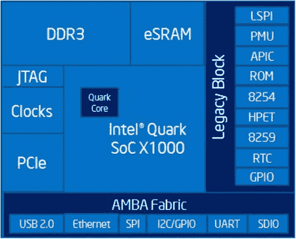

[图 1-3](#_Fig3) 。英特尔 Quark SoC X1000 的外设支持

以下列表包含有关处理器的更多详细信息:

**处理器内核**

*   单 Quark CPU 内核，单线程，32 位 X86，400MHz

**处理器非核心**

*   DDR3 内存控制器高达 2GB，800 兆字节，片上 ECC
*   嵌入式 512KB RAM 和 16KB 高速缓存
*   支持传统模块:PC 兼容:IO 端口、PCI、ACPI 等
*   低成本 10 引脚 JTAG

**I/****O**T5】规格

*   两台 10/100MB 以太网 MAC
*   两个 USB2 主机端口(EHCI 和 OHCI)
*   两个高速 UART 控制器
*   一个用于外设的 SPI 端口
*   一个 USB2 HS 设备端口
*   一个标清/SDIO/EMMC 接口
*   一个 I2C/GPIO 控制器
*   16 个带可编程中断的 gpio(edge)

**软件支持**

*   奔腾 ISA 兼容(. 586 操作码)
*   标准 ICC/GCC/G++编译器
*   基于分布的 Yocto 项目
*   开源 UEFI EDK II
*   GRUB 引导加载程序支持
*   开放 OCD 调试支持
*   符合 PCIe、USB 和 ACPI 标准
*   运行 Linux 内核 3.8 以上版本

**热气流**

*   外部温度范围从-40 到 85 摄氏度
*   内部可编程热传感器

**安全**

*   支持安全引导技术
*   监控模式执行/保护
*   UEFI 固件的安全恢复
*   使用 WR IDP 2.0 安全远程升级

接下来的章节将更详细地探讨英特尔 Galileo 主板。

英特尔Galileo系统简介

英特尔 Galileo 是第一代产品，因此存在一些局限性，本节将对此进行讨论。

英特尔 Galileo 的全套文档——包括主板用户指南、IO 映射、发行说明和 BSP 指南——可在`https://communities.intel.com/community/makers/galileo/documentation/galileodocuments`找到。

本节的目的不是重复本链接上的文档中的信息，而是更详细地解释开始项目时您需要知道的最重要的事项。

如果本章没有提供某些信息，我们鼓励您通过此链接搜索您需要的信息。如果此链接没有提供您需要的内容，您可以通过`https://communities.intel.com/community/makers`联系英特尔制造商社区。

看一下板顶上的元件，如图[图 1-4](#Fig4) 和[表 1-3](#Tab3) 所示。

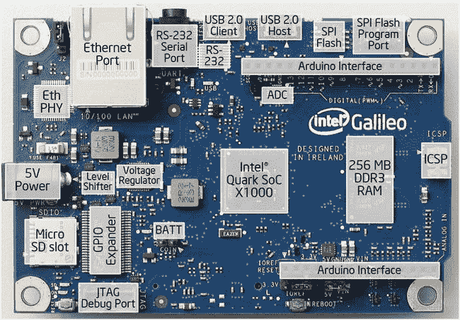

[图 1-4](#_Fig4) 。英特尔Galileo俯视图

[表 1-3](#_Tab3) 。主要组件的描述

| 

数字

 | 

成分

 | 

描述

 |
| --- | --- | --- |
| one | 以太网端口 | 10/100 以太网连接器 |
| Two | RS-232 串行端口 | 3 针 3.5 毫米插孔(这不是音频) |
| three | RS-232 | RS-232 收发器 |
| four | USB 2.0 客户端 | USB 客户端连接器:完全兼容的 USB 2.0 设备控制器；通常用于编程 |
| five | USB 2.0 主机 | USB 2.0 主机连接器；支持多达 128 个 USB 端点设备 |
| six | SPI 闪存 | 8MB 传统 SPI 闪存，用于存储固件(或引导加载程序)和最新草图 |
| seven | SPI Flash 程序端口 | 用于串行外设接口(SPI)编程的 7 引脚接头默认为 4MHz，支持 Arduino Uno 屏蔽；可编程最高 25MHz |
| eight | Arduino headers | 阅读标题为“英特尔 Galileo 上的 Arduino 接口”的章节 |
| nine | 物理输出核心 | 模数转换器 |
| Ten | 英特尔 Quark SoC X1000 | 请参阅“英特尔 Quark SoC X1000 处理器”一节 |
| Eleven | 线串行编程 | 6 针在线串行编程(ICSP)接头，位置适合插入现有屏蔽层。这些引脚支持使用 SPI 库的 SPI 通信 |
| Twelve | 256MB DDR3 RAM | 256MB DRAM，默认由固件启用 |
| Thirteen | Arduino headers | 阅读标题为“英特尔 Galileo 上的 Arduino 接口”的章节 |
| Fourteen | JTAG 调试端口 | 用于调试的 10 针标准 JTAG 接头 |
| Fifteen | GPIO 扩展器 | 由单个 I2C I/O 扩展器提供的 GPIO 脉宽调制 |
| Sixteen | 微型 SD 插槽 | 支持高达 32GB 的 micro-SD 卡 |
| Seventeen | 5V DC 电源 | 该板通过交流到 DC 适配器供电，通过将 2.1 毫米中心正极插头插入板的电源插孔进行连接。电源适配器的推荐输出额定值为 5V，最高 3A |
| Eighteen | 稳压器 | 产生 3.3 伏电源。屏蔽层的最大电流为 800 毫安 |
| Nineteen | Eth PHY(哲学名) | 以太网物理层收发器 |
| Twenty | 棉絮 | 用于保持内部实时时钟(RTC)的 3.3V 电池端子；不要通过这些端子给设备供电 |

板的后视图如[图 1-5](#Fig5) 所示。

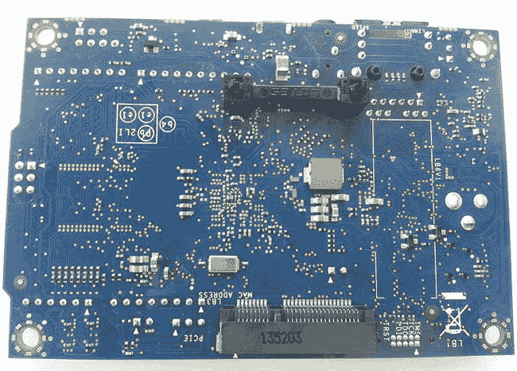

[图 1-5](#_Fig5) 。英特尔 Galileo 仰视图

从[图 1-5](#Fig5) 中，您可以找到允许英特尔Galileo与全尺寸或半尺寸迷你 PCIe 卡配合工作的迷你 PCIe 连接器。如果你有一个半尺寸的迷你 PCIe 卡，你需要一个适配器支架，价格大约为 3 美元，如标题为“设置 WiFi 迷你 PCI-E 卡”一节的第 5 章中的[所示](05.html)

板的尺寸是 4.2 英寸长和 2.8 英寸宽。

英特尔 Galileo 上的 Arduino 接头

英特尔 Galileo 是第一款采用 Arduino 接口的主板，该接口与 Arduino Uno 修订版 Arduino Interface)兼容。在[图 1-4](#Fig4) 中可以看到。Arduino 参考 API 上有一些软件功能，用于操作数字输入和输出端口、生成脉宽调制(PWM)信号、读取和写入模拟值、与 I2C 设备通信以及建立串行接口。提供所有这些功能的细节不属于第一章的范围。[第 3 章](03.html)提供了一个介绍，但请记住，单个引脚可以被编程为承担不同的功能。

[第 3 章](03.html)还包含了关于[图 3-10](03.html#Fig10) 和 [3-11](03.html#Fig11) 中气泡 8 和 13 所代表的引脚的更多细节，包括如何使用这些引脚的基本功能，如`pinMode()`、`digitalWrite()`、`digitalRead()`、`analogRead(),`和`analogWrite()`。

14 个数字输入/输出引脚(IO2 至 IO13、TX 和 RX)

Galileo 上的 14 个数字引脚都可以用作输入或输出。这些引脚在 3.3V 或 5V DC 下工作。每个引脚可以提供最大 10mA 的源电流或最大 25mA 的吸电流，并具有一个 5.6 至 10 KOhms 的内部上拉电阻(默认断开)。

六个数字引脚可用作 PWM 输出；它们标有波浪符号(~)。具有此功能的引脚有 3、5、6、9、10 和 11。

0 和 1 引脚可以针对 UART 接口进行编程，例如 RX 和 TX。用作 UART 时，串行速度是可编程的。

引脚 2 和 3 也可以编程用作 UART 接口。然而，当它们被用作串行接口时，Linux 串行控制台将会丢失。

I/O 端口有速度限制。由于 Linux 内核 v3.8 上的`sysfs`实现的限制以及向 Cypress IO 扩展器发送 I2C 命令的必要性，端口中存在 2 毫秒的延迟。当您将端口设置为数字输出时，这将频率限制为最大 230Hz。然而，考虑到引脚接头 2 和 3 直接连接到 SoC，有可能达到 477KHz 至 2.93MHz，如标题为“如何使英特尔Galileo I/O 更快”一节中的第 4 章所述

由 SCL 和 SDA 引脚控制的 I2C 总线

I2C 或双线接口(TWI)可由 A4 或 SDA 引脚和 A5 或 SCL 引脚控制。在 Arduino 环境中，I2C 可以使用[第 4 章](04.html)中演示的`wire`库轻松编程。

关于 I2C 的一个重要观察结果是，英特尔 Galileo 仅作为主设备运行，内部 I2C 扩展器(Cypress IC)仅以标准速度(100KHz)运行。

AREF 未被使用

ad 729 A/D 用作模拟端口的内部基准电压。因此，不支持模拟输入的外部基准电压，并且无法使用 AREF 引脚和`analogReference()`功能改变模拟输入范围的上限。

模拟输入引脚(A0-A5)

6 个模拟端口 A0 到 A5 的分辨率为 12 位，一直计数到 4096。默认情况下，模拟端口的测量范围为 0V(接地)至 5V。

电源引脚

此项目符号列表按照与标题相同的顺序从右至左描述了引脚:

*   **IOREF:** 市面上有些屏蔽是用 3.3V 或者 5V 工作的。为了给英特尔 Galileo 选择合适的工作电压，请务必使用标签为 IOREF 的跳线。请注意，左边的跳线选择 3.3V，而右边的操作仍然设置为 5V。
*   **复位按钮/引脚:**引脚或复位按钮都用于复位 Arduino 草图，而不是板。
*   **3.3V 输出引脚:**提供由板载调节器产生的 3.3V 电压，最大漏电流为 800mA。
*   **5V 输出引脚:**该引脚从 5V 电源或 USB 接口输出 5V。但是，最好保持电源连接。屏蔽层的最大电流为 800 毫安。
*   **GND (2 针):**仅接地针。
*   **VIN:** 您可以通过此引脚提供电压，而不是使用外部稳压 5V 电源。然而，如果使用此引脚，电源也必须调节到 5V。否则，可能会损坏电路板。

输出中的吸电流和源电流

当引脚设置为输出时，电路可以提供电流(源电流)或接收电流(吸电流)，这取决于连接到端口的设备或电路。

一些开发人员将源电流称为“正”电流，将吸电流称为“负”电流。

英特尔 Galileo 可用作源或汇，但在用作输出时，必须注意端口的限制。

每个引脚可以提供 10mA 的源电流或 25mA 的吸电流。组合引脚可以有 40mA 作为源，直到 200mA，但一切都取决于它们如何组合。

[表 1-4](#Tab4) 解释了在不同组合中用作源和汇时的限制。

[表 1-4](#_Tab4) 。作为输出的源电流和吸电流限值

<colgroup><col width="50%"> <col width="25%"> <col width="25%"></colgroup> 
| 

结合

 | 

来源(mA)

 | 

吸收电流(毫安)

 |
| --- | --- | --- |
| 每个引脚 | Ten | Twenty-five |
| 数字引脚 3、5、9、10、12 和 13 | Forty | One hundred |
| 数字引脚 0、1、2、4、5、6、7、8、11 和模拟引脚 A0 至 A5 | Forty | One hundred |
| 数字引脚 0 至 13 和模拟引脚 A0 至 A5 | Eighty | Two hundred |

英特尔 Galileo 上的跳线和按钮

电路板基本上包含三个跳线——IOREF、I2C 和 VIN——如图[图 1-6](#Fig6) 所示。

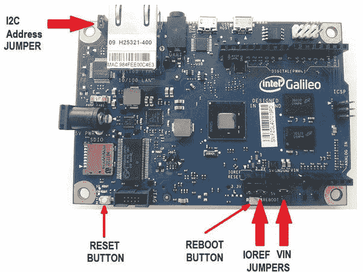

[图 1-6](#_Fig6) 。 英特尔 Galileo 上跳线的位置和按钮

以下部分总结了每个跳线的功能。

IOREF 跳线

当您的项目使用 3.3V 或 5V 的屏蔽时，需要更改此跳线。因此，如果你的屏蔽工作在 5V，你应该连接在 5V 跳线；否则，如果屏蔽在 3.3V 下工作，跳线必须设置为 3.3V。

需要注意的是，IOREF 跳线不会影响模拟输入端口的基准电压。无论跳线如何设置，它们都保持设置为 0V(接地)至 5V。

VIN 跳线

如果您保留 VIN 跳线，英特尔 Galileo 将从连接到电源插孔的 5V 稳压电源获得电力。然而，有时有些屏蔽需要电源提供 5V 以上的电压。在这些情况下，有必要移除 VIN 跳线，并将外部调节电压施加于 VIN 接头。

请注意，必须调节外部电源，并且必须移除 VIN 跳线，以免损坏您的电路板。

I2C 地址跳线

考虑到可以将外部 I2C 从设备作为设备连接到英特尔 Galileo，引入了 I2C 地址跳线，以避免这些外部设备和内部 I2C 设备(EEPROM 和 Cypress GPIO 扩展器)之间的地址冲突。

如果将 J2 连接到标有白色小三角的引脚 1，GPIO 扩展器地址将是 0100001，7 位 EEPROM 地址将是 1010001。如果改变跳线位置，GPIO 扩展器地址将是 0100000，EEPROM 地址将是 1010000。

复原按钮

这个按钮重置的是当前运行的草图，而不是 Linux 本身。您可以手动终止草图流程并再次执行。

重启按钮

这个按钮重启整个系统，包括 Linux。

连接图和示意图

要了解所有组件是如何连接的，请仔细查看[图 1-7](#Fig7) 。

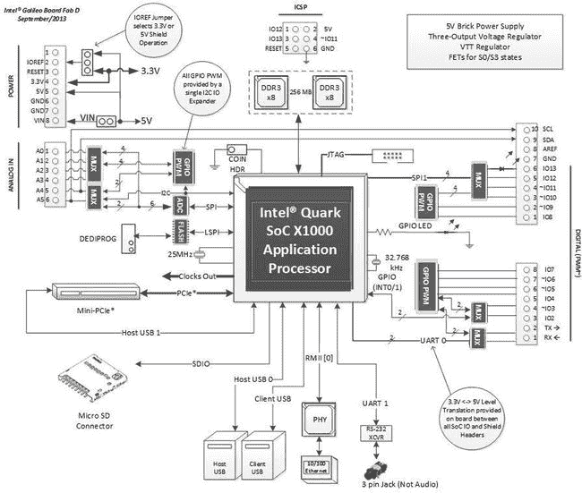

[图 1-7](#_Fig7) 。英特尔Galileo框图

图 1-7 中[的解释在此详述:](#Fig7)

*   虽然英特尔 Galileo 提供了一个 3 针 3.5 毫米插孔，但这不是用于音频的，事实上乍一看会引起混淆，因为这个插孔实际上是用于串行调试的，由此可以打开 Linux 外壳。在本章的后面，您将学习如何构建自己的电缆并访问 Linux shell。
*   所有支持 PWM 的引脚在其标签前都有一个波浪号(~)。例如，引脚 IO3 的名称前面有一个波浪号，这意味着它支持 PWM。
*   使用图中所示的多路复用器(MUX)是因为引脚可能承担不同的功能。例如，引脚 IO11 可以用作数字输入或输出，或者用来产生 PWM。MUX 将此引脚的连接更改为负责每项功能的适当电路模块。
*   查看图 1-7 中的接头，注意 IO2 和 IO3 是唯一直接连接到英特尔 Quark 的引脚。所有其他 IO 引脚都连接到 Cypress GPIO 扩展器。这意味着引脚 IO2 和 IO3 速度更快，并且直接由 SoC 管理。其他 IO 引脚需要通过发送到 Cypress GPIO 扩展器的 I2C 命令来管理，这意味着它们需要更多时间并降低性能。只有引脚 IO2 和 IO3 是可中断的(分别为 INT 0 和 1)。
*   有两个微型 USB 连接器作为客户端和主机接口，一个 10 引脚 JTAG 连接器，一个迷你 PCIe 插槽，两个各 256MB 的 DDR3 内存芯片，以及一个直接连接到英特尔 Quark SoC 的 SPI 接口。
*   SD 卡插槽使用连接到英特尔 Quark 的 SDIO 总线，支持 32GB 以下的 SD 卡。
*   一个接口允许您使用名为 SF100 DediProg 的工具通过 SPI Flash 协议更新固件。在第二章中有解释。
*   虽然英特尔 Quark 支持两个以太网接口，但只有一个暴露在 RJ45 以太网连接器中。
*   模拟接头连接到使用高速 SPI 接口的 ADC。
*   还支持 ICSP(在线串行编程)接口。

您可以在`schematics`文件夹中找到英特尔 Galileo 的原理图；文件被命名为`Galileo Schematic.pdf` **。**你可以从`https://communities.intel.com/docs/DOC-21822`下载。

从原理图中，您可以查看图 1-7 中[所示的框图。您还可以检查许多其他细节，如用于转换接头电压电平的双向 TXS0108E 电压电平转换器，如图 1-8](#Fig7) 中的[所示。](#Fig8)

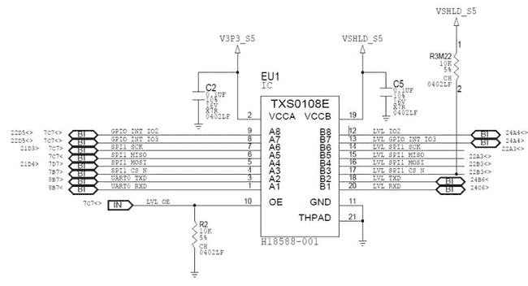

[图 1-8](#_Fig8) 。双向 TXS0108E 电压电平转换器

如果您打算将电路板仅用于连接外部屏蔽和其它外设，则无需担心这些原理图中的细节。这里解释的框图和细节涵盖了您的需求。

英特尔Galileo GPIO 映射

英特尔 Galileo 的 GPIO 映射可在[附录 A](13.html) 中找到。

介绍英特尔 Galileo Gen 2

英特尔 Galileo Gen 2 的出现是因为开发团队发现了一些问题，并收到了论坛参与者的反馈。这就是您参与该社区对英特尔极其重要的原因。您可以在`https://communities.intel.com/community/makers` *访问英特尔创客论坛。*

您可以在`https://communities.intel.com/community/makers/galileo/documentation/intel-galileo-gen-2-development-board-documents`访问英特尔 Galileo Gen 2 的全套文档，包括主板用户指南、IO 映射、发行说明和 BSP 指南。

正如“英特尔 Galileo”一节中所讨论的，本节的目的不是复制此链接上的文档中的信息，而是更详细地解释您在开始项目时需要了解的最重要的事项。

英特尔 Quark X1000 SoC 作为内存容量保留在英特尔 Galileo Gen 2 上。它还具有相同的时钟频率、相同的模拟和电源接头(数字接头略有改进，允许 UART1 重定向至引脚 IO2 和 IO3)，以及相同的 I2C 和 SPI 速度。下一节将详细讨论新的变化和改进。

在 Arduino 接口方面，英特尔 Galileo Gen 2 提供了相同的接口，并进行了重大改进，例如 PWM。[图 1-9](#Fig9) 显示了其主要部件。

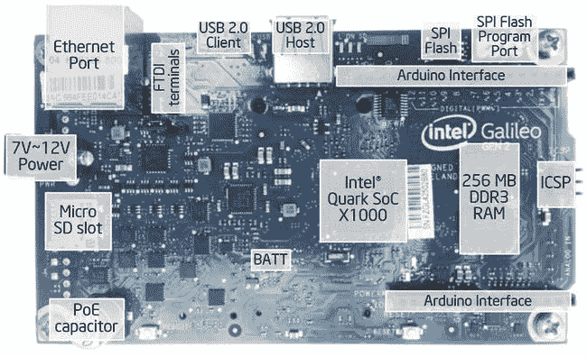

[图 1-9](#_Fig9) 。英特尔 Galileo Gen 2 俯视图

英特尔 Galileo Gen 2 的新特性

与第一代相比，英特尔 Galileo Gen 2 有一些重大改进。一些组件也被移除。请考虑以下几点:

*   Cypress GPIO 扩展器被移除，代之以 PCA 9535，以产生精确的 12 位 PWM。它不像英特尔 Galileo 那样起伏不定。因此，当您使用伺服 API 创建草图时，您可以以 1 度的精度移动伺服。
*   随着 Cypress GPIO 扩展器的移除，I2C 地址跳线也被移除。考虑到大多数基于 I2C 总线的屏蔽允许开发者改变他们的地址，唯一可能的冲突是与 EEPROM 的冲突，EEPROM 仍然使用地址 0100001。
*   几乎所有的 IO 头都直接连接到 Quark SoC，这意味着引脚可以达到 2.97 MHz。[第 4 章](04.html)讨论了新的架构及其所有可能的频率。有了这个新的端口速度，就有可能运行旧版本无法运行的屏蔽和传感器。
*   该主板支持以太网供电(PoE)模块，该模块不包含在主板中。这在第 10 章中有解释。
*   客户端 USB 连接器仍然是微型 USB 连接器，但主机 USB 已更改为 USB-OTG 连接器。
*   电源调节器现在支持 7-15V DC 之间的电压。
*   除了 IO0 和 IO1 引脚可以分别作为 RX 和 TX 用于串行通信之外，IO2 和 IO3 引脚也可以分别作为 RX 和 TX 进行串行通信。使用 IO2 和 IO3 的问题是 Linux 控制台丢失了。
*   负责将 RS-232 电平转换为英特尔 Quark SoC 的 MAX 3232 也被移除。现在有必要使用与 TTL-232 3.3 V 兼容的 FTDI 电缆
*   再也没有 VIN 跳线了。VIN 直接连接到 DC 插孔，如图 1-10 中的[所示。您可以在一节中讨论的原理图中检查这一点。](#Fig10)


[图 1-10](#_Fig10) 。VIN 直接连接到电源插孔 DC

*   与英特尔 Galileo 相比，该主板通常稍大一些。它长 4.87 英寸，宽 2.83 英寸。它更大的原因是因为英特尔 Quark SoC 上的一些内部电压调节器不再使用，而其他外部电压调节器是为了保持英特尔 Quark SoC 更冷而添加的。

[图 1-11](#Fig11) 显示了英特尔 Galileo Gen 2 的新外形和一些组件的新位置。请注意，按钮已经移动，IOREF 跳线处于完全不同的位置。还要注意新的 OTG-USB 连接器、 FTDI 端子和支持 PoE 模块的 47uF 电容器的存在。

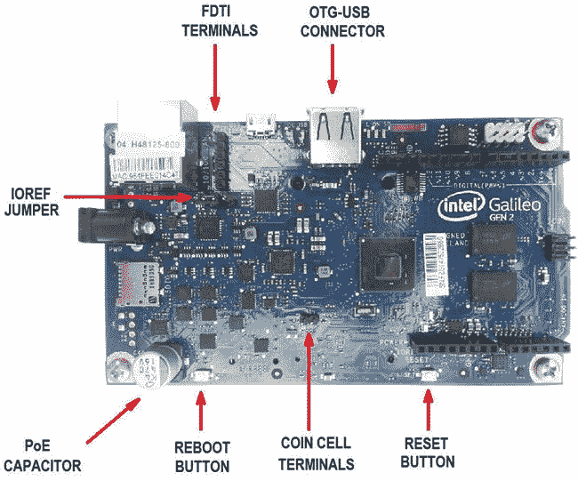

[图 1-11](#_Fig11) 。英特尔 Galileo Gen 2 的俯视图

英特尔 Galileo Gen 2 保留了底部的迷你 PCIe 连接器，如图[图 1-12](#Fig12) 所示，但 10 针 JTAG 连接器也从主板的顶部移到了底部。

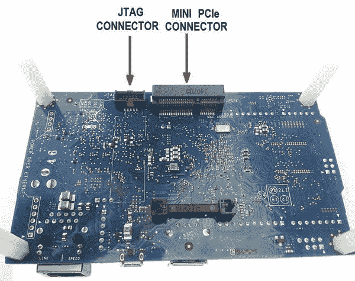

[图 1-12](#_Fig12) 。英特尔 Galileo Gen 2 的仰视图

英特尔 Galileo Gen 2 上的 Arduino 接头

英特尔 Galileo Gen 2 包含与本章“英特尔 Galileo 上的 Arduino 接口”一节所述相同的接口，除了包含 IO2 和 IO3，如前一节所述。

英特尔 Galileo Gen 2 上的跳线和按钮

英特尔 Galileo Gen 2 仍然包含复位和重启按钮以及 IOREF 跳线，其功能与“英特尔 Galileo 上的跳线和按钮”一节中所述的相同

与第一代英特尔 Galileo 相比，按钮的位置发生了变化。

如“英特尔 Galileo Gen 2 的新特性”一节所述，I2C 地址和 VIN 跳线已被移除

连接图和示意图

要了解所有组件是如何连接的，请仔细查看[图 1-13](#Fig13) 。


[图 1-13](#_Fig13) 。英特尔 Galileo Gen 2 框图

当你看[图 1-13](#Fig13) 时，考虑这些问题:

*   英特尔 Galileo Gen 2 提供了一个具有 6 个引脚的终端，专用于 3.3v TTL 级别的 FTDI 电缆连接。该终端提供了对 Linux 控制台的访问。它取代了英特尔 Galileo 上以前的串行音频插孔。
*   像第一个 Intel Galileo 一样，所有支持 PWM 的管脚在它们的标签前面都有一个波浪号(~)。例如，引脚 IO3 的名称前面有一个波浪号，这意味着它支持 PWM。
*   使用图中所示的多路复用器(MUX)是因为这些引脚可能承担不同的功能。例如，引脚 IO11 可用作数字输入或输出，或用于产生 PWM，因此多路复用器会改变该引脚与负责各项功能的适当电路模块的连接。
*   与第一代英特尔 Galileo 相比，IO 头完全不同。现在，大多数 IO 引脚都直接连接到英特尔 Quark SoC，只有 IO7 和 IO8 例外，它们连接到 PCA GPIO 扩展器。因此，除了引脚 IO7 和 IO8 之外，所有引脚都可以实现 2.97MHz，引脚 IO7 和 IO8 将实现 1.8KHz 的最大值(更多详细信息，参见第 4 章[)。请注意，引脚 IO2 和 IO3 是唯一可中断的引脚(分别为 INT 0 和 1)。IO7 和 IO8 连接到 GPIO 扩展器的另一个原因是，在英特尔 Quark 上的 14 个 IO 引脚中，它们用于重置迷你 PCIe。](04.html)
*   请注意，引脚 IO2 和 IO3 现在也可以用作串行控制台，IO2 用作 RX，IO3 用作 TX。如果这些引脚被用作串行，Linux 控制台通过 FTDI 电缆丢失。阅读[第 4 章](04.html)了解更多详情。
*   VIN 和 I2C 地址跳线不再存在。

自第一代英特尔 Galileo 以来，许多其他元素都没有改变，例如:

*   有两个微型 USB 连接器作为客户端和主机接口——一个 10 针 JTAG 连接器、一个迷你 PCIe 插槽、两个各 256MB 的 DDR3 内存芯片和一个直接连接到英特尔 Quark SoC 的 SPI 接口。
*   SD 卡插槽使用连接到英特尔 Quark 的 SDIO 总线，支持 32GB 的 SD 卡。
*   有一个接口允许您使用名为 SF100 DediProg 的工具通过 SPI flash 协议更新固件。在第二章中有解释。
*   虽然英特尔 Quark 支持两个以太网接口，但只有一个暴露在 RJ45 以太网连接器中。
*   模拟接头连接到使用高速 SPI 接口的 ADC。
*   还支持 ICSP(在线串行编程)接口。

您可以在`schematics`文件夹中找到英特尔 Galileo Gen 2 的原理图，文件为`Galileo_Gen2_Schematic.pdf`。你也可以从`https://communities.intel.com/docs/DOC-22895`下载。

英特尔Galileo第二代 GPIO 映射

英特尔 Galileo 的 GPIO 映射可以在[附录 B](14.html) 中找到。

准备电缆

本书使用了两种类型的电缆:

*   **高速 USB 2.0 公转微 USB 线，通常称为 USB 数据线**:该线用于通过英特尔 Arduino IDE 下载、调试和运行草图。这条电缆是必不可少的；没有它，您将无法运行本书中的任何项目。您可以在英特尔 Galileo 和英特尔 Galileo Gen 2 上使用相同的电缆。[图 1-14](#Fig14) 显示了该电缆。费用从 3 美元到 6 美元不等，取决于您订购的电缆的质量。
*   **如果您有英特尔 Galileo Gen 2，则使用 3.3V FTDI 电缆；如果您有第一代英特尔 Galileo，则使用带立体声插孔的串行电缆**:如上所述，英特尔 Galileo 和英特尔 Galileo Gen 2 在正式版本中运行嵌入式 Linux 3.8。您需要访问 Linux 控制台进行内核调试、安装本地应用程序、编写 Python 程序等等。这本书的一些章节使用了这种电缆，所以建议你拥有它。本章中题为“英特尔 Galileo 的串行电缆”和“英特尔 Galileo Gen 2 的串行电缆”的章节讨论了这些电缆的详细信息。

Arduino 串行控制台、Arduino 串行和 Arduino 调试终端之间有些混淆。所有这些术语都是社区中常用的，指的是 Arduino IDE 提供的调试终端。换句话说，这是前面提到的第一条高速 USB 2.0 A 公转微 USB 线。

下一节将解释当您的连接有多根电缆时，为了访问 Linux 控制台，您将需要哪些串行电缆。

英特尔 Galileo 的串行电缆

本节与 Linux 控制台相关。换句话说，它假设您可以访问 Linux 终端，并且可以直接在您的主板上运行常规的 Linux 命令。在这种情况下，您将使用带有音频插孔适配器的串行电缆。

本节还说明了如何使用串行电缆。通过 SSH 使用 WiFi 和以太网进行访问在[第 5 章](05.html)中进行了说明。

如果你的电脑包含一个 RS-232 端口，你只需要一根连接到 3.5 毫米插孔的串行电缆 DB9 插头，价格约为 4 美元。如果你的电脑只支持 USB，你需要第二个带有 RS-232 插头的 USB 电缆转换器，价格约为 9 美元。

[表 1-5](#Tab5) 列出了电缆和推荐的零件号。

[表 1-5](#_Tab5) 。用于英特尔 Galileo 上串行调试的电缆

| 

数字

 | 

描述

 |
| --- | --- |
| one | 带 DB9 插头的电缆连接到 3.5 毫米插孔 |
| one | 电缆转换器 RS-232 母连接器到微型 USB 2.0(仅当您的计算机没有 RS-232 连接器时) |

带立体声 3.5 毫米插孔的 DB9 公接头如图[图 1-14](#Fig14) 所示，RS-232 母接头转 micro USB 2.0 转换器如图[图 1-15](#Fig15) 所示。

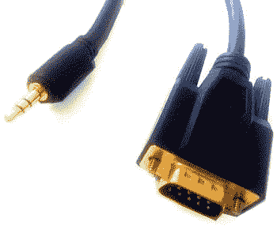

[图 1-14](#_Fig14) 。带 DB9 插头的电缆连接到 3.5 毫米插孔


[图 1-15](#_Fig15) 。电缆转换器 RS-232 母连接器至微型 USB 2.0

如果您的电脑没有 RS-232 端口，您也可以使用单电缆转换器，将 3.5 毫米立体声插孔连接到 micro-USB FTDI 电缆。这种电缆的成本约为 17 美元，但如果你订购一个电缆转换器 RS-232 母连接器到 micro-USB 和一个简单的标准立体声音频插孔连接器(约 1.00 美元)，你可以自己制作电缆，最终成本为 10 美元。

要基于 RS-232 转 micro-USB 转换器构建您自己的电缆，请移除母 DB9 连接器，并用 3.5 毫米立体声插孔替换。按照图 1-16 所示的连接进行操作。


[图 1-16](#_Fig16) 。构建您自己的 3.5 毫米立体声串行插孔电缆的方案

注意，立体声插孔有三个触点，必须是 TX 信号的尖端连接到引脚 2，必须是 RX 信号的环连接到引脚 3，必须是地的套管连接到引脚 5。或者，考虑到与英特尔 Galileo 的串行通信不需要握手和奇偶校验控制，引脚 7 (CTS)和引脚 8 (RTS)可用作引脚 4 (DSR)至引脚 6 (DTR)。

下一步是测试您的电缆并访问 Linux 控制台。

英特尔 Galileo Gen 2 的串行电缆

如果您使用的是英特尔 Galileo Gen 2，您需要一根带 6 针连接器和 3.3V IO(串行)至 USB TTL 电平的 FTDI 电缆。

这条电缆是必要的，因为英特尔 Galileo 上的 MAX 3232 在英特尔 Galileo Gen 2 中被删除，因此没有内置电路来转换 TTL 电平。另一方面，由于取消了这个音频插孔，成本降低了。

我推荐的线缆是 SparkFun 卖的；参见`https://www.sparkfun.com/products/9717`。售价 17.95 美元。电缆如[图 1-17](#Fig17) 所示。

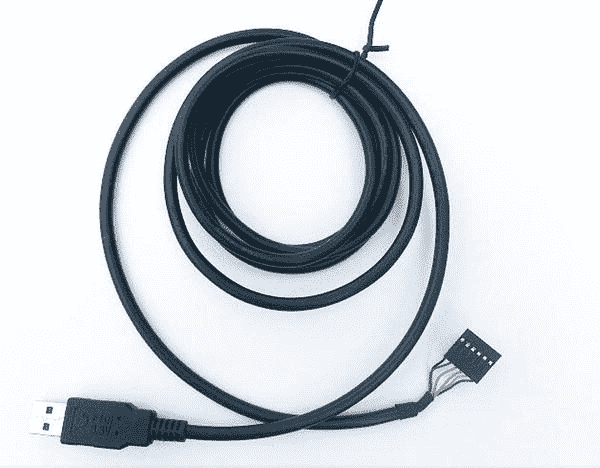

[图 1-17](#_Fig17) 。FTDI 电缆 6 针连接器 TTL 3.3V IO 电平至 USB

下一步是测试电缆。

测试串行电缆

本节介绍如何测试串行电缆(如果您使用的是英特尔 Galileo)或如何测试 FTDI 电缆(如果您使用的是英特尔 Galileo Gen 2)。

要在电缆的帮助下运行 Linux 控制台，您需要在计算机上安装软件，以便能够使用您的主板打开串行通道。你需要的软件取决于你的操作系统和你自己的喜好。

以下步骤中提到的软件程序仅供参考。他们是最受欢迎的。本节探讨了用于 Windows 的 putty、用于 Linux 的 minicom 和用于 Mac OSX 的 screen。请注意，screen 在 Linux 上也可用，minicom 在 Mac OSX 上也可用。

如果您使用的是英特尔 Galileo，您只需将 3.5 毫米插孔连接到主板上的插孔连接器，如[图 1-18](#Fig18) 所示，然后将 USB 或 RS-232 连接到您的计算机。

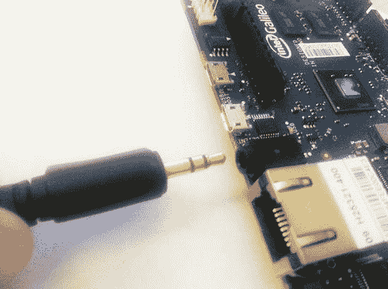

[图 1-18](#_Fig18) 。将 3.5 毫米串行插孔电缆连接到英特尔 Galileo

如果您的主板是英特尔 Galileo Gen 2，请确保直插式连接器将引脚 1(通常为黑色)连接到主板上 FTDI 连接器的引脚 1。这由图 1-19 中[所示的白色小三角形表示。你将把电缆的另一端连接到你的电脑上。](#Fig19)

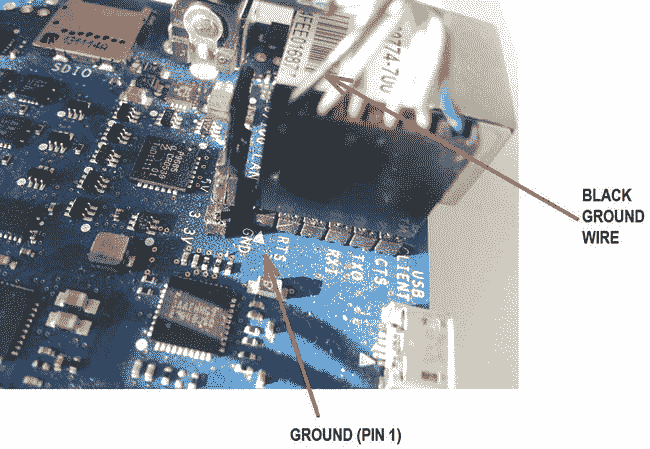

[图 1-19](#_Fig19) 。将 FTDI 电缆连接到英特尔 Galileo Gen 2

Windows 操作系统

以下步骤说明了如何在 Windows 上设置 Linux 控制台:

1.  插入线缆后，等待几秒钟，以便枚举 USB。然后通过选择开始控制面板硬件和声音设备管理器打开 Windows 设备管理器。也可以同时按下 Windows 键和“R”，然后键入`devmgmt.msc`。
2.  In the Device Manager, check the COM port available under the Ports section. [Figure 1-20](#Fig20) shows an example of a COM port enumerated as COM5.

    

    [图 1-20](#_Fig20) 。Windows 上的英特尔 Galileo COM 端口

3.  下载 putty 并将其安装在您的 Windows 机器上。可以从`http://www.chiark.greenend.org.uk/~sgtatham/putty/download.html` *下载。*
4.  Execute putty. Select the Serial protocol and enter the COM port number. Then click the Open button, as shown in [Figure 1-21](#Fig21).

    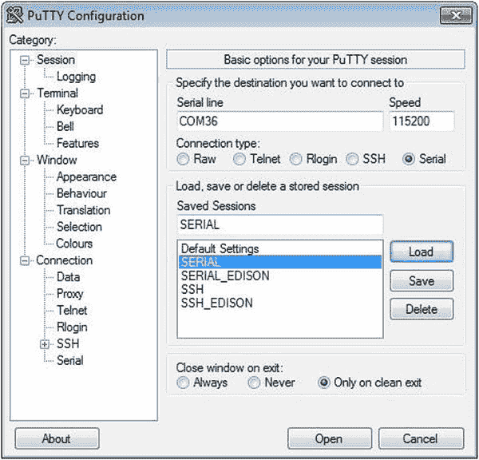

    [图 1-21](#_Fig21) 。配置 putty 以打开 Linux 控制台

5.  最后，要访问 Linux 控制台，输入用户名`root`并按 Enter 键。然后你将可以访问 Linux 控制台，如图 1-22 所示。


[图 1-22](#_Fig22) 。Linux 串行控制台

Ubuntu Linux

在 Linux 计算机上设置英特尔 Galileo Linux 控制台的过程非常简单。如上所述，Linux 计算机上的串行通信是基于`minicom`软件的。

要使 Linux 控制台工作，必须执行以下步骤:

1.  插入电缆后，等待几秒钟，USB 将被枚举。
2.  打开一个 Linux 终端。您可以按 Ctrl+T 来完成此操作。
3.  Check the port by typing the command `dmesg|grep tty`. For example, [Figure 1-23](#Fig23) shows the port enumerated as `ttyUSB0`.

    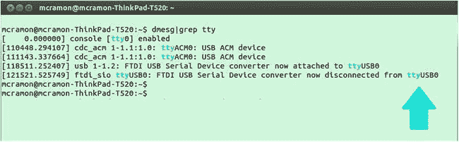

    [图 1-23](#_Fig23) 。检查 Ubuntu 终端上枚举的 USB 端口

4.  最后，要访问 Linux 控制台，您需要键入`sudo minicom --device /dev/ttyUSB0`命令。终端将会打开。你需要使用用户名`root`。

mac os x

以下步骤描述了如何在 Mac OSX 上设置 Linux 控制台。

1.  插入电缆后，等待几秒钟，以便枚举 USB。
2.  打开一个 OSX 终端。您可以同时按 z 和空格键来打开聚光灯文本框。然后键入`terminal`并按回车键。
3.  在终端中，检查如下命令列举的串口是什么:

    ```sh
    ~$ ls /dev/tty.usb*
    /dev/tty.usbserial-A603HVUT
    ```

4.  最后，您可以通过在终端中键入`screen /dev/<YOUR SERIAL HERE> 115200`来访问 Linux 控制台。例如

    ```sh
    ~$ screen /dev/tty.usbserial-A603HVUT 115200
    ```

5.  控制台将会打开。你需要使用用户名`root`。

探索 Linux 控制台

尝试运行一些 Linux 命令。要检查您拥有哪个板，您可以运行以下命令:

```sh
root@clanton:~# cd /sys/firmware/board_data/
root@clanton:/sys/firmware/board_data# cat flash_version
0x01000300
```

正如你所看到的，当这一章被写的时候，我的板正在使用固件 1.0.3。十六进制序列按照预期解码为 01.00.03.00、01.00.03 或 1.0.3。

第二个有趣的测试是检查您的平台名称。如果您的主板是英特尔 Galileo，请运行以下命令:

```sh
root@clanton:~# cd /sys/devices/platform/Galileo
root@clanton:/sys/devices/platform/Galileo# cat modalias
platform:Galileo
```

如果您的主板是英特尔 Galileo Gen 2，则以下命令有效:

```sh
root@clanton:~# cd /sys/devices/platform/GalileoGen2/
root@clanton:/sys/devices/platform/GalileoGen2# cat modalias
platform:GalileoGen2
```

英特尔提供的版本包含 `busybox`软件实用程序。它提供了大约 300 个可以在 Linux 控制台中执行的命令。如果您键入`busybox`并按 Enter，您将能够看到支持的命令。

```sh
root@clanton:/sys/devices/platform/GalileoGen2# busybox
BusyBox v1.20.2 (2014-08-22 10:41:19 PDT) multi-call binary.
Copyright (C) 1998-2011 Erik Andersen, Rob Landley, Denys Vlasenko
and others. Licensed under GPLv2.
See source distribution for full notice.

Usage: busybox [function] [arguments]...
   or: busybox --list
   or: function [arguments]...

        BusyBox is a multi-call binary that combines many common Unix
        utilities into a single executable.  Most people will create a
        link to busybox for each function they wish to use and BusyBox
        will act like whatever it was invoked as.

Currently defined functions:
        [, [[, acpid, ar, arp, arping, ash, awk, basename, blkid, blockdev,
        bootchartd, brctl, bunzip2, bzcat, cat, chgrp, chmod, chown, chroot,
        chrt, clear, cmp, cp, cpio, cttyhack, cut, date, dc, dd, deallocvt,
        depmod, df, diff, dirname, dmesg, dnsdomainname, du, dumpkmap, echo,
        egrep, env, expr, false, fdisk, fgrep, find, findfs, flock, free, fsck,
        fsync, ftpd, ftpget, ftpput, fuser, getty, grep, gunzip, gzip, halt,
        hd, head, hexdump, hostname, hwclock, id, ifconfig, ifdown, ifup,
        insmod, ionice, iostat, ip, kill, killall, klogd, less, ln, loadkmap,
        logger, login, logname, logread, losetup, ls, lsmod, lsof, lspci,
        lsusb, md5sum, mdev, mkdir, mkfifo, mknod, mktemp, modprobe, more,
        mount, mv, nc, netstat, nice, nohup, nslookup, od, patch, pidof, ping,
        ping6, pivot_root, pmap, poweroff, printf, ps, pwd, rdate, readlink,
        realpath, reboot, renice, reset, resize, rm, rmdir, rmmod, route,
        run-parts, sed, seq, setconsole, setserial, setsid, sh, sleep, sort,
        start-stop-daemon, stat, strings, stty, sulogin, switch_root, sync,
        sysctl, syslogd, tail, tar, tcpsvd, tee, telnet, telnetd, test, tftp,
        time, timeout, top, touch, tr, traceroute, traceroute6, true, tty,
        udhcpc, umount, uname, uniq, unzip, uptime, usleep, vconfig, vi, watch,
        wc, wget, which, who, whoami, xargs, yes, zcat, zcip
```

如果您需要执行这些命令中的一个，您只需键入所需的命令。

测试数据线

高速 USB 2.0 公转微 USB 线，或简称数据线，用于传输和调试草图。测试该电缆在第 3 章中介绍，因为这样做需要安装 IDE。

摘要

第一章介绍了创客社区的重要性以及英特尔通过英特尔 Quark X1000 SoC 对创客社区的承诺。

还向您介绍了英特尔 Galileo 主板。您了解了硬件架构、软件特性、这些主板的优势以及它们的强大功能。

这一章与其说是实用的，不如说是描述性的，但这本书的其余部分却不是这样。好好享受！