第三章


Arduino IDE 和布线语言

本章介绍 Arduino 及其开发环境。如果您已经安装了 IDE，知道如何使用 IDE 更新固件，了解布线库，知道如何与本机 Linux 程序通信，并且您的开发环境没有任何问题，则本章不适合您，您应该转到下一章。

Arduino 提供了基于 Java 的跨平台集成开发环境(IDE ),旨在支持不同的 Arduino 板。它包含多个代码示例、一个调试串行控制台，并且是开源的。使用 IDE，你可以创建名为*草图的程序。*您可以下载到英特尔 Galileo，运行草图，并使用与 IDE 集成的串行控制台进行调试。

英特尔提供了一个专门针对 Galileo 主板的特殊 Arduino IDE 版本，包括固件更新、新 API 和现有库的定制。

本章介绍如何在 Mac、Linux 和 Windows 操作系统上安装英特尔 Galileo Arduino IDE ，涵盖 IDE 中添加的新功能，并介绍如何解决在虚拟机上运行 IDE 时出现的任何问题。

本章还讨论了 Arduino 框架如何在嵌入式 Linux 操作系统上工作，并包括一些基本示例，向从未使用过 Arduino 的人展示如何使用 Arduino 库。

您还将开发一个简单的项目，集成`POSIX`呼叫和 Python 脚本，并为收件箱中未读的 Gmail 邮件创建一个警报。

一点历史

你会经常听到“Arduino 接线语言”或“Arduino 语言”这样的术语，你可能会认为 Arduino 有一种特殊的编程语言。

事实上，使用 Arduino IDE 为 Intel Galileo 编程的语言是 C/C++，所以 Arduino 没有真正的“连接语言”。

2003 年，一个名叫赫尔南多·巴兰冈的学生写了一篇硬件论文，描述了一个 IDE 以及与由微控制器供电的电路板的集成。在其他研究的贡献下，这个概念得到了发展，允许开发人员只需编写几行代码就可以复制硬件组件的简单连接。这允许诸如打开 LED、接收来自按钮的事件、发出声音等等的交互。

因此，即使 IDE 中使用的语言是 C/C++，IDE 也可以提供支持该连接的 API，并且代码很简单，并且基于电子元件如何连接到电路。

英特尔创客社区

如果您对用于英特尔 Galileo 的 Arduino IDE 有任何疑问，或者您有想法和项目要讨论，您可以依靠英特尔在`https://communities.intel.com/community/makers`创建的创客社区。

有几个论坛讨论 Arduino 布线库和项目想法，其中最好的是`http://forum.arduino.cc/` `。`

 `参与社区是非常重要的，因为开发人员总是互相帮助来解决意想不到的问题，提供教程，并讨论伟大的项目。

为英特尔 Galileo 安装 Arduino IDE

有两个位置可以下载用于英特尔 Galileo 的 Arduino IDE:

*   The Arduino web site at `http://arduino.cc/en/main/software`.

    您需要搜索“用于英特尔 Galileo 的 Arduino IDE ”,然后单击提供的链接。您将被重定向到英特尔网站。

*   位于`https://communities.intel.com/docs/DOC-22226`的英特尔网站。

选择最适合您的链接，并将书签添加到您的浏览器中，以便您可以轻松地用后续版本更新 IDE。

您需要根据您机器上安装的操作系统下载“入门指南”和正确的 ide。英特尔提供 Windows、MacOSX 以及 32 位和 64 位 Linux 版本。安装前最好先阅读指南。

[图 3-1](#Fig1) 显示了“入门指南”的链接


[图 3-1](#_Fig1) 。“入门指南”的位置

安装通常非常简单:

*   **Windows:**T3】使用 7-zip 解压 zip 文件即可，最好解压到 C:\。打开提取的文件夹，执行`arduino.exe`文件。
*   **Linux 32/64 位:** 将压缩后的 tarball 文件解压到一个新目录下，执行`./arduino`。使用以下带有适当文件名的命令:

    ```sh
    tgz file: tar –xvzf <*filename*>.tgz
    ```

*   **MacOSX** **:** 拖拽文件到`/Applications`文件夹安装 IDE。双击`Applications`文件夹中的 Arduino 启动它。

根据您使用的操作系统，您应该检查不同的步骤，包括 gadget 驱动程序是否正确安装，以及“入门指南”中记录的其他几个细节，在此重复这些细节没有意义。

你需要知道的几件事:

*   **Windows:千万不要用 Winzip** ！你应该使用 7-zip 工具(见`http://www.7-zip.org/`)，因为用于 Quark 的交叉编译器有很长的路径名和几个子目录。Winzip 无法处理这些路径名，这将导致提取过程中出现错误。
*   **当 zip 在 Linux 中失败:**如果你是 Linux 开发者，unzip 命令无法解压软件包，你可以用命令`sudo apt-get install p7zip-` `full` 为 Ubuntu 和 Debian 发行版安装 7-zip，也可以从`http://www.7-zip.org/download.html`下载命令行工具。

 `连接英特尔 Galileo

关于将板连接到计算机，有两条重要的规则:

*   检查[图 3-2](#Fig2) (左)如果您有英特尔 Galileo 第 1 代。*始终*在客户端端口(2)的 USB 线之前连接 5V 电源(1)，以避免硬件损坏。
*   Check [Figure 3-2](#Fig2) (right) if you have a Intel Galileo Generation 2\. *Always* connect the power supply (1) before the USB cable on client port (2) to avoid hardware damages. Remember, the Intel Galileo Gen 2 power supply must be between 7V and 12V DC. You cannot use 5V DC.

    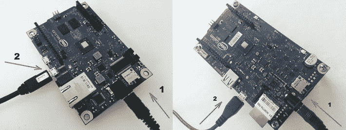

    [图 3-2](#_Fig2) 。第 1 代英特尔伽利略(左)和第 2 代英特尔伽利略(右)

*   *在传输草图或更新您的主板固件时，请始终保持电源与英特尔 Galileo 的连接。开发人员倾向于使用 USB 客户端端口，因为它可以启动电路板并运行草图，但实际上建议使用 5V 电源，以便在所有情况下保持连接，并避免硬件不稳定。*

等待大约 35 秒，小工具串行驱动程序应该可用。

安装驱动程序和 Arduino IDE

有关如何安装串行驱动程序和 Arduino IDE 的最新说明，请参考“入门指南”(`https://communities.intel.com/docs/DOC-22226`)。为了方便起见，这里还提供了这些步骤的版本。

安装 Arduino IDE

对于大多数操作系统来说，安装过程非常简单。不过，对于 Windows，有一个关于安装的小细节。

在 Windows 上安装 IDE

当您为 Windows 下载文件时，您会看到，根据您使用的 IDE 版本，扩展名是. 7z 或. zip。

不要使用 WinZip 工具，因为包含交叉编译器的工具链有长路径名的文件，WinZip 不能解压缩它们。

因此，对于 Windows 来说，最好使用名为 7-zip 的免费工具，你可以从`http://www.7-zip.org` `下载。该网站包含可供下载的安装程序。安装非常简单；只要遵循网站上的建议。然后，您只需使用 7-zip 工具提取任意目录下的 zip 文件。`

 `当前的《入门指南》(2013 年 12 月 23 日发布)说需要将文件解压到`C:\`，但这是错误的。你可以在任何地方自由安装。

在 Linux 上安装 IDE

要在 Linux 机器上安装 IDE，请按照下列步骤操作:

1.  打开您喜欢的终端外壳。如果你用的是 Ubuntu，可以按 Ctrl+Shift+T 打开一个终端外壳。
2.  In your home directory, extract the package with the appropriate command:

    ```sh
    tar -zxvf arduino-1.5.3-linux32.tar.gz
    ```

    或者

    ```sh
    tar -zxvf arduino-1.5.3-linux64.tar.gz
    ```

    分别用于 32 或 64 位。

3.  一些 Linux 发行版包括一个名为“调制解调器管理器的包，它会影响串行端口通信。您应该从您的发行版中删除此软件包。如果您使用的是 Ubuntu 或 Debian，您可以通过在终端 shell 中键入以下命令来删除这个包:

    ```sh
    sudo apt-get remove modemmanager
    ```

4.  在下载软件包的同一个目录中，通过执行以下命令启动 Arduino IDE:

    ```sh
    ./arduino
    ```

如果您执行 IDE 并且您不能选择串行端口(参见标题为“检查所选端口和板”的部分)，您没有以适当的访问权限执行程序。如果你使用 Debian 或 Ubuntu，你有两种方法来解决这个问题。您可以使用以下命令:

```sh
sudo arduino
```

或者

```sh
sudo chmod 755 /dev/ttACM[X]
```

其中`[X]`是你的机器中枚举的端口号，比如`/dev/ttyACM0`。

在 MacOS 上安装 IDE

要在 MacOS 上安装 IDE，请按照下列步骤操作:

1.  下载 Mac 硬盘上的 zip 文件并解压缩。
2.  将 Arduino 应用程序拖放到 Mac 上的`Applications`文件夹中。

安装驱动程序

英特尔 Galileo 主板仅使用名为“Galileo”的小工具串行驱动程序。

这个串行小工具驱动程序最有问题的安装过程是在 Windows 中。如果您是 Windows 用户，并且在与 IDE 上的串行接口通信时遇到问题，请阅读“Windows 上 IDE 的串行通信问题”一节

安装驱动程序的常见步骤

在开始安装驱动程序之前，请遵循“安装 Arduino IDE”一节中推荐的步骤，打开英特尔 Galileo 主板，然后按照“连接英特尔 Galileo”一节中的说明连接 USB 电缆。这是所有操作系统的第一步，也是最常见的一步。然后，您可以跳转到代表您正在使用的操作系统的部分。

在 Windows 上安装驱动程序

1.  连接电源和 USB 电缆后，等待几秒钟，然后单击开始菜单打开设备管理器。打开控制面板，然后点击系统。系统窗口打开后，打开设备管理器。
2.  Look under Ports (COM & LPT). You should see an open port named “Gadget Serial V2.4” if you using an old release like 0.7.5 or simply “Galileo” in newer releases. [Figure 3-3](#Fig3) shows the serial driver.

    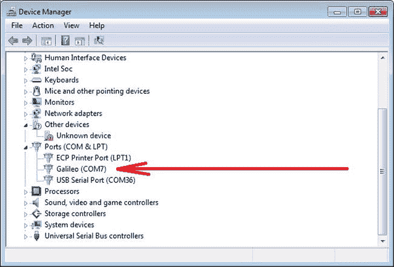

    [图 3-3](#_Fig3) 。Windows 控制面板中的 Galileo 串行驱动程序

    如果您没有看到此开放端口，请阅读“Windows 上 IDE 的串行通信问题”一节

3.  右键单击小工具串行 V2.4 端口，并选择更新驱动程序软件选项。
4.  选择“在我的电脑上浏览驱动程序软件”选项。
5.  根据您提取 IDE 的位置，导航到`hardware/arduino/x86/tools`目录。这允许安装名为`linux-cdc-acm.inf` 的正确驱动文件。
6.  驱动程序成功安装后，设备管理器将在端口(COM & LPT)下显示 Galileo (COMx)设备。记下 COMx 端口号，因为稍后在 IDE 中将会用到它。本章中的示例显示了 COM5。

在 Linux 上安装驱动程序

1.  检查 ACM 端口是否可用。如果你用的是 Ubuntu，可以按 Ctrl+Shift+T 打开一个终端外壳。然后在终端中键入以下内容:

    ```sh
    ls /dev/ttyACM*
    ```

2.  你应该能看到至少一个类似于`ttyACM0`或任何其他`ttyACM[X]`的串口，其中`[X]`代表一个整数。如果您看不到串行端口，请按照下列步骤操作:
    1.  创建一个名为/**etc/udev/rules . d/50-arduino . rules**的文件，并添加以下内容:

        ```sh
        KERNEL=="ttyACM[0-9]*", MODE="0666"
        ```

    2.  使用以下命令重新启动`udev`服务:

        ```sh
        sudo service udev restart
        ```

3.  如果您正在使用虚拟机(VM) ，您可能需要在 VM 中重新启动 Linux。

在 MacOS 上安装驱动程序

检查系统概述 USB 设置，确保选择了小工具串行。如果您正在安装 IDE 的新版本，您可能需要重新选择此设置。

了解 Arduino IDE

一旦英特尔 Galileo 连接到您的计算机，并且您已经正确设置了驱动程序，执行 IDE 以访问图 3-4 所示的窗口。[表 3-1](#Tab1) 提供了每个编号项目的描述。

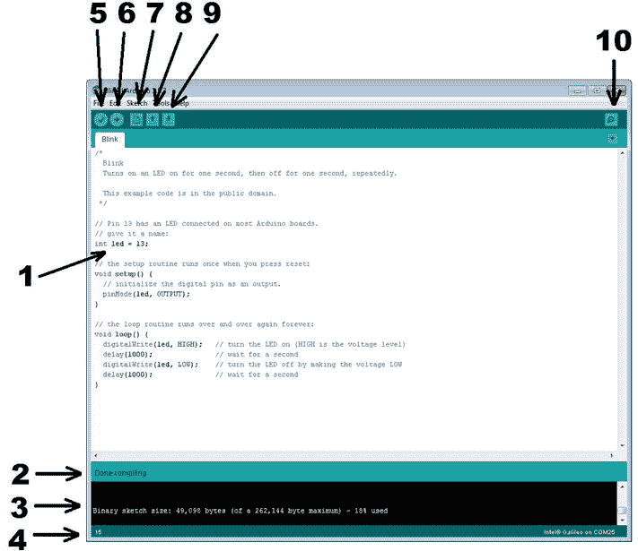

[图 3-4](#_Fig4) 。Arduino IDE 图形界面

[表 3-1](#_Tab1) 。[图 3-4](#Fig4) 中标注的描述

| 

数字

 | 

描述

 |
| --- | --- |
| one | 您开发代码的区域代码。 |
| Two | 通知栏通知您代码是否已保存以及编译是否成功。 |
| three | 包含编译细节、文件传输消息和错误消息的控制台消息。 |
| fourfivesixseveneightnineTen | 通知编辑器中光标的行号。验证图标:编译代码。传输图标:编译代码并传输到英特尔 Galileo。打开一个新草图。打开草图。保存编辑过的草图。打开串行调试控制台。 |

通过打开本章开始时讨论的示例，然后选择 File  Examples  01，稍微探索一下 IDE。基本眨眼。

检查选定的端口和板

在运行草图之前，您需要在 IDE 中检查一些东西。首先，确保您通过选择工具板选择了正确的板，如图[图 3-5](#Fig5) 所示。

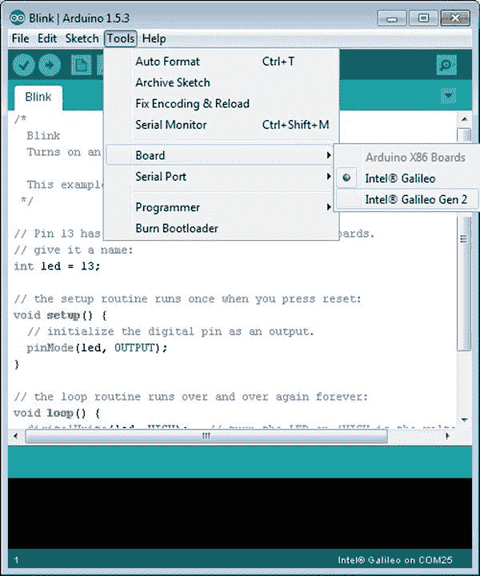

[图 3-5](#_Fig5) 。选择棋盘

请注意，端口名称因操作系统而异:

*   **Windows** :端口以 COM 前缀命名，后跟一个整数，比如`COM5`。
*   **Linux** :端口以`ttyACM`前缀命名，后跟一个整数，如`ttyACM0`。
*   **MacOS** :端口以`/dev/cu.usbmodem`前缀命名，后跟一系列数字和/或字母字符，如`/dev/cu.usbmodem0001`或`/dev/cu.usbmodemfd021`。

如果您正在安装 MacOS，不要选择以`/dev/tty`开头的端口，因为尽管这些端口在 Linux 机器上使用相同的命名法，但它们并不正确。

您还需要检查与英特尔 Galileo 通信的串行端口。选择工具串口，如图[图 3-6](#Fig6) 所示。


[图 3-6](#_Fig6) 。选择正确的串口

什么是素描？

在运行第一段代码之前，您需要了解在 Arduino 开发中经常使用的单词“sketch”的含义。当您使用 Arduino 参考 API 及其库开发代码时，您已经创建了一个草图。

为了理解草图是如何工作的，考虑一下上一节提到的眨眼的例子。

```sh
/*
  Blink
  Turns on an LED on for one second, then off for one second, repeatedly.

  This example code is in the public domain.
 */

// Pin 13 has an LED connected on most Arduino boards.
// give it a name:
int led = 13;

// the setup routine runs once when you press reset:
void setup() {
  // initialize the digital pin as an output.
  pinMode(led, OUTPUT);
}

// the loop routine runs over and over again forever:
void loop() {
  digitalWrite(led, HIGH);   // turn the LED on (HIGH is the voltage level)
  delay(1000);               // wait for a second
  digitalWrite(led, LOW);    // turn the LED off by making the voltage LOW
  delay(1000);               // wait for a second
}
```

草图由两个主要功能组成:`setup()`和`loop()`。

`setup()`功能 执行一次，该功能建立硬件的初始设置，包括引脚方向、串口速度、设备初始化等。

`loop()`函数 是循环的，这意味着它像一个无限循环一样工作。正是在这个功能上，你控制你的硬件。

如前所述，代码非常接近硬件组件的连接方式。例如，前面的代码显示:

*   有一个 LED 连接到 13 号引脚。
*   在`setup()`功能中，管脚被`pinMode()`功能配置为`OUTPUT`。
*   在`loop()`功能中，`LED`将转动`ON`一秒，然后再转动`OFF`一秒。当`digitalWrite()`功能将引脚分别设置为`HIGH`和`LOW`时，LED 打开和关闭，一秒的延迟由`delay()`功能设置，该功能接收毫秒数作为参数。

查看代码，您可以想象在引脚 13 上有一个 LED，您也可以很容易地理解代码的作用。注意，这里不涉及汇编语言，即使代码是用 C++编译的，也没有复杂的函数调用来访问 GPIO，这使得开发更加容易。

下一节讨论如何运行这个草图。

编译和运行草图

点击[图 3-4](#Fig4) 中数字 5 代表的图标，从菜单栏中选择草图验证/编译，或者按 Control+R

Arduino IDE 上“验证的概念实际上意味着编译代码。即应该报告[图 3-3](#Fig3) 中数字 2 所代表的区域`"` `Done compiling` `"`。

如果编译需要很长时间，不要担心——第一次编译总是很慢。交叉编译器在第一次编译时安装，以便为开发人员提供透明的机制。安装完成后，交叉编译器编译相关的连线 API 来生成目标文件。第一次编译后，所有后续编译都会更快。

点击[图 3-4](#Fig4) 中数字 6 代表的图标上传文件。如果传送成功，你应该在通知栏看到`"Done uploading"`消息T5，在控制台消息区看到`"Transfer complete"`消息 。在[图 3-4](#Fig4) 中，这些信息分别用数字 2 和 3 表示。

您应该会在英特尔 Galileo 上看到一个 LED 闪烁。此 LED 在内部连接到第 13 号引脚，从而证明您的系统配置正确，您已经准备好探索 IDE。如果您使用的是第一个英特尔 Galileo 版本，该 LED 靠近`BATT`端子，如图 3-7 中的[所示。](#Fig7)

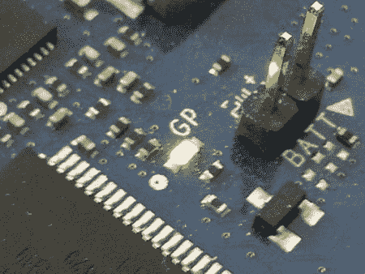

[图 3-7](#_Fig7) 。内置 LED 连接到英特尔 Galileo 上的第 13 号引脚

眨眼的例子类似于" *HELLO WORLD* ！"您在其他编程环境中看到的示例，用于测试开发环境是否正常工作。

持久化和非持久化草图

英特尔 Galileo 可以从 SPI 闪存(SPI 版本)或 SD 卡启动。您可以从下载 IDE 的同一个网页上下载这两个版本。

由于 SPI flash 部分非常小(8MB)，SPI flash 版本仅包含非常基本的功能。为了利用更高级的软件，如 Python、WiFi 功能、Node.js、OpenCV、V4L2 和其他功能，您必须使用 SD 卡版本。

SD 卡版本包含了所有这些特性，以及保存草图的能力。

如果您计划在系统重启后保留您的草图，您需要使用 SD 卡版本。否则，当英特尔 Galileo 重新启动时，草图将不会运行，因为它没有被保存。

持续的草图和长时间的开始

英特尔 Galileo 与其他 Arduino 主板不同，因为一切都由运行 Linux 的 Quark SoC 控制，而不是由简单的微控制器控制，如 Arduino Uno、Due、Nano 和其他主板中使用的 Atmel 处理器。

这些微控制器没有操作系统，但它们访问内存段并执行特定的操作码来运行程序。

因此，英特尔 Galileo 上的持久草图只有在 Linux 启动、所有模块都已加载并且用户空间准备就绪时才会执行。这个过程大约需要 50 秒。下一节解释如何调试草图。

使用串行控制台和串行通信进行调试

Arduino 参考 API 包含一个串行终端，用于打印草图中的调试信息。这将导致 Arduino 板使用 Arduino IDE 串行控制台向您的计算机传输信息。

使用名为`Serial`的静态类进行通信；但是，如果您需要与 XBee shields 等外部设备通信，您应该使用 0 和 1 引脚来连接此类设备。这种情况下的通信是由不同的对象使用相同的类方法完成的，称为`Serial1`。Arduino Uno 使用`Serial`对象来建立与 0 和 1 引脚的通信，因此如果您正在移植一些为 Arduino Uno 创建的草图代码作为串行接口，您需要将对象从`Serial`更改为`Serial1`。

有五种`Serial`对象方法用于建立通信和传递消息:`begin()`、`print()`、`println()`、`available()`和`read()`。

串行开始(int speed)

`speed`参数表示波特率。这些值通常为 300、600、1200、2400、4800、9600、14400、19200 和 115200。

如果您使用`Serial`对象调试消息，这个参数是不相关的，因为与`Serial`对象的通信总是 115200 波特。如果您将其设置为不同的速度，如 9600 波特，通信仍将是 115200。

对开发周期没有影响。这样做是因为大多数 Arduino 示例是为 Atmel 微控制器创建的，它们的草图速度默认设置为 9600 波特。为了减少代码修改，让开发人员的工作更轻松，没有必要在 IDE 提供的每个例子上都将波特率改为 115200。

但是对于像`Serial1`这样使用引脚 0 和 1 的其他对象，速度确实对通信有影响，因为这个对象是为了与外部设备通信而创建的。

请注意，必须在调用任何串行方法之前调用此方法—在传输或接收数据之前，必须调用此方法。

Serial.print(数据)

该方法通过串口传输`data`参数。`data`参数可以是字符串、整数、字符、字节、长整型或 Arduino 参考中支持的任何其他标准类型。

Serial.println(日期)

这与`Serial.print()`方法的功能相同，除了在数据消息的末尾添加了一个载体和返回。

Serial.available()

通知您接收器缓冲区中是否有任何数据。它返回一个整数，表示接收缓冲区中准备读取的字节数。

Serial.read()

从接收器缓冲区读取任何可用的数据。最好是在使用`available()`方法检查数据之后才使用这种方法。

读取的数据可能是简单的整数、单个字符、字符数组、字符串或任何序列化的对象。

下一个例子向您展示了如何使用这样的`Serial`对象以及如何调用串行控制台终端。

打印调试信息和使用串行控制台

本节概述了串行控制台上的打印信息，并将信息从 IDE 传输到英特尔 Galileo，如清单 3-1 中的[所示。](#list1)

[***清单 3-1***](#_list1) 。*serial test . ino*T8】

```sh
String inputString = "";         // a string to hold incoming data
boolean stringComplete = false;  // whether the string is complete

void setup() {
  // put your setup code here, to run once:
   Serial.begin(9600);  // does not matter for this object
   delay(3000);
}

void loop() {
  // transmitting something from Galileo to IDE
  Serial.println("Hi there!! type something and press SEND button!!! ");
  delay(1000);

  // if the developer sent something from IDE to Galileo
  while (Serial.available()) {
    // get the new byte:
    char inChar = (char)Serial.read();

    // add it to the inputString:
    inputString += inChar;

    if (inChar == '\n') {
      stringComplete = true;

    }
  }

  if (stringComplete == true) {

    Serial.print("\nCOOL!! RECEIVED YOUR MESSAGE: ");
    Serial.println(inputString);
    inputString = "";
    stringComplete=false;

  }

}
```

上传带有该草图的电路板，并访问串行控制台。

单击工具串行监视器，按 Ctrl+Shift+M，或者单击图 3-4 中突出显示的#10 图标，可以访问串行控制台。

然后你会看到类似于[图 3-8](#Fig8) 的东西。

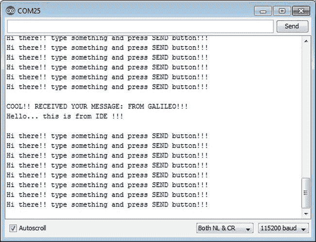

[图 3-8](#_Fig8) 。Arduino IDE 串行监视器控制台

注意右下角是通信中使用的波特率(115200)。您还可以看到正在显示的消息。在屏幕的顶部，有一个文本框，后面跟着一个发送按钮。这用于将数据从您的计算机传输到英特尔 Galileo 主板。

同样在[图 3-8](#Fig8) 中，考虑到代码正在检测换行符`"\n"`，有必要将右下角的列表框改为 NL & CR。这意味着换行符和回车符。

只需使用“发送”按钮左侧的文本框键入一些文本，然后按下此按钮或单击消息末尾的回车键。

英特尔 Galileo 将接收您输入的信息，并在串行控制台中显示出来。要理解这种“神奇”是如何发生的，请阅读下一节。

了解 serialtest.ino 代码

在`setup()`功能中，串行对象由`Serial.begin()`用 9600 波特初始化。这与之前的解释无关，因为`Serial`的通信总是 115200 波特。

同样在`setup()`中，有三秒钟的延迟，以便您有时间访问串行监视器。对于英特尔 Galileo，如果您正在创建立即打印某些东西的草图，建议您添加一个小的延迟；否则，你可能会错过一些消息(伽利略比你快)。

在`loop()`功能中，如果您不在文本框中键入任何内容并按下串行控制台中的发送按钮，则`Serial.println()`和`Serial.available()`将打印一条消息，该消息将始终返回 false。

如果你发送一个消息给棋盘，那么`Serial.available()`将返回 true。消息中的每个字符将由`Serial.read()`读取，并在变量`inputString`中累积，直到遇到换行符(`\n`)(当您按下发送按钮或回车键时，该字符会自动添加)。

如果消息在检测到换行符后完成，收到的消息将使用`Serial.available()`包含的`while`循环块中的`Serial.print()`传输回来。

由`Serial.print()`和`Serial.println()`打印的要求用户发送信息被添加到`loop()`功能的末尾。`delay()`功能启动了 1000 毫秒(1 秒)的延迟，以避免在串行控制台中运行多个消息。

Arduino 语言参考和 API

如果您从头开始阅读本章，您已经熟悉了一些参考资料，包括:

*   **结构:** `loop()`和`setup()`
*   **数字输入/输出:** `pinMode()`和`digitalWrite()`
*   **时间:** `delay()`
*   **通信:**`Serial.begin()``Serial.print()``Serial.println()``Serial.available()``Serial.read()`

这些只是 Arduino 参考 API 的一小部分。你可以在`http://arduino.cc/en/Reference/HomePage`找到完整的 Arduino 参考，如图[图 3-9](#Fig9) 所示。


[图 3-9](#_Fig9) 。Arduino 参考页

让我们把最重要最常用的功能按类别整理一下:结构，数字 I/O ，模拟 I/O ，时间。

请记住，Arduino 参考网页中有几种函数和数据类型，本章提到的函数只是最常见的几种。一整本书可以专门讨论 Arduino 参考，这不是本书的目的。

结构

每个草图都有两个强制功能— `setup()`和`loop()`。即使你的草图不需要这些函数，你至少应该在草图中保持它们为空，以避免编译。接下来将讨论这些项目。

setup()

如上所述，这个函数只被调用一次。这是草图执行期间调用的第一个函数，用于手动设置引脚以及初始化串行端口和外部设备。

loop()

这个功能之前也讨论过。当草图被执行时，这个函数像无限循环一样被调用，并且基本上负责硬件的主状态机。

数字输入输出

数字 I/O与英特尔 Galileo 接头中的 0 至 13 号引脚相关，如第 1 章的[中“英特尔 Galileo 上的 Arduino 接头”一节所述。以下功能管理数字 I/o。](01.html)

引脚模式 (int 引脚，int 模式)

该功能通常在`setup()`功能中使用，并将表示管脚号的“管脚”设置为特定的“模式”，可以是`INPUT`、`OUTPUT`或`INPUT_PULLUP`。

如果`mode`为`INPUT`，则将`pin`作为`INPUT`；例如，读取按钮的状态。

如果`mode`为`OUTPUT`，则将`pin`作为`OUTPUT`；例如，打开/关闭 LED。

注意，如果`mode`被设置为`INPUT_PULLUP`并且上拉电阻约为 20k 欧姆，这意味着如果使用下拉电阻，逻辑将被反转。如果不使用下拉电阻，如果有 5 到 3.3V，读数仍然是`1`，如果接地，读数仍然是`0`。

数字写入 (int 引脚，int 状态)

该函数根据传递的`state`参数设置`pin`状态，参数可以是`HIGH`或`LOW`。只有当`pinMode()`功能将`pin`设置为`OUTPUT`时，它才起作用。

你数码阅读 （你插针）

这将读取`pin`数字的状态，并返回`HIGH`或`LOW`(两者都是整数)。

模拟输入输出

模拟 I/O 与英特尔 Galileo 接头中的 A0 至 A5 引脚相关，如第 1 章中的名为“英特尔 Galileo 上的 Arduino 接头”一节所述。请记住，AREF 不用于英特尔 Galileo 主板，因此不支持模拟输入的外部基准电压源。

以下功能用于管理模拟 I/o。

int 类比读取 (int pin)

根据英特尔 Galileo 支持的六个模拟端口，该函数读取由`pin`指定的模拟值，该模拟值可以取值 A0 至 A5。返回值是 0 到 1023 之间的整数，分别表示 0 到 5V 的范围。英特尔 Galileo 的 ADC 最大分辨率为 12 位。[图 3-10](#Fig10) 显示了英特尔 Galileo 主板上的模拟端口。

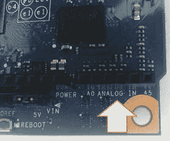

[图 3-10](#_Fig10) 。模拟端口 A0 至 A5

analogWrite (int 引脚，int 值)—PWM

此功能生成脉宽调制(PWM)来控制伺服系统，在 LEDS 上创建渐变效果，控制 DC 电机，等等。

`pin`参数指定哪个引脚必须产生占空比由`value`设置的 PWM。

英特尔 Galileo 上可设置为使用 PWN 的引脚有`3`、`5`、`6`、`9`、`10`和`11`。您也可以很容易地识别这些引脚，因为在支持 PWM 的引脚前面有一个小波浪符号(`~`)，如图 3-11 中的[所示。](#Fig11)

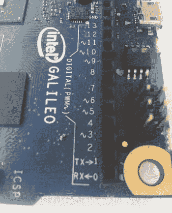

[图 3-11](#_Fig11) 。波浪号(~)标识哪些引脚支持 PWM

`value`必须是 0 到 255 之间的整数，该范围与要产生的占空比的 0%到 100%成比例。因此，如果该值为 0，则占空比为零。127 将产生占空比为 50%的 PWM，255 将产生占空比为 100%的 PWM。

这个函数不返回任何东西。

时间

以下功能使您能够将延迟插入到 sketch 中，并获得正常运行时间，即主板启动的时间。

长毫英寸()

此函数返回自英特尔 Galileo 启动以来的毫秒数。

长微秒()

此函数返回自英特尔 Galileo 启动以来的微秒数。

延迟(整数毫秒)

延迟在`milliseconds`指定的时间内暂停草图执行。

延迟微秒(整数微秒)

该功能在`microseconds`参数指定的时间内暂停草图。

运行一些示例

接下来的例子演示了 Arduino IDE，目的是涵盖前面讨论过的最常见的功能。记下每个示例中使用的代码，并将其与电路进行比较。如果你理解到目前为止讨论的参考函数，你会意识到没有必要显示例子的原理图，因为使用的参考函数很简单。只看代码，你可以想象电路，并使这个电路与外部的 led 和按钮相互作用。这是接线平台的主要目的。

淡化示例

通过访问文件 01 在 IDE 中加载示例。基础褪色和检查[表 3-2](#Tab2) 中的材料清单。

[表 3-2](#_Tab2) 。渐变示例的材质列表

<colgroup><col width="20%"> <col width="80%"></colgroup> 
| 

数字

 | 

描述

 |
| --- | --- |
| one | 发光二极管 |
| one | 220 欧姆电阻器 |
| one | 试验板 |
| n | 连接电线(各种) |

这个例子演示了如何使用`pinMode()`函数将引脚 9 设置为`OUTPUT`。它还显示了如何产生 PWM 来模拟衰落效果。该代码改变连接到 LED 的引脚端口中应用的占空比，从而改变 LED 的亮度。

褪色材料列表

表 3-2 提供了本例的材料清单。

渐变示意图

如[图 3-11](#Fig11) 所示，将 LED 的阴极接地，将 LED 的阳极连接至 220 欧姆电阻。该电阻直接连接到引脚 9。

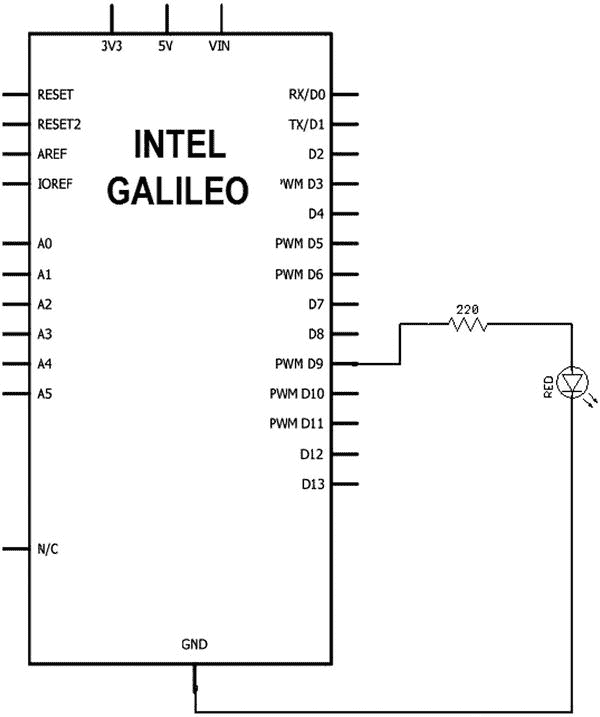

[图 3-12](#_Fig12) 。渐变示例中使用的示意图

渐变代码

清单 3-2 提供了渐变示例的代码。

[***清单 3-2***](#_list2) 。Fade.ino

```sh
/*
 Fade

 This example shows how to fade an LED on pin 9
 using the analogWrite() function.

 This example code is in the public domain.
 */

int led = 9;           // the pin that the LED is attached to
int brightness = 0;    // how bright the LED is
int fadeAmount = 5;    // how many points to fade the LED by

// the setup routine runs once when you press reset:
void setup()  {
  // declare pin 9 to be an output:
  pinMode(led, OUTPUT);
}

// the loop routine runs over and over again forever:
void loop()  {
  // set the brightness of pin 9:
  analogWrite(led, brightness);

  // change the brightness for next time through the loop:
  brightness = brightness + fadeAmount;

  // reverse the direction of the fading at the ends of the fade:
  if (brightness == 0 || brightness == 255) {
    fadeAmount = -fadeAmount ;
  }
  // wait for 30 milliseconds to see the dimming effect
  delay(30);
}
```

运行渐变草图

一旦草图运行，`setup()`只执行一次。通过`pinMode()`功能**将 9 号针设置为`OUTPUT`。**在`loop()`功能中，`analogWrite()`生成一个占空比为 0 的 PWM，存储在`brightness`变量中。占空比增加 5，如变量`fadeAmount`所定义，直到达到 255。此时，占空比再次降低 5，直到达到 0。然后，逻辑再次开始增加占空比。该逻辑将产生改变占空比的 PWM，从而导致明帝效应。

有 30 毫秒的延迟，让你看到调光效果；否则，代码会运行得如此之快，以至于你会认为 LED 只是在转动`ON`和`OFF`。

按钮示例

通过访问文件 02 在 IDE 中加载示例。数字按钮，查看[表 3-3](#Tab3) 中需要的材料。

[表 3-3](#_Tab3) 。按钮示例的材料列表

<colgroup><col width="20%"> <col width="80%"></colgroup> 
| 

数字

 | 

描述

 |
| --- | --- |
| oneone | 10k 欧姆电阻器按钮或开关 |
| one | 面包板 |
| n | 连接电线(各种) |

这个例子着重于如何使用`digitalRead()`函数来读取一个正在工作的输入法的状态。它使用`digitalWrite()`来打开一个 LED。请注意，本例在引脚 13 上使用了 LED，这意味着您不需要将 LED 连接到引脚 13，因为引脚 13 连接到英特尔 Galileo 内置的 LED，如图 3-7 中[所示。然而，如果您将一个 LED 连接到引脚 13，就像您在 fade 示例中连接到引脚 2 一样，您将看到两个 LED 在您按下按钮或开关的同时工作。换句话说，您将看到内置和外置 LED 具有相同的效果。10k 欧姆电阻用于限制电流，然后按钮打开。这可以防止电路板上的 5V 电压和 GND 之间发生短路。](#Fig7)

`pinMode()`功能用于将引脚设置为`OUTPUT`和`INPUT`。

按钮材料清单

表 3-3 提供了本例的材料清单。

按钮示意图

如[图 3-13](#Fig13) 所示，使用按钮或开关连接 10k 欧姆和 2 号针脚。

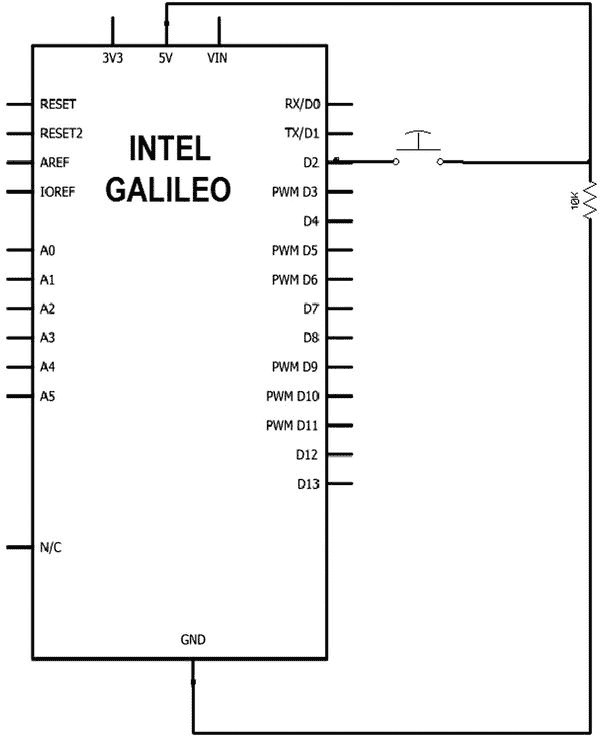

[图 3-13](#_Fig13) 。按钮示例中使用的示意图

按钮代码

清单 3-3 提供了按钮示例的代码。

[***清单 3-3***](#_list3) 。Button.ino

```sh
/*
  Button

 Turns on and off a light emitting diode(LED) connected to digital
 pin 13, when pressing a pushbutton attached to pin 2.

 * LED attached from pin 13 to ground
 * pushbutton attached to pin 2 from +5V
 * 10K resistor attached to pin 2 from ground

 * Note: on most Arduinos there is already an LED on the board
 attached to pin 13.

 created 2005
 by DojoDave <http://www.0j0.org>
 modified 30 Aug 2011
 by Tom Igoe

 This example code is in the public domain.

 http://www.arduino.cc/en/Tutorial/Button
 */

// constants won't change. They're used here to
// set pin numbers:
const int buttonPin = 2;     // the number of the pushbutton pin
const int ledPin =  13;      // the number of the LED pin

// variables will change:
int buttonState = 0;         // variable for reading the pushbutton status

void setup() {
  // initialize the LED pin as an output:
  pinMode(ledPin, OUTPUT);
  // initialize the pushbutton pin as an input:
  pinMode(buttonPin, INPUT);
}

void loop(){
  // read the state of the pushbutton value:
  buttonState = digitalRead(buttonPin);

  // check if the pushbutton is pressed.
  // if it is, the buttonState is HIGH:
  if (buttonState == HIGH) {
    // turn LED on:
    digitalWrite(ledPin, HIGH);
  }
  else {
    // turn LED off:
    digitalWrite(ledPin, LOW);
  }
}
```

运行按钮草图

一旦通过`pinMode()`将引脚 13 设置为`OUTPUT`并将引脚 2 设置为`INPUT`，就会调用`setup()`功能。

在`loop()`功能中，变量`buttonState`接收开关或按钮的当前状态。当您按下按钮时，`digitalRead()`返回`HIGH`，`buttonState`保存该值，`digitalWrite()`功能将引脚 13 (LED)设置为`HIGH`，从而转动`ON`内置 LED。

否则，如果按钮或开关未被按下，`digitalRead()`返回`LOW`，变量`buttonState`保存该值。然后`digitalWrite()`功能将引脚 13 (LED)设置为`LOW`，转动`OFF`内置 LED。

读取模拟电压示例

通过访问文件 01 在 IDE 中加载示例。基础知识读取模拟电压并检查[表 3-4](#Tab4) 中的材料清单。

[表 3-4](#_Tab4) 。用于读取模拟电压示例的材料列表

<colgroup><col width="20%"> <col width="80%"></colgroup> 
| 

数字

 | 

描述

 |
| --- | --- |
| oneone | 电位计(任何！)试验板 |
| n | 连接电线(各种) |

本例使用`analogRead()`功能将电位计上的电压转换为数字读数。

这个例子还使用前面讨论过的`Serial`对象来打印在串行控制台终端中读取的值。

读取模拟电压材料清单

表 3-4 提供了本例的材料清单。

读取模拟电压原理图

仅将电位器连接到 5V 和地，然后将可变端子连接到 A0 端口，如[图 3-14](#Fig14) 所示。


[图 3-14](#_Fig14) 。ReadAnalogVoltage 示例中使用的原理图

读取模拟电压代码

清单 3-4 提供了`ReadAnalogVoltage`例子的代码。

[***清单 3-4***](#_list4) 。ReadAnalogVoltage.ino

```sh
/*
  ReadAnalogVoltage
  Reads an analog input on pin 0, converts it to voltage, and prints the result to the serial monitor.
  Attach the center pin of a potentiometer to pin A0, and the outside pins to +5V and ground.

 This example code is in the public domain.
 */

// the setup routine runs once when you press reset:
void setup() {
  // initialize serial communication at 9600 bits per second:
  Serial.begin(9600);
}

// the loop routine runs over and over again forever:
void loop() {
  // read the input on analog pin 0:
  int sensorValue = analogRead(A0);
  // Convert the analog reading (which goes from 0 - 1023) to a voltage (0 - 5V):
  float voltage = sensorValue * (5.0 / 1023.0);
  // print out the value you read:
  Serial.println(voltage);
}
```

运行读取模拟电压草图

运行草图后，按 Ctrl+Shift+M 调用串行监视器控制台。注意在`loop()`函数中，`analogRead()`命令读取模拟端口`A0`，变量传感器值保存它。

还记得之前讨论`analogRead()`时，返回值在 0 到 1023 之间。在这种情况下，0 表示 0V，1023 表示端口 a 中的 5V。这种转换是通过`Serial.println()`在串行控制台端子中打印的电压变量来完成的。

去抖示例

通过访问文件 02 在 IDE 中加载示例。数字去抖。查看[表 3-3](#Tab3) 中使用的材料清单。

这个例子演示了如何使用`millis()`函数来添加基于时间的逻辑。它确定一个按钮是否在一段时间后被按下，以避免解释多次按下。这被称为*去抖*。

该示例使用了本章前面讨论的示例按钮中使用的相同材料和电路。

去抖材料清单

您可以使用按钮示例中[表 3-3](#Tab3) 中的相同材料。

去抖原理图

使用按钮示例中图 3-12 所示的相同电路。

Debounce 码〔t0〕

清单 3-5 提供了去抖例子的代码。

[***清单 3-5***](#_list5) 。Debounce 不要

```sh
/* Listing 3-5 Debounce.ino.

 Debounce

 Each time the input pin goes from LOW to HIGH (e.g. because of a push-button
 press), the output pin is toggled from LOW to HIGH or HIGH to LOW. There's
 a minimum delay between toggles to debounce the circuit (i.e. to ignore
 noise).

 The circuit:
 * LED attached from pin 13 to ground
 * pushbutton attached from pin 2 to +5V
 * 10K resistor attached from pin 2 to ground

 * Note: On most Arduino boards, there is already an LED on the board
 connected to pin 13, so you don't need any extra components for this example.

 created 21 November 2006
 by David A. Mellis
 modified 30 Aug 2011
 by Limor Fried
 modified 28 Dec 2012
 by Mike Walters

 This example code is in the public domain.

 http://www.arduino.cc/en/Tutorial/Debounce
 */

// constants won't change. They're used here to
// set pin numbers:
const int buttonPin = 2;   // the number of the pushbutton pin
const int ledPin = 13;     // the number of the LED pin

// Variables will change:
int ledState = HIGH;       // the current state of the output pin
int buttonState;           // the current reading from the input pin
int lastButtonState = LOW  // the previous reading from the input pin

// the following variables are long's because the time, measured in miliseconds,
// will quickly become a bigger number than can be stored in an int.
long lastDebounceTime = 0  // the last time the output pin was toggled
long debounceDelay = 50;   // the debounce time; increase if the output flickers

void setup() {
  pinMode(buttonPin, INPUT);
  pinMode(ledPin, OUTPUT);

  // set initial LED state
  digitalWrite(ledPin, ledState);
}

void loop() {
  // read the state of the switch into a local variable:
  int reading = digitalRead(buttonPin);

  // check to see if you just pressed the button
  // (i.e. the input went from LOW to HIGH),  and you've waited
  // long enough since the last press to ignore any noise:

  // If the switch changed, due to noise or pressing:
  if (reading != lastButtonState) {
    // reset the debouncing timer
    lastDebounceTime = millis();
  }

  if ((millis() - lastDebounceTime) > debounceDelay) {
    // whatever the reading is at, it's been there for longer
    // than the debounce delay, so take it as the actual current state:

    // if the button state has changed:
    if (reading != buttonState) {
      buttonState = reading;

      // only toggle the LED if the new button state is HIGH
      if (buttonState == HIGH) {
        ledState = !ledState;
      }
    }
  }

  // set the LED:
  digitalWrite(ledPin, ledState);

  // save the reading.  Next time through the loop,
  // it'll be the lastButtonState:
  lastButtonState = reading;
}
```

运行去抖草图

在本例中，`setup()`功能将引脚 2 设置为`INPUT`，因为按钮或开关应连接到该引脚。引脚 13(内部内置 LED)设置为`OUTPUT`。

`loop()`功能通过`digitalRead()`读取按钮状态，变量读数采用该值。如果按钮状态与上次读取的不同，`lastDebounceTime`变量采用当前的`millis()`。然后`loop`功能继续运行并读取按钮状态，但当第一次按下按钮后到达`debounceDelay`间隔时，会再次检查状态。如果代码检测到用户仍在按下按钮，则 LED 状态会改变。

在下一节中，您将学习如何更新固件。

使用 IDE 更新固件

除了`dediprog`和将固件上传到主板的手动程序(在[第 2 章](02.html)中讨论过)之外，还有第三个选项涉及 IDE，这要简单得多。

每次英特尔发布新的 IDE 时，通常都会附带一个新的英特尔 Galileo 固件。建议您更新它以获得错误修复和新的 API。

IDE 中的更新过程非常简单:

1.  拔下 USB 线和 5V 电源。
2.  如果您正在使用 SD 卡或 u 盘，请将其取出。
3.  插入 5V 电源。
4.  插入 USB 电缆。
5.  启动 IDE，并确保英特尔板和串行端口配置正确，如本章“检查选定的端口和板”一节所述。
6.  Select Help  Firmware Update, as shown in [Figure 3-15](#Fig15).

    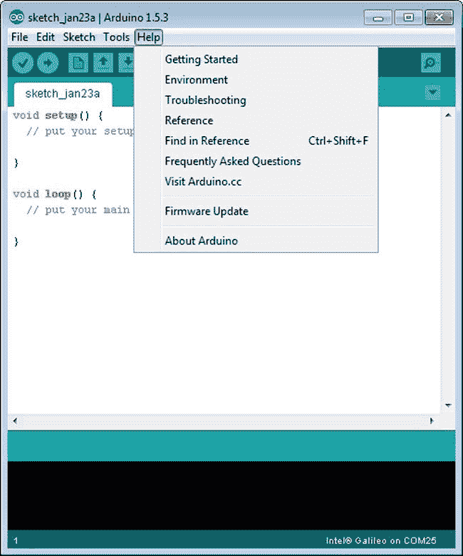

    [图 3-15](#_Fig15) 。帮助菜单中的固件更新选项

7.  A warning dialog will show up to warn you that the 5V power supply must be connected. See [Figure 3-16](#Fig16).

    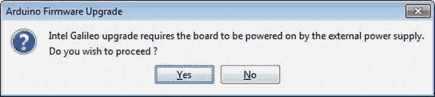

    [图 3-16](#_Fig16) 。固件更新期间的 5V 电源警告

8.  另一个对话框将询问您是否要更新固件。点击“是”即可。然后你需要等大约六分钟。

如果 Intel Galileo 中的固件版本比 IDE 新，您会收到通知。但如果你点击是，固件就会降级，如图[图 3-17](#Fig17) 。

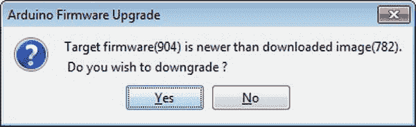

[图 3-17](#_Fig17) 。你可以选择降级

用不同的固件更新固件

有时，英特尔会在新的 IDE 发布之前提供新的固件版本。在这种情况下，您不需要等待新的 IDE 来升级固件。只需使用您之前使用的相同链接(`https://communities.intel.com/docs/DOC-22226`)下载提供的固件，然后将扩展名为`.cap`的文件下载到以下位置:

*   **Windows:.../Arduino < IDE 版本>/硬件/工具/x86/bin/**
*   **Linux:.../Arduino < IDE 版本>/硬件/工具/**
*   苹果电脑:Arduino.app/Contents/Resources/Java/hardware/tools/x86/bin/

将`.cap`文件复制到其中一个位置后，确保删除或更改旧的`.cap`文件的扩展名，因为该位置只能有一个 cap 文件。

驱动程序故障排除

Arduino IDE 设计用于在不同版本的不同操作系统中运行。操作系统也可以运行在虚拟机上，如 VMware 和 Virtual Box。

具有不同版本和配置的各种操作系统会影响串行驱动程序的工作方式。有一些已知的问题。本节的目的是告诉您如何解决这些问题。

Windows 上 IDE 的串行通信问题

有时，在多次插入串行电缆或重新启动计算机后，串行通信会失败。即使 COM 端口出现在设备管理器中，并且您在 IDE 中选择了正确的串行端口和板，有时也会发生这种情况。

在 IDE 控制台消息中(参见[图 3-4](#Fig4) ，可能会出现以下错误:

```sh
*C:\galileo-arduino-1.5.3/hardware/arduino/x86/tools/izmir/clupload_win.sh: line 40: /dev/ttyS8: No such file or directory*
```

这意味着 IDE 无法与英特尔 Galileo 通信。如果您将 USB 电缆连接到不同的端口，问题仍然存在，您需要使用以下步骤清洁电脑中的串行端口:

1.  Start the Command Prompt (`cmd.exe`). If you are using Windows 7, you must start the Command Prompt as the administrator. According to [Figure 3-18](#Fig18), click in the Start icon (1) and type `cmd`, as shown in the figure (2). Don’t press Enter. As soon you type `cmd`, you will see the `cmd.exe` file available in Programs, as shown in [Figure 3-18](#Fig18) (3).

    

    [图 3-18](#_Fig18) 。在 Windows 7 上以管理员身份启动命令提示符

2.  The Command Prompt will be shown. Type the following commands: `set devmgr_show_nonpresent_devices=1` and `start devmgmt.msc`. See [Figure 3-19](#Fig19).

    

    [图 3-19](#_Fig19) 。通过命令提示符启动设备管理器

3.  The Device Manager will show up. Choose View  Show Hidden Devices. See [Figure 3-20](#Fig20).

    

    [图 3-20](#_Fig20) 。启用“显示隐藏设备”选项

    启用查看隐藏设备选项后，端口(COM & LPT)节点会将所有隐藏设备显示为褪色图标，如图[图 3-21](#Fig21) 所示。

    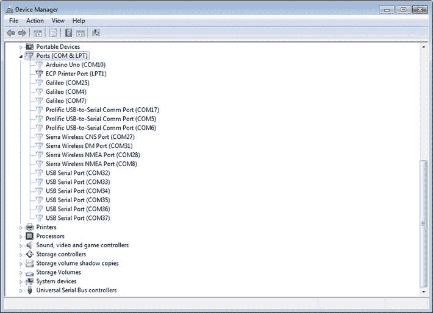

    [图 3-21](#_Fig21) 。端口(COM & LPT)下的所有隐藏设备都是灰色的

4.  Select the COM port to be uninstalled. Right-click it and select Uninstall. See [Figure 3-22](#Fig22).

    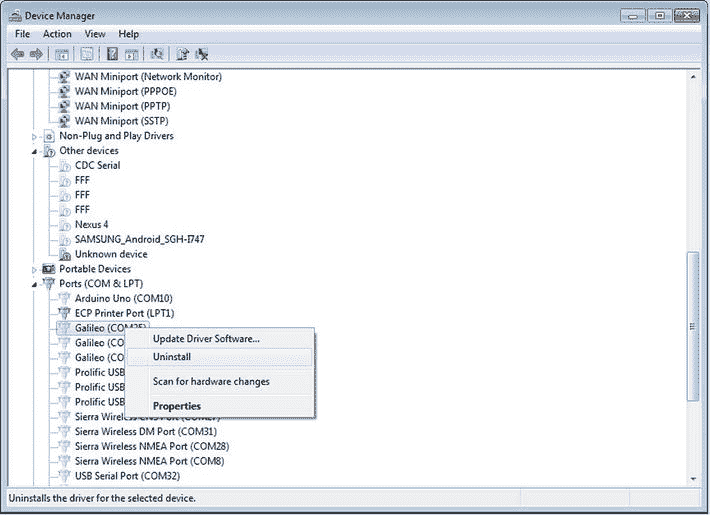

    [图 3-22](#_Fig22) 。右键单击卸载隐藏的 COM 端口

5.  In the uninstall dialog, check the Delete the Driver Software for This Device box to delete the driver. Click the OK button, as shown in [Figure 3-23](#Fig23).

    

    [图 3-23](#_Fig23) 。删除隐藏的 COM 端口和驱动程序

6.  删除所有隐藏的 COM 端口后，重复本章“安装驱动程序”一节中提到的安装过程。

虚拟机和 64 位 Linux 的 IDE 问题

如果您在虚拟机或 64 位 Linux 操作系统中使用面向英特尔 Galileo 的 Arduino IDE，您将会遇到一些“入门指南”中未涉及的错误

这些错误是可以解决的，但是需要一些技巧。以下部分描述了其中的一些。

64 位 Linux 的警告消息

如果你看到类似于`/ibus/bus is not root`的警告信息，尝试使用`gksudo ./arduino`而不是`sudo ./arduino`来启动 IDE。要安装`gksudo`，使用`sudo apt-get install gksu`命令。

VMware 的问题

如果您将 IDE 安装到 VMware 中，您可能会在检测`/dev/ttySx`时遇到问题，其中`x`是端口号。如果在没有任何手动干预的情况下自动识别并选择通信端口，则 VMware 中存在缺陷。如果发生这种情况，如图[图 3-24](#Fig24) 所示断开端口，然后重新连接。

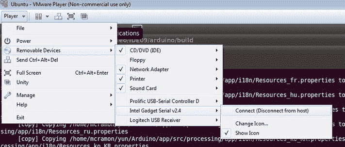

[图 3-24](#_Fig24) 。断开串行端口的选项

Oracle 虚拟机箱的问题

如果遇到通信问题，请确保通过选择设置 USB 启用 USB 2.0 (EHCI)控制器，如图[图 3-25](#Fig25) 所示。

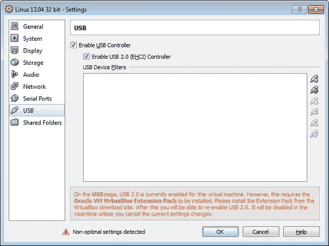

[图 3-25](#_Fig25) 。Orable VM 盒的 USB 设置

与 Linux 本地程序交流草图

在[第 2 章](02.html)中，您学习了如何在您的英特尔 Galileo 主板上创建原生应用并转移到 Linux。您可能想知道是否可以将运行在 Linux 上的程序与草图集成在一起。

在我们讨论草图如何与 Linux 本地程序通信之前，理解草图如何与 Linux 操作系统协同工作是很重要的。

所有的布线库都是为了使英特尔 Galileo 与 Arduino 参考兼容而创建的，因此它们可以在 Linux 用户空间中运行。换句话说，草图就像其他程序一样。

像共享内存、套接字、信令库和大量的`POSIX`库这样的 API 可以用来建立通信，就像 Linux 操作系统中的任何其他常规程序一样。

也可以直接调用 Python、curl、OpenSSL、bash 脚本、start services 等程序。

下一节提供的例子将未读邮件警报与 Python 和`POSIX`集成在一起。考虑到 Python 正在被使用，你应该有一个 SD 卡镜像，因为 SPI 镜像非常小，不包含像 Python 那样的附加软件。更多的例子将在以后的章节中介绍。

就是。Additionalfuture 项目示例:使用 Python 和 POSIX 函数的未读邮件警报

这个项目解释了如何使用常规的 Linux`POSIX`API 来创建一个定时器，该定时器每 10 秒钟异步调用一个函数处理程序。当执行这个函数处理程序时，它会调用一个 Python 脚本来计算 Gmail 帐户中未读邮件的数量。如果电子邮件数量增加，一个 LED 指示灯会显示`ON`，通知您收件箱中有新邮件。

通过 WiFi 或以太网电缆连接到 Gmail。

材料清单

表 3-5 提供了本例的材料清单。[表 3-6](#Tab6) 提供了一个可选列表。

[表 3-5](#_Tab5) 。褪色示例的材料列表

<colgroup><col width="20%"> <col width="80%"></colgroup> 
| 

数字

 | 

描述

 |
| --- | --- |
| one | 发光二极管 |
| one | 220 欧姆电阻器 |
| one | 面包板 |
| n | 连接电线(各种) |

[表 3-6](#_Tab6) 。可选材料

| 

量

 | 

成分

 |
| --- | --- |
| one | 英特尔迅驰无线-N 135 或以太网电缆 |
| Two | 双频带天线 350 毫米电缆 2118060-1 TE 连接(仅在 WiFi 情况下) |
| oneonenone | 发光二极管220 欧姆电阻器连接电线(各种)试验板 |

示意图

使用与图 3-12 中[相同的示意图](#Fig12)。记下 WiFi 卡或以太网设置，然后按照第 5 章中的说明进行操作。

PythonP 代码

Python 脚本名为`emailCounter.` `py` ，它接受两个参数，其中第一个参数是您的 Gmail 用户名或电子邮件，第二个参数是您的密码。

您可以手动执行该脚本来测试终端序列号:

```sh
python email.counter <your username or email> <your password>
```

Python 代码在[清单 3-6](#list6) 中提供。

[***清单 3-6***](#_list6) 。谷歌邮箱

```sh
# based in the discussion in:
# http://stackoverflow.com/questions/953561/check-unread-count-of-gmail-messages-with-python
# by manoel.c.ramon@intel.com

import imaplib
import sys

obj = imaplib.IMAP4_SSL('imap.gmail.com','993')
obj.login(sys.argv[1],sys.argv[2])
obj.select()
obj.search(None,'UnSeen')
print len(obj.search(None,'UnSeen')[1][0].split())
```

清单 3-7 中的[提供了草图代码。](#list7)

[***清单 3-7***](#_list7) 。gmailAlarm.ino

```sh
#include <signal.h>
#include <stdio.h>
#include <string.h>
#include <sys/time.h>

// the led
int led = 2;  // the built-in LED

// emails counters
int current_emails_counter = -1;
int last_emails_counter = -1;

// add here your credentials
String gmailUserName="";  // email or password
String gmailPassword="";  // your password

String script_name = "python /home/root/emailCounter.py ";

// this function calls a Python script to read the number of emails not read
int processEmailCounter()
{

   char cmd_rsp[8];  // This buffer will containg the script response

   FILE *fpipe;

   String command = script_name;

   command += gmailUserName;
   command += " ";

   command += gmailPassword;

    // buffer to be used with popen
   char cmd_char[300];

   // clear message buffer
   memset((void *)cmd_char, sizeof(cmd_char), 0);

   // convert the message to char array
   command.toCharArray(cmd_char, sizeof(cmd_char), 0);

   if ( !(fpipe = (FILE*)popen((char *)cmd_char,"r")) )
      {  // If fpipe is NULL
      Serial.println("Problems with pipe");
   }
   else
   {

     while ( fgets( cmd_rsp, sizeof(cmd_rsp), fpipe)) {}

     pclose(fpipe);

     // let's print the serial result
     Serial.println(cmd_rsp);

     return atoi(cmd_rsp);
   }

   return -1;
}

// this is my time handler...
void timerHandler (int signum)
{
    current_emails_counter = processEmailCounter();
    if (last_emails_counter == -1)
    {
        last_emails_counter = current_emails_counter;
        Serial.println("I am ready to check now... ");
    }

    if (current_emails_counter != last_emails_counter)
    {
        // turn on the LED
        digitalWrite(led, HIGH);
    }
}

int setAlarm ()
{
  struct sigaction sa;
  struct itimerval timer;

  /* Install timer_handler as the signal handler for SIGVTALRM.  */
  memset (&sa, 0, sizeof (sa));
  sa.sa_handler = &timerHandler;
  sigaction (SIGVTALRM, &sa, NULL);

  // Configure the timer to expire after 1 seconds
  timer.it_value.tv_sec = 1;
  timer.it_value.tv_usec = 0;
  // ... and every 10 seconds after that
  timer.it_interval.tv_sec = 10;
  timer.it_interval.tv_usec = 0;

  // Start a virtual timer. Counter while sketch runs
  setitimer (ITIMER_VIRTUAL, &timer, NULL);

}

void setup() {
   // only a small delay to allow you press CTRL+SHIT+M
   // and see the Serial Monitor
   delay(3000);

   // set the alarm
   setAlarm();
   pinMode(led, OUTPUT);
   digitalWrite(led, LOW);
}

void loop() {
  // put your main code here, to run repeatedly:

}
```

准备要运行的项目

首先要做的是使用 FTP 将 Python 脚本传输到英特尔 Galileo 主板，如第 2 章中所述，或者使用您喜欢的任何其他方法。确保你转移到正确的路径，因为草图搜索`/home/root/emailCounter.py`。否则，您必须将草图代码更改为您想要的路径。

确保你的 WiFi 或以太网工作正常，如[第 2 章](02.html)所述。请注意，Sketch 不使用客户端进行连接。您可以使用任何连接，因为主板有可用的 IP 地址和互联网连接。

在运行草图之前，您需要将您的凭证添加到代码的开头:

```sh
// add your credentials here
String gmailUserName="";  // email or password
String gmailPassword="";  // your password
```

如果您的 Python 脚本被复制到正确的路径，您的互联网连接工作正常，并且您的凭证在草图的代码中，您就可以运行了。

运行代码

如果一切准备就绪，运行草图。它一运行，就按 Ctrl+Shift+M 查看串行控制台中的调试消息。

如果您足够快，您将看到以下消息:

我现在准备好检查了...

这意味着代码读取未读邮件的数量，并等待新的。使用浏览器，打开 Gmail，给自己发一封电子邮件。

最多 10 秒钟后，您应该会看到 LED `ON`。

审查代码

`setup()`功能有三秒钟的延迟，以允许您启动串行控制台并捕捉由`Serial.print()`和`Serial.println()`打印的第一条调试信息。`setup()`函数还通过调用`setAlarm()`函数来初始化定时器设置。它通过`pinMode()`将引脚 2 设置为`OUTPUT`，因为 LED 必须连接到此引脚，然后通过让`digitalWrite()`通过`LOW`关闭 LED。

`setAlarm()`函数使用`setitimer()`创建一个定时器，这个定时器在草图运行后的一秒钟内调用一个名为`timerHandler()`的函数处理程序，之后每 10 秒钟调用一次。使用常规 Arduino 参考，您可以使用 **millis()** 控制 **loop()** 函数中经过的秒数；然而，使用`POSIX`功能要容易得多。创建的计时器是`ITIMER_VIRTUAL`类型的，这意味着函数处理器只在草图运行时被调用。

有关`setitimer()`如何工作的更多信息，请访问此链接:`http://unixhelp.ed.ac.uk/CGI/man-cgi?setitimer+2`。

当调用`timerHandler()`时，它调用`processEmailCounter()`函数，该函数负责执行`emailCounter.py` Python 脚本。该脚本接收您的凭据，并返回您的 Gmail 收件箱中未读邮件的数量。该草图使用`popen()`函数(ANSI C)接收响应，并接收一个`char`数组中的电子邮件数量，该数组使用`atoi()`转换为整数格式。

在序列中，`timerHandler()`使用两个变量叫做`current_emails_counter`和`last_emails_counter`。他们根据`processEmailCounter()`功能确定未读邮件的数量是否增加。如果有增加，连接到引脚 2 的 LED 通过`digitalWire()`设置为`HIGH`。

该项目需要互联网连接，因此建议您使用 WiFi 卡或以太网电缆，并按照[第 2 章](02.html)中的说明设置电路板。

如果在执行草图之前建立了互联网连接，您可以避免使用 WiFi 或以太网库。这将在第 4 章中讨论。

对这个项目的最终想法。。。

检查功能`loop()`:

`void loop() {`
`// put your main code here, to run repeatedly:`
T5`}`

它是空的！大部分代码是使用 Python 和 Linux 库提供的`POSIX`调用开发的。注意，使用了 Arduino 参考中的一些函数:`pinMode()`和`digitalWrite()` **。**

您可以看到 Intel Galileo 是多么强大，将 Arduino 参考 API 集成到 Linux 库中是多么容易。

摘要

此时，您可以安装并运行 Arduino IDE，在不同的操作系统中安装驱动程序，并加载、编译和下载草图。

向您介绍了布线平台概念和 Arduino 参考库中最常用的功能，以便管理英特尔 Galileo 的数字和模拟接口。有了这样的接头，您就可以与 led 和按钮接口，生成 PWM 信号，并使用串行通信调试草图。

在本章的结尾，你学习了如何使用`POSIX`函数使草图与本地 Linux 应用程序通信，以及如何与 Python 脚本交互。

这一章非常简单，但却是最重要的一章，因为它提供了将在本书剩余部分使用的基本概念。```