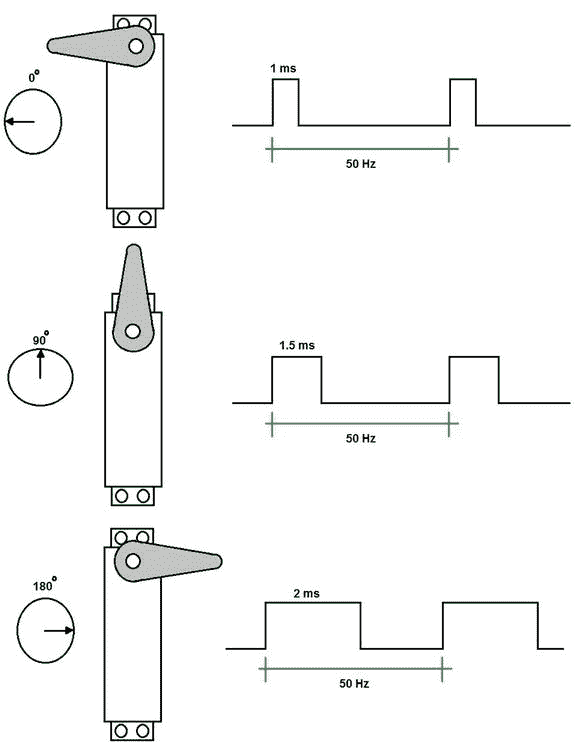
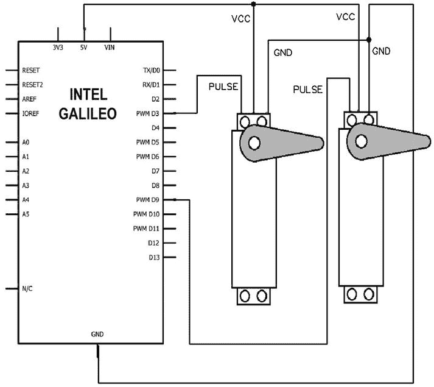
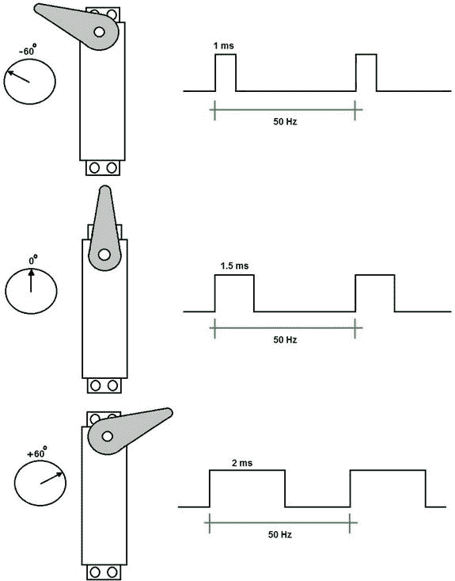
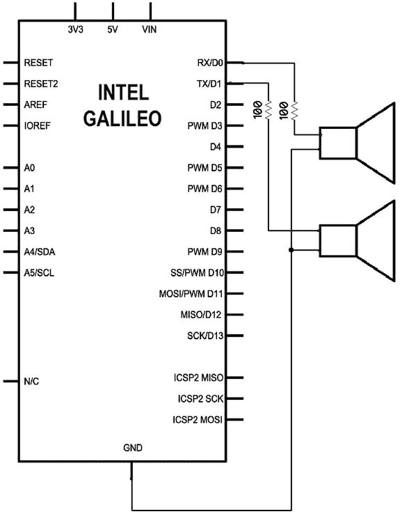
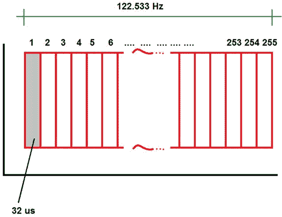
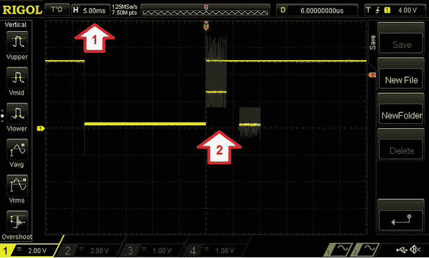
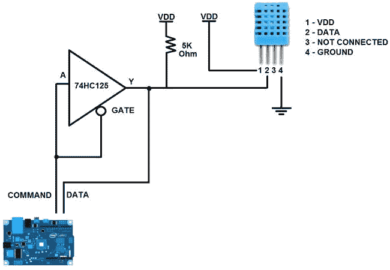

# 四、新的 API 和黑客

英特尔 Galileo 设计时面临的挑战是创建一个仅使用 Quark 微处理器的兼容 Arduino 接口和参考语言的主板，并具有运行 Linux 和与微控制器建立任何所需桥梁的相同功能。

竞争对手的运行 Linux 的主板实际上使用微控制器与引脚接口，并且都有不错的性能。

英特尔 Galileo 和英特尔 Galileo Gen 2 不使用微控制器，这使得草图实施更加容易，因为微处理器和微控制器之间没有桥接。另一方面，在没有微控制器来保证实时性能的情况下，在 Linux 用户空间环境中实现 Linux 驱动程序和 Arduino 参考 API 是一个巨大的挑战。

本章介绍了第一版英特尔 Galileo 中引入的新 API 和一些设计解决方案。本章还讨论了如果常规 Arduino 参考 API 不能满足您的项目需求时，您可以采取的一些措施。

一些 API专门用于英特尔 Galileo，一些仅用于英特尔 Galileo Gen 2，而其他的则两者都用。因此，关于 APIs hacks 的每一节都包括一个注释，解释它使用哪个版本。

伺服 API

伺服电机广泛应用于遥控的机器人和设备，比如遥控飞机。同时，它们令人困惑，因为实践与理论略有不同。让我们看看理论和实践。

理论与实践

理论上，伺服系统使用 PWM 脉冲在 0 到 180 度之间旋转，PWM 脉冲在 20 毫秒(50Hz)的周期内在 1 到 2 毫秒之间变化，并在 4.5 到 6 VDC 之间工作。[图 4-1](#Fig1) 显示了根据脉冲至 0、90 和 180 度的伺服运动。



[图 4-1](#_Fig1) 。伺服系统在理论上是如何工作的

只有三根线，VCC 线通常是红色的，地线通常是黑色的，脉冲信号线根据制造商的不同有不同的颜色。可以将伺服移动到 0 到 180 度之间的特定位置。

要练习伺服系统并了解它们如何真正与新的 API 一起工作，请将伺服系统连接到英特尔 Galileo 头部。见[表 4-1](#Tab1) 中的材料清单。

[表 4-1](#_Tab1) 。伺服练习材料清单

<colgroup><col width="10%"> <col width="90%"></colgroup> 
| 

数字

 | 

描述

 |
| --- | --- |
| Two | 伺服双叶 S3003 或同等产品 |

这种伺服可以在网上找到，价格约为 7 至 15 美元。

伺服示意图:一个伺服

如图 4-2 中的示意图所示，将 VCC 连接到 5V，将地线连接到地线，将脉冲连接到引脚 9。


[图 4-2](#_Fig2) 。将伺服连接到英特尔Galileo

有了这个理论，如果你决定在网上购买伺服系统，你会看到各种各样的伺服系统，价格在 5 美元到 15 美元之间。

选择一个伺服，比如材料清单[表 4-1](#Tab1) 中提到的伺服 Futaba S3003。

然后编写清单 4-1 中[所示的代码](#list1)。

[***清单 4-1***](#_list1) 。伺服理论

```sh
#include <Servo.h>

Servo myservo;

void setup()
{
  myservo.attach(9);  // attaches the servo on pin 9 to the servo object
}

void loop()
{

  // in theory 0 degrees
  myservo.writeMicroseconds(0);
  delay(2000);

  // in theory 180 degrees
  myservo.writeMicroseconds(2000);
  delay(2000);

}
```

代码创建了一个使用`myservo.attach(9)`连接到引脚 9 的伺服对象。循环发送一个 0 微秒的脉冲，理论上用`myservo.writeMicroseconds(0)`表示 0。两秒钟后，它用`myservo.writeMicroseconds(2000)`发送一个 2000 微秒(2 毫秒)的脉冲，理论上这会将伺服移动到 180 度。

如果您使用的是 Futaba S3003 或同等产品，您会发现伺服系统不会移动到 180 度。它移动到 0 到 160 度之间。

更改代码以使用`write()`方法，由此您可以精确定义所需的角度。参见[清单 4-2](#list2) 。

[***清单 4-2***](#_list2) 。伺服 _ 写入 _ 角度. ino

```sh
#include <Servo.h>

Servo myservo;

void setup()
{
  myservo.attach(9);  // attaches the servo on pin 9 to the servo object
}

void loop()
{

  // move to 0 degrees
  myservo.write(0);
  delay(2000);

  // move to 180 degrees
  myservo.write(180);
  delay(2000);

}
```

具体来说，该伺服系统不会在 1 毫秒的脉冲下移动到 0 度，也不会在 2000 毫秒的脉冲下移动到 180 度。当角度被传递给`write()`方法时，IDE 有什么不同？

如果你运行清单 4-2 中的代码，你会发现伺服系统从 0 度到 180 度移动没有问题。

安装 IDE 后，打开目录`...\arduino-1.5.3\hardware\arduino\x86\libraries\Servo`中的文件`Servo.h`。看看这个文件的定义:

```sh
#define MIN_PULSE_WIDTH       544     // the shortest pulse sent to a servo
#define MAX_PULSE_WIDTH      2400     // the longest pulse sent to a servo
```

在`write()`方法中指定 0 度时，伺服库使用 544 微秒(0.544ms)，指定 180 度时，使用 2400 微秒(2.4ms)。在这个实验中使用的伺服实际上与这些值一起工作，而不是理论值。

这个介于 544 和 2400 微秒之间的范围是你可以在网上买到的伺服系统最常见的范围。如果根据伺服系统的规格附加指定最大值和最小值的伺服系统，也可以更改最大值和最小值。例如，假设你有一个伺服系统，0 度需要 800 微秒的脉冲，180 度需要 2200 微秒的脉冲。在这种情况下，可以像这样指定边界:

```sh
myservo.attach(9, 800, 2200);  // attaches the servo on pin 9 to the servo object
```

但这种方法只根据`MIN_PULSE_WIDTH`和`MAX_PULSE_` `WIDTH` 指定的范围(分别为 544 和 2400 微秒)接受最大和最小脉冲。

关于`write()`方法的最后一点观察。如果大于 180 度的角度被传递给该函数，它将被视为微秒，并且`write()`将与`writeMicroseconds()`方法表现相同。例如，这两种方法做同样的事情:

```sh
// move to 180 degrees
myservo.writeMicroseconds(2000);

// the value is > 180, so it means microseconds
myservo.write(2000);
```

英特尔Galileo和伺服系统的错误

如果您使用的是英特尔 Galileo Gen 2 主板，这一部分就无关紧要了，因为英特尔 Galileo Gen 2 使用的扩展器 PCA95555 非常好用。

市场上的第一个英特尔 Galileo 版本使用了一个名为 CY8C9540A 的 GPIO 扩展器，由 Cypress 公司制造。它通过 I2C 协议与英特尔 Galileo 通信，但不幸的是，它不能提供足够高的精度，在 50Hz 的频率下具有 1 度的粒度。换句话说，这个 IC 产生的 PWM 不能以 1 比 1 微秒的增量提供脉冲，并且你不能在接近 50Hz 的频率下以 1 比 1 度的增量移动伺服。

该扩展器不在 50Hz 下工作，但在 48Hz 下工作，这对于使用伺服系统来说是可以接受的，因为伺服系统对频率的容差约为 5%至 10%(47.5hz 至 55Hz)，这对于 50Hz 的域来说是可以接受的。

赛普拉斯 CY8C9540A 数据手册在本章的文件夹`code/datasheets`中，在名为`CY8C95x0A.pdf`的文件中，或者你可以在`http://www.cypress.com/?rID=3354`访问它。

然而，一些伺服系统可能在更高的频率下工作，如果频率增加，CY8C9540A 可以提供更好的角度粒度。该扩展器的占空比是使用 I2C 编程的，并且只接受八位，这是问题的根源。表 4-2 提供了一个解释这些问题的小样本。

[表 4-2](#_Tab2) 。CY8C9540A 角度粒度最小脉冲 0.544ms，最大 2.4ms


在[表 4-2 的第一列中](#Tab2)表示要移动的角度，第二列是相应角度的理想脉冲，考虑到最小脉冲为 544 微秒，最大脉冲为 2400 微秒(Arduino 参考实施使用的标准)。第三和第四列表示发送给控制器以获得所需脉冲所需的字节。

可以看到，当 CY8C9540A 扩展器工作在 48Hz 时，相同的字节 7 出现在 4 到 11 度的角度。如果您尝试在 4 度和 11 度之间移动伺服，伺服将不会移动，因为字节是相同的。当角度变为 12 度时，字节变为 8。伺服运动将是起伏不定的，只会以可怕的精度从 4 度到 8 度剧烈移动。

但是，如果您以 188Hz 的频率工作，并移动 4 到 11 度，伺服将移动得更平稳，因为粒度更好。例如，当伺服从 4 度移动到 6 度时，它不会以 5 度移动，因为 4 度和 5 度共享同一个字节(28)。在 6 度时，字节是 29，所以伺服移动。

因此，当您在 188Hz 下使用伺服系统时，仍然无法以 1 到 1 度的增量移动，但与在 48Hz 下使用扩展器相比，粒度要好得多。

[表 4-2](#Tab2) 仅包含 1 到 12 度的一个小角度设置。在本章名为`code`的文件夹中，有一个名为`frequence_versus_resolution.xls`的电子表格，其中包含了从 0°到 180°的所有角度以及 CY8C9540A 提供的分辨率。

Servo API 有什么新特性？

本节仅适用于英特尔 Galileo。

为了减弱扩展器 CY8C9540A 引入的伺服粒度问题，软件团队在`attach()`方法中增加了一个可选参数，并在英特尔Galileo中包含了两个新方法——`set48hz()`和`set188hz()`。请记住，频率控制不是每个伺服独立的，一旦它为一个伺服设置，所有其他伺服必须使用相同的频率。否则，伺服系统将无法正常工作。

void 伺服::set48hz()

强制 CY8C9540A 工作在 48Hz。如前所述，分辨率很差，只有在您的应用不需要精度时才有用。

void 伺服::set188hz()

迫使 CY8C9540A 工作在 188Hz，并提供 2 到 2 度的分辨率。它并不完美，但对于简单的机器人和 RC 控制器来说已经足够了。在 Intel Galileo 上，这是创建伺服时使用的初始频率。因此，如果您的伺服不支持 188Hz，您可以在伺服初始化中强制`attach()`方法设置 48Hz，以避免伺服烧伤。

uint8_t 伺服::附加 (int16_t pin，bool force48hz = false)

与传统的 Arduino 参考伺服 API 相比，这种方法的唯一区别是包含了参数`force48hz`。如果该参数设置为`true`，伺服中的初始频率将为 48Hz 否则，默认为 188Hz。

另一个名为`pin`的参数仅指定了用于向伺服系统发送脉冲信号的 PWM 引脚。

uint8_t 伺服::附加(int pin、int min、int max、bool force 48hz = false)

同样，与传统的 Arduino 参考伺服 API 相比，这种方法的唯一区别是包含了参数`force48hz`。如果该参数设置为`true`，伺服中的初始频率将为 48Hz 否则，将采用默认值 188Hz。

`pin`参数指定用于向伺服系统发出脉冲信号的 PWM 引脚。和`min`和`max`参数分别以微秒为单位指定最小和最大频率。

伺服系统示意图:两个伺服系统

为了用这些新方法创建一些实用的测试，让我们用两个伺服系统组装一个电路。将两个 VCC 都连接到 5V，并将两个地线都接地。将一个伺服脉冲连接到引脚 9，另一个连接到引脚 3，如示意图[图 4-3](#Fig3) 所示。



[图 4-3](#_Fig3) 。两个伺服系统连接

测试新的伺服 API

[清单 4-3](#list3) 显示了与[图 4-3](#Fig3) 的示意图一起使用的程序。

[***清单 4-3***](#_list3) 。伺服设置频率信息

```sh
#include <Servo.h>

Servo myservo1;
Servo myservo2;

void setup()
{
  myservo1.attach(9);        // attaches the servo to pin 9 at 188 hz
  myservo2.attach(3, true);  // this must work in 48 hz. All servos will work at 48hz now
  Serial.begin(115200);
}

void loop()
{

    myservo1.write(180);
    myservo2.write(0);

    delay(2000);

    myservo1.write(0);
    myservo2.write(180);

    delay(2000);

    myservo1.set188hz();; // all servos will work at 188hz

}
```

查看伺服设置频率信息

在`setup()`功能中，两个伺服系统被添加到系统中，一个在 188Hz(默认频率)的第 9 针中。创建第二个伺服对象，在 48Hz 下指定第 3 号针上的伺服。

然而，一旦调用`myservo2.attach(3, true)`方法 ，两个伺服系统都开始以 48Hz 的频率运行。

然后在`loop()`功能中，第一个伺服移动 180 度，第二个移动 0 度。两秒钟后，它们分别将顺序反转为 0°和 180°。

```sh
myservo1.write(180);
myservo2.write(0);

delay(2000);

myservo1.write(0);
myservo2.write(180);

delay(2000);
```

因此，在`loop()`的第一次交互中，两个伺服系统最初都工作在 48Hz。两秒钟后，所有伺服系统将工作在 188 赫兹，因为其中一个伺服系统用`myservo1.set188hz()`选择了这个频率。其余的`loop()`互动伺服将保持在 188 赫兹。

伺服系统的挑战

使用伺服系统时最大的挑战是缺乏标准化，市场上的伺服系统种类繁多，许多都有不同的规格。

例如，伺服机构在 1 毫秒内达到 0 度，在 2.2 毫秒内达到 180 度。这种移动与一个方向上的脉冲长度成比例。

但是有伺服限制在 120 度，所以 1.5ms 代表 0 度，1ms 代表-60 度，2ms 代表+60 度。这些与本章中的例子完全不同，伺服 API 不会有预期的结果。[图 4-4](#Fig4) 显示了这些伺服系统的工作原理。



[图 4-4](#_Fig4) 。1.5 毫秒内 0 度的伺服示例

这并不意味着伺服 API 在这些情况下是无用的。您只需要了解您的伺服规格，并使用 API 在正确的时间应用正确的脉冲，以便伺服移动到正确的角度。

另一个常见的错误是使用伺服不超过 160 度。这种伺服系统有一个内部机械限制器，防止它们移动超过 160 度。

一些开发人员移除了这个机械定界符，并对伺服输入进行了一些更改，使它们能够连续旋转。在这种情况下，连续伺服系统控制的不是位置，而是转速。

另一个问题是 Arduino 参考 API。英特尔根据 Arduino 提供的参考创建了 servo API，但在实际应用中，一些主板有不同的行为。例如，如果您使用 Arduino UNO，由于 1.5ms 的初始脉冲，初始角度(对于大多数伺服系统)为 90 度；然而，英特尔Galileo试图把你的伺服最初在 0 度。在两种实现方式中，参考值都受到尊重，并且在实现方面没有错误，因为没有强制要求说初始位置必须是 0 或 90 度。

序列、序列 1 和序列 2 对象

本节适用于英特尔 Galileo 和英特尔 Galileo Gen 2。

在第 3 章的[中，在标题为“使用串行控制台和串行通信进行调试”的章节中，您了解了一些关于使用串行从 IDE 串行调试控制台打印调试消息的知识，以及关于 Serial1 对象的知识。](03.html)

事实上，英特尔 Galileo 和英特尔 Galileo Gen 2 与任何其他常规 Arduino 主板一样属于串行，而且还包括用于串行通信的新 Serial1 和 Serial2 对象。

对于英特尔 Galileo 和英特尔 Galileo Gen 2，Serial1 使用引脚 0 作为其 RX 端口，引脚 1 作为 TX 端口。

Serial2 在英特尔 Galileo Gen 2 上使用引脚 2 作为 RX，引脚 3 作为 TX，您将使用英特尔 Galileo 上的音频插孔。

当使用 Serial2 和 Linux 控制台 shell 时，有一个限制。如果草图中使用了 Serial2，Linux 控制台就会丢失，因为`mux`被设置为重定向 Linux 控制台上使用的端口以提供 Serial2 功能。

这些对象接受的波特率为 300、600、1200、2400、4800、9600、14400、19200、38400、57600、115200、230400 和 460800。

用法非常简单，非常类似于用于调试草图的常规串行对象。因此，用于与 Serial1 和 Serial2 通信的所有方法都与第 3 章中解释的串行对象相同。因此，本节的重点是与 Serial1 和 Serial2 相关的一些新细节。它包括一个简单的例子，说明如何在同一个草图中使用所有三个对象。

测试串行、串行 1 和串行 2 对象

本例创建为在英特尔 Galileo Gen 2 上运行，因为处理 I/O 头中的 Serial2 非常简单，而不必为英特尔 Galileo 上的音频插孔专门准备一根电缆。我们的想法是创建一个草图，仅使用两条导线在 Serial1 和 Serial2 之间形成一个环路。Serial1 将发送一条消息，该消息将被 Serial2 读取，然后 Serial 2 将读取该消息并向 Serial 1 发送另一条消息。重复该过程。

表 4-3 提供了运行该示例所需的材料清单。

材料清单

[表 4-3](#_Tab3) 。序列对象示例的材料列表

<colgroup><col width="10%"> <col width="90%"></colgroup> 
| 

数字

 | 

描述

 |
| --- | --- |
| Two | 简单的连接电线 |

串行示例示意图

[图 4-5](#Fig5) 显示了必须如何连接电线以创建串行回路。


[图 4-5](#_Fig5) 。在 Serial1 和 Serial2 之间创建串行环回

Serial1 RX(引脚 0)连接到 Serial2 TX(引脚 3)，Serial1 TX(引脚 1)连接到 Serial2 RX(引脚 2)。这在 Serial1 和 Serial2 之间形成了一个环路。

测试代码如[清单 4-4](#list4) 所示。

[***清单 4-4***](#_list4) 。所有系列信息

```sh
String inputString = "";         // a string to hold incoming data

void setup() {
  // put your setup code here, to run once:
   Serial.begin(115200);    // Serial console debugger
   Serial1.begin(115200);   // PIN 0->RX and 1->TX
   Serial2.begin(115200);   // PIN 2->RX and 3->TX

}

void loop() {

  Serial.println("Transmitting from Serial 1 to Serial 2");
  Serial1.println("Intel"); // this will transmitt using PIN 1
  inputString="";

  // Serial2 will wait for something
  while (Serial2.available()) {
    // get the new byte:
    char inChar = (char)Serial2.read();  // receiving by Serial2 on pin 2

    // add it to the inputString:
    inputString += inChar;

  }

  // Serial 2 receive the word "Intel"
  // let's send the word "Galileo" back to Serial 1

  Serial.print("Message received from Serial 1:");
  Serial.println(inputString);
  inputString = "";

  // transmitting another word to Serial2
  Serial.println("Transmitting from Serial 2 to Serial 1");
  Serial2.println("Galileo");  // transmitting by Serial2 using pin 3

  // Serial1 will wait for something
  while (Serial1.available()) {
    // get the new byte:
    char inChar = (char)Serial1.read();  // receiving by Serial1 using pin 0

    // add it to the inputString:
    inputString += inChar;

  }

  Serial.print("Message received from Serial 2:");
  Serial.println(inputString);
  inputString = "";

  delay(2000);
}

```

查看所有序列号

在`setup()`功能中，所有三个对象都以 115200 波特率初始化。

```sh
Serial.begin(115200);    // Serial console debugger
Serial1.begin(115200);   // PIN 0->RX and 1->TX
Serial2.begin(115200);   // PIN 2->RX and 3->TX
```

在`loop()`方法中，`Serial`对象仅用于调试目的。Serial1 对象开始使用`println()`方法向 Serial2 传输单词`"Intel"`。

```sh
Serial1.println("Intel"); // this will transmitt using PIN 1
```

然后，Serial2 从 Serial1 接收消息，并使用`available()`方法读取整个缓冲区。`available()`方法将继续返回缓冲区中可用的字节数，循环将一直持续，直到`available()`返回零字节(当没有更多的字节要读取时)。`read()`方法 读取字节，并使用`inChar`变量将其转换为字符字节。一旦该字节被读取，由`available()`方法报告的字节数将减少，该字节将在名为`inputString`的字符串缓冲区中累积。

```sh
// Serial2 will wait for something
  while (Serial2.available()) {
    // get the new byte:
    char inChar = (char)Serial2.read();  // receiving by Serial2 on pin 2

    // add it to the inputString:
    inputString += inChar;

  }

```

一旦 Serial2 从 Serial1 读取到`"Intel"`消息，字`"Galileo"`就被发送回 Serial1。同样，`println()`方法被用于这个目的。

```sh
  // transmitting another word to Serial 2
...
...
...
  Serial2.println("Galileo");  // transmitting by Serial2 using pin 3
```

Serial2 发回字`"Galileo"`后，Serial1 必须接收。代码的逻辑与 Serial2 相同，使用了`available()`和`read()`方法。

```sh
  // Serial1 will wait for something
  while (Serial1.available()) {
    // get the new byte:
    char inChar = (char)Serial1.read();  // receiving by Serial1 using pin 0

    // add it to the inputString:
    inputString += inChar;

  }
```

 **注意**在串口写的时候，使用了`println()`的方法，因为它处理字符串更容易。然而，如果您正在传输原始字节或整数，您可以使用`write()`方法来代替。

运行草图后，通过选择工具串行监视器或按 CTRL+SHIFT+M 打开 IDE 串行控制台。您应该会在调试串行控制台中看到类似以下消息的内容:

```sh
Transmitting from Serial 1 to Serial 2
Message received from Serial 1:Intel

Transmitting from Serial 2 to Serial 1
Message received from Serial 2:Galileo

Transmitting from Serial 1 to Serial 2
Message received from Serial 1:Intel
```

由于在`loop()`函数末尾使用的`delay(2000)`命令，这种情况每两秒钟发生一次。

提高输入/输出速度

本节适用于英特尔 Galileo 和英特尔 Galileo Gen 2。

在第 3 章的[中，您学习了如何使用基本功能，如`digitalWrite()`、`digitalRead()`、`pinMode()`、](03.html)来管理 I/O 头。

如果您试图在创建需要高速性能的项目时使用 I/O 端口，您可能会遇到一些问题，因为英特尔 Galileo 的端口延迟限制在 230Hz，而英特尔 Galileo Gen 2 的端口延迟最高可达 470KHz(除了引脚 7，它达到了 1.8KHz)。使用上一段提到的常规 Arduino 功能时会出现这种情况。

如果你不熟悉这个限制，看看清单 4-5 中的[。](#list5)

[***清单 4-5***](#_list5) 。运行频率为 230 赫兹或最大频率为 470 千赫兹

```sh
/*
 * This program tests the digital port speed
 * using regular Arduino functions
 *
 * Intel Galileo: the max speed is 230Hz
 * Intel Galileo Gen 2: the speed is 470KHz to all pins except
 *                      pin 7, which achieves 1.8KHz
 *
*/
int pin = 2;  // this is pin header 2
void setup() {
  // put your setup code here, to run once:

  pinMode(pin, OUTPUT);
}

void loop() {
    // put your main code here, to run repeatedly:
    int state = LOW;
    while(1){
        digitalWrite(pin, state);
        state =!state;   // if as HIGH it will be LOW and vice-versa
    }
}
```

`setup()`函数将`loop()`函数中的引脚 2 设置为`OUTPUT.`，变量`"state"`在无限循环中使用。它在低电平(0)和高电平(1)之间切换，引脚状态通过`digitalWrite()`T6 根据该变量变化。

如果在此引脚上探测示波器，示波器将显示 230Hz 左右的频率。尝试将变量`pin`改为其他引脚，看看是否达到相同的频率。

本章的其余部分将介绍在无限循环中反转引脚状态以产生具有特定频率的方波的过程。因此，每次使用“频率”这个词时，在所有情况下都必须考虑这个简单的算法。

以下因素导致了第一代英特尔 Galileo 的这一限制:

*   当第一个英特尔 Galileo 采用 Cypress 制造的 GPIO 扩展器 CY8C9540A 设计时，引入了一些限制。除了引脚 2 和 3 之外，所有接头端口都连接到 GPIO 扩展器，这使得这些引脚的管理只能通过 100KHz 的 I2C 命令进行。这限制了端口的速度为 230 赫兹。此外，在该 GPIO 扩展器上设置 PWM 占空比的 8 位分辨率会显著影响伺服电机的性能，如本章“伺服 API 的新特性”一节所述。
*   如本章开头所述，英特尔 Galileo 运行 Linux 操作系统。Arduino API 存在于用户空间上下文中，在用户空间上下文中，任务运行的优先级低于内核。这使得不仅在 GPIOs 方面，而且在定时器和中断控制方面都更加难以精确。此外，英特尔 Galileo 不会在处理器和微控制器之间建立桥梁。它允许你在 Arduino API 中运行多个应用程序(或草图),而不是只有一个实例。如果使用稍后讨论的新 API，Quark 可以提供优于 Arduino Uno 的 I/O 端口速度。

为了提高 I/O 性能，创建了一些宏，允许一些英特尔 Galileo 引脚达到 2.94MHz。下一节将讨论这些宏。

I/O 的新 API

在学习新的 API 之前，您需要考虑一个关于 I/O 端口如何连接的简单概念。理解这一点很重要，因为有一些限制。

在英特尔 Galileo 上，有一些路径将引脚 2 和 3 直接连接到 Quark SoC，而不是通过 Cypress GPIO 扩展器，通过这些连接，引脚可以接近 2.94MHz。对于其他引脚，有一个软件优化可以使它们达到 470KHz。与较弱的 230Hz 相比，470KHz 是一个很好的改进，但仍不足以让一些传感器(如温度传感器 DHT11)工作，因为该传感器要求引脚在更高的频率下工作。

在设计英特尔 Galileo Gen 2 时，除了引脚 7 和 8 之外，所有引脚都直接连接到 Quark SoC，引脚 7 和 8 与一个新的 GPIO 扩展器 PCAL9555 共享，后者运行在 357KHz 左右(内核声称为 400KHz，但这是不正确的)，它用于重置迷你 PCIe 卡。

换句话说，英特尔 Galileo 将所有引脚设置为“慢速”,引脚 2 和 3 除外，而英特尔 Galileo Gen 2 将所有引脚设置为“快速”,引脚 7 和 8 除外。

名为`digitalWrite()`和`digitalRead()`的原始 Arduino 功能仅提供 230Hz，它们使用`sysfs`来管理管脚。它们通过访问文件系统的 Linux 字符驱动程序来管理 pin，因此速度非常慢。

提高性能的想法是创建一个 API，允许您读取和写入引脚状态，并直接访问 Quark 的端口映射和内存映射 I/O。直接从这些寄存器访问这些引脚可显著减少延迟。

对这些寄存器的访问永远不会与内核完成的访问冲突，因此即使是通过 Quark 直接访问 I/O 端口也是安全的，即使是在用户空间环境中。

内存映射和端口映射 I/O

作为开发人员/制造者，您不需要担心 Quark 处理器的所有细节，以便使用新创建的 API 来提高 I/O 性能。

然而，当您的软件需要一个以上的高频率引脚时，为了进行 API 调用并获得最佳性能，理解一些关于 I/O 接口以及引脚接头如何连接到 Quark SoC 的基本概念是很重要的。

例如，当您使用内存映射 I/O 时，一个函数调用可以处理多个引脚；否则，如果您只是尝试进行两次函数调用，并将引脚声明为隔离的，性能将会一分为二。

内存映射输入/输出

当 I/O 接口是内存映射时，I/O 状态、配置以及读写操作都是在内存上下文中完成的。因此，连接到内存映射 I/O 的引脚接头提供了最佳性能，因为它是简单的内存访问。在 Quark SoC X1000 的情况下，这种引脚是 south-cluster 的一部分，Linux 内核被配置为支持 UIO(更多信息见`http://www.hep.by/gnu/kernel/uio-howto/`)。

端口映射输入/输出

当 I/O 接口被端口映射时，处理器需要执行一些指令来管理 I/O 接口，而不是简单的存储器访问。与内存映射 I/O 相比，这些 I/O 提供了一个较慢的接口。在 Quark SoC X1000 的情况下，此类引脚是 north-cluster 的一部分。

如果您想了解英特尔 Arduino IDE 如何映射 I/O，您必须阅读位于`https://communities.intel.com/docs/DOC-21828`的英特尔 Quark SoC X1000 数据表的第 19.5.2 节和第 21.6.5 节，或者从`code/datasheet`文件夹中访问该数据表的副本。

I/O 分配

英特尔 Galileo 和英特尔 Galileo Gen 2 根据[表 4-4](#Tab4) 分配 I/O。

[表 4-4](#_Tab4) 。输入输出分布

<colgroup><col width="10%"> <col width="50%"> <col width="40%"></colgroup> 
| 

腿

 | 

英特尔Galileo第二代

 | 

英特尔Galileo

 |
| --- | --- | --- |
| Zero | 南方集群 | 膨胀器 |
| one | 南方集群 | 膨胀器 |
| Two | 南方集群 | 南方集群 |
| three | 南方集群 | 南方集群 |
| four | 北星团 | 膨胀器 |
| five | 北星团 | 膨胀器 |
| six | 北星团 | 膨胀器 |
| seven | 膨胀器 | 膨胀器 |
| eight | 膨胀器 | 膨胀器 |
| nine | 南方集群 | 膨胀器 |
| Ten | 南方集群 | 膨胀器 |
| Eleven | 北星团 | 膨胀器 |
| Twelve | 南方集群 | 膨胀器 |
| Thirteen | 北星团 | 膨胀器 |

带有“Expander”的行表示该引脚连接到 GPIO 扩展器。这提供了一条通向夸克团直接路径；不可能提高这些引脚的频率。

请注意，英特尔 Galileo 是最差的情况，只有引脚 2 和 3 可用。如前所述，英特尔 Galileo Gen 2 使用除 7 号和 8 号之外的所有引脚。

目前，这个表可能看起来不是很有用，但是在本章的后面会用到。

输出 _ 快速和输入 _ 快速

英特尔创建了两种模式与`pinMode()`功能结合使用，通过取消使用常规`sysfs`的访问，首次尝试提高引脚的读写性能。接下来的部分将讨论这两种模式和一些指标。

OUTPUT_FAST - 470KHz

当引脚配置有`pinMode()` **时，可以通过一个小技巧提高`digitalWrite()`和`digitalRead()`功能的性能。**

在第 3 章的[中，你了解到`pinMode()`用于配置使用`OUTPUT`和`INPUT`定义的引脚方向。](03.html)

然而，正如您在清单 4-5 的[中所看到的，达到的频率是 230KHz，但是在`pinMode()`功能中用`OUTPUT_FAST`替换`OUTPUT`会将达到的频率更改为 470KHz。](#list5)

对清单 4-6 中的[进行修改，或者使用 IDE 简单地加载`running_at_470hz.ino`。](#list6)

[***清单 4-6***](#_list6) 。运行频率为 470KHz

```sh
int pin = 2;  // this is pin header 2
void setup() {
  // put your setup code here, to run once:

  pinMode(pin, OUTPUT_FAST);
}

void loop() {
    // put your main code here, to run repeatedly:
    int state = LOW;
    while(1){
        digitalWrite(pin, state);
        state =!state;   // if as HIGH it will be LOW and vice-versa
    }
}
```

审查代码

`OUTPUT_FAST`与`digitalWrite()`一起使用时，仅适用于英特尔 Galileo 上的引脚 2 和 3 以及英特尔 Galileo Gen 2 上的所有引脚。回想一下，引脚 7 和 8 达到的最大频率是 1.7KHz，而不是 470KHz。

输入 _ 快速

同样当销钉配置有`pinMode()`时`OUTPUT_FAST`代替`OUTPUT`，`INPUT_FAST`代替`INPUT`。

[清单 4-7](#list7) 使用`INPUT`和`INPUT_FAST`比较了`digitalRead()`的性能。

[***清单 4-7***](#_list7) 。输入 _ 快速 _ 示例. ino

```sh
/*
   This program is only a demonstration of INPUT_FAST
*/
#define MAX_COUNTER 200000

void setup() {

  Serial.begin(115200);

  pinMode(2, INPUT_FAST);  // using the pin 2
  pinMode(3, INPUT);       // using the pin 3

  delay(3000); // only to give you time to open the serial debugger terminal

  Serial.print("Number of interactions under test:");
  Serial.println(MAX_COUNTER);

  unsigned long t0,t;
  unsigned int counter = 0;

  t0 = micros(); // number of microseconds since booted
  for (counter = 0; counter < MAX_COUNTER; counter++)
  {
       digitalRead(2);   // this is the fast reading !!!!
  }

  t=micros()-t0; // delta time
  Serial.print("digitalRead() configured with INPUT_FAST took: ");
  Serial.print(t);
  Serial.println(" microseconds");

  t0 = micros(); // resetting to new initial time
  for (counter = 0; counter < MAX_COUNTER; counter++)
  {
     digitalRead(3);   // this is the lazy reading !!!!
  }

  t=micros()-t0; // delta time
  Serial.print("digitalRead() configured with INPUT took:");
  Serial.print(t);
  Serial.println(" microseconds");

}

void loop() {
}
```

审查代码

草图全局定义了最大循环数。

```sh
#define MAX_COUNTER 200000
```

在`setup()`功能中，`pinMode()`将管脚 2 设置为`INPUT_FAST`，管脚 3 设置为`INPUT`。这适用于英特尔 Galileo 和英特尔 Galileo Gen 2。引入了三秒钟的短暂延迟，以便您有机会打开 IDE 串行控制台。

创建`t0`变量，并接收自电路板启动以来经过的微秒数。

```sh
t0 = micros(); // number of microseconds since booted
```

然后一个`for`循环调用`digitalRead()`宏，该宏在`MAX_COUNTER`期间读取引脚 2 的状态，以获得交互次数(200000)。

```sh
t0 = micros(); // number microseconds since booted
for (counter = 0; counter < MAX_COUNTER; counter++)
{
     digitalRead(2);   // this is the fast reading !!!!
}
```

当`for`循环结束时，`t`变量评估`digitalRead()`为引脚 2 花费了多少微秒:

```sh
t=micros()-t0; // delta time
```

对引脚 3 使用`digitalRead()`完成相同的程序，引脚 3 使用`INPUT`模式。

在程序中，串行对象仅用于打印一些带有时间性能的调试信息。

如果您运行此代码，并使用工具串行监视器或按 CTRL+SHIFT+M 检查 IDE 串行控制台，您将看到类似如下的输出。

使用英特尔 Galileo Gen 2:

```sh
Number of interactions under test:200000
digitalRead() configured with INPUT_FAST took: 233937 microseconds
digitalRead() configured with INPUT took:233716 microseconds
```

使用英特尔 Galileo Gen:

```sh
Number of interactions under test:200000
digitalRead() configured with INPUT_FAST took: 231954 microseconds
digitalRead() configured with INPUT took:437786889 microseconds
```

如你所见，英特尔 Galileo 使用`INPUT`花费了 437786889 微秒(七分多钟)，使用`INPUT_FAST`仅花费了 231954 微秒(0.23 秒)读取 200.000 次 pin 3。因此，当您使用英特尔 Galileo 时，`INPUT_FAST`比`INPUT`快 1888 倍。

另一方面，如果您的主板是英特尔 Galileo Gen 2，`INPUT_FAST`和`INPUT`具有相同的性能，因为它们共享相同的实现。因此，如果使用`digitalRead()`来读取英特尔 Galileo Gen 2 中的端口，那么使用`INPUT`还是`INPUT_FAST`并不重要。他们都一样快。

快速 I/O 宏

[第 3 章](03.html)解释了如何使用 IDE 选择英特尔 Galileo 和英特尔 Galileo Gen 2 主板。

在 IDE 中选择电路板时，会专门选择一系列与电路板对应的文件作为草图编译的一部分。这些文件提供特定于所选硬件(电路板)的配置，例如多路复用器方案、I/O 映射、SPI 设置以及引脚连接方式。

在这些文件中，最重要的一个是`variant.h`，因为它决定了 I/O 映射以及哪些引脚直接连接到 Quark SoC。

当您选择英特尔 Galileo Gen 2 主板时，IDE 会加载`hardware/arduino/x86/variants/galileo_fab_g/variant.h`文件并包含以下宏:

```sh
#define GPIO_FAST_IO0   GPIO_FAST_ID_QUARK_SC(0x08)
#define GPIO_FAST_IO1   GPIO_FAST_ID_QUARK_SC(0x10)
#define GPIO_FAST_IO2   GPIO_FAST_ID_QUARK_SC(0x20)
#define GPIO_FAST_IO3   GPIO_FAST_ID_QUARK_SC(0x40)
#define GPIO_FAST_IO4   GPIO_FAST_ID_QUARK_NC_RW(0x10)
#define GPIO_FAST_IO5   GPIO_FAST_ID_QUARK_NC_CW(0x01)
#define GPIO_FAST_IO6   GPIO_FAST_ID_QUARK_NC_CW(0x02)
#define GPIO_FAST_IO9   GPIO_FAST_ID_QUARK_NC_RW(0x04)
#define GPIO_FAST_IO10  GPIO_FAST_ID_QUARK_SC(0x04)
#define GPIO_FAST_IO11  GPIO_FAST_ID_QUARK_NC_RW(0x08)
#define GPIO_FAST_IO12  GPIO_FAST_ID_QUARK_SC(0x80)
#define GPIO_FAST_IO13  GPIO_FAST_ID_QUARK_NC_RW(0x20)
```

当您选择英特尔 Galileo Gen 主板时，IDE 会加载`hardware/arduino/x86/variants/galileo_fab_d/variant.h`文件，其中包含以下宏:

```sh
#define GPIO_FAST_IO2   GPIO_FAST_ID_QUARK_SC(0x40)
#define GPIO_FAST_IO3   GPIO_FAST_ID_QUARK_SC(0x80)
```

当选择 Intel Galileo Gen 2 时，除了引脚 7 和 8 之外，所有引脚都存在“快速 IO”宏，因为它们不直接连接到 Quark。当选择 Intel Galileo 时，只有引脚 2 和 3 使用各自的宏，因为它们是唯一直接连接到 Quark 的引脚。

如果您没有使用正确的宏，您可能会看到编译错误。例如，如果您的主板是 Intel Galileo，并且您试图创建一个草图来使引脚 4 更快，编译将会失败，因为没有`GPIO_FAST_IO4`可用。如果您尝试使用`GPIO_FAST_IO7`或`GPIO_FAST_IO8`宏，英特尔 Galileo Gen 2 也会出现同样的问题，因为它们没有被定义。

每个宏调用其他宏，这些宏通过`GPIO_FAST_ID_QUARK_SC,`或通过带有宏`GPGIO_FAST_ID_QUARK_NC_RW macro,`的端口映射寄存器来访问 I/O 存储器，其中`GPIO_FAST_ID_QUARK_SC,`表示南方集群，而`_NC`表示北方集群。

这些`GPIO_FAST_IOx`宏(`x`指引脚号)用于创建 I/O 描述符，每个引脚使用 32 位。描述是存储器中的位序列，描述端口方向、状态位掩码以及每个引脚的读写偏移。这解释了为什么每个引脚都有自己的描述符。

宏中的十六进制值是 I/O 寄存器中的位掩码，用于表示寄存器中的哪个位包含各个引脚状态，分别为`HIGH`或`LOW` (1 和 0)，这个位掩码在 IDE 代码中称为`mask`。

除了掩码之外，这些描述还使用其他信息，例如引脚类型是出现在北群还是南群，以及读写操作的偏移是否在寄存器中。

32 位的组成可以在`hardware/arduino/x86/cores/arduino/fast_gpio_common.h`文件中验证，如粗体代码所示:

```sh
// Macros to (de-)construct GPIO_FAST_* register descriptors
#define GPIO_FAST_TYPE_NONE                     0x00
#define GPIO_FAST_TYPE_QUARK_SC                 0x01
#define GPIO_FAST_TYPE_QUARK_NC                 0x02
#define GPIO_FAST_ID(type, rd_reg, wr_reg, mask) \
        (0UL | ((type) << 24) | ((rd_reg) << 16) | ((wr_reg) << 8) | (mask))
#define GPIO_FAST_ID_TYPE(id)   (((id) >> 24) & 0xFF)
#define GPIO_FAST_ID_RD_REG(id) (((id) >> 16) & 0xFF)
#define GPIO_FAST_ID_WR_REG(id) (((id) >> 8) & 0xFF)
#define GPIO_FAST_ID_MASK(id)   ((id) & 0xFF)
```

请注意，定义描述符中每个引脚掩码的位掩码是最后 8 个最低有效位(LSB)。这是一个需要记住的细节，因为一旦配置了一个引脚，通常只需使用掩码来定位寄存器中的引脚状态。

fastGpioDigitalWrite(GPIO _ FAST _ IOx，无符号整数值)- 652KHz 至 684KHz

此宏允许您写入 I/O 端口，并实现 652KHz 到 684KHz 之间的频率。

第一个参数称为`GPGIO_FAST_IOx`，是一个快速 I/O 宏，用于识别感兴趣的引脚。

第二个参数称为`value`，是引脚的值，可能是`LOW`或`HIGH`。

如果使用英特尔 Galileo，`pinMode()`功能必须接收`OUTPUT_FAST`配置，并且只有引脚 2 和 3 工作。

如果使用英特尔 Galileo Gen 2，`pinMode()`函数必须接收`OUTPUT`或`OUTPUT_FAST`配置，因为与英特尔 Galileo 不同，它们提供相同的效果。除了引脚 7 和 8 可以达到 684KHz 之外，所有引脚都可以工作。引脚 13 达到 657KHz，因为它也连接到一个内置的 LED，当触发这个 LED 时有一个小的损耗。

[清单 4-8](#list8) 显示了如何使用引脚 2 达到 687KHz。

[***清单 4-8***](#_list8) 。运行频率为 684khz

```sh
/*
   This program makes the I/O speed to achieve 684KHz.
   If you are using Intel Galileo: Only pins 2 and 3 work
   If you are using Intel Galileo Gen 2: ALL pins work

   Note: if you are using Intel Galileo Gen 2 and change
   this software to support pin 13, the frequency will be
   close to 657KHz and not 687KHz.
*/
void setup() {
  // put your setup code here, to run once:
  unsigned int pin = 2;  // this is pin header 2
  pinMode(pin, OUTPUT_FAST);
}

void loop() {
    // put your main code here, to run repeatedly:
    int state = LOW;
    while(1){
        fastGpioDigitalWrite(GPIO_FAST_IO2, state);
        state =!state;   // if as HIGH it will be LOW and vice versa
    }

}
```

回顾 684khz.ino

在`setup()`函数中，创建了`pin`变量来表示引脚 2，并且`pinMode()`将该引脚设置为`OUTPUT_FAST.`，这适用于英特尔Galileo和英特尔Galileo第二代。

然后在`loop()`函数中，`state`变量以状态`LOW`初始化，这创建了一个无限循环。在这个无限循环中，`fastGpioDigitalWrite()` 宏标识了`GPGIO_FAST_IO2`宏和`state`变量。最后，`state`变量在每一次循环交互中都会反转其状态，在`LOW` (0)和`HIGH` (1)之间切换。

尝试更改`fastGpioDigitalWrite()`中使用的变量引脚和相应的快速 I/O 宏，以探索更多其他引脚。

使用 fastGpioDigitalWrite()降低频率

`fastGpioDigitalWrite()`的问题是当在一个循环周期中多次调用`fastGpioDigitalWrite()`时，性能会降低。

如果`fastGpioDigitalWrite()`正在处理不同的引脚，这并不重要；最大频率除以一个循环交互中`fastGpioDigitalWrite()`方法的数量。

清单 4-9 中的代码就是一个例子。考虑到`fastGpioDigitalWrite()`被调用两次，结束频率将为 340KHz。

[***清单 4-9***](#_list9) 。S7-1200 可编程控制器

```sh
/*
   This program makes the I/O speed achieve 340KHz.
   If you are using Intel Galileo: Only pins 2 and 3 work
   If you are using Intel Galileo Gen 2: ALL pins work

*/

void setup() {
  // put your setup code here, to run once:

  pinMode(2, OUTPUT_FAST);
  pinMode(3, OUTPUT_FAST);
}

void loop() {
    // put your main code here, to run repeatedly:
    int state = LOW;
    while(1){
        fastGpioDigitalWrite(GPIO_FAST_IO2, state);
        fastGpioDigitalWrite(GPIO_FAST_IO3, state);

        state =!state;   // if as HIGH it will be LOW and vice versa
    }

}
```

为了解决这个问题，创建了一个名为`fastGpioDigitalRegWriteUnsafe()` 的新宏。这将在本章后面解释。

int fastgpioigitaread(gpio _ fast _ iox)

这个宏允许你读取一个 I/O 端口并获得比常规`digitalRead()`更快的性能。

`GPGIO_FAST_IOx`参数是一个快速 I/O 宏，用于识别感兴趣的管脚。

因此，宏可能会为`LOW`返回`0`或代表`HIGH`的任何其他值，因为根据寄存器偏移量，返回的值是寄存器掩码中的当前值。

如果使用英特尔Galileo系统，则`pinMode()`功能必须接收`INPUT_FAST`配置，并且只有引脚 2 和 3 工作。

如果使用英特尔 Galileo Gen 2，`pinMode()`功能必须接受`INPUT`或`INPUT_FAST`配置，因为与英特尔 Galileo 不同，它们提供相同的效果，并且除了引脚 7 和 8 之外，所有引脚都工作。

[清单 4-10](#list10) 显示了比较`digitalRead()`和`fastGpioDigitalRead()`性能的示意图，并检测引脚中的状态变化。如果你只对检查性能感兴趣，就没有必要装配任何电路。在这种情况下，您可以只运行草图。否则，如果您想检测引脚状态何时改变，则需要组装与第 3 章[中“按钮示例”一节所述相同的电路和材料。](03.html)

[***清单 4-10***](#_list10) 。fastGpioDigitalRead _ example . ino

```sh
/*
   This program is only a demonstration of fastGpioDigitalRead()
*/
int pin = 2;

#define MAX_COUNTER 200000

void setup() {

  Serial.begin(115200);

  pinMode(pin, INPUT_FAST);  // using pin 2

  delay(3000); // only to give you time to open the serial debugger terminal

  Serial.print("Number of interactions under test:");
  Serial.println(MAX_COUNTER);

  unsigned long t0,t;
  unsigned int counter = 0;

  t0 = micros(); // number of microseconds since booted
  for (counter = 0; counter < MAX_COUNTER; counter++)
  {
     if (fastGpioDigitalRead(GPIO_FAST_IO2)) // using the fast I/O macro related
                                           // to pin 2
     {
         // the pin is HIGH
          Serial.println("HIGH detected by fastGpioDigitalRead()");
     }

  }

  t=micros()-t0; // delta time
  Serial.print("fastGpioDigitalRead() took: ");
  Serial.print(t);
  Serial.println(" microseconds");

  t0 = micros(); // reseting to new initial time
  for (counter = 0; counter < MAX_COUNTER; counter++)
  {
     if (digitalRead(pin)) // using the fast I/O macro related
                           // to pin 2
     {
         // the pin is HIGH
          Serial.println("HIGH detected by digitalRead()");
     }

  }

  t=micros()-t0; // delta time
  Serial.print("digitalRead() took: ");
  Serial.print(t);
  Serial.println(" microseconds");

}

void loop() {

}
```

执行草图，使用工具串行监视器或按 CTRL+SHIFT+M 打开 IDE 串行控制台。在第一次测试中，即使您装配了推荐的电路，也不要按按钮。只需运行它，您将能够在串行控制台中看到以下输出:

```sh
Number of interactions under test:200000
fastGpioDigitalRead() took: 123207 microseconds
digitalRead() took: 239766 microseconds
```

输出表明`fastGpioDigitalRead()`在 123302 微秒内执行了 200000 次读取，而`digitalRead()`在相同数量的周期内花费了 239766 微秒。换句话说:

```sh
239766/123207 = 1.94
```

使用`INPUT_FAST`模式的`fastGpioDigitalRead()`方法几乎是常规`digitalRead()`方法的两倍。

如果您装配了本测试推荐的电路，请再次运行草图并按下按钮检查串行控制台输出。检查在`INPUT_FAST`模式下`fastGpioDigitalRead()`和`digitalRead()`是否检测到`HIGH`状态。

查看 fastGpioDigitalRead _ example . ino

草图全局定义了一个变量，以指定引脚 2 并定义最大循环数。

```sh
int pin = 2;
#define MAX_COUNTER 200000
```

在`setup()`功能中，`pinMode()`将引脚 2 设置为`INPUT_FAST`，这适用于英特尔 Galileo 和英特尔 Galileo Gen 2。引入三秒钟的延迟只是为了让您有机会打开 IDE 串行控制台。

变量`t0`被创建并接收自板启动以来经过的微秒数。

```sh
t0 = micros(); // number microseconds since booted
```

然后通过调用宏`fastGpioDigitalRead()`创建一个`for`循环，该宏读取引脚 2 的状态，并在 **MAX_COUNTER** 交互次数(200000)期间将快速 I/O 宏`GPIO_FAST_IO2`作为参数传递。

```sh
  t0 = micros(); // number of microseconds since booted
  for (counter = 0; counter < MAX_COUNTER; counter++)
  {
     if (fastGpioDigitalRead(GPIO_FAST_IO2)) // using the fast I/O macro related
                                             // to pin 2
     {
         // the pin is HIGH
          Serial.println("HIGH detected by fastGpioDigitalRead()");
     }
  }
```

如果您装配了推荐的电路，您仍然可以选择按下按钮并检查检测(`HIGH`状态)，因为串行对象会打印一条报告`HIGH`状态的消息。

当`for`循环结束时，`t`变量评估`fastGpioDigitalRead()`花费了多少微秒，并再次使用串行对象将信息打印到串行控制台。

```sh
t=micros()-t0; // delta time
```

使用`digitalRead()`代替`fastGpioDigitalRead()`完成相同的程序，允许您在使用`INPUT_FAST`模式时比较两种功能的性能。

```sh
fastGpioDigitalRegSnapshot(GPIO_FAST_IOx)
```

该宏锁存由第一个参数`GPGIO_FAST_IOx`中的宏指定的当前寄存器值。这是一个快速 I/O 宏，用于识别目标引脚。

清单 4-11 中显示了一个例子。

[***清单 4-11***](#_list11) 。latch_example.ino

```sh
/*
   This program is only a demonstration of fastGpioDigitalRegSnapshot()
   and the importance of the bitmask fields.
*/

void setup() {

  unsigned int latchValue;

  Serial.begin(115200);

  delay(3000); // only to give you time to open the serial debugger terminal

  // latches the current value
  latchValue = fastGpioDigitalRegSnapshot(GPIO_FAST_IO3);

  // identifies the bit corresponding to pin 3 in the bitmask
  unsigned int mask = 0x000000ff & GPIO_FAST_IO3;

  if (latchValue & mask)
  {
       // the register indicated the pin is HIGH
       Serial.println("HIGH");
  }
  else
  {
       // the register indicated the pin is LOW
       Serial.println("LOW");
  }

}

void loop() {

}
```

查看 latch_example.ino

`setup()`方法以三秒钟的延迟开始，让您有机会使用工具串行监视器或 CTRL+SHIFT+M 打开 IDE 串行控制台。

然后调用`fastGpioDigitalRegSnapshot()` ，使用宏`GPIO_FAST_IO3`构造的描述符，检索关于引脚 3 的 I/O 锁存器。

```sh
latchValue = fastGpioDigitalRegSnapshot(GPIO_FAST_IO3);
```

如本章“快速 I/O”一节所述，名为`mask`的变量是通过仅检索使用`AND`操作的位掩码来创建的，比为引脚 3 创建的描述少 8 个有效位。

```sh
unsigned int mask = 0x000000ff & GPIO_FAST_IO3;
```

然后将由`latchValue`变量检索的值与`mask`变量进行比较，以确定引脚 3 是否正在进行另一个简单的`AND`操作。

```sh
if (latchValue & mask)
```

这个程序总是打印出`LOW`,因为这是引脚的初始状态，这种情况下的逻辑只是说明性的。同样的逻辑在下一节宏`fastGpioDigitalRegWriteUnsafe()` 中使用。

串行对象仅用于调试代码中的消息。

fastgpio igitalgretwrite unsafe(gpio _ fast _ iox，未签名的 int value) - 2.94MHz

这个宏允许你写入一个 I/O 端口并达到 2.94MHz 的频率。

第一个参数称为`GPGIO_FAST_IOx`，是一个快速 I/O 宏，用于识别感兴趣的引脚。

第二个参数称为`value`，对应于描述符和所有当前引脚状态。

如果使用英特尔 Galileo，`pinMode()`功能必须接收`OUTPUT_FAST`配置，并且只有引脚 2 和 3 工作。

如果使用英特尔 Galileo Gen 2，`pinMode()`功能必须接收`OUTPUT`或`OUTPUT_FAST`配置，因为与英特尔 Galileo 不同，它们提供相同的效果。所有的针都可以用。引脚 7 和 8 可以达到 2.93MHz，而引脚 13 可以达到 1.16MHz，因为它也连接到内置 LED，触发该 LED 时会有少量损耗。

这个函数的名字中有单词`Unsafe`,因为当一个特定的 I/O 被使用时，你必须保留 I/O 描述符，不要弄乱其他 I/O 掩码。如果您弄乱了描述和引脚状态的位掩码，将会在引脚标题中观察到意外的结果。

清单 4-12 中的代码显示了如何使引脚 2 达到 2.93MHz。

[***清单 4-12***](#_list12) 。running_at_2_93Mh.ino

```sh
/*
   This program makes the I/O speed achieve 2.93MHz.
   If you are using Intel Galileo: Only pins 2 and 3 work
   If you are using Intel Galileo Gen 2: ALL pins work
   except pins 7 and 8

   Note: if you are using Intel Galileo Gen 2 and change
   this software to support pin 13, the frequency will be
   close to 1.16MHz.
*/

unsigned int latchValue;
unsigned int bmask;

void setup() {
  // put your setup code here, to run once:

  pinMode(2, OUTPUT_FAST);

  // latches the current value
  latchValue = fastGpioDigitalRegSnapshot(GPIO_FAST_IO2);

  // extract the mask that identifies pin 2 in the
  // descriptor
  bmask = 0x000000ff & GPIO_FAST_IO2;

}

void loop() {

  while(1)
  {

     if (latchValue & bmask)
     {
        // state is HIGH
        latchValue = GPIO_FAST_IO2 & !bmask;
     }
     else
     {
        // state is LOW
        latchValue = GPIO_FAST_IO2 | bmask;
     }

     fastGpioDigitalRegWriteUnsafe (GPIO_FAST_IO2, latchValue);

  }

}
```

复习跑步 _at_2_93Mh.ino

对于英特尔 Galileo 和英特尔 Galileo Gen 2,`setup()`功能将引脚 2 配置为`OUTPUT_FAST`。然后变量`latchValue`使用`fastGpioDigitalRegSnapshot()`T5 根据`GPIO_FAST_IO2`描述符读取最新的 I/O 状态。

```sh
pinMode(2, OUTPUT_FAST);

// latches the current value
latchValue = fastGpioDigitalRegSnapshot(GPIO_FAST_IO2);
```

在`setup()`结束时，变量`bmask`仅提取引脚 2 的 I/O 位掩码，忽略 I/O 描述符的其余部分。请记住，该掩码仅占用构成 I/O 描述符的总共 32 位中的 8 LSB，如本章“快速 I/O 宏”一节所述。

```sh
bmask = 0x000000ff & GPIO_FAST_IO2;
```

在`loop()`功能中，引入无穷大`while`并测试`latchValue`以检查状态是否为`HIGH`。

如果锁存值在其 8 LSB 上包含引脚位掩码，则意味着状态为`HIGH`，因为位掩码将使位`1`处于相应的引脚状态；否则，`latchValue`状态为`LOW`。这个操作可以用一个简单的`AND`来检查:

```sh
if (latchValue & bmask)
```

如果状态为`HIGH,`，则有必要将其更改为`LOW`。为此，您只需反转位掩码位，并再次创建一个`AND`操作:

```sh
latchValue = GPIO_FAST_IO2 & !bmask;
```

否则，如果状态为`LOW`，则需要将其改为**高**。为此，您必须使用位掩码添加一个`OR`:

```sh
latchValue = GPIO_FAST_IO2 | bmask;
```

最后，调用`fastGpioDigitalRegWriteUnsafe()`，通知引脚 2 的快速 I/O 描述符(GPIO_FAST_IO2)和`latchValue`的当前值将被更改。

重要的一点是—位掩码`bmask`**被检索并用于`AND`和`OR`操作，这将保留 I/O 描述符中的其他位。使用这种类型的逻辑，您可以安全地处理多个位。**

 **北群 (1.12MHz)对南群(2.93MHz)

清单 4-12 中的前一个例子使用了引脚 2。如果你看一下[表 4-4](#Tab4) ，你会意识到这个管脚属于南星团。

基于此表，您可以更改代码并将其替换为属于 north-cluster 的管脚，如管脚 4。

随着这一改变，`pinMode()`必须被修改，并且所有的`GPIO_FAST_IO2`呼叫必须被替换为`GPIO_FAST_IO4`。你也可以打开代码`running_at_1_12MHz.ino`，它包含了这些变化。

如果再次运行草图，您会发现引脚 4 只能实现 1.12MHz，因为它是端口映射 I/O，这意味着它比引脚 2 使用的内存映射 I/O 慢。

所有引脚保持相同的频率

如果创建一个草图，使用属于同一个簇的管脚，可以使用`fastGpioDigitalRegWriteUnsafe()`保持所有管脚的相同频率。这为不能做到这一点的`fastGpioDigitalWrite()`提供了一个很好的替代方案。

[清单 4-13](#list13) 是一个仅在英特尔 Galileo Gen 2 上运行的示例，展示了如何从 south-cluster 运行三个引脚，确保所有引脚的速度都为 2.93MHz。如果您从该列表中删除与针脚 12 相关的代码，您可以在第一块主板英特尔 Galileo 上运行该示例。

[***清单 4-13***](#_list13) 。running _ at _ 2 _ 93 MHz _ three _ pins . ino

```sh
/*
   This program makes the I/O speed to achieve 2.93MHz.
   If you are using Intel Galileo: Only pins 2 and 3 work
   If you are using Intel Galileo Gen 2: ALL pins work
   except pins 7 and 8

*/

unsigned int latchValue;
unsigned int bmask_pin2;
unsigned int bmask_pin3;
unsigned int bmask_pin12;

void setup() {
  // put your setup code here, to run once:

  pinMode(2, OUTPUT_FAST);
  pinMode(3, OUTPUT_FAST);
  pinMode(12, OUTPUT_FAST);

  // latches the current value
  latchValue = fastGpioDigitalRegSnapshot(GPIO_FAST_IO2);

  // retrieving bitmasks from descriptors
  bmask_pin2 = 0x000000ff & GPIO_FAST_IO2;     //south-cluster
  bmask_pin3 = 0x000000ff & GPIO_FAST_IO3;     //south-cluster
  bmask_pin12 = 0x000000ff & GPIO_FAST_IO12;   //south-cluster

}

void loop() {

  while(1)
  {

     if (latchValue & bmask_pin12)
     {
        // state is HIGH
        latchValue = GPIO_FAST_IO2 & !bmask_pin2;
        latchValue |= GPIO_FAST_IO3 & !bmask_pin3;
        latchValue |= GPIO_FAST_IO12 & !bmask_pin12;

     }
     else
     {
        // state is LOW
        latchValue = GPIO_FAST_IO2 | bmask_pin2;
        latchValue |= GPIO_FAST_IO3 | bmask_pin3;
        latchValue |= GPIO_FAST_IO12 | bmask_pin12;

     }

     // considering all pins in this example belong to the south-cluster
     // they share the same register in memory-mapped I/O. Only one
     // fastGpioDigitalRegWriteUnsafe() must be called ensuring 2.93MHz
     // to ALL pins
     fastGpioDigitalRegWriteUnsafe (GPIO_FAST_IO2, latchValue); 

  }

}
```

复习跑步 _at_2_93Mhz_three_pins.ino

这段代码与[清单 4-12](#list12) 的逻辑相同；不同之处在于，现在有三个引脚(2、3 和 12)属于同一个集群。

在`setup()`功能中，所有引脚都被设置为预期的`OUTPUT_FAST`。每个描述符的位掩码被捕获，`latchValue`锁存当前的`GPGIO_FAST_IO2`状态。`latchValue`将包含 south-cluster 中所有引脚的状态，因为所有引脚共享存储器中的相同寄存器(存储器映射 I/O ),并且是否使用快速宏 I/O 并不重要。

在`loop()`函数中，逻辑是一样的。检查其中一个引脚状态，并且`latchValue`改变每个引脚的状态，反转原始状态。

但是这段代码中最重要的一点是只调用了一个`fastGpioDigitalRegWriteUnsafe()`。原因很简单——所有引脚都属于同一个集群，共享相同的存储器寄存器，因此只需一次调用就能确保代码中使用的所有引脚(引脚 2、3 和 12)获得 2.93MHz 的频率。

如果您更改为属于 north-cluster 的管脚，效果将与上一节中解释的相同。换句话说，最大频率将是 1.12MHz。

当北簇和南簇的引脚在同一草图中使用时

为了获得最佳性能，建议您继续使用同一簇的引脚，但实际上这并不总是可能的。当北集群和南集群的管脚必须在同一个草图中使用时，必须调用`fastGpioDigitalRegWriteUnsafe()`两次，以便为两个集群配置 I/O 管脚。

发生这种情况时，每个引脚的最大频率不受重视，在这种情况下，您将获得最大 980KHz。

[清单 4-14](#list14) 显示了一个使用英特尔 Galileo Gen 2 运行的示例。它使用南簇的两个引脚(引脚 2 和 3)和北簇的一个引脚(引脚 4)。

[***清单 4-14***](#_list14) 。混合北簇和南簇

```sh
/*
   This program is an example of how to mix pins from the
   north-cluster and south-cluster
   If you are using Intel Galileo: Only pins 2 and 3 work
   If you are using Intel Galileo Gen 2: ALL pins work
   except pins 7 and 8

*/

unsigned int latchValue;
unsigned int bmask_pin2;
unsigned int bmask_pin3;
unsigned int bmask_pin4;

void setup() {
  // put your setup code here, to run once:

  pinMode(2, OUTPUT_FAST);
  pinMode(3, OUTPUT_FAST);
  pinMode(4, OUTPUT_FAST);

  // latches the current value
  latchValue = fastGpioDigitalRegSnapshot(GPIO_FAST_IO2);

  // retrieving bitmasks from descriptors
  bmask_pin2 = 0x000000ff & GPIO_FAST_IO2;     //south-cluster
  bmask_pin3 = 0x000000ff & GPIO_FAST_IO3;     //south-cluster
  bmask_pin4 = 0x000000ff & GPIO_FAST_IO4;     //north-cluster !!!!

}

void loop() {

  while(1)
  {

     if (latchValue & bmask_pin4)
     {
        // state is HIGH
        latchValue = GPIO_FAST_IO2 & !bmask_pin2;
        latchValue |= GPIO_FAST_IO3 & !bmask_pin3;
        latchValue |= GPIO_FAST_IO4 & !bmask_pin4;

     }
     else
     {
        // state is LOW
        latchValue = GPIO_FAST_IO2 | bmask_pin2;
        latchValue |= GPIO_FAST_IO3 | bmask_pin3;
        latchValue |= GPIO_FAST_IO4 | bmask_pin4;

     }

     // pins from cluster different used, so it is necessary
     // to make a couple call using pins from south-cluster and north-cluster
     fastGpioDigitalRegWriteUnsafe (GPIO_FAST_IO2, latchValue);
     fastGpioDigitalRegWriteUnsafe (GPIO_FAST_IO4, latchValue);

  }

}
```

查看混合北簇和南簇

代码的逻辑与清单 4-12 中的注释相同，除了有两个管脚来自南部集群(管脚 2 和 3)和一个来自北部集群。

如前所述，这个场景需要两个`fastGpioDigitalRegWriteUnsafe()`调用，每个集群一个。

如果探测每个引脚，可以验证达到的最大频率是 980KHz。

当端口速度不够时- pinMode() 限制

到目前为止，您可以阅读有助于提高数字 I/O 头速度的方法。有时候速度是不够的。由于需要发送 I2C 命令来设置电路板上的多路复用器，当使用`pinMode()`来改变引脚方向时，会产生 3 毫秒的延迟。

因此，如果您使用的设备需要在一个引脚上进行通信(当一个引脚用于发送命令时)，每次引脚方向改变时，您都需要考虑这种延迟。

有一些方法可以解决这个问题，如本章标题为“实际项目-具有快速 I/O API 的 DHT 传感器库”一节中所述。

提示音 API

本节仅适用于英特尔 Galileo Gen2。

音调 API 是 Arduino 参考的一部分，其创建目的是生成占空比接近 50%的特定频率(音调)的方波。音调 API 的原始 Arduino 参考在`http://arduino.cc/en/reference/tone`讨论。

由于英特尔 Galileo 上 I/O 端口的延迟，当使用`OUTPUT_FAST`和`INPUT_FAST` 时，Tone API 无法与引脚 2 和 3 一起工作，因为在其他引脚中使用这种模式无法达到所需的频率。不涉及 PWM。

借助英特尔 Galileo Gen 2，您无法在 Quark SoC I/O 和 I/O 接头之间提供直接连接。

因此，如果您正在连接扬声器或蜂鸣器，并且想要使用此 API，请确保第 7 针和第 8 针没有用于此目的。

Tone API 有什么新特性？

在常规 Arduino 实现中，音调 API 是一个阻塞调用，可以防止同时使用多个音调。在为英特尔 Galileo Gen 2 创建的实施中，有阻塞和非阻塞调用，这为创建草图时所需的效果提供了更大的灵活性。接下来的几页将讨论这些新特性。

无效音(无符号 int 引脚，无符号 int 频率，无符号长持续时间= 0)

名为`pin,`的第一个参数指定要使用的引脚。注意，如果将此引脚用作 PWM，PWM 将自动禁用。

第二个参数是所需的频率，单位为赫兹。

第三个参数是要产生的音调的持续时间，单位为毫秒，它是可选的。如果在函数调用中没有指定，则默认值为`0.`在这种情况下，铃声会一直产生，直到`noTone()`函数被调用。注意:当没有指定持续时间时，该音的连续产生使得`tone()`函数调用不阻塞。

当`tone()`被称为非阻塞呼叫时，可以在多个引脚中产生多个音调。然而，准确性会随着音调数量的增加而下降，因为每个被称为非阻塞的音调都是由互斥调用的 POSIX 线程实现的。

如果指定了`duration`参数，该函数将生成音调，直到持续时间被出席；这种情况下的函数调用是阻塞的。在这些情况下，不能产生多个音调；与非阻塞调用相比，精确度更高。

请参见注释 (uint8_t pin)

该功能将停止在功能参数中指定的 pin 中产生音调。

运行非阻塞音调呼叫的示例

要运行该示例，表 4-5 中列出的组件是必需的。

[表 4-5](#_Tab5) 。非阻塞音示例的材料列表

<colgroup><col width="40%"> <col width="60%"></colgroup> 
| 

数字

 | 

描述

 |
| --- | --- |
| Two | 电阻器 100 欧姆 |
| Two | 扬声器 8 欧姆 |

原理图见图 4-6 。



[图 4-6](#_Fig6) 。两个扬声器连接到英特尔 Galileo

清单 4-15 显示了一个待测试的草图。

[***清单 4-15***](#_list15) 。Tone.ino

```sh
// some tones in hertz
#define NOTE_C4  262
#define NOTE_G3  196
#define NOTE_A3  220
#define NOTE_B3  247

// melody on pin 0:
int melody_pin0[] = {
   NOTE_C4, NOTE_G3,NOTE_G3, NOTE_A3, NOTE_G3,0, NOTE_B3, NOTE_C4};

// melody on pin 1:
int melody_pin1[] = {
   NOTE_G3, NOTE_C4,NOTE_G3, NOTE_G3, NOTE_A3,0, NOTE_C4, NOTE_B3};

void setup() {
  // iterate over the notes of the melody:
  for (int thisNote = 0; thisNote < sizeof(melody_pin0)/sizeof(int); thisNote++) {

    //the duration is not specified to make a non-blocking call.
    tone(0, melody_pin0[thisNote]);
    tone(1, melody_pin1[thisNote]);

    // small delay
    delay(500);

    // stop the tone playing:
    noTone(0);
    noTone(1);
  }
}

void loop() {
  // no need to repeat the melody.
}
```

当您运行代码时，您将听到从连接到引脚 0 和 1 的扬声器中以 500 毫秒的间隔发出一些音调。

复习语气

该代码开始以赫兹为单位全局定义音调 C4、G3、A3 和 B3。分别为引脚 0 和 1 创建了包含待播放音调序列的`melody_pin0`和`melody_pin1`数组。

然后在`setup()`功能中，`for`循环扫描音调阵列，并使用`tone()`功能在引脚 0 和 1 上播放阵列。这是在没有定义持续时间的情况下完成的，这意味着调用是非阻塞的。

```sh
tone(0, melody_pin0[thisNote]);
tone(1, melody_pin1[thisNote]);
```

使用`delay()`功能增加了 500ms 的小延迟。它仅用于感知扬声器中的音调。最后，音调被`noTone()`函数调用停止。

```sh

// stop the tone playing:
noTone(0);
noTone(1);
```

如果您有兴趣在阻塞场景中测试`tone()`函数，请查看`http://arduino.cc/en/Tutorial/tone`并运行简单的草图。

pulseIn API

本节适用于英特尔 Galileo 和英特尔 Galileo Gen2。

`pulseIn()` API 用于测量某个指定管脚的脉冲长度。

无符号长脉冲(uint8_t 引脚，uint8_t 状态，无符号长脉冲超时= 1000000)

名为`pin`的第一个参数指定要使用的引脚。注意:如果将此引脚用作 PWM ，PWM 将自动禁用。

第二个参数是`state`。如果指定了`HIGH`，`pulseIn()`将在引脚从`LOW`变为`HIGH`时开始计时，再次移动到`LOW`状态时停止计时。如果状态参数为`LOW`，将使用相反的顺序再次测量从`HIGH`到`LOW`以及从`LOW`到`HIGH`的脉冲。

第三个参数叫做`timeout`，单位是微秒，是可选的。它规定了`pulseIn()`等待引脚状态转换所需的最大超时。如果未指定，默认值为 1.000.000 微秒(1 秒)。

如果`pulseIn()`测量脉冲长度，则返回以微秒为单位的长度。否则，如果超时，返回值为 0。

例如，如果您在草图中使用了以下代码:

```sh
duration = pulseIn(3, HIGH);
```

`pulseIn()`方法将等待引脚 3 达到`HIGH`状态，然后开始计时，直到状态变为`LOW`。`pulseIn()`函数返回以微秒为单位的脉冲长度(持续时间)。

为英特尔 Galileo 主板创建的 pulseIn API 遵循与 Arduino 参考相同的建议；参见`http://arduino.cc/en/Reference/pulseIn`。然而，如果你的草图打算使用这个 API，理解它的限制是至关重要的。

与在英特尔 Galileo 上工作的引脚相关的音调 API 有一个限制。该 API 仅在使用引脚 2 和 3 时有效；英特尔 Galileo Gen 2 适用于除 7 号和 8 号以外的所有引脚。

pulseIn()的新特性

为英特尔 Galileo 主板创建的实现有一个超时参数，它是一个占用 32 位的无符号长整型。与 16 位电路板相比，它有一定的优势，因为超时可以设置为测量从 3 微秒到 2^32 微秒(71.58 分钟)的脉冲。

精度在 2 微秒左右。

运行脉冲的样本()

这个例子的想法是将一个按钮连接到一个数字 I/O 头上，使用这个按钮，您可以产生一个脉冲。`pulseIn()`功能将读取脉冲存在的时间。

选择引脚 2 是因为它可以与英特尔 Galileo 和英特尔 Galileo Gen 2 配合使用。

本例中使用的材料和原理图与[第 3 章](03.html)中标题为“按钮示例”的章节中的解释相同。这个电路可以让你在按下按钮的时候给 2 号针注入 5V 电压；`pulseIn()`将测量按钮产生脉冲的时间，并在此期间保持高电平状态。

清单 4-16 展示了一个如何使用 pulseIn API 的例子。

[***清单 4-16***](#_list16) 。脉搏，脉搏

```sh
int pin = 2;
unsigned long duration;

void setup()
{
  Serial.begin(115200);
  pinMode(pin, INPUT);
}

void loop()
{
  // measuring the pulse lengh during 20 seconds
  duration = pulseIn(pin, HIGH,20000000);
  Serial.println(duration);
}
```

运行草图，通过选择工具串行监视器或按 CTRL+SHIFT+M 打开 IDE 串行控制台。然后，每隔 20 秒尝试按一下按钮。如果无法读取脉冲，IDE 串行控制台将显示`0`；否则，读数以微秒显示。

查看 pulseIn.ino

代码开始全局定义变量`pin`，该变量用于指示引脚 2 用于接收脉冲事件。另一个变量 duration 用于接收由`pulseIn()`函数返回的度量。

在`setup()`功能中，`pinMode()` 仅用于将引脚设置为`INPUT`模式。串行对象是出于调试目的而启动的。

在`loop()`功能中，`pulseIn()`被设置为读取引脚 2，并使用 20 秒作为超时来测量从`LOW`到`HIGH`的转换。

当成功读取时，持续时间变量在`HIGH`状态期间接收测量值；否则，它接收 **0** 。串行对象以微秒为单位打印结果。

黑客

有时，常规 Arduino 参考 API 无法满足某些需求。例如，当您需要不同于常规`analogWrite()`所提供的 PWM 频率和占空比，或者需要一个伺服电机在常规 Arduino 参考范围之外使用脉冲，或者想要创建一个在英特尔 Galileo 和英特尔 Galileo Gen 2 中都能工作的草图。

接下来的部分提供了一些有用的技巧。

黑客入侵伺服库

这种攻击适用于英特尔Galileo和英特尔Galileo第二代。

假设您获得了一个新的伺服电机，该伺服电机的规格是 500 毫秒至 0 度和 2600 毫秒至 180 度的脉冲。如果您将 Arduino IDE 与库中的任何更改一起使用，此伺服将无法正常工作。这不是英特尔 Galileo 特有的；Arduino IDE 的参考实现实际上使用了 544 ( `MIN_PULSE_WIDTH`)和 2400 ( `MAX_PULSE_WIDTH`)微秒。

要解决这样的问题，您必须更改这些定义。在提到伺服的情况下，黑客将改变`...\arduino-1.5.3\hardware\arduino\x86\libraries\Servo.h`文件:

```sh
#define MIN_PULSE_WIDTH       500     // the shortest pulse sent to a servo
#define MAX_PULSE_WIDTH      2600     // the longest pulse sent to a servo
```

然后，伺服系统可以接收符合其规格的脉冲。

破解 GPIO 扩展器以获得新的 PWM 频率

这种攻击只适用于英特尔Galileo。

第一代 Intel Galileo 使用的是 Cypress 的扩展器 CY8C9540A。它是一个 PWM 发生器，可以使用 I2C 命令来控制，基本 PWM 频率可以通过改变 IC 中的时钟源和分频器来改变。

阅读本节之前，最好准备好数据手册。Cypress CY8C9540A 数据手册在本章的`code/datasheets`文件夹中，名为`CY8C95x0A.pdf`的文件中。你也可以在`http://www.cypress.com/?rID=3354`访问它。

对于 Intel Galileo，I2C 命令可以通过地址 0x20 到达 CY8C9540A。

必须发送四个简单的 I2C 命令来生成自定义 PWM，这将在以下章节中讨论。

改变频率

有必要使用分频器寄存器 0x2C。

指定频率的公式为:

```sh
Freq = Clock Source/Divider
```

该除法器是 8 位，大约从 1 到 255 (0 不是有效的除法器)。

选择时钟源

必须使用寄存器 0x29 选择时钟源。查看数据手册中的表 11“PWM 时钟源”，了解所有可用的 PWM 时钟源。

选择占空比

占空比通过命令 0x2B 设置，必须用 8 位表示。它遵循常规理论，换句话说:

```sh
Duty cyle = Pulse Width/Period
```

设置周期寄存器

设置 PWM 计数器的周期；仅接受两个值— `0`表示脉冲下降沿，255 (0xff)表示脉冲上升沿。

改变 PWM

假设您想要产生一个 123Hz 的 PWM，其最小占空比可能有一个上升沿周期。

看数据手册，最接近这个频率的时钟源是 367.6Hz(见数据手册的表 11)。因此，接近 123Hz 必须使用的除数是 3，因为 367.6/3 = 122.533Hz。

因此，时钟源寄存器 0x29 为 4，除数 0x2C 为 3。

占空比寄存器 0x2b 可以设置为 1 至 255。将最大周期 122.533Hz 除以 255，得到占空比的最小粒度。在这种情况下，您有:

```sh
122.533 hz = 8.16ms
Minimum granularity is: 8.16 / 255 = 32 microseconds
```

因此最小占空比为 32 微秒，必须由 0x2b 寄存器中的`1`表示。[图 4-7](#Fig7) 图示了这一逻辑。



[图 4-7](#_Fig7) 。255 种可能性中占空比的最小粒度

因此，如果需要 64 微秒的占空比，0x2b 寄存器将接收`2`的值；如果所需的占空比为 94 微秒，则接收到的值为`3`，依此类推。

了解了必须使用的所有寄存器以及每个寄存器必须接收的相应值后，就可以创建草图了。Arduino 参考资料有一个名为 Wire API 的库，创建该库是为了发送 I2C 命令。

基本上，要使用 Wire API 发送 I2C 命令，可以使用三种方法— `beginTransmission()` 、`write()` 和`endTransmisstion()` **。**

使用这些命令的基本顺序如下:

```sh
Wire.beginTransmission(DEVICE_ADRESS_HERE);
Wire.write(BYTE1);
Wire.write(BYTE2);
Wire.write(BYTE3);
...
...

Wire.endTransmission();
```

很容易创建草图，以便使用 I2C 和引脚 9 发送此类命令。这个过程在[清单 4-17](#list17) 中演示。

[***清单 4-17***](#_list17) 。custom_pwm.ino

```sh
#include "Wire.h"

int PIN = 9;

void setup()
{

   // Set divider to get 122.533Hz freq.
   Wire.beginTransmission(0x20);
   Wire.write(0x2C);
   Wire.write(0x03);
   Wire.endTransmission();

   // Select PWM source clock
   Wire.beginTransmission(0x20);
   Wire.write(0x29);
   Wire.write(0x04);
   Wire.endTransmission();

   // Set period register
   Wire.beginTransmission(0x20);
   Wire.write(0x2a);
   Wire.write(0xff);
   Wire.endTransmission();

   // Duty cycle of 32us @ 122.533hz
   Wire.beginTransmission(0x20);
   Wire.write(0x2b);
   Wire.write(0x01);  // 1 is the minimum granularity
   Wire.endTransmission();

}

void loop()
{
}
```

使用 IDE 运行代码。如果您有示波器，您将能够看到引脚 9 上的 PWM。

英特尔 Galileo 和英特尔 Galileo Gen 2 的单一代码

本章涵盖了英特尔 Galileo 第二代支持但英特尔 Galileo 不支持或仅部分支持的一些特性。

当需要创建一个必须在这些不同的板上运行的草图时，如何保证兼容性？或者，如何移植库并确保它们有处理这些特殊性的代码？

一种方法是使用预处理，通过添加一个指令来区分不同的电路板。该指令仅出现在英特尔 Galileo 核心库中，定义为代表值 0x06 的`PLATFORM_ID`。

因此，在编译期间，可以执行以下检查逻辑:

```sh
#if PLATFORM_ID == 0x06
// this is Intel Galileo
#else
// this is Intel Galileo Gen 2
#endif
```

还可以使用`PLATFORM_NAME`指令来检查运行时使用的主板，对于英特尔 Galileo Gen 2，该指令由字符串`"GalileoGen2"`表示，对于英特尔 Galileo，该指令由字符串`"Galileo"`表示。例如，以下代码片段显示了如何在运行时检查电路板:

```sh
if(PLATFORM_NAME == "GalileoGen2")
{
    // this is Intel Galileo Gen 2
...
...
...

} else if (PLATFORM_NAME == "Galileo")
{
    // this is Intel Galileo
...
...
...
}
```

项目:具有快速 I/O API 的 DHT 传感器库

这个想法是创建一个项目，使用名为 DHT 的传感器提供环境温度和湿度控制。该项目在英特尔 Galileo 和英特尔 Galileo Gen 2 上运行。

您将对该项目执行以下操作:

1.  介绍一个探索快速 I/O API 的简单项目。
2.  提供一个解决方法，以解决当引脚方向改变时由`pinMode()`引起的影响。
3.  创建一个专门用于英特尔 Galileo 与 DHT 传感器通信的库。

材料清单

本项目需要[表 4-6](#Tab6) 中列出的材料。

[表 4-6](#_Tab6) 。DHT 传感器库项目的材料清单

<colgroup><col width="20%"> <col width="80%"></colgroup> 
| 

数字

 | 

描述

 |
| --- | --- |
| one | DHT11 传感器 |
| one | 1/4W 5K 欧姆电阻 |
| one | 低使能三态缓冲器 NTE74HC125 或等效器件 |

该项目的成本估计约为 6.00 美元，不包括英特尔 Galileo 主板。

DHT 传感器

DHT 传感器是一种湿度和温度传感器，使用一根单线连接到微控制器上的一个数字端口进行通信。这种连接称为单线双向。

DHT 的基本连接如[图 4-8](#Fig8) 所示。


[图 4-8](#_Fig8) 。将 DHT11 连接到英特尔 Galileo

要与该传感器通信，您需要一个简单而快速的协议，因此将使用本章中讨论的快速 I/O API。基本上，协议向传感器发送命令，并等待包含本地温度和湿度的响应。

[图 4-9](#Fig9) 显示了发送命令和接收数据时协议的工作方式。


[图 4-9](#_Fig9) 。DHT11 协议

最初，英特尔 Galileo 必须至少在 18 毫秒内拉低数字端口。传感器的解释器会将其解释为命令，并在 20 到 40 微秒后开始传输数据响应。

在每个状态下，传感器在 80 微秒内拉低和拉高电压电平。

然后，将报告温度和湿度的位开始传输。每个比特通常由起始比特和比特值组成；换句话说，一个信号将告诉位值是`0`还是`1`。起始位总是由 50 微秒的下拉电压来标识。当该位是保持在 26 至 28 微秒之间的上拉电压时，该位值为`0`。如果电压保持在 70 微秒，则位值为`1`。预计将接收 40 位，用于填充 5 个字节 (5 个字节= 8 位* 5 = 40 位)。

这五位将被解析如下:

*   **字节 0** - >包含湿度
*   **字节 1** - >始终为 0
*   **字节 2** - >包含温度
*   **字节 3** - >始终为 0
*   **字节 4** - >必须匹配其他四个字节总和的校验和

如果您了解该协议的工作原理，那么是时候学习如何使用英特尔 Galileo 的数字 I/O 头使其工作了。

在单线中，命令和响应根据特定短时间内引脚状态(高和低)的转换在传感器和英特尔 Galileo 之间移动。该协议基于短时间内的电压转换。这是可能的，因为英特尔Galileo应该一直改变端口方向。换句话说，当必须向传感器发送命令时，端口 I/O 被配置为输出。引脚状态会在短时间内发生变化，传感器会检测到这种变化，并将其解释为命令。

下一步是准备好接收响应。为此，英特尔 Galileo 必须将端口方向配置为输入。传感器收到命令后，会向英特尔 Galileo 发回响应。它在短时间内读取状态转换，从而将其转换为一系列位，用于“读取”传感器的值。

在 DHT 传感器的情况下，发送命令和接收响应的输出和输入之间的这种转换以微秒(20 到 40 微秒)的量级完成。在英特尔 Galileo 上使用`pinMode()` 不可能做到这一点，因为它需要大约 3 毫秒的时间(参见本章中题为“当端口速度不够时- pinMode()限制”的部分)。

[图 4-10](#Fig10) 显示了当`pinMode()`仍在处理针方向变化时，添加 DC 电平的灾难性结果。注意标有数字的箭头。数字 1 箭头指向设置为每个时间间隔 5 毫秒的示波器通道。2 号箭头显示了`pinMode()`如何花费近 3 毫秒(不到 5 毫秒的一部分)并在端口中应用 DC 电平。



[图 4-10](#_Fig10) 。当 *pinMode()* 改变端口方向需要 3ms 时

使用三态缓冲器 的变通方法

如果`pinMode()`不具备该传感器的足够性能；但是，即使传感器使用单线通信，也可以创建一个解决方法，使用两个不同的引脚将命令与响应分开。

用于实现这种隔离的技术之一是使用低使能三态缓冲器，如图[图 4-11](#Fig11) 所示。



[图 4-11](#_Fig11) 。将单线连接转换为双线连接

NTE74HC125 是一个低使能三态缓冲器，内部包含四个门。[图 4-12](#Fig12) 显示了 NTE74HC125 内部的门布局。字母`G`用来代表门，`Y`是输出，`A`是输入。每个字母前面的数字代表登机门号码。这个项目只需要一个大门。


[图 4-12](#_Fig12) 。74HC125 和引脚排列的俯视图

要理解这是如何实现的，有必要了解与三态缓冲器相关的一些基本概念。

三态提供三种逻辑状态:低(0)、高(1)和 Z(高阻)，如[表 4-7](#Tab7) 所示。

[表 4-7](#_Tab7) 。低使能三态缓冲器的逻辑表

<colgroup><col width="40%"> <col width="20%"> <col width="40%"></colgroup> 
| 

投入

 | 

大门

 | 

输出

 |
| --- | --- | --- |
| Zero | Zero | Zero |
| one | Zero | one |
| Zero | one | z(高阻抗) |
| one | one | z(高阻抗) |

在低使能的三态缓冲器中，只有当门具有低状态(0)时，门才使能输入到输出。当栅极为高电平(1)时，输出为高阻抗，换句话说，它是浮动的。

浮动意味着由于高阻抗，电流永远不会通过那里，所以电路是完全隔离的。[图 4-13](#Fig13) 显示了三态缓冲器中低使能门操作的示意图。


[图 4-13](#_Fig13) 。低使能三态门操作

解决`pinMode()`问题的想法非常简单。命令一发出，门就会打开，从而隔离输入引脚。电流将专门流向接收响应的输出引脚。

通过这种方式，即使传感器使用单线通信，也可以将命令与响应隔离开来，而无需考虑电压水平。

为 DHT11 传感器创建新库

本节说明如何为英特尔 Galileo 主板创建功能性 DHT 传感器库。

公共 DHT 库的问题

DHT11 传感器在互联网上有不同的免费库，您可以下载到 IDE 的`libraries`目录并运行一个草图示例。

不幸的是，这些库主要是为具有固定时钟和循环计数器的微控制器创建的，用于检测 DHT11 协议中的不同组件。例如，在`http://playground.arduino.cc/main/DHT11Lib` *，*有一个为 DHT11 创建的库，在`DHT.cpp`文件中，可以看到以下内容:

```sh
// ACKNOWLEDGE or TIMEOUT
        unsigned int loopCnt = 10000;
        while(digitalRead(pin) == LOW)
                if (loopCnt-- == 0) return DHTLIB_ERROR_TIMEOUT;

        loopCnt = 10000;
        while(digitalRead(pin) == HIGH)
                if (loopCnt-- == 0) return DHTLIB_ERROR_TIMEOUT;
```

这种技术对于 Intel Galileo 来说永远不够精确。一旦 Arduino 库在 Linux 用户空间上下文中运行，它将获得不同的优先级。固定时钟和循环计数不适用于 Galileo。

第二个问题是`pinMode()`缺乏切换引脚方向的性能，如前所述。

设计新的 DHT 库

基于这两个问题，创建了一个新的库，如清单 4-18 和清单 4-19 所示。

这个库的代码位于文件夹`code/DHT11_Galileo`中，这个文件夹必须安装在你的 IDE 中。过程很简单:

1.  关闭所有正在运行的 ide。
2.  将名为`DHT11_Galileo`的文件夹移动到 IDE 安装的目录`arduino-1.5.3/libraries`中。
3.  再次打开 IDE，从菜单中选择草图导入库。检查`DHT11_Galileo`是否列出。如果是，打开库的`examples`文件夹中名为`DHT_4_Galileo.ino`的草图。您也可以使用菜单选择文件示例DHT 11 _ GalileoDHT 11 _ 4 _ Galileo。如果库不存在，请检查库是否按照建议正确安装。还可以进一步了解`http://arduino.cc/en/Guide/Libraries` *安装的库。*

[***清单 4-18***](#_list18) 。DHT _ 4 _ Galileo. h

```sh
#ifndef DHT_4_GALILEO
#define DHT_4_GALILEO
#include <Arduino.h>
#include <stdint.h>

class DHT_4_Galileo
{

public:

   // to report ACK status
   static const int DHT_ACK_OK = 0;
   static const int DHT_ACK_ERROR = -1;

   // to report reading status
   static const int DHT_READ_SUCCESS = 0;
   static const int DHT_READ_TIMEOUT_ERROR = -1;
   static const int DHT_READ_CHECKSUM_ERROR = -2;

   int humidity;
   int temperature;

    /*
     * The class constructor must receive the pins
     * used as gate/command and the pin to read
     * the data from the sensor
     */
    DHT_4_Galileo(uint8_t p_gate, uint8_t p_read);

    /*
     *  sendCommand():
     *  sends the commands and wait for the acknowledgement from the sensor
     *
     */
    int sendCommand();  // end of send_command()

    /*
     *  read():
     *  Reads the 40 bits of data, parse the data in
     *  temperature and humidity
     */
     int read ();

private:
   int pin_gate;
   int pin_read;

   /*
    * getFastIOMacro(int pin)
    * only an utility function to return
    * the right macro according to the pin
    */
   static int getFastIOMacro(int pin);

}; // end of class
#endif
```

想法是创建一个非常简单的类，它向传感器发送命令并读取其响应。这正是类`DHT_4_Galileo`对`sendCommand()`和`read()`方法 所做的。

请注意，类构造器要求两个管脚— `p_gate` 是连接到 74HC125 的三态门(G)之一的门的管脚，`p_read` 是接收数据(Y)的管脚。

创建了一些常量来检查是否收到了确认信号，或者在数据读取期间是否发生了错误:

```sh
// to report ACK status
static const int DHT_ACK_OK = 0;
static const int DHT_ACK_ERROR = -1;

// to report reading status
static const int DHT_READ_SUCCESS = 0;
static const int DHT_READ_TIMEOUT_ERROR = -1;
static const int DHT_READ_CHECKSUM_ERROR = -2;
```

[清单 4-19](#list19) 展示了`DHT_4_Galileo`的实现。

[***清单 4-19***](#_list19) 。DHT _ 4 _ Galileo. cpp

```sh
#include "DHT_4_Galileo.h"

#define DEBUG 1  // change to 0 if you do not want debug messages

    /*
     * The class constructor must receive the pins
     * used as gate/command and the pin to read
     * the data from the sensor
     */
    DHT_4_Galileo::DHT_4_Galileo(uint8_t p_gate, uint8_t p_read)
    {
         pin_gate = p_gate;
         pin_read = p_read;

         pinMode(pin_gate, OUTPUT_FAST);
         pinMode(pin_read, INPUT_FAST);
    };

    /*
     *  sendCommand():
     *  sends the commands and wait for the acknowledgement from the sensor
     *
     */
    int DHT_4_Galileo::sendCommand()
    {

       // pull down during 18 microseconds.. this is our command!
       fastGpioDigitalWrite(getFastIOMacro(pin_gate), LOW);
       delay(18);
       fastGpioDigitalWrite(getFastIOMacro(pin_gate), HIGH);  // High impedance
       delayMicroseconds(40);

       // now let's check if some ACK was received
       unsigned long t0,ti;

       int state = fastGpioDigitalRead(getFastIOMacro(pin_read));
       int new_state = state;

       boolean ack = false;
       t0 = micros(); // number microseconds since booted
       while (micros()-t0<80)
       {
            new_state = fastGpioDigitalRead(getFastIOMacro(pin_read));
           if (new_state==0)
           {
               // cool!!! first ACK received during 80 microseconds
               ack = true;
               break;
           }
       }

       if (!ack)
       {
#if (DEBUG)
          Serial.println("problem in FIRST PART OF ACK");
#endif
          return DHT_ACK_ERROR;
       }

       ack=false;
       t0 = micros(); // number microseconds since booted
       while (micros()-t0 < 80)
       {
           // waiting for HIGH
           new_state = fastGpioDigitalRead(getFastIOMacro(pin_read));
           if (new_state!=0)
           {
              // the second ACK received!!! let's wait for the data!!!
              ack = true;
              break;
           }
       }

       if (!ack)
       {
#if (DEBUG)
           Serial.println("problem in SECOND PART ACK");
#endif
           return DHT_ACK_ERROR;
       }

       return DHT_ACK_OK;
    }  // end of send_command()

    /*
     *  read():
     *  Reads the 40 bits of data, parse the data in
     *  temperature and humidity
     */
     int DHT_4_Galileo::read () {

        unsigned long t0;

            // BUFFER TO RECEIVE
        uint8_t bits[5];
        uint8_t cnt = 7;
        uint8_t idx = 0;

        int start_bit[40];
        int reading_bit[40];

        // cleaning arrays
        for (int i=0; i<40; i++)
        {
          start_bit[i] = 0;
          reading_bit[i] = 0;
        }

        for (int i=0; i<5; i++)
        {
          bits[i] = 0;
        }

         // READ OUTPUT - 40 BITS => 5 BYTES or TIMEOUT
        for (int i=0; i<40; i++)
        {

                //start bit
                // will stay low for 50us

                t0 = micros(); // number microseconds since booted
                while(fastGpioDigitalRead(getFastIOMacro(pin_read)) == 0)
                {
                    // using 70 instead 50 us due to the remaining
                    // state of last ack
                    if ((micros() - t0) > 70) {
                        return DHT_READ_TIMEOUT_ERROR;
                    }
                }

                start_bit[i] = micros() -t0;

                t0 = micros(); // number microseconds since booted

                //reading bit
                // 26 to 28us  -> 0
                // up tp 70 us -> 1
                //int c = 0;
                while( fastGpioDigitalRead(getFastIOMacro(pin_read)) != 0) {
                        if ((micros() - t0) > 77) {
                             return DHT_READ_TIMEOUT_ERROR;
                    }
                };

                unsigned long delta_time =  micros() - t0;
                reading_bit[i] = delta_time;

                if (delta_time > 50) bits[idx] |= (1 << cnt);
                if (cnt == 0)       // next byte?
                {
                        cnt = 7;    // restart at MSB
                        idx++;      // next byte!
                }
                else cnt--;
        }

        // dump
#if (DEBUG)
        Serial.println();
        for (int i=0; i<40; i++)
        {
          Serial.print(i);
          Serial.print("   ");
          Serial.print(start_bit[i]);
          Serial.print("   ");
          Serial.print(reading_bit[i]);
          Serial.print("   ");
          if (reading_bit[i] > 40)
            Serial.println("1");
          else
            Serial.println("0");
        }

        Serial.println();
        Serial.println("BYTES PARSED:");
        Serial.println("------------");

        for (int i=0; i<5; i++)
        {
          Serial.print(i);
          Serial.print(": ");
          Serial.println(bits[i]);
        }
                 Serial.println();
#endif
        // parsing the bits
        humidity    = bits[0];
        temperature = bits[2];
        uint8_t sum = (bits[0] +  bits[1] + bits[2] +  bits[3]) & 0xff;

        if (bits[4] != sum)
        {
          return DHT_READ_CHECKSUM_ERROR;
        } else {
                   return DHT_READ_SUCCESS;
        }

}

   /*
    * getFastIOMacro(int pin)
    * only an utility function to return
    * the right macro according to the pin
    */
   int DHT_4_Galileo::getFastIOMacro(int pin)
   {
        int macro;
        switch (pin)
        {
#if PLATFORM_ID != 0x06
             // this is Galileo Gen 2
            case 0: macro = GPIO_FAST_IO0;
              break;
            case 1: macro = GPIO_FAST_IO1;
               break;
#endif
            case 2: macro = GPIO_FAST_IO2;
               break;
            case 3: macro = GPIO_FAST_IO3;
               break;
#if PLATFORM_ID != 0x06
            // this is Galileo Gen 2 - no fast I/O for pins 7 and 8
            case 4: macro = GPIO_FAST_IO4;
               break;
            case 5: macro = GPIO_FAST_IO5;
               break;
            case 6: macro = GPIO_FAST_IO6;
               break;
            case 9: macro = GPIO_FAST_IO9;
               break;
            case 10: macro = GPIO_FAST_IO10;
               break;
            case 11: macro = GPIO_FAST_IO11;
               break;
            case 12: macro = GPIO_FAST_IO12;
               break;
            case 13: macro = GPIO_FAST_IO13;
               break;
#endif
            default:
                     macro = 0;
               break;

        }

        return macro;
   } // end of getFastIOMacro()
```

查看 DHT_4_Galileo.cpp 库

这个类的构造函数接收连接到 gate 的引脚和连接到 data 的引脚，如前所述。在构造器中，通过`pinMode()`函数将管脚设置为`INPUT_FAST`和`OUTPUT_FAST`。它定义了使用新的快速 I/O 功能的可能性。

实施的第二种方法是`sendCommand()` `.`它在 18 毫秒内上下拉动连接到三态门的引脚，立即保持应答等待。在每个状态的 80 微秒内，传感器将电压水平上下拉。如果没有收到确认，`sendCommand()`通过返回`DHT_ACK_ERROR`来报告这一情况；否则，`DHT_ACK_OK`就返回了。注意，这种方法使用的是`fastGpioDigitalWrite()` 和`fastGpioDigitalRead()` 快速 I/o。静态函数`getFastIOMacro()`仅用于将常规引脚转换为特定的快速 I/O 宏。

最后，`read()`方法试图读取传感器传输的包含待解析数据的 40 位。快速 I/O `fastGpioDigitalRead()`功能读取起始位和数据位。在第一个代码序列中，代码等待起始位:

```sh

t0 = micros(); // number microseconds since booted
while(fastGpioDigitalRead(getFastIOMacro(pin_read)) == 0)
 {
           // using 70 instead 50 us due to the remaining
           // state of last ack
           if ((micros() - t0) > 70) {
                 return DHT_READ_TIMEOUT_ERROR;
           }
 }

 start_bit[i] = micros() -t0;

 t0 = micros(); // number microseconds since booted

 //reading bit
 // 26 to 28us  -> 0
 // up tp 70 us -> 1
  while( fastGpioDigitalRead(getFastIOMacro(pin_read)) != 0) {
           if ((micros() - t0) > 77) {
              return DHT_READ_TIMEOUT_ERROR;
     }
 };
unsigned long delta_time =  micros() - t0;
reading_bit[i] = delta_time;
```

请注意，`reading_bit[]`数组以微秒为单位保存每个数据位花费的时间。因此，要判断收到的位是 0 还是 1，可以使用以下简单代码:

```sh
if (delta_time > 50) bits[idx] |= (1 << cnt);
   if (cnt == 0)    // next byte?
   {
           cnt = 7; // restart at MSB
           idx++;   // next byte!
   }
else cnt--;
```

`bits[]`数组负责在解析收到的 40 位后保存传感器预期的 5 个字节。该代码检查该位被接收的时间是否大于 50us。如果是，则认为是位 1；否则，它是 0，并且每个比特被适当地移位，直到接收到八个比特。当总共接收到 8 位时，数组中的索引递增，逻辑继续保存`bits[]`数组的下一个元素中的下 8 位。

随着`bits[]`数组被正确填充，`humidity`和`temperature`类成员被加载，校验和被检查以确保接收到的数据是正确的:

```sh
// parsing the bits
humidity    = bits[0];
temperature = bits[2];
uint8_t sum = (bits[0] +  bits[1] + bits[2] +  bits[3]) & 0xff;

if (bits[4] != sum)
{
    return DHT_READ_CHECKSUM_ERROR;
} else {
     return DHT_READ_SUCCESS;
}
```

为 DHT 传感器创建草图

清单 4-20 显示了草图本身。注意，草图仍然很简单，但是现在在`DHT_4_Galileo`类的构造器中定义了两个引脚。

[***清单 4-20***](#_list20) 。S7-1200 可编程控制器

```sh
#include <DHT_4_Galileo.h>

void setup() {
  // put your setup code here, to run once:
  Serial.begin(115200);
  Serial.println("start......");
  delay(3000);
}

void loop() {
  // put your main code here, to run repeatedly:

  Serial.println("send command..");
  Serial.println();

  DHT_4_Galileo dht(3, 2);

  dht.sendCommand();

  int response = dht.read();
  if (response == DHT_4_Galileo::DHT_READ_SUCCESS)
  {
     Serial.println("RESULTS:");
     Serial.println("-----------------");
     Serial.print("Humidity:");
     Serial.print(dht.humidity,1);
     Serial.print(",\t");
     Serial.print("Temperature (C):");
     Serial.println(dht.temperature,1);
  }
  else
  {
     Serial.print("there is an error:");
     Serial.println(response);
  }
  delay(5000);

}
```

有了课，素描很简单。在`loop(),`中，使用引脚 3 作为门，引脚 2 作为数据，创建一个`dht`对象。使用`sendCommand()`和`read()`两种方法。

运行代码

运行草图后，通过选择工具串行监视器或按 CTRL+SHIFT+M 键打开 IDE 串行控制台。

启用调试后，您将能够在所有 40 位的最后一列中看到接收位的索引、相应的开始时间、位持续时间以及该位是被视为 0 还是 1。您还会看到这 40 位被解析成 5 个字节，如果校验和匹配，还会看到湿度和温度。

```sh
0    2    19   0
1    53   23   0
2    54   70   1
3    53   25   0
4    53   22   0
5    54   69   1
6    54   23   0
7    53   69   1
8    54   22   0
9    54   23   0
10   53   24   0
11   53   23   0
12   54   23   0
13   54   23   0
14   53   24   0
15   53   25   0
16   53   23   0
17   54   23   0
18   54   23   0
19   53   71   1
20   53   70   1
21   54   23   0
22   54   23   0
23   53   24   0
24   53   23   0
25   54   23   0
26   54   23   0
27   53   24   0
28   53   23   0
29   54   22   0
30   54   22   0
31   53   26   0
32   53   24   0
33   53   23   0
34   54   70   1
35   53   71   1
36   53   70   1
37   54   70   1
38   54   23   0
39   53   67   1

BYTES PARSED:
------------
0: 37
1: 0
2: 24
3: 0
4: 61

RESULTS:
-----------------
Humidity:37,    Temperature (C):24
```

如果您探测示波器中的引脚 2 和 3，您将看到类似于图 4-14 中的信号。


[图 4-14](#_Fig14) 。操作 DHT11 传感器时的正确信号

正如您在[图 4-14](#Fig14) 中看到的，指向信号的箭头 1 是命令，箭头 2 指向确认和从传感器接收的 40 位序列，箭头 3 是上拉 5K 欧姆电阻中的张力传输结束。

用二极管替换三态缓冲器

假设您非常期待 DHT 传感器能够与英特尔 Galileo 一起工作，但是您没有三态缓冲器。你等不及附近的电子商店开门，并且还没有在线订购缓冲垫。

一个简单但不完美的解决方案是用二极管代替三态缓冲器，如图[图 4-15](#Fig15) 所示。


[图 4-15](#_Fig15) 。用二极管取代三态缓冲器

最好使用 1N4148、1N4448、1N916A 或 1N916B 二极管，因为它们速度最快。

该二极管可降低 Galileo 数字端口输入的电压电平，但不会影响电平状态(高或低)的检测。

这不是一个完美的解决方案，但如果你有一个二极管在手，你可以做测试。

摘要

本章讨论了专门为英特尔 Galileo 主板创建的新 API，包括在英特尔 Galileo 和英特尔 Galileo Gen 2 上使用 API 时的差异、优化引脚性能的最佳方法、选择正确的集群以及 tone 和 pulsein APIs 的新特性。

您还了解了破解 servo API 的技术、生成不同频率所需的 GPIO 扩展器，以及如何创建可以在不同的英特尔 Galileo 主板上运行的单一草图。

在本章的最后，展示了一个使用 DHT11 温湿度传感器的实际项目。

本章提供的信息对于使英特尔 Galileo 与需要端口 I/O 高速性能的设备进行通信至关重要，也有助于移植专为 Atmel 微控制器创建的库，这些微控制器在使用常规 Arduino 功能时需要英特尔 Galileo 无法实现的性能。**