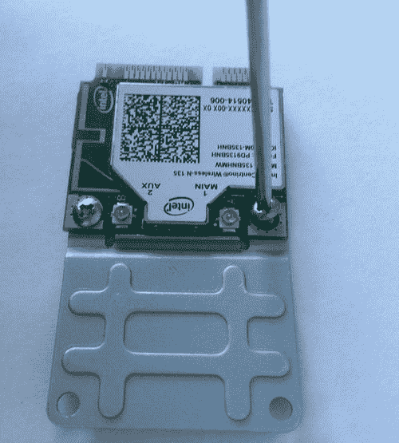
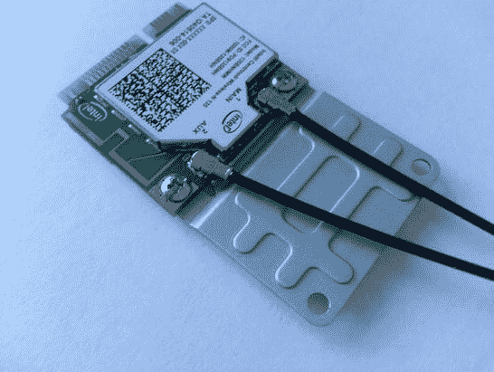
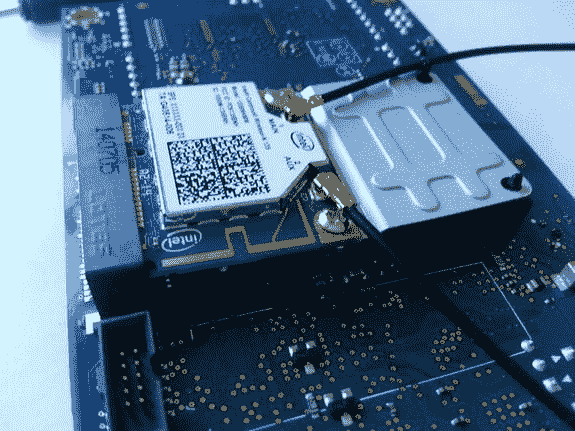
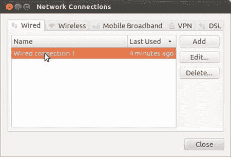
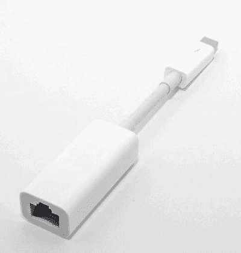
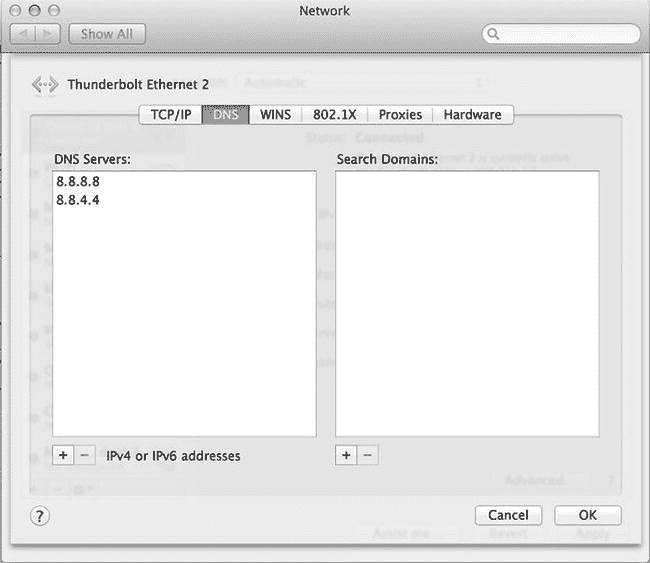
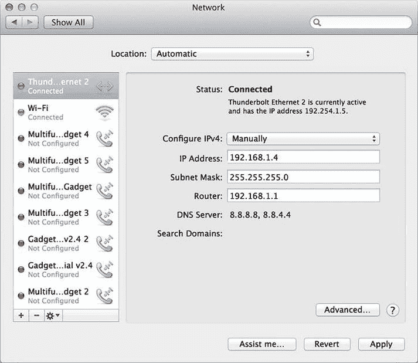
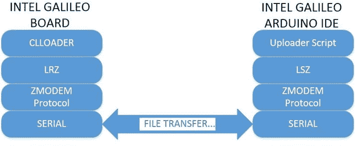
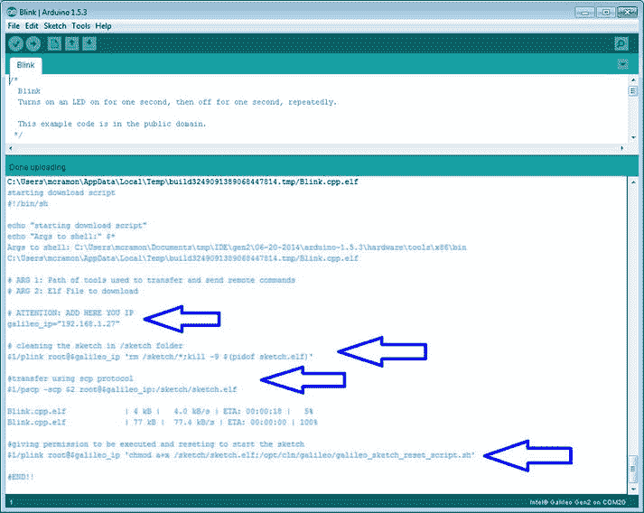

第五章


网络和黑客

计算机、移动设备、监控系统、机器人、相机、智能电视、恒温器和许多其他设备可以使用有线或无线接口相互通信。

这种通信的范围可以是简单的内部网或使用互联网的外部访问，使这些设备在世界任何地方都可以访问。

英特尔 Galileo 主板不仅是一个 Arduino 微控主板，还是由 Linux 操作系统操作的真正的微型计算机，其主板包含一个以太网接口和一个迷你 PCIe 插槽，可以接收迷你 PCIe 卡，包括 WiFi 卡。这种软件和硬件的结合使英特尔 Galileo 能够使用有线或无线适配器与内部网或互联网中的其他设备进行通信，就像普通计算机一样。

本章提供了有关如何:

*   安装 WiFi 卡和天线
*   为新的 WiFi 迷你 PCIe 卡添加固件
*   使用 Arduino WiFi API
*   黑掉 WiFi API，简化草图
*   通过以太网适配器创建动态和静态 IP
*   通过以太网使用电脑共享的互联网访问
*   运行 Arduino 以太网 API 的示例
*   简化以太网草图
*   在英特尔 Galileo 和其他计算机之间传输文件
*   黑掉 IDE，通过 TCP/IP 传输草图

在本章中，您将看到几个使用英特尔 Galileo 的 Linux 终端外壳的命令，所以请准备好您的串行电缆，如第 1 章中所述。

WiFi 卡

英特尔 Galileo 和英特尔 Galileo Gen 2 在主板底部包含一个迷你 PCIe 插槽，允许您使用迷你 PCIe 外形规格连接 WiFi、蓝牙、显卡和其他模块。

有了这种资源，将 WiFi 卡集成到主板的成本就降低了，因为 WiFi 迷你 PCIe 卡通常比 Arduino 的常规 WiFi shields 设计更便宜。然而，使用迷你 PCIe 卡并不妨碍您使用专门为 WiFi shields 创建的常规 Arduino API。例如，如果你正在使用迷你 PCIe 插槽的视频卡，但你需要一个 WiFi，你需要一个 WiFi 盾。

就软件而言，使用 WiFi 卡的唯一要求是 SD 图像版本。这是因为 SPI 版本没有足够的空间来容纳 Linux WiFi 驱动程序和卡的固件。

在英特尔提供的英特尔 Galileo SD 版本中，默认情况下支持英特尔 N135 迅驰，但在本章中，您将学习如何使用英特尔 6236A 添加其他卡。

 **注意**如果您的 WiFi 卡不是英特尔制造的，并且不受`iwlwifi`驱动程序的支持，此过程将不起作用。在这种情况下，有必要搜索您的驱动程序并将其集成到 Yocto 构建中，如第 2 章中的[所述。](02.html)

设置 WiFi 迷你 PCIe 卡

除了迷你 PCIe 卡，您还需要[表 5-1](#Tab1) 中列出的物品。

[表 5-1](#_Tab1) 。WiFi 练习材料清单

<colgroup><col width="20%"> <col width="80%"></colgroup> 
| 

数字

 | 

描述

 |
| --- | --- |
| one | 英特尔 WiFi 迷你 PCIe 英特尔迅驰 N135 或 6235A 型 |
| Two | 双频天线 350 毫米电缆 2118060-1 TE 连接 |
| one | 半高至全高迷你 PCIe 卡支架 |
| one | 微型 SD 卡(最低 4GB) |

在 Galileo 上安装这些卡的过程非常简单，如以下步骤所述:

1.  关闭英特尔 Galileo。启动前，移除 USB 和电源。
2.  Install the half to full height bracket. Connect the brackets using the little screws, as shown in [Figure 5-1](#Fig1).

    

    [图 5-1](#_Fig1) 。将支架连接到 WiFi 卡

3.  Connect the dual-band antennas in the card connector by pressing them down until you feel a small “click” in the connector. Check [Figure 5-2](#Fig2) for reference.

    

    [图 5-2](#_Fig2) 。连接到 WiFi 卡的天线

4.  Insert the WiFi mini-PCIe card at an angle, making sure the card’s contacts are connected to the slot, as shown in [Figure 5-3](#Fig3).

    

    [图 5-3](#_Fig3) 。倾斜连接 WiFi 卡和支架

5.  Press the bracket down and connect the bracket’s holes to the slot’s plastic clips until you feel a click. [Figure 5-4](#Fig4) shows the WiFi card properly connected.

    

    [图 5-4](#_Fig4) 。WiFi 卡安装正确

6.  从英特尔 Galileo 网站`https://communities.intel.com/docs/DOC-22226` *下载 BSP SD 卡图像。*
7.  将下载的图像传输到 FAT32 或 FAT 格式的 micro SD 卡,并将 SD 卡插入英特尔的 Galileo SD 卡插槽。
8.  连接电源，然后连接 USB 电缆(完全按照此顺序，如第 3 章中标题为*连接英特尔伽利略*的章节所述)。**

 **检查 WiFi 卡是否被识别

如果使用 Linux 终端 shell 按预期插入了卡，您可以键入`ifconfig -a`或`ifconfig wlan0`。您将看到以下输出:

```sh

root@clanton:~# ifconfig -a
eth0      Link encap:Ethernet HWaddr 98:4F:EE:01:4C:71
          UP BROADCAST MULTICAST MTU:1500 Metric:1
          RX packets:0 errors:0 dropped:0 overruns:0 frame:0
          TX packets:1 errors:0 dropped:0 overruns:0 carrier:0
          collisions:0 txqueuelen:1000
          RX bytes:0 (0.0 B) TX bytes:322 (322.0 B)
          Interrupt:40 Base address:0x8000

lo        Link encap:Local Loopback
          inet addr:127.0.0.1 Mask:255.0.0.0
          inet6 addr: ::1/128 Scope:Host
          UP LOOPBACK RUNNING MTU:65536 Metric:1
          RX packets:0 errors:0 dropped:0 overruns:0 frame:0
          TX packets:0 errors:0 dropped:0 overruns:0 carrier:0
          collisions:0 txqueuelen:0
          RX bytes:0 (0.0 B) TX bytes:0 (0.0 B)

wlan0     Link encap:Ethernet HWaddr 0C:D2:92:58:F8:27
          BROADCAST MULTICAST MTU:1500 Metric:1
          RX packets:0 errors:0 dropped:0 overruns:0 frame:0
          TX packets:0 errors:0 dropped:0 overruns:0 carrier:0
          collisions:0 txqueuelen:1000
          RX bytes:0 (0.0 B) TX bytes:0 (0.0 B)
```

你应该能看到`wlan0`界面。如果此界面没有显示，这意味着 SD 图像没有被您的卡识别，因为缺少固件或卡安装不正确。要解决此问题，请阅读本章中的“添加新的 WiFi 卡”一节。

如果显示了`wlan0`接口，则此时没有与该接口相关联的 IP。您需要扫描 WiFi 路由器，并使用正确的凭证和验证方法来连接英特尔 Galileo。

添加对新 WiFi 卡的支持

仅当您有一张未被识别的迷你 PCIe WiFi 卡时，此部分才有用。否则，您可以继续下一部分。

如果您的迷你 PCIe WiFi 卡未被识别，并且您确定已将该卡正确连接到迷你 PCIe 插槽，则 SD 卡映像可能不包含您的卡所需的固件，您需要添加它。另一种可能是你的卡损坏了。

如果你的卡没问题，你只需要把 WiFi 卡的固件转移到`/lib/firmware`文件夹，然后重启系统。

例如，如果您的迷你 PCIe WiFi 卡是英特尔的，请使用以下步骤升级您的 SD 映像以支持新卡:

1.  访问站点`http://wireless.kernel.org/en/users/Drivers/iwlwifi` *。*
2.  On this web site, search for the `Firmware` section and download the firmware corresponding to your card. [Figure 5-5](#Fig5) shows a list of the newest cards available from the web site.

    

    [图 5-5](#_Fig5) 。英特尔 WiFi 卡

3.  将文件传输到英特尔 Galileo。您可以使用`scp`或`ftp`进行传输，或者简单地将文件复制到您的 SD 卡，或者将 USB 驱动器连接到英特尔 Galileo。有关详细信息，请阅读本章中题为“在英特尔 Galileo 和计算机之间传输文件”的部分。例如，您可以将下载的文件复制到您的`/root/home`目录下的临时文件中。
4.  提取压缩的 tar 文件。例如:

    ```sh
    root@clanton:~/tmp# tar -zxvf iwlwifi-6000g2b-ucode-18.168.6.1.tgz
    iwlwifi-6000g2b-ucode-18.168.6.1/
    iwlwifi-6000g2b-ucode-18.168.6.1/iwlwifi-6000g2b-6.ucode
    iwlwifi-6000g2b-ucode-18.168.6.1/README.iwlwifi-6000g2b-ucode
    iwlwifi-6000g2b-ucode-18.168.6.1/LICENSE.iwlwifi-6000g2b-ucode
    ```

5.  您真正需要的文件有一个`.ucode`扩展名。将该文件移动到`/lib/firmware`文件夹。

    ```sh
    mv iwlwifi-6000g2b-6.ucode /lib/firmware/.
    ```

6.  使用`reboot`命令重启系统。
7.  重启后，再次登录并使用`ifconfig wlan0`命令检查`wlan0`界面是否可用。

```sh
root@clanton:~# ifconfig wlan0
wlan0     Link encap:Ethernet HWaddr C8:F7:33:A4:56:1E
          BROADCAST MULTICAST MTU:1500 Metric:1
          RX packets:0 errors:0 dropped:0 overruns:0 frame:0
          TX packets:0 errors:0 dropped:0 overruns:0 carrier:0
          collisions:0 txqueuelen:1000
          RX bytes:0 (0.0 B) TX bytes:0 (0.0 B)
```

您的 SD 映像现在应该可以毫无问题地支持新的 WiFi 卡。

WiFi API

如果卡和固件被正确安装和识别，使用 WiFi 适配器创建一些草图是可能的。

本节通过展示 IDE 中的几个示例中的一些草图来介绍这个 API。这些示例还解释了如何优化这些草图，以便在英特尔 Galileo 上运行。

在 IDE 中的文件示例 WiFi 中有几个与 WiFi API 相关的示例。作为介绍，我们专门讨论了两个草图——一个扫描无线网络，另一个使用 WPA 或 WEP 连接到其中一个网络。

Arduino 的 WiFi API 的详细信息可在`http://arduino.cc/en/Reference/WiFi` *找到。*

扫描无线网络

第一个示例扫描无线网络并检查您的 WiFi 卡是否工作正常。

使用英特尔 Galileo IDE，通过选择文件示例 WiFi 扫描网络打开示例。

注意这段代码不在本章的`code`文件夹中，因为这个例子是你的 IDE 的一部分。

[清单 5-1](#list1) 显示了与这个扫描例子相关的代码。

[***清单 5-1***](#_list1) 。扫描网络。no

```sh
/*

 This example prints the WiFi shield's MAC address and
 scans for available WiFi networks using the WiFi shield.
 Every ten seconds, it scans again. It doesn't actually
 connect to any network, so no encryption scheme is specified.

 Circuit:
 * WiFi shield attached

 created 13 July 2010
 by dlf (Metodo2 srl)
 modified 21 Junn 2012
 by Tom Igoe and Jaymes Dec
 */

#include <SPI.h>
#include <WiFi.h>

void setup() {
  //Initialize serial and wait for port to open:
  Serial.begin(9600);
  while (!Serial) {
    ; // wait for serial port to connect. Needed for Leonardo only
  }

  // check for the presence of the shield:
  if (WiFi.status() == WL_NO_SHIELD) {
    Serial.println("WiFi shield not present");
    // don't continue:
    while(true);
  }

  String fv = WiFi.firmwareVersion();
  if( fv != "1.1.0" )
    Serial.println("Please upgrade the firmware");

  // Print WiFi MAC address:
  printMacAddress();

  // scan for existing networks:
  Serial.println("Scanning available networks...");
  listNetworks();
}

void loop() {
  delay(10000);
  // scan for existing networks:
  Serial.println("Scanning available networks...");
  listNetworks();
}

void printMacAddress() {
  // the MAC address of your WiFi shield
  byte mac[6];

  // print your MAC address:
  WiFi.macAddress(mac);
  Serial.print("MAC: ");
  Serial.print(mac[5],HEX);
  Serial.print(":");
  Serial.print(mac[4],HEX);
  Serial.print(":");
  Serial.print(mac[3],HEX);
  Serial.print(":");
  Serial.print(mac[2],HEX);
  Serial.print(":");
  Serial.print(mac[1],HEX);
  Serial.print(":");
  Serial.println(mac[0],HEX);
}

void listNetworks() {
  // scan for nearby networks:
  Serial.println("** Scan Networks **");
  int numSsid = WiFi.scanNetworks();
  if (numSsid == -1)
  {
    Serial.println("Couldn't get a wifi connection");
    while(true);
  }

  // print the list of networks seen:
  Serial.print("number of available networks:");
  Serial.println(numSsid);

  // print the network number and name for each network found:
  for (int thisNet = 0; thisNet<numSsid; thisNet++) {
    Serial.print(thisNet);
    Serial.print(") ");
    Serial.print(WiFi.SSID(thisNet));
    Serial.print("\tSignal: ");
    Serial.print(WiFi.RSSI(thisNet));
    Serial.print(" dBm");
    Serial.print("\tEncryption: ");
    printEncryptionType(WiFi.encryptionType(thisNet));
  }
}

void printEncryptionType(int thisType) {
  // read the encryption type and print out the name:
  switch (thisType) {
  case ENC_TYPE_WEP:
    Serial.println("WEP");
    break;
  case ENC_TYPE_TKIP:
    Serial.println("WPA");
    break;
  case ENC_TYPE_CCMP:
    Serial.println("WPA2");
    break;
  case ENC_TYPE_NONE:
    Serial.println("None");
    break;
  case ENC_TYPE_AUTO:
    Serial.println("Auto");
    break;
  }
}
```

运行草图，然后通过选择工具串行监视器或按 CTRL+SHIFT+M 打开 IDE 串行控制台。

在几秒钟内，您将能够看到您的 WiFi MAC 地址作为输出，以及围绕英特尔 Galileo 扫描的无线网络及其各自的功率水平和加密方法。例如:

```sh
MAC: 1E:56:A4:33:F7:C8
Scanning available networks...
** Scan Networks **
number of available networks:3
0) 55JW5        Signal: -89 dBm Encryption: None
1) PXDP6        Signal: -79 dBm Encryption: WPA2
2) WDJ36        Signal: -84 dBm Encryption: None
```

查看 ScanNetworks.ino

包含的`WiFi.h`标题可让您访问 WiFi 类和功能。草图中排除了一些关于对象实例化的静态方法。

```sh
#include <WiFi.h>
```

使用`WiFi`对象，程序检查 WiFi 卡是否到位:

```sh
if (WiFi.status() == WL_NO_SHIELD)
```

如果卡未安装，则返回`WL_NO_SHIELD` 并中止程序。然后，代码的下一部分检查固件版本:

```sh
String fv = WiFi.firmwareVersion();
  if( fv != "1.1.0" )
    Serial.println("Please upgrade the firmware");
```

该行检查固件版本，如果固件与最新版本不匹配，则打印一条警告消息。

草图通过调用`WiFi.macAddress()`并传递一个字节数组作为引用来打印 MAC 地址。这个调用是由本地功能`printMacAddress()` `.`完成的

```sh
void printMacAddress() {
  // the MAC address of your WiFi shield
  byte mac[6];

  // print your MAC address:
  WiFi.macAddress(mac);
  Serial.print("MAC: ");
  Serial.print(mac[5],HEX);
  Serial.print(":");
  Serial.print(mac[4],HEX);
  Serial.print(":");
  Serial.print(mac[3],HEX);
  Serial.print(":");
  Serial.print(mac[2],HEX);
  Serial.print(":");
  Serial.print(mac[1],HEX);
  Serial.print(":");
  Serial.println(mac[0],HEX);
}
```

`setup()`函数结束对本地函数`listNetworks()`的调用，这就是神奇的地方。

`listNetworks()`函数调用方法`WiFi.scanNetworks()`，该方法返回扫描过程中发现的 WiFi 网络总数。此时，会创建一个内部数组，从 0 开始，到找到的无线网络数减 1。该数组的每个元素包含与被扫描的每个网络相关的信息。

```sh
void listNetworks() {
  // scan for nearby networks:
  Serial.println("** Scan Networks **");
  int numSsid = WiFi.scanNetworks();
  if (numSsid == -1)
  {
    Serial.println("Couldn't get a wifi connection");
    while(true);
  }
...
...
...
}
```

为了检索每个被扫描网络的信息，方法是 *WiFi。SSID()* 、`WiFi.RSSI()` `, and `WiFi.encryptionType()` 被调用并作为引用传递给网络索引。`

 `该草图实现了一个`for`循环，使用适当的索引提到的方法打印每个网络的信息。

```sh
void listNetworks() {
...
...
...
  // print the network number and name for each network found:
  for (int thisNet = 0; thisNet<numSsid; thisNet++) {
    Serial.print(thisNet);
    Serial.print(") ");
    Serial.print(WiFi.SSID(thisNet));
    Serial.print("\tSignal: ");
    Serial.print(WiFi.RSSI(thisNet));
    Serial.print(" dBm");
    Serial.print("\tEncryption: ");
    printEncryptionType(WiFi.encryptionType(thisNet));
  }
}
```

请注意，方法`WiFi.encryptionType`()返回指定所用加密的整数，并由本地函数`printEncryptionType()` 正确解析。

```sh
void printEncryptionType(int thisType) {
  // read the encryption type and print out the name:
  switch (thisType) {
  case ENC_TYPE_WEP:
    Serial.println("WEP");
    break;
  case ENC_TYPE_TKIP:
    Serial.println("WPA");
    break;
  case ENC_TYPE_CCMP:
    Serial.println("WPA2");
    break;
  case ENC_TYPE_NONE:
    Serial.println("None");
    break;
  case ENC_TYPE_AUTO:
    Serial.println("Auto");
    break;
  }
}
```

如果你能列出可用的无线网络。下一步是连接到这些网络中的一些，这将在下一节中解释。

连接到 WPA 或 WEB

选择您可以访问的 WiFi 网络，并确定该网络需要 WPA (WiFi 保护访问)还是 WEP(有线等效隐私)。使用英特尔 Galileo IDE，打开以下示例之一:

1.  如果 WiFi 网络请求 WPA，打开示例文件示例 WiFi  `ConnectWithWPA`。参见[清单 5-2](#list2) 。
2.  如果 WiFi 网络请求 WEP，打开示例文件示例 WiFi  `ConnectWithWEP`。参见[清单 5-3](#list3) 。

[***清单 5-2***](#_list2) 。`ConnectWithWPA.ino`

```sh
/*

 This example connects to an unencrypted WiFi network.
 Then it prints the MAC address of the WiFi shield,
 the IP address obtained, and other network details.

 Circuit:
 * WiFi shield attached

 created 13 July 2010
 by dlf (Metodo2 srl)
 modified 31 May 2012
 by Tom Igoe
 */
 #include <WiFi.h>

char ssid[] = "yournetwork";     //  your network SSID (name)
char pass[] = "secretPassword";  // your network password
int status = WL_IDLE_STATUS;     // the WiFi radio's status

void setup() {
  //Initialize serial and wait for port to open:
  Serial.begin(9600);
  while (!Serial) {
    ; // wait for serial port to connect. Needed for Leonardo only
  }

  // check for the presence of the shield:
  if (WiFi.status() == WL_NO_SHIELD) {
    Serial.println("WiFi shield not present");
    // don't continue:
    while(true);
  }

  String fv = WiFi.firmwareVersion();
  if( fv != "1.1.0" )
    Serial.println("Please upgrade the firmware");

 // attempt to connect to WiFi network:
 while ( status != WL_CONNECTED) {
    Serial.print("Attempting to connect to WPA SSID: ");
    Serial.println(ssid);
    // Connect to WPA/WPA2 network:
    status = WiFi.begin(ssid, pass);

    // wait 10 seconds for connection:
    delay(10000);
  }

  // you're connected now, so print out the data:
  Serial.print("You're connected to the network");
  printCurrentNet();
  printWifiData();

}

void loop() {
  // check the network connection once every 10 seconds:
  delay(10000);
  printCurrentNet();
}

void printWifiData() {
  // print your WiFi shield's IP address:
  IPAddress ip = WiFi.localIP();
    Serial.print("IP Address: ");
  Serial.println(ip);
  Serial.println(ip);

  // print your MAC address:
  byte mac[6];
  WiFi.macAddress(mac);
  Serial.print("MAC address: ");
  Serial.print(mac[5],HEX);
  Serial.print(":");
  Serial.print(mac[4],HEX);
  Serial.print(":");
  Serial.print(mac[3],HEX);
  Serial.print(":");
  Serial.print(mac[2],HEX);
  Serial.print(":");
  Serial.print(mac[1],HEX);
  Serial.print(":");
  Serial.println(mac[0],HEX);

}

void printCurrentNet() {
  // print the SSID of the network you're attached to:
  Serial.print("SSID: ");
  Serial.println(WiFi.SSID());

  // print the MAC address of the router you're attached to:
  byte bssid[6];
  WiFi.BSSID(bssid);
  Serial.print("BSSID: ");
  Serial.print(bssid[5],HEX);
  Serial.print(":");
  Serial.print(bssid[4],HEX);
  Serial.print(":");
  Serial.print(bssid[3],HEX);
  Serial.print(":");
  Serial.print(bssid[2],HEX);
  Serial.print(":");
  Serial.print(bssid[1],HEX);
  Serial.print(":");
  Serial.println(bssid[0],HEX);

  // print the received signal strength:
  long rssi = WiFi.RSSI();
  Serial.print("signal strength (RSSI):");
  Serial.println(rssi);

  // print the encryption type:
  byte encryption = WiFi.encryptionType();
  Serial.print("Encryption Type:");
  Serial.println(encryption,HEX);
  Serial.println();
}
```

[***清单 5-3***](#_list3) 。`ConnectWithWEP.ino`

```sh
/*

 This example connects to a WEP-encrypted WiFi network.
 Then it prints the MAC address of the WiFi shield,
 the IP address obtained, and other network details.

 If you use 40-bit WEP, you need a key that is 10 characters long,
 and the characters must be hexadecimal (0-9 or A-F).
 e.g.  for 40-bit, ABBADEAF01 will work, but ABBADEAF won't work
 (too short) and ABBAISDEAF won't work (I and S are not
 hexadecimal characters).

 For 128-bit, you need a string that is 26 characters long.
 D0D0DEADF00DABBADEAFBEADED will work because it's 26 characters,
 all in the 0-9, A-F range.

 Circuit:
 * WiFi shield attached

 created 13 July 2010
 by dlf (Metodo2 srl)
 modified 31 May 2012
 by Tom Igoe
 */
#include <WiFi.h>

char ssid[] = "yourNetwork";               // your network SSID (name)
char key[] = "D0D0DEADF00DABBADEAFBEADED"; // your network key
int keyIndex = 0;                          // your network key Index number
int status = WL_IDLE_STATUS;               // the WiFi radio's status

void setup() {
  //Initialize serial and wait for port to open:
  Serial.begin(9600);
  while (!Serial) {
    ; // wait for serial port to connect. Needed for Leonardo only
  }

  // check for the presence of the shield:
  if (WiFi.status() == WL_NO_SHIELD) {
    Serial.println("WiFi shield not present");
    // don't continue:
    while(true);
  }

  String fv = WiFi.firmwareVersion();
  if( fv != "1.1.0" )
    Serial.println("Please upgrade the firmware");

  // attempt to connect to Wifi network:
  while ( status != WL_CONNECTED) {
    Serial.print("Attempting to connect to WEP network, SSID: ");
    Serial.println(ssid);
    status = WiFi.begin(ssid, keyIndex, key);

    // wait 10 seconds for connection:
    delay(10000);
  }

  // once you are connected :
  Serial.print("You're connected to the network");
  printCurrentNet();
  printWifiData();
}

void loop() {
  // check the network connection once every 10 seconds:
  delay(10000);
  printCurrentNet();
}

void printWifiData() {
  // print your WiFi shield's IP address:
  IPAddress ip = WiFi.localIP();
  Serial.print("IP Address: ");
  Serial.println(ip);
  Serial.println(ip);

  // print your MAC address:
  byte mac[6];
  WiFi.macAddress(mac);
  Serial.print("MAC address: ");
  Serial.print(mac[5],HEX);
  Serial.print(":");
  Serial.print(mac[4],HEX);
  Serial.print(":");
  Serial.print(mac[3],HEX);
  Serial.print(":");
  Serial.print(mac[2],HEX);
  Serial.print(":");
  Serial.print(mac[1],HEX);
  Serial.print(":");
  Serial.println(mac[0],HEX);
}

void printCurrentNet() {
  // print the SSID of the network you're attached to:
  Serial.print("SSID: ");
  Serial.println(WiFi.SSID());

  // print the MAC address of the router you're attached to:
  byte bssid[6];
  WiFi.BSSID(bssid);
  Serial.print("BSSID: ");
  Serial.print(bssid[5],HEX);
  Serial.print(":");
  Serial.print(bssid[4],HEX);
  Serial.print(":");
  Serial.print(bssid[3],HEX);
  Serial.print(":");
  Serial.print(bssid[2],HEX);
  Serial.print(":");
  Serial.print(bssid[1],HEX);
  Serial.print(":");
  Serial.println(bssid[0],HEX);

  // print the received signal strength:
  long rssi = WiFi.RSSI();
  Serial.print("signal strength (RSSI):");
  Serial.println(rssi);

  // print the encryption type:
  byte encryption = WiFi.encryptionType();
  Serial.print("Encryption Type:");
  Serial.println(encryption,HEX);
  Serial.println();
}
```

这两个例子都有相同的目标，那就是提供对您的 WiFi 网络的访问。两个程序之间有一些小的变化，我们将在后面介绍。为了使这些示例能够工作，有必要提供您的凭据。如果您使用的是 WPA 示例，唯一必须更改的行位于草图的开头:

```sh
#include <WiFi.h>

char ssid[] = "yourNetwork";     // your network SSID (name)
char pass[] = "secretPassword";  // your network password
int status = WL_IDLE_STATUS;     // the Wifi radio's status
```

如果你使用 WEP 示例，你需要提供用户名和网络的密钥和密钥索引。如果 WEP 使用 40 位，密钥长度应为 10 个字符；如果 WEP 使用 128 位，密钥长度应为 26 个字符。

```sh
#include <WiFi.h>

char ssid[] = "yourNetwork";                // your network SSID (name)
char key[] = "D0D0DEADF00DABBADEAFBEADED";  // your network key
int keyIndex = 0;                           // your network key Index number
```

使用您的凭证编辑这些行，并运行草图。一旦运行，通过使用工具串行监视器或按 CTRL+SHIFT+M 打开 IDE 串行控制台。

几秒钟后，您将在 IDE 串行控制台中看到类似的消息:

```sh
Attempting to connect to WPA SSID: S6KFF
You're connected to the networkSSID: S6KFF
BSSID: C6:0:7B:28:7F:0
signal strength (RSSI):-58
Encryption Type:4

IP Address: 192.168.  1.  7
192.168.  1.  7
MAC address: 27:F8:58:92:D2:C
SSID: S6KFF
BSSID: C6:0:7B:28:7F:0
signal strength (RSSI):-58
Encryption Type:4
```

这个例子使用了 WPA。网络名是`S6KFF`(我个人的)，IP 如预期获得(`192.168.1.7)`)。例子中 WiFi 卡的 MAC 地址是`0x27f85892d20c`。

如果您连接了 USB 电缆并打开了终端外壳，与 Linux 终端外壳并行，您将看到如下消息:

```sh
[  736.741664] wlan0: deauthenticating from 00:7f:28:7b:00:c6 by local choice (reason=3)
[  736.762909] cfg80211: Calling CRDA to update world regulatory domain
[  741.827223] iwlwifi 0000:01:00.0: L1 Disabled; Enabling L0S
[  741.841249] iwlwifi 0000:01:00.0: Radio type=0x0-0x0-0x0
[  742.111928] IPv6: ADDRCONF(NETDEV_UP): wlan0: link is not ready
[  742.598315] wlan0: authenticate with 00:7f:28:7b:00:c6
[  742.643220] wlan0: send auth to 00:7f:28:7b:00:c6 (try 1/3)
[  742.650993] wlan0: authenticated
[  742.660676] wlan0: associate with 00:7f:28:7b:00:c6 (try 1/3)
[  742.670682] wlan0: RX AssocResp from 00:7f:28:7b:00:c6 (capab=0x431 status=0 aid=1)
[  742.682587] wlan0: associated
[  742.685652] IPv6: ADDRCONF(NETDEV_CHANGE): wlan0: link becomes ready
```

当使用 WPA 获取 IP 时，会出现这些消息。请注意消息`"wlan0: link becomes ready"`，它表示`wlan0`已准备好使用。

如果 WiFi 路由器连接到互联网，尝试使用终端外壳 ping 英特尔:

```sh
root@clanton:~# ping www.intel.com
PING www.intel.com (63.80.4.74): 56 data bytes
64 bytes from 63.80.4.74: seq=0 ttl=60 time=26.506 ms
64 bytes from 63.80.4.74: seq=1 ttl=60 time=26.525 ms
64 bytes from 63.80.4.74: seq=2 ttl=60 time=28.880 ms
64 bytes from 63.80.4.74: seq=3 ttl=60 time=27.931 ms
```

查看 connectwithwa . ino 和 ConnectWithWEP.ino

示例中使用的代码非常简单，在 WPA 和 WEP 示例之间有微小的变化。整个连接过程从`setup()`功能开始。

最初，有必要按照上一节中的说明提供凭证。然后，程序确定卡是否就位:

```sh
if (WiFi.status() == WL_NO_SHIELD)
```

如果卡未安装，则返回`WL_NO_SHIELD`并中止程序。然后，代码的下一部分检查固件版本:

```sh
String fv = WiFi.firmwareVersion();
  if( fv != "1.1.0" )
    Serial.println("Please upgrade the firmware");
```

该行检查固件版本，如果固件与最新版本不匹配，则打印一条警告消息。不用担心这个方法，因为 BSP 总是返回`1.1.0`。这种方法对英特尔 Galileo 无效。

使用`WiFi.begin()` 调用建立连接。如果您使用的是 WPA 示例，以下代码片段描述了连接过程:

```sh
// attempt to connect to Wifi network:
while ( status != WL_CONNECTED) {
  Serial.print("Attempting to connect to WPA SSID: ");
  Serial.println(ssid);
  // Connect to WPA/WPA2 network:
  status = WiFi.begin(ssid, pass);

  // wait 10 seconds for connection:
  delay(10000);
}
```

如果您使用 WEP，以下代码片段将建立连接:

```sh
while ( status != WL_CONNECTED) {
    Serial.print("Attempting to connect to WEP network, SSID: ");
    Serial.println(ssid);
    status = WiFi.begin(ssid, keyIndex, key);

    // wait 10 seconds for connection:
    delay(10000);
}

```

在这两个例子中，程序每隔 10 秒就会尝试通过`WiFi.begin()`函数调用连接，这是由`delay()`函数计算的，并且会在`while`循环中不断尝试，直到`WiFi.begin()`返回的状态为`WL_CONNECTED`。

唯一的区别在于`begin()`方法。对于 WPA，用户凭证通过`WiFi.begin(ssid, pass`传递，而对于 WEP，密钥通过`WiFi.begin(ssid, keyIndex, key)`使用。

程序的其余部分对于 WPA 和 WEP 是相同的。`loop()`函数调用`printCurrentNet()`，它打印一些关于连接的信息。例如，`WiFi.BSSID()`连接路由器的 MAC 地址，`WiFi.RSSI()`报告信号强度，`WiFi.encryptionType()`报告加密类型。

黑掉 WiFi 库

这种攻击适用于英特尔伽利略和英特尔伽利略第二代。

如果您使用了本章“测试 WiFi 迷你 PCIe”一节中提到的草图，或者使用了 IDE 中运行其他 WiFi 示例的任何其他草图，您应该会注意到，每次运行草图时，都会重新连接到 WiFi 路由器。这需要时间。如果你正在开发一个需要 WiFi 的项目，这肯定会被认为是一个巨大的烦恼。

但是，考虑到英特尔 Galileo 主板使用 Linux 作为操作系统，可以将主板中的 WiFi 连接设置为持久连接。随着草图的一些变化，开发过程将变得非常快。

换句话说，只要主板启动或网络接口重启，英特尔 Galileo 就会尝试建立连接，而无需任何草图或本机代码。

由于 WiFi 连接由 Linux 内核处理，草图不需要找到 SSID。相反，草图将使用现有的连接，这将极大地改善草图开发周期。

为此，请遵循以下步骤:

1.  在 Linux 操作系统上使用终端 shell 设置连接。
2.  重新启动无线接口。
3.  在 WiFi 库类中执行一个小黑客。

步骤 1:设置 WiFi 连接

在 Linux for Intel Galileo 的上下文中，WiFi 卡用名为`wlan0` 的接口枚举。这个接口将在终端 shell 命令行中多次提到。

以下部分解释了如何为 WPA 和 WEP 连接创建这样的设置。

与 WPA 的持久连接

您可以使用命令行工具`wpa_passphrase`为 WPA 连接生成 PSK(预共享密钥)。您需要传递网络名称(SSID)和密码来连接到该命令。然后可以创建如下所示的配置文件:

```sh
root@clanton:~# wpa_passphrase YOUR_SSID YOUR_PASSWORD_HERE > /etc/wpa_supplicant.conf
```

然后，您可以通过编辑`/etc/network/interfaces`文件将英特尔 Galileo 设置为自动连接到 WiFi 路由器。您可以使用`vi`编辑器在命令 shell 中直接编辑这个文件。

```sh
root@clanton:~# vi /etc/network/interfaces
```

在`iface wlan0`的开头添加了`auto wlan0`指令，如下图所示:

```sh
# /etc/network/interfaces -- configuration file for ifup(8), ifdown(8)

# The loopback interface
auto lo
iface lo inet loopback

# Wireless interfaces
auto wlan0
iface wlan0 inet dhcp
        wireless_mode managed
        wireless_essid any
        wpa-driver wext
        wpa-conf /etc/wpa_supplicant.conf

iface atml0 inet dhcp

# Wired or wireless interfaces
auto eth0
iface eth0 inet dhcp
iface eth1 inet dhcp

# Ethernet/RNDIS gadget (g_ether)
# ... or on host side, usbnet and random hwaddr
iface usb0 inet static
        address 192.168.7.2
        netmask 255.255.255.0
        network 192.168.7.0
        gateway 192.168.7.1

# Bluetooth networking
iface bnep0 inet dhcp
```

注意，WPA 搜索您用`wpa_passphrase`创建的文件`/etc/wpa_supplicant.conf` *、*，观察`wpa-conf /etc/wpa_supplicant.conf`字段。

与 WEP 的持续连接

WEP 程序类似于 WPA 程序。

编辑`/etc/network/interfaces`文件并将行`auto wlan0`添加到`iface wlan0`的顶部，遵循上一节讨论的 WPA 配置中使用的相同过程。

还必须包括 SSID 和要使用的密钥。请参见以下示例:

```sh
# /etc/network/interfaces -- configuration file for ifup(8), ifdown(8)

# The loopback interface
auto lo
iface lo inet loopback

# Wireless interfaces
auto wlan0
iface wlan0 inet dhcp
        wireless_mode managed
        wireless-essid your_network_ssid
        wireless-key 0123456789ABCDEF0123456789
        wpa-driver wext

iface atml0 inet dhcp

# Wired or wireless interfaces
auto eth0
iface eth0 inet dhcp
iface eth1 inet dhcp

# Ethernet/RNDIS gadget (g_ether)
# ... or on host side, usbnet and random hwaddr
iface usb0 inet static
        address 192.168.7.2
        netmask 255.255.255.0
        network 192.168.7.0
        gateway 192.168.7.1

# Bluetooth networking
iface bnep0 inet dhcp
```

步骤 2:重新启动无线连接

通过键入以下命令重新启动连接:

```sh
root@clanton:~# /etc/init.d/networking restart
```

如果 WiFi 路由器被识别并且连接被接受，将会出现类似于以下输出的内容:

```sh
Running /etc/init.d/networking restart is deprecated because it may not enable again some interfaces
Reconfiguring network interfaces...
[ 5786.598692] wlan0: deauthenticating from 00:7f:28:7b:00:c6 by local choice (reason=3)
[ 5786.630939] cfg80211: Calling CRDA to update world regulatory domain
ifdown: interface eth0 not configured
Successfully initialized wpa_sup[ 5786.932111] iwlwifi 0000:01:00.0: L1 Disabled; Enabling L0S
plicant
[ 5786.946981] iwlwifi 0000:01:00.0: Radio type=0x0-0x0-0x0
[ 5787.228184] IPv6: ADDRCONF(NETDEV_UP): wlan0: link is not ready
udhcpc (v1.20.2) started
Sending discover...
[ 5787.881882] wlan0: authenticate with 00:7f:28:7b:00:c6
[ 5787.925896] wlan0: send auth to 00:7f:28:7b:00:c6 (try 1/3)
[ 5787.933589] wlan0: authenticated
[ 5787.940668] wlan0: associate with 00:7f:28:7b:00:c6 (try 1/3)
[ 5787.950731] wlan0: RX AssocResp from 00:7f:28:7b:00:c6 (capab=0x431 status=0 aid=3)
[ 5787.962655] wlan0: associated
[ 5787.965719] IPv6: ADDRCONF(NETDEV_CHANGE): wlan0: link becomes ready
Sending discover...
Sending select for 192.168.1.10...
Lease of 192.168.1.10 obtained, lease time 86400
/etc/udhcpc.d/50default: Adding DNS 192.168.1.1
udhcpc (v1.20.2) started
Sending discover...
Sending discover...
Sending discover...
No lease, failing
```

在这种情况下，`wlan0`可用，并且完成了到 WiFi 路由器的连接，因此 IP 被接收并且 DNS 被成功设置。如果您重新启动主板，WiFi 连接将自动重新建立。

也可以分别使用`ifdown`和`ifup`命令`,`禁用和启用接口。只需键入命令后跟“`wlan0`”字符串来指定无线接口。请参见以下示例:

```sh
root@clanton:/etc/network# ifdown wlan0
[  717.113913] wlan0: deauthenticating from 00:7f:28:7b:00:c6 by local choice (reason=3)
[  717.150903] cfg80211: Calling CRDA for country: US

root@clanton:/etc/network# ifup wlan0
Successfully initialized wpa_sup[  722.047319] iwlwifi 0000:01:00.0: L1 Disabled; Enabling L0S
plicant
[  722.062243] iwlwifi 0000:01:00.0: Radio type=0x0-0x0-0x0
[  722.347953] IPv6: ADDRCONF(NETDEV_UP): wlan0: link is not ready
udhcpc (v1.20.2) started
Sending discover...
[  723.026324] wlan0: authenticate with 00:7f:28:7b:00:c6
[  723.080172] wlan0: send auth to 00:7f:28:7b:00:c6 (try 1/3)
[  723.087765] wlan0: authenticated
[  723.100140] wlan0: associate with 00:7f:28:7b:00:c6 (try 1/3)
[  723.110014] wlan0: RX AssocResp from 00:7f:28:7b:00:c6 (capab=0x431 status=0 aid=3)
[  723.122344] wlan0: associated
[  723.125408] IPv6: ADDRCONF(NETDEV_CHANGE): wlan0: link becomes ready
Sending discover...
Sending select for 192.168.1.7...
Lease of 192.168.1.7 obtained, lease time 86400
/etc/udhcpc.d/50default: Adding DNS 192.168.1.1
```

步骤 3:入侵 WiFi 类

此时，英特尔 Galileo WPA 或 WEP 连接过程保持有效，因此您需要在 WiFi 类中做一点小小的更改，以允许 sketch 使用此 Linux 连接，而不是必须非常快速地再次经历整个过程。

为了理解这是如何可能的，看一看在 WiFi 库类中实现的`begin()`方法。打开`./hardware/arduino/x86/libraries/WiFi/WiFi.cpp`文件，搜索两个`begin()`方法:

```sh
int WiFiClass::begin(char* ssid, uint8_t key_idx, const char *key)
{
        char cmd[256];
        trace_debug("begin ssid=%s,key_idx=%d,key=%s",ssid,key_idx,key);
        /*
        iwconfig [interface] mode managed key [WEP key]
        (128 bit WEP use 26 hex characters, 64 bit WEP uses 10)
        */
        if(ssid == NULL)
                return WL_NO_SSID_AVAIL;
        if(key == NULL)
                return WL_CONNECT_FAILED;
        sprintf(cmd, "iwconfig wlan0 mode managed key %s", key);
        system(cmd);
        sprintf(cmd, "iwconfig wlan0 essid %s", ssid);
        system(cmd);
        sprintf(cmd, "ifup %s", ARDUINO_WLAN);
        system(cmd);
        delay(5000);
        _local_ip = getLocalIP();
        if(_local_ip._sin.sin_addr.s_addr == 0) {
                trace_debug("didnt get an IP address, cant connect");
                sprintf(cmd, "ifdown %s", ARDUINO_WLAN);
                _status = WL_IDLE_STATUS;
                return _status;
        }
        _subnet = getSubnet();
        strcpy(_ssid, ssid);
        _status = WL_CONNECTED;
        return _status;
}

int WiFiClass::begin(char* ssid, const char *passphrase)
{
        char cmd[256];
        trace_debug("begin ssid=%s,passphrase=%s",ssid,passphrase);
        if(ssid == NULL)
                return WL_NO_SSID_AVAIL;
        if(passphrase == NULL)
                return WL_CONNECT_FAILED;
        sprintf(cmd, "iwconfig wlan0 mode managed");
        system(cmd);
        sprintf(cmd, "iwconfig wlan0 essid %s", ssid);
        system(cmd);
        sprintf(cmd, "wpa_passphrase %s %s  > /etc/wpa_supplicant.conf",
                        ssid, passphrase);
        system(cmd);
        sprintf(cmd, "ifup %s", ARDUINO_WLAN);
        system(cmd);
        delay(5000);
        _local_ip = getLocalIP();
        if(_local_ip._sin.sin_addr.s_addr == 0) {
                trace_debug("didnt get an IP address, cant connect");
                sprintf(cmd, "ifdown %s", ARDUINO_WLAN);
                _status = WL_IDLE_STATUS;
                return _status;
        }
        _subnet = getSubnet();
        strcpy(_ssid, ssid);
        _status = WL_CONNECTED;
        return _status;
}
```

第一种`begin()`方法用于 WEP 连接，第二种用于 WPA 连接。如果你看一下这两种方法中的粗体代码，草图试图做你已经手动完成的同样的程序，但是不使用在`/etc/network/interfaces`中出现的`wlan0`的配置。文件，草图使用`iwconfig`、`wpa_passphrase`和`ifup`命令。换句话说，系统调用将命令发送到 Linux，就像在终端 shell 中输入命令一样。

`iwconfig`命令工具设置无线接口。在用于 WPA 和 WEP 的`begin()`方法中，分别使用了`iwconfig wlan0 mode managed`和`iwconfig wlan0 mode managed key %s`命令。这些命令将`wlan0`接口设置为由名为`mode managed`的接入点管理。换句话说，接入点将决定英特尔 Galileo 可能驻留的信道频率。注意，在 WEP 中，密钥包含在命令行的末尾，`%s`将接收传递给`begin()`方法的字符指针`key`。这是命令的关键部分。如果 WEP 使用 40 位加密，则该密钥可能由 10 个十六进制字符串表示；如果 WEP 加密是 128 位，则该密钥可能由 26 个十六进制字符串表示。

`iwconfig`和的下一个用法是用`iwconfig wlan0 essid %s`设置 SSID 名称，其中`%s`接收带有网络 SSID 名称的字符指针 SSID。

在 WPA 中，还有一个`wpa_passphrase`命令，其使用方式与本章“WPA 的持久连接”一节中的使用方式相同。在这种情况下，它只是为 WPA 连接生成一个配置文件。

这两个方法都调用`ifup wlan0`(因为`ARDUINO_WLAN`是字符串`"wlan0`)，以使`wlan0`接口可用。更糟糕的是，`delay()`函数在这个过程中实现了 5 秒钟的延迟。

最后，两种方法中的原始代码通过`getLocalIP()` 检查 IP 是否可用。如果是，则返回状态`WL_CONNECTED`；否则，就用`WL_IDLE_STATUS`。

当手动配置 WiFi 连接并将其保存在英特尔 Galileo 中时，一旦 Linux 可以处理连接，系统只需确定是否有 IP 可用于`wlan0`接口。

因此，如果您正在开发一个使用 WiFi 的项目，并且希望通过避免这一过程来加速草图的执行，请对代码进行以下简单的更改:

```sh
int WiFiClass::begin(char* ssid, uint8_t key_idx, const char *key)
{
        char cmd[256];

        local_ip = getLocalIP();
        if(_local_ip._sin.sin_addr.s_addr == 0) {

            trace_debug("begin ssid=%s,key_idx=%d,key=%s",ssid,key_idx,key);
            /*
            iwconfig [interface] mode managed key [WEP key]
            (128 bit WEP use 26 hex characters, 64 bit WEP uses 10)
            */
            if(ssid == NULL)
                return WL_NO_SSID_AVAIL;
            if(key == NULL)
                return WL_CONNECT_FAILED;
            sprintf(cmd, "iwconfig wlan0 mode managed key %s", key);
            system(cmd);
            sprintf(cmd, "iwconfig wlan0 essid %s", ssid);
            system(cmd);
            sprintf(cmd, "ifup %s", ARDUINO_WLAN);
            system(cmd);
            delay(5000);
            _local_ip = getLocalIP();
            if(_local_ip._sin.sin_addr.s_addr == 0) {
                trace_debug("didnt get an IP address, cant connect");
                    sprintf(cmd, "ifdown %s", ARDUINO_WLAN);
                    _status = WL_IDLE_STATUS;
                    return _status;
            }
        }
        _subnet = getSubnet();
        strcpy(_ssid, ssid);
        _status = WL_CONNECTED;
        return _status;
}

int WiFiClass::begin(char* ssid, const char *passphrase)
{
        char cmd[256];

        local_ip = getLocalIP();
        if(_local_ip._sin.sin_addr.s_addr == 0) {

             trace_debug("begin ssid=%s,passphrase=%s",ssid,passphrase);
             if(ssid == NULL)
                     return WL_NO_SSID_AVAIL;
             if(passphrase == NULL)
                     return WL_CONNECT_FAILED;
             sprintf(cmd, "iwconfig wlan0 mode managed");
             system(cmd);
             sprintf(cmd, "iwconfig wlan0 essid %s", ssid);
             system(cmd);
             sprintf(cmd, "wpa_passphrase %s %s  > /etc/wpa_supplicant.conf",
                        ssid, passphrase);
             system(cmd);
             sprintf(cmd, "ifup %s", ARDUINO_WLAN);
             system(cmd);
             delay(5000);
             _local_ip = getLocalIP();
             if(_local_ip._sin.sin_addr.s_addr == 0) {
                     trace_debug("didnt get an IP address, cant connect");
                     sprintf(cmd, "ifdown %s", ARDUINO_WLAN);
                     _status = WL_IDLE_STATUS;
                     return _status;
             }

        }
        _subnet = getSubnet();
        strcpy(_ssid, ssid);
        _status = WL_CONNECTED;
        return _status;
}
```

首先，代码通过函数`getLocalIP()`确定接口`wlan0`是否有有效的 IP。如果有，则避免认证过程。这意味着，一旦配置好这些字段(如第一步所示)，就不需要在草图中指定 SSID、密码或密钥。

您可以再次运行[清单 5-1](#list1) 和[清单 5-2](#list2) 中的草图，而无需更改 SSID、密钥或密码。这些程序将运行得非常快，并且完美地工作。

以太网 API

拥有英特尔 Galileo 主板的一个优势是以太网连接器的存在，它消除了对外部屏蔽的需要。Quark SoC 支持两个以太网接口，但英特尔 Galileo 主板上只有一个。

在以太网 API 方面，英特尔 Galileo 符合 Arduino 参考标准。这个 API 上实现了几个类:`Ethernet`、`EthernetClient`、、`EthernetUDP`、、`IPAddress`和`Server`、。详情请访问`http://arduino.cc/en/reference/ethernet`。

创建这个 API 的目的是支持以太网屏蔽，而`Ethernet`是用来配置以太网适配器的主要类。

例如，要使用 DHCP 连接配置以太网接口，您必须确定板 MAC 地址并调用该类的适当的`begin()`方法。以下代码片段显示了这一过程:

```sh
#include <Ethernet.h>
byte mac[] = {  0xDE, 0xAD, 0xBE, 0xEF, 0xFE, 0xED };
  if (Ethernet.begin(mac) == 0) {
    Serial.println("Failed to configure Ethernet using DHCP");
    // no point in carrying on, so do nothing forevermore:
    for(;;)
      ;
  }
```

`mac[]`数组必须根据您的英特尔 Galileo 的 MAC 地址进行更改。它通常显示在以太网连接器顶部或主板底部的白色标签上。

以太网 API 和英特尔 Galileo 的新特性

在英特尔 Galileo 的情况下，考虑到我们有一个运行在 Quark SoC 上的支持以太网接口的真实操作系统，`Ethernet`类是因为接口可能直接在 Linux 环境中配置。

这带来了性能的提高，尤其是当使用 DHCP 连接时。否则，每次草图运行时，以太网类都会检查接口是否已配置。如果不是，则重新启动 DHCP 协商过程，这需要时间。

没有什么可以阻止您使用`Ethernet`类，但是对于 Intel Galileo 板，一旦以太网接口已经在 Linux 范围内配置，这个类就变得无关紧要了。

也没有必要在草图中硬编码 MAC 地址，这使得你的草图在不同的板上更加灵活。

以太网示例:网络时间协议(NTP)

IDE 包括几个使用以太网 API 的草图。它们可以通过选择文件示例以太网来访问。

这些示例来自常规 Arduino IDE，一些草图在代码中有注释，将以太网称为必须忽略的屏障。一个特别的例子，TwitterClient，将无法工作，因为 Twitter 用第 6 章中讨论和解决的`OAuth`方法改变了 API。

在展示的草图中，有一个草图(选择文件示例以太网 UdpNtpClient)实现了一个简单的 UDP 客户端，该客户端在 IDE 串行控制台中显示网络时间协议(NTP )。

[清单 5-4](#list4) 显示了源代码。

[***清单 5-4***](#_list4) 。wifiudpntpclient。no

```sh
/*
  Udp NTP Client

 Get the time from a Network Time Protocol (NTP) time server
 Demonstrates use of UDP sendPacket and ReceivePacket
 For more on NTP time servers and the messages needed to communicate with them,
 see http://en.wikipedia.org/wiki/Network_Time_Protocol

 Warning: NTP Servers are subject to temporary failure or IP address change.
 Plese check

    http://tf.nist.gov/tf-cgi/servers.cgi

 if the time server used in the example didn't work.

 created 4 Sep 2010
 by Michael Margolis
 modified 9 Apr 2012
 by Tom Igoe

 This code is in the public domain.

 */

#include <SPI.h>
#include <Ethernet.h>
#include <EthernetUdp.h>

// Enter a MAC address for your controller below.
// Newer Ethernet shields have a MAC address printed on a sticker on the shield
byte mac[] = {
  0x98, 0x4f, 0xee, 0x01, 0x4c, 0x44 };

unsigned int localPort = 8888;      // local port to listen for UDP packets

IPAddress timeServer(132, 163, 4, 101); // time-a.timefreq.bldrdoc.gov NTP server
// IPAddress timeServer(132, 163, 4, 102); // time-b.timefreq.bldrdoc.gov NTP server
// IPAddress timeServer(132, 163, 4, 103); // time-c.timefreq.bldrdoc.gov NTP server

const int NTP_PACKET_SIZE= 48; // NTP time stamp is in the first 48 bytes of the message

byte packetBuffer[ NTP_PACKET_SIZE]; //buffer to hold incoming and outgoing packets

// A UDP instance to let us send and receive packets over UDP
EthernetUDP Udp;

void setup()
{
  // Open serial communications and wait for port to open:
  Serial.begin(9600);
   while (!Serial) {
    ; // wait for serial port to connect. Needed for Leonardo only
  }

  // start Ethernet and UDP
  if (Ethernet.begin(mac) == 0) {
    Serial.println("Failed to configure Ethernet using DHCP");
    // no point in carrying on, so do nothing forevermore:
    for(;;)
      ;
  }
  Udp.begin(localPort);
}

void loop()
{
  sendNTPpacket(timeServer); // send an NTP packet to a time server

  // wait to see if a reply is available
  delay(1000);
  if ( Udp.parsePacket() ) {
    // We've received a packet, read the data from it
    Udp.read(packetBuffer,NTP_PACKET_SIZE);  // read the packet into the buffer

    //the timestamp starts at byte 40 of the received packet and is four bytes,
    // or two words, long. First, esxtract the two words:

    unsigned long highWord = word(packetBuffer[40], packetBuffer[41]);
    unsigned long lowWord = word(packetBuffer[42], packetBuffer[43]);
    // combine the four bytes (two words) into a long integer
    // this is NTP time (seconds since Jan 1 1900):
    unsigned long secsSince1900 = highWord << 16 | lowWord;
    Serial.print("Seconds since Jan 1 1900 = " );
    Serial.println(secsSince1900);

    // now convert NTP time into everyday time:
    Serial.print("Unix time = ");
    // Unix time starts on Jan 1 1970\. In seconds, that's 2208988800:
    const unsigned long seventyYears = 2208988800UL;
    // subtract seventy years:
    unsigned long epoch = secsSince1900 - seventyYears;
    // print Unix time:
    Serial.println(epoch);

    // print the hour, minute and second:
    Serial.print("The UTC time is ");       // UTC is the time at Greenwich Meridian (GMT)
    Serial.print((epoch  % 86400L) / 3600); // print the hour (86400 equals secs per day)
    Serial.print(':');
    if ( ((epoch % 3600) / 60) < 10 ) {
      // In the first 10 minutes of each hour, we'll want a leading '0'
      Serial.print('0');
    }
    Serial.print((epoch  % 3600) / 60); // print the minute (3600 equals secs per minute)
    Serial.print(':');
    if ( (epoch % 60) < 10 ) {
      // In the first 10 seconds of each minute, we'll want a leading '0'
      Serial.print('0');
    }
    Serial.println(epoch %60); // print the second
  }
  // wait ten seconds before asking for the time again
  delay(10000);
}

// send an NTP request to the time server at the given address
unsigned long sendNTPpacket(IPAddress& address)
{
  // set all bytes in the buffer to 0
  memset(packetBuffer, 0, NTP_PACKET_SIZE);
  // Initialize values needed to form NTP request
  // (see URL above for details on the packets)
  packetBuffer[0] = 0b11100011;   // LI, Version, Mode
  packetBuffer[1] = 0;     // Stratum, or type of clock
  packetBuffer[2] = 6;     // Polling Interval
  packetBuffer[3] = 0xEC;  // Peer Clock Precision
  // 8 bytes of zero for Root Delay & Root Dispersion
  packetBuffer[12]  = 49;
  packetBuffer[13]  = 0x4E;
  packetBuffer[14]  = 49;
  packetBuffer[15]  = 52;

  // all NTP fields have been given values, now
  // you can send a packet requesting a timestamp:
  Udp.beginPacket(address, 123); //NTP requests are to port 123
  Udp.write(packetBuffer,NTP_PACKET_SIZE);
  Udp.endPacket();
}
```

使用以太网电缆将您的英特尔 Galileo 主板连接到可以建立 DHCP 连接的端口中的路由器，或者连接到共享互联网连接的计算机。

用您的英特尔 Galileo 主板的 MAC 地址更改`mac[]`数组。观察以太网连接器顶部或主板底部的白色标签。

正确连接电缆后，运行草图，使用工具串行监视器或按 CTRL+SHIFT+M 打开 IDE 串行控制台。

审查 wifiudpntpclient . ino

本节简单地提供了关于如何使用以太网 API 的一般性解释。

如果您对 NTP 如何工作以及如何使用 UDP 实现客户端感兴趣，请访问`http://www.ietf.org/rfc/rfc958.txt`和`http://en.wikipedia.org/wiki/Network_Time_Protocol`。

代码最初包括两个头，这是建立以太网设置和使用 UDP 数据报所必需的:

```sh
#include <Ethernet.h>
#include <EthernetUdp.h>
```

`mac[]`数组定义的 MAC 地址必须与您的主板的 MAC 地址相匹配。

创建的`timerServer`和`Udp`实例分别指向 NTP 服务器并提供对 UDP 数据报功能的访问:

```sh
IPAddress timeServer(132, 163, 4, 101); // time-a.timefreq.bldrdoc.gov NTP server

// A UDP instance to let us send and receive packets over UDP
EthernetUDP Udp;
```

在`setup()`函数中，用`Ethernet`对象配置以太网接口，用`localport (8888)`初始化`Udp`实例。

```sh
unsigned int localPort = 8888;      // local port to listen for UDP packets

...
...
...
  // start Ethernet and UDP
  if (Ethernet.begin(mac) == 0) {
    Serial.println("Failed to configure Ethernet using DHCP");
    // no point in carrying on, so do nothing forevermore:
    for(;;)
      ;
  }
  Udp.begin(localPort);
```

在`loop()`函数中，函数`sendNTPpacket()`被调用，并通过`timeServer`对象传递服务器地址。`sendNTPpacket()`功能由草图实现，它不是以太网 API 的一部分。

在`sendNTPpacket(),Udp`中，使用端口 123 和 NTP 请求向`timeServer`发送数据报。注意，该机制类似于 Wire API 发送 I2C 命令的方式。`beginPacket()`向服务器和端口发起请求，`write()`将待发送的包进行堆叠，`endPacket()`将外发数据进行传输。`write()`方法必须始终在`beginPacket()`和`endPacket()`之间。

```sh
// all NTP fields have been given values, now
// you can send a packet requesting a timestamp:
Udp.beginPacket(address, 123); //NTP requests are to port 123
Udp.write(packetBuffer,NTP_PACKET_SIZE);
Udp.endPacket();
```

在调用了`sendNTPpacket()`之后，响应由`Udp`实例的`parsePacket()`方法接收。

```sh
Udp.read(packetBuffer,NTP_PACKET_SIZE);  // read the packet into the buffer

```

其余代码解析响应，并使用`Serial`对象，在`loop()`函数的末尾每隔 10 秒显示一次由`delay()`函数提供的结果。

您应该在输出中看到类似这样的内容:

```sh
Seconds since Jan 1 1900 = 3614060697
Unix time = 1405071897
The UTC time is 9:44:57
Seconds since Jan 1 1900 = 3614060708
Unix time = 1405071908
The UTC time is 9:45:08
Seconds since Jan 1 1900 = 3614060719
Unix time = 1405071919
The UTC time is 9:45:19
```

使用以太网的动态和静态 IP

本节介绍将英特尔 Galileo 连接到路由器或计算机的过程。关于将英特尔 Galileo 连接到个人电脑的重要一点是，大多数人仅使用这种连接通过`scp`或`ftp`传输文件，但在本节中，您将学习如何使用它来访问互联网。

与路由器或计算机的连接取决于您使用的网络配置。两者都提供了接触董事会、访问互联网和计算机的途径。

如前所述，您可以使用 Linux 配置以太网接口，并且可以毫无问题地从草图中删除`Ethernet.begin()`方法。该接口可以手动配置，使用 Linux 串行控制台，持续在网络的配置，甚至通过草图。

英特尔 Galileo 主板中的以太网适配器在 Linux 中被标识为接口`eth0`。下一节将解释如何在 Linux 上为动态和静态连接配置 IP。

但是，为了了解用作动态 IP 的 IP 范围、静态 IP 的范围、IP 掩码和使用的网关，有必要了解您的路由器是如何配置的。

在浏览器的地址栏中输入`192.168.1.1`就可以访问你的路由器。需要密码和用户名；用户名和密码一般是`admin`。如果这不起作用，您可以尝试将路由器重置为默认设置(查看您的路由器手册)。

从路由器设置中，您将能够看到哪个 IP 范围是为 DHCP 配置的，哪个范围是为静态 IP 设置的。

大多数路由器对动态 IP 使用`192.168.1.X`范围，其中`X`是大于 100 的数字(静态 IP 使用小于 100 的数字)。还有保留地址。例如，`192.168.1.1`通常用于提供网络接口的配置，如果您的路由器包含 USB 端口，`192.168.1.2`和`192.168.1.15`通常通过 USB 提供以太网连接。同样，这些地址取决于您的路由器。

有数千种网络配置会影响您的英特尔 Galileo 的配置方式，因此本节假设您有一台使用 WiFi 连接到路由器的笔记本电脑，并且有一个以太网适配器。

动态 IP (DHCP )

可以使用动态 IP 将英特尔 Galileo 连接到路由器或计算机，但必须创建两种配置——一种用于英特尔 Galileo，另一种用于计算机或路由器。接下来的部分将解释如何创建这样的配置。

为动态 IP 配置英特尔 Galileo

默认情况下，英特尔 Galileo 软件支持通过 DHCP(动态主机配置协议)获得的动态 IP。您可以在下面几行的`/etc/network/interfaces`文件中检查该配置:

```sh
# Wired or wireless interfaces
auto eth0
iface eth0 inet dhcp
iface eth1 inet dhcp

```

`eth1`是完全不相关的，因为英特尔 Galileo 只支持一个以太网适配器。

使用这种配置设置，您只需将电缆连接到路由器或共享互联网连接的计算机。

您可以通过使用终端控制台并键入`ifdown eth0`来关闭界面，并通过键入`ifup eth0`来恢复界面。

使用使用 DHCP 的路由器测试英特尔 Galileo

如果`/etc/network/interfaces`如上所述配置了 DHCP，您只需使用以太网电缆连接英特尔 Galileo 和您的路由器。

如果您有 Linux 串行控制台，当您连接电缆时，您可能会看到如下消息:

```sh
[10737.520194] libphy: stmmac-1:01 - Link is Up - 100/Full
[10737.525495] IPv6: ADDRCONF(NETDEV_CHANGE): eth0: link becomes ready
```

然后，您可以尝试 ping 您的计算机 IP 或 ping 互联网上的某个有效服务器。例如:

```sh
root@clanton:/etc# ping www.google.com
PING www.google.com (74.125.224.52): 56 data bytes
64 bytes from 74.125.224.52: seq=0 ttl=57 time=17.777 ms
64 bytes from 74.125.224.52: seq=1 ttl=57 time=18.588 ms
```

静态 IP

有时路由器离英特尔 Galileo 很远，将电缆延伸到您的路由器不是一个选项。如果您的计算机距离较近，并且提供了以太网端口来连接英特尔 Galileo，这是一个不错的解决方案。

您可以使用计算机中的本地连接为英特尔 Galileo 指定一个静态 IP 来传输文件。您甚至可以更进一步，允许您的计算机与英特尔 Galileo 共享互联网连接。

如果您选择让您的计算机共享其互联网连接，您需要确定将使用哪个适配器连接到英特尔 Galileo，并确定将共享该连接的适配器。例如，假设您的计算机中有一个本地连接，用于通过以太网电缆连接英特尔 Galileo，并且您有一个无线适配器将您的计算机连接到一个路由器，让您能够访问互联网。您需要做的是告诉您的计算机，该无线适配器将与本地连接器共享互联网连接，这间接地告诉英特尔 Galileo 也使用互联网。

唯一的问题是，这种配置必须在您的计算机上完成，并且该过程因操作系统而异。以下几节以最常见的操作系统——Windows 7、Ubuntu 12.04、ma cosx 10.06——为例。

在 Windows 7 上配置

Windows 上的配置有点奇怪。您必须更改或创建本地连接，并将 IPv4 配置为静态 IP。然后，使用提供 Internet 连接的适配器，告诉该适配器“本地连接”将使用其 Internet 访问。程序如下:

1.  通过选择控制面板网络和互联网网络和共享中心来访问控制面板。
2.  Click on Change Adapter Settings and right-click on Local Area Connection. The Local Area Connection Properties will be shown, as shown in [Figure 5-6](#Fig6).

    

    [图 5-6](#_Fig6) 。本地连接属性

3.  Select Internet Protocol Version 4 (TCP/IPv4) and click the Properties button. The IPv4 setting will be shown, as shown in [Figure 5-7](#Fig7). Add a valid static IP, subnet mask, and gateway (usually your router IP).

    

    [图 5-7](#_Fig7) 。Windows 7 上的 IPv4 属性

4.  在这种情况下，IPv4 被设置为 Google DNS 服务器 8.8.8.8 和 8.8.4.4，但是您可以将其更改为您喜欢的服务器。
5.  The subnet mask must be the same as your router, otherwise this connection will be out of the common network. If you do not know the subnet mask your Internet adapter is using, you can access it using the `ipconfig` command in the Windows commands shell. For this, click the Start icon or press the Windows key , and then type `cmd` and press Enter to open the Windows command shell. In the shell, type `ipconfig` and press Enter. [Figure 5-8](#Fig8) shows the output of the `ipconfig` command on my computer.

    

    [图 5-8](#_Fig8) 。`ipconfig`的输出

6.  在这种情况下，共享互联网的适配器是无线 Lan 适配器，子网掩码是`255.255.255.0`。您需要确定计算机上正确的适配器。如果你的意图是只有一个静态 IP，这是最后一步。您可以继续阅读本章中的“为静态 IP 配置英特尔 Galileo”一节。否则继续看！
7.  To share the Internet connection, access your adapters again by choosing Control Panel  Network and Internet  Network and Sharing Center and clicking Change Adapter Settings. But now, right-click in the adapter of your computer that provides Internet access to you and select `Properties.` Then click in the Sharing tab and check the option to share the Internet in the listbox. [Figure 5-9](#Fig9) shows an example that uses a wireless adapter to access the Internet and a Local Area Connection for Intel Galileo.

    

    [图 5-9](#_Fig9) 。共享互联网连接

    Windows 可能会显示一条消息，告诉您其他静态 IP 将与您的本地连接相关联。出现这种情况是因为 Windows 预留了一些 IP 用于共享，如图[图 5-10](#Fig10) 所示。

    

    [图 5-10](#_Fig10) 。Windows 为 Internet 共享提供了特定的 IP

    只需接受新 IP 并将以太网电缆连接到英特尔 Galileo 和您的计算机。

8.  此时，Windows 已准备好与英特尔 Galileo 建立本地连接。最后一步是为静态 IP 配置英特尔 Galileo。阅读标题为“为静态 IPs 配置英特尔 Galileo”的章节

在 Ubuntu 12.04 上配置

在 Ubuntu 上建立 IP 连接并通过以太网为英特尔 Galileo 提供互联网接入非常容易。以下步骤展示了一个使用 WiFi ( `wlan0`)访问互联网和以太网接口(`eth0`)连接英特尔 Galileo 的示例。

程序是:

1.  使用超级键或 Windows 键访问 Dash。
2.  Start typing the word `network`. You will soon be able to see Network Connections, as shown in [Figure 5-11](#Fig11). Click on it.

    

    [图 5-11](#_Fig11) 。Ubuntu Dash 中的网络连接

3.  From the Wired tab, select the wired connection and click the Edit button, as shown in [Figure 5-12](#Fig12).

    

    [图 5-12](#_Fig12) 。选择有线连接

4.  此时，您需要确定是只需要一个静态 IP，还是需要一个可以访问互联网的静态 IP。如果您需要访问互联网，请转到步骤 5。否则，转到步骤 7。Ubuntu 处理 IPv4 设置的方式有点复杂。
5.  Change the IPv4 settings as follows: change Method to Shared to Other Computers and check the Available to All Users checkbox. Save the changes by clicking Save. [Figure 5-13](#Fig13) shows how these settings must be made.

    

    [图 5-13](#_Fig13) 。共享互联网的 IPv4 设置

    您可能想知道为什么没有指定 IP、子网掩码、网关和所有其他元素。是因为你会使用共享的互联网，所以 Ubuntu 会用提供互联网接入的资源更新路由表，会提供一个 Ubuntu 确定的固定 IP。Ubuntu 提供的 IP 必须是在英特尔 Galileo 上使用的网关。记住这些信息，然后转到第 7 步。

6.  This step is used when you need only a static IP without Internet access. Change the IPv4 properties by specifying an IP for your local connection, a subnet mask, a gateway (usually your router IP, such as `192.168.1.1`) and the DNS servers. [Figure 5-14](#Fig14) shows this configuration using the Google DNS servers `8.8.8.8` and `8.8.4.4`.

    

    [图 5-14](#_Fig14) 。仅含静态 IP 的 IPv4 属性

7.  打开英特尔 Galileo，并使用以太网电缆连接到计算机。几秒钟后，有线连接就准备好了。
8.  Open a Linux terminal shell on Ubuntu by pressing CTRL+ALT+T and typing `ifconfig eth0` to check the configuration that Ubuntu gave to your `eth0`.

    如果你选择了一个共享的互联网连接，你可能会看到 Ubuntu 提供的静态 IP。否则，您将看到您在步骤 6 中配置的 IP。

    ```sh
    mcramon@mcramon-ThinkPad-T520:/media/F42E-D989$ ifconfig eth0
    eth0      Link encap:Ethernet HWaddr 3c:97:0e:15:67:91
              inet addr:10.42.0.1 Bcast:10.42.0.255 Mask:255.255.255.0
              inet6 addr: fe80::3e97:eff:fe15:6791/64 Scope:Link
              UP BROADCAST RUNNING MULTICAST MTU:1500 Metric:1
              RX packets:38 errors:0 dropped:0 overruns:0 frame:0
              TX packets:208 errors:0 dropped:0 overruns:0 carrier:0
              collisions:0 txqueuelen:1000
              RX bytes:7616 (7.6 KB) TX bytes:36586 (36.5 KB)
              Interrupt:20 Memory:f2500000-f2520000
    ```

9.  此时，您的 Ubuntu 已经准备好与英特尔 Galileo 建立本地连接。最后一步是为静态 IP 配置英特尔 Galileo。请阅读“为静态 IPs 配置英特尔 Galileo”部分，了解如何进行配置。

Ubuntu 和多个适配器的常见问题

如果当以太网电缆连接到英特尔 Galileo 并且正确通电时，您在 Ubuntu 上失去了互联网连接，这意味着您的 IP 路由(MASQ)存在伪装问题。要解决此问题，请打开 Ubuntu 命令外壳并键入以下内容(此代码假设`wlan0`是让您访问互联网的适配器，而用于连接英特尔 Galileo 的本地适配器是`eth0`):

```sh
sudo -i
echo 1 > /proc/sys/net/ipv4/ip_forward
/sbin/iptables -t nat -A POSTROUTING -o wlan0 -j MASQUERADE
/sbin/iptables -A FORWARD -i wlan0 -o eth0 -m state --state RELATED,ESTABLISHED -j ACCEPT
/sbin/iptables -A FORWARD -i eth0 -o wlan0 -j ACCEPT
```

然后移除以太网电缆并重新连接。几秒钟后，当本地连接重新建立时，尝试使用`ping` `www.intel.com`命令 ping 英特尔，以测试您的互联网是否正常工作。

在 MacOSX 10.0 上配置

在 Mac 上设置 IP 连接并使该连接为通过以太网连接的英特尔 Galileo 提供互联网接入非常容易。你需要做的第一件事是确定你的 Mac 是否有以太网适配器。如果没有，你需要订购一个。这种适配器的一个例子是 Thunderbolt 转千兆以太网适配器，它的价格约为 30 美元，如图 5-15 所示。



[图 5-15](#_Fig15) 。Thunderbolt 到千兆以太网

市场上有其他更实惠的适配器使用 USB 接口，但考虑到 Mac 上有限的 USB 端口数量和该产品提供的稳定性，在我看来它是最佳选择。

通过互联网连接设置静态 IP 的步骤如下:

1.  断开以太网电缆。
2.  点击系统首选项，然后点击网络。
3.  Change the Configure IPv4 listbox to Manually and then add the IP address, the subnet mask, and the gateway. Note that the gateway is named `Router`. [Figure 5-16](#Fig16) shows an example.

    

    [图 5-16](#_Fig16) 。在 MacOSX 上静态配置 IP

4.  Click on Advance and select the DNS tab to configure the DNS server, as shown in [Figure 5-17](#Fig17).

    

    [图 5-17](#_Fig17) 。在 MacOSX 上配置 DNS 服务器

5.  Connect Intel Galileo to your Mac using the Ethernet cable. You should be able to see the cable with its Status changed to Connected, as shown in [Figure 5-18](#Fig18).

    

    [图 5-18](#_Fig18) 。以太网电缆已连接，静态 IP 就绪

    此时，在英特尔 Galileo 和 Mac 之间传输文件所需的设置已经就绪。如果您不想共享互联网连接，您可以转到“为静态 IP 配置英特尔 Galileo”部分。否则，如果您希望通过 Mac 在英特尔 Galileo 上访问互联网，请继续执行步骤 6。

6.  在 Mac 上的不同适配器之间共享互联网连接很容易。使用苹果菜单，选取“系统偏好设置”，然后选择“互联网共享”。然后选择将共享 Internet 连接的适配器和将接收共享的适配器。例如，[图 5-19](#Fig19) 显示 MacOSX 上的 WiFi 适配器与以太网适配器共享互联网连接，其中连接了英特尔 Galileo。


[图 5-19](#_Fig19) 。在 MacOSX 上共享互联网连接

为静态 IP 配置英特尔 Galileo

如果您阅读了上一节，您的计算机已经准备好通过以太网电缆将英特尔 Galileo 作为本地连接进行连接。

可以使用命令行手动设置静态 IP。可以在启动后保存配置，并且可以使用 sketch 进行配置。与`/etc/network/interfaces`文件用于配置 DHCP 连接的方式相同，它也用于配置静态 IP。

建议您在持久化`/etc/network/interfaces` *之前使用命令行测试配置。*

接下来的部分将描述这些方法。

使用英特尔 Galileo 的 Linux 控制台对 IP 进行编程

使用`ifconfig`命令，键入要在网络中配置的有效 IP 地址，并输入正确的子网掩码。

```sh
root@clanton:~# ifconfig eth0 192.168.1.27 netmask 255.255.255.0 up
```

注意如果你在共享互联网上使用 Ubuntu，有必要在自动提供的 IP 的同一个网络组中指定一个静态 IP。比如“Ubuntu 12.04 部分的第 8 步，IP 是`10.42.0.1`，那么尽量提供一个与此接近的 IP，比如`10.42.0.2`。

尝试使用您的计算机正在使用的静态 IP ping 您的计算机。如果 ping 失败，看看是否还需要包含网关。

比如，假设你的网关是`192.168.1.1`。尝试以下步骤:

1.  使用`route`命令检查您的路线:

    ```sh
    root@clanton:~# route
    Kernel IP routing table
    Destination     Gateway    Genmask         Flags  Metric Ref   Use Iface
    192.168.1.0     *          255.255.255.0   U      0      0     0   eth0
    ```

2.  如果未指定网关，请为其添加默认路由。再次使用`route`命令:

    ```sh
    root@clanton:~# route add default gw 192.168.1.1 netmask 255.255.255.0
    ```

3.  检查路线是否添加成功:

    ```sh
    root@clanton:~# route
    Kernel IP routing table
    Destination    Gateway       Genmask         Flags  Metric Ref  Use  Iface
    default        192.168.1.1   255.255.255.0   UG     0      0    0    eth0
    192.168.1.0    *             255.255.255.0   U      0      0    0    eth0
    ```

4.  尝试 ping 您的计算机。假设您的计算机使用 IP `192.168.1.22`进行本地连接:

```sh
root@clanton:~# ping 192.168.1.22
PING 192.168.1.22 (192.168.1.22): 56 data bytes
64 bytes from 192.168.1.22: seq=0 ttl=128 time=3.018 ms
64 bytes from 192.168.1.22: seq=1 ttl=128 time=1.795 ms
64 bytes from 192.168.1.22: seq=2 ttl=128 time=1.879 ms
```

如果您能够 ping 通您的计算机，那么您的配置是好的，并且您可以在`/etc/network/interfaces` *中保持此配置。*

持续静态配置

静态 IP 配置可以在文件`/etc/network/interfaces` *中完成。*

使用 Linux 命令控制台，打开这个文件(您可以使用`vi`)并替换以下行:

```sh
auto eth0
iface eth0 inet dhcp
iface eth1 inet dhcp
```

将 IP 替换为您感兴趣的 IP:

```sh
auto eth0
iface eth0 inet static
address 192.168.1.27
netmask 255.255.255.0
gateway 192.168.1.1
```

您可以使用以下命令重新启动网络配置:

```sh
root@clanton:~# /etc/init.d/networking restart
```

或者您可以使用`reboot`命令重启英特尔 Galileo。尝试 ping 您的计算机或路由器。如果不起作用，尝试手动配置连接，如前一节所述，以便了解配置的问题。

通过草图配置 IP

使用 sketch it 配置 IP 非常简单。由于英特尔 Galileo 由 Linux 操作系统驱动，因此可以使用系统调用函数，例如`system`和`popen`。

清单 5-5 展示了一个如何使用系统调用静态配置 IP 的例子。

[***清单 5-5***](#_list5) 。配置 _ 静态 _ip.ino

```sh
void setup() {
  // put your setup code here, to run once:

system("ifconfig eth0 192.168.1.28 netmask 255.255.255.0 up");
system("route add default gw 192.168.1.1 netmask 255.255.255.0");

}

void loop() {
  // put your main code here, to run repeatedly:

}
```

这段代码非常简单，不需要复习部分。系统调用与`"Programming the IP with Intel Galileo's Linux console"`一节中解释的完全相同的命令。

通过移除以太网对象来简化草图

如前所述，以太网 API 是为以太网屏蔽而创建的。在英特尔 Galileo 中，如果接口`eth0`配置在 Linux 环境中，以太网对象将变得无用。

例如，假设您在英特尔 Galileo Linux 上配置了 IP，并且您的计算机也共享对英特尔 Galileo 的互联网访问。然后你决定运行清单 5-4 中的例子，从代码中移除或注释掉以太网对象。在这种情况下，`setup()`函数将如下所示:

```sh
void setup()
{
  // Open serial communications and wait for port to open:
  Serial.begin(9600);
   while (!Serial) {
    ; // wait for serial port to connect. Needed for Leonardo only
  }

/* THIS CODE IS COMMENTED!!! REMOVED FROM THE LOGIC!!!!
   Ethernet object is not being used!!!!

  // start Ethernet and UDP
  if (Ethernet.begin(mac) == 0) {
    Serial.println("Failed to configure Ethernet using DHCP");
    // no point in carrying on, so do nothing forevermore:
    for(;;)
      ;
  }
*/

  Udp.begin(localPort);
}
```

您可以再次编译该示例，随着互联网在英特尔 Galileo 上的运行，该示例运行起来没有任何问题。因此，当 IP 已经在 Linux 上配置时，以太网对象是无用的。

草图不能与`Ethernet`对象一起工作。

在英特尔 Galileo 和计算机之间传输文件

本节介绍如何通过 TCP/IP 连接、SD 卡或 USB pen drive 在英特尔 Galileo 主板和您的计算机之间传输文件。

如果您使用本章中提到的步骤配置了 IP，您将能够使用安全拷贝(`scp`)或`ftp`传输文件。不管适配器是迷你 PCIe WiFi 卡还是简单的以太网电缆，您只需在英特尔 Galileo 上提供 IP 地址，并确定该 IP 地址在您的计算机上是否可用。

如果您使用的是 WiFi，请使用 Linux 终端外壳并键入`ifconfig wlan0`来检查 IP。如果您使用的是以太网电缆，可以通过键入`ifconfig eth0`进行检查。本章的前几节解释了使用 WiFi 或以太网获得有效 IP 所需遵循的步骤。

使用 ftp

在英特尔 Galileo 上设置 IP 后，需要启动`ftpd`守护程序。要使用带有标准端口的`ftp`，请在 Linux 终端 shell 中键入以下命令:`tcpsvd 0 ftp ftpd -w &`。例如，假设您想要建立一个静态 IP 并启动`ftp`守护进程:

```sh
root@clanton:~# ifconfig eth0 192.168.1.27 netmask 255.255.255.0 up
root@clanton:~# tcpsvd 0 ftp ftpd -w &
```

在使用终端外壳的计算机上，您可以使用`ftp`并使用`root`作为用户名来传递英特尔 Galileo IP:

```sh
C:\Users\mcramon>ftp 192.168.1.27
Connected to 192.168.1.27.
220 Operation successful
User (192.168.1.27:(none)): root
230 Operation successful
```

此后，您可以使用常规的`ftp`命令在您的计算机和英特尔 Galileo 之间传输文件。例如，假设您想要提取一个名为`a.bin`的二进制文件，它位于英特尔 Galileo 上的`/home/root`:

```sh
ftp> bin
200 Operation successful
ftp> get a.bin
200 Operation successful
150 Opening BINARY connection for a.bin (3 bytes)
226 Operation successful
```

如果出于某种原因，您想要将`ftp`守护端口更改为其他端口，您只需要将标准端口(在命令中称为`port`)更改为您想要的特定端口。例如，如果您想使用端口`1080`启动`ftpd`守护进程，但是您已经有一个`ftp`守护进程在运行，您可以通过指定新端口来终止守护进程并启动一个新的守护进程:

```sh
root@clanton:~# kill -9 $(pidof tcpsvd)
root@clanton:~# tcpsvd 0 1080 ftpd -w &
```

注意，代表标准端口号 21 的`ftp`被替换为 1080。

使用 scp 或 pscp

如果您是 Linux 或 MacOSX 用户，可以使用`scp`工具传输文件。

如果你是 Windows 用户，可以安装一个名为`pscp.exe` 的免费软件程序，类似于`scp`工具。在讨论一个涉及 IDE 的黑客攻击的例子时，在“要使用的工具(仅在 Windows 上需要)”一节中描述了在 Windows 上安装`pscp.exe`。按照程序下载并复制`pscp.exe`文件到您喜欢的目录。

默认情况下，一旦您在英特尔 Galileo 上建立了一个 IP，并且您的计算机可以访问该 IP(使用`ping`命令测试)，您只需使用`scp`或`pscp`。例如，假设您在主板上设置了一个静态 IP 地址`192.168.1.27`，您想要将一个名为`test.txt`的文件传输到英特尔 Galileo 上的`/home/root`目录中。要在 Linux 命令 shell 上使用的命令如下。

*   在 Linux 或 MacOSX 上:

```sh
mcramon@mcramon-ThinkPad-T520:$ scp test.txt root@192.168.1.27:/home/root/.
```

*   在安装了`pscp.exe`的 Windows 上:

```sh
 C:\Users\mcramon\tools>pscp -scp test.txt root@192.168.1.27:/home/root/.
test.txt | 0 kB | 0.0 kB/s | ETA: 00:00:00 | 100%
```

请注意，`pscp`和`scp`的命令语法略有不同。在 Windows 上，`pscp.exe`要求指定协议。这就是为什么`-scp`是工具被调用时的第一个参数。

使用 SD 卡

即使您正在运行 SD 映像，也可以使用 SD 卡传输文件。

您的 SD 卡必须格式化为 FAT 或 FAT32。访问 SD 卡中的文件取决于您在英特尔 Galileo 上使用的是 SPI 映像还是 SD 卡映像。

按需插入 SD 卡的 SPI 图像

如果您使用的是 SPI 映像而不是 SD 卡映像，只要您连接 SD 卡，设备就会被安装，并且可以从`/media/mmcblk0p1`访问。

您可以通过在 Linux 终端 shell 中键入`fdisk -l`来确认这一点:

```sh
root@clanton:/media/mmcblk0p1# fdisk -l

Disk /dev/mmcblk0: 3965 MB, 3965190144 bytes
49 heads, 48 sectors/track, 3292 cylinders
Units = cylinders of 2352 * 512 = 1204224 bytes

Device Boot      Start        End    Blocks    Id  System
/dev/mmcblk0p1       4       3293    3868160    b  Win95 FAT32
```

如果你进入`/media/mmcblk0p1`文件夹，你的 SD 卡上的文件就会在那里。例如:

```sh
root@clanton:/media# cd /media/mmcblk0p1/
root@clanton:/media/mmcblk0p1# ls
test.txt

```

SD 卡图像

如果您使用的是 SD 卡映像，您可以在 SD 卡上包含内核、sysimage、grub 和所有从 SD 卡启动英特尔 Galileo 所需的文件。

在这种情况下，您需要访问`/media/realroot`文件夹。

例如，假设您在 SD 卡的根目录下有一个名为`HI_I_AM_NEW_FILE.txt`的文件，您将使用它作为 SD 映像。如果你访问`/media/realroot`，你会看到这样的内容:

```sh
root@clanton:/ # cd /media/realroot/
root@clanton:/media/realroot# ls
HI_I_AM_NEW_FILE.txt
boot
bzImage
core-image-minimal-initramfs-clanton.cpio.gz
grub.efi
image-full-galileo-clanton.ext3
```

在所有文件都可以访问的情况下，您可以使用常规的`cp`命令将它们复制到任何其他文件夹。

使用 USB 笔驱动

如果你有一个英特尔伽利略第二代，你可以连接一个 USB 笔驱动器直接到 OTG USB 端口。但是，如果你有第一代 Intel Galileo，你需要使用一个 micro USB 转 USB 2.0 OTG 适配器，如图[图 5-20](#Fig20) 所示。


[图 5-20](#_Fig20) 。微型 USB 转 USB 2.0 OTG 适配器

如果您需要这样的适配器，请不要购买“L”形的适配器，因为如果您使用的是串行音频插孔电缆，适配器会压住音频插孔，可能会损坏您的主板。

适配器就位后，您可以连接 USB pen drive，并从 Linux 终端 shell 中看到如下消息:

```sh
root@clanton:~# [ 3691.870165] usb 2-1: new high-speed USB device number 2 using ehci-pci
[ 3692.043645] scsi0 : usb-storage 2-1:1.0
[ 3693.128613] scsi 0:0:0:0: Direct-Access     Kingston DataTraveler 109 PMAP PQ : 0 ANSI: 0 CCS
[ 3693.171753] sd 0:0:0:0: Attached scsi generic sg0 type 0
[ 3694.815187] sd 0:0:0:0: [sda] 15240576 512-byte logical blocks: (7.80 GB/7.26 GiB)
[ 3694.827134] sd 0:0:0:0: [sda] Write Protect is off
[ 3694.834139] sd 0:0:0:0: [sda] No Caching mode page present
[ 3694.839721] sd 0:0:0:0: [sda] Assuming drive cache: write through
[ 3694.855254] sd 0:0:0:0: [sda] No Caching mode page present
[ 3694.860912] sd 0:0:0:0: [sda] Assuming drive cache: write through
[ 3694.891920]  sda: sda1
[ 3694.906548] sd 0:0:0:0: [sda] No Caching mode page present
[ 3694.912207] sd 0:0:0:0: [sda] Assuming drive cache: write through
[ 3694.918365] sd 0:0:0:0: [sda] Attached SCSI removable disk
```

您也可以使用`fdisk -l`进行检查，如下所示:

```sh
root@clanton:/media/realroot# fdisk -l

Disk /dev/mmcblk0: 3965 MB, 3965190144 bytes
49 heads, 48 sectors/track, 3292 cylinders
Units = cylinders of 2352 * 512 = 1204224 bytes

Device Boot      Start     End       Blocks   Id   System
/dev/mmcblk0p1       4     3293     3868160    b   Win95 FAT32

Disk /dev/sda: 7803 MB, 7803174912 bytes
122 heads, 58 sectors/track, 2153 cylinders
Units = cylinders of 7076 * 512 = 3622912 bytes

Device  Boot    Start       End      Blocks  Id   System
/dev/sda1 *         2       2154    7616256   b   Win95 FAT32
```

此代码表示英特尔 Galileo 识别了您的 USB 笔驱动器，并且可以在`/media/sda1`文件夹中访问内容。例如:

```sh
root@clanton:~# cd /media/sda1/
root@clanton:/media/sda1# ls
NewFile1.jpg
NewFile1.png
NewFile2.jpg
NewFile2.png
NewFile3.png
NewFile4.png
NewFile5.png
NewFile6.png
NewFile7.png
poky-edison-eglibc-i686-edison-image-core2-32-toolchain-1.6
```

在所有文件都可以访问的情况下，您可以使用常规的`cp`命令将它们复制到任何其他文件夹。

破解 IDE 以改进草图传输

[第 3 章](03.html)包含一个名为“驱动程序故障排除”的章节，描述了几种解决方法和程序，以最大限度地减少小工具串行驱动程序的问题，尤其是在 Windows 上。

除了驱动程序的问题之外，英特尔 Galileo 和英特尔 Galileo Gen 2 使用一种称为`ZMODEM`的旧协议来传输文件。因此，IDE 和英特尔 Galileo 主板通过使用`ZMODEM`协议的串行小工具驱动程序相互通信。

这个`ZMODEM`协议由两个应用程序管理:`lrz`运行在英特尔 Galileo 主板上，用于通过`ZMODEM`接收文件(这里的“r”代表“接收”)，而`lsz`运行在 IDE 上，用于通过`ZMODEM`协议(s 代表“发送”)发送文件。

这两种软件协议基于命令行，在文件传输过程中可能会出现某些问题。为了管理极限情况，一个名为`clloader` 的应用程序像守护程序一样在英特尔主板上运行，并管理`lrz`工具。同样的过程也发生在 IDE 上，但是只有一个脚本负责将文件发送到英特尔 Galileo 板并调用`lsz`。

[图 5-21](#Fig21) 显示了这些软件协议如何使用小工具串行驱动程序与其他协议交互的简化堆栈。



[图 5-21](#_Fig21) 。常规文件传输机制

问题是，即使有了`clloader`应用程序，传输文件的架构仍然很差，因为在`clloader`和负责从 IDE 传输的脚本之间没有实现真正的状态机。当出现故障时，串行挂起。这可能会强制 IDE 关闭并重新启动计算机。

被黑的 IDE 是如何工作的

如果您的英特尔 Galileo 主板有一个可从您的计算机访问的 IP，则可以对 IDE 和程序进行一些更改，以使用 TCP/IP 传输文件。这在稳定性方面带来了显著的改进，因为它大大减少了草图传输期间的序列处理。串行对象仍然可用，没有问题。

无论英特尔 Galileo 是使用 WiFi 卡还是以太网电缆连接到路由器或计算机，都没有关系。如果有可用的 IP，就有可能黑掉 IDE，提高文件传输。

在实施这些更改之前，您需要了解 IDE 和英特尔 Galileo 主板工作原理的一些细节。看一看[图 5-22](#Fig22) 中提出的新机构。


[图 5-22](#_Fig22) 。基于 TCP/IP 的黑客文件传输机制

配置草图传输

接下来的步骤解释了必须对开发板和 IDE 进行的更改。

*   董事会的变化:
    1.  当`clloader`收到 IDE 传来的草图时，草图被重命名为`sketch.elf`并保存在`/sketch`目录中。
    2.  `galileo_sketch_reset_script.sh`脚本位于`/opt/cln/galileo/`中。它向 Linux 发送信号，迫使`sketch.elf`重启。
*   对 IDE 的更改:
    1.  The IDE contains some text files with the `platform*.txt` moniker for each operational system that contains information as to which software protocol is responsible for uploading the sketch to the board, the compiler to be used and the directives used in the compilation. They are located in the `...\arduino-1.5.3\hardware\arduino\x86` directory relative to your IDE installation. The files are as follows:

        `platform.linux.txt`配合 Linux 32 OS 位使用。

        `platform.linux64.txt`配合 Linux 64 OS 位使用。

        `platform.osx.txt`配合 MacOSX 使用。

        `platform.win.txt`用于 Windows 操作系统。

在要使用的编译指令和编译器中，这些文件告诉 IDE 必须使用哪个工具或脚本来上传文件，以及传递给该工具的模式(参数)。

因此，当 IDE 启动时，对应于操作系统的文件被打开，并且 IDE 被正确配置。

当用户要求 IDE 上传板中的草图时，这个文件中的脚本会负责传递；他们按照解释称之为`lsz`工具。

黑掉转账

现在，您已经了解了必须在 IDE 中更改的文件，以及收到草图后电路板会做什么，更改就非常简单了。然而，有必要在你的桌面上准备好使这种攻击成为可能的工具。

如果你是 MacOSX 或 Linux 用户，你不需要下载任何工具。如果你是 Windows 用户，你需要下载一些免费的工具。

拥有了所有需要的工具后，您必须对平台文件进行更改，如下所述。

要使用的工具(仅 Windows 需要)

如图 5-22 中的[所示，文件将使用 SCP 协议进行传输。使用`ssl`向电路板发送远程命令。](#Fig22)

SCP 协议可以与 Linux 和 MacOSX 上的`scp`命令行工具一起使用。不幸的是，它在 Windows 上不可用。然而，有一个叫做`pscp.exe`的免费工具，它的工作方式类似于`scp`命令行工具。

远程命令使用 SSL 协议发送，该协议可以与 Linux 和 MacOSX 上的`ssl`命令行工具一起使用。还是那句话，有一个免费的 Windows 工具叫做`plink.exe`。

这两个 Windows 工具都可以从`http://www.chiark.greenend.org.uk/~sgtatham/putty/download.html` *下载。*你需要将`pscp.exe`和`plink.exe`文件放在`...\ arduino-1.5.3\hardware\tools\x86\bin`目录中，相对于你的 IDE 安装目录。这两种工具都不需要任何安装；只需下载并移动到正确的文件夹。

此文件夹是安装 IDE 的大多数外部工具的位置。[图 5-23](#Fig23) 显示了 Windows 系统上的这个目录，以及所有其他工具，包括`lsz`和一些`cygwin`相关的文件。


[图 5-23](#_Fig23) 。Windows 上的命令 IDE 工具目录

回想一下，如果您是 Linux 或 MacOSX 用户，您不需要下载外部工具。

对平台文件的更改

使用您喜欢的测试编辑器打开与操作系统相关的平台文件。例如，如果你是 Windows 用户，你打开`platform.win.txt`文件。

所有平台文件都是相似的，因为它们包含相同的配置字段。真正重要的部分是`X86 Uploader/Programmers tools`。下面几行是一个`platform.win.txt`文件的例子。

```sh
# X86 Uploader/Programmers tools
# -------------------
tools.izmirdl.cmd.path={runtime.ide.path}/hardware/arduino/x86/tools/izmir/clupload_win.sh

#todo: pass extra args to shell script
tools.izmirdl.upload.params.verbose=-vvvvvv
tools.izmirdl.upload.params.quiet=-q

tools.izmirdl.upload.pattern={runtime.ide.path}/hardware/tools/x86/bin/bash --verbose  --noprofile {cmd.path} {runtime.ide.path}/hardware/tools/x86/bin {build.path}/{build.project_name}.elf {serial.port}
```

`tools.izmirdl.cmd.path`字段指定用于上传草图的工具或脚本。在 Windows 中，使用名为`clupload_win.sh` 的脚本。

`tools.izmirdl.upload.pattern`字段指定命令调用的模式。换句话说，它决定了要传递给在`tools.izmirdl.cmd.path`中指定的工具的参数，以及必须如何调用它们。

基本上，这两个字段对于使这种黑客工作至关重要。

如果您打开其他平台文件，您将会看到这些字段的变化很小。比如对于 Linux 64 位平台文件是`platform.linux64.txt` ，用于上传的脚本是`clupload_linux.sh` (对于 Linux 32 位也一样)，对于 MacOSX 是`clupload_osx.sh` 。

对于 Linux 64 位和 32 位以及 MacOSX，更改平台文件的过程是相同的。它显示在以下行中:

```sh
# X86 Uploader/Programmers tools
# -------------------

tools.izmirdl.cmd.path="{runtime.ide.path}/hardware/arduino/x86/tools/izmir/clupload_linux_and_osx_hacked.sh"

tools.izmirdl.upload.params.verbose=-vvvvvv
tools.izmirdl.upload.params.quiet=-q

tools.izmirdl.upload.pattern=/bin/bash --verbose  --noprofile {cmd.path} {build.path}/{build.project_name}.elf
```

Linux 和 MacOSX 使用的脚本是相同的(`clupload_linux_and_osx_hacked.sh`)，并且只使用了一个参数(`{build.path}/{build.project_name}.elf`)，因为`ssh`和`scp`是 Linux 和 MacOSX 发行版的一部分，所以不需要指明外部工具的路径。

由于只使用了一个参数，Linux 和 MacOSX 的脚本比 Windows 的脚本简单:

```sh
#!/bin/bash

echo "starting download script"
echo "Args to shell:" $*

# ARG 1: Path of tools used to transfer and send remote commands
# ARG 2: Elf File to download

# ATTENTION: ADD HERE YOU IP
galileo_ip="10.42.0.2"

# cleaning the sketch in /sketch folder
ssh root@$galileo_ip 'rm /sketch/*;kill -9 $(pidof sketch.elf)'

#transfer using scp protocol
scp $1 root@$galileo_ip:/sketch/sketch.elf

#giving permission to be executed and reseting to start the sketch
 ssh root@$galileo_ip 'chmod a+x /sketch/sketch.elf;/opt/cln/galileo/galileo_sketch_reset_script.sh'

#END!!
```

这些更改命名了平台文件。换句话说，创建一个新的脚本来传输文件，脚本使用各自的命令行工具来传输文件(`scp`或`pscp.exe`)和发送远程命令(`ssl`或`plink.exe`)。

平台文件可以在本书的`code/hacked_platforms_files`文件夹中找到。但是，您需要更改传输脚本中显示的正确 IP 地址。

所有被黑的文件都可以在本章的`code/hacked_platforms_files` 文件夹中找到，包括 Windows、Linux 32 和 64 位、MacOSX 的平台文件和上传脚本。

黑客的实际例子

下面这个 hack 用的是 Windows，基本和 Linux，Mac 一样。

步骤 1:更改平台文件

第一步是创建一个新的脚本，用其他东西来替换`clupload_win.sh`文件，比如用`clupload_win_hacked.sh`。

```sh
tools.izmirdl.cmd.path="{runtime.ide.path}/hardware/arduino/x86/tools/izmir/clupload_win_hacked.sh"
```

假设这个脚本将接收两个参数——工具的安装路径和草图的文件名。几页前你收到的指令是将它们下载到文件夹中。

在此基础上更改模式字段，您可以:

```sh
tools.izmirdl.upload.pattern={runtime.ide.path}/hardware/tools/x86/bin/bash --verbose  --noprofile {cmd.path} {runtime.ide.path}\hardware\tools\x86\bin {build.path}/{build.project_name}.elf
```

剥去这条线，你有:

*   这里没有变化。保留这一行是因为它是调用脚本的`bash`。
*   这里也没有变化。当`bash`调用脚本时，这一行被保留以保持`verbose`。
*   `{cmd.path}:`没有变化。这是要调用的路径和脚本。基本上就是对`tools.izmirdl.cmd.path`编程的路径和脚本的调用。
*   `{runtime.ide.path}\hardware\tools\x86\bin`:这是脚本中的第一个参数，基本上是安装工具的地方(`pscp.exe`和`plink.exe`)。
*   `{build.path}/{build.project_name}.elf:`这是脚本中的第二个参数，包含 IDE 创建的扩展名为`.elf`的草图名称。这是将传送到董事会的草图。

如果你还是不明白，基本上这行就是在做类似下面这段伪代码的事情:

```sh
bash <VERBOSE_OPTIONS> <SCRIPT_NAME> <WHERE_THE_TOOLS_ARE> <THE_SKETCH_TO_BE_TRANSMITTED>
```

对于 Linux 和 MacOSX，变化很简单，因为它们假设`scp`和`ssh`工具已经在操作系统上，所以没有必要指定外部工具的目录。例如，对 64 位 Linux(文件`platform_linux64.txt`)的更改是:

```sh
# X86 Uploader/Programmers tools
# -------------------

tools.izmirdl.cmd.path="{runtime.ide.path}/hardware/arduino/x86/tools/izmir/clupload_linux_and_osx_hacked.sh"

tools.izmirdl.upload.params.verbose=-vvvvvv
tools.izmirdl.upload.params.quiet=-q

tools.izmirdl.upload.pattern=/bin/bash --verbose  --noprofile {cmd.path} {build.path}/{build.project_name}.elf
```

如您所见，只有草图`.elf`文件的路径被传递给将要上传的脚本。

步骤 2:创建被入侵的脚本

该脚本将完全按照图 5-22 所示的方式运行。清单 5-6 是为 Windows 创建的`clupload_win_hacked.sh`文件的一个例子。

[***清单 5-6***](#_list6) 。clupload_win_hacked.sh

```sh

#!/bin/sh

echo "starting download script"
echo "Args to shell:" $*

# ARG 1: Path of tools used to transfer and send remote commands
# ARG 2: Elf File to download

# ATTENTION: ADD HERE YOU IP
galileo_ip="192.168.1.27"

# cleaning the sketch in /sketch folder
$1/plink root@$galileo_ip 'rm /sketch/*;kill -9 $(pidof sketch.elf)'

#transfer using scp protocol
$1/pscp -scp $2 root@$galileo_ip:/sketch/sketch.elf

#giving permission to be executed and reseting to start the sketch
$1/plink root@$galileo_ip 'chmod a+x /sketch/sketch.elf;/opt/cln/galileo/galileo_sketch_reset_script.sh'

#END!!
```

对于 Linux 和 MacOSX，上传脚本更简单，因为直接调用了`ssh`和`scp`。相同的脚本可以用于两个操作系统，正如你在[清单 5-7](#list7) 中看到的。

[***清单 5-7***](#_list7) 。clup load _ Linux _ and _ OS x _ hacked . sh

```sh
#!/bin/bash

echo "starting download script"
echo "Args to shell:" $*

# ARG 1: Path of tools used to transfer and send remote commands
# ARG 2: Elf File to download

# ATTENTION: ADD HERE YOU IP
galileo_ip="10.42.0.2"

# cleaning the sketch in /sketch folder
ssh root@$galileo_ip 'rm /sketch/*;kill -9 $(pidof sketch.elf)'

#transfer using scp protocol
scp $1 root@$galileo_ip:/sketch/sketch.elf

#giving permission to be executed and reseting to start the sketch
 ssh root@$galileo_ip 'chmod a+x /sketch/sketch.elf;/opt/cln/galileo/galileo_sketch_reset_script.sh'

#END!!
```

第三步:检查脚本

根据平台文件中模式字段的编程，第一个参数是传输和远程命令工具的安装位置，第二个参数是带有完整路径的草图。

您需要将`galileo_ip`变量更改为您的英特尔 Galileo IP 地址。

然后，当前草图被移除，草图过程通过远程命令从板上停止。`rm`命令用于删除`sketch.elf`文件，`kill`命令用于终止当前的`sketch.elf`进程。进程 ID 由`pidof`命令返回:

```sh
# cleaning the sketch in /sketch folder
$1/plink root@$galileo_ip 'rm /sketch/*;kill -9 $(pidof sketch.elf)'
```

然后草图被转移到纸板上:

```sh
#transfer using scp protocol
$1/pscp -scp $2 root@$galileo_ip:/sketch/sketch.elf
```

最后，草图获得执行许可并重新启动:

```sh
#giving permission to be executed and reseting to start the sketch
$1/plink root@$galileo_ip 'chmod a+x /sketch/sketch.elf;/opt/cln/galileo/galileo_sketch_reset_script.sh'
```

步骤 4:运行被黑的 IDE

首先，如果你有一个 IDE 正在运行，关闭它。IDE 仅在最初运行时读取平台文件的更改，因此不要期望平台文件的更改和创建的新脚本会被动态读取。

确保将平台文件替换到目录`...\arduino-1.5.3\hardware\arduino\x86`。

另外，请确保在脚本中设置了您的英特尔 Galileo IP，并将脚本复制到正确的目录中。在本例中，脚本必须移动到`.../arduino-1.5.3\hardware\arduino\x86\tools\izmir`目录。

在运行 IDE 之前，确保在`ssh`(或者对于 Windows 为`plink.exe`)连接期间通知了公钥。没有办法从 IDE 接受`ssh`连接，因为需要按键盘上的 Y 键来确认。对于 Linux 和 MacOSX，运行`ssh root@<INTEL GALILEO'S IP>`。对于 Windows，运行`plink.exe root@<INTEL GALILEO'S IP>`。如果您使用的是 Linux 或 MacOSX，您可以修改脚本并添加`ssh`调用:

```sh
ssh -o "StrictHostKeyChecking no" root@<INTEL GALILEO'S IP>
```

使用该命令，`ssh`连接将被接受而不提示。

运行 IDE 并从示例中选择一个草图，或者选择一些您自己的草图。像通常使用 IDE 一样转移到板上。

如果一切正常，您应该会在 IDE 中看到 bash 脚本执行的输出，如[图 5-24](#Fig24) 所示。



[图 5-24](#_Fig24) 。被黑的英特尔 IDE 正在运行

请注意，图中的每个箭头代表被黑脚本的执行。

摘要

本章非常重要，因为它解释了如何将英特尔 Galileo 与计算机和互联网连接，并增加了创建需要外部命令的项目的可能性。它还解释了如何向远程计算机和设备发送信息，这有助于英特尔 Galileo 与世界连接。

您还了解了如何使用 WiFi 和以太网 API，以及如何改进这些 API。当主板中配置了静态或动态 IP 时，您可以使用英特尔 Galileo 简化它们的使用。

本章还解释了如何使用`ftp`和`scp`传输文件。您了解了转移草图的另一种方法。您可以侵入 IDE，以便使用安全复制协议传输文件，而不是使用由`clloader`应用程序处理的旧的 z-modem 协议，该协议存在于 BSP 映像中。这显著提高了 IDE 和英特尔 Galileo 主板的稳定性。`**