# 七、使用 OpenCV

开源计算机视觉(OpenCV) 是一组跨平台的库，包含实时提供计算机视觉的函数。

OpenCV 是一个庞大的框架，需要一些基本的功能来捕获和处理视频和图像，以便它们可以与输入设备(如网络摄像头)进行通信。本章介绍使用英特尔 Galileo 主板构建强大应用所需的基本概念。该项目将重点关注如何将网络摄像头连接到英特尔 Galileo，网络摄像头如何在 Linux 中工作，如何捕捉图片和视频，如何使用 OpenCV 算法改变图片，以及如何检测和识别人脸和情绪。

英特尔 Galileo 主板的 BSP(主板支持包)SD 卡图像支持 OpenCV，并允许开发类似本章中的项目。

在这个项目中将执行几个程序和任务。它们分为 Video4Linux 和 OpenCV 类别，如下所示:

1.  使用 V4L2 识别网络摄像头的功能。
2.  使用 V4L2 捕捉图片。
3.  使用 V4L2 捕捉视频。
4.  用 OpenCV 捕捉和处理图像。
5.  使用 OpenCV 将边缘检测整合到您的图片中。
6.  将人脸和眼睛检测与 OpenCV 相结合。
7.  用 OpenCV 检测情绪。

注意，V4L2 示例使用 C，OpenCV 示例是用 C++和 Python 编写的。这样做是为了说明 OpenCV 在不同语言中的性能及其跨平台能力。

OpenCV 第一个

OpenCV 由 Intel research 开发，现在由 Willow Garage 在开源 BSD 许可下提供支持。

但是计算机视觉是什么，是用来做什么的？计算机视觉是提供方法和算法来帮助计算机解释周围环境的能力。人眼能够立体地捕捉我们周围的环境。它们将图像发送到我们的大脑，大脑以深度感、格式和组成图像的所有组件的维度来解释图像。

比如，你在公园里看一只狗，你就能知道这只狗离你有多远，它到底在哪里，你是否知道这只狗和它的名字，公园里的物体如沙箱、树、停放的汽车的格式，是否要下雨等等。

一个三个月大的婴儿可以在一个对人类来说如此自然的过程中识别物体和面孔。

电脑呢？当分析一张简单的公园图片时，我们如何给计算机编程来使用相同的分析并得出相同的结论？

已经开发了几种数学模型、静态数据和机器学习方法，允许计算机“看到”世界并理解它们周围的环境。

机器人使用计算机视觉来组装汽车，识别人，帮助医院里的病人，以及在太空中代替宇航员执行危险的任务。在未来，他们将能够在战场上代替士兵，进行精确的外科手术，等等。

OpenCV 库提供了一个强大的基础设施，使开发人员能够创建复杂的计算机视觉应用程序，从应用程序上下文中抽象出所有数学、静态和机器学习模型。

理解 V4L2 如何工作很重要，因为有时 OpenCV 会抛出一些与 V4L2 问题相关的“神秘”消息。如果你只关注 OpenCV，将很难理解发生了什么以及如何解决这些问题。这些“神秘”的消息与 V4L2 有关，而与 OpenCV 无关，这可能会令人困惑。

如果你需要关于算法如何工作的更多细节，请访问 OpenCV 网站(`opencv.org`)并通过专门针对 OpenCV 和图像处理的书籍来提高你的知识。

项目详细信息

该项目需要一个网络摄像头作为英特尔 Galileo 的“眼睛”来捕捉图片和视频，并使用 OpenCV 应用算法。如果您使用的是英特尔 Galileo，您还需要一个 OTG USB 适配器来连接网络摄像头，因为与第二代英特尔 Galileo 不同，英特尔 Galileo 没有 OTG USB 连接器。

您需要生成一个定制的 BSP 映像，其中包含将要使用的所有工具和软件包。你也可以从`code`文件夹下载 BSP 镜像，复制到 micro SD 卡上，这样可以节省你用 Yocto 搭建的时间。本章使用的工具和 *ipks* 包需要的空间超过了 SPI 镜像所能支持的，因此需要一个微型 SD 卡。

为了直接关注 OpenCV 示例，有必要了解您的网络摄像头的功能，如分辨率、编码和支持的每秒帧数。使用 V4L2 理解这些功能将避免您浪费时间试图破译实际上不是来自 OpenCV 而是来自 V4L2 的错误。

材料清单

如果您使用的是英特尔 Galileo Gen 2，您需要一个兼容 UVC 标准的网络摄像头。英特尔 Galileo Gen 2 有一个 OTG USB 连接器，您可以将相机直接连接到主板上。

表 7-1 列出了该项目的材料。如果您仅使用英特尔 Galileo(第一代)，您需要购买一个类似于图 7-1 中[所示的 OTG USB 2.0 适配器。](#Fig1)

[表 7-1](#_Tab1) 。材料清单

| 

量

 | 

成分

 |
| --- | --- |
| one | Logitech C270 网络摄像头 |
| one | OTG-USB 2.0 适配器，带微型 USB 插头至 USB A 插座(仅适用于英特尔 Galileo) |
| one | 微型 SD 卡，4GB 至最大 32GB |

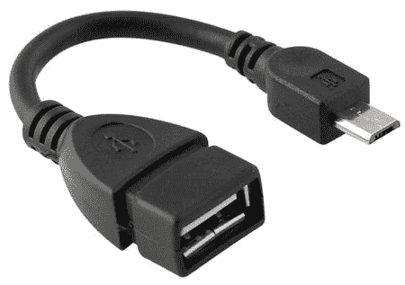

[图 7-1](#_Fig1) 。OTG-USB 2.0 适配器，带微型 USB 插头到 USB 插座

Logitech 网络摄像头 C270 是这个项目的最佳选择，因为它是一款价格实惠的摄像头(26.00 美元)，符合 USB 视频类别(UVC)，并可与本章中介绍的程序配合使用。罗技网络摄像头 C270 如图 7-2 中的[所示。](#Fig2)

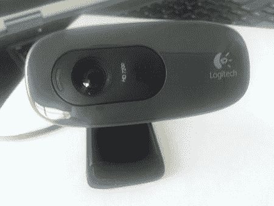

图 7-2 。logitech 网络摄像头

由于电路板上其他连接器的空间限制，避免使用带 L 连接器的 OTG-USB 适配器。

关于 UVC 的更多细节，请阅读下一节。

USB 视频类

UVC 是一种标准，它定义了设备如何通过 USB 端口传输视频和图片。它使用名为`uvcvideo`的驱动程序，BSP SD 卡软件版本支持该驱动程序。在这种情况下，该设备是一个简单的网络摄像头，但也有其他类型的设备支持 UVC，如代码转换器、录像机、摄像机等。

如果你有一个不同的网络摄像头，你想在这个项目中使用它，只需在网站`http://www.ideasonboard.org/uvc/`上检查网络摄像头是否符合 UVC，并检查支持的设备部分，如图[图 7-3](#Fig3) *所示。*

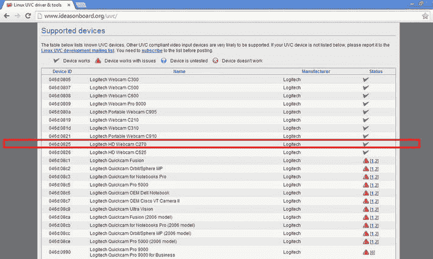

[图 7-3](#_Fig3) 。检查网络摄像头是否支持 UVC 标准

这个网站会告诉你网络摄像头是否与`uvcvideo`驱动程序一起工作。如果是，它将被归类为“设备工作”或“设备工作有问题”

然而，即使设备被归类为工作状态，也并不意味着你可以完全相信这些信息。开发人员通常会将摄像头设置为较低的分辨率或降低每秒帧数，以使代码工作，即使网络摄像头被报告为工作正常。

准备 BSP 软件映像和工具链

如上所述，为了运行本章中的示例，有必要准备一个定制的 BSP 映像并将部署的文件保存在 micro SD 卡中。工具链对于与构建中启用的 eGlibc 保持一致也是必要的。

基于 Yocto 项目创建 BSP 映像和工具链的过程在[第 2 章](02.html)中讨论过，所以如果你还没有阅读过[第 2 章](02.html)，现在是一个很好的阅读时机。

或者，如果您不想学习如何生成图像，您可以将所有文件下载到本章的`/code/SDcard`文件夹中，并将其复制到您的 micro SD 卡中。这样做会节省你几个小时。

将文件复制到微型 SD 卡后，将其插入微型 SD 卡插槽(查看[第 1 章](01.html))并启动主板。

对 Video4Linux 图像使用 eGlibc

标准 BSP SD 卡版本基于微型 uClibc，但 V4L 存在一些问题。解决方案是基于 eGlibc 构建完整的英特尔 Galileo SD 卡映像。为此，打开文件 `.../meta-clanton-distro/recipes-multimedia/v4l2apps/v4l-utils_0.8.8.bbappend`，使用您最喜欢的文本编辑器注释所有三行:

```sh
#FILESEXTRAPATHS_prepend := "${THISDIR}/files:"
#SRC_URI += "file://uclibc-enable.patch"
#DEPENDS += "virtual/libiconv"
```

增加 rootfs 的大小

将使用一些与 OpenCV 和 V4L 的工具和开发库相关的包，这意味着您需要增加和`rootfs`的大小。

为此，通过更改以下几行来编辑`.../meta-clanton-distro/recipes-core/image/image-full.bb`文件(见粗体项目):

```sh
IMAGE_ROOTFS_SIZE = "507200"
IMAGE_FEATURES += "package-management dev-pkgs"
IMAGE_INSTALL += "autoconf automake binutils binutils-symlinks cpp cpp-symlinks gcc gcc-symlinks g++ g++-symlinks gettext make libstdc++ libstdc++-dev file coreutils"
```

第一行，`rootfs` ( `IMAGE_ROOTFS_SIZE`)增加到 5GB。一个新的图像特性(`IMAGE_FEATURES`)随着开发包(`dev-pkgs`)的集成而得到增强。如果加上`IMAGE_INSTALL`，一系列开发工具将成为镜像的一部分(g++，make，等等)。

在 OpenCV 上禁用 GPU 支持

英特尔 Galileo 上使用的 Quark SoC 不包含任何 GPU(图形处理单元 )。OpenCV 可以被编译，以便通过一个名为 CUDA 的定义来启用或禁用 GPU。对于英特尔 Galileo，必须禁用 GPU。

要禁用 GPU，需要编辑两个文件:`.../meta-oe/meta-oe/recipes-support/opencv/opencv_2.4.3.bb`和`.../meta-clanton-distro/recipes-support/opencv/opencv_2.4.3.bbappend`。对`EXTRA_OECMAKE`中的两行进行相同的修改(见粗体项目):

```sh
EXTRA_OECMAKE = "-DPYTHON_NUMPY_INCLUDE_DIR:PATH=${STAGING_LIBDIR}/${PYTHON_DIR}/site-packages/numpy/core/include \
                 -DBUILD_PYTHON_SUPPORT=ON \
                 -DWITH_FFMPEG=ON \
                 -DWITH_CUDA=OFF \
                 -DBUILD_opencv_gpu=OFF \
                 -DWITH_GSTREAMER=OFF \
                 -DWITH_V4L=ON \
                 -DWITH_GTK=ON \
                 -DCMAKE_SKIP_RPATH=ON \
                 ${@bb.utils.contains("TARGET_CC_ARCH", "-msse3", "-DENABLE_SSE=1 -DENABLE_SSE2=1 -DENABLE_SSE3=1 -DENABLE_SSSE3=1", "", d)} \
"
```

构建 SD 映像和工具链

在这里，您使用与第 2 章中所述相同的程序来构建图像。作为快速参考，构建过程的命令有:

```sh
cd meta-clanton*
./setup.sh
source poky/oe-init-build-env yocto_build
```

为了构建完整的 SD 映像，`bitbake`是:

```sh
bitbake image-full-galileo
```

要创建工具链，使用以下命令:

```sh
bitbake image-full-galileo -c populate_sdk
```

开发库包

在英特尔 Galileo 上运行 OpenCV 程序时，您可能会遇到以下消息:

```sh
error while loading shared libraries: libopencv_gpu.so.2.4: cannot open shared object file: No such file or directory
```

如果您这样做，这意味着有些库没有正确安装在英特尔 Galileo 上。您也可以单独安装包(`ipk`文件)。

`code`文件夹包含一个名为`ipk.tar.gz`的 tarball，其中包含 OpenCV 和 V4L 所需的所有`ipk`文件。将该文件复制到英特尔 Galileo，并使用`opkg`安装库。要解压缩并安装 OpenCV 和 V4L 的`ipk`文件，可以使用以下命令:

```sh
root@clanton:#tar -zxvf ipk.tar.gz
root@clanton:#cd ipk
root@clanton:#opkg install libopencv-gpu2.4_2.4.3-r2_i586.ipk libopencv-stitching2.4_2.4.3-r2_i586.ipk libopencv-ts2.4_2.4.3-r2_i586.ipk libopencv-videostab2.4_2.4.3-r2_i586.ipk libv4l-dev_0.8.8-r2_i586.ipk libv4l-dbg_0.8.8-r2_i586
```

连接网络摄像头

插入 micro SD 卡并启动主板后，您需要加载`uvcvideo`驱动程序并连接您的网络摄像头。

打开终端外壳，键入以下命令来加载驱动程序:

```sh
root@clanton:~# modprobe uvcvideo
[31372.589998] Linux video capture interface: v2.00
[31372.701722] usbcore: registered new interface driver uvcvideo
[31372.707513] USB Video Class driver (1.1.1)
```

如果您无法加载`uvcvideo`模块驱动程序，这意味着您的自定义 BSP 映像有问题。查看构建过程或使用本章提供的 micro SD 卡文件。

司机必须满载成功。然后，连接您的网络摄像头，您应该会看到类似以下内容的消息:

```sh
root@clanton:~# [31372.707513] USB Video Class driver (1.1.1)[31474.420165] usb 2-1: new high-speed USB device number 3 using ehci-pci
[31474.801403] uvcvideo: Found UVC 1.00 device <unnamed> (046d:0825)
[31474.930869] input: UVC Camera (046d:0825) as /devices/pci0000:00/0000:00:14.3/usb2/2-1/2-1:1.0/input/input2
```

内核消息`input:UVC` `Camera`确认网络摄像头符合 UVC。

要确定摄像头安装在哪个设备上，请键入以下命令:

```sh
root@clanton:~# ls /dev/video*
/dev/video0
```

在这种情况下，设备被正确安装，并被映射为`/dev/video0`。最后一个数字(本例中为`0`)不会总是`0`。当您连接网络摄像头的驱动程序可以分配任何整数。例如，如果你有一个 USB 主机，连接两个摄像头，一个可能是`/dev/video0`，另一个可能是`/dev/video1`。如果你不断连接越来越多的网络摄像头到 USB 主机，每一个都被映射然后整数会增加，比如`/dev/video2`、`/dev/video3`等等。

如果您有一个当前映射为`/dev/video0`的网络摄像头，但由于某种原因网络摄像头崩溃并且没有正确释放，则下次您连接时，它可能会映射为`/dev/video1`。

这些信息听起来无关紧要，但是请记住，因为在以后使用 OpenCV 时会很有用。

Video4Linux 简介

Video4Linux ，也称为 V4L，是一组 API 和驱动程序，用于允许 Linux 与接收和传输音频和视频的设备进行通信。借助 V4L，可以与摄像机、电视和无线电卡、编解码器转换器、流媒体设备和遥控器进行通信。

本章专门讨论使用该 API 第二个版本 Video4Linux 2 (V4L2) 的 C270 网络摄像头。

V4L2 包含了第一个版本 V4L 中没有的几个错误修复和新的 API 函数。

本章中关于 V4L2 的代码示例来自 V4L2 官方网站，稍作修改以适应 C270 网络摄像头。有关 API 的更多信息，请访问`http://linuxtv.org/downloads/v4l-dvb-apis`。

在讨论 API 如何工作的技术细节之前，让我们使用基于 V4L2 的工具 v4l2-ctl 来探索 C270 网络摄像头。

在编写自己的代码或使用 OpenCV 之前，使用相机和这个工具是很重要的。这将有助于理解使该 API 工作所需的设置。如果你使用不同的摄像机，你将能够使用你的摄像机来理解本章中代码示例所需要的修改。

使用 V4L2-CTL 探索网络摄像头功能

在开始使用 OpenCV 之前，了解相机的以下方面很重要:

*   支持的编码/像素格式
*   捕捉图像支持的分辨率
*   支持捕获视频的分辨率
*   不同编码模式支持的每秒帧数(fps)
*   真正有效的决议

如果正确安装了这些包，您应该有一个名为 v4l2-ctl 的命令行工具。该工具不仅能告知您相机的功能，还能设置/更改某些属性。

比如用罗技 C270 ，要把`uvcvideo`驱动接好。您可以键入`v4l2-ctl --all`来检查当前的能力。

```sh
root@clanton:~# v4l2-ctl --all
Driver Info (not using libv4l2):
        Driver name   : uvcvideo
        Card type     : UVC Camera (046d:0825)
        Bus info      : usb-0000:00:14.3-1
        Driver version: 3.8.7
        Capabilities  : 0x84000001
                Video Capture
                Streaming
                Device Capabilities
        Device Caps   : 0x04000001
                Video Capture
                Streaming
Priority: 2
Video input : 0 (Camera 1: ok)
Format Video Capture:
        Width/Height  : 640/480
        Pixel Format  : 'MJPG'
        Field         : None
        Bytes per Line: 0
        Size Image    : 341333
        Colorspace    : SRGB
Crop Capability Video Capture:
        Bounds      : Left 0, Top 0, Width 640, Height 480
        Default     : Left 0, Top 0, Width 640, Height 480
        Pixel Aspect: 1/1
Streaming Parameters Video Capture:
        Capabilities     : timeperframe
        Frames per second: 30.000 (30/1)
        Read buffers     : 0
                     brightness (int)  : min=0 max=255 step=1 default=128 value=128
                       contrast (int)  : min=0 max=255 step=1 default=32 value=32
                     saturation (int)  : min=0 max=255 step=1 default=32 value=32
 white_balance_temperature_auto (bool) : default=1 value=1
                           gain (int)  : min=0 max=255 step=1 default=64 value=192
           power_line_frequency (menu) : min=0 max=2 default=2 value=2
      white_balance_temperature (int)  : min=0 max=10000 step=10 default=4000 value=1070 flags=inactive
                      sharpness (int)  : min=0 max=255 step=1 default=24 value=24
         backlight_compensation (int)  : min=0 max=1 step=1 default=0 value=0
                  exposure_auto (menu) : min=0 max=3 default=3 value=3
              exposure_absolute (int)  : min=1 max=10000 step=1 default=166 value=667 flags=inactive
         exposure_auto_priority (bool) : default=0 value=1
```

当前编码设置为`MJPG`，是 motion JPEG streamer，分辨率为 640/480 像素。当前每秒帧数(fps)为 30，视频裁剪设置为实际视频分辨率 640/480，由`Crop Capability Video Capture`通知。

即使您使用相同型号的网络摄像头，也可能会看到不同的设置。这些是我的网络摄像头的当前设置，考虑到此网络摄像头支持其他分辨率和编码，您的可能会使用不同的设置。

更改和读取相机属性

在前面的命令中，使用了其他的属性，如`brightness`、`contrast`和`saturation`。您可以使用 v4l2-ctl 工具的`--set-ctrl`参数来更改属性。假设您想将`contrast`属性从 32 改为 40。为此，请在终端中键入以下内容:

```sh
root@clanton:~# v4l2-ctl --set-ctrl=contrast=40
```

您可以使用分隔符`=`:

```sh
root@clanton:~# v4l2-ctl --set-ctrl contrast=40
```

要读取单个属性，使用`--get-ctrl`而不是`--all`，后者列出了所有属性。例如:

```sh
root@clanton:~# v4l2-ctl --get-ctrl contrast
contrast: 40
```

您还可以使用`-L`参数来获取控件列表。请参见以下示例:

```sh
root@clanton:~# v4l2-ctl -L
                     brightness (int)  : min=0 max=255 step=1 default=128 value=128
                       contrast (int)  : min=0 max=255 step=1 default=32 value=40
                     saturation (int)  : min=0 max=255 step=1 default=32 value=32
 white_balance_temperature_auto (bool) : default=1 value=1
                           gain (int)  : min=0 max=255 step=1 default=64 value=64
           power_line_frequency (menu) : min=0 max=2 default=2 value=2
                                     0 : Disabled
                                     1 : 50 Hz
                                     2 : 60 Hz
      white_balance_temperature (int)  : min=0 max=10000 step=10 default=4000 value=4000 flags=inactive
                      sharpness (int)  : min=0 max=255 step=1 default=24 value=24
         backlight_compensation (int)  : min=0 max=1 step=1 default=0 value=0
                  exposure_auto (menu) : min=0 max=3 default=3 value=3
                                     1 : Manual Mode
                                     3 : Aperture Priority Mode
              exposure_absolute (int)  : min=1 max=10000 step=1 default=166 value=166 flags=inactive
         exposure_auto_priority (bool) : default=0 value=1
```

像素格式和分辨率

要使用 v4l2-ctl 检查您的网络摄像头支持的编码，请使用`v4l2-ctl --list-formats`。

```sh
root@clanton:~# v4l2-ctl --list-formats
ioctl: VIDIOC_ENUM_FMT
        Index       : 0
        Type        : Video Capture
        Pixel Format: 'YUYV'
        Name        : YUV 4:2:2 (YUYV)

        Index       : 1
        Type        : Video Capture
        Pixel Format: 'MJPG' (compressed)
        Name        : MJPEG
```

正如你所看到的，在这种情况下，网络摄像头支持两种类型的编码:`YUYV` (索引 0)和`Motion` `JPEG` (索引 1)都可以捕获视频，如字段`Type`所示。

先前执行`v4l2-ctl --all`命令时，当前设置指向`MJPG`。

网络摄像头 C270 支持 1280x720 分辨率。使用以下命令更改当前的 640x480:

```sh
root@clanton:~# v4l2-ctl --set-fmt-video width=1920,height=780,pixelformat=0
```

分辨率需要更改为 1920x720，索引为 0 的像素格式表示 YUYV，如字节命令`--list-formats`所示。

要确定当前的像素格式和分辨率，您可以运行以下命令(替代`--all`),该命令之前用于汇总信息:

```sh
root@clanton:~# v4l2-ctl --get-fmt-video
Format Video Capture:
        Width/Height  : 1280/720
        Pixel Format  : 'YUYV'
        Field         : None
        Bytes per Line: 2560
        Size Image    : 1843200
        Colorspace    : SRGB
```

要检查每种编码下网络摄像头支持的所有分辨率以及支持的每秒帧数，您必须运行`v4l2-ctl --list-formats-ext`命令。

```sh
root@clanton:~# v4l2-ctl --list-formats-ext
ioctl: VIDIOC_ENUM_FMT
        Index       : 0
        Type        : Video Capture
        Pixel Format: 'YUYV'
        Name        : YUV 4:2:2 (YUYV)
                Size: Discrete 640x480
                        Interval: Discrete 0.033 s (30.000 fps)
                        Interval: Discrete 0.040 s (25.000 fps)
                        Interval: Discrete 0.050 s (20.000 fps)
                        Interval: Discrete 0.067 s (15.000 fps)
                        Interval: Discrete 0.100 s (10.000 fps)
                        Interval: Discrete 0.200 s (5.000 fps)
                Size: Discrete 160x120
                        Interval: Discrete 0.033 s (30.000 fps)
                        Interval: Discrete 0.040 s (25.000 fps)
                        Interval: Discrete 0.050 s (20.000 fps)
                        Interval: Discrete 0.067 s (15.000 fps)
                        Interval: Discrete 0.100 s (10.000 fps)
                        Interval: Discrete 0.200 s (5.000 fps)
...
...
...
                Size: Discrete 1184x656
                        Interval: Discrete 0.100 s (10.000 fps)
                        Interval: Discrete 0.200 s (5.000 fps)
                Size: Discrete 1280x720
                        Interval: Discrete 0.133 s (7.500 fps)
                        Interval: Discrete 0.200 s (5.000 fps)
                Size: Discrete 1280x960
                        Interval: Discrete 0.133 s (7.500 fps)
                        Interval: Discrete 0.200 s (5.000 fps)

        Index       : 1
        Type        : Video Capture
        Pixel Format: 'MJPG' (compressed)
        Name        : MJPEG
                Size: Discrete 640x480
                        Interval: Discrete 0.033 s (30.000 fps)
                        Interval: Discrete 0.040 s (25.000 fps)
                        Interval: Discrete 0.050 s (20.000 fps)
                        Interval: Discrete 0.067 s (15.000 fps)
                        Interval: Discrete 0.100 s (10.000 fps)
                        Interval: Discrete 0.200 s (5.000 fps)
                Size: Discrete 160x120
                        Interval: Discrete 0.033 s (30.000 fps)
                        Interval: Discrete 0.040 s (25.000 fps)
                        Interval: Discrete 0.050 s (20.000 fps)
                        Interval: Discrete 0.067 s (15.000 fps)
                        Interval: Discrete 0.100 s (10.000 fps)
                        Interval: Discrete 0.200 s (5.000 fps)
...
...
...
                Size: Discrete 1184x656
                        Interval: Discrete 0.033 s (30.000 fps)
                        Interval: Discrete 0.040 s (25.000 fps)
                        Interval: Discrete 0.050 s (20.000 fps)
                        Interval: Discrete 0.067 s (15.000 fps)
                        Interval: Discrete 0.100 s (10.000 fps)
                        Interval: Discrete 0.200 s (5.000 fps)
                Size: Discrete 1280x720
                        Interval: Discrete 0.033 s (30.000 fps)
                        Interval: Discrete 0.040 s (25.000 fps)
                        Interval: Discrete 0.050 s (20.000 fps)
                        Interval: Discrete 0.067 s (15.000 fps)
                        Interval: Discrete 0.100 s (10.000 fps)
                        Interval: Discrete 0.200 s (5.000 fps)
                Size: Discrete 1280x960
                        Interval: Discrete 0.033 s (30.000 fps)
                        Interval: Discrete 0.040 s (25.000 fps)
                        Interval: Discrete 0.050 s (20.000 fps)
                        Interval: Discrete 0.067 s (15.000 fps)
                        Interval: Discrete 0.100 s (10.000 fps)
                        Interval: Discrete 0.200 s (5.000 fps)
```

该命令为网络摄像头 C270 提供了一个长列表，每个像素格式都支持多种分辨率。请注意，如果您捕捉视频，每个分辨率都有一个每秒支持的帧数列表。乍一看，该表似乎包含相同的分辨率和每秒帧数，但实际上有一些差异。例如，像素格式为 YUYV 的 1184x656 分辨率仅支持以 10 和 5 fps 捕捉视频，而 MJPG 中的相同分辨率支持 30、25、20、15、10 和 5 fps。

如果没有注意到这些细节，并且进行了错误的设置，那么在使用 OpenCV 时，视频或图片捕获将会失败并导致问题。

要使用 v4l2-ctl 更改每秒帧数，请使用`set-parm`参数。例如，您可以使用以下方式设定 30 fps:

```sh
root@clanton:~# v4l2-ctl --set-parm=30
Frame rate set to 30.000 fps
```

使用 libv4l2 捕获视频和图像

使用 V4L2 捕获视频和图像的过程非常相似，因为它涉及相同的 IOCTL 调用和相同的序列。当网络摄像头是单平面的时，这意味着一个单个视频帧具有单个缓冲地址作为起点。一些设备是多平面的，这意味着单个视频帧需要多个起始地址。

捕捉视频的顺序完全相同，但不同之处在于软件保存帧的方式——单独保存还是作为整个流保存。

在内核和用户空间之间复制映像。请记住，应用程序运行在用户空间环境中，V4L2 API 支持三种 I/O 操作:

*   **内存映射缓冲区 (mmap)** **:** 缓冲区分配在内核空间。设备确定可分配的缓冲区数量作为缓冲区的大小。通常情况下，`mmap()`函数 和应用程序必须在查询缓冲区之前使用`V4L2_MEMORY_MMAP`通知该方法。这是网络摄像头 C270 使用的方法。
*   **用户空间指针:**使用常规的`malloc()`或`calloc()`函数将缓冲区分配给用户空间上下文。在这种情况下，`V4L2_MEMORY_USERPTR`用于查询缓冲区。
*   **直接读/写:**本例中的应用程序可以直接读/写缓冲区。因此，不需要映射内存(`mmap`)或用户空间内存分配(`malloc` / `calloc`)。

在所有三种方法中，设备确定支持哪一种。

您还必须设置分辨率、像素格式和每秒帧数。

一个捕捉视频的程序

本节中使用的代码来自`http://linuxtv.org/downloads/v4l-dvb-apis/capture-example.html`的 *Linux 媒体基础设施 API* 文档中的“[附录 D](16.html) :视频捕获示例”(做了一些修改以支持 C270 motion JPEG 流)。

用户空间和内核驱动程序之间的所有通信都是通过`IOCTL`调用完成的。因此，有一个函数来做这件事是个好主意。

```sh
static int xioctl(int fh, int request, void *arg)
{
        int r;

        do {
                r = ioctl(fh, request, arg);
        } while (-1 == r && EINTR == errno);

        return r;
}
```

这个函数将在所有使用 **ioctl()** 函数将`IOCTL`发送到内核的`IOCTL`调用中多次使用。

[图 7-4](#Fig4) 表示视频和图像的顺序。

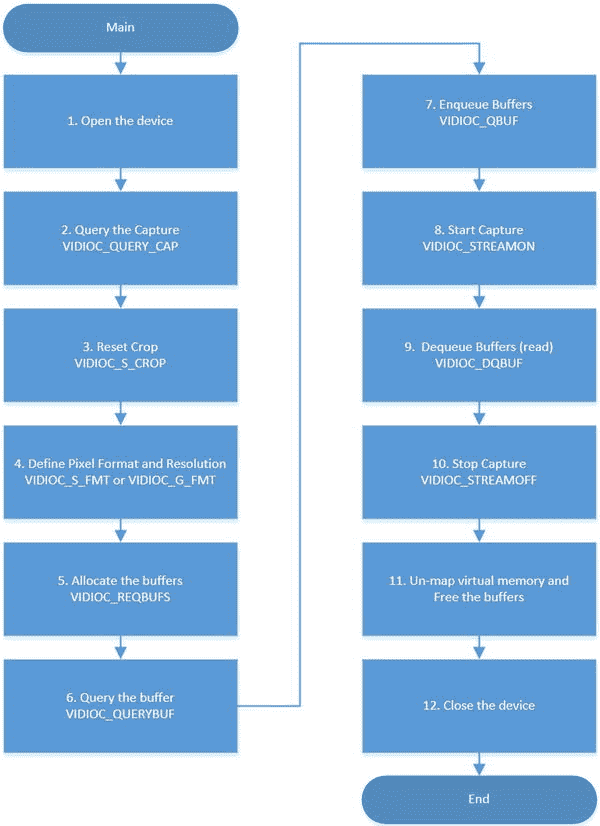

[图 7-4](#_Fig4) 。与使用 V4L2 捕获视频相关的流程图

流程图中的每一步都用相应的片段进行了解释:

1.  **打开设备:**你使用一个文件描述符来打开设备。在这种情况下，使用代表设备的字符串。该字符串包含`/dev`中的正确设备名称。例如，字符串可能是`"/dev/video0"`。`O_NONBLOCK`选项防止软件在读取缓冲区时保持阻塞状态(这将在第 9 步的出列过程中详细解释)。

    ```sh
    static void open_device(void)
    {
    ...
    ...
    ...

            fd = open(dev_name, O_RDWR /* required */ | O_NONBLOCK, 0);

            if (-1 == fd) {
                    fprintf(stderr, "Cannot open '%s': %d, %s\n",
                             dev_name, errno, strerror(errno));
                    exit(EXIT_FAILURE);
            }
    }
    ```

2.  **启动设备:**如果设备正常打开，您需要使用`VIDIOC_QUERYCAP`询问设备的能力。

    ```sh
            struct v4l2_capability cap;
            ...
    ...
    ...
    ...

            if (-1 == xioctl(fd, VIDIOC_QUERYCAP, &cap)) {
                    if (EINVAL == errno) {
                            fprintf(stderr, "%s is no V4L2 device\n",
                                     dev_name);
                            exit(EXIT_FAILURE);
                    } else {
                            errno_exit("VIDIOC_QUERYCAP");
                    }
            }
    ```

3.  **重置任何图像裁剪设置:**使用`VIDIOC_S_CROP`设置为默认值。如果设备不支持裁剪，您可以忽略这些错误，因为图像将始终具有相同的分辨率。

    ```sh
      struct v4l2_crop crop;
      struct v4l2_cropcap cropcap;
    ...
    ...
    ...

      cropcap.type = V4L2_BUF_TYPE_VIDEO_CAPTURE;

      if (0 == xioctl(fd, VIDIOC_CROPCAP, &cropcap)) {
                    crop.type = V4L2_BUF_TYPE_VIDEO_CAPTURE;
                    crop.c = cropcap.defrect; /* reset to default */

                    if (-1 == xioctl(fd, VIDIOC_S_CROP, &crop)) {
                            switch (errno) {
                            case EINVAL:
                                    /* Cropping not supported. */
                                    break;
                            default:
                                    /* Errors ignored. */
                                    break;
                            }
                    }
      }
    ```

4.  **设置像素格式和分辨率:**如果使用`VIDIOC_S_FMT`，设备将采用通过结构`v4l2_format`传递给`IOCTL`的设置。否则，如果使用`VIDIOC_G_FMT` ，则使用当前编程设置。在这种情况下，您可以使用 v4l2-ctl 工具，如前所述。这是 V4L2 网站上与原代码唯一不同的部分代码。当`force_format`变量设置为`true`时，会强制将格式转换为分辨率为 1280x720 的运动 JPEG 流。否则，使用您的相机的当前设置，可以使用 v4ctl 工具进行更改。

    ```sh
       fmt.type = V4L2_BUF_TYPE_VIDEO_CAPTURE;
            if (force_format) {
                    fmt.fmt.pix.width       = 1280;
                    fmt.fmt.pix.height      = 720;
                    fmt.fmt.pix.pixelformat = V4L2_PIX_FMT_MJPEG;
                    fmt.fmt.pix.field       = V4L2_FIELD_NONE;

                    if (-1 == xioctl(fd, VIDIOC_S_FMT, &fmt))
                            errno_exit("VIDIOC_S_FMT");

                    /* Note VIDIOC_S_FMT may change width and height. */
            } else {
                    /* Preserve original settings as set by v4l2-ctl for example */
                    if (-1 == xioctl(fd, VIDIOC_G_FMT, &fmt))
                            errno_exit("VIDIOC_G_FMT");
            }
    ```

5.  **分配缓冲区:**使用`v4l2_requestbuffers`结构，更准确地说是使用`count`字段，通过 IOCTL `VIDIOC_REQBUFS`将其传递给设备，这需要设备使用一定数量的缓冲区来存储图像。在网络摄像头 C270 的情况下，缓冲区的最大数量是五个。超过五个，网络摄像头将报告“内存不足”，而`VIDIOC_REQBUFS`将失败。最好至少设置两个缓冲区。由于`VIDIOC_REQBUFS`调用，如果设备接受请求的缓冲区数量，则报告缓冲区的大小。然后，您在用户空间上下文中分配缓冲区，以允许设备填充它们。分配可以使用常规函数来完成，如`calloc()`和`malloc()`。

    ```sh
           struct v4l2_requestbuffers req;

            CLEAR(req);

            req.count = 5;
            req.type = V4L2_BUF_TYPE_VIDEO_CAPTURE;
            req.memory = V4L2_MEMORY_MMAP;

            if (-1 == xioctl(fd, VIDIOC_REQBUFS, &req)) {
                    if (EINVAL == errno) {
                            fprintf(stderr, "%s does not support "
                                     "memory mapping\n", dev_name);
                            exit(EXIT_FAILURE);
                    } else {
                            errno_exit("VIDIOC_REQBUFS");
                    }
            }

            if (req.count < 2) {
                    fprintf(stderr, "Insufficient buffer memory on %s\n",
                             dev_name);
                    exit(EXIT_FAILURE);
            }

            buffers = calloc(req.count, sizeof(*buffers));

            if (!buffers) {
                    fprintf(stderr, "Out of memory\n");
                    exit(EXIT_FAILURE);
            }
    ```

6.  **查询缓冲区的状态，并为每个缓冲区映射内存:**对于每个分配的缓冲区，需要使用`VIDIOC_QUERYBUF`查询其状态。作为对`VIDIOC_QUERYBUF`的响应，报告缓冲器相对于起始设备的偏移量，即每个缓冲器的长度。有了这些信息，必须调用函数`mmap()`来映射将在用户空间和设备之间共享的虚拟内存。

    ```sh
      for (n_buffers = 0; n_buffers < req.count; ++n_buffers) {
                    struct v4l2_buffer buf;

                    CLEAR(buf);

                    buf.type        = V4L2_BUF_TYPE_VIDEO_CAPTURE;
                    buf.memory      = V4L2_MEMORY_MMAP;
                    buf.index       = n_buffers;

                    if (-1 == xioctl(fd, VIDIOC_QUERYBUF, &buf))
                            errno_exit("VIDIOC_QUERYBUF");

                    buffers[n_buffers].length = buf.length;
                    buffers[n_buffers].start =
                            mmap(NULL /* start anywhere */,
                                  buf.length,
                                  PROT_READ | PROT_WRITE /* required */,
                                  MAP_SHARED /* recommended */,
                                  fd, buf.m.offset);

                    if (MAP_FAILED == buffers[n_buffers].start)
                            errno_exit("mmap");
            }
    ```

7.  **缓冲区入队:**考虑到 C270 网络摄像头是用`mmap`方法操作的，需要用`VIDIOC_REQBUFS`获得的每个缓冲区与使用`VIDIOC_QBUF`的驱动程序交换。`VIDIOC_QBUF`对每个缓冲区进行排队。

    ```sh
    case IO_METHOD_MMAP:
                    for (i = 0; i < n_buffers; ++i) {
                            struct v4l2_buffer buf;

                            CLEAR(buf);
                            buf.type = V4L2_BUF_TYPE_VIDEO_CAPTURE;
                            buf.memory = V4L2_MEMORY_MMAP;
                            buf.index = i;

                            if (-1 == xioctl(fd, VIDIOC_QBUF, &buf))
                                    errno_exit("VIDIOC_QBUF");
                    }
    ```

8.  **开始捕捉:**所有缓冲区准备就绪，需要用`VIDIOC_STREAMON`开始流。

    ```sh
    if (-1 == xioctl(fd, VIDIOC_STREAMON, &type))
            errno_exit("VIDIOC_STREAMON");
    ```

9.  **缓存出队读取帧:**通过调用`VIDIOC_DQBUF`，缓存出队，成功后可以读取帧。请注意，缓冲区没有特定的顺序，因此除了数据之外，还会通知缓冲区索引。有必要保持等待所有缓冲区出队，为此可以实现一个`while`循环。然而，为了避免用户空间上下文中的阻塞操作，使用了`select()`函数。请注意，如果您试图读取内存中不可用的特定缓冲区，并且如果该设备是用`O_NONBLOCK`打开的，则在`VIDIOC_DQBUF`调用期间会抛出错误`EAGAIN`。否则，它将保持阻塞状态，直到缓冲区准备就绪。

    ```sh
    static void mainloop(void)
    {
            unsigned int count;

            count = frame_count;

            while (count-- > 0) {
                    for (;;) {
                            fd_set fds;
                            struct timeval tv;
                            int r;

                            FD_ZERO(&fds);
                            FD_SET(fd, &fds);

                            /* Timeout. */
                            tv.tv_sec = 2;
                            tv.tv_usec = 0;

                            r = select(fd + 1, &fds, NULL, NULL, &tv);

                            if (-1 == r) {
                                    if (EINTR == errno)
                                            continue;
                                    errno_exit("select");
                            }

                            if (0 == r) {
                                    fprintf(stderr, "select timeout\n");
                                    exit(EXIT_FAILURE);
                            }

                            if (read_frame())
                                    break;
                            /* EAGAIN - continue select loop. */
                    }
            }
    }
    ...
    ...
    ...
    static int read_frame(void)
    {
            struct v4l2_buffer buf;
            unsigned int i;
    ...
    ...
    ...
                  if (-1 == xioctl(fd, VIDIOC_DQBUF, &buf)) {
                            switch (errno) {
                            case EAGAIN:
                              printf("EAGAIN\n");
                                    return 0;

                            case EIO:
                              printf("EIO\n");
                                    /* Could ignore EIO, see spec. */

                                    /* fall through */

                            default:
                              printf("default\n");
                                    errno_exit("VIDIOC_DQBUF");
                            }
                    }
    }
    ```

10.  **止流**:简单叫`VIDIOC_STREAMOFF`。

    ```sh
                    type = V4L2_BUF_TYPE_VIDEO_CAPTURE;
                    if (-1 == xioctl(fd, VIDIOC_STREAMOFF, &type))
                            errno_exit("VIDIOC_STREAMOFF");
    ```

11.  **释放缓冲区并取消内存映射**:虚拟映射为`mmap()`的内存必须通过`munmap()`函数取消映射，分配给缓冲区的内存必须通过`free()`函数释放。

    ```sh
    static void uninit_device(void)
    {
            unsigned int i;

            switch (io) {
    ...
    ...
    ...

            case IO_METHOD_MMAP:
                    for (i = 0; i < n_buffers; ++i)
                            if (-1 == munmap(buffers[i].start, buffers[i].length))
                                    errno_exit("munmap");
                    break;
    ...
    ...
    ...

            free(buffers);
    }
    ```

12.  **关闭设备**:设备文件描述符关闭。

```sh
static void close_device(void)
{
        if (-1 == close(fd))
                errno_exit("close");

        fd = -1;
}
```

本节中使用的代码摘录来自位于`http://linuxtv.org/downloads/v4l-dvb-apis/capture-example.html`的 Linux 媒体基础设施 API 文档的“[附录 D](16.html) :视频捕获示例”(做了一些修改以支持 C270 motion JPEG 流)。突出显示变更的完整程序在[附录 C](15.html) “视频采集”[清单 C-1](15.html#list1) 中提供。

构建和传输视频捕获程序

在计算机上正确安装工具链后，打开终端外壳并键入以下内容:

```sh
mcramon@ubuntu:~/ $ cd <YOUR BASE TOOLCHAIN PATH>
mcramon@ubuntu:~/xcompiler$ source environment-setup-*
```

该命令会将系统中环境的所有变量设置为工具链的当前安装。

为了测试它是否工作，考虑本书中创建的程序以理解 V4L 是如何用 C 编写的，在您的计算机 shell 中运行以下命令:

```sh
mcramon@ubuntu:~/xcompiler$ ${CC} --version
i586-poky-linux-gcc (GCC) 4.7.2
Copyright (C) 2012 Free Software Foundation, Inc.
This is free software; see the source for copying conditions.  There is NO
warranty; not even for MERCHANTABILITY or FITNESS FOR A PARTICULAR PURPOSE.
```

由`${CC}`表示的 GCC 编译器被正确设置，您已经准备好构建程序了。

要构建该程序，您需要运行以下命令:

```sh
${CC} -O2 -Wall 'pkg-config --cflags --libs libv4l2' galileo_video_capture.c -o galileo_video_capture
```

请注意，`pkg-config`用于通知 libv4l2 在编译中将使用什么。

现在你可以使用你最喜欢的程序传输`galileo_video_capture`程序，如[第 5 章](05.html)所述。例如，如果您在英特尔 Galileo 中使用以太网电缆或 WiFi 卡，并且您的操作系统是 Linux/MacOSX，则可以使用 scp。如果你的电脑是 Windows，可以用 WinSCP。这里有一个使用 scp 的例子。

在英特尔 Galileo 终端外壳上，创建如下所示的直接连接:

```sh
root@clanton:~# ifconfig eth0 192.254.1.1 netmask 255.255.255.0 up
```

然后在您的 Linux/MacOSX 上，传输文件:

```sh
 mcramon@ubuntu:~/scp galileo_capture root@192.254.1.1:/home/root/.
```

如果您使用带有 SD 卡映像上的开发工具的定制 BSP 映像，则更容易，因为您可以直接通过英特尔 Galileo 的终端外壳进行编译。一旦可执行文件已经在文件系统中，就不需要转移文件。

运行程序和捕捉视频

该程序在命令行中执行，并且必须使用英特尔 Galileo 终端外壳运行。该程序接受一些用于配置捕获类型和重定向内容捕获的参数。

在支持的参数中，这段代码支持所有三种 IO 方法，并且在捕获期间使用的方法在程序执行期间作为简单参数传递。参数如下:

*   `-m`:内存映射；用于 C270 网络摄像头
*   `-u`:用户空间指针
*   `-r`:直接读/写

另一个重要的论点是`-` `f` 。如果未设置此参数，则使用当前摄像机设置来捕获视频。这意味着您可以使用 v4l2-ctl 工具来更改它们，如前所述。

如果使用`-f`，则强制捕捉使用 1280 的宽度、720 的高度和支持运动 JPEG 流(MJPEG)的像素格式。这是对支持不同格式的原始代码的唯一更改。

您还可以使用参数`-` `c` 来定义您希望成为视频一部分的帧数。你需要使用`-c <NUMBER OF FRAMES>`。

最后，`-o`参数将捕获的内容重定向到一个可以重定向到文件的输出。

记住所有这些参数，假设您想要捕获一个 100 帧的视频，使用 Motion JPEG 编码将分辨率强制为 1280X720，并创建一个名为`video.mjpeg`的输出文件。为此，您可以使用英特尔 Galileo 终端外壳使用以下参数执行程序:

```sh
root@clanton:~# ./galileo_video_capture -m -f -c 100 -o > video.mjpeg
....................................................................................................
```

每个点“.”表示在输出中捕获的帧。

现在使用 v4l2-ctl 命令工具使用不同的设置，运行与之前相同的命令行，但是省略`-f`。让我们降低视频分辨率。

```sh
root@clanton:~# v4l2-ctl --set-fmt-video width=320,height=176,pixelformat=1
```

然后通过省略`-f`选项，运行命令来接受这个配置。

```sh
root@clanton:~# ./galileo_video_capture -m  -c 100 -o > video2.mpjpeg
....................................................................................................
```

您将拥有一个新的视频，但分辨率不同。

如果您的设备未被枚举为`/dev/video0`，则有必要使用`-d </dev/video*>`选项。例如，假设您的设备被枚举为`/dev/video1`。您的命令行必须是:

```sh
root@clanton:~# ./galileo_video_capture -d /dev/video1 -m  -c 100 -o > video2.mpjpeg
```

转换和播放视频

如果您阅读并完成了前一部分，您将获得两个使用 Motion JPEG 编码和不同分辨率采集的视频。如果你把这些文件转移到你的电脑上并试着播放它们，你会有一个非常悲伤的惊喜。它们无法播放，因为它们是为流创建的，这意味着文件中的某些特定头丢失。

要在文件中包含头文件，必须使用外部工具。推荐的工具是`ffmpeg`，原因有三:

*   它由开源社区大量维护
*   它可以直接在英特尔 Galileo SD 映像或您的计算机上运行
*   它支持不同的编码器

如果您更喜欢在您的计算机上运行它，在`http://www.ffmpeg.org/download.html` `. If your computer runs Linux, the easier way is to install it from static releases present at `http://ffmpeg.gusari.org/static/`中可以找到在不同操作系统中下载和安装`ffmpeg` 的说明，然后运行以下命令:`

 ```sh`
mcramon@ubuntu~$:~/$ mkdir ffmpeg;cd ffmpeg
mcramon@ubuntu~$:~/$ wget http://ffmpeg.gusari.org/static/64bit/ffmpeg.static.64bit.2014-03-02.tar.gz

mcramon@ubuntu:~/$ tar -zxvf ffmpeg.static.64bit.2014-03-02.tar.gz
```

`ffmpeg`将在你解压文件的同一个目录下可用。

在您的个人电脑或英特尔 Galileo 中，您需要执行`ffmpeg`来将视频转换为大多数系统中的“可播放”格式。例如，要转换捕获的第一个和第二个视频，可以运行以下命令:

```sh
mcramon@ubuntu:~/video_samples$ ffmpeg -f mjpeg -i video.mjpeg -c:v copy video.mp4
ffmpeg version N-63717-g4e3fe65 Copyright (c) 2000-2014 the FFmpeg developers
  built on Jun 3 2014 01:10:16 with gcc 4.4.7 (Ubuntu/Linaro 4.4.7-1ubuntu2)
  configuration: --disable-yasm --enable-cross-compile --arch=x86 --target-os=linux
  libavutil      52\. 89.100 / 52\. 89.100
  libavcodec     55\. 66.100 / 55\. 66.100
  libavformat    55\. 42.100 / 55\. 42.100
  libavdevice    55\. 13.101 / 55\. 13.101
  libavfilter     4.  5.100 /  4.  5.100
  libswscale      2.  6.100 /  2.  6.100
  libswresample   0\. 19.100 /  0\. 19.100
Input #0, mjpeg, from 'video.mjpeg':
  Duration: N/A, bitrate: N/A
    Stream #0:0: Video: mjpeg, yuvj422p(pc), 1280x720, 25 fps, 25 tbr, 1200k tbn, 25 tbc
Output #0, mp4, to 'video.mp4':
  Metadata:
    encoder         : Lavf55.42.100
    Stream #0:0: Video: mjpeg (l[0][0][0] / 0x006C), yuvj422p, 1280x720, q=2-31, 25 fps, 1200k tbn, 1200k tbc
Stream mapping:
  Stream #0:0 -> #0:0 (copy)
Press [q] to stop, [?] for help
frame=  100 fps=0.0 q=-1.0 Lsize=    2871kB time=00:00:03.96 bitrate=5939.9kbits/s
video:2870kB audio:0kB subtitle:0kB other streams:0kB global headers:0kB muxing overhead: 0.041544%
mcramon@ubuntu:~/video_samples$ ffmpeg -f mjpeg -i video2.mjpeg -vcodec copy video2.mp4
ffmpeg version N-63717-g4e3fe65 Copyright (c) 2000-2014 the FFmpeg developers
  built on Jun 3 2014 01:10:16 with gcc 4.4.7 (Ubuntu/Linaro 4.4.7-1ubuntu2)
  configuration: --disable-yasm --enable-cross-compile --arch=x86 --target-os=linux
  libavutil      52\. 89.100 / 52\. 89.100
  libavcodec     55\. 66.100 / 55\. 66.100
  libavformat    55\. 42.100 / 55\. 42.100
  libavdevice    55\. 13.101 / 55\. 13.101
  libavfilter     4.  5.100 /  4.  5.100
  libswscale      2.  6.100 /  2.  6.100
  libswresample   0\. 19.100 /  0\. 19.100
Input #0, mjpeg, from 'video2.mjpeg':
  Duration: N/A, bitrate: N/A
    Stream #0:0: Video: mjpeg, yuvj422p(pc), 320x176, 25 fps, 25 tbr, 1200k tbn, 25 tbc
Output #0, mp4, to 'video2.mp4':
  Metadata:
    encoder         : Lavf55.42.100
    Stream #0:0: Video: mjpeg (l[0][0][0] / 0x006C), yuvj422p, 320x176, q=2-31, 25 fps, 1200k tbn, 1200k tbc
Stream mapping:
  Stream #0:0 -> #0:0 (copy)
Press [q] to stop, [?] for help
frame=  100 fps=0.0 q=-1.0 Lsize=     843kB time=00:00:03.96 bitrate=1743.1kbits/s
video:841kB audio:0kB subtitle:0kB other streams:0kB global headers:0kB muxing overhead: 0.137993%
```

基本上，`-f`表示文件编码为 Motion JPEG 像素格式；`-i`表示输入文件，`-vcodec copy`保持相同的编码和质量，但是将帧添加到 MP4 容器中。

本章中使用的所有扩展名为 MJPEG 和 MP4 的视频都在本章的`code/video_samples`文件夹中。因此，无论有没有网络摄像头，你都可以独立进行这种转换。

带有 MP4 扩展名的视频可以在你的电脑上播放。如果你用的是 Ubuntu，可以直接用电影播放器播放。如果你使用的是 Windows 或 MacOSX，你可以用 VLC 播放器或 QuickTime 播放它们(见[图 7-5](#Fig5) )。

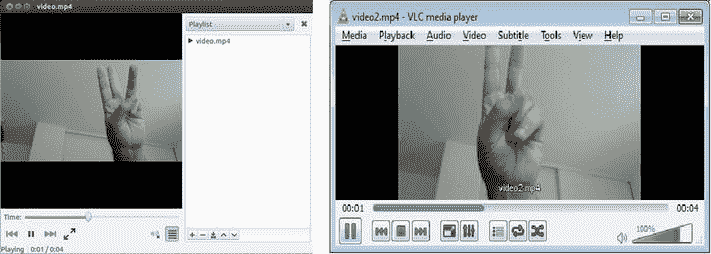

[图 7-5](#_Fig5) 。英特尔 Galileo 捕获的视频在 VLC 和电影播放器中再现

通过比较由`ffmpeg`包含头之前和之后的文件，您可以看到帧通常保持在相同的内容中，并且只有头被添加到 MP4 文件的结尾和开头的几个字节。[图 7-6](#Fig6) 显示了添加到原始 MJPEG 文件末尾的标题。

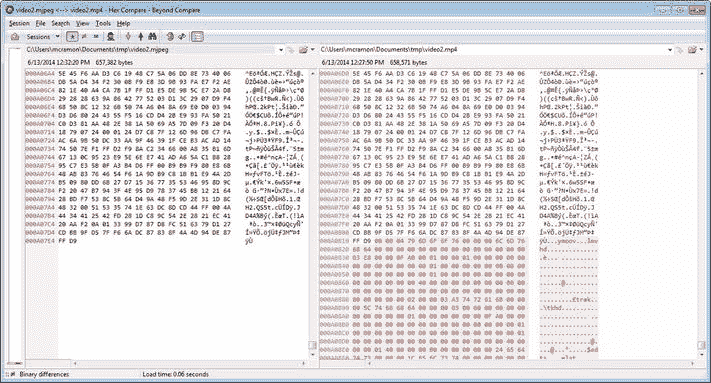

[图 7-6](#_Fig6) 。帧没有改变，只有标题被添加到 MP4 文件中

一个捕捉图像的程序

使用 V4L2 捕捉图像的过程与视频相同，只是逐帧图像应保存在文件系统中。

本节中使用的代码基于 *Linux 媒体基础设施 API* 文档的 *"* 附录 e .使用 libv4l *"* 的视频采集卡示例中提供的软件，进行了一些更改以适应网络摄像头 C270 并选择不同的编码。完整的程序可以在`http://linuxtv.org/downloads/v4l-dvb-apis/v4l2grab-example.html` `找到。`

 `该软件有一些要求，在你检查代码之前必须解释清楚:

*   它也是一个命令行程序，类似于在英特尔 Galileo 终端外壳中运行的用于捕获视频的软件。
*   它仅支持映射内存 IO 方法，并且是用于捕获视频的软件的简化版本。请记住，用于捕获视频的软件是为了涵盖与不同类型的设备通信所需的整个场景而创建的。将软件限制在内存映射 IO 设备上，可以极大地简化代码。命令行中不需要任何参数，因为它是硬编码的。
*   它接受与宽度和高度相关的不同分辨率。它接受图像宽度的`-W`或`--width`参数和图像高度的`-H`或`--height`参数。如果省略这些选项，默认分辨率为 1280x720(分别为宽度和高度)。如果通过这些参数定义了网络摄像头不支持的分辨率，则会自动选择最接近的分辨率。libv4l2 比较摄像机支持的选项，并在终端外壳中向用户显示一条警告消息。
*   它可以选择两种不同的编码，YUYV 或 RGB24。如果使用了`-y`或`--yuyv`参数，则使用 YUYV 编码；否则，如果省略该参数，则默认使用 RGB24 编码。
*   可以使用`-c`或`--count`参数设置将存储在文件中的图像数量，后跟所需的图像数量。如果省略此选项，默认情况下，文件系统中存储的图像数量将为 10。图像名称将带有前缀`out`，后跟三位小数，以扩展名`.ppm`格式化图像顺序。比如`out000.ppm`、*、*、`out001.ppm`等等。

你可能想知道，如果使用`v4l2-ctl --list-formats`证明网络摄像头 C270 仅支持 MJPEG 和 YUYV，那么如何将像素格式设置为 RGB24？实际上，摄像头 C270 不支持 RGB24，但 libv4l2 支持从 YUYV 到 RGB24 和 BGR24 的转换。换句话说，即使您将像素格式设置为 RGB24 或 BGR24，更准确地说是`V4L2_PIX_FMT_RGB24`和`V4L2_PIX_FMT_BGR24`，如果您的相机本身不提供此类格式，则会考虑 YUYV，V4L2 库会为您将 YUYV 转换为 RGB24 或 BGR24。

下面的代码片段演示了由变量`isYUYV`控制的像素格式的选择。

```sh
        CLEAR(fmt);
        fmt.type = V4L2_BUF_TYPE_VIDEO_CAPTURE;
        fmt.fmt.pix.width       = width;
        fmt.fmt.pix.height      = height;

        if (!isYUYV)
          {
             printf("Encode RGB24\n");
             fmt.fmt.pix.pixelformat = V4L2_PIX_FMT_RGB24;
          }
        else
          {
             printf("Encode YUYV\n");
             fmt.fmt.pix.pixelformat = V4L2_PIX_FMT_YUYV;
          }
        fmt.fmt.pix.field       = V4L2_FIELD_INTERLACED;
        xioctl(fd, VIDIOC_S_FMT, &fmt);
        if (fmt.fmt.pix.pixelformat != V4L2_PIX_FMT_RGB24 &&
            fmt.fmt.pix.pixelformat != V4L2_PIX_FMT_YUYV) {
              printf("Libv4l didn't accept RGB24 or YUYV format. Can't proceed.\n");
              exit(EXIT_FAILURE);
        }
        if ((fmt.fmt.pix.width != width) || (fmt.fmt.pix.height != height))
                printf("Warning: driver is sending image at %dx%d\n",
                        fmt.fmt.pix.width, fmt.fmt.pix.height);
```

如果选择了 YUYV 或 RGB24，图像将具有相同的扩展名. PPM。PPM 文件扩展名表示“可移植像素图”,由一个文件组成，该文件带有一个 ASCII 头，后跟一系列原始字节。

PPM 头文件的一个有效示例是:

**P6**

**1280 720 255**

字符串`P6`被称为“魔法标识符 ”，也可以是`P3`。那么下一行包含图像的宽度和高度，在本例中用 1280 和 720 表示。

数字 255 是颜色分量 RGB 的最大值，因此它可能在 0 到 255 之间变化。因此，它被用来界定图像中的最大颜色范围。

以下代码行可用于创建带有`fopen()`的文件，并使用`fprintf()`将该字符串序列写入该文件。

```sh
fout = fopen(out_name, "w");
...
...
...
fprintf(fout, "P6\n%d %d 255\n", fmt.fmt.pix.width, fmt.fmt.pix.height);
```

标题中的最大颜色分量由网络摄像头返回的图像重试，这就是为什么它不是`fprintf()`函数的一部分。

如果您选择了 RGB24，并且 libv4l2 提供的图像已经从 YUYV 转换为 RGB24，那么您只需编写 PPM 图像的标题文本，并附上通过`VIDIOC_DQBUF`从缓冲区“出列”时收到的二进制数据。

```sh
        xioctl(fd, VIDIOC_STREAMON, &type);

        for (i = 0; i < images_count; i++) {
                do {
...
...
...
                CLEAR(buf);
                buf.type = V4L2_BUF_TYPE_VIDEO_CAPTURE;
                buf.memory = V4L2_MEMORY_MMAP;
                xioctl(fd, VIDIOC_DQBUF, &buf);

                sprintf(out_name, "out%03d.ppm", i);
                printf("Creating image: %s\n", out_name);
                fout = fopen(out_name, "w");
                if (!fout) {
                        perror("Cannot open image");
                        exit(EXIT_FAILURE);
                }
                fprintf(fout, "P6\n%d %d 255\n", fmt.fmt.pix.width, fmt.fmt.pix.height);

...
...
...
                fwrite(buffers[buf.index].start, buf.bytesused, 1, fout);
...
...
...
                fclose(fout);

                xioctl(fd, VIDIOC_QBUF, &buf);
        }
```

如果选择了 YUYV，您必须从 YUYV 转换到 RGB24 以创建。ppm 文件。

在网络摄像头 C270 的情况下，YUYV 是 4:2:2，这意味着每 2 个像素 4 个字节；或者每 2 字节 1 个像素。RGB24 表示每像素 24 位或每像素 3 字节。因此，为了将 YUYV 4:2:2 转换为 RGB24，来自 YUYV 4:2:2 的每 2 个字节(1 个像素)源自 RGB24 的 3 个字节(像素)。

这意味着转换图像的函数需要分配一个缓冲区，因为 RGB 24 中的结果图像比 YUYV 4:2:2 图像大 1.5 倍。

因此，如果在 RGB24 中每个像素由三个字节表示，则必须评估将接收所分配图像的缓冲区。你得到像素的总数，然后每个像素乘以三个字节。以下代码代表了这一逻辑:

```sh
// each pixel 3 bytes in RGB 24
int size = fmt.fmt.pix.width * fmt.fmt.pix.height * sizeof(char) * 3;
unsigned char * data = (unsigned char *) malloc(size);
```

为了进行这种转换，代码示例使用了一个从 OpenCV 中提取的函数，该函数是在英特尔许可下复制的，没有做任何更改。该函数名为`yuyv_to_rgb24()` ，来自文件`cvcap_v4l.cpp`。作为参考，你可以在`https://code.ros.org/trac/opencv/browser/trunk/opencv/src/highgui/cvcap_v4l.cpp?rev=284`看到整个文件。

下面的代码片段通过传递图像的尺寸(`fmt.fmt.pix.width`和`fmt.fmt.pix.height`)、返回的当前帧的初始缓冲区地址(`buffers[buf.index].start`)和分配的目标缓冲区(`data`)来调用转换函数。

```sh
yuyv_to_rgb24(fmt.fmt.pix.width,
              fmt.fmt.pix.height,
              (unsigned char*)(buffers[buf.index].start),
              data);

fwrite(data, size, 1, fout);
free (data);
...
...
...
fclose(fout);
```

软件如清单 D-1 中的[所示。与本节相关的代码部分以粗体显示。](16.html#list1)

本节使用的代码摘录基于 Linux Media Infrastructure API 文档的“附录 e .使用 libv4l 的视频采集卡示例”中提供的软件，做了一些更改以适应网络摄像头 C270 并选择不同的编码(`http://linuxtv.org/downloads/v4l-dvb-apis/v4l2grab-example.html)`)。突出本节讨论的变更的完整程序在[附录 D](16.html) “图片抓取器”[清单 D-1](16.html#list1) 中提供。

构建和传输图片抓取器

构建和传输文件的程序与本章“构建和传输视频采集程序”一节中使用的程序相同，除了用于编译图像抓取程序的命令行。

在正确设置工具链的情况下，在命令行中键入以下内容。

```sh
${CC} -O2 -Wall 'pkg-config --cflags --libs libv4l2' picture_grabber.c -o picture_grabber
```

然后将文件传输到您的英特尔 Galileo 主板。

运行程序和捕捉图像

该程序在命令行中执行，可以与英特尔 Galileo 终端外壳一起使用。该程序接受前一节中解释的一些参数。

第一步，拍摄五张 RGB24 格式 的图像，分辨率为 352x288。

```sh
root@clanton:~# ./picture_grabber -W 352 -H 288 -c 5
Encode RGB24
Creating image: out000.ppm
Creating image: out001.ppm
Creating image: out002.ppm
Creating image: out003.ppm
Creating image: out004.ppm
```

结果，创建了五个带有前缀`out`和扩展名`ppm`的图像。将这些图像复制到您的计算机上，并使用图像查看器打开它们。

如果您尝试使用网络摄像头不支持的分辨率，V4L2 库将调整到摄像头支持的最接近的分辨率，并且会出现一条警告消息，通知您使用的实际分辨率。例如，不支持 300x200:

```sh
root@clanton:~# ./picture_grabber -W 300 -H 200 -c 5
Encode RGB24
Warning: driver is sending image at 176x144
Creating image: out000.ppm
Creating image: out001.ppm
Creating image: out002.ppm
Creating image: out003.ppm
Creating image: out004.ppm
```

如果你尝试使用 YUYV 编码来运行这个问题，只需添加`-y`或`--yuyv`参数即可:

```sh
root@clanton:~# ./picture_grabber -W 352 -H 288 -c 5 -y
Encode YUYV
Creating image: out000.ppm
Creating image: out001.ppm
Creating image: out002.ppm
Creating image: out003.ppm
Creating image: out004.ppm
```

使用 OpenCV

此时，您已经探索了您的网络摄像头，了解了如何加载驱动程序、调整分辨率和相机上的其他设置，了解了支持的格式(编码)类型，并且了解了 Video4Linux 的工作原理。

现在是时候开始练习一些使用 OpenCV 创建的应用程序了。

正如本章开头所提到的，OpenCV 的主题值得写一整本书，有几本书也是出于这个目的。这里的想法是了解英特尔 Galileo 和 OpenCV 的可能性，比较 C++和 Python 的性能，并确定问题何时与 OpenCV 有关，或者是否与 Video4Linux 中的错误设置有关。

 **注**本章演示的例子都是用 C++和 Python 编写的。OpenCV 也支持 C，这里不做探讨。这是因为为 OpenCV 创建的 C++接口比需要管理内存分配的 C 语言接口更简单。

用 OpenCV 构建程序

要构建运行 OpenCV 的程序，您必须遵循在前面几节中为 Video4Linux 编译程序时遵循的相同过程。换句话说，有必要设置工具链并运行正确的命令行。

该过程与本章“构建和传输视频捕获程序”一节中概述的过程相同，除了命令行略有变化，因为程序是用 C++而不是 C 编写的，并且需要调用 OpenCV 库而不是 V4L2。

例如，要构建在清单 7-1 的下一节中使用的名为[并命名为`opencv_capimage.cpp`的程序，请使用以下代码行:](#list1)

```sh
${CXX} -O2 'pkg-config --cflags --libs opencv' opencv_capimage.cpp -o opencv_capimage
```

`${CXX}`调用工具链的 C++编译器(g++ ),而`pkg-config`调用`opencv`库。

编译完成后，如果工具链没有直接安装在您的英特尔 Galileo 上，您只需将程序传输到英特尔 Galileo 即可。

用 OpenCV 捕捉图像

使用 OpenCV 捕捉图像非常简单，因为所有的复杂性都被 OpenCV 抽象化了，OpenCV 使用 V4L2 作为基线。

[图 7-7](#Fig7) 显示了用于采集图像和视频并处理图像的流程图。

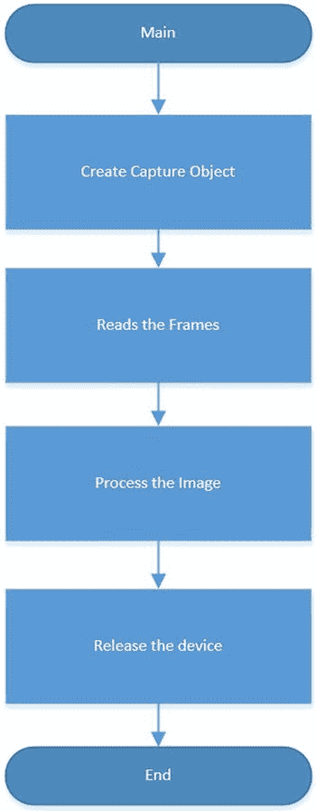

[图 7-7](#_Fig7) 。捕捉帧的 OpenCV 流程图

清单 7-1 展示了一个如何捕捉图像并将其作为 JPEG 文件存储在文件系统中的例子。

[***清单 7-1***](#_list1) 。opencv_capimage.cpp

```sh
#include <opencv2/opencv.hpp>
using namespace cv;
using namespace std;

int main()
{

  VideoCapture cap(-1);

  //check if the file was opened properly
  if(!cap.isOpened())
  {
      cout << "Webcam could not be opened succesfully" << endl;
      exit(-1);
  }
  else
  {
      cout << "p n" << endl;
  }

  int w = 960;
  int h = 544;
  cap.set(CV_CAP_PROP_FRAME_WIDTH, w);
  cap.set(CV_CAP_PROP_FRAME_HEIGHT, h);

  Mat frame;
  cap >>frame;
  imwrite("opencv.jpg", frame);

  cap.release();

  return 0;
}
```

查看 opencv_capimage.cpp

第一个例子使用了一些基于以下类的对象。`VideoCapture`用于创建打开和配置设备的捕获对象，捕获图像和视频，并在设备不再使用时将其释放。`Mat`接收读取的帧，并使用一些算法处理图像。它可以根据数学和统计算法应用滤镜、改变颜色和变换图像。在下一个例子中，`Mat`仅用于读取图像。然而，在接下来的几个例子中，`Mat`也将用于处理图像。

为了理解[清单 7-1](#list1) 中的代码，你需要快速浏览一下所使用的每个类。

视频捕获::视频捕获

首先要做的是使用`VideoCapture`类创建一个视频捕获对象，并打开设备或一些存储在文件系统中的视频。

关于`VideoCapture`级的更多信息，参见`http://docs.opencv.org/modules/highgui/doc/reading_and_writing_images_and_video.html`。

对于网络摄像头，您将在构造函数中使用参数`-1`创建对象，如下所示:

```sh
VideoCapture cap(-1);
```

值`-1`表示“打开系统中枚举的当前设备”，因此如果您将摄像头枚举为`/dev/video0`或`/dev/video1`，网络摄像头将被打开。否则，如果您想知道要打开哪个设备，您必须将枚举设备的索引传递给构造函数。例如，要打开设备`/dev/video0`，必须像这样将数字`0`传递给构造函数:

```sh
VideoCapture cap(0);
```

如果你使用 Intel Galileo 和一个摄像头，我建议你使用`-1`来避免摄像头枚举索引相对于你在构造函数中使用的硬编码数字的问题。

VideoCapture::isOpened()

您可以通过调用`isOpened()`方法来检查网络摄像机是否打开并成功初始化。如果摄像头打开了，它返回一个布尔值`true`，如果没有打开，则返回`false`。

VideoCapture::set(const int prop，int value)

这个方法将属性 ( `prop`)设置为一个特定的值(`value`)。您可以设置图像的宽度、高度、每秒帧数和其他一些属性。在代码示例中，视频宽度和高度设置为 960x544:

```sh
int w = 960;
int h = 544;
cap.set(CV_CAP_PROP_FRAME_WIDTH, w);
cap.set(CV_CAP_PROP_FRAME_HEIGHT, h);
```

有关受支持属性的更多信息，请访问`http://nullege.com/codes/search/opencv.highgui.CV_CAP_PROP_FPS`。

VideoCapture::read(材料和图像)或 operator > >(材料和图像)

此方法从设备读取图像。它只需一次调用就能抓取图像。返回的是一个`Mat`对象,稍后将对其进行解释。

这个例子使用了操作符`>>`:

```sh
Mat frame;
cap >>frame;
```

视频捕获::发布()

一旦捕获了视频，如果没有调用对象的析构函数，就必须通过调用`release()`方法来释放摄像机。

```sh
cap.release();
```

与我们专注于 Video4Linux 时使用的软件相比，一眼就能看出这是多么简单。

cv::Mat::Mat

是一个很棒的用于矩阵运算的类，它经常被用在 OpenCV 应用程序中。`Mat` 用于以矩阵的形式组织图像，负责保存每个像素的细节，包括颜色强度、在图像中的位置、图像尺寸等。

`Mat`类被组织成两部分——一部分包含带有图像一般信息的图像头，另一部分包含表示图像的字节序列。

在代码示例中，`Mat`仅作为`Mat`而不是`cv::Mat`被调用，因为名称空间是在代码的开头定义的:

```sh
using namespace cv;
```

此外，在代码示例中，有一个用类中可用的简单构造函数创建的`Mat`对象:

```sh
Mat frame;
```

在接下来的例子中，将使用其他方法并进行适当的讨论。现在，请记住`Mat`类和这个简单的构造函数的用途。

关于`Mat`类的更多细节，请访问`http://docs.opencv.org/modules/core/doc/basic_structures.html#mat-mat`。`docs.opencv.org`维护的教程也推荐在`http://docs.opencv.org/doc/tutorials/core/mat_the_basic_image_container/mat_the_basic_image_container.html`。

cv::imrite(const string & filename，InputArray img，const vector<int>& params = vector<int>())</int></int>

此方法将图像保存到文件系统。在代码示例中，文件是`opencv.jpg`，输入数组被固有地转换为带有对象框架的 my `Mat`类，并且省略了`params`参数的可选向量。

```sh
Mat frame;
cap >>frame;
imwrite("opencv.jpg", frame);
```

在这种情况下，省略了`params`参数的向量，用于捕获图像的编码基于文件扩展名`.jpg`。请记住，相机不支持捕捉 JPEG 格式的图像。它在 Motion JPEG 中捕获流，但 JPEG 不是从 Motion JPEG 中提取的，因为有一个名为 DHT 的片段不在这个流中(查看`http://www.digitalpreservation.gov/formats/fdd/fdd000063.shtml`)。您可以使用`ffmpeg`从 Motion JPEG 流文件中提取一系列 JPEG 图像，但由于 DHT 片段丢失，这些图像将无法在任何图像软件中查看。

换句话说，当文件扩展名被指定并且不被网络摄像头支持时，OpenCV 框架转换该文件。

除了 JPEG 之外，还支持 PNG、PPM、PGM 和 PBM。

`docs.opencv.org`网站维护了一个很好的教程，关于如何在`http://docs.opencv.org/doc/tutorials/introduction/load_save_image/load_save_image.html` `加载、修改和保存图像。`

 `运行 opencv_capimage.cpp

编译代码并将文件传输到英特尔 Galileo。确保`uvcvideo`驱动程序已加载，网络摄像头已连接到 USB 端口(请阅读本章中的“连接网络摄像头”一节)。最后，对着网络摄像头微笑，运行软件:

```sh
root@clanton:~# ./opencv_capimage
VIDIOC_QUERYMENU: Invalid argument
VIDIOC_QUERYMENU: Invalid argument
VIDIOC_QUERYMENU: Invalid argument
VIDIOC_QUERYMENU: Invalid argument
VIDIOC_QUERYMENU: Invalid argument
VIDIOC_QUERYMENU: Invalid argument
VIDIOC_QUERYMENU: Invalid argument
Webcam is OK! I found it!

VIDIOC_QUERYMENU: Invalid argument
VIDIOC_QUERYMENU: Invalid argument
VIDIOC_QUERYMENU: Invalid argument
VIDIOC_QUERYMENU: Invalid argument
VIDIOC_QUERYMENU: Invalid argument
VIDIOC_QUERYMENU: Invalid argument
VIDIOC_QUERYMENU: Invalid argument
```

在同一个文件夹中应该有一个名为`opencv.jpg`的文件。现在，你可能会问`VIDIOC_QUERYMENU: Invalid argument`消息是什么意思。这样的消息与 OpenCV 无关，代码也没有问题。它只是 OpenCV 使用 Video4Linux 框架来理解网络摄像头提供的功能和控制。当没有提供某些控制或功能时，V4L 会用这些警告消息通知您。

如果您不想看到这些消息，可以使用`stderr`流将它们重定向到空设备。例如:

```sh
root@clanton:~# ./opencv_capimage 2> /dev/null
Webcam is OK! I found it!
```

用 Python 写的同一个软件

您可以将 Python 与 OpenCV 一起使用，因为 Python Opencv 开发包是本章介绍的 BSP SD 卡映像的一部分。

清单 7-1 中的程序可以很容易地转换成 Python，如清单 7-2 中的[所示。](#list2)

[***清单 7-2***](#_list2) 。opencv _ capiimage . py

```sh
import cv2
import cv
import sys

cap = cv2.VideoCapture(-1)

w, h = 960, 544
cap.set(cv.CV_CAP_PROP_FRAME_WIDTH, w)
cap.set(cv.CV_CAP_PROP_FRAME_HEIGHT, h)

if not cap.isOpened():
    print "Webcam could not be opened successfully"
    sys.exit(-1)
else:
    print "Webcam is OK! I found it!"

ret, frame = cap.read()
cv2.imwrite('pythontest.jpg', frame)

cap.release()
```

正如你所看到的，对象是完全相同的。要运行软件，请转移到英特尔 Galileo 主板，并在终端外壳中运行以下程序:

```sh
root@clanton:~# python opencv_capimage.py  2> /dev/null
Webcam is OK! I found it!
```

然而，本章中的示例是用 C++编写的。这是因为用 C++编写的代码比用 Python 编写的代码运行速度快得多。

OpenCV C++与 OpenCV Python 的性能比较

为了检查性能问题，假设您已经在英特尔 Galileo 上正确安装了[清单 7-2](#list2) 中所示的 Python 程序和[清单 7-1](#list1) 中所示的 C++程序。您可以使用带有命令`date +%s`的 bash 终端来测量性能，该命令返回自 1970-01-01-01 UTC 00:00:00 以来经过的秒数。执行程序并评估时差。

首先，使用以下命令运行 Python 程序:

```sh
root@clanton:~# s=$(date +%s);python opencv_capimage.py; echo $(expr 'date +%s' - $s)
Webcam is OK! I found it!
8
```

Python 花了八秒拍的图。用 C++程序做同样的事情:

```sh
root@clanton:~# s=$(date +%s);./opencv_capimage 2> /dev/null; echo $(expr 'date +%s' - $s)
Webcam is OK! I found it!
4
```

同样用 C++写的程序，只用了四秒钟。即使是在用户空间环境中运行的程序也会遇到一些时间执行变化，因为它不是一个实时系统。用 C++创建的 OpenCV 应用程序比用 Python 运行的相同应用程序要快得多。

处理图像

在上一节中，您从网络摄像头捕获了图像并将其保存到文件系统中，但是没有进行任何图像处理。接下来的例子探索了使用 OpenCV 进行图像处理的无限可能性。其中一些在后台使用巨大的算法，讨论每一个的细节不在本书的范围之内。但是，参考资料包含了更多信息。

检测边缘

对于图像处理的第一个例子，您将了解如何使用约翰·f·坎尼在 1986 年开发的坎尼边缘算法来检测图像。

OpenCV 有一个名为`Canny()`的函数实现了这样的算法。关于这个算法的细节，请参见`http://docs.opencv.org/doc/tutorials/imgproc/imgtrans/canny_detector/canny_detector.html` `。`

 `对清单 7-1 中的[做了一些修改，Canny 算法如清单 7-3](#list1) 中的[所示。](#list3)

[***清单 7-3***](#_list3) 。opencv_capimage_canny.cpp

```sh
#include <opencv2/opencv.hpp>
using namespace cv;
using namespace std;

int main()
{

  VideoCapture cap(-1);

  //check if the file was opened properly
  if(!cap.isOpened())
  {
      cout << "Webcam could not be opened succesfully" << endl;
      exit(-1);
  }
  else
  {
      cout << "Webcam is OK! I found it!\n" << endl;
  }

  int w = 960;
  int h = 544;
  cap.set(CV_CAP_PROP_FRAME_WIDTH, w);
  cap.set(CV_CAP_PROP_FRAME_HEIGHT, h);

  Mat frame;
  cap >>frame;

  // converts the image to grayscale
  Mat frame_in_gray;
  cvtColor(frame, frame_in_gray, CV_BGR2GRAY);

  // process the Canny algorithm
  cout << "processing image with Canny..." << endl;
  int threshold1 = 0;
  int threshold2 = 28;
  Canny(frame_in_gray, frame_in_gray, threshold1, threshold1);

  // saving the images in the files system

  cout << "Saving the images..." << endl;
  imwrite("captured.jpg", frame);
  imwrite("captured_with_edges.jpg", frame_in_gray);

  // release the camera
  cap.release();

  return 0;
}
```

正在查看 opencv_capimage_canny.cpp

在本例中，清单 7-3 中的[发生了以下变化:](#list3)

1.  添加了一个名为`cvtColor()`的新静态方法。
2.  `Canny()`功能用于图像处理。

最初由摄像机捕获的图像和用 Canny 算法处理的图像都使用前面解释的`imwrite()`函数作为`captured.jpg`和`captured_with_edges.jpg`存储在文件系统中。

请参见 cv::cvtColor(InputArray src、OutputArray dst、int code、int dstCn=0)

将图像空间颜色转换为另一种颜色。在下面的代码示例中:

```sh
Mat frame_in_gray;
cvtColor(frame, frame_in_gray, CV_BGR2GRAY);
```

输入图像是由网络摄像头捕获并存储在`Mat`对象中的图像`frame. The frame_in_gray`对象被创建来接收代码`CV_BGR2GRAY`所请求的转换为灰色空间颜色的图像。

有关`cvtColor()`功能和颜色的更多详细信息，请访问`http://docs.opencv.org/modules/imgproc/doc/miscellaneous_transformations.html#cvtcolor`。

void cv::Canny(InputArray image，OutputArray edges，double threshold1，double threshold2，int apertureSize=3，bool L2gradient=false)

Canny 函数将图像输入数组作为源图像，并将边缘转换为清晰的边缘。它将输出数组存储在`edges`中。示例中的输入和输出图像是同一个对象(`frame_in_gray);`为了获得最佳效果，使用了灰度图像。

`apertureSize`参数是算法中使用的 Sobel 算子的大小(更多细节见`http://en.wikipedia.org/wiki/Sobel_operator`),代码保持默认值 3。

`L2gradient`参数是一个布尔值；当它是`true`时，使用图像梯度`magnitude`，当它是`false`时，只考虑标准方程。这个例子使用了默认值`false`。

两个迟滞阈值由自变量`threshold1`和`threshold2`表示，分别使用值 0 和 28。这些值是基于我改变这些值的实验，直到我得到我认为好的结果。您可以更改这些值并检查您获得的效果。

```sh
int threshold1 = 0;
int threshold2 = 28;
Canny(frame_in_gray, frame_in_gray, threshold1, threshold1);
```

关于 Canvas 函数的官方文档可以在这个链接`http://docs.opencv.org/modules/imgproc/doc/feature_detection.html?highlight=canny#canny` *找到。*

运行 opencv_capimage_canny.cpp

编译代码并将文件传输到英特尔 Galileo。确保`uvcvideo`驱动程序已加载，网络摄像头已连接至 USB 端口(请阅读本章中的“连接网络摄像头”一节)。将您的网络摄像头指向一些边缘丰富的对象，如图 7-8 和图 7-9 中的图像。

```sh
root@clanton:~# ./opencv_capimage_canny 2> /dev/null
Webcam is OK! I found it!

processing image with Canny...
Saving the images...
```

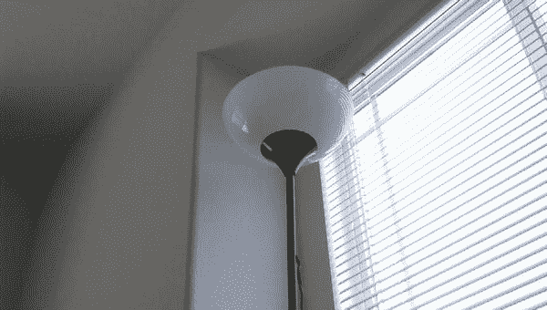

[图 7-8](#_Fig8) 。Canny 效果之前的原始图像

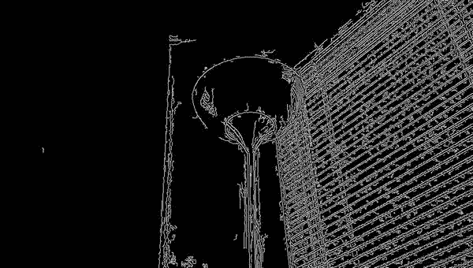

[图 7-9](#_Fig9) 。Canny 效果后的图像

你应该有两个图像存储在文件系统中，分别是*captured.jpg*和 *captured_with_edges.jpg* 。

面部和眼睛检测

下一个示例检测使用网络摄像头拍摄的照片中的多张面孔和眼睛。用于检测人脸和眼睛的类被命名为`CascadeClassifier`。

基本概念是这个类加载一些使用*分类器模型*的 XML 文件。在代码中，在创建`CascadeClassifier`对象的过程中，加载了两个文件，分别称为`haarcascade_frontalface_alt.` `xml` 和`haarcascade_eye.` `xml` 。每个文件都有一系列模型，这些模型根据一系列矩形中像素的亮度总和来定义特定对象在图像中的表现方式。这些和的差在图像中被评估。这两个文件都具有来自图像的关于脸部和眼睛的特征，并且当调用方法`detectMultiScale()`时，类`CascadeClassifier`可以确定检测。

有关`CascadeClassifier()` 的更多信息，请访问`http://docs.opencv.org/modules/objdetect/doc/cascade_classification.html?highlight=cascadeclassifier#cascadeclassifier`。

另请参阅“全局 Haar-Like Features:经典 Haar Features 的新扩展，用于噪声图像中的高效人脸检测”，第 6 届太平洋沿岸。图像和视频技术研讨会，PSIVT 2013 *、*，作者:Mahdi Rezaei、Hossein Ziaei Nafchi 和 Sandino Morales。

当检测到面部时，将在面部周围绘制矩形，当检测到眼睛时，将在眼睛周围绘制圆形。这些绘图是使用 OpenCV 中非常基本的绘图函数完成的，这些函数叫做`rectangle()`和`circle()` 。

清单 7-4 显示了这个例子的代码。

[***清单 7-4***](#_list4) 。opencv _ face _ and _ eyes _ detection . CPP

```sh
#include <opencv2/opencv.hpp>
#include "opencv2/core/core.hpp"

using namespace cv;
using namespace std;

String face_cascade_name = "haarcascade_frontalface_alt.xml";
String eye_cascade_name = "haarcascade_eye.xml";

void faceDetect(Mat img);
CascadeClassifier face_cascade;
CascadeClassifier eyes_cascade;

using namespace cv;
using namespace std;

int main(int argc, const char *argv[])
{

  if( !face_cascade.load( face_cascade_name ) )
  {
    cout << face_cascade_name << " not found!! aborting..." << endl;
    exit(-1);
  };

  if( !eyes_cascade.load( eye_cascade_name ) )
  {
    cout << eye_cascade_name << " not found!! aborting..." << endl;
    exit(-1);
  };

  // 0 is the ID of the built-in laptop camera, change if you want to use other camera
  VideoCapture cap(-1);

  //check if the file was opened properly
  if(!cap.isOpened())
  {
      cout << "Capture could not be opened succesfully" << endl;
      return -1;
  }
  else
  {
      cout << "camera is ok\n" << endl;
  }

  int w = 432;
  int h = 240;
  cap.set(CV_CAP_PROP_FRAME_WIDTH, w);
  cap.set(CV_CAP_PROP_FRAME_HEIGHT, h);

  Mat frame;
  cap >>frame;

  cout << "processing the image...." << endl;

  faceDetect(frame);
  imwrite("face_and_eyes.jpg", frame);

  // release the camera
  cap.release();

  cout << "done!" << endl;
  return 0;
}

void faceDetect(Mat img)
{
  std::vector<Rect> faces;
  std::vector<Rect> eyes;
  bool two_eyes = false;
  bool any_eye_detected = false;

  //detecting faces
  face_cascade.detectMultiScale( img, faces, 1.1, 2, 0|CV_HAAR_SCALE_IMAGE, Size(30, 30) );

  if (faces.size() == 0)
  {
       cout << "Try again.. I did not dectected any faces..." << endl;
       return;
  }

  // it is possible to face more than one human face in the image
  for( size_t i = 0; i < faces.size(); i++ )
  {

     // rectangle in the face
     rectangle( img, faces[i], Scalar( 255, 100, 0 ), 4, 8, 0 );

     Mat frame_gray;
     cvtColor( img, frame_gray, CV_BGR2GRAY );

     // croping only the face in region defined by faces[i]
     std::vector<Rect> eyes;
     Mat faceROI = frame_gray( faces[i] );

     // In each face, detect eyes
     eyes_cascade.detectMultiScale( faceROI, eyes, 1.1, 2, 0 |CV_HAAR_SCALE_IMAGE, Size(30, 30) );

     for( size_t j = 0; j < eyes.size(); j++ )
      {
         Point center( faces[i].x + eyes[j].x + eyes[j].width*0.5, faces[i].y + eyes[j].y + eyes[j].height*0.5 );
         int radius = cvRound( (eyes[j].width + eyes[j].height)*0.25 );
         circle( img, center, radius, Scalar( 255, 0, 0 ), 4, 8, 0 );

      }

    }

}
```

查看 opencv _ face _ and _ eyes _ detection . CPP

在本例中，有几个新组件:

*   `CascadeClassifier`类的介绍。
*   `Point`类的用法
*   `cvRound()`功能
*   `rectangle()`和`circle()`功能的使用
*   `Rect`类和向量

以下部分对代码中使用的每个项目进行了解释。

cv::cascadillegar::cascadillegar()

创建`CascadeClassifier`对象。在示例代码中，创建了两个对象，一个用于检测面部，另一个用于检测眼睛。

```sh
CascadeClassifier face_cascade;
CascadeClassifier eyes_cascade;
```

cv::CascadeClassifier::load(常量字符串和文件名)

将带有分类器的文件加载到对象中。在代码中，使用了两个分类器，一个用于检测面部，另一个用于检测眼睛。

```sh
if( !face_cascade.load( face_cascade_name ) )
{
  cout << face_cascade_name << " not found!! aborting..." << endl;
  exit(-1);
};

if( !eyes_cascade.load( eye_cascade_name ) )
{
  cout << eye_cascade_name << " not found!! aborting..." << endl;
  exit(-1);
};
```

void cv::cascade classifier::detect multi scale(const Mat & image，vector <rect>& objects，double scaleFactor=1.1，int minNeighbors=3，int flags=0，SizeminSize=Size()，Size maxSize=Size())</rect>

在检测方面，`detectMultiScale()`方法是神奇的地方。每个参数的说明如下:

*   `image`是图片来源。
*   `vector<Rect>& objects`是矩形的向量，是物体在图像中检测到的位置。
*   `scaleFactor`是决定图像是否缩小的因素。
*   `minNeighbors`确定每个候选矩形有多少个邻居。如果`0`通过，则存在图像中的其他物体被错误检测的风险，从而导致检测中的误报。例如，如果您的墙上有一个时钟，它可能会被检测为人脸(误报)。在我的实践实验中，指定 2 或 3 是好的。多于 3 个，并且存在丢失真阳性的风险，并且人脸不能被正确检测。
*   `Flags`与优化的类型有关。`CV_HAAR_SCALE_IMAGE`告知算法负责缩放后的图像。该标志接受跳过平坦区域的`CV_HAAR_DO_CANNY_PRUNNING`，如果有兴趣寻找图像中最大的物体则接受`CV_HAAR_FIND_BIGGEST_OBJECT`，以及必须仅与`CV_HAAR_FIND_BIGGEST_OBJECT lile "0|CV_HAAR_DO_ROUGH_SEARCH |CV_HAAR_FIND_BIGGEST_OBJECT"`一起使用的`CV_HAAR_DO_ROUGH_SEARCH`。
*   `SizeminSize`定义最小对象尺寸，小于该尺寸的对象将被忽略。如果没有定义，就不考虑这个论点。
*   `maxSize`定义最大对象尺寸，大于该尺寸的对象将被忽略。如果没有定义，就不考虑这个论点。

```sh
//detecting faces
face_cascade.detectMultiScale( img, faces, 1.1, 2, 0|CV_HAAR_SCALE_IMAGE, Size(30, 30) );

...
...
...

//In each face, detect eyes
eyes_cascade.detectMultiScale( faceROI, eyes, 1.1, 2, 0 |CV_HAAR_SCALE_IMAGE, Size(30, 30)
```

在这段代码中，使用的缩放因子是 1.1，`minNeighbors`是 2(一种提示)，使用`CV_HAAR_SCALE_IMAGE`对标志进行了性能优化，要检测的对象的最小尺寸是 30x30 像素。没有定义最大尺寸，因此您可以将脸靠近网络摄像头。

代码检测到了图像中的人脸。对于检测到的每一张脸，都会画出一个矩形来划分区域。

```sh
// rectangle in the face
rectangle( img, faces[i], Scalar( 255, 100, 0 ), 4, 8, 0 );
```

包含检测到的面部的结果区域存储在`vector<Rect> faces` **中。**比如`faces[0]`就是图片中的第一张脸。如果不止一个人，你会有`face[1]`、`face[2]`等等。对象类型`Rect`意味着矩形，所以面矢量是一组没有图形对象的矩形。它们是在`(Rec.x,Rec.y)`中存储初始坐标(左上角点)以及在`object`类中存储矩形的宽度`(Rec.w)`和高度`(Rec.h)`的对象。

对于检测到的每个区域，创建一个新图像，其图像内容由矩形界定，形成一个小区域。这个小区域被称为 *ROI* (感兴趣区域)。为了获得最佳性能并使眼睛中的图像正常化，使用`cvColor()`功能将检测转换为灰度。

```sh
Mat frame_gray;
cvtColor( img, frame_gray, CV_BGR2GRAY );
// croping only the face in region defined by faces[i]
std::vector<Rect> eyes;
Mat faceROI = frame_gray( faces[i] );
```

在这个仅包含面部的小区域中，级联分类器试图识别眼睛。对于检测到的每只眼睛，都会画一个圆。因此，当面部使用整个图像来检测时，只在面部区域中检测眼睛。这优化了算法。

```sh
// In each face, detect eyes
eyes_cascade.detectMultiScale( faceROI, eyes, 1.1, 2, 0 |CV_HAAR_SCALE_IMAGE, Size(30, 30) );
```

包含眼睛的合成区域存储在`vector<Rect> eyes`中。

这个过程是通过代码中的`for`循环完成的:

```sh
  for( size_t i = 0; i < faces.size(); i++ )
  {

...
...
...
     for( size_t j = 0; j < eyes.size(); j++ )
      {
...
...
...     }

  }
```

为了在眼睛周围画圆圈，使用了`Point`类。它从`vector<Rect> eyes`提取信息并存储眼睛的准确中心(中心坐标):

```sh
Point center( faces[i].x + eyes[j].x + eyes[j].width*0.5, faces[i].y + eyes[j].y + eyes[j].height*0.5 );
int radius = cvRound( (eyes[j].width + eyes[j].height)*0.25 );
circle( img, center, radius, Scalar( 255, 0, 0 ), 4, 8, 0 );
```

因此，`Point center`对象基于当前面部的矩形尺寸，由眼睛的中心点和变量`radius`识别。使用`cvRound()`功能，确定眼睛周围的半径。

有了这两个信息，就可以使用函数`circle()`画一个圆。

[图 7-10](#Fig10) 显示了该代码的顺序。


[图 7-10](#_Fig10) 。检测面部和眼睛的流程图

运行 opencv _ face _ and _ eyes _ detection . CPP

编译代码并将文件传输到英特尔 Galileo。确保`uvcvideo`驱动程序已加载，网络摄像头已连接到 USB 端口(请阅读本章中的“连接网络摄像头”一节),并将`haarcascade_frontalface_alt.xml`和`haarcascade_eye.xml`文件复制到您传输可执行程序的位置。站在摄像机前，朝镜头方向看。然后运行软件:

```sh
root@clanton:~# ./opencv_face_and_eyes_detection 2> /dev/null
camera is ok
processing the image....
done!
```

在检测到所有人脸和眼睛的文件系统中创建一个名为`face_and_eyes.jpg`的图像，如图[图 7-11](#Fig11) 所示。

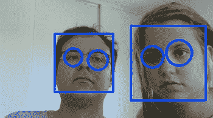

[图 7-11](#_Fig11) 。检测到不止一张脸和多只眼睛

情绪分类

本节中显示的方法和一些脚本基于 Phillip Wagner 在文章“使用 OpenCV 进行性别分类”中的工作，你可以在`http://docs.opencv.org/trunk/modules/contrib/doc/facerec/tutorial/facerec_gender_classification.html` `找到这篇文章。Phillip Wagner 友好地批准了代码改编和所探索的技术，将 BSD 许可下的所有代码作为他在本书中的原创作品。`

 `原始代码已更改，以便:

*   在英特尔 Galileo 上运行，对情绪而不是性别进行分类。
*   直接从网络摄像头捕捉的图像中检测人脸和眼睛。
*   基于人体解剖学动态裁剪图像。

本例中的情感分类分为三类:

*   幸福的
*   悲哀的
*   好奇的

这个想法是，你用网络摄像头拍照，英特尔 Galileo 将试图描述你的情绪状态。

你需要建立一个数据库，里面有你展示每种情绪状态的图片。该数据库将包含使用稍后解释的特定算法的图像。当您通过一个名为`fisherface`的模型看着网络摄像头时，这些图像用作参考，使英特尔 Galileo 能够确定您的情绪。

本章中的数据库是基于我的脸，但是有根据你的脸重新创建数据库的说明。如果你使用这一部分运行程序，它有很小的机会识别你的情绪(如果你足够幸运长得像我)。好吧，如果你长得像我，你不一定幸运(哈哈)。

准备桌面

你需要用你的一些照片创建一个数据库。结合 Python 中运行的一些脚本，详细解释了生成这个数据库的过程。

需要在你的电脑上安装 Python，安装`pillow`和`setuptools`模块。

`Pillow`用于使用 Python 脚本处理图像，而`setuptools`是 pillow 请求的依赖项。你应该先安装`setuptools`模块。

`Pillow`可从`https://pypi.python.org/pypi/Pillow`下载，`setuptools`模块可从`https://pypi.python.org/pypi/setuptools` `下载。这两个站点都包含如何在 Linux、Windows 和 MacOSX 上安装这些模块的信息。`

 `你还需要一个图像编辑器，因为它需要拍摄一些不同情绪的面部照片，并确定每只眼睛中心的坐标。您可以在 Windows 中使用 Paint，在 Linux/OSX 和 Windows 上使用 Gimp，或者任何其他允许您在图像中移动鼠标光标并获得坐标的软件。

可以从`http://www.gimp.org/`下载 Gimp。

创建数据库

按照以下步骤创建数据库:

1.  获取初始图像。
2.  裁剪图像。
3.  组织目录中的图像。
4.  创建 CSV 文件。

让我们更详细地看一下每个步骤。

获取初始图像

这个例子使用了三种情绪——快乐、悲伤和惊讶。这意味着数据库必须包含至少三张你在每个州的照片。

这些图片必须使用您的网络摄像头获取。无论您是使用上述代码示例通过英特尔 Galileo 获取图像，还是将网络摄像头连接到电脑并使用其他软件拍照，都没有关系。最重要的是对每种情绪至少拍三张照片——悲伤、惊讶和高兴——总共九张照片。我建议您以 1280x1024 或 1280x720 的分辨率拍摄这些照片。图像将被裁剪和缩小，在这些改变之后保持图像的良好清晰度是很重要的。

在这一章的`code`文件夹的`initial_pictures`子文件夹里，有我每一种情绪的一些图片。每张照片都拍摄了我眼睛中心的像素坐标——见[表 7-2](#Tab2) 。

[表 7-2](#_Tab2) 。每种情绪状态下每只眼睛的中心坐标

<colgroup><col width="35%"> <col width="30%"> <col width="35%"></colgroup> 
| 

画

 | 

左眼中心(x，y)

 | 

右眼中心(x，y)

 |
| --- | --- | --- |
| `serious_01.jpg` | 528, 423 | 770, 431 |
| `serious_02.jpg` | Five hundred and twenty-two thousand four hundred and twelve | 758, 415 |
| `serious_03.jpg` | 518, 423 | 754, 425 |
| `smile_01.jpg` | 516, 377 | 753, 379 |
| `smile_02.jpg` | 533, 374 | 763, 380 |
| `smile_03.jpg` | 518, 379 | 749, 381 |
| `surprised_01.jpg` | Five hundred and sixteen thousand three hundred and fifty-six | Seven hundred and fifty-four thousand three hundred and fifty-five |
| `surprised_02.jpg` | 548, 364 | 793, 364 |
| `surprised_03.jpg` | 528, 377 | 770, 378 |

拍照的时候要有表现力。否则，程序就更难猜出你的情绪状态。

裁剪图像

下一步是裁剪图像，去除耳朵和头发，并尝试生成只显示人脸的 20x20 图像。最初为性别分类创建的 Python 脚本适用于情感分类，如清单 7-5 所示。

[***清单 7-5***](#_list5) 。align_faces.py

```sh
#!/usr/bin/env python
# Software License Agreement (BSD License)
#
# Copyright (c) 2012, Philipp Wagner
# All rights reserved.
#
# Redistribution and use in source and binary forms, with or without
# modification, are permitted provided that the following conditions
# are met:
#
#  * Redistributions of source code must retain the above copyright
#    notice, this list of conditions and the following disclaimer.
#  * Redistributions in binary form must reproduce the above
#    copyright notice, this list of conditions and the following
#    disclaimer in the documentation and/or other materials provided
#    with the distribution.
#  * Neither the name of the author nor the names of its
#    contributors may be used to endorse or promote products derived
#    from this software without specific prior written permission.
#
# THIS SOFTWARE IS PROVIDED BY THE COPYRIGHT HOLDERS AND CONTRIBUTORS
# "AS IS" AND ANY EXPRESS OR IMPLIED WARRANTIES, INCLUDING, BUT NOT
# LIMITED TO, THE IMPLIED WARRANTIES OF MERCHANTABILITY AND FITNESS
# FOR A PARTICULAR PURPOSE ARE DISCLAIMED. IN NO EVENT SHALL THE
# COPYRIGHT OWNER OR CONTRIBUTORS BE LIABLE FOR ANY DIRECT, INDIRECT,
# INCIDENTAL, SPECIAL, EXEMPLARY, OR CONSEQUENTIAL DAMAGES (INCLUDING,
# BUT NOT LIMITED TO, PROCUREMENT OF SUBSTITUTE GOODS OR SERVICES;
# LOSS OF USE, DATA, OR PROFITS; OR BUSINESS INTERRUPTION) HOWEVER
# CAUSED AND ON ANY THEORY OF LIABILITY, WHETHER IN CONTRACT, STRICT
# LIABILITY, OR TORT (INCLUDING NEGLIGENCE OR OTHERWISE) ARISING IN
# ANY WAY OUT OF THE USE OF THIS SOFTWARE, EVEN IF ADVISED OF THE
# POSSIBILITY OF SUCH DAMAGE.
#
# Manoel Ramon 06/11/2014- changed the code to support images used
#                          as example of emotion classification
#
import sys, math, Image

def Distance(p1,p2):
  dx = p2[0] - p1[0]
  dy = p2[1] - p1[1]
  return math.sqrt(dx*dx+dy*dy)

def ScaleRotateTranslate(image, angle, center = None, new_center = None, scale = None, resample=Image.BICUBIC):
  if (scale is None) and (center is None):
    return image.rotate(angle=angle, resample=resample)
  nx,ny = x,y = center
  sx=sy=1.0
  if new_center:
    (nx,ny) = new_center
  if scale:
    (sx,sy) = (scale, scale)
  cosine = math.cos(angle)
  sine = math.sin(angle)
  a = cosine/sx
  b = sine/sx
  c = x-nx*a-ny*b
  d = -sine/sy
  e = cosine/sy
  f = y-nx*d-ny*e
  return image.transform(image.size, Image.AFFINE, (a,b,c,d,e,f), resample=resample)

def CropFace(image, eye_left=(0,0), eye_right=(0,0), offset_pct=(0.2,0.2), dest_sz = (70,70)):
  # calculate offsets in original image
  offset_h = math.floor(float(offset_pct[0])*dest_sz[0])
  offset_v = math.floor(float(offset_pct[1])*dest_sz[1])
  # get the direction
  eye_direction = (eye_right[0] - eye_left[0], eye_right[1] - eye_left[1])
  # calc rotation angle in radians
  rotation = -math.atan2(float(eye_direction[1]),float(eye_direction[0]))
  # distance between them
  dist = Distance(eye_left, eye_right)
  # calculate the reference eye-width
  reference = dest_sz[0] - 2.0*offset_h
  # scale factor
  scale = float(dist)/float(reference)
  # rotate original around the left eye
  image = ScaleRotateTranslate(image, center=eye_left, angle=rotation)
  # crop the rotated image
  crop_xy = (eye_left[0] - scale*offset_h, eye_left[1] - scale*offset_v)
  crop_size = (dest_sz[0]*scale, dest_sz[1]*scale)
  image = image.crop((int(crop_xy[0]), int(crop_xy[1]), int(crop_xy[0]+crop_size[0]), int(crop_xy[1]+crop_size[1])))
  # resize it
  image = image.resize(dest_sz, Image.ANTIALIAS)
  return image

if __name__ == "__main__":

#Serious_01.jpg
#left  -> 528, 423
#right -> 770, 431

  image =  Image.open("serious_01.jpg")
  CropFace(image, eye_left=(528,423), eye_right=(770,431), offset_pct=(0.2,0.2)).save("serious01_20_20_70_70.jpg")

#Serious_02.jpg
#left  -> 522,412
#right -> 758, 415

  image =  Image.open("serious_02.jpg")
  CropFace(image, eye_left=(522,412), eye_right=(758,415), offset_pct=(0.2,0.2)).save("serious02_20_20_70_70.jpg")

#Serious_03.jpg
#left  -> 518, 423
#right -> 754, 425

  image =  Image.open("serious_03.jpg")
  CropFace(image, eye_left=(518,423), eye_right=(754,425), offset_pct=(0.2,0.2)).save("serious03_20_20_70_70.jpg")

#Smile_01.jpg
#left  -> 516, 377
#right -> 753, 379

  image =  Image.open("smile_01.jpg")
  CropFace(image, eye_left=(516,377), eye_right=(753,379), offset_pct=(0.2,0.2)).save("smile01_20_20_70_70.jpg")

#Smile_02.jpg
#left  -> 533, 374
#right -> 763, 380

  image =  Image.open("smile_02.jpg")
  CropFace(image, eye_left=(533,374), eye_right=(763,380), offset_pct=(0.2,0.2)).save("smile02_20_20_70_70.jpg")

#Smile_03.jpg
#left  -> 518, 379
#right -> 749, 381

  image =  Image.open("smile_03.jpg")
  CropFace(image, eye_left=(518,379), eye_right=(749,381), offset_pct=(0.2,0.2)).save("smile03_20_20_70_70.jpg")

#surprised_01.jpg
#left  -> 516,356
#right -> 754,355

  image =  Image.open("surprised_01.jpg")
  CropFace(image, eye_left=(516,356), eye_right=(754,355), offset_pct=(0.2,0.2)).save("surprised01_20_20_70_70.jpg")

#surprised_02.jpg
#left  -> 548, 364
#right -> 793, 364

  image =  Image.open("surprised_02.jpg")
  CropFace(image, eye_left=(548,364), eye_right=(793,364), offset_pct=(0.2,0.2)).save("surprised02_20_20_70_70.jpg")

#surprised_03.jpg
#left  -> 528, 377
#right -> 770, 378

  image =  Image.open("surprised_03.jpg")
  CropFace(image, eye_left=(528,377), eye_right=(770,378), offset_pct=(0.2,0.2)).save("surprised03_20_20_70_70.jpg")
```

如果你在你的图片中使用相同的文件名，你唯一需要改变的是你的眼睛在每张图片中的坐标。然后，将脚本复制到图片所在的文件夹中，并在计算机 shell 中运行:

```sh
mcramon@ubuntu:~/tmp/opencv/emotion/mypics$ python align_faces.py
```

创建一系列带有后缀`_20_20_70_70`的图像:

```sh
mcramon@ubuntu:~/tmp/opencv/emotion/mypics$ ls *20*
serious01_20_20_70_70.jpg  smile01_20_20_70_70.jpg  surprised01_20_20_70_70.jpg
serious02_20_20_70_70.jpg  smile02_20_20_70_70.jpg  surprised02_20_20_70_70.jpg
serious03_20_20_70_70.jpg  smile03_20_20_70_70.jpg  surprised03_20_20_70_70.jpg
```

如果您使用不同的文件名和不同数量的图片，您需要相应地更改脚本。

不要担心这个代码的细节；请记住，该脚本使用`pillow`模块创建一个图像对象，该对象使用`CropFace()`函数根据缩放比例裁剪图像。例如，要将图像文件`surprised_02.jpg`裁剪为 20% x 20%的比例，以下代码行是必需的:

```sh
image =  Image.open("surprised_02.jpg")
CropFace(image, eye_left=(548,364), eye_right=(793,364), offset_pct=(0.2,0.2)).save("surprised02_20_20_70_70.jpg")
```

因此，所有图像将只包含您的面部，如图[图 7-12](#Fig12) 所示。

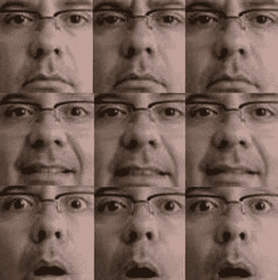

[图 7-12](#_Fig12) 。情感图片被裁剪

下一步是将这些裁剪后的图像传输到英特尔 Galileo。如果您使用的是 Linux、MacOSX 或 Windows Cygwin，并且在网络上安装了具有有效 IP 地址的英特尔 Galileo，那么一个快速的方法就是使用`scp`。在包含您的映像的目录中，在命令行中运行以下命令:

```sh
mcramon@ubuntu:~/tmp/opencv/emotion/mypics$ for i in $(ls *20*);do scp $i root@192.254.1.1:/home/root/. ;done
```

所有图像都被传送到`/home/root`目录。

在目录中组织图像

将图像传输到英特尔 Galileo 后，通过为每种情绪创建一个目录来组织图像，并将图片传输到相应的目录。例如，使用`mkdir`命令创建`serious` *、* `smile`和`surprised`目录。用`mv`命令将每张图片移动到相应的目录中。结果是这样的:


创建 CSV 文件

创建数据库的最后一步是创建 CSV(逗号分隔值)文件。这是一个简单的文本文件，描述了每个图像的确切位置，并根据目录按情感对每个图像进行分类。

清单 7-6 中的[显示了一个 CV 文件的例子。](#list6)

[***清单 7-6***](#_list6) 。my_csv.csv

```sh
/home/root/emotion/pics/smile/smile01_20_20_70_70.jpg;0
/home/root/emotion/pics/smile/smile02_20_20_70_70.jpg;0
/home/root/emotion/pics/smile/smile03_20_20_70_70.jpg;0
/home/root/emotion/pics/surprised/surprised01_20_20_70_70.jpg;1
/home/root/emotion/pics/surprised/surprised02_20_20_70_70.jpg;1
/home/root/emotion/pics/surprised/surprised03_20_20_70_70.jpg;1
/home/root/emotion/pics/serious/serious01_20_20_70_70.jpg;2
/home/root/emotion/pics/serious/serious02_20_20_70_70.jpg;2
/home/root/emotion/pics/serious/serious03_20_20_70_70.jpg;2
```

请注意，每张图片都由`;`定界，并带有一个表示图片情绪状态的索引。在[清单 7-6](#list6) 中，`0`代表微笑，`1`代表惊讶，`2`代表严肃。

帮助创建 CSV 文件的脚本如清单 7-7 所示。

[***清单 7-7***](#_list7) 。create_csv.py

```sh
#!/usr/bin/env python
# Software License Agreement (BSD License)
#
# Copyright (c) 2012, Philipp Wagner
# All rights reserved.
#
# Redistribution and use in source and binary forms, with or without
# modification, are permitted provided that the following conditions
# are met:
#
#  * Redistributions of source code must retain the above copyright
#    notice, this list of conditions and the following disclaimer.
#  * Redistributions in binary form must reproduce the above
#    copyright notice, this list of conditions and the following
#    disclaimer in the documentation and/or other materials provided
#    with the distribution.
#  * Neither the name of the author nor the names of its
#    contributors may be used to endorse or promote products derived
#    from this software without specific prior written permission.
#
# THIS SOFTWARE IS PROVIDED BY THE COPYRIGHT HOLDERS AND CONTRIBUTORS
# "AS IS" AND ANY EXPRESS OR IMPLIED WARRANTIES, INCLUDING, BUT NOT
# LIMITED TO, THE IMPLIED WARRANTIES OF MERCHANTABILITY AND FITNESS
# FOR A PARTICULAR PURPOSE ARE DISCLAIMED. IN NO EVENT SHALL THE
# COPYRIGHT OWNER OR CONTRIBUTORS BE LIABLE FOR ANY DIRECT, INDIRECT,
# INCIDENTAL, SPECIAL, EXEMPLARY, OR CONSEQUENTIAL DAMAGES (INCLUDING,
# BUT NOT LIMITED TO, PROCUREMENT OF SUBSTITUTE GOODS OR SERVICES;
# LOSS OF USE, DATA, OR PROFITS; OR BUSINESS INTERRUPTION) HOWEVER
# CAUSED AND ON ANY THEORY OF LIABILITY, WHETHER IN CONTRACT, STRICT
# LIABILITY, OR TORT (INCLUDING NEGLIGENCE OR OTHERWISE) ARISING IN
# ANY WAY OUT OF THE USE OF THIS SOFTWARE, EVEN IF ADVISED OF THE
# POSSIBILITY OF SUCH DAMAGE.

import sys
import os.path

# This is a tiny script to help you creating a CSV file from a face
# database with a similar hierarchie:
#
#  philipp@mango:~/facerec/data/at$ tree
#  .
#  |-- README
#  |-- s1
#  |   |-- 1.pgm
#  |   |-- ...
#  |   |-- 10.pgm
#  |-- s2
#  |   |-- 1.pgm
#  |   |-- ...
#  |   |-- 10.pgm
#  ...
#  |-- s40
#  |   |-- 1.pgm
#  |   |-- ...
#  |   |-- 10.pgm
#

if __name__ == "__main__":

    if len(sys.argv) != 2:
        print "usage: create_csv <base_path>"
        sys.exit(1)

    BASE_PATH=sys.argv[1]
    SEPARATOR=";"

    label = 0
    for dirname, dirnames, filenames in os.walk(BASE_PATH):
        for subdirname in dirnames:
            subject_path = os.path.join(dirname, subdirname)
            for filename in os.listdir(subject_path):
                abs_path = "%s/%s" % (subject_path, filename)
                print "%s%s%d" % (abs_path, SEPARATOR, label)
            label = label + 1
```

将此文件传输到英特尔 Galileo，并运行以下命令行:

```sh
python create_csv.py *<the ABSOLUTE directory path> > <your file name>*
```

例如:

```sh
root@clanton:~/emotion# python create_csv.py $(pwd)/pics/ > my_csv.csv
```

并检查文件:

```sh
root@clanton:~/emotion# cat my_csv.csv
/home/root/emotion/pics/smile/smile01_20_20_70_70.jpg;0
/home/root/emotion/pics/smile/smile02_20_20_70_70.jpg;0
/home/root/emotion/pics/smile/smile03_20_20_70_70.jpg;0
/home/root/emotion/pics/surprised/surprised01_20_20_70_70.jpg;1
/home/root/emotion/pics/surprised/surprised02_20_20_70_70.jpg;1
/home/root/emotion/pics/surprised/surprised03_20_20_70_70.jpg;1
/home/root/emotion/pics/serious/serious01_20_20_70_70.jpg;2
/home/root/emotion/pics/serious/serious02_20_20_70_70.jpg;2
/home/root/emotion/pics/serious/serious03_20_20_70_70.jpg;2
```

情感分类代码

情感分类的代码使用了一个名为`FaceRecognizer` 的类，它负责读取你的模型。换句话说，它读取数据库中的图片和每个状态指数，并使用一个名为`fisherface` 的模型，输入(或训练)模型，以便能够预测情绪。

本节中的代码基于清单 7-7 中的代码。[清单 7-8](#list8) 用粗体显示了新部分的代码。

[***清单 7-8***](#_list8) 。opencv _ emotion _ classification . CPP

```sh
/*
 * Copyright (c) 2011\. Philipp Wagner <bytefish[at]gmx[dot]de>.
 * Released to public domain under terms of the BSD Simplified license.
 *
 * Redistribution and use in source and binary forms, with or without
 * modification, are permitted provided that the following conditions are met:
 *   * Redistributions of source code must retain the above copyright
 *     notice, this list of conditions and the following disclaimer.
 *   * Redistributions in binary form must reproduce the above copyright
 *     notice, this list of conditions and the following disclaimer in the
 *     documentation and/or other materials provided with the distribution.
 *   * Neither the name of the organization nor the names of its contributors
 *     may be used to endorse or promote products derived from this software
 *     without specific prior written permission.
 *
 *   See <http://www.opensource.org/licenses/bsd-license>
 *
 *  Manoel Ramon - 06/15/2014
 *  manoel.ramon@gmail.com
 *                 code changed from original facerec_fisherface.cpp
 *                 added:
 *                 - adaption to emotions detection instead gender
 *                 - picture took from the default video device
 *                 - added face and eyes recognition
 *                 - crop images based in human anatomy
 *                 - prediction based in face recognized
 *
 */

#include <opencv2/opencv.hpp>
#include <stdio.h>
#include "opencv2/imgproc/imgproc.hpp"
#include "opencv2/core/core.hpp"
#include "opencv2/contrib/contrib.hpp"
#include "opencv2/highgui/highgui.hpp"

#include <iostream>
#include <fstream>
#include <sstream>

using namespace cv;
using namespace std;

String face_cascade_name = "haarcascade_frontalface_alt.xml";
String eye_cascade_name = "haarcascade_eye.xml";

Mat faceDetect(Mat img);
CascadeClassifier face_cascade;
CascadeClassifier eyes_cascade;

using namespace cv;
using namespace std;

enum EmotionState_t {
  SMILE     =0,   // 0
  SURPRISED,      // 1
  SERIOUS,        // 2
};

static void read_csv(const string& **filename, vector<Mat>&** `**images, vector<int>&** `**labels, char separator = ';') {**
    `std::ifstream file(filename.c_str(), ifstream::in);`
    `if (!file) {`
        `string error_message = "No valid input file was given, please check the given filename.";`
        `CV_Error(CV_StsBadArg, error_message);`
    `}`
    `string line, path, classlabel;`
    `while (getline(file, line)) {`
        `stringstream liness(line);`
        `getline(liness, path, separator);`
        `getline(liness, classlabel);`
        `if(!path.empty() && !classlabel.empty()) {`
            `images.push_back(imread(path, 0));`
            `labels.push_back(atoi(classlabel.c_str()));`
        `}`
    `}`
`}`

**int main(int argc, const char *argv[])**
`{`

  `EmotionState_t emotion;`

  `// Check for valid command line arguments, print usage`
  `// if no arguments were given.`
  **if (argc < 2) {**
    **cout << "usage: " << argv[0] << " <csv.ext> <output_folder> " << endl;**
    **exit(1);**
  **}**

  `if( !face_cascade.load( face_cascade_name ) ){ printf("--(!)Error loading\n"); return -1; };`
  `if( !eyes_cascade.load( eye_cascade_name ) ){ printf("--(!)Error loading\n"); return -1; };`

  `// 0 is the ID of the built-in laptop camera, change if you want to use other camera`
  `VideoCapture cap(-1);`

  `//check if the file was opened properly`
  `if(!cap.isOpened())`
  `{`
      `cout << "Capture could not be opened succesfully" << endl;`
      `return -1;`
  `}`
  `else`
  `{`
      `cout << "camera is ok.. Stay 2 ft away from your camera\n" << endl;`
  `}`

  `int w = 432;`
  `int h = 240;`
  `cap.set(CV_CAP_PROP_FRAME_WIDTH, w);`
  `cap.set(CV_CAP_PROP_FRAME_HEIGHT, h);`

  `Mat frame;`
  `cap >>frame;`

  `cout << "processing the image...." << endl;`

  **Mat testSample = faceDetect(frame);**

  `// Get the path to your CSV.`
  **string fn_csv = string(argv[1]);**
  `// These vectors hold the images and corresponding labels.`
  `vector<Mat> images;`
  `vector<int> labels;`
  `// Read in the data. This can fail if no valid`
  `// input filename is given.`
  **try**
  **{**
    **read_csv(fn_csv, images, labels);**
  **} catch (cv::Exception&** `**e) {**
    **cerr << "Error opening file \"" << fn_csv << "\". Reason: " << e.msg << endl;**
    **// nothing more we can do**
    **exit(1);**
  **}**
  `// Quit if there are not enough images for this demo.`
  **if(images.size() <= 1)**
  `{`
    `string error_message = "This demo needs at least 2 images to work. Please add more images to your data set!";`
    `CV_Error(CV_StsError, error_message);`
  `}`
  `// Get the height from the first image. We'll need` `this`
  `// later in code to reshape the images to their original`
  `// size:`
  `int height = images[0].rows;`

  `// The following lines create an Fisherfaces model for`
  `// face recognition and train it with the images and`
  `// labels read from the given CSV file.`
  `// If you just want to keep 10 Fisherfaces, then call`
  `// the factory method like this:`
  `//`
  `//      cv::createFisherFaceRecognizer(10);`
  `//`
  `// However it is not useful to discard Fisherfaces! Please`
  `// always try to use _all_ available Fisherfaces for`
  `// classification.`
  `//`
  `// If you want to create a FaceRecognizer with a`
  `// confidence threshold (e.g. 123.0) and use _all_`
  `// Fisherfaces, then call it with:`
  `//`
  `//      cv::createFisherFaceRecognizer(0, 123.0);`
  `//`
  **Ptr<FaceRecognizer> model = createFisherFaceRecognizer();**
  **model->train(images, labels);**

  **// The following line predicts the label of a given**
  **// test image:**
  **int predictedLabel = model->predict(testSample);**

  `// To get the confidence of a prediction call the model with:`
  `//`
  `//      int predictedLabel = -1;`
  `//      double confidence = 0.0;`
  `//      model->predict(testSample, predictedLabel, confidence);`
  `//`
  **string result_message = format("Predicted class = %d", predictedLabel);**
  **cout << result_message << endl;**

  **// giving the result**
  **switch (predictedLabel)**
  **{**
    **case SMILE:**
      **cout << "You are happy!" << endl;**
      **break;**
    **case SURPRISED:**
      **cout << "You are surprised!" << endl;**
      **break;**
    **case SERIOUS:**
      **cout << "You are serious!" << endl;**
      **break;**
  **}**

  `return 0;`

  `cap.release();`

  `return 0;`
`}`

**Mat faceDetect(Mat img)**
`{`
  `std::vector<Rect> faces;`
  `std::vector<Rect> eyes;`
  `bool two_eyes = false;`
  `bool any_eye_detected = false;`

  `//detecting faces`
  `face_cascade.detectMultiScale( img, faces, 1.1, 2, 0|CV_HAAR_SCALE_IMAGE, Size(30, 30) );`

  `if (faces.size() == 0)`
  `{`
       `cout << "Try again.. I did not dectected any faces..." << endl;`
       `exit(-1);  // abort everything`
  `}`

  **Point p1 = Point(0,0);**
  `for( size_t i = 0; i < faces.size(); i++ )`
  `{`

    `// we cannot draw in the image !!! otherwise will mess with the prediction`
    `// rectangle( img, faces[i], Scalar( 255, 100, 0 ), 4, 8, 0 );`

     `Mat frame_gray;`
     `cvtColor( img, frame_gray, CV_BGR2GRAY );`

     `// croping only the face in region defined by faces[i]`
     `std::vector<Rect> eyes;`
     `Mat faceROI = frame_gray( faces[i] );`

     `//In each face, detect eyes`
     `eyes_cascade.detectMultiScale( faceROI, eyes, 1.1, 3, 0 |CV_HAAR_SCALE_IMAGE, Size(30, 30) );`

      `for( size_t j = 0; j < eyes.size(); j++ )`
      `{`
         **Point center( faces[i].x + eyes[j].x + eyes[j].width*0.5, faces[i].y + eyes[j].y + eyes[j].height*0.5 );**
         `// we cannot draw in the image !!! otherwise will mess with the prediction`
         `// int radius = cvRound( (eyes[j].width + eyes[j].height)*0.25 );`
         `// circle( img, center, radius, Scalar( 255, 0, 0 ), 4, 8, 0 );`

         **if (j==0)**
           **{**
              **p1 = center;**
              **any_eye_detected = true;**
           **}**
         **else**
         **{**
              **two_eyes = true;**
         **}**
      `}`

    `}`

  `cout << "SOME DEBUG" << endl;`
  `cout << "-------------------------" << endl;`
  `cout << "faces detected:" << faces.size() << endl;`
  `cout << "x: " << faces[0].x << endl;`
  `cout << "y: " << faces[0].y << endl;`
  `cout << "w: " << faces[0].width << endl;`
  `cout << "h: " << faces[0].height << endl << endl;`

  **Mat imageInRectangle;**
  **imageInRectangle =  img(faces[0]);**
  **Size recFaceSize = imageInRectangle.size();**

  **cout << recFaceSize << endl;**

  **// for debug**
  **imwrite("imageInRectangle.jpg", imageInRectangle);**

  **int rec_w = 0;**
  **int rec_h = faces[0].height * 0.64;**

  **// checking the (x,y) for cropped rectangle**
  **// based in human anatomy**
  **int px = 0;**
  **int py = 2 * 0.125 * faces[0].height;**

  **Mat cropImage;**

  **cout << "faces[0].x:" << faces[0].x << endl;**
  **p1.x = p1.x - faces[0].x;**
  **cout << "p1.x:" << p1.x << endl;**
  **if (any_eye_detected)**
  **{**
      **if (two_eyes)**
      **{**
          **cout << "two eyes detected" << endl;**
          **// we have detected two eyes**
          **// we have p1 and p2**
          **// left eye**
          **px = p1.x /  1.35;**

      **}**
      **else**
      **{**
          **// only one eye was found.. need to check if the**
          **// left or right eye**
          **// we have only p1**
          **if (p1.x > recFaceSize.width/2)**
          **{**
              **// right eye**
            **cout << "only right eye detected" << endl;**
            **px = p1.x / 1.75;**

          **}**
          **else**
          **{**
              **// left eye**
            **cout << "only left eye detected" << endl;**
            **px = p1.x /  1.35;**
          **}**
      **}**

  **}**
  **else**
  **{**

      **// no eyes detected but we have a face**
      **px = 25;**
      **py = 25;**
      **rec_w = recFaceSize.width-50;**
      **rec_h = recFaceSize.height-30;**

  **}**

  **rec_w = (faces[0].width - px) * 0.75;**
  **cout << "px   :" << px << endl;**
  **cout << "py   :" << py << endl;**
  **cout << "rec_w:" << rec_w << endl;**
  **cout << "rec_h:" << rec_h << endl;**

  **cropImage = imageInRectangle(Rect(px, py, rec_w, rec_h));**

  **Size dstImgSize(70,70); // same image size of db**
  **Mat finalSizeImg;**
  **resize(cropImage, finalSizeImg, dstImgSize);**

  **// for debug**
  **imwrite("onlyface.jpg", finalSizeImg);**

  **cvtColor( finalSizeImg, finalSizeImg, CV_BGR2GRAY );**

  **return finalSizeImg;**

`}````
```sh

 ``查看 opencv _ emotion _ classification . CPP

在代码的开头，创建了一个枚举器来定义情绪状态。注意这个`enum`上每个元素的值与 CSV 文件中的情感索引相匹配。

```
enum EmotionState_t {
  SMILE     =0,   // 0
  SURPRISED,      // 1
  SERIOUS,        // 2
};
```sh

在`main()`函数中，创建了一个类型为`EmotionState_t`的变量，它应该接收 CSV 文件的名称作为参数。

```
int main(int argc, const char *argv[])
{

  EmotionState_t emotion;

  // Check for valid command line arguments, print usage
  // if no arguments were given.
  if (argc < 2) {
    cout << "usage: " << argv[0] << " <csv.ext> <output_folder> " << endl;
    exit(1);
  }
```sh

当网络摄像头打开时，像以前一样收集图片。与之前显示的`faceDetect()`方法相比，`faceDetect()`方法发生了变化:

```
Mat testSample = faceDetect(frame);
```sh

存储在`testSample`中的这个新对象包含被裁剪的脸。该裁剪图像与数据库中的图像大小相同。返回的图像为灰度图像，并被裁剪成如图 7-12 中[所示的图像。](#Fig12)

该帧包含一个 432x240 的图像，`testSample`图像为 70x70。现在，让我们继续使用`main()`函数。`faceDetect()`将在后面更详细地讨论。

随着图像准备好被分析，新的成分被用于预测情绪状态:

```
Ptr<FaceRecognizer> model = createFisherFaceRecognizer();
model->train(images, labels);

// The following line predicts the label of a given
// test image:
int predictedLabel = model->predict(testSample);
```sh

类 FaceRecognizer:公共算法

一眼看去，`FaceRecognizer`看起来很简单，但实际上它非常强大和复杂。这个类允许你设置不同的算法，包括你自己的算法，来执行不同种类的图像识别。

代码中使用的模型是`fisherface`，它是由以下代码行创建的:

```
Ptr<FaceRecognizer> model = createFisherFaceRecognizer();
```sh

void face recognizer::train(InputArrayOfArrays src，InputArray labels)

此方法基于您的数据库来训练模型。代码传递图像和索引(或`labels`):

```
model->train(images, labels);
```sh

int face recognizer::predict(input array src)const = 0

该方法基于作为输入数组`src`的图像预测分类索引`label`。

例如，如果情感“`happy`”在 CSV 文件中被标记为`0`，并且`FaceRecognizer`被训练，如果图像`src`是你微笑的照片，预测将返回`0`。

这由下面的代码片段表示:

```
int predictedLabel = model->predict(testSample);

...
...
...

  // giving the result
  switch (predictedLabel)
  {
    case SMILE:
      cout << "You are happy!" << endl;
      break;
    case SURPRISED:
      cout << "You are surprised!" << endl;
      break;
    case SERIOUS:
      cout << "You are serious!" << endl;
      break;
  }
```sh

如果`faceDetect()`返回的图像裁剪得当，你的表情与数据库中的表情相似，算法会准确预测。

如[图 7-10](#Fig10) 中的流程图所示，`faceDetect()`方法基本上完成了之前所做的工作。换句话说，它检测面部和眼睛。

在这个例子检测到面部和眼睛之后，引入了一个包含一些关于人体解剖学的简单概念的算法，该算法将图像裁剪到面部区域。

它试图动态裁剪网络摄像头捕捉到的图像，并做与清单 7-7 中的脚本手动完成的相同的事情，但是只在检测到人脸的区域裁剪图像。

为了理解逻辑如何工作，参见图 7-13 。

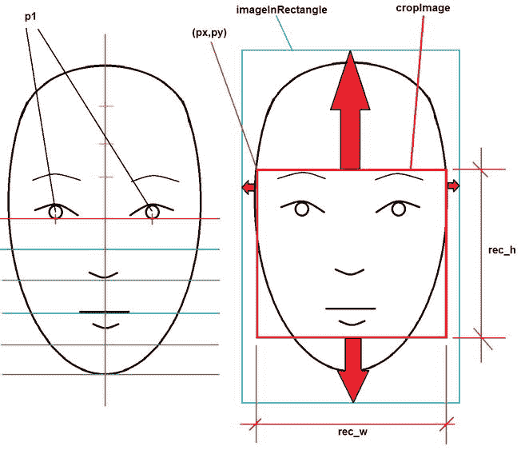

[图 7-13](#_Fig13) 。人体解剖学和用于修剪面部的变量

看一下[图 7-13](#Fig13) 并遵循这个逻辑。当人脸被识别时，整个人脸通常被捕获，包括耳朵、头或帽子、脖子的一部分以及背景图像的一部分(`imageRectangle`)。然而，情感分类器对这些元素不感兴趣，必须将其移除(红色箭头区域)，并且只裁剪包含眼睛、鼻子和嘴的部分(`cropImage`)。

裁剪后的图像具有初始的`px`和`py`坐标，扩展名为`rec_w`和`rec_h`，这形成了一个具有完美尺寸的三角形，用于裁剪该区域。这样的矩形对应于 ROI(感兴趣区域)区域。

为了到达 ROI 区域，检测眼睛，然后使用图像中的`px`、`px`、`rec_w`和`rec_h`值找到人体比例，并裁剪图像。

当检测到眼睛时，可以定义对应于眼睛中心的点对象`p1`。点对象`p1`有两个成员`x`和`y`，以像素表示到原始图像的距离。然而，有几个问题。有时只检测到一只眼睛，算法必须确定它是右眼还是左眼。其他时候，检测不到眼睛。

```
  //detecting faces
  face_cascade.detectMultiScale( img, faces, 1.1, 2, 0|CV_HAAR_SCALE_IMAGE, Size(30, 30) );
  Point p1 = Point(0,0);
  for( size_t i = 0; i < faces.size(); i++ )
  {

...
...
...

     //In each face, detect eyes
     eyes_cascade.detectMultiScale( faceROI, eyes, 1.1, 3, 0 |CV_HAAR_SCALE_IMAGE, Size(30, 30) );

      for( size_t j = 0; j < eyes.size(); j++ )
      {
         Point center( faces[i].x + eyes[j].x + eyes[j].width*0.5, faces[i].y + eyes[j].y + eyes[j].height*0.5 );

...
...
...

         if (j==0)
           {
              p1 = center;
              any_eye_detected = true;
           }
         else
         {
              two_eyes = true;
         }
      }

    }
```sh

此时，您可能有一只眼睛的中心，并且知道是否检测到一只、两只或没有眼睛。现在需要找到`px`和`py`坐标，以及 ROI 尺寸、`rec_w`和`rec_h`。

在人体解剖学中，眼睛位于将人脸一分为二的水平红线的顶端。如果你把中间的水平线平均分成四部分，眼睛被最大水平比例的一半和侧边的四分之一彼此分开。

鼻子和嘴集中在脸的中间，下面的比例分成五个相等的部分。眉毛在眼睛线条上方 12.5%，因为它是面部上部的 50%/4。

如果没有检测到眼睛，则不可能使用简单的算法进行裁剪。考虑到这些比例，我们设计了以下系列:

```
  int rec_w = 0;
  int rec_h = faces[0].height * 0.64;

  // checking the (x,y) for cropped rectangle
  // based in human anatomy
  int px = 0;
  int py = 2 * 0.125 * faces[0].height;

  Mat cropImage;

  cout << "faces[0].x:" << faces[0].x << endl;
  p1.x = p1.x - faces[0].x;
  cout << "p1.x:" << p1.x << endl;
  if (any_eye_detected)
  {
      if (two_eyes)
      {
          cout << "two eyes detected" << endl;
          // we have detected two eyes
          // we have p1 and p2
          // left eye
          px = p1.x /  1.35;

      }
      else
      {
          // only one eye was found.. need to check if the
          // left or right eye
          // we have only p1
          if (p1.x > recFaceSize.width/2)
          {
              // right eye
            cout << "only right eye detected" << endl;
            px = p1.x / 1.75;

          }
          else
          {
              // left eye
            cout << "only left eye detected" << endl;
            px = p1.x /  1.35;
          }
      }

  }
  else
  {

      // no eyes detected but we have a face
      px = 25;
      py = 25;
      rec_w = recFaceSize.width-50;
      rec_h = recFaceSize.height-30;

  }

  rec_w = (faces[0].width - px) * 0.75;
  cout << "px   :" << px << endl;
  cout << "py   :" << py << endl;
  cout << "rec_w:" << rec_w << endl;
  cout << "rec_h:" << rec_h << endl;

  cropImage = imageInRectangle(Rect(px, py, rec_w, rec_h));
```sh

出于调试目的，`faceDetect()`方法在软件每次运行时在文件系统中保存两个映像。一个名为`onlyface.jpg`，它包含裁剪后的图像。另一个叫做`imageInRectangle.jpg`，它包含检测到的图像。

```
Mat imageInRectangle;
imageInRectangle =  img(faces[0]);
...
...
...
  // for debug
  imwrite("imageInRectangle.jpg", imageInRectangle);
  cropImage = imageInRectangle(Rect(px, py, rec_w, rec_h));
...
...
...
  Size dstImgSize(70,70); // same image size of db
  Mat finalSizeImg;
  resize(cropImage, finalSizeImg, dstImgSize);
```sh

运行 opencv _ emotion _ classification . CPP

编译代码并将文件传输到英特尔 Galileo。确保`uvcvideo`驱动程序已加载，网络摄像头已连接到 USB 端口(请阅读本章中的“连接网络摄像头”一节)，并将程序传输到 CSV 文件的相同位置。站在摄像机前，最好是两英尺远，做出一些情绪化的表情，然后运行以下命令:

```
root@clanton:~/emotion# ./opencv_emotion_classification my_csv.csv 2> /dev/null
camera is ok.. Stay 2 ft away from your camera

processing the image....
SOME DEBUG
-------------------------
faces detected:1
x: 172
y: 25
w: 132
h: 132

[132 x 132]
faces[0].x:172
p1.x:-172
px   :25
py   :25
rec_w:80
rec_h:102
Predicted class = 0
You are happy!
```sh

该软件将图像分类为快乐。从文件系统中提取调试图像`onlyface.jpg`和`imageInRectangle.jpg`，可以在裁剪后的图像中观察到我的表情，如图[图 7-14](#Fig14) 所示。


[图 7-14](#_Fig14) 。笑脸被检测到，图像被自动裁剪

注意图 7-14 中被裁剪掉的区域，包括背景、头发和耳朵。

```
root@clanton:~/emotion# ./opencv_emotion_classification my_csv.csv 2> /dev/null
camera is ok.. Stay 2 ft away from your camera

processing the image....
SOME DEBUG
-------------------------
faces detected:1
x: 178
y: 3
w: 143
h: 143

[143 x 143]
faces[0].x:178
p1.x:43
two eyes detected
px   :31
py   :35
rec_w:84
rec_h:91
Predicted class = 1
You are surprised!
```sh

该软件将此图像归类为惊讶。从文件系统中提取调试镜像`onlyface.jpg`和`imageInRectangle.jpg`，观察我的表情并裁剪镜像，如图[图 7-15](#Fig15) 所示。

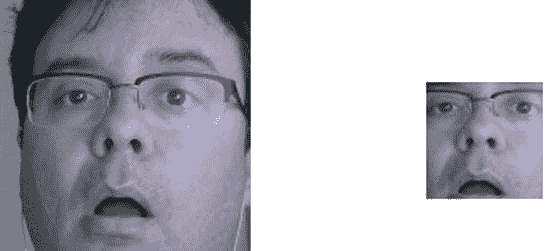

[图 7-15](#_Fig15) 。惊讶的脸被检测到，图像被自动裁剪

不断变换表情，检查捕捉图像的效率。

改进项目的想法

至此，您应该看到了 OpenCV 和英特尔 Galileo 的潜力。然而，所有项目都有改进的余地。让我们讨论一些你可以改进这个项目的方法。

用机器人头整合你的情感

第 13 章展示了一个表达情感的机器人头部。这里的想法是整合本章的情感分类，让机器人去模仿情感。因此，如果你微笑，机器人也会微笑；你难过，机器人也会难过，等等。

扩展分类

`fisherface`模型用于对情绪进行分类，但是同样的技术也可以用于对性别进行分类或者识别你的家人和朋友。

你需要为性别和你认识的人的面孔建立数据库。

性别分类的示例可在此链接`http://docs.opencv.org/trunk/modules/contrib/doc/facerec/tutorial/facerec_gender_classification.html`找到。

使用大型数据库改进情感分类

互联网上有几个数据库，包含数以千计的显示情绪的图像(有些有超过 4000 张脸)。要了解这些不同的数据库并下载图像，请访问`http://face-rec.org/databases/`。

改进多张人脸的情感分类

在[列表 7-8](#list8) 的例子中，我使用我自己的照片创建了一个数据库，软件准备使用在代码中检测到的第一张脸只对我进行分类，换句话说，对象脸[0]。在数据库中添加更多的人，并改进代码来分类所有检测到的脸，而不是只有一个。

摘要

本章解释了探索 OpenCV 所需的许多原则:创建基于 eGlibc 的 SD 版本，抑制 OpenCV 开发包中的 GPU 支持，生成支持 V4L 和 OpenCV 的正确工具链，研究 UVC 设备，以及使用 Video4Linux 探索网络摄像头功能。这些原则作为对 OpenCV 的研究。

您学习了如何在 OpenCV 中捕获和处理图像，包括复杂的任务，如使用 Canny 算法的边缘检测、基于 Haar 技术的面部和眼睛检测以及基于`fisherface`模型的情感分类。

就 OpenCV 及其可能性而言，这仅仅是个开始。如果你想探索更多的特性，网上有几篇文章和专门的书籍。````````