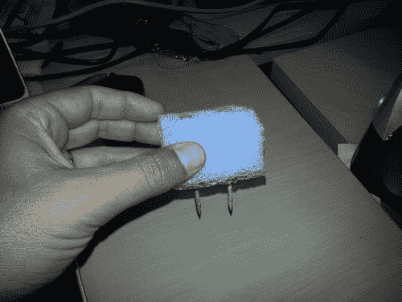
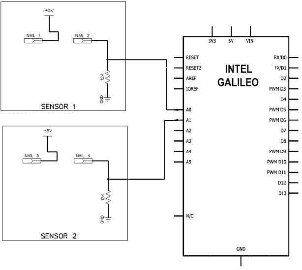
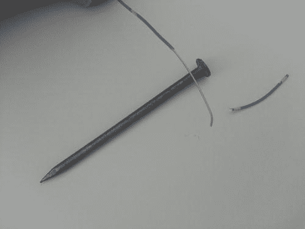
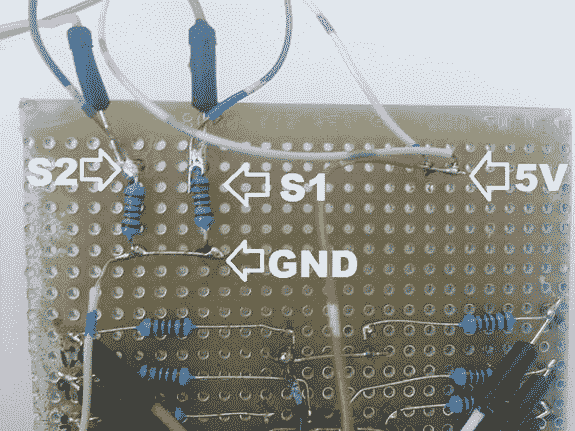
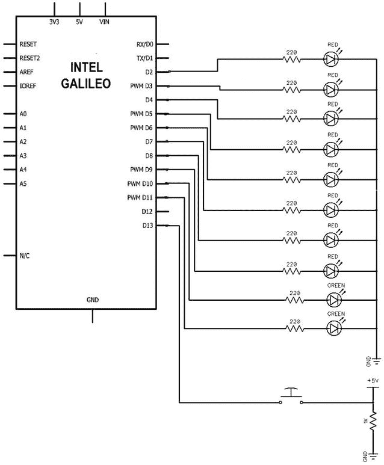
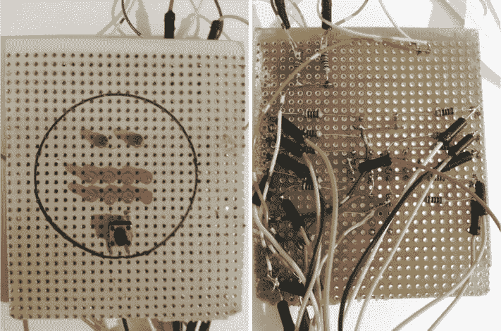
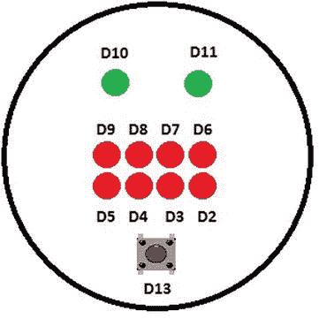
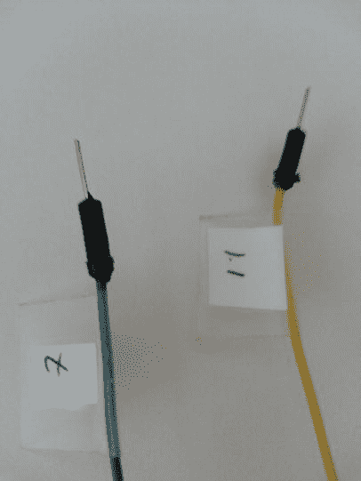
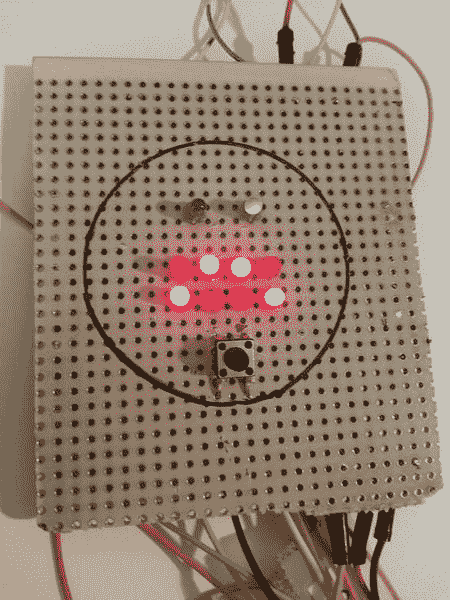
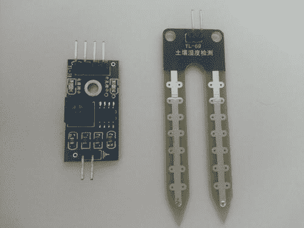

# 八、创建土壤湿度传感器

本章中的项目解释了如何使用英特尔 Galileo 的模拟和数字端口来创建一个非常低成本的系统，用于测量家庭应用中的土壤湿度。该项目于 2013 年 10 月在意大利罗马的一次创客大会上展示，目的是创建一个仅花费 4.00 美元的项目，不包括英特尔 Galileo 主板的成本。

项目详细信息

要测量土壤中的水分，你只需测量土壤中的水量。市场上有不同种类的传感器，包括中子水分计传感器、频域传感器、电容传感器和简单电极。这些都用于家庭应用，每种类型使用不同的技术。

电极是最实惠的解决方案之一，对于简单的应用，如监控家中的植物，它们是很好的解决方案。

挑战在于创造一个非常便宜的系统，这样你就可以使用那些你通常扔进垃圾桶或者放在车库里的材料。

您可以使用镀锌钉制作自己的电极传感器，例如用于固定联锁混凝土瓷砖的屋顶钉。

考虑到电极将持续接触湿气，强烈建议使用镀锌钉以避免生锈。生锈会导致糟糕的模拟读数，迫使你经常调整系统。

每个传感器由两个电极组成，在这种情况下，两个钉子相隔大约两英寸。第一个电极接收电压，另一个电极连接到模拟端口。

土壤具有导电特性，其导电特性受湿度的影响。如果土壤中有大量的水，电流传播是好的；土壤干燥意味着繁殖不好。当然，其他因素也会影响土壤电导率，包括土壤中的盐分和养分含量。

这个项目非常简单，它的目的仅仅是表明土壤是否有足够的水分来种植室内植物。它不能测量土壤类型、水类型或矿物质浓度的任何细节。该项目可适用于*任何*种土壤或水。

出于实用的目的，这个项目将遵循在意大利的 Maker Faire 表演的相同演示。该项目包括两个传感器，所以你将能够监测两个工厂。你将通过一组发光二极管获得关于传感器读数的视觉反馈，这些发光二极管形成了一个有眼睛和嘴巴的花脸。根据土壤中水分的含量，嘴巴被用来代表快乐和悲伤等情绪。换句话说，一张“笑脸”会告诉你你的植物是否有足够的水分；土干了，脸就难过了。眼睛指示当前选择了哪个传感器。一只眼睛与 1 号传感器相关，另一只眼睛与 2 号传感器相关。您可以通过按下按钮在传感器之间切换。

您可以随意更改此项目；首先，您可以增加传感器的数量，并使用英特尔 Galileo 上所有六个可能的模拟端口(A0 至 A5 ),而不是只有两个传感器。

在这一章的最后，名为“改善项目的想法”的部分解释了如何增加传感器的数量，如何使用螺线管和泵进行自动灌溉，以及其他想法。

材料清单

为了建立这个项目，你需要在[表 8-1](#Tab1) 中列出的组件。

[表 8-1](#_Tab1) 。强制性组件

<colgroup><col width="20%"> <col width="80%"></colgroup> 
| 

量

 | 

成分

 |
| --- | --- |
| Two | 绿色 5 毫米 LED |
| eight | 红色 5 毫米 LED |
| one | 按钮 |
| TenTwofouroneTwo3 英尺one | 220 欧姆 1/4 瓦12 千欧 1/4 瓦镀锌钉子通用板3x3 英寸的泡沫块电线(至少 1/4 w)剪刀 |

[表 8-2](#Tab2) 中的列表不是强制性的；在花脸的发展过程中，这些材料用于美学目的，这将在本章中详细讨论。

[表 8-2](#_Tab2) 。可选材料

<colgroup><col width="20%"> <col width="80%"></colgroup> 
| 

量

 | 

成分

 |
| --- | --- |
| one | 白色底漆喷雾 |
| one | 各色彩色纸或免费油漆纸样品 |
| one | 3/4 透明胶带 |
| one | 黑色中性笔 |

组装湿度传感器

要组装传感器，必须遵循机械和电气程序。下面几节将对它们进行解释。

机械装配

每个传感器需要两个镀锌钉子和一块非导电泡沫，以保持钉子分离。

至于泡沫，你可以用那种用来保护装在盒子里的电子设备的泡沫。你家里、回收站或办公室里可能会有一些。你也可以使用泡沫聚苯乙烯。

一旦你有了钉子和泡沫，只需将钉子间隔 1.5 到 2 英寸插入。

图 8-1 展示了一个最终构建的例子。



[图 8-1](#_Fig1) 。使用钉子和泡沫的土壤湿度传感器

一旦钉子插入泡沫，确保它们可以穿透土壤至少 1.5 英寸。你不会埋葬泡沫；你只需用它来保持钉子分开并连接到土壤上。

如果底部没有足够的指甲面积，剪去泡沫或者使用更大的指甲。

电气组件

下一步是了解钉子是如何电连接的。因此，移除泡沫上的钉子，查看[图 8-2](#Fig2) 中的图像。



[图 8-2](#_Fig2) 。传感器电气连接

从[图 8-2](#Fig2) 中可以看到，组装一个传感器需要两个钉子。其中一个钉子直接连接到 5V 端口，另一个必须通过 12K 欧姆电阻连接到模拟端口。在[图 8-2](#Fig2) 中，传感器 1 接 A0，传感器 2 接 A1。

如[图 8-3](#Fig3) 和[图 8-4](#Fig4) 所示，可以使用缠绕在钉子头部的金属丝连接钉子，也可以焊接钉子。



[图 8-3](#_Fig3) 。正在准备的电线


[图 8-4](#_Fig4) 。把铁丝绕在钉子头上

将电线缠绕在每个钉子上，并将传感器再次放入泡沫中。

电阻器作为 5V 的分压器工作。为了组装 5V 和电阻器，使用图 8-2 中的[所示的通用板进行连接。这个板子将被用来组装花脸，这将在本章后面解释。](#Fig2)

[图 8-5](#Fig5) 显示了焊接到电路板正面(无铜层表面)的传感器组件，包含一个接地(GND)、传感器电缆(S1 和 S2)和连接到传感器的公共 5V 电压。



[图 8-5](#_Fig5) 。传感器电路

使用通用电路板并将元件焊接到背面通常不是一个好方法，但在这种情况下，它被用来模仿意大利创建的演示。在本章后面的“组装花脸”部分，你会更好地理解。您可以将传感器电路安装在不同的电路板上，或者为每个传感器创建一个特定的 PCB，或者使用您认为适合您的情况的任何其他解决方案。例如，您可以使用试验板而不是通用板来避免焊接过程。

组装花面

花脸将代表基于植物被浇灌的程度的情感。为了更好的用户界面，眼睛中的发光二极管与口腔中使用的发光二极管是不同的颜色。

[图 8-6](#Fig6) 显示了花脸的原理图，其中“D”表示数字,“A”表示模拟。



[图 8-6](#_Fig6) 。花脸连接

D10 和 D11 端口用于控制绿色 led，告知选择哪个传感器。D2 到 D10 的其他端口是红色 led，它们代表嘴。它们应该水平对齐，包含四个 led。按钮 B1 用于选择传感器。

当这个项目在意大利的 Maker Faire 上演示时，它使用了一个通用板，电阻器隐藏在后面，如图 8-7 所示。它在通用板的前面和 led 周围保留了空间，以便粘合一些彩色的树叶来模仿真正的花。如果电阻在前面，就不可能包含这些叶片。我用白色底漆喷涂包含 led 的区域，并用黑色钢笔添加圆圈。



[图 8-7](#_Fig7) 。花脸，正面(左)和背面(右)

led 在主板上的排列顺序以及它们各自与英特尔 Galileo 数字端口的连接非常重要。如果它们没有按照正确的顺序排列，软件将会一片混乱，对其他开发人员来说也不直观。

[图 8-8](#Fig8) 显示了每个 LED 的排列方式，以及英特尔 Galileo 主板中各自的数字头。



[图 8-8](#_Fig8) 。与英特尔 Galileo 端口的物理连接(前视图)

建议您用相应的端口号标记每根电线，以避免与连接混淆并节省时间。你可以用普通的胶带和纸来做，如图 8-9 所示。



[图 8-9](#_Fig9) 。用端口号标记电线

用软件 测试花脸

在你建立了花脸之后，是时候测试发光二极管连接是否工作正常，它们的顺序是否正确，按钮是否正确连接并在按下时切换传感器，并调整按钮去抖。使用英特尔 Galileo IDE，加载清单 8-1 中的代码。

[***清单 8-1***](#_list1) 。flower_face_test.ino

```sh
// Author: Manoel Carlos Ramon
// email: manoel.c.ramon@intel.com

#define DEBUG                    0

/* Pins that define if system is ON */
#define PIN_LEFT_EYE             10
#define PIN_RIGHT_EYE            11

/* Sensor switch button */
#define PIN_SWITCH_SYSTEM        13

void clear();
int current_sensor = 0;
int button_state = 0;

int array_happy_face[2][4] = {{1, 0, 0, 1},     /* line 1 */
                              {0, 1, 1, 0}};    /* line 0 */

int array_sad_face[2][4]   = {{0, 1, 1, 0},     /* line 1 */
                              {1, 0, 0, 1}};    /* line 0 */

/*  THE MOUTH - back view
                             _____________   led 0 - pin 6
                             |  __________   led 1 = pin 7
                             |  |  _______   led 2 = pin 8
                             |  |  |  ______ led 3 = pin 9
                             |  |  |  |

                             O  O  O  O      line 1
                             0  0  0  0      line 0

                             ^  ^  ^  ^
                             |  |  |  |__  led 3 = pin 5
                             |  |  |______ led 2 = pin 4
                             |  |________  led 1 = pin 3
                             |____________ led 0 = pin 2
*/

int lastButtonState = LOW;   // the previous reading from the input pin
long lastDebounceTime = 0;  // the last time the output pin was toggled
long debounceDelay = 500;   // adjust this value if necessary to avoid flickering

void clear()
{
   int pin = 0;
   for (pin = 0; pin < 12; pin++)
   {
     digitalWrite(pin, LOW);
   }

}

void drawMatrix(int array[2][4])
{
  int line = 0;
  int pin = 2;
  int c = 0;
  int level = LOW;

  while (line < 2)
  {
     digitalWrite(line, LOW);

     while (c <= 3)
     {

        level = array[line][c];

        digitalWrite(pin, level);
        c++;pin++;
     }
     c=0;
     line++;
     delay(10);
  }

}

void setup() {

  if (DEBUG) Serial.begin(9600);
  // put your setup code here, to run once:
   int pin = 0;
   for (pin = 0; pin < 12; pin++)
   {
     pinMode(pin, OUTPUT);
     delay(10);
   }

   // switch button
   pinMode(PIN_SWITCH_SYSTEM, INPUT);

   // turn off all leds
   clear();

}

void checkButtonState()
{

  // read the state of the switch into a local variable:
  int reading = digitalRead(PIN_SWITCH_SYSTEM);

  // check to see if you just pressed the button
  // (i.e. the input went from LOW to HIGH),  and you've waited
  // long enough since the last press to ignore any noise:

  // If the switch changed, due to noise or pressing:
  if (reading != lastButtonState) {
    // reset the debouncing timer
    lastDebounceTime = millis();
  }

  if ((millis() - lastDebounceTime) > debounceDelay) {
    // whatever the reading is at, it's been there for longer

    // if the button state has changed:
    if (reading != button_state) {
      button_state = reading;

    }
  }

  lastButtonState = reading;

  return;
}

void loop() {

  // reading the button state
  checkButtonState();

  if( button_state != lastButtonState)
   {
      // button pressed
      current_sensor++;
      if (current_sensor > 1) current_sensor = 0;
  }

  if (DEBUG) Serial.println(current_sensor);
  if (current_sensor == 0)
  {
    //sensor 1 - only one LED on
    digitalWrite(PIN_RIGHT_EYE, HIGH);
    digitalWrite(PIN_LEFT_EYE, LOW);

    drawMatrix(array_sad_face);
  }
  else
  {
    // sensor 2 - two LEDs ON
    digitalWrite(PIN_RIGHT_EYE, HIGH);
    digitalWrite(PIN_LEFT_EYE, HIGH);

    //sad face
    drawMatrix(array_happy_face);
  }
}
```

审查代码

在测试电路之前，通过检查以下章节中讨论的不同功能来检查代码。

设置()功能

在`setup()`功能中，您将端口 2 至 9(嘴)以及由`PIN_LEFT_EYE`和`PIN_RIGHT_EYE`(眼睛)定义的端口设置为输出，因为它们是 led 连接。`PIN_LEFT_EYE`和`PIN_RIGHT_EYE`由以下代码定义:

```sh
#define PIN_LEFT_EYE             10
#define PIN_RIGHT_EYE            11
```

在`setup()`功能中定义为输入的唯一端口是决定连接哪个按钮的端口。默认情况下，它由端口为 13 的定义`PIN_SWITCH_SYSTEM`表示。

```sh
/* Sensor switch button */
#define PIN_SWITCH_SYSTEM        13
```

loop()函数

`loop()`功能检查按钮状态。如果与之前的状态不同，这意味着用户按下了按钮，传感器选择必须改变。

因此，如果传感器 1 是所选择的传感器，变量`current_sensor`为零(`0`)，并且将使用 led 显示悲伤的脸。请注意，只有一只眼睛，由连接到`PIN_RIGHT_EYE`的绿色 LED 表示，是`ON`，这意味着当只有一只眼睛`ON`时，它是传感器 1。

否则，如果用户选择传感器 2，将显示一张笑脸，由绿色 led 表示的两只“眼睛”将为`ON`。在这种情况下，`current_sensor`变量值为一(`1`)。

drawMatrix()函数

`drawMatrix()`函数负责根据作为其参数传递的矩阵来绘制嘴部。

每个表达式都由一个二维矩阵定义，由整数数组`array_happy_face[][]`和`array_sad_face[][]`表示。

```sh
int array_happy_face[2][4] = {{1, 0, 0, 1},     /* line 1 */
                              {0, 1, 1, 0}};    /* line 0 */
int array_sad_face[2][4]   = {{0, 1, 1, 0},     /* line 1 */
                              {1, 0, 0, 1}};    /* line 0 */
```

在矩阵中，数值`1`表示 LED 必须打开`ON`，`0`表示`OFF`。考虑到这一点，你可以看到`array_happy_face[][]`中的`1` s 组成了一张微笑的嘴，而在`array_sad_face[][]`中它们组成了一张悲伤的嘴。

checkButtonState()函数

`checkButtonState()`函数负责判断用户是否按下了按钮。为此，`checkButtonState()`实现了 IDE 中去抖示例所使用的相同逻辑(参见`Examples->02.Digital->Debounce`)。

在全局范围内，名为`debounceDelay`的变量调整按钮的去抖间隔。如果在测试过程中，您认为按钮在闪烁，您可以增加这个时间间隔。

```sh
long debounceDelay = 500;   // adjust this value if necessary to avoid flickering
```

测试花脸

这个测试很简单也很有趣。只要根据图表做好所有的连接。如果一切正常，你首先看到的是一张只有一只眼睛的悲伤的脸`ON`，如图[图 8-10](#Fig10) 所示。



[图 8-10](#_Fig10) 。悲伤的脸和传感器 1 选择

然后按下按钮。如果按钮连接及其去抖间隔工作正常，你会看到一张开心的脸，有两只眼睛`ON`，如图[图 8-11](#Fig11) 。


[图 8-11](#_Fig11) 。选择笑脸和传感器 2

记住，一只眼睛`ON`代表传感器 1，两只眼睛`ON`代表传感器 2。

运行项目

现在是运行项目的时候了。您将对清单 8-1 中的代码做一些修改。

校准程序

如果您测试了花脸并正确组装了传感器，项目就可以开始了。现在，您需要将逻辑和传感器集成到代码中，并进行一些最终的调整。

连接花脸和传感器的最终代码称为`soil_moisture.ino` *。* 只需要对代码做一些简单的修改。

定义连接

第一个变化是定义传感器的连接位置，并定义一个变量来设置初始值。

```sh
/* Moisture sensor - Analog Input */
#define  ANALOG_MOISTURE_SENSOR_1         A0
#define  ANALOG_MOISTURE_SENSOR_2         A1
int sensor_value = 0;
```

设置边界值

下一个变化是创建一个定义，该定义将设置土壤足够湿润时的边界值。你可以用好的土壤开始你的试验；换句话说，土壤含有你认为对植物有益的水量。首先要做的是通过将调试分区设置为“1”来启用调试消息。

```sh
#define DEBUG                    1
```

一旦你使用 IDE 上传了问题，你应该通过按 Ctrl+Shift+M 或选择工具串行监视器来启动串行监视器，如[第 3 章](03.html)中所述。您将在串行终端中看到一条消息，显示带有适当值的“`sensor value:`”。确保在校准过程中选择正确的传感器。

接下来，将`SOIL_ID_GOOD`设置为适当的值。在[清单 8-1](#list1) 中，它被设置为`350`，这决定了土壤是否完全干燥或有足够的水分。`350`值在美国的三个不同地点和意大利的一个地点进行了测试，在这个演示中运行得非常好。但是，您应该测试并确定土壤和水分水平的最佳值。

```sh
/* The analog reading boundary when soil is good */
#define  SOIL_IS_GOOD                350
```

修改了`loop`功能，使其读取按钮选择的当前模拟端口，比较该值，并在花脸电路中显示正确的情绪，如以下摘自[清单 8-1](#list1) 的摘录所示。

```sh
void loop() {

  // reading the button state
  checkButtonState();

  if( button_state != lastButtonState)
   {
      // button pressed
      current_sensor++;
      if (current_sensor > 1) current_sensor = 0;
  }

  // reading the sensor
  switch (current_sensor)
  {
      case 0:
          sensor_value = analogRead(ANALOG_MOISTURE_SENSOR_1);

          // first sensor - one LED ON
          digitalWrite(PIN_RIGHT_EYE, HIGH);
          digitalWrite(PIN_LEFT_EYE, LOW);

      break;

      case 1:
          sensor_value = analogRead(ANALOG_MOISTURE_SENSOR_2);

          // second sensor - two LEDs ON
          digitalWrite(PIN_RIGHT_EYE, HIGH);
          digitalWrite(PIN_LEFT_EYE, HIGH);

      break;
  }

  if (DEBUG)
  {
      Serial.print("current_sensor:");
      Serial.println(current_sensor);

      Serial.print("   sensor_value:");
      Serial.println(sensor_value);
  }

  if (sensor_value >=SOIL_IS_GOOD)
  {
     drawMatrix(array_happy_face);
  }
  else
  {
     drawMatrix(array_sad_face);
  }

}
```

代码非常简单，一切都是使用数字和模拟头完成的。在`loop()`函数中会调用函数`checkButtonState()`，更新变量`button_state`。如果`button_state`不同于保存在`lastButtonState`变量中的先前状态，则`current_sensor`变量发生变化，并可采用两个值——T6 或 T7。值`0`代表第一个传感器，值`1`代表第二个传感器。

`switch`指令将确定用户选择了哪个传感器，并调用`analogRead()` 函数，该函数将读取与连接的传感器相对应的模拟端口，并将该值加载到`sensor_value`变量中。

如果选择了第一个传感器(情况`0`),`digitalWrite()`将只转动`ON`一个花眼，因为只有一个 LED 将是`HIGH`，如下图所示:

```sh
digitalWrite(PIN_RIGHT_EYE, HIGH);
digitalWrite(PIN_LEFT_EYE, LOW
```

在情况 1 中，两只眼睛将为`ON`，因为两个发光二极管都将为`HIGH`:

```sh
digitalWrite(PIN_RIGHT_EYE, HIGH);
digitalWrite(PIN_LEFT_EYE, HIGH);
```

之后是调试信息部分，如前所述，如果`DEBUG`被定义为`1`，它将显示在串行监视器中。

最后，如果`sensor_value`变量报告湿润的土壤，`drawMatrix()`函数会在花脸上画一个微笑。否则，会显示一张悲伤的脸，如本章“用软件测试花脸”一节所述。

在展会上展示该项目

当这个项目在 Maker Faire 上用作演示时，使用了两个土壤样本，一个是干燥的，另一个是大量的水分。土壤在两个装有传感器的一次性杯子里。花脸包括一些彩色的叶子，这些叶子是用免费的绘画纸样品添加的，你可以在 Lowes 和 Home Depot 这样的建筑用品店找到。

[图 8-12](#Fig12) 显示了传感器是如何布置在杯子里的，而[图 8-13](#Fig13) 显示了当传感器 1 测量干土壤时带有叶子的花面。


[图 8-12](#_Fig12) 。杯子里的传感器


[图 8-13](#_Fig13) 。有叶子的花脸

改进项目的想法

这个项目是在知道它将被用作博览会或教室演示的情况下创建的。但是你如何改变这个项目来满足你的真正需求呢？例如，洒水系统通常定期灌溉植物，而不考虑湿度水平，这可能是一种浪费。接下来的部分将讨论调整这个项目以满足现实生活场景的想法。

增加传感器的数量

该项目仅使用两个传感器，但英特尔 Galileo 引脚排列包括六个模拟端口。这意味着您可以在对软件和硬件进行最小改动的情况下扩展传感器的数量。

如果你想有两个以上的传感器，而不是花脸，你可以建立一个简单的板与多个 LEDS，每个 LED 代表一个传感器。当 LED 亮起时，相应的传感器指示植物需要水。当 LED 关闭时，土壤有足够的水分。

自动灌溉

使用这个项目来制作一个自动灌溉系统是可能的，但是当你需要灌溉一个小的植物或者一个大的区域时，会有一些小的不同。

这种差异与灌溉中使用的设备类型有关:泵还是电磁阀。

当需要的水量很小时，例如室内植物，你可以使用 3V 到 9V 的低压水泵，你需要一个收集水并将其分配给植物的容器。容器可以是一个瓶子、一个水桶、一个盆子，或者任何可以盛水供你的植物使用的东西。

当你灌溉大面积区域时，你需要 12V 或 24V 的电磁阀来控制来自软管或管道的水。这些值用作开关。换句话说，它们要么使水流动，要么不使水流动。

在这两种情况下，泵和电磁阀在不同的电压下工作，需要比您的电路板能够控制的更高的电流水平。因此，最好隔离 Intel Galileo，使用机械或固态继电器。

[图 8-14](#Fig14) 表示使用机械继电器的实际电路。


[图 8-14](#_Fig14) 。连接到泵或螺线管的驱动继电器

图 8-14 中[所示的电路可以使用](#Fig14)[表 8-3](#Tab3) 中列出的材料进行组装。

[表 8-3](#_Tab3) 。可选材料

<colgroup><col width="20%"> <col width="80%"></colgroup> 
| 

量

 | 

成分

 |
| --- | --- |
| one | R1:1000 欧姆 |
| one | D1: 1N4001 还是 1N4004 |
| one | Q1: 2N2222A 或 BC548 |
| one | 继电器 |

市场上有价格适中的带继电器的屏蔽罩。[图 8-15](#Fig15) 显示了一个配有两个继电器的屏蔽罩的例子，该屏蔽罩的工作电压高达 30 VDC 和 10A，在易贝上的成本低于 4 美元。


[图 8-15](#_Fig15) 。廉价屏蔽继电器示例

景观中的室外洒水装置装有电磁阀，负责启动水流。使用图 8-14 所示的电路，你可以通过直接更换洒水器的定时器来管理你的洒水器。只要确保你使用的继电器和电源与你的喷头兼容。

使用合适的电线

在任何五金店都有可能找到更适合户外应用的电线。该演示使用简单的电话线，但最好使用防潮、防水、耐高温、可在土壤中地下工作的电线。通常，它们是 16 AWG，并被指定为埋地电线。

使用商用传感器

你可以用商用传感器代替镀锌钉。许多电极传感器非常便宜，更适合这种应用。它们通常配有尖头*电位计*，允许您对模拟端口读数进行微调。它们可以在易贝上找到，价格不到 5 美元。

[图 8-16](#Fig16) 显示了可用于本项目的商用传感器示例。



[图 8-16](#_Fig16) 。带电位计的商用土壤传感器

推特

推特是改进这个项目的另一种方式。在[第 6 章](06.html)中，您将学习如何使用英特尔 Galileo 发布推文。我将再次谈论这个项目，并解释如何让植物鸣叫，以便在它们需要水的时候进行交流。

摘要

这一章解释了如何使用在你的车库、回收站或附近的建筑商店中找到的部件来构建一个项目。

接下来的章节提供了可以整合到这个项目中的资源，比如推特。