# 九、家庭自动化和动态网络

本章讨论了一个简单的家庭自动化系统的实施，该系统将英特尔 Galileo 转换为一个具有动态 web 应用的 web 服务器。可以在个人电脑和手机上使用互联网浏览器访问该应用程序，包括 Android 和 iPhone 设备。

系统提供一个动态变化的网页。它可以显示温度传感器读数，使用 PIR 传感器检测入侵者，使用灵活的键盘启动和解除系统，并向家中的控制设备发送命令，如打开和关闭灯和电视。

本章中使用的每个外设都包含单独的测试代码和原理图，因此，即使您对组装整个家庭自动化系统不感兴趣，您也可以使用描述如何分别集成键盘、温度传感器、开关模块继电器和 PIR 传感器的四个“微型项目”。

项目详细信息

如果你读了[第三章](03.html)，你会记得 SPI 镜像和 SD 卡镜像相比非常小，不包含所有的设备驱动和软件包。草图不是持久的。

这个项目的第一个要求与您必须添加到 SD 卡映像的固件有关。这是因为 node.js 用于实现直接在英特尔 Galileo 上运行的 web 服务器,草图必须保存在主板上。

该项目的第二个要求是，您需要使用以太网电缆，通过 WiFi 模块或 LTE 调制解调器如 XMM7160，将英特尔 Galileo 连接到某个网络。要通过浏览器访问英特尔 Galileo，您还需要知道其 IP 地址，这意味着您需要将串行电缆连接到串行控制台。

在这种情况下，可以使用随新更新动态变化的网页来控制房子。这个网页是动态的，因为它会自动更新传感器读数。

但是为什么没有为这个项目创建一个桌面或手机应用程序呢？使用网页的动态应用程序使程序能够在大多数设备上运行，包括个人电脑、平板电脑、笔记本电脑和移动电话。

这个项目的主要组件是一个使用 node.js 实现的 web 服务器。如果您不知道 node.js 是什么，它是一个非常好的平台，提供了一种非常简单的方法来快速实现 web 服务器等可扩展应用程序。Node.js 基于 JavaScript 语言，不需要像 Apache 这样的重型软件，这意味着它与英特尔 Galileo 配合良好。有关 node.js 的更多详细信息，请访问`nodejs.org`。

该项目控制两个开关继电器，接收来自负责运动检测的无源红外(PIR)传感器的事件，并监控温度。

软件架构

架构很简单，会帮助你理解代码。这个项目有三个组件:web 服务器、web 应用程序和草图。

网络服务器和草图在英特尔 Galileo 中运行。

web 应用程序可以在大多数浏览器上运行，包括 Chrome、Internet Explorer、Firefox、Safari 以及其他桌面、桌面、电话和笔记本电脑上可用的浏览器。图 9-1 显示了这种相互作用。

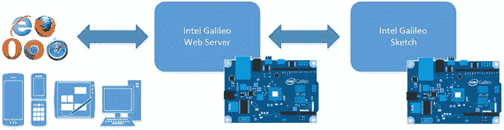

[图 9-1](#_Fig1) 。与 web 服务器组件的交互

网络服务器

在这个项目中，web 服务器充当与两个元素通信的中间组件:草图和浏览器。请记住，当用户以 HTML 格式与用户界面进行交互时，web 应用程序可以发送命令并控制房屋，并且网页可以接收来自英特尔 Galileo 的事件，这些事件可以动态和异步地报告安装在房屋中的传感器的状态。

在这两种情况下，网络服务器将网页发送的消息转换为英特尔 Galileo，反之亦然，消息交换的通道使用套接字实现。

图 9-2 展示了通信如何在所有软件组件中工作。

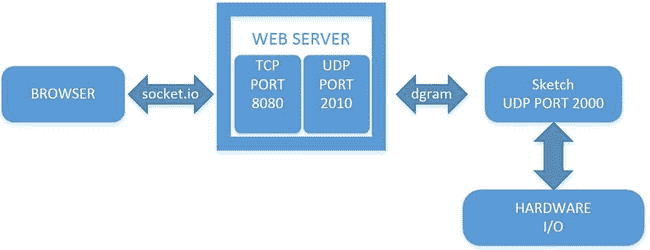

[图 9-2](#_Fig2) 。web 服务器、浏览器和 skecthes 之间的通信

英特尔 Galileo sketch 与网络服务器之间的通信是通过数据报(UDP)完成的。对于这个函数，草图保持 UDP 服务器在端口 2000 监听,而 web 服务器保持 UDP 服务器在端口 2010 监听。web 服务器和浏览器之间的通信使用 socket.io，它本质上表示一个 TCP 连接。

因此，当需要通知传感器读数时，由 sketch 向端口 2010 发送 UDP 消息，由 web 服务器接收。然后，web 服务器负责将此消息转换为事件，并传输到使用端口 8080 连接到 web 服务器的浏览器。浏览器通过 socket.io 客户端接收消息，页面的特定元素会动态更新，从而避免刷新整个页面。

另一方面，用户可以发送命令来控制设备打开灯、电视或任何其他交流设备。在这种情况下，web 应用程序中的客户端 socket.io 使用 web 服务器端口 8080 上的 socket.io 函数向 web 服务器发送消息。web 服务器捕获此消息，并将其转换为 UDP 消息，然后传输到端口 2000。在草图中运行并监听端口 2000 的 UDP 服务器接收消息，并通过管理 Arduino 的数字 I/O 头来解释它，以便通过开关继电器控制设备。

web 服务器和 sketch 运行在相同版本的 Intel Galileo 上，因此您可能想知道为什么必须使用 UDP 建立连接，而不是使用更简单的替代方法，例如使用信号或文件系统中的写/读操作。记住 node.js 负责确保 web 服务器运行在不同于草图的实例中。这意味着代码是平台相关的。如果您决定更改 web 服务器，则必须重写通信层。

关于与 web 服务器和浏览器的通信，关于的选择可以用几行代码实现。因此，您拥有了一个动态变化的网页，并且可以避免像在 HTML 标题中使用`<meta http-equiv="refresh" content="number of seconds" >`那样必须刷新整个页面的麻烦。

材料清单

该项目不需要太多材料，使用的传感器也非常便宜(见[表 9-1](#Tab1) )。如果您使用以太网电缆，您可以花费大约 25 美元来构建这个系统，如果您需要购买带天线的 mPCIe WiFi 卡，则花费大约 40 美元(不包括英特尔 Galileo 的费用)。

[表 9-1](#_Tab1) 。可选材料

<colgroup><col width="20%"> <col width="80%"></colgroup> 
| 

量

 | 

成分

 |
| --- | --- |
| one | 12 键薄膜键盘 |
| Two | 300 欧姆 1/4 瓦电阻 |
| oneoneoneoneoneoneoneone(几个) | 绿色发光二极管红色发光二极管HC-SR501 PIR 传感器模块YwRobot 模块，两个继电器TMP36 温度传感器0.1 uF 陶瓷英特尔迅驰无线-N 135 mPCIe 或以太网面包板(400 分够了)杜邦电线，母头对公头，以及跳线 |

事实上，如果您不想拥有像 PIR 传感器提供的运动检测这样的特定功能，您不需要购买所有物品。

单独集成组件

家庭自动化系统包含软件和硬件组件，单独测试它们是一个好主意，以便了解每个组件如何工作以及如何编写与每个组件交互的代码。接下来的章节将帮助您测试键盘、PIR 传感器、YwRobot 继电器模块和 TMP36 温度传感器，所有这些都将在您连接所有部件之前完成。

测试键盘

本项目使用的柔性薄膜键盘有 12 个按键，工作电压为 12V，尺寸为 76x60x0.8mm，非常容易集成。然而，你只需要知道连接器是如何映射到按键的，并且有一个简单的方法来编写代码(见[图 9-3](#Fig3) )。


[图 9-3](#_Fig3) 。柔性薄膜键盘的俯视图(顶部)和侧视图(底部)

如果您不容易找到此键盘，您可以使用任何其他类型的键盘，但请确保您采用了以下部分中介绍的连接方式。

接下来的部分将描述软件功能、硬件连接以及将与系统集成的代码。

键盘功能

在学习连接和代码之前，有必要了解系统是如何工作的。

一旦您启动英特尔 Galileo，系统将*锁定* **、**，这意味着如果 PIR 传感器检测到移动，将会发送警报。但是，通过输入正确的 PIN 码可以解锁系统。如果输入的 PIN 与保密 PIN 匹配，系统将返回解锁状态，PIR 传感器不会发送任何警报。

如果用户再次输入相同的 PIN 码，系统将重新启动。换句话说，相同的 PIN 码被用于装备和解除系统，分别锁定和解锁系统。

当系统锁定时，有一个绿色指示灯亮起，当系统解锁时，该指示灯熄灭。它为用户提供了系统是否待命的直观指示。

用户每次按键时，LED 都会闪烁一小段时间(默认为 500 毫秒),以确认系统已识别出按键事件。这与系统是否锁定无关。换句话说，即使 LED 已经打开(系统锁定)或关闭(系统解锁)，它也会闪烁。

键盘有一个输入功能，当按下井号键(#)时使用，用户每次想要确认 PIN 码时都必须按下该键。星号键(*)重置所有按下的数字，并允许用户在按下错误的键时重新输入 PIN。

键盘连接

行 0 至 3 分别与连接器引脚 1、2、3 和 4 相关，列 0 至 2 分别与连接器引脚 5、6 和 7 相关。这些引脚必须连接到英特尔 Galileo 数字端口，并且可以使用软件轻松定制。参见图 9-4 。

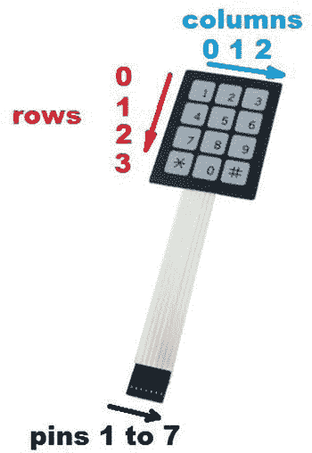

[图 9-4](#_Fig4) 。引脚的键盘布局以及行和列的标识

为了测试键盘，添加了一个 LED。[图 9-5](#Fig5) 显示了键盘示意图。

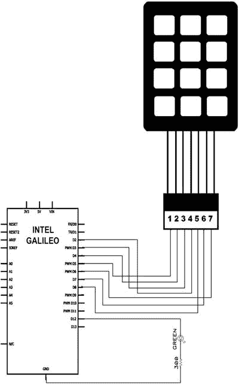

[图 9-5](#_Fig5) 。带 LED 连接的键盘

注意，对于这个项目，LED 连接到数字端口 13，这意味着 LED 不是真正必要的，因为内置 LED 也连接到引脚 13。是否使用外置 LED 是你的选择。

编写和测试键盘软件

本节使用本章`code`文件夹中的[清单 9-1](#list1) ( `keypad_testcode.ino`)中的代码。你还需要从`http://playground.arduino.cc/Code/Keypad`下载键盘库。

下载该库后，将其与英特尔 Galileo IDE 集成，如下所示:

1.  找到 Arduino IDE 在计算机上的安装位置，并找到名为`libraries`的目录。比如`c:\arduino-1.5.3-windows\arduino-1.5.3\libraries`。
2.  Extract the ZIP file and make sure the library is in the same level as the other libraries (see [Figure 9-6](#Fig6)).

    

    [图 9-6](#_Fig6) 。在 IDE 中安装键盘库

3.  打开`keypad_testcode.ino`并运行。按 CTRL+SHIFT+M 打开串行控制台调试器。参见[清单 9-1](#list1) 。

[***清单 9-1***](#_list1) 。keypad_testcode.ino

```sh
#include <Keypad.h>

enum SYSTEM_STATUS{
  LOCKED,     // 0
  UNLOCKED,   // 1
};

static SYSTEM_STATUS currentStatus = LOCKED;
const String password = "1968";
String input;

const byte ledPin = 12;

const byte ROWS = 4; // four rows
const byte COLS = 3; // three columns
char keys[ROWS][COLS] = {
    {'1','2','3'},
    {'4','5','6'},
    {'7','8','9'},
    {'*','0','#'}
};

byte rowPins[ROWS] = {5, 4, 3, 2}; // pins on Intel Galielo I/O
byte colPins[COLS] = {8, 7, 6};    // pins on Intel Galielo I/O

Keypad keypad = Keypad( makeKeymap(keys), rowPins, colPins, ROWS, COLS );

void setup(){
    Serial.begin(115200);

    // in case there is an LED CONNECTED
    pinMode(ledPin, OUTPUT);
    digitalWrite(ledPin, HIGH);         // The default is system locked.. so, the LED must be HIGH
    keypad.addEventListener(handleKey); // this is the listener to handle the keys
}

void loop(){

    // reading the keyboard
    char key = keypad.getKey();

    // if it’s a valid key
    if (key) {

        if ((key != '#') &&  (key != '*'))
        {
          input += key;
        }
        Serial.print("key:");
        Serial.println(key);
    }
}

// this function is only called when the PIN code
// typed matches the secret PIN code and inverts
// the system logic. It means if the system was LOCKED
// it will be UNLOCKED and vice versa.
void updateLEDStatus() {
      if (currentStatus == LOCKED)
      {
           currentStatus = UNLOCKED;

           Serial.println("SYSTEM UNLOCKED");

           // turn OFF the LED
           digitalWrite(ledPin, LOW);
       }
       else
       {
           currentStatus = LOCKED;

           Serial.println("SYSTEM LOCKED");

           // turn ON the LED
           digitalWrite(ledPin, HIGH);
        }
}

// this function is responsible to handle
// the keypad events
void handleKey(KeypadEvent key){

    switch (keypad.getState())
    {
    case PRESSED:

        digitalWrite(ledPin, !digitalRead(ledPin));
        delay(500);
        digitalWrite(ledPin, !digitalRead(ledPin));

        // this is our ENTER
        if (key == '#') {
          Serial.println(input);
          if (input == password)
          {
               updateLEDStatus();
          }
          input = "";

        }

        break;

    case RELEASED:

        // this is our CLEAR
        if (key == '*') {
           input = "";
        }
        break;
    }
}
```

审查代码

原始代码将秘密 PIN 设置为 **1968** ，这是英特尔成立的年份。请随意更改 PIN。为此，请更改以下代码行:

```sh
const String password = "1968";
```

第一行代码调用负责从库中调用函数的`Keypad.h`文件。接下来的几行与一个枚举器相关，它们描述了系统的两种可能状态— `LOCKED`和`UNLOCKED`。

接下来的几行决定了键盘的设计以及按键必须连接到数字端口 I/O 中的哪些引脚。

```sh
const byte ROWS = 4; // four rows
const byte COLS = 3; // three columns
char keys[ROWS][COLS] = {
    {'1','2','3'},
    {'4','5','6'},
    {'7','8','9'},
    {'*','0','#'}
};

byte rowPins[ROWS] = {5, 4, 3, 2}; // pins on Intel Galielo I/O
byte colPins[COLS] = {8, 7, 6};    // pins on Intel Galielo I/O

Keypad keypad = Keypad( makeKeymap(keys), rowPins, colPins, ROWS, COLS );
```

请注意名为`keys`的二维数组。它描述了该项目中使用的键盘设计，名为`rowPins`和`colPins`的字节数组决定了键盘如何连接到英特尔 Galileo 数字端口 I/O

如果您使用具有不同连接和设计的不同键盘，您需要相应地更改这些线路。

下面一行:

```sh
Keypad keypad = Keypad( makeKeymap(keys), rowPins, colPins, ROWS, COLS );
```

仅用于“连接”库的各个部分。换句话说，这是软件通知键盘设计库的方式，也是键盘连接器连接到英特尔 Galileo 数字端口的方式。

`setup()`函数包含一个函数回调，当检测到按键事件(如按下、释放和按住)时将调用该函数回调。

```sh
keypad.addEventListener(handleKey);
```

在这种情况下，回调函数被命名为`handleKey()`。

在功能`loop()`中，通过功能`getKey()`读取密钥，如下所示。

```sh
char key = keypad.getKey();
```

仍然在函数`loop()`中，如果键是有效的并且不同于`#`和`!`，则它们被累积在名为`input`的变量中，因为其目的只是在该变量中存储数字键类型。

```sh
if (key) {

        if ((key != '#') &&  (key != '*'))
        {
          input += key;
        }
```

最后，当检测到`PRESS`和`RELEASE`事件并完成一些动作时，使用回调函数`handleKey()`。对于`PRESS`事件，如果用户键入`#`，该键的作用类似于`ENTER`事件。检查变量输入中累积的 pin 序列，看它是否与秘密 PIN 号匹配。如果匹配，则根据当前状态，系统解锁或锁定。回想一下，当系统锁定时，LED 指示灯亮起；当系统解锁时，LED 指示灯熄灭。

```sh
    switch (keypad.getState())
    {
    case PRESSED:
        // this is our ENTER
        if (key == '#') {

...
...
          if (input == password)
          {
               updateLEDStatus();
          }
...
...
```

对于`RELEASE`事件，如果按下`*`键，则`input`变量被清除，并允许用户重新输入代码。

```sh
    case RELEASED:

        // this is our CLEAR
        if (key == '*') {
           input = "";
        }
...
...
```

运行键盘代码

运行代码并按 CTRL+SHIFT+M 查看串行控制台调试器。

您将立即看到 LED 亮起，这意味着系统的初始状态是锁定的。键入一些键，你应该看到 LED 闪烁了一小段时间。

如果您按下`#`并且输入的 PIN 码与秘密 PIN 码匹配，则 LED 将关闭，系统将解锁。

如果您再次输入密码，系统将重新启动，指示灯将亮起。

如果您键入键`*`，所有输入将被清除。

[图 9-7](#Fig7) 显示了键盘测试。


[图 9-7](#_Fig7) 。调试键盘功能

测试 PIR 传感器

人体传感器被动红外(PIR)模块 HC-SR501 非常容易测试。该传感器的目的是检测环境中的运动。[图 9-8](#Fig8) 显示了本项目中使用的 PIR 传感器。


[图 9-8](#_Fig8) 。PIR 传感器

该模块需要根据您的偏好或需求进行一些校准。有必要调整传感器必须运行的最大距离，并设置指示检测的脉冲必须闪烁多长时间。

HC-SR501 模块没有封装，因此不推荐用于室外应用。

关于这个模块的更多细节，请查看`http://www.mpja.com/download/31227sc.pdf`。

PIR 传感器功能

模块有足够的三个信号连接，如[图 9-9](#Fig9) 所示。


[图 9-9](#_Fig9) 。PIR 传感器接头

当检测到移动时，根据微电位计`Tx`的调整，OUT 引脚在 5 到 300 秒的时间间隔内保持高电平。使用微型电位计 Sx 可以将检测距离设置在 2 米(6.56 英尺)到 7 米(22.9 英尺)之间。详见[图 9-9](#Fig9) 。

PIR 传感器连接

该 PIR 传感器可以接收 5 到 20V 之间的输入电压。这意味着传感器可以使用英特尔 Galileo 提供的+5V 电压。如果您的目的是创建演示或了解其工作原理，使用英特尔 Galileo 接头提供的+5V 电压就足够了。然而，如果您计划在家中使用这种传感器，并且需要监控离英特尔 Galileo 相当远的房间，那么最好使用 9V 电池，在家中四处布线，避免电线提供的阻抗干扰传感器功能。根据这个传感器的相关信息，静态电流低于 50uA，对于 9V 电池来说还可以。

如果您想将传感器直接连接到英特尔 Galileo，请查看[图 9-10](#Fig10) 。


[图 9-10](#_Fig10) 。PIR 传感器直接连接到英特尔 Galileo

否则，如果您想使用 9V 电池，请查看图 9-11 中的示意图。


[图 9-11](#_Fig11) 。PIR 传感器使用 9V 电池作为电源

请注意，传感器连接到数字端口 9，这意味着如果您之前正在测试键盘，您可以保持键盘连接。此外，还有一个 LED 连接到引脚 13，这意味着您可以使用内置 LED 来检查传感器功能，或者您可以连接一个外部 LED，如本章前面描述的键盘测试所使用的。

编写和测试 PIR 传感器软件

为此，您将使用清单 9-2 中[的`PIR_sensor_testcode.ino`。](#list2)

[***清单 9-2***](#_list2) 。PIR_sensor_testcode.ino

//

```sh
// For testing Infrared HC-SR501 Pyroelectric Infrared Sensor
//

const byte ledPIRpin = 13;    // LED pin for the LED
const byte sensorPIR_Pin = 9; // input pin
byte pirState = LOW; //

void setup() {
    pinMode(ledPIRpin, OUTPUT);    // declare output
    pinMode(sensorPIR_Pin, INPUT); // declare input

    Serial.begin(115200);
}

void loop(){

    if (digitalRead(sensorPIR_Pin) == HIGH) { // input HIGH
        digitalWrite(ledPIRpin, HIGH);        // LED ON
        if (pirState == LOW)
        {

            // we have just turned on
            Serial.println("OPS!!! Someone here!!! motion DETECTED!");

           // We only want to print on the output change, not state
           pirState = HIGH;
       }
    }
    else
    {

       digitalWrite(ledPIRpin, LOW); // turn LED OFF
       if (pirState == HIGH){

       // we have just turned of
       Serial.println("Waiting for next moviment");

       // We only want to print on the output change, not state
       pirState = LOW;
       }
   }
}
```

代码唯一做的事情是检测引脚 9 的电平变化，引脚 9 通过数字端口连接到传感器头`OUT`。草图有一个名为`pirState`的变量，从低电平开始。当传感器检测到运动时，变量呈现高状态。然后，当延迟到期时，传感器头`OUT`转到`LOW`，并且`pirState`变量将状态改变到`LOW`，从而指示不存在。

运行草图并按 CTRL+SHIFT+M 查看串行调试器。当检测到移动时，串行调试器将打印消息。

这是做出调整的时候了！图 9-9 中[所示的电位计必须这样改变:](#Fig9)

1.  距离设置(Sx):向右转，距离(灵敏度)增加；向左转，距离减小。
2.  时间设置(Tx):向右转，延时增加；向左转，时间减少。

记住限制:2 米(6.56 英尺)到 7 米(22.9 英尺)之间的距离和 5 到 300 秒之间的延迟。

测试 YwRobot 继电器模块

本章中使用的双通道继电器模块 YwRobot 是最简单的测试组件之一，但有必要了解继电器在安培数和连接到灯和其他交流设备时可运行的最大电压方面的限制。否则，你的房子可能会着火。

这与第 5 章中提到的继电器相同，是对湿度传感器系统的改进，用于激活和关闭电动阀。

YwRobot 继电器模块功能

在本章中，继电器模块 YwRobot 可支持最大 250V AC 和 10A AC，或 30V DC 和 10DC 继电器。这足以支持简单的灯。

输入操作为 5V，继电器为 TTL 电平。这意味着英特尔 Arduino 数字端口可用于操作该模块。

本项目中使用的模块包含两个继电器，每个继电器根据图 9-12 所示的原理图进行控制。


[图 9-12](#_Fig12) 。继电器模块命令

该模块中的每个继电器都包含一个简单的驱动电路，该驱动电路带有一个 PNP 8550 晶体管，以 5V DC 工作。当 IN1 为低时，电路激活，继电器切换；否则，当 IN1 为高电平时，电路断开，继电器不工作。

模块提供了一些有助于调试的发光二极管，因为它们通过在 in 标题中分别设置低和高来指示模块是否通电和继电器是否激活(见[图 9-13](#Fig13) )。

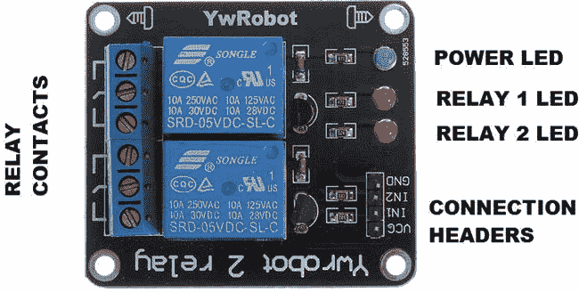

[图 9-13](#_Fig13) 。YwModule LED 和接头

YwRobot 中继模块与英特尔 Galileo 的连接

本章中使用的版本包含两个由割台引脚 IN1 和 IN2 控制的继电器。您可以购买带有更多继电器的模块，唯一的区别是“in”的数量，因为该模块包含独特的 VCC 和 GND(接地)接头，与继电器的数量无关。

原理图中的 VCC 连接到英特尔 Galileo 5V。GND 连接到英特尔 Galileo 地线，IN1 连接到您喜欢的数字端口 I/O。当模块输入(IN)设置为低电平时，驱动电路处于活动状态，当设置为高电平时，驱动电路处于非活动状态。

对于这个项目，命令 IN1 和 IN2 分别连接到 Intel Galileo 的端口 10 和 11。参见[图 9-14](#Fig14) 作为参考。

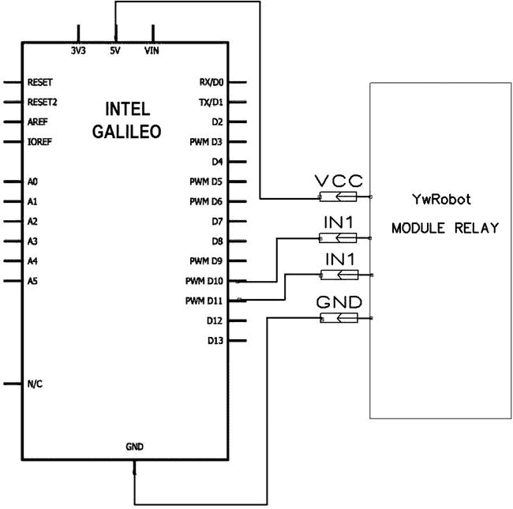

[图 9-14](#_Fig14) 。将模块继电器连接到英特尔 Galileo

YwRobot 继电器模块与外部灯的连接

 **警告**在用模块继电器将灯具连接到交流电源之前，务必注意 110 VAC、127 VAC 和 220 VAC 会导致严重的人身伤害、死亡或重大财产损失。

确保您希望在本项目中使用的灯具或设备需要的电流和电压符合继电器模块规格所提供的能力，并且所有安装都是使用正确的电线完成的。

灯或装置的连接如[图 9-15](#Fig15) 所示。

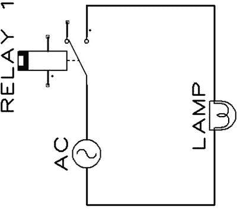

[图 9-15](#_Fig15) 。将灯连接到交流继电器

测试系统时，没有必要连接灯或任何其他交流组件，因为 YwRobot 模块有指示连接的 led，如[图 9-13](#Fig13) 所述。因此，您可以将此连接视为系统中的最后一个连接。

编写和测试 YwRobot 继电器模块软件

本节使用的代码如下所示

清单 9-3 提供了测试模块继电器的代码。`relaymodule_testcode.ino`是本章中最简单的一个。

[***清单 9-3***](#_list3) 。relaymdule _ test code。no

```sh
//
// For testing YwRobot module relay
//

const byte relay1 = 10; // relay 1 command
const byte relay2 = 11; // relay 2 command

void setup() {
    pinMode(relay1, OUTPUT); // declare output
    pinMode(relay2, OUTPUT); // declare output

    Serial.begin(115200);
}

void loop(){

   digitalWrite(relay1, LOW);  // turn ON
   digitalWrite(relay2, HIGH); // turn OFF
   delay(5000);

   digitalWrite(relay1, HIGH); // turn OFF
   digitalWrite(relay2, LOW);  // turn ON
   delay(5000);
}
```

正如您在代码中看到的，没有什么特别的，因为模块继电器输入 IN1 和 IN2 连接到英特尔 Galileo 上的数字端口 10 和 11。

`loop()`功能以 5 秒的间隔打开和关闭由 IN1 控制的继电器 1 和由 IN2 控制的继电器 2 的输出。

如果你有灯连接到继电器，你将能够看到，当一盏灯是打开的，另一盏灯是关闭的，反之亦然。如果您没有连接灯，您可以在 YwRobot 中看到 LED，指示当前哪个继电器处于活动状态。

测试 TMP36 温度传感器

TMP36 温度传感器看起来像一个晶体管。它不需要任何校准，并提供与摄氏温度成线性比例的输出电压。

TMP36 温度传感器功能

TMP36 有三个引脚，一个 VIN 必须在 2.7 和 5.5V DC 之间，一个 GND 和一个电压输出 (VOUT)。

在`http://www.analog.com/static/imported-files/data_sheets/TMP35_36_37` *的数据表中描述了不同精度的不同电路。*

TMP36 温度传感器与英特尔 Galile 的连接

在开始连接之前，有一点非常重要，即在本书编写过程中，数据手册版本 G 代表 TMP36 引脚，显示的是底部视图*而不是顶部视图*。

几个开发者声称传感器极热，其实是因为传感器接反了。

[图 9-16](#Fig16) 显示了传感器的仰视图。


[图 9-16](#_Fig16) 。TMP38，仰视图

你需要用 5V 给传感器接上电源，接好地，选择其中一个模拟口接传感器 VOUT。对于本项目，模拟端口 A0 与 VOUT 一起使用，一个 0.1uF 的电容用于接地和 VCC 之间(见[图 9-17](#Fig17) )。


[图 9-17](#_Fig17) 。TMP36 连接到英特尔 Galileo

有关该传感器的更多详情，请转至`http://www.analog.com/static/imported-files/data_sheets/TMP35_36_37.pdf` `。`

 `编写和测试 TMP36 温度传感器软件

测试 TMP36 的代码在[清单 9-4](#list4) 中提供。

[***清单 9-4***](#_list4) 。tmp36_testcode。否

```sh
//TMP36 VOUT pin connection
const byte sensorAnalogPin = 0;

/*
 * setup() - this function runs once you turn your Arduino on
 * We initialize the serial connection with the computer
 */
void setup()
{
  Serial.begin(115200);

}

void loop()
{
 //getting the voltage reading from the temperature sensor
 int reading = analogRead(sensorAnalogPin);

 float VOUT = (reading * 5.0)/1024.0;

 Serial.print(" volts");
 Serial.println(VOUT);

 // converting to Celsius according to the datasheet
 float tempCelsius = (VOUT - 0.5) * 100 ;

 Serial.print(" degrees Celsius:");
 Serial.println(tempCelsius);

 // converting to Fahrenheit
 float tempF = (tempCelsius * 9.0 / 5.0) + 32.0;

 Serial.print("degrees Fahrenheit:");
 Serial.println(tempF);

 delay(1000);
}
```

代码在读取 A0 端口后转换输出中的实际电压:

```sh
int reading = analogRead(sensorAnalogPin);

float VOUT = (reading * 5.0)/1024.0;
```

要转换为摄氏度，请使用以下公式:

```sh
Temperature Celsius = (VOUT - 0.5V)*100
```

获取摄氏温度的代码如下:

```sh
// converting to Celsius according the datasheet
float tempCelsius = (VOUT - 0.5) * 100 ;
```

创建草图

测试完所有硬件组件后，就该创建草图了。该代码将仅是用于测试外围设备的所有测试代码的结合，仅包括使用数据报(UDP)与 web 服务器通信所需的部分。

英特尔 Galileo 不需要任何特殊的 Arduino 屏蔽来获得网络连接，您可以使用以太网电缆或带有 mPCIe 总线的 WiFi 卡(如英特尔迅驰无线 N-135)来设置连接，甚至可以使用调制解调器卡。

考虑到没有使用屏蔽，所以没有必要为这样的连接使用库和编写代码。这允许您在英特尔 Galileo 中进行简单设置，如第 5 章中的[所述。](05.html)

草图将需要能够发送和接收数据报。Linux 库提供了这样做的功能，这意味着您不必使用专门为 shields 创建的库，这个项目中没有用到 shields。

发送 UDP 消息

下面的代码片段代表了一个负责发送数据报的函数。注意套接字描述符`socketfd`用参数`SOCK_DGRAM`和`IPPROTO_UDP`打开，以便指定数据报和非定向连接。

消息必须通过的端口由`htons()`函数中的`WEBSERVER_UPD_PORT`指定。

用于发送消息的 IP 地址是`loopback 127.0.0.1`,因为草图和网络服务器在英特尔 Galileo 中运行，这意味着同一台设备共享同一个环回端口。当连接建立时，您可以使用元素适配器提供的 IP，但是您应该一直更改代码或者实现一些机制来传递参数化的信息。

要发送消息，使用功能`sendTo()`。

```sh
#define WEBSERVER_UDP_PORT 2010 // this port is used to send message events to Node.js

void sendUDPMessage(String protocol)
{
  struct sockaddr_in serv_addr;
  int sockfd, i, slen=sizeof(serv_addr);

  if ((sockfd = socket(AF_INET, SOCK_DGRAM, IPPROTO_UDP))==-1)
  {
    printError("socket");
    return;
  }

  bzero(&serv_addr, sizeof(serv_addr));
  serv_addr.sin_family = AF_INET;
  serv_addr.sin_port = htons(WEBSERVER_UDP_PORT);

  // considering the sketch and the web server run into Galileo
  // let's use the loopback address
  if (inet_aton("127.0.0.1", &serv_addr.sin_addr)==0)
  {
      printError("inet_aton() failed\n");
      close(sockfd);
      return;
  }

   char send_msg[BUFFERSIZE];  // more than enough
   memset((void *)send_msg, sizeof(send_msg), 0);
   protocol.toCharArray(send_msg, sizeof(send_msg), 0);

  if (sendto(sockfd, send_msg, strlen(send_msg), 0, (struct sockaddr *)&serv_addr, sizeof(serv_addr))==-1)
        printError("sendto()");

  close(sockfd);

}
```

接收 UDP 消息

为了接收数据报，套接字描述符以与发送 UDP 消息相同的方式打开。但是，一旦打开套接字，就必须调用函数`bind()`。它指定了用于从 web 服务器接收消息的端口，在本例中称为`SKETCH_UDP_PORT`。

```sh
#define SKETCH_UDP_PORT 2000    // this port is used to receive message events from Node.js

int populateUDPServer(void)
{

    if ((sockfd = socket(AF_INET, SOCK_DGRAM, IPPROTO_UDP))==-1)
      printError("socket");
    else
      Serial.println("Server : Socket() successful\n");

    bzero(&my_addr, sizeof(my_addr));
    my_addr.sin_family = AF_INET;
    my_addr.sin_port = htons(SKETCH_UDP_PORT);
    my_addr.sin_addr.s_addr = htonl(INADDR_ANY);

    if (bind(sockfd, (struct sockaddr* ) &my_addr, sizeof(my_addr))==-1)
      printError("bind");
    else
      Serial.println("Server : bind() successful\n");

    memset(msg_buffer, 0, sizeof(msg_buffer));
}
```

一旦套接字描述符被打开并且`bind()`函数被调用，就可以通过定期调用`recvfrom()`函数从 web 服务器接收数据报。`loop()`功能非常适合这一点。

然而，`recvfrom()`功能被使用，并且是一个*阻塞*功能。当 web 服务器不发送消息时，该函数将阻止整个草图的执行，从而使项目无效。

为了解决这个问题，另一个名为`select()`的函数必须与`recvfrom()`结合使用，以便在阻塞过程中实现超时。`recvfrom()`函数将考虑超时并允许程序执行。

一个标志用于控制这个过程，并使用类似于`FD_ZERO()`的函数进行重置，使用`FD_SET()`将标志与套接字描述符绑定。这些函数必须在`select()`函数之前被调用。

根据文档，当调用`select()`时，有一个关于第一个参数的细节，该参数必须是套接字描述符加 1。

在下一个代码片段中，超时设置为 1000 微秒。如果没有收到消息，超时发生，传感器的值被读取并每秒发送到 web 服务器，以便网页不断更新。

如果收到某个消息，函数`FS_ISSET()`将声明该消息，调用`recvfrom()`并接收数据。

```sh
void loop() {

      if (time0 == 0) time0 = millis();
...
...
...

        // clear the set ahead of time
      FD_ZERO(&readfds);
      FD_SET(sockfd, &readfds);

      // wait until either socket has data ready to be recvfrom() (timeout 1000 usecs)
      tv.tv_sec = 0;
      tv.tv_usec = 1000;

      rv = select(sockfd + 1, &readfds, NULL, NULL, &tv);

        if(rv==-1)
        {
            Serial.println("Error in Select!!!");
        }
        if(rv==0)
        {

            // TIMEOUT!!!!

            if ((millis()-time0) >= 1000)
            {
                // reached 1 seconds.. let's reads the sensor and send a message!!!
                time0 = millis();

...
...
...

               sendUDPMessage(protocol);

            }
        }

        // checking if the UDP server received some message from the web page
        if (FD_ISSET(sockfd, &readfds))
        {

            if (recvfrom(sockfd, msg_buffer, BUFFERSIZE, 0, (struct sockaddr*)&cli_addr, &slen)==-1)
                printError("recvfrom()");
...
...
...

            // let's clear the message buffer
            memset(msg_buffer, 0, sizeof(msg_buffer));

        }

}
```

将所有代码连接到一个草图中

如果您测试了本章中的所有外设，您应该意识到组件与英特尔 Galileo 接头的连接使用不同的端口。这使您可以保持所有外设的连接，并单独测试它们，从而使硬件集成非常容易。

[清单 9-5](#list5) 是所有测试代码的简单连接。它集成了用于发送和接收消息的 UDP 代码，而且还在使用键盘启动和解除系统后读取传感器和系统状态。这样的读数每秒进行一次。换句话说，当您拥有由`select()`和 FD 函数提供的超时时，如上所述。

该代码还解析通过 UDP 服务器接收的命令，并更改 YwRobot 模块中的开关继电器。

[***清单 9-5***](#_list5) 。sketch_client.ino

```sh
#include <stdio.h>

// includes for the UDP connections
#include <arpa/inet.h>
#include <netinet/in.h>
#include <sys/types.h>
#include <sys/socket.h>
#include <unistd.h>
#include <stdlib.h>
#include <string.h>

// keypad
#include <Keypad.h>

// debugging
#define DEBUG 1                 // 1 to see the debug messages in the serial console, or 0 to disable

#define BUFFERSIZE 512          // UDP is limited and must be very short. 512 bytes is more than enough
#define SKETCH_UDP_PORT 2000    // this port is used to receive message events from Node.js
#define WEBSERVER_UDP_PORT 2010 // this port is used to send message events to Node.js
#define SENSOR_READ_INTERVAL 10 // number of seconds to read sensors and report to website

// for the UDP server
   struct sockaddr_in my_addr, cli_addr;
    int sockfd, i;
    socklen_t slen=sizeof(cli_addr);
    char msg_buffer[BUFFERSIZE];
    fd_set readfds;
    struct timeval tv;
    int rv,n;

// pin connections
const byte sensorAnalogPin = 0;

// Keypad
enum SYSTEM_STATUS{
  LOCKED,     // 0
  UNLOCKED,   // 1
};

static SYSTEM_STATUS currentStatus = LOCKED;
const String password = "1968";     // Intel foundation year..
String input;

const byte ledPin = 12;

const byte ROWS = 4; // four rows
const byte COLS = 3; // three columns
char keys[ROWS][COLS] = {
    {'1','2','3'},
    {'4','5','6'},
    {'7','8','9'},
    {'*','0','#'}
};

byte rowPins[ROWS] = {5, 4, 3, 2}; // pins on Intel Galielo I/O
byte colPins[COLS] = {8, 7, 6};    // pins on Intel Galielo I/O

Keypad keypad = Keypad( makeKeymap(keys), rowPins, colPins, ROWS, COLS );

// PIR sensor
const byte sensorPIR_Pin = 9; // input pin
byte pirState = LOW; //
const byte ledPIRpin = 13;

// Relays
const byte relay1 = 10; // relay 1 command
const byte relay2 = 11; // relay 2 command

// time control
unsigned long time0 = 0;

// this function is only called when some error happens
void printError(char *str)
{
    Serial.print("ERROR: ");
    Serial.println(str);
}

// this function is reponsible for sending UDP datagrams
void sendUDPMessage(String protocol)
{
  struct sockaddr_in serv_addr;
  int sockfd, i, slen=sizeof(serv_addr);

  if ((sockfd = socket(AF_INET, SOCK_DGRAM, IPPROTO_UDP))==-1)
  {
    printError("socket");
    return;
  }

  bzero(&serv_addr, sizeof(serv_addr));
  serv_addr.sin_family = AF_INET;
  serv_addr.sin_port = htons(WEBSERVER_UDP_PORT);

  // considering the sketch and the web server run into Galileo
  // let's use the loopback address
  if (inet_aton("127.0.0.1", &serv_addr.sin_addr)==0)
  {
      printError("inet_aton() failed\n");
      close(sockfd);
      return;
  }

   char send_msg[BUFFERSIZE];  // more than enough
   memset((void *)send_msg, sizeof(send_msg), 0);
   protocol.toCharArray(send_msg, sizeof(send_msg), 0);

  if (sendto(sockfd, send_msg, strlen(send_msg), 0, (struct sockaddr *)&serv_addr, sizeof(serv_addr))==-1)
        printError("sendto()");

  close(sockfd);

}

// this function is responsible to init the UDP datagram server
int populateUDPServer(void)
{

    if ((sockfd = socket(AF_INET, SOCK_DGRAM, IPPROTO_UDP))==-1)
      printError("socket");
    else
      if (DEBUG) Serial.println("Server : Socket() successful\n");

    bzero(&my_addr, sizeof(my_addr));
    my_addr.sin_family = AF_INET;
    my_addr.sin_port = htons(SKETCH_UDP_PORT);
    my_addr.sin_addr.s_addr = htonl(INADDR_ANY);

    if (bind(sockfd, (struct sockaddr* ) &my_addr, sizeof(my_addr))==-1)
      printError("bind");
    else
      if (DEBUG) Serial.println("Server : bind() successful\n");

    memset(msg_buffer, 0, sizeof(msg_buffer));

}

// reading the temperature sensor in Celsius
float readTemperatureSensor()
{
  // getting the voltage reading from the temperature sensor
 int reading = analogRead(sensorAnalogPin);

 float VOUT = (reading * 5.0)/1024.0;

 if (DEBUG) {
     Serial.print(" volts");
     Serial.println(VOUT);
 }

 // converting to Celsius according to the datasheet
 float tempCelsius = (VOUT - 0.5) * 100 ;

 if (DEBUG) {
     Serial.print(" degrees Celsius:");
     Serial.println(tempCelsius);
 }

 return tempCelsius;
}

// convert celsius to fahrenheit
float convertTempToF(int celsius) {
  // converting to Fahrenheit
 float tempF = (celsius * 9.0 / 5.0) + 32.0;

 if (DEBUG) {
     Serial.print("degrees Fahrenheit:");
     Serial.println(tempF);
 }

 return tempF;

}

// update the LED status when the system is armed or disarmed
void updateLEDStatus() {
      if (currentStatus == LOCKED)
      {
           currentStatus = UNLOCKED;

           if (DEBUG)
           {
              Serial.println("SYSTEM UNLOCKED");
           }

           //turn OFF the LED
           digitalWrite(ledPin, LOW);
       }
       else
       {
           currentStatus = LOCKED;

           if (DEBUG)
           {
               Serial.println("SYSTEM LOCKED");
           }

           // turn ON the LED
           digitalWrite(ledPin, HIGH);
        }
}

// this is the key handler for the PRESS, RELEASE, and HOLD event
void handleKey(KeypadEvent key){

    switch (keypad.getState())
    {
    case PRESSED: // this is our ENTER

        digitalWrite(ledPin, !digitalRead(ledPin));
        delay(500);
        digitalWrite(ledPin, !digitalRead(ledPin));

        if (key == '#') {
          if (DEBUG) Serial.println(input);
          if (input == password)
          {
               updateLEDStatus();
          }
          input = "";

        }

        break;

    case RELEASED: // this is our CLEAR
        if (key == '*') {
           input = "";
        }
        break;
    }
}

void setup() {

  Serial.begin(115200);

  delay(3000);

  // init variables for UDP server
  populateUDPServer();

  // keypad
  pinMode(ledPin, OUTPUT);
  pinMode(ledPIRpin, OUTPUT);

  digitalWrite(ledPin, HIGH);         // The default is system locked.. so, the LED must be HIGH
  digitalWrite(ledPIRpin, LOW);       // Let's let the PIR sensor change the LED state

  keypad.addEventListener(handleKey); // this is the listener to handle the keys

  // relays
  pinMode(relay1, OUTPUT); // declare output
  pinMode(relay2, OUTPUT); // declare output

  digitalWrite(relay1, HIGH);
  digitalWrite(relay2, HIGH);

}

void loop() {

    if (time0 == 0) time0 = millis();

    // checking the keypad
     char key = keypad.getKey();

    if (key) {

        if ((key != '#') &&  (key != '*'))
        {
          input += key;
        }
        if (DEBUG)
        {
            Serial.print("key:");
            Serial.println(key);
        }
    }

    // PIR sensor
     if (digitalRead(sensorPIR_Pin) == HIGH) { // input HIGH
        digitalWrite(ledPIRpin, HIGH);         // LED ON
        if (pirState == LOW)
        {

            // we have just turned on
            Serial.println("OPS!!! Someone here!!! motion DETECTED!");

           // We only want to print on the output change, not state
           pirState = HIGH;
       }
    }
    else
    {

       digitalWrite(ledPIRpin, LOW); // turn LED OFF
       if (pirState == HIGH){

       // we have just turned off
       if (DEBUG) Serial.println("Waiting for next moviment");

       // We only want to print on the output change, not state
       pirState = LOW;
       }
   }

        // clear the set ahead of time
      FD_ZERO(&readfds);
      FD_SET(sockfd, &readfds);
      // wait until either socket has data ready to be recv()d (timeout 1000 usecs)
      tv.tv_sec = 0;
      tv.tv_usec = 1000;

      rv = select(sockfd + 1, &readfds, NULL, NULL, &tv);

        if(rv==-1)
        {
               if (DEBUG)
               {
                     Serial.println("Error in Select!!!");
               }
        }
        if(rv==0)
        {

            // TIMEOUT!!!!

            if ((millis()-time0) >= 1000)
            {
                // reached 1 seconds  let's read the sensor and send a message!!!
                time0 = millis();

                String protocol = "";

                if (pirState == HIGH)
                {
                     protocol += "*INTRUDER!!!*";
                }
                else
                {
                     protocol += "*NO DETECTION*";
                }

                           // reading the temperature sensor
                int tempC = readTemperatureSensor();
                int tempF = convertTempToF(tempC);

                char msg[20];
                memset(msg, 0, sizeof(msg));
                sprintf(msg, "%dC - %dF", tempC, tempF);

                protocol += "*";
                protocol += msg;

                // checking the system status
                if (currentStatus == LOCKED)
                {
                    protocol += "*ARMED*";
                }
                else
                {
                    protocol += "*DISARMED*";
                }
                sendUDPMessage(protocol);

            }
        }

        // checking if the UDP server received some message from the web page
        if (FD_ISSET(sockfd, &readfds))
        {

            if (recvfrom(sockfd, msg_buffer, BUFFERSIZE, 0, (struct sockaddr*)&cli_addr, &slen)==-1)
            {
                printError("recvfrom()");
                return; // let's abort the loop
            }
            if (DEBUG)
            {
                 Serial.println("Received packet from %s:%d\nData:");
                 Serial.println(inet_ntoa(cli_addr.sin_addr));
                 Serial.println(msg_buffer);
            }

            String checkResp = msg_buffer;
            if (checkResp.lastIndexOf("L1ON", 0) < 0)
            {
                 // There is no L1ON in the string.. let's switch off the relay
                 digitalWrite(relay1, HIGH);

                 if (DEBUG) Serial.println("The lamp 1 is OFF");

            }
            else
            {
                 // Oops.. let’s switch relay 1 to ON
                 digitalWrite(relay1, LOW);

                 if (DEBUG) Serial.println("The lamp 1 is ON");

            }

            if (checkResp.lastIndexOf("L2ON", 6) < 0)
            {
                 // There is no L2ON in the string.. let's switch off the relay
                 digitalWrite(relay2, HIGH);

                 if (DEBUG) Serial.println("The lamp 2 is OFF");
            }
            else
            {
                 // Oops.. let switch relay 2 to ON
                 digitalWrite(relay2, LOW);

                 if (DEBUG)Serial.println("The lamp 2 is ON");

            }

            // let's clear the message buffer
            memset(msg_buffer, 0, sizeof(msg_buffer));

        }
}
```

用 node.js 创建自己的 Web 服务器

到目前为止，您应该已经用小代码片段测试了所有的硬件组件，所以是时候开始编写和测试主要组件了 web 服务器。

这个项目使用 node.js，如前所述，node.js 试图简化后端软件的开发。也许如果你以前用 HTML 编程，你应该在你的网页上运行 JavaScript。如果您需要非常强大的东西，您应该已经在远程服务器中使用 Python、Java、Perl 脚本等实现了一些东西。然而，node.js 以一种轻松的实现方式将 JavaScript 的简单性带入了 web 服务器的上下文中。

更新 node.js

在编写和测试代码之前，请确保 node.js 的版本等于或高于 0.10.25。要检查这一点，您可以在终端 shell 中键入以下内容:

```sh
root@clanton:~# node --version
v0.10.25
```

或者

```sh
root@clanton:~# node -v
v0.10.25
```

如果您没有推荐的版本，可以通过三种方式更新您的系统。

选项 1:用 opkg 更新 node.js(推荐)

编辑此文件:

```sh
root@clanton:~# vi /etc/opkg/base-feeds.conf
```

并添加以下几行:

```sh
src/gz all     http://repo.opkg.net/galileo/all
src/gz clanton http://repo.opkg.net/galileo/clanton
src/gz i586    http://repo.opkg.net/galileo/i586
```

下一步是通过键入以下命令来更新`opkg`和 node.js:

```sh
root@clanton:~# opkg update
```

然后输入:

```sh
root@clanton:~# opkg upgrade nodejs --force-overwrite
```

选项 2:用源代码更新 node.js

可以将 node.js 直接构建到英特尔 Galileo 中。假设你想安装 0.10.25 版本(推荐的最低版本)，这个版本在`http://nodejs.org/dist/`可以获得。

您需要添加以下内容:

```sh
root@clanton:~# wget http://nodejs.org/dist/v0.10.25/node-v0.10.25.tar.gz
root@clanton:~# tar -zxvf node-v0.10.25.tar.gz
root@clanton:~# cd node*
root@clanton:~#./configure
root@clanton:~# make
root@clanton:~# make install
```

如果上面的“make”命令失败，您需要安装构建工具。为此，只需像“选项 1”中那样更新/etc/opkg/base-feeds.conf，并执行命令“opkg install package group-core-build essential-force-overwrite”。

选项 3:在 Yocto 构建中更新 node.js

如果您正在构建自己的映像，并且不想通过提示符 shell 更新 node.js，那么您可以向您的 Yocto 构建中添加一个新的配方，并让 node.js 自动更新。

英特尔社区上有一条线索，其中包含此过程的逐步说明。有兴趣的话可以去看看`https://communities.intel.com/thread/48416` *。*

关于国家预防机制

当您安装 node.js 时，它附带了一些作为依赖项安装的模块。例如，`dgram`用于 UDP 连接，`fs`用于文件系统操作，`http`用于提供 HTTP 服务器和客户端功能，等等。

当模块被`require`指令显式调用时，它在程序中是必需的，如下所示:

```sh
var http = require("http").createServer(onRequest),
    fs = require('fs'),
    url = require('url'),
    cheerio = require('cheerio'),
    dgram = require('dgram'),
```

但是，安装 node.js 时并不是所有的模块都是预装的，因为社区在不断开发新的包来提供新的模块。您可以根据项目需要安装它们。在您了解这个项目将使用的包之前，有必要了解如何使用`npm`工具安装它们。

node.js 文件有一个名为`npm`的包管理器，它允许您添加和删除外部包以及安装为 node.js 创建的模块。

大多数开发人员认为`npm`代表“节点包管理器”，但这并不准确。根据作者的说法，`npm`是一个递归的 bacronymic 缩写，`npm`不是一个缩写威廉·莎士比亚在《罗密欧与朱丽叶》中写道“玫瑰换成其他名字闻起来还是一样香。”因此，如果您愿意，您可以将`npm`称为节点包管理器，因为它的工作方式就像节点包管理器一样。

本项目使用`npm`1 . 3 . 24 版本。您可以使用以下命令检查您的版本:

```sh
root@clanton:~# npm -v
1.3.24
```

如果你想更新`npm`，使用这个命令:

```sh
root@clanton:~# npm update npm -g
```

要检查系统中安装的版本，您需要使用`ls`、`list`或`la`参数，后跟软件包名称。例如:

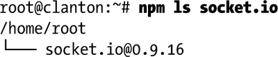

如果包不存在，将显示单词`empty`:


要列出安装在您系统上的所有包和每个包的依赖关系，只需使用参数`list`:

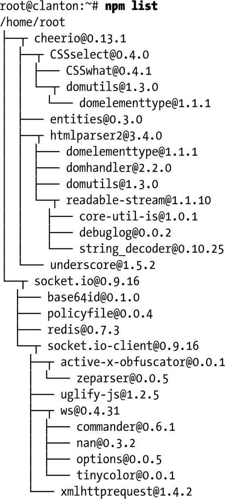

在您安装任何软件包之前，首先确保您的英特尔 Galileo 的日期和时间设置正确。您可以使用命令`date`并传递一个格式为`MMDDhhmmYYYY`的参数(`MM`是月，`DD`是日，`hh`是小时，`mm`是分钟，`YYYY`是年)。

例如，以下命令将英特尔 Galileo 设置为 2014 年 3 月 15 日上午 11:30。

```sh
root@clanton:~# date 0315113014
```

要安装软件包，请使用参数`install`后跟软件包名称:

```sh
root@clanton:~# npm install socket.io
```

也可以使用`install`配合`<name>@<version>`安装特定版本。例如:

```sh
root@clanton:~#  npm install sax@latest
```

更多关于`npm`的信息可以在`https://www.npmjs.org/doc/misc/npm-faq.html` *找到。*

安装麦片

名为`cheerio` 的包是一个轻便快捷的解决方案，它取代了`jsdom`包，让你可以更容易地解析和改变 HTML 元素。

要安装`cheerio`，请在终端外壳中键入以下命令:

```sh
root@clanton:~# npm install cheerio
```

Cheerio 将用 sketch 发送的信息来改变 HTML 页面中的元素。关于`cheerio`的更多细节可以在`https://github.com/MatthewMueller/cheerio`找到。

该项目使用以下`cheerio`版本:


安装 socket.io

这个项目使用名为 socket.io 的包通过 web 服务器和网页之间的套接字接收数据。本质上 socket.io 的连接是 TCP。服务器实现将监听 web 服务器中的连接，而客户端实现是在网页中完成的。关于 socket.io 的更多细节可以在`https://www.npmjs.org/package/socket.io`找到。

要安装 socket.io 包，请使用以下命令行:

```sh
root@clanton:/# node install socket.io
```

此项目使用以下 socket.io 版本:

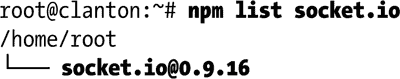

网页

如果 node.js 用于写入 web 服务器，那么这个 web 服务器必须能够动态改变。这意味着必须首先定义网页。

如上所述，该网页将能够控制两个开关继电器(命令)，接收关于温度和 PIR 传感器的信息，并指示用户是否使用键盘启动或解除系统。

本页的基本要求如图 9-18 所示。


[图 9-18](#_Fig18) 。家庭自动化的网页设计

网页必须是动态的，这意味着浏览器不能一直刷新页面，因为传感器每秒都会发送数据，如果页面完全刷新，web 应用程序会很糟糕，会阻止用户发送命令。

为了避免这个问题，页面使用了一个套接字连接到负责绑定套接字通道的 web 服务器。

该网页将在一条消息中一秒一秒地接收关于传感器和键盘的信息，以优化通信。

收到的信息会很简单。其字段由`*`字符界定，将包括 PIR 传感器信息、温度以及用户是否使用键盘启动或解除系统。类似于以下内容:

```sh
"* INTRUDER * 32C - 89F * UNLOCKED *"
```

web 应用程序必须解析通过套接字消息接收的字符串，并正确更新页面中的每个 HTML 元素。

可以像 jQuery 一样更新元素，使用 web 页面的每个元素使用的名称为`class`的`$()`函数访问元素。例如，您可以检查`textarea`元素:

```sh
<p>
Temperature sensor:&nbsp;<textarea class="txtsensor" id="temp" cols="1" maxlength="10" name="txtsensor" readonly="readonly" style="margin: 2px; width: 300px; height: 32px;"></textarea></p>
```

`textarea`有一个类名叫做`txtsensor` 。要使用`cheerio`访问这个元素，您可以使用以下代码:

```sh
$('p .txtsensor').text('HELLO ADDING A TEXT HERE!!!');
```

为了拥有所有这些功能，可以使用 HTML、JavaScript、socket.io.js(本例中是客户机)和 jQuery 库创建一个 web 页面。HTML 代码如清单 9-6 中的[所示。](#list6)

[***清单 9-6***](#_list6) 。home.html

```sh
<html>
<head>
        <script src="http://ajax.googleapis.com/ajax/libs/jquery/2.1.0/jquery.min.js"></script>
        <script src="/socket.io/socket.io.js"></script>
        <script>
                var socket = io.connect();
                socket.on('server-event-info', function (data) {
                       console.log(data);

                              var rawPIRSensorText = new String();
                              var rawTempText = new String();
                              var rawKeypadText = new String();
                              var len = data.length;

                              // extracting the sensor frame
                              var i = data.indexOf("*",1);

                              // extracting the PIR sensor data
                              rawPIRSensorText = data.substring(1, i);

                              // extracting the temp sensor data
                              var i_old = i;
                              i = data.indexOf("*",i_old+1);
                              rawTempText = data.substring(i_old+1, i);

                              // extracting the keypad sensor data
                              var i_old = i;
                              i = data.indexOf("*",i_old+1);
                              rawKeypadText = data.substring(i_old+1, i);

                              console.log(rawPIRSensorText);
                              console.log(rawTempText);
                              console.log(rawKeypadText)

                              $('p .txtsensor').text(rawTempText);
                              $('p .presencesensor').text(rawPIRSensorText);
                              $('p .systemstatus').text(rawKeypadText);

                });
        </script>

</head>
<body bgcolor="#82CAFA">
        <form method="post" name="form1" target="_self">
                       &nbsp;
                       <h1>
                                      Intel Galileo - Home Automation
                                      
                                      </h1>
                       <h3>
                       <hr>
                                      Command Relays and current state:</h3>
                       <p>
                                      <input checked="checked"  class="l1" name="l1" type="radio" value="0">OFF
                                      <input class="l1" name="l1" type="radio" value="1">ON &nbsp; Lamp 1</p>
                       <p>
                                      <input checked="checked" class="l2" name="l2" type="radio" value="0">OFF
                                      <input class="l2" name="l2" type="radio" value="1">ON &nbsp; Lamp 2</p>
                       <p>
                                      <button name="commandButton" type="submit" value="SET STATE">SET STATE</button></p>
                       <p>
                                      &nbsp;</p>
                       <hr>
                       <h3>
                                      Sensor Readings</h3>
                       <p>
                                      Temperature sensor:&nbsp;<textarea class="txtsensor" id="temp" cols="1" maxlength="10" name="txtsensor" readonly="readonly" style="margin: 2px; width: 300px; height: 32px;"></textarea></p>
                       <p>
                                      Presence sensor:&nbsp;<textarea class="presencesensor" cols="1" id="sensor" maxlength="10" name="presencesensor" style="margin: 2px; width: 300px; height: 32px;"></textarea></p>
                       <p>
                                      System status:&nbsp;<textarea class="systemstatus" cols="1" id="systemstatus" maxlength="10" name="systemstatus" style="margin: 2px; width: 300px; height: 32px;"></textarea></p>
                       <div>
                                      <hr>
                       </div>
        </form>
</body>

</html>
```

注意，每个 HTML 元素都定义了一个用于访问的`class` ID，类似于 jQuery 使用的方法。web 服务器中的`cheerios`允许您类似地访问和更改这些元素。

页面使用 jQuery 库版本 2.1.0 并调用 socket 。io 来实现将连接到 web 服务器的客户端。

```sh
<script src="http://ajax.googleapis.com/ajax/libs/jquery/2.1.0/jquery.min.js"></script>
        <script src="/socket.io/socket.io.js"></script>
```

JavaScript 解析套接字消息中的字符串，用分隔符`*`分隔元素，并更新网页中的每个元素:

```sh
$('p .txtsensor').text(rawTempText);
$('p .presencesensor').text(rawPIRSensorText);
$('p .systemstatus').text(rawKeypadText);
```

请注意，中继可以通过单选按钮 L1 和 L2 来管理，网络服务器将得到通知。这是通过 HTML 表单中的输入按钮的`submit`使用常规的`POST`来完成的。

```sh
<form method="post" name="form1" target="_self">
...
...
...
<button name="commandButton" type="submit" value="SET STATE">SET STATE</button></p>
```

参数`target="_self"`防止页面刷新时在浏览器中打开新的页面标签。

编写 Web 服务器代码

既然已经安装了所有必需的包，您就可以用几行代码编写 web 服务器了。

例如，如果您想使用 node.js 开发一个 web 服务器，您只需要下面几行代码。假设您创建了本书中提供的名为`mywebserver.js` 的文件:

```sh
var http = require('http');
http.createServer(function (req, res) {
  res.writeHead(200, {'Content-Type': 'text/plain'});
  res.end('Hello World.. my first web server running on GALILEO!!!!!!\n');
}).listen(8080);
console.log('Server running and listening port 8080');
```

要运行 web 服务器，只需调用节点，将文件作为参数传递。例如:

```sh
root@clanton:~/livro# node mywebserver.js
Server running and listening port 8080
```

如果您的英特尔 Galileo 连接到互联网，您可以使用 Galileo 的 IP 号码在您最喜爱的浏览器中查看网页。例如，在网络浏览器中输入网址`<GALILEO IP>:8080`。

见[图 9-19](#Fig19) 使用铬合金的例子。


[图 9-19](#_Fig19) 。在英特尔 Galileo 上运行 node.js 的简单网络服务器

定义端口

本书并不打算提供如何使用编写 web 服务器所需的 node.js 所有特性的详细指南。然而，理解 web 服务器如何工作的最好方法是看一看代码并讨论它。

```sh
var http = require("http").createServer(onRequest),
    fs = require('fs'),
    url = require('url'),
    cheerio = require('cheerio'),
    dgram = require('dgram'),

socketid = 0,
SKETCH_PORT=2000,
WEBSERVER_PORT=2010;
```

请注意端口号的定义，以便在草图和 web 服务器之间更改数据报。web 服务器将监听端口`WEBSERVER_PORT`中的数据报，并将能够向端口`SKETCH_PORT`发送数据报。

下一步是使用`cheerio`和`fs`调用读取页面和 HTML 页面中使用的图像。

```sh
// reads the html page
var page = fs.readFileSync('home.html').toString()

// reads the image (static)
var img = fs.readFileSync('./galileo.jpg').toString("base64");

// using cheerio to transverse the page
var $ = cheerio.load(page);
    $('img').attr('src','data:image/jpg;base64,'+img);

// getting the html string
page = $.html();
```

网页的静态阅读，在本例中为`home.html`，被加载到`page`变量中，并由`cheerio`解析，由 **$** 变量**操作。**

页面上使用的图像是静态读取的，因为当您的浏览器要求并同时更改 HTML 时，web 服务器不会提供专门加载图像的方法。使用 node.js，更容易静态加载，然后更改 HTML 页面中的`img`元素的属性，以接收使用`cheerio`转换为 base64 的图像，如下所示:

```sh
 "$('img').attr('src','data:image/jpg;base64,'+img)".
```

创建套接字

有必要使用`dgram`模块创建 UDP 服务器，并保持监听由`WEBSERVER_PORT`定义的端口，以便接收来自 sketch 的消息。

```sh
//
//  UDP server
//

var server = dgram.createSocket("udp4");

// this 'message' event receives the sketch datagram
server.on("message", function (msg, rinfo) {

    udp_msg = msg.toString();
    console.log("from " +
                 rinfo.address + " message:" + udp_msg);

    // just bypassing the message sent by the sketch
    io.emit("server-event-info", udp_msg);

});

// this is to bind the socket
server.on("listening", function () {
  var address = server.address();
  console.log("server listening " +
      address.address + ":" + address.port);
});

server.bind(WEBSERVER_PORT);
```

当 UDP 服务器从草图接收到一个`message`事件时，它简单地使用 socket.io 调用将该事件绕过 web 页面:

```sh
io.emit("server-event-info", udp_msg);
```

web 页面将提供负责解析消息和在屏幕上动态更新元素的脚本。`socketid`是接收到的识别号。连接到 web 服务器的网页和包含要被网页中的脚本解析的消息的事件被称为`server-event-info` *。*

至此，我们已经描述了 web 服务器中使用带有草图的数据报处理消息交换的代码，以及 web 服务器如何使用 socket.io 将消息发送到网页。但是，web 服务器还需要保持侦听并执行与网页的绑定。以下代码负责这项任务:

```sh
// declaring the socket.io server using the "http"
var io = require('socket.io').listen(http);

// http will listen in port 8080
http.listen(8080);

// TCP socket

io.sockets.on('connection', function (socket) {

  socketid =  socket.id;

  socket.on('client-event', function (data) {
    console.log('just to debug the connection done, ' + data.name);
  });
});
```

注意 socket.io 是由变量`io`管理的，它依赖于变量`http`提供的 HTTP 模块。该变量打开通道监听端口 8080。换句话说，当浏览器请求页面时，该请求需要通过端口 8080 发送。

当浏览器和 socket.io 服务器之间建立连接时，socket.id 保存在`socketid`变量中，以便允许使用`emit`方法重新传递消息。

创建 GET 和 POST 方法

唯一缺少的是 web 服务器中的`GET`和`POST`方法。`onRequest()`功能负责接收`GET`和`POST`请求。

因为网页已经被静态加载，所以不做任何特别的事情。`GET`方法只需要提供页面，如下面的代码所示:

```sh
function onRequest(request, response) {
  console.log("Request received.");

  var url_parts = url.parse(request.url,true);

//
// GET methods
//
  if (request.method == 'GET') {
     console.log('Request found with GET method');

     request.on('data',function(data)
       { response.end(' data event: '+data);
       });

     if(url_parts.pathname == '/')
         // when this message is displayed your browser
         // will be able to read the HTML page.
         console.log('Showing the home.html');
         response.end(page);
  }
/
//  POST methods
//
  else if (request.method == 'POST') {
...
...
...
}
```

然而，`POST`在这种情况下有点棘手，因为当用户在 web 页面上按下`commandButton`时，web 服务器会接收到带有单选按钮的表单，这些按钮指定 lamp 1 和 lamp 2 是设置为开还是关。

当发生这种情况时，web 服务器必须将表单中的信息转换成发送给 sketch 的消息，sketch 将解析该消息并根据发送的命令更改中继。

这个想法是用一个简单的字符串发送一条消息，表明每盏灯的状态。`"L1"`为灯 1，`"L2"`为灯 2，“开”和“关”表示它们的状态。该消息还使用`&`分隔符创建一条消息。

例如，消息可能是:

```sh
"L1ON &L2OFF"
"L1OFF&L2OFF"
"L1OFF&L2ON "
"L1ON &L2ON "
```

为了简化算法，空格字符用于保持消息的大小不变，并使逻辑更简单。

`POST`从将表单保存为“块”开始，然后事件数据被接收并由变量体累积。使用“块”是因为页面可能不会作为单个数据事件被接收。

```sh
  else if (request.method == 'POST') {

       // the post we need to parse the L1 and L2
           // and assemble a nice message that will be received by
           // sketch UDP server
       console.log('Request found with POST method');

            // handling data received
        request.on('data', function (data) {
            body = "";
            body += data;
            console.log('got data:'+data);

        });

        request.on('end', function () {
...
...
...
}
```

当收到表单时，用表单中的数据调用名为`event`的事件。在这种情况下，灯 1 和灯 2 的状态通过它们的单选按钮来报告。

接收的数据是由`&`分隔的 HTML 元素的组元素。每个元素后面都跟有等号(`=`)。

需要逐个元素地提取，观察分隔符`&`并通过`=`提取每个元素的值。

最简单的方法是实现一个实用函数来解析 hash 元素中接收到的数据，其中元素名是键，每个元素的数据是接收到的值。

```sh
hash4me = function(data){
    var firstSplits = data.split('&'),
        finalHash = [];

    // scanning first list
    for (i = 0; i < firstSplits.length; i++)
    {
        var lastSplits = firstSplits[i].split('=');
        finalHash[lastSplits[0]] = lastSplits[1];
    }
    return finalHash;
}
```

使用效用函数“散列”接收到的数据并在变量`body`中累积，可以识别每个元素的值并组合将发送到草图的消息。这是通过以下代码片段中的变量`message`实现的:

```sh
else if (request.method == 'POST') {
...
..
..

                       var hash = hash4me(body);
                if (hash["l1"] == "0") {
...
...
...

                   // command message
                   message.write("L1OFF&");
                } else if (hash["l1"] == "1") {
                  console.log("LAMP 1 is ON");
...
...
...

                   // command message
                   message.write("L1ON &");
                }
```

对`l2`元素进行同样的操作，直到消息变量准备好使用数据报发送到草图，如下面的代码片段所示:

```sh
                // informing sketch about the changes
        // this is the message sent from the web server to sketch
                server.send(message, 0, message.length, SKETCH_PORT, "localhost", function(err, bytes) {
```

最终的 Web 服务器代码

清单 9-7 中的[显示了最终代码](#list7)和所有细节。

[***清单 9-7***](#_list7) 。server.js

```sh
var http = require("http").createServer(onRequest),
    fs = require('fs'),
    url = require('url'),
    cheerio = require('cheerio'),
    dgram = require('dgram'),
    page = "",
    body = "",
    udp_msg="",
        socketid = 0,
        SKETCH_PORT=2000,
        WEBSERVER_PORT=2010;

// reads the HTML page
var page = fs.readFileSync('home.html').toString()

// reads the image (static)
var img = fs.readFileSync('./galileo.jpg').toString("base64");

// using cheerio to transverse the page
var $ = cheerio.load(page);
    $('img').attr('src','data:image/jpg;base64,'+img);

// getting the html string
page = $.html();

//
//  UDP server
//

var server = dgram.createSocket("udp4");

// this 'message' event receives the sketch datagram
server.on("message", function (msg, rinfo) {

    udp_msg = msg.toString();
    console.log("from " +
                 rinfo.address + " message:" + udp_msg);

    // just bypassing the message sent by the sketch
    io.emit("server-event-info", udp_msg);

});

// this is to bind the socket
server.on("listening", function () {
  var address = server.address();
  console.log("server listening " +
      address.address + ":" + address.port);
});

server.bind(WEBSERVER_PORT);

//
// This function is to hash the response
//
hash4me = function(data){
    var firstSplits = data.split('&'),
        finalHash = [];

    // scanning first list
    for (i = 0; i < firstSplits.length; i++)
    {
        var lastSplits = firstSplits[i].split('=');
        finalHash[lastSplits[0]] = lastSplits[1];
    }
    return finalHash;
}

//
// Checking the GET and POST methods and
// respective responses
//

function onRequest(request, response) {
  console.log("Request received.");

  var url_parts = url.parse(request.url,true);

//
// GET methods
//
  if (request.method == 'GET') {
     console.log('Request found with GET method');

     request.on('data',function(data)
       { response.end(' data event: '+data);
       });

     if(url_parts.pathname == '/')
         // when this message is displayed your browser
         // will be able to read the HTML page.
         console.log('Showing the home.html');
         response.end(page);
  }

//
//  POST methods
//
  else if (request.method == 'POST') {

       // the post we need to parse the L1 and L2
           // and assemble a nice message that will be received by
           // sketch UDP server
       console.log('Request found with POST method');

            // handling data received
        request.on('data', function (data) {
            body = "";
            body += data;
            console.log('got data:'+data);

        });

        request.on('end', function () {

            var message = new Buffer(20);

                       message.fill(0);

            if (body != '') {

                var command = "";

               // dividing the commands to understand the state of each one
               // note in the radio buttons L1 and L2 the parameter "checked"
               // must be removed. However, we are removing it twice because there
               // is a bug. Some versions of node.js and cheerio even when you
               // remove the item checked="checked", sometimes the tag checked
               // remains in the HTML element and the browser becomes confused
               //
        // $(the element).attr("checked", null);
        // $(the element).removeAttr("checked");

                           var hash = hash4me(body);
                if (hash["l1"] == "0") {

                  console.log("LAMP 1 is OFF");
                                 $('input[name="l1"][value="0"]').attr("checked", "checked");
                                 $('input[name="l1"][value="1"]').attr("checked", null);
                                 $('input[name="l1"][value="1"]').removeAttr("checked");

                   // command message
                   message.write("L1OFF&");
                } else if (hash["l1"] == "1") {
                  console.log("LAMP 1 is ON");
                          $('input[name="l1"][value="0"]').attr("checked", null);
                                 $('input[name="l1"][value="0"]').removeAttr("checked");
                                 $('input[name="l1"][value="1"]').attr("checked", "checked");

                   // command message
                   message.write("L1ON &");
                }

                              console.log("len:"  + message.toString().length);
                if (hash["l2"] == "0") {

                  console.log("LAMP 2 is OFF");
                                 $('input[name="l2"][value="0"]').attr("checked", "checked");
                                 $('input[name="l2"][value="1"]').attr("checked", null);
                   $('input[name="l2"][value="1"]').removeAttr("checked");

                   // command message
                   message.write("L2OFF",  6);

                } else if (hash["l2"] == "1") {
                  console.log("LAMP 2 is ON");
                                 $('input[name="l2"][value="0"]').attr("checked", null);
                                 $('input[name="l2"][value="0"]').removeAttr("checked");
                                 $('input[name="l2"][value="1"]').attr("checked", "checked");

                   // command message
                   message.write("L2ON ",  6);
                }

                              // informing sketch about the changes
                              // this is the message sent from web server to sketch
                server.send(message, 0, message.length, SKETCH_PORT, "localhost", function(err, bytes) {

                                                              if (err) {
                                                                 console.log("Ops... some error sending UDP datagrams:"+err);
                                                                 throw err;
                                 }
                            });

                              body = "";
                       }

                  // update the page with the command
                  response.writeHead(200);
           response.end($.html());
        });
  }
}

// declaring the socket.io server using the "http"
var io = require('socket.io').listen(http);

// http will listen in port 8080
http.listen(8080);

// TCP socket

io.sockets.on('connection', function (socket) {

  socketid =  socket.id;

  socket.on('client-event', function (data) {
    console.log('just to debug the connection done, ' + data.name);
  });
});

console.log("Home automation server running...");
```

运行家庭自动化系统

如果所有外围设备测试正常，并连接到英特尔 Galileo 接口，并且草图和网络服务器准备就绪，则系统已准备好进行测试。

打开终端 shell，将三个文件— `home.html`、`galileo.jpg`和`server.js`—转移到主目录的子目录中。在我的测试中，我创建了一个名为`auto`的子文件夹。

然后使用 ftp 或 ssh 传输文件，如第 5 章中所述。

请记住，该项目要求您将英特尔 Galileo 连接到 WiFi、以太网或 LTE 调制解调器等网络设备。这个例子使用了英特尔迅驰 N-135 的 WiFi。

首先要做的是检查你为你的设备设置的 IP 号码。使用终端外壳，如果您使用以太网电缆，请键入`ifconfig eth0`，如果您使用 WiFi，请键入`ifconfig wlan0`，或者键入`ifconfig`以查看所有适配器:

```sh
root@clanton:~/auto# ifconfig wlan0
wlan0     Link encap:Ethernet  HWaddr 0C:D2:92:58:F8:27
          inet addr:192.168.1.7  Bcast:192.168.1.255  Mask:255.255.255.0
          inet6 addr: fe80::ed2:92ff:fe58:f827/64 Scope:Link
          UP BROADCAST RUNNING MULTICAST  MTU:1500  Metric:1
          RX packets:845 errors:0 dropped:0 overruns:0 frame:0
          TX packets:13 errors:0 dropped:0 overruns:0 carrier:0
          collisions:0 txqueuelen:1000
          RX bytes:254690 (248.7 KiB)  TX bytes:1857 (1.8 KiB)
```

使用类似`ping`的命令测试连接是否正常工作:

```sh
root@clanton:~/auto# ping www.intel.com
PING www.intel.com (63.80.4.74): 56 data bytes
64 bytes from 63.80.4.74: seq=0 ttl=60 time=30.617 ms
64 bytes from 63.80.4.74: seq=1 ttl=60 time=29.061 ms
64 bytes from 63.80.4.74: seq=2 ttl=60 time=28.823 ms
64 bytes from 63.80.4.74: seq=3 ttl=60 time=28.025 ms
```

有了 IP 号码，互联网连接正常，转到您传输前面提到的三个文件的目录，键入`node server.js`，如下所示:

```sh
root@clanton:~/auto# node server.js
   info  - socket.io started
Home automation server running...
server listening 0.0.0.0:2010
```

需要几秒钟才能看到消息`Home automation server running...`，这意味着您的 web 服务器正在监听端口，并且可以接受到 socket.io 和浏览器的连接，以及 web 服务器和草图之间的 UDP 数据报交换。

使用您喜欢的浏览器，在地址栏中键入以下地址，包括您的 IP 地址:

```sh
http://<YOUR IP NUMBER>:8080
```

在这种情况下，您应该键入:

```sh
http://192.168.1.7:8080
```

您可以从个人电脑或手机上使用该浏览器，包括 Android 和 iPhone 版本。该项目使用 Chrome、Internet Explorer 10、Firefox、Android 手机 4.4.1 以及 iPhones 4 和 5S 进行了测试。

浏览器需要几秒钟的时间才能连接到这个页面，因为 socket.io 处于“绑定过程”中请记住，网页中也使用了静态图像。

如果您使用代理，您可能需要在英特尔 Galileo 中设置代理，并确保没有防火墙阻止其连接。例如，您可以使用`export http=<your proxy>:<your port>`导出 HTTP 连接。

几秒钟后，您将能够看到如图[图 9-20](#Fig20) 所示的网页。


[图 9-20](#_Fig20) 。动态网页正在工作

PIR 和温度传感器必须工作，并且必须与您的键盘集成并动态更新网页。

按下`SET STATE`按钮后，继电器必须根据您的命令进行切换。

如果你已经读到这本书的这一点，恭喜你，你的系统正在工作！

改进项目的想法

前面的材料是为了让读者对如何开始构建一个示例项目有一个非常基本的了解，但是很明显，您可以做更多的事情来按照您的特定需求扩展这个项目。以下是几个可以考虑的可能性。

以太网功率(PoE )

如果您使用英特尔 Galileo 第二代构建该项目，并使用以太网将主板连接到互联网，请务必查看第 11 章[。你想直接使用以太网电缆的能量，这样更可靠。](11.html)

使用 express 和 node.js

您可以更改代码以支持`express` web 应用程序框架，而不是 node.js 中的常规 HTML。

如果您正在构建一个包含更多图像和更多功能的新网页，那么只使用 node.js 标准发行版中的常规模块来实现可能会有点困难。

Express 有几个优点，包括如何处理静态图像，以及不必重新发明轮子。

根据本章所做的测试，英特尔 Galileo 无法使用 node.js 0.8.0 安装`express`模块，因此最好更新到 0.10.25 版本(如本章“更新 node.js”一节所述)。

要仅安装`express`，请在终端外壳中键入以下内容:

```sh
npm install express -g
```

成功的安装会创建以下模块:


关于`express`的更多信息，请查看链接`https://www.npmjs.org/package/express`。

在没有网络经验的情况下更改网页和网络服务器

如果您不熟悉 jQuery、JavaScript 或 web 开发中使用的其他资源，您可能会对如何更改 web 页面、添加新元素以及让 cheerio 解析 web 页面以便找到要更改或更新的元素有一些疑问。

我的建议是在`https://github.com/kuhnza/cheerio-repl`安装一个叫做`cheerio REPL` 的工具。该工具允许您在 web 服务器运行时解析网页，并帮助您了解如何更改代码。

要安装`cheerio REPL`，请在命令行中键入以下内容:

```sh
 npm install -g cheerio-repl
```

安装 cheerio 后，它应该会出现在`/usr/bin/cheerio`中。如果您的 web 服务器没有运行，像以前一样手动启动它，但让它在后台用`&`运行，并向空设备发送调试消息，这样它们就不会打扰您的提示 shell。

```sh
root@clanton:~/auto# node server.js > /dev/null &
   info  - socket.io started
Home automation server running...
server listening 0.0.0.0:2010
```

然后使用您的 IP 地址或环回 IP 和端口号调用`cheerio-repl`工具。然后，您可以进入 cheerio 提示符窗口，如下所示:

```sh
root@clanton:~/auto# cheerio http://127.0.0.1:8080
Request received.
{}
Request found with GET method
Showing the home.html
cheerio>
```

如果您在提示中键入`$.html()`，您将看到页面的 HTML 内容，如下所示:

```sh
cheerio> $.html()
'<html>\n        <head>\n\t\t        <script src="http://ajax.googleapis.com/ajax/libs/jquery/2.1.0/jquery.min.js">\n                <script src="/socket.io/socket.io.js"></script>\n\t\t\t\t<script>\n                     var socket = io.connect();\n                     socket.on(\'server-event-info\', function (data) {\n                         console.log(data);\n\t\t\t\t\t\t \n\t\t\t\t\t\t   \n\t\t\t\t\t\t \tvar rawPIRSensorText = new String();\n                            var rawTempText = new String();\n                            var rawKeypadText = new String();\t\n\t                        var len = data.length;\n\n                            // extracting the sensor frame\n\t                        var i = data.indexOf("*",1);\n\n                            // extracting the PIR sensor data\n\t                        rawPIRSensorText = data.substring(1, i);\n  \n  \n                            // extracting the temp sensor data\n\t                        var i_old = i;\n                            i = data.indexOf("*",i_old+1);\n\t                        rawTempText = data.substring(i_old+1, i);\n  \n  \n                            // extracting the keypad sensor data\n\t                        var i_old = i;\n                            i = data.indexOf("*",i_old+1);\n\t                        rawKeypadText = data.substring(i_old+1, i);\n  \n  \n                            console.log(rawPIRSensorText);\n                            console.log(rawTempText);\n                            console.log(rawKeypadText)\n\t\t\t\t\t\t \n\t\t\t\t\t\t    $(\'p .txtsensor\').text(rawTempText);\n\t\t\t\t\t\t    $(\'p .presencesensor\').text(rawPIRSensorText);\n\t\t\t\t\t\t    $(\'p .systemstatus\').text(rawKeypadText);\n\t\t\t\t\t\t \n                     });\n                </script>\n\n        </head>\n        <body bgcolor="#82CAFA">\n                <form method="post" name="form1" target="_self">\n                        &nbsp;\n                        <h1>\n                                Intel Galileo - Home Automation \n\t\t\t\t\t\t\t\t
   <input checked="checked"  class="l1" name="l1" type="radio" value="0">OFF
   <input class="l1" name="l1" type="radio" value="1">ON &nbsp; Lamp 1</p>
```

这个单选按钮可以呈现两种状态。您需要在`cheerio`提示符中键入以下内容:

```sh
cheerio> $('p .l1')
{ '0':
   { type: 'tag',
     name: 'input',
     attribs:
      { checked: 'checked',
        class: 'l1',
        name: 'l1',
        type: 'radio',
        value: '0' },
     children: [],
     prev:
      { data: '\n                                ',
        type: 'text',
        parent: [Object],
        prev: null,
        next: [Circular] },
     next:
      { data: 'OFF\n                                ',
        type: 'text',
        parent: [Object],
        prev: [Circular],
        next: [Object] },
     parent:
      { type: 'tag',
        name: 'p',
        attribs: {},
        children: [Object],
        prev: [Object],
        next: [Object],
        parent: [Object] } },
  '1':
   { type: 'tag',
     name: 'input',
     attribs:
      { class: 'l1',
        name: 'l1',
        type: 'radio',
        value: '1' },
     children: [],
     prev:
      { data: 'OFF\n                                ',
        type: 'text',
        parent: [Object],
        prev: [Object],
        next: [Circular] },
     next:
      { data: 'ON &nbsp; Lamp 1',
        type: 'text',
        parent: [Object],
        prev: [Circular],
        next: null },
     parent:
      { type: 'tag',
        name: 'p',
        attribs: {},
        children: [Object],
        prev: [Object],
        next: [Object],
        parent: [Object] } },
  length: 2 }
```

使用以下方法可以获得相同的结果:

```sh
cheerio> $('input[name="l1"]')
```

在这种情况下，`cheerio`在给定状态 0 和 1 的属性(`attribs`)的情况下，将整个元素解析为子和父对象元素。

假设您想要检查一个特定的属性，比如`checked`:

```sh
cheerio> $('input[name="l1"][value="0"]').attr("checked")
'checked'
```

然后，您希望删除该属性:

```sh
cheerio> $('input[name="l1"][value="0"]').removeAttr("checked")
{ '0':
   { type: 'tag',
     name: 'input',
     attribs:
      { '0': 1,
        checked: false,
        class: 'l1',
        name: 'l1',
        type: 'radio',
        value: '0' },
     children: [],
     prev:
      { data: '\n                                ',
        type: 'text',
        parent: [Object],
        prev: null,
        next: [Circular] },
     next:
      { data: 'OFF\n                                ',
        type: 'text',
        parent: [Object],
        prev: [Circular],
        next: [Object] },
     parent:
      { type: 'tag',
        name: 'p',
        attribs: {},
        children: [Object],
        prev: [Object],
        next: [Object],
        parent: [Object] } },
  length: 1 }
```

值`checked`被移除，但属性`checked=false`仍然存在。要删除该属性，您需要将其设置为`null`:

```sh
cheerio> $('input[name="l1"][value="1"]').attr("checked", null);
{ '0':
   { type: 'tag',
     name: 'input',
     attribs:
      { '0': 1,
        class: 'l1',
        name: 'l1',
        type: 'radio',
        value: '1' },
     children: [],
     prev:
      { data: 'OFF\n                                ',
        type: 'text',
        parent: [Object],
        prev: [Object],
        next: [Circular] },
     next:
      { data: 'ON &nbsp; Lamp 1',
        type: 'text',
        parent: [Object],
        prev: [Circular],
        next: null },
     parent:
      { type: 'tag',
        name: 'p',
        attribs: {},
        children: [Object],
        prev: [Object],
        next: [Object],
        parent:
```

现在具体检查这个元素的 HTML 内容:

```sh
cheerio> $.html('p .l1')
'<input 0="1" checked class="l1" name="l1" type="radio" value="0"><input 0="1" class="l1" name="l1" type="radio" value="1">'
```

使用该工具操作 HTML 内容的命令与您可能在代码中使用的命令相同。不同之处在于，检查语法是否正确要比一直启动并重新加载 web 服务器或 JavaScript 快得多。

创建模拟键盘 并拥有更多可用的 I/o

小键盘使用 8 个数字端口 I/o，与 14 个数字引脚相比数量很多。如果您想连接更多的继电器和更多的 PIR 传感器，键盘可能会造成问题。

一种想法是使用一个 R-2R 梯形电阻和一个模拟端口作为输入，在按键或开关被按下时将模拟信号转换为数字信号。

R-2R 梯形电阻是一个只包含两种电阻的电路。一个类型值是另一个类型值的两倍，它们按顺序排列(见[图 9-21](#Fig21) )。

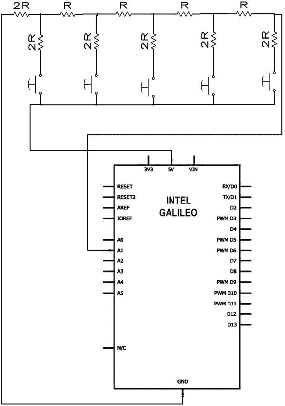

[图 9-21](#_Fig21) 。带 R-2R 梯形电阻的模拟键盘

每次按键时，不同的电压电平被施加到输入端口 A1。电阻器 R 的值是电阻器 2R 的两倍。例如，您可以选择 10K 欧姆和 20k 欧姆。

建议您尽可能使用最大精度的电阻，因此尽可能使用容差为 1%的电阻。

您需要在草图中创建一个可以读取端口 A1 的代码，测试每个键的最大和最小读数，并将它们转换为相应的事件。您可以通过实验按键并检查最大和最小读数来达到这些值。然后，根据标准电子理论，添加代码或求解每种条件下的戴维宁定理。

添加用户名和密码

该项目没有加入用户名或密码，这意味着一旦发现 IP 地址，任何人都有可能访问你的系统。

有几种方法可以实现这种保护。由于框架提供的代码的简单性和用户认证方法的多样性，我建议您阅读在`https://github.com/jaredhanson/passport`找到的 passport。

使用 DHT11 传感器

在本项目中，TMP36 传感器用于测量环境温度。但是，如果您对监控湿度感兴趣，可以使用 DHT11 传感器。有关如何使用该传感器的更多详细信息，请阅读第 4 章中的“具有快速 I/O API 的项目- DHT 传感器库”一节。

摘要

在本章中，您了解了英特尔 Galileo 如何与不同的传感器通信，包括草图与键盘的集成。

您还学习了如何使用 Linux 创建一个使用 node.js 的 web 服务器，它不同于其他基于微控制器的 Arduino 板。因此，通过使用 web 客户端，您可以控制和监控连接到英特尔 Galileo 的传感器。这使你在外出时能够控制和监控你的房子。

该项目在家庭自动化方面提供了非常基本的功能，但它是一个起点，从这里您可以扩展系统并使其更加复杂。`