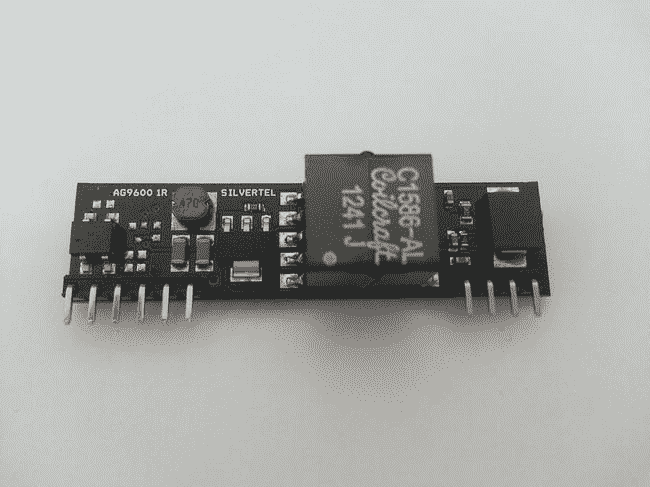
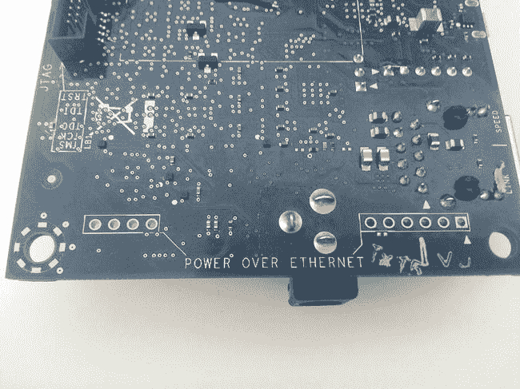
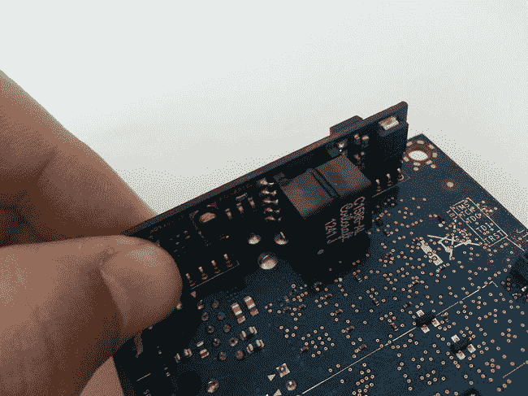
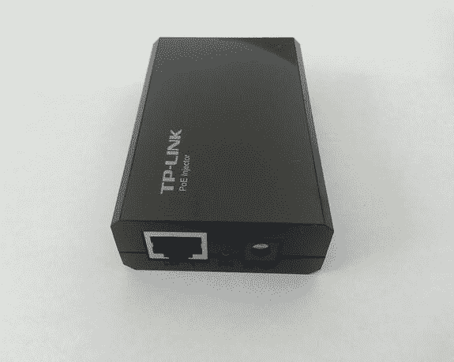
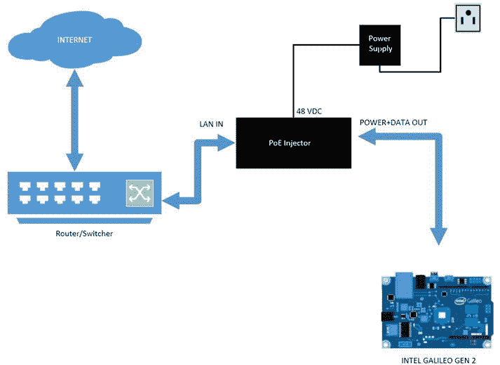
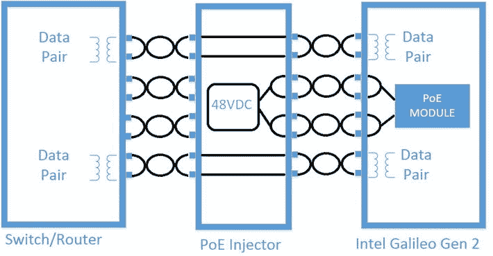
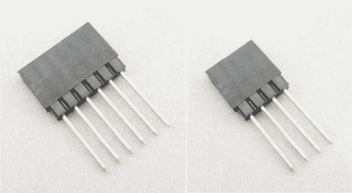

第十章

以太网供电

英特尔 Galileo 第二代主板可以通过以太网电缆供电，这意味着您不需要单独的电源。它要求您安装符合 IEEE 802.3af 的以太网供电(PoE)模块，您必须单独购买该模块。

一旦在英特尔 Galileo Gen2 上安装了 PoE 模块，您只需连接由 PoE 注入器供电的以太网电缆即可为主板供电。

根据您项目的性质，可能有必要将英特尔 Galileo 主板安装在难以接近的环境中，例如屋顶。这种接入意味着很难安装新电缆和接入电源。

在工业自动化等其他领域，这种环境下使用许多协议，包括 Profibus、ModBus 等，需要在网络上安装特定的昂贵设备。然而，普通的局域网设备价格低廉，并且提供的数据速度足以满足工业环境的需求。这为自动化控制领域提供了一种价格合理的替代方案。

要考虑的其他标准是机动性和灵活性。通过减少对电缆的担心来提供更简单的安装选择是很重要的。这个想法是连接一根电缆，为你的设备提供数据和电源。

考虑到这些限制和要求，目标是降低安装过程的复杂性，并提高您的设备在网络中的移动性。为了解决这些问题，一个名为 IEEE 802.3af 的新标准应运而生

借助 IEEE 802.3af PoE，设备可以在最低 44VDC 和 350mA 的情况下以高达 15.4W 的功率运行。然而，在现实世界中，设备可以在 36VDC 下工作。

使用这项技术的第一批设备是 IP 摄像机、VoIP 电话、WLAN 路由器和远程 POS(销售点)系统。您也可以将英特尔 Galileo Gen2 列入该名单。

本章没有专门针对软件的讨论；它专用于英特尔 Galileo Gen2 主板，因为该主板具有安装 PoE 模块的物理空间。如果您拥有第一个英特尔 Galileo 主板版本，则本章不适用。

按照本章中的说明，您的英特尔 Galileo Gen2 将使用 PoE 模块通过长达 328 英尺的以太网电缆供电，并将正常运行。

项目详细信息

为了将英特尔 Galileo Gen2 设置为能够通过以太网供电，必须安装主板不附带的 PoE 模块。不是每个人都会使用 PoE 功能，因此仅仅为了提供这一功能而增加成本是没有意义的。

您可能想知道，如果 USB 电缆提供数据和电源，为什么您必须使用 PoE 技术？答案很简单 USB 电缆是为短距离设计的。它们的最大工作距离为 16 英尺，功耗仅为 2.5 瓦，而 PoE 模块的最大工作距离可达 328 英尺。

英特尔 Galileo Gen2 并未在主板中嵌入 PoE 模块，但如果您希望将主板用于此目的，它提供了一个可以焊接 PoE 模块的区域。

为 PoE 模块预留的区域是英特尔 Galileo Gen2 比其第一版略大的因素之一。使英特尔 Galileo Gen2 更大的其他因素在第 1 章的[中有更详细的解释。](01.html)

预计成本为 38 美元，不包括英特尔 Galileo Gen2 主板的成本。

材料清单

该项目需要英特尔推荐的 PoE 模块，以及 PoE 电源注入器、以太网电缆和常用焊接材料。表 10-1 列出了你将使用的其他材料。

[表 10-1](#_Tab1) 。附加材料

<colgroup><col width="25%"> <col width="75%"></colgroup> 
| 

量

 | 

成分

 |
| --- | --- |
| one | PoE 模块符合 AG9120-S 的 IEEE 802.3af 标准 |
| one | PoE 注射器；推荐的 TP-LINK 型号 TL-POE150S |
| one | 手柄烙铁 |
| one | 带 RJ-45 连接器的以太网 CAT5 电缆 |
| 普通 | 0.6 毫米锡铅焊丝 |

PoE 注射器 TL-POE150S 配有 CAT5 以太网电缆，但它通常太短(约 3 英尺)而没有帮助。

使用 CAT5 以太网电缆非常重要，因为它们有四对铜双绞线，这是 PoE 正常工作所必需的。你需要 328 英尺长的 CAT5 电缆。

组装 PoE 模块

该项目使用的模块型号为 AG9120-S，由 Arduino 制造，可与传统的双绞线以太网电缆(CAT5)配合使用。它符合 IEEE 802.3af 标准。

该模块有一个 DC/DC 转换器，工作在 36VDC 和 57VDC 之间，支持 15W 的端口。它最初设计用于 Arduino 以太网屏蔽，但英特尔 Galileo Gen2 支持它，而不管任何额外的屏蔽。

[图 10-1](#Fig1) 显示了 AG9120-S 模块的前视图。

[图 10-1](#_Fig1) 。以太网供电模块 AG9120-S 的前视图

如果将英特尔 Galileo Gen2 主板翻转过来，您会看到一个由 10 个孔组成的网格，其中 4 个孔在左侧，另外 6 个在右侧。如[图 10-2](#Fig2) 所示，它们由“互联网供电”标签表示。

[图 10-2](#_Fig2) 。英特尔 Galileo 主板和 PoE 空间的仰视图

这些孔非常适合 PoE AG9120-S 模块。你所需要做的就是将 AG9120-S 模块放在孔上(见[图 10-3](#Fig3) )并将引脚焊接到电路板的底部(见[图 10-4](#Fig4) )。

[图 10-3](#_Fig3) 。插入 PoE 模块

[图 10-4](#_Fig4) 。要焊接到 PoE 模块的引脚的上视图

使用 PoE 注射器通电

将 PoE 模块焊接到英特尔 Galileo Gen2 后，您只需连接 PoE 注射器。

如[表 10-1](#Tab1) 所述，本项目推荐使用型号为 TL-POE150S 的 PoE 注入器 TP-LINK，如图[图 10-5](#Fig5) 所示。

[图 10-5](#_Fig5) 。PoE 注入器 TP-LINK TL-PoE 150sT3】

PoE 注射器由 48VDC 电源供电，并包含两个以太网端口，称为“局域网输入”(见[图 10-6](#Fig6) ，左)和“电源+数据输出”(见[图 10-6](#Fig6) ，右)。

[图 10-6](#_Fig6) 。局域网输入(左)和电源+数据输出(右)端口

电源+数据输出端口 将以太网电缆连接到英特尔 Galileo Gen2 主板。如果您使用的是推荐的 PoE 注射器，它配有以太网 CAT5 UTP 电缆；然而，电缆很短(约 3 英尺)，这意味着你可能需要再买一根或自己组装。在互联网上搜索如何组装这样的以太网电缆，你会找到几个教程。本章不教你如何组装自己的以太网电缆。

LAN IN 端口 是您连接接入互联网或内部网的交换机或路由器的地方。您也可以使用普通的以太网电缆进行连接。

[图 10-7](#Fig7) 显示了系统必须如何连接到英特尔 Galileo Gen2 主板。

[图 10-7](#_Fig7) 。PoE 连接方案

工作原理

[图 10-8](#Fig8) 显示了单根电缆如何提供能量。

[图 10-8](#_Fig8) 。PoE 系统如何与英特尔 Galileo Gen2 协同工作

PoE 注入器使用电缆中的两对双绞线注入 48VDC，然后传输到安装在 Intel Galileo Gen2 上的 PoE 模块。然后，由内部 DC/DC 提供的 PoE 模块将 48VDC 转换为启动英特尔 Galileo Gen2 所需的 5VDC。

其他双绞线是“数据对”，它们直接从路由器或交换机通过 PoE 注入器传递到英特尔 Galileo Gen2。

[图 10-8](#Fig8) 显示了在 PoE 注入器和 Galileo 之间使用以太网 CAT5 电缆的必要性。为了使系统完美工作，所有四个双绞线都是必要的。

这个机制非常简单，但同时也非常聪明。该系统是灵活的，它减少了安装成本和时间。

改进项目的想法

如果您不喜欢将 PoE 模块直接焊接到您的英特尔 Galileo Gen2 主板上，您可以焊接可堆叠插座。

你需要一个 1x6 接头(见[图 10-9](#Fig9) ，左)和一个 1x4 接头(见[图 10-9](#Fig9) ，右)来支撑 10 个引脚。然后你用如图[图 10-4](#Fig4) 所示的相同方法焊接它们。然而，在这里，你焊接这些可堆叠的头，而不是模块。然后，您将模块连接到堆叠式接头。

。

[图 10-9](#_Fig9) 。可堆叠插座—1x6(左)和 1x4(右)

摘要

以太网供电是一种简单但非常强大的技术，提供了本章中讨论的许多优势。幸运的是，英特尔 Galileo Gen2 为这项技术做好了准备。

不需要特殊的软件。您只需要将 PoE 模块和电容器焊接到英特尔 Galileo Gen2 上，然后将其安装到您的系统上。