# 十一、组装和控制机器人手臂

1979 年，美国机器人协会(RIA)将机器人归类为可重新编程的多功能机械手，旨在通过可变的编程运动移动材料、零件、工具和专用设备，以执行各种任务。

不包括 RIA 提到的“可重新编程”这个词，机器人的第一次介绍是在 1495 年由莱昂纳多·达芬奇和他的中世纪机器人骑士。这个机器人可以挥手、坐下、移动手臂和脖子。当然这完全是机械的。这个机器人的代表如图 11-1 所示(维基共享的一部分，在“知识共享署名/共享许可”下)。

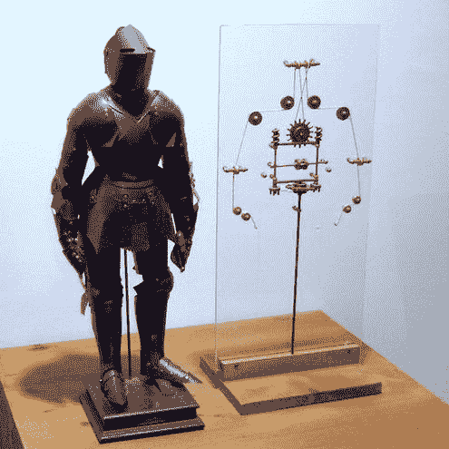

[图 11-1](#_Fig1) 。达芬奇的机器人

1920 年，捷克小说家卡雷尔·恰佩克创作了一部名为“Rosumovi univerzálníRoboti”(“Rossum 的通用机器人”)的科幻剧，其中人形机器人被创造出来为人类工作，但后来机器人决定灭绝和消灭人类。1984 年阿诺德·施瓦辛格的电影《终结者》也有类似的故事。

在本章中，你不会建造一个完整的人形机器人，但是你会学到机械臂的原理和设计工程。在这个过程中，你将学习如何建造一个简单的机械臂。

您还将构建一个可以使用廉价组件设计的六通道控制器。您可以将 arm 集成到英特尔 Galileo 主板或 Edison Arduino 套件中。

机械臂理论导论

机器人手臂具有机械结构，该机械结构使用一组电动机来改变其形式，电动机的行为类似于伺服电动机、气动或液压致动器。他们试图复制类似人类手臂的动作。

设计机械臂时使用的一个常用术语是 **DOF(自由度******)；与滚转、偏航和俯仰有关。[图 11-2](#Fig2) 显示了这些运动在三维空间中的表现。****

 **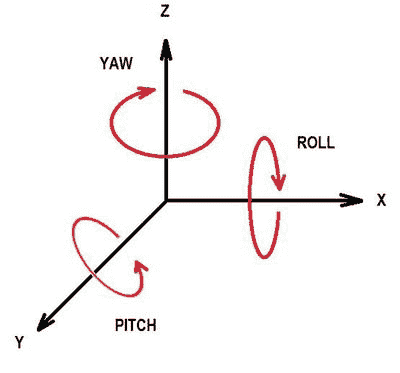

[图 11-2](#_Fig2) 。3D 空间中的滚动、俯仰和偏航运动

例如，使用你自己的手臂并跟随[图 11-2](#Fig2) ，尝试再现以下动作:

*   **肩距**
*   **滚肩**
*   **手臂偏转**
*   **弯头间距**
*   **手腕俯仰**
*   **手腕偏转**
*   **手腕转动**

你的手臂有七个自由度。单单手腕就有惊人的三自由度。

在构建机器人手臂时，有几个因素必须考虑，包括最大负载重量、每个伺服系统的失速扭矩、每个伺服系统必须支持与其在手臂中的位置相关的重量，以及构成手臂的每个框架的重量。

在[第 4 章](04.html)中，你学习了伺服电机，但没有学习失速扭矩，这是一个你必须理解的重要概念。失速扭矩有助于确定您需要在机械臂中使用哪些伺服系统。

当您订购伺服电机时，它的规格上有几个项目，包括失速扭矩。失速扭矩通常用盎司每英寸或千克每厘米来衡量。为了理解这意味着什么，考虑图 11-3 。

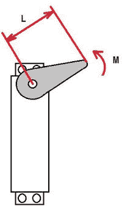

[图 11-3](#_Fig3) 。测量失速扭矩的单位

在[图 11-3](#Fig3) 中，长度用 L 表示，它是伺服轴中心到手臂末端的距离。字母 M 代表附着在臂末端的质量(重量)数量。

因此，当你读到一个伺服系统支持特定的千克/厘米或盎司/英寸的量时，这意味着如果你在 1 厘米或 1 英寸的臂上施加所提到的重量，伺服系统就会挂起。

例如，假设您有一个失速扭矩为 100 盎司/英寸的伺服系统。这意味着当你使用 1 英寸长的手臂时，如果你施加等于 100 盎司(米)的重量，伺服将会挂起。换句话说，伺服将无法旋转，或者它可能会向后旋转。

扭矩是力乘以长度，但如果你在互联网上搜索不同的伺服系统，你会发现供应商只提到质量，不包括重力加速度。当供应商提供这些数字时，要考虑的第二点是，当手臂在水平位置保持重量时，测量是最坏的情况。这将在稍后进一步解释。

根据定义，扭矩必须考虑*的垂直长度，如图 11-4 中的[所示，而不是你在伺服规格中看到的臂长。这有时会造成混乱。](#Fig4)*

 *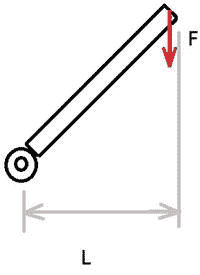

[图 11-4](#_Fig4) 。确定扭矩时的垂直长度

定义扭矩的公式可以表示如下:

```sh
*T = F × L*
T = m × g
```

所以你可以得出结论:

```sh
*T = F × L = (m × g) × L*
```

其中 T 表示扭矩，L 是垂直长度，m 是质量，g 是重力加速度。当然，在这种情况下，力(F)永远不会改变，因为质量是恒定的，并且受到相同的重力加速度。

记住这个扭矩公式，注意图 11-5 中的[最坏的情况是手臂水平伸展，因为垂直长度更大。](#Fig5)

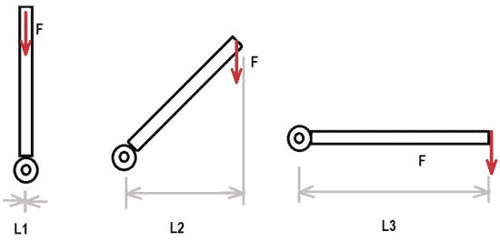

[图 11-5](#_Fig5) 。垂直长度的变化

因此，你可以说最坏的情况是:

```sh
*T = F × L3*
```

现在想象具有垂直长度和负载的臂，如图[图 11-6](#Fig6) 所示。


[图 11-6](#_Fig6) 。带权重的最坏情况垂直长度

用一个重量标识为 A，并位于伺服 L1，你可以认为(大约)手臂重量占据了 L2 的质量中心。扭矩必须考虑两个重量(A 和 F)和两个距离(L1 和 L2)。这种情况下的扭矩如下:

***T = A×L1+F×L2**
**T = A×L1+F×(L1/2)***

然而，机器人手臂是一组连接在一起形成一个手臂的伺服系统。考虑图 11-7 中的机械臂。


[图 11-7](#_Fig7) 。几个执行器

假设您需要评估伺服 A1 中的扭矩。您将拥有:


如果重量 F1 和 F2 位于质量的中心，则可以得出结论:

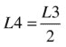


取代 L4 和 L2，您有:

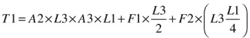

这意味着，如果你知道每个伺服系统的重量和手臂各部分的长度，就有可能评估扭矩并确定使用哪个伺服系统。在这个例子中，你只需要知道 L1，L3，以及伺服系统和手臂部分的重量。

请注意，每个伺服将有不同的扭矩，由于它的位置沿手臂。

另一个需要在计算中考虑的要点是最大载荷。例如，假设你手臂的机械手爪是执行器 A3，你知道它的重量。你只需要将货物重量加到 A3 的重量上，然后进行计算。

使用在线工具来计算你的伺服系统

网站`robotshop.com`提供了一个非常好的在线工具，帮助你计算手臂上必须使用的伺服系统。要使用该工具，请访问`http://www.robotshop.com/blog/en/robot-arm-torque-calculator-9712`并输入机械臂和伺服数据。他们使用了与本章不同的符号，其中 L 是手臂的长度，M 是你手臂每一部分的重量(公斤), A 是你的伺服系统的重量。如前所述，不要忘记将最大负载包括在夹爪伺服系统中。

该工具使用非常简单，节省了大量时间，减少了评估过程中可能出现的错误。[图 11-8](#Fig8) 显示了该工具的屏幕截图。

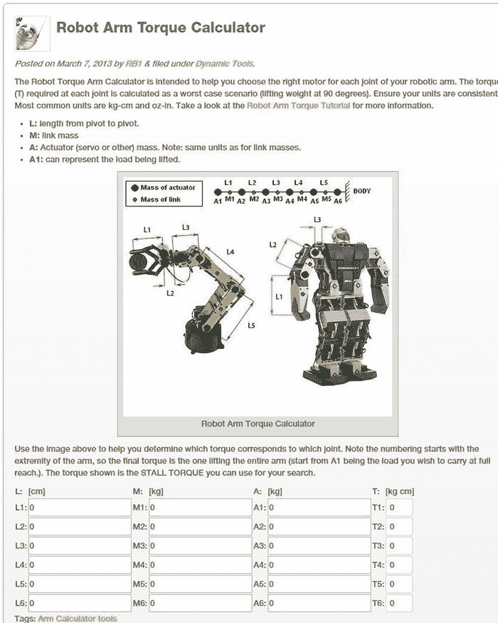

[图 11-8](#_Fig8) 。由`robotshop.com`提供的基于网络的机器人手臂计算器

关于本项目的思考

该项目推荐用于英特尔 Galileo Gen 2。使用英特尔 Galileo 或英特尔 Edison Arduino 套件应用时会出现一些问题。

如第 4 章的[所述，英特尔 Galileo 不能提供足够的 PWM 信号分辨率，因为 PWM 信号不能提供良好的分辨率。这意味着由于 PWM 缺乏精度，你手臂的运动可能看起来有点起伏不定。](04.html)

英特尔 Edison Arduino 套件也存在类似问题。它只提供两个 PWM 通道，而这个项目需要六个通道来运行机械臂。但是，如果您拥有一台带有英特尔 Edison Arduino 工具包的英特尔 Edison，您可以使用本章中使用的相同草图。除了使用 Servo API，你还可以使用 SoftwareServo API。该 API 在用户空间环境中运行，并在数字端口中模拟 PWM 信号。好的方面是，你可以使用任何数字端口来连接你的伺服系统；然而，考虑到它在用户空间上下文中运行，可能会观察到伺服中的小故障，因为具有更高优先级的进程在内核上下文中运行，这会影响用户空间的性能。

如果你决定在这个项目上使用 Intel Edison，你需要用“SoftwareServo”替换名为“Servo”的对象。所有的方法都完全一样。

该项目在英特尔 Galileo Gen 2 中顺利运行，没有出现任何问题。

机械臂

互联网网站提供了成千上万的机器人手臂套件、用木头建造自己的机器人的说明、3D 打印、废料等等。

这本书使用了低成本的手臂套件，具有良好的质量铝形式。该套件由位于加州的 elabpeers 出售。

该手臂提供五个自由度，并配有一个提供两个自由度的手爪，总共七个自由度。你可以只订购机械部件，也可以包括伺服系统。

整个套件，伺服到位，如图[图 11-9](#Fig9) 所示；人类手臂的等效部分被标记出来。

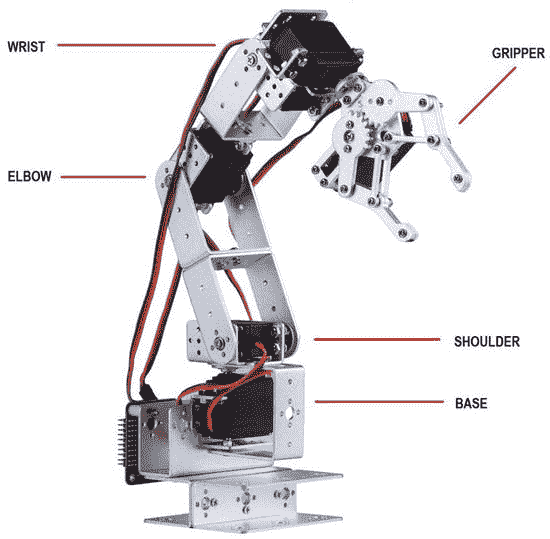

[图 11-9](#_Fig9) 。提供六个自由度的机械臂和手爪的部件

该套件包括一个臂，该臂具有:

*   四个 U 形长支架
*   用于底座的三个 U 形支架
*   一个机械夹具
*   六个金属伺服轮
*   四杯轴承
*   几个螺钉和螺母(比你需要的多)

如果您决定购买整个套件，它包括:

*   四个伺服系统 MG996R 在 4.8V 和 6V 时分别提供 9.4 千克/厘米和 12 千克/厘米的失速扭矩
*   两个伺服系统 5521 毫克，失速扭矩在 4.8V 时为 17.25 千克/厘米，在 6V 时为 20.32 千克/厘米
*   三根伺服延长线电缆
*   带有橡胶圈、喇叭和配件的伺服附件包

[图 11-10](#Fig10) 显示了整个套件及其所有组件。


[图 11-10](#_Fig10) 。六自由度机械臂套件的组件

这种配置足以让你的伺服平稳运行；然而，如果你有更好的伺服系统，你可以只订购 68 美元的带抓手的臂体。

如果你的预算允许，我建议用 HEXFLY 伺服取代 MG996R 伺服。

MG996R 或 MG995R 伺服被认为是市场上最差的。市场上有许多这种伺服系统的克隆产品与承诺的规格不符。使用这些伺服系统来工作的基础，手腕和抓手是好的，但肘部和肩膀需要更好的东西。如果手爪没有负载，这些伺服系统甚至无法处理手臂的重量。

建造该臂所需的其他部件在[表 11-1](#Tab1) 中列出。

[表 11-1](#_Tab1) 。机械臂的材料清单

| 

**数量**

 | 

**描述**

 |
| --- | --- |
| one | 带有伺服系统的机械臂套件(仅当您没有推荐的伺服系统时；否则，订购装甲套件)。 |
| four | 伺服延长线电缆。 |
| one | 一块大约 7 x 12 x 0.5 英寸(至少)的木头。 |
| one | 如果您在工作台上使用臂体，请使用 c 形夹钳。 |
| four | M6-30 毫米六角头螺钉，带螺母和平垫圈或等效物。 |
| three | 杜邦跳线电缆、公对公电缆或 1/4 瓦电线。 |
| one | 五英寸长的尖嘴钳。 |
| one | M3 和 M4 螺丝起子。 |

这块木头被用来为臂体制造一个基座。如果你要在桌子上使用这种手臂(大多数情况下)，最好使用 c 形夹将手臂固定在桌子上。你可以花 2.26 美元买到 c 形夹。

带有螺母的 1/4 x 2 英寸螺钉用于将臂体固定在一块木头上，平垫圈用于帮助臂体相对于木头的水平平衡。

 **注意**本章推荐的伺服系统与臂体协同工作。它们的速度和强度足以损坏或刮伤您的桌子或任何其他表面，甚至损坏您的英特尔 Galileo 主板、您的手或活动范围内的任何其他元件。确保您和您的英特尔 Galileo 主板远离使用伺服延伸的机械臂。使用 c 形夹钳将机械手固定在放置机械手的表面上。如果可能，用纸板、橡胶或其他材料保护你表面。

下一节解释如何组装手臂，并把伺服到位。

组装机器人手臂

如果没有错误，这个臂的装配过程需要大约两个小时。该套件有许多螺钉，分为 M3 8 毫米、M3 8 毫米平板、M3 10 毫米和 M4 10 毫米，了解每个螺钉的位置非常重要，以保证您手臂的功能。

螺钉的用法总结如下:

*   M3 10 毫米螺丝用于轴承连接伺服，将操纵手爪和手腕。
*   M4 10 毫米螺丝连接伺服与伺服支架，但如果你是使用 5521 毫克伺服，那么你需要使用 M3 10 毫米螺丝。如果您使用任何其他伺服和 M4 10 毫米是困难的，尝试 M3 10 毫米螺丝。
*   M3 8 毫米平头螺丝连接伺服轮到伺服只。
*   M3 8 毫米圆形螺钉将其余的臂部件(如短 U 形)相互连接，并将伺服系统连接到长 U 形。

[图 11-11](#Fig11) 显示了螺钉的放置位置。这将在接下来的几页中详细解释。

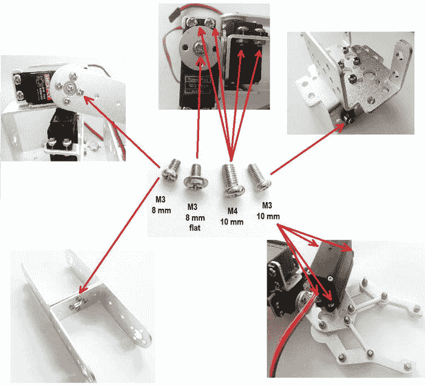

[图 11-11](#_Fig11) 。机器人臂螺钉及其放置位置

通常 elabpeers 发送的螺钉比需要的多，所以不用担心螺钉的数量。

以下部分描述了如何组装机械臂。

步骤 1:准备伺服系统

你必须首先确保所有的伺服到位准确 90 度。你需要做的就是根据图 4-2 ( [第 4 章](04.html))的[连接伺服系统。然后运行](04.html#Fig2)[清单 11-1](#list1) 中的程序。

[***清单 11-1***](#_list1) 。`prepare_servos.ino`

```sh
#include <Servo.h>

#define PIN 9

Servo prepareServo;
void setup() {

   // Attaching the servo to PIN
   prepareServo.attach(PIN);
}

void loop() {
  // moves the servo to 90 degrees
  prepareServo.write(90);
  delay(250);

}
```

草图非常简单，它定义了一个名为`prepareServo`的对象作为`Servo`类的实例，并附加到由`PIN`定义的引脚 9 上。在循环中，伺服系统移动到 90 度。关于伺服 API 的更多细节，请参考第 4 章中的[。](04.html)

使用六个伺服系统中的每一个，连接到英特尔Galileo，等待所有伺服系统移动到 90 度。这是装配这个臂体的参考角度。

将铝制伺服轮连接到除了将用于夹爪的伺服系统之外的所有伺服系统。试着使伺服轮对准 90 度，如图[图 11-12](#Fig12) 所示。

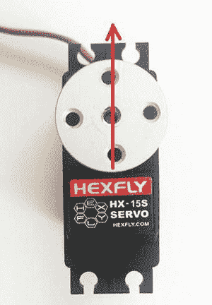

[图 11-12](#_Fig12) 。伺服轮以 90 度角放置

下一步是组装底座。

步骤 2:组装底座

如图[图 11-13](#Fig13) 所示，用四个 M3 8 毫米螺丝和各自的螺母连接两个 U 型底座。


[图 11-13](#_Fig13) 。连接两个 U 形作为底座

如图[图 11-14](#Fig14) 所示，固定垂直于另外两个 U 形的第三个 U 形。使用 M3 螺钉和螺母进行此操作。


[图 11-14](#_Fig14) 。连接第三 U 形以形成底座

找到一个轴承和一个 M3 10 毫米螺丝。然后将螺钉插入轴承，如图[图 11-15](#Fig15) 所示。


[图 11-15](#_Fig15) 。轴承(左)；M3 10 毫米插入轴承(右)

使用伺服支架形状，连接由螺钉支撑的轴承并用合适的螺母固定，如图[图 11-16](#Fig16) 所示。


[图 11-16](#_Fig16) 。M3 10 毫米插入轴承

接下来，使用 M3 8 毫米螺丝和螺母将带有轴承的伺服支架连接到底座上。参见[图 11-17](#Fig17)


[图 11-17](#_Fig17) 。伺服支架用轴承连接到底座上

下一步是设置伺服电机和长 U 形。长 U 形将连接到轴承和伺服轮。你需要如图[图 11-18](#Fig18) (左)所示的零件来完成这个步骤。长 U 形必须连接的方式如图[图 11-18](#Fig18) (右图)所示。该图只是说明性的，因此您可以看到连接是如何进行的；必须首先修复伺服系统。


[图 11-18](#_Fig18) 。长 U 形和伺服(左)和连接示例(右)

使用 M4 8 毫米螺丝连接伺服系统，并通过首先将 U 形放置在轴承中来连接 U 形。将其推到伺服轮顶部，如图[图 11-19](#Fig19) 所示。

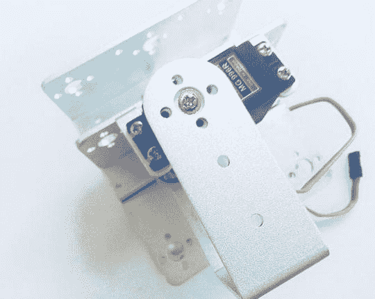

[图 11-19](#_Fig19) 。将长 U 形连接到基础伺服系统

使用轮中心的 M3 8 毫米平头螺丝将伺服轮连接到伺服机构上。你的基地应该准备好了。

如图[图 11-16](#Fig16) 所示，用相应的螺钉连接新轴承，组装另一个伺服支架。[图 11-20](#Fig20) 显示了被连接的元件。确保螺丝没有松动。


[图 11-20](#_Fig20) 。已安装底座，正在进行最终调整

下一步是组装肩部。

步骤 3:组装胎肩

组装肩部需要两个相对的长 U 形，如图[图 1-21](01.html#Fig21) (左图)所示。使用 M3 8 毫米螺丝和螺母放置如图[图 11-21](#Fig21) (右)所示的两个形状。


[图 11-21](#_Fig21) 。两个长 U 形(左)和带螺钉的臂(右)

将您选择作为肩部的伺服连接到图 11-20 中[所示的伺服支架上。使用 M4 螺钉，用 M3 8mm 螺钉和螺母放置两个长型，如图](#Fig20)[图 11-22](#Fig22) 所示。

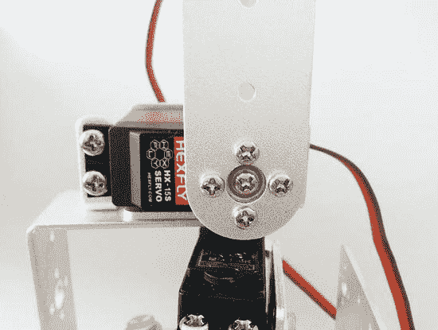

[图 11-22](#_Fig22) 。连接肩部伺服机构和 U 形件

如果放置正确，肩部伺服系统和手臂看起来类似于[图 11-23](#Fig23) 。


[图 11-23](#_Fig23) 。将肩部伺服连接到手臂

下一步是组装弯头。

步骤 4:组装弯头

首先，你需要一个伺服支架、一个长 U 形、一个 L 形、一个轴承、一个 M3 10 毫米和四个 M3 8 毫米螺丝和螺母，如图[图 11-24](#Fig24) 所示。


[图 11-24](#_Fig24) 。为俯仰运动准备腕部伺服

使用 M3 10 毫米螺丝和右螺母放置轴承，然后使用 M3 8 毫米螺丝和螺母连接 L 形，如图[图 11-25](#Fig25) 所示。


[图 11-25](#_Fig25) 。将轴承和 L 形件连接到伺服支架

然后将长 U 形连接到 L 形上，如图[图 11-26](#Fig26) 所示。


[图 11-26](#_Fig26) 。连接到 L 形的长 U 形

接下来，使用 M4 螺钉和螺母连接指定为弯头的伺服机构，如图[图 11-27](#Fig27) 所示。


[图 11-27](#_Fig27) 。连接肘部伺服系统

最后，将肘部连接到您在步骤 3 中组装的手臂。用 M3 8mm 螺丝固定伺服机构，如图[图 11-28](#Fig28) 所示。

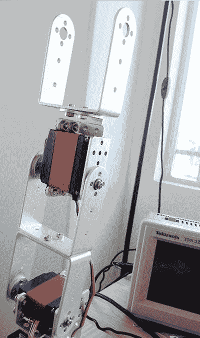

[图 11-28](#_Fig28) 。肘部与手臂相连

下一步是组装手腕。

第五步:组装手腕

手腕有两种运动——俯仰和旋转——它们需要两个伺服系统，因此需要两个伺服支架，如图[图 11-29](#Fig29) (左)所示。组装手腕，你还需要一个轴承连接使用 M3 10 毫米螺丝和螺母。使用四个 M3 8 毫米螺母放置两个伺服支架，如图[图 11-29](#Fig29) (右)所示。


[图 11-29](#_Fig29) 。两个伺服支架(左)以及如何连接它们(右)

然后使用 M4 10 毫米螺丝和螺母连接下方支架中的一个伺服系统。用 M3 8 毫米螺丝将伺服轮固定在弯头上，如图[图 11-30](#Fig30) (左)所示。最后加入第二个伺服机构，用 M4 10mm 螺丝螺母固定在上支架上，如图[图 11-30](#Fig30) (右图)所示。


[图 11-30](#_Fig30) 。下腕伺服(左)和上腕伺服(右)

现在让我们来组装夹子。

步骤 6:组装机械抓具

夹持器包含一个非常简单的运动——它打开和关闭——所以只需要一个伺服系统。然而，组装过程非常费力。首先，你必须使用两个简单的 M3 8 毫米螺丝将手爪连接到手腕上，如图[图 11-31](#Fig31) 所示。


[图 11-31](#_Fig31) 。连接到手腕的抓手

然后，使用伺服附件包，拾取如图[图 11-32](#Fig32) (左)所示的四个橡胶圈，并将它们放置在伺服机构的孔中，如图[图 11-32](#Fig32) (右)所示。请注意，这次您没有将伺服轮连接到伺服系统。


[图 11-32](#_Fig32) 。橡胶圈(左)放置在伺服系统(右)中

如图[图 11-33](#Fig33) 所示，使用 M4 螺丝将伺服添加到夹具的底部。

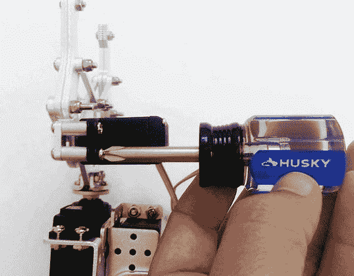

[图 11-33](#_Fig33) 。将伺服添加到夹爪

用两个 M3 8 毫米螺丝将一个伺服轮固定在叼纸牙齿轮的底部，如图[图 11-34](#Fig34) (左)所示，如图[图 11-34](#Fig34) (右)所示。

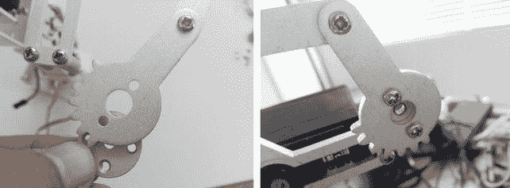

[图 11-34](#_Fig34) 。放置伺服轮(左)并将其固定到夹爪上(右)

最后，通过相互连接来调整叼纸牙齿轮。保持手爪打开约 0.8 英寸(2 厘米)，并使用 M3 8 毫米平头螺丝将其放在伺服中心。[图 11-35](#Fig35) 显示了最终的夹具。

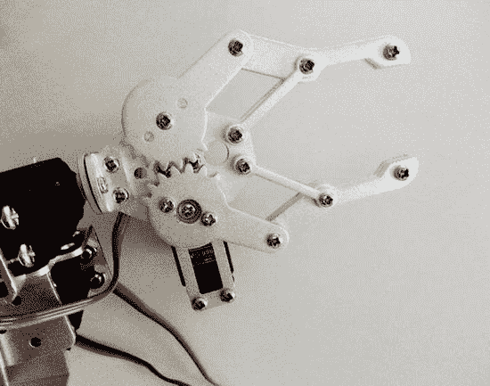

[图 11-35](#_Fig35) 。最终夹具组件

此时，机械臂已准备就绪。现在，您需要创建一个基础来支撑手臂。该过程在步骤 7 中解释。

第七步:组装底座

你需要将机器人手臂放在一个由木头、丙烯酸、聚碳酸酯、金属或任何可用材料制成的底座上。这个项目使用了一小块木头。使用钢笔或铅笔，在机器人臂的铝制底座上标记外部孔的中心，并使用 1/4 钻头钻孔。最好使用比钻头稍大一点的铲子；比如一个，如图[图 11-36](#Fig36) (左图)。铲形钻头的作用是避免固定机械臂的碰撞引起的任何反弹，如图[图 11-36](#Fig36) (右图)所示。

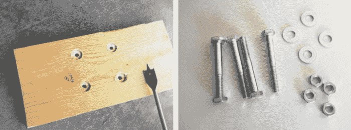

[图 11-36](#_Fig36) 。木制底座(左)和五金件(右)的底部

对于你必须使用的螺钉、螺母或垫圈的类型没有要求，所以如果你有可以支撑机械臂的备用螺钉，使用你现有的就可以了。本项目使用了 M6-30 毫米六角头螺钉和相应的螺母和垫圈。

如图[图 11-37](#Fig37) 所示，插入螺钉，将臂座连接到木座上。确保螺丝没有弹起底座；如果是，你需要用一个小一点的螺丝，加一些垫圈，或者切掉你的螺丝。

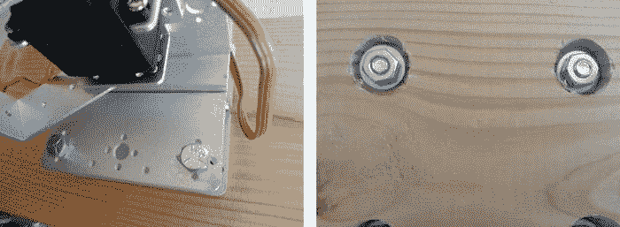

[图 11-37](#_Fig37) 。带螺钉的底座俯视图(左)；带螺母的仰视图(右)

[图 11-38](#Fig38) 显示了木制底座中的机械臂。

如果你的底座很小，机械臂可能会在移动过程中或当抓具抓着东西时掉落。为了解决这个问题，我用 c 形夹将底座固定在我的桌子上，如图[图 11-38](#Fig38) (右图)所示。请注意，我不得不使用铲位来移除一点木头。这为 c 形夹钳创造了一个完美的插座，基本上穿透了木材，形成了一个完美的连接。


[图 11-38](#_Fig38) 。木制底座中的臂(左)和固定底座的 c 形夹钳(右)

你现在只需要控制手臂，这将在下一节解释。

控制机械臂

此时，你的机械臂就可以被控制了。要做到这一点，你必须能够控制六个伺服系统。英特尔 Galileo Gen 2 主板在用波浪符号(~)标识的引脚中正好包含六个 PWM 端口，如第 3 章、[图 3-10](03.html#Fig10) 中的[所述。因此，有足够的 PWM 端口来控制机械臂。编写简单的软件来使机械臂执行预编程的动作是可能的，但该项目不会那么有趣。](03.html)

考虑以下相关方面:

*   **电源** **电源** **:** 在我的测试中，我发现在 5V 电压下，对于 100 克的负载，伺服系统可以消耗高达 2.2A 的电流。这意味着英特尔 Galileo 主板和 Edison Arduino 工具包主板不提供保证所有伺服功能的电流(源),因为限制为 80mA。
*   **伺服系统** **控制** **:** 伺服系统必须以某种方式控制。你应该至少有五个电位计和一个简单的按钮来打开和关闭夹子。如果你使用操纵杆或拇指操纵杆，每个轴(x 和 y)可以控制两个伺服通道，所以三个就足以控制整个手臂。
*   ****导线数量** **:** 每个伺服需要三根导线。包括接地、电源和脉冲。考虑到臂上有六个伺服系统，导线数量达到 18 根。除此之外，有必要添加电线扩展器，以保证机械臂距离英特尔 Galileo 或英特尔 Edison 足够远，并避免损坏您的主板。考虑到您不能使用英特尔Galileo或爱迪生板为伺服系统供电，如前所述，您还需要考虑更多与外部电源相关的电缆。如果你有一个电位计或操纵杆或拇指操纵杆来控制机械臂，你至少需要 15 根电线。所有这些电线会导致相当大的混乱。**

 **我决定在通用焊接板上建立一个六通道伺服控制器集，以组织我所有的电缆。我放置了拇指棒和连接器，以接收外部电源和指定给拇指棒的来自英特尔 Galileo 或英特尔 Edison 板的 5V 电压。大约 30 美元。

为了在两种不同的模式下使用拇指棒，创建了一个特定的 API。这将在后续章节中进一步解释。

搭建伺服控制板

为了构建伺服系统的控制板，您可以创建一个非常简单的控制板控件，然后创建一个新的 API，如下一节所述。

硬件

伺服板控制是一个非常简单的设计，但它可以使用三个拇指控制六个伺服。

[表 11-2](#Tab2) 列出了建造该板所需的材料。

[表 11-2](#_Tab2) 。伺服板控制器的材料清单

| 

数字

 | 

描述

 |
| --- | --- |
| three | 来自`dealxtream.com`的拇指操纵杆 SKU 121340 或等效物 |
| three | 1K 欧姆 1/4W 电阻 |
| one | 单面原型板，6x3 英寸(通用板) |
| one | 三极接线板 |
| one | 470uF 电解电容器 |
| one | 二极管 5404(或三个 1N4007 或 1N4004 二极管) |
| Two | 40 个 2.54 毫米单排插头 |
| six | 伺服延长电缆 |
| one | 电源 5 或 6 伏直流电，3A(最低) |
| Twelve | 带螺母的 M3 0.5 x 10 毫米螺钉 |
| Thirty-seven | 杜邦公母电缆 |
| five | 带螺钉的六角或圆形 M3 尼龙垫片(支座) |
| one | 含铅烙铁 |
| 一些 | AWG23 0.5mm2 或至少有两种不同颜色的试验板电缆(3 0 英寸就足够了) |
| 一些 | 至少有两种不同颜色的 18 AWG 1.5mm2 电缆(11 英寸就足够了) |

理解构成该板的元件很重要，它们将在下一节中解释。

拇指棒

材料清单中构成伺服控制板的主要部件是拇指操纵杆。

拇指操纵杆是一种模拟操纵杆，通过两个与操纵杆中心位置相关的内部电位计提供模拟变化。每个电位计指的是一个轴，所以两个电位计给你 x 和 y 参考。与 80 年代的老款操纵杆相比，这种操纵杆在移动方面更加精确，比如 Atari 控制台系统上使用的操纵杆，只需简单地接触右、左、上、下。拇指操纵杆用于像 PlayStation 和 Xbox 系统中的操纵杆控制。他们提供可以转化为强度和运动方向的模拟读数。如果您按下拇指操纵杆塔向下，为本项目选择的拇指操纵杆具有按钮功能。

与英特尔 Galileo 或 Edison 的接口非常简单，使用模拟头来读取相应的运动，并使用数字端口来检测按钮是否被按下。当您移动拇指操纵杆时，相应电位计的值会发生变化，英特尔 Galileo 或 Edison 上的 ADC 会读取每个电位计的电压，并将其转换为数字电压。可以识别拇指操纵杆移动的方向和力度。

市场上有不同的拇指棒，包括 SainSmart、Arrela、Paralax、Xima 和许多其他不同价格的拇指棒。

为这个项目选择的拇指棒非常坚固，非常实惠，当你在`dealxtream`订购三个时，每个仅花费 2.78 美元(见`http://www.dx.com/s/121340`)。

[图 11-39](#Fig39) (左)为拇指棒及其端子的图片，[图 11-39](#Fig39) (右)为其原理图。

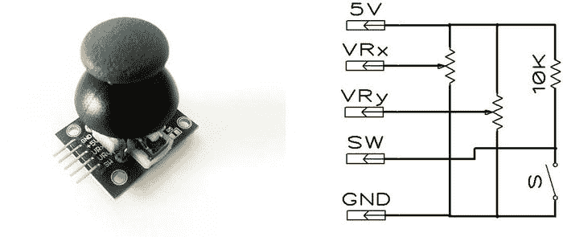

[图 11-39](#_Fig39) 。拇指操纵杆(左)及其示意图(右)

这个拇指棒上有五个端子——5V、GND、SW(向下推塔时的按钮点击)、VRx(x 轴上的变体)和 VRy(y 轴上的变体)。

那么这个拇指棒的唯一问题是需要一个 10kω的上拉电阻来启用按钮功能。必须手工焊接，如图[图 11-40](#Fig40) 所示，因为这个电阻不是原棒的一部分。其他一些供应商，如 SainSmart，不需要这项工作，但价格更高。


[图 11-40](#_Fig40) 。将 10kω上拉电阻添加到拇指操纵杆

该项目与任何拇指棒，你可以自由选择你最喜欢的。

拇指棒由 5V 电源和英特尔主板提供的 GND 接头供电。这将它们与任何可能来自伺服系统的噪声源隔离开来，即使它被二极管过滤，也能减少 ADC 中的错误读数。

当有一个拇指棒时，系统非常简单，互联网上可用的 API 可以处理它。然而，当有多个传感器时，情况就有点复杂了，因为每次你移动一个传感器，也可能会影响另一个传感器的读数。这是因为棒共享相同的 5V，所以即使移动单个棒，每个拇指棒的阻抗也会受到影响。[图 11-41](#Fig41) 显示了三个拇指棒共用同一电源线和地线的电路；假设您向左移动第一个拇指操纵杆，从而改变读数 VRx1。所有其他 VRxs 读数将受到影响，因为每个 VRxs 和 VRys 的等效阻抗也会发生变化，并可能导致机器人的“幻影”运动。

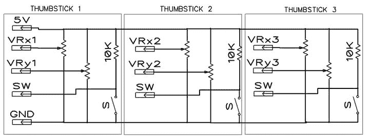

[图 11-41](#_Fig41) 。三个拇指棒共用 5V 电压形成的电路

为了解决这个问题，你需要将拇指棒分开，而不是像图 11-42 中所建议的那样使用一个 5V 的电源。在这种情况下，我们的想法是利用英特尔 Galileo 或 Edison 接头上的数字引脚为拇指棒提供多路复用条目 TS1、TS2 和 TS3 的电源。因此，软件通过用 5V 短暂地给拇指操纵杆加电来将 TS1 变为高状态，读取 VRx1、VRy1 和 SW 引脚，然后通过禁用拇指操纵杆再次将 TS1 变为低状态。对拇指操纵杆 2、拇指操纵杆 3 重复此过程，然后再次返回拇指操纵杆 1。这个过程非常快，你将能够同时使用所有的拇指棒，而没有任何干扰或手臂的“幽灵”运动。它是使用数字头的 mux 的简单思想的实现。

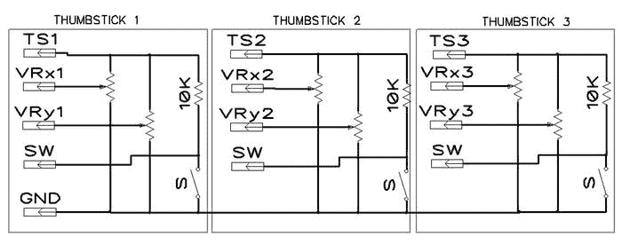

[图 11-42](#_Fig42) 。三个独立拇指棒组成的电路

接下来的讨论解释了与外部电源相关的问题。

外部电源

与英特尔 Galileo 或英特尔 Edison 主板的常规接头提供的 80mA 电流相比，本项目中使用的伺服系统可以消耗大量电流，因为它们可以消耗高达 2.2A 的电流。

因此，必须包括 5V 或 6V 和 3A 的外部电源。

请注意，拇指棒也使用 5V，但电流非常低，并通过模拟端口读取。因此，为了避免外部电源对这些拇指棒读数的干扰，设计选择了英特尔 Galileo 或英特尔 Edison 板提供的 5V 电压。

还要确保外部电源线过滤掉任何可能来自伺服电机的噪音。测试期间 470uF 就足够了。

电路保护

考虑到使用的是容量为 3A 的 5 VDC，如果极性颠倒，保护电路以避免灾难性结果是一个好主意。

为此，一个简单的二极管保护外部电源线是最好的。1N5404 最高支持 3A 电流。如果你没有一个 5404 二极管，但是你有一个 1N4004 或 1N4007，你可以用三个并联的二极管代替 1N5404，因为每个二极管最多支持 1A，如图[图 11-43](#Fig43) 所示。


[图 11-43](#_Fig43) 。用三个 1N4004 或 1N4007 二极管替换 5404 二极管

组装电路板

基于这里讨论的考虑，电路板图的一个简单想法如图[图 11-44](#Fig44) 所示。

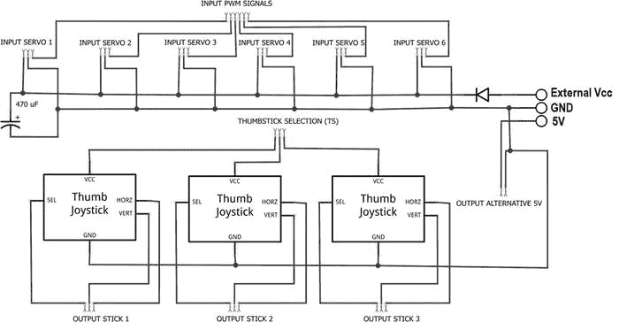

[图 11-44](#_Fig44) 。伺服板控制器图

输出杆端子必须连接到模拟接头(A0 至 A5 ),每个杆的按钮必须连接到数字接头。

THUMBSTICK SELECTION (TS)必须连接到英特尔 Galileo 或 Edison 数字接头，这些接头将多路复用 THUMBSTICK，以避免前面提到的阻抗问题。

输入 PWM 信号是由 Intel Galileo 或 Edison 上的 PWM 头驱动的 PWM 信号，而输入伺服终端直接连接伺服。

输出替代 5V 可用于连接外部外设。本章将在您稍后学习研磨咖啡夹持器时使用该终端。

最后，还有一个三极端子板，用于接收外部电源、地和英特尔 Galileo 或 Edison 提供的 5V 电压。

要了解伺服板控制器如何工作，还必须了解该板如何连接到外部外设，换句话说，它如何与伺服板以及英特尔 Galileo 或 Edison 连接。图 11-45 显示了这样的连接。

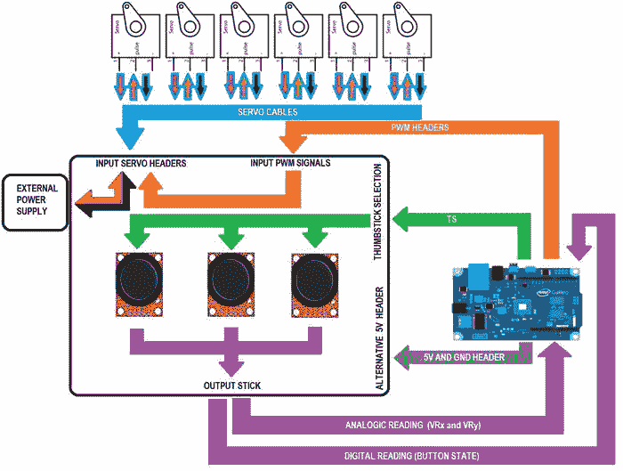

[图 11-45](#_Fig45) 。伺服板控制器如何连接到外围设备

您可以在原型板上排列元件，如图[图 11-46](#Fig46) (俯视图)和[图 11-47](#Fig47) (仰视图)所示。


[图 11-46](#_Fig46) 。伺服板控制的俯视图

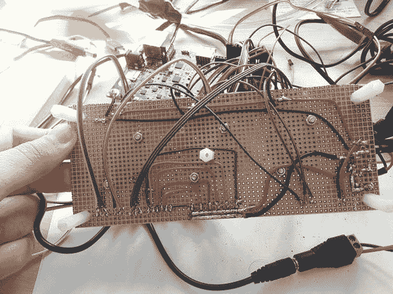

[图 11-47](#_Fig47) 。伺服板控制的仰视图

在开始构建电路板之前，请考虑以下次要的机械建议:

*   原型板在材料列表中指定为 6x3 英寸。如果您使用小电路板(即使拇指棒适合)，请确保控制器有空间，并且当您移动塔时拇指棒不会相互碰撞。这就是为什么每个拇指棒之间应该有至少 1.2 英寸的间隙。
*   注意图 11-47 中使用了五个支座，四个在边缘，一个在中心。之所以放在中间，是因为你把这块板当作控制器使用，你可以把你的手放在板上。考虑到你手的重量，中间的支架可以防止板子弯曲。`digikey.com`销售不同类型的支架；尼龙的每个才 0.23 美元左右。
*   排列端子时要明智，避免电线穿过电路板。这可能会影响拇指操纵杆的可用性。

现在您的硬件已经准备好进行测试，您必须创建软件并将其集成到一个草图中，如下一节所述。

软件

一些 API 已经提供了互联网上可用的拇指棒。然而，这种拇指棒也有一些挑战:

*   有不止一个简单的拇指操纵杆需要控制。
*   拇指操纵杆必须校准。
*   代码应该控制机械臂中每个组件的伺服极限。
*   考虑到有六个伺服控制，控制必须容易为用户。

第一个挑战在“硬件”一节中进行了解释，该节讨论了用作多路复用器的数字头，以一次选择一个拇指操纵杆。这在软件方面很容易实现，因为每次调用读取拇指棒状态的函数时，您只需向相应的棒提供 5V 电压，读取状态，然后禁用拇指棒。

第二个挑战是校准拇指操纵杆。不能保证收到的所有拇指操纵杆都具有相同的阻抗和相同的对中心位置的机械调整。因此，有必要通过识别中心位置和边界的值来使软件理解每个拇指操纵杆。这确保了正确的转换。

第三个挑战与软件如何对每个拇指操纵杆进行编程有关，以便它遵守每个伺服系统必须支持的机械限制。例如，对于控制夹持器在 0 到 180 度之间旋转的伺服来说，这是没有意义的，因为夹持器是通过将伺服限制在 70 到 130 度的开口来操作的。另一方面，底座中的伺服系统可以在 0 到 180 度之间工作，没有问题。

最后一个挑战是伺服系统必须易于控制，这将在本节中进一步讨论。

下一步是展示 API 并测试它。

用于伺服板控制的 API

API 提供了一个简单的接口，允许您通过检索与拇指操纵杆控制的伺服系统的角度限制相关的值来读取每个拇指操纵杆的状态。

每个拇指操纵杆可以控制两个伺服系统，一个在 x 轴，另一个在 y 轴。

因此，API 必须将 x 轴和 y 轴上的模拟读数转换为您指定的限值。

除了限制控制之外，还需要确定模拟接头(VRx 和 VRy)和按钮引脚如何连接到英特尔 Galileo 或 Edison，并确定哪个数字接头将选择拇指操纵杆(TS)。

以两种不同的模式操作拇指操纵杆也很有趣:

*   **绝对位置:**伺服系统将跟随拇指操纵杆的运动。因此，如果您释放拇指操纵杆，伺服将移动到其初始位置，因为拇指操纵杆会自动移动到中心位置。你需要一直握着操纵杆来移动伺服系统，伺服系统也会跟着做同样的动作。
*   **接触:**伺服系统并不跟随操纵杆，而是沿着拇指操纵杆指向的方向移动。

清单 11-2 显示了 API 的头文件以及实现这些功能所必需的方法。

[***清单 11-2***](#_list2) 。`Thumbstick.h`

```sh
/*
    This file is part of Thumstick API.

    Thumstick API is free software: you can redistribute it and/or modify
    it under the terms of the GNU General Public License as published by
    the Free Software Foundation, either version 3 of the License, or
    (at your option) any later version.

    Thumstick API is distributed in the hope that it will be useful,
    but WITHOUT ANY WARRANTY; without even the implied warranty of
    MERCHANTABILITY or FITNESS FOR A PARTICULAR PURPOSE.  See the
    GNU General Public License for more details.

    You should have received a copy of the GNU General Public License
    along with Foobar.  If not, see <http://www.gnu.org/licenses/>.

    by Manoel Carlos Ramon (manoel.ramon@gm ail.com)
    Nov 2014
    version 1.0
*/
#ifndef _THUMBSTICK_API
#define _THUMBSTICK_API
#include <Arduino.h>

#define NOT_CALIBRATED    22
#define MAX_FLOATING      10
#define STEP_X            5
#define STEP_Y            5
#define NUMBER_OF_SAMPLES 25

#define DEBUG 1

class Thumbstick {

  private:

  int stick_step = 100;

  int lastButtonState = HIGH;
  long lastDebounceTime = 0;   // the last time the output pin was toggled
  long debounceDelay = 400;    // adjust this value if necessary to avoid flickering

  int X_max = NOT_CALIBRATED;  // max X retrieved during calibration
  int Y_max = NOT_CALIBRATED;  // max Y retrieved during calibration
  int X_min = NOT_CALIBRATED;  // min X retrieved during calibration
  int Y_min = NOT_CALIBRATED;  // min Y retrieved during calibration
  int centerX = 0;
  int centerY = 0;

  int pinAnalogX;
  int pinAnalogY;
  int pinButton;
  int pin_select;

  bool centerCalibrated = false; // informs if the center was calibrated

  // 0 and 180 are the default angles values
  int servoX_MinAngle = 0;    // the minimum angle supported by servo attached to axis X
  int servoX_MaxAngle = 180;  // the maximum angle supported by servo attached to axis X

  int servoY_MinAngle = 0;    // the minimum angle supported by servo attached to axis Y
  int servoY_MaxAngle = 180;  // the maximum angle supported by servo attached to axis Y

  // number of samples to estabelish the center during the calibration
  int samplesOfrCenterXCounter = NUMBER_OF_SAMPLES, samplesOfrCenterYCounter = NUMBER_OF_SAMPLES;
  int lastAngleX = -1, lastAngleY = -1;

  // checks the button state considering the debounce
  int checkButtonState();

  public:

  enum {
     ANALOG_RAW,          // Only brings the raw values... for testing only
     ABSOLUTE_POSITION,   // The servos will move according joystick position
     STEPS_IN_TOUCH,       // The servos moves increases and decreases its angles
     INVALID_MOVE         // Just to mark the invalid boundaries
  } typedef MOVE_T;

  MOVE_T move_type = ANALOG_RAW;  // initial mode

  struct {
    int X;                // the current X angle
    int Y;                // the current Y angle
    int buttonPressed;    // True if thumbstick button is pressed
  } typedef JOYSTICK_XY_T;

  int  Xvalue;            // current X value read from analog port
  int  Yvalue;            // current Y value read from analog port
  int  Zvalue;            // current button state

  // Contructor
  //  _pin_select : which digital pin that selects the thumbstick during the multiplexation
  //  pinX        : which analog port reads the variation of X axis
  //  pinY        : which analog port reads the variation of Y axis
  //  _pinButton  : which digital pin reads the button state
  //  minX        : the minimum servo angle on axis X (default is 0)
  //  maxX        : the maximum servo angle on axis X (default is 180)
  //  minY        : the minimum servo angle on axis Y (default is 0)
  //  maxY        : the maximum servo angle on axis Y (default is 180)

  Thumbstick(int _pin_select, int pinX, int pinY, int _pinButton, int minX = 0, int maxX = 180, int minY = 0, int maxY = 180);

  // Destructor
  ~Thumbstick();

  // init the pin mode (must be in setup() function)
  void initPins();

  // Performs the calibration
  void calibrate();

  // checks if the thumbstick was calibrated
  // Returns: TRUE if calibrated or FALSE if it is not.
  bool isCalibrated();

  // only for debug purposes
  void dumpCalibration();

  // informs if center was calibrated
  bool isCenterCalibrated() { return centerCalibrated; };

  // reads the current status of thumbstick
  // Parameter:
  //      MOVE_T format - the mode of reading
  // Returns:
  //      JOYSTICK_XY_T - the coordinates and button state
  JOYSTICK_XY_T read(MOVE_T format);
};
#endif
```

每个方法的实现如[清单 11-3](#list3) 所示。

[***清单 11-3***](#_list3) 。`Thumbstick.cpp`

```sh

/*
    This file is part of Thumstick API.

    Thumstick API is free software: you can redistribute it and/or modify
    it under the terms of the GNU General Public License as published by
    the Free Software Foundation, either version 3 of the License, or
    (at your option) any later version.

    Thumstick API is distributed in the hope that it will be useful,
    but WITHOUT ANY WARRANTY; without even the implied warranty of
    MERCHANTABILITY or FITNESS FOR A PARTICULAR PURPOSE.  See the
    GNU General Public License for more details.

    You should have received a copy of the GNU General Public License
    along with Foobar.  If not, see <http://www.gnu.org/licenses/>.

    by Manoel Carlos Ramon (manoel.ramon@gmail.com)
    Nov 2014
    version 1.0
*/

#include "Thumbstick.h"

  // Contructor
  //  _pin_select : which digital pin that selects the thumbstick during the multiplexation
  //  pinX        : which analog port reads the variation of X axis
  //  pinY        : which analog port reads the variation of Y axis
  //  _pinButton  : which digital pin reads the button state
  //  minX        : the minimum servo angle on axis X (default is 0)
  //  maxX        : the maximum servo angle on axis X (default is 180)
  //  minY        : the minimum servo angle on axis Y (default is 0)
  //  maxY        : the maximum servo angle on axis Y (default is 180)

  Thumbstick::Thumbstick(int _pin_select, int pinX, int pinY, int _pinButton, int minX, int maxX, int minY, int maxY)
  {
      pinAnalogX = pinX;
      pinAnalogY = pinY;
      pinButton  = _pinButton;
      pin_select = _pin_select;

      servoX_MinAngle = minX;
      servoX_MaxAngle = maxX;
      servoY_MinAngle = minY;
      servoY_MaxAngle = maxY;

  }

  // Destructor
  Thumbstick::~Thumbstick()
  {
  }

  // init the pin mode (must be in setup() function)
  void Thumbstick::initPins()
  {
      pinMode(pinButton, INPUT);
      pinMode(pin_select, OUTPUT);

  }

  // Performs the calibration
  void Thumbstick::calibrate()
  {
       JOYSTICK_XY_T res = this->read(ANALOG_RAW);

       // the following logic tries to find the maximum and minimum
       // values for all axis. Such values will be used to identify
       // the limits of your thumbstick.
       if (res.X < X_min)
       {
            X_min = res.X;
       }

       if (res.X > X_max)
       {
            X_max = res.X;
       }

       if (res.Y < Y_min)
       {
            Y_min = res.Y;
       }

       if (res.Y > Y_max)
       {
            Y_max = res.Y;
       }

       // the center of each thumbstick must be found
       // considering the center is the first thing that calibration process search for
       // then some samples must be aquire until ADC turn stable.
       if ((centerX == 0) && (--samplesOfrCenterXCounter ==0))
       {

           centerX = res.X;
           Serial.print("centerX:");
           Serial.println(centerX);
       }

       if ((centerY == 0) && (--samplesOfrCenterYCounter == 0))
       {
           centerY = res.Y;
           Serial.print("centerY:");
           Serial.println(centerY);
       }

       // just to inform the centers were got
       if ((centerX !=0) && (centerY !=0))
       {
                centerCalibrated = true;
       }

       if ((lastAngleX == -1) && (centerX != 0) && (X_min != NOT_CALIBRATED) && (X_max != NOT_CALIBRATED) && (Y_max != NOT_CALIBRATED) && (Y_min != NOT_CALIBRATED))
       {
            lastAngleX =  constrain(map(centerX , X_min , X_max , servoX_MinAngle, servoX_MaxAngle), servoX_MinAngle, servoX_MaxAngle);
            lastAngleY =  constrain(map(centerY , Y_min , Y_max , servoY_MinAngle, servoY_MaxAngle), servoY_MinAngle, servoY_MaxAngle);
       }

  }

  // checks if the thumbstick was calibrated
  // Returns: TRUE if calibrated or FALSE if it is not.
  bool Thumbstick::isCalibrated()
  {
      bool result = false;
      if ((X_min != NOT_CALIBRATED) && (X_max != NOT_CALIBRATED) &&
          (Y_min != NOT_CALIBRATED) && (Y_max != NOT_CALIBRATED)) {
             result = true;
      }

     return result;
  }

  // only for debug purposes
  void Thumbstick::dumpCalibration()
  {
    if (DEBUG)
    {
        Serial.print("Xmax:");
        Serial.print(X_max);

        Serial.print("  Xmin:");
        Serial.print(X_min);

        Serial.print("  Ymax:");
        Serial.print(Y_max);

        Serial.print("  Ymin:");
        Serial.print(Y_min);

        Serial.print("  centerX:");
        Serial.print(centerX);

        Serial.print("  Angle centerX:");
        Serial.print(lastAngleX);

        Serial.print("  centerY:");
        Serial.print(centerY);

        Serial.print("  Angle centerY:");
        Serial.println(lastAngleY);
    }

  }

  // checks the button state considering the debounce
  int Thumbstick::checkButtonState()
  {

    // read the state of the switch into a local variable:
    int reading = digitalRead(this->pinButton);

     // check to see if you just pressed the button
     // (i.e. the input went from LOW to HIGH),  and you've waited
     // long enough since the last press to ignore any noise:

     // If the switch changed, due to noise or pressing:
     if (reading != lastButtonState) {
       // reset the debouncing timer
       lastDebounceTime = millis();
     }

     if ((millis() - lastDebounceTime) > debounceDelay) {
       // whatever the reading is at, it's been there for longer

        // if the button state has changed:
       if (reading != Zvalue) {
          Zvalue = reading;
       }
     }

     lastButtonState = reading;

     return lastButtonState;

  }

  // reads the current status of thumbstick
  // Parameter:
  //      MOVE_T format - the mode of reading
  // Returns:
  //      JOYSTICK_XY_T - the coordinates and button state
  Thumbstick::JOYSTICK_XY_T Thumbstick::read(MOVE_T format)
  {
       int stepX = 0, absoluteX, absoluteY, stepY = 0;
       Thumbstick::JOYSTICK_XY_T result = {0,0, false};

           // selecting the right thumbstick to provide 5V
       digitalWrite(pin_select, HIGH);
       delay(5);

       result.buttonPressed = false;
       if (checkButtonState() == LOW)
       {
          result.buttonPressed = true;
       }

       // reading the raw analog values
       Xvalue = analogRead(this->pinAnalogX);
       Yvalue = analogRead(this->pinAnalogY);

       switch (format)
       {
         case ANALOG_RAW:         // Only brings the raw values of the joystick potentiometers
            result.X = Xvalue;
            result.Y = Yvalue;
         break;

         case ABSOLUTE_POSITION:  // The servo will move according joystick position

            result.X = constrain(map(Xvalue , X_min , X_max , servoX_MinAngle, servoX_MaxAngle), servoX_MinAngle, servoX_MaxAngle);
            result.Y = constrain(map(Yvalue , Y_min , Y_max , servoY_MinAngle, servoY_MaxAngle), servoY_MinAngle, servoY_MaxAngle);
         break;

         case STEPS_IN_TOUCH:     // The joystick moves increases and decreases servos coordinates

            int x;
            int centerx;

            x = map(Xvalue , X_min , X_max , 0, 255);
            centerx = map(centerX , X_min , X_max , 0, 255);

            // checking if the reading is floating
            if (abs(x - centerx) > MAX_FLOATING)
            {
                 if (x > centerx) stepX = STEP_X;
                 if (x < centerx) stepX = -STEP_X;
            }
            // reading the last angle and adding result.X

            int y;
            int centery;

            y = map(Yvalue , Y_min , Y_max , 0, 255);
            centery = map(centerY , Y_min , Y_max , 0, 255);

            // checking if the reading is floating
            if (abs(y - centery) > MAX_FLOATING)
            {
                 if (y > centery) stepY = STEP_Y;
                 if (y < centery) stepY = -STEP_Y;
            }

            if (lastAngleX >= 0)
            {
                 lastAngleX += stepX;
                 lastAngleX = constrain(lastAngleX, servoX_MinAngle, servoX_MaxAngle);
                 result.X = lastAngleX;
            }

lastAngleY >=0)
            {
                 lastAngleY += stepY;
                 lastAngleY = constrain(lastAngleY, servoY_MinAngle+1, servoY_MaxAngle);
                 result.Y = lastAngleY;
            }
         break;

         default:
            if (DEBUG) Serial.println("Wrong mode chosen!");
         break;
       }

       // disable the thumbstick selection
       digitalWrite(pin_select, LOW);

       return result;
  }
```

回顾拇指棒 API

该 API 包括一个名为`Thumbstick`的类，该类确定拇指操纵杆如何连接到英特尔 Galileo 或 Edison 以及每个伺服系统的限制。换句话说，thumbstick 的 VRx 和 VRy 端子如何连接到模拟接头，按钮如何连接到数字端口，英特尔 Galileo 或 Edison 上的哪个引脚将选择 thumbstick (TS)，以及 x 轴和 y 轴控制的伺服限制是什么。

一种叫做`MOVE_T`的新类型定义了拇指操纵杆必须工作的模式；你可以在`ABSOLUTE_POSITION`和`STEPS_IN_TOUCH`之间选择。

另一种称为`JOYSTICK_XY_T`的类型确定相对于 X 和 Y 轴的位置以及按钮是否被按下(`buttonPressed`)。这个类型由`read()`方法专门返回，该方法接收`MOVE_T`作为输入参数，并在内部进行所有转换，以正确的模式返回角度。

另外两个重要的公共方法是执行校准的`calibrate()`和检查拇指操纵杆是否被正确校准的`isCalibrate()`。

必须将`initPins()`方法添加到草图的`setup()`功能中，以确保数字和模拟引脚配置正确。

进一步分析 **read()** 方法，您会发现该方法在开始时选择拇指棒，在调用`digitalWrite()`函数的方法结束时禁用它。然后，它通过调用一个名为`checkButtonState()`的私有方法来检查按钮状态，这个私有方法使用反跳来检查当前按钮状态。它使用的技术与第 8 章中描述的“湿度传感器”项目中使用的技术相同。其余代码使用`analogRead()`读取 x 和 y 的模拟值，并根据通过变量格式传递的模式，进行适当的转换。记住`analogRead()`将读数转换为 0 到 23 之间的值(更多细节请阅读[第 3 章](03.html)),并且`ABSOLUTE_POSITION`或`STEP_IN_TOUCH`模式将这些值转换为每个模式上的适当角度。当然，ADC 并不完美。即使是 12 位，考虑到您已经构建了一个不错的原型板，少量的浮动也是可以预期的；该公差由`MAX_FLOATING`控制。

```sh
Thumbstick::JOYSTICK_XY_T Thumbstick::read(MOVE_T format)
  {
    Thumbstick::JOYSTICK_XY_T result = {0,0, false};
...
...
...
       digitalWrite(pin_select, HIGH);
...

       if (checkButtonState() == LOW)
       {
          result.buttonPressed = true;
       }
...

       // reading the raw analog values
       Xvalue = analogRead(this->pinAnalogX);
       Yvalue = analogRead(this->pinAnalogY);

       switch (format)
       {
...
...
...
         case ABSOLUTE_POSITION:  // The servo will move according joystick position

            result.X = constrain(map(Xvalue , X_min , X_max , servoX_MinAngle, servoX_MaxAngle), servoX_MinAngle, servoX_MaxAngle);
            result.Y = constrain(map(Yvalue , Y_min , Y_max , servoY_MinAngle, servoY_MaxAngle), servoY_MinAngle, servoY_MaxAngle);
         break;

         case STEPS_IN_TOUCH:     // The joystick moves increases and decreases servos coordinates

            int x;
            int centerx;

            x = map(Xvalue , X_min , X_max , 0, 255);
            centerx = map(centerX , X_min , X_max , 0, 255);

            // checking if the reading is floating
            if (abs(x - centerx) > MAX_FLOATING)
            {
                 if (x > centerx) stepX = STEP_X;
                 if (x < centerx) stepX = -STEP_X;
            }
            // reading the last angle and adding result.X

            int y;
            int centery;

            y = map(Yvalue , Y_min , Y_max , 0, 255);
            centery = map(centerY , Y_min , Y_max , 0, 255);

            // checking if the reading is floating
            if (abs(y - centery) > MAX_FLOATING)
            {
                 if (y > centery) stepY = STEP_Y;
                 if (y < centery) stepY = -STEP_Y;
            }

...
...
...
                 lastAngleX += stepX;
                 lastAngleX = constrain(lastAngleX, servoX_MinAngle, servoX_MaxAngle);
                 result.X = lastAngleX;
...
...
...
                 lastAngleY += stepY;
                 lastAngleY = constrain(lastAngleY, servoY_MinAngle+1, servoY_MaxAngle);
                 result.Y = lastAngleY;
...
...
...

       }

       // disable the thumbstick selection
       digitalWrite(pin_select, LOW);

       return result;
  }
```

在由`samplesOfrCenterXCounter`和`samplesOfrCenterYCounter`变量控制的一些样本中，当每个拇指操纵杆处于中心位置时，在`calibrate()`方法中执行的校准读取模拟值。用户通常旋转拇指操纵杆来检查每个拇指操纵杆的最大 x 和 y 值。当调用`read()`方法时，这种校准对于获得正确的结果至关重要。注意所有的值都由`NOT_CALIBRATED`定义的值初始化，即 22。拇指操纵杆通常从中间位置开始，模拟转换在 0 和 1023 之间变化。那么 22 离 512 的中心(平均点)太远了，从数学上你可以得出拇指操纵杆没有校准的结论。

安装 API

该库代码位于`code/Thumbstick`文件夹中，必须安装在您的 IDE 中。安装过程很简单:

1.  关闭所有正在运行的 IDE 实例。
2.  将`Thumbstick`文件夹移动到 IDE 安装的`arduino-1.5.3/libraries`目录中。
3.  再次打开 IDE，从菜单中选择草图导入库。检查是否列为`Thumbstick` **。**如果是，打开库的`examples`文件夹中的`RoboticArm.ino`草图或使用菜单选择文件示例拇指棒 RoboticArm.ino。如果该库不存在，请检查该库是否安装正确。还可以在`http://arduino.cc/en/Guide/Libraries` *了解更多关于库的信息。*

控制机械臂的草图

安装好 API 和构建好电路板后，就该创建草图来控制手臂了。

[清单 11-4](#list4) 展示了英特尔Galileo主板的草图。

[***清单 11-4***](#_list4) 。*robot icarm . ino*T8】

```sh
#include <Thumbstick.h>
#include <Servo.h>

#define PIN_SERVO_BASE      3
#define PIN_SERVO_SHOULDER  5
#define PIN_SERVO_ELBOW     6
#define PIN_SERVO_WRISTX    9
#define PIN_SERVO_WRISTY    11
#define PIN_SERVO_GRIPPER   10

// Defining the gripper angle limitations
#define GRIPPER_OPENED 90
#define GRIPPER_CLOSED 125

// Declaring the servos in the arm
Servo baseServo;
Servo shoulderServo;
Servo elbowServo;
Servo wristYServo;
Servo wristXServo;
Servo gripper;

// Declaring the sticks with
Thumbstick joystick1(8,  A0, A1, 0, 0, 180, 90, 180);
Thumbstick joystick2(12, A2, A3, 1, 0, 180, 0, 180);
Thumbstick joystick3(13, A4, A5, 2);

// Variables used to store the results
Thumbstick::JOYSTICK_XY_T res1;
Thumbstick::JOYSTICK_XY_T res2;
Thumbstick::JOYSTICK_XY_T res3;

void setup()
{

   // for debug purposes let's use the serial terminal
   Serial.begin(115200);

   // init the joystick pins
   joystick1.initPins();
   joystick2.initPins();
   joystick3.initPins();

   baseServo.attach(PIN_SERVO_BASE);          // joystick 1 - axis -> X
   shoulderServo.attach(PIN_SERVO_SHOULDER);  // joystick 1 - axis -> y
   elbowServo.attach(PIN_SERVO_ELBOW);        // jostick 2 - axis -> Y
   wristYServo.attach(PIN_SERVO_WRISTX);      // joystick 3 - axis -> X
   wristXServo.attach(PIN_SERVO_WRISTY);      // joystick 3 - axis -> Y
   gripper.attach(PIN_SERVO_GRIPPER);          // joystick 1, 2 OR 3 - button

   // initial position - all servos in 90 degrees and gripper opened
   baseServo.write(90);
   shoulderServo.write(90);
   elbowServo.write(90);
   wristYServo.write(90);
   wristXServo.write(90);
   gripper.write(GRIPPER_OPENED);

   // a small delay to allow the user to open the serial terminal
   delay(3000);

   Serial.println("*** Calibrating Joysticks **** ");
   Serial.println();
   Serial.println("Reading the CENTERS of each control stick");

   // let's run the calibration process for 15 seconds (15000 ms)
   boolean msgShown = false;
   long t = millis();
   while (millis()-t < 15000) {
      joystick1.calibrate();
      joystick2.calibrate();
      joystick3.calibrate();

      if (joystick1.isCenterCalibrated() &&
          joystick2.isCenterCalibrated() &&
          joystick3.isCenterCalibrated() &&
          msgShown == false)
          {
              msgShown = true; // only to show the message one single time
              Serial.println("Please, start spinning the thumbsticks !!!!");
          }
   }

   if (DEBUG)
   {
      joystick1.dumpCalibration();
      joystick2.dumpCalibration();
      joystick3.dumpCalibration();

   }

   Serial.println("*** Calibration process completed.");

}

void loop()
{

   static boolean isGripperOpened = true;

   // checking the joysticks calibration
   if (joystick1.isCalibrated() == false)
   {
       Serial.println("ERROR: Joystick 1 not calibrated");
   }

   if (joystick2.isCalibrated() == false)
   {
       Serial.println("ERROR: Joystick 2 not calibrated");
   }

   if (joystick3.isCalibrated() == false)
   {
       Serial.println("ERROR: Joystick 3 not calibrated");
   }

   // In case some tumbstick is not calibrated the user must be informed
   if ((joystick1.isCalibrated()  == false) ||
       (joystick2.isCalibrated()  == false) ||
       (joystick3.isCalibrated()  == false))
   {
        // aborting
        Serial.println("You need to calibrate the joysticks !!! RESTART the sketch pressing RESET button!! ");
        delay(1000);
        return;
   }

    Thumbstick::MOVE_T move_type = Thumbstick::STEPS_IN_TOUCH;
        //let's use this first
   //Thumbstick::MOVE_T move_type = Thumbstick::ABSOLUTE_POSITION;
   //Thumbstick::MOVE_T move_type = Thumbstick::ANALOG_RAW;

   // making the reading of all 3 thumbsticks
   res1 = joystick1.read(move_type);
   res2 = joystick2.read(move_type);
   res3 = joystick3.read(move_type);

   if (DEBUG)
   {
       Serial.print("Joystick1 -> X:");
       Serial.print(res1.X);

       Serial.print(" Y:");
       Serial.print(res1.Y);

       Serial.print(" Z:");
       Serial.print(res1.buttonPressed);

       Serial.print("   Joystick2 -> X:");
       Serial.print(res2.X);

       Serial.print(" Y:");
       Serial.print(res2.Y);

       Serial.print(" Z:");
       Serial.print(res2.buttonPressed);

       Serial.print("   Joystick3 -> X:");
       Serial.print(res3.X);

       Serial.print(" Y:");
       Serial.print(res3.Y);

       Serial.print(" Z:");
       Serial.print(res3.buttonPressed);

       Serial.print(" gripper:");
       Serial.println(gripper.read());

   }

   // moving the servos  according the responses of each thumbstick
   baseServo.write(res1.X);
   shoulderServo.write(res1.Y);
   elbowServo.write(res2.Y);
   wristYServo.write(res3.Y);
   wristXServo.write(res3.X);

   // in our example the button functionality of all button might be used
   // to manipulate the gripper
   if ((res1.buttonPressed) || (res2.buttonPressed) || (res3.buttonPressed))
   {

        if (isGripperOpened)
        {
             gripper.write(GRIPPER_CLOSED);
             isGripperOpened = false;

        }
        else
        {
             isGripperOpened = true;
             gripper.write(GRIPPER_OPENED);
        }

        // this small delay is to allow the gripper complete
        // it is task before a new movement
        delay(600);
   }
}
```

在运行代码并试图控制机械臂之前，为了理解如何控制机械臂，阅读代码审查是非常必要的。

查看 RoboticArm.ino

代码首先定义每个伺服将连接到的引脚，定义夹持器的机械限制(90 到 125 度)，并根据伺服对象在机械臂中的位置建议它们的名称。

```sh
#define PIN_SERVO_BASE      3
#define PIN_SERVO_SHOULDER  5
#define PIN_SERVO_ELBOW     6
#define PIN_SERVO_WRISTX    9
#define PIN_SERVO_WRISTY    11
#define PIN_SERVO_GRIPPER   10

// Defining the gripper angle limitations
#define GRIPPER_OPENED 90
#define GRIPPER_CLOSED 125

// Declaring the servos in the arm
Servo baseServo;
Servo shoulderServo;
Servo elbowServo;
Servo wristYServo;
Servo wristXServo;
Servo gripper;
```

然后创建拇指棒对象:

```sh
// Declaring the sticks with
Thumbstick joystick1(8,  A0, A1, 0, 0, 180, 90, 180);
Thumbstick joystick2(12, A2, A3, 1, 0, 180, 0, 180);
Thumbstick joystick3(13, A4, A5, 2);
```

请注意，每个对象都定义了将选择它的引脚、拇指操纵杆连接的模拟端口、将接收按钮按压信号的引脚，以及分别在 X 和 Y 轴上的最小和最大伺服角度。如果角度没有作为`joystick3`传入，则使用默认值 0 和 180 度。

在`setup()`功能中，拇指操纵杆销被启动，伺服系统被连接到它们各自的销上，并且机械臂被放置在 90 度位置，夹具打开。不进行校准。

```sh
// init the joystick pins
 joystick1.initPins();
 joystick2.initPins();
 joystick3.initPins();

 baseServo.attach(PIN_SERVO_BASE);          // joystick 1 - axis -> X
 shoulderServo.attach(PIN_SERVO_SHOULDER);  // joystick 1 - axis -> y
 elbowServo.attach(PIN_SERVO_ELBOW);        // jostick 2 - axis -> Y
 wristYServo.attach(PIN_SERVO_WRISTX);      // joystick 3 - axis -> X
 wristXServo.attach(PIN_SERVO_WRISTY);      // joystick 3 - axis -> Y
 gripper.attach(PIN_SERVO_GRIPPER);          // joystick 1, 2 OR 3 - button

 // initial position - all servos in 90 degrees and gripper opened
 baseServo.write(90);
 shoulderServo.write(90);
 elbowServo.write(90);
 wristYServo.write(90);
 wristXServo.write(90);
 gripper.write(GRIPPER_OPENED);
```

仍然在`setup()`功能中，校准在 15 秒后被调用。这意味着在检测到每个拇指操纵杆的中心后，您有 15 秒的时间来旋转拇指操纵杆以校准它们。

```sh
while (millis()-t < 15000) {
   joystick1.calibrate();
   joystick2.calibrate();
   joystick3.calibrate();

   if (joystick1.isCenterCalibrated() &&
       joystick2.isCenterCalibrated() &&
       joystick3.isCenterCalibrated() &&
       msgShown == false)
       {
           msgShown = true; // only to show the message one single time
           Serial.println("Please, start spinning the thumbsticks !!!!");
       }
}
```

剩下的代码集中在`loop()`函数中，非常简单。如果没有对任何拇指操纵杆进行校准，程序将中止，并要求您重置草图。否则，使用“步进接触”模式读取拇指操纵杆，如前所述。

```sh
   Thumbstick::MOVE_T move_type = Thumbstick::STEPS_IN_TOUCH;
     //let's use this first

   // making the reading of all 3 thumbsticks
   res1 = joystick1.read(move_type);
   res2 = joystick2.read(move_type);
   res3 = joystick3.read(move_type);
```

唯一要做的事情是“要求”伺服移动到拇指操纵杆读数返回的位置，并检查按钮是否被按下以打开或关闭夹持器。

```sh
// moving the servos  according the responses of each thumbstick
   baseServo.write(res1.X);
   shoulderServo.write(res1.Y);
   elbowServo.write(res2.Y);
   wristYServo.write(res3.Y);
   wristXServo.write(res3.X);

   // in our example the button functionality of all button might be used
   // to manipulate the gripper
   if ((res1.buttonPressed) || (res2.buttonPressed) || (res3.buttonPressed))
   {

        if (isGripperOpened)
        {
             gripper.write(GRIPPER_CLOSED);
             isGripperOpened = false;

        }
        else
        {
             isGripperOpened = true;
             gripper.write(GRIPPER_OPENED);
        }

        // this small delay is to allow the gripper complete
        // it is task before a new movement
        delay(600);

   }
```

运行 RoboticArm.ino

不要启动机械臂。相反，保持外部电源断开。然后，您可以测试您的拇指棒是否正确连接到 Intel Galileo 或 Edison，测试校准，并检查串行监视器上的调试信息。

下载草图后，选择工具串行监视器或按 Ctrl+Shift+M 打开串行控制台。

您将看到一些关于拇指操纵杆校准的信息。

```sh
*** Calibrating Joysticks ****

Reading the CENTERS of each control stick
517
509
495
491
478
489
Please, start spinning the thumbsticks !!!!
```

此时，向各个方向旋转每个拇指操纵杆。尽量达到最大可能。回想一下，你有 15 秒的时间旋转所有的拇指操纵杆。

如果您的校准尝试没有校准任何拇指操纵杆，您将看到如下错误信息:

```sh
*** Calibration process completed.
ERROR: Joystick 1 not calibrated
ERROR: Joystick 2 not calibrated
ERROR: Joystick 3 not calibrated
You need to calibrate the joysticks !!! RESTART the sketch pressing RESET button!!
```

在这种情况下，请再次下载草图，或者按下英特尔 Galileo 或 Edison Arduino 套件上的 Reset 以重新启动草图。

如果校准成功，有关每个拇指操纵杆的信息将显示在串行控制台中。是时候检查每个伺服的角度限制是否与创建拇指棒对象时编程的限制相匹配了。

```sh
Joystick1 -> X:90 Y:177 Z:0   Joystick2 -> X:88 Y:88 Z:0   Joystick3 -> X:85 Y:88 Z:0 gripper:90
Joystick1 -> X:90 Y:177 Z:0   Joystick2 -> X:88 Y:88 Z:0   Joystick3 -> X:85 Y:88 Z:0 gripper:90
Joystick1 -> X:90 Y:177 Z:0   Joystick2 -> X:88 Y:88 Z:0   Joystick3 -> X:85 Y:88 Z:0 gripper:90
Joystick1 -> X:90 Y:177 Z:0   Joystick2 -> X:88 Y:88 Z:0   Joystick3 -> X:85 Y:88 Z:0 gripper:90
Joystick1 -> X:90 Y:177 Z:0   Joystick2 -> X:88 Y:88 Z:0   Joystick3 -> X:85 Y:88 Z:0 gripper:90
Joystick1 -> X:90 Y:177 Z:0   Joystick2 -> X:88 Y:88 Z:0   Joystick3 -> X:85 Y:88 Z:0 gripper:90
Joystick1 -> X:90 Y:177 Z:0   Joystick2 -> X:88 Y:88 Z:0   Joystick3 -> X:85 Y:88 Z:0 gripper:90
Joystick1 -> X:90 Y:177 Z:0   Joystick2 -> X:88 Y:88 Z:0   Joystick3 -> X:85 Y:88 Z:0 gripper:90
```

用拇指操纵杆玩一会儿，检查角度变化有多大，按钮是否工作。如果一切正常，你可以给你的机械臂通电，玩它。

注意:如果您在校准时保持机械臂通电，机械臂会保持 90 度，然后在校准成功时转换到另一个位置。

为了更好的理解这个过程，请观看本章`video`文件夹中名为`calibrating_the_arm.mp4`的视频。它显示了校准过程和工作臂。

基于咖啡和气球的抓手

如果你玩你的手臂，你会注意到一些小物体，如硬币，小螺丝刀和螺丝，很难用工具包自带的机械夹子抓住。

幸运的是，2010 年，由 Brown，e .、Rodenberg，n .、Amend，j .、Mozeika，a .、Steltz，e .、Zakin，m .、Lipson，h .和 Jaeger，h .撰写的题为“基于颗粒材料堵塞的通用机器人手爪”的出版物，发表在*美国国家科学院学报(PNAS)*第 107 卷，第 44 期，第 18809-18814 页，描述了这个问题的一个出色的解决方案。它解释了如何使用研磨咖啡、一个气球和一个可以抓取小物体的真空泵来创建一个通用抓取器。如果您有兴趣阅读完整的出版物，请访问`http://creativemachines.cornell.edu/sites/default/files/PNAS10_Amend.pdf`。

[图 11-48](#Fig48) 显示了流程是如何工作的。首先，夹具接近物体(1)，然后在物体(2)上成形。气泵然后移除空气，迫使研磨咖啡保持物体(3)。最后，夹子夹住物体(4)。

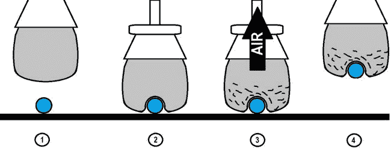

[图 11-48](#_Fig48) 。装有研磨咖啡的夹子是如何工作的

在本章中，你将使用[表 11-3](#Tab3) 中的材料制作一个非常简单的手爪。

[表 11-3](#_Tab3) 。研磨咖啡夹持器的材料清单

| 

数字

 | 

描述

 |
| --- | --- |
| three | 真空泵，12V 0-16 英寸汞柱 |
| three | 带开关电源适配器的 12V 电源 2A |
| one | 继电器模块屏蔽(一个继电器就足够了) |
| one | 派对气球至少 24 英寸宽 |
| one | 带有 10 毫米或 8 毫米孔的漏斗 |
| one | 4 英尺 3/8 英寸(10 毫米)外径和 1/4 英寸(8 毫米)内径的透明塑料外壳 |
| one | 一小块(2x2 英寸)滤布插座(也称为排水套管) |
| 一些 | 大约 10 英寸的 1/4w 电线 |
| 一些 | 大约 10 英寸至少两种不同颜色的 1/2w 电线 |

关于真空泵，最好从`sparkfun.com`订购 ROB-10398。在`https://www.sparkfun.com/products/10398`检验产品。

本项目使用的 12V 电源是从亚马逊订购的(ASIN B006NTNGN0)。您可以在`http://www.amazon.com/JACKYLED-Switching-Power-Supply-Adapter/dp/B006NTNGN0`查看产品。它配有一个开关电源适配器，使连接到气泵更容易。

确保过滤器能够适当地容纳气球；如果它太大或太小，它不会提供一个良好的连接。

这个想法在[图 11-49](#Fig49) 中有说明。


[图 11-49](#_Fig49) 。如何控制基于研磨咖啡的手爪

继电器屏蔽关闭其触点，从而允许 12V 电源打开气泵。空气泵清除夹爪内部的空气。

继电器屏蔽需要 5V，您可以使用标记为`OUTPUT ALTERNATIVE 5V`的端子接头。

[图 11-50](#Fig50) 显示了连接到乙烯基外壳的气泵。继电器罩的一个 N.A .端子已经接收到 12V 电压。塑料房子连接到右边的倒钩，因为它是一个真空空气。

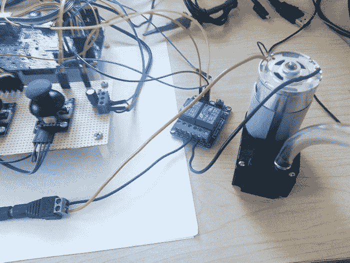

[图 11-50](#_Fig50) 。气泵连接到继电器和乙烯基外壳

在这个项目中使用的继电器屏蔽有两个继电器，但你可以使用一个单一的继电器屏蔽。

下一步是使用漏斗、气球和咖啡创建抓手。

准备咖啡抓手

为了准备夹子，你需要用咖啡填充气球的 70%。使用漏斗插入研磨好的咖啡，如图[图 11-51](#Fig51) 所示。

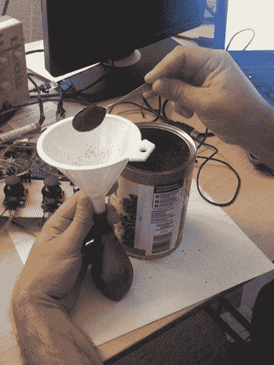

[图 11-51](#_Fig51) 。用磨碎的咖啡填充夹子

然后将气球插入漏斗，并将其带子穿过漏斗，如图[图 11-52](#Fig52) (左图)所示。您可以使用螺丝刀或其他物体来帮助传递色带。

如[图 11-52](#Fig52) (右图)所示，将一小块滤布放在带子的顶部，并插入乙烯基外壳。这个过滤织物插座将防止磨碎的咖啡被泵吸出。


[图 11-52](#_Fig52) 。气球丝带(左)和乙烯过滤器(右)

如果乙烯基外壳不够紧，你可以用一条胶带将其固定住。

咖啡抓手的草图

让我们重用`RoboticArm.ino` 但对它做一点小小的改动。您将使用声明为`joystick1`的第一个拇指操纵杆来控制咖啡抓取器。数字接头针脚 4 将控制继电器。如果您对清单 11-3 中的[进行这些更改，您将得到以下结果:](#list3)

```sh
void setup()
{
...
...
...

   pinMode(4, OUTPUT);
}

void loop()
{

   static boolean isGripperOpened = true, isCoffeeGripperActive = false;
...
...
...
  // in our example the button functionality of all button might be used
   // to manipulate the gripper
   if ((res2.buttonPressed) || (res3.buttonPressed))
   {

        if (isGripperOpened)
        {
             gripper.write(GRIPPER_CLOSED);
             isGripperOpened = false;

        }
        else
        {
             isGripperOpened = true;
             gripper.write(GRIPPER_OPENED);
        }

        // this small delay is to allow the gripper complete
        // it is task before a new movement
        delay(600);

   }

   if (res1.buttonPressed)
   {
        if (isCoffeeGripperActive == true)
        {
           isCoffeeGripperActive = false;
           digitalWrite(4, LOW);
        }
        else
        {
          isCoffeeGripperActive = true;
          digitalWrite(4, HIGH);
        }

   }

}
```

在`setup()`功能中，数字引脚 4 被设置为`OUTPUT`，用于控制继电器屏蔽。在`loop()`功能中，名为`isCoffeeGripperActive`的第二个静态变量决定气泵是否必须开启。第二和第三拇指操纵杆可以控制机械手爪。另一方面，如果按下第一个拇指操纵杆的按钮，则由于针 4 上的继电器激活，气泵打开。这意味着咖啡夹持器正在工作。

在本章的`code`目录中，有一个名为**roboticarmwithcoffeeligripper . ino**的草图，基于[清单 11-3](#list3) ，已经做了这些更改。

运行中**机器人开关动作抓取器【t1 . ino】T2**

您可能想知道为什么代码使用两个抓取器。如果你用提到的相同材料制作了你的“咖啡夹”，它将重约 100 克(0.22 磅)。

考虑到机械臂预计可以举起大约 200 克(0.44 磅)或更轻的物体，它可以握住咖啡抓爪并抓住小物体。

换句话说，它是一个夹持器夹持另一个夹持器，这使您能够避免对系统进行新的机械更改。

另一个重要的点是——当你把咖啡夹子放在物体上并打开气泵时，至少要等 4 秒钟才能移动手臂，因为空气需要一些时间离开气球并抓住物体。

[图 11-53](#Fig53) 显示机械手爪握住咖啡手爪。它拿着一个迷你螺丝刀。


[图 11-53](#_Fig53) 。拿着迷你螺丝刀的咖啡抓手

改进这个项目的想法

你可以用你的手臂套件做很多事情，其中之一就是创造不同的方式来控制机械臂。本章介绍了伺服板控制器，但是您可以使用不同的方法。例如，您可以在关节(肩、肘和腕)中使用木材和电位计来构建外骨骼。你可以让机械臂重现你的精确动作。你手掌上的一个简单按钮可以打开和关闭手爪。

你也可以建造自己的机械臂，而不是订购套件，特别是如果你有 3D 打印机或激光切割机。互联网上有几个开放的项目，允许您下载项目并构建 arm。没有什么可以阻止你使用伺服板控制器来计算使用哪个伺服。

摘要

本章向您展示了如何使用几个 Arduino APIs 创建机械臂。

你也学到了一点关于机械臂的理论。您学习了如何构建自己的机械臂，评估使用哪些伺服系统，确定支持的最大负载，以及构建控制多个伺服系统的电路板。这一切都是为了创造一个简单的人机界面。*****