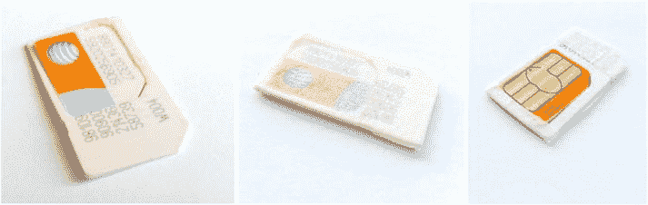
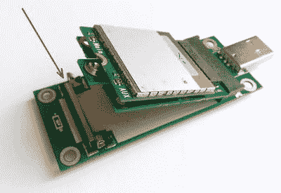
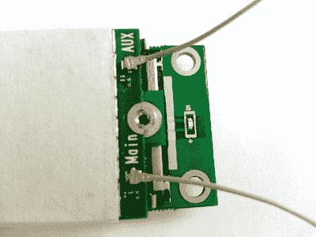
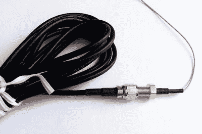
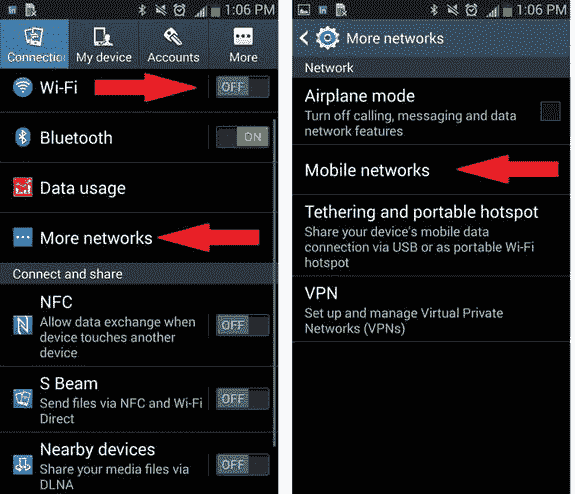

第十二章


使用 LTE 调制解调器

[第 5 章](05.html)讨论了如何使用 WiFi 和以太网适配器使英特尔 Galileo 主板连接到其他设备和互联网。

如果你需要一个固定的项目，比如控制你房子的板，或者如果你正在建立一个移动项目，比如一个用吸尘器打扫地板的迷你机器人，这些适配器是完美的。

建造一架可以长距离飞行的无人机或一个四处走动并监控你的邻居的机器人怎么样？

在这些情况下，以太网和 WiFi 适配器不适用；您将需要一种有效的方法来远程控制您的项目，并提供良好的覆盖。

一种可能的解决方案是使用与英特尔 Galileo 主板接口的调制解调器。一旦调制解调器正确配置为与英特尔 Galileo 配合工作，并且调制解调器和运营商之间的连接建立，数据交换就像任何其他网络适配器一样发生。

因此，这一章表明:

*   如何将 LTE 调制解调器物理连接到英特尔 Galileo。
*   如何让英特尔 Galileo 与调制解调器通信，并将其配置为驻留在您首选的运营商提供商处。
*   如何在 Linux 用户空间上下文中创建一个网络适配器，使数据更改成为可能。

这一章包含了这本书最昂贵的项目；LTE 调制解调器的价格通常超过 100 美元，但用于 LTE 调制解调器的相同程序可以用于 3G 调制解调器，这更实惠(大约 65 美元)。如果你有一个 3G 调制解调器，本章提到的程序也适用。唯一的区别是，您需要知道运营商所需的配置，比如接入点名称(APN)。您还需要有一个属于将在调制解调器测试中使用的 SIM 卡的数据计划。

这个项目教你如何创建由 modem work 提供的网络接口，并将其应用到你的项目中。

本章使用的 LTE 调制解调器是英特尔 XMM7160 模块。您也可以使用英特尔 XMM7260 以及任何其他符合 3GPP 规范的 LTE 调制解调器。3GPP TS 27.007 V12.5.0 (2014-06)规范可从`http://www.3gpp.org/DynaReport/27007.htm`获得。

XMM7160 和 XMM7260 简介

XMM 7160 和 XMM 7260 调制解调器是首款低功耗 LTE 调制解调器，其硬件和软件完全由英特尔开发。两个调制解调器都是 LTE (4G)，在[表 12-1](#Tab1) 中解释了它们的区别。

[表 12-1](#_Tab1) 。XMM 7160 和 XMM 7260 调制解调器的区别

<colgroup><col width="35%"> <col width="30%"> <col width="35%"></colgroup> 
| 

特征

 | 

XMM 7160

 | 

XMM 7260

 |
| --- | --- | --- |
| 发布年份 | Two thousand and thirteen | Two thousand and fourteen |
| LTE 类别 | four | six |
| 峰值下行速度(下行) | 150 兆比特/秒 | 300 兆比特/秒 |
| 支持 2G(GSM/Edge) | 是 | 是 |
| 3G(HSPA+) | 是 | 是 |
| 4G (LTE) | 是 | 是 |
| 支持的波段 | 四频 GSM/EDGE8 频段 WCDMA15 频段 LTE | 四频 GSM/EDGE8 频段 WCDMA21 频段 LTE |

调制解调器是提供迷你 PCIe (mPCIe)或 NGFF 总线格式的封装模块的一部分。如果您的笔记本电脑包含 3G 或 2G 调制解调器，该调制解调器很可能是模块化的，而不是内置的(mPCIe 或 NGFF ),您可以用更快、更好的 4G 调制解调器(如英特尔 XMM7160 或 XMM7260)替换旧的 3G 调制解调器。为此，您需要按照制造商服务指南的建议打开笔记本电脑，并手动更换调制解调器。更换后，您需要确保使用正确的天线和 SIM 卡，并且笔记本电脑正确安装了英特尔调制解调器驱动程序。在本章中，您将学习如何将调制解调器与英特尔 Galileo 主板集成。

XMM7160 和 XMM7260 最初的想法是创建一个参考设计调制解调器，允许华为和富士康等其他制造商基于英特尔 SOC 创建自己的调制解调器。然而，市场上有使用 XMM7160 或 XMM7260 作为终端调制解调器的笔记本电脑。

本章不要求您使用英特尔调制解调器；您可以使用任何支持 at 命令标准的调制解调器 2G/3G/4G，并且可以使用 cdc-acm 接口进行通信，这将在后面解释。

总之，本章使用了英特尔 XMM 调制解调器，因为它是一种参考设计，是独立于特定厂商的通用型号。所讨论的 AT 命令将在任何使用 XMM 作为参考的调制解调器或任何符合 3GPP 规范的调制解调器上工作。

项目详情

用于与调制解调器通信的接口通常是串行的，AT 命令被发送到调制解调器，以便设置载波配置、搜索网络信号、打开数据通道以及建立与其他设备的连接。

在此配置和连接过程结束时，调制解调器将为带有 IP 地址的英特尔 Galileo 主板提供一个新接口，所有与互联网和其它设备的通信都通过这个新接口完成。换句话说，新 IP 的行为就像任何其他适配器，如 WiFi 或以太网。

该项目使用带有 SIM 卡插槽的 USB OTG 适配器将调制解调器连接到英特尔 Galileo。选择调制解调器天线也是为了确保可以在 4G 网络中驻留。一旦硬件配置就绪，您必须在 Linux 环境中读取正确的设备驱动程序，以便允许使用串行端口与调制解调器进行通信。

正确加载调制解调器设备驱动程序并准备好串行端口后，向调制解调器发送一系列 AT 命令，以便用正确的 APN 配置调制解调器，检查 SIM 卡连接，并将调制解调器预占网络，从而打开数据通道。

最后，建立 PPP 连接，并提供证明互联网接入的 IP 号码。

材料清单

该项目需要一个 LTE 调制解调器、一对与调制解调器和 LTE 频段兼容的天线、一张与您的运营商相关的 SIM 卡等等，如[表 12-2](#Tab2) 中所列。[表 12-3](#Tab3) 列出了可选材料。

[表 12-2](#_Tab2) 。必需的项目材料

| 

量

 | 

成分

 |
| --- | --- |
| one | 带 mPCIe 或 NGFF 总线的 LTE 调制解调器卡。建议使用英特尔 XMM 7160 或英特尔 XMM 7260。 |
| one | 带 SIM 卡插槽的 USB OTG mPCIe 或 NGFF 适配器(通用)。 |
| one | NGFF 至 mPCIe 或 mPCIe 至 NGFF 适配器(仅当 OTG-USB 适配器包含与所用调制解调器模块不兼容的总线时；阅读“NGFF/mPCIe 适配器”)。 |
| Two | LTE/UMTS 天线，带 SMA 公接头(零件号 TG.30.8111) Apex Taoglas 或 GA-107 Taoglas(零件号 GA.107.201111)。 |
| one | 已设置数据套餐的 Micro-SIM 卡(取决于您的运营商/套餐)。 |
| one | OTG-USB 2.0 适配器，带有 micro-USB 插头到 USB 插头，仅当您的主板是英特尔 Galileo 而不是英特尔 Galileo Gen 2 时。这仅用于物理连接，因为在这种情况下不支持 OTG USB。 |
| Two | IPEX MHF 公司的 SMA 隔板母接头/插孔(零件号 071113-04)。 |
| one | 串行调试器电缆(如果您的主板是英特尔 Galileo Gen2，则为 FTDI 如果是英特尔 Galileo，则为音频插孔串行)。 |

[表 12-3](#_Tab3) 。不兼容外形的可选材料

| 

量

 | 

成分

 |
| --- | --- |
| one | NGFF 到 mPCIe 或 mPCIe 到 NGFF 适配器，如果您的调制解调器外形与 USB-OTG 适配器提供的连接器类型不匹配。 |
| one | 以太网电缆或 WiFi mPCIe(如果您想要使用 SSH 连接调试多个终端)。 |
| one | 如果您的 SIM 卡不是 micro-SIM 卡，可以使用 Nano-to-micro-SIM 卡适配器。 |
| one | 剪刀和胶带或尖嘴钳(阅读“连接调制解调器卡”)。 |

您可能会问，如果英特尔 Galileo 主板提供 mPCIe 连接器，为什么不直接将调制解调器连接到英特尔 Galileo 的 mPCIe 总线。英特尔 Galileo 主板不提供允许您读取 SIM 卡的内置接口，并且在没有通信的情况下，SIM 卡无法将调制解调器接入 LTE 网络。

因此，USB-OTG 适配器是必要的。它还必须能够为您的调制解调器提供连接器。有时很难找到这种与你的调制解调器匹配的适配器。如果您的 OTG-USB 连接不提供与您的调制解调器相同的连接总线，您必须在项目中包括第二个适配器，以便将调制解调器连接到 OTG-USB 适配器。

以下情况需要额外的材料:

*   如果带有 SIM 卡插槽的 OTG USB 适配器包含与调制解调器卡不兼容的连接器。你需要一个从 NGFF 到伦敦或从伦敦到 NGFF 的适配器。
*   如果您的 OTG USB 适配器包含与您的 SIM 卡格式不兼容的 SIM 卡插槽。例如，如果您的 OTG USB 适配器接受 micro-SIM 卡，但您的 SIM 卡是 nano，您将需要 nano-SIM 转 micro-SIM 适配器。
*   如果您想使用多个 shell 来调试调制解调器，您可能还需要一根以太网电缆或 WiFi mPCIe 卡来使用 SSH 打开几个 shell。

与天线相关的注意事项

市面上有几款实惠的天线；我的首选品牌是陶格拉斯有限公司。这些天线通常花费 10-20 美元，它们以不同的形式建造，包括安装在磁性支架上，允许您在任何金属结构中连接天线，从而避免孔、螺钉或任何其他类型的设备。

本书推荐两种 LTE/UMTS 天线，带有 SMA 公连接器 Apex Taoglas(零件号 TG.30.8111)或 GA-107 Taoglas(零件号 GA.107.201111)。

如果您使用的是 LTE 调制解调器，建议使用 TG.30.8111 天线。请注意，该天线还提供 GPS 接收功能。这意味着，如果您的调制解调器支持 M2M 模块中的 GPS 传感器，您也将能够检索您的位置。

XMM 7160 和 XMM 7260 卡有一个 GPS 模块，但不幸的是，AT 命令是保密的，因此我没有得到授权在这本书里发表有关它们的信息。如果你使用的不是 LTE 的调制解调器，我推荐 GA.107.201111 天线，它包括磁性安装，在 2.2GHz 的最佳场景下可以达到 3.5G。这并不意味着你的 LTE 调制解调器不能与这种天线一起工作，但你将驻扎的频段不会提供最佳的下载流。

两种天线的数据表都在本章的`datasheet`文件夹中。你也可以在`http://taoglas.com/img/TG.30.8111.pdf`和`http://www.taoglas.com/img/GA.107%20Magnetic%20Telematic%20Cellular%20Penta-band%20Antenna%20300410.pdf`找到他们。

推荐天线的价格是每根 12-16 美元，外加运费。

有几个其他体面的天线具有不同的形式因素，但要确保天线可以营地，并获得最佳性能。

准备硬件

这本书使用了最糟糕的场景作为例子，换句话说，它使用了一个带有 NGFF 总线的 XMM 7160，该总线连接到一个只接受 mPCIe 调制解调器的 OTG-USB 适配器和一个必须耦合到 micro-SIM 卡插槽的 nano-SIM 卡。因此，一个 NGFF 到 mPCIe 的适配器被包括在这个项目中，并且一个纳米到微米的 SD 卡也被使用。

当然，如果您的场景更简单，您不需要遵循所有这些步骤。

步骤 1:准备 SIM 卡

OTG-USB 适配器包含一个如图[图 12-1](#Fig1) 所示的 mPCIe 插槽和一个如图[图 12-2](#Fig2) 所示的 micro-SIM 卡插槽。


[图 12-1](#_Fig1) 。mPCIe 至 OTG-USB 适配器，俯视图


[图 12-2](#_Fig2) 。mPCIe 至 OTG-USB 适配器，仰视图

如果您的 SIM 卡使用微型 SIM 卡，只需将您的 SIM 卡插入 mPCIe-OTG 适配器的底部。否则，您需要使用 SIM 卡适配器将 SIM 卡连接到 MP CIE/OTG USB 适配器。[图 12-3](#Fig3) 显示了与 nano-SIM 卡一起使用的 micro-SIM 卡适配器的示例。


[图 12-3](#_Fig3) 。纳米到微米 SIM 卡适配器(1)和纳米 SIM 卡(2)

只需插入 nano-SIM 卡，并确保 nano-SIM 卡完全固定并平放在 SIM 卡适配器表面。然后剪下一块比 SIM 卡适配器稍大的胶带，将其固定在没有触点的表面上。将胶带折叠到边框内。图 12-4 显示了该程序；请注意，nano-SIM 的触点没有被胶带覆盖。



[图 12-4](#_Fig4) 。插入 nano-SIM 并将其粘贴到适配器上

然后将 SIM 适配器插入 mPCIe-OTG SIM 卡插槽，如图[图 12-5](#Fig5) 所示。


[图 12-5](#_Fig5) 。连接 SIM 卡

您需要确保 nano-SIM 的触点正确接触 SIM 卡插槽的触点。否则，在尝试读取 SIM 卡时，您将会收到错误消息。

步骤 2:NGFF/mPCIe 适配器

如果你的调制解调器卡的总线与你的 mPCIe 转 OTG USB 适配器兼容，转到第 3 步。如果你不需要使用适配器，这一步是不必要的。本章涵盖了最坏的情况，因此使用的设备是一个 NGFF 格式的调制解调器卡和一个 mPCIe 转 OTG/USB 适配器，迫使你使用 NGFF 转 mPCIe 适配器，如图[图 12-6](#Fig6) 所示。


[图 12-6](#_Fig6) 。NGFF 至 mPCIe 适配器(左)和调制解调器卡(右)

连接两个设备，您将得到图 12-7 所示的配置。


[图 12-7](#_Fig7) 。连接到 NGFF 至 mPCIe 适配器的调制解调器卡

步骤 3:适配调制解调器卡

直接连接到 NGFF 转 mPCIe 适配器的调制解调器卡连接到 mPCIe 转 OTG-USB 适配器，如图[图 12-8](#Fig8) 所示。此图中的红色箭头显示了锁定装置。如果您的调制解调器没有使用 NGFF 到 mPCIe 适配器，您将能够将调制解调器锁定到这个锁定机制，没有任何问题。



[图 12-8](#_Fig8) 。将调制解调器卡连接到 mPCIe 转 OTG USB 适配器

但是，如果您使用步骤 2 中描述的适配器，很有可能您将无法使用储物柜，因为调制解调器不适合。在这种情况下，你有两种选择——使用尖嘴钳移除锁定装置，将 NGFF/mPCIe 拧到 mPCIe/OTG-USB 适配器上，或者简单地用胶带粘住调制解调器卡，如图[图 12-9](#Fig9) 所示。


[图 12-9](#_Fig9) 。将调制解调器卡连接到 mPCIe 转 USB-OTG 适配器

步骤 4:连接天线

调制解调器卡由微型射频连接器提供，更准确地说是 I-Pex 20449-001E。你需要使用 SMA 舱壁电缆母/插孔到 IPEX MHF，以便连接调制解调器到天线。

[图 12-10](#Fig10) 显示了电缆，让你知道它们有多脆弱。


[图 12-10](#_Fig10) 。SMA 隔板母接头/插孔至 IPEX MHF

[图 12-11](#Fig11) 显示了连接到迷你射频连接器的主天线(main)和辅助天线(AUX)。



[图 12-11](#_Fig11) 。将电缆连接到微型射频连接器

使用 SMA 舱壁电缆母/插孔 IPEX MHF，您必须使用其公 SMA 连接器连接到天线，如图[图 12-12](#Fig12) 所示。



[图 12-12](#_Fig12) 。连接天线

步骤 5:将调制解调器连接到英特尔 Galileo

如果您的主板是英特尔 Galileo Gen 2，您只需将设备连接到 OTG-USB 连接器，如图[图 12-13](#Fig13) 所示。


[图 12-13](#_Fig13) 。将设备连接到英特尔 Galileo Gen 2

但是，如果您仅使用英特尔 Galileo，您需要 OTG-USB 2.0 适配器，该适配器带有 micro-USB 公接头到 USB 母接头，以连接设备。

打开你的主板。如果你像预期的那样组装好了一切，你就可以开始了！

下一节将解释如何准备软件并确认一切正常。

准备软件

接下来的这些步骤将指导您完成检查硬件是否工作以及设置调制解调器的过程。

步骤 1:检查调制解调器

连接适当的电缆，分别调试英特尔 Galileo Gen 2 和英特尔 Galileo 的主板、FTDI 或音频插孔，并打开 Linux 终端外壳，如第 1 章中的[所述。](01.html)

如[图 12-13](#Fig13) 所示连接调制解调器，并键入以下命令:

```sh
root@clanton:~# lsusb
Bus 002 Device 006: ID 1519:f214
Bus 001 Device 001: ID 1d6b:0001
Bus 002 Device 001: ID 1d6b:0002
```

紧随`lsusb`命令之后的第一个设备是调制解调器，这意味着一个新设备在 OTG-USB 中被识别，并带有各自的供应商和产品 id。

如果您只看到最后两个设备，这意味着您的 mPCIe/OTG-USB 适配器不工作，或者您的调制解调器卡有问题。

步骤 2:加载 CDC-ACM 驱动程序

通过发送和接收 AT 命令的响应，使用 CDC-ACM 串行驱动程序完成与调制解调器的通信。默认情况下，驱动程序不会在电路板启动时加载，因此您必须使用`modprobe`命令手动加载驱动程序。

然后键入以下命令:

```sh
root@clanton:~# modprobe cdc-acm
```

如果您的调制解调器如[图 12-13](#Fig13) 所示连接，您将看到一系列消息，说明该设备不是调制解调器。

```sh
[  135.720822] cdc_acm 2-1:1.2: This device cannot do calls on its own. It is not a modem.
[  135.738315] cdc_acm 2-1:1.2: ttyACM0: USB ACM device
[  135.748033] cdc_acm 2-1:1.4: This device cannot do calls on its own. It is not a modem.
[  135.765753] cdc_acm 2-1:1.4: ttyACM1: USB ACM device
[  135.775111] cdc_acm 2-1:1.6: This device cannot do calls on its own. It is not a modem.
[  135.792294] cdc_acm 2-1:1.6: ttyACM2: USB ACM device
[  135.801241] cdc_acm 2-1:1.8: This device cannot do calls on its own. It is not a modem.
[  135.818946] cdc_acm 2-1:1.8: ttyACM3: USB ACM device
[  135.827775] cdc_acm 2-1:1.10: This device cannot do calls on its own. It is not a modem.
[  135.845711] cdc_acm 2-1:1.10: ttyACM4: USB ACM device
[  135.860799] usbcore: registered new interface driver cdc_acm
[  135.866545] cdc_acm: USB Abstract Control Model driver for USB modems and ISD N adapters
```

不要担心！您的设备是一个调制解调器，您可以毫无问题地将其用作 USB 调制解调器。你可以忽略这些信息。如果您想消除此类消息，您需要在更改`.../linux/driverusb/class/cdc-acm.c`驱动程序代码后生成自己的图像:

```sh
/*
 * USB driver structure.
 */

static const struct usb_device_id acm_ids[] = {
        /* quirky and broken devices */
        { USB_DEVICE(0x0870, 0x0001), /* Metricom GS Modem */
        .driver_info = NO_UNION_NORMAL, /* has no union descriptor */
        },
...
...
...
        { USB_DEVICE(YOUR_VENDOR_ID, YOUR_PRODUCT_ID) }, /*  ADD YOUR MODEM HERE !!!!!!*/

...
...
...

        /* Motorola H24 HSPA module: */
        { USB_DEVICE(0x22b8, 0x2d91) }, /* modem                          */
        { USB_DEVICE(0x22b8, 0x2d92) }, /* modem           + diagnostics  */
        { USB_DEVICE(0x22b8, 0x2d93) }, /* modem + AT port                */
        { USB_DEVICE(0x22b8, 0x2d95) }, /* modem + AT port + diagnostics  */

...
...
...
```

一旦您更改了代码，重新编译并刷新您的英特尔 Galileo 或生成新的 BSP SD 卡版本，如第 2 章中的[所述。同样，这不是强制性的。只有当您不想看到这些错误消息时才这样做。](02.html)

此时，您应该至少有一个`ttyACM`设备可用。如果是第一次连接调制解调器，并且没有阻止任何 ttyACM 设备，则`ttyACM0`应该可用。您可以用一个简单的`ls`命令来检查它:

```sh
root@clanton:~# ls /dev/ttyACM0
/dev/ttyACM0
```

如果没有找到`ttyACM0`，您应该会看到如下消息:

```sh
root@clanton:~# ls /dev/ttyACM0
ls: /dev/ttyACM0: No such file or directory
```

下一步是看看你的调制解调器卡是否能响应 AT 命令。

步骤 3:检查调制解调器是否响应 AT 命令

此时，调制解调器已连接，驱动程序已加载，ttyACM 设备可用于接收 At 命令。在发送 AT 命令之前，您可以对`ttyACM`设备进行编程，以回应命令和响应。为了改变 ttyACM 设置，使用如下`sty`命令:

```sh
root@clanton:~# stty -F /dev/ttyACM0 -echo
```

`-F`指定要更改的设备，如`ttyACM0`,`-echo`选项也使输入命令及其各自的响应产生回声。

为了可视化发送 AT 命令时`ttyACM`设备的行为，您应该持续观察设备的响应。此时你有两个选择。如果你只有一根使用串口调试的线缆，可以一直在后台看`ttyACM`设备。例如:

```sh
root@clanton:~# cat /dev/ttyACM0 &
```

然而，如果你有一根以太网电缆或 WiFi 卡，你可以使用 SSH 打开多个 Linux 终端，如第 5 章中所解释的。这样，您可以在一个 shell 中发送 AT 命令，在另一个 shell 中调试 ttyACM 响应。对于 shell，您可以观察到`ttyACM`响应，并且不需要在后台运行 **cat** :

```sh
root@clanton:~# cat /dev/ttyACM0
```

然后使用 **echo** 命令向设备发送一个简单的 AT 命令，并检查是否收到了 **OK** 响应:

```sh
root@clanton:~# echo "AT" > /dev/ttyACM0
root@clanton:~# AT

OK
```

如您所见，一旦发送了命令，`ttyACM0`就会回复。在本例中，调制解调器成功响应了`OK`，这意味着系统正在运行并准备好进行配置。

如果您没有收到响应，请检查您是否正在向正确的`ttyACM`设备发送命令，并重新检查硬件。

步骤 4:检查 SIM 卡连接

如果您有一个 nano-SIM，并且您正在使用 nano-SIM 到 micro-SIM 的适配器，您需要检查 nano-SIM 是否足够好，以保证 SIM 卡的触点正确接触 SIM 卡插槽的引脚。

要测试您的 SIM 卡是否响应 AT 命令，您需要发送以下命令:

```sh
root@clanton:~# AT+CPIN?
+CPIN: READY

OK
```

如果你收到 **+CPIN:就绪**接着是 **OK** ，你的 SIM 卡就没问题了。如果收到**错误**，需要重新检查 SIM 卡；请参阅本章中的“准备 SIM 卡”一节。

步骤 5:配置 APN 并将其连接到网络

每个运营商都有一个网关，允许设备访问互联网。这个网关被称为接入点名称(APN)，每个运营商包含不同技术的不同 APN，如 GPRS、3G 和 4G。

在继续本章之前，您必须了解 SIM 卡所需的配置。因此，如果你的运营商是美国电话电报公司、威瑞森、斯普林特、克拉罗或任何其他公司，你需要找出 APN 必须如何设置。

您有三种选择来发现您的卡所需的 APN—搜索互联网；致电您的提供商并请求支持；或者，如果您的 SIM 卡与您在移动设备中使用的 SIM 卡相同，您只需检查移动设备的配置即可。按照最后一个选项，假设您的设备是 Android，您将按如下方式检查配置:

1.  转到您设备的设置。
2.  禁用 WiFi 并选择更多网络。然后点击移动网络，如图[图 12-14](#Fig14) 所示。



[图 12-14](#_Fig14) 。禁用 WiFi 并选择移动网络

你必须在这里禁用，因为有些设备声称与 Android 兼容，但事实并非如此。在这种情况下，Google Play 应用程序不可用。当 WiFi 打开时，设备会停留在一个非常低的频段，如 2G，以减少电池消耗。如果您在这种情况下检查 APN，2G 或 3G 的 APN 可能会启用，而不是 4G，因为网络会自动更新配置，这对您来说是透明的。下一步是选择运营商的 APN，检查 APN 名称，提供用户名和密码(如果需要)，然后选择 IP 连接类型(IPv4 或 IPv6)以及 MCC 和 MNC 号码。例如，[图 12-15](#Fig15) 中的红色箭头显示了美国 AT & T 的 APN 设置。


[图 12-15](#_Fig15) 。禁用 WiFi 并选择移动网络

如图[图 12-15](#Fig15) 所示，AT & T 4G 数据连接需要以下设置:

*   **APN:** 电话号码
*   **用户名:**不需要
*   **密码:**不需要
*   MCC: 310
*   跨国公司:410
*   APN 协议: IPv4

您现在可以配置调制解调器卡了。在对调制解调器进行编程之前，首先检查调制解调器中是否存储了一些 APN。你需要如下执行`echo AT+CGDCONT?`命令:

```sh
root@clanton:~# echo "AT+CGDCONT?" > /dev/ttyACM0
+CGDCONT: 1,"IPV4V6","","",0,0
OK
```

返回的命令表明调制解调器卡中已经有一个 APN 集。它是空的。你可以添加第二个或者替换这个。

要设置 APN，您需要使用命令中的`CGDCONT`，但是要发送调制解调器卡列表中的 APN 名称、协议类型和 APN 号码。考虑到只有一个 APN，如果您想包含第二个，您只需在命令中指定数字 2 并包含第二个。如果您想替换已经设置的 APN，只需使用数字 1。此示例包括第二个 APN，因此您可以看到带有几个 APN 的调制解调器卡是如何配置的。

当字符串是参数的一部分时，命令的语法可能会有点混乱。字符串必须用双引号括起来。例如，这种情况下的命令将是:

```sh
AT+CGDCONT=2,"IP","phone"
```

其中`2`表示你正在添加第二个 APN，并保留第一个，`"IP"`是因为协议是 IPv4，`"phone"`是 AT & T 用于 4G 的 APN 名称。

然而，考虑到您在 Linux 终端中使用`echo`发送 at 命令，如果您键入不带双引号的`echo`，调制解调器将无法理解该命令。如果字符串需要双引号，您还必须区分`echo's`双引号和字符串的双引号。为此，您需要使用`\"`。

考虑到这一点，前面的命令将是:

```sh
root@clanton:~# echo "AT+CGDCONT=2,\"IP\",\"phone\"" > /dev/ttyACM0
OK
```

`OK`表示命令被接受，APN 被创建。使用 **AT+CGDCONT 重新检查正在运行的 APN 列表。**命令。

```sh
root@clanton:~# echo "AT+CGDCONT?" > /dev/ttyACM0
+CGDCONT: 1,"IPV4V6","","",0,0
+CGDCONT: 2,"IP","phone","0.0.0.0",0,0,0,0,0,0
OK
```

APN 已成功添加。下一步是使用以下命令激活网络中的 PDP:

```sh
root@clanton:~# echo "AT+CGACT=1,2" > /dev/ttyACM0
OK

```

数字 **1** 表示**激活**，而 **2** 是您用`AT+CGDCONT`命令编程的轮廓索引的数字。如果您稍后想要停用 PDP，您可以发送相同的命令，但是使用 **0** 而不是`1`作为第一个参数。

这个命令可能需要几秒钟，所以不要期望立即得到响应。

一旦网络被激活，需要通知 MCC(移动国家代码)和 MNC(移动网络代码)，它们一起使用`AT+COPS`命令通知您的网络运营商代码。下面的例子显示了 AT & T 在美国的网络运营商代码:

```sh
root@clanton:~# echo "AT+COPS=1,2,\"310410\"" > /dev/ttyACM0
OK
```

最后发送的 AT 命令是`AT+` `CGDATA` ，它负责打开与调制解调器的数据流，建立与网络的连接。LTE 调制解调器使用`M-RAW_IP`模式；`1`参数表示“附加”,如下例所示:

```sh
root@clanton:~# echo "AT+CGDATA=\"M-RAW_IP\",1" > /dev/ttyACM0
CONNECT
```

步骤 6:使用 pppd 创建 IP 接口

此时，您的调制解调器卡已连接到网络提供商，数据流已打开。是时候建立到调制解调器的接口并获取本地 IP 地址了。然后 IP 将能够连接到互联网，打开套接字，创建与其他设备交换数据的程序，以及其他可能性，比如你在第五章中了解到的那些。

调制解调器可以在网络 NAT 中有一个 IP 地址，但英特尔 Galileo 必须有一个 IP 地址链接到此连接。其中一个解决方案是使用点对点协议(PPP ),并在英特尔 Galileo 上创建外部 IP 到本地 IP 的链接。

为英特尔 Galileo 创建的 SPI 和 BSP 映像包含一个名为`pppd`(点对点协议守护进程)的应用，该应用创建本地 IP 并建立与互联网的链接。

您必须首先创建一个将由`pppd`使用的配置文件。该配置文件包含如何与调制解调器卡通信的相关信息。将`code`文件夹中名为 **options-att** 的配置文件转移到您板卡的 **/etc/ppp/peers** 目录下。清单 12-1 显示了这个文件的内容。

[***清单 12-1***](#_list1) 。`options-att`配置文件

```sh
ttyACM0
115200
lock
crtscts
passive
novj
defaultroute
noipdefault
usepeerdns
noauth
hide-password
persist
holdoff 10
maxfail 5
debug
connect '/usr/sbin/chat -f /etc/ppp/isp_chat'

```

在`https://ppp.samba.org/pppd.html`的官方文档中解释了这些选项。它们适用于下表中的英特尔 Galileo:

*   **ttyACM0:** 使用名为`ttyname`的串口与对方通信。
*   **115200:** 一个十进制数，作为串行设备所需的波特率。这是采用英特尔 Galileo 的 USB 的最高速率。
*   **Lock:** 指定`pppd`应该为串行设备创建一个 UUCP 风格的锁文件，以确保对设备的独占访问。
*   **Crtscts:** 指定`pppd`应该使用 RTS 和 cts 信号设置串口以使用硬件流控制。
*   **被动:**启用 LCP(链路控制协议)中的`passive`选项。使用此选项，`pppd`将尝试启动连接。如果没有收到来自对等方的回复，`pppd`将被动地等待来自对等方的有效 LCP 数据包，而不是退出，因为它没有这个选项。
*   **Novj:** 在发送和接收方向禁用 Van Jacobson 风格的 TCP/IP 报头压缩。
*   **Defaultroute:** 当 IPCP 协商成功完成时，使用对等体作为网关，向系统路由表添加默认路由。当 PPP 连接断开时，该项被删除。
*   **Noipdefault:** 当没有指定本地 IP 地址时，禁用默认行为，即从主机名中确定(如果可能)本地 IP 地址。使用此选项，对等体将必须在 IPCP 协商期间提供本地 IP 地址(除非它在命令行或`options`文件中明确指定)。
*   **Usepeerdns:** 向对方请求最多两个 dns 服务器地址。对等体提供的地址(如果有的话)被传递给`DNS1`和`DNS2`环境变量中的`/etc/ppp/ip-up`脚本，并且`USEPEERDNS`环境变量将被设置为 1。此外，`pppd`将创建一个`/etc/ppp/resolv.conf`文件，其中包含一个或两个名称服务器行，地址由对等方提供。
*   **Noauth:** 不要求对等方验证自身。这个选项是特权。
*   **hide-password:** 当记录 PAP 包的内容时，该选项使`pppd`从日志中排除密码字符串。这是默认设置。
*   **Persist:** 连接终止后不退出；而是尝试重新打开连接。`maxfail`选项仍然对持久连接有影响。
*   **延迟 n:** 指定在链路终止后重新启动前等待的秒数。该选项仅在使用`persist`或`demand`选项时有效。如果链路因空闲而终止，则不适用保持期。
*   **maxfail n:** 连续 n 次连接尝试失败后终止。值为 0 表示没有限制。默认值为 10，而您使用的是 5。
*   **调试:**启用连接调试工具。如果给出该选项，`pppd`将以可读形式记录所有发送或接收的控制数据包的内容。数据包通过系统日志记录，带有设施守护程序和级别调试。通过适当地设置`/etc/syslog.conf`，可以将这些信息定向到一个文件中。
*   **连接“脚本”:**通常你需要做一些准备链接的工作，然后 PPP 协议才能启动；例如，对于拨号调制解调器，需要向调制解调器发送命令来拨打适当的电话号码。此选项指定在尝试开始 PPP 协商之前，`pppd`要执行的命令(通过将其传递给 shell)。在这里，**聊天**程序通常很有用，因为它提供了一种向调制解调器发送任意字符串并响应接收到的字符的方法。

在这个例子中，连接选项正在调用`/usr/sbin/chat -f /etc/ppp/isp_chat`。本章的`code`文件夹中有`isp_chat`文件，您需要将该文件复制到`/etc/ppp`目录中。

该选项调用程序 chat，该程序通过用户空间和`pppd`守护进程接收和发送数据。`-f`选项指定聊天程序在连接前必须运行的脚本。

[清单 12-2](#list2) 显示了`isp_chat`脚本的内容。

[***清单 12-2***](#_list2) 。`isp_chat`剧本

```sh
'' ATD*99#
TIMEOUT 30
CONNECT
```

聊天脚本是字符串对和预期字符串的序列。一般来说，它在必须发送的内容之前包含预期的内容。

如果您使用`''`，则不需要任何响应，这就是`isp_chat`脚本第一行的情况。`''`与代表调制解调器拨号字符串的`ATD*99##`配对。

在第二行，脚本设置了一个最大值为 30 秒的`TIMEOUT`。

最后，第三行等待`CONNECT`，没有任何东西作为回复被发送。

要获得本地 IP，需要运行`mknod`和`pppd`命令。

```sh
root@clanton:~# mknod /dev/ppp c 108 0

```

第一个`mknod`命令只有在您使用常规的英特尔 Galileo 版本，并且想要创建一个可以打开文件节点的设备，以便使用 PPP 与调制解调器进行通信时才是必需的。但是，如果您重新编译了内核，启用了所有支持 PPP 的选项，那么您定制的内核将拥有已经可用的`/dev/ppp`设备。在`c 108 0`选项**、**、`c`表示字符文件非缓冲，`108`和`0`分别表示主号和副号，用于标识设备。这与任何常规 char 驱动程序使用的方法相同。然后你调用`pppd`如下:

```sh
root@clanton:~# pppd call options-att debug nodetach
Script /usr/sbin/chat -t3 -f /etc/ppp/isp_chat finished (pid 1486), status = 0x0
Serial connection established.
using channel 1
Using interface ppp0
Connect: ppp0 <--> /dev/ttyACM0
sent [LCP ConfReq id=0x1 <asyncmap 0x0> <magic 0xbcbf1398> <pcomp> <accomp>]
rcvd [LCP ConfReq id=0x1 <asyncmap 0x0> <magic 0x52181044> <pcomp> <accomp>]
sent [LCP ConfAck id=0x1 <asyncmap 0x0> <magic 0x52181044> <pcomp> <accomp>]
rcvd [LCP ConfAck id=0x1 <asyncmap 0x0> <magic 0xbcbf1398> <pcomp> <accomp>]
kernel does not support PPP filtering
[ 921.149938] PPP Deflate Compression module registered
sent [CCP ConfReq id=0x1 <deflate 15> <deflate(old#) 15>]
sent [IPCP ConfReq id=0x1 <addr 0.0.0.0> <ms-dns1 0.0.0.0> <ms-dns2 0.0.0.0>]
rcvd [LCP ProtRej id=0x2 80 fd 01 01 00 0c 1a 04 78 00 18 04]
Protocol-Reject for 'Compression Control Protocol' (0x80fd) received
sent [IPCP ConfReq id=0x1 <addr 0.0.0.0> <ms-dns1 0.0.0.0> <ms-dns2 0.0.0.0>]
rcvd [IPCP ConfReq id=0x1]
sent [IPCP ConfNak id=0x1 <addr 0.0.0.0>]
rcvd [IPCP ConfNak id=0x1 <addr 10.8.194.5> <ms-dns1 172.26.38.1> <ms-dns2 172.26.38.2>]
sent [IPCP ConfReq id=0x2 <addr 10.8.194.5> <ms-dns1 172.26.38.1> <ms-dns2 172.26.38.2>]
rcvd [IPCP ConfReq id=0x2 <addr 10.8.194.5>]
sent [IPCP ConfAck id=0x2 <addr 10.8.194.5>]
rcvd [IPCP ConfAck id=0x2 <addr 10.8.194.5> <ms-dns1 172.26.38.1> <ms-dns2 172.26.38.2>]
local IP address 10.8.194.5
remote IP address 10.8.194.5
primary DNS address 172.26.38.1
secondary DNS address 172.26.38.2
Script /etc/ppp/ip-up started (pid 1501)
Script /etc/ppp/ip-up finished (pid 1501), status = 0x0
```

第二个`pppd`命令将启动 PPP 守护进程，在调试模式下调用一个`options-att`文件(不要担心，稍后您会了解到这一点)。`nodetach`表示`pppd`不会分离，直到你或任何其他输入设备要求杀死它。例如，如果你按 Ctrl+C，你将杀死守护进程。

几秒钟后，互联网`ppp0`就可以使用本地 IP 了。

步骤 7:测试互联网连接

此刻一切就绪——您的 pppd 正在运行，您有一个本地 IP，并且调制解调器在数据流打开的情况下驻扎。现在是时候测试你的网络连接了。

尝试`ping`一个服务器，检查接口是否工作。

```sh
root@clanton:~# ping `www.google.com`
PING www.google.com (74.125.239.145): 56 data bytes
64 bytes from 74.125.239.145: seq=0 ttl=54 time=49.897 ms
64 bytes from 74.125.239.145: seq=1 ttl=54 time=78.188 ms
64 bytes from 74.125.239.145: seq=2 ttl=54 time=78.101 ms
```

该命令表示互联网接入正常，调制解调器已准备好通过互联网交换数据。

此时，您就可以通过调制解调器卡进行通信了。你已经准备好将你的机器人，你的四轴直升机，或者移动项目发送到远处并控制它。

您也可以在第 9 章中解释的家庭自动化项目中使用这种连接。

测试互联网带宽

测试互联网带宽有几种机制，每种机制都有支持者和反对者。这真的取决于很多变量。

要使用英特尔 Galileo 测试带宽，请使用名为`speedtest-cli.py`的 Python 脚本，您可以从`https://pypi.python.org/pypi/speedtest-cli` **<small>下载该脚本。</small>**

这个脚本使用网站`www.speedtest.net`测试你的互联网带宽。Python 必须在您的英特尔 Galileo 映像中可用。在这种情况下，如果您使用 BSP SD 卡映像，常规映像包含 Python 包。

基本上，它会根据你的 IP 地址尝试找到最好的服务器，并执行下载和上传测试。

程序非常简单:

1.  按照本章“测试互联网连接”一节中描述的步骤，确保您的调制解调器已设置好，并且您有一个可用的本地 IP。
2.  前往`https://pypi.python.org/pypi/speedtest-cli`下载最新的 Python 版本。
3.  如果您使用 Linux 或 OSX，使用`tar -zxvf <package_file_name>`提取包的内容。如果您使用的是 Windows，请使用 Winzip 或 7Zip。
4.  在提取的文件中，有一个名为`speedtest_cli.py`的文件必须传输到您的英特尔 Galileo。如果您不知道如何传输文件，请参见第 5 章并选择最适合您的方法。
5.  只需使用 Python:

    ```sh
    root@clanton:~/speedtest# python speedtest_cli.py
    ```

    执行脚本
6.  因此，这个脚本将显示下载和上传的速度。

为什么下载/上传带宽不是最佳的？

在真正的 LTE 网络中，您是否永远无法达到最大 100 Mbps，因为有几个因素会影响性能。这包括延迟问题、占用不同频带的数据信道的用户数量、服务提供商的质量以及许多其他变量。

如果你在加州使用美国电话电报公司，配有 LTE 调制解调器和正确的天线，你可能会达到 7 到 12 Mbps 的平均下载速度和 4 到 7 Mbps 的上传速度。

改进项目的想法

下面几节讨论了改进这个项目的几种方法。

改进聊天脚本

本章中的 AT 命令是手动传递的，这样做的主要原因是帮助您检查您的硬件是否正常，以及设置是否允许您连接到运营商网络进行数据连接。

这并不意味着所有的 at 命令都必须手动输入，因为正如您在标题为**<small></small>**<small>使用 pppd 创建 IP 接口的章节中所读到的那样，[清单 12-2](#list2) 中列出的`isp_chat`接受 AT 命令。</small>

 <small>一旦您知道了使调制解调器工作的所有 AT 命令及其特定参数，您只需将这些 AT 命令输入到脚本中。

例如，本章中用于设置美国电话电报公司 APN 的 AT 命令如下:

```sh
AT+CPIN?
+CPIN: READY
OK

AT+CGDCONT=2,"IP","phone"
OK

AT+CGACT=1,2
OK

AT+COPS=1,2,"310410"
OK

AT+CGDATA="M-RAW_IP",1
CONNECT
```

你只需在`isp_chat`脚本中包含相应的 AT 命令，如[清单 12-3](#list3) 所示。

[***清单 12-3***](#_list3) 。`isp_att_chat`剧本

```sh
OK AT+CPIN?
OK AT+CGDCONT=2,"IP","phone"
OK AT+CGACT=1,2
OK AT+COPS=1,2,"310410"
'' AT+CGDATA="M-RAW_IP",1
TIMEOUT 10
'' ATD*99#
TIMEOUT 30
CONNECT
```

然后修改清单 12-1 中的来调用`isp_att_chat`脚本。

```sh
ttyACM0
115200
lock
crtscts
passive
novj
defaultroute
noipdefault
usepeerdns
noauth
hide-password
persist
holdoff 10
maxfail 5
debug
connect '/usr/sbin/chat -f /etc/ppp/isp_att_chat'
```

再次运行`pppd`命令:

```sh
root@clanton:~# pppd call options-att debug nodetach
```

这样，不需要从终端调用任何 AT 命令。

自动加载 cdc-acm 驱动程序

您可以自动加载，而不必在每次主板启动时手动调用`modprobe cdc-acm`。如果您使用 BSP SD 卡映像，该过程非常简单:

1.  连接您的 FDTI 电缆或串行插孔电缆，并打开 Linux 终端。
2.  输入

    ```sh
     root@clanton:~# cd /etc/modules-load.quark
    ```

    进入`/etc/modules-load.quark`目录
3.  如果您的主板是英特尔 Galileo Gen 2，请编辑`galileo_gen2.conf`文件；否则，如果您的主板是英特尔 Galileo，您需要编辑`galileo.conf`。您可以使用`vi`编辑器或任何其他方法在 Linux 终端中直接编辑。这些文件代表一个配置文件，其中包含所有必须在引导后加载的模块。
4.  将`cdc-acm`行插入配置文件。

    ```sh
    pch-udc
    g-serial vendor=0x8086 product=0xBABE
    stmmac
    ehci_hcd
    ohci_hcd
    ehci-pci
    usb_storage
    gpio_sch
    intel_qrk_gip
    gpio-pca953x
    pca9685
    at24
    i2c_dev
    spidev
    spi-pxa2xx-pci
    spi-pxa2xx
    industrialio
    adc1x8s102
    iwlwifi
    btusb
    usbhid
    evdev
    sdhci-pci
    mmc-block
    cdc-acm
    ```

5.  通过键入`reboot`并按回车键重新启动主板。

如果您正在使用自定义 SPI 映像，过程非常相似，但是您需要在`yocto`构建中对此进行更改。在这种情况下，配置文件`galileo.conf`和`galileo_gen2.conf`出现在目录`.../meta-clanton_v1.0.3/meta-clanton-bsp/recipes-kernel/quark-init/files`中。执行第 4 步中提到的相同更改，重建您的 SPI 映像，并使用新的自定义 SPI 映像刷新您的英特尔 Galileo。

启动后，`cdc-acm`驱动器必须自动加载。你可以通过在 Linux 终端 shell 中输入`lsmod`来检查它。

摘要

本章介绍了一种基于调制解调器卡的解决方案，适用于在 WiFi 覆盖范围不足时需要大规模移动的应用。

它还解释了如何使用适配器将调制解调器卡连接到英特尔 Galileo 主板，如何使用 SIM 卡，当有外形尺寸适配时该怎么做，以及如何选择和连接天线。

在软件方面，本章介绍了使用 AT 命令设置调制解调器，解释了如何使用 PPP 协议建立本地 IP，并介绍了连接到互联网所需的脚本和实用程序。</small>