# 九、电子邮件服务器

电子邮件完全改变了我们相互交流的方式。今天，纽约的某个人可以用一种简单又便宜的方式给莫斯科的朋友发电子邮件。例如，如果用户`achilles@olimpus.local`想给`thor@valhalla.local`发送一条消息，他就把这条消息发送到他的邮件服务器。邮件服务器将向 DNS 服务器查询`valhalla.local`域名的邮件服务器地址，并将消息发送到该服务器。最后，`valhalla.local`的邮件服务器对邮件进行分类，并将消息移入 thor 的邮箱。

## 9.1 本地用户之间的通信

Linux 和其他 UNIX 系统一样，是一个多用户操作系统。通常，每个默认安装都包括一个邮件服务器，使得不同用户之间的通信成为可能。

这个特性通常“开箱即用”，不需要在服务器中进行任何进一步的配置。只需要一个邮件客户端。如果没有，可以安装。在 CentOS 中，一个常见的客户端是`mail`，包含在`mailx`包中。

```sh
1   [root@delphos ∼]# yum install mailx

```

例如，假设我们有两个用户，antonio 和 jose。如果我们没有这两个用户，我们可以创建他们(见第 [2](02.html) 章)。用户 antonio 可以通过执行以下操作向用户 jose 发送电子邮件:

```sh
1   [antonio@delphos ∼]$ mail -s "Meeting" jose
2   Hi Jose!
3   The boss wants to see us
4   .
5   EOT

```

antonio 执行`mail`，并作为参数传递消息的主题(`Meeting`)和接收者(`jose`)。然后他输入消息本身，并以一个点(`.`)和一个回车结束。

从这一刻起，当用户 jose 登录系统时，他可以使用相同的命令`mail`查看他的消息。

```sh
 1   [jose@delphos ∼]$ mail
 2   Heirloom Mail version 12.4 7/29/08\.    Type ? for help.
 3   "/var/spool/mail/jose": 1 message 1    new
 4   >N  1 antonio@delphos.olim     Mon Aug   11 21:55       19/634   "Meeting"
 5   &

```

要阅读安东尼奥的消息，他只需键入“1”

```sh
 1   & 1

 2   Message 1:

 3   From antonio@delphos.olimpus.local       Mon Aug 11 21:55:55 2014

 4   Return-Path: <antonio@delphos.olimpus.local>

 5   X-Original-To: jose

 6   Delivered-To: jose@delphos.olimpus.local

 7   Date: Mon, 11 Aug 2014 21:55:55 -0400

 8   To: jose@delphos.olimpus.local

 9   Subject: Meeting

10   User-Agent: Heirloom mailx 12.4 7/29/08

11   Content-Type: text/plain; charset=us-ascii

12   From: antonio@delphos.olimpus.local

13   Status: R

14
15   Hi Jose!

16   The boss wants to see us

17
18   &

```

为了回复邮件，他输入“r”+“邮件数量”

```sh
 1   & r 1
 2   To: antonio@delphos.olimpus.local jose@delphos.olimpus.local
 3   Subject: Re: Meeting
 4   
 5   antonio@delphos.olimpus.local wrote:
 6
 7   > Hi Jose!
 8   > The boss wants to see us
 9   OK. I see you at the office then.
10   .
11   EOT
12   &

```

如果用户想要保存消息，他可以用`s`或`save`命令来完成。这将在用户的个人文件夹中创建一个`mbox`文件，在本例中为`/home/jose/mbox`。我们可以选择要保存哪些邮件，也可以全部保存。最后，要退出程序，我们键入“q”或“quit”

现在，安东尼奥将能够查看何塞的回答。

```sh
 1   [antonio@delphos ∼]$ mail

 2   Heirloom Mail version 12.4 7/29/08\. Type ? for help.

 3   "/var/spool/mail/antonio": 1 message 1 new

 4   >N 1 jose@delphos.olimpus Tue Aug 12 00:19 24/885 "Re: Meeting"

 5   & 1

 6   Message 1:

 7   From jose@delphos.olimpus.local Tue Aug 12 00:19:39 2014

 8   Return-Path: <jose@delphos.olimpus.local>

 9   X-Original-To: antonio@delphos.olimpus.local

10   Delivered-To: antonio@delphos.olimpus.local

11   Date: Tue, 12 Aug 2014 00:19:39 -0400

12   To: jose@delphos.olimpus.local, antonio@delphos.olimpus.local

13   Subject: Re: Meeting

14   User-Agent: Heirloom mailx 12.4 7/29/08

15   Content-Type: text/plain; charset=us-ascii

16   From: jose@delphos.olimpus.local

17   Status: R

18   
19   antonio@delphos.olimpus.local wrote:

20   
21   > Hi Jose!

22   > The boss wants to see us

23   OK. I see you at he office then

24   
25   &

```

## 9.2 远程系统之间的通信

我们刚刚看到了在本地用户之间发送电子邮件是多么容易。但大多数时候，我们必须与远程系统中的用户进行交流。在这种情况下，我们的邮件服务器必须能够确定远程邮件服务器的身份，并成功地传递邮件。

为了在远程服务器之间发送邮件，我们必须对默认配置进行一些更改。

如前所述，邮件服务通常是默认安装的，它监听端口 25 上的连接，但只监听本地连接，如下所示:

```sh
1   [root@delphos ∼]# lsof -i :25
2   COMMAND  PID USER   FD   TYPE DEVICE SIZE/OFF NODE  NAME
3   master  1240 root   12u  IPv4  11027      0t0  TCP  localhost:smtp (LISTEN)
4   master  1240 root   13u  IPv6  11029      0t0  TCP  localhost:smtp (LISTEN)

```

如果由于某种原因服务没有运行，我们可以像往常一样启动它。

在 centos 6 上:

```sh
1   [root@delphos ∼]# service postfix start

```

在 centos 7 上:

```sh
1   [root@CentOS7 ∼]# systemctl start postfix

```

如果系统上没有安装该服务，也可以安装它。

```sh
1   [root@delphos ∼]# yum install postfix

```

Postfix 中主要有两个配置文件:`/etc/postfix/master.cf`和`/etc/postfix/main.cf`。如果我们打开`/etc/postfix/main.cf`文件，我们会看到一个名为`RECEIVING MAIL`的部分。

```sh
 1   .
 2   .
 3   .
 4   # RECEIVING MAIL
 5   
 6   # The inet_interfaces parameter specifies the network interface
 7   # addresses that this mail system receives mail on. By default,
 8   # the software claims all active interfaces on the machine. The
 9   # parameter also controls delivery of mail to user@[ip.address].
10   #
11   # See also the proxy_interfaces parameter, for network addresses that
12   # are forwarded to us via a proxy or network address translator.
13   #
14   # Note: you need to stop/start Postfix when this parameter changes.
15   #
16   #inet_interfaces = all
17   #inet_interfaces = $myhostname
18   #inet_interfaces = $myhostname, localhost
19   inet_interfaces = localhost
20   
21   # Enable IPv4, and IPv6 if supported
22   inet_protocols = all
23   .
24   .
25   .

```

我们必须将线路`inet_interfaces = localhost`改为`inet_interfaces = all`并重启服务。

在 6 分钟内:

```sh
 1   [root@delphos ∼]# service postfix restart
 2   Shutting down postfix:                                         [ OK ]
 3   Starting postfix:                                              [ OK ]

```

在 centos 7 上:

```sh
 1   [root@CentOS7 ∼]# systemctl restart postfix

```

现在，服务将监听远程和本地连接。

```sh
 1   [root@delphos ∼]# lsof -i  :25
 2   COMMAND  PID USER   FD   TYPE  DEVICE SIZE/OFF NODE NAME
 3   master  2902 root   12u  IPv4   19551      0t0  TCP *:smtp (LISTEN)
 4   master  2902 root   13u  IPv6   19553      0t0  TCP *:smtp (LISTEN)

```

但是，当然，我们还必须允许这种流量通过服务器的防火墙。

在 centos 6 上:

```sh
 1   [root@delphos ∼]# iptables -I INPUT 2 -p tcp --dport 25 -j ACCEPT

```

在 centos 7 上:

```sh
 1   [root@CentOS7 ∼]# firewall-cmd --add-service=smtp
 2   success

```

为了验证这一点，我们将从一个远程系统连接向 antonio 发送一封邮件。我们将通过用`telnet`手动建立到端口 25 的连接来实现这一点。

```sh
 1   [root@prometheus ∼]# telnet 192.168.1.20 25
 2   Trying 192.168.1.20...
 3   Connected to 192.168.1.20.
 4   Escape character is '^]'.
 5   220 delphos.olimpus.local ESMTP Postfix
 6   EHLO client
 7   250-delphos.olimpus.local
 8   250-PIPELINING
 9   250-SIZE 10240000
10   250-VRFY
11   250-ETRN
12   250-ENHANCEDSTATUSCODES
13   250-8BITMIME
14   250 DSN
15   MAIL FROM:jose
16   250 2.1.0 Ok
17   RCPT TO:antonio
18   250 2.1.5 Ok
19   DATA
20   354 End data with <CR><LF>.<CR><LF>
21   Hello Antonio. It looks like we have to work together on a new project.
22   .
23   250 2.0.0 Ok: queued as 9BDFB184B
24   QUIT
25   221 2.0.0 Bye
26   Connection closed by foreign host.
27   [root@prometheus ∼]#

```

现在，我们将看到上一个示例中使用的命令的简要描述。

*   `EHLO`:客户自我介绍用
*   `MAIL FROM`:指定发送方
*   `RCPT TO`:指定接收人
*   `DATA`:告诉服务器用户将要开始输入实际的消息。按回车键，键入一个点，然后再次按回车键，消息结束。
*   `QUIT`:用于退出连接

当用户 antonio 再次检查他的邮件时，他将看到该消息。

```sh
 1   [antonio@delphos ∼]$ mail
 2   Heirloom Mail version 12.4 7/29/08\.  Type ? for help.
 3   "/var/spool/mail/antonio": 2 messages 1 new
 4       1 jose@delphos.olimpus  Tue Aug 12 00:19  25/896    "Re: Meeting"
 5   >N  2 jose@delphos.olimpus  Tue Aug 12 01:06  10/402
 6   & 2
 7   Message      2:
 8   From jose@delphos.olimpus.local         Tue Aug 12 01:06:05 2014
 9   Return-Path: <jose@delphos.olimpus.local>
10   X-Original-To: antonio
11   Delivered-To: antonio@delphos.olimpus.local
12   Status: R
13   
14   Hello Antonio. It looks like we have to work together on a new project.
15   
16   &

```

## 9.3 邮件服务和 DNS

在前面的例子中，我们使用“antonio”作为收件人姓名发送了几封电子邮件，但这并不常见。使用诸如 antonio@olimpus.local、antonio@centos.org 或 antonio@redhat.com 等用户名作为收件人姓名要常见得多。

当邮件服务器需要给 antonio@olimpus.local 发送邮件时，首先需要做的是确定域`olimpus.local`的邮件服务器。为了获得该信息，它查询域名系统(DNS)服务器。

在第 [4 章](04.html)中，我描述了如何建立一个 DNS 服务器，所以从现在开始，我将假设我们有一个带有区域`olimpus.local`信息的 DNS 服务器。

区域文件可能类似于以下内容:

```sh
 1   $ORIGIN .
 2   $TTL 172800   ; 2 days
 3   olimpus.local          IN SOA   olimpus.local. root.olimpus.local. (
 4                                   2014090111 ; serial
 5                                   60         ; refresh (1 minute)
 6                                   7200       ; retry (2 hours)
 7                                   604800     ; expire (1 week)
 8                                   172800     ; minimum (2 days)
 9                                   )
10                          NS       delphos.olimpus.local.
11                          NS       prometheus.olimpus.local.
12                          MX      10 delphos.olimpus.local.
13                          DNSKEY   256 3 5 (
14                              AwEAAb386KgB7QrWAWBZ9+uSaHjHmpW+3TpcGkCfh9T4
15                              Znl6BJVb/kPp6DmfeTRzjFUQSbAGRiI3yvzJ9+iEUhra
16                              dME=
17                              ) ; key id = 28332
18                          DNSKEY   257 3 5 (
19                              AwEAAeGilVrj9hxnmjRY9Yd9SqrBMwtiqKwfSda3wXhn
20                              d3koFZQzVI129xRVxEhaXpQvcH4tZG724hE/NF/zq6jI
21                              H2q6OtU0poslWLnRTE4Cte0EMP/Q4dSpSzLqjT4+cPrw
22                              Fyfgvv7q+dHBHJ0TiWJjeSffFDFcACPfqY3KIFHNxgD3
23                              bBwdO/GXgLDACBVoH7qVCNRBosuji24lmxwYu9qO0qX5
24                              sTF1mhmKpOm4u02CEVhSnTeXlER4XermehqLhOLlodWl
25                              R75EmAYc13SvMS9CoFc66eXEOpSLOl7F9eZQ/RHh/Wob
26                              x74moN1uSwP32fTYhJZr3GXOTey+kfnpvhBIxXRa6nbB
27                              2jfLsN0PMb4ZEYTAXOICtevRDYptuM3ytakPd3elNfrm
28                              px9vxkFMye1/18diS/VWXD7RBc8wpbK0aQBMYV94dKhB
29                              a3F6SV9tbXF7nTadG7k0I+US0kUSfppCjWr+TTwdfvGR
30                              e/M7XPM1riBv/zUgSp7XzOKWdYT2mQjPR4xl21FcsSwy
31                              tehCWoS+xGEd3y9AaW7RHAwPjeexMR30458/h1cqQcEs
32                              QCQltl3uboqjFon3s4iHcHIqtpnBUC/TaonMA39pBTXt
33                              VFPO+EV3YJBKFgGf1qZRW9aFAU+BHAnaRt2svPmBId7n
34                              4O778a14Jgaco4b64Y6Ij3Mx8as5
35                              ) ; key id = 9187
36   $ORIGIN olimpus.local.
37   $TTL 21600      ; 6 hours
38   antonio-virtual-machine A      192.168.1.45
39                           TXT    "0020ebba00f97540d54b8850290bf1ecb7"
40   $TTL 172800     ; 2 days
41   aphrodite               A      192.168.1.22
42   delphos                 A      192.168.1.20
43                           AAAA   fe80::20c:29ff:fe78:4cb1
44   dns                     CNAME  delphos
45   $TTL 21600      ; 6 hours
46   G99D02467402cor         A      192.168.1.40
47                           TXT    "31cd0178098b2d89febcf6fb6c86a02352"
48   $TTL 172800    ; 2 days
49   mail                    CNAME  prometheus
50   neptune                 A      192.168.1.240
51                           AAAA   fe80::20c:29ff:fe78:abcd
52   prometheus              A      192.168.1.21
53                           AAAA   fe80::20c:29ff:feeb:4443
54   www                     CNAME  delphos

```

为了让邮件服务正常工作，应该在指向邮件服务器的`olimpus.local`域中定义一个邮件交换(MX)记录。在本例中，MX 记录是

```sh
 1   MX       10 delphos.olimpus.local.

```

记录中出现的数字 10 称为“首选项”在这种情况下，我们只有一个 MX 记录，但我们可以有更多。通过分配不同的首选项，我们可以对服务进行负载平衡。首选项值越低，DNS 服务器就越倾向于使用它。例如，如果我们有一个非常快的服务器和一个旧的不太快的服务器作为邮件服务器，我们可以给第一个服务器分配 10 的优先级，给第二个服务器分配 20 的优先级，这样大部分的电子邮件将由快速的计算机处理。

显然，我们发送电子邮件的客户端应该有正确的 DNS 配置(参见第 [4 章](04.html))。我们可以用`dig`命令来检查这一点。

```sh
 1   [root@prometheus ∼]# dig -t mx olimpus.local

 2   
 3   ; <<>> DiG 9.7.3-P3-RedHat-9.7.3-8.P3.el6 <<>> -t mx olimpus.local

 4   ;; global options: +cmd

 5   ;; Got answer:

 6   ;; ->>HEADER<<- opcode: QUERY, status: NOERROR, id: 41569

 7   ;; flags: qr aa rd ra; QUERY: 1, ANSWER: 1, AUTHORITY: 2, ADDITIONAL: 4

 8   
 9   ;; QUESTION SECTION:

10   ;olimpus.local.                IN    MX

11   
12   ;; ANSWER SECTION:

13   olimpus.local.           172800     IN     MX          10 delphos.olimpus.local.

14   
15   ;; AUTHORITY SECTION:

16   olimpus.local.           172800     IN     NS          delphos.olimpus.local.

17   olimpus.local.           172800     IN     NS          prometheus.olimpus.local.

18   
19   ;; ADDITIONAL SECTION:

20   delphos.olimpus.local.  172800     IN      A           192.168.1.20

21   delphos.olimpus.local.  172800     IN      AAAA         fe80::20c:29ff:fe78:4cb1

22   prometheus.olimpus.local. 172800   IN      A           192.168.1.21

23   prometheus.olimpus.local. 172800   IN      AAAA        fe80::20c:29ff:feeb:4443

24   
25   ;; Query time: 7 msec

26   ;; SERVER: 192.168.1.20#53(192.168.1.20)

27   ;; WHEN: Sat Sep 20 01:15:44 2014

28   ;; MSG SIZE  rcvd: 182

```

现在我们应该在邮件服务器中编辑`/etc/postfix/main.cf`文件，指定它将接收来自`olimpus.local`域的邮件。我们通过编辑`mydestination`参数来做到这一点，默认情况下该参数的值如下:

```sh
 1   mydestination = $myhostname, localhost.$mydomain, localhost

```

我们可以简单地将`olimpus.local`域添加到行尾，但是最好在同一个文件的开头添加变量`$domain`并更改其值。参数`$mydomain`在许多其他参数中使用，默认情况下其值为:

```sh
1   #mydomain = domain.tld

```

因此，我们必须将两个参数:`mydomain`和`mydestination`都改为:

```sh
1   mydomain = olimpus.local
2   
3   mydestination = $myhostname, localhost.$mydomain, localhost, $mydomain

```

但是在进入下一步之前，我们应该再更改一个参数来指定服务器的完全限定域名(FQDN)。

```sh
1   myhostname = delphos.olimpus.local

```

我们保存更改并重新启动服务。

在 centos 6 上:

```sh
1   [root@delphos soft]# service postfix restart
2   Shutting down postfix:                                 [ OK ]
3   Starting postfix:                                      [ OK ]

```

在 centos 7 上:

```sh
1   [root@CentOS7 ∼]# systemctl restart postfix

```

现在我们执行与“本地用户之间的通信”一节中相同的测试，但是使用 FQDNs。

```sh
 1   [antonio@delphos ∼]$ mail -s "New meeting" jose@olimpus.local
 2   Hi Jose!
 3   
 4   It looks like we'll have to assist to a new meeting this Friday.
 5   .
 6   EOT

```

现在，jose 将能够像以前一样看到消息。

```sh
 1   [jose@delphos ∼]$ mail

 2   Heirloom Mail version 12.4 7/29/08\.  Type ? for help.

 3   "/var/spool/mail/jose": 4 messages 2 new 3 unread

 4       1 antonio@delphos.olim  Mon Aug 11 21:55    20/645      "Meeting"

 5   U   2 jose@delphos.olimpus    Mon Aug 11 22:05     25/890      "Re: Meeting"

 6   >N  3 jose@delphos.olimpus    Tue Aug 12 00:19      24/879       "Re: Meeting"

 7   N   4 antonio@delphos.cent    Tue Aug 12 13:54      20/672       "New meeting"

 8   & 4

 9   Message   4:

10   From antonio@delphos.centos.local    Tue Aug 12 13:54:04 2014

11   Return-Path: <antonio@delphos.centos.local>

12   X-Original-To: jose@olimpus.local

13   Delivered-To: jose@olimpus.local

14   Date: Tue, 12 Aug 2014 13:54:02 -0400

15   To: jose@olimpus.local

16   Subject: New meeting

17   User-Agent: Heirloom mailx 12.4 7/29/08

18   Content-Type: text/plain; charset=us-ascii

19   From: antonio@delphos.centos.local

20   Status: R

21   
22   Hi Jose!

23   
24   It looks like we'll have to assist to a new meeting this Friday.

25   
26   &

```

正如我们所看到的，邮件的地址正确地写到了 jose@olimpus.local，但是发件人地址被标记为 antonio@delphos.centos.local，而不是 antonio@olimpus.local。要改变这种行为，我们必须编辑参数`myorigin`，以便从该服务器发送的所有电子邮件都标记有正确的域。

```sh
 1   myorigin = $mydomain

```

## 9.4 发送邮件

到目前为止，我们已经在同一个服务器和同一个域的用户之间交换了电子邮件。但这一点都不寻常。实际上，大多数时候，我们会向不同的域发送电子邮件。

在我们的例子中，我们假设用户 thor@valhalla.local 想要向用户 socrates@olimpus.local 发送一封电子邮件。我们已经为域`olimpus.local`准备了一个邮件服务器，但是我们需要另一个服务器来管理域`valhalla.local`的邮件。我们已经看到了如何安装操作系统(第 [1 章](01.html))以及`postfix`包(在“远程系统之间的通信”一节)。我们还需要为`valhalla.local domain`创建一个新的 DNS 区域(参见第 [4](04.html) 章)。

示例区域文件可能如下所示:

```sh
 1   $TTL 172800
 2   valhalla.local.    IN SOA valhalla.local. root.valhalla.local. (
 3                      20141203        ; serial
 4                      60              ; refresh (1 minute)
 5                      7200            ; retry (2 hours)
 6                      604800          ; expire (1 week)
 7                      17280           ; minimum (2 days)
 8                      )
 9   
10                      NS       odin.valhalla.local.
11                      MX       10 odin.valhalla.local.
12   
13   odin               A        192.168.10.21

```

我们可以使用`dig`命令检查新区域是否正确解析。

```sh
 1   [root@prometheus named]# dig @192.168.1.21 axfr valhalla.local
 2   
 3   ; <<>> DiG 9.7.3-P3-RedHat-9.7.3-8.P3.el6 <<>> @192.168.1.21 axfr valhalla.local
 4   ; (1 server found)
 5   ;; global options: +cmd
 6   valhalla.local.         172800    IN   SOA   valhalla.local. root.valhalla.lo\
 7   cal. 20141203 60 7200 604800 17280
 8   valhalla.local.         172800    IN   NS    odin.valhalla.local.
 9   valhalla.local.         172800    IN   MX    10 odin.valhalla.local.
10   odin.valhalla.local.     172800   IN   A     192.168.10.21
11   valhalla.local.         172800    IN   SOA   valhalla.local. root.valhalla.lo\
12   cal. 20141203 60 7200 604800 17280
13   ;; Query time: 1 msec
14   ;; SERVER: 192.168.1.21#53(192.168.1.21)
15   ;; WHEN: Sat Sep 20 14:58:49 2014
16   ;; XFR size: 5 records (messages 1, bytes 160)

```

在`valhalla.local`的新邮件服务器中，我们必须做和以前一样的改变。我们打开`/etc/postfix/main.cf`文件并编辑以下值:

```sh
1   inet_interfaces = all
2   mydomain = valhalla.local
3   mydestination = $myhostname, localhost.$mydomain, localhost, $mydomain
4   myhostname = odin.valhalla.local

```

在做出这些更改并重启`postfix`服务后，我们将执行一个简单的测试。该测试包括从用户 thor@valhalla.local 向用户 loki@valhalla.local 发送消息。

作为用户 thor，我们输入消息并用`mail`发送。

```sh
1   [thor@prometheus ∼]$ mail -s "Important" loki@valhalla.local
2   Loki, we have to talk.
3   .
4   EOT

```

如果一切按预期进行，洛基应该能看到雷神的信息。

```sh
 1   [loki@prometheus ∼]$ mail

 2   Heirloom Mail version 12.4 7/29/08\.       Type ? for help.

 3   "/var/spool/mail/loki": 1 message 1 new

 4   >N  1 thor@odin.valhalla.l    Sat Sep 20 15:21    18/615       "Important"

 5   & 1

 6   Message   1:

 7   From thor@odin.valhalla.local  Sat Sep 20 15:21:43 2014

 8   Return-Path: <thor@odin.valhalla.local>

 9   X-Original-To: loki@valhalla.local

10   Delivered-To: loki@valhalla.local

11   Date: Sat, 20 Sep 2014 15:21:41 +0200

12   To: loki@valhalla.local

13   Subject: Important

14   User-Agent: Heirloom mailx 12.4 7/29/08

15   Content-Type: text/plain; charset=us-ascii

16   From: thor@odin.valhalla.local

17   Status: R

18   
19   Loki, we have to talk.

20   
21   &

```

现在是时候在`olimpus.local`和`valhalla.local`域之间发送邮件了。首先，我们必须确保两台邮件服务器都能正确解析两个域。

```sh
  1   [root@delphos ∼]# cat /etc/resolv.conf
  2   
  3   nameserver 192.168.1.21
  4   
  5   [root@delphos ∼]# dig -t mx olimpus.local
  6   
  7   ; <<>> DiG 9.7.3-P3-RedHat-9.7.3-8.P3.el6 <<>> @192.168.1.21 -t mx olimpus.local
  8   ; (1 server found)
  9   ;; global options: +cmd
 10   ;; Got answer:
 11   ;; ->>HEADER<<- opcode: QUERY, status: NOERROR, id: 64244
 12   ;; flags: qr aa rd ra; QUERY: 1, ANSWER: 1, AUTHORITY: 2, ADDITIONAL: 4
 13   
 14   ;; QUESTION SECTION:
 15   ;olimpus.local.                  IN      MX
 16   
 17   ;; ANSWER SECTION:
 18   olimpus.local.         172800    IN      MX          10 delphos.olimpus.local.
 19   
 20   ;; AUTHORITY SECTION:
 21   olimpus.local.         172800    IN      NS          prometheus.olimpus.local.
 22   olimpus.local.         172800    IN      NS          delphos.olimpus.local.
 23   
 24   ;; ADDITIONAL SECTION:
 25   delphos.olimpus.local.  172800   IN      A           192.168.1.20
 26   delphos.olimpus.local.  172800   IN      AAAA        fe80::20c:29ff:fe78:4cb1
 27   prometheus.olimpus.local. 172800 IN      A           192.168.1.21
 28   prometheus.olimpus.local. 172800 IN      AAAA        fe80::20c:29ff:feeb:4443
 29   
 30   ;; Query time: 2 msec
 31   ;; SERVER: 192.168.1.21#53(192.168.1.21)
 32   ;; WHEN: Wed Aug 13 07:33:18 2014
 33   ;; MSG SIZE  rcvd: 182
 34   
 35   [root@delphos ∼]# dig -t mx valhalla.local
 36   
 37   ; <<>> DiG 9.7.3-P3-RedHat-9.7.3-8.P3.el6 <<>> -t mx valhalla.local
 38   ;; global options: +cmd
 39   ;; Got answer:
 40   ;; ->>HEADER<<- opcode: QUERY, status: NOERROR, id: 27902
 41   ;; flags: qr aa rd ra; QUERY: 1, ANSWER: 1, AUTHORITY: 1, ADDITIONAL: 1
 42   
 43   ;; QUESTION SECTMail ServerRouting mailsION:
 44   ;valhalla.local.                 IN      MX
 45   
 46   ;; ANSWER SECTION:
 47   valhalla.local.         172800   IN      MX          10 odin.valhalla.local.
 48   
 49   ;; AUTHORITY SECTION:
 50   valhalla.local.         172800   IN      NS          odin.valhalla.local.
 51   
 52   ;; ADDITIONAL SECTION:
 53   odin.valhalla.local.    172800   IN      A           192.168.10.21
 54   
 55   ;; Query time: 2 msec
 56   ;; SERVER: 192.168.1.21#53(192.168.1.21)
 57   ;; WHEN: Wed Aug 13 07:33:55 2014
 58   ;; MSG SIZE  rcvd: 83
 59   
 60   [root@prometheus ∼]# cat /etc/resolv.conf
 61   nameserver 192.168.1.21
 62   
 63   [root@prometheus ∼]# dig -t mx olimpus.local
 64   
 65   ; <<>> DiG 9.7.3-P3-RedHat-9.7.3-8.P3.el6 <<>> -t mx olimpus.local
 66   ;; global options: +cmd
 67   ;; Got answer:
 68   ;; ->>HEADER<<- opcode: QUERY, status: NOERROR, id: 7692
 69   ;; flags: qr aa rd ra; QUERY: 1, ANSWER: 1, AUTHORITY: 2, ADDITIONAL: 4
 70   
 71   ;; QUESTION SECTION:
 72   ;olimpus.local.                  IN      MX
 73   
 74   ;; ANSWER SECTION:
 75   olimpus.local.          172800   IN      MX          10 delphos.olimpus.local.
 76   
 77   ;; AUTHORITY SECTION:
 78   olimpus.local.        172800   IN     NS         prometheus.olimpus.local.
 79   olimpus.local.        172800   IN     NS         delphos.olimpus.local.
 80   
 81   ;; ADDITIONAL SECTION:
 82   delphos.olimpus.local.  172800   IN     A          192.168.1.20
 83   delphos.olimpus.local.  172800   IN     AAAA       fe80::20c:29ff:fe78:4cb1
 84   prometheus.olimpus.local. 172800 IN     A          192.168.1.21
 85   prometheus.olimpus.local. 172800 IN     AAAA       fe80::20c:29ff:feeb:4443
 86   
 87   ;; Query time: 1 msec
 88   ;; SERVER: 192.168.1.20#53(192.168.1.20)
 89   ;; WHEN: Sat Sep 20 15:51:15 2014
 90   ;; MSG SIZE  rcvd: 182
 91   
 92   [root@prometheus ∼]# dig -t mx valhalla.local
 93   
 94   ; <<>> DiG 9.7.3-P3-RedHat-9.7.3-8.P3.el6 <<>> -t mx valhalla.local
 95   ;; global options: +cmd
 96   ;; Got answer:
 97   ;; ->>HEADER<<- opcode: QUERY, status: NOERROR, id: 17313
 98   ;; flags: qr aa rd ra; QUERY: 1, ANSWER: 1, AUTHORITY: 1, ADDITIONAL: 1
 99   
100   ;; QUESTION SECTION:
101   ;valhalla.local. IN MX
102   
103   ;; ANSWER SECTION:
104   valhalla.local. 172800 IN MX 10 odin.valhalla.local.
105   
106   ;; AUTHORITY SECTION:
107   valhalla.local. 172800 IN NS odin.valhalla.local.
108   
109   ;; ADDITIONAL SECTION:
110   odin.valhalla.local. 172800 IN A 192.168.10.21
111   
112   ;; Query time: 1 msec
113   ;; SERVER: 192.168.1.21#53(192.168.1.21)
114   ;; WHEN: Sat Sep 20 15:52:17 2014
115   ;; MSG SIZE  rcvd: 83
116   
117   [root@prometheus ∼]#

```

当然，在两个服务器中，简单邮件传输协议(SMTP `)`端口应该是打开的。

在 centos 6 上:

```sh
1   [root@delphos ∼]# iptables -I INPUT 2 -p tcp --dport 25 -j ACCEPT
2   
3   [root@prometheus ∼]# iptables -I INPUT 2 -p tcp --dport 25 -j ACCEPT

```

在 centos 7 上:

```sh
1   [root@CentOS7 ∼]# firewall-cmd --add-service=smtp
2   success

```

现在我们准备发送电子邮件。

```sh
 1   [socrates@delphos ∼]$ mail -s "Help" thor@valhalla.local
 2   Hello Thor.
 3   We need your help.
 4   .
 5   EOT

```

托尔将会得到混乱的年代。

```sh
 1   [thor@prometheus ∼]$ mail

 2   Heirloom Mail version 12.4 7/29/08\.     Type ? for help.

 3   "/var/spool/mail/thor": 4 messages 4 new

 4   >N  1 socrates@olimpus.loc      Sat Sep 20 16:27       22/804      "Help"

 5   & 1

 6   Message    1:

 7   From socrates@olimpus.local  Sat Sep 20 16:27:18 2014

 8   Return-Path: <socrates@olimpus.local>

 9   X-Original-To: thor@valhalla.local

10   Delivered-To: thor@valhalla.local

11   Date: Wed, 13 Aug 2014 08:00:37 -0400

12   To: thor@valhalla.local

13   Subject: Help

14   User-Agent: Heirloom mailx 12.4 7/29/08

15   Content-Type: text/plain; charset=us-ascii

16   From: socrates@olimpus.local

17   Status: R

18   
19   Hello Thor.

20   We need your help.

21   
22   &

```

如果他想的话，他可以回答。

```sh
 1   & r 1
 2   To: socrates@olimpus.local thor@valhalla.local
 3   Subject: Re: Help
 4   
 5   socrates@olimpus.local wrote:
 6   
 7   > Hello Thor.
 8   > We need your help.
 9   No problem. I'll be glad to help.
10   .
11   EOT
12   &

```

苏格拉底会很高兴看到托尔的回答。

```sh
 1   [socrates@delphos ∼]$ mail

 2   Heirloom Mail version 12.4 7/29/08\.     Type ? for help.

 3   "/var/spool/mail/socrates": 3 messages 3 new

 4   >N   1 thor@odin.valhalla.l     Wed Aug 13 09:11      27/1042      "Re: Help"

 5   & 1

 6   Message   1:

 7   From thor@odin.valhalla.local  Wed Aug 13 09:11:21 2014

 8   Return-Path: <thor@odin.valhalla.local>

 9   X-Original-To: socrates@olimpus.local

10   Delivered-To: socrates@olimpus.local

11   Date: Sat, 20 Sep 2014 17:17:38 +0200

12   To: thor@valhalla.local, socrates@olimpus.local

13   Subject: Re: Help

14   User-Agent: Heirloom mailx 12.4 7/29/08

15   Content-Type: text/plain; charset=us-ascii

16   From: thor@odin.valhalla.local

17   Status: R

18   
19   socrates@olimpus.local wrote:

20   
21   > Hello Thor.

22   > We need your help.

23   No problem. I'll be glad to help.

24   
25   &

```

## 9.5 使用邮件客户端

到目前为止，我们一直从服务器的控制台发送和接收邮件。但大多数人不会这么做。取而代之的是，他们的电脑里有一个邮件客户端，比如微软的 Outlook 或者 Mozilla Firebird，用来处理电子邮件。

为此，邮件客户端使用 POP3 或 IMAP 等协议与邮件服务器建立连接。因此，很明显，我们必须在邮件服务器中安装一个 POP3/IMAP 服务器。

大多数 Linux/UNIX 系统中包含的一个开源 IMAP/POP3 服务器是`dovecot`。我们将以通常的方式安装它，如下所示:

```sh
1   [root@delphos named]# yum install dovecot

```

安装完成后，我们将启动该服务，并在每次系统启动时激活它。

在 centos 6 上:

```sh
1   [root@delphos ∼]# service dovecot start
2   Starting Dovecot Imap:                                    [ OK ]
3   [root@delphos ∼]# chkconfig dovecot on
4   [root@delphos ∼]# chkconfig --list dovecot
5   dovecot         0:off   1:off   2:on   3:on   4:on   5:on   6:off
6   [root@delphos ∼]#

```

在 centos 7 上:

```sh
1   [root@CentOS7 ∼]# systemctl start dovecot
2   [root@CentOS7 ∼]# systemctl enable dovecot
3   ln -s '/usr/lib/systemd/system/dovecot.service' '/etc/systemd/system/multi-user.\
4   target.wants/dovecot.service'

```

为了配置服务器，我们将编辑主配置文件`/etc/dovecot/dovecot.conf`。默认情况下，服务器使用以下三种协议中的任何一种来侦听连接:IMAP、POP3 和 LMTP。所以，我们不需要改变这个值。除了这个文件，我们可以看到在`/etc/dovecot/conf.d/`文件夹中有更多的配置文件。其中一个附加文件是`10-auth.conf`，我们必须修改它以允许纯文本认证。我们需要更改的确切参数如下:

```sh
1   disable_plaintext_auth = no

```

如果我们使用 CentOS 7，我们还必须编辑`/etc/dovecot/conf.d/10-ssl.conf`文件。在这个文件中，我们将看到下面一行:

```sh
1   ssl = required

```

为了允许来自另一台计算机的纯文本身份验证，我们必须将其更改为以下内容:

```sh
1   ssl = yes

```

我们还必须指出 s pool 目录和用户邮箱的位置。该信息包含在`/etc/dovecot/conf.d/10-mail.conf`文件中。我们将添加下面一行:

```sh
1   mail_location = mbox:∼/mbox:INBOX=/var/mail/%u

```

我们还必须改变`/etc/dovecot/conf.d/10-mail.conf`文件中的另一个参数。

```sh
1   mail_access_groups = mail

```

### 9.5.1 POP3

当我们通过 POP3 访问邮箱时，我们必须阻止其他进程的访问。我们可以通过更改以下参数在`20-pop3.conf`文件中进行配置:

```sh
1   # Keep the mailbox locked for the entire POP3 session.
2   pop3_lock_session = yes

```

我们打开防火墙的端口。

在 centos 6 上:

```sh
1   [root@delphos ∼]# iptables -I INPUT 2 -p tcp --dport 110 -j ACCEPT

```

在 centos 7 上:

在 CentOS 7 中，`/usr/lib/firewalld/services`中没有预定义的 XML 文件(参见第 [10 章](10.html))，所以我们必须打开 TCP 端口 110。

```sh
1   [root@CentOS7 ∼]# firewall-cmd --add-port=110/tcp
2   success

```

完成所有这些更改后，我们重新启动服务，并通过 test 服务器中的端口 110 测试连接。

```sh
1   [root@prometheus ∼]# telnet 192.168.1.20 110
2   Trying 192.168.1.20...
3   Connected to 192.168.1.20.
4   Escape character is '^]'.
5   +OK Dovecot ready.

```

一旦连接，我们登录。

```sh
1   USER socrates
2   +OK
3   PASS socrates
4   +OK Logged in.

```

从现在开始，我们可以用`LIST`命令列出电子邮件。

```sh
1   LIST
2   +OK 3 messages:
3   1  1010
4   2  1010
5   3  763
6   .

```

我们可以用`RETR`打开任何一封邮件。

```sh
 1   RETR 1

 2   +OK 1010 octets

 3   Return-Path: <thor@odin.valhalla.local>

 4   X-Original-To: socrates@olimpus.local

 5   Delivered-To: socrates@olimpus.local

 6   Received: from odin.valhalla.local (prometheus.olimpus.local [192.168.1.21])

 7           by delphos.centos.local (Postfix) with ESMTP id 3B2521301

 8           for <socrates@olimpus.local>; Wed, 13 Aug 2014 09:11:21 -0400 (EDT)

 9   Received: by odin.valhalla.local (Postfix, from userid 503)

10           id 5888742F56; Sat, 20 Sep 2014 17:17:38 +0200 (CEST)

11   Date: Sat, 20 Sep 2014 17:17:38 +0200

12   To: thor@valhalla.local, socrates@olimpus.local

13   Subject: Re: Help

14   References: <20140813120037.D2DA61876@delphos.centos.local>

15   In-Reply-To: <20140813120037.D2DA61876@delphos.centos.local>

16   User-Agent: Heirloom mailx 12.4 7/29/08

17   MIME-Version: 1.0

18   Content-Type: text/plain; charset=us-ascii

19   Content-Transfer-Encoding: 7bit

20   Message-Id: <20140920151738.5888742F56@odin.valhalla.local>

21   From: thor@odin.valhalla.local

22
23   socrates@olimpus.local wrote:

24
25   > Hello Thor.

26   > We need your help.

27   No problem. I'll be glad to help.

28   .

```

完成后，我们可以关闭与`QUIT`的连接。

```sh
1   QUIT
2   +OK Logging out.
3   Connection closed by foreign host.

```

由于 POP3 服务器运行良好，用户现在可以使用 Mozilla Thunderbird 等邮件客户端阅读电子邮件。我们来看看怎么做。

在工作站(Linux、Windows 或 Mac)中，我们确保可以解析邮件服务器的地址。我们可以在 Windows 中用`nslookup`命令检查这一点(图 [9-1](#Fig1) )。

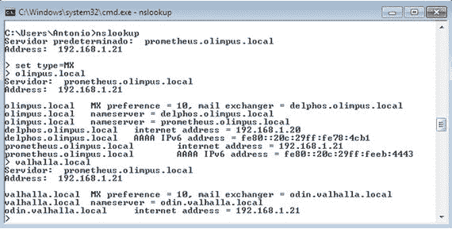

图 9-1。

`nslookup`

如果`name`解析失败，我们将不得不检查网络配置(参见第 [3 章](03.html))。

我们将使用的邮件客户端是 Mozilla Thunderbird。我们可以从 [`www.mozilla.org/thunderbird`](http://www.mozilla.org/thunderbird) 下载。

安装它的方法非常简单，选择缺省值就足以安装软件了。

安装完成后，如果我们启动雷鸟，我们会看到如图 [9-2](#Fig2) 所示的屏幕。

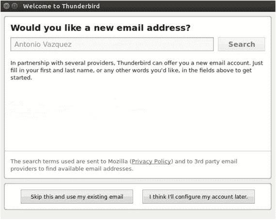

图 9-2。

Launching Thunderbird

Thunderbird 为我们提供了接收新电子邮件帐户的可能性，但目前，这不是我们想要的，所以我们选择了跳过这个选项，使用我现有的电子邮件帐户。在新窗口中，我们在适当的框中输入必要的数据(图 [9-3](#Fig3) )。

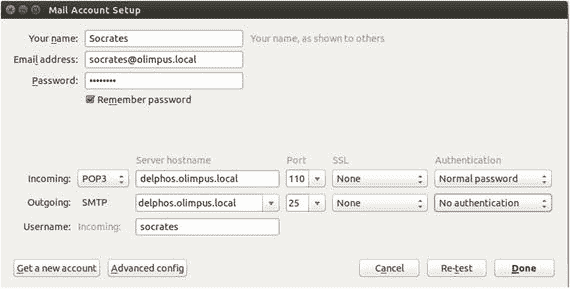

图 9-3。

Configuring a POP3 account

由于我们没有使用 TLS，我们会收到一个关于它的警告(图 [9-4](#Fig4) )。目前，我们承认并接受风险。


图 9-4。

Warning! The traffic won’t be ciphered

现在，用户 socrates 可以通过点击 Get Messages 下载他的消息(图 [9-5](#Fig5) )。

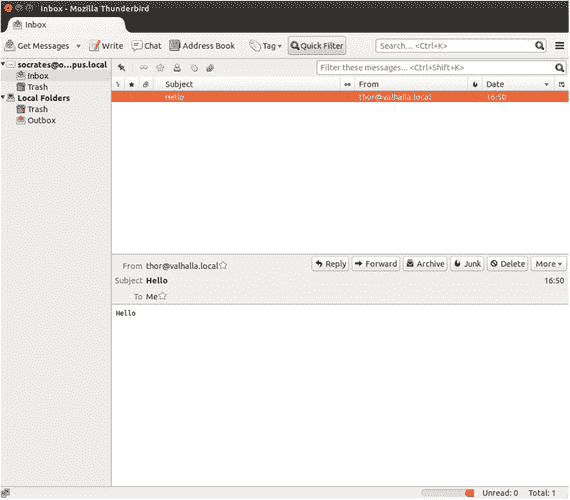

图 9-5。

Receiving the messages

如果客户端计算机与邮件服务器在同一个网络中，一切都应该按预期工作；否则，我们应该编辑`/etc/postfix/main.cf`文件中的参数 mynetworks，以包含客户端计算机所属的网络。例如，如果邮件服务器的 IP 地址是 192.168.1.20，而客户端计算机位于 192.168.10.0/24 网络中，那么我们应该在`/etc/postfix/main.cf`文件中有这样一个参数:

```sh
1   mynetworks = 127.0.0.0/8 192.168.1.0/24 192.168.10.0/24

```

### 9.5.2 IMAP

我们已经看到了如何通过 POP3 接收邮件。但是，默认情况下，当我们从服务器接收邮件时，邮件实际上被复制到客户端并从服务器删除。因此，如果我们试图从另一台计算机连接到服务器，邮箱将是空的，直到新的电子邮件到达。

当我们使用 IMAP 时，不会出现这种情况。相反，在这种情况下，消息保存在服务器中，并与客户端同步。

我们在本节前面已经看到,`dovecot`既可以作为 POP3 服务器，也可以作为 IMAP 服务器。因此，我们不必在主配置中做任何更改，尽管我们必须允许流量通过防火墙的端口 143。

在 centos 6 上:

```sh
1   [root@delphos ∼]# iptables -I INPUT 2 -p tcp --dport 143 -j ACCEPT

```

在 centos 7 上:

```sh
1   [root@CentOS7 ∼]# firewall-cmd --add-port=143/tcp
2   success

```

反正在配置客户端之前，我们可以通过与`telnet`建立连接来测试服务器。

首先，我们打开一个到端口 143 的`telnet`会话。

```sh
1   [root@delphos ∼]# telnet localhost 143
2   Trying ::1...
3   Connected to localhost.
4   Escape character is '^]'.
5   * OK [CAPABILITY IMAP4rev1 LITERAL+ SASL-IR LOGIN-REFERRALS ID ENABLE IDLE START\
6   TLS AUTH=PLAIN] Dovecot ready.

```

接下来，我们通过键入“来识别我们自己。登录用户名和密码。

```sh
1   . LOGIN plato plato
2   . OK [CAPABILITY IMAP4rev1 LITERAL+ SASL-IR LOGIN-REFERRALS ID ENABLE IDLE SORT \
3   SORT=DISPLAY THREAD=REFERENCES THREAD=REFS MULTIAPPEND UNSELECT CHILDREN NAMESPA\
4   CE UIDPLUS LIST-EXTENDED I18NLEVEL=1 CONDSTORE QRESYNC ESEARCH ESORT SEARCHRES W\
5   ITHIN CONTEXT=SEARCH LIST-STATUS]      Logged in

```

我们用`LIST`列出文件夹。

```sh
 1   . LIST "" "*"
 2   * LIST (\NoInferiors \UnMarked) "/" "Trash"
 3   * LIST (\NoInferiors \Marked) "/" "INBOX"
 4   . OK List completed.

```

然后我们检查`INBOX`文件夹，看看是否有任何消息。

```sh
 1   . EXAMINE INBOX
 2   * FLAGS (\Answered \Flagged \Deleted \Seen \Draft)
 3   * OK [PERMANENTFLAGS ()] Read-only mailbox.
 4   * 1 EXISTS
 5   * 0 RECENT
 6   * OK [UIDVALIDITY 1407985588] UIDs valid
 7   * OK [UIDNEXT 2] Predicted next UID
 8   * OK [HIGHESTMODSEQ 1] Highest
 9   . OK [READ-ONLY] Select completed.

```

由于有一条消息，我们可以用`FETCH`看到它的内容。

```sh
 1   . FETCH 1 BODY[]

 2   * 1 FETCH (BODY[] {671}

 3   Return-Path: <socrates@olimpus.local>

 4   X-Original-To: plato@olimpus.local

 5   Delivered-To: plato@olimpus.local

 6   Received: from [192.168.10.100] (unknown [192.168.10.100])

 7           by delphos.centos.local (Postfix) with ESMTP id 508A318B3

 8           for <plato@olimpus.local>; Wed, 13 Aug 2014 23:15:16 -0400 (EDT)

 9   Message-ID: <5487191A.9070502@olimpus.local>

10   Date: Tue, 09 Dec 2014 16:45:30 +0100

11   From: Socrates <socrates@olimpus.local>

12   User-Agent: Mozilla/5.0 (Windows NT 6.1; rv:31.0) Gecko/20100101 Thunderbird/31.\

13   3.0

14   MIME-Version: 1.0

15   To: plato@olimpus.local

16   Subject: Test

17   Content-Type: text/plain; charset=utf-8; format=flowed

18   Content-Transfer-Encoding: 7bit

19
20   Hello Plato

21   )

22   . OK Fetch completed.

```

最后，我们用`LOGOUT`退出。

```sh
1   . LOGOUT
2   * BYE Logging out
3   . OK Logout completed.
4   Connection closed by foreign host.

```

现在柏拉图可以配置雷鸟通过 IMAP 从他的家用电脑访问它的邮箱。这是他(我们)将要做的。

在启动雷鸟之后，我们必须点击跳过这个并使用我现有的电子邮箱(图 [9-6](#Fig6) )并用用户的数据完成表单(图 [9-7](#Fig7) )。


图 9-7。

Fulfilling the form

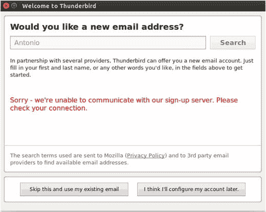

图 9-6。

Configuring an IMAP account

在雷鸟的某些版本中，自动配置似乎存在问题，因此如果是这样的话，我们将不得不使用服务器的 IP 地址而不是名称(图 [9-8](#Fig8) )。


图 9-8。

Configuring the mail account

程序警告用户连接没有被加密(图 [9-9](#Fig9) )。

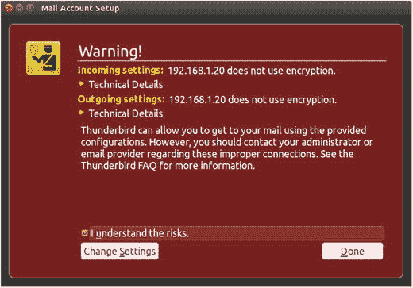

图 9-9。

Warning! The data won’t be ciphered

接受消息后，我们可以接收收到的邮件(图 [9-10](#Fig10) )。

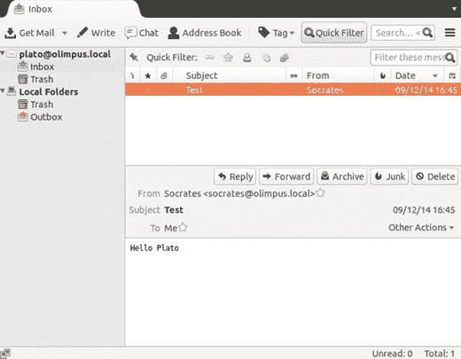

图 9-10。

Receiving mail through IMAP

## 9.6 SMTP 认证

到目前为止，我们已经能够连接到 SMTP 服务器并发送电子邮件，而无需任何身份验证。默认情况下，STMP 服务器根据网络地址允许或拒绝发送电子邮件。这是完全不可取的，因为有人可能会将邮件服务器用于有害的目的，例如发送垃圾邮件。

为了避免这种情况，我们可以使用身份验证。Postfix 本身不提供认证，但是可以和其他软件包一起配置，比如`cyrus`或者`dovecot`来提供认证。出于我们的目的，我们将使用`dovecot`。

为了查明我们的 Postfix 版本是否支持 SASL(简单身份验证和安全层)，我们可以执行以下命令:

```sh
1   [root@delphos ∼]# postconf -a
2   cyrus
3   dovecot

```

结果意味着我们可以用`cyrus`或`dovecot`配置 SASL。

我们必须打开/ `etc/dovecot/conf.d/10-master.conf`文件，编辑`service_auth`部分，如下所示:

```sh
 1   service auth {
 2     # auth_socket_path points to this userdb socket by default. It's typically
 3     # used by dovecot-lda, doveadm, possibly imap process, etc. Its default
 4     # permissions make it readable only by root, but you may need to relax these
 5     # permissions. Users that have access to this socket are able to get a list
 6     # of all usernames and get results of everyone's userdb lookups.
 7     #unix_listener auth-userdb {
 8     #  mode = 0666
 9     #  user = postfix
10     #  group = postfix
11     #}
12   
13     # Postfix smtp-auth
14     unix_listener /var/spool/postfix/private/auth {
15       mode = 0666
16       user = postfix
17       group = postfix
18     }
19   
20   
21     # Auth process is run as this user.
22     #user = $default_internal_user
23   }

```

此外，要使 Outlook Express 和 Windows mail 的身份验证工作，我们还必须编辑`/etc/dovecot/conf.d/10-auth.conf`文件并更改`auth_mechanisms`参数。

```sh
1   auth_mechanisms = plain login

```

在做出更改后，我们只需重启`dovecot`服务。

现在我们也必须对后缀做一些改变。我们打开`/etc/postfix/main.cf`文件并添加以下几行:

```sh
1   smtpd_sasl_type = dovecot
2   smtpd_sasl_path = private/auth
3   smtpd_sasl_auth_enable = yes

```

我们还应该添加另一个参数，以确保身份验证适用于任何邮件客户端。否则，某些程序(如 Outlook Express)可能无法运行。

```sh
1   broken_sasl_auth_clients = yes

```

重启 Postfix 服务器后，我们可以建立一个 Telnet 连接来检查身份验证是否有效。

```sh
 1   [root@prometheus ∼]# telnet delphos.olimpus.local 25
 2   Trying 192.168.1.20...
 3   Connected to delphos.olimpus.local.
 4   Escape character is '^]'.
 5   220 delphos.centos.local ESMTP Postfix
 6   EHLO prometheus.olimpus.local
 7   250-delphos.centos.local
 8   250-PIPELINING
 9   250-SIZE 10240000
10   250-VRFY
11   250-ETRN
12   250-AUTH PLAIN LOGIN
13   250-ENHANCEDSTATUSCODES
14   250-8BITMIME
15   250 DSN

```

正如我们在第`250-AUTH PLAIN LOGIN`行中看到的，服务器现在支持认证。

我们可以尝试通过服务器连接来验证自己的身份。为了执行简单的身份验证，我们必须用 base64 编码用户名和密码。例如，如果我们想用密码“plato”对用户“plato”进行身份验证，我们必须首先对这两个术语进行编码。

最简单的方法可能是使用 Python。使用前面示例中的用户名和密码，我们可以通过以下方式获得 base64 字符串:

```sh
1   [root@delphos ∼]# python -c 'import base64 ; print base64.b64encode("\000plato\0\
2   00plato")'
3   AHBsYXRvAHBsYXRv

```

在我们之前打开的`telnet`会话中，我们必须键入以下内容:

```sh
1   AUTH PLAIN AHBsYXRvAHBsYXRv

```

如果一切正常，我们将看到服务器的如下回答:

```sh
1   235 2.7.0 Authentication successful

```

我们可以像往常一样继续发邮件。

```sh
 1   MAIL FROM:plato@olimpus.local
 2   250 2.1.0 Ok
 3   RCPT TO:socrates@olimpus.local
 4   250 2.1.5 Ok
 5   DATA
 6   354 End data with <CR><LF>.<CR><LF>
 7   From:plato@olimpus.local
 8   Subject:Authentication test
 9   We had to authenticate to send this email
10   .
11   250 2.0.0 Ok: queued as 7B03C18B9
12   QUIT
13   221 2.0.0 Bye
14   Connection closed by foreign host.

```

到目前为止，服务器支持身份验证，但它也接受来自未经身份验证的客户端的电子邮件，这些客户端的网络地址包含在主配置文件`/etc/postfix/main.cf`的`mynetworks`参数中。为了避免这种情况，我们将这个参数改回来。

```sh
1   mynetworks = 127.0.0.0/8

```

我们还必须添加以下新参数，以限制仅向经过身份验证的用户发送邮件的能力:

```sh
1   smtpd_client_restrictions = permit_sasl_authenticated, reject_unknown_client_hos\
2   tname, reject
3   smtpd_sender_restrictions = permit_sasl_authenticated, reject

```

这样，我们允许经过身份验证的用户发送电子邮件(`permit_sasl_authenticated`)，而拒绝来自主机名未知的客户端的邮件(`reject_unknown_client_hostname`)。

Note

然而，这种配置可能过于严格，因为现在，它将拒绝来自其他邮件服务器的消息，比如来自`valhalla.local`邮件服务器的消息。因此，也许在验证 SMTP 认证按预期工作后，您应该删除`reject`参数，以免它干扰本书中的其余练习。

现在任何想从我们的服务器发送邮件的人都必须通过认证。我们可以和雷鸟核实一下。首先，我们必须单击该帐户链接的查看设置(图 [9-11](#Fig11) )。

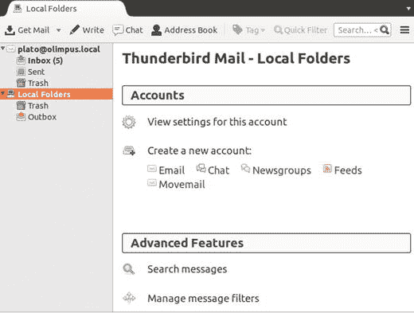

图 9-11。

Editing the account settings

接下来，我们编辑账户设置(图 [9-12](#Fig12) )并将认证方法修改为“无认证”(图 [9-13](#Fig13) )。


图 9-13。

Selecting no authentication

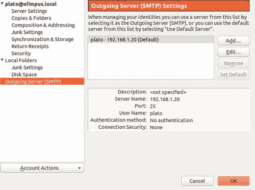

图 9-12。

Outgoing mail settings

如果现在我们试图发送一封电子邮件，我们将收到一个错误(图 [9-14](#Fig14) )。


图 9-14。

You’re not authorized to send e-mail

如果我们将帐户设置改回“密码，不安全传输”(图 [9-15](#Fig15) )，我们将能够再次发送电子邮件。

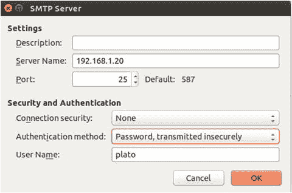

图 9-15。

Configuring SMTP authentication

## 9.7 安全连接

我们已经知道如何使用纯文本身份验证来验证 SMTP 用户。当然，更明智的做法是对流量进行加密，这样就没有人能够窃听连接。

### 9.7.1 保护 SMTP 连接

首先，我们必须生成证书。我们已经在第 [7](07.html) 章和第 [8](08.html) 章看到了这个过程，所以这里我只展示必要的命令，没有进一步的解释。

```sh
 1   [root@delphos ∼]# openssl genrsa -des3 -out MAILsecure.key
 2   .
 3   .
 4   .
 5   [root@delphos ∼]# openssl req -new -key MAILsecure.key -out MAILsecure.csr
 6   .
 7   .
 8   .
 9   [root@delphos ∼]# cp MAILsecure.key MAILsecure.key.orig
10   [root@delphos ∼]# openssl rsa -in MAILsecure.key.orig -out MAILsecure.key
11   .
12   .
13   .
14   [root@delphos ∼]# openssl x509 -req -days 365 -in MAILsecure.csr -signkey MAILse\
15   cure.key -out MAILsecure.crt

```

我们将证书和密钥文件复制到默认位置。

```sh
 1   [root@delphos ∼]# cp MAILsecure.crt /etc/postfix/
 2   [root@delphos ∼]# cp MAILsecure.key /etc/postfix/

```

现在我们必须将以下参数添加到`/etc/postfix/main.cf`文件中。

```sh
 1   smtpd_use_tls = yes
 2   smtpd_tls_cert_file = /etc/postfix/MAILsecure.crt
 3   smtpd_tls_key_file = /etc/postfix/MAILsecure.key

```

现在我们重新启动服务。

在 centos 6 上:

```sh
 1   [root@delphos ∼]# service postfix restart
 2   Shutting down postfix:                                    [ OK ]
 3   Starting postfix:                                         [ OK ]

```

在 centos 7 上:

```sh
 1   [root@CentOS7 ∼]# systemctl restart postfix

```

接下来，在 Thunderbird(或者你正在使用的任何邮件客户端)中，我们更改 SMTP 设置。我们可以在图 [9-16](#Fig16) 中看到原始设置。

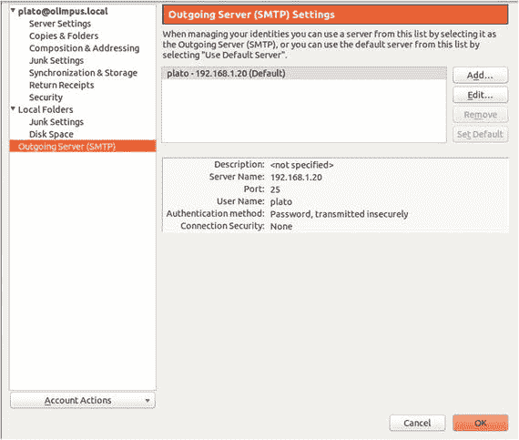

图 9-16。

Original SMTP settings

我们应该将设置更改为类似于图 [9-17](#Fig17) 所示的内容。


图 9-17。

New SMTP settings

我们接受更改并尝试发送电子邮件(图 [9-18](#Fig18) )。

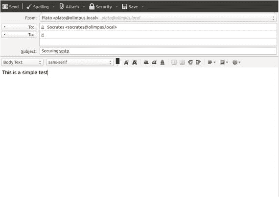

图 9-18。

New SMTP settings

更改设置后，我们第一次发送电子邮件时，会收到以下警告(图 [9-19](#Fig19) )。

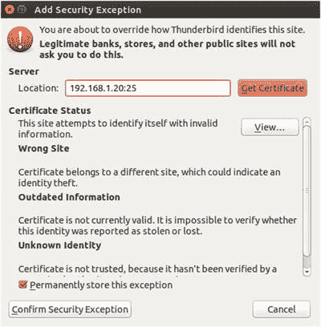

图 9-19。

New SMTP settings

我们确认安全异常，然后发送消息。

### 国际测绘卫星计划

除了使用安全连接来发送电子邮件，我们还可以——也应该——使用安全连接来接收邮件。

在这种情况下，没有必要创建证书，因为默认安装已经在`/etc/pki/dovecot/certs/dovecot.pem`中创建了一个我们可以使用的示例证书。当然，如果我们愿意，我们可以创建自定义证书。为了做到这一点，我们只需像在本书前面章节中所做的那样创建一个证书。

我们应该在邮件帐户中重新打开服务器设置，并选择安全设置➤ SSL/TLS(图 [9-20](#Fig20) )。

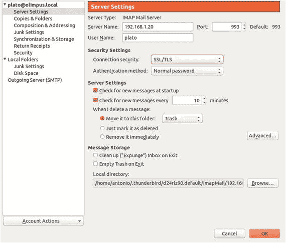

图 9-20。

New IMAPS settings

在服务器中，我们打开 TCP 端口 993，以允许到 IMAPS 端口的传入连接。

在 centos 6 上:

```sh
 1   [root@delphos dovecot]# iptables -I INPUT 2 -p tcp --dport 993 -j ACCEPT

```

在 centos 7 上:

```sh
 1   [root@CentOS7 ∼]# firewall-cmd --add-service=imaps
 2   success

```

现在，当我们第一次尝试接收邮件时，我们会收到通常的警告消息(图 [9-21](#Fig21) )。


图 9-21。

Security exception

如果我们点击“查看…”我们可以看到这是默认安装的带有`dovecot`的样本证书(图 [9-22](#Fig22) )。

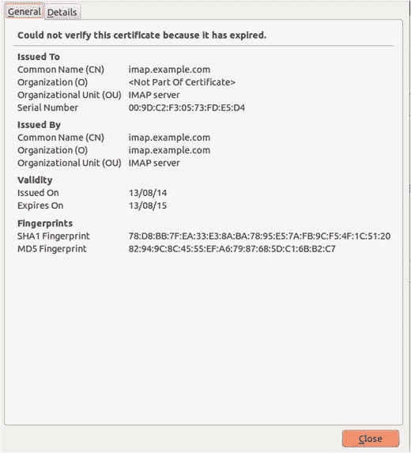

图 9-22。

View certificate

现在我们可以通过安全端口接收邮件。

我们也可以从命令行测试连接，但是，由于连接是加密的，我们不能使用`telnet`而必须使用`openssl`来代替。

```sh
  1   [root@dummy-server ∼]# openssl s_client -connect 192.168.1.20:993

  2   CONNECTED(00000003)

  3   depth=0 OU = IMAP server, CN = imap.example.com, emailAddress = postmaster@examp\

  4   le.com

  5   verify error:num=18:self signed certificate

  6   verify return:1

  7   depth=0 OU = IMAP server, CN = imap.example.com, emailAddress = postmaster@examp\

  8   le.com

  9   verify return:1

 10   ---

 11   Certificate chain

 12   0 s:/OU=IMAP server/CN=imap.example.com/emailAddress=postmaster@example.com

 13     i:/OU=IMAP server/CN=imap.example.com/emailAddress=postmaster@example.com

 14   ---

 15   Server certificate

 16   -----BEGIN CERTIFICATE-----

 17   MIICQzCCAaygAwIBAgIJAJ3C8wVz/eXUMA0GCSqGSIb3DQEBBQUAMFgxFDASBgNV

 18   BAsTC0lNQVAgc2VydmVyMRkwFwYDVQQDExBpbWFwLmV4YW1wbGUuY29tMSUwIwYJ

 19   KoZIhvcNAQkBFhZwb3N0bWFzdGVyQGV4YW1wbGUuY29tMB4XDTE0MDgxMzE2NTEy

 20   OFoXDTE1MDgxMzE2NTEyOFowWDEUMBIGA1UECxMLSU1BUCBzZXJ2ZXIxGTAXBgNV

 21   BAMTEGltYXAuZXhhbXBsZS5jb20xJTAjBgkqhkiG9w0BCQEWFnBvc3RtYXN0ZXJA

 22   ZXhhbXBsZS5jb20wgZ8wDQYJKoZIhvcNAQEBBQADgY0AMIGJAoGBALrix1jhz1bD

 23   z31tkBW13svsvfXu6uvwjmyN06v7onaGOsRvjr/ATqI4Nn4g+mRNmIqAm3cefygO

 24   wge/0MXefKfEiV+LdQBMQJ5VN3x1fwPLNddFx1AxKaGFK/W9q8m1ohbQm4XH3w98

 25   NSSdsxStUWD3lQWEEP50wKFYZe2VmwJTAgMBAAGjFTATMBEGCWCGSAGG+EIBAQQE

 26   AwIGQDANBgkqhkiG9w0BAQUFAAOBgQCT/2fazqCSzsgiMs7vE0921GKYLvduGvux

 27   vxw68Tkp8tgHlPQcNpLVyS8fhz+h/1TLEwiOZJ19njuBaHADEwjdooGvJs6U4qrb

 28   W1XSLDNpYZzP1jNIE8Gx3tgs8yksSjKcSTSw+Z7Z86MboLmyO2BmugOuk0mXCzx+

 29   9d+rmVO8KQ==

 30   -----END CERTIFICATE-----

 31   subject=/OU=IMAP server/CN=imap.example.com/emailAddress=postmaster@example.com

 32   issuer=/OU=IMAP server/CN=imap.example.com/emailAddress=postmaster@example.com

 33   ---

 34   No client certificate CA names sent

 35   ---

 36   SSL handshake has read 1301 bytes and written 311 bytes

 37   ---

 38   New, TLSv1/SSLv3, Cipher is DHE-RSA-AES256-SHA

 39   Server public key is 1024 bit

 40   Secure Renegotiation IS supported

 41   Compression: zlib compression

 42   Expansion: zlib compression

 43   SSL-Session:

 44        Protocol  :  TLSv1

 45        Cipher     :  DHE-RSA-AES256-SHA

 46        Session-ID :  1DD2E48B77CB8D14487AF5322B27B60B8B41E45BC5F4B080F92CCF98B1C8FCF9

 47        Session-ID-ctx:

 48   Master-Key: DC23DBAF2E3244F4DCEFE51F6266F2462C6B46824FFF24523618AF885E19FA2D\

 49   B82F347FAA8EB9808F7E7AB067183104

 50       Key-Arg    :  None

 51       Krb5 Principal: None

 52       PSK identity: None

 53       PSK identity hint: None

 54       TLS session ticket:

 55       0000 - fd fd cb 5d 36 a7 31 ac-fe 52 03 df f6 09 41 f6       ...]6.1..R....A.

 56       0010 - 2a 65 a7 94 ee 40 86 e0-5a 8a 3c ab 72 2a 7c 78         *e...@..Z.<.r*|x

 57       0020 - b4 7a 8d a9 1b 0f bd f3-97 1a 03 0b c4 25 0b 50        .z...........%.P

 58       0030 - 6d d2 14 41 ce dc 2c 96-2c a7 a5 fd ad 20 80 60         m..A..,.,.... .`

 59       0040 - 7c 0b 51 c4 a8 09 10 93-b2 a8 49 fa d8 23 d2 41        |.Q.......I..#.A

 60       0050 - 42 13 29 ff 3a a6 12 a3-fa 68 48 6d e1 bd 7d 62        B.).:....hHm..}b

 61       0060 - b6 9c 70 07 9d 18 fc 6d-65 d4 6e 52 a9 62 94 12        ..p....me.nR.b..

 62       0070 - b6 b3 e3 7b 95 26 ca e1-df df 05 0f 4c f1 6a b2         ...{.&......L.j.

 63       0080 - 96 34 01 d5 ad 31 87 cb-7e d6 41 d4 c1 2b 8b 46         .4...1..∼.A..+.F

 64       0090 - 82 eb 6a f3 31 4a ab 8a-24 cb a1 ba 7f 7e 1e 13         ..j.1J..$....∼..

 65   
 66   Compression: 1 (zlib compression)

 67   Start Time: 1411844428

 68   Timeout  : 300 (sec)

 69   Verify return code: 18 (self signed certificate)

 70   ---

 71   * OK [CAPABILITY IMAP4rev1 LITERAL+ SASL-IR LOGIN-REFERRALS ID ENABLE IDLE AUTH=\

 72   PLAIN AUTH=LOGIN] Dovecot ready.

 73   . LOGIN plato plato

 74   . OK [CAPABILITY IMAP4rev1 LITERAL+ SASL-IR LOGIN-REFERRALS ID ENABLE IDLE SORT \
 75   SORT=DISPLAY THREAD=REFERENCES THREAD=REFS MULTIAPPEND UNSELECT CHILDREN NAMESPA\
 76   CE UIDPLUS LIST-EXTENDED I18NLEVEL=1 CONDSTORE QRESYNC ESEARCH ESORT SEARCHRES W\
 77   ITHIN CONTEXT=SEARCH LIST-STATUS] Logged in

 78   . LIST "" "*"

 79   * LIST (\NoInferiors \Marked) "/" "Trash"
 80   * LIST (\NoInferiors \UnMarked) "/" "Sent"
 81   * LIST (\NoInferiors \UnMarked) "/" "Drafts"
 82   * LIST (\NoInferiors \UnMarked) "/" "INBOX"
 83   . OK List completed.

 84   . EXAMINE INBOX

 85   * FLAGS (\Answered \Flagged \Deleted \Seen \Draft)

 86   * OK [PERMANENTFLAGS ()] Read-only mailbox.

 87   * 1 EXISTS

 88   * 0 RECENT

 89   * OK [UIDVALIDITY 1407985588] UIDs valid

 90   * OK [UIDNEXT 15] Predicted next UID

 91   * OK [HIGHESTMODSEQ 1] Highest

 92   . OK [READ-ONLY] Select completed.

 93   . FETCH 1 BODY[]
 94   * 1 FETCH (BODY[] {671}
 95   Return-Path: <socrates@olimpus.local>

 96   X-Original-To: plato@olimpus.local

 97   Delivered-To: plato@olimpus.local

 98   Received: from [192.168.10.100] (unknown [192.168.10.100])
 99            by delphos.centos.local (Postfix) with ESMTPSA id D290718C4

100            for <plato@olimpus.local>; Thu, 14 Aug 2014 13:14:39 -0400 (EDT)

101   Message-ID: <54985763.60404@olimpus.local>

102   Date: Mon, 22 Dec 2014 18:39:47 +0100

103   From: Socrates <socrates@olimpus.local>

104   User-Agent: Mozilla/5.0 (Windows NT 6.1; rv:31.0) Gecko/20100101 Thunderbird/31.\

105   3.0

106   MIME-Version: 1.0

107   To: plato@olimpus.local

108   Subject: test imaps

109   Content-Type: text/plain; charset=utf-8; format=flowed

110   Content-Transfer-Encoding: 7bit

111   
112   IMAPS

113   )

114   . OK Fetch completed.

115   . LOGOUT

116   * BYE Logging out

117   . OK Logout completed.

118   closed

```

### POP3S

如果您想使用 POP3S 而不是 POP3，要遵循的过程与前面的“IMAPS”部分几乎相同。您还应该编辑服务器设置并选择 POPS 端口 995。

## 9.8 垃圾邮件

电子邮件的发明方便了世界各地的通信，但也带来了一个新问题，未经请求的邮件或垃圾邮件。为了最大限度地减少这种情况，有许多解决方案可以扫描邮件，搜索与垃圾邮件相关的特定模式，如与性或特定药物相关的术语。

其中一个解决方案是 SpamAssassin，它也是开源的。我们可以用下面的命令安装它:

```sh
1   [root@delphos ∼]# yum install spamassassin

```

安装完成后，我们可以看看`/etc/mail/spamassassin/local.cf`配置文件。

```sh
 1   [root@delphos ∼]# cat /etc/mail/spamassassin/local.cf
 2   # These values can be overridden by editing ∼/.spamassassin/user_prefs.cf
 3   # (see spamassassin(1) for details)
 4   
 5   # These should be safe assumptions and allow for simple visual sifting
 6   # without risking lost emails.
 7   
 8   required_hits 5
 9   report_safe 0
10   rewrite_header Subject [SPAM]

```

SpamAssassin 由一系列 Perl 脚本组成，用于根据不同的标准分析邮件，以确定电子邮件是否是垃圾邮件。根据不同脚本的结果，SpamAssassin 对电子邮件进行评分。分数越高，该邮件是垃圾邮件的可能性就越高。参数`required_hits 5`表示如果 SpamAssassin 的分数为 5 分或更高，则 SpamAssassin 会将电子邮件标记为垃圾邮件。我们可能需要根据需要调整该值，因为高值可能会将不是垃圾邮件的电子邮件标记为垃圾邮件，而低值可能正好相反，使垃圾邮件看起来是干净的。

默认配置中存在的另外两个参数是`report_safe`和`rewrite_header. report_safe`，它们可以取值 0、1 或 2。如果该值设置为 0，则标记为垃圾邮件的电子邮件将按原样发送，只修改邮件头以显示它是垃圾邮件。另一方面，如果该值设置为 1 或 2，SpamAssassin 会生成一个新的报告消息并发送给接收方。原始垃圾邮件将被附加到报告邮件中。值 1 和 2 的区别在于，在第一种情况下，垃圾邮件被编码为内容`message/rfc822`，而在第二种情况下，它将被编码为内容`text/plain`。最后一个选项是最安全的，因为一些邮件客户端可能会执行`message/rfc822`，用户甚至不会注意到。因此，垃圾邮件发送者可以用病毒感染收件人的计算机。

为了测试`spamassassin`，我们可以给它传递一个测试消息。在`/usr/share/doc/spamassassin-3.3.1/`中，我们有两个样本文本文件，一个是垃圾邮件，一个不是。如果我们用`spamassassin`分析“干净”的文件，我们得到的是:

```sh
 1   [root@delphos ∼]# spamassassin /usr/share/doc/spamassassin-3.3.1/sample-nonspam.\
 2   txt
 3   Aug 14 14:46:32.896 [13140] warn: config: created user preferences file: /root/.\
 4   spamassassin/user_prefs
 5   Return-Path: <tbtf-approval@world.std.com>
 6   X-Spam-Checker-Version: SpamAssassin 3.3.1 (2010-03-16) on
 7           delphos.olimpus.local
 8   X-Spam-Level:
 9   X-Spam-Status: No, score=-0.0 required=5.0 tests=T_RP_MATCHES_RCVD
10           autolearn=ham version=3.3.1
11   Delivered-To: foo@foo.com
12   .
13   .
14   .

```

分析的相关部分位于第一行，带有 X-Spam 标题。我们可以看到，该邮件被认为不是垃圾邮件，因为它的得分为 0。

但是如果我们现在分析垃圾邮件样本，结果将完全不同。

```sh
 1   [root@delphos ∼]# spamassassin /usr/share/doc/spamassassin-3.3.1/sample-spam.txt

 2   X-Spam-Checker-Version: SpamAssassin 3.3.1 (2010-03-16) on

 3           delphos.olimpus.local

 4   X-Spam-Flag: YES

 5   X-Spam-Level: **************************************************

 6   X-Spam-Status: Yes, score=1000.0 required=5.0 tests=GTUBE,NO_RECEIVED,

 7           NO_RELAYS autolearn=no version=3.3.1

 8   X-Spam-Report:

 9           * -0.0 NO_RELAYS Informational: message was not relayed via SMTP

10           * 1000 GTUBE BODY: Generic Test for Unsolicited Bulk Email

11           * -0.0 NO_RECEIVED Informational: message has no Received headers

12   Subject: [SPAM] Test spam mail (GTUBE)

13   Message-ID: <GTUBE1.1010101@example.net>

14   Date: Wed, 23 Jul 2003 23:30:00 +0200

15   From: Sender <sender@example.net>

16   To: Recipient <recipient@example.net>

17   Precedence: junk

18   MIME-Version: 1.0

19   Content-Type: text/plain; charset=us-ascii

20   Content-Transfer-Encoding: 7bit

21   X-Spam-Prev-Subject: Test spam mail (GTUBE)

22   
23   This is the GTUBE, the

24           Generic

25           Test for

26           Unsolicited

27           Bulk

28           Email

29   
30   If your spam filter supports it, the GTUBE provides a test by which you

31   can verify that the filter is installed correctly and is detecting incoming

32   spam. You can send yourself a test mail containing the following string of

33   characters (in upper case and with no white spaces and line breaks):

34   
35   XJS*C4JDBQADN1.NSBN3*2IDNEN*GTUBE-STANDARD-ANTI-UBE-TEST-EMAIL*C.34X

36   
37   You should send this test mail from an account outside of your network.

```

在这种情况下，该邮件被视为垃圾邮件，因为它的得分为 1000，当然，这远远高于阈值 5。

现在我们知道了`spamassassin`按预期工作，我们必须将其集成到`postfix`中。最简单的方法可能是使用`procmail. procmail`邮件传递代理(MDA)。这意味着`procmail`从邮件传输代理(MTA)——在本例中是`postfix`——获取邮件，并将其发送到用户的邮箱。此后，用户可以使用任何邮件用户代理(MUA)，如 Mozilla Thunderbird 或 Microsoft Outlook 来检索邮件。

我们必须创建一个名为`/etc/procmailrc`的文件，其内容如下:

```sh
1   :0 hbfw
2   | /usr/bin/spamc

```

这意味着我们将对消息的标题(`h`)和正文(`b`)应用过滤器(`f`)，系统将等待(`w`)直到过滤器被应用。

我们还必须编辑`postfix`配置文件`/etc/postfix/main.cf`。默认情况下，它包含以下行:

```sh
1   #mailbox_command = /some/where/procmail

```

我们必须把这一行改成这样:

```sh
1   mailbox_command = /usr/bin/procmail

```

我们重启`postfix`和`spamassassin`服务。

在 centos 6 上:

```sh
1   [root@delphos ∼]# service postfix restart
2   Shutting down postfix:                                    [ OK ]
3   Starting postfix:                                         [ OK ]
4   [root@delphos ∼]# service spamassassin restart
5   Stopping spamd:                                           [ OK ]
6   Starting spamd:                                           [ OK ]

```

在 centos 7 上:

```sh
1   [root@CentOS7 ∼]# systemctl restart postfix
2   [root@CentOS7 ∼]# systemctl restart spamassassin

```

现在让我们假设有一个入侵者试图向`plato@olimpus.local`发送垃圾邮件。他们可能会发送如图 [9-23](#Fig23) 所示的信息。


图 9-23。

A spam message

当用户 plato 打开他的邮箱时，他会看到被标记为垃圾邮件的消息(图 [9-24](#Fig24) )。

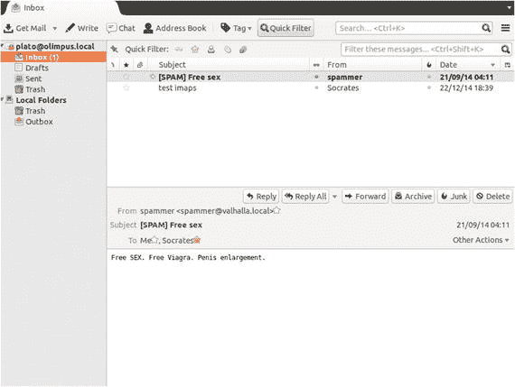

图 9-24。

Mailbox showing the spam message

如果他打开邮件消息，然后单击其他操作➤查看源，他将看到由`spamassassin`添加的邮件标题(图 [9-25](#Fig25) )。


图 9-25。

`spamassassin` headers

由于该邮件已被标记为垃圾邮件，我们可以在 Thunderbird 中创建一个邮件过滤器来删除这些邮件或将它们移动到不同的文件夹中。

## 9.9 网络邮件

在公司网络中，人们通常使用 POP3S、IMAPS 等协议通过邮件客户端访问他们的邮箱。但是，另一方面，家庭用户通常更喜欢通过网络邮件访问他们的邮箱。知名互联网公司如谷歌、雅虎。、或 Hotmail 提供此服务。

为了让我们的服务器提供网络邮件服务，我们将使用`squirrelmail`软件，该软件可从[互联网](http://squirrelmail.org)下载。为了让这个软件正常工作，我们需要一个支持 PHP 的网络服务器(见第七章)和一个 IMAP 服务器。

`squirrelmail`也可以在 EPEL 库中获得，所以它可以像往常一样与`yum`一起安装。然而，这一次，我们将把重点放在手动安装上，因为有时管理员不得不这样安装软件。

下载完`squirrelmail-webmail-1.4.22.tar.gz`文件后，我们将它解压缩到一个文件夹中，Apache web 服务器可以从这个文件夹中访问它。如果你已经完成了这本书的第七章[和](07.html)，你将拥有一个网站( [`www.olimpus.local`](http://www.olimpus.local) )，其文件存储在`/www/docs/olimpus.local`。您可以下载软件并将其解压缩到该位置。

```sh
1   [root@delphos html]# cd /www/docs/olimpus.local/
2   [root@delphos olimpus.local]# ls
3   index.html  squirrelmail-webmail-1.4.22.tar.gz   test.php
4   [root@delphos olimpus.local]# tar -xzvf squirrelmail-webmail-1.4.22.tar.gz

```

我们将创建的文件夹重命名为更容易记住的名称，比如`webmail`。

```sh
1   [root@delphos olimpus.local]# ls
2   index.html                      squirrelmail-webmail-1.4.22.tar.gz
3   squirrelmail-webmail-1.4.22     test.php
4   [root@delphos olimpus.local]# mv squirrelmail-webmail-1.4.22 webmail
5   [root@delphos olimpus.local]# ls
6   index.html   squirrelmail-webmail-1.4.22.tar.gz   test.php    webmail

```

需要一个文件夹来创建和隐藏一些临时文件。默认情况下，这个文件夹是`/var/local/squirrelmail/data/`。我们这样创建它:

```sh
1   [root@delphos olimpus.local]# mkdir -p /var/local/squirrelmail/data
2   [root@delphos olimpus.local]#

```

`squirrelmail`也需要对这个目录进行写访问，所以我们必须授予 Apache 用户适当的权限，因为 Apache 是执行`squirrelmail`的用户。我们可以通过将文件夹的所有权分配给 Apache 用户来做到这一点。

```sh
1   [root@delphos olimpus.local]# ls -ld /var/local/squirrelmail/data/
2   drwxr-xr-x. 2 root root 4096 Aug 14 21:47 /var/local/squirrelmail/data/
3   [root@delphos olimpus.local]# chown apache /var/local/squirrelmail/data/
4   [root@delphos olimpus.local]# ls -ld /var/local/squirrelmail/data/
5   drwxr-xr-x. 2 apache root 4096 Aug 14 21:47 /var/local/squirrelmail/data/

```

我们还必须创建另一个文件夹来管理邮件附件。默认情况下，这个目录是`/var/lo- cal/squirrelmail/attach`。我们创建它并将所有权授予 Apache 用户。

```sh
1   [root@delphos olimpus.local]# mkdir /var/local/squirrelmail/attach
2   [root@delphos olimpus.local]# chown apache /var/local/squirrelmail/attach/

```

现在我们必须访问`webmail/config`子文件夹并启动 Perl 脚本`conf.pl`。

```sh
1   [root@delphos olimpus.local]# cd webmail/config
2   [root@delphos config]# ./conf.pl

```

我们将看到以下菜单:

```sh
 1   SquirrelMail Configuration : Read: config_default.php (1.4.0)
 2   -------------------------------------------------------------
 3   Main Menu --
 4    1\. Organization Preferences
 5    2\. Server Settings
 6    3\. Folder Defaults
 7    4\. General Options
 8    5\. Themes
 9    6\. Address Books
10    7\. Message of the Day (MOTD)
11    8\. Plugins
12    9\. Database
13   10\. Languages
14   
15   D.  Set pre-defined settings for specific IMAP servers
16   
17   C   Turn color on
18   S   Save data
19   Q   Quit
20   
21   Command >>

```

我们编辑服务器设置(选项 2)，我们看到以下屏幕:

```sh
 1   SquirrelMail Configuration    : Read: config_default.php (1.4.0)
 2   ----------------------------------------------------------------
 3   Server Settings
 4   
 5   General
 6   -------
 7   1\.  Domain                      : example.com
 8   2\.  Invert Time                 : false
 9   3\.  Sendmail or SMTP            : SMTP
10   
11   A.  Update IMAP Settings        : localhost:143 (other)
12   B.  Update SMTP Settings        : localhost:25
13   
14   R   Return to Main Menu
15   C   Turn color on
16   S   Save data
17   Q   Quit
18   
19   Command >>

```

我们将域更改为`olimpus.local`。

```sh
 1   Command >> 1
 2   
 3   The domain name is the suffix at the end of all email addresses. If
 4   for example, your email address is jdoe@example.com, then your domain
 5   would be example.com.
 6   
 7   [example.com]: olimpus.local
 8   SquirrelMail Configuration   : Read: config_default.php (1.4.0)
 9   ---------------------------------------------------------------
10   Server Settings
11   
12   General
13   -------
14   1\.  Domain                     : olimpus.local
15   2\.  Invert Time                : false
16   3\.  Sendmail or SMTP           : SMTP
17   
18   A.  Update IMAP Settings       : localhost:143 (other)
19   B.  Update SMTP Settings       : localhost:25
20   
21   R   Return to Main Menu
22   C   Turn color on
23   S   Save data
24   Q   Quit

```

由于我们使用 SMTP 认证，我们还必须更新 SMTP 设置(选项 B)。

```sh
 1   Command >> B
 2   SquirrelMail Configuration     : Read: config.php (1.4.0)
 3   ---------------------------------------------------------
 4   Server Settings
 5   
 6   General
 7   -------
 8   1\.  Domain                      : olimpus.local
 9   2\.  Invert Time                 : false
10   3\.  Sendmail or SMTP            : SMTP
11   
12   SMTP Settings
13   -------------
14   4\.   SMTP Server                : localhost
15   5\.   SMTP Port                  : 25
16   6\.   POP before SMTP            : false
17   7\.   SMTP Authentication        : none
18   8\.   Secure SMTP (TLS)          : false
19   9\.   Header encryption key     :
20   
21   A.   Update IMAP Settings      : localhost:143 (other)
22   H.   Hide SMTP Settings
23   
24   R    Return to Main Menu
25   C    Turn color on
26   S    Save data
27   Q    Quit
28   
29   Command >>

```

我们键入 7 并指定身份验证机制。

```sh
 1   Command >> 7
 2   
 3   If you have already set the hostname and port number, I can try to
 4   automatically detect the mechanisms your SMTP server supports.
 5   Auto-detection is *optional* - you can safely say "n" here.
 6   
 7   Try to detect auth mechanisms? [y/N]: y
 8   Trying to detect supported methods (SMTP)...
 9   Testing none:            SUPPORTED
10   Testing login:           SUPPORTED
11   Testing plain:       SUPPORTED
12   Testing CRAM-MD5:    NOT SUPPORTED
13   Testing DIGEST-MD5:  NOT SUPPORTED
14   
15   What authentication mechanism do you want to use for SMTP connections?
16   none - Your SMTP server does not require authorization.
17   login - Plaintext. If you can do better, you probably should.
18   plain - Plaintext. If you can do better, you probably should.
19   cram-md5 - Slightly better than plaintext.
20   digest-md5 - Privacy protection - better than cram-md5.
21   
22   *** YOUR SMTP SERVER MUST SUPPORT THE MECHANISM YOU CHOOSE HERE ***
23   If you don't understand or are unsure, you probably want "none"
24   
25   none, login, plain, cram-md5, or digest-md5 [none]: plain
26   SMTP authentication uses IMAP username and password by default.
27   
28   Would you like to use other login and password for all SquirrelMail
29   SMTP connections? [y/N]:
30   SquirrelMail Configuration : Read: config.php (1.4.0)
31   ---------------------------------------------------------
32   Server Settings
33   
34   General
35   -------
36   1\.  Domain                      : olimpus.local
37   2\.  Invert Time                 : false
38   3\.  Sendmail or SMTP            : SMTP
39   
40   SMTP Settings
41   -------------
42   4\.  SMTP Server                 : localhost
43   5\.  SMTP Port                   : 25
44   6\.  POP before SMTP             : false
45   7\.  SMTP Authentication         : plain (with IMAP username and password)
46   8\.  Secure SMTP (TLS)           : false
47   9\.  Header encryption key :
48   
49   A.  Update IMAP Settings        : localhost:143 (other)
50   H.  Hide SMTP Settings
51   
52   R   Return to Main Menu
53   C   Turn color on
54   S   Save data
55   Q   Quit
56   
57   Command >>

```

完成设置更改后，选择`S`保存数据，选择`Q`退出。除了更改服务器设置，我们还必须告诉 SELinux 允许 Apache 启动连接。

有一个 SELinux 布尔值，其默认值拒绝来自 Apache 的网络连接。我们必须改变这种价值观。

```sh
1   [root@delphos config]# getsebool httpd_can_network_connect
2   httpd_can_network_connect --> off
3   [root@delphos config]# setsebool httpd_can_network_connect on
4   [root@delphos config]# getsebool httpd_can_network_connect
5   httpd_can_network_connect --> on

```

完成此操作后，我们可以通过打开 web 浏览器并键入以下地址来检查配置是否正确:“ [`http://192.168.1.20/webmail/src/configtest.php`](http://192.168.1.20/webmail/src/configtest.php) ”

我们可以看到一个关于 PHP 选项的错误(图 [9-26](#Fig26) )。这个错误不应该是服务器正常工作的问题。无论如何，我们能很容易地修理它。我们只需编辑`/etc/php.ini`文件，并将参数 short_open_tag 的值从`Off`更改为`On`。

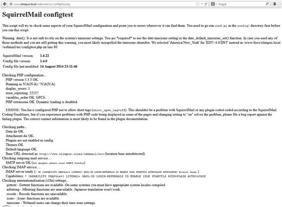

图 9-26。

Webmail test page

重启 Apache 后，我们再次访问测试页面(图 [9-27](#Fig27) ),应该不会再看到任何错误。


图 9-27。

Webmail test page. The configuration is correct.

在 centos 6 上:

```sh
1   [root@delphos config]# service httpd restart
2   Stopping httpd:                                            [ OK ]
3   Starting httpd:                                            [ OK ]

```

在 centos 7 上:

```sh
1   [root@CentOS7 ∼]# systemctl restart httpd

```

现在我们可以点击页面底部的“立即登录”链接，输入用户名和密码(图 [9-28](#Fig28) )。


图 9-28。

Login page

用户现在能够使用网络浏览器发送和接收邮件(图 [9-29](#Fig29) )。


图 9-29。

Accessing a mailbox with a web browser Footnotes [1](#Fn1_source)

SquirrelMail， [`http://squirrelmail.org`](http://squirrelmail.org) ，1999–2016。