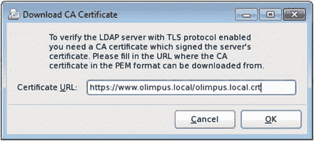
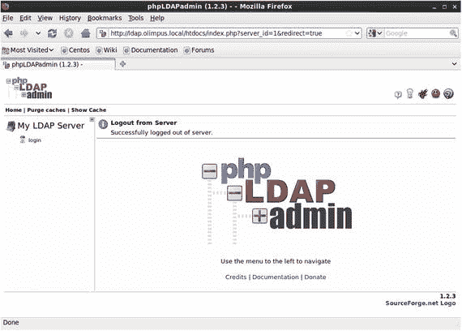
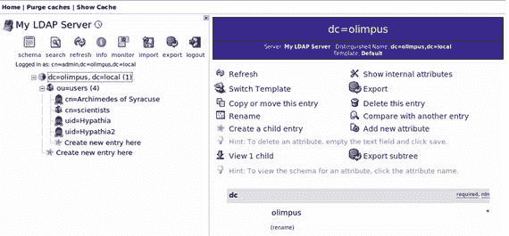
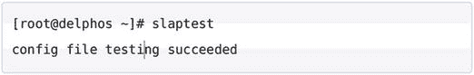
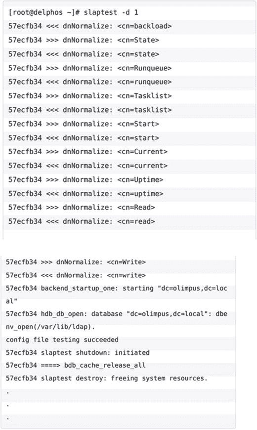

# 11.OpenLDAP

默认情况下，Linux 系统保留了所有用户的本地注册表。这个注册表就是`/etc/passwd`文件。在这个文件中，我们可以看到每个注册用户都有一行。因此，为了访问计算机，我们必须在该计算机中定义一个用户。当我们只有几台计算机时，这是可以的，但是如果我们有几十或几百台计算机，在所有计算机中创建新用户或更改密码可能是一场噩梦。

解决方案是集中用户帐户管理，即拥有一个公共数据库来保存与用户帐户相关的所有信息。有许多方法可以实现这一点，但是今天使用最多的可能是轻量级目录访问协议(LDAP)的一个变种。

LDAP 保留一个中央数据库，用户、计算机以及一般来说所有网络对象都在其中注册。该协议有多种实现方式，例如微软的 Active Directory 或 Novell 的 e Directory。这里我们将使用 OpenLDAP，这是该协议的一个免费实现。

## 11.1 安装 OpenLDAP

首先，我们必须安装`openldap`、`openldap-servers`和`openldap-clients`包。

```sh
1   [root@delphos ∼]# yum install openldap openldap-servers openldap-clients

```

我们确保`slapd`服务被配置为自动引导，然后我们启动该服务。

在 centos 6 上:

```sh
1   [root@delphos cn=config]# chkconfig slapd on
2   [root@delphos cn=config]# service slapd start
3   Starting slapd:                                             [  OK  ]

```

在 centos 7 上:

```sh
1   [root@CentOS7 ∼]# systemctl enable slapd
2   ln -s '/usr/lib/systemd/system/slapd.service' '/etc/systemd/system/multi-user.ta\
3   rget.wants/slapd.service'
4   [root@CentOS7 ∼]# systemctl start slapd

```

## 11.2 定制安装

一旦安装完毕，我们必须为管理员用户生成一个密码。在这个例子中，我们使用一个简单的密码:“pass”

```sh
1   [root@delphos ∼]# slappasswd
2   New password:
3   Re-enter new password:
4   {SSHA}Ftvq59j9XWVHRnfEplQvMiRBfthieUMU

```

这里，我们假设 root 用户和 OpenLDAP 管理员是同一个人，但情况并非总是如此。如果是后者，OpenLDAP 管理员必须在以后修改她的密码。

以前，有一个名为`/etc/openldap/slapd.d/slapd.conf`的文件，其中保存了 OpenLDAP 服务器的配置。但是现在配置保存在 LDAP 数据库本身中。尽管如此，我们需要修改的相关文件仍然在`/etc/openldap/slapd.d`中。

```sh
1   [root@delphos ∼]# ls /etc/openldap/slapd.d/
2   cn=config   cn=config.ldif

```

我们可以直接修改这些文件，也可以使用`ldapmodify`命令。对于初学者来说，编辑文件可能更容易，但是推荐的编辑 OpenLDAP 的方法是使用`ldapmodify`，这就是我们要做的。我们将在接下来的章节中更详细地了解如何使用`ldapmodify`。现在，为了启动一个有效的 OpenLDAP 安装，我将简要描述必要的步骤。

### 修改对象

OpenLDAP 实际上将其信息存储在存储后端。我们可以把这些后端看作 OpenLDAP 使用的数据库。使用最多的后端之一一直是 Berkeley DB 后端，比如`bdb`，或者更近的`hdb`。存储在`hdb`后端的信息可以在`/etc/openldap/slapd.d/cn=config/olcDatabase={2}hdb.ldif`文件中找到。

全新安装后，`/etc/openldap/slapd.d/cn=config/olcDatabase={2}hdb.ldif`文件的内容如下:

```sh
 1   .
 2   .
 3   .
 4   # AUTO-GENERATED FILE - DO NOT EDIT!! Use ldapmodify.
 5   # CRC32 373d43d6
 6   dn: olcDatabase={2}hdb
 7   objectClass: olcDatabaseConfig
 8   objectClass: olcHdbConfig
 9   olcDatabase: {2}hdb
10   olcDbDirectory: /var/lib/ldap
11   olcSuffix: dc=my-domain,dc=com
12   olcRootDN: cn=Manager,dc=my-domain,dc=com
13   olcDbIndex: objectClass eq,pres
14   olcDbIndex: ou,cn,mail,surname,givenname eq,pres,sub
15   structuralObjectClass: olcHdbConfig
16   entryUUID: b8596292-eb3d-1034-860a-e7b4503cc451
17   creatorsName: cn=config
18   createTimestamp: 20150909125458Z
19   entryCSN: 20150909125458.235214Z#000000#000#000000
20   modifiersName: cn=config
21   modifyTimestamp: 20150909125458Z
22   .
23   .
24   .

```

LDIF (LDAP 数据交换格式)是一种文本格式，用于从 LDAP 服务器检索信息以及更新信息。在 LDIF 文件中，我们首先确定想要添加、更改等的元素。为了惟一地标识一个元素，我们使用了`dn`(可分辨名称)属性，它正是为此而创建的。因此，我们的 LDIF 文件的第一行可能是这样的:

```sh
1   dn: olcDatabase={2}hdb,cn=config

```

接下来，我们指定是否要添加、修改属性等。

```sh
1   changeType: modify

```

如果我们想要修改一个条目，我们也必须澄清我们是否要替换一个属性，删除它，等等。

```sh
1   replace: olcSuffix

```

最后，我们键入修改后的属性的新值。

```sh
1   olcSuffix: dc=olimpus,dc=local

```

你会在整本书中看到许多 LDIF 的例子，但是现在，让我们回到`/etc/openldap/s- lapd.d/cn=config/olcDatabase={2}hdb.ldif`文件。我们必须修改(至少)这两个条目:

```sh
1   olcSuffix: dc=my-domain,dc=com
2   olcRootDN: cn=Manager,dc=my-domain,dc=com

```

我们必须添加一个新条目来存储管理员的密码(olcRootPW)，在这里我们将存储刚刚用`slappasswd`命令创建的密码。

为了使用`ldapmodify`进行所有这些更改，我们必须准备一个 LDIF 文件，如下所示:

```sh
1   dn: olcDatabase={2}hdb,cn=config
2   changeType: modify
3   replace: olcSuffix
4   olcSuffix: dc=olimpus,dc=local
5   -
6   replace: olcRootDN
7   olcRootDN: cn=admin,dc=olimpus,dc=com

```

第一行标识了我们将要更改的 LDAP 中的主条目。就在刚才，我们在`/etc/openldap/slapd.d/cn=config/olcDatabase={2}hdb.ldif`文件中看到了参数`olcSuffix`。在这个文件中，`dn`属性是`dn: olcDatabase={2}hdb`，由于文件在`config`文件夹中，所以完整的`dn`属性是`dn: olcDatabase={2}hdb,cn=config`。

另一种可能更好的方法是使用`ldapsearch`命令来识别创建 LDIF 文件所需的数据。

```sh
 1   [root@CentOS7-LPI300 ∼]# ldapsearch -Y EXTERNAL -H ldapi:/// -b cn=config olcDat\
 2   abase=\*
 3   SASL/EXTERNAL authentication started
 4   SASL username: gidNumber=0+uidNumber=0,cn=peercred,cn=external,cn=auth
 5   SASL SSF: 0
 6   # extended LDIF
 7   #
 8   # LDAPv3
 9   # base <cn=config> with scope subtree
10   # filter: olcDatabase=*
11   # requesting: ALL
12   #
13   
14   # {-1}frontend, config
15   dn: olcDatabase={-1}frontend,cn=config
16   objectClass: olcDatabaseConfig
17   objectClass: olcFrontendConfig
18   olcDatabase: frontend
19   
20   # {0}config, config
21   dn: olcDatabase={0}config,cn=config
22   objectClass: olcDatabaseConfig
23   olcDatabase: {0}config
24   olcAccess: {0}to * by dn.base="gidNumber=0+uidNumber=0,cn=peercred,cn=external,c\
25   n=auth" manage by * none
26   
27   # {1}monitor, config
28   dn: olcDatabase={1}monitor,cn=config
29   objectClass: olcDatabaseConfig
30   olcDatabase: {1}monitor
31   olcAccess: {0}to * by dn.base="gidNumber=0+uidNumber=0,cn=peercred,cn=external,c\
32   n=auth" read by dn.base="cn=Manager,dc=my-domain,dc=com" read by * none
33   
34   # {2}hdb, config
35   dn: olcDatabase={2}hdb,cn=config
36   objectClass: olcDatabaseConfig
37   objectClass: olcHdbConfig
38   olcDatabase: {2}hdb
39   olcDbDirectory: /var/lib/ldap
40   olcSuffix: dc=my-domain,dc=com
41   olcRootDN: cn=Manager,dc=my-domain,dc=com
42   olcDbIndex: objectClass eq,pres
43   olcDbIndex: ou,cn,mail,surname,givenname eq,pres,sub
44   
45   # search result
46   search: 2
47   result: 0 Success
48   
49   # numResponses: 5
50   # numEntries: 4

```

我们用适当的名称保存 LDIF 文件，例如`my_config.ldif`，然后执行`ldapmodify`。

```sh
1   [root@CentOS7-LPI300 ∼]# ldapmodify -Y EXTERNAL -H ldapi:/// -f my_config.ldif
2   SASL/EXTERNAL authentication started
3   SASL username: gidNumber=0+uidNumber=0,cn=peercred,cn=external,cn=auth
4   SASL SSF: 0
5   modifying entry "olcDatabase={2}hdb,cn=config"

```

现在我们创建另一个 LDIF 文件(`my_config2.ldif`)来添加`olcRootPW`属性。

```sh
1   [root@CentOS7-LPI300 ∼]# cat my_config2.ldif
2   dn: olcDatabase={2}hdb,cn=config
3   changeType: modify
4   add: olcRootPW
5   olcRootPW: {SSHA}Ftvq59j9XWVHRnfEplQvMiRBfthieUMU

```

我们再次执行`ldapmodify`。

```sh
1   [root@CentOS7-LPI300 ∼]# ldapmodify -Y EXTERNAL -H ldapi:/// -f my_config2.ldif
2   SASL/EXTERNAL authentication started
3   SASL username: gidNumber=0+uidNumber=0,cn=peercred,cn=external,cn=auth
4   SASL SSF: 0
5   modifying entry "olcDatabase={2}hdb,cn=config"

```

为了检查更改，我们可以再次使用`ldapsearch`命令。

```sh
 1   [root@CentOS7-LPI300 ∼]# ldapsearch -Y EXTERNAL -H ldapi:/// -b cn=config olcDat\
 2   abase=\*
 3   SASL/EXTERNAL authentication started
 4   SASL username: gidNumber=0+uidNumber=0,cn=peercred,cn=external,cn=auth
 5   SASL SSF: 0
 6   # extended LDIF
 7   #
 8   # LDAPv3
 9   # base <cn=config> with scope subtree
10   # filter: olcDatabase=*
11   # requesting: ALL
12   #
13   
14   # {-1}frontend, config
15   dn: olcDatabase={-1}frontend,cn=config
16   objectClass: olcDatabaseConfig
17   objectClass: olcFrontendConfig
18   olcDatabase: frontend
19   
20   # {0}config, config
21   dn: olcDatabase={0}config,cn=config
22   objectClass: olcDatabaseConfig
23   olcDatabase: {0}config
24   olcAccess: {0}to * by dn.base="gidNumber=0+uidNumber=0,cn=peercred,cn=external,c\
25   n=auth" manage by * none
26   
27   # {1}monitor, config
28   dn: olcDatabase={1}monitor,cn=config
29   objectClass: olcDatabaseConfig
30   olcDatabase: {1}monitor
31   olcAccess: {0}to * by dn.base="gidNumber=0+uidNumber=0,cn=peercred,cn=external,c\
32   n=auth" read by dn.base="cn=admin,dc=olimpus,dc=local" read by * none
33   
34   # {2}hdb, config
35   dn: olcDatabase={2}hdb,cn=config
36   objectClass: olcDatabaseConfig
37   objectClass: olcHdbConfig
38   olcDatabase: {2}hdb
39   olcDbDirectory: /var/lib/ldap
40   olcDbIndex: objectClass eq,pres
41   olcDbIndex: ou,cn,mail,surname,givenname eq,pres,sub
42   olcSuffix: dc=linuxaholics,dc=com
43   olcRootDN: cn=admin,dc=olimpus,dc=local
44   olcRootPW: {SSHA}Ftvq59j9XWVHRnfEplQvMiRBfthieUMU
45   
46   # search result
47   search: 2
48   result: 0 Success
49   
50   # numResponses: 5
51   # numEntries: 4OpenLDAPmodifying objectsldapsearch

```

我们还必须允许我们之前指定的管理员用户访问 LDAP 数据库(`cn=admin,dc=olimpus,dc=local`)。如果我们看一下文件`olcDatabase={1}monitor.ldif`，我们会看到下面一行:

```sh
1   olcAccess: {0}to *   by dn.base="gidNumber=0+uidNumber=0,cn=peercred,cn=external,\
2   cn=auth" read  by dn.base="cn=manager,dc=my-domain,dc=com" read    by * none

```

我们必须编辑文件或使用`ldapmodify`来更改条目。如果我们使用`ldapmodify`，LDIF 文件应该是这样的:

```sh
1   dn: olcDatabase={1}monitor,cn=config
2   changetype: modify
3   replace: olcAccess
4   olcAccess: {0}to * by dn.base="gidNumber=0+uidNumber=0,cn=peercred,cn=external,c\
5   n=auth" read by dn.base="cn=admin,dc=olimpus,dc=local" read by * none

```

我们再次通过传递新的 LDIF 文件作为参数来执行`ldapmodify`。

```sh
1   [root@CentOS7-LPI300 ∼]# ldapmodify -Y EXTERNAL -H ldapi:/// -f my_config3.ldif
2   SASL/EXTERNAL authentication started
3   SASL username: gidNumber=0+uidNumber=0,cn=peercred,cn=external,cn=auth
4   SASL SSF: 0
5   modifying entry "olcDatabase={1}monitor,cn=config"

```

现在我们可以用`ldapsearch`来检查属性的值是否真的被改变了。

```sh
 1   [root@CentOS7-LPI300 ∼]# ldapsearch -Y EXTERNAL -H ldapi:/// -b cn=config olcAcc\
 2   ess=\*
 3   SASL/EXTERNAL authentication started
 4   SASL username: gidNumber=0+uidNumber=0,cn=peercred,cn=external,cn=auth
 5   SASL SSF: 0
 6   # extended LDIF
 7   #
 8   # LDAPv3
 9   # base <cn=config> with scope subtree
10   # filter: olcAccess=*
11   # requesting: ALL
12   #
13   
14   # {0}config, config
15   dn: olcDatabase={0}config,cn=config
16   objectClass: olcDatabaseConfig
17   olcDatabase: {0}config
18   olcAccess: {0}to * by dn.base="gidNumber=0+uidNumber=0,cn=peercred,cn=external,c\
19   n=auth" manage by * none
20   
21   # {1}monitor, config
22   dn: olcDatabase={1}monitor,cn=config
23   objectClass: olcDatabaseConfig
24   olcDatabase: {1}monitor
25   olcAccess: {0}to * by dn.base="gidNumber=0+uidNumber=0,cn=peercred,cn=external,c\
26   n=auth" read by dn.base="cn=admin,dc=olimpus,dc=local" read by * none
27   
28   # search result
29   search: 2
30   result: 0 Success
31   
32   # numResponses: 3
33   # numEntries: 2OpenLDAPmodifying objectsldapsearch

```

正如我们所看到的，该值根据我们在 LDIF 文件中指定的内容进行了更改。

我们可以用来检查配置的另一个工具是`slaptest`命令。

```sh
1   [root@CentOS7-LPI300 ∼]# slaptest -u
2   config file testing succeeded

```

### 添加对象

现在，我们必须在 LDAP 服务器中手动创建一个`dc=olimpus,dc=local`条目。最简单的方法是为这个条目创建一个 LDIF 文件，并将其传递给`ldapadd`命令。

所以，我们创建一个名为`olimpus.ldif`的文件，内容如下:

```sh
1   dn: dc=olimpus,dc=local
2   objectClass: dcObject
3   objectClass: organization
4   dc: olimpus
5   o: olimpus

```

我们指定了一系列属性，比如可分辨名称(`dn`)、域组件(`dc`)和组织(`o`)。我们还将新条目定义为类型为`dcObject`和 organization 的对象。

根据我们正在创建的对象的类型，有一系列可选或强制的属性。我们可以通过查阅模式来检查这一点。

例如，如果我们想知道在添加一个组织类型的对象时必须定义什么属性，我们可以在模式中检查这一点。我们应该去 CentOS 6 的`/etc/openldap/slapd.d/cn=config/cn=schema`或者 CentOS 7 的`/etc/openldap/schema`。这个位置是定义 OpenLDAP 模式的所有文件。如果我们不确定某个对象定义在哪里，我们可以使用`grep`命令(参见第 [2](02.html) 章)。就我们的示例而言，CentOS 6 中的`cn={1}core.ldif`文件和 CentOS 7 中的`core.schema`文件定义了对象组织，在这两个文件中，我们会发现这样一个条目:

```sh
 1   objectclass ( 2.5.6.4 NAME 'organization'
 2           DESC 'RFC2256: an organization'
 3           SUP top STRUCTURAL
 4           MUST o
 5           MAY ( userPassword $ searchGuide $ seeAlso $ businessCategory $
 6               x121Address $ registeredAddress $ destinationIndicator $
 7               preferredDeliveryMethod $ telexNumber $ teletexTerminalIdentifier $
 8               telephoneNumber $ internationaliSDNNumber $
 9               facsimileTelephoneNumber $ street $ postOfficeBox $ postalCode $
10               postalAddress $ physicalDeliveryOfficeName $ st $ l $ description ) )

```

我们可以看到，在这种情况下，唯一的强制属性是`o`。

现在我们执行`ldapadd`并将`olimpus.ldif`文件作为参数传递给它。我们用(`-f`)指定文件名、管理员用户(`-D`)和我们为管理员用户定义的密码(`-w`)。

```sh
1   [root@delphos ∼]# ldapadd -f olimpus.ldif -D cn=admin,dc=olimpus,dc=local -w pass
2   adding new entry "dc=olimpus,dc=local"

```

我们可以使用`ldapsearch`命令检查条目是否创建成功。

```sh
 1   [root@delphos ∼]# ldapsearch -x -b dc=olimpus,dc=local
 2   # extended LDIF
 3   #
 4   # LDAPv3
 5   # base <dc=olimpus,dc=local> with scope subtree
 6   # filter: (objectclass=*)
 7   # requesting: ALL
 8   #
 9   
10   # olimpus.local
11   dn: dc=olimpus,dc=local
12   objectClass: dcObject
13   objectClass: organization
14   dc: olimpus
15   o: olimpus
16   
17   # search result
18   search: 2
19   result: 0 Success
20   
21   # numResponses: 2
22   # numEntries: 1

```

您刚刚看到了如何将对象`dc=olimpus,dc=local`添加到我们的 LDAP 中。现在，您将看到如何添加组织单位、组和用户。

#### 11.2.2.1 增加了一个组织单位

也许我们希望有一个名为 users 的组织单元(OU)来存储所有 LDAP 用户。为此，我们将创建一个名为`users.ldif`的新 LDIF 文件，其内容如下:

```sh
1   dn: ou=users,dc=olimpus,dc=local
2   objectClass: organizationalUnit
3   ou: users

```

我们再次执行`ldapadd`来创建 OU。

```sh
1   [root@delphos ∼]# ldapadd -f users.ldif -D cn=admin,dc=olimpus,dc=local -w pass
2   adding new entry "ou=users,dc=olimpus,dc=local"

```

#### 11.2.2.2 添加用户

我们现在可以在组织单位中包含一个用户。这个过程与我们目前所看到的非常相似。首先，我们创建一个名为`archimedes.ldif`的文件，内容如下:

```sh
1   dn: cn=Archimedes of Syracuse,ou=users,dc=olimpus,dc=local
2   cn: Archimedes
3   sn: Syracuse
4   objectClass: inetOrgPerson
5   userPassword: eureka
6   uid: archimedes

```

然后我们再次执行`ldapadd`。

```sh
1   [root@delphos ∼]# ldapadd -f archimedes.ldif -x -D cn=admin,dc=olimpus,dc=local \
2   -w pass
3   adding new entry "cn=Archimedes of Syracuse,ou=users,dc=olimpus,dc=local"

```

在 CentOS 7 中，我们可能会收到以下错误:

```sh
1   [root@CentOS7 ∼]# ldapadd -f archimedes.ldif -x -D cn=admin,dc=olimpus,dc=local \
2   -w admin
3   adding new entry "cn=Archimedes of Syracuse,ou=users,dc=olimpus,dc=local"
4   ldap_add: Invalid syntax (21)
5           additional info: objectClass: value #0 invalid per syntax

```

这条消息意味着对象`inetOrgPerson`没有加载到核心模式中，所以我们必须包含它。在`/etc/openldap/schema`文件夹中，当我们需要时，有许多 LDIF 文件来扩展模式。我们可以看到有一个`inetorgperson.ldif`文件，它包含了`inetOrgPerson`对象的模式定义。

模式本身包含在 LDAP 数据库中，所以我们可以用`ldapadd`命令向它添加新的定义。因为我们要修改配置本身，而不是数据，所以我们将自己认证为外部 root 用户(`-Y EXTERNAL`)。

```sh
1   [root@CentOS7 ∼]# ldapadd -Y EXTERNAL -H ldapi:// -f /etc/openldap/schema/inetor\
2   gperson.ldif
3   SASL/EXTERNAL authentication started
4   SASL username: gidNumber=0+uidNumber=0,cn=peercred,cn=external,cn=auth
5   SASL SSF: 0
6   adding new entry "cn=inetorgperson,cn=schema,cn=config"
7   ldap_add: Other (e.g., implementation specific) error (80)
8           additional info: olcObjectClasses: AttributeType not found: "audio"

```

正如我们所看到的，我们得到了一个错误，因为属性类型 audio 没有被定义。因此，我们也必须在模式中包含这个定义。

如果我们在位于`/etc/openldap/schema/`文件夹的文件中搜索字符串`audio`，我们会看到属性 audio 是在`cosine.ldif`文件中定义的。因此，我们首先用这个 LDIF 文件扩展模式。

```sh
1   [root@CentOS7 ∼]# ldapadd -Y EXTERNAL -H ldapi:// -f /etc/openldap/schema/cosine\
2   .ldif
3   SASL/EXTERNAL authentication started
4   SASL username: gidNumber=0+uidNumber=0,cn=peercred,cn=external,cn=auth
5   SASL SSF: 0
6   adding new entry "cn=cosine,cn=schema,cn=config"

```

现在我们对`inetorgperson.ldif`文件做同样的事情。

```sh
1   [root@CentOS7 ∼]# ldapadd -Y EXTERNAL -H ldapi:// -f /etc/openldap/schema/inetor\
2   gperson.ldif
3   SASL/EXTERNAL authentication started
4   SASL username: gidNumber=0+uidNumber=0,cn=peercred,cn=external,cn=auth
5   SASL SSF: 0
6   adding new entry "cn=inetorgperson,cn=schema,cn=config"

```

现在我们可以用之前创建的`archimedes.ldif`文件添加用户。

```sh
1   [root@CentOS7 ∼]# ldapadd -f archimedes.ldif -x -D cn=admin,dc=olimpus,dc=local \
2   -w admin
3   adding new entry "cn=Archimedes of Syracuse,ou=users,dc=olimpus,dc=local"

```

如果在某些时候我们需要查看当前使用的模式，我们可以像这样使用`slapcat`命令:

```sh
 1   [root@CentOS7 ∼]# slapcat -b "cn=schema,cn=config"
 2   dn: cn=config
 3   objectClass: olcGlobal
 4   cn: config
 5   olcArgsFile: /var/run/openldap/slapd.args
 6   olcPidFile: /var/run/openldap/slapd.pid
 7   olcTLSCACertificatePath: /etc/openldap/certs
 8   olcTLSCertificateFile: "OpenLDAP Server"
 9   olcTLSCertificateKeyFile: /etc/openldap/certs/password
10   structuralObjectClass: olcGlobal
11   entryUUID: bb38e2c0-4f85-1034-8587-e9dda2aed256
12   creatorsName: cn=config
13   createTimestamp: 20150223085725Z
14   entryCSN: 20150223085725.426340Z#000000#000#000000
15   modifiersName: cn=config
16   modifyTimestamp: 20150223085725Z
17   .
18   .
19   .

```

#### 11.2.2.3 添加一个组

要添加组，我们重复相同的过程。首先，我们创建包含以下内容的`group.ldif`文件:

```sh
1   dn: cn=scientists,ou=users,dc=olimpus,dc=local
2   cn: scientists
3   objectClass: groupOfNames
4   member: cn=Archimedes of Syracuse,ou=users,dc=olimpus,dc=local

```

并且我们用`ldapadd`添加组。

```sh
1   [root@delphos ∼]# ldapadd -f groups.ldif -x -D cn=admin,dc=olimpus,dc=local -w p\
2   ass
3   adding new entry "cn=scientists,ou=users,dc=olimpus,dc=local"

```

### 删除对象

除了添加或编辑之外，我们还可以从 LDAP 服务器中删除对象。这个过程甚至更简单，因为我们不需要创建任何 LDIF 文件。我们只是用我们想要删除的`cn`执行`ldapdel`。

```sh
1   [root@CentOS7 ∼]# ldapdelete "cn=Archimedes of Syracuse,ou=users,dc=olimpus,dc=l\
2   ocal" -D cn=admin,dc=olimpus,dc=local -w admin

```

我们可以检查该条目实际上是被禁止的。

```sh
 1   [root@CentOS7 ∼]# ldapsearch -x -b "dc=olimpus,dc=local" "(cn=Archimedes)"    \
 2   # extended LDIF
 3   #
 4   # LDAPv3
 5   # base <dc=olimpus,dc=local> with scope subtree
 6   # filter: (cn=Archimedes)
 7   # requesting: ALL
 8   #
 9   
10   # search result
11   search: 2
12   result: 0 Success
13   
14   # numResponses: 1

```

## 11.3 保护与 TLS 的 LDAP 连接

默认情况下，使用 LDAP 连接时，所有信息都以纯文本形式发送。没有必要再强调加密客户端和服务器之间传输的所有流量的重要性。

我们首先创建一个证书。我们已经见过很多次了，但这一次，我们将采取不同的方法。

到目前为止，我们已经创建了自签名证书，以便提供到已知服务的安全连接。这对于保护本地网络中的流量来说绰绰有余。

更严格地使用证书要求使用由证书颁发机构(CA)签名的证书。这是互联网网站通常会做的。他们向一个知名的 CA 请求一个签名证书。

然而，在我们的例子中，我们将创建我们自己的 CA 并签署我们的证书，以便在 LDAP 中使用它。

### 11.3.1 创建 CA

安装完`openssl`包后，我们应该在`/etc/pki/CA`下有一个预定义的树形结构。

```sh
1   [root@delphos ∼]# cd /etc/pki/CA/
2   [root@delphos CA]# ls
3   certs  crl   newcerts   private

```

为了跟踪颁发的证书，我们创建了`index.txt`和`serial`文件。

```sh
1   [root@delphos CA]# touch index.txt
2   [root@delphos CA]# echo 0001 > serial

```

现在我们为 CA 创建密钥。

```sh
1   [root@delphos CA]# openssl genrsa -aes256 -out /etc/pki/CA/private/ca.key.pem
2   Generating RSA private key, 512 bit long modulus
3   ..................++++++++++++
4   .....++++++++++++
5   e is 65537 (0x10001)
6   Enter pass phrase for /etc/pki/CA/private/ca.key.pem:
7   Verifying - Enter pass phrase for /etc/pki/CA/private/ca.key.pem:

```

在这种情况下，我们没有指定用于生成密钥的位数，所以使用默认值 512 位。当在测试环境中工作时，这是可以接受的；但是，对于生产环境，您应该指定一个更高的值，例如 4096。这样，钥匙会更安全。

一旦我们有了密钥文件，我们就创建了 CA 证书本身。

```sh
 1   [root@delphos CA]# openssl req -new -x509 -days 3650 -key /etc/pki/CA/private/ca\
 2   .key.pem -    extensions v3_ca -out   /etc/pki/CA/certs/ca.cert.pem
 3   Enter pass phrase for /etc/pki/CA/private/ca.key.pem:
 4   You are about to be asked to enter information that will be incorporated
 5   into your certificate request.
 6   What you are about to enter is what is called a Distinguished Name or a DN.
 7   There are quite a few fields but you can leave some blank
 8   For some fields there will be a default value,
 9   If you enter '.', the field will be left blank.
10   -----
11   Country Name (2 letter code) [XX]:ES
12   State or Province Name (full name) []:Madrid
13   Locality Name (eg, city) [Default City]:Madrid
14   Organization Name (eg, company) [Default Company Ltd]:olimpus
15   Organizational Unit Name (eg, section) []:
16   Common Name (eg, your name or your server's hostname) []:delphos.olimpus.local
17   Email Address []:

```

现在我们已经准备好生成用于`openldap`的密钥和证书文件。通用名称与服务器的主机名相匹配是非常重要的。

```sh
 1   [root@delphos CA]# openssl genrsa -out   private/ldap.olimpus.local.key
 2   Generating RSA private key, 512 bit long modulus
 3   ...++++++++++++
 4   ........++++++++++++
 5   e is 65537 (0x10001)
 6   
 7   [root@delphos CA]# openssl req -new -key private/ldap.olimpus.local.key –out    \
 8   certs/ldap.olimpus.local.csr
 9   You are about to be asked to enter information that will be incorporated
10   into your certificate request.
11   What you are about to enter is what is called a Distinguished Name or a DN.
12   There are quite a few fields but you can leave some blank
13   For some fields there will be a default value,
14   If you enter '.', the field will be left blank.
15   -----
16   Country Name (2 letter code) [XX]:ES
17   State or Province Name (full name) []:Madrid
18   Locality Name (eg, city) [Default City]:Madrid
19   Organization Name (eg, company) [Default Company Ltd]:olimpus
20   Organizational Unit Name (eg, section) []:
21   Common Name (eg, your name or your server's hostname) []:delphos.olimpus.local
22   Email Address []:
23   
24   Please enter the following 'extra' attributes
25   to be sent with your certificate request
26   A challenge password []:
27   An optional company name []:

```

我们已经有了证书，但是现在我们必须用我们的 CA 对它进行签名。

```sh
 1   [root@delphos CA]# openssl ca -keyfile private/ca.key.pem -cert certs/ca.cert.pe\
 2   m -in certs/ldap.olimpus.local.csr -out certs/ldap.olimpus.local.crt
 3   Using configuration from /etc/pki/tls/openssl.cnf
 4   Enter pass phrase for private/ca.key.pem:
 5   Check that the request matches the signature
 6   Signature ok
 7   Certificate Details:
 8           Serial Number: 1 (0x1)
 9           Validity
10                      Not Before: Oct      9 18:23:22 2014 GMT
11                      Not After : Oct      9 18:23:22 2015 GMT
12                  Subject:
13                      countryName                    = ES
14                      stateOrProvinceName            = Madrid
15                      organizationName               = olimpus
16                      commonName                     = delphos.olimpus.local
17                 X509v3 extensions:
18                     X509v3 Basic Constraints:
19                         CA:FALSE
20                     Netscape Comment:
21                         OpenSSL Generated Certificate
22                     X509v3 Subject Key Identifier:
23                         9A:49:FC:6D:8C:E6:6D:03:4D:4F:D1:AF:0E:03:2F:49:98:DF:F5:10
24                     X509v3 Authority Key Identifier:
25                         keyid:BF:40:C8:81:59:CC:B0:F0:89:41:E2:B9:01:82:A8:A7:9A:F4:6B:ADOpenLDAPconnections with TLScreation, CA
26   
27   Certificate is to be certified until Oct    9 18:23:22 2015 GMT (365 days)
28   Sign the certificate? [y/n]:y
29   
30   
31   1 out of 1 certificate requests certified, commit? [y/n]y
32   Write out database with 1 new entries
33   Data Base Updated

```

签署证书时，我们会看到这条消息:“使用/etc/pki/tls/openssl.cnf 中的配置。”

这仅仅意味着`openssl`将从这个文件中接收它的默认信息，请求不包含在其中的任何数据。如果我们打开文件，我们会看到许多选项，它们的值可以定制。我们来看看一些最常用的。

```sh
 1   .
 2   .
 3   .
 4   [  ca  ]
 5   default_ca     = CA_default                # The default ca section
 6   
 7   ####################################################################
 8   [ CA_default ]
 9   
10   dir             = /etc/pki/CA               # Where everything is kept
11   certs           = $dir/certs                # Where the issued certs are kept
12   crl_dir         = $dir/crl                  # Where the issued crl are kept
13   database        = $dir/index.txt            # database index file.
14   #unique_subject = no                        # Set to 'no' to allow creation of
15                                               # several ctificates with same subject.
16   new_certs_dir   = $dir/newcerts             # default place for new certs.
17   
18   certificate     = $dir/cacert.pem           # The CA certificate
19   serial          = $dir/serial               # The current serial number
20   crlnumber       = $dir/crlnumber            # the current crl number
21                                               # must be commented out to leave a V1 CRL
22   crl            = $dir/crl.pem               # The current CRL
23   private_key    = $dir/private/cakey.pem     # The private key
24   RANDFILE       = $dir/private/.rand         # private random number fileOpenLDAPconnections with TLScreation, CA
25   .
26   .
27   .

```

如我们所见，这些是默认文件夹，密钥和证书文件将存储在其中。我们还可以看到默认的数据库索引文件和序列号。该文件的另一个用途是为国家、城市、组织等参数定制默认值。

```sh
 1   .
 2   .
 3   .
 4   countryName_default                  =  XX
 5   .
 6   localityName_default                 =  Default City
 7   .
 8   0.organizationName_default           =  Default Company Ltd
 9   .
10   .
11   .

```

现在证书已经由 CA 签名，我们可以看到`index.txt`文件已经更新。

```sh
1   [root@delphos CA]# cat index.txt
2   V       151009182322Z            01                 unknown /C=ES/ST=Madrid/O=olimpus/CN=del\
3   phos.olimpus.local

```

我们还可以根据我们的 CA 来验证颁发的证书。

```sh
1   [root@delphos CA]# openssl verify -CAfile certs/ca.cert.pem certs/ldap.olimpus.l\
2   ocal.crt
3   certs/ldap.olimpus.local.crt: OK

```

签署证书后，我们将证书和密钥文件都复制到`/etc/openldap/certs/`。我们也将 CA 证书复制到`/etc/openldap/cacerts/`。稍后，我们必须相应地修改`openldap`的配置。

### 11.3.2 保护 LDAP 协议。

在 CentOS 6 中，我们必须创建一个名为`tls.ldif`的 LDIF 文件，如下所示:

```sh
 1   dn: cn=config
 2   changetype: modify
 3   add: olcTLSCACertificateFile
 4   olcTLSCACertificateFile:/etc/openldap/cacerts/ca.cert.pem
 5   -
 6   add: oclTLSCertificateFile
 7   oclTLSCertificateFile:/etc/openldap/cacerts/ldap.olimpus.local.crt
 8   -
 9   add: oclTLSCertificateKeyFile
10   oclTLSCertificateKeyFile: /etc/openldap/certs/ldap.olimpus.local.key

```

接下来，我们用`ldapmodify`修改配置。

```sh
1   [root@delphos ∼]# ldapmodify -Y EXTERNAL -H ldapi:/// -f tls.ldif
2   SASL/EXTERNAL authentication started
3   SASL username: gidNumber=0+uidNumber=0,cn=peercred,cn=external,cn=auth
4   SASL SSF: 0
5   modifying entry "cn=config"

```

现在我们编辑`/etc/sysconfig/ldap`文件，并将`SLAPD_LDAPS`参数从`no`更改为`yes`。

```sh
SLAPD_LDAPS=yes

```

但是在 CentOS 7 中，情况有所不同，因为 TLS 相关属性已经有了默认值。我们可以用`slapcat`看到这些值。

```sh
 1   [root@CentOS7 ∼]# slapcat -b "cn=config"
 2   dn: cn=config
 3   objectClass: olcGlobal
 4   cn: config
 5   olcArgsFile: /var/run/openldap/slapd.args
 6   olcPidFile: /var/run/openldap/slapd.pid
 7   olcTLSCACertificatePath: /etc/openldap/certs
 8   olcTLSCertificateFile: "OpenLDAP Server"
 9   olcTLSCertificateKeyFile: /etc/openldap/certs/password
10   structuralObjectClass: olcGlobal
11   .
12   .
13   .

```

我们必须修改`olcTLSCertificateFile`和`olcTLSCertificateKeyFile`属性的值。因此，我们创建以下 LDIF 文件:

```sh
 1   [root@localhost ∼]# cat tls7.ldif
 2   dn: cn=config
 3   changetype:modify
 4   replace: olcTLSCertificateFile
 5   olcTLSCertificateFile:/etc/openldap/certs/ldap.olimpus.local.crt
 6   -
 7   replace: olcTLSCertificateKeyFile
 8   olcTLSCertificateKeyFile: /etc/openldap/certs/ldap.olimpus.local.key
 9   -
10   replace: olcTLSCACertificatePath
11   olcTLSCACertificateFile: /etc/openldap/cacerts/ca.cacert.pem

```

我们用这个 LDIF 文件运行`ldapmodify`命令。

```sh
1   [root@CentOS7 ∼]# ldapmodify -Y EXTERNAL -H ldapi:// -f tls7.ldif
2   SASL/EXTERNAL authentication started
3   SASL username: gidNumber=0+uidNumber=0,cn=peercred,cn=external,cn=auth
4   SASL SSF: 0
5   modifying entry "cn=config"

```

现在我们编辑`/etc/sysconfig/slapd`文件，将`ldaps:///`添加到`SLAPD_URLS`参数中。

```sh
1   SLAPD_URLS="ldapi:/// ldap:/// ldaps:///"

```

然后我们重启服务。

```sh
1   [root@CentOS7 ∼]# systemctl restart slapd

```

为了确保 TLS 正常工作，我们可以通过将- `ZZ`选项传递给`ldapsearch`来检查它。

因此，我们告诉`ldapsearch`建立一个 TLS 连接。

```sh
 1   [root@localhost ∼]# ldapsearch -x -ZZ
 2   # extended LDIF
 3   #
 4   # LDAPv3
 5   # base <ou=users,dc=olimpus,dc=local> (default) with scope subtree
 6   # filter: (objectclass=*)
 7   # requesting: ALL
 8   #
 9   
10   # users, olimpus.local
11   dn: ou=users,dc=olimpus,dc=local
12   objectClass: organizationalUnit
13   ou: users
14   .
15   .
16   .

```

使用`ldapsearch`时，有时系统希望证书文件采用特殊的数字格式。这个数字格式可以用`openssl`获得，像这样:

```sh
1   [root@Centos7 ∼]# openssl x509 -in /etc/openldap/cacerts/ca.cert.pem -hash
2   48e13dbe
3   -----BEGIN CERTIFICATE-----
4   MIICkjCCAfugAwIBAgIJALzQ1SVNq43lMA0GCSqGSIb3DQEBCwUAMGIxCzAJBgNV
5   BAYTAkVTMQ8wDQYDVQQIDAZNYWRyaWQxDzANBgNVBAcMBk1hZHJpZDERMA8GA1UE

```

或者，我们可以使用`cacertdir_rehash`脚本自动完成这项工作。

```sh
1   [root@Centos7 ∼]# cacertdir_rehash /etc/openldap/cacerts/
2   [root@Centos7 ∼]# ls /etc/openldap/cacerts/
3   48e13dbe.0  ca.cert.pem

```

## 11.4 使用 LDAP 验证用户

在本书的前几节中，用户总是通过存储在`/etc/passwd`的本地帐户进行身份验证。现在，我们将了解如何使用 LDAP 验证用户。

首先，在服务器中，我们必须允许进入端口`ldap` (389)和`ldaps` (636)的流量

在 6 分钟内:

```sh
1   [root@delphos ∼]# iptables -I INPUT 2 -m state --state new -p tcp --dport 389 -j\
2   ACCEPT
3   [root@delphos ∼]# iptables -I INPUT 2 -m state --state new -p tcp --dport 636 -j\
4   ACCEPT

```

在 7 度音程中:

```sh
1   [root@CentOS7 ∼]# firewall-cmd --add-service=ldap
2   success
3   [root@CentOS7 ∼]# firewall-cmd --add-service=ldaps
4   success

```

在客户端，我们必须安装一系列的包来允许 LDAP 认证。

```sh
1   [root@prometheus ∼]# yum install openldap-clients pam_ldap nss-pam-ldapd

```

接下来，我们可以使用`system-config-authentication`命令(图 [11-1](#Fig1) )。如果没有安装这个命令，我们将不得不安装带有`yum`的`authconfig-gtk`包。


图 11-1。

`system-config-authentication`

由于我们必须激活 TLS 才能使用 LDAP 进行身份验证，因此我们选中相应的复选框并单击下载 CA 证书按钮(图 [11-2](#Fig2) )。现在，我们键入可以下载服务器证书的 URL。



图 11-2。

Downloading the certificate

当我们在服务器上创建证书时，我们将它放在`/etc/openldap/cacerts`中。为了使它可供下载，我们可以将它复制到网站、FTP 站点等。正如我们在本书的前几节中所讲的那样。在图中，我们假设证书被复制到 web 站点所在的`/www/docs/olimpus.local/`文件夹中。关于配置网站的更多细节，请参见第 [7](07.html) 章。

当我们单击 OK 时，这将自动更改一系列文件，否则必须手动更改。例如，它将在`/etc/openldap/ldap.conf`文件中添加以下几行:

```sh
1   URI ldap://192.168.1.20
2   BASE dc=olimpus,dc=local
3   TLS_CACERTDIR /etc/openldap/cacerts

```

如果我们没有可用的图形环境来执行`system-config-authconfig`，我们可以用`authconfig`命令得到相同的结果。

```sh
1   [root@delphos olimpus.local]# authconfig --enableldap --enableldapauth --ldapser\
2   ver=192.168.1.20 --ldapbasedn="dc=olimpus,dc=local" --enableldaptls --update

```

为了认证为 LDAP 用户，当我们创建用户时，我们必须包含一系列字段，如`shell`、`uid`、`gid`等。例如，让我们添加用户 hypathia。我们首先创建`hypathia.ldif`文件，内容如下:

```sh
 1   dn: uid=Hypathia,ou=users,dc=olimpus,dc=local
 2   uid: Hypathia
 3   cn: Hypathia
 4   objectClass: account
 5   objectClass: posixAccount
 6   objectClass: top
 7   objectClass: shadowAccount
 8   userPassword:: Alexandria
 9   shadowLastChange: 14846
10   shadowMax: 99999
11   shadowWarning: 7
12   loginShell: /bin/bash
13   uidNumber: 701
14   gidNumber: 500
15   homeDirectory: /home/hypathia

```

然而，如果我们使用 CentOS 7，在添加新用户之前，我们必须考虑几件事情。

首先，我们必须再次扩展模式，这一次是用`ndis.ldif`文件。

```sh
1   [root@localhost ∼]# ldapadd -Y EXTERNAL -H ldapi:/// -f /etc/openldap/schema/nis\
2   .ldif
3   SASL/EXTERNAL authentication started
4   SASL username: gidNumber=0+uidNumber=0,cn=peercred,cn=external,cn=auth
5   SASL SSF: 0
6   adding new entry "cn=nis,cn=schema,cn=config"

```

此外，CentOS 7 似乎无法正确识别 LDIF 文件中以明文形式书写的密码。因此，我们将使用`slappasswd`命令获得加密的等价物。

```sh
1   [root@CentOS7 ∼]# slappasswd
2   New password:
3   Re-enter new password:
4   {SSHA}9nI2t5F1oa8INTKb8a7SHQ3uAsGFUlM3

```

我们把它输入 LDIF 文件，像这样:

```sh
 1   dn: uid=Hypathia,ou=users,dc=olimpus,dc=local
 2   uid: Hypathia
 3   cn: Hypathia
 4   objectClass: account
 5   objectClass: posixAccount
 6   objectClass: top
 7   objectClass: shadowAccount
 8   userPassword: {SSHA}9nI2t5F1oa8INTKb8a7SHQ3uAsGFUlM3
 9   shadowLastChange: 14846
10   shadowMax: 99999
11   shadowWarning: 7
12   loginShell: /bin/bash
13   uidNumber: 1001
14   gidNumber: 500
15   homeDirectory: /home/hypathia

```

此外，还有一个新的默认规则，拒绝对 uid 低于 1000 的用户进行身份验证，当然 root 用户除外。因此，我们给用户分配一个大于 1000 的`uidNumber`属性。

现在我们用`ldappadd`添加这个新用户，如下所示:

```sh
1   [root@delphos ∼]# ldapadd -f hypathia.ldif -x -D cn=admin,dc=olimpus,dc=local -w\
2   pass
3   adding new entry "uid=Hypathia,ou=users,dc=olimpus,dc=local"

```

为了简化认证过程，我们还应该安装`sssd`。

```sh
1   [root@delphos olimpus.local]# yum install sssd

```

现在，我们将能够使用 LDAP 用户进行身份验证。

```sh
1   login as: Hypathia
2   Hypathia@192.168.1.21's password:
3   [Hypathia@prometheus ∼]$

```

## 11.5 PHPLDAPAdmin

到目前为止，我们主要使用命令行工具来管理 LDAP 服务器，但是也可以使用图形工具。在这种情况下，由于我们已经有了一个支持 PHP 的工作 web 服务器，我们将安装 PHPLDAPAdmin。

PHPLDAPAdmin 可以从其官方网站: [`http://phpldapadmin.sourceforge.net/wiki/index.php/D`](http://phpldapadmin.sourceforge.net/wiki/index.php/D) 下载。接下来，我们将`tar`文件解压缩到我们选择的文件夹中。

```sh
1   [root@delphos ∼]# mkdir /phpldap
2   [root@delphos ∼]# cp soft/phpldapadmin-1.2.3.tgz /phpldap/
3   [root@delphos ∼]# cd /phpldap/
4   [root@delphos phpldap]# tar -xzvf phpldapadmin-1.2.3.tgz

```

我们可以将目录的默认名称重命名为更容易记住的名称。

```sh
1   [root@delphos phpldap]# ls
2   phpldapadmin-1.2.3   phpldapadmin-1.2.3.tgz
3   [root@delphos phpldap]# mv phpldapadmin-1.2.3 admin

```

现在我们编辑 apache `config`文件来添加一个新的虚拟主机。

```sh
 1   .
 2   .
 3   .
 4   <VirtualHost *:80>

 5         DocumentRoot /phpldap/admin
 6         ServerName ldap.olimpus.local
 7         ErrorLog logs/ldap.olimpus.local-error_log
 8         CustomLog logs/ldap.olimpus.local-access_log common
 9             <Directory  /phpldap/admin>

10                       Order deny,allow
11            </Directory>

12   </VirtualHost>

13   .
14   .
15   .

```

我们必须给文件夹分配正确的 SELinux 上下文。

```sh
1   [root@delphos config]# chcon -t httpd_sys_content_t -R /phpldap/admin/

```

我们必须为 PHP 安装 LDAP 支持。

```sh
1   [root@delphos ∼]# yum install php-ldap

```

现在，我们重新启动 web 服务，以使更改生效。

在 centos 6 上:

```sh
1   [root@delphos ∼]# service httpd restart
2   Stopping httpd:                                             [ OK ]
3   Starting httpd:                                             [ OK ]

```

在 centos 7 上:

```sh
1   [root@CentOS7 ∼]# systemctl restart httpd

```

我们还必须为`ldap.centos.local`添加一个新的寄存器。在这个例子中，我们将编辑`/var/named/- centos.local.zone`文件并添加一个别名(`CNAME`)。

```sh
1   .
2   .
3   .
4   ldap      CNAME      delphos
5   .
6   .
7   .

```

我们刷新更改，并确保我们的 DNS 可以解析此名称。

```sh
 1   [root@delphos phpldap]# dig  ldap.olimpus.local

 2   
 3   ; <<>> DiG   9.7.3-P3-RedHat-9.7.3-8.P3.el6   <<>> ldap.olimpus.local

 4   ;; global  options: +cmd

 5   ;; Got answer:
 6   ;; ->>HEADER<<- opcode: QUERY, status: NOERROR, id: 22037

 7   ;; flags: qr aa rd; QUERY: 1, ANSWER: 2, AUTHORITY: 2, ADDITIONAL: 3

 8   ;; WARNING: recursion requested but not available

 9   
10   ;; QUESTION  SECTION:
11   ;ldap.olimpus.local.              IN      A
12   
13   ;; ANSWER SECTION:
14   ldap.olimpus.local.     172800    IN      CNAME       delphos.olimpus.local.
15   delphos.olimpus.local.  172800    IN      A           192.168.1.20

16   .
17   .
18   .

```

接下来，我们访问`admin/config`目录，并将`config.php.example`文件重命名为`config.php`。如果我们想定制应用程序的外观，我们可以编辑这个文件，但是这不是必须的。

```sh
1   [root@delphos phpldap]# cd admin/config/
2   [root@delphos config]# ls
3   config.php.example
4   [root@delphos config]# mv config.php.example config.php

```

现在我们可以将喜欢的浏览器指向 [`http://ldap.olimpus.local`](http://ldap.olimpus.local) ，我们会看到如图 [11-3](#Fig3) 所示的图像。



图 11-3。

PHPLDAPAdmin

我们点击登录并输入我们的登录名和密码(图 [11-4](#Fig4) )。


图 11-4。

Login

现在我们可以浏览 LDAP 树并编辑对象(图 [11-5](#Fig5) )。



图 11-5。

Browsing the LDAP tree

## 11.6 故障排除

正如我们在前面几节中看到的，正确配置 LDAP 服务并不简单。幸运的是，我们可以做一些事情来检测和纠正错误。

当使用`ldapsearch`命令查询 LDAP 服务器时，`-d`参数显示调试信息，这对诊断问题非常有用。

```sh
 1   [root@Centos7 ∼]# ldapsearch -x -d1 -b dc=olimpus,dc=local -H ldap://ldap.olimpu\
 2   s.local -ZZ
 3   ldap_url_parse_ext(ldap://ldap.olimpus.local)
 4   ldap_create
 5   ldap_url_parse_ext(ldap://ldap.olimpus.local:389/??base)
 6   ldap_extended_operation_s
 7   ldap_extended_operation
 8   ldap_send_initial_request
 9   .
10   .
11   .

```

`sssd`服务负责联系 LDAP 服务器来认证用户。如果我们在使用密码进行身份验证时遇到任何问题，我们可以通过编辑`/etc/sssd/sssd.conf`文件并包含以下参数来提高日志级别:

```sh
1   debug_level=7

```

为了解决认证问题，`/var/log/secure`文件可能更加重要。以下是一个失败的身份验证示例:

```sh
1   Feb  26  11:24:15 localhost su: pam_unix(su-l:auth): unrecognized  ENCRYPT_METHOD  v\
2   alue [DES]
3   Feb  26  11:24:24 localhost  su: pam_unix(su-l:auth): authentication  failure; logna\
4   me=root  uid=1001  euid=0  tty=pts/1  ruser=antonio  rhost=         user=Hypathia2
5   Feb 26 11:24:24 localhost su: pam_succeed_if(su-l:auth): requirement "uid >= 100\
6   0" not met by user "Hypathia2"

```

另一个我们可以用来诊断 OpenLDAP 中问题的有趣工具是`slaptest`。如果我们不带选项执行，它将检查`config`文件的语法(图 [11-6](#Fig6) )。



图 11-6。

`slaptest`

我们也可以通过`-d`(调试)参数来获得更多一点的信息(图 [11-7](#Fig7) )。



图 11-7。

Passing the `-` `d` (debug) parameter

我们还拥有 OpenLDAP 提供的宝贵资源:位于 [`http://www.openldap.org/its/`](http://www.openldap.org/its/) 的问题跟踪系统(图 [11-8](#Fig8) )。


图 11-8。

OpenLDAP Issue Tracking System page

有了它，我们可以搜索已知问题，甚至提交新的问题报告。