# 一、你的第一个快捷键

我想欢迎你来到这本书的第一章。当你读这本书时，你会觉得你在读一个故事，但这不是一个普通的故事，而是 Linux 的故事。在本章中，您将了解 Linux 的起源以及 Linux 对当今世界的影响。您还将了解 Linux 如何塑造计算的未来。最后，您将学习如何将 Linux 作为虚拟机安装在您的计算机上。所以，我们不再多言，直接开始吧。

# 一点历史

Linux 的故事始于 1991 年，当时芬兰赫尔辛基大学的计算机科学专业学生 Linus Torvalds 开始写一个免费的操作系统作为业余爱好！现在意识到他的业余爱好项目成为世界上有史以来最大的开源项目是很有趣的。哦，万一你还没想明白，这个免费的操作系统就是 Linux。网络上有很多关于开源的定义，其中一些对没有经验的读者来说有些混乱，所以这里有一个简单的解释:

**WHAT IS OPEN-SOURCE?**

An open-source project is a software project that has its source code made accessible for the public to view and edit.

源代码只是用来开发软件的代码(程序)的集合；在 Linux 的上下文中，它指的是构建 Linux 操作系统的编程代码。既然你知道开源意味着什么，那么很容易想象什么是闭源:

**WHAT IS CLOSED-SOURCE?**

A closed-source project is a software project that has its source code NOT made accessible for the public to view and edit.

Linux 是开源项目最著名的例子。另一方面，微软视窗系统是闭源项目最著名的例子。

有些人不知道什么是操作系统，但不用担心；我掩护你。以下是操作系统的简单定义:

**WHAT IS AN OPERATING SYSTEM?**

An operating system is a software program that manages a computer's resources such as memory and disk space. It also allows a computer's hardware and software to communicate with each other. Operating systems may also include other applications: text editor, file manager, graphical user interface, software manager, etc.

有很多不同的操作系统；这里有几个例子:

*   Linux 操作系统
*   机器人
*   苹果电脑
*   微软视窗软件
*   苹果 iOS
*   黑莓

请记住，这个列表很短，而且一点也不全面。有大量的操作系统存在，甚至很难全部计算出来。

说到操作系统，就不得不提到内核，内核是任何操作系统的核心。

**WHAT IS A KERNEL?**

A kernel is simply the core of any operating system. It is the part of the operating system that organizes access to system resources like CPU, memory, and disk.

请注意，在定义中，我说内核是操作系统的一部分。下图可以帮助您可视化内核和操作系统之间的区别。

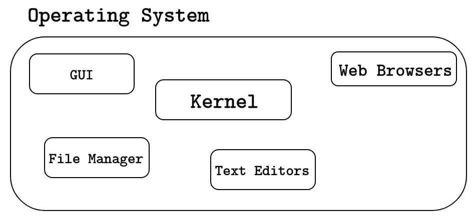

Figure 1: Operating System vs. Kernel

与微软 Windows 或 macOS 不同，Linux 有很多不同的口味；这些风格被称为发行版，它们也被简称为 distros。

**WHAT IS A LINUX DISTRIBUTION?**

Since Linux is open-source, many people and organizations have mod­ified the Linux kernel along with other components of the Linux operating system to develop and customize their own flavor of Linux that suits their needs.

实际上有数百个 Linux 发行版！你可以去 www.distrowatch.com 查看庞大的 Linux 发行版列表。

distrowatch.com 的好处在于它向你展示了世界上所有 Linux 发行版的人气排名。你甚至会看到一些 Linux 发行版是为了特定的目的而设计的。例如，科学 Linux 是许多科学家中流行的 Linux 发行版，因为它包含许多预装的科学应用程序，这使得它成为科学界的头号 Linux 选择。

# Linux 的今天和未来

1991 年，Linux 还只是一个小婴儿。但是这个婴儿长得很大，变得非常受欢迎。如今，Linux 为世界上 90%以上的顶级超级计算机提供动力。更令你惊讶的是，你可能已经使用 Linux 多年而没有注意到。怎么做？嗯，如果你曾经使用过安卓智能手机，那么你已经使用了 Linux，那是因为安卓是 Linux 发行版！如果你仍然不相信我，去[distrowatch.com](http://www.distrowatch.com)搜索安卓。

更严重的是，大多数政府服务器运行 Linux，这就是为什么你会看到许多政府技术工作需要精通 Linux 的个人。此外，像亚马逊、易贝、贝宝、沃尔玛和许多其他大公司都依赖 Linux 来运行他们先进和复杂的应用程序。此外，Linux 主导着云，因为超过 75%的云解决方案运行 Linux。

Linux 的故事真的很鼓舞人心。曾经是一种爱好的东西现在实际上已经占据了互联网，而 Linux 的未来看起来更有希望。像雷克萨斯和丰田这样的著名汽车制造商和汽车制造商现在正在采用类似**汽车级 Linux** ( **AGL** )这样的 Linux 技术。你可以在[www.automotivelinux.org](http://www.automotivelinux.org)找到更多信息。

Linux 也运行在许多嵌入式设备上，是流行的树莓 Pi、Beagle Bone 和许多其他微控制器的主干。你甚至可能会惊讶地知道，有些洗衣机运行在 Linux 上！所以每次你去洗衣服的时候，花点时间，感谢我们的生活中有了 Linux。

# 安装一个 Linux 虚拟机

安装 Linux 系统有多种方法。例如，如果您当前运行的是 Windows 作为您的主要操作系统，那么您可以在 Windows 的同时双引导 Linux，但是这种方法对初学者来说并不友好。安装过程中的任何错误都可能会让您非常头疼，在某些情况下，您甚至无法再启动 Windows 了！我想给你省去很多痛苦和苦恼，所以我要给你演示如何安装 Linux 作为虚拟机。

**WHAT IS A VIRTUAL MACHINE?**

A virtual machine is simply a computer running from within another computer (host). A virtual machine shares the host resources and behaves exactly like a standalone physical machine.

您还可以拥有嵌套的虚拟机，这意味着您可以从另一个虚拟机中运行一个虚拟机。

安装虚拟机的过程很简单；您只需要遵循以下步骤:

1.  安装 VirtualBox(或 VMware Player)。
2.  下载任何 Linux 发行版的 ISO 映像。
3.  打开 VirtualBox 并开始安装过程。

第一步是安装 VirtualBox，这是一个跨平台的虚拟化应用程序，允许我们创建虚拟机。VirtualBox 是免费的，它可以在 macOS、Windows 和 Linux 上运行。快速谷歌搜索:VirtualBox 下载将完成这项工作。如果你觉得有点懒，可以通过以下链接下载 VirtualBox:[www.virtualbox.org/wiki/Downloads](http://www.virtualbox.org/wiki/Downloads)。

安装 VirtualBox 后，现在需要下载任何 Linux 发行版的 ISO 映像。对于这本书，您将使用 Ubuntu，这可以说是初学者中最受欢迎的 Linux 发行版。可以通过以下链接下载 Ubuntu:[www.ubuntu.com/download/desktop](http://www.ubuntu.com/download/desktop)。

我建议你下载最新的 Ubuntu **LTS** ( **长期支持**)版本，因为它经过了很好的测试，有更好的支持。

最后一步，你需要打开 VirtualBox，用你从*步骤 2* 下载的 Ubuntu ISO 映像创建一个 Linux 虚拟机。

打开 VirtualBox 时，必须从菜单栏中选择新建。


Figure 2: Creating a New Virtual Machine

然后，您需要选择新虚拟机的名称和类型。


Figure 3: Choose Name and Type

之后，单击继续，并选择您想要为虚拟机分配多少内存。我强烈推荐`2` GB(千兆字节)以上。比如下面这个截图，我选择给我的虚拟机`4096` MB 内存(RAM)，相当于`4` GB。


Figure 4: Choose Memory Size

之后，点击继续，确保选择现在创建虚拟硬盘，如下图所示，然后点击创建。

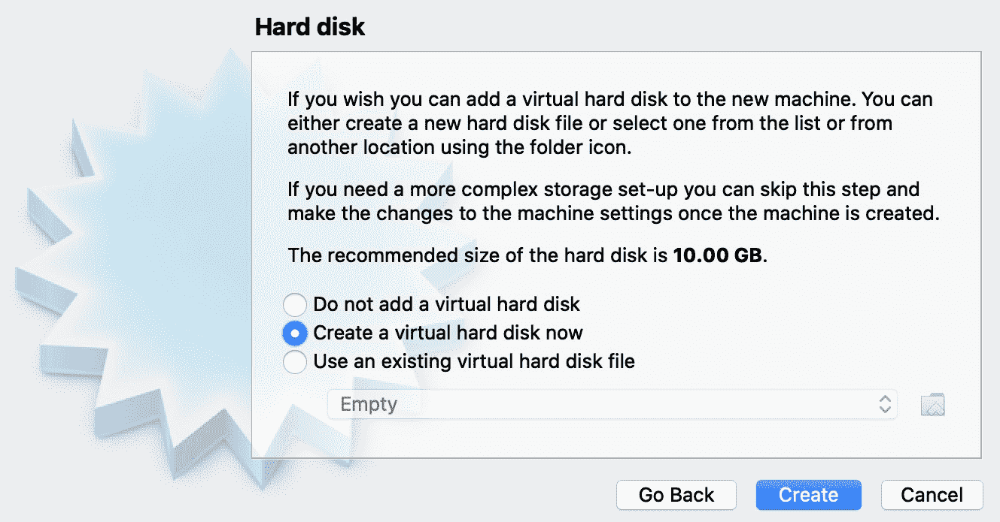

Figure 5: Create a Hard Disk

之后，选择 **VDI** ( **VirtualBox 磁盘映像**)如下图截图所示，然后点击继续。


Figure 6: Hard Disk File Type

现在选择动态分配，如下图所示，然后点击继续。

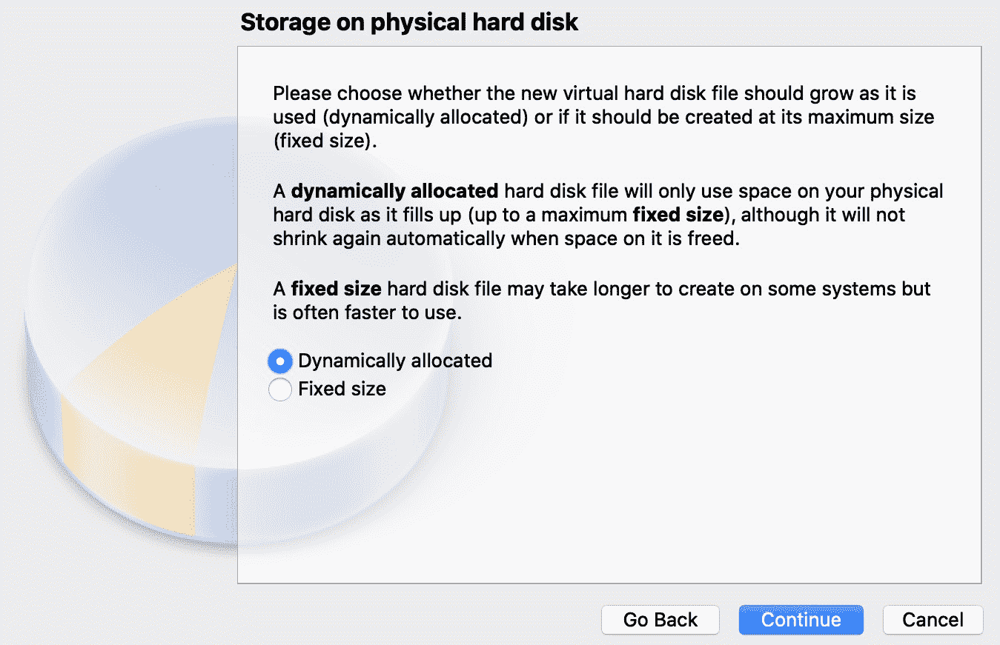

Figure 7: Storage on Physical Hard Disk

现在，您可以选择虚拟机的硬盘大小。我强烈建议您选择`10` GB 或更高。在下面的截图中，我选择了`20` GB 作为我的虚拟机。

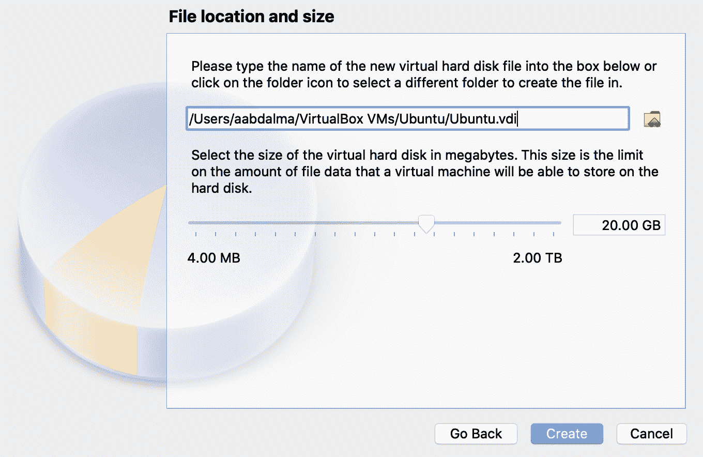

Figure 8: Hard Disk Size

选择硬盘大小后，单击创建完成虚拟机的创建。


Figure 9: Virtual Machine Is Created

您可以单击绿色的开始按钮来启动您的虚拟机。然后，您必须选择一个启动磁盘，如下图所示。

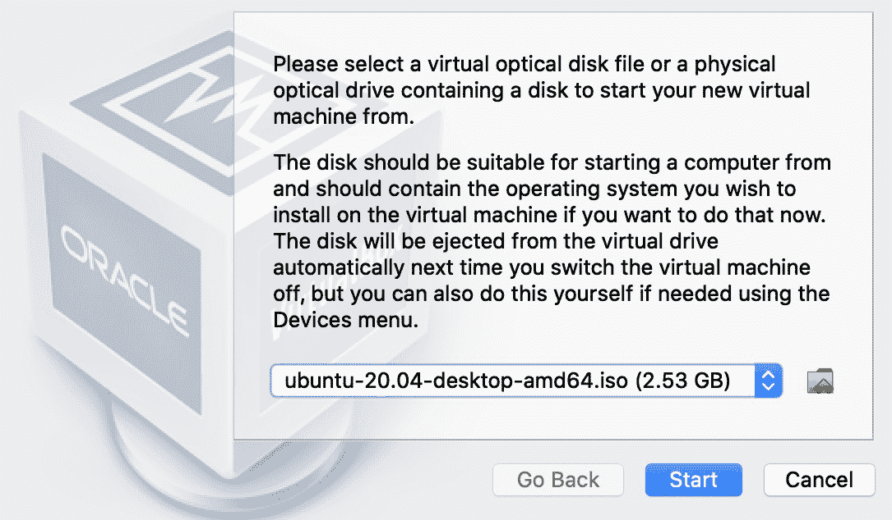

Figure 10: Select Start-Up Disk

选择您已经下载的 Ubuntu ISO 映像，然后单击开始启动 Ubuntu 安装程序，如下图所示。

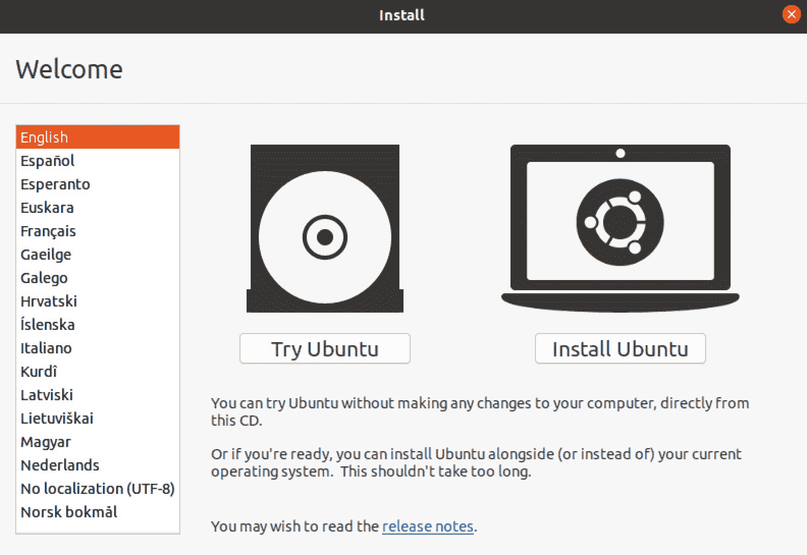

Figure 11: Ubuntu Installer

您现在可以选择安装 Ubuntu。接下来，您必须选择语言和键盘布局。之后，你应该继续接受默认值。

您最终将进入创建新用户的步骤，如下图所示。


Figure 12: Create a New User

我选择用户名`elliot`是因为我是电视节目《机器人先生》的忠实粉丝，也是因为埃利奥特在随便黑 E 公司的时候用的是 Linux！我强烈建议您选择`elliot`作为您的用户名，因为这将使您更容易跟随这本书。

然后，您可以单击继续，系统安装将开始，如下图所示。

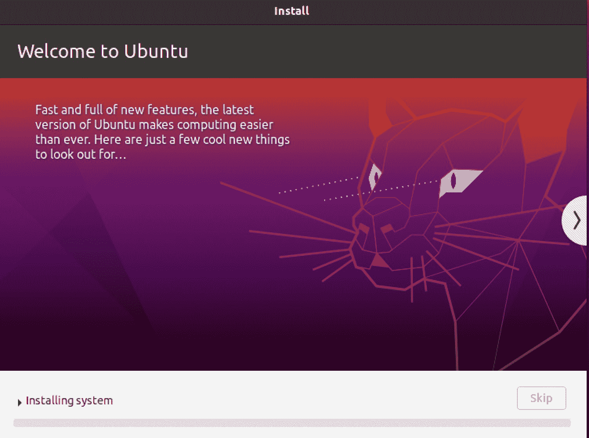

Figure 13: System Installation

安装过程需要几分钟时间。坚持住，或者在安装完成后给自己冲杯咖啡什么的。

安装完成后需要重启虚拟机，如下图截图所示。


Figure 14: Installation Complete

您可以单击立即重启。之后，它可能会要求您删除安装介质，您可以通过选择设备-+光驱-+从虚拟驱动器中删除磁盘来完成。

最后，你应该会看到你的登录屏幕，如下图截图所示。

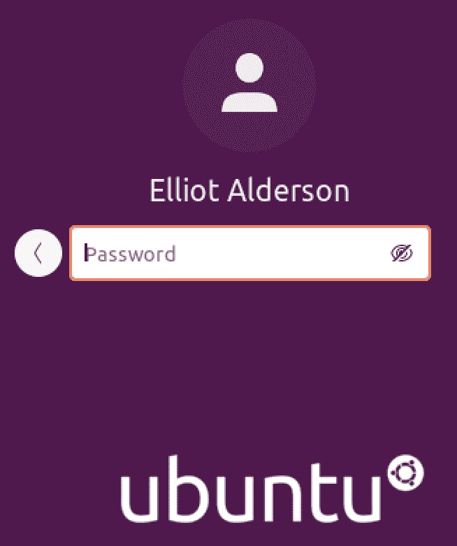

Figure 15: Ubuntu Sign In

你现在可以输入你的密码和万岁！你现在在一个 Linux 系统中。

还有其他方法可以用来实验 Linux 系统。例如，您可以在 **AWS** ( **亚马逊网络服务**)上创建一个帐户，并在亚马逊 EC2 实例上启动一个 Linux 虚拟机。同样，您可以在微软 Azure 上创建一个 Linux 虚拟机。所以，活在这个时代，你应该觉得自己很幸运！回到过去，用 Linux 启动和运行是一个痛苦的过程。

# 终端对Shell

**图形用户界面** ( **图形用户界面**)不言自明。你可以轻松地四处走动，连接到互联网，打开你的网络浏览器。所有这些都非常容易，正如你在下面的截图中看到的。


Figure 16: The Graphical User Interface

你可以使用 **Ubuntu 软件**在你的系统上安装新的软件程序。

您可以像使用微软 Win dows 上的开始菜单一样使用 **Dash** 来启动您的应用程序。

**LibreOffice Writer** 是一款优秀的文字处理器，功能性与微软 word 相同，只有一点不同；这是免费的！

现在，你可以成为一个普通的 Linux 用户，这意味着你可以使用 Linux 来完成日常用户所做的基本任务:浏览 YouTube、发送电子邮件、搜索谷歌等。然而，要成为超级用户，你需要熟练使用 Linux **命令行界面**。

要访问 Linux **命令行界面**，需要打开终端仿真器，为简单起见，终端仿真器通常被称为**终端**。

**WHAT IS A TERMINAL EMULATOR?**

A Terminal Emulator is a program that emulates (mimics) a physical Terminal (Console). The Terminal interacts with the Shell (the Command Line Interface).

好吧，现在你可能在挠头，问自己:“什么是贝壳？”

**WHAT IS A SHELL?**

The Shell is a command-line interpreter, that is to say, it is a program that processes and executes commands.

好了，所有的理论都讲够了。让我们通过一个例子来理解并把一切联系在一起。点击破折号打开终端，然后搜索`Terminal`。也可以使用快捷键*Ctrl*+*Alt*+*T*打开终端。当终端打开时，您将看到一个新窗口，如下图所示。

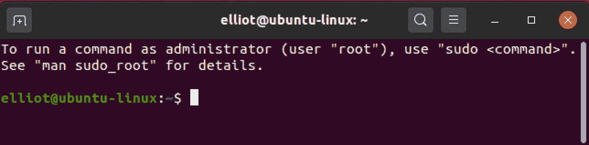

Figure 17: The Terminal

它看起来有点像微软视窗上的命令提示符。好了，现在在你的终端上输入`date`，然后点击*进入*:

```sh
elliot©ubuntu-linux:-$ date 
Tue Feb 17 16:39:13 CST 2020
```

现在我们来讨论一下发生了什么，`date`是一个打印当前日期和时间的 Linux 命令，就在你点击*进入*之后，Shell(正在后台工作)然后执行命令`date`并在你的终端上显示输出。

你不应该混淆**终端**和**Shell**。术语窗口是您在屏幕上看到的窗口，您可以在其中键入命令，而 Shell 负责执行命令。就这样，不多也不少。

您还应该知道，如果您键入任何乱码，您将得到一个**命令未找到**错误，如下例所示:

```sh
elliot©ubuntu-linux:-$ blabla 
blabla: command not found
```

# 一些简单的命令

恭喜您学习了第一个 Linux 命令(`date`)。现在让我们继续学习更多！

人们通常会在显示日期后显示日历，对吗？要显示当前月份的日历，可以运行`cal`命令:


Figure 18 : The cal command

您还可以显示全年的日历，例如，要获得完整的 2022 年日历，您可以运行:

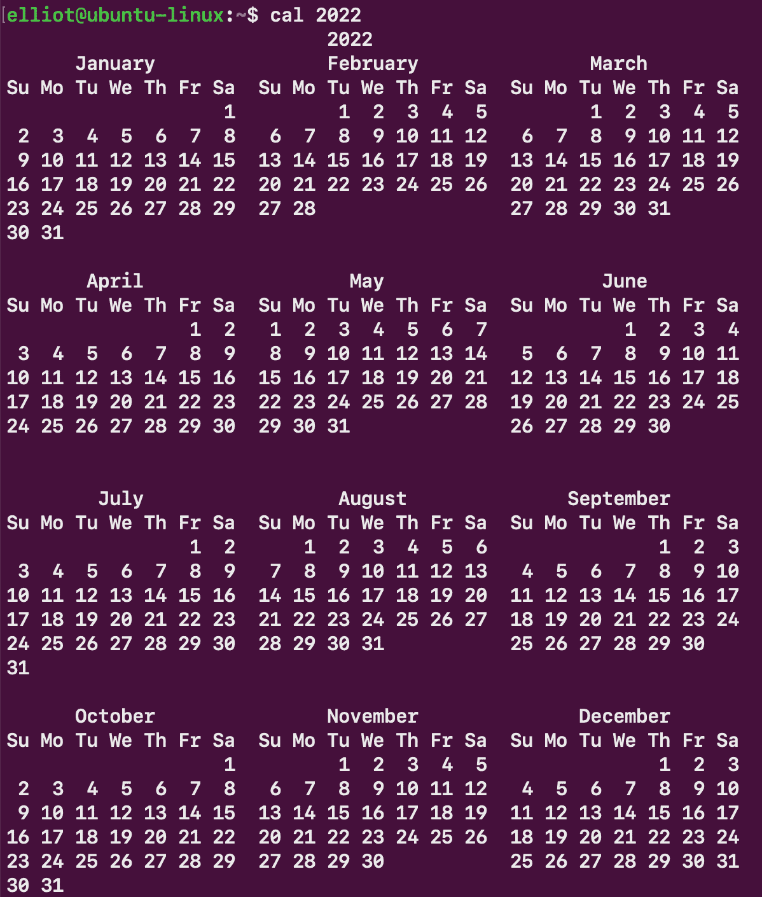

Figure 19: The cal command for the year 2022

也可以指定一个月份，例如，要显示 1993 年 2 月的日历，可以运行命令:


Figure 20: The cal command for February 1993

您现在在终端上有很多输出。您可以运行`clear`命令来清除终端屏幕:


Figure 21: Before clear

这是您的终端在运行`clear`命令后的样子:

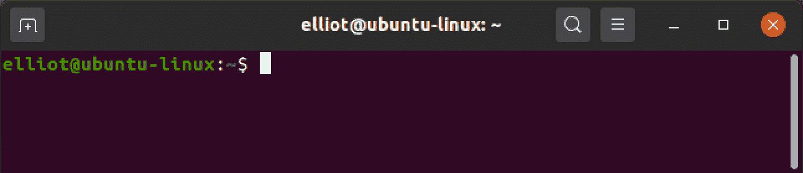

Figure 22: After clear

您可以使用`lscpu`命令来显示您的中央处理器架构信息，该命令是**列表中央处理器**的缩写:

```sh
elliot©ubuntu-linux:-$ lscpu 
Architecture:          x86_64
CPU op-mode(s):        32-bit, 64-bit 
Byte Order:            Little Endian
CPU(s):                1
On-line CPU(s) list:   0
Thread(s) per core:    1 
Core(s) per socket:    1 
Socket(s):             1
NUMA node(s):          1
Vendor ID:             GenuineIntel
CPU family:            6
Model:                 61
Model name:            Intel(R) Core(TM) i5-5300U CPU© 2.30GHz Stepping: 4
CPU MHz:               2294.678
BogoMIPS:              4589.35
Hypervisor vendor:     KVM 
Virtualization type:   full 
Lid cache:             32K
L1i cache:             32K
L2 cache:              256K
L3 cache:              3072K 
NUMA nodeO CPU(s):     0
Flags:                 fpu vme de pse tsc msr pae mce cx8 apic sep mtrr
```

您可以使用`uptime`命令检查您的系统运行了多长时间。`uptime`命令也显示:

*   当前时间。
*   当前登录的用户数量。
*   过去 1 分钟、5 分钟和 15 分钟的系统负载平均值。

```sh
elliot©ubuntu-linux:-$ uptime
18:48:04 up 4 days, 4:02, 1 user, load average: 0.98, 2.12, 3.43
```

您可能会被`uptime`命令的输出吓到，但不用担心，下表为您分解了输出。

| `18:48:04` | 在输出中首先看到的是当前时间。 |
| `up 4 days, 4:02` | 这基本上是说系统已经启动并运行了 4 天 4 小时 2 分钟。 |
| `1 user` | 当前只有一个用户登录。 |
| `load average: 0.98, 2.12, 3.43` | 过去 1 分钟、5 分钟和 15 分钟的系统负载平均值。 |

Table 1: uptime command output

你可能以前没有听说过平均负载。要理解负载均衡，首先必须理解系统负载。

**WHAT IS SYSTEM LOAD?**

In simple terms, system load is the amount of work the CPU per­forms at a given time.

因此，计算机上运行的进程(或程序)越多，系统负载就越高，而运行的进程越少，系统负载就越低。现在，既然您理解了什么是系统负载，那么就很容易理解负载平均值。

**WHAT IS LOAD AVERAGE?**

The load average is the average system load calculated over a given period of 1, 5, and 15 minutes.

因此，您在`uptime`命令输出的最后看到的三个数字分别是 1 分钟、5 分钟和 15 分钟的负载平均值。例如，如果负载平均值为:

```sh
load average: 2.00, 4.00, 6.00
```

那么这三个数字表示如下:

*   `2.00 --+`:最后一分钟的平均负荷。
*   `4.00 --+`:过去五分钟的平均负载。
*   `6.00 --+`:过去十五分钟的平均负载。

从负荷平均值的定义中，我们可以得出以下要点:

1.  负载平均值`0.0`表示系统空闲(无动作)。
2.  如果 1 分钟平均负载高于`5`或`15`分钟平均负载，则这意味着您的系统负载正在增加。
3.  如果 1 分钟平均负载低于`5`或`15`分钟平均负载，则这意味着您的系统负载正在下降。

例如，平均负载为:

```sh
load average: 1.00, 3.00, 7.00
```

显示系统负载随着时间的推移而降低。另一方面，平均负载为:

```sh
load average: 5.00, 3.00, 2.00
```

表示系统负载随着时间的推移而增加。作为一个实验，首先通过运行`uptime`命令记录你的负载平均值，然后打开你的网页浏览器并打开多个选项卡，然后重新运行`up­time`；你会看到你的平均负载增加了。之后，关闭你的浏览器，再次运行`uptime`，你会看到你的平均负载下降了。

您可以运行`reboot`命令来重启系统:

```sh
elliot©ubuntu-linux:-$ reboot
```

您可以运行`pwd`命令来打印当前工作目录的名称:

```sh
elliot©ubuntu-linux:-$ pwd
/home/elliot
```

当前工作目录是用户在给定时间工作的目录。默认情况下，当您登录到您的 Linux 系统时，您当前的工作目录被设置为您的主目录:

```sh
/home/your_username
```

**WHAT IS A DIRECTORY?**

In Linux, we refer to folders as directories. A directory is a file that contains other files.

您可以运行`ls`命令来列出当前工作目录的内容:

```sh
elliot©ubuntu-linux:-$ ls
Desktop Documents Downloads Music Pictures Public Videos
```

如果想更改密码，可以运行`passwd`命令:

```sh
elliot©ubuntu-linux:-$ passwd 
Changing password for elliot. 
(current) UNIX password:
Enter new UNIX password:
Retype new UNIX password:
passwd: password updated successfully
```

您可以使用`hostname`命令显示您系统的主机名:

```sh
elliot©ubuntu-linux:-$ hostname 
ubuntu-linux
```

您可以使用`free`命令显示系统上的可用和已用内存量:

```sh
elliot©ubuntu-linux:-$ free
 total      used    free   shared   buff/cache  available 
Mem:    4039732   1838532  574864    71900      1626336    1848444
Swap:    969960         0  969960
```

默认情况下，`free`命令以千字节为单位显示输出，但是只有外星人才会从这个输出中得到意义。

通过使用`-h`选项运行`free`命令，您可以获得对我们人类有意义的输出:

```sh
elliot©ubuntu-linux:-$ free -h
 total     used     free     shared     buff/cache     available
Mem:      3.9G     1.8G     516M        67M           1.6G          1.7G
Swap:     947M       OB     947M 
```

好多了，对吧？`-h`是`--human`的缩写，它以人类可读的格式显示输出。

您可能已经注意到，这是我们第一次运行带有选项的命令。大多数 Linux 命令都有选项，您可以使用这些选项稍微更改它们的默认行为。

您还应该知道，命令选项之前有一个单连字符(`-`)或一个双连字符(`--`)。如果使用命令选项的缩写名称，可以使用单个连字符。另一方面，如果使用命令选项的全名，则需要使用双连字符:

```sh
elliot©ubuntu-linux:-$ free --human
 total     used     free     shared     buff/cache     available
Mem:      3.9G     1.8G     516M        67M           1.6G          1.7G
Swap:     947M       OB     947M 
```

如您所见，`free`命令的前两次运行产生了相同的输出。唯一不同的是，第一次，我们使用了缩写的命令选项名称`-h`，所以我们使用了单个连字符。第二次，我们使用了完整的命令选项名称`--human`，因此我们使用了双连字符。

在使用缩写命令选项名称和完整命令选项名称时，您可以自由选择。

您可以使用`df`命令显示系统上可用的磁盘空间量:

```sh
elliot©ubuntu-linux:-$ df
Filesystem     1K-blocks     Used     Available     Use%      Mounted on
udev             1989608        0       1989608       0%            /dev
tmpfs             403976     1564        402412       1%            /run
/dev/sda1       20509264  6998972      12445436      36%           /
tmpfs            2019864    53844       1966020       3%        /dev/shm
tmpfs               5120        4          5116       1%       /run/lock
tmpfs            2019864        0       2019864       0%  /sys/fs/cgroup
/dev/loop0         91648    91648             0     100% /snap/core/6130
tmpfs             403972       28        403944       1%   /run/user/121
tmpfs             403972       48        403924       1%  /run/user/1000
```

同样，您可能希望使用人类可读的选项`-h`来显示更好的格式:

```sh
elliot©ubuntu-linux:-$ df -h
Filesystem       Size      Used      Avail     Use%      Mounted on
udev             1.9G         0       1.9G       0%            /dev
tmpfs            395M      1.6M       393M       1%            /run
/dev/sda1         20G      6.7G        12G      36%            /
tmpfs            2.0G       57M       1.9G       3%        /dev/shm
tmpfs            5.0M      4.0K       5.0M       1%       /run/lock
tmpfs            2.0G         0       2.0G       0%  /sys/fs/cgroup
/dev/loop0        90M       90M          0     100% /snap/core/6130
tmpfs            395M       28K       395M       1%   /run/user/121
tmpfs            395M       48K       395M       1%  /run/user/1000
```

如果您不能理解输出中看到的所有内容，请不要担心，因为我将在后面的章节中详细阐述所有内容。这一章的全部思想是要把脚弄湿；我们稍后会和鲨鱼一起潜入深海！

`echo`命令是另一个非常有用的命令；它允许你在你的终端上打印一行文本。例如，如果您想在您的终端上显示线路`Cats are better than Dogs!`，那么您可以运行:

```sh
elliot©ubuntu-linux:-$ echo Cats are better than Dogs! 
Cats are better than Dogs!
```

你可能会问自己，“这到底有什么用？”好吧，我向你保证，当你读完这本书的时候，你会意识到`echo`命令的巨大好处。

你可以花大量的时间在你的终端上，输入命令。有时，您可能想要重新运行一个命令，但是您可能已经忘记了该命令的名称或您使用的选项，或者您只是懒惰，不想再次键入它。不管是什么情况，`history`命令都不会让你失望。

让我们运行`history`命令，看看我们得到了什么:

```sh
elliot©ubuntu-linux:-$ history
1 date
2 blabla
3 cal
4 cal 2022
5 cal feb 1993
6 clear
7 lscpu
8 uptime
9 reboot
10 pwd
11 ls
12 passwd
13 hostname
14 free
15 free -h
16 free --human
17 df
18 df -h
19 echo Cats are better than Dogs!
20 history
```

不出所料，`history`命令按照时间顺序显示了我们到目前为止运行的所有命令。在我的历史记录列表中，`lscpu`命令是数字`7`，所以如果我想重新运行`lspcu`，我只需要运行`!7`:

```sh
elliot©ubuntu-linux:-$ !7 
lscpu
Architecture:         x86_64
CPU op-mode(s):       32-bit, 64-bit
Byte Order:           Little Endian 
CPU(s):               1
On-line CPU(s) list:  0
Thread(s) per core:   1
Core(s) per socket:   1
Socket(s):            1
NUMA node(s):         1
Vendor ID:            GenuineIntel
CPU family:           6
Model:                61
Model name:           Intel(R) Core(TM) i5-5300U CPU @ 2.30GHz
Stepping:             4
CPU MHz:              2294.678
BogoMIPS:             4589.35
Hypervisor vendor:    KVM
Virtualization type:  full
Lid cache:            32K
L1i cache:            32K
12 cache:             256K
13 cache:             3072K 
NUMA node0 CPU(s):    0
Flags:                fpu vme de pse tsc msr pae mce cx8 apic sep mtrr
```

**UP AND DOWN ARROW KEYS**

You can scroll up and down on your command line history. Every time you hit your *up arrow* key, you scroll up one line in your command history.

You can also reverse and scroll down with your *down arrow* key.

您可以使用`uname`命令显示系统的内核信息。当您在没有任何选项的情况下运行`uname`命令时，它将只打印内核名称:

```sh
elliot©ubuntu-linux:-$ uname 
Linux
```

您可以使用`-v`选项打印当前内核版本信息:

```sh
elliot©ubuntu-linux:-$ uname -v
#33-Ubuntu SMP Wed Apr 29 14:32:27 UTC 2020
```

您也可以使用`-r`选项打印当前内核版本信息:

```sh
elliot©ubuntu-linux:-$ uname -r 
5.4.0-29-generic
```

也可以使用`-a`选项一次性打印当前内核的所有信息:

```sh
elliot©ubuntu-linux:-$ uname -a
Linux ubuntu-linux 5.4.0-29-generic #33-Ubuntu SMP
Wed Apr 29 14:32:27 UTC 2020 x86_64 x86_64 x86_64 GNU/Linux
```

您也可以运行`lsb_release -a`命令来显示您当前运行的 Ubuntu 版本:

```sh
elliot©ubuntu-linux:-$ lsb_release -a 
No LSB modules are available.
Distributor ID: Ubuntu 
Description: Ubuntu 20.04 LTS 
Release: 20.04
Codename: focal
```

最后，您将在本章中学习的最后一个命令是`exit`命令，它将终止您当前的终端会话:

```sh
elliot©ubuntu-linux:-$ exit
```

**A COOL FACT**

You may have already observed by now that Linux command names pretty much resemble what they do. For instance, the `pwd` command liter­ally stands for **Print Working Directory**, `ls` stands for **List**, `lscpu` stands for **List CPU**, etc. This fact makes it much easier remembering Linux commands.

恭喜你！你读完了第一章。现在是你第一次知识检查练习的时间了。

# 知识检查

对于以下练习，打开您的终端并尝试解决以下任务:

1.  显示 2023 年的整个日历。
2.  以人类可读的格式显示系统的内存信息。
3.  显示主目录的内容。
4.  更改您当前的用户密码。
5.  打印“机器人先生是一个令人敬畏的电视节目！”在你的终端上。

## 对还是错

1.  命令`DATE`显示当前日期和时间。
2.  要重启你的 Linux 系统，你只需运行`restart`命令。
3.  运行`free -h`和`free --human`命令没有区别。
4.  如果您的负载平均值为:

```sh
load average: 2.12, 3.09, 4.03
```

5.  如果您的负载平均值为:

```sh
load average: 0.30, 1.09, 2.03
```