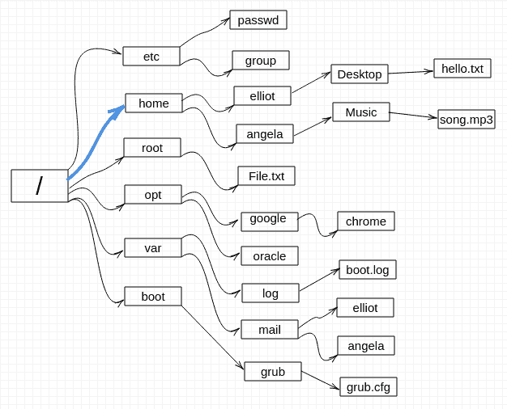
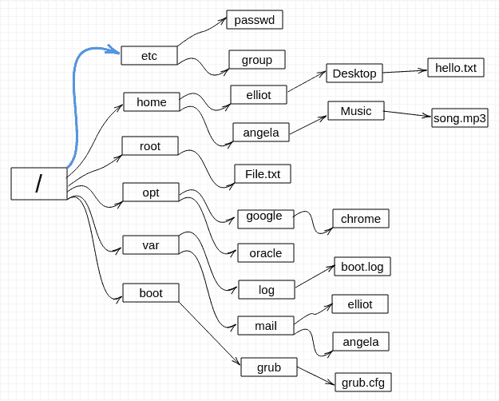
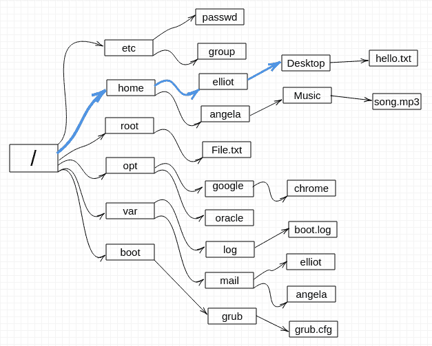
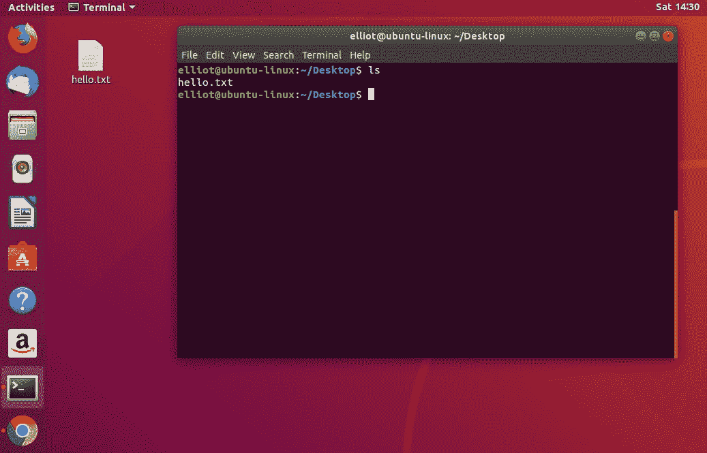
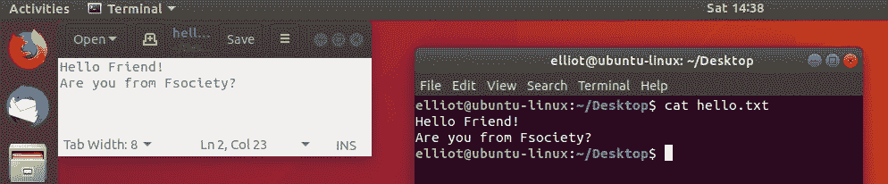
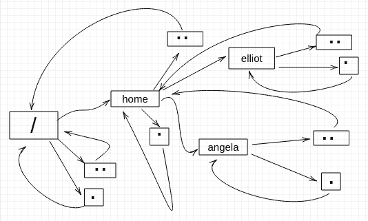

Climbing the Tree

在本章中，您将爬上一棵非常特殊的树，这就是 Linux 文件系统。在这次攀登旅程中，你将学会:

*   Linux 文件系统层次结构。
*   根目录是什么？
*   绝对路径和相对路径。
*   如何浏览 Linux 文件系统。

# Linux 文件系统

好吧，你在树根上，准备爬上去。在 Linux 中，就像实际的树一样，文件系统的开始从根目录开始。您可以使用`cd`命令，后跟一个正斜杠来到达根:

```sh
elliot@ubuntu-linux:~$ cd /
```

`cd`命令是**更改目录**的缩写，是 Linux 中使用最多的命令之一。没有它，你在 Linux 中无法移动。就像你的四肢(胳膊和腿)，没有四肢能爬树吗？
正斜杠字符代表根目录。现在为了确保您在根目录下，您可以运行`pwd`:

```sh
elliot@ubuntu-linux:~$ pwd
/
```

果然，我们是 Linux 文件系统的根。每当你迷失方向，不知道自己身在何处时，`pwd`就在这里拯救你。

好吧，当我们还在根目录的时候，让我们看看里面有什么！运行`ls`命令查看当前目录的内容:

```sh
elliot@ubuntu-linux:/$ ls
bin etc lib proc tmp var boot 
dev home opt root sbin usr
```

为了更好地查看内容，您可以使用长列表`-l`选项和`ls`命令:

```sh
elliot@ubuntu-linux:/$ ls -l
drwxr-xr-x   2 root root           4096 Dec 28 15:36 bin
drwxr-xr-x 125 root root          12288 Jan  1 11:01 etc
drwxr-xr-x  21 root root           4096 Dec 26 23:52 lib
dr-xr-xr-x 227 root root              0 Jan  3 02:33 proc
drwxrwxrwt  15 root root           4096 Jan  3 02:35 tmp
drwxr-xr-x  14 root root           4096 Jul 24 21:14 var
drwxr-xr-x   3 root root           4096 Dec 29 07:17 boot
drwxr-xr-x  18 root root           4000 Jan  3 02:33 dev
drwxr-xr-x   3 root root           4096 Dec 26 23:47 home
drwxr-xr-x   3 root root           4096 Dec 27 15:07 opt
drwx------   4 root root           4096 Dec 29 09:39 root
drwxr-xr-x   2 root root          12288 Dec 28 15:36 sbin
drwxr-xr-x  10 root root           4096 Jul 24 21:03 usr
```

该输出为您提供了许多有价值的信息，我们将在接下来的章节中详细讨论。但是现在，我们关注输出第一列的第一个字母。看看输出的第一列:

```sh
drwxr-xr-x 
drwxr-xr-x 
drwxr-xr-x 
drwxr-xr-x
.
.
.
.
```

你会看到第一个字母是`d`，表示文件是一个目录。第一个字母显示文件类型。输出的最后一列显示文件名。

**OTHER FILES!**

You will have more files under your root (`/`) directory. I have only chosen the most important and common ones that should exist on every Linux distribution. So don't freak out when you see way more files than those listed in this book.

现在，每个目录都有一个特殊的用途，如下表所示:

| `/` | 这是文件系统的根，一切都从这里开始。 |
| `/etc` | 该目录包含系统配置文件。 |
| `/home` | 这是所有用户(根用户除外)的默认主目录。 |
| `/root` | 这是根用户的主目录。 |
| `/dev` | 这是硬盘、u 盘和光驱等设备驻留在系统中的位置。 |
| `/opt` | 这是您可以安装其他第三方软件的地方。 |
| `/bin` | 这是系统中重要的二进制文件(程序)所在的位置。 |
| `/sbin` | 这是系统管理员通常使用的系统二进制文件(程序)的存储位置。 |
| `/tmp` | 这是存储临时文件的地方；它们通常在系统重启后被删除，所以不要在这里存储重要文件！ |
| `/var` | 该目录包含可能会改变大小的文件，如邮件线轴和日志文件。 |
| `/boot` | 系统启动所需的所有文件都存储在这里。 |
| `/lib` | 该目录包含`/bin`和`/sbin`目录中基本二进制文件所需的库。库基本上是程序可以使用的一组预编译函数。 |
| `/proc` | 这是存储有关正在运行的进程的信息的地方。 |
| `/usr` | 该目录包含用户之间共享的文件和实用程序。 |

Table 2: Linux Directories Explained

您也可以运行`man hier`命令来了解更多关于 Linux 文件系统层次结构的信息:

```sh
elliot@ubuntu-linux:/$ man hier
```

好了，现在让我们进一步爬上 Linux 目录树。看看*图 1* ，你就会明白为什么我们选择一棵树来描述 Linux 文件系统的结构了。


Figure 1: The Linux directory tree

上图只显示了很少的文件，决不是整个目录树的表示，因为 Linux 文件系统实际上包含了数千个文件。因此，您可以将上图视为实际 Linux 目录树的子树。

# 浏览目录树

好吧，让我们做更多的攀登。比如我们爬上`/home`目录，看看系统上有多少用户。只需运行`cd /home`命令即可:

```sh
elliot@ubuntu-linux:~$ cd /home 
elliot@ubuntu-linux:/home$
```

请注意命令提示符是如何变化的，因为它现在显示您在主目录中。



Figure 2: You are now at /home

现在让我们运行`ls`来查看`/home`目录的内容:

```sh
elliot@ubuntu-linux:/home$ ls 
angela elliot
```

这是我系统上的两个用户(除了根用户)。`/root`是根用户的主目录。您在`/home`中可能只有一个用户；您将在本书后面学习如何将其他用户添加到您的系统中。

**WHO IS ROOT?**

The root user is a superuser who is allowed to do anything on the system. The root user can install software, add users, manage disk partitions, etc. The home directory of the root user is `/root`, which is NOT to be confused with `/` (the root of the filesystem).

如果您想要证明您当前位于`/home`目录，您可以运行`pwd`命令:

```sh
elliot@ubuntu-linux:/home$ pwd
/home
```

果然！我们在`/home`目录。现在我们爬上用户`elliot`的主目录。现在，信不信由你，有两种方法可以导航到`elliot`的主目录。您可以简单地运行`cd elliot`命令:

```sh
elliot@ubuntu-linux:/home$ cd elliot 
elliot@ubuntu-linux:~$ pwd
/home/elliot
```

或者可以运行`cd /home/elliot`命令:

```sh
elliot@ubuntu-linux:/home$ cd /home/elliot 
elliot@ubuntu-linux:~$ pwd
/home/elliot
```


Figure 3: Now you are at /home/elliot

请注意，这两个命令都将我们置于`elliot`的主目录中。不过，跑`cd elliot`当然比跑`cd /home/elliot`容易多了。

嗯，想想看，我们最初在`/home`目录，这就是为什么我们能够运行`cd elliot`来登陆`/home/elliot`。

然而，在其他情况下，我们将被迫使用完整路径(绝对路径)`/home/elliot`来到达目的地。为了演示，让我们首先切换到`/etc`目录:

```sh
elliot@ubuntu-linux:~$ cd /etc 
elliot@ubuntu-linux:/etc$ pwd
/etc
```



Figure 4: Now you are at /etc


Figure 5: You want to go to /home/elliot

*图 4* 和 *5* 帮你形象化。你在`/etc`你想去`/home/elliot`。要访问`elliot`的主目录，我们不能再通过运行`cd elliot`命令来使用短路径(相对路径):

```sh
elliot@ubuntu-linux:/etc$ cd elliot
bash: cd: elliot: No such file or directory
```

正如你所看到的，壳牌变得疯狂并返回了一个错误`bash: cd: elliot: No such file or directory`。在这种情况下，我们必须使用完整路径(绝对路径)`/home/elliot`:

```sh
elliot@ubuntu-linux:/etc$ cd /home/elliot 
elliot@ubuntu-linux:~$ pwd
/home/elliot
```

如果你到现在还没有注意到，我们一直在使用正斜杠(`/`)作为目录分隔符。

**THE DIRECTORY SEPARATOR**

In Linux, the forward slash (`/`) is the directory separator or sometimes referred to as the path separator. In Windows, it's the other way around because a backward slash (`\`) is used instead as a directory separator. However, be careful since the leading forward slash is the root of our filesystem. For example, in `/home/elliot/Desktop`, only the second and third forward slashes are directory separators, but the first forward slash represents the root of the filesystem.

认识到绝对路径和相对路径的区别是至关重要的。

**ABSOLUTE VERSUS RELATIVE PATHS**

An absolute path of a file is simply the full path of that file and, it **ALWAYS** begins with a leading forward slash. For example, `/opt/- google/chrome` is an example of an absolute path.

On the other hand, a relative path of a file never starts with the root directory and is always relative to the current working directory. For example, if you are currently at `/var`, then `log/boot.log` is a valid relative path.

根据经验，如果你想区分相对路径和绝对路径，看看路径是否以根目录(正斜杠)开始；如果是，那么可以断定路径是绝对的，否则，路径就是相对的。

下图显示了相对路径`Desktop/hello.txt`，只有当前工作目录为`/home/elliot`时才会工作。


Figure 6: This Is a Relative Path

下图显示了绝对路径`/home/elliot/Desktop`，无论您当前的工作目录如何，它都将一直工作。



Figure 7: This Is an Absolute Path

现在让我们爬上埃利奥特的`Desktop`目录，看看他那里有什么。我们将使用绝对路径:

```sh
elliot@ubuntu-linux:/$ cd /home/elliot/Desktop 
elliot@ubuntu-linux:~/Desktop$ pwd
/home/elliot/Desktop
```

我们用`pwd`来确认我们确实在期望的目录中。现在让我们运行`ls`来查看埃利奥特桌面的内容:

```sh
elliot@ubuntu-linux:~/Desktop$ ls 
hello.txt
```

请注意，文件`hello.txt`在埃利奥特的桌面上，所以我们实际上可以在桌面上看到它。



Figure 8: Elliot's desktop

上图可以看到，埃利奥特的桌面上有一个名为`hello.txt`的文件。您可以使用`cat`命令查看文本文件的内容:

```sh
elliot@ubuntu-linux:~/Desktop$ cat hello.txt 
Hello Friend!
Are you from fsociety?
```

如果打开桌面上的`hello.txt`文件，当然会看到同样的内容，如下图截图所示。



Figure 9: The contents of hello.txt

# 父目录和当前目录

文件系统中的每个目录下都有两个特殊的目录:

1.  用一个点(`.`)表示的当前工作目录
2.  由两点(`..`)表示的父目录



Figure 10: Visualizing Parent and Current Directories

通过几个例子很容易理解这两个目录。为了演示，让我们首先更改为`/home/elliot`，使其成为我们当前的工作目录:

```sh
elliot@ubuntu-linux:~/Desktop$ cd /home/elliot 
elliot@ubuntu-linux:~$ pwd
/home/elliot
```

现在运行`cd .`命令:

```sh
elliot@ubuntu-linux:~$ cd . 
elliot@ubuntu-linux:~$ pwd
/home/elliot
```

如你所料，什么都没发生！我们还在`/home/elliot`，那是因为一个点(`.`)代表当前的工作目录。就像你告诉别人，“去你在的地方！”

现在运行`cd ..`命令:

```sh
elliot@ubuntu-linux:~$ cd .. 
elliot@ubuntu-linux:/home$ pwd
/home
```

我们移回了一个目录！换句话说，我们改成了`/home/elliot`的父目录，也就是`/home`。

让我们运行另一个`cd ..`:

```sh
elliot@ubuntu-linux:/home$ cd .. 
elliot@ubuntu-linux:/$ pwd
/
```

事实上，我们一直在往回走，现在我们处于目录树的根部。好吧，让我们再跑一次:

```sh
elliot@ubuntu-linux:/$ cd .. 
elliot@ubuntu-linux:/$ pwd
/
```

嗯，我们在同一个目录！我们的路径没有改变，这是因为我们已经在我们的目录树的根了，所以我们不能再往前走了。因此，根目录(`/`)是**父目录=当前目录**的唯一目录，可以通过查看*图 10* 进行可视化。

也可以插入目录分隔符`cd ../..`一次向后移动两个目录:

```sh
elliot@ubuntu-linux:~$ pwd
/home/elliot
elliot@ubuntu-linux:~$ cd ../.. 
elliot@ubuntu-linux:/$ pwd
/
```

也可以运行`cd ../../..`向后移动三个目录等等。

# 快速移动

现在，我将向您展示一些很酷的技巧，这些技巧将使您快速有效地浏览 Linux 目录树。

## 回家去！

我们换到`/var/log`目录:

```sh
elliot@ubuntu-linux:~$ cd /var/log 
elliot@ubuntu-linux:/var/log$ pwd
/var/log
```

现在，您可以运行`cd ~`命令进入您的主目录:

```sh
elliot@ubuntu-linux:/var/log$ cd ~ 
elliot@ubuntu-linux:~$ pwd
/home/elliot
```

哇！我们再来一次，但是这次，我们切换到用户`angela`。如果你不知道，这个字符被称为颚化符，应该位于你键盘上的数字 *1* 键旁边:

```sh
elliot@ubuntu-linux:~$ whoami 
elliot
elliot@ubuntu-linux:~$ su angela 
Password:
angela@ubuntu-linux:/home/elliot$ whoami 
angela
```

请注意，这里我使用了两个新命令。`whoami`命令打印当前登录用户的姓名。我还使用了切换用户`su`命令切换到用户`angela`。您可以使用`su`命令切换到系统上的任何用户；你只需要运行`su`，后跟用户名。

现在，作为用户`angela`，我将导航到`/var/log`目录:

```sh
angela@ubuntu-linux:/home/elliot$ cd /var/log 
angela@ubuntu-linux:/var/log$ pwd
/var/log
```

然后我运行`cd ~`命令:

```sh
angela@ubuntu-linux:/var/log$ cd ~ 
angela@ubuntu-linux:~$ pwd
/home/angela
```

轰！我在安吉拉的主目录。不管你当前的工作目录是什么，运行`cd ~`命令会直接把你带到你的主目录。

## 带我回去！

现在，如果`angela`想尽快回到她之前的工作目录怎么办？

运行`cd -`命令是将`angela`返回到其先前工作目录的最快方法:

```sh
angela@ubuntu-linux:~$ pwd
/home/angela
angela@ubuntu-linux:~$ cd -
/var/log
```

酷！`angela`又回到了`/var/log`。所以任何时候你想回到你以前的工作目录，只要运行`cd -`命令。

# 隐藏文件

当前目录`.`和父目录`..`存在于 Linux 文件系统的每个目录下。但是为什么我们在执行`ls`命令时看不到他们呢？

```sh
elliot@ubuntu-linux:~/Desktop$ pwd
/home/elliot/Desktop 
elliot@ubuntu-linux:~/Desktop$ ls 
hello.txt
elliot@ubuntu-linux:~/Desktop$ ls -l 
total 4
-rw-r--r-- 1 elliot elliot 37 Jan 19 14:20 hello.txt
```

如你所见，我甚至尝试运行`ls -l`，仍然看不到当前目录或父目录。

您需要使用`ls`命令的`-a`选项，如下所示:

```sh
elliot@ubuntu-linux:~/Desktop$ ls -a
. .. hello.txt
```

万岁！现在你可以看到所有的文件。`-a`选项向您显示所有文件，包括隐藏文件，当然您可以使用完整的选项名称`--all`，它将做同样的事情:

```sh
elliot@ubuntu-linux:~/Desktop$ ls --all
. .. hello.txt
```

原来任何以`.`(一个点)开头的文件名都是隐藏的。

Hidden filenames start with `.`

Any filename that starts with a dot is hidden. That's why current and parent directories are hidden.

要进一步演示，请转到您的用户主目录并运行`ls`命令:

```sh
angela@ubuntu-linux:~$ ls 
Music
```

现在运行`ls -a`命令:

```sh
angela@ubuntu-linux:~$ ls -a
. .. .bash_logout .bashrc Music .profile
```

你现在可以在你的主目录中看到隐藏的文件了！请注意，所有隐藏的文件名都以点开始。

# 传递命令参数

到目前为止，我们只在当前工作目录上运行`ls`命令。但是，您可以列出任何目录的内容，而不必对其进行更改。例如，如果您当前的工作目录是`/home/elliot`:

```sh
elliot@ubuntu-linux:~$ pwd
/home/elliot
```

您可以通过运行`ls -a /home/angela`命令列出`/home/angela`中的所有文件:

```sh
elliot@ubuntu-linux:~$ ls -a /home/angela
. .. .bash_history .bash_logout .bashrc Music .profile 
elliot@ubuntu-linux:~$ pwd
/home/elliot 
elliot@ubuntu
```

我还在`/home/elliot`的时候就能列出`/home/angela`的内容了。这是可能的，因为`ls`命令接受任何文件作为参数。

**WHAT IS AN ARGUMENT?**

An argument, also called a command-line argument, is simply any filename or data that is provided to a command as an input.


Figure 11: Linux Command Structure

在上图中，您可以看到 Linux 命令的一般结构。

在 Linux 术语中，当谈到命令选项和参数时，我们使用动词 **pass** 。为了使用正确的 Linux 术语，例如，在前面的图像中，我们说，“我们将`/home/angela`目录作为参数传递给了`ls`命令。”

您经常会发现 Linux 用户非常热衷于使用正确的术语。此外，使用正确的术语可以帮助你通过面试，找到你梦想中的工作！

注意在上图中，我们使用了复数名词*选项*和*参数*。这是因为有些命令可以接受多个选项和参数。

例如，我们可以通过运行`ls -a -l /home/angela`命令为`/home/angela`中的所有文件做一个长列表:

```sh
elliot@ubuntu-linux:~$ ls -a -l /home/angela 
total 28
drwxr-xr-x 3 angela angela 4096 Jan 20 13:43 .
drwxr-xr-x 9  root    root 4096 Jan 17 04:37 ..
-rw------- 1 angela angela   90 Jan 20 13:43 .bash_history
-rw-r--r-- 1 angela angela  220 Apr  4  2018 .bash_logout
-rw-r--r-- 1 angela angela 3771 Apr  4  2018 .bashrc
drwxrwxr-x 2 angela angela 4096 Jan 19 19:42 Music
-rw-r--r-- 1 angela angela  807 Apr  4  2018 .profile
```

所以现在你看到了所有文件的长列表，包括隐藏的文件，也注意到选项的顺序在这里并不重要，所以如果你运行`ls -l -a /home/angela`命令:

```sh
elliot@ubuntu-linux:~$ ls -l -a /home/angela 
total 28
drwxr-xr-x 3 angela angela 4096 Jan 20 13:43 .
drwxr-xr-x 9   root   root 4096 Jan 17 04:37 ..
-rw------- 1 angela angela   90 Jan 20 13:43 .bash_history
-rw-r--r-- 1 angela angela  220 Apr  4  2018 .bash_logout
-rw-r--r-- 1 angela angela 3771 Apr  4  2018 .bashrc
drwxrwxr-x 2 angela angela 4096 Jan 19 19:42 Music
-rw-r--r-- 1 angela angela  807 Apr  4  2018 .profile
```

你会得到同样的结果。这是一个传递两个命令选项的例子，那么传递两个参数呢？好吧，你可以通过传递`/home/elliot`作为第二个参数来同时列出`/home/angela`和`/home/elliot`中的所有文件:

```sh
elliot@ubuntu-linux:~$ ls -l -a /home/angela /home/elliot
/home/angela:

total 28
drwxr-xr-x 3 angela angela 4096 Jan 20 13:43 .
drwxr-xr-x 9 root   root   4096 Jan 17 04:37 ..
-rw------- 1 angela angela   90 Jan 20 13:43 .bash_history
-rw-r--r-- 1 angela angela  220 Apr  4  2018 .bash_logout
-rw-r--r-- 1 angela angela 3771 Apr  4  2018 .bashrc
drwxrwxr-x 2 angela angela 4096 Jan 19 19:42  Music
-rw-r--r-- 1 angela angela  807 Apr  4  2018 .profile

/home/elliot:
total 28
drwxr-xr-x 3 elliot elliot 4096 Jan 20 16:26 .
drwxr-xr-x 9 root   root   4096 Jan 17 04:37 ..
-rw------- 1 elliot elliot   90 Jan 20 13:43 .bash_history
-rw-r--r-- 1 elliot elliot  220 Dec 26 23:47 .bash_logout
-rw-r--r-- 1 elliot elliot 3771 Dec 26 23:47 .bashrc
drwxr-xr-x 2 elliot elliot 4096 Jan 19 14:20  Desktop
-rw-r--r-- 1 elliot elliot  807 Apr 4   2018 .profile
```

所以现在，你可以同时看到`/home/elliot`和`/home/angela`目录的内容。

# 触摸命令

让我们对`/home/elliot`中的所有文件再做一次长列表，讨论一些非常重要的事情:

```sh
elliot@ubuntu-linux:~$ ls -a -l /home/elliot 
total 28
drwxr-xr-x 3 elliot elliot 4096 Jan 20 16:26 .
drwxr-xr-x 9 root   root   4096 Jan 17 04:37 ..
-rw------- 1 elliot elliot   90 Jan 20 13:43 .bash_history
-rw-r--r-- 1 elliot elliot  220 Dec 26 23:47 .bash_logout
-rw-r--r-- 1 elliot elliot 3771 Dec 26 23:47 .bashrc
drwxr-xr-x 2 elliot elliot 4096 Jan 19 14:20  Desktop
-rw-r--r-- 1 elliot elliot  807 Apr  4  2018 .profile
```

关注输出的最后两列:

| `Jan 20 16:26` | `.` |
| `Jan 17 04:37` | `..` |
| `Jan 20 13:43` | `.bash_history` |
| `Dec 26 23:47` | `.bash_logout` |
| `Dec 26 23:47` | `.bashrc` |
| `Jan 19 14:20` | `Desktop` |
| `Apr 4 2018` | `.profile` |

Table 3: Last Two Columns of ls -a -l /home/elliot

您已经知道输出的最后一列(第 2 列`Table 3`)显示了文件名，但是前面一列(第 1 列`Table 3`)显示的这些日期呢？

`Table 3`第一列的日期代表每个文件的最后修改时间，也就是文件最后一次被修改(编辑)的时间。

可以使用`touch`命令更改文件的修改时间。

为了演示，让我们首先获取`elliot`的`Desktop`目录的修改时间，您可以通过运行`ls -l -d /home/elliot/Desktop`命令来实现:

```sh
elliot@ubuntu-linux:~$ ls -l -d /home/elliot/Desktop
drwxr-xr-x 2 elliot elliot 4096 Jan 19 14:20 /home/elliot/Desktop
```

注意我们使用了`-d`选项，所以它在目录`/home/elliot/Desktop`上做了一个长列表，而不是列出目录的内容。

最后一次修改时间显示为:`Jan 19 14:20`。

现在如果运行`touch /home/elliot/Desktop`命令:

```sh
elliot@ubuntu-linux:~$ touch /home/elliot/Desktop 
elliot@ubuntu-linux:~$ ls -l -d /home/elliot/Desktop
drwxr-xr-x 2 elliot elliot 4096 Jan 20 19:42 /home/elliot/Desktop 
elliot@ubuntu-linux:~$ date
Sun Jan 20 19:42:08 CST 2020
```

你会看到目录`/home/elliot/Desktop`的上一次修改时间现在变成了`Jan 20 19:42`，反映了当前时间。

当然，你会在你的系统上得到不同的结果，因为你不会和我同时运行这个命令。

好的，很好，现在我们明白了`touch`命令可以用来更新文件的修改时间。它还能做别的吗？嗯，让我想想。

如果我们试图更新一个不存在的文件的修改时间会怎么样？会发生什么？唯一知道的方法就是去尝试。请注意，用户`elliot`的主目录中只有一个可见(非隐藏)的文件，恰好是`Desktop`目录:

```sh
elliot@ubuntu-linux:~$ pwd
/home/elliot
elliot@ubuntu-linux:~$ ls -l 
total 4
drwxr-xr-x 2 elliot elliot 4096 Jan 20 19:42 Desktop
```

现在观察当用户`elliot`运行`touch blabla`命令时会发生什么:

```sh
elliot@ubuntu-linux:~$ touch blabla 
elliot@ubuntu-linux:~$ ls -l
total 4
-rw-r--r-- 1 elliot elliot    0 Jan 20 20:00 blabla
drwxr-xr-x 2 elliot elliot 4096 Jan 20 19:42 Desktop
```

它创建了一个名为`blabla`的空文件。

您可以使用`touch`命令做两件事:

1.  您可以更新现有文件的上次修改和访问时间。
2.  您可以创建新的空文件。

`touch`命令只能创建常规文件；它不能创建目录。另外，请注意它更新了修改和访问时间，那么有什么区别呢？

*   修改时间>文件上次被更改或修改的时间。
*   访问时间>上次访问(读取)文件的时间。

默认情况下，`touch`命令改变文件的修改和访问时间。我在`elliot`的主目录中创建了三个文件:`file1`、`file2`和`file3`:

```sh
elliot@ubuntu-linux:~$ ls -l 
total 8
drwxr-xr-x 6 elliot elliot 4096 Jan 25 22:13 Desktop
drwxr-xr-x 3 elliot elliot 4096 Jan 25 22:18 dir1
-rw-r--r-- 1 elliot elliot    0 Feb 29  2004 file1
-rw-r--r-- 1 elliot elliot    0 Apr 11  2010 file2
-rw-r--r-- 1 elliot elliot    0 Oct  3  1998 file3
```

现在只改变`file1`的修改时间。我们将`-m`选项传递给`touch`命令:

```sh
elliot@ubuntu-linux:~$ touch -m file1 
elliot@ubuntu-linux:~$ ls -l
total 8
drwxr-xr-x 6 elliot elliot 4096 Jan 25 22:13 Desktop
drwxr-xr-x 3 elliot elliot 4096 Jan 25 22:18 dir1
-rw-r--r-- 1 elliot elliot    0 Jan 25 23:08 file1
-rw-r--r-- 1 elliot elliot    0 Apr 11  2010 file2
-rw-r--r-- 1 elliot elliot    0 Oct  3  1998 file3 
elliot@ubuntu-linux:~$
```

可以看到`file1`的修改时间现在已经改变了。我答应过你我只会改变修改时间，对吧？如果将`-u`选项和`-l`选项一起传递给`ls`命令，您将获得最后一次访问时间，而不是修改时间:

```sh
elliot@ubuntu-linux:~$ ls -l 
total 8
drwxr-xr-x 6 elliot elliot 4096 Jan 25 22:13 Desktop
drwxr-xr-x 3 elliot elliot 4096 Jan 25 22:18 dir1
-rw-r--r-- 1 elliot elliot 0    Jan 25 23:08 file1
-rw-r--r-- 1 elliot elliot 0    Apr 11  2010 file2
-rw-r--r-- 1 elliot elliot 0    Oct 3   1998 file3
elliot@ubuntu-linux:~$ ls -l -u 
total 8 
drwxr-xr-x 6 elliot elliot 4096 Jan 25 22:13 Desktop
drwxr-xr-x 3 elliot elliot 4096 Jan 25 22:18 dir1
-rw-r--r-- 1 elliot elliot 0    Feb 29 2004  file1
-rw-r--r-- 1 elliot elliot 0    Apr 11 2010  file2
-rw-r--r-- 1 elliot elliot 0    Oct 3  1998  file3
```

可以看到`file1`的最后修改时间改为`Jan 25 23:08`，但是访问时间保持不变:`Feb 29 2004`。现在这个时候，我们只改变`file2`的访问时间。为此，我们将`-a`选项传递给`touch`命令:

```sh
elliot@ubuntu-linux:~$ touch -a file2 
elliot@ubuntu-linux:~$ ls -l
total 8
drwxr-xr-x 6 elliot elliot 4096 Jan 25 22:13 Desktop
drwxr-xr-x 3 elliot elliot 4096 Jan 25 22:18 dir1
-rw-r--r-- 1 elliot elliot    0 Jan 25 23:08 file1
-rw-r--r-- 1 elliot elliot    0 Apr 11  2010 file2
-rw-r--r-- 1 elliot elliot    0 Oct  3  1998 file3 
elliot@ubuntu-linux:~$ ls -l -u
total 8
drwxr-xr-x 6 elliot elliot 4096 Jan 25 22:13 Desktop
drwxr-xr-x 3 elliot elliot 4096 Jan 25 22:18 dir1
-rw-r--r-- 1 elliot elliot   0  Feb 29  2004 file1
-rw-r--r-- 1 elliot elliot   0  Jan 25 23:20 file2
-rw-r--r-- 1 elliot elliot   0  Oct  3  1998 file3 
elliot@ubuntu-linux:~$
```

可以看到，`file2`的修改时间保持不变，但是访问时间改为当前时间。现在要更改`file3`的修改和访问时间，您可以运行`touch`命令，但没有选项:

```sh
elliot@ubuntu-linux:~$ ls -l file3
-rw-r--r-- 1 elliot elliot 0 Oct 3 1998 file3 
elliot@ubuntu-linux:~$ touch file3 
elliot@ubuntu-linux:~$ ls -l file3
-rw-r--r-- 1 elliot elliot 0 Jan 25 23:27 file3 
elliot@ubuntu-linux:~$ ls -l -u file3
-rw-r--r-- 1 elliot elliot 0 Jan 25 23:27 file3
```

太棒了。您也可以将`-t`选项传递给`ls`命令，列出按修改次数排序的文件，最新的优先:

```sh
elliot@ubuntu-linux:~$ ls -l -t 
total 8
-rw-r--r-- 1 elliot elliot    0 Jan 25 23:27 file3
-rw-r--r-- 1 elliot elliot    0 Jan 25 23:08 file1
drwxr-xr-x 3 elliot elliot 4096 Jan 25 22:18 dir1
drwxr-xr-x 6 elliot elliot 4096 Jan 25 22:13 Desktop
-rw-r--r-- 1 elliot elliot    0 Apr 11  2010 file2
```

您可以添加`-u`选项，改为按访问时间排序:

```sh
elliot@ubuntu-linux:~$ ls -l -t -u 
total 8
-rw-r--r-- 1 elliot elliot    0 Jan 25 23:27 file3
-rw-r--r-- 1 elliot elliot    0 Jan 25 23:20 file2
-rw-r--r-- 1 elliot elliot    0 Jan 25 23:20 file1
drwxr-xr-x 3 elliot elliot 4096 Jan 25 22:18 dir1
drwxr-xr-x 6 elliot elliot 4096 Jan 25 22:13 Desktop
```

您也可以通过`-r`选项反转排序:

```sh
elliot@ubuntu-linux:~$ ls -l -t -r 
total 8
-rw-r--r-- 1 elliot elliot    0 Apr 11  2010 file2
drwxr-xr-x 6 elliot elliot 4096 Jan 25 22:13 Desktop
drwxr-xr-x 3 elliot elliot 4096 Jan 25 22:18 dir1
-rw-r--r-- 1 elliot elliot    0 Jan 25 23:08 file1
-rw-r--r-- 1 elliot elliot    0 Jan 25 23:27 file3
```

# 制作目录

在 Linux 中创建目录，我们使用`mkdir`命令，这是**制作目录**的缩写。

在`elliot`的桌面上，让我们通过运行`mkdir games`命令来创建一个名为`games`的目录:

```sh
elliot@ubuntu-linux:~/Desktop$ mkdir games 
elliot@ubuntu-linux:~/Desktop$ ls -l 
total 8
drwxr-xr-x 2 elliot elliot 4096 Jan 20 20:20 games
-rw-r--r-- 1 elliot elliot 37 Jan 19 14:20 hello.txt 
elliot@ubuntu-linux:~/Desktop$
```

注意我现在的工作目录是`/home/elliot/Destkop`；这就是为什么我能够使用相对路径。


Figure 12: games Directory Created on the Desktop

您也可以同时创建多个目录。例如，您可以通过运行`mkdir Music Movies Books`命令在桌面上创建三个目录:`Music`、`Movies`和`Books`:

```sh
elliot@ubuntu-linux:~/Desktop$ mkdir Music Movies Books 
elliot@ubuntu-linux:~/Desktop$ ls -l
total 20
drwxr-xr-x 2 elliot elliot 4096 Jan 21 01:54 Books
drwxr-xr-x 2 elliot elliot 4096 Jan 20 20:20 games
-rw-r--r-- 1 elliot elliot   37 Jan 19 14:20 hello.txt
drwxr-xr-x 2 elliot elliot 4096 Jan 21 01:54 Movies
drwxr-xr-x 2 elliot elliot 4096 Jan 21 01:54 Music
```


Figure 13: Directories Created on the Desktop

您也可以使用`-p`选项来创建目录的完整路径。例如，您可以通过运行`mkdir -p dir1/dir2/dir3`命令来创建路径`/home/elliot/dir1/dir2/dir3`:

```sh
elliot@ubuntu-linux:~$ pwd
/home/elliot
elliot@ubuntu-linux:~$ mkdir -p dir1/dir2/dir3 
elliot@ubuntu-linux:~$ ls 
blabla Desktop dir1 
elliot@ubuntu-linux:~$ cd dir1 
elliot@ubuntu-linux:~/dir1$ ls 
dir2
elliot@ubuntu-linux:~/dir1$ cd dir2 
elliot@ubuntu-linux:~/dir1/dir2$ ls 
dir3
elliot@ubuntu-linux:~/dir1/dir2$ cd dir3 
elliot@ubuntu-linux:~/dir1/dir2/dir3$ pwd
/home/elliot/dir1/dir2/dir3 
elliot@ubuntu-linux:~/dir1/dir2/dir3$
```

在`/home/elliot`目录下创建`dir1`，然后在`dir1`里面创建`dir2`，最后在`dir2`里面创建`dir3`。

您可以使用递归`-R`选项在`/home/elliot/dir1`上进行递归列表，并查看`/home/elliot/dir1`下的所有文件，而无需更改每个目录:

```sh
elliot@ubuntu-linux:~$ ls -R dir1 
dir1:
dir2

dir1/dir2:
dir3

dir1/dir2/dir3: 
elliot@ubuntu-linux:~$
```

可以看到，它列出了`/home/elliot/dir1`下的所有文件。它甚至显示了等级制度。

您还可以创建一个包含多个子目录的新目录，方法是将它们包含在一对花括号中，每个子目录用逗号分隔，如下所示:

```sh
elliot@ubuntu-linux:~/dir1/dir2/dir3$ mkdir -p dir4/{dir5,dir6,dir7} 
elliot@ubuntu-linux:~/dir1/dir2/dir3$ ls -R dir4
dir4:
dir5 dir6 dir7 

dir4/dir5: 

dir4/dir6:

dir4/dir7:
```

如您所见，我们创建了`dir4`，在其中，我们创建了三个目录–`dir5`、`dir6`和`dir7`。

# 组合命令选项

您已经学习了许多不同的选项，可以使用`ls`命令。`Table 4`总结了我们到目前为止使用的所有选项。

| ls 选项 | **它做什么** |
| `-l` | 长而详细的文件列表。 |
| `-a` | 列出隐藏的文件。 |
| `-d` | 列出目录本身，而不是目录内容。 |
| `-t` | 根据修改时间对文件进行排序。 |
| `-u` | 与`-l`配合使用时，显示的是访问次数，而不是修改次数。当与`-lt`一起使用时，它将按访问次数排序并显示。 |
| `-r` | 会颠倒上市顺序。 |
| `-R` | 递归列出子目录。 |

Table 4: Popular ls Command Options

您通常希望一次使用两个或多个命令选项。例如，`ls -a -l`通常用于对一个目录中的所有文件进行长列表。

此外，`ls -l -a -t -r`是一个非常受欢迎的组合，因为有时您会希望看到按修改时间排序的文件列表(最早的优先)。因此，组合命令选项更有效，因此运行`ls -latr`命令:

```sh
elliot@ubuntu-linux:~$ ls -latr 
total 120
-rw-r--r--  1 elliot elliot       0    Apr 11  2010 file2
-rw-r--r--  1 elliot elliot     807    Dec 26 23:47 .profile
-rw-r--r--  1 elliot elliot    3771    Dec 26 23:47 .bashrc
drwxr-xr-x  9 root   root      4096    Jan 17 04:37 ..
-rw-r--r--  1 elliot elliot     220    Jan 20 17:23 .bash_logout
drwxr-xr-x  6 elliot elliot    4096    Jan 25 22:13 Desktop
-rw-r--r--  1 elliot elliot       0    Jan 25 23:08 file1
-rw-r--r--  1 elliot elliot       0    Jan 25 23:27 file3
drwxr-xr-x  3 elliot elliot    4096    Jan 25 23:52 dir1
-rw-------  1 elliot elliot    3152    Jan 26 00:01 .bash_history
drwxr-xr-x 17 elliot elliot    4096    Jan 30 23:32 .
```

将产生与运行`ls -l -a -t -r`命令相同的结果:

```sh
elliot@ubuntu-linux:~$ ls -l -a -t -r 
total 120
-rw-r--r--  1 elliot elliot    0 Apr 11  2010 file2
-rw-r--r--  1 elliot elliot  807 Dec 26 23:47 .profile
-rw-r--r--  1 elliot elliot 3771 Dec 26 23:47 .bashrc
drwxr-xr-x  9 root   root   4096 Jan 17 04:37 ..
-rw-r--r--  1 elliot elliot  220 Jan 20 17:23 .bash_logout
drwxr-xr-x  6 elliot elliot 4096 Jan 25 22:13 Desktop
-rw-r--r--  1 elliot elliot    0 Jan 25 23:08 file1
-rw-r--r--  1 elliot elliot    0 Jan 25 23:27 file3
drwxr-xr-x  3 elliot elliot 4096 Jan 25 23:52 dir1
-rw-------  1 elliot elliot 3152 Jan 26 00:01 .bash_history
drwxr-xr-x 17 elliot elliot 4096 Jan 30 23:32 .
```

在这一章结束之前，我想给你看一个很酷的提示。首先，让我们创建一个名为`averylongdirectoryname`的目录:

```sh
elliot@ubuntu-linux:~$ mkdir averylongdirectoryname 
elliot@ubuntu-linux:~$ ls -ld averylongdirectoryname
drwxr-xr-x 2 elliot elliot 4096 Mar 2 12:57 averylongdirectoryname
```

**选项卡完成**是 Linux 命令行中最有用的功能之一。您可以使用此功能让 shell 自动完成(建议)命令名称和文件路径。为了演示，请在您的终端上键入(不要运行)以下文本:

```sh
elliot@ubuntu-linux:~$ cd ave
```

现在按下键盘上的 *Tab* 键，Shell会自动为你完成目录名:

```sh
elliot@ubuntu-linux:~$ cd averylongdirectoryname/
```

相当酷！好了，这将带我们到这一章的结尾，现在是你做可爱的知识检查的时候了。

# 知识检查

对于以下练习，打开您的终端并尝试解决以下任务:

1.  为`/var/log`中的所有文件做一个长列表。
2.  显示文件的内容`/etc/hostname`。
3.  在`/home/elliot`中创建三个文件—`file1`、`file2`和`file3`。
4.  列出`elliot`主目录的所有文件(包括隐藏文件)。
5.  在`/home/elliot`中创建一个名为`fsociety`的目录。

## 对还是错

1.  `/home/root`是根用户的主目录。
2.  `dir1/dir2/dir3`是绝对路径的一个例子。
3.  `/home/elliot/Desktop`是绝对路径的一个例子。
4.  `touch -m file1`将更新`file1`的访问时间。
5.  `mkdir dir1 dir2 dir3`将创建三个目录–`dir1`、`dir2`和`dir3`。