# 三、与编辑器相遇

首先，让我告诉你一些可能会让你惊讶的事情。Linux 实现了所谓的“一切都是文件”的哲学。这意味着在您的 Linux 系统上，一切都由一个文件来表示。例如，您的硬盘由一个文件表示。正在运行的程序(进程)由一个文件表示。甚至您的外围设备，如键盘、鼠标和打印机，都是由文件表示的。

话虽如此，“一切都是文件”理念的直接后果是，Linux 管理员花费大量时间编辑和查看文件。所以你会经常看到 Linux 管理员非常擅长使用文本编辑器。这一章就是专门讨论这个问题的。我希望你在 Linux 中使用各种文本编辑器时非常舒服。

有很多，我的意思是有很多，你可以使用的文本编辑器。然而，在这一章中，我将介绍将完成这项工作的最流行的 Linux 编辑器。

# 图形编辑器 gedit 和 kate

我们从最基本和最简单的编辑器开始。这些是图形编辑器！如果你使用的是任何 Linux 发行版的 **GNOME** 版本，那么你将默认安装文本编辑器`gedit`。另一方面，如果你使用的是 **KDE** 版本的 Linux，那么你将默认安装文本编辑器`kate`。

**DESKTOP ENVIRONMENT**

GNOME and KDE are two examples of desktop environments. Each desktop environment implements a different graphical user interface, which is a very fancy way of saying that your desktop will look different!

不管怎样，关于图形编辑器真的没什么好讨论的。它们非常直观且易于使用。例如，如果您想要查看带有`gedit`的文本文件，那么您可以运行`gedit`命令，后跟任意文件名:

```sh
elliot@ubuntu-linux:~$ gedit /proc/cpuinfo
```

这将打开`gedit`图形编辑器，并显示您的 CPU 信息。

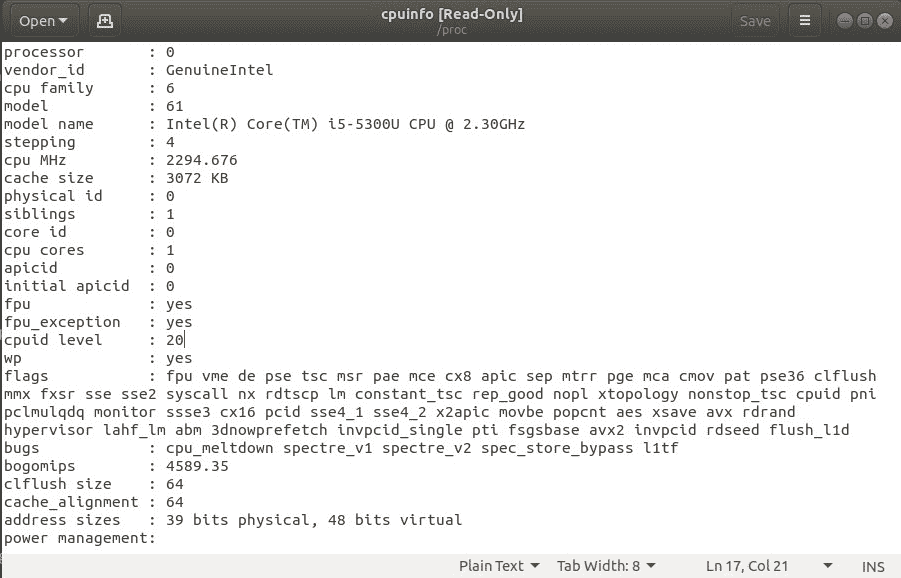

Figure 1: Opening /proc/cpuinfo with gedit

如果你没有`gedit`而有`kate`，那么你可以运行:

```sh
elliot@ubuntu-linux:~$ kate /proc/cpuinfo
```

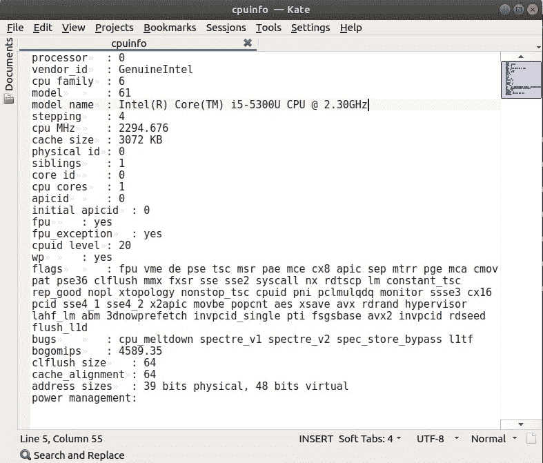

Figure 2: Opening /proc/cpuinfo with kate

您也可以使用图形编辑器在系统上创建新文件。例如，如果您想在`/home/elliot`中创建一个名为`cats.txt`的文件，那么您可以运行`gedit /home/elliot/cats.txt`命令:

```sh
elliot@ubuntu-linux:~$ gedit /home/elliot/cats.txt
```

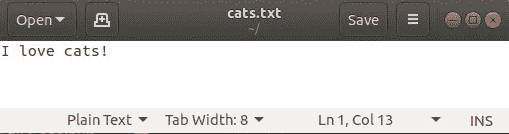

Figure 3: Creating cats.txt with gedit

现在插入一行“我爱猫！”然后保存并关闭文件。文件`cats.txt`现在存在于我的主目录中，我可以用`cat`命令查看它:

```sh
elliot@ubuntu-linux:~$ pwd
/home/elliot
elliot@ubuntu-linux:~$ ls -l cats.txt
-rw-r--r-- 1 elliot elliot 13 Feb 2 14:54 cats.txt 
elliot@ubuntu-linux:~$ cat cats.txt
I love cats!
```

同样，您可以使用任何其他图形文本编辑器在系统上创建文件。

好的！关于图形文本编辑器的讨论到此为止。让我们继续探索非图形文本编辑器的严肃世界。

# 纳米编辑器

`nano`编辑器是一个非常流行且易于使用的命令行编辑器。您可以通过运行`nano`命令打开`nano`编辑器:

```sh
elliot@ubuntu-linux:~$ nano
```

这将打开您的`nano`编辑器，您应该会看到如下截图所示的屏幕:

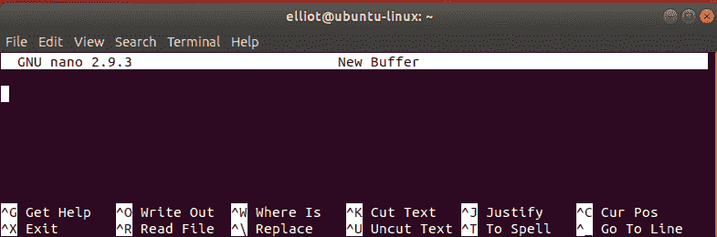

Figure 4: Inside nano

现在添加下面截图中显示的六行:


Figure 5: Add these six lines

查看`nano`编辑器屏幕底部；你会看到很多捷径:


Figure 6: nano shortcuts

我在下表中列出了所有有用的纳米捷径:

| **纳米捷径** | **它做什么** |
| *Ctrl* + *或* | 保存当前文件(写出)。 |
| *Ctrl* + *K* | 剪切当前行并将其存储在缓冲区中。 |
| *Ctrl* + *U* | 粘贴缓冲区中存储的行。 |
| *Ctrl* + *W* | 在文件中搜索字符串(单词)。 |
| *Ctrl* + *\* | 用另一个字符串替换文件中的一个字符串(单词)。 |
| *Ctrl* + *R* | 读取另一个文件。 |
| *Ctrl* + *G* | 视图帮助了解如何使用 nano。 |
| *Ctrl* + *V* | 移至下一页。 |
| *Ctrl* + *和* | 移至上一页。 |
| *Ctrl* + *X* | 退出纳米编辑器。 |

Table 5: nano shortcuts

注意 *Ctrl* + *O* 快捷方式是按 *Ctrl* 再按字母 *O* 触发的。不用按 *+* 键或大写字母 *O* 。

现在用快捷键 *Ctrl* + *O* 保存文件；它会要求你输入文件名，你可以插入`facts.txt`:


Figure 7: Saving the file

然后按*进入*确认。现在让我们退出`nano`编辑器(使用 *Ctrl* + *X* 快捷方式)来验证文件`facts.txt`是否已创建:

```sh
elliot@ubuntu-linux:~$ ls -l facts.txt
-rw-r--r-- 1 elliot elliot 98 Apr 30 15:17 facts.txt
```

现在让我们再次打开`facts.txt`来修复我们在那里添加的虚假事实！要使用`nano`编辑器打开文件`facts.txt`，您可以运行`nano facts.txt`命令:

```sh
elliot@ubuntu-linux:~$ nano facts.txt
```

文件`facts.txt`第一行写着“苹果是蓝色的。”我们当然需要纠正这个错误的事实，所以让我们使用快捷键 *Ctrl* + *\* 将单词`blue`替换为`red`。

当您按下 *Ctrl* + *\* 时，它会要求您输入要替换的单词；可以进入`blue`，如下图截图所示:

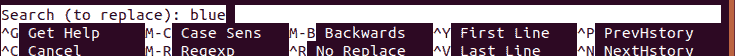

Figure 8: The word to replace

点击*进入*，然后它会要求你输入替代词。可以进入`red`，如下图截图所示:

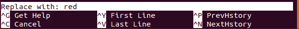

Figure 9: The substitute word

然后可以点击*进入*，它会遍历`blue`这个词的每个实例，问你要不要替换它。幸运的是，我们只有一次`blue`的出现。


Figure 10: Replacing blue with red

按下 *Y* 和 BOOM！`red`这个词取代了`blue`。

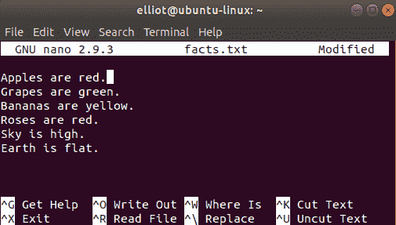

Figure 11: red replaced blue

这里还有一个词我们需要改变。我们都可以同意地球不是平的，对吗？我希望我们都这样！现在让我们像以前一样将`flat`这个词精确地替换为`round`，结果应该如下图所示:


Figure 12: flat replaced with round

现在让我们保存并退出文件。所以我们用 *Ctrl* + *O* 快捷键保存，然后 *Ctrl* + *X* 退出。

`nano`编辑器使用起来非常简单。熟能生巧，所以你用得越多，对你来说就越容易。你可以在`Table 5`练习所有的快捷键作为练习。

# 虚拟仪器编辑

`nano`编辑器通常是初学者的首选编辑器。它是一个很棒的编辑器，但是我们只能说它不是最有效率的编辑器。`vi`编辑器是一个更高级的 Linux 编辑器，拥有大量的功能，是目前为止最受高级 Linux 用户欢迎的编辑器。

我们用`vi`编辑器打开`facts.txt`文件；为此，你运行`vi facts.txt`命令:

```sh
elliot@ubuntu-linux:~$ vi facts.txt
```

这将打开`vi`编辑器，如下图所示:


Figure 13: The facts.txt file opened in vi

与`nano`编辑器不同，`vi`编辑器以两种不同的模式工作:

1.  `insert`模式
2.  `command`模式

`insert`模式使您能够将文本插入文件。另一方面，`command`模式允许您进行复制、粘贴和删除文本等操作。`command`模式还允许您搜索和替换文本以及许多其他内容。

## 插入模式

默认情况下，首次打开`vi`编辑器时进入`command`模式，在`command`模式下不能插入文字。要插入文字，需要切换到`insert`模式。有几种方式可以切换到`insert`模式；`Table 6`列出全部。

| **键** | **它做什么** |
| `i` | 在当前光标位置之前插入文本。 |
| `I` | 在当前行的开头插入文本。 |
| `a` | 在当前光标位置后追加文本。 |
| `A` | 在当前行的末尾追加文本。 |
| `o` | 在当前行下方创建新行。 |
| `O` | 在当前行上方新建一行。 |

Table 6: vi insert mode

您可以使用箭头键在`vi`编辑器中导航，就像在`nano`编辑器中一样。现在导航到文件`facts.txt`的最后一行，然后按字母`o`切换到`insert`模式。现在可以添加一行“Linux 很酷！”

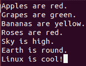

Figure 14: Adding a line in vi

借助`insert`模式，您可以添加任意多的文本。要切换回`command`模式，您需要按下 *Esc* 键。

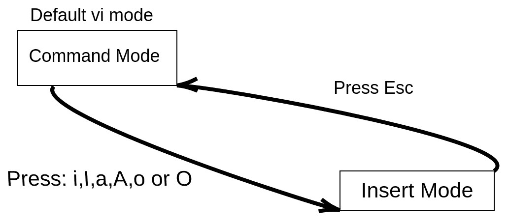

Figure 15: Switching between Insert Mode and Command Mode

前面的截图说明了如何在`command`模式和`insert`模式之间来回切换。

## 命令模式

除了添加文本之外，你想做的任何事情都可以从`command`模式中实现。您可以在`vi`编辑器中使用很多命令。你可能认为我在开玩笑，但是外面有一些书和课程只讨论`vi`编辑。然而，表 7 会让你在`vi`编辑器中启动并运行，因为它列出了你可以在`vi`中使用的最流行的命令。

| **vi 命令** | **它做什么** |
| `yy` | 复制(猛拉)当前行。 |
| `3yy` | 复制(猛拉)三行(从当前行开始)。 |
| `yw` | 从光标位置开始复制(猛拉)一个单词。 |
| `2yw` | 从光标位置开始复制(猛拉)两个字。 |
| `p` | 粘贴在当前光标位置之后。 |
| `P` | 粘贴在当前光标位置之前。 |
| `dd` | 剪切(删除)当前行。 |
| `4dd` | 剪切(删除)四行(从当前行开始)。 |
| `dw` | 从光标位置开始剪切(删除)一个单词。 |
| `x` | 删除光标位置的字符。 |
| `u` | 撤消上一次更改。 |
| `U` | 撤消对该行的所有更改。 |
| `/red` | 在文件中搜索`red`这个词。 |
| `:%s/bad/good` | 将`bad`改为`good`。 |
| `:set number` | 显示行号。 |
| `:set nonumber` | 隐藏行号。 |
| `:7` | 去 7 号线。 |
| `G` | 跳到文件的结尾。 |
| `gg` | 跳到文件的开头。 |

Table 7: vi commands

可以看到，`Table 7`有很多命令，我就不一一赘述了；这是留给你的练习。但是，我将讨论一些命令来帮助您使用`vi`编辑器。

让我们从显示行号开始，因为这将使我们的生活更加轻松！为此，运行`:set`数字命令，如下图所示:


Figure 16: Show line numbers

现在我们来抄写第`4`行。你要确定光标在`4`线上；您可以通过运行`:4`命令来实现，如下图所示:

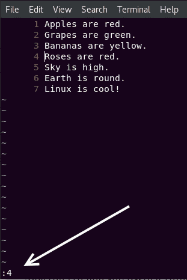

Figure 17: Go to the 4th line

现在按下序列`yy`，它将复制整行。让我们在文件的末尾粘贴三次。所以导航到最后一行，然后按 *p* 三次，会将复制的行粘贴三次，如下图截图所示:


Figure 18: Copying and pasting in vi

好吧。让我们用`awesome`来代替`cool`这个词，因为我们都知道 Linux 不仅仅是酷；太棒了！为此，运行`:%s/cool/awesome`命令，如下图所示:

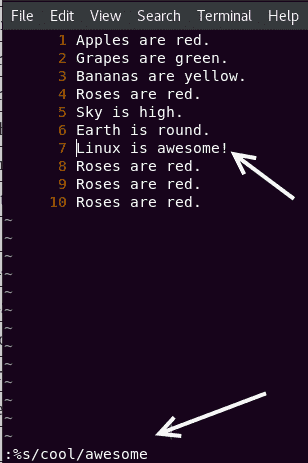

Figure 19: Replace cool with awesome

我们也把`Roses`这个词换成`Cherries`吧，因为我们都知道，不是所有的玫瑰都是红色的。为此，运行`:%s/Roses/Cherries`命令，如下图所示:

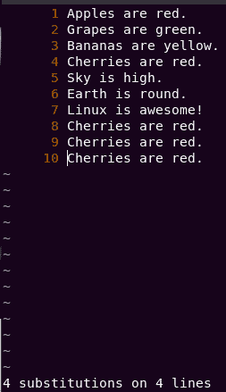

Figure 20: Replace Roses with Cherries

它甚至会告诉你发生了多少次换人。

**COOL TIP**

You should know that `:%s/old/new` will only replace the first occurrence of the word `old` with `new` on all the lines. To replace all the occurrences of the word `old` with `new` on all the lines, you should use the global option `:%s/old/new/g`

为了理解和理解上面的提示，在你的`facts.txt`文件中添加一行“蓝蓝蓝”，并尝试使用`:%s/blue/purple`命令将`blue`替换为`purple`。你会看到它只会取代第一次出现的`blue`。要使其替换所有出现的`blue`，您必须使用全局选项
`:%s/blue/purple/g`。

## 保存和退出 vi

最终，当您在`vi`中查看或编辑完一个文件后，您会想要退出`vi`编辑器。有多种方法可以用来退出`vi`编辑器，`Table 8`列出了所有的方法。

| **vi 命令** | **它做什么** |
| `:w` | 保存文件但不退出`vi`。 |
| `:wq` | 保存文件并退出`vi`。 |
| `ZZ` | 保存文件并退出`vi`(和`:wq`一样，只是更快！). |
| `:x` | 保存文件并退出`vi`(与`:wq`或`ZZ`相同)。 |
| `:q` | 退出`vi`不保存。 |
| `:q!` | 强行退出`vi`不保存。 |

Table 8: Saving and Exiting vi

所以让我们保存文件并退出`vi`编辑器。当然，您可以使用以下任何命令:

1.  `:wq`
2.  `:x`
3.  `ZZ`

它们都达到了同一个结果，那就是保存和退出`vi`。


Figure 21: Save and exit vi

如果你已经成功退出`vi`编辑器，我要恭喜你，因为你是精英中的一员。网上有上百个关于有些人如何打开`vi`编辑器，却始终无法退出的迷因和漫画！

# 文件查看命令

在某些情况下，您可能只想查看文件而不想编辑它。虽然您仍然可以使用文本编辑器如`nano`或`vi`来查看文件，但在 Linux 中查看文件的方法要快得多。

## 猫命令

`cat`命令是 Linux 中最流行和最常用的命令之一。`cat`(简称**连接**)命令将文件连接并打印到标准输出(终端)。

要查看我们创建的`facts.txt`文件，您可以运行`cat facts.txt`命令:

```sh
elliot@ubuntu-linux:~$ cat facts.txt 
Apples are red.
Grapes are green.
Bananas are yellow.
Cherries are red.
Sky is high.
Earth is round.
Linux is awesome!
Cherries are red.
Cherries are red.
Cherries are red.
```

您现在可以在终端舒适地查看文件`facts.txt`的内容，而无需打开任何文本编辑器。

`cat`命令不仅仅可以查看文件。它还可以连接(组合)文件。为了演示，使用您最喜欢的文本编辑器创建以下三个文件:

1.  `file1.txt`(插入行“第一个文件”)
2.  `file2.txt`(插入行“第二个文件”)
3.  `file3.txt`(插入行“第三个文件”)

现在让我们使用`cat`命令查看这三个文件:

```sh
elliot@ubuntu-linux:~$ cat file1.txt 
First File
elliot@ubuntu-linux:~$ cat file2.txt 
Second File
elliot@ubuntu-linux:~$ cat file3.txt 
Third File
```

现在让我们通过运行`cat file1.txt file2.txt`命令将`file1.txt`和`file2.txt`连接在一起:

```sh
elliot@ubuntu-linux:~$ cat file1.txt file2.txt 
First File
Second File
```

我们还可以连接所有三个文件:

```sh
elliot@ubuntu-linux:~$ cat file1.txt file2.txt file3.txt 
First File
Second File 
Third File
```

记住秩序很重要；例如，运行`cat file2.txt file1.txt`命令:

```sh
elliot@ubuntu-linux:~$ cat file2.txt file1.txt 
Second File
First File
```

这将在`file1.txt`之前首先输出`file2.txt`中的文本。

## 战术司令部

`tac`命令是`cat`命令的孪生兄弟。基本上是`cat`反写的，和`cat`命令做的一样，但是反写！

例如，如果您想以相反的顺序查看`facts.txt`文件，您可以运行`tac facts.txt`命令:

```sh
elliot@ubuntu-linux:~$ tac facts.txt 
Cherries are red.
Cherries are red.
Cherries are red.
Linux is awesome!
Earth is round.
Sky is high.
Cherries are red.
Bananas are yellow.
Grapes are green.
Apples are red.
```

`tac`命令也连接文件，就像`cat`命令一样。

## 命令越多

当文件很小，并且没有很多行文本要显示时，使用`cat`命令查看文件是一个不错的选择。如果要查看大文件，最好使用`more`命令。`more`命令一次显示一页文件的内容；它基本上是一个分页程序。

让我们使用`more`命令查看文件`/etc/services`的内容:

```sh
elliot@ubuntu-linux:~$ more /etc/services 
# Network services, Internet style
# Note that it is presently the policy of IANA to assign a single well-known 
# port number for both TCP and UDP; hence, officially ports have two entries 
# even if the protocol doesn't support UDP operations.

tcpmux 1/tcp # TCP port service multiplexer 
systat 11/tcp users
netstat 15/tcp ftp 21/tcp
fsp 21/udp fspd
ssh 22/tcp # SSH Remote Login Protocol 
telnet 23/tcp
smtp 25/tcp mail 
whois 43/tcp nicname
tacacs 49/tcp # Login Host Protocol (TACACS) 
tacacs 49/udp
--More--(7%)
```

它将向您显示`/etc/services`文件的第一页，在底线有一个百分比值，显示您在文件中的进度。您可以使用以下按键在`more`中导航:

*   *进入* >向下滚动一行。
*   空格键>转到下一页。

*   *b*T2【要回去一页。
*   *问*T2 要退出。

`/etc/services`文件存储了可以在 Linux 上运行的众多服务(应用程序)的信息。

## 命令越少

`less`命令是`more`命令的改进版本。是的，你没看错；少胜于多！事实上，著名的成语*少即是多*来源于`less`比`more`提供更多的想法。

`less`命令是另一个传呼机程序，就像`more`一样；它允许您一次一页地查看文本文件。`less`的优点是可以使用向上/向下箭头键浏览文件。还有，`less`比`more`快。

通过运行以下命令，您可以使用`less`查看`/etc/services`文件:

```sh
elliot@ubuntu-linux:~$ less /etc/services
```

也可以少用一些`more`导航键。

## 正面还是反面？

顾名思义，`head`命令显示文件的前几行。默认情况下，它显示文件的前十行。例如，我们知道`facts.txt`有十行，因此运行`head facts.txt`命令将显示所有文件内容:

```sh
elliot@ubuntu-linux:~$ head facts.txt 
Apples are red.
Grapes are green.
Bananas are yellow.
Cherries are red.
Sky is high.
Earth is round.
Linux is awesome!
Cherries are red.
Cherries are red.
Cherries are red.
```

您也可以通过`-n`选项指定您想要查看的行数。例如，要显示`facts.txt`的前三行，可以运行`head -n 3 facts.txt`命令:

```sh
elliot@ubuntu-linux:~$ head -n 3 facts.txt 
Apples are red.
Grapes are green.
Bananas are yellow.
```

另一方面，`tail`命令显示文件的最后几行。默认情况下，它显示最后十行。您也可以使用`-n`选项指定您想要查看的行数。例如，要在`facts.txt`中显示最后两行，可以运行`tail -n 2 facts.txt`命令:

```sh
elliot@ubuntu-linux:~$ tail -n 2 facts.txt 
Cherries are red.
Cherries are red.
```

你知道现在几点了吗？是时候做一些知识检查题了。

# 知识检查

对于以下练习，打开您的终端并尝试解决以下任务:

1.  只查看文件的前两行`facts.txt`。
2.  只查看文件的最后一行`facts.txt`。
3.  以相反的顺序显示文件`facts.txt`的内容。
4.  使用`vi`编辑器打开文件`facts.txt`。
5.  退出`vi`编辑器，认为自己是精英之一。