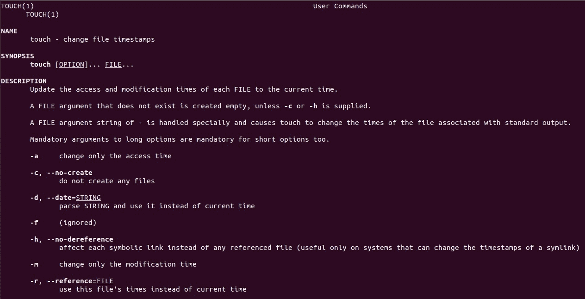

# 五、阅读你的手册

你现在可能在告诉自己，“Linux 太难了！有很多命令，甚至更多的命令选项！我不可能掌握所有这些命令，并把它们记在脑子里。”如果这是你想的，相信我，你很聪明。记住所有存在的 Linux 命令是疯狂的，即使是最有经验的 Linux 管理员也永远无法记住所有的命令，即使是 Linus Torvalds 本人也不行！

所以等等？如果是这样，那么解决办法是什么？答案在于 Linux 文档的美丽世界。Linux 被很好地记录下来，以至于很难迷失在其中。Linux 中有各种各样的工具，不仅可以帮助您记住命令，还可以帮助您理解如何使用它们。

在我的职业生涯中，我遇到了许多 Linux 专业人士，我注意到最熟练的 Linux 管理员不是那些记得的人，而是那些知道如何最大限度地利用 Linux 文档的人。女士们，先生们，我强烈建议你们系好安全带，仔细阅读这一章。我向你保证，你心中的恐惧很快就会消失！

# linux 命令的四个类别

所有 Linux 命令必须属于以下四类之一:

1.  **一个可执行程序**:通常是用 C 编程语言写的。`cp`命令是一个可执行命令的例子。
2.  **别名**:基本上是一个命令(或一组命令)的别称。
3.  **内置Shell**:Shell也支持内部命令。`exit`和`cd`命令是Shell内置命令的两个例子。

4.  **一个 shell 函数**:这些是帮助我们完成特定任务的函数，是编写 shell 脚本必不可少的。我们将在后面更详细地介绍这一点，目前，只知道它们的存在。

# 确定命令的类型

您可以使用`type`命令来确定命令的类型(类别)。例如，如果您想知道`pwd`命令的类型，您可以简单地运行`type pwd`命令:

```sh
elliot@ubuntu-linux:~$ type pwd 
pwd is a shell builtin
```

现在您知道`pwd`命令是一个Shell内置命令。现在让我们弄清楚`ls`命令的类型:

```sh
elliot@ubuntu-linux:~$ type ls
ls is aliased to `ls --color=auto'
```

可以看到，`ls`命令被别名为`ls --color=auto`。现在您知道为什么每次运行`ls`命令时都会看到一个彩色输出。让我们看看`date`命令的类型:

```sh
elliot@ubuntu-linux:~$ type date 
date is /bin/date
```

任何存在于`/bin`或`/sbin`中的命令都是可执行程序。因此，我们可以断定`date`命令是一个可执行程序，因为它驻留在`/bin`中。

最后，让我们确定`type`命令本身的类型:

```sh
elliot@ubuntu-linux:~$ type type 
type is a shell builtin
```

原来`type`命令是一个 shell 内置命令。

# 查找命令的位置

每次运行可执行命令时，系统中的某个地方都会有一个文件被执行。您可以使用`which`命令来确定可执行命令的位置。例如，如果你想知道`rm`命令的位置，你可以运行`which rm`命令:

```sh
elliot@ubuntu-linux:~$ which rm
/bin/rm
```

所以现在你知道`rm`住在`/bin`目录下。让我们看看`reboot`命令的位置:

```sh
elliot@ubuntu-linux:~$ which reboot
/sbin/reboot
```

如您所见，`reboot`命令位于`/sbin`目录中。

# 这个命令是做什么的？

您可以使用`whatis`命令来获得命令功能的简要描述。例如，如果您想知道`free`命令的目的，您可以运行`whatis free`命令:

```sh
elliot@ubuntu-linux:~$ whatis free
free (1)             - Display amount of free and used memory in the system
```

如您所见，`free`命令，正如我们已经知道的，显示了系统中的空闲和已用内存量。酷！现在让我们看看`df`命令的作用:

```sh
elliot@ubuntu-linux:~$ whatis df
df (1)               - report file system disk space usage
```

最后，让我们看看`which`命令的作用:

```sh
elliot@ubuntu-linux:~$ whatis which 
which (1)            - locate a command
```

我们已经知道，`which`显示命令的位置。

# 手册页

`whatis`命令给你一个命令做什么的简短描述；然而，它没有教你如何使用命令。为此，您可以使用`man`页面。

`man`页面是一个**手册**页面，有适当的文档帮助你理解如何使用命令。和你买新手机一样，你会得到一本手册，里面会告诉你如何使用手机，如何更新手机上的软件等等。

一般来说，如果你想阅读一个命令的`man`页面，你可以运行:

```sh
man command_name
```

例如，如果您想查看`touch`命令的`man`页面，您可以运行`man touch`命令:

```sh
elliot@ubuntu-linux:~$ man touch
```



Figure 1: touch man page

正如您在前面的截图中看到的，`touch`手册页向您展示了如何使用该命令，它还列出并解释了所有的命令选项。

`Table 9`向您展示如何在浏览`man`页面时四处移动。

| **人钥匙** | **它做什么** |
| 空间 | 向前滚动一页。 |
| *Ctrl* + *F* | 向前滚动一页(与空格相同)。 |
| *Ctrl* + *B* | 向后滚动一页。 |
| `/word` | 将在`man`页面搜索一个单词(模式)。例如，`/access`将在`man`页面中搜索单词`access` |
| *q* | 将退出`man`页面。 |
| *n* | 搜索一个单词后，可以使用 *n* 在`man`页面查找该单词的下一个出现。 |
| *N* | 搜索一个单词后，可以使用 *N* 在`man`页面查找该单词的前一次出现。 |

`man`页的重要性怎么强调都不为过。在最黑暗的时刻，他们可以成为你最好的朋友，相信我！

你也应该知道`man`本身有一个手册页:

```sh
elliot@ubuntu-linux:~$ man man
```

它描述了如何使用`man`页面。

# shell 内置程序的帮助

如果你玩够了`man`页面，你可能会注意到很多 shell 内置命令没有`man`页面。例如，`cd`或`exit`命令没有`man`页面:

```sh
elliot@ubuntu-linux:~$ type cd 
cd is a shell builtin 
elliot@ubuntu-linux:~$ man cd 
No manual entry for cd 
elliot@ubuntu-linux:~$ type exit 
exit is a shell builtin 
elliot@ubuntu-linux:~$ man exit 
No manual entry for exit
```

这是因为 shell 内置命令没有`man`页，但暂时不要抓狂！通过使用`help`命令，您仍然可以找到如何使用 shell 内置程序的帮助。例如，要获得如何使用`exit`命令的帮助，您可以运行:

```sh
elliot@ubuntu-linux:~$ help exit 
exit: exit [n]
 Exit the shell.

 Exits the shell with a status of N. If N is omitted, the exit status 
 is that of the last command executed.
```

同样，要获得如何使用`cd`命令的帮助，可以运行`help cd`命令:

```sh
elliot@ubuntu-linux:~$ help cd 
cd: cd [-L|-P] [dir]
 Change the shell working directory.

 Change the current directory to DIR. The default DIR is the value of 
 the HOME shell variable.

 The variable CDPATH defines the search path for the directory containing DIR. 
 Alternative directory names in CDPATH are separated by a colon (:). 
 A null directory name is the same as the current directory. 
 If DIR begins with a slash (/), then CDPATH is not used.

 If the directory is not found, and the shell option `cdable_vars' is set, 
 the word is assumed to be a variable name. If that variable has a value, 
 its value is used for DIR.

 Options:
 -L force symbolic links to be followed
 -P use the physical directory structure without following symbolic links
 The default is to follow symbolic links, as if `-L' were specified. 

 Exit Status:
 Returns 0 if the directory is changed; non-zero otherwise.
```

# 信息页面

GNU 项目推出了`info`页面作为`man`页面的替代文档。GNU 项目曾经声称`man`页面已经过时，需要更换，所以他们想出了`info`页面。

您可以通过运行以下命令查看任何命令的`info`页面:

```sh
info command_name
```

例如，要查看`ls`命令的`info`页面，您可以运行`info ls`命令:

```sh
elliot@ubuntu-linux:~$ info ls

Next: dir invocation, Up: Directory listing

10.1 ‘ls': List directory contents
==================================

The ‘ls' program lists information about files (of any type, including directories). Options and file arguments can be intermixed arbitrarily, as usual.

For non-option command-line arguments that are directories, by default ‘ls' lists the contents of directories, not recursively, and omitting files with names beginning with ‘.'. For other non-option arguments, by default ‘ls' lists just the file name. If no non-option argument is specified, ‘ls' operates on the current directory, acting as if it had been invoked with a single argument of ‘.'.

By default, the output is sorted alphabetically, according to the locale settings in effect.(1) If standard output is a terminal, the output is in columns (sorted vertically) and control characters are output as question marks; otherwise, the output is listed one per line and control characters are output as-is.

Because ‘ls' is such a fundamental program, it has accumulated many options over the years. They are described in the subsections below; within each section, options are listed alphabetically (ignoring case). The division of options into the subsections is not absolute, since some options affect more than one aspect of ‘ls''s operation.
```

与`man`页面相比，`info`页面有时会提供更多细节。然而，`man`页面仍然是 Linux 帮助文档最受欢迎的目的地。

# 非常有用的恰当命令

`apropos`命令是最有用但却被低估的 Linux 命令之一。让我们来看一下`apropos`命令的作用:

```sh
elliot@ubuntu-linux:~$ whatis apropos
apropos (1)          - search the manual page names and descriptions
```

哇！`apropos`命令帮助您搜索正确的命令来完成特定的任务。例如，假设您想要重命名一个文件，但是您不确定使用哪个 Linux 命令；在这种情况下，可以运行`apropos rename`命令:

```sh
elliot@ubuntu-linux:~$ apropos rename
file-rename (1p)     - renames multiple files
File::Rename (3pm)   - Perl extension for renaming multiple files 
gvfs-rename (1)      - (unknown subject)
mmove (1)            - move or rename an MSDOS file or subdirectory 
mren (1)             - rename an existing MSDOS file
mv (1)               - move (rename) files 
prename (1p)         - renames multiple files 
rename (1)           - renames multiple files
rename.ul (1)        - rename files
```

轰！它列出了所有在其手册页描述中显示了单词`rename`的命令。我打赌你可以在输出中找到`mv`命令。

假设您想查看日历，但不确定使用哪个命令；在这种情况下，您可以运行:

```sh
elliot@ubuntu-linux:~$ apropos calendar
cal (1)              - displays a calendar and the date of Easter
calendar (1)         - reminder service
ncal (1)             - displays a calendar and the date of Easter
```

可以看到输出中显示了`cal`命令。

对于最后一个例子，假设您想要显示您的 CPU 信息，但是您不知道使用哪个命令；在这种情况下，您可以运行:

```sh
elliot@ubuntu-linux:~$ apropos cpu 
chcpu (8)            - configure CPUs
cpuid (4)            - x86 CPUID access device
cpuset (7)           - confine processes to processor and memory node subsets 
lscpu (1)            - display information about the CPU architecture
msr (4)              - x86 CPU MSR access device
sched (7)            - overview of CPU scheduling
taskset (1)          - set or retrieve a process's CPU affinity
```

给你！你可以看到它列出了我们之前用过的`lscpu`命令。当你忘记一个命令或者你不确定使用哪个命令时，`apropos`命令在这里拯救你。您只需为`apropos`命令提供一个关键词(最好是动词)，突出显示您想要完成的任务:

```sh
apropos keyword
```

**COOL TIP**

The `man -k` command will display the same result as the `apropos` command.

```sh
elliot@ubuntu-linux:~$ man -k cpu 
chcpu (8)            - configure CPUs
cpuid (4)            - x86 CPUID access device
cpuset (7)           - confine processes to processor and memory node subsets 
lscpu (1)            - display information about the CPU architecture
msr (4)              - x86 CPU MSR access device
sched (7)            - overview of CPU scheduling
taskset (1)          - set or retrieve a process's CPU affinity
```

# /usr/share/doc 目录

`/usr/share/doc`目录是在 Linux 中寻找帮助的另一个极好的地方。这个目录有非常密集的文档；它不仅仅向您展示如何使用命令；有时，它甚至会显示开发该命令的作者的姓名和联系信息。此外，它还可能包括一个包含未完成任务/特征列表的`TODO`文件；投稿人通常会查看`TODO`文件来帮助修复错误和开发新功能。

为了演示，让我们转到`nano`文档目录:

```sh
elliot@ubuntu-linux:~$ cd /usr/share/doc/nano 
elliot@ubuntu-linux:/usr/share/doc/nano$ pwd
/usr/share/doc/nano
```

现在列出目录的内容，看看里面有什么:

```sh
elliot@ubuntu-linux:/usr/share/doc/nano$ ls
AUTHORS               copyright faq.html        nano.html   README    TODO 
changelog.Debian.gz   examples  IMPROVEMENTS.gz NEWS.gz     THANKS.gz
```

酷！您可以查看`AUTHORS`文件，查看为`nano`编辑器程序做出贡献的开发人员团队。如果你很想知道还有什么事情要做，你也可以查看`TODO`文件！您也可以查看`README`文件了解`nano`编辑器的一般描述。甚至还有一个链接`faq.html`包含了常见问题。

正如您在本章中看到的，Linux 有各种有用的工具供您使用；所以一定要利用它们！

# 知识检查

对于以下练习，打开您的终端并尝试解决以下任务:

1.  你需要知道`echo`命令是一个内置的 shell 还是一个可执行的程序，你会运行哪个命令？
2.  显示`uptime`命令可执行文件的位置。
3.  显示`mkdir`命令的简要描述。
4.  你忘了怎么使用`mv`命令，你打算怎么办？
5.  你忘了哪个命令是用来显示日历的，你打算怎么办？
6.  `history`命令是一个内置的 shell，因此它没有手册页。你想清除你的历史，但不知道如何清除。你要怎么办？

## 对还是错

1.  命令`whereis`用于定位命令。
2.  可以互换使用`man -p`和`apropos`。
3.  您可以使用`whatis`命令获得命令的简短描述。
4.  您可以使用`type`命令来确定命令是别名、Shell内置还是可执行程序。