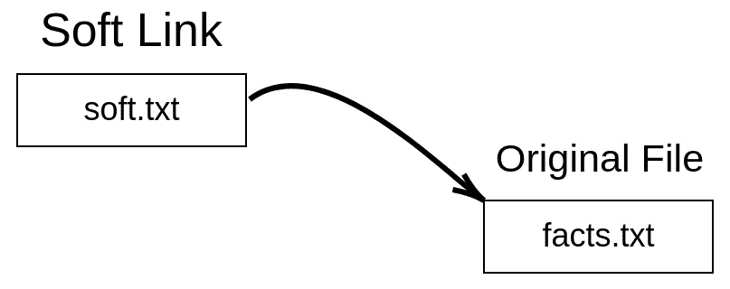
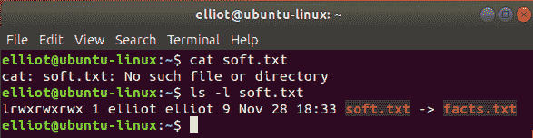
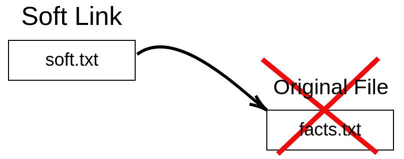
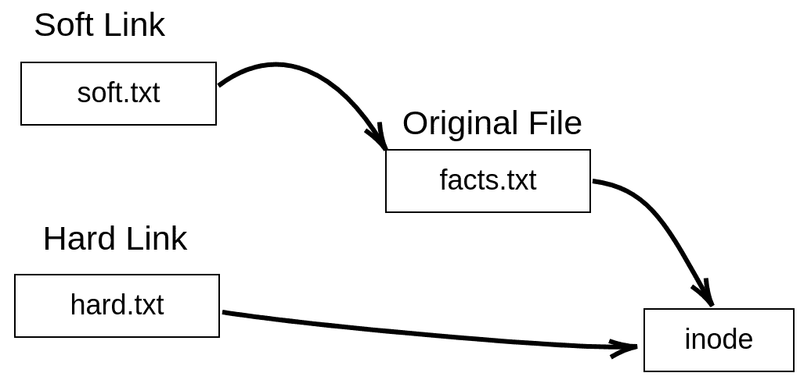
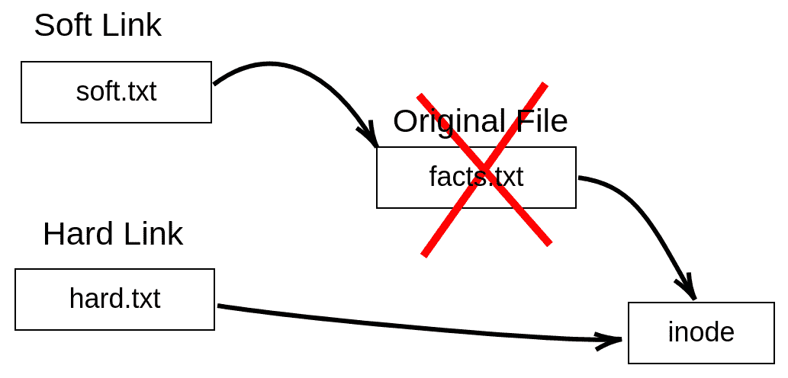

# 六、硬链接 VS 软链接

在本章中，我们进一步了解了 Linux 文件，并讨论了硬链接和软链接之间的区别。如果你以前在 Windows(或 macOS)中创建过快捷方式，你会很快掌握软链接的概念。但是在我们讨论硬链接和软链接之前，您首先必须了解 inode 的概念。

# 文件索引节点

当你去杂货店时，你会发现每种产品都有一组属性，比如:

*   产品类型:巧克力
*   产品价格:2.50 美元
*   产品供应商:奇巧
*   剩余金额:199

通过扫描产品的条形码，这些属性可以显示在杂货店的任何产品上。当然，每个条形码都是唯一的。嗯，你可以把这个类比应用到 Linux 上。Linux 上的每个文件都有一组属性，比如:

*   文件类型
*   文件大小
*   文件所有者
*   文件权限
*   硬链接数量
*   文件时间戳

这些属性存储在名为 inode(索引节点)的数据结构中，每个 inode 都由一个编号(inode 编号)标识。所以你可以把索引节点号想象成杂货店的条形码。Linux 中的每个文件都有一个索引节点号，每个索引节点号都指向一个文件数据结构，即索引节点。以下是索引节点的正式定义:

**What is an Inode?**

An inode is simply a file data structure that stores file information (attributes), and every inode is uniquely identified by a number (inode number).

# 显示文件索引节点号

有两个命令可以用来查看文件的信息节点号:

1.  `ls -i`文件
2.  `stat`文件

例如，要查看`facts.txt`的索引节点号，可以运行命令`ls -i facts.txt`:

```sh
elliot@ubuntu-linux:~$ ls -i facts.txt 
924555 facts.txt
```

它会为你吐出索引节点号。您也可以使用`stat`命令:

```sh
elliot@ubuntu-linux:~$ stat facts.txt 
File: facts.txt
Size: 173 Blocks: 8 IO Block: 4096 regular file
Device: 801h/2049d Inode: 924555 Links: 1
Access: (0644/-rw-r--r--) Uid: ( 1000/ tom) Gid: ( 1000/ tom) 
Access: 2019-05-08 13:41:16.544000000 -0600
Modify: 2019-05-08 12:50:44.112000000 -0600
Change: 2019-05-08 12:50:44.112000000 -0600
Birth: -
```

`stat`命令不仅仅列出文件的索引节点号；它还列出了从命令输出中可以看到的所有文件属性。

# 创建软链接

既然您已经理解了什么是文件索引节点，那么您就可以轻松理解硬链接和软链接的概念了。让我们从软链接开始:

**WHAT IS A SOFT LINK?**

A soft link (also referred to as a symbolic link) is simply a file that points to another file.

一张图片抵得上千言万语，所以下图会帮助你可视化软链接。



Figure 1: A soft link visualization

要创建软链接，我们使用带有`-s`选项的`ln`命令，如下所示:

```sh
ln -s original_file soft_link
```

因此，要创建一个名为`soft.txt`的到`facts.txt`文件的软链接，您可以运行命令`ln -s facts.txt soft.txt`:

```sh
elliot@ubuntu-linux:~$ ln -s facts.txt soft.txt
```

现在让我们在刚刚创建的软链接文件`soft.txt`上做一个长列表:

```sh
elliot@ubuntu-linux:~$ ls -l soft.txt
lrwxrwxrwx 1 tom tom 9 May 8 21:48 soft.txt -> facts.txt
```

你会注意到两件事。首先是输出`lrwxrwxrwx`第一列的字母`l`，表示文件是链接(软链接)，其次可以看到右箭头`soft.txt → facts.txt`，基本上告诉我们`soft.txt`是指向文件`facts.txt`的软链接。

现在我们来检查一下文件`soft.txt`的内容:

```sh
elliot@ubuntu-linux:~$ cat soft.txt 
Apples are red.
Grapes are green.
Bananas are yellow.
Cherries are red.
Sky is high.
Earth is round.
Linux is awesome!
Cherries are red.
Cherries are red.
Cherries are red.
```

当然，它包含与原始文件`facts.txt`相同的数据。事实上，如果您编辑软链接，它实际上也会编辑原始文件。

为了演示，用任何文本编辑器打开文件`soft.txt`，并添加一行“草是绿色的。”在文件的最末尾，然后保存并退出，这样`soft.txt`的内容将如下:

```sh
elliot@ubuntu-linux:~$ cat soft.txt 
Apples are red.
Grapes are green.
Bananas are yellow.
Cherries are red.
Sky is high.
Earth is round.
Linux is awesome!
Cherries are red.
Cherries are red.
Cherries are red.
Grass is green.
```

现在我们来检查一下原始文件`facts.txt`的内容:

```sh
elliot@ubuntu-linux:~$ cat facts.txt 
Apples are red.
Grapes are green.
Bananas are yellow.
Cherries are red.
Sky is high.
Earth is round.
Linux is awesome!
Cherries are red.
Cherries are red.
Cherries are red.
Grass is green.
```

如你所见，新的一行“草是绿色的。”也在那里。这是因为每次您编辑一个软链接时，它实际上也编辑了它所指向的原始文件。

现在，如果删除软链接，原始文件将不会发生任何变化，它将保持不变:

```sh
elliot@ubuntu-linux:~$ rm soft.txt 
elliot@ubuntu-linux:~$ cat facts.txt
Apples are red.
Grapes are green.
Bananas are yellow.
Cherries are red.
Sky is high.
Earth is round.
Linux is awesome!
Cherries are red.
Cherries are red.
Cherries are red.
Grass is green.
```

现在让我们再次创建软链接`soft.txt`:

```sh
elliot@ubuntu-linux:~$ ln -s facts.txt soft.txt
```

如果删除原文件`facts.txt`，软链接`soft.txt`将变得无用！但是在我们删除`facts.txt`文件之前，让我们在`/tmp`中复制它，因为我们稍后会用到它:

```sh
elliot@ubuntu-linux:~$ cp facts.txt /tmp
```

现在让我们从`elliot`的主目录中删除文件`facts.txt`，看看软链接会发生什么:

```sh
elliot@ubuntu-linux:~$ rm facts.txt 
elliot@ubuntu-linux:~$ cat soft.txt 
cat: soft.txt: No such file or directory
```

正如你所看到的，软链接`soft.txt`变得无用，因为它现在不指向任何地方。请记住，文件`soft.txt`仍然存在，如下图所示。



Figure 2: soft.txt becomes useless!

下图向您展示了在原始文件`facts.txt`被删除后，软链接`soft.txt`无处指向。



Figure 3: soft.txt points to nowhere

现在，如果我们将`facts.txt`移回`elliot`的主目录:

```sh
elliot@ubuntu-linux:~$ mv /tmp/facts.txt /home/elliot
```

软链接`soft.txt`又有用了！你可以说我们复活了软链接！

```sh
elliot@ubuntu-linux:~$ cat soft.txt 
Apples are red.
Grapes are green.
Bananas are yellow.
Cherries are red.
Sky is high.
Earth is round.
Linux is awesome!
Cherries are red.
Cherries are red.
Cherries are red.
Grass is green.
```

让我们比较一下软链接`soft.txt`和原始文件`facts.txt`的索引节点号:

```sh
elliot@ubuntu-linux:~$ ls -i soft.txt facts.txt 
925155 facts.txt 924556 soft.txt
```

如您所见，两个文件的信息节点号不同。最后，让我们运行软链接`soft.txt`上的`stat`命令:

```sh
elliot@ubuntu-linux:~$ stat soft.txt 
File: soft.txt -> facts.txt
Size: 9 Blocks: 0 IO Block: 4096 symbolic link
Device: 801h/2049d Inode: 924556 Links: 1
Access: (0777/lrwxrwxrwx) Uid: ( 1000/ tom) Gid: ( 1000/ tom) 
Access: 2019-05-08 22:04:58.636000000 -0600
Modify: 2019-05-08 22:02:18.356000000 -0600
Change: 2019-05-08 22:02:18.356000000 -0600
Birth: -
```

如您所见，它将文件列为符号链接，这是软链接的另一个名称。

如您目前所见，软链接具有以下属性:

*   软链接的信息节点不同于原始文件。
*   一旦原始文件被删除，软链接就变得无用了。
*   对软链接的任何更改实际上都是对原始文件的更改。
*   您可以创建到目录的软链接。

您可以创建到目录的软链接，就像创建到文件的软链接一样。为了演示，让我们首先在`elliot`的主目录中创建一个名为`sports`的目录。在`sports`内部，创建三个文件:`swimming`、`soccer`和`hockey`，如下所示:

```sh
elliot@ubuntu-linux:~$ mkdir sports
elliot@ubuntu-linux:~$ touch sports/swimming sports/soccer sports/hockey 
elliot@ubuntu-linux:~$ ls sports
hockey soccer swimming
```

现在让我们创建一个名为`softdir1`到`sports`目录的软链接:

```sh
elliot@ubuntu-linux:~$ ln -s sports softdir1
```

现在如果你换到`softdir1`，你实际上是换到`sports`，所以你会看到相同的目录内容:

```sh
elliot@ubuntu-linux:~$ cd softdir1 
elliot@ubuntu-linux:~/softdir1$ ls 
hockey soccer swimming
```

当然，同样的事情也适用于目录；也就是说，如果你删除了原来的目录，软链接就会变得无用！

# 创建硬链接

说到硬链接，故事就有点不一样了。这是因为硬链接是原始文件的副本。这是硬链接的定义:

**WHAT IS A HARD LINK?**

A hard link is simply an additional name for an existing file. It has the same inode of the original file, and hence, it's indistinguishable from the original file.

你可以把它当成一个昵称。当有人叫你的昵称时，他们仍然指的是你。

硬链接具有以下属性:

*   硬链接与原始文件具有(共享)相同的信息节点。
*   如果原始文件被删除，硬链接保持不变。
*   硬链接中的任何更改都会反映在原始文件中。
*   您不能创建到目录的硬链接。

下图帮助您可视化硬链接:



Figure 4: A hard link visualization

我们使用相同的`ln`命令来创建硬链接，但是这次我们省略了`-s`选项:

```sh
ln original_file hard_link
```

因此，要创建一个名为`hard.txt`到文件`facts.txt`的硬链接，您可以简单地运行命令`ln facts.txt hard.txt`:

```sh
elliot@ubuntu-linux:~$ ln facts.txt hard.txt
```

现在让我们在硬链接`hard.txt`和原始文件`facts.txt`上做一个长列表:

```sh
elliot@ubuntu-linux:~$ ls -l hard.txt
-rw-rw-r-- 2 tom tom 210 May 9 00:07 hard.txt 
elliot@ubuntu-linux:~$ ls -l facts.txt
-rw-rw-r-- 2 tom tom 210 May 9 00:07 facts.txt
```

他们一模一样！硬链接也具有与原始文件相同的内容:

```sh
elliot@ubuntu-linux:~$ cat hard.txt 
Apples are red.
Grapes are green.
Bananas are yellow.
Cherries are red.
Sky is high.
Earth is round.
Linux is awesome!
Cherries are red.
Cherries are red.
Cherries are red.
Grass is green.
```

现在加上一句“游泳是一项运动。”在与您选择的文本编辑器的硬链接`hard.txt`的最后:

```sh
elliot@ubuntu-linux:~$ cat hard.txt 
Apples are red.
Grapes are green.
Bananas are yellow.
Cherries are red.
Sky is high.
Earth is round.
Linux is awesome!
Cherries are red.
Cherries are red.
Cherries are red.
Grass is green.
Swimming is a sport.
```

现在就像在使用软链接的情况下一样，原始文件的内容也发生了变化:

```sh
elliot@ubuntu-linux:~$ cat facts.txt 
Apples are red.
Grapes are green.
Bananas are yellow.
Cherries are red.
Sky is high.
Earth is round.
Linux is awesome!
Cherries are red.
Cherries are red.
Cherries are red.
Grass is green.
Swimming is a sport.
```

现在让我们检查这两个文件的信息节点号:

```sh
elliot@ubuntu-linux:~ ls -i hard.txt facts.txt 
925155 facts.txt 925155 hard.txt
```

请注意，两个文件具有相同的索引节点号。现在让我们对这两个文件运行`stat`命令:

```sh
elliot@ubuntu-linux:~$ stat hard.txt facts.txt 
File: hard.txt
Size: 210 Blocks: 8 IO Block: 4096 regular file
Device: 801h/2049d Inode: 925155 Links: 2
Access: (0664/-rw-rw-r--) Uid: ( 1000/ elliot) Gid: ( 1000/ elliot) 
Access: 2019-05-09 00:07:36.884000000 -0600
Modify: 2019-05-09 00:07:25.708000000 -0600
Change: 2019-05-09 00:07:25.720000000 -0600
Birth: -
File: facts.txt
Size: 210 Blocks: 8 IO Block: 4096 regular file
Device: 801h/2049d Inode: 925155 Links: 2
Access: (0664/-rw-rw-r--) Uid: ( 1000/ elliot) Gid: ( 1000/ elliot)
Access: 2019-05-09 00:07:36.884000000 -0600
Modify: 2019-05-09 00:07:25.708000000 -0600
Change: 2019-05-09 00:07:25.720000000 -0600
Birth: -
```

对于两个文件，`stat`命令的输出是相同的。还有，这里`Links: 2`的数字表示有两个硬链接指向文件。嗯！我们只创建了一个到文件`facts.txt`的硬链接，那么它怎么会列出两个硬链接呢？好吧，原始文件本身是一个硬链接，所以任何文件都至少有一个硬链接(本身)。

现在不同于软链接的情况，如果删除原始文件`facts.txt`:

```sh
elliot@ubuntu-linux:~$ rm facts.txt
```

硬链接保持不变:

```sh
elliot@ubuntu-linux:~$ cat hard.txt 
Apples are red.
Grapes are green.
Bananas are yellow.
Cherries are red.
Sky is high.
Earth is round.
Linux is awesome!
Cherries are red.
Cherries are red.
Cherries are red.
Grass is green.
Swimming is a sport.
```

下图显示了为什么硬链接保持不变。



Figure 5: hard.txt remains intact

现在请注意，文件`facts.txt`删除后，文件`hard.txt`的硬链接数将减少到 1:

```sh
elliot@ubuntu-linux:~$ stat hard.txt 
File: hard.txt
Size: 210 Blocks: 8 IO Block: 4096 regular file
Device: 801h/2049d Inode: 925155 Links: 1
Access: (0664/-rw-rw-r--) Uid: ( 1000/ elliot) Gid: ( 1000/ elliot) 
Access: 2019-05-09 00:17:21.176000000 -0600
Modify: 2019-05-09 00:07:25.708000000 -0600
Change: 2019-05-09 00:17:18.696000000 -0600
Birth: -
```

您不能创建到目录的硬链接。如果你不相信我，那么尝试创建一个名为`variables`的硬链接到`/var`目录:

```sh
elliot@ubuntu-linux:~$ ln /var variables
ln: /var: hard link not allowed for directory
```

我告诉过你硬链接是不允许的目录！你为什么怀疑我？

**MIND-BLOWING FACT**

There is NO WAY to differentiate between an original file and a hard link. For example, if you are given two files, and one of them happens to be a hard link for the other file, there is NO WAY to tell which file is the original! It is like the chicken and egg dilemma; no one knows which one came first!

# 知识检查

对于以下练习，打开您的终端并尝试解决以下任务:

1.  显示`/var/log`目录的索引节点号。
2.  显示`/boot`目录的硬链接数量。
3.  在你的主目录中创建一个名为`coins`的新目录。
4.  创建到名为`currency`的`coins`的软链接。
5.  在`coins`目录中，创建两个文件–`silver`和`gold`。
6.  在`currency`内新建一个文件`bronze`。
7.  列出两个目录的内容–`coins`和`currency`。
8.  在你的主目录中创建新的文件`beverages`，并创建一个名为`drinks`到`beverages`的硬链接。
9.  在`drinks`文件中增加一行“柠檬正在刷新”，然后删除`beverages`文件。
10.  显示您的`drinks`文件的内容。

## 对还是错

1.  **文件名**是索引节点数据结构的一部分。
2.  **文件大小**是索引节点数据结构的一部分。
3.  您可以创建到目录的软链接。
4.  您可以创建到目录的硬链接。
5.  一个目录的最小硬链接数是`2`。
6.  软链接与原始文件具有相同的索引节点号。
7.  硬链接与原始文件具有相同的索引节点号。