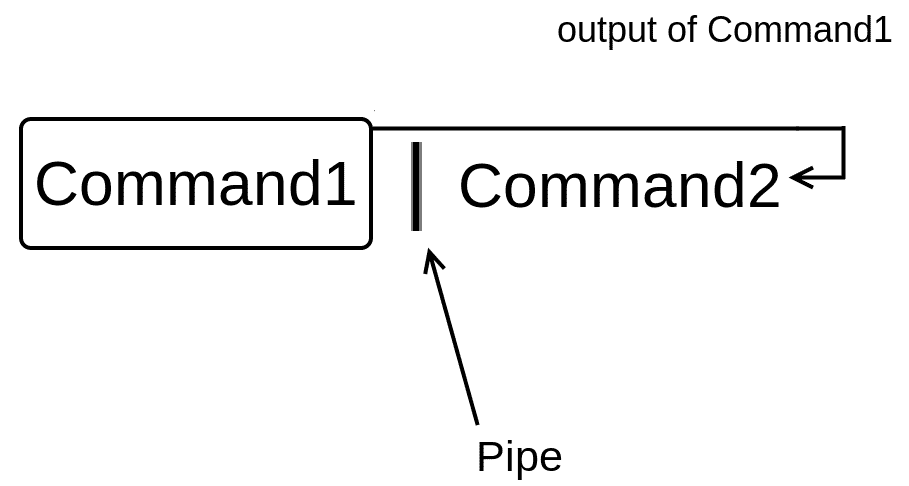

# 九、管道和 I/O 重定向

Linux 的一个主要原则是 *E* *ach 程序做好一件事*，因此，每个 Linux 命令都被设计成高效地完成一个任务。在本章中，您将学习如何使用 Linux 管道，通过结合 Linux 命令的功能来执行更复杂的任务，从而释放 Linux 命令的真正力量。您还将了解 I/O(输入/输出)重定向，这将使您能够读取用户输入并将命令输出保存到文件中。

# Linux 管道

在 Linux 中，您可以使用管道将一个命令的输出作为另一个命令的输入(参数):



Figure 1 – A Linux pipe

管道由键盘上的竖线字符表示。Linux 管道非常有用，因为它们允许您以简单的方式完成相对复杂的任务，在整本书中，您会看到它们经常派上用场。

在我们做一个例子之前，让我们首先将`hard.txt`文件重命名为`facts.txt`，因为我们在[第 6 章](06.html)、*硬链接与软链接*中删除了`facts.txt`文件:

```sh
elliot@ubuntu-linux:~$ mv hard.txt facts.txt
```

现在我们使用`head`命令查看`facts.txt`的前五行:

```sh
elliot@ubuntu-linux:~$ head -n 5 facts.txt 
Apples are red.
Grapes are green.
Bananas are yellow.
Cherries are red.
Sky is high.
```

现在只想显示文件`facts.txt`的第五行`Sky is high.`；我该怎么做？

这就是 Linux 管道发挥作用的地方。如果您将前一条命令的输出传输到`tail -n 1`命令，您将获得第五行:

```sh
elliot@ubuntu-linux:~$ head -n 5 facts.txt | tail -n 1 
Sky is high.
```

因此，通过使用管道，我能够将命令`head -n 5 facts.txt`的输出发送到命令`tail -n 1`的输入(参数)。

让我们做另一个例子。如果你想显示文件的第七行`facts.txt`，那么你将使用`head`命令显示前七行，然后使用管道到`tail`最后一行:

```sh
elliot@ubuntu-linux:~$ head -n 7 facts.txt | tail -n 1 
Linux is awesome
```

也可以一次使用多个管道，如下图所示:


Figure 2: Two pipes

例如，您已经知道`lscpu`命令显示您的处理器信息。`lscpu`命令输出的第四行显示你的机器有多少个中央处理器。您可以使用两个管道显示`lscpu`命令的第四行:

```sh
elliot@ubuntu-linux:~$ lscpu | head -n 4 | tail -n 1 
CPU(s):       1
```

让我们来分析一下这里发生了什么。我们使用的第一个管道显示了`lscpu`命令的前四行:

```sh
elliot@ubuntu-linux:~$ lscpu | head -n 4 
Architecture:    x86_64
CPU op-mode(s):  32-bit, 64-bit 
Byte Order:      Little Endian
CPU(s):          1
```

然后我们使用第二个管道`tail`到最后一行，在这种情况下得到第四行:

```sh
elliot@ubuntu-linux:~$ lscpu | head -n 4 | tail -n 1 
CPU(s):        1
```

你同样可以显示`lscpu`的第二行，显示你的 CPU 运行模式，但我会留给你做练习。

# 输入和输出重定向

在本节中，您将了解到最酷的 Linux 特性之一，即输入/输出重定向。大多数 Linux 命令使用三种不同的数据流:

*   标准输入(也称为`stdin`)
*   标准输出(也称为`stdout`)
*   标准误差(也称为`stderr`)

到目前为止，我们讨论的大多数命令都会产生一些输出。该输出被发送到一个称为标准输出的特殊文件(也称为`stdout`)。默认情况下，标准输出文件链接到终端，这就是为什么每次运行命令时，都会在终端上看到输出。此外，有时命令会产生错误消息。这些错误信息被发送到另一个称为标准错误的特殊文件中(也称为`stderr`，默认情况下，它也链接到终端。

# 重定向标准输出

您知道运行`date`命令会在您的终端上显示当前日期:

```sh
elliot@ubuntu-linux:~$ date 
Sat May 11 06:02:44 CST 2019
```

现在通过使用大于号`>`，你可以将`date`命令的输出重定向到一个文件，而不是你的终端！看一看:

```sh
elliot@ubuntu-linux:~$ date > mydate.txt
```

如您所见，您的屏幕上没有显示任何输出！这是因为输出被重定向到文件`mydate.txt`:

```sh
elliot@ubuntu-linux:~$ cat mydate.txt 
Sat May 11 06:04:49 CST 2019
```

酷！让我们尝试更多的例子。您可以使用`echo`命令在终端上打印一行:

```sh
elliot@ubuntu-linux:~$ echo "Mars is a planet." 
Mars is a planet.
```

如果要将输出重定向到名为`planets.txt`的文件，可以运行命令:

```sh
elliot@ubuntu-linux:~$ echo "Mars is a planet." > planets.txt 
elliot@ubuntu-linux:~$ cat planets.txt
Mars is a planet
```

太棒了。请注意，文件`planets.txt`也是在这个过程中创建的。现在让我们在文件`planets.txt`中添加更多行星:

```sh
elliot@ubuntu-linux:~$ echo "Saturn is a planet." > planets.txt 
elliot@ubuntu-linux:~$ cat planets.txt
Saturn is a planet.
```

嗯。我们加了一行“土星是一颗行星。”但是“火星是一颗行星”这句话现已移除！那是因为用`>`重定向标准输出会覆盖文件。在这种情况下，我们需要的是追加到文件中，这可以通过使用双大于符号`>>`来完成。所以现在让我们附加一行“火星是一颗行星。”`planets.txt`回文件:

```sh
elliot@ubuntu-linux:~$ echo "Mars is a planet." >> planets.txt 
elliot@ubuntu-linux:~$ cat planets.txt
Saturn is a planet.
Mars is a planet.
```

太好了。如你所见，它增加了一行“火星是一颗行星。”到文件的末尾。让我们再添加一个行星:

```sh
elliot@ubuntu-linux:~$ echo "Venus is a planet." >> planets.txt 
elliot@ubuntu-linux:~$ cat planets.txt
Saturn is a planet.
Mars is a planet.
Venus is a planet.
```

太棒了。这里还需要知道的一点是，标准输出(`stdout`)链接到文件描述符 1。

**WHAT IS A FILE DESCRIPTOR?**

A file descriptor is a number that uniquely identifies an open file in a computer's operating system.

因此运行命令:

```sh
elliot@ubuntu-linux:~$ date > mydate.txt
```

与运行命令相同:

```sh
elliot@ubuntu-linux:~$ date 1> mydate.txt
```

请注意，`1>`中的`1`引用了文件描述符 1 ( `stdout`)。

# 重定向标准错误

如果您试图显示不存在的文件的内容，您将收到一条错误消息:

```sh
elliot@ubuntu-linux:~$ cat blabla 
cat: blabla: No such file or directory
```

现在，该错误消息来自标准错误(`stderr`)。如果您尝试以我们对标准输出的相同方式重定向错误，它将不起作用:

```sh
elliot@ubuntu-linux:~$ cat blabla > error.txt 
cat: blabla: No such file or directory
```

如您所见，它仍然在您的终端上显示错误消息。那是因为`stderr`链接到文件描述符 2。因此，要重定向错误，您必须使用`2>`:

```sh
elliot@ubuntu-linux:~$ cat blabla 2> error.txt
```

现在如果你显示文件`error.txt`的内容，你会看到错误信息:

```sh
elliot@ubuntu-linux:~$ cat error.txt 
cat: blabla: No such file or directory
```

让我们尝试删除一个不存在的文件:

```sh
elliot@ubuntu-linux:~$ rm brrrr
rm: cannot remove 'brrrr': No such file or directory
```

这也会产生错误消息。我们可以使用`2>>`将此错误消息附加到文件
`error.txt`中:

```sh
elliot@ubuntu-linux:~$ rm brrrr 2>> error.txt
```

现在如果显示文件`error.txt`的内容:

```sh
elliot@ubuntu-linux:~$ cat error.txt 
cat: blabla: No such file or directory
rm: cannot remove 'brrrr': No such file or directory
```

您将看到两个错误消息。

# 将所有输出重定向到同一文件

在某些情况下，您可以同时获得标准输出和错误消息。例如，如果运行以下命令:

```sh
elliot@ubuntu-linux:~$ cat planets.txt blabla 
Saturn is a planet.
Mars is a planet.
Venus is a planet.
cat: blabla: No such file or directory
```

您会看到它显示了文件`planets.txt`的内容，但它也在最后一行显示了一条错误消息(因为没有要连接的文件`blabla`)。

您可以选择将错误重定向到另一个文件:

```sh
elliot@ubuntu-linux:~$ cat planets.txt blabla 2> err.txt 
Saturn is a planet.
Mars is a planet.
Venus is a planet.
```

这样，您只能在屏幕上看到标准输出。或者您可以选择重定向标准输出:

```sh
elliot@ubuntu-linux:~$ cat planets.txt blabla 1> output.txt 
cat: blabla: No such file or directory
```

这样，你只能在屏幕上看到错误。现在，如果您想将标准输出和错误重定向到同一个文件，该怎么办？在这种情况下，您必须运行:

```sh
elliot@ubuntu-linux:~$ cat planets.txt blabla > all.txt 2>&1
```

`&1`参考标准输出，而`2>`参考标准误差。所以我们这里基本上说的是:“将 stderr 重定向到我们重定向 stdout 的同一个地方。”

现在如果你显示了文件`all.txt`的内容:

```sh
elliot@ubuntu-linux:~$ cat all.txt 
Saturn is a planet.
Mars is a planet.
Venus is a planet.
cat: blabla: No such file or directory
```

你可以看到它包括`stdout`和`stderr`。

# 丢弃输出

有时您不需要将输出重定向到任何地方；你只想扔掉它，摆脱它。在这种情况下，可以将输出重定向到`/dev/null`。这通常用于错误消息。例如:

```sh
elliot@ubuntu-linux:~$ cat planets.txt blabla 2> /dev/null 
Saturn is a planet.
Mars is a planet.
Venus is a planet.
```

这将把错误信息重定向到`/dev/null`。你可以把`/dev/null`想象成一个垃圾收集器。

# 重定向标准输入

一些 Linux 命令通过标准输入(默认情况下是您的键盘)与用户输入交互。例如，`read`命令读取用户的输入，并将其存储在变量中。例如，您可以运行命令`read weather`:

```sh
elliot@ubuntu-linux:~$ read weather 
It is raining.
```

然后，它会等待您输入一行文本。我输入了行`It is raining.`，所以它将该行存储在`weather`变量中。您可以使用`echo`命令显示变量的内容:

```sh
elliot@ubuntu-linux:~$ echo $weather 
It is raining.
```

请注意，变量名前面必须有一个美元符号。`read`命令在 shell 脚本中特别有用，我们将在后面介绍。现在请注意我用键盘写了一行`It is raining.`。但是，我可以使用小于号`<`将标准输入重定向为来自文件，例如:

```sh
elliot@ubuntu-linux:~$ read message < mydate.txt
```

这将读取文件`mydate.txt`的内容并将其存储在`message`变量中:

```sh
elliot@ubuntu-linux:~$ echo $message 
Sat May 11 06:34:52 CST 2019
```

可以看到，变量`message`现在的内容与文件`my- date.txt`相同。

# 知识检查

对于以下练习，打开您的终端并尝试解决以下任务:

1.  仅显示文件`facts.txt`的*第 5 行*。
2.  将`free`命令的输出保存到名为`system.txt`的文件中。
3.  将`lscpu`命令的输出附加到文件`system.txt`中。
4.  运行命令`rmdir /var`并将错误信息重定向到文件`error.txt`。