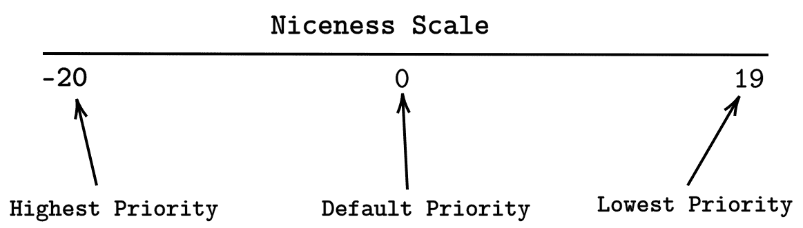
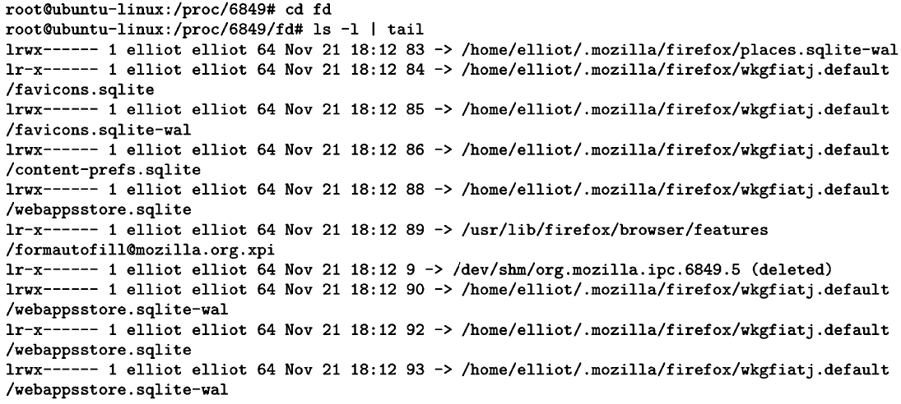
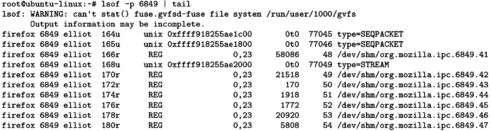

Kill the Process

系统上运行的任何程序都是一个进程。在这一章中，您将了解所有关于 Linux 进程的知识。您将学习如何查看流程信息。您还将学习如何向流程发送不同的信号。此外，您将了解前台和后台进程之间的差异。

# 什么是流程？

进程只是一个正在运行的程序的实例。所以在你的系统上运行的任何程序都是一个过程。以下都是流程示例:

*   火狐或者任何运行在你系统上的网络浏览器都是一个过程。
*   您现在运行的终端是一个进程。
*   你在系统上玩的任何游戏都是一个过程。
*   复制文件是一个过程。

就像文件的情况一样，每个进程都由特定的用户拥有。流程的所有者只是启动该流程的用户。

要列出特定用户拥有的所有进程，您可以运行命令`ps -u`，后跟用户名:

```sh
ps -u username
```

例如，要列出`elliot`拥有的所有进程，您可以运行:

```sh
root@ubuntu-linux:~# ps -u elliot
 PID TTY       TIME CMD
1365 ?     00:00:00 systemd
1366 ?     00:00:00 (sd-pam)
1379 ?     00:00:00 gnome-keyring-d
1383 tty2  00:00:00 gdm-x-session
1385 tty2  00:00:18 Xorg
1389 ?     00:00:00 dbus-daemon
1393 tty2  00:00:00 gnome-session-b
1725 ?     00:00:00 ssh-agent
1797 ?     00:00:00 gvfsd
. 
. 
. 
.
```

输出的第一列列出了**进程标识符** ( **进程标识符**)。PID 是唯一标识一个进程的数字，就像文件`inodes`一样。输出的最后一列列出了流程名称。

您可以使用`ps -e`命令列出系统上运行的所有进程:

```sh
root@ubuntu-linux:~# ps -e 
PID TTY     TIME  CMD
1  ?     00:00:01 systemd
2  ?     00:00:00 kthreadd
4  ?     00:00:00 kworker/0:0H
6  ?     00:00:00 mm_percpu_wq
7  ?     00:00:00 ksoftirqd/0
8  ?     00:00:00 rcu_sched
9  ?     00:00:00 rcu_bh
10 ?     00:00:00 migration/0
11 ?     00:00:00 watchdog/0
12 ?     00:00:00 cpuhp/0
13 ?     00:00:00 kdevtmpfs
.
.
.
.
```

您也可以使用`-f`选项获取更多信息:

```sh
root@ubuntu-linux:~# ps -ef
UID    PID  PPID C STIME TTY    TIME    CMD
root      1    0 0 11:23    ? 00:00:01 /sbin/init splash
root      2    0 0 11:23    ? 00:00:00 [kthreadd]
root      4    2 0 11:23    ? 00:00:00 [kworker/0:0H]
root      6    2 0 11:23    ? 00:00:00 [mm_percpu_wq]
root      7    2 0 11:23    ? 00:00:00 [ksoftirqd/0]
root      8    2 0 11:23    ? 00:00:01 [rcu_sched]
root      9    2 0 11:23    ? 00:00:00 [rcu_bh]
root     10    2 0 11:23    ? 00:00:00 [migration/0]
elliot 1835 1393 1 11:25 tty2 00:00:58 /usr/bin/gnome-shell
elliot 1853 1835 0 11:25 tty2 00:00:00 ibus-daemon --xim --panel disable
elliot 1857 1365 0 11:25    ? 00:00:00 /usr/lib/gnome-shell/gnome-shell
elliot 1865 1853 0 11:25 tty2 00:00:00 /usr/lib/ibus/ibus-dconf
elliot 1868    1 0 11:25 tty2 00:00:00 /usr/lib/ibus/ibus-x11 --kill-daemon
elliot 1871 1365 0 11:25    ? 00:00:00 /usr/lib/ibus/ibus-portal
. 
. 
. 
```

输出的第一列列出了进程所有者的用户名。输出的第三列列出了**父进程标识符** ( **PPIDs** )。什么是父进程？

# 父进程与子进程

父进程是已经启动一个或多个子进程的进程。一个完美的例子是你的终端和你的 bash shell 当您打开终端时，bash shell 也将启动。

要获取进程的 PID，可以使用`pgrep`命令，后跟进程名称:

```sh
pgrep process_name
```

例如，要获取终端进程的 PID，您可以运行:

```sh
elliot@ubuntu-linux:~$ pgrep terminal 
10009
```

我终端的 PID 是`10009`。现在，让我们得到 bash 过程的 PID:

```sh
elliot@ubuntu-linux:~$ pgrep bash 
10093
```

我的 bash shell 的 PID 是`10093`。现在，您可以通过使用跟随 bash PID 的`-p`选项获得 bash 进程的信息:

```sh
elliot@ubuntu-linux:~$ ps -fp 10093
UID     PID   PPID  C  STIME  TTY   TIME   CMD
elliot 10093 10009  0  13:37 pts/1 00:00:00 bash
```

从输出中可以看到，我的 bash 进程的 PPID 等于我的终端进程的 PID。这证明终端进程已经启动了 bash 进程。在这种情况下，bash 进程被称为终端进程的子进程:


Figure 1: Parent process versus child process

`top`命令是一个非常有用的命令，可以用来实时查看进程的信息。您可以查看其`man`页面了解如何使用:

```sh
elliot@ubuntu-linux:~$ man top 
```

下面的屏幕截图显示了前面命令的输出:


Figure 2: The top command

# 前台与后台进程

Linux 中有两种类型的进程:

*   前台流程

*   后台进程

前台进程是附加到您的终端的进程。您必须等待前台进程完成，才能继续使用您的终端。

另一方面，后台进程是没有附加到您的终端的进程，因此您可以在后台进程运行时使用您的终端。

`yes`命令输出重复跟随它的任何字符串，直到被杀死:

```sh
elliot@ubuntu-linux:~$ whatis yes
yes (1)               - output a string repeatedly until killed
```

例如，要在您的终端上重复输出单词`hello`，您可以运行以下命令:

```sh
elliot@ubuntu-linux:~$ yes hello 
hello
hello 
hello 
hello 
hello 
hello 
hello 
hello 
hello 
hello
.
.
.
```

请注意，它将继续运行，您不能在您的终端上做任何其他事情；这是前台进程的一个主要例子。要收回你的终端，你需要终止进程。点击 *Ctrl* + *C* 组合键，可以杀死进程，如下所示:

```sh
hello 
hello 
hello 
hello 
hello
^C
elliot@ubuntu-linux:~$

```

一按 *Ctrl* + *C* ，进程就会被杀死，你可以继续使用你的终端。让我们做另一个例子；您可以使用`firefox`命令从终端启动火狐:

```sh
elliot@ubuntu-linux:~$ firefox
```

火狐浏览器会启动，但在关闭火狐之前，你无法在终端上做任何事情；这是前台进程的另一个例子。现在，点击 *Ctrl* + *C* 杀死火狐进程，这样你就可以要回你的终端了。

通过添加&符号字符，您可以启动 Firefox 作为后台进程，如下所示:

```sh
elliot@ubuntu-linux:~$ firefox &
[1] 3468
elliot@ubuntu-linux:~$
```

火狐现在作为后台进程运行，你可以继续使用你的终端，而不必关闭火狐。

# 向进程发送信号

您可以通过信号与流程进行交互和交流。有各种各样的信号，每个信号都有不同的用途。要列出所有可用信号，您可以运行`kill -L`命令:

```sh
elliot@ubuntu-linux:~$ kill -L
1) SIGHUP 2) SIGINT 3) SIGQUIT 4) SIGILL 5) SIGTRAP
6) SIGABRT 7) SIGBUS 8) SIGFPE 9) SIGKILL 10) SIGUSR1
11) SIGSEGV 12) SIGUSR2 13) SIGPIPE 14) SIGALRM 15) SIGTERM
16) SIGSTKFLT 17) SIGCHLD 18) SIGCONT 19) SIGSTOP 20) SIGTSTP
21) SIGTTIN 22) SIGTTOU 23) SIGURG 24) SIGXCPU 25) SIGXFSZ
26) SIGVTALRM 27) SIGPROF 28) SIGWINCH 29) SIGIO 30) SIGPWR
31) SIGSYS 34) SIGRTMIN 35) SIGRTMIN+1 36) SIGRTMIN+2 37) SIGRTMIN+3
38) SIGRTMIN+4 39) SIGRTMIN+5 40) SIGRTMIN+6 41) SIGRTMIN+7 42) SIGRTMIN+8
43) SIGRTMIN+9 44) SIGRTMIN+10 45) SIGRTMIN+11 46) SIGRTMIN+12 47) SIGRTMIN+13
48) SIGRTMIN+14 49) SIGRTMIN+15 50) SIGRTMAX-14 51) SIGRTMAX-13 52) SIGRTMAX-12
53) SIGRTMAX-11 54) SIGRTMAX-10 55) SIGRTMAX-9 56) SIGRTMAX-8 57) SIGRTMAX-7
58) SIGRTMAX-6 59) SIGRTMAX-5 60) SIGRTMAX-4 61) SIGRTMAX-3 62) SIGRTMAX-2
63) SIGRTMAX-1 64) SIGRTMAX
```

请注意，每个信号都有一个数值。例如，`19`是`SIGSTOP`信号的数值。

要了解信号是如何工作的，让我们首先启动 Firefox 作为后台进程:

```sh
elliot@ubuntu-linux:~$ firefox &
[1] 4218
```

注意火狐的 PID 在我的系统上是`4218`。我可以通过发送`SIGKILL`信号杀死(终止)火狐，如下所示:

```sh
elliot@ubuntu-linux:~$ kill -SIGKILL 4218
[1]+ Killed             firefox
```

这将立即关闭火狐。您也可以使用`SIGKILL`信号的数值来代替:

```sh
elliot@ubuntu-linux:~$ kill -9 4218
```

一般来说，`kill`命令的语法如下:

```sh
kill -SIGNAL PID
```

让我们再次启动 Firefox 作为后台进程:

```sh
elliot@ubuntu-linux:~$ firefox & 
[1] 4907
```

注意火狐的 PID 在我的系统上是`4907`。现在开始在火狐上播放一段 YouTube 视频。完成后，回到你的终端，向火狐发送`SIGSTOP`信号:

```sh
elliot@ubuntu-linux:~$ kill -SIGSTOP 4907
```

你会注意到火狐变得没有反应，你的 YouTube 视频被停止；没问题——我们可以通过向火狐发送`SIGCONT` 信号来解决这个问题:

```sh
elliot@ubuntu-linux:~$ kill -SIGCONT 4907
```

这将复活火狐，你的 YouTube 视频现在将恢复。

到目前为止，您已经了解了三个信号:

*   `SIGKILL`:终止进程
*   `SIGSTOP`:停止一个进程
*   `SIGCONT`:继续一个过程

您可以在`pkill`命令中使用进程名称代替进程标识符。例如，要关闭终端进程，可以运行命令:

```sh
elliot@ubuntu-linux:~$ pkill -9 terminal
```

现在让我们做一些有趣的事情；打开您的终端并运行命令:

```sh
elliot@ubuntu-linux:~$ pkill -SIGSTOP terminal
```

哈哈！您的终端现已冻结。我会让你处理的！

您可以向进程发送许多其他信号；查看以下`man`页面，了解每个信号的使用:

```sh
elliot@ubuntu-linux:~$ man signal
```

# 处理流程优先级

每个过程都有一个优先级，优先级由精确等级决定，范围从 **-20** 到 **19** 。尼斯值越低，进程的优先级越高，因此 **-20** 的尼斯值赋予进程最高的优先级。另一方面， **19** 的一个很好的值给予一个过程最低的优先级:



Figure 3: The Niceness Scale

你可能会问自己:*为什么我们关心流程优先级？*答案是效率！你的 CPU 就像一个忙碌的餐厅里的服务员。一个有效率的服务员总是四处走动，以确保所有的顾客都得到愉快的服务。同样，您的 CPU 会将时间分配给系统上运行的所有进程。一个高优先级的进程得到了中央处理器的大量关注。另一方面，一个低优先级的进程不会得到中央处理器的太多关注。

## 查看流程优先级

启动 Firefox 作为后台进程:

```sh
elliot@ubuntu-linux:~$ firefox &
 [1] 6849
```

您可以使用`ps`命令查看流程的良好值:

```sh
elliot@ubuntu-linux:~$ ps -o nice -p 6849
NI
0
```

我的火狐进程有一个不错的值 **0** ，这是默认值(平均优先级)。

## 为新流程设定优先级

您可以使用`nice`命令以您想要的优先级开始一个过程。`nice`命令的一般语法如下:

```sh
nice -n -20 →19 process
```

假设您即将升级系统上的所有软件包；明智的做法是尽可能给予这一进程最高优先。为此，您可以作为`root`用户运行以下命令:

```sh
root@ubuntu-linux:~# nice -n -20 apt-get upgrade
```

## 更改流程优先级

您可以使用`renice`命令更改正在运行的进程的优先级。我们已经看到火狐运行时默认进程优先级为零；让我们更改 Firefox 的优先级，并赋予它尽可能低的优先级:

```sh
root@ubuntu-linux:~# renice -n 19 -p 6849
6849 (process ID) old priority 0, new priority 19
```

酷！现在希望火狐对我来说不会很慢；毕竟我只是告诉我的 CPU 不要太在意火狐！

# /proc 目录

Linux 中的每个进程都由`/proc`中的一个目录来表示。例如，如果你的火狐进程的 PID 为`6849`，那么目录`/proc/6849`将代表火狐进程:

```sh
root@ubuntu-linux:~# pgrep firefox
6849
root@ubuntu-linux:~# cd /proc/6849
root@ubuntu-linux:/proc/6849#
```

在一个过程的目录中，你可以找到很多关于这个过程的有价值和深刻的信息。例如，您会发现一个名为`exe`的软链接，指向流程的可执行文件:

```sh
root@ubuntu-linux:/proc/6849# ls -l exe
lrwxrwxrwx 1 elliot elliot 0 Nov 21 18:02 exe -> /usr/lib/firefox/firefox
```

您还会发现`status`文件，它存储了关于一个过程的各种信息；这些包括进程状态、PPID、进程使用的内存量等:

```sh
root@ubuntu-linux:/proc/6849# head status 
Name: firefox
Umask: 0022
State: S (sleeping) Tgid: 6849
Ngid: 0
Pid: 6849
PPid: 1990
TracerPid: 0
Uid: 1000 1000 1000 1000
Gid: 1000 1000 1000 1000
```

`limits`文件显示为过程设置的当前限制:

```sh
root@ubuntu-linux:/proc/7882# cat limits
Limit                  Soft Limit   Hard Limit   Units
Max cpu time           unlimited    unlimited    seconds
Max file size          unlimited    unlimited    bytes
Max data size          unlimited    unlimited    bytes
Max stack size         8388608      unlimited    bytes
Max core file size     0            unlimited    bytes
Max resident set       unlimited    unlimited    bytes
Max processes          15599        15599        processes
Max open files         4096         4096         files
Max locked memory      16777216     16777216     bytes
Max address space      unlimited    unlimited    bytes
Max file locks         unlimited    unlimited    locks
Max pending signals    15599        15599        signals
Max msgqueue size      819200       819200       bytes
Max nice priority      0            0 
Max realtime priority  0            0 
Max realtime timeout   unlimited    unlimited    us
```

`fd`目录将显示进程当前在您的系统上使用的所有文件:



Figure 4: fd directory

您也可以使用`lsof`命令列出进程正在使用的所有文件:



Figure 5: lsof command

# 知识检查

对于以下练习，打开您的终端并尝试解决以下任务:

1.  列出运行终端的进程标识。
2.  列出正在运行的终端的父进程标识。
3.  使用`kill`命令关闭终端。
4.  启动 Firefox 作为后台进程。
5.  将 Firefox 的优先级更改为最大优先级。